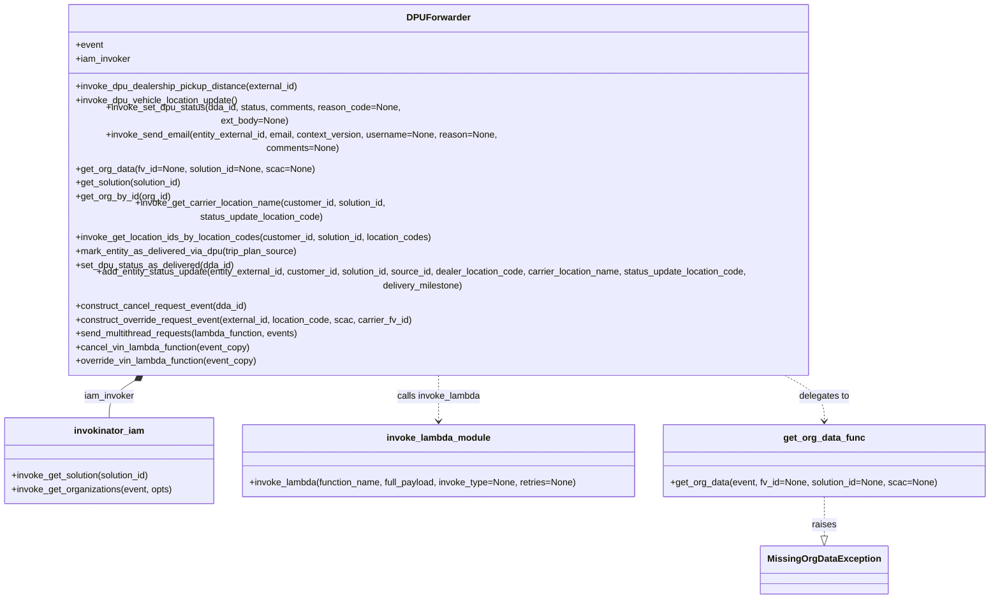
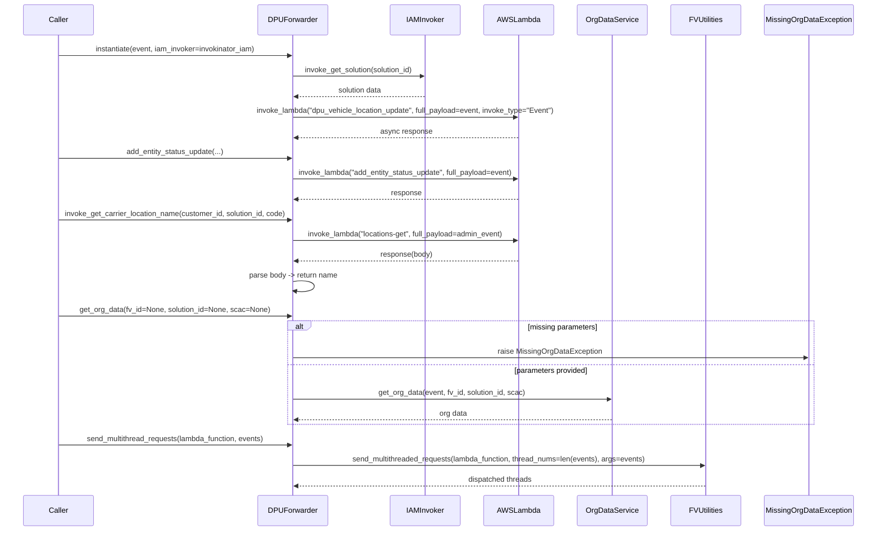

# Diagram: entity_core/entity_service/entity_service/dpu/dpu_service/forwarders/dpu_forwarder.py

> Auto-generated by Obscura crawlers

## Diagram 1

### SVG

<svg id="container" width="1730.140625" xmlns="http://www.w3.org/2000/svg" class="classDiagram" height="950" viewBox="0 0 1730.140625 950" role="graphics-document document" aria-roledescription="class"><g><defs><marker id="container_class-aggregationStart" class="marker aggregation class" refX="18" refY="7" markerWidth="190" markerHeight="240" orient="auto"><path d="M 18,7 L9,13 L1,7 L9,1 Z"></path></marker></defs><defs><marker id="container_class-aggregationEnd" class="marker aggregation class" refX="1" refY="7" markerWidth="20" markerHeight="28" orient="auto"><path d="M 18,7 L9,13 L1,7 L9,1 Z"></path></marker></defs><defs><marker id="container_class-extensionStart" class="marker extension class" refX="18" refY="7" markerWidth="190" markerHeight="240" orient="auto"><path d="M 1,7 L18,13 V 1 Z"></path></marker></defs><defs><marker id="container_class-extensionEnd" class="marker extension class" refX="1" refY="7" markerWidth="20" markerHeight="28" orient="auto"><path d="M 1,1 V 13 L18,7 Z"></path></marker></defs><defs><marker id="container_class-compositionStart" class="marker composition class" refX="18" refY="7" markerWidth="190" markerHeight="240" orient="auto"><path d="M 18,7 L9,13 L1,7 L9,1 Z"></path></marker></defs><defs><marker id="container_class-compositionEnd" class="marker composition class" refX="1" refY="7" markerWidth="20" markerHeight="28" orient="auto"><path d="M 18,7 L9,13 L1,7 L9,1 Z"></path></marker></defs><defs><marker id="container_class-dependencyStart" class="marker dependency class" refX="6" refY="7" markerWidth="190" markerHeight="240" orient="auto"><path d="M 5,7 L9,13 L1,7 L9,1 Z"></path></marker></defs><defs><marker id="container_class-dependencyEnd" class="marker dependency class" refX="13" refY="7" markerWidth="20" markerHeight="28" orient="auto"><path d="M 18,7 L9,13 L14,7 L9,1 Z"></path></marker></defs><defs><marker id="container_class-lollipopStart" class="marker lollipop class" refX="13" refY="7" markerWidth="190" markerHeight="240" orient="auto"><circle stroke="black" fill="transparent" cx="7" cy="7" r="6"></circle></marker></defs><defs><marker id="container_class-lollipopEnd" class="marker lollipop class" refX="1" refY="7" markerWidth="190" markerHeight="240" orient="auto"><circle stroke="black" fill="transparent" cx="7" cy="7" r="6"></circle></marker></defs><g class="root"><g class="clusters"></g><g class="edgePaths"><path d="M244.251,568.21L235.385,573.009C226.519,577.807,208.787,587.403,199.921,598.368C191.055,609.333,191.055,621.667,191.055,627.833L191.055,634" id="id_DPUForwarder_invokinator_iam_1" class="edge-thickness-normal edge-pattern-solid relation" style=";;;" data-edge="true" data-et="edge" data-id="id_DPUForwarder_invokinator_iam_1" data-points="W3sieCI6MjU5LjQyMTY2MjgzOTQ1Njg3LCJ5Ijo1NjB9LHsieCI6MTkxLjA1NDY4NzUsInkiOjU5N30seyJ4IjoxOTEuMDU0Njg3NSwieSI6NjM0fV0=" marker-start="url(#container_class-compositionStart)"></path><path d="M769.402,560L769.402,566.167C769.402,572.333,769.402,584.667,769.402,598C769.402,611.333,769.402,625.667,769.402,632.833L769.402,640" id="id_DPUForwarder_invoke_lambda_module_2" class="edge-thickness-normal edge-pattern-dashed relation" style=";;;" data-edge="true" data-et="edge" data-id="id_DPUForwarder_invoke_lambda_module_2" data-points="W3sieCI6NzY5LjQwMjM0Mzc1LCJ5Ijo1NjB9LHsieCI6NzY5LjQwMjM0Mzc1LCJ5Ijo1OTd9LHsieCI6NzY5LjQwMjM0Mzc1LCJ5Ijo2NDZ9XQ==" marker-end="url(#container_class-dependencyEnd)"></path><path d="M1363.742,560L1377.021,566.167C1390.301,572.333,1416.859,584.667,1430.139,598C1443.418,611.333,1443.418,625.667,1443.418,632.833L1443.418,640" id="id_DPUForwarder_get_org_data_func_3" class="edge-thickness-normal edge-pattern-dashed relation" style=";;;" data-edge="true" data-et="edge" data-id="id_DPUForwarder_get_org_data_func_3" data-points="W3sieCI6MTM2My43NDIwMDAyOTk1MjEsInkiOjU2MH0seyJ4IjoxNDQzLjQxNzk2ODc1LCJ5Ijo1OTd9LHsieCI6MTQ0My40MTc5Njg3NSwieSI6NjQ2fV0=" marker-end="url(#container_class-dependencyEnd)"></path><path d="M1443.418,772L1443.418,780.167C1443.418,788.333,1443.418,804.667,1443.418,816.125C1443.418,827.583,1443.418,834.167,1443.418,837.458L1443.418,840.75" id="id_get_org_data_func_MissingOrgDataException_4" class="edge-thickness-normal edge-pattern-dashed relation" style=";;;" data-edge="true" data-et="edge" data-id="id_get_org_data_func_MissingOrgDataException_4" data-points="W3sieCI6MTQ0My40MTc5Njg3NSwieSI6NzcyfSx7IngiOjE0NDMuNDE3OTY4NzUsInkiOjgyMX0seyJ4IjoxNDQzLjQxNzk2ODc1LCJ5Ijo4NTh9XQ==" marker-end="url(#container_class-extensionEnd)"></path></g><g class="edgeLabels"><g class="edgeLabel" transform="translate(191.0546875, 597)"><g class="label" data-id="id_DPUForwarder_invokinator_iam_1" transform="translate(-44.5625, -12)"><foreignObject width="89.125" height="24">

iam_invoker

</foreignObject></g></g><g class="edgeLabel" transform="translate(769.40234375, 597)"><g class="label" data-id="id_DPUForwarder_invoke_lambda_module_2" transform="translate(-73.734375, -12)"><foreignObject width="147.46875" height="24">

calls invoke_lambda

</foreignObject></g></g><g class="edgeLabel" transform="translate(1443.41796875, 597)"><g class="label" data-id="id_DPUForwarder_get_org_data_func_3" transform="translate(-44.59375, -12)"><foreignObject width="89.1875" height="24">

delegates to

</foreignObject></g></g><g class="edgeLabel" transform="translate(1443.41796875, 821)"><g class="label" data-id="id_get_org_data_func_MissingOrgDataException_4" transform="translate(-21.25, -12)"><foreignObject width="42.5" height="24">

raises

</foreignObject></g></g></g><g class="nodes"><g class="node default" id="classId-DPUForwarder-0" transform="translate(769.40234375, 284)"><g class="basic label-container"><path d="M-690.6015625 -276 L690.6015625 -276 L690.6015625 276 L-690.6015625 276" stroke="none" stroke-width="0" fill="#ECECFF" style=""></path><path d="M-690.6015625 -276 C-377.1488153633369 -276, -63.69606822667379 -276, 690.6015625 -276 M-690.6015625 -276 C-322.30244257880787 -276, 45.99667734238426 -276, 690.6015625 -276 M690.6015625 -276 C690.6015625 -163.899715188574, 690.6015625 -51.799430377147985, 690.6015625 276 M690.6015625 -276 C690.6015625 -58.44923778639571, 690.6015625 159.10152442720857, 690.6015625 276 M690.6015625 276 C224.12106350386392 276, -242.35943549227215 276, -690.6015625 276 M690.6015625 276 C382.10446376351115 276, 73.6073650270223 276, -690.6015625 276 M-690.6015625 276 C-690.6015625 70.99370109059012, -690.6015625 -134.01259781881976, -690.6015625 -276 M-690.6015625 276 C-690.6015625 158.54439752585608, -690.6015625 41.08879505171214, -690.6015625 -276" stroke="#9370DB" stroke-width="1.3" fill="none" stroke-dasharray="0 0" style=""></path></g><g class="annotation-group text" transform="translate(0, -252)"></g><g class="label-group text" transform="translate(-52.375, -252)"><g class="label" style="font-weight: bolder" transform="translate(0,-12)"><foreignObject width="104.75" height="24">

DPUForwarder

</foreignObject></g></g><g class="members-group text" transform="translate(-678.6015625, -204)"><g class="label" style="" transform="translate(0,-12)"><foreignObject width="48.328125" height="24">

+event

</foreignObject></g><g class="label" style="" transform="translate(0,12)"><foreignObject width="97.109375" height="24">

+iam_invoker

</foreignObject></g></g><g class="methods-group text" transform="translate(-678.6015625, -132)"><g class="label" style="" transform="translate(0,-12)"><foreignObject width="394.28125" height="24">

+invoke_dpu_dealership_pickup_distance(external_id)

</foreignObject></g><g class="label" style="" transform="translate(0,12)"><foreignObject width="287.6875" height="24">

+invoke_dpu_vehicle_location_update()

</foreignObject></g><g class="label" style="" transform="translate(0,36)"><foreignObject width="638.78125" height="24">

+invoke_set_dpu_status(dda_id, status, comments, reason_code=None, ext_body=None)

</foreignObject></g><g class="label" style="" transform="translate(0,60)"><foreignObject width="819.6875" height="24">

+invoke_send_email(entity_external_id, email, context_version, username=None, reason=None, comments=None)

</foreignObject></g><g class="label" style="" transform="translate(0,84)"><foreignObject width="416.53125" height="24">

+get_org_data(fv_id=None, solution_id=None, scac=None)

</foreignObject></g><g class="label" style="" transform="translate(0,108)"><foreignObject width="191.28125" height="24">

+get_solution(solution_id)

</foreignObject></g><g class="label" style="" transform="translate(0,132)"><foreignObject width="166.203125" height="24">

+get_org_by_id(org_id)

</foreignObject></g><g class="label" style="" transform="translate(0,156)"><foreignObject width="668.21875" height="24">

+invoke_get_carrier_location_name(customer_id, solution_id, status_update_location_code)

</foreignObject></g><g class="label" style="" transform="translate(0,180)"><foreignObject width="633.375" height="24">

+invoke_get_location_ids_by_location_codes(customer_id, solution_id, location_codes)

</foreignObject></g><g class="label" style="" transform="translate(0,204)"><foreignObject width="391.96875" height="24">

+mark_entity_as_delivered_via_dpu(trip_plan_source)

</foreignObject></g><g class="label" style="" transform="translate(0,228)"><foreignObject width="279.046875" height="24">

+set_dpu_status_as_delivered(dda_id)

</foreignObject></g><g class="label" style="" transform="translate(0,252)"><foreignObject width="1304.828125" height="24">

+add_entity_status_update(entity_external_id, customer_id, solution_id, source_id, dealer_location_code, carrier_location_name, status_update_location_code, delivery_milestone)

</foreignObject></g><g class="label" style="" transform="translate(0,276)"><foreignObject width="303.03125" height="24">

+construct_cancel_request_event(dda_id)

</foreignObject></g><g class="label" style="" transform="translate(0,300)"><foreignObject width="596.390625" height="24">

+construct_override_request_event(external_id, location_code, scac, carrier_fv_id)

</foreignObject></g><g class="label" style="" transform="translate(0,324)"><foreignObject width="397.9375" height="24">

+send_multithread_requests(lambda_function, events)

</foreignObject></g><g class="label" style="" transform="translate(0,348)"><foreignObject width="308.25" height="24">

+cancel_vin_lambda_function(event_copy)

</foreignObject></g><g class="label" style="" transform="translate(0,372)"><foreignObject width="322.578125" height="24">

+override_vin_lambda_function(event_copy)

</foreignObject></g></g><g class="divider" style=""><path d="M-690.6015625 -228 C-400.14339271884745 -228, -109.6852229376949 -228, 690.6015625 -228 M-690.6015625 -228 C-316.95191852798234 -228, 56.697725444035314 -228, 690.6015625 -228" stroke="#9370DB" stroke-width="1.3" fill="none" stroke-dasharray="0 0" style=""></path></g><g class="divider" style=""><path d="M-690.6015625 -156 C-319.8925737654688 -156, 50.81641496906241 -156, 690.6015625 -156 M-690.6015625 -156 C-212.43951199755838 -156, 265.72253850488323 -156, 690.6015625 -156" stroke="#9370DB" stroke-width="1.3" fill="none" stroke-dasharray="0 0" style=""></path></g></g><g class="node default" id="classId-MissingOrgDataException-1" transform="translate(1443.41796875, 900)"><g class="basic label-container"><path d="M-105.1328125 -42 L105.1328125 -42 L105.1328125 42 L-105.1328125 42" stroke="none" stroke-width="0" fill="#ECECFF" style=""></path><path d="M-105.1328125 -42 C-21.958438468027396 -42, 61.21593556394521 -42, 105.1328125 -42 M-105.1328125 -42 C-63.0455429556595 -42, -20.958273411319 -42, 105.1328125 -42 M105.1328125 -42 C105.1328125 -13.55649399185118, 105.1328125 14.88701201629764, 105.1328125 42 M105.1328125 -42 C105.1328125 -14.228360185967897, 105.1328125 13.543279628064205, 105.1328125 42 M105.1328125 42 C61.28115281648326 42, 17.429493132966513 42, -105.1328125 42 M105.1328125 42 C29.948841254617392 42, -45.235129990765216 42, -105.1328125 42 M-105.1328125 42 C-105.1328125 24.50874788152388, -105.1328125 7.017495763047762, -105.1328125 -42 M-105.1328125 42 C-105.1328125 16.15505353895111, -105.1328125 -9.689892922097783, -105.1328125 -42" stroke="#9370DB" stroke-width="1.3" fill="none" stroke-dasharray="0 0" style=""></path></g><g class="annotation-group text" transform="translate(0, -18)"></g><g class="label-group text" transform="translate(-93.1328125, -18)"><g class="label" style="font-weight: bolder" transform="translate(0,-12)"><foreignObject width="186.265625" height="24">

MissingOrgDataException

</foreignObject></g></g><g class="members-group text" transform="translate(-93.1328125, 30)"></g><g class="methods-group text" transform="translate(-93.1328125, 60)"></g><g class="divider" style=""><path d="M-105.1328125 6 C-45.12126780890031 6, 14.890276882199373 6, 105.1328125 6 M-105.1328125 6 C-35.23251966315631 6, 34.66777317368738 6, 105.1328125 6" stroke="#9370DB" stroke-width="1.3" fill="none" stroke-dasharray="0 0" style=""></path></g><g class="divider" style=""><path d="M-105.1328125 24 C-45.938300921959524 24, 13.256210656080953 24, 105.1328125 24 M-105.1328125 24 C-21.391974566228 24, 62.348863367544 24, 105.1328125 24" stroke="#9370DB" stroke-width="1.3" fill="none" stroke-dasharray="0 0" style=""></path></g></g><g class="node default" id="classId-invokinator_iam-2" transform="translate(191.0546875, 709)"><g class="basic label-container"><path d="M-183.0546875 -75 L183.0546875 -75 L183.0546875 75 L-183.0546875 75" stroke="none" stroke-width="0" fill="#ECECFF" style=""></path><path d="M-183.0546875 -75 C-75.6366488930005 -75, 31.781389713999005 -75, 183.0546875 -75 M-183.0546875 -75 C-57.72986098614524 -75, 67.59496552770952 -75, 183.0546875 -75 M183.0546875 -75 C183.0546875 -21.00150012373917, 183.0546875 32.99699975252166, 183.0546875 75 M183.0546875 -75 C183.0546875 -29.037184579336504, 183.0546875 16.925630841326992, 183.0546875 75 M183.0546875 75 C51.549327033752974 75, -79.95603343249405 75, -183.0546875 75 M183.0546875 75 C94.65184220947154 75, 6.248996918943078 75, -183.0546875 75 M-183.0546875 75 C-183.0546875 28.56159589936093, -183.0546875 -17.876808201278138, -183.0546875 -75 M-183.0546875 75 C-183.0546875 35.55262818586714, -183.0546875 -3.894743628265715, -183.0546875 -75" stroke="#9370DB" stroke-width="1.3" fill="none" stroke-dasharray="0 0" style=""></path></g><g class="annotation-group text" transform="translate(0, -51)"></g><g class="label-group text" transform="translate(-58.953125, -51)"><g class="label" style="font-weight: bolder" transform="translate(0,-12)"><foreignObject width="117.90625" height="24">

invokinator_iam

</foreignObject></g></g><g class="members-group text" transform="translate(-171.0546875, -3)"></g><g class="methods-group text" transform="translate(-171.0546875, 27)"><g class="label" style="" transform="translate(0,-12)"><foreignObject width="247.125" height="24">

+invoke_get_solution(solution_id)

</foreignObject></g><g class="label" style="" transform="translate(0,12)"><foreignObject width="283.15625" height="24">

+invoke_get_organizations(event, opts)

</foreignObject></g></g><g class="divider" style=""><path d="M-183.0546875 -27 C-48.7107106844644 -27, 85.6332661310712 -27, 183.0546875 -27 M-183.0546875 -27 C-97.96119350309822 -27, -12.86769950619643 -27, 183.0546875 -27" stroke="#9370DB" stroke-width="1.3" fill="none" stroke-dasharray="0 0" style=""></path></g><g class="divider" style=""><path d="M-183.0546875 -3 C-66.17643301914066 -3, 50.70182146171868 -3, 183.0546875 -3 M-183.0546875 -3 C-101.91346072342598 -3, -20.77223394685197 -3, 183.0546875 -3" stroke="#9370DB" stroke-width="1.3" fill="none" stroke-dasharray="0 0" style=""></path></g></g><g class="node default" id="classId-invoke_lambda_module-3" transform="translate(769.40234375, 709)"><g class="basic label-container"><path d="M-345.29296875 -63 L345.29296875 -63 L345.29296875 63 L-345.29296875 63" stroke="none" stroke-width="0" fill="#ECECFF" style=""></path><path d="M-345.29296875 -63 C-69.72275543992566 -63, 205.84745787014867 -63, 345.29296875 -63 M-345.29296875 -63 C-132.9426505370759 -63, 79.40766767584819 -63, 345.29296875 -63 M345.29296875 -63 C345.29296875 -26.989127862102343, 345.29296875 9.021744275795314, 345.29296875 63 M345.29296875 -63 C345.29296875 -37.19776135191947, 345.29296875 -11.395522703838935, 345.29296875 63 M345.29296875 63 C173.0693316533255 63, 0.845694556650983 63, -345.29296875 63 M345.29296875 63 C146.93570598580672 63, -51.42155677838656 63, -345.29296875 63 M-345.29296875 63 C-345.29296875 19.576511234411477, -345.29296875 -23.846977531177046, -345.29296875 -63 M-345.29296875 63 C-345.29296875 31.261016540826535, -345.29296875 -0.4779669183469295, -345.29296875 -63" stroke="#9370DB" stroke-width="1.3" fill="none" stroke-dasharray="0 0" style=""></path></g><g class="annotation-group text" transform="translate(0, -39)"></g><g class="label-group text" transform="translate(-87.3515625, -39)"><g class="label" style="font-weight: bolder" transform="translate(0,-12)"><foreignObject width="174.703125" height="24">

invoke_lambda_module

</foreignObject></g></g><g class="members-group text" transform="translate(-333.29296875, 9)"></g><g class="methods-group text" transform="translate(-333.29296875, 39)"><g class="label" style="" transform="translate(0,-12)"><foreignObject width="579.234375" height="24">

+invoke_lambda(function_name, full_payload, invoke_type=None, retries=None)

</foreignObject></g></g><g class="divider" style=""><path d="M-345.29296875 -15 C-106.42853899307082 -15, 132.43589076385837 -15, 345.29296875 -15 M-345.29296875 -15 C-111.68121407418639 -15, 121.93054060162723 -15, 345.29296875 -15" stroke="#9370DB" stroke-width="1.3" fill="none" stroke-dasharray="0 0" style=""></path></g><g class="divider" style=""><path d="M-345.29296875 9 C-170.5519083321082 9, 4.189152085783576 9, 345.29296875 9 M-345.29296875 9 C-204.65924829553583 9, -64.02552784107166 9, 345.29296875 9" stroke="#9370DB" stroke-width="1.3" fill="none" stroke-dasharray="0 0" style=""></path></g></g><g class="node default" id="classId-get_org_data_func-4" transform="translate(1443.41796875, 709)"><g class="basic label-container"><path d="M-278.72265625 -63 L278.72265625 -63 L278.72265625 63 L-278.72265625 63" stroke="none" stroke-width="0" fill="#ECECFF" style=""></path><path d="M-278.72265625 -63 C-77.65152055204678 -63, 123.41961514590645 -63, 278.72265625 -63 M-278.72265625 -63 C-60.646987397648644 -63, 157.4286814547027 -63, 278.72265625 -63 M278.72265625 -63 C278.72265625 -15.779660916015722, 278.72265625 31.440678167968557, 278.72265625 63 M278.72265625 -63 C278.72265625 -32.74228676816871, 278.72265625 -2.4845735363374146, 278.72265625 63 M278.72265625 63 C151.22872651137362 63, 23.734796772747274 63, -278.72265625 63 M278.72265625 63 C133.5779778759262 63, -11.566700498147611 63, -278.72265625 63 M-278.72265625 63 C-278.72265625 18.44161853776584, -278.72265625 -26.11676292446832, -278.72265625 -63 M-278.72265625 63 C-278.72265625 13.65695900532102, -278.72265625 -35.68608198935796, -278.72265625 -63" stroke="#9370DB" stroke-width="1.3" fill="none" stroke-dasharray="0 0" style=""></path></g><g class="annotation-group text" transform="translate(0, -39)"></g><g class="label-group text" transform="translate(-68.4296875, -39)"><g class="label" style="font-weight: bolder" transform="translate(0,-12)"><foreignObject width="136.859375" height="24">

get_org_data_func

</foreignObject></g></g><g class="members-group text" transform="translate(-266.72265625, 9)"></g><g class="methods-group text" transform="translate(-266.72265625, 39)"><g class="label" style="" transform="translate(0,-12)"><foreignObject width="465.015625" height="24">

+get_org_data(event, fv_id=None, solution_id=None, scac=None)

</foreignObject></g></g><g class="divider" style=""><path d="M-278.72265625 -15 C-89.25112019794332 -15, 100.22041585411336 -15, 278.72265625 -15 M-278.72265625 -15 C-82.16711194481255 -15, 114.3884323603749 -15, 278.72265625 -15" stroke="#9370DB" stroke-width="1.3" fill="none" stroke-dasharray="0 0" style=""></path></g><g class="divider" style=""><path d="M-278.72265625 9 C-72.69225981290393 9, 133.33813662419215 9, 278.72265625 9 M-278.72265625 9 C-125.36150176341422 9, 27.99965272317155 9, 278.72265625 9" stroke="#9370DB" stroke-width="1.3" fill="none" stroke-dasharray="0 0" style=""></path></g></g></g></g></g></svg>

## Diagram 2

### SVG

<svg id="container" width="1964" xmlns="http://www.w3.org/2000/svg" height="1213" viewBox="-50 -10 1964 1213" role="graphics-document document" aria-roledescription="sequence"><g><rect x="1661" y="1127" fill="#eaeaea" stroke="#666" width="203" height="65" name="MissingOrgDataException" rx="3" ry="3" class="actor actor-bottom"></rect><text x="1762.5" y="1159.5" dominant-baseline="central" alignment-baseline="central" class="actor actor-box" style="text-anchor: middle; font-size: 16px; font-weight: 400;"><tspan x="1762.5" dy="0">MissingOrgDataException</tspan></text></g><g><rect x="1461" y="1127" fill="#eaeaea" stroke="#666" width="150" height="65" name="FVUtilities" rx="3" ry="3" class="actor actor-bottom"></rect><text x="1536" y="1159.5" dominant-baseline="central" alignment-baseline="central" class="actor actor-box" style="text-anchor: middle; font-size: 16px; font-weight: 400;"><tspan x="1536" dy="0">FVUtilities</tspan></text></g><g><rect x="1261" y="1127" fill="#eaeaea" stroke="#666" width="150" height="65" name="OrgDataService" rx="3" ry="3" class="actor actor-bottom"></rect><text x="1336" y="1159.5" dominant-baseline="central" alignment-baseline="central" class="actor actor-box" style="text-anchor: middle; font-size: 16px; font-weight: 400;"><tspan x="1336" dy="0">OrgDataService</tspan></text></g><g><rect x="1061" y="1127" fill="#eaeaea" stroke="#666" width="150" height="65" name="AWSLambda" rx="3" ry="3" class="actor actor-bottom"></rect><text x="1136" y="1159.5" dominant-baseline="central" alignment-baseline="central" class="actor actor-box" style="text-anchor: middle; font-size: 16px; font-weight: 400;"><tspan x="1136" dy="0">AWSLambda</tspan></text></g><g><rect x="861" y="1127" fill="#eaeaea" stroke="#666" width="150" height="65" name="IAMInvoker" rx="3" ry="3" class="actor actor-bottom"></rect><text x="936" y="1159.5" dominant-baseline="central" alignment-baseline="central" class="actor actor-box" style="text-anchor: middle; font-size: 16px; font-weight: 400;"><tspan x="936" dy="0">IAMInvoker</tspan></text></g><g><rect x="552" y="1127" fill="#eaeaea" stroke="#666" width="150" height="65" name="DPUForwarder" rx="3" ry="3" class="actor actor-bottom"></rect><text x="627" y="1159.5" dominant-baseline="central" alignment-baseline="central" class="actor actor-box" style="text-anchor: middle; font-size: 16px; font-weight: 400;"><tspan x="627" dy="0">DPUForwarder</tspan></text></g><g><rect x="0" y="1127" fill="#eaeaea" stroke="#666" width="150" height="65" name="Caller" rx="3" ry="3" class="actor actor-bottom"></rect><text x="75" y="1159.5" dominant-baseline="central" alignment-baseline="central" class="actor actor-box" style="text-anchor: middle; font-size: 16px; font-weight: 400;"><tspan x="75" dy="0">Caller</tspan></text></g><g><line id="actor6" x1="1762.5" y1="65" x2="1762.5" y2="1127" class="actor-line 200" stroke-width="0.5px" stroke="#999" name="MissingOrgDataException"></line><g id="root-6"><rect x="1661" y="0" fill="#eaeaea" stroke="#666" width="203" height="65" name="MissingOrgDataException" rx="3" ry="3" class="actor actor-top"></rect><text x="1762.5" y="32.5" dominant-baseline="central" alignment-baseline="central" class="actor actor-box" style="text-anchor: middle; font-size: 16px; font-weight: 400;"><tspan x="1762.5" dy="0">MissingOrgDataException</tspan></text></g></g><g><line id="actor5" x1="1536" y1="65" x2="1536" y2="1127" class="actor-line 200" stroke-width="0.5px" stroke="#999" name="FVUtilities"></line><g id="root-5"><rect x="1461" y="0" fill="#eaeaea" stroke="#666" width="150" height="65" name="FVUtilities" rx="3" ry="3" class="actor actor-top"></rect><text x="1536" y="32.5" dominant-baseline="central" alignment-baseline="central" class="actor actor-box" style="text-anchor: middle; font-size: 16px; font-weight: 400;"><tspan x="1536" dy="0">FVUtilities</tspan></text></g></g><g><line id="actor4" x1="1336" y1="65" x2="1336" y2="1127" class="actor-line 200" stroke-width="0.5px" stroke="#999" name="OrgDataService"></line><g id="root-4"><rect x="1261" y="0" fill="#eaeaea" stroke="#666" width="150" height="65" name="OrgDataService" rx="3" ry="3" class="actor actor-top"></rect><text x="1336" y="32.5" dominant-baseline="central" alignment-baseline="central" class="actor actor-box" style="text-anchor: middle; font-size: 16px; font-weight: 400;"><tspan x="1336" dy="0">OrgDataService</tspan></text></g></g><g><line id="actor3" x1="1136" y1="65" x2="1136" y2="1127" class="actor-line 200" stroke-width="0.5px" stroke="#999" name="AWSLambda"></line><g id="root-3"><rect x="1061" y="0" fill="#eaeaea" stroke="#666" width="150" height="65" name="AWSLambda" rx="3" ry="3" class="actor actor-top"></rect><text x="1136" y="32.5" dominant-baseline="central" alignment-baseline="central" class="actor actor-box" style="text-anchor: middle; font-size: 16px; font-weight: 400;"><tspan x="1136" dy="0">AWSLambda</tspan></text></g></g><g><line id="actor2" x1="936" y1="65" x2="936" y2="1127" class="actor-line 200" stroke-width="0.5px" stroke="#999" name="IAMInvoker"></line><g id="root-2"><rect x="861" y="0" fill="#eaeaea" stroke="#666" width="150" height="65" name="IAMInvoker" rx="3" ry="3" class="actor actor-top"></rect><text x="936" y="32.5" dominant-baseline="central" alignment-baseline="central" class="actor actor-box" style="text-anchor: middle; font-size: 16px; font-weight: 400;"><tspan x="936" dy="0">IAMInvoker</tspan></text></g></g><g><line id="actor1" x1="627" y1="65" x2="627" y2="1127" class="actor-line 200" stroke-width="0.5px" stroke="#999" name="DPUForwarder"></line><g id="root-1"><rect x="552" y="0" fill="#eaeaea" stroke="#666" width="150" height="65" name="DPUForwarder" rx="3" ry="3" class="actor actor-top"></rect><text x="627" y="32.5" dominant-baseline="central" alignment-baseline="central" class="actor actor-box" style="text-anchor: middle; font-size: 16px; font-weight: 400;"><tspan x="627" dy="0">DPUForwarder</tspan></text></g></g><g><line id="actor0" x1="75" y1="65" x2="75" y2="1127" class="actor-line 200" stroke-width="0.5px" stroke="#999" name="Caller"></line><g id="root-0"><rect x="0" y="0" fill="#eaeaea" stroke="#666" width="150" height="65" name="Caller" rx="3" ry="3" class="actor actor-top"></rect><text x="75" y="32.5" dominant-baseline="central" alignment-baseline="central" class="actor actor-box" style="text-anchor: middle; font-size: 16px; font-weight: 400;"><tspan x="75" dy="0">Caller</tspan></text></g></g><g></g><defs><symbol id="computer" width="24" height="24"><path transform="scale(.5)" d="M2 2v13h20v-13h-20zm18 11h-16v-9h16v9zm-10.228 6l.466-1h3.524l.467 1h-4.457zm14.228 3h-24l2-6h2.104l-1.33 4h18.45l-1.297-4h2.073l2 6zm-5-10h-14v-7h14v7z"></path></symbol></defs><defs><symbol id="database" fill-rule="evenodd" clip-rule="evenodd"><path transform="scale(.5)" d="M12.258.001l.256.004.255.005.253.008.251.01.249.012.247.015.246.016.242.019.241.02.239.023.236.024.233.027.231.028.229.031.225.032.223.034.22.036.217.038.214.04.211.041.208.043.205.045.201.046.198.048.194.05.191.051.187.053.183.054.18.056.175.057.172.059.168.06.163.061.16.063.155.064.15.066.074.033.073.033.071.034.07.034.069.035.068.035.067.035.066.035.064.036.064.036.062.036.06.036.06.037.058.037.058.037.055.038.055.038.053.038.052.038.051.039.05.039.048.039.047.039.045.04.044.04.043.04.041.04.04.041.039.041.037.041.036.041.034.041.033.042.032.042.03.042.029.042.027.042.026.043.024.043.023.043.021.043.02.043.018.044.017.043.015.044.013.044.012.044.011.045.009.044.007.045.006.045.004.045.002.045.001.045v17l-.001.045-.002.045-.004.045-.006.045-.007.045-.009.044-.011.045-.012.044-.013.044-.015.044-.017.043-.018.044-.02.043-.021.043-.023.043-.024.043-.026.043-.027.042-.029.042-.03.042-.032.042-.033.042-.034.041-.036.041-.037.041-.039.041-.04.041-.041.04-.043.04-.044.04-.045.04-.047.039-.048.039-.05.039-.051.039-.052.038-.053.038-.055.038-.055.038-.058.037-.058.037-.06.037-.06.036-.062.036-.064.036-.064.036-.066.035-.067.035-.068.035-.069.035-.07.034-.071.034-.073.033-.074.033-.15.066-.155.064-.16.063-.163.061-.168.06-.172.059-.175.057-.18.056-.183.054-.187.053-.191.051-.194.05-.198.048-.201.046-.205.045-.208.043-.211.041-.214.04-.217.038-.22.036-.223.034-.225.032-.229.031-.231.028-.233.027-.236.024-.239.023-.241.02-.242.019-.246.016-.247.015-.249.012-.251.01-.253.008-.255.005-.256.004-.258.001-.258-.001-.256-.004-.255-.005-.253-.008-.251-.01-.249-.012-.247-.015-.245-.016-.243-.019-.241-.02-.238-.023-.236-.024-.234-.027-.231-.028-.228-.031-.226-.032-.223-.034-.22-.036-.217-.038-.214-.04-.211-.041-.208-.043-.204-.045-.201-.046-.198-.048-.195-.05-.19-.051-.187-.053-.184-.054-.179-.056-.176-.057-.172-.059-.167-.06-.164-.061-.159-.063-.155-.064-.151-.066-.074-.033-.072-.033-.072-.034-.07-.034-.069-.035-.068-.035-.067-.035-.066-.035-.064-.036-.063-.036-.062-.036-.061-.036-.06-.037-.058-.037-.057-.037-.056-.038-.055-.038-.053-.038-.052-.038-.051-.039-.049-.039-.049-.039-.046-.039-.046-.04-.044-.04-.043-.04-.041-.04-.04-.041-.039-.041-.037-.041-.036-.041-.034-.041-.033-.042-.032-.042-.03-.042-.029-.042-.027-.042-.026-.043-.024-.043-.023-.043-.021-.043-.02-.043-.018-.044-.017-.043-.015-.044-.013-.044-.012-.044-.011-.045-.009-.044-.007-.045-.006-.045-.004-.045-.002-.045-.001-.045v-17l.001-.045.002-.045.004-.045.006-.045.007-.045.009-.044.011-.045.012-.044.013-.044.015-.044.017-.043.018-.044.02-.043.021-.043.023-.043.024-.043.026-.043.027-.042.029-.042.03-.042.032-.042.033-.042.034-.041.036-.041.037-.041.039-.041.04-.041.041-.04.043-.04.044-.04.046-.04.046-.039.049-.039.049-.039.051-.039.052-.038.053-.038.055-.038.056-.038.057-.037.058-.037.06-.037.061-.036.062-.036.063-.036.064-.036.066-.035.067-.035.068-.035.069-.035.07-.034.072-.034.072-.033.074-.033.151-.066.155-.064.159-.063.164-.061.167-.06.172-.059.176-.057.179-.056.184-.054.187-.053.19-.051.195-.05.198-.048.201-.046.204-.045.208-.043.211-.041.214-.04.217-.038.22-.036.223-.034.226-.032.228-.031.231-.028.234-.027.236-.024.238-.023.241-.02.243-.019.245-.016.247-.015.249-.012.251-.01.253-.008.255-.005.256-.004.258-.001.258.001zm-9.258 20.499v.01l.001.021.003.021.004.022.005.021.006.022.007.022.009.023.01.022.011.023.012.023.013.023.015.023.016.024.017.023.018.024.019.024.021.024.022.025.023.024.024.025.052.049.056.05.061.051.066.051.07.051.075.051.079.052.084.052.088.052.092.052.097.052.102.051.105.052.11.052.114.051.119.051.123.051.127.05.131.05.135.05.139.048.144.049.147.047.152.047.155.047.16.045.163.045.167.043.171.043.176.041.178.041.183.039.187.039.19.037.194.035.197.035.202.033.204.031.209.03.212.029.216.027.219.025.222.024.226.021.23.02.233.018.236.016.24.015.243.012.246.01.249.008.253.005.256.004.259.001.26-.001.257-.004.254-.005.25-.008.247-.011.244-.012.241-.014.237-.016.233-.018.231-.021.226-.021.224-.024.22-.026.216-.027.212-.028.21-.031.205-.031.202-.034.198-.034.194-.036.191-.037.187-.039.183-.04.179-.04.175-.042.172-.043.168-.044.163-.045.16-.046.155-.046.152-.047.148-.048.143-.049.139-.049.136-.05.131-.05.126-.05.123-.051.118-.052.114-.051.11-.052.106-.052.101-.052.096-.052.092-.052.088-.053.083-.051.079-.052.074-.052.07-.051.065-.051.06-.051.056-.05.051-.05.023-.024.023-.025.021-.024.02-.024.019-.024.018-.024.017-.024.015-.023.014-.024.013-.023.012-.023.01-.023.01-.022.008-.022.006-.022.006-.022.004-.022.004-.021.001-.021.001-.021v-4.127l-.077.055-.08.053-.083.054-.085.053-.087.052-.09.052-.093.051-.095.05-.097.05-.1.049-.102.049-.105.048-.106.047-.109.047-.111.046-.114.045-.115.045-.118.044-.12.043-.122.042-.124.042-.126.041-.128.04-.13.04-.132.038-.134.038-.135.037-.138.037-.139.035-.142.035-.143.034-.144.033-.147.032-.148.031-.15.03-.151.03-.153.029-.154.027-.156.027-.158.026-.159.025-.161.024-.162.023-.163.022-.165.021-.166.02-.167.019-.169.018-.169.017-.171.016-.173.015-.173.014-.175.013-.175.012-.177.011-.178.01-.179.008-.179.008-.181.006-.182.005-.182.004-.184.003-.184.002h-.37l-.184-.002-.184-.003-.182-.004-.182-.005-.181-.006-.179-.008-.179-.008-.178-.01-.176-.011-.176-.012-.175-.013-.173-.014-.172-.015-.171-.016-.17-.017-.169-.018-.167-.019-.166-.02-.165-.021-.163-.022-.162-.023-.161-.024-.159-.025-.157-.026-.156-.027-.155-.027-.153-.029-.151-.03-.15-.03-.148-.031-.146-.032-.145-.033-.143-.034-.141-.035-.14-.035-.137-.037-.136-.037-.134-.038-.132-.038-.13-.04-.128-.04-.126-.041-.124-.042-.122-.042-.12-.044-.117-.043-.116-.045-.113-.045-.112-.046-.109-.047-.106-.047-.105-.048-.102-.049-.1-.049-.097-.05-.095-.05-.093-.052-.09-.051-.087-.052-.085-.053-.083-.054-.08-.054-.077-.054v4.127zm0-5.654v.011l.001.021.003.021.004.021.005.022.006.022.007.022.009.022.01.022.011.023.012.023.013.023.015.024.016.023.017.024.018.024.019.024.021.024.022.024.023.025.024.024.052.05.056.05.061.05.066.051.07.051.075.052.079.051.084.052.088.052.092.052.097.052.102.052.105.052.11.051.114.051.119.052.123.05.127.051.131.05.135.049.139.049.144.048.147.048.152.047.155.046.16.045.163.045.167.044.171.042.176.042.178.04.183.04.187.038.19.037.194.036.197.034.202.033.204.032.209.03.212.028.216.027.219.025.222.024.226.022.23.02.233.018.236.016.24.014.243.012.246.01.249.008.253.006.256.003.259.001.26-.001.257-.003.254-.006.25-.008.247-.01.244-.012.241-.015.237-.016.233-.018.231-.02.226-.022.224-.024.22-.025.216-.027.212-.029.21-.03.205-.032.202-.033.198-.035.194-.036.191-.037.187-.039.183-.039.179-.041.175-.042.172-.043.168-.044.163-.045.16-.045.155-.047.152-.047.148-.048.143-.048.139-.05.136-.049.131-.05.126-.051.123-.051.118-.051.114-.052.11-.052.106-.052.101-.052.096-.052.092-.052.088-.052.083-.052.079-.052.074-.051.07-.052.065-.051.06-.05.056-.051.051-.049.023-.025.023-.024.021-.025.02-.024.019-.024.018-.024.017-.024.015-.023.014-.023.013-.024.012-.022.01-.023.01-.023.008-.022.006-.022.006-.022.004-.021.004-.022.001-.021.001-.021v-4.139l-.077.054-.08.054-.083.054-.085.052-.087.053-.09.051-.093.051-.095.051-.097.05-.1.049-.102.049-.105.048-.106.047-.109.047-.111.046-.114.045-.115.044-.118.044-.12.044-.122.042-.124.042-.126.041-.128.04-.13.039-.132.039-.134.038-.135.037-.138.036-.139.036-.142.035-.143.033-.144.033-.147.033-.148.031-.15.03-.151.03-.153.028-.154.028-.156.027-.158.026-.159.025-.161.024-.162.023-.163.022-.165.021-.166.02-.167.019-.169.018-.169.017-.171.016-.173.015-.173.014-.175.013-.175.012-.177.011-.178.009-.179.009-.179.007-.181.007-.182.005-.182.004-.184.003-.184.002h-.37l-.184-.002-.184-.003-.182-.004-.182-.005-.181-.007-.179-.007-.179-.009-.178-.009-.176-.011-.176-.012-.175-.013-.173-.014-.172-.015-.171-.016-.17-.017-.169-.018-.167-.019-.166-.02-.165-.021-.163-.022-.162-.023-.161-.024-.159-.025-.157-.026-.156-.027-.155-.028-.153-.028-.151-.03-.15-.03-.148-.031-.146-.033-.145-.033-.143-.033-.141-.035-.14-.036-.137-.036-.136-.037-.134-.038-.132-.039-.13-.039-.128-.04-.126-.041-.124-.042-.122-.043-.12-.043-.117-.044-.116-.044-.113-.046-.112-.046-.109-.046-.106-.047-.105-.048-.102-.049-.1-.049-.097-.05-.095-.051-.093-.051-.09-.051-.087-.053-.085-.052-.083-.054-.08-.054-.077-.054v4.139zm0-5.666v.011l.001.02.003.022.004.021.005.022.006.021.007.022.009.023.01.022.011.023.012.023.013.023.015.023.016.024.017.024.018.023.019.024.021.025.022.024.023.024.024.025.052.05.056.05.061.05.066.051.07.051.075.052.079.051.084.052.088.052.092.052.097.052.102.052.105.051.11.052.114.051.119.051.123.051.127.05.131.05.135.05.139.049.144.048.147.048.152.047.155.046.16.045.163.045.167.043.171.043.176.042.178.04.183.04.187.038.19.037.194.036.197.034.202.033.204.032.209.03.212.028.216.027.219.025.222.024.226.021.23.02.233.018.236.017.24.014.243.012.246.01.249.008.253.006.256.003.259.001.26-.001.257-.003.254-.006.25-.008.247-.01.244-.013.241-.014.237-.016.233-.018.231-.02.226-.022.224-.024.22-.025.216-.027.212-.029.21-.03.205-.032.202-.033.198-.035.194-.036.191-.037.187-.039.183-.039.179-.041.175-.042.172-.043.168-.044.163-.045.16-.045.155-.047.152-.047.148-.048.143-.049.139-.049.136-.049.131-.051.126-.05.123-.051.118-.052.114-.051.11-.052.106-.052.101-.052.096-.052.092-.052.088-.052.083-.052.079-.052.074-.052.07-.051.065-.051.06-.051.056-.05.051-.049.023-.025.023-.025.021-.024.02-.024.019-.024.018-.024.017-.024.015-.023.014-.024.013-.023.012-.023.01-.022.01-.023.008-.022.006-.022.006-.022.004-.022.004-.021.001-.021.001-.021v-4.153l-.077.054-.08.054-.083.053-.085.053-.087.053-.09.051-.093.051-.095.051-.097.05-.1.049-.102.048-.105.048-.106.048-.109.046-.111.046-.114.046-.115.044-.118.044-.12.043-.122.043-.124.042-.126.041-.128.04-.13.039-.132.039-.134.038-.135.037-.138.036-.139.036-.142.034-.143.034-.144.033-.147.032-.148.032-.15.03-.151.03-.153.028-.154.028-.156.027-.158.026-.159.024-.161.024-.162.023-.163.023-.165.021-.166.02-.167.019-.169.018-.169.017-.171.016-.173.015-.173.014-.175.013-.175.012-.177.01-.178.01-.179.009-.179.007-.181.006-.182.006-.182.004-.184.003-.184.001-.185.001-.185-.001-.184-.001-.184-.003-.182-.004-.182-.006-.181-.006-.179-.007-.179-.009-.178-.01-.176-.01-.176-.012-.175-.013-.173-.014-.172-.015-.171-.016-.17-.017-.169-.018-.167-.019-.166-.02-.165-.021-.163-.023-.162-.023-.161-.024-.159-.024-.157-.026-.156-.027-.155-.028-.153-.028-.151-.03-.15-.03-.148-.032-.146-.032-.145-.033-.143-.034-.141-.034-.14-.036-.137-.036-.136-.037-.134-.038-.132-.039-.13-.039-.128-.041-.126-.041-.124-.041-.122-.043-.12-.043-.117-.044-.116-.044-.113-.046-.112-.046-.109-.046-.106-.048-.105-.048-.102-.048-.1-.05-.097-.049-.095-.051-.093-.051-.09-.052-.087-.052-.085-.053-.083-.053-.08-.054-.077-.054v4.153zm8.74-8.179l-.257.004-.254.005-.25.008-.247.011-.244.012-.241.014-.237.016-.233.018-.231.021-.226.022-.224.023-.22.026-.216.027-.212.028-.21.031-.205.032-.202.033-.198.034-.194.036-.191.038-.187.038-.183.04-.179.041-.175.042-.172.043-.168.043-.163.045-.16.046-.155.046-.152.048-.148.048-.143.048-.139.049-.136.05-.131.05-.126.051-.123.051-.118.051-.114.052-.11.052-.106.052-.101.052-.096.052-.092.052-.088.052-.083.052-.079.052-.074.051-.07.052-.065.051-.06.05-.056.05-.051.05-.023.025-.023.024-.021.024-.02.025-.019.024-.018.024-.017.023-.015.024-.014.023-.013.023-.012.023-.01.023-.01.022-.008.022-.006.023-.006.021-.004.022-.004.021-.001.021-.001.021.001.021.001.021.004.021.004.022.006.021.006.023.008.022.01.022.01.023.012.023.013.023.014.023.015.024.017.023.018.024.019.024.02.025.021.024.023.024.023.025.051.05.056.05.06.05.065.051.07.052.074.051.079.052.083.052.088.052.092.052.096.052.101.052.106.052.11.052.114.052.118.051.123.051.126.051.131.05.136.05.139.049.143.048.148.048.152.048.155.046.16.046.163.045.168.043.172.043.175.042.179.041.183.04.187.038.191.038.194.036.198.034.202.033.205.032.21.031.212.028.216.027.22.026.224.023.226.022.231.021.233.018.237.016.241.014.244.012.247.011.25.008.254.005.257.004.26.001.26-.001.257-.004.254-.005.25-.008.247-.011.244-.012.241-.014.237-.016.233-.018.231-.021.226-.022.224-.023.22-.026.216-.027.212-.028.21-.031.205-.032.202-.033.198-.034.194-.036.191-.038.187-.038.183-.04.179-.041.175-.042.172-.043.168-.043.163-.045.16-.046.155-.046.152-.048.148-.048.143-.048.139-.049.136-.05.131-.05.126-.051.123-.051.118-.051.114-.052.11-.052.106-.052.101-.052.096-.052.092-.052.088-.052.083-.052.079-.052.074-.051.07-.052.065-.051.06-.05.056-.05.051-.05.023-.025.023-.024.021-.024.02-.025.019-.024.018-.024.017-.023.015-.024.014-.023.013-.023.012-.023.01-.023.01-.022.008-.022.006-.023.006-.021.004-.022.004-.021.001-.021.001-.021-.001-.021-.001-.021-.004-.021-.004-.022-.006-.021-.006-.023-.008-.022-.01-.022-.01-.023-.012-.023-.013-.023-.014-.023-.015-.024-.017-.023-.018-.024-.019-.024-.02-.025-.021-.024-.023-.024-.023-.025-.051-.05-.056-.05-.06-.05-.065-.051-.07-.052-.074-.051-.079-.052-.083-.052-.088-.052-.092-.052-.096-.052-.101-.052-.106-.052-.11-.052-.114-.052-.118-.051-.123-.051-.126-.051-.131-.05-.136-.05-.139-.049-.143-.048-.148-.048-.152-.048-.155-.046-.16-.046-.163-.045-.168-.043-.172-.043-.175-.042-.179-.041-.183-.04-.187-.038-.191-.038-.194-.036-.198-.034-.202-.033-.205-.032-.21-.031-.212-.028-.216-.027-.22-.026-.224-.023-.226-.022-.231-.021-.233-.018-.237-.016-.241-.014-.244-.012-.247-.011-.25-.008-.254-.005-.257-.004-.26-.001-.26.001z"></path></symbol></defs><defs><symbol id="clock" width="24" height="24"><path transform="scale(.5)" d="M12 2c5.514 0 10 4.486 10 10s-4.486 10-10 10-10-4.486-10-10 4.486-10 10-10zm0-2c-6.627 0-12 5.373-12 12s5.373 12 12 12 12-5.373 12-12-5.373-12-12-12zm5.848 12.459c.202.038.202.333.001.372-1.907.361-6.045 1.111-6.547 1.111-.719 0-1.301-.582-1.301-1.301 0-.512.77-5.447 1.125-7.445.034-.192.312-.181.343.014l.985 6.238 5.394 1.011z"></path></symbol></defs><defs><marker id="arrowhead" refX="7.9" refY="5" markerUnits="userSpaceOnUse" markerWidth="12" markerHeight="12" orient="auto-start-reverse"><path d="M -1 0 L 10 5 L 0 10 z"></path></marker></defs><defs><marker id="crosshead" markerWidth="15" markerHeight="8" orient="auto" refX="4" refY="4.5"><path fill="none" stroke="#000000" stroke-width="1pt" d="M 1,2 L 6,7 M 6,2 L 1,7" style="stroke-dasharray: 0, 0;"></path></marker></defs><defs><marker id="filled-head" refX="15.5" refY="7" markerWidth="20" markerHeight="28" orient="auto"><path d="M 18,7 L9,13 L14,7 L9,1 Z"></path></marker></defs><defs><marker id="sequencenumber" refX="15" refY="15" markerWidth="60" markerHeight="40" orient="auto"><circle cx="15" cy="15" r="6"></circle></marker></defs><g><line x1="616" y1="729" x2="1773.5" y2="729" class="loopLine"></line><line x1="1773.5" y1="729" x2="1773.5" y2="963" class="loopLine"></line><line x1="616" y1="963" x2="1773.5" y2="963" class="loopLine"></line><line x1="616" y1="729" x2="616" y2="963" class="loopLine"></line><line x1="616" y1="827" x2="1773.5" y2="827" class="loopLine" style="stroke-dasharray: 3, 3;"></line><polygon points="616,729 666,729 666,742 657.6,749 616,749" class="labelBox"></polygon><text x="641" y="742" text-anchor="middle" dominant-baseline="middle" alignment-baseline="middle" class="labelText" style="font-size: 16px; font-weight: 400;">alt</text><text x="1219.75" y="747" text-anchor="middle" class="loopText" style="font-size: 16px; font-weight: 400;"><tspan x="1219.75">[missing parameters]</tspan></text><text x="1194.75" y="845" text-anchor="middle" class="loopText" style="font-size: 16px; font-weight: 400;">[parameters provided]</text></g><text x="350" y="80" text-anchor="middle" dominant-baseline="middle" alignment-baseline="middle" class="messageText" dy="1em" style="font-size: 16px; font-weight: 400;">instantiate(event, iam_invoker=invokinator_iam)</text><line x1="76" y1="113" x2="623" y2="113" class="messageLine0" stroke-width="2" stroke="none" marker-end="url(#arrowhead)" style="fill: none;"></line><text x="780" y="128" text-anchor="middle" dominant-baseline="middle" alignment-baseline="middle" class="messageText" dy="1em" style="font-size: 16px; font-weight: 400;">invoke_get_solution(solution_id)</text><line x1="628" y1="161" x2="932" y2="161" class="messageLine0" stroke-width="2" stroke="none" marker-end="url(#arrowhead)" style="fill: none;"></line><text x="783" y="176" text-anchor="middle" dominant-baseline="middle" alignment-baseline="middle" class="messageText" dy="1em" style="font-size: 16px; font-weight: 400;">solution data</text><line x1="935" y1="209" x2="631" y2="209" class="messageLine1" stroke-width="2" stroke="none" marker-end="url(#arrowhead)" style="stroke-dasharray: 3, 3; fill: none;"></line><text x="880" y="224" text-anchor="middle" dominant-baseline="middle" alignment-baseline="middle" class="messageText" dy="1em" style="font-size: 16px; font-weight: 400;">invoke_lambda("dpu_vehicle_location_update", full_payload=event, invoke_type="Event")</text><line x1="628" y1="257" x2="1132" y2="257" class="messageLine0" stroke-width="2" stroke="none" marker-end="url(#arrowhead)" style="fill: none;"></line><text x="883" y="272" text-anchor="middle" dominant-baseline="middle" alignment-baseline="middle" class="messageText" dy="1em" style="font-size: 16px; font-weight: 400;">async response</text><line x1="1135" y1="305" x2="631" y2="305" class="messageLine1" stroke-width="2" stroke="none" marker-end="url(#arrowhead)" style="stroke-dasharray: 3, 3; fill: none;"></line><text x="350" y="320" text-anchor="middle" dominant-baseline="middle" alignment-baseline="middle" class="messageText" dy="1em" style="font-size: 16px; font-weight: 400;">add_entity_status_update(...)</text><line x1="76" y1="353" x2="623" y2="353" class="messageLine0" stroke-width="2" stroke="none" marker-end="url(#arrowhead)" style="fill: none;"></line><text x="880" y="368" text-anchor="middle" dominant-baseline="middle" alignment-baseline="middle" class="messageText" dy="1em" style="font-size: 16px; font-weight: 400;">invoke_lambda("add_entity_status_update", full_payload=event)</text><line x1="628" y1="401" x2="1132" y2="401" class="messageLine0" stroke-width="2" stroke="none" marker-end="url(#arrowhead)" style="fill: none;"></line><text x="883" y="416" text-anchor="middle" dominant-baseline="middle" alignment-baseline="middle" class="messageText" dy="1em" style="font-size: 16px; font-weight: 400;">response</text><line x1="1135" y1="449" x2="631" y2="449" class="messageLine1" stroke-width="2" stroke="none" marker-end="url(#arrowhead)" style="stroke-dasharray: 3, 3; fill: none;"></line><text x="350" y="464" text-anchor="middle" dominant-baseline="middle" alignment-baseline="middle" class="messageText" dy="1em" style="font-size: 16px; font-weight: 400;">invoke_get_carrier_location_name(customer_id, solution_id, code)</text><line x1="76" y1="497" x2="623" y2="497" class="messageLine0" stroke-width="2" stroke="none" marker-end="url(#arrowhead)" style="fill: none;"></line><text x="880" y="512" text-anchor="middle" dominant-baseline="middle" alignment-baseline="middle" class="messageText" dy="1em" style="font-size: 16px; font-weight: 400;">invoke_lambda("locations-get", full_payload=admin_event)</text><line x1="628" y1="545" x2="1132" y2="545" class="messageLine0" stroke-width="2" stroke="none" marker-end="url(#arrowhead)" style="fill: none;"></line><text x="883" y="560" text-anchor="middle" dominant-baseline="middle" alignment-baseline="middle" class="messageText" dy="1em" style="font-size: 16px; font-weight: 400;">response(body)</text><line x1="1135" y1="593" x2="631" y2="593" class="messageLine1" stroke-width="2" stroke="none" marker-end="url(#arrowhead)" style="stroke-dasharray: 3, 3; fill: none;"></line><text x="628" y="608" text-anchor="middle" dominant-baseline="middle" alignment-baseline="middle" class="messageText" dy="1em" style="font-size: 16px; font-weight: 400;">parse body -&gt; return name</text><path d="M 628,641 C 688,631 688,671 628,661" class="messageLine0" stroke-width="2" stroke="none" marker-end="url(#arrowhead)" style="fill: none;"></path><text x="350" y="686" text-anchor="middle" dominant-baseline="middle" alignment-baseline="middle" class="messageText" dy="1em" style="font-size: 16px; font-weight: 400;">get_org_data(fv_id=None, solution_id=None, scac=None)</text><line x1="76" y1="719" x2="623" y2="719" class="messageLine0" stroke-width="2" stroke="none" marker-end="url(#arrowhead)" style="fill: none;"></line><text x="1193" y="779" text-anchor="middle" dominant-baseline="middle" alignment-baseline="middle" class="messageText" dy="1em" style="font-size: 16px; font-weight: 400;">raise MissingOrgDataException</text><line x1="628" y1="812" x2="1758.5" y2="812" class="messageLine0" stroke-width="2" stroke="none" marker-end="url(#arrowhead)" style="fill: none;"></line><text x="980" y="872" text-anchor="middle" dominant-baseline="middle" alignment-baseline="middle" class="messageText" dy="1em" style="font-size: 16px; font-weight: 400;">get_org_data(event, fv_id, solution_id, scac)</text><line x1="628" y1="905" x2="1332" y2="905" class="messageLine0" stroke-width="2" stroke="none" marker-end="url(#arrowhead)" style="fill: none;"></line><text x="983" y="920" text-anchor="middle" dominant-baseline="middle" alignment-baseline="middle" class="messageText" dy="1em" style="font-size: 16px; font-weight: 400;">org data</text><line x1="1335" y1="953" x2="631" y2="953" class="messageLine1" stroke-width="2" stroke="none" marker-end="url(#arrowhead)" style="stroke-dasharray: 3, 3; fill: none;"></line><text x="350" y="978" text-anchor="middle" dominant-baseline="middle" alignment-baseline="middle" class="messageText" dy="1em" style="font-size: 16px; font-weight: 400;">send_multithread_requests(lambda_function, events)</text><line x1="76" y1="1011" x2="623" y2="1011" class="messageLine0" stroke-width="2" stroke="none" marker-end="url(#arrowhead)" style="fill: none;"></line><text x="1080" y="1026" text-anchor="middle" dominant-baseline="middle" alignment-baseline="middle" class="messageText" dy="1em" style="font-size: 16px; font-weight: 400;">send_multithreaded_requests(lambda_function, thread_nums=len(events), args=events)</text><line x1="628" y1="1059" x2="1532" y2="1059" class="messageLine0" stroke-width="2" stroke="none" marker-end="url(#arrowhead)" style="fill: none;"></line><text x="1083" y="1074" text-anchor="middle" dominant-baseline="middle" alignment-baseline="middle" class="messageText" dy="1em" style="font-size: 16px; font-weight: 400;">dispatched threads</text><line x1="1535" y1="1107" x2="631" y2="1107" class="messageLine1" stroke-width="2" stroke="none" marker-end="url(#arrowhead)" style="stroke-dasharray: 3, 3; fill: none;"></line></svg>
