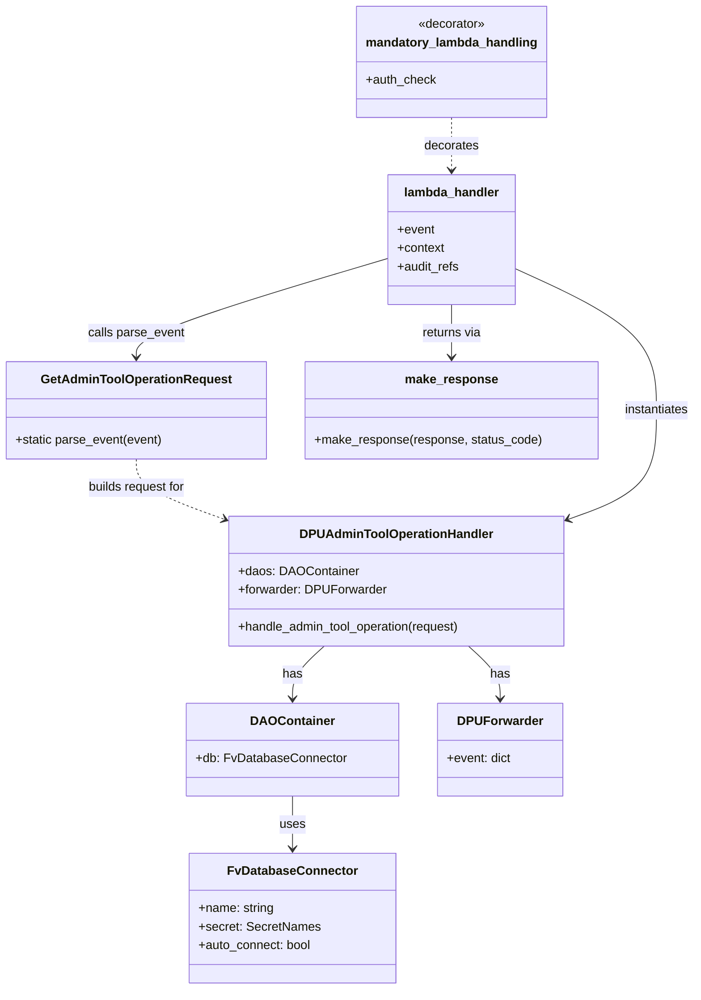
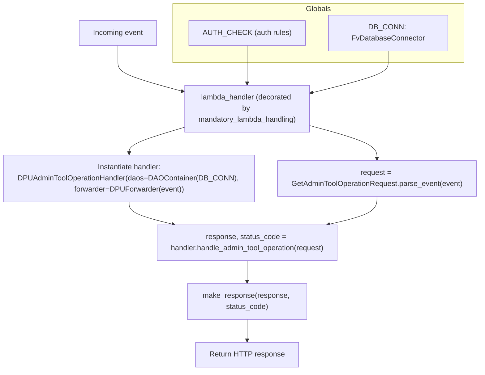

# Diagram: entity_core/entity_service/entity_service/dpu/dpu_service/lambdas/dpu_admin_tool_operation.py

> Auto-generated by Obscura crawlers

## Diagram 1

### SVG

<svg id="container" width="894.375" xmlns="http://www.w3.org/2000/svg" class="classDiagram" height="1280" viewBox="0 0 894.375 1280" role="graphics-document document" aria-roledescription="class"><g><defs><marker id="container_class-aggregationStart" class="marker aggregation class" refX="18" refY="7" markerWidth="190" markerHeight="240" orient="auto"><path d="M 18,7 L9,13 L1,7 L9,1 Z"></path></marker></defs><defs><marker id="container_class-aggregationEnd" class="marker aggregation class" refX="1" refY="7" markerWidth="20" markerHeight="28" orient="auto"><path d="M 18,7 L9,13 L1,7 L9,1 Z"></path></marker></defs><defs><marker id="container_class-extensionStart" class="marker extension class" refX="18" refY="7" markerWidth="190" markerHeight="240" orient="auto"><path d="M 1,7 L18,13 V 1 Z"></path></marker></defs><defs><marker id="container_class-extensionEnd" class="marker extension class" refX="1" refY="7" markerWidth="20" markerHeight="28" orient="auto"><path d="M 1,1 V 13 L18,7 Z"></path></marker></defs><defs><marker id="container_class-compositionStart" class="marker composition class" refX="18" refY="7" markerWidth="190" markerHeight="240" orient="auto"><path d="M 18,7 L9,13 L1,7 L9,1 Z"></path></marker></defs><defs><marker id="container_class-compositionEnd" class="marker composition class" refX="1" refY="7" markerWidth="20" markerHeight="28" orient="auto"><path d="M 18,7 L9,13 L1,7 L9,1 Z"></path></marker></defs><defs><marker id="container_class-dependencyStart" class="marker dependency class" refX="6" refY="7" markerWidth="190" markerHeight="240" orient="auto"><path d="M 5,7 L9,13 L1,7 L9,1 Z"></path></marker></defs><defs><marker id="container_class-dependencyEnd" class="marker dependency class" refX="13" refY="7" markerWidth="20" markerHeight="28" orient="auto"><path d="M 18,7 L9,13 L14,7 L9,1 Z"></path></marker></defs><defs><marker id="container_class-lollipopStart" class="marker lollipop class" refX="13" refY="7" markerWidth="190" markerHeight="240" orient="auto"><circle stroke="black" fill="transparent" cx="7" cy="7" r="6"></circle></marker></defs><defs><marker id="container_class-lollipopEnd" class="marker lollipop class" refX="1" refY="7" markerWidth="190" markerHeight="240" orient="auto"><circle stroke="black" fill="transparent" cx="7" cy="7" r="6"></circle></marker></defs><g class="root"><g class="clusters"></g><g class="edgePaths"><path d="M377.221,1030L377.221,1036.167C377.221,1042.333,377.221,1054.667,377.221,1066C377.221,1077.333,377.221,1087.667,377.221,1092.833L377.221,1098" id="id_DAOContainer_FvDatabaseConnector_1" class="edge-thickness-normal edge-pattern-solid relation" style=";;;" data-edge="true" data-et="edge" data-id="id_DAOContainer_FvDatabaseConnector_1" data-points="W3sieCI6Mzc3LjIyMDcwMzEyNSwieSI6MTAzMH0seyJ4IjozNzcuMjIwNzAzMTI1LCJ5IjoxMDY3fSx7IngiOjM3Ny4yMjA3MDMxMjUsInkiOjExMDR9XQ==" marker-end="url(#container_class-dependencyEnd)"></path><path d="M417.508,836L410.794,842.167C404.079,848.333,390.65,860.667,383.935,872C377.221,883.333,377.221,893.667,377.221,898.833L377.221,904" id="id_DPUAdminToolOperationHandler_DAOContainer_2" class="edge-thickness-normal edge-pattern-solid relation" style=";;;" data-edge="true" data-et="edge" data-id="id_DPUAdminToolOperationHandler_DAOContainer_2" data-points="W3sieCI6NDE3LjUwODQ5MDQ0NDIxNDksInkiOjgzNn0seyJ4IjozNzcuMjIwNzAzMTI1LCJ5Ijo4NzN9LHsieCI6Mzc3LjIyMDcwMzEyNSwieSI6OTEwfV0=" marker-end="url(#container_class-dependencyEnd)"></path><path d="M600.437,836L607.151,842.167C613.866,848.333,627.295,860.667,634.01,872C640.725,883.333,640.725,893.667,640.725,898.833L640.725,904" id="id_DPUAdminToolOperationHandler_DPUForwarder_3" class="edge-thickness-normal edge-pattern-solid relation" style=";;;" data-edge="true" data-et="edge" data-id="id_DPUAdminToolOperationHandler_DPUForwarder_3" data-points="W3sieCI6NjAwLjQzNjgyMjA1NTc4NTEsInkiOjgzNn0seyJ4Ijo2NDAuNzI0NjA5Mzc1LCJ5Ijo4NzN9LHsieCI6NjQwLjcyNDYwOTM3NSwieSI6OTEwfV0=" marker-end="url(#container_class-dependencyEnd)"></path><path d="M174.484,594L174.484,600.167C174.484,606.333,174.484,618.667,192.877,631.487C211.269,644.307,248.054,657.613,266.446,664.267L284.838,670.92" id="id_GetAdminToolOperationRequest_DPUAdminToolOperationHandler_4" class="edge-thickness-normal edge-pattern-dashed relation" style=";;;" data-edge="true" data-et="edge" data-id="id_GetAdminToolOperationRequest_DPUAdminToolOperationHandler_4" data-points="W3sieCI6MTc0LjQ4NDM3NSwieSI6NTk0fSx7IngiOjE3NC40ODQzNzUsInkiOjYzMX0seyJ4IjoyOTAuNDgwNDY4NzUsInkiOjY3Mi45NjExOTMwNTM3NTUxfV0=" marker-end="url(#container_class-dependencyEnd)"></path><path d="M578.258,152L578.258,158.167C578.258,164.333,578.258,176.667,578.258,188C578.258,199.333,578.258,209.667,578.258,214.833L578.258,220" id="id_mandatory_lambda_handling_lambda_handler_5" class="edge-thickness-normal edge-pattern-dashed relation" style=";;;" data-edge="true" data-et="edge" data-id="id_mandatory_lambda_handling_lambda_handler_5" data-points="W3sieCI6NTc4LjI1NzgxMjUsInkiOjE1Mn0seyJ4Ijo1NzguMjU3ODEyNSwieSI6MTg5fSx7IngiOjU3OC4yNTc4MTI1LCJ5IjoyMjZ9XQ==" marker-end="url(#container_class-dependencyEnd)"></path><path d="M660.801,347.661L691.244,361.55C721.688,375.44,782.574,403.22,813.018,433.777C843.461,464.333,843.461,497.667,843.461,531C843.461,564.333,843.461,597.667,825.069,620.987C806.676,644.307,769.892,657.613,751.499,664.267L733.107,670.92" id="id_lambda_handler_DPUAdminToolOperationHandler_6" class="edge-thickness-normal edge-pattern-solid relation" style=";;;" data-edge="true" data-et="edge" data-id="id_lambda_handler_DPUAdminToolOperationHandler_6" data-points="W3sieCI6NjYwLjgwMDc4MTI1LCJ5IjozNDcuNjYwNTYzODM2NjgxOH0seyJ4Ijo4NDMuNDYwOTM3NSwieSI6NDMxfSx7IngiOjg0My40NjA5Mzc1LCJ5Ijo1MzF9LHsieCI6ODQzLjQ2MDkzNzUsInkiOjYzMX0seyJ4Ijo3MjcuNDY0ODQzNzUsInkiOjY3Mi45NjExOTMwNTM3NTUxfV0=" marker-end="url(#container_class-dependencyEnd)"></path><path d="M495.715,334.736L442.176,350.78C388.638,366.824,281.561,398.912,228.023,420.123C174.484,441.333,174.484,451.667,174.484,456.833L174.484,462" id="id_lambda_handler_GetAdminToolOperationRequest_7" class="edge-thickness-normal edge-pattern-solid relation" style=";;;" data-edge="true" data-et="edge" data-id="id_lambda_handler_GetAdminToolOperationRequest_7" data-points="W3sieCI6NDk1LjcxNDg0Mzc1LCJ5IjozMzQuNzM1ODk5NjE4ODMwMTZ9LHsieCI6MTc0LjQ4NDM3NSwieSI6NDMxfSx7IngiOjE3NC40ODQzNzUsInkiOjQ2OH1d" marker-end="url(#container_class-dependencyEnd)"></path><path d="M578.258,394L578.258,400.167C578.258,406.333,578.258,418.667,578.258,430C578.258,441.333,578.258,451.667,578.258,456.833L578.258,462" id="id_lambda_handler_make_response_8" class="edge-thickness-normal edge-pattern-solid relation" style=";;;" data-edge="true" data-et="edge" data-id="id_lambda_handler_make_response_8" data-points="W3sieCI6NTc4LjI1NzgxMjUsInkiOjM5NH0seyJ4Ijo1NzguMjU3ODEyNSwieSI6NDMxfSx7IngiOjU3OC4yNTc4MTI1LCJ5Ijo0Njh9XQ==" marker-end="url(#container_class-dependencyEnd)"></path></g><g class="edgeLabels"><g class="edgeLabel" transform="translate(377.220703125, 1067)"><g class="label" data-id="id_DAOContainer_FvDatabaseConnector_1" transform="translate(-16.4921875, -12)"><foreignObject width="32.984375" height="24">

uses

</foreignObject></g></g><g class="edgeLabel" transform="translate(377.220703125, 873)"><g class="label" data-id="id_DPUAdminToolOperationHandler_DAOContainer_2" transform="translate(-12.703125, -12)"><foreignObject width="25.40625" height="24">

has

</foreignObject></g></g><g class="edgeLabel" transform="translate(640.724609375, 873)"><g class="label" data-id="id_DPUAdminToolOperationHandler_DPUForwarder_3" transform="translate(-12.703125, -12)"><foreignObject width="25.40625" height="24">

has

</foreignObject></g></g><g class="edgeLabel" transform="translate(174.484375, 631)"><g class="label" data-id="id_GetAdminToolOperationRequest_DPUAdminToolOperationHandler_4" transform="translate(-64.7265625, -12)"><foreignObject width="129.453125" height="24">

builds request for

</foreignObject></g></g><g class="edgeLabel" transform="translate(578.2578125, 189)"><g class="label" data-id="id_mandatory_lambda_handling_lambda_handler_5" transform="translate(-35.5078125, -12)"><foreignObject width="71.015625" height="24">

decorates

</foreignObject></g></g><g class="edgeLabel" transform="translate(843.4609375, 531)"><g class="label" data-id="id_lambda_handler_DPUAdminToolOperationHandler_6" transform="translate(-42.9140625, -12)"><foreignObject width="85.828125" height="24">

instantiates

</foreignObject></g></g><g class="edgeLabel" transform="translate(174.484375, 431)"><g class="label" data-id="id_lambda_handler_GetAdminToolOperationRequest_7" transform="translate(-62.65625, -12)"><foreignObject width="125.3125" height="24">

calls parse_event

</foreignObject></g></g><g class="edgeLabel" transform="translate(578.2578125, 431)"><g class="label" data-id="id_lambda_handler_make_response_8" transform="translate(-38.9296875, -12)"><foreignObject width="77.859375" height="24">

returns via

</foreignObject></g></g></g><g class="nodes"><g class="node default" id="classId-FvDatabaseConnector-0" transform="translate(377.220703125, 1188)"><g class="basic label-container"><path d="M-129.14453125 -84 L129.14453125 -84 L129.14453125 84 L-129.14453125 84" stroke="none" stroke-width="0" fill="#ECECFF" style=""></path><path d="M-129.14453125 -84 C-53.879633880297746 -84, 21.385263489404508 -84, 129.14453125 -84 M-129.14453125 -84 C-59.08874711741882 -84, 10.967037015162362 -84, 129.14453125 -84 M129.14453125 -84 C129.14453125 -30.187616023826102, 129.14453125 23.624767952347796, 129.14453125 84 M129.14453125 -84 C129.14453125 -40.383800106231234, 129.14453125 3.232399787537531, 129.14453125 84 M129.14453125 84 C36.003254185218054 84, -57.13802287956389 84, -129.14453125 84 M129.14453125 84 C63.83827714266111 84, -1.4679769646777743 84, -129.14453125 84 M-129.14453125 84 C-129.14453125 36.311314819007386, -129.14453125 -11.377370361985228, -129.14453125 -84 M-129.14453125 84 C-129.14453125 30.45719454795121, -129.14453125 -23.085610904097578, -129.14453125 -84" stroke="#9370DB" stroke-width="1.3" fill="none" stroke-dasharray="0 0" style=""></path></g><g class="annotation-group text" transform="translate(0, -60)"></g><g class="label-group text" transform="translate(-79.3046875, -60)"><g class="label" style="font-weight: bolder" transform="translate(0,-12)"><foreignObject width="158.609375" height="24">

FvDatabaseConnector

</foreignObject></g></g><g class="members-group text" transform="translate(-117.14453125, -12)"><g class="label" style="" transform="translate(0,-12)"><foreignObject width="98.21875" height="24">

+name: string

</foreignObject></g><g class="label" style="" transform="translate(0,12)"><foreignObject width="154.984375" height="24">

+secret: SecretNames

</foreignObject></g><g class="label" style="" transform="translate(0,36)"><foreignObject width="146.921875" height="24">

+auto_connect: bool

</foreignObject></g></g><g class="methods-group text" transform="translate(-117.14453125, 84)"></g><g class="divider" style=""><path d="M-129.14453125 -36 C-66.94473661558698 -36, -4.744941981173966 -36, 129.14453125 -36 M-129.14453125 -36 C-38.142194233949326 -36, 52.86014278210135 -36, 129.14453125 -36" stroke="#9370DB" stroke-width="1.3" fill="none" stroke-dasharray="0 0" style=""></path></g><g class="divider" style=""><path d="M-129.14453125 60 C-73.32262266016022 60, -17.500714070320456 60, 129.14453125 60 M-129.14453125 60 C-38.41958424465349 60, 52.305362760693015 60, 129.14453125 60" stroke="#9370DB" stroke-width="1.3" fill="none" stroke-dasharray="0 0" style=""></path></g></g><g class="node default" id="classId-DAOContainer-1" transform="translate(377.220703125, 970)"><g class="basic label-container"><path d="M-133.33203125 -60 L133.33203125 -60 L133.33203125 60 L-133.33203125 60" stroke="none" stroke-width="0" fill="#ECECFF" style=""></path><path d="M-133.33203125 -60 C-28.559685992071437 -60, 76.21265926585713 -60, 133.33203125 -60 M-133.33203125 -60 C-27.22520994405872 -60, 78.88161136188256 -60, 133.33203125 -60 M133.33203125 -60 C133.33203125 -21.47255746733005, 133.33203125 17.054885065339903, 133.33203125 60 M133.33203125 -60 C133.33203125 -23.84224738466891, 133.33203125 12.315505230662183, 133.33203125 60 M133.33203125 60 C50.253442423312634 60, -32.82514640337473 60, -133.33203125 60 M133.33203125 60 C46.74551067717735 60, -39.8410098956453 60, -133.33203125 60 M-133.33203125 60 C-133.33203125 22.75196328846772, -133.33203125 -14.496073423064558, -133.33203125 -60 M-133.33203125 60 C-133.33203125 18.49387417653906, -133.33203125 -23.012251646921882, -133.33203125 -60" stroke="#9370DB" stroke-width="1.3" fill="none" stroke-dasharray="0 0" style=""></path></g><g class="annotation-group text" transform="translate(0, -36)"></g><g class="label-group text" transform="translate(-50.8984375, -36)"><g class="label" style="font-weight: bolder" transform="translate(0,-12)"><foreignObject width="101.796875" height="24">

DAOContainer

</foreignObject></g></g><g class="members-group text" transform="translate(-121.33203125, 12)"><g class="label" style="" transform="translate(0,-12)"><foreignObject width="191.765625" height="24">

+db: FvDatabaseConnector

</foreignObject></g></g><g class="methods-group text" transform="translate(-121.33203125, 60)"></g><g class="divider" style=""><path d="M-133.33203125 -12 C-38.645249063941904 -12, 56.04153312211619 -12, 133.33203125 -12 M-133.33203125 -12 C-33.4328595983975 -12, 66.466312053205 -12, 133.33203125 -12" stroke="#9370DB" stroke-width="1.3" fill="none" stroke-dasharray="0 0" style=""></path></g><g class="divider" style=""><path d="M-133.33203125 36 C-60.25428748657136 36, 12.823456276857286 36, 133.33203125 36 M-133.33203125 36 C-60.975916421087064 36, 11.380198407825873 36, 133.33203125 36" stroke="#9370DB" stroke-width="1.3" fill="none" stroke-dasharray="0 0" style=""></path></g></g><g class="node default" id="classId-DPUForwarder-2" transform="translate(640.724609375, 970)"><g class="basic label-container"><path d="M-80.171875 -60 L80.171875 -60 L80.171875 60 L-80.171875 60" stroke="none" stroke-width="0" fill="#ECECFF" style=""></path><path d="M-80.171875 -60 C-19.83877874507511 -60, 40.49431750984978 -60, 80.171875 -60 M-80.171875 -60 C-23.116102346083224 -60, 33.93967030783355 -60, 80.171875 -60 M80.171875 -60 C80.171875 -16.1951991484284, 80.171875 27.6096017031432, 80.171875 60 M80.171875 -60 C80.171875 -25.609998513705598, 80.171875 8.780002972588804, 80.171875 60 M80.171875 60 C37.34500842787311 60, -5.481858144253778 60, -80.171875 60 M80.171875 60 C45.86951783456612 60, 11.567160669132235 60, -80.171875 60 M-80.171875 60 C-80.171875 30.723077294631985, -80.171875 1.4461545892639691, -80.171875 -60 M-80.171875 60 C-80.171875 26.935190177139518, -80.171875 -6.129619645720965, -80.171875 -60" stroke="#9370DB" stroke-width="1.3" fill="none" stroke-dasharray="0 0" style=""></path></g><g class="annotation-group text" transform="translate(0, -36)"></g><g class="label-group text" transform="translate(-52.375, -36)"><g class="label" style="font-weight: bolder" transform="translate(0,-12)"><foreignObject width="104.75" height="24">

DPUForwarder

</foreignObject></g></g><g class="members-group text" transform="translate(-68.171875, 12)"><g class="label" style="" transform="translate(0,-12)"><foreignObject width="83.96875" height="24">

+event: dict

</foreignObject></g></g><g class="methods-group text" transform="translate(-68.171875, 60)"></g><g class="divider" style=""><path d="M-80.171875 -12 C-26.135124012382285 -12, 27.90162697523543 -12, 80.171875 -12 M-80.171875 -12 C-23.514161420334098 -12, 33.143552159331804 -12, 80.171875 -12" stroke="#9370DB" stroke-width="1.3" fill="none" stroke-dasharray="0 0" style=""></path></g><g class="divider" style=""><path d="M-80.171875 36 C-20.430388246956888 36, 39.311098506086225 36, 80.171875 36 M-80.171875 36 C-42.33414954401817 36, -4.496424088036335 36, 80.171875 36" stroke="#9370DB" stroke-width="1.3" fill="none" stroke-dasharray="0 0" style=""></path></g></g><g class="node default" id="classId-DPUAdminToolOperationHandler-3" transform="translate(508.97265625, 752)"><g class="basic label-container"><path d="M-218.4921875 -84 L218.4921875 -84 L218.4921875 84 L-218.4921875 84" stroke="none" stroke-width="0" fill="#ECECFF" style=""></path><path d="M-218.4921875 -84 C-59.54887833703779 -84, 99.39443082592442 -84, 218.4921875 -84 M-218.4921875 -84 C-61.49456572678585 -84, 95.5030560464283 -84, 218.4921875 -84 M218.4921875 -84 C218.4921875 -21.58129796274205, 218.4921875 40.8374040745159, 218.4921875 84 M218.4921875 -84 C218.4921875 -28.41925161734317, 218.4921875 27.161496765313657, 218.4921875 84 M218.4921875 84 C118.3551987069717 84, 18.21820991394341 84, -218.4921875 84 M218.4921875 84 C52.14658121122085 84, -114.1990250775583 84, -218.4921875 84 M-218.4921875 84 C-218.4921875 31.06646787841256, -218.4921875 -21.86706424317488, -218.4921875 -84 M-218.4921875 84 C-218.4921875 29.84995870512097, -218.4921875 -24.300082589758063, -218.4921875 -84" stroke="#9370DB" stroke-width="1.3" fill="none" stroke-dasharray="0 0" style=""></path></g><g class="annotation-group text" transform="translate(0, -60)"></g><g class="label-group text" transform="translate(-119.640625, -60)"><g class="label" style="font-weight: bolder" transform="translate(0,-12)"><foreignObject width="239.28125" height="24">

DPUAdminToolOperationHandler

</foreignObject></g></g><g class="members-group text" transform="translate(-206.4921875, -12)"><g class="label" style="" transform="translate(0,-12)"><foreignObject width="151.890625" height="24">

+daos: DAOContainer

</foreignObject></g><g class="label" style="" transform="translate(0,12)"><foreignObject width="190.015625" height="24">

+forwarder: DPUForwarder

</foreignObject></g></g><g class="methods-group text" transform="translate(-206.4921875, 60)"><g class="label" style="" transform="translate(0,-12)"><foreignObject width="293.34375" height="24">

+handle_admin_tool_operation(request)

</foreignObject></g></g><g class="divider" style=""><path d="M-218.4921875 -36 C-82.8647315257827 -36, 52.7627244484346 -36, 218.4921875 -36 M-218.4921875 -36 C-130.22335670765898 -36, -41.95452591531799 -36, 218.4921875 -36" stroke="#9370DB" stroke-width="1.3" fill="none" stroke-dasharray="0 0" style=""></path></g><g class="divider" style=""><path d="M-218.4921875 36 C-99.51835475481445 36, 19.455477990371094 36, 218.4921875 36 M-218.4921875 36 C-57.99213381044683 36, 102.50791987910634 36, 218.4921875 36" stroke="#9370DB" stroke-width="1.3" fill="none" stroke-dasharray="0 0" style=""></path></g></g><g class="node default" id="classId-GetAdminToolOperationRequest-4" transform="translate(174.484375, 531)"><g class="basic label-container"><path d="M-166.484375 -63 L166.484375 -63 L166.484375 63 L-166.484375 63" stroke="none" stroke-width="0" fill="#ECECFF" style=""></path><path d="M-166.484375 -63 C-76.1261357528189 -63, 14.232103494362207 -63, 166.484375 -63 M-166.484375 -63 C-74.7067165901941 -63, 17.07094181961179 -63, 166.484375 -63 M166.484375 -63 C166.484375 -26.934194454437353, 166.484375 9.131611091125293, 166.484375 63 M166.484375 -63 C166.484375 -33.46450746294408, 166.484375 -3.929014925888154, 166.484375 63 M166.484375 63 C88.89068344402139 63, 11.296991888042783 63, -166.484375 63 M166.484375 63 C82.51857212172544 63, -1.4472307565491178 63, -166.484375 63 M-166.484375 63 C-166.484375 23.79891166431873, -166.484375 -15.40217667136254, -166.484375 -63 M-166.484375 63 C-166.484375 35.926747183076515, -166.484375 8.853494366153022, -166.484375 -63" stroke="#9370DB" stroke-width="1.3" fill="none" stroke-dasharray="0 0" style=""></path></g><g class="annotation-group text" transform="translate(0, -39)"></g><g class="label-group text" transform="translate(-118.0625, -39)"><g class="label" style="font-weight: bolder" transform="translate(0,-12)"><foreignObject width="236.125" height="24">

GetAdminToolOperationRequest

</foreignObject></g></g><g class="members-group text" transform="translate(-154.484375, 9)"></g><g class="methods-group text" transform="translate(-154.484375, 39)"><g class="label" style="" transform="translate(0,-12)"><foreignObject width="190.90625" height="24">

+static parse_event(event)

</foreignObject></g></g><g class="divider" style=""><path d="M-166.484375 -15 C-67.135771863578 -15, 32.212831272844 -15, 166.484375 -15 M-166.484375 -15 C-93.87967866297501 -15, -21.27498232595002 -15, 166.484375 -15" stroke="#9370DB" stroke-width="1.3" fill="none" stroke-dasharray="0 0" style=""></path></g><g class="divider" style=""><path d="M-166.484375 9 C-83.63254482635689 9, -0.7807146527137832 9, 166.484375 9 M-166.484375 9 C-82.91281004472589 9, 0.6587549105482253 9, 166.484375 9" stroke="#9370DB" stroke-width="1.3" fill="none" stroke-dasharray="0 0" style=""></path></g></g><g class="node default" id="classId-mandatory_lambda_handling-5" transform="translate(578.2578125, 80)"><g class="basic label-container"><path d="M-119.4296875 -72 L119.4296875 -72 L119.4296875 72 L-119.4296875 72" stroke="none" stroke-width="0" fill="#ECECFF" style=""></path><path d="M-119.4296875 -72 C-49.86866949040687 -72, 19.692348519186254 -72, 119.4296875 -72 M-119.4296875 -72 C-70.83725677363843 -72, -22.24482604727686 -72, 119.4296875 -72 M119.4296875 -72 C119.4296875 -39.694206740167886, 119.4296875 -7.388413480335771, 119.4296875 72 M119.4296875 -72 C119.4296875 -22.16261374785384, 119.4296875 27.67477250429232, 119.4296875 72 M119.4296875 72 C25.88678865712447 72, -67.65611018575106 72, -119.4296875 72 M119.4296875 72 C70.11141217664242 72, 20.793136853284835 72, -119.4296875 72 M-119.4296875 72 C-119.4296875 25.964440525757738, -119.4296875 -20.071118948484525, -119.4296875 -72 M-119.4296875 72 C-119.4296875 40.66261623043227, -119.4296875 9.325232460864541, -119.4296875 -72" stroke="#9370DB" stroke-width="1.3" fill="none" stroke-dasharray="0 0" style=""></path></g><g class="annotation-group text" transform="translate(-44.0625, -48)"><g class="label" style="" transform="translate(0,-12)"><foreignObject width="88.125" height="24">

«decorator»

</foreignObject></g></g><g class="label-group text" transform="translate(-107.4296875, -24)"><g class="label" style="font-weight: bolder" transform="translate(0,-12)"><foreignObject width="214.859375" height="24">

mandatory_lambda_handling

</foreignObject></g></g><g class="members-group text" transform="translate(-107.4296875, 24)"><g class="label" style="" transform="translate(0,-12)"><foreignObject width="90.5" height="24">

+auth_check

</foreignObject></g></g><g class="methods-group text" transform="translate(-107.4296875, 72)"></g><g class="divider" style=""><path d="M-119.4296875 0 C-35.76009904404944 0, 47.90948941190112 0, 119.4296875 0 M-119.4296875 0 C-32.50252265983853 0, 54.424642180322934 0, 119.4296875 0" stroke="#9370DB" stroke-width="1.3" fill="none" stroke-dasharray="0 0" style=""></path></g><g class="divider" style=""><path d="M-119.4296875 48 C-52.77077725254422 48, 13.888132994911558 48, 119.4296875 48 M-119.4296875 48 C-63.991349797034445 48, -8.55301209406889 48, 119.4296875 48" stroke="#9370DB" stroke-width="1.3" fill="none" stroke-dasharray="0 0" style=""></path></g></g><g class="node default" id="classId-lambda_handler-6" transform="translate(578.2578125, 310)"><g class="basic label-container"><path d="M-82.54296875 -84 L82.54296875 -84 L82.54296875 84 L-82.54296875 84" stroke="none" stroke-width="0" fill="#ECECFF" style=""></path><path d="M-82.54296875 -84 C-42.00907812093966 -84, -1.4751874918793249 -84, 82.54296875 -84 M-82.54296875 -84 C-34.02815125984398 -84, 14.48666623031204 -84, 82.54296875 -84 M82.54296875 -84 C82.54296875 -17.298042351030247, 82.54296875 49.403915297939506, 82.54296875 84 M82.54296875 -84 C82.54296875 -42.34063285769142, 82.54296875 -0.6812657153828354, 82.54296875 84 M82.54296875 84 C27.78507360070462 84, -26.97282154859076 84, -82.54296875 84 M82.54296875 84 C39.99156643954174 84, -2.5598358709165154 84, -82.54296875 84 M-82.54296875 84 C-82.54296875 17.741312692407845, -82.54296875 -48.51737461518431, -82.54296875 -84 M-82.54296875 84 C-82.54296875 49.227199339226615, -82.54296875 14.45439867845323, -82.54296875 -84" stroke="#9370DB" stroke-width="1.3" fill="none" stroke-dasharray="0 0" style=""></path></g><g class="annotation-group text" transform="translate(0, -60)"></g><g class="label-group text" transform="translate(-59.9765625, -60)"><g class="label" style="font-weight: bolder" transform="translate(0,-12)"><foreignObject width="119.953125" height="24">

lambda_handler

</foreignObject></g></g><g class="members-group text" transform="translate(-70.54296875, -12)"><g class="label" style="" transform="translate(0,-12)"><foreignObject width="48.328125" height="24">

+event

</foreignObject></g><g class="label" style="" transform="translate(0,12)"><foreignObject width="61.6875" height="24">

+context

</foreignObject></g><g class="label" style="" transform="translate(0,36)"><foreignObject width="81.109375" height="24">

+audit_refs

</foreignObject></g></g><g class="methods-group text" transform="translate(-70.54296875, 84)"></g><g class="divider" style=""><path d="M-82.54296875 -36 C-39.50913927031414 -36, 3.5246902093717267 -36, 82.54296875 -36 M-82.54296875 -36 C-45.49609888370797 -36, -8.449229017415945 -36, 82.54296875 -36" stroke="#9370DB" stroke-width="1.3" fill="none" stroke-dasharray="0 0" style=""></path></g><g class="divider" style=""><path d="M-82.54296875 60 C-35.03134441693885 60, 12.4802799161223 60, 82.54296875 60 M-82.54296875 60 C-48.84847790768898 60, -15.153987065377962 60, 82.54296875 60" stroke="#9370DB" stroke-width="1.3" fill="none" stroke-dasharray="0 0" style=""></path></g></g><g class="node default" id="classId-make_response-7" transform="translate(578.2578125, 531)"><g class="basic label-container"><path d="M-187.2890625 -63 L187.2890625 -63 L187.2890625 63 L-187.2890625 63" stroke="none" stroke-width="0" fill="#ECECFF" style=""></path><path d="M-187.2890625 -63 C-72.76689853529766 -63, 41.75526542940469 -63, 187.2890625 -63 M-187.2890625 -63 C-39.56628170138026 -63, 108.15649909723948 -63, 187.2890625 -63 M187.2890625 -63 C187.2890625 -34.541164741966746, 187.2890625 -6.082329483933492, 187.2890625 63 M187.2890625 -63 C187.2890625 -27.82606448069594, 187.2890625 7.347871038608119, 187.2890625 63 M187.2890625 63 C57.791529862664646 63, -71.70600277467071 63, -187.2890625 63 M187.2890625 63 C55.52328609190525 63, -76.2424903161895 63, -187.2890625 63 M-187.2890625 63 C-187.2890625 17.519772374124656, -187.2890625 -27.960455251750687, -187.2890625 -63 M-187.2890625 63 C-187.2890625 15.143869277308113, -187.2890625 -32.712261445383774, -187.2890625 -63" stroke="#9370DB" stroke-width="1.3" fill="none" stroke-dasharray="0 0" style=""></path></g><g class="annotation-group text" transform="translate(0, -39)"></g><g class="label-group text" transform="translate(-57.46875, -39)"><g class="label" style="font-weight: bolder" transform="translate(0,-12)"><foreignObject width="114.9375" height="24">

make_response

</foreignObject></g></g><g class="members-group text" transform="translate(-175.2890625, 9)"></g><g class="methods-group text" transform="translate(-175.2890625, 39)"><g class="label" style="" transform="translate(0,-12)"><foreignObject width="293.109375" height="24">

+make_response(response, status_code)

</foreignObject></g></g><g class="divider" style=""><path d="M-187.2890625 -15 C-54.11887852978825 -15, 79.0513054404235 -15, 187.2890625 -15 M-187.2890625 -15 C-42.031129805186595 -15, 103.22680288962681 -15, 187.2890625 -15" stroke="#9370DB" stroke-width="1.3" fill="none" stroke-dasharray="0 0" style=""></path></g><g class="divider" style=""><path d="M-187.2890625 9 C-61.41110533538108 9, 64.46685182923784 9, 187.2890625 9 M-187.2890625 9 C-68.01500822252325 9, 51.2590460549535 9, 187.2890625 9" stroke="#9370DB" stroke-width="1.3" fill="none" stroke-dasharray="0 0" style=""></path></g></g></g></g></g></svg>

## Diagram 2

### SVG

<svg id="container" width="1113.75" xmlns="http://www.w3.org/2000/svg" class="flowchart" height="808" viewBox="0 0 1113.75 808" role="graphics-document document" aria-roledescription="flowchart-v2"><g><marker id="container_flowchart-v2-pointEnd" class="marker flowchart-v2" viewBox="0 0 10 10" refX="5" refY="5" markerUnits="userSpaceOnUse" markerWidth="8" markerHeight="8" orient="auto"><path d="M 0 0 L 10 5 L 0 10 z" class="arrowMarkerPath" style="stroke-width: 1; stroke-dasharray: 1, 0;"></path></marker><marker id="container_flowchart-v2-pointStart" class="marker flowchart-v2" viewBox="0 0 10 10" refX="4.5" refY="5" markerUnits="userSpaceOnUse" markerWidth="8" markerHeight="8" orient="auto"><path d="M 0 5 L 10 10 L 10 0 z" class="arrowMarkerPath" style="stroke-width: 1; stroke-dasharray: 1, 0;"></path></marker><marker id="container_flowchart-v2-circleEnd" class="marker flowchart-v2" viewBox="0 0 10 10" refX="11" refY="5" markerUnits="userSpaceOnUse" markerWidth="11" markerHeight="11" orient="auto"><circle cx="5" cy="5" r="5" class="arrowMarkerPath" style="stroke-width: 1; stroke-dasharray: 1, 0;"></circle></marker><marker id="container_flowchart-v2-circleStart" class="marker flowchart-v2" viewBox="0 0 10 10" refX="-1" refY="5" markerUnits="userSpaceOnUse" markerWidth="11" markerHeight="11" orient="auto"><circle cx="5" cy="5" r="5" class="arrowMarkerPath" style="stroke-width: 1; stroke-dasharray: 1, 0;"></circle></marker><marker id="container_flowchart-v2-crossEnd" class="marker cross flowchart-v2" viewBox="0 0 11 11" refX="12" refY="5.2" markerUnits="userSpaceOnUse" markerWidth="11" markerHeight="11" orient="auto"><path d="M 1,1 l 9,9 M 10,1 l -9,9" class="arrowMarkerPath" style="stroke-width: 2; stroke-dasharray: 1, 0;"></path></marker><marker id="container_flowchart-v2-crossStart" class="marker cross flowchart-v2" viewBox="0 0 11 11" refX="-1" refY="5.2" markerUnits="userSpaceOnUse" markerWidth="11" markerHeight="11" orient="auto"><path d="M 1,1 l 9,9 M 10,1 l -9,9" class="arrowMarkerPath" style="stroke-width: 2; stroke-dasharray: 1, 0;"></path></marker><g class="root"><g class="clusters"><g class="cluster" id="Globals" data-look="classic"><rect style="" x="432.89453125" y="8" width="621.34375" height="128"></rect><g class="cluster-label" transform="translate(716.51171875, 8)"><foreignObject width="54.109375" height="24">

Globals

</foreignObject></g></g></g><g class="edgePaths"><path d="M312.262,99L312.262,105.167C312.262,111.333,312.262,123.667,312.262,134C312.262,144.333,312.262,152.667,334.428,162.93C356.593,173.194,400.925,185.388,423.091,191.484L445.257,197.581" id="L_Event_L_0" class="edge-thickness-normal edge-pattern-solid edge-thickness-normal edge-pattern-solid flowchart-link" style=";" data-edge="true" data-et="edge" data-id="L_Event_L_0" data-points="W3sieCI6MzEyLjI2MTcxODc1LCJ5Ijo5OX0seyJ4IjozMTIuMjYxNzE4NzUsInkiOjEzNn0seyJ4IjozMTIuMjYxNzE4NzUsInkiOjE2MX0seyJ4Ijo0NDkuMTEzMjgxMjUsInkiOjE5OC42NDIyMDg4Mzg3NDh9XQ==" marker-end="url(#container_flowchart-v2-pointEnd)"></path><path d="M588.566,99L588.566,105.167C588.566,111.333,588.566,123.667,588.566,134C588.566,144.333,588.566,152.667,588.566,160.333C588.566,168,588.566,175,588.566,178.5L588.566,182" id="L_AUTH_L_0" class="edge-thickness-normal edge-pattern-solid edge-thickness-normal edge-pattern-solid flowchart-link" style=";" data-edge="true" data-et="edge" data-id="L_AUTH_L_0" data-points="W3sieCI6NTg4LjU2NjQwNjI1LCJ5Ijo5OX0seyJ4Ijo1ODguNTY2NDA2MjUsInkiOjEzNn0seyJ4Ijo1ODguNTY2NDA2MjUsInkiOjE2MX0seyJ4Ijo1ODguNTY2NDA2MjUsInkiOjE4Nn1d" marker-end="url(#container_flowchart-v2-pointEnd)"></path><path d="M889.238,111L889.238,115.167C889.238,119.333,889.238,127.667,889.238,136C889.238,144.333,889.238,152.667,863.015,163.462C836.791,174.257,784.344,187.514,758.121,194.142L731.898,200.771" id="L_DB_L_0" class="edge-thickness-normal edge-pattern-solid edge-thickness-normal edge-pattern-solid flowchart-link" style=";" data-edge="true" data-et="edge" data-id="L_DB_L_0" data-points="W3sieCI6ODg5LjIzODI4MTI1LCJ5IjoxMTF9LHsieCI6ODg5LjIzODI4MTI1LCJ5IjoxMzZ9LHsieCI6ODg5LjIzODI4MTI1LCJ5IjoxNjF9LHsieCI6NzI4LjAxOTUzMTI1LCJ5IjoyMDEuNzUwODE4NDc5NDQ3MDh9XQ==" marker-end="url(#container_flowchart-v2-pointEnd)"></path><path d="M449.113,275.574L426.563,281.812C404.013,288.05,358.913,300.525,336.363,310.262C313.813,320,313.813,327,313.813,330.5L313.813,334" id="L_L_Instantiate_0" class="edge-thickness-normal edge-pattern-solid edge-thickness-normal edge-pattern-solid flowchart-link" style=";" data-edge="true" data-et="edge" data-id="L_L_Instantiate_0" data-points="W3sieCI6NDQ5LjExMzI4MTI1LCJ5IjoyNzUuNTc0MjkyMzM1NDcwNjZ9LHsieCI6MzEzLjgxMjUsInkiOjMxM30seyJ4IjozMTMuODEyNSwieSI6MzM4fV0=" marker-end="url(#container_flowchart-v2-pointEnd)"></path><path d="M728.02,272.432L754.631,279.193C781.242,285.955,834.465,299.477,861.076,311.739C887.688,324,887.688,335,887.688,340.5L887.688,346" id="L_L_Parse_0" class="edge-thickness-normal edge-pattern-solid edge-thickness-normal edge-pattern-solid flowchart-link" style=";" data-edge="true" data-et="edge" data-id="L_L_Parse_0" data-points="W3sieCI6NzI4LjAxOTUzMTI1LCJ5IjoyNzIuNDMxOTI5NDgwOTAxMX0seyJ4Ijo4ODcuNjg3NSwieSI6MzEzfSx7IngiOjg4Ny42ODc1LCJ5IjozNTB9XQ==" marker-end="url(#container_flowchart-v2-pointEnd)"></path><path d="M313.813,440L313.813,444.167C313.813,448.333,313.813,456.667,331.051,464.849C348.289,473.031,382.766,481.062,400.004,485.077L417.243,489.093" id="L_Instantiate_CallHandle_0" class="edge-thickness-normal edge-pattern-solid edge-thickness-normal edge-pattern-solid flowchart-link" style=";" data-edge="true" data-et="edge" data-id="L_Instantiate_CallHandle_0" data-points="W3sieCI6MzEzLjgxMjUsInkiOjQ0MH0seyJ4IjozMTMuODEyNSwieSI6NDY1fSx7IngiOjQyMS4xMzgyNDQ2Mjg5MDYyNSwieSI6NDkwfV0=" marker-end="url(#container_flowchart-v2-pointEnd)"></path><path d="M887.688,428L887.688,434.167C887.688,440.333,887.688,452.667,868.865,462.861C850.043,473.054,812.399,481.109,793.577,485.136L774.755,489.163" id="L_Parse_CallHandle_0" class="edge-thickness-normal edge-pattern-solid edge-thickness-normal edge-pattern-solid flowchart-link" style=";" data-edge="true" data-et="edge" data-id="L_Parse_CallHandle_0" data-points="W3sieCI6ODg3LjY4NzUsInkiOjQyOH0seyJ4Ijo4ODcuNjg3NSwieSI6NDY1fSx7IngiOjc3MC44NDMzMjI3NTM5MDYyLCJ5Ijo0OTB9XQ==" marker-end="url(#container_flowchart-v2-pointEnd)"></path><path d="M588.566,568L588.566,572.167C588.566,576.333,588.566,584.667,588.566,592.333C588.566,600,588.566,607,588.566,610.5L588.566,614" id="L_CallHandle_MakeResp_0" class="edge-thickness-normal edge-pattern-solid edge-thickness-normal edge-pattern-solid flowchart-link" style=";" data-edge="true" data-et="edge" data-id="L_CallHandle_MakeResp_0" data-points="W3sieCI6NTg4LjU2NjQwNjI1LCJ5Ijo1Njh9LHsieCI6NTg4LjU2NjQwNjI1LCJ5Ijo1OTN9LHsieCI6NTg4LjU2NjQwNjI1LCJ5Ijo2MTh9XQ==" marker-end="url(#container_flowchart-v2-pointEnd)"></path><path d="M588.566,696L588.566,700.167C588.566,704.333,588.566,712.667,588.566,720.333C588.566,728,588.566,735,588.566,738.5L588.566,742" id="L_MakeResp_Return_0" class="edge-thickness-normal edge-pattern-solid edge-thickness-normal edge-pattern-solid flowchart-link" style=";" data-edge="true" data-et="edge" data-id="L_MakeResp_Return_0" data-points="W3sieCI6NTg4LjU2NjQwNjI1LCJ5Ijo2OTZ9LHsieCI6NTg4LjU2NjQwNjI1LCJ5Ijo3MjF9LHsieCI6NTg4LjU2NjQwNjI1LCJ5Ijo3NDZ9XQ==" marker-end="url(#container_flowchart-v2-pointEnd)"></path></g><g class="edgeLabels"><g class="edgeLabel"><g class="label" data-id="L_Event_L_0" transform="translate(0, 0)"><foreignObject width="0" height="0">

</foreignObject></g></g><g class="edgeLabel"><g class="label" data-id="L_AUTH_L_0" transform="translate(0, 0)"><foreignObject width="0" height="0">

</foreignObject></g></g><g class="edgeLabel"><g class="label" data-id="L_DB_L_0" transform="translate(0, 0)"><foreignObject width="0" height="0">

</foreignObject></g></g><g class="edgeLabel"><g class="label" data-id="L_L_Instantiate_0" transform="translate(0, 0)"><foreignObject width="0" height="0">

</foreignObject></g></g><g class="edgeLabel"><g class="label" data-id="L_L_Parse_0" transform="translate(0, 0)"><foreignObject width="0" height="0">

</foreignObject></g></g><g class="edgeLabel"><g class="label" data-id="L_Instantiate_CallHandle_0" transform="translate(0, 0)"><foreignObject width="0" height="0">

</foreignObject></g></g><g class="edgeLabel"><g class="label" data-id="L_Parse_CallHandle_0" transform="translate(0, 0)"><foreignObject width="0" height="0">

</foreignObject></g></g><g class="edgeLabel"><g class="label" data-id="L_CallHandle_MakeResp_0" transform="translate(0, 0)"><foreignObject width="0" height="0">

</foreignObject></g></g><g class="edgeLabel"><g class="label" data-id="L_MakeResp_Return_0" transform="translate(0, 0)"><foreignObject width="0" height="0">

</foreignObject></g></g></g><g class="nodes"><g class="node default" id="flowchart-AUTH-0" transform="translate(588.56640625, 72)"><rect class="basic label-container" style="" x="-120.671875" y="-27" width="241.34375" height="54"></rect><g class="label" style="" transform="translate(-90.671875, -12)"><rect></rect><foreignObject width="181.34375" height="24">

AUTH_CHECK (auth rules)

</foreignObject></g></g><g class="node default" id="flowchart-DB-1" transform="translate(889.23828125, 72)"><rect class="basic label-container" style="" x="-130" y="-39" width="260" height="78"></rect><g class="label" style="" transform="translate(-100, -24)"><rect></rect><foreignObject width="200" height="48">

DB_CONN: FvDatabaseConnector

</foreignObject></g></g><g class="node default" id="flowchart-Event-2" transform="translate(312.26171875, 72)"><rect class="basic label-container" style="" x="-85.6328125" y="-27" width="171.265625" height="54"></rect><g class="label" style="" transform="translate(-55.6328125, -12)"><rect></rect><foreignObject width="111.265625" height="24">

Incoming event

</foreignObject></g></g><g class="node default" id="flowchart-L-3" transform="translate(588.56640625, 237)"><rect class="basic label-container" style="" x="-139.453125" y="-51" width="278.90625" height="102"></rect><g class="label" style="" transform="translate(-109.453125, -36)"><rect></rect><foreignObject width="218.90625" height="72">

lambda_handler (decorated by mandatory_lambda_handling)

</foreignObject></g></g><g class="node default" id="flowchart-Instantiate-9" transform="translate(313.8125, 389)"><rect class="basic label-container" style="" x="-305.8125" y="-51" width="611.625" height="102"></rect><g class="label" style="" transform="translate(-275.8125, -36)"><rect></rect><foreignObject width="551.625" height="72">

Instantiate handler:\nDPUAdminToolOperationHandler(daos=DAOContainer(DB_CONN), forwarder=DPUForwarder(event))

</foreignObject></g></g><g class="node default" id="flowchart-Parse-11" transform="translate(887.6875, 389)"><rect class="basic label-container" style="" x="-218.0625" y="-39" width="436.125" height="78"></rect><g class="label" style="" transform="translate(-188.0625, -24)"><rect></rect><foreignObject width="376.125" height="48">

request = GetAdminToolOperationRequest.parse_event(event)

</foreignObject></g></g><g class="node default" id="flowchart-CallHandle-13" transform="translate(588.56640625, 529)"><rect class="basic label-container" style="" x="-202.21875" y="-39" width="404.4375" height="78"></rect><g class="label" style="" transform="translate(-172.21875, -24)"><rect></rect><foreignObject width="344.4375" height="48">

response, status_code = handler.handle_admin_tool_operation(request)

</foreignObject></g></g><g class="node default" id="flowchart-MakeResp-17" transform="translate(588.56640625, 657)"><rect class="basic label-container" style="" x="-130" y="-39" width="260" height="78"></rect><g class="label" style="" transform="translate(-100, -24)"><rect></rect><foreignObject width="200" height="48">

make_response(response, status_code)

</foreignObject></g></g><g class="node default" id="flowchart-Return-19" transform="translate(588.56640625, 773)"><rect class="basic label-container" style="" x="-110.15625" y="-27" width="220.3125" height="54"></rect><g class="label" style="" transform="translate(-80.15625, -12)"><rect></rect><foreignObject width="160.3125" height="24">

Return HTTP response

</foreignObject></g></g></g></g></g></svg>
