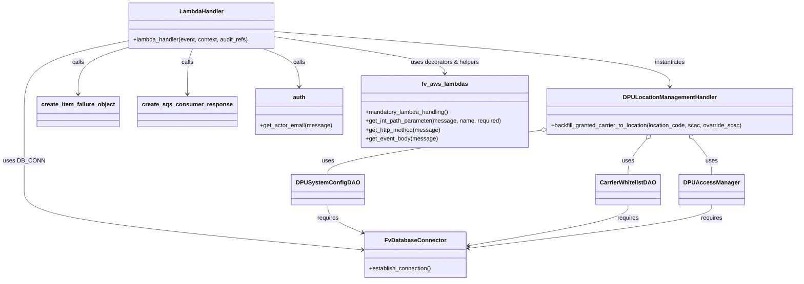

# Diagram: entity_core/entity_service/entity_service/dpu/dpu_service/lambdas/dpu_carrier_location_management_queue_consumer.py


> Auto-generated by Obscura crawlers

## Diagram 1

```mermaid
flowchart TD
A[lambda_handler(event, context, audit_refs)] --> B[DB_CONN: FvDatabaseConnector.establish_connection()]
B --> C[Loop over event.Records]
C --> D[Parse record.body -> record_body]
D --> E[message = record_body.Message]
E --> F[message_attributes = message.snsMessageAttributes]
F --> G[message_type = message_attributes.type]
G --> H{message_type == ADJUST_BACKFILL_AND_VISIBILITY_GRANTS}
H -->|yes| I[Extract params: location_id, http_method, user_email, body, shipper_fv_id, solution_id, location_code, scac, override_scac]
I --> J[Instantiate DPULocationManagementHandler(...DAOs..., DPUAccessManager(...), location_id, ...)]
J --> K[Call backfill_granted_carrier_to_location(location_code, scac, override_scac)]
H -->|no| L[Log error and append create_item_failure_object(record.messageId, error_message) to failed_records]
K --> M[Continue to next record]
L --> M
M --> N[After loop: return create_sqs_consumer_response(failed_records)]
subgraph ExceptionHandling
  X[Exception -> log error; append create_item_failure_object(record.messageId, str(error)) to failed_records] 
end
C -.-> X
J -.-> X
```

> SVG rendering failed for this diagram.

## Diagram 2



### SVG

<svg id="container" width="2151.21875" xmlns="http://www.w3.org/2000/svg" class="classDiagram" height="772" viewBox="0 0 2151.21875 772" role="graphics-document document" aria-roledescription="class"><style>#container{font-family:"trebuchet ms",verdana,arial,sans-serif;font-size:16px;fill:#333;}@keyframes edge-animation-frame{from{stroke-dashoffset:0;}}@keyframes dash{to{stroke-dashoffset:0;}}#container .edge-animation-slow{stroke-dasharray:9,5!important;stroke-dashoffset:900;animation:dash 50s linear infinite;stroke-linecap:round;}#container .edge-animation-fast{stroke-dasharray:9,5!important;stroke-dashoffset:900;animation:dash 20s linear infinite;stroke-linecap:round;}#container .error-icon{fill:#552222;}#container .error-text{fill:#552222;stroke:#552222;}#container .edge-thickness-normal{stroke-width:1px;}#container .edge-thickness-thick{stroke-width:3.5px;}#container .edge-pattern-solid{stroke-dasharray:0;}#container .edge-thickness-invisible{stroke-width:0;fill:none;}#container .edge-pattern-dashed{stroke-dasharray:3;}#container .edge-pattern-dotted{stroke-dasharray:2;}#container .marker{fill:#333333;stroke:#333333;}#container .marker.cross{stroke:#333333;}#container svg{font-family:"trebuchet ms",verdana,arial,sans-serif;font-size:16px;}#container p{margin:0;}#container g.classGroup text{fill:#9370DB;stroke:none;font-family:"trebuchet ms",verdana,arial,sans-serif;font-size:10px;}#container g.classGroup text .title{font-weight:bolder;}#container .nodeLabel,#container .edgeLabel{color:#131300;}#container .edgeLabel .label rect{fill:#ECECFF;}#container .label text{fill:#131300;}#container .labelBkg{background:#ECECFF;}#container .edgeLabel .label span{background:#ECECFF;}#container .classTitle{font-weight:bolder;}#container .node rect,#container .node circle,#container .node ellipse,#container .node polygon,#container .node path{fill:#ECECFF;stroke:#9370DB;stroke-width:1px;}#container .divider{stroke:#9370DB;stroke-width:1;}#container g.clickable{cursor:pointer;}#container g.classGroup rect{fill:#ECECFF;stroke:#9370DB;}#container g.classGroup line{stroke:#9370DB;stroke-width:1;}#container .classLabel .box{stroke:none;stroke-width:0;fill:#ECECFF;opacity:0.5;}#container .classLabel .label{fill:#9370DB;font-size:10px;}#container .relation{stroke:#333333;stroke-width:1;fill:none;}#container .dashed-line{stroke-dasharray:3;}#container .dotted-line{stroke-dasharray:1 2;}#container #compositionStart,#container .composition{fill:#333333!important;stroke:#333333!important;stroke-width:1;}#container #compositionEnd,#container .composition{fill:#333333!important;stroke:#333333!important;stroke-width:1;}#container #dependencyStart,#container .dependency{fill:#333333!important;stroke:#333333!important;stroke-width:1;}#container #dependencyStart,#container .dependency{fill:#333333!important;stroke:#333333!important;stroke-width:1;}#container #extensionStart,#container .extension{fill:transparent!important;stroke:#333333!important;stroke-width:1;}#container #extensionEnd,#container .extension{fill:transparent!important;stroke:#333333!important;stroke-width:1;}#container #aggregationStart,#container .aggregation{fill:transparent!important;stroke:#333333!important;stroke-width:1;}#container #aggregationEnd,#container .aggregation{fill:transparent!important;stroke:#333333!important;stroke-width:1;}#container #lollipopStart,#container .lollipop{fill:#ECECFF!important;stroke:#333333!important;stroke-width:1;}#container #lollipopEnd,#container .lollipop{fill:#ECECFF!important;stroke:#333333!important;stroke-width:1;}#container .edgeTerminals{font-size:11px;line-height:initial;}#container .classTitleText{text-anchor:middle;font-size:18px;fill:#333;}#container .label-icon{display:inline-block;height:1em;overflow:visible;vertical-align:-0.125em;}#container .node .label-icon path{fill:currentColor;stroke:revert;stroke-width:revert;}#container :root{--mermaid-font-family:"trebuchet ms",verdana,arial,sans-serif;}</style><g><defs><marker id="container_class-aggregationStart" class="marker aggregation class" refX="18" refY="7" markerWidth="190" markerHeight="240" orient="auto"><path d="M 18,7 L9,13 L1,7 L9,1 Z"></path></marker></defs><defs><marker id="container_class-aggregationEnd" class="marker aggregation class" refX="1" refY="7" markerWidth="20" markerHeight="28" orient="auto"><path d="M 18,7 L9,13 L1,7 L9,1 Z"></path></marker></defs><defs><marker id="container_class-extensionStart" class="marker extension class" refX="18" refY="7" markerWidth="190" markerHeight="240" orient="auto"><path d="M 1,7 L18,13 V 1 Z"></path></marker></defs><defs><marker id="container_class-extensionEnd" class="marker extension class" refX="1" refY="7" markerWidth="20" markerHeight="28" orient="auto"><path d="M 1,1 V 13 L18,7 Z"></path></marker></defs><defs><marker id="container_class-compositionStart" class="marker composition class" refX="18" refY="7" markerWidth="190" markerHeight="240" orient="auto"><path d="M 18,7 L9,13 L1,7 L9,1 Z"></path></marker></defs><defs><marker id="container_class-compositionEnd" class="marker composition class" refX="1" refY="7" markerWidth="20" markerHeight="28" orient="auto"><path d="M 18,7 L9,13 L1,7 L9,1 Z"></path></marker></defs><defs><marker id="container_class-dependencyStart" class="marker dependency class" refX="6" refY="7" markerWidth="190" markerHeight="240" orient="auto"><path d="M 5,7 L9,13 L1,7 L9,1 Z"></path></marker></defs><defs><marker id="container_class-dependencyEnd" class="marker dependency class" refX="13" refY="7" markerWidth="20" markerHeight="28" orient="auto"><path d="M 18,7 L9,13 L14,7 L9,1 Z"></path></marker></defs><defs><marker id="container_class-lollipopStart" class="marker lollipop class" refX="13" refY="7" markerWidth="190" markerHeight="240" orient="auto"><circle stroke="black" fill="transparent" cx="7" cy="7" r="6"></circle></marker></defs><defs><marker id="container_class-lollipopEnd" class="marker lollipop class" refX="1" refY="7" markerWidth="190" markerHeight="240" orient="auto"><circle stroke="black" fill="transparent" cx="7" cy="7" r="6"></circle></marker></defs><g class="root"><g class="clusters"></g><g class="edgePaths"><path d="M331.084,113.792L286.086,123.327C241.087,132.861,151.09,151.931,106.092,184.132C61.094,216.333,61.094,261.667,61.094,307C61.094,352.333,61.094,397.667,61.094,433.5C61.094,469.333,61.094,495.667,61.094,522C61.094,548.333,61.094,574.667,211.88,602.208C362.667,629.749,664.241,658.499,815.027,672.873L965.814,687.248" id="id_LambdaHandler_FvDatabaseConnector_1" class="edge-thickness-normal edge-pattern-solid relation" style=";;;" data-edge="true" data-et="edge" data-id="id_LambdaHandler_FvDatabaseConnector_1" data-points="W3sieCI6MzMxLjA4Mzk4NDM3NSwieSI6MTEzLjc5MTgxNDA5OTc3ODU5fSx7IngiOjYxLjA5Mzc1LCJ5IjoxNzF9LHsieCI6NjEuMDkzNzUsInkiOjMwN30seyJ4Ijo2MS4wOTM3NSwieSI6NDQzfSx7IngiOjYxLjA5Mzc1LCJ5Ijo1MjJ9LHsieCI6NjEuMDkzNzUsInkiOjYwMX0seyJ4Ijo5NzEuNzg3MTA5Mzc1LCJ5Ijo2ODcuODE3MTYwMjk1NDUxMX1d" marker-end="url(#container_class-dependencyEnd)"></path><path d="M734.99,101.852L810.431,113.376C885.871,124.901,1036.752,147.951,1112.192,164.642C1187.633,181.333,1187.633,191.667,1187.633,196.833L1187.633,202" id="id_LambdaHandler_fv_aws_lambdas_2" class="edge-thickness-normal edge-pattern-solid relation" style=";;;" data-edge="true" data-et="edge" data-id="id_LambdaHandler_fv_aws_lambdas_2" data-points="W3sieCI6NzM0Ljk5MDIzNDM3NSwieSI6MTAxLjg1MTU4MTIxODEzMDI0fSx7IngiOjExODcuNjMyODEyNSwieSI6MTcxfSx7IngiOjExODcuNjMyODEyNSwieSI6MjA4fV0=" marker-end="url(#container_class-dependencyEnd)"></path><path d="M695.01,134L710.864,140.167C726.719,146.333,758.428,158.667,774.282,176C790.137,193.333,790.137,215.667,790.137,226.833L790.137,238" id="id_LambdaHandler_auth_3" class="edge-thickness-normal edge-pattern-solid relation" style=";;;" data-edge="true" data-et="edge" data-id="id_LambdaHandler_auth_3" data-points="W3sieCI6Njk1LjAwOTg2MzI4MTI1LCJ5IjoxMzR9LHsieCI6NzkwLjEzNjcxODc1LCJ5IjoxNzF9LHsieCI6NzkwLjEzNjcxODc1LCJ5IjoyNDR9XQ==" marker-end="url(#container_class-dependencyEnd)"></path><path d="M331.084,132.726L310.213,139.105C289.342,145.484,247.601,158.242,226.73,179.288C205.859,200.333,205.859,229.667,205.859,244.333L205.859,259" id="id_LambdaHandler_create_item_failure_object_4" class="edge-thickness-normal edge-pattern-solid relation" style=";;;" data-edge="true" data-et="edge" data-id="id_LambdaHandler_create_item_failure_object_4" data-points="W3sieCI6MzMxLjA4Mzk4NDM3NSwieSI6MTMyLjcyNTgxNTU5ODYwMzF9LHsieCI6MjA1Ljg1OTM3NSwieSI6MTcxfSx7IngiOjIwNS44NTkzNzUsInkiOjI2NX1d" marker-end="url(#container_class-dependencyEnd)"></path><path d="M508.301,134L505.88,140.167C503.458,146.333,498.616,158.667,496.195,179.5C493.773,200.333,493.773,229.667,493.773,244.333L493.773,259" id="id_LambdaHandler_create_sqs_consumer_response_5" class="edge-thickness-normal edge-pattern-solid relation" style=";;;" data-edge="true" data-et="edge" data-id="id_LambdaHandler_create_sqs_consumer_response_5" data-points="W3sieCI6NTA4LjMwMDk5NjA5Mzc1LCJ5IjoxMzR9LHsieCI6NDkzLjc3MzQzNzUsInkiOjE3MX0seyJ4Ijo0OTMuNzczNDM3NSwieSI6MjY1fV0=" marker-end="url(#container_class-dependencyEnd)"></path><path d="M734.99,86.876L913.336,100.897C1091.682,114.918,1448.374,142.959,1626.72,168.146C1805.066,193.333,1805.066,215.667,1805.066,226.833L1805.066,238" id="id_LambdaHandler_DPULocationManagementHandler_6" class="edge-thickness-normal edge-pattern-solid relation" style=";;;" data-edge="true" data-et="edge" data-id="id_LambdaHandler_DPULocationManagementHandler_6" data-points="W3sieCI6NzM0Ljk5MDIzNDM3NSwieSI6ODYuODc2NDUyMzM0NTYwMTZ9LHsieCI6MTgwNS4wNjY0MDYyNSwieSI6MTcxfSx7IngiOjE4MDUuMDY2NDA2MjUsInkiOjI0NH1d" marker-end="url(#container_class-dependencyEnd)"></path><path d="M1449.849,359.395L1355.379,373.329C1260.91,387.263,1071.972,415.132,977.502,435.232C883.033,455.333,883.033,467.667,883.033,473.833L883.033,480" id="id_DPULocationManagementHandler_DPUSystemConfigDAO_7" class="edge-thickness-normal edge-pattern-solid relation" style=";;;" data-edge="true" data-et="edge" data-id="id_DPULocationManagementHandler_DPUSystemConfigDAO_7" data-points="W3sieCI6MTQ2Ni45MTQwNjI1LCJ5IjozNTYuODc3NTA4MzA4OTU1NDR9LHsieCI6ODgzLjAzMzIwMzEyNSwieSI6NDQzfSx7IngiOjg4My4wMzMyMDMxMjUsInkiOjQ4MH1d" marker-start="url(#container_class-aggregationStart)"></path><path d="M1743.829,383.464L1735.882,393.387C1727.935,403.31,1712.042,423.155,1704.095,439.244C1696.148,455.333,1696.148,467.667,1696.148,473.833L1696.148,480" id="id_DPULocationManagementHandler_CarrierWhitelistDAO_8" class="edge-thickness-normal edge-pattern-solid relation" style=";;;" data-edge="true" data-et="edge" data-id="id_DPULocationManagementHandler_CarrierWhitelistDAO_8" data-points="W3sieCI6MTc1NC42MTE3NTg5NjEzOTcsInkiOjM3MH0seyJ4IjoxNjk2LjE0ODQzNzUsInkiOjQ0M30seyJ4IjoxNjk2LjE0ODQzNzUsInkiOjQ4MH1d" marker-start="url(#container_class-aggregationStart)"></path><path d="M1866.304,383.464L1874.251,393.387C1882.198,403.31,1898.091,423.155,1906.038,439.244C1913.984,455.333,1913.984,467.667,1913.984,473.833L1913.984,480" id="id_DPULocationManagementHandler_DPUAccessManager_9" class="edge-thickness-normal edge-pattern-solid relation" style=";;;" data-edge="true" data-et="edge" data-id="id_DPULocationManagementHandler_DPUAccessManager_9" data-points="W3sieCI6MTg1NS41MjEwNTM1Mzg2MDMsInkiOjM3MH0seyJ4IjoxOTEzLjk4NDM3NSwieSI6NDQzfSx7IngiOjE5MTMuOTg0Mzc1LCJ5Ijo0ODB9XQ==" marker-start="url(#container_class-aggregationStart)"></path><path d="M883.033,564L883.033,570.167C883.033,576.333,883.033,588.667,896.91,600.946C910.788,613.224,938.542,625.449,952.419,631.561L966.296,637.673" id="id_DPUSystemConfigDAO_FvDatabaseConnector_10" class="edge-thickness-normal edge-pattern-solid relation" style=";;;" data-edge="true" data-et="edge" data-id="id_DPUSystemConfigDAO_FvDatabaseConnector_10" data-points="W3sieCI6ODgzLjAzMzIwMzEyNSwieSI6NTY0fSx7IngiOjg4My4wMzMyMDMxMjUsInkiOjYwMX0seyJ4Ijo5NzEuNzg3MTA5Mzc1LCJ5Ijo2NDAuMDkxOTEwMTIwMDkyM31d" marker-end="url(#container_class-dependencyEnd)"></path><path d="M1696.148,564L1696.148,570.167C1696.148,576.333,1696.148,588.667,1622.502,607.399C1548.856,626.132,1401.564,651.264,1327.918,663.83L1254.272,676.396" id="id_CarrierWhitelistDAO_FvDatabaseConnector_11" class="edge-thickness-normal edge-pattern-solid relation" style=";;;" data-edge="true" data-et="edge" data-id="id_CarrierWhitelistDAO_FvDatabaseConnector_11" data-points="W3sieCI6MTY5Ni4xNDg0Mzc1LCJ5Ijo1NjR9LHsieCI6MTY5Ni4xNDg0Mzc1LCJ5Ijo2MDF9LHsieCI6MTI0OC4zNTc0MjE4NzUsInkiOjY3Ny40MDQ5MTc1MDI4NTc2fV0=" marker-end="url(#container_class-dependencyEnd)"></path><path d="M1913.984,564L1913.984,570.167C1913.984,576.333,1913.984,588.667,1804.039,608.51C1694.093,628.353,1474.202,655.705,1364.257,669.382L1254.312,683.058" id="id_DPUAccessManager_FvDatabaseConnector_12" class="edge-thickness-normal edge-pattern-solid relation" style=";;;" data-edge="true" data-et="edge" data-id="id_DPUAccessManager_FvDatabaseConnector_12" data-points="W3sieCI6MTkxMy45ODQzNzUsInkiOjU2NH0seyJ4IjoxOTEzLjk4NDM3NSwieSI6NjAxfSx7IngiOjEyNDguMzU3NDIxODc1LCJ5Ijo2ODMuNzk4NDczMjg2MTUyfV0=" marker-end="url(#container_class-dependencyEnd)"></path></g><g class="edgeLabels"><g class="edgeLabel" transform="translate(61.09375, 443)"><g class="label" data-id="id_LambdaHandler_FvDatabaseConnector_1" transform="translate(-53.09375, -12)"><foreignObject width="106.1875" height="24"><div xmlns="http://www.w3.org/1999/xhtml" class="labelBkg" style="display: table-cell; white-space: nowrap; line-height: 1.5; max-width: 200px; text-align: center;"><span class="edgeLabel"><p>uses DB_CONN</p></span></div></foreignObject></g></g><g class="edgeLabel" transform="translate(1187.6328125, 171)"><g class="label" data-id="id_LambdaHandler_fv_aws_lambdas_2" transform="translate(-94.6796875, -12)"><foreignObject width="189.359375" height="24"><div xmlns="http://www.w3.org/1999/xhtml" class="labelBkg" style="display: table-cell; white-space: nowrap; line-height: 1.5; max-width: 200px; text-align: center;"><span class="edgeLabel"><p>uses decorators &amp; helpers</p></span></div></foreignObject></g></g><g class="edgeLabel" transform="translate(790.13671875, 171)"><g class="label" data-id="id_LambdaHandler_auth_3" transform="translate(-16.4453125, -12)"><foreignObject width="32.890625" height="24"><div xmlns="http://www.w3.org/1999/xhtml" class="labelBkg" style="display: table-cell; white-space: nowrap; line-height: 1.5; max-width: 200px; text-align: center;"><span class="edgeLabel"><p>calls</p></span></div></foreignObject></g></g><g class="edgeLabel" transform="translate(205.859375, 171)"><g class="label" data-id="id_LambdaHandler_create_item_failure_object_4" transform="translate(-16.4453125, -12)"><foreignObject width="32.890625" height="24"><div xmlns="http://www.w3.org/1999/xhtml" class="labelBkg" style="display: table-cell; white-space: nowrap; line-height: 1.5; max-width: 200px; text-align: center;"><span class="edgeLabel"><p>calls</p></span></div></foreignObject></g></g><g class="edgeLabel" transform="translate(493.7734375, 171)"><g class="label" data-id="id_LambdaHandler_create_sqs_consumer_response_5" transform="translate(-16.4453125, -12)"><foreignObject width="32.890625" height="24"><div xmlns="http://www.w3.org/1999/xhtml" class="labelBkg" style="display: table-cell; white-space: nowrap; line-height: 1.5; max-width: 200px; text-align: center;"><span class="edgeLabel"><p>calls</p></span></div></foreignObject></g></g><g class="edgeLabel" transform="translate(1805.06640625, 171)"><g class="label" data-id="id_LambdaHandler_DPULocationManagementHandler_6" transform="translate(-42.9140625, -12)"><foreignObject width="85.828125" height="24"><div xmlns="http://www.w3.org/1999/xhtml" class="labelBkg" style="display: table-cell; white-space: nowrap; line-height: 1.5; max-width: 200px; text-align: center;"><span class="edgeLabel"><p>instantiates</p></span></div></foreignObject></g></g><g class="edgeLabel" transform="translate(883.033203125, 443)"><g class="label" data-id="id_DPULocationManagementHandler_DPUSystemConfigDAO_7" transform="translate(-16.4921875, -12)"><foreignObject width="32.984375" height="24"><div xmlns="http://www.w3.org/1999/xhtml" class="labelBkg" style="display: table-cell; white-space: nowrap; line-height: 1.5; max-width: 200px; text-align: center;"><span class="edgeLabel"><p>uses</p></span></div></foreignObject></g></g><g class="edgeLabel" transform="translate(1696.1484375, 443)"><g class="label" data-id="id_DPULocationManagementHandler_CarrierWhitelistDAO_8" transform="translate(-16.4921875, -12)"><foreignObject width="32.984375" height="24"><div xmlns="http://www.w3.org/1999/xhtml" class="labelBkg" style="display: table-cell; white-space: nowrap; line-height: 1.5; max-width: 200px; text-align: center;"><span class="edgeLabel"><p>uses</p></span></div></foreignObject></g></g><g class="edgeLabel" transform="translate(1913.984375, 443)"><g class="label" data-id="id_DPULocationManagementHandler_DPUAccessManager_9" transform="translate(-16.4921875, -12)"><foreignObject width="32.984375" height="24"><div xmlns="http://www.w3.org/1999/xhtml" class="labelBkg" style="display: table-cell; white-space: nowrap; line-height: 1.5; max-width: 200px; text-align: center;"><span class="edgeLabel"><p>uses</p></span></div></foreignObject></g></g><g class="edgeLabel" transform="translate(883.033203125, 601)"><g class="label" data-id="id_DPUSystemConfigDAO_FvDatabaseConnector_10" transform="translate(-29.8515625, -12)"><foreignObject width="59.703125" height="24"><div xmlns="http://www.w3.org/1999/xhtml" class="labelBkg" style="display: table-cell; white-space: nowrap; line-height: 1.5; max-width: 200px; text-align: center;"><span class="edgeLabel"><p>requires</p></span></div></foreignObject></g></g><g class="edgeLabel" transform="translate(1696.1484375, 601)"><g class="label" data-id="id_CarrierWhitelistDAO_FvDatabaseConnector_11" transform="translate(-29.8515625, -12)"><foreignObject width="59.703125" height="24"><div xmlns="http://www.w3.org/1999/xhtml" class="labelBkg" style="display: table-cell; white-space: nowrap; line-height: 1.5; max-width: 200px; text-align: center;"><span class="edgeLabel"><p>requires</p></span></div></foreignObject></g></g><g class="edgeLabel" transform="translate(1913.984375, 601)"><g class="label" data-id="id_DPUAccessManager_FvDatabaseConnector_12" transform="translate(-29.8515625, -12)"><foreignObject width="59.703125" height="24"><div xmlns="http://www.w3.org/1999/xhtml" class="labelBkg" style="display: table-cell; white-space: nowrap; line-height: 1.5; max-width: 200px; text-align: center;"><span class="edgeLabel"><p>requires</p></span></div></foreignObject></g></g></g><g class="nodes"><g class="node default" id="classId-LambdaHandler-0" transform="translate(533.037109375, 71)"><g class="basic label-container"><path d="M-201.953125 -63 L201.953125 -63 L201.953125 63 L-201.953125 63" stroke="none" stroke-width="0" fill="#ECECFF" style=""></path><path d="M-201.953125 -63 C-88.05135876642872 -63, 25.85040746714256 -63, 201.953125 -63 M-201.953125 -63 C-114.13821967520676 -63, -26.32331435041351 -63, 201.953125 -63 M201.953125 -63 C201.953125 -24.164185975104587, 201.953125 14.671628049790826, 201.953125 63 M201.953125 -63 C201.953125 -33.347076627960966, 201.953125 -3.6941532559219326, 201.953125 63 M201.953125 63 C61.575526112651715 63, -78.80207277469657 63, -201.953125 63 M201.953125 63 C115.71549961265441 63, 29.477874225308824 63, -201.953125 63 M-201.953125 63 C-201.953125 15.362098397342429, -201.953125 -32.27580320531514, -201.953125 -63 M-201.953125 63 C-201.953125 15.620608419925134, -201.953125 -31.758783160149733, -201.953125 -63" stroke="#9370DB" stroke-width="1.3" fill="none" stroke-dasharray="0 0" style=""></path></g><g class="annotation-group text" transform="translate(0, -39)"></g><g class="label-group text" transform="translate(-58.21875, -39)"><g class="label" style="font-weight: bolder" transform="translate(0,-12)"><foreignObject width="116.4375" height="24"><div xmlns="http://www.w3.org/1999/xhtml" style="display: table-cell; white-space: nowrap; line-height: 1.5; max-width: 167px; text-align: center;"><span class="nodeLabel markdown-node-label" style=""><p>LambdaHandler</p></span></div></foreignObject></g></g><g class="members-group text" transform="translate(-189.953125, 9)"></g><g class="methods-group text" transform="translate(-189.953125, 39)"><g class="label" style="" transform="translate(0,-12)"><foreignObject width="321.6875" height="24"><div xmlns="http://www.w3.org/1999/xhtml" style="display: table-cell; white-space: nowrap; line-height: 1.5; max-width: 379px; text-align: center;"><span class="nodeLabel markdown-node-label" style=""><p>+lambda_handler(event, context, audit_refs)</p></span></div></foreignObject></g></g><g class="divider" style=""><path d="M-201.953125 -15 C-60.64215758643496 -15, 80.66880982713008 -15, 201.953125 -15 M-201.953125 -15 C-118.75687675366503 -15, -35.56062850733005 -15, 201.953125 -15" stroke="#9370DB" stroke-width="1.3" fill="none" stroke-dasharray="0 0" style=""></path></g><g class="divider" style=""><path d="M-201.953125 9 C-53.57841266819048 9, 94.79629966361904 9, 201.953125 9 M-201.953125 9 C-45.68823487135958 9, 110.57665525728083 9, 201.953125 9" stroke="#9370DB" stroke-width="1.3" fill="none" stroke-dasharray="0 0" style=""></path></g></g><g class="node default" id="classId-FvDatabaseConnector-1" transform="translate(1110.072265625, 701)"><g class="basic label-container"><path d="M-138.28515625 -63 L138.28515625 -63 L138.28515625 63 L-138.28515625 63" stroke="none" stroke-width="0" fill="#ECECFF" style=""></path><path d="M-138.28515625 -63 C-33.398621780826616 -63, 71.48791268834677 -63, 138.28515625 -63 M-138.28515625 -63 C-55.961006591159304 -63, 26.363143067681392 -63, 138.28515625 -63 M138.28515625 -63 C138.28515625 -37.162690897483, 138.28515625 -11.325381794965999, 138.28515625 63 M138.28515625 -63 C138.28515625 -25.552187312764758, 138.28515625 11.895625374470484, 138.28515625 63 M138.28515625 63 C55.09928685063309 63, -28.086582548733816 63, -138.28515625 63 M138.28515625 63 C32.78787550478057 63, -72.70940524043885 63, -138.28515625 63 M-138.28515625 63 C-138.28515625 26.38182318987929, -138.28515625 -10.236353620241417, -138.28515625 -63 M-138.28515625 63 C-138.28515625 34.5696545965269, -138.28515625 6.139309193053805, -138.28515625 -63" stroke="#9370DB" stroke-width="1.3" fill="none" stroke-dasharray="0 0" style=""></path></g><g class="annotation-group text" transform="translate(0, -39)"></g><g class="label-group text" transform="translate(-79.3046875, -39)"><g class="label" style="font-weight: bolder" transform="translate(0,-12)"><foreignObject width="158.609375" height="24"><div xmlns="http://www.w3.org/1999/xhtml" style="display: table-cell; white-space: nowrap; line-height: 1.5; max-width: 207px; text-align: center;"><span class="nodeLabel markdown-node-label" style=""><p>FvDatabaseConnector</p></span></div></foreignObject></g></g><g class="members-group text" transform="translate(-126.28515625, 9)"></g><g class="methods-group text" transform="translate(-126.28515625, 39)"><g class="label" style="" transform="translate(0,-12)"><foreignObject width="173.265625" height="24"><div xmlns="http://www.w3.org/1999/xhtml" style="display: table-cell; white-space: nowrap; line-height: 1.5; max-width: 231px; text-align: center;"><span class="nodeLabel markdown-node-label" style=""><p>+establish_connection()</p></span></div></foreignObject></g></g><g class="divider" style=""><path d="M-138.28515625 -15 C-33.17727495357104 -15, 71.93060634285791 -15, 138.28515625 -15 M-138.28515625 -15 C-40.521818086422215 -15, 57.24152007715557 -15, 138.28515625 -15" stroke="#9370DB" stroke-width="1.3" fill="none" stroke-dasharray="0 0" style=""></path></g><g class="divider" style=""><path d="M-138.28515625 9 C-29.27399589480767 9, 79.73716446038466 9, 138.28515625 9 M-138.28515625 9 C-46.48306309644663 9, 45.319030057106744 9, 138.28515625 9" stroke="#9370DB" stroke-width="1.3" fill="none" stroke-dasharray="0 0" style=""></path></g></g><g class="node default" id="classId-DPUSystemConfigDAO-2" transform="translate(883.033203125, 522)"><g class="basic label-container"><path d="M-91.9453125 -42 L91.9453125 -42 L91.9453125 42 L-91.9453125 42" stroke="none" stroke-width="0" fill="#ECECFF" style=""></path><path d="M-91.9453125 -42 C-35.07776191544832 -42, 21.78978866910336 -42, 91.9453125 -42 M-91.9453125 -42 C-49.78993684900067 -42, -7.634561198001336 -42, 91.9453125 -42 M91.9453125 -42 C91.9453125 -21.872660144807046, 91.9453125 -1.7453202896140922, 91.9453125 42 M91.9453125 -42 C91.9453125 -15.425867945878725, 91.9453125 11.14826410824255, 91.9453125 42 M91.9453125 42 C42.771366800633785 42, -6.402578898732429 42, -91.9453125 42 M91.9453125 42 C22.079015821926035 42, -47.78728085614793 42, -91.9453125 42 M-91.9453125 42 C-91.9453125 17.21559296165782, -91.9453125 -7.568814076684362, -91.9453125 -42 M-91.9453125 42 C-91.9453125 12.892546722835991, -91.9453125 -16.214906554328017, -91.9453125 -42" stroke="#9370DB" stroke-width="1.3" fill="none" stroke-dasharray="0 0" style=""></path></g><g class="annotation-group text" transform="translate(0, -18)"></g><g class="label-group text" transform="translate(-79.9453125, -18)"><g class="label" style="font-weight: bolder" transform="translate(0,-12)"><foreignObject width="159.890625" height="24"><div xmlns="http://www.w3.org/1999/xhtml" style="display: table-cell; white-space: nowrap; line-height: 1.5; max-width: 207px; text-align: center;"><span class="nodeLabel markdown-node-label" style=""><p>DPUSystemConfigDAO</p></span></div></foreignObject></g></g><g class="members-group text" transform="translate(-79.9453125, 30)"></g><g class="methods-group text" transform="translate(-79.9453125, 60)"></g><g class="divider" style=""><path d="M-91.9453125 6 C-49.32269400003538 6, -6.700075500070767 6, 91.9453125 6 M-91.9453125 6 C-18.45405885250456 6, 55.03719479499088 6, 91.9453125 6" stroke="#9370DB" stroke-width="1.3" fill="none" stroke-dasharray="0 0" style=""></path></g><g class="divider" style=""><path d="M-91.9453125 24 C-22.90158465989532 24, 46.14214318020936 24, 91.9453125 24 M-91.9453125 24 C-45.2494585389555 24, 1.4463954220889974 24, 91.9453125 24" stroke="#9370DB" stroke-width="1.3" fill="none" stroke-dasharray="0 0" style=""></path></g></g><g class="node default" id="classId-CarrierWhitelistDAO-3" transform="translate(1696.1484375, 522)"><g class="basic label-container"><path d="M-85.09375 -42 L85.09375 -42 L85.09375 42 L-85.09375 42" stroke="none" stroke-width="0" fill="#ECECFF" style=""></path><path d="M-85.09375 -42 C-49.29627556760973 -42, -13.498801135219466 -42, 85.09375 -42 M-85.09375 -42 C-39.22477469099742 -42, 6.644200618005158 -42, 85.09375 -42 M85.09375 -42 C85.09375 -19.68708465791474, 85.09375 2.6258306841705235, 85.09375 42 M85.09375 -42 C85.09375 -17.048512253039004, 85.09375 7.902975493921993, 85.09375 42 M85.09375 42 C49.37657770942375 42, 13.659405418847498 42, -85.09375 42 M85.09375 42 C33.95582872051492 42, -17.182092558970155 42, -85.09375 42 M-85.09375 42 C-85.09375 20.257782144166175, -85.09375 -1.4844357116676505, -85.09375 -42 M-85.09375 42 C-85.09375 21.425788753464836, -85.09375 0.8515775069296723, -85.09375 -42" stroke="#9370DB" stroke-width="1.3" fill="none" stroke-dasharray="0 0" style=""></path></g><g class="annotation-group text" transform="translate(0, -18)"></g><g class="label-group text" transform="translate(-73.09375, -18)"><g class="label" style="font-weight: bolder" transform="translate(0,-12)"><foreignObject width="146.1875" height="24"><div xmlns="http://www.w3.org/1999/xhtml" style="display: table-cell; white-space: nowrap; line-height: 1.5; max-width: 193px; text-align: center;"><span class="nodeLabel markdown-node-label" style=""><p>CarrierWhitelistDAO</p></span></div></foreignObject></g></g><g class="members-group text" transform="translate(-73.09375, 30)"></g><g class="methods-group text" transform="translate(-73.09375, 60)"></g><g class="divider" style=""><path d="M-85.09375 6 C-26.57111880655126 6, 31.951512386897477 6, 85.09375 6 M-85.09375 6 C-30.13600884445139 6, 24.82173231109722 6, 85.09375 6" stroke="#9370DB" stroke-width="1.3" fill="none" stroke-dasharray="0 0" style=""></path></g><g class="divider" style=""><path d="M-85.09375 24 C-20.71164900373401 24, 43.67045199253198 24, 85.09375 24 M-85.09375 24 C-43.907294990793424 24, -2.720839981586849 24, 85.09375 24" stroke="#9370DB" stroke-width="1.3" fill="none" stroke-dasharray="0 0" style=""></path></g></g><g class="node default" id="classId-DPUAccessManager-4" transform="translate(1913.984375, 522)"><g class="basic label-container"><path d="M-82.7421875 -42 L82.7421875 -42 L82.7421875 42 L-82.7421875 42" stroke="none" stroke-width="0" fill="#ECECFF" style=""></path><path d="M-82.7421875 -42 C-38.84375785496316 -42, 5.054671790073684 -42, 82.7421875 -42 M-82.7421875 -42 C-48.424706005763575 -42, -14.10722451152715 -42, 82.7421875 -42 M82.7421875 -42 C82.7421875 -13.655931014254119, 82.7421875 14.688137971491763, 82.7421875 42 M82.7421875 -42 C82.7421875 -22.09658188074365, 82.7421875 -2.1931637614872983, 82.7421875 42 M82.7421875 42 C41.53219437547631 42, 0.32220125095261665 42, -82.7421875 42 M82.7421875 42 C21.334146360821123 42, -40.073894778357754 42, -82.7421875 42 M-82.7421875 42 C-82.7421875 15.079116386757363, -82.7421875 -11.841767226485274, -82.7421875 -42 M-82.7421875 42 C-82.7421875 23.134175274846324, -82.7421875 4.268350549692649, -82.7421875 -42" stroke="#9370DB" stroke-width="1.3" fill="none" stroke-dasharray="0 0" style=""></path></g><g class="annotation-group text" transform="translate(0, -18)"></g><g class="label-group text" transform="translate(-70.7421875, -18)"><g class="label" style="font-weight: bolder" transform="translate(0,-12)"><foreignObject width="141.484375" height="24"><div xmlns="http://www.w3.org/1999/xhtml" style="display: table-cell; white-space: nowrap; line-height: 1.5; max-width: 190px; text-align: center;"><span class="nodeLabel markdown-node-label" style=""><p>DPUAccessManager</p></span></div></foreignObject></g></g><g class="members-group text" transform="translate(-70.7421875, 30)"></g><g class="methods-group text" transform="translate(-70.7421875, 60)"></g><g class="divider" style=""><path d="M-82.7421875 6 C-39.29008066119245 6, 4.162026177615104 6, 82.7421875 6 M-82.7421875 6 C-37.221628302183944 6, 8.298930895632111 6, 82.7421875 6" stroke="#9370DB" stroke-width="1.3" fill="none" stroke-dasharray="0 0" style=""></path></g><g class="divider" style=""><path d="M-82.7421875 24 C-38.67380369484636 24, 5.394580110307274 24, 82.7421875 24 M-82.7421875 24 C-36.95985296042239 24, 8.822481579155223 24, 82.7421875 24" stroke="#9370DB" stroke-width="1.3" fill="none" stroke-dasharray="0 0" style=""></path></g></g><g class="node default" id="classId-DPULocationManagementHandler-5" transform="translate(1805.06640625, 307)"><g class="basic label-container"><path d="M-338.15234375 -63 L338.15234375 -63 L338.15234375 63 L-338.15234375 63" stroke="none" stroke-width="0" fill="#ECECFF" style=""></path><path d="M-338.15234375 -63 C-192.667088134314 -63, -47.18183251862803 -63, 338.15234375 -63 M-338.15234375 -63 C-135.78057631118406 -63, 66.59119112763187 -63, 338.15234375 -63 M338.15234375 -63 C338.15234375 -31.36450338693893, 338.15234375 0.27099322612213683, 338.15234375 63 M338.15234375 -63 C338.15234375 -35.21690131817132, 338.15234375 -7.433802636342634, 338.15234375 63 M338.15234375 63 C84.29234601147007 63, -169.56765172705985 63, -338.15234375 63 M338.15234375 63 C177.47039141537655 63, 16.788439080753108 63, -338.15234375 63 M-338.15234375 63 C-338.15234375 14.981116571764453, -338.15234375 -33.037766856471094, -338.15234375 -63 M-338.15234375 63 C-338.15234375 21.380578256991996, -338.15234375 -20.23884348601601, -338.15234375 -63" stroke="#9370DB" stroke-width="1.3" fill="none" stroke-dasharray="0 0" style=""></path></g><g class="annotation-group text" transform="translate(0, -39)"></g><g class="label-group text" transform="translate(-122.7734375, -39)"><g class="label" style="font-weight: bolder" transform="translate(0,-12)"><foreignObject width="245.546875" height="24"><div xmlns="http://www.w3.org/1999/xhtml" style="display: table-cell; white-space: nowrap; line-height: 1.5; max-width: 295px; text-align: center;"><span class="nodeLabel markdown-node-label" style=""><p>DPULocationManagementHandler</p></span></div></foreignObject></g></g><g class="members-group text" transform="translate(-326.15234375, 9)"></g><g class="methods-group text" transform="translate(-326.15234375, 39)"><g class="label" style="" transform="translate(0,-12)"><foreignObject width="529.53125" height="24"><div xmlns="http://www.w3.org/1999/xhtml" style="display: table-cell; white-space: nowrap; line-height: 1.5; max-width: 587px; text-align: center;"><span class="nodeLabel markdown-node-label" style=""><p>+backfill_granted_carrier_to_location(location_code, scac, override_scac)</p></span></div></foreignObject></g></g><g class="divider" style=""><path d="M-338.15234375 -15 C-156.62058619895092 -15, 24.911171352098165 -15, 338.15234375 -15 M-338.15234375 -15 C-186.07720767451596 -15, -34.00207159903192 -15, 338.15234375 -15" stroke="#9370DB" stroke-width="1.3" fill="none" stroke-dasharray="0 0" style=""></path></g><g class="divider" style=""><path d="M-338.15234375 9 C-142.37629501987382 9, 53.399753710252355 9, 338.15234375 9 M-338.15234375 9 C-89.48850422992169 9, 159.17533529015662 9, 338.15234375 9" stroke="#9370DB" stroke-width="1.3" fill="none" stroke-dasharray="0 0" style=""></path></g></g><g class="node default" id="classId-create_item_failure_object-6" transform="translate(205.859375, 307)"><g class="basic label-container"><path d="M-109.765625 -42 L109.765625 -42 L109.765625 42 L-109.765625 42" stroke="none" stroke-width="0" fill="#ECECFF" style=""></path><path d="M-109.765625 -42 C-52.91803675589209 -42, 3.9295514882158216 -42, 109.765625 -42 M-109.765625 -42 C-39.40001271746125 -42, 30.965599565077497 -42, 109.765625 -42 M109.765625 -42 C109.765625 -13.217607177643327, 109.765625 15.564785644713346, 109.765625 42 M109.765625 -42 C109.765625 -10.943625353626395, 109.765625 20.11274929274721, 109.765625 42 M109.765625 42 C51.53008786306775 42, -6.705449273864502 42, -109.765625 42 M109.765625 42 C50.835122997776814 42, -8.095379004446372 42, -109.765625 42 M-109.765625 42 C-109.765625 22.443968194177067, -109.765625 2.8879363883541345, -109.765625 -42 M-109.765625 42 C-109.765625 12.777916249357336, -109.765625 -16.444167501285328, -109.765625 -42" stroke="#9370DB" stroke-width="1.3" fill="none" stroke-dasharray="0 0" style=""></path></g><g class="annotation-group text" transform="translate(0, -18)"></g><g class="label-group text" transform="translate(-97.765625, -18)"><g class="label" style="font-weight: bolder" transform="translate(0,-12)"><foreignObject width="195.53125" height="24"><div xmlns="http://www.w3.org/1999/xhtml" style="display: table-cell; white-space: nowrap; line-height: 1.5; max-width: 243px; text-align: center;"><span class="nodeLabel markdown-node-label" style=""><p>create_item_failure_object</p></span></div></foreignObject></g></g><g class="members-group text" transform="translate(-97.765625, 30)"></g><g class="methods-group text" transform="translate(-97.765625, 60)"></g><g class="divider" style=""><path d="M-109.765625 6 C-63.51309058897144 6, -17.260556177942874 6, 109.765625 6 M-109.765625 6 C-28.38355460545246 6, 52.99851578909508 6, 109.765625 6" stroke="#9370DB" stroke-width="1.3" fill="none" stroke-dasharray="0 0" style=""></path></g><g class="divider" style=""><path d="M-109.765625 24 C-48.964032903297095 24, 11.83755919340581 24, 109.765625 24 M-109.765625 24 C-27.5075491038952 24, 54.7505267922096 24, 109.765625 24" stroke="#9370DB" stroke-width="1.3" fill="none" stroke-dasharray="0 0" style=""></path></g></g><g class="node default" id="classId-create_sqs_consumer_response-7" transform="translate(493.7734375, 307)"><g class="basic label-container"><path d="M-128.1484375 -42 L128.1484375 -42 L128.1484375 42 L-128.1484375 42" stroke="none" stroke-width="0" fill="#ECECFF" style=""></path><path d="M-128.1484375 -42 C-50.549090439545836 -42, 27.05025662090833 -42, 128.1484375 -42 M-128.1484375 -42 C-41.41036260154927 -42, 45.32771229690147 -42, 128.1484375 -42 M128.1484375 -42 C128.1484375 -17.147901244926693, 128.1484375 7.704197510146614, 128.1484375 42 M128.1484375 -42 C128.1484375 -18.477712177891075, 128.1484375 5.044575644217851, 128.1484375 42 M128.1484375 42 C36.80091600101672 42, -54.54660549796657 42, -128.1484375 42 M128.1484375 42 C52.2469274433284 42, -23.654582613343194 42, -128.1484375 42 M-128.1484375 42 C-128.1484375 14.796513586446562, -128.1484375 -12.406972827106877, -128.1484375 -42 M-128.1484375 42 C-128.1484375 22.6421665609162, -128.1484375 3.284333121832397, -128.1484375 -42" stroke="#9370DB" stroke-width="1.3" fill="none" stroke-dasharray="0 0" style=""></path></g><g class="annotation-group text" transform="translate(0, -18)"></g><g class="label-group text" transform="translate(-116.1484375, -18)"><g class="label" style="font-weight: bolder" transform="translate(0,-12)"><foreignObject width="232.296875" height="24"><div xmlns="http://www.w3.org/1999/xhtml" style="display: table-cell; white-space: nowrap; line-height: 1.5; max-width: 280px; text-align: center;"><span class="nodeLabel markdown-node-label" style=""><p>create_sqs_consumer_response</p></span></div></foreignObject></g></g><g class="members-group text" transform="translate(-116.1484375, 30)"></g><g class="methods-group text" transform="translate(-116.1484375, 60)"></g><g class="divider" style=""><path d="M-128.1484375 6 C-64.3955449946265 6, -0.6426524892529955 6, 128.1484375 6 M-128.1484375 6 C-70.15074399309631 6, -12.153050486192626 6, 128.1484375 6" stroke="#9370DB" stroke-width="1.3" fill="none" stroke-dasharray="0 0" style=""></path></g><g class="divider" style=""><path d="M-128.1484375 24 C-74.85648411175339 24, -21.564530723506763 24, 128.1484375 24 M-128.1484375 24 C-45.2447264122643 24, 37.6589846754714 24, 128.1484375 24" stroke="#9370DB" stroke-width="1.3" fill="none" stroke-dasharray="0 0" style=""></path></g></g><g class="node default" id="classId-auth-8" transform="translate(790.13671875, 307)"><g class="basic label-container"><path d="M-118.21484375 -63 L118.21484375 -63 L118.21484375 63 L-118.21484375 63" stroke="none" stroke-width="0" fill="#ECECFF" style=""></path><path d="M-118.21484375 -63 C-69.57963778027087 -63, -20.944431810541744 -63, 118.21484375 -63 M-118.21484375 -63 C-34.365036671334124 -63, 49.48477040733175 -63, 118.21484375 -63 M118.21484375 -63 C118.21484375 -35.1465587987114, 118.21484375 -7.293117597422807, 118.21484375 63 M118.21484375 -63 C118.21484375 -25.17210625373272, 118.21484375 12.655787492534557, 118.21484375 63 M118.21484375 63 C61.82303152094315 63, 5.431219291886293 63, -118.21484375 63 M118.21484375 63 C58.80153218395989 63, -0.6117793820802149 63, -118.21484375 63 M-118.21484375 63 C-118.21484375 25.50522472318241, -118.21484375 -11.989550553635183, -118.21484375 -63 M-118.21484375 63 C-118.21484375 13.219157558155828, -118.21484375 -36.56168488368834, -118.21484375 -63" stroke="#9370DB" stroke-width="1.3" fill="none" stroke-dasharray="0 0" style=""></path></g><g class="annotation-group text" transform="translate(0, -39)"></g><g class="label-group text" transform="translate(-16.6640625, -39)"><g class="label" style="font-weight: bolder" transform="translate(0,-12)"><foreignObject width="33.328125" height="24"><div xmlns="http://www.w3.org/1999/xhtml" style="display: table-cell; white-space: nowrap; line-height: 1.5; max-width: 83px; text-align: center;"><span class="nodeLabel markdown-node-label" style=""><p>auth</p></span></div></foreignObject></g></g><g class="members-group text" transform="translate(-106.21484375, 9)"></g><g class="methods-group text" transform="translate(-106.21484375, 39)"><g class="label" style="" transform="translate(0,-12)"><foreignObject width="195.765625" height="24"><div xmlns="http://www.w3.org/1999/xhtml" style="display: table-cell; white-space: nowrap; line-height: 1.5; max-width: 253px; text-align: center;"><span class="nodeLabel markdown-node-label" style=""><p>+get_actor_email(message)</p></span></div></foreignObject></g></g><g class="divider" style=""><path d="M-118.21484375 -15 C-62.21162073695674 -15, -6.208397723913478 -15, 118.21484375 -15 M-118.21484375 -15 C-43.77111465928881 -15, 30.672614431422375 -15, 118.21484375 -15" stroke="#9370DB" stroke-width="1.3" fill="none" stroke-dasharray="0 0" style=""></path></g><g class="divider" style=""><path d="M-118.21484375 9 C-32.22270970300292 9, 53.76942434399416 9, 118.21484375 9 M-118.21484375 9 C-48.98444319379992 9, 20.245957362400162 9, 118.21484375 9" stroke="#9370DB" stroke-width="1.3" fill="none" stroke-dasharray="0 0" style=""></path></g></g><g class="node default" id="classId-fv_aws_lambdas-9" transform="translate(1187.6328125, 307)"><g class="basic label-container"><path d="M-229.28125 -99 L229.28125 -99 L229.28125 99 L-229.28125 99" stroke="none" stroke-width="0" fill="#ECECFF" style=""></path><path d="M-229.28125 -99 C-78.03275082079392 -99, 73.21574835841216 -99, 229.28125 -99 M-229.28125 -99 C-134.18797491256666 -99, -39.09469982513332 -99, 229.28125 -99 M229.28125 -99 C229.28125 -50.360522517335525, 229.28125 -1.7210450346710502, 229.28125 99 M229.28125 -99 C229.28125 -47.9626938722399, 229.28125 3.0746122555201936, 229.28125 99 M229.28125 99 C71.2500636454293 99, -86.78112270914141 99, -229.28125 99 M229.28125 99 C78.68803908618557 99, -71.90517182762886 99, -229.28125 99 M-229.28125 99 C-229.28125 56.928193610054066, -229.28125 14.856387220108132, -229.28125 -99 M-229.28125 99 C-229.28125 27.337658522466114, -229.28125 -44.32468295506777, -229.28125 -99" stroke="#9370DB" stroke-width="1.3" fill="none" stroke-dasharray="0 0" style=""></path></g><g class="annotation-group text" transform="translate(0, -75)"></g><g class="label-group text" transform="translate(-60.0625, -75)"><g class="label" style="font-weight: bolder" transform="translate(0,-12)"><foreignObject width="120.125" height="24"><div xmlns="http://www.w3.org/1999/xhtml" style="display: table-cell; white-space: nowrap; line-height: 1.5; max-width: 168px; text-align: center;"><span class="nodeLabel markdown-node-label" style=""><p>fv_aws_lambdas</p></span></div></foreignObject></g></g><g class="members-group text" transform="translate(-217.28125, -27)"></g><g class="methods-group text" transform="translate(-217.28125, 3)"><g class="label" style="" transform="translate(0,-12)"><foreignObject width="232.078125" height="24"><div xmlns="http://www.w3.org/1999/xhtml" style="display: table-cell; white-space: nowrap; line-height: 1.5; max-width: 289px; text-align: center;"><span class="nodeLabel markdown-node-label" style=""><p>+mandatory_lambda_handling()</p></span></div></foreignObject></g><g class="label" style="" transform="translate(0,12)"><foreignObject width="374.5" height="24"><div xmlns="http://www.w3.org/1999/xhtml" style="display: table-cell; white-space: nowrap; line-height: 1.5; max-width: 432px; text-align: center;"><span class="nodeLabel markdown-node-label" style=""><p>+get_int_path_parameter(message, name, required)</p></span></div></foreignObject></g><g class="label" style="" transform="translate(0,36)"><foreignObject width="206.546875" height="24"><div xmlns="http://www.w3.org/1999/xhtml" style="display: table-cell; white-space: nowrap; line-height: 1.5; max-width: 264px; text-align: center;"><span class="nodeLabel markdown-node-label" style=""><p>+get_http_method(message)</p></span></div></foreignObject></g><g class="label" style="" transform="translate(0,60)"><foreignObject width="196.25" height="24"><div xmlns="http://www.w3.org/1999/xhtml" style="display: table-cell; white-space: nowrap; line-height: 1.5; max-width: 254px; text-align: center;"><span class="nodeLabel markdown-node-label" style=""><p>+get_event_body(message)</p></span></div></foreignObject></g></g><g class="divider" style=""><path d="M-229.28125 -51 C-88.46781501082211 -51, 52.345619978355785 -51, 229.28125 -51 M-229.28125 -51 C-99.60883967178202 -51, 30.063570656435957 -51, 229.28125 -51" stroke="#9370DB" stroke-width="1.3" fill="none" stroke-dasharray="0 0" style=""></path></g><g class="divider" style=""><path d="M-229.28125 -27 C-64.04863377861804 -27, 101.18398244276392 -27, 229.28125 -27 M-229.28125 -27 C-109.35279534335395 -27, 10.575659313292107 -27, 229.28125 -27" stroke="#9370DB" stroke-width="1.3" fill="none" stroke-dasharray="0 0" style=""></path></g></g></g></g></g></svg>
