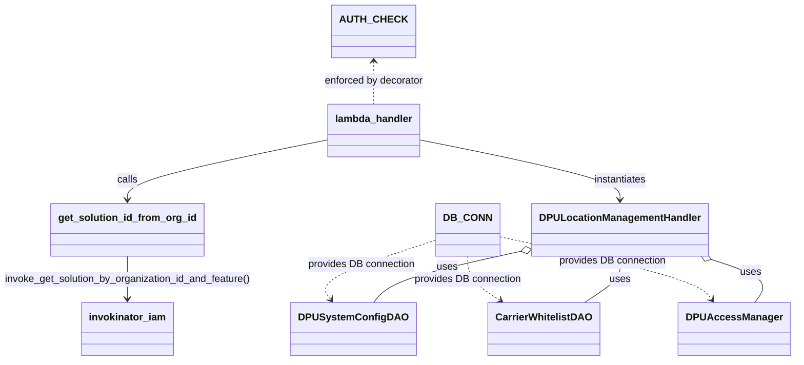

# Diagram: entity_core/entity_service/entity_service/dpu/dpu_service/lambdas/dpu_location_management.py


> Auto-generated by Obscura crawlers

## Diagram 1



### SVG

<svg id="container" width="1262.94140625" xmlns="http://www.w3.org/2000/svg" class="classDiagram" height="574" viewBox="0 0 1262.94140625 574" role="graphics-document document" aria-roledescription="class"><style>#container{font-family:"trebuchet ms",verdana,arial,sans-serif;font-size:16px;fill:#333;}@keyframes edge-animation-frame{from{stroke-dashoffset:0;}}@keyframes dash{to{stroke-dashoffset:0;}}#container .edge-animation-slow{stroke-dasharray:9,5!important;stroke-dashoffset:900;animation:dash 50s linear infinite;stroke-linecap:round;}#container .edge-animation-fast{stroke-dasharray:9,5!important;stroke-dashoffset:900;animation:dash 20s linear infinite;stroke-linecap:round;}#container .error-icon{fill:#552222;}#container .error-text{fill:#552222;stroke:#552222;}#container .edge-thickness-normal{stroke-width:1px;}#container .edge-thickness-thick{stroke-width:3.5px;}#container .edge-pattern-solid{stroke-dasharray:0;}#container .edge-thickness-invisible{stroke-width:0;fill:none;}#container .edge-pattern-dashed{stroke-dasharray:3;}#container .edge-pattern-dotted{stroke-dasharray:2;}#container .marker{fill:#333333;stroke:#333333;}#container .marker.cross{stroke:#333333;}#container svg{font-family:"trebuchet ms",verdana,arial,sans-serif;font-size:16px;}#container p{margin:0;}#container g.classGroup text{fill:#9370DB;stroke:none;font-family:"trebuchet ms",verdana,arial,sans-serif;font-size:10px;}#container g.classGroup text .title{font-weight:bolder;}#container .nodeLabel,#container .edgeLabel{color:#131300;}#container .edgeLabel .label rect{fill:#ECECFF;}#container .label text{fill:#131300;}#container .labelBkg{background:#ECECFF;}#container .edgeLabel .label span{background:#ECECFF;}#container .classTitle{font-weight:bolder;}#container .node rect,#container .node circle,#container .node ellipse,#container .node polygon,#container .node path{fill:#ECECFF;stroke:#9370DB;stroke-width:1px;}#container .divider{stroke:#9370DB;stroke-width:1;}#container g.clickable{cursor:pointer;}#container g.classGroup rect{fill:#ECECFF;stroke:#9370DB;}#container g.classGroup line{stroke:#9370DB;stroke-width:1;}#container .classLabel .box{stroke:none;stroke-width:0;fill:#ECECFF;opacity:0.5;}#container .classLabel .label{fill:#9370DB;font-size:10px;}#container .relation{stroke:#333333;stroke-width:1;fill:none;}#container .dashed-line{stroke-dasharray:3;}#container .dotted-line{stroke-dasharray:1 2;}#container #compositionStart,#container .composition{fill:#333333!important;stroke:#333333!important;stroke-width:1;}#container #compositionEnd,#container .composition{fill:#333333!important;stroke:#333333!important;stroke-width:1;}#container #dependencyStart,#container .dependency{fill:#333333!important;stroke:#333333!important;stroke-width:1;}#container #dependencyStart,#container .dependency{fill:#333333!important;stroke:#333333!important;stroke-width:1;}#container #extensionStart,#container .extension{fill:transparent!important;stroke:#333333!important;stroke-width:1;}#container #extensionEnd,#container .extension{fill:transparent!important;stroke:#333333!important;stroke-width:1;}#container #aggregationStart,#container .aggregation{fill:transparent!important;stroke:#333333!important;stroke-width:1;}#container #aggregationEnd,#container .aggregation{fill:transparent!important;stroke:#333333!important;stroke-width:1;}#container #lollipopStart,#container .lollipop{fill:#ECECFF!important;stroke:#333333!important;stroke-width:1;}#container #lollipopEnd,#container .lollipop{fill:#ECECFF!important;stroke:#333333!important;stroke-width:1;}#container .edgeTerminals{font-size:11px;line-height:initial;}#container .classTitleText{text-anchor:middle;font-size:18px;fill:#333;}#container .label-icon{display:inline-block;height:1em;overflow:visible;vertical-align:-0.125em;}#container .node .label-icon path{fill:currentColor;stroke:revert;stroke-width:revert;}#container :root{--mermaid-font-family:"trebuchet ms",verdana,arial,sans-serif;}</style><g><defs><marker id="container_class-aggregationStart" class="marker aggregation class" refX="18" refY="7" markerWidth="190" markerHeight="240" orient="auto"><path d="M 18,7 L9,13 L1,7 L9,1 Z"></path></marker></defs><defs><marker id="container_class-aggregationEnd" class="marker aggregation class" refX="1" refY="7" markerWidth="20" markerHeight="28" orient="auto"><path d="M 18,7 L9,13 L1,7 L9,1 Z"></path></marker></defs><defs><marker id="container_class-extensionStart" class="marker extension class" refX="18" refY="7" markerWidth="190" markerHeight="240" orient="auto"><path d="M 1,7 L18,13 V 1 Z"></path></marker></defs><defs><marker id="container_class-extensionEnd" class="marker extension class" refX="1" refY="7" markerWidth="20" markerHeight="28" orient="auto"><path d="M 1,1 V 13 L18,7 Z"></path></marker></defs><defs><marker id="container_class-compositionStart" class="marker composition class" refX="18" refY="7" markerWidth="190" markerHeight="240" orient="auto"><path d="M 18,7 L9,13 L1,7 L9,1 Z"></path></marker></defs><defs><marker id="container_class-compositionEnd" class="marker composition class" refX="1" refY="7" markerWidth="20" markerHeight="28" orient="auto"><path d="M 18,7 L9,13 L1,7 L9,1 Z"></path></marker></defs><defs><marker id="container_class-dependencyStart" class="marker dependency class" refX="6" refY="7" markerWidth="190" markerHeight="240" orient="auto"><path d="M 5,7 L9,13 L1,7 L9,1 Z"></path></marker></defs><defs><marker id="container_class-dependencyEnd" class="marker dependency class" refX="13" refY="7" markerWidth="20" markerHeight="28" orient="auto"><path d="M 18,7 L9,13 L14,7 L9,1 Z"></path></marker></defs><defs><marker id="container_class-lollipopStart" class="marker lollipop class" refX="13" refY="7" markerWidth="190" markerHeight="240" orient="auto"><circle stroke="black" fill="transparent" cx="7" cy="7" r="6"></circle></marker></defs><defs><marker id="container_class-lollipopEnd" class="marker lollipop class" refX="1" refY="7" markerWidth="190" markerHeight="240" orient="auto"><circle stroke="black" fill="transparent" cx="7" cy="7" r="6"></circle></marker></defs><g class="root"><g class="clusters"></g><g class="edgePaths"><path d="M710.922,380.968L677.836,391.64C644.75,402.312,578.578,423.656,549.659,439.704C520.74,455.753,529.074,466.505,533.241,471.881L537.408,477.258" id="id_DB_CONN_DPUSystemConfigDAO_1" class="edge-thickness-normal edge-pattern-dashed relation" style=";;;" data-edge="true" data-et="edge" data-id="id_DB_CONN_DPUSystemConfigDAO_1" data-points="W3sieCI6NzEwLjkyMTg3NSwieSI6MzgwLjk2ODQyMTA1MjYzMTZ9LHsieCI6NTEyLjQwNjI1LCJ5Ijo0NDV9LHsieCI6NTQxLjA4MzgxMTMxMzI5MTEsInkiOjQ4Mn1d" marker-end="url(#container_class-dependencyEnd)"></path><path d="M757.328,408L757.328,414.167C757.328,420.333,757.328,432.667,765.525,444.436C773.723,456.205,790.117,467.41,798.314,473.012L806.512,478.614" id="id_DB_CONN_CarrierWhitelistDAO_2" class="edge-thickness-normal edge-pattern-dashed relation" style=";;;" data-edge="true" data-et="edge" data-id="id_DB_CONN_CarrierWhitelistDAO_2" data-points="W3sieCI6NzU3LjMyODEyNSwieSI6NDA4fSx7IngiOjc1Ny4zMjgxMjUsInkiOjQ0NX0seyJ4Ijo4MTEuNDY1MTQwNDI3MjE1MSwieSI6NDgyfV0=" marker-end="url(#container_class-dependencyEnd)"></path><path d="M803.734,376.367L854.94,387.806C906.146,399.244,1008.557,422.122,1063.93,438.937C1119.303,455.753,1127.637,466.505,1131.804,471.881L1135.971,477.258" id="id_DB_CONN_DPUAccessManager_3" class="edge-thickness-normal edge-pattern-dashed relation" style=";;;" data-edge="true" data-et="edge" data-id="id_DB_CONN_DPUAccessManager_3" data-points="W3sieCI6ODAzLjczNDM3NSwieSI6Mzc2LjM2NjcyMTE1OTM2OTA0fSx7IngiOjExMTAuOTY4NzUsInkiOjQ0NX0seyJ4IjoxMTM5LjY0NjMxMTMxMzI5MSwieSI6NDgyfV0=" marker-end="url(#container_class-dependencyEnd)"></path><path d="M525.887,222.556L472.775,233.297C419.664,244.037,313.441,265.519,260.33,281.426C207.219,297.333,207.219,307.667,207.219,312.833L207.219,318" id="id_lambda_handler_get_solution_id_from_org_id_4" class="edge-thickness-normal edge-pattern-solid relation" style=";;;" data-edge="true" data-et="edge" data-id="id_lambda_handler_get_solution_id_from_org_id_4" data-points="W3sieCI6NTI1Ljg4NjcxODc1LCJ5IjoyMjIuNTU1ODEyMjA5Mzg5NTN9LHsieCI6MjA3LjIxODc1LCJ5IjoyODd9LHsieCI6MjA3LjIxODc1LCJ5IjozMjR9XQ==" marker-end="url(#container_class-dependencyEnd)"></path><path d="M207.219,408L207.219,414.167C207.219,420.333,207.219,432.667,207.219,444C207.219,455.333,207.219,465.667,207.219,470.833L207.219,476" id="id_get_solution_id_from_org_id_invokinator_iam_5" class="edge-thickness-normal edge-pattern-solid relation" style=";;;" data-edge="true" data-et="edge" data-id="id_get_solution_id_from_org_id_invokinator_iam_5" data-points="W3sieCI6MjA3LjIxODc1LCJ5Ijo0MDh9LHsieCI6MjA3LjIxODc1LCJ5Ijo0NDV9LHsieCI6MjA3LjIxODc1LCJ5Ijo0ODJ9XQ==" marker-end="url(#container_class-dependencyEnd)"></path><path d="M669.84,222.556L722.951,233.297C776.063,244.037,882.285,265.519,935.396,281.426C988.508,297.333,988.508,307.667,988.508,312.833L988.508,318" id="id_lambda_handler_DPULocationManagementHandler_6" class="edge-thickness-normal edge-pattern-solid relation" style=";;;" data-edge="true" data-et="edge" data-id="id_lambda_handler_DPULocationManagementHandler_6" data-points="W3sieCI6NjY5LjgzOTg0Mzc1LCJ5IjoyMjIuNTU1ODEyMjA5Mzg5NTN9LHsieCI6OTg4LjUwNzgxMjUsInkiOjI4N30seyJ4Ijo5ODguNTA3ODEyNSwieSI6MzI0fV0=" marker-end="url(#container_class-dependencyEnd)"></path><path d="M836.899,399.868L803.227,407.39C769.555,414.912,702.211,429.956,663.76,443.645C625.308,457.333,615.749,469.667,610.969,475.833L606.19,482" id="id_DPULocationManagementHandler_DPUSystemConfigDAO_7" class="edge-thickness-normal edge-pattern-solid relation" style=";;;" data-edge="true" data-et="edge" data-id="id_DPULocationManagementHandler_DPUSystemConfigDAO_7" data-points="W3sieCI6ODUzLjczNDM3NSwieSI6Mzk2LjEwNzEyMjM0MzQ4MDc0fSx7IngiOjYzNC44NjcxODc1LCJ5Ijo0NDV9LHsieCI6NjA2LjE4OTYyNjE4NjcwODksInkiOjQ4Mn1d" marker-start="url(#container_class-aggregationStart)"></path><path d="M988.508,425.25L988.508,428.542C988.508,431.833,988.508,438.417,979.485,447.875C970.462,457.333,952.416,469.667,943.394,475.833L934.371,482" id="id_DPULocationManagementHandler_CarrierWhitelistDAO_8" class="edge-thickness-normal edge-pattern-solid relation" style=";;;" data-edge="true" data-et="edge" data-id="id_DPULocationManagementHandler_CarrierWhitelistDAO_8" data-points="W3sieCI6OTg4LjUwNzgxMjUsInkiOjQwOH0seyJ4Ijo5ODguNTA3ODEyNSwieSI6NDQ1fSx7IngiOjkzNC4zNzA3OTcwNzI3ODQ5LCJ5Ijo0ODJ9XQ==" marker-start="url(#container_class-aggregationStart)"></path><path d="M1135.137,413.295L1151.519,418.579C1167.901,423.864,1200.665,434.432,1212.268,445.883C1223.871,457.333,1214.311,469.667,1209.532,475.833L1204.752,482" id="id_DPULocationManagementHandler_DPUAccessManager_9" class="edge-thickness-normal edge-pattern-solid relation" style=";;;" data-edge="true" data-et="edge" data-id="id_DPULocationManagementHandler_DPUAccessManager_9" data-points="W3sieCI6MTExOC43MTk0NDIyNDY4MzU2LCJ5Ijo0MDh9LHsieCI6MTIzMy40Mjk2ODc1LCJ5Ijo0NDV9LHsieCI6MTIwNC43NTIxMjYxODY3MDksInkiOjQ4Mn1d" marker-start="url(#container_class-aggregationStart)"></path><path d="M597.863,98L597.863,103.167C597.863,108.333,597.863,118.667,597.863,130C597.863,141.333,597.863,153.667,597.863,159.833L597.863,166" id="id_AUTH_CHECK_lambda_handler_10" class="edge-thickness-normal edge-pattern-dashed relation" style=";;;" data-edge="true" data-et="edge" data-id="id_AUTH_CHECK_lambda_handler_10" data-points="W3sieCI6NTk3Ljg2MzI4MTI1LCJ5Ijo5Mn0seyJ4Ijo1OTcuODYzMjgxMjUsInkiOjEyOX0seyJ4Ijo1OTcuODYzMjgxMjUsInkiOjE2Nn1d" marker-start="url(#container_class-dependencyStart)"></path></g><g class="edgeLabels"><g class="edgeLabel" transform="translate(589.38798, 420.1694)"><g class="label" data-id="id_DB_CONN_DPUSystemConfigDAO_1" transform="translate(-85.96875, -12)"><foreignObject width="171.9375" height="24"><div xmlns="http://www.w3.org/1999/xhtml" class="labelBkg" style="display: table-cell; white-space: nowrap; line-height: 1.5; max-width: 200px; text-align: center;"><span class="edgeLabel"><p>provides DB connection</p></span></div></foreignObject></g></g><g class="edgeLabel" transform="translate(757.328125, 445)"><g class="label" data-id="id_DB_CONN_CarrierWhitelistDAO_2" transform="translate(-85.96875, -12)"><foreignObject width="171.9375" height="24"><div xmlns="http://www.w3.org/1999/xhtml" class="labelBkg" style="display: table-cell; white-space: nowrap; line-height: 1.5; max-width: 200px; text-align: center;"><span class="edgeLabel"><p>provides DB connection</p></span></div></foreignObject></g></g><g class="edgeLabel" transform="translate(980.19473, 415.78631)"><g class="label" data-id="id_DB_CONN_DPUAccessManager_3" transform="translate(-85.96875, -12)"><foreignObject width="171.9375" height="24"><div xmlns="http://www.w3.org/1999/xhtml" class="labelBkg" style="display: table-cell; white-space: nowrap; line-height: 1.5; max-width: 200px; text-align: center;"><span class="edgeLabel"><p>provides DB connection</p></span></div></foreignObject></g></g><g class="edgeLabel" transform="translate(207.21875, 287)"><g class="label" data-id="id_lambda_handler_get_solution_id_from_org_id_4" transform="translate(-16.4453125, -12)"><foreignObject width="32.890625" height="24"><div xmlns="http://www.w3.org/1999/xhtml" class="labelBkg" style="display: table-cell; white-space: nowrap; line-height: 1.5; max-width: 200px; text-align: center;"><span class="edgeLabel"><p>calls</p></span></div></foreignObject></g></g><g class="edgeLabel" transform="translate(207.21875, 445)"><g class="label" data-id="id_get_solution_id_from_org_id_invokinator_iam_5" transform="translate(-199.21875, -12)"><foreignObject width="398.4375" height="24"><div xmlns="http://www.w3.org/1999/xhtml" class="labelBkg" style="display: table; white-space: break-spaces; line-height: 1.5; max-width: 200px; text-align: center; width: 200px;"><span class="edgeLabel"><p>invoke_get_solution_by_organization_id_and_feature()</p></span></div></foreignObject></g></g><g class="edgeLabel" transform="translate(988.5078125, 287)"><g class="label" data-id="id_lambda_handler_DPULocationManagementHandler_6" transform="translate(-42.9140625, -12)"><foreignObject width="85.828125" height="24"><div xmlns="http://www.w3.org/1999/xhtml" class="labelBkg" style="display: table-cell; white-space: nowrap; line-height: 1.5; max-width: 200px; text-align: center;"><span class="edgeLabel"><p>instantiates</p></span></div></foreignObject></g></g><g class="edgeLabel" transform="translate(721.45761, 425.65651)"><g class="label" data-id="id_DPULocationManagementHandler_DPUSystemConfigDAO_7" transform="translate(-16.4921875, -12)"><foreignObject width="32.984375" height="24"><div xmlns="http://www.w3.org/1999/xhtml" class="labelBkg" style="display: table-cell; white-space: nowrap; line-height: 1.5; max-width: 200px; text-align: center;"><span class="edgeLabel"><p>uses</p></span></div></foreignObject></g></g><g class="edgeLabel" transform="translate(988.5078125, 445)"><g class="label" data-id="id_DPULocationManagementHandler_CarrierWhitelistDAO_8" transform="translate(-16.4921875, -12)"><foreignObject width="32.984375" height="24"><div xmlns="http://www.w3.org/1999/xhtml" class="labelBkg" style="display: table-cell; white-space: nowrap; line-height: 1.5; max-width: 200px; text-align: center;"><span class="edgeLabel"><p>uses</p></span></div></foreignObject></g></g><g class="edgeLabel" transform="translate(1198.35064, 433.68519)"><g class="label" data-id="id_DPULocationManagementHandler_DPUAccessManager_9" transform="translate(-16.4921875, -12)"><foreignObject width="32.984375" height="24"><div xmlns="http://www.w3.org/1999/xhtml" class="labelBkg" style="display: table-cell; white-space: nowrap; line-height: 1.5; max-width: 200px; text-align: center;"><span class="edgeLabel"><p>uses</p></span></div></foreignObject></g></g><g class="edgeLabel" transform="translate(597.86328125, 129)"><g class="label" data-id="id_AUTH_CHECK_lambda_handler_10" transform="translate(-80.046875, -12)"><foreignObject width="160.09375" height="24"><div xmlns="http://www.w3.org/1999/xhtml" class="labelBkg" style="display: table-cell; white-space: nowrap; line-height: 1.5; max-width: 200px; text-align: center;"><span class="edgeLabel"><p>enforced by decorator</p></span></div></foreignObject></g></g></g><g class="nodes"><g class="node default" id="classId-lambda_handler-0" transform="translate(597.86328125, 208)"><g class="basic label-container"><path d="M-71.9765625 -42 L71.9765625 -42 L71.9765625 42 L-71.9765625 42" stroke="none" stroke-width="0" fill="#ECECFF" style=""></path><path d="M-71.9765625 -42 C-34.24970086861821 -42, 3.4771607627635746 -42, 71.9765625 -42 M-71.9765625 -42 C-22.47789489299506 -42, 27.02077271400988 -42, 71.9765625 -42 M71.9765625 -42 C71.9765625 -20.520891886051004, 71.9765625 0.9582162278979922, 71.9765625 42 M71.9765625 -42 C71.9765625 -15.487232615929702, 71.9765625 11.025534768140595, 71.9765625 42 M71.9765625 42 C27.91022411272221 42, -16.156114274555577 42, -71.9765625 42 M71.9765625 42 C15.342239359975096 42, -41.29208378004981 42, -71.9765625 42 M-71.9765625 42 C-71.9765625 17.651209706866013, -71.9765625 -6.697580586267975, -71.9765625 -42 M-71.9765625 42 C-71.9765625 16.873652894375606, -71.9765625 -8.252694211248787, -71.9765625 -42" stroke="#9370DB" stroke-width="1.3" fill="none" stroke-dasharray="0 0" style=""></path></g><g class="annotation-group text" transform="translate(0, -18)"></g><g class="label-group text" transform="translate(-59.9765625, -18)"><g class="label" style="font-weight: bolder" transform="translate(0,-12)"><foreignObject width="119.953125" height="24"><div xmlns="http://www.w3.org/1999/xhtml" style="display: table-cell; white-space: nowrap; line-height: 1.5; max-width: 170px; text-align: center;"><span class="nodeLabel markdown-node-label" style=""><p>lambda_handler</p></span></div></foreignObject></g></g><g class="members-group text" transform="translate(-59.9765625, 30)"></g><g class="methods-group text" transform="translate(-59.9765625, 60)"></g><g class="divider" style=""><path d="M-71.9765625 6 C-17.31900478448447 6, 37.33855293103106 6, 71.9765625 6 M-71.9765625 6 C-35.312846710455915 6, 1.35086907908817 6, 71.9765625 6" stroke="#9370DB" stroke-width="1.3" fill="none" stroke-dasharray="0 0" style=""></path></g><g class="divider" style=""><path d="M-71.9765625 24 C-41.24818804640273 24, -10.51981359280547 24, 71.9765625 24 M-71.9765625 24 C-22.470726864906048 24, 27.035108770187904 24, 71.9765625 24" stroke="#9370DB" stroke-width="1.3" fill="none" stroke-dasharray="0 0" style=""></path></g></g><g class="node default" id="classId-get_solution_id_from_org_id-1" transform="translate(207.21875, 366)"><g class="basic label-container"><path d="M-117.953125 -42 L117.953125 -42 L117.953125 42 L-117.953125 42" stroke="none" stroke-width="0" fill="#ECECFF" style=""></path><path d="M-117.953125 -42 C-61.35383442067011 -42, -4.754543841340222 -42, 117.953125 -42 M-117.953125 -42 C-58.16151405992153 -42, 1.630096880156941 -42, 117.953125 -42 M117.953125 -42 C117.953125 -13.813595181857842, 117.953125 14.372809636284316, 117.953125 42 M117.953125 -42 C117.953125 -18.943495405750905, 117.953125 4.113009188498189, 117.953125 42 M117.953125 42 C41.35600138702671 42, -35.24112222594658 42, -117.953125 42 M117.953125 42 C33.70661998120191 42, -50.53988503759618 42, -117.953125 42 M-117.953125 42 C-117.953125 24.07201107227517, -117.953125 6.144022144550341, -117.953125 -42 M-117.953125 42 C-117.953125 24.00967530893178, -117.953125 6.019350617863559, -117.953125 -42" stroke="#9370DB" stroke-width="1.3" fill="none" stroke-dasharray="0 0" style=""></path></g><g class="annotation-group text" transform="translate(0, -18)"></g><g class="label-group text" transform="translate(-105.953125, -18)"><g class="label" style="font-weight: bolder" transform="translate(0,-12)"><foreignObject width="211.90625" height="24"><div xmlns="http://www.w3.org/1999/xhtml" style="display: table-cell; white-space: nowrap; line-height: 1.5; max-width: 259px; text-align: center;"><span class="nodeLabel markdown-node-label" style=""><p>get_solution_id_from_org_id</p></span></div></foreignObject></g></g><g class="members-group text" transform="translate(-105.953125, 30)"></g><g class="methods-group text" transform="translate(-105.953125, 60)"></g><g class="divider" style=""><path d="M-117.953125 6 C-32.0823700724182 6, 53.7883848551636 6, 117.953125 6 M-117.953125 6 C-66.06399105013574 6, -14.174857100271481 6, 117.953125 6" stroke="#9370DB" stroke-width="1.3" fill="none" stroke-dasharray="0 0" style=""></path></g><g class="divider" style=""><path d="M-117.953125 24 C-52.46647092932952 24, 13.020183141340965 24, 117.953125 24 M-117.953125 24 C-54.09439017247124 24, 9.764344655057513 24, 117.953125 24" stroke="#9370DB" stroke-width="1.3" fill="none" stroke-dasharray="0 0" style=""></path></g></g><g class="node default" id="classId-DPULocationManagementHandler-2" transform="translate(988.5078125, 366)"><g class="basic label-container"><path d="M-134.7734375 -42 L134.7734375 -42 L134.7734375 42 L-134.7734375 42" stroke="none" stroke-width="0" fill="#ECECFF" style=""></path><path d="M-134.7734375 -42 C-37.377292783603494 -42, 60.01885193279301 -42, 134.7734375 -42 M-134.7734375 -42 C-49.475033565011245 -42, 35.82337036997751 -42, 134.7734375 -42 M134.7734375 -42 C134.7734375 -11.161336540353677, 134.7734375 19.677326919292646, 134.7734375 42 M134.7734375 -42 C134.7734375 -15.359883172335852, 134.7734375 11.280233655328296, 134.7734375 42 M134.7734375 42 C47.890750556712874 42, -38.99193638657425 42, -134.7734375 42 M134.7734375 42 C61.44489820251323 42, -11.883641094973541 42, -134.7734375 42 M-134.7734375 42 C-134.7734375 16.582253853933338, -134.7734375 -8.835492292133324, -134.7734375 -42 M-134.7734375 42 C-134.7734375 13.091260630052261, -134.7734375 -15.817478739895478, -134.7734375 -42" stroke="#9370DB" stroke-width="1.3" fill="none" stroke-dasharray="0 0" style=""></path></g><g class="annotation-group text" transform="translate(0, -18)"></g><g class="label-group text" transform="translate(-122.7734375, -18)"><g class="label" style="font-weight: bolder" transform="translate(0,-12)"><foreignObject width="245.546875" height="24"><div xmlns="http://www.w3.org/1999/xhtml" style="display: table-cell; white-space: nowrap; line-height: 1.5; max-width: 295px; text-align: center;"><span class="nodeLabel markdown-node-label" style=""><p>DPULocationManagementHandler</p></span></div></foreignObject></g></g><g class="members-group text" transform="translate(-122.7734375, 30)"></g><g class="methods-group text" transform="translate(-122.7734375, 60)"></g><g class="divider" style=""><path d="M-134.7734375 6 C-33.58632139046564 6, 67.60079471906872 6, 134.7734375 6 M-134.7734375 6 C-37.75006602984308 6, 59.273305440313834 6, 134.7734375 6" stroke="#9370DB" stroke-width="1.3" fill="none" stroke-dasharray="0 0" style=""></path></g><g class="divider" style=""><path d="M-134.7734375 24 C-37.031818712731166 24, 60.70980007453767 24, 134.7734375 24 M-134.7734375 24 C-78.12728347559838 24, -21.48112945119675 24, 134.7734375 24" stroke="#9370DB" stroke-width="1.3" fill="none" stroke-dasharray="0 0" style=""></path></g></g><g class="node default" id="classId-DPUSystemConfigDAO-3" transform="translate(573.63671875, 524)"><g class="basic label-container"><path d="M-91.9453125 -42 L91.9453125 -42 L91.9453125 42 L-91.9453125 42" stroke="none" stroke-width="0" fill="#ECECFF" style=""></path><path d="M-91.9453125 -42 C-33.24423675319136 -42, 25.456838993617282 -42, 91.9453125 -42 M-91.9453125 -42 C-32.073200878101304 -42, 27.798910743797393 -42, 91.9453125 -42 M91.9453125 -42 C91.9453125 -21.210377845532566, 91.9453125 -0.420755691065132, 91.9453125 42 M91.9453125 -42 C91.9453125 -10.545364165945557, 91.9453125 20.909271668108886, 91.9453125 42 M91.9453125 42 C27.971658647818145 42, -36.00199520436371 42, -91.9453125 42 M91.9453125 42 C36.902667785465376 42, -18.13997692906925 42, -91.9453125 42 M-91.9453125 42 C-91.9453125 10.832530455141644, -91.9453125 -20.334939089716713, -91.9453125 -42 M-91.9453125 42 C-91.9453125 14.88168955425299, -91.9453125 -12.23662089149402, -91.9453125 -42" stroke="#9370DB" stroke-width="1.3" fill="none" stroke-dasharray="0 0" style=""></path></g><g class="annotation-group text" transform="translate(0, -18)"></g><g class="label-group text" transform="translate(-79.9453125, -18)"><g class="label" style="font-weight: bolder" transform="translate(0,-12)"><foreignObject width="159.890625" height="24"><div xmlns="http://www.w3.org/1999/xhtml" style="display: table-cell; white-space: nowrap; line-height: 1.5; max-width: 207px; text-align: center;"><span class="nodeLabel markdown-node-label" style=""><p>DPUSystemConfigDAO</p></span></div></foreignObject></g></g><g class="members-group text" transform="translate(-79.9453125, 30)"></g><g class="methods-group text" transform="translate(-79.9453125, 60)"></g><g class="divider" style=""><path d="M-91.9453125 6 C-35.51980639158188 6, 20.90569971683624 6, 91.9453125 6 M-91.9453125 6 C-27.85869474764104 6, 36.22792300471792 6, 91.9453125 6" stroke="#9370DB" stroke-width="1.3" fill="none" stroke-dasharray="0 0" style=""></path></g><g class="divider" style=""><path d="M-91.9453125 24 C-35.708034560202904 24, 20.52924337959419 24, 91.9453125 24 M-91.9453125 24 C-46.844616741848654 24, -1.7439209836973077 24, 91.9453125 24" stroke="#9370DB" stroke-width="1.3" fill="none" stroke-dasharray="0 0" style=""></path></g></g><g class="node default" id="classId-CarrierWhitelistDAO-4" transform="translate(872.91796875, 524)"><g class="basic label-container"><path d="M-85.09375 -42 L85.09375 -42 L85.09375 42 L-85.09375 42" stroke="none" stroke-width="0" fill="#ECECFF" style=""></path><path d="M-85.09375 -42 C-28.190107750148144 -42, 28.713534499703712 -42, 85.09375 -42 M-85.09375 -42 C-42.69922658125223 -42, -0.3047031625044667 -42, 85.09375 -42 M85.09375 -42 C85.09375 -21.19043105875741, 85.09375 -0.38086211751482324, 85.09375 42 M85.09375 -42 C85.09375 -19.830253730365555, 85.09375 2.339492539268889, 85.09375 42 M85.09375 42 C27.270284007153528 42, -30.553181985692945 42, -85.09375 42 M85.09375 42 C31.273262008508553 42, -22.547225982982894 42, -85.09375 42 M-85.09375 42 C-85.09375 23.372635838966453, -85.09375 4.745271677932905, -85.09375 -42 M-85.09375 42 C-85.09375 15.71300437617473, -85.09375 -10.57399124765054, -85.09375 -42" stroke="#9370DB" stroke-width="1.3" fill="none" stroke-dasharray="0 0" style=""></path></g><g class="annotation-group text" transform="translate(0, -18)"></g><g class="label-group text" transform="translate(-73.09375, -18)"><g class="label" style="font-weight: bolder" transform="translate(0,-12)"><foreignObject width="146.1875" height="24"><div xmlns="http://www.w3.org/1999/xhtml" style="display: table-cell; white-space: nowrap; line-height: 1.5; max-width: 193px; text-align: center;"><span class="nodeLabel markdown-node-label" style=""><p>CarrierWhitelistDAO</p></span></div></foreignObject></g></g><g class="members-group text" transform="translate(-73.09375, 30)"></g><g class="methods-group text" transform="translate(-73.09375, 60)"></g><g class="divider" style=""><path d="M-85.09375 6 C-30.368368137884268 6, 24.357013724231464 6, 85.09375 6 M-85.09375 6 C-41.99931094750831 6, 1.0951281049833739 6, 85.09375 6" stroke="#9370DB" stroke-width="1.3" fill="none" stroke-dasharray="0 0" style=""></path></g><g class="divider" style=""><path d="M-85.09375 24 C-47.654776849260045 24, -10.21580369852009 24, 85.09375 24 M-85.09375 24 C-23.068916183006138 24, 38.955917633987724 24, 85.09375 24" stroke="#9370DB" stroke-width="1.3" fill="none" stroke-dasharray="0 0" style=""></path></g></g><g class="node default" id="classId-DPUAccessManager-5" transform="translate(1172.19921875, 524)"><g class="basic label-container"><path d="M-82.7421875 -42 L82.7421875 -42 L82.7421875 42 L-82.7421875 42" stroke="none" stroke-width="0" fill="#ECECFF" style=""></path><path d="M-82.7421875 -42 C-45.92293807340039 -42, -9.103688646800776 -42, 82.7421875 -42 M-82.7421875 -42 C-29.357610912562578 -42, 24.026965674874845 -42, 82.7421875 -42 M82.7421875 -42 C82.7421875 -20.444226029294583, 82.7421875 1.1115479414108336, 82.7421875 42 M82.7421875 -42 C82.7421875 -17.240825494559946, 82.7421875 7.518349010880108, 82.7421875 42 M82.7421875 42 C33.742805591697184 42, -15.256576316605631 42, -82.7421875 42 M82.7421875 42 C31.416044271351957 42, -19.910098957296086 42, -82.7421875 42 M-82.7421875 42 C-82.7421875 25.01955067331494, -82.7421875 8.039101346629877, -82.7421875 -42 M-82.7421875 42 C-82.7421875 16.822677185517264, -82.7421875 -8.354645628965471, -82.7421875 -42" stroke="#9370DB" stroke-width="1.3" fill="none" stroke-dasharray="0 0" style=""></path></g><g class="annotation-group text" transform="translate(0, -18)"></g><g class="label-group text" transform="translate(-70.7421875, -18)"><g class="label" style="font-weight: bolder" transform="translate(0,-12)"><foreignObject width="141.484375" height="24"><div xmlns="http://www.w3.org/1999/xhtml" style="display: table-cell; white-space: nowrap; line-height: 1.5; max-width: 190px; text-align: center;"><span class="nodeLabel markdown-node-label" style=""><p>DPUAccessManager</p></span></div></foreignObject></g></g><g class="members-group text" transform="translate(-70.7421875, 30)"></g><g class="methods-group text" transform="translate(-70.7421875, 60)"></g><g class="divider" style=""><path d="M-82.7421875 6 C-29.90560892332693 6, 22.93096965334614 6, 82.7421875 6 M-82.7421875 6 C-20.09315036669414 6, 42.55588676661172 6, 82.7421875 6" stroke="#9370DB" stroke-width="1.3" fill="none" stroke-dasharray="0 0" style=""></path></g><g class="divider" style=""><path d="M-82.7421875 24 C-48.838479643044444 24, -14.934771786088888 24, 82.7421875 24 M-82.7421875 24 C-45.92310254436478 24, -9.104017588729562 24, 82.7421875 24" stroke="#9370DB" stroke-width="1.3" fill="none" stroke-dasharray="0 0" style=""></path></g></g><g class="node default" id="classId-DB_CONN-6" transform="translate(757.328125, 366)"><g class="basic label-container"><path d="M-46.40625 -42 L46.40625 -42 L46.40625 42 L-46.40625 42" stroke="none" stroke-width="0" fill="#ECECFF" style=""></path><path d="M-46.40625 -42 C-9.844371817046785 -42, 26.71750636590643 -42, 46.40625 -42 M-46.40625 -42 C-25.55863968973324 -42, -4.711029379466481 -42, 46.40625 -42 M46.40625 -42 C46.40625 -12.807001963032842, 46.40625 16.385996073934315, 46.40625 42 M46.40625 -42 C46.40625 -17.867673916935292, 46.40625 6.264652166129416, 46.40625 42 M46.40625 42 C14.198435292104683 42, -18.009379415790633 42, -46.40625 42 M46.40625 42 C16.937548834757823 42, -12.531152330484353 42, -46.40625 42 M-46.40625 42 C-46.40625 18.961734038928377, -46.40625 -4.076531922143246, -46.40625 -42 M-46.40625 42 C-46.40625 11.849502755714827, -46.40625 -18.300994488570346, -46.40625 -42" stroke="#9370DB" stroke-width="1.3" fill="none" stroke-dasharray="0 0" style=""></path></g><g class="annotation-group text" transform="translate(0, -18)"></g><g class="label-group text" transform="translate(-34.40625, -18)"><g class="label" style="font-weight: bolder" transform="translate(0,-12)"><foreignObject width="68.8125" height="24"><div xmlns="http://www.w3.org/1999/xhtml" style="display: table-cell; white-space: nowrap; line-height: 1.5; max-width: 119px; text-align: center;"><span class="nodeLabel markdown-node-label" style=""><p>DB_CONN</p></span></div></foreignObject></g></g><g class="members-group text" transform="translate(-34.40625, 30)"></g><g class="methods-group text" transform="translate(-34.40625, 60)"></g><g class="divider" style=""><path d="M-46.40625 6 C-16.98494636122072 6, 12.436357277558557 6, 46.40625 6 M-46.40625 6 C-15.126962979151312 6, 16.152324041697376 6, 46.40625 6" stroke="#9370DB" stroke-width="1.3" fill="none" stroke-dasharray="0 0" style=""></path></g><g class="divider" style=""><path d="M-46.40625 24 C-20.416741898936408 24, 5.572766202127184 24, 46.40625 24 M-46.40625 24 C-26.897332061931966 24, -7.388414123863932 24, 46.40625 24" stroke="#9370DB" stroke-width="1.3" fill="none" stroke-dasharray="0 0" style=""></path></g></g><g class="node default" id="classId-invokinator_iam-7" transform="translate(207.21875, 524)"><g class="basic label-container"><path d="M-70.953125 -42 L70.953125 -42 L70.953125 42 L-70.953125 42" stroke="none" stroke-width="0" fill="#ECECFF" style=""></path><path d="M-70.953125 -42 C-34.48688479976058 -42, 1.9793554004788376 -42, 70.953125 -42 M-70.953125 -42 C-28.478017653814327 -42, 13.997089692371347 -42, 70.953125 -42 M70.953125 -42 C70.953125 -17.890880386134352, 70.953125 6.218239227731296, 70.953125 42 M70.953125 -42 C70.953125 -22.220927136797695, 70.953125 -2.441854273595389, 70.953125 42 M70.953125 42 C40.39245746504727 42, 9.831789930094551 42, -70.953125 42 M70.953125 42 C36.22034805284205 42, 1.487571105684097 42, -70.953125 42 M-70.953125 42 C-70.953125 24.672945919768768, -70.953125 7.345891839537536, -70.953125 -42 M-70.953125 42 C-70.953125 16.06133663362112, -70.953125 -9.877326732757759, -70.953125 -42" stroke="#9370DB" stroke-width="1.3" fill="none" stroke-dasharray="0 0" style=""></path></g><g class="annotation-group text" transform="translate(0, -18)"></g><g class="label-group text" transform="translate(-58.953125, -18)"><g class="label" style="font-weight: bolder" transform="translate(0,-12)"><foreignObject width="117.90625" height="24"><div xmlns="http://www.w3.org/1999/xhtml" style="display: table-cell; white-space: nowrap; line-height: 1.5; max-width: 167px; text-align: center;"><span class="nodeLabel markdown-node-label" style=""><p>invokinator_iam</p></span></div></foreignObject></g></g><g class="members-group text" transform="translate(-58.953125, 30)"></g><g class="methods-group text" transform="translate(-58.953125, 60)"></g><g class="divider" style=""><path d="M-70.953125 6 C-31.29070420820799 6, 8.371716583584018 6, 70.953125 6 M-70.953125 6 C-19.845862345434497 6, 31.261400309131005 6, 70.953125 6" stroke="#9370DB" stroke-width="1.3" fill="none" stroke-dasharray="0 0" style=""></path></g><g class="divider" style=""><path d="M-70.953125 24 C-23.958359820316154 24, 23.03640535936769 24, 70.953125 24 M-70.953125 24 C-33.30894754479578 24, 4.335229910408444 24, 70.953125 24" stroke="#9370DB" stroke-width="1.3" fill="none" stroke-dasharray="0 0" style=""></path></g></g><g class="node default" id="classId-AUTH_CHECK-8" transform="translate(597.86328125, 50)"><g class="basic label-container"><path d="M-59.03125 -42 L59.03125 -42 L59.03125 42 L-59.03125 42" stroke="none" stroke-width="0" fill="#ECECFF" style=""></path><path d="M-59.03125 -42 C-22.977451931550483 -42, 13.076346136899033 -42, 59.03125 -42 M-59.03125 -42 C-15.842696214493621 -42, 27.345857571012758 -42, 59.03125 -42 M59.03125 -42 C59.03125 -24.222284437066744, 59.03125 -6.444568874133488, 59.03125 42 M59.03125 -42 C59.03125 -11.864171202688976, 59.03125 18.27165759462205, 59.03125 42 M59.03125 42 C16.764516339605464 42, -25.50221732078907 42, -59.03125 42 M59.03125 42 C23.241698722801004 42, -12.547852554397991 42, -59.03125 42 M-59.03125 42 C-59.03125 23.26736093640258, -59.03125 4.534721872805157, -59.03125 -42 M-59.03125 42 C-59.03125 15.282067101025927, -59.03125 -11.435865797948146, -59.03125 -42" stroke="#9370DB" stroke-width="1.3" fill="none" stroke-dasharray="0 0" style=""></path></g><g class="annotation-group text" transform="translate(0, -18)"></g><g class="label-group text" transform="translate(-47.03125, -18)"><g class="label" style="font-weight: bolder" transform="translate(0,-12)"><foreignObject width="94.0625" height="24"><div xmlns="http://www.w3.org/1999/xhtml" style="display: table-cell; white-space: nowrap; line-height: 1.5; max-width: 144px; text-align: center;"><span class="nodeLabel markdown-node-label" style=""><p>AUTH_CHECK</p></span></div></foreignObject></g></g><g class="members-group text" transform="translate(-47.03125, 30)"></g><g class="methods-group text" transform="translate(-47.03125, 60)"></g><g class="divider" style=""><path d="M-59.03125 6 C-26.335068566683688 6, 6.361112866632624 6, 59.03125 6 M-59.03125 6 C-23.464840970617388 6, 12.101568058765224 6, 59.03125 6" stroke="#9370DB" stroke-width="1.3" fill="none" stroke-dasharray="0 0" style=""></path></g><g class="divider" style=""><path d="M-59.03125 24 C-17.744946629944913 24, 23.541356740110174 24, 59.03125 24 M-59.03125 24 C-19.783955248912697 24, 19.463339502174605 24, 59.03125 24" stroke="#9370DB" stroke-width="1.3" fill="none" stroke-dasharray="0 0" style=""></path></g></g></g></g></g></svg>

## Diagram 2

```mermaid
sequenceDiagram
participant Client
participant Lambda as lambda_handler
participant AWS as fv.aws.lambdas
participant Auth as auth
participant Entity as entity_service
participant IAM as invokinator_iam
participant DB as DB_CONN
participant Handler as DPULocationManagementHandler

Client->>Lambda: invoke(event, context)
Lambda->>AWS: get_int_path_parameter(event, "location_id")
Lambda->>Auth: get_organization_id(event)
Lambda->>AWS: get_http_method(event)
Lambda->>Auth: get_actor_email(event)
Lambda->>AWS: get_event_body(event)
alt http_method not in ["PUT","DELETE"]
Lambda-->>Client: raise BadRequestError("Invalid HTTP method")
else
Lambda->>Entity: get_location(event, [location_id])
alt location not found
Lambda-->>Client: raise BadRequestError("Location does not exist")
else
Lambda->>Entity: get_organization(event, org_id)
Lambda->>IAM: invoke_get_solution_by_organization_id_and_feature(org_id, Feature.FINISHED_VEHICLE)
IAM-->>Lambda: {solution_id}
DB->>DB: establish_connection()
Lambda->>Handler: instantiate DPULocationManagementHandler(..., location_id, location_code, solution_id, ...)
Handler->>Handler: handle_manage_location()
Handler-->>Lambda: response, status_code
Lambda->>AWS: make_response(response, status_code)
Lambda-->>Client: return HTTP response
```

> SVG rendering failed for this diagram.

## Diagram 3

```mermaid
flowchart LR
A[Start: lambda_handler invoked] --> B{HTTP method in PUT or DELETE?}
B -- No --> C[Raise BadRequestError: "Invalid HTTP method"]
B -- Yes --> D[Call get_location(event, location_id)]
D --> E{Location exists?}
E -- No --> F[Raise BadRequestError: "Location does not exist"]
E -- Yes --> G[Retrieve shipper_fv_id and call get_solution_id_from_org_id]
G --> H[DB_CONN.establish_connection()]
H --> I[Create DPUSystemConfigDAO, CarrierWhitelistDAO, DPUAccessManager]
I --> J[Instantiate DPULocationManagementHandler with params]
J --> K[Call handle_manage_location()]
K --> L[Return make_response(response, status_code)]
L --> M[End]
```

> SVG rendering failed for this diagram.
