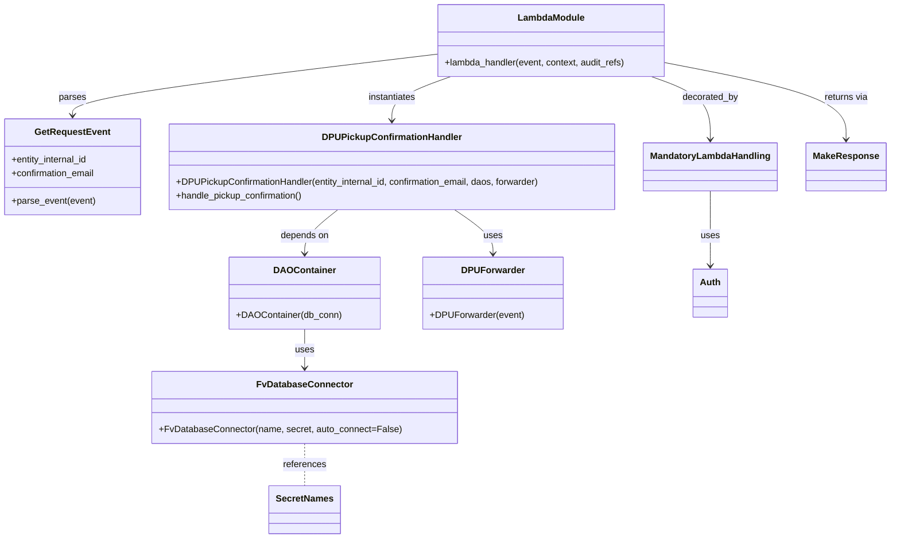

# Diagram: entity_core/entity_service/entity_service/dpu/dpu_service/lambdas/dpu_pickup_confirmation.py


> Auto-generated by Obscura crawlers

## Diagram 1



### SVG

<svg id="container" width="1552.484375" xmlns="http://www.w3.org/2000/svg" class="classDiagram" height="942" viewBox="0 0 1552.484375 942" role="graphics-document document" aria-roledescription="class"><style>#container{font-family:"trebuchet ms",verdana,arial,sans-serif;font-size:16px;fill:#333;}@keyframes edge-animation-frame{from{stroke-dashoffset:0;}}@keyframes dash{to{stroke-dashoffset:0;}}#container .edge-animation-slow{stroke-dasharray:9,5!important;stroke-dashoffset:900;animation:dash 50s linear infinite;stroke-linecap:round;}#container .edge-animation-fast{stroke-dasharray:9,5!important;stroke-dashoffset:900;animation:dash 20s linear infinite;stroke-linecap:round;}#container .error-icon{fill:#552222;}#container .error-text{fill:#552222;stroke:#552222;}#container .edge-thickness-normal{stroke-width:1px;}#container .edge-thickness-thick{stroke-width:3.5px;}#container .edge-pattern-solid{stroke-dasharray:0;}#container .edge-thickness-invisible{stroke-width:0;fill:none;}#container .edge-pattern-dashed{stroke-dasharray:3;}#container .edge-pattern-dotted{stroke-dasharray:2;}#container .marker{fill:#333333;stroke:#333333;}#container .marker.cross{stroke:#333333;}#container svg{font-family:"trebuchet ms",verdana,arial,sans-serif;font-size:16px;}#container p{margin:0;}#container g.classGroup text{fill:#9370DB;stroke:none;font-family:"trebuchet ms",verdana,arial,sans-serif;font-size:10px;}#container g.classGroup text .title{font-weight:bolder;}#container .nodeLabel,#container .edgeLabel{color:#131300;}#container .edgeLabel .label rect{fill:#ECECFF;}#container .label text{fill:#131300;}#container .labelBkg{background:#ECECFF;}#container .edgeLabel .label span{background:#ECECFF;}#container .classTitle{font-weight:bolder;}#container .node rect,#container .node circle,#container .node ellipse,#container .node polygon,#container .node path{fill:#ECECFF;stroke:#9370DB;stroke-width:1px;}#container .divider{stroke:#9370DB;stroke-width:1;}#container g.clickable{cursor:pointer;}#container g.classGroup rect{fill:#ECECFF;stroke:#9370DB;}#container g.classGroup line{stroke:#9370DB;stroke-width:1;}#container .classLabel .box{stroke:none;stroke-width:0;fill:#ECECFF;opacity:0.5;}#container .classLabel .label{fill:#9370DB;font-size:10px;}#container .relation{stroke:#333333;stroke-width:1;fill:none;}#container .dashed-line{stroke-dasharray:3;}#container .dotted-line{stroke-dasharray:1 2;}#container #compositionStart,#container .composition{fill:#333333!important;stroke:#333333!important;stroke-width:1;}#container #compositionEnd,#container .composition{fill:#333333!important;stroke:#333333!important;stroke-width:1;}#container #dependencyStart,#container .dependency{fill:#333333!important;stroke:#333333!important;stroke-width:1;}#container #dependencyStart,#container .dependency{fill:#333333!important;stroke:#333333!important;stroke-width:1;}#container #extensionStart,#container .extension{fill:transparent!important;stroke:#333333!important;stroke-width:1;}#container #extensionEnd,#container .extension{fill:transparent!important;stroke:#333333!important;stroke-width:1;}#container #aggregationStart,#container .aggregation{fill:transparent!important;stroke:#333333!important;stroke-width:1;}#container #aggregationEnd,#container .aggregation{fill:transparent!important;stroke:#333333!important;stroke-width:1;}#container #lollipopStart,#container .lollipop{fill:#ECECFF!important;stroke:#333333!important;stroke-width:1;}#container #lollipopEnd,#container .lollipop{fill:#ECECFF!important;stroke:#333333!important;stroke-width:1;}#container .edgeTerminals{font-size:11px;line-height:initial;}#container .classTitleText{text-anchor:middle;font-size:18px;fill:#333;}#container .label-icon{display:inline-block;height:1em;overflow:visible;vertical-align:-0.125em;}#container .node .label-icon path{fill:currentColor;stroke:revert;stroke-width:revert;}#container :root{--mermaid-font-family:"trebuchet ms",verdana,arial,sans-serif;}</style><g><defs><marker id="container_class-aggregationStart" class="marker aggregation class" refX="18" refY="7" markerWidth="190" markerHeight="240" orient="auto"><path d="M 18,7 L9,13 L1,7 L9,1 Z"></path></marker></defs><defs><marker id="container_class-aggregationEnd" class="marker aggregation class" refX="1" refY="7" markerWidth="20" markerHeight="28" orient="auto"><path d="M 18,7 L9,13 L1,7 L9,1 Z"></path></marker></defs><defs><marker id="container_class-extensionStart" class="marker extension class" refX="18" refY="7" markerWidth="190" markerHeight="240" orient="auto"><path d="M 1,7 L18,13 V 1 Z"></path></marker></defs><defs><marker id="container_class-extensionEnd" class="marker extension class" refX="1" refY="7" markerWidth="20" markerHeight="28" orient="auto"><path d="M 1,1 V 13 L18,7 Z"></path></marker></defs><defs><marker id="container_class-compositionStart" class="marker composition class" refX="18" refY="7" markerWidth="190" markerHeight="240" orient="auto"><path d="M 18,7 L9,13 L1,7 L9,1 Z"></path></marker></defs><defs><marker id="container_class-compositionEnd" class="marker composition class" refX="1" refY="7" markerWidth="20" markerHeight="28" orient="auto"><path d="M 18,7 L9,13 L1,7 L9,1 Z"></path></marker></defs><defs><marker id="container_class-dependencyStart" class="marker dependency class" refX="6" refY="7" markerWidth="190" markerHeight="240" orient="auto"><path d="M 5,7 L9,13 L1,7 L9,1 Z"></path></marker></defs><defs><marker id="container_class-dependencyEnd" class="marker dependency class" refX="13" refY="7" markerWidth="20" markerHeight="28" orient="auto"><path d="M 18,7 L9,13 L14,7 L9,1 Z"></path></marker></defs><defs><marker id="container_class-lollipopStart" class="marker lollipop class" refX="13" refY="7" markerWidth="190" markerHeight="240" orient="auto"><circle stroke="black" fill="transparent" cx="7" cy="7" r="6"></circle></marker></defs><defs><marker id="container_class-lollipopEnd" class="marker lollipop class" refX="1" refY="7" markerWidth="190" markerHeight="240" orient="auto"><circle stroke="black" fill="transparent" cx="7" cy="7" r="6"></circle></marker></defs><g class="root"><g class="clusters"></g><g class="edgePaths"><path d="M767.291,94.86L660.411,107.55C553.531,120.24,339.771,145.62,232.892,163.477C126.012,181.333,126.012,191.667,126.012,196.833L126.012,202" id="id_LambdaModule_GetRequestEvent_1" class="edge-thickness-normal edge-pattern-solid relation" style=";;;" data-edge="true" data-et="edge" data-id="id_LambdaModule_GetRequestEvent_1" data-points="W3sieCI6NzY3LjI5MTAxNTYyNSwieSI6OTQuODU5NTgwNzczNzUyOH0seyJ4IjoxMjYuMDExNzE4NzUsInkiOjE3MX0seyJ4IjoxMjYuMDExNzE4NzUsInkiOjIwOH1d" marker-end="url(#container_class-dependencyEnd)"></path><path d="M792.352,134L775.135,140.167C757.918,146.333,723.485,158.667,706.268,171.5C689.051,184.333,689.051,197.667,689.051,204.333L689.051,211" id="id_LambdaModule_DPUPickupConfirmationHandler_2" class="edge-thickness-normal edge-pattern-solid relation" style=";;;" data-edge="true" data-et="edge" data-id="id_LambdaModule_DPUPickupConfirmationHandler_2" data-points="W3sieCI6NzkyLjM1MjMyNDIxODc1LCJ5IjoxMzR9LHsieCI6Njg5LjA1MDc4MTI1LCJ5IjoxNzF9LHsieCI6Njg5LjA1MDc4MTI1LCJ5IjoyMTd9XQ==" marker-end="url(#container_class-dependencyEnd)"></path><path d="M596.946,367L587.531,374.667C578.116,382.333,559.285,397.667,549.87,410.5C540.455,423.333,540.455,433.667,540.455,438.833L540.455,444" id="id_DPUPickupConfirmationHandler_DAOContainer_3" class="edge-thickness-normal edge-pattern-solid relation" style=";;;" data-edge="true" data-et="edge" data-id="id_DPUPickupConfirmationHandler_DAOContainer_3" data-points="W3sieCI6NTk2Ljk0NjAwNjU4NTc0MzgsInkiOjM2N30seyJ4Ijo1NDAuNDU1MDc4MTI1LCJ5Ijo0MTN9LHsieCI6NTQwLjQ1NTA3ODEyNSwieSI6NDUwfV0=" marker-end="url(#container_class-dependencyEnd)"></path><path d="M540.455,576L540.455,582.167C540.455,588.333,540.455,600.667,540.455,612C540.455,623.333,540.455,633.667,540.455,638.833L540.455,644" id="id_DAOContainer_FvDatabaseConnector_4" class="edge-thickness-normal edge-pattern-solid relation" style=";;;" data-edge="true" data-et="edge" data-id="id_DAOContainer_FvDatabaseConnector_4" data-points="W3sieCI6NTQwLjQ1NTA3ODEyNSwieSI6NTc2fSx7IngiOjU0MC40NTUwNzgxMjUsInkiOjYxM30seyJ4Ijo1NDAuNDU1MDc4MTI1LCJ5Ijo2NTB9XQ==" marker-end="url(#container_class-dependencyEnd)"></path><path d="M800.705,367L812.118,374.667C823.532,382.333,846.359,397.667,857.772,410.5C869.186,423.333,869.186,433.667,869.186,438.833L869.186,444" id="id_DPUPickupConfirmationHandler_DPUForwarder_5" class="edge-thickness-normal edge-pattern-solid relation" style=";;;" data-edge="true" data-et="edge" data-id="id_DPUPickupConfirmationHandler_DPUForwarder_5" data-points="W3sieCI6ODAwLjcwNDU2MTU5NjA3NDQsInkiOjM2N30seyJ4Ijo4NjkuMTg1NTQ2ODc1LCJ5Ijo0MTN9LHsieCI6ODY5LjE4NTU0Njg3NSwieSI6NDUwfV0=" marker-end="url(#container_class-dependencyEnd)"></path><path d="M1169.197,110.449L1220.604,120.541C1272.012,130.633,1374.826,150.816,1426.233,173.075C1477.641,195.333,1477.641,219.667,1477.641,231.833L1477.641,244" id="id_LambdaModule_MakeResponse_6" class="edge-thickness-normal edge-pattern-solid relation" style=";;;" data-edge="true" data-et="edge" data-id="id_LambdaModule_MakeResponse_6" data-points="W3sieCI6MTE2OS4xOTcyNjU2MjUsInkiOjExMC40NDkyNTYzNTgwNTIzOH0seyJ4IjoxNDc3LjY0MDYyNSwieSI6MTcxfSx7IngiOjE0NzcuNjQwNjI1LCJ5IjoyNTB9XQ==" marker-end="url(#container_class-dependencyEnd)"></path><path d="M1144.136,134L1161.353,140.167C1178.57,146.333,1213.004,158.667,1230.221,177C1247.438,195.333,1247.438,219.667,1247.438,231.833L1247.438,244" id="id_LambdaModule_MandatoryLambdaHandling_7" class="edge-thickness-normal edge-pattern-solid relation" style=";;;" data-edge="true" data-et="edge" data-id="id_LambdaModule_MandatoryLambdaHandling_7" data-points="W3sieCI6MTE0NC4xMzU5NTcwMzEyNSwieSI6MTM0fSx7IngiOjEyNDcuNDM3NSwieSI6MTcxfSx7IngiOjEyNDcuNDM3NSwieSI6MjUwfV0=" marker-end="url(#container_class-dependencyEnd)"></path><path d="M1247.438,334L1247.438,347.167C1247.438,360.333,1247.438,386.667,1247.438,408.5C1247.438,430.333,1247.438,447.667,1247.438,456.333L1247.438,465" id="id_MandatoryLambdaHandling_Auth_8" class="edge-thickness-normal edge-pattern-solid relation" style=";;;" data-edge="true" data-et="edge" data-id="id_MandatoryLambdaHandling_Auth_8" data-points="W3sieCI6MTI0Ny40Mzc1LCJ5IjozMzR9LHsieCI6MTI0Ny40Mzc1LCJ5Ijo0MTN9LHsieCI6MTI0Ny40Mzc1LCJ5Ijo0NzF9XQ==" marker-end="url(#container_class-dependencyEnd)"></path><path d="M540.455,776L540.455,782.167C540.455,788.333,540.455,800.667,540.455,813C540.455,825.333,540.455,837.667,540.455,843.833L540.455,850" id="id_FvDatabaseConnector_SecretNames_9" class="edge-thickness-normal edge-pattern-dashed relation" style=";;;" data-edge="true" data-et="edge" data-id="id_FvDatabaseConnector_SecretNames_9" data-points="W3sieCI6NTQwLjQ1NTA3ODEyNSwieSI6Nzc2fSx7IngiOjU0MC40NTUwNzgxMjUsInkiOjgxM30seyJ4Ijo1NDAuNDU1MDc4MTI1LCJ5Ijo4NTB9XQ=="></path></g><g class="edgeLabels"><g class="edgeLabel" transform="translate(126.01171875, 171)"><g class="label" data-id="id_LambdaModule_GetRequestEvent_1" transform="translate(-23.828125, -12)"><foreignObject width="47.65625" height="24"><div xmlns="http://www.w3.org/1999/xhtml" class="labelBkg" style="display: table-cell; white-space: nowrap; line-height: 1.5; max-width: 200px; text-align: center;"><span class="edgeLabel"><p>parses</p></span></div></foreignObject></g></g><g class="edgeLabel" transform="translate(689.05078125, 171)"><g class="label" data-id="id_LambdaModule_DPUPickupConfirmationHandler_2" transform="translate(-42.9140625, -12)"><foreignObject width="85.828125" height="24"><div xmlns="http://www.w3.org/1999/xhtml" class="labelBkg" style="display: table-cell; white-space: nowrap; line-height: 1.5; max-width: 200px; text-align: center;"><span class="edgeLabel"><p>instantiates</p></span></div></foreignObject></g></g><g class="edgeLabel" transform="translate(540.455078125, 413)"><g class="label" data-id="id_DPUPickupConfirmationHandler_DAOContainer_3" transform="translate(-42.9453125, -12)"><foreignObject width="85.890625" height="24"><div xmlns="http://www.w3.org/1999/xhtml" class="labelBkg" style="display: table-cell; white-space: nowrap; line-height: 1.5; max-width: 200px; text-align: center;"><span class="edgeLabel"><p>depends on</p></span></div></foreignObject></g></g><g class="edgeLabel" transform="translate(540.455078125, 613)"><g class="label" data-id="id_DAOContainer_FvDatabaseConnector_4" transform="translate(-16.4921875, -12)"><foreignObject width="32.984375" height="24"><div xmlns="http://www.w3.org/1999/xhtml" class="labelBkg" style="display: table-cell; white-space: nowrap; line-height: 1.5; max-width: 200px; text-align: center;"><span class="edgeLabel"><p>uses</p></span></div></foreignObject></g></g><g class="edgeLabel" transform="translate(869.185546875, 413)"><g class="label" data-id="id_DPUPickupConfirmationHandler_DPUForwarder_5" transform="translate(-16.4921875, -12)"><foreignObject width="32.984375" height="24"><div xmlns="http://www.w3.org/1999/xhtml" class="labelBkg" style="display: table-cell; white-space: nowrap; line-height: 1.5; max-width: 200px; text-align: center;"><span class="edgeLabel"><p>uses</p></span></div></foreignObject></g></g><g class="edgeLabel" transform="translate(1477.640625, 171)"><g class="label" data-id="id_LambdaModule_MakeResponse_6" transform="translate(-38.9296875, -12)"><foreignObject width="77.859375" height="24"><div xmlns="http://www.w3.org/1999/xhtml" class="labelBkg" style="display: table-cell; white-space: nowrap; line-height: 1.5; max-width: 200px; text-align: center;"><span class="edgeLabel"><p>returns via</p></span></div></foreignObject></g></g><g class="edgeLabel" transform="translate(1247.4375, 171)"><g class="label" data-id="id_LambdaModule_MandatoryLambdaHandling_7" transform="translate(-49.375, -12)"><foreignObject width="98.75" height="24"><div xmlns="http://www.w3.org/1999/xhtml" class="labelBkg" style="display: table-cell; white-space: nowrap; line-height: 1.5; max-width: 200px; text-align: center;"><span class="edgeLabel"><p>decorated_by</p></span></div></foreignObject></g></g><g class="edgeLabel" transform="translate(1247.4375, 413)"><g class="label" data-id="id_MandatoryLambdaHandling_Auth_8" transform="translate(-16.4921875, -12)"><foreignObject width="32.984375" height="24"><div xmlns="http://www.w3.org/1999/xhtml" class="labelBkg" style="display: table-cell; white-space: nowrap; line-height: 1.5; max-width: 200px; text-align: center;"><span class="edgeLabel"><p>uses</p></span></div></foreignObject></g></g><g class="edgeLabel" transform="translate(540.455078125, 813)"><g class="label" data-id="id_FvDatabaseConnector_SecretNames_9" transform="translate(-37.828125, -12)"><foreignObject width="75.65625" height="24"><div xmlns="http://www.w3.org/1999/xhtml" class="labelBkg" style="display: table-cell; white-space: nowrap; line-height: 1.5; max-width: 200px; text-align: center;"><span class="edgeLabel"><p>references</p></span></div></foreignObject></g></g></g><g class="nodes"><g class="node default" id="classId-LambdaModule-0" transform="translate(968.244140625, 71)"><g class="basic label-container"><path d="M-200.953125 -63 L200.953125 -63 L200.953125 63 L-200.953125 63" stroke="none" stroke-width="0" fill="#ECECFF" style=""></path><path d="M-200.953125 -63 C-72.30713349988312 -63, 56.338858000233756 -63, 200.953125 -63 M-200.953125 -63 C-75.74000695203046 -63, 49.47311109593909 -63, 200.953125 -63 M200.953125 -63 C200.953125 -25.572598494845387, 200.953125 11.854803010309226, 200.953125 63 M200.953125 -63 C200.953125 -33.326906640708984, 200.953125 -3.6538132814179747, 200.953125 63 M200.953125 63 C86.86879133029123 63, -27.21554233941754 63, -200.953125 63 M200.953125 63 C47.65429948626914 63, -105.64452602746172 63, -200.953125 63 M-200.953125 63 C-200.953125 22.099180213712984, -200.953125 -18.801639572574032, -200.953125 -63 M-200.953125 63 C-200.953125 31.175362849221713, -200.953125 -0.6492743015565736, -200.953125 -63" stroke="#9370DB" stroke-width="1.3" fill="none" stroke-dasharray="0 0" style=""></path></g><g class="annotation-group text" transform="translate(0, -39)"></g><g class="label-group text" transform="translate(-56.21875, -39)"><g class="label" style="font-weight: bolder" transform="translate(0,-12)"><foreignObject width="112.4375" height="24"><div xmlns="http://www.w3.org/1999/xhtml" style="display: table-cell; white-space: nowrap; line-height: 1.5; max-width: 162px; text-align: center;"><span class="nodeLabel markdown-node-label" style=""><p>LambdaModule</p></span></div></foreignObject></g></g><g class="members-group text" transform="translate(-188.953125, 9)"></g><g class="methods-group text" transform="translate(-188.953125, 39)"><g class="label" style="" transform="translate(0,-12)"><foreignObject width="321.6875" height="24"><div xmlns="http://www.w3.org/1999/xhtml" style="display: table-cell; white-space: nowrap; line-height: 1.5; max-width: 379px; text-align: center;"><span class="nodeLabel markdown-node-label" style=""><p>+lambda_handler(event, context, audit_refs)</p></span></div></foreignObject></g></g><g class="divider" style=""><path d="M-200.953125 -15 C-90.4100885900387 -15, 20.132947819922606 -15, 200.953125 -15 M-200.953125 -15 C-76.64616848993712 -15, 47.66078802012575 -15, 200.953125 -15" stroke="#9370DB" stroke-width="1.3" fill="none" stroke-dasharray="0 0" style=""></path></g><g class="divider" style=""><path d="M-200.953125 9 C-65.30021682441091 9, 70.35269135117818 9, 200.953125 9 M-200.953125 9 C-64.11089459751221 9, 72.73133580497557 9, 200.953125 9" stroke="#9370DB" stroke-width="1.3" fill="none" stroke-dasharray="0 0" style=""></path></g></g><g class="node default" id="classId-GetRequestEvent-1" transform="translate(126.01171875, 292)"><g class="basic label-container"><path d="M-118.01171875 -84 L118.01171875 -84 L118.01171875 84 L-118.01171875 84" stroke="none" stroke-width="0" fill="#ECECFF" style=""></path><path d="M-118.01171875 -84 C-26.03336467159812 -84, 65.94498940680376 -84, 118.01171875 -84 M-118.01171875 -84 C-31.090674782429033 -84, 55.83036918514193 -84, 118.01171875 -84 M118.01171875 -84 C118.01171875 -23.14423848021422, 118.01171875 37.71152303957156, 118.01171875 84 M118.01171875 -84 C118.01171875 -23.067384914371615, 118.01171875 37.86523017125677, 118.01171875 84 M118.01171875 84 C66.05693693724893 84, 14.10215512449787 84, -118.01171875 84 M118.01171875 84 C34.969527654805674 84, -48.07266344038865 84, -118.01171875 84 M-118.01171875 84 C-118.01171875 28.308664546821376, -118.01171875 -27.382670906357248, -118.01171875 -84 M-118.01171875 84 C-118.01171875 45.5066200544364, -118.01171875 7.013240108872793, -118.01171875 -84" stroke="#9370DB" stroke-width="1.3" fill="none" stroke-dasharray="0 0" style=""></path></g><g class="annotation-group text" transform="translate(0, -60)"></g><g class="label-group text" transform="translate(-62.8515625, -60)"><g class="label" style="font-weight: bolder" transform="translate(0,-12)"><foreignObject width="125.703125" height="24"><div xmlns="http://www.w3.org/1999/xhtml" style="display: table-cell; white-space: nowrap; line-height: 1.5; max-width: 174px; text-align: center;"><span class="nodeLabel markdown-node-label" style=""><p>GetRequestEvent</p></span></div></foreignObject></g></g><g class="members-group text" transform="translate(-106.01171875, -12)"><g class="label" style="" transform="translate(0,-12)"><foreignObject width="137.109375" height="24"><div xmlns="http://www.w3.org/1999/xhtml" style="display: table-cell; white-space: nowrap; line-height: 1.5; max-width: 194px; text-align: center;"><span class="nodeLabel markdown-node-label" style=""><p>+entity_internal_id</p></span></div></foreignObject></g><g class="label" style="" transform="translate(0,12)"><foreignObject width="149.171875" height="24"><div xmlns="http://www.w3.org/1999/xhtml" style="display: table-cell; white-space: nowrap; line-height: 1.5; max-width: 207px; text-align: center;"><span class="nodeLabel markdown-node-label" style=""><p>+confirmation_email</p></span></div></foreignObject></g></g><g class="methods-group text" transform="translate(-106.01171875, 60)"><g class="label" style="" transform="translate(0,-12)"><foreignObject width="146.890625" height="24"><div xmlns="http://www.w3.org/1999/xhtml" style="display: table-cell; white-space: nowrap; line-height: 1.5; max-width: 204px; text-align: center;"><span class="nodeLabel markdown-node-label" style=""><p>+parse_event(event)</p></span></div></foreignObject></g></g><g class="divider" style=""><path d="M-118.01171875 -36 C-47.80082249616527 -36, 22.410073757669466 -36, 118.01171875 -36 M-118.01171875 -36 C-57.24104994963505 -36, 3.5296188507299036 -36, 118.01171875 -36" stroke="#9370DB" stroke-width="1.3" fill="none" stroke-dasharray="0 0" style=""></path></g><g class="divider" style=""><path d="M-118.01171875 36 C-39.61214932447314 36, 38.787420101053726 36, 118.01171875 36 M-118.01171875 36 C-59.6774696236778 36, -1.3432204973556026 36, 118.01171875 36" stroke="#9370DB" stroke-width="1.3" fill="none" stroke-dasharray="0 0" style=""></path></g></g><g class="node default" id="classId-DPUPickupConfirmationHandler-2" transform="translate(689.05078125, 292)"><g class="basic label-container"><path d="M-395.02734375 -75 L395.02734375 -75 L395.02734375 75 L-395.02734375 75" stroke="none" stroke-width="0" fill="#ECECFF" style=""></path><path d="M-395.02734375 -75 C-231.14969218356543 -75, -67.27204061713087 -75, 395.02734375 -75 M-395.02734375 -75 C-185.156419716364 -75, 24.714504317271974 -75, 395.02734375 -75 M395.02734375 -75 C395.02734375 -28.407426650488745, 395.02734375 18.18514669902251, 395.02734375 75 M395.02734375 -75 C395.02734375 -23.629261337391547, 395.02734375 27.741477325216906, 395.02734375 75 M395.02734375 75 C165.1270849267248 75, -64.77317389655042 75, -395.02734375 75 M395.02734375 75 C153.00459171830911 75, -89.01816031338177 75, -395.02734375 75 M-395.02734375 75 C-395.02734375 28.331436572532425, -395.02734375 -18.33712685493515, -395.02734375 -75 M-395.02734375 75 C-395.02734375 23.906196279372843, -395.02734375 -27.187607441254315, -395.02734375 -75" stroke="#9370DB" stroke-width="1.3" fill="none" stroke-dasharray="0 0" style=""></path></g><g class="annotation-group text" transform="translate(0, -51)"></g><g class="label-group text" transform="translate(-116.3984375, -51)"><g class="label" style="font-weight: bolder" transform="translate(0,-12)"><foreignObject width="232.796875" height="24"><div xmlns="http://www.w3.org/1999/xhtml" style="display: table-cell; white-space: nowrap; line-height: 1.5; max-width: 282px; text-align: center;"><span class="nodeLabel markdown-node-label" style=""><p>DPUPickupConfirmationHandler</p></span></div></foreignObject></g></g><g class="members-group text" transform="translate(-383.02734375, -3)"></g><g class="methods-group text" transform="translate(-383.02734375, 27)"><g class="label" style="" transform="translate(0,-12)"><foreignObject width="649.65625" height="24"><div xmlns="http://www.w3.org/1999/xhtml" style="display: table-cell; white-space: nowrap; line-height: 1.5; max-width: 707px; text-align: center;"><span class="nodeLabel markdown-node-label" style=""><p>+DPUPickupConfirmationHandler(entity_internal_id, confirmation_email, daos, forwarder)</p></span></div></foreignObject></g><g class="label" style="" transform="translate(0,12)"><foreignObject width="225.796875" height="24"><div xmlns="http://www.w3.org/1999/xhtml" style="display: table-cell; white-space: nowrap; line-height: 1.5; max-width: 283px; text-align: center;"><span class="nodeLabel markdown-node-label" style=""><p>+handle_pickup_confirmation()</p></span></div></foreignObject></g></g><g class="divider" style=""><path d="M-395.02734375 -27 C-228.60398536955063 -27, -62.180626989101256 -27, 395.02734375 -27 M-395.02734375 -27 C-128.9793149659718 -27, 137.06871381805638 -27, 395.02734375 -27" stroke="#9370DB" stroke-width="1.3" fill="none" stroke-dasharray="0 0" style=""></path></g><g class="divider" style=""><path d="M-395.02734375 -3 C-194.16443309319715 -3, 6.698477563605707 -3, 395.02734375 -3 M-395.02734375 -3 C-210.4342865147716 -3, -25.8412292795432 -3, 395.02734375 -3" stroke="#9370DB" stroke-width="1.3" fill="none" stroke-dasharray="0 0" style=""></path></g></g><g class="node default" id="classId-DAOContainer-3" transform="translate(540.455078125, 513)"><g class="basic label-container"><path d="M-128.08203125 -63 L128.08203125 -63 L128.08203125 63 L-128.08203125 63" stroke="none" stroke-width="0" fill="#ECECFF" style=""></path><path d="M-128.08203125 -63 C-49.24039712672301 -63, 29.60123699655398 -63, 128.08203125 -63 M-128.08203125 -63 C-37.613988718978234 -63, 52.85405381204353 -63, 128.08203125 -63 M128.08203125 -63 C128.08203125 -20.332499747734282, 128.08203125 22.335000504531436, 128.08203125 63 M128.08203125 -63 C128.08203125 -27.057890753178754, 128.08203125 8.884218493642493, 128.08203125 63 M128.08203125 63 C69.00572234052754 63, 9.929413431055082 63, -128.08203125 63 M128.08203125 63 C37.90357923315355 63, -52.2748727836929 63, -128.08203125 63 M-128.08203125 63 C-128.08203125 20.193990147759344, -128.08203125 -22.612019704481312, -128.08203125 -63 M-128.08203125 63 C-128.08203125 32.00339927406354, -128.08203125 1.0067985481270725, -128.08203125 -63" stroke="#9370DB" stroke-width="1.3" fill="none" stroke-dasharray="0 0" style=""></path></g><g class="annotation-group text" transform="translate(0, -39)"></g><g class="label-group text" transform="translate(-50.8984375, -39)"><g class="label" style="font-weight: bolder" transform="translate(0,-12)"><foreignObject width="101.796875" height="24"><div xmlns="http://www.w3.org/1999/xhtml" style="display: table-cell; white-space: nowrap; line-height: 1.5; max-width: 152px; text-align: center;"><span class="nodeLabel markdown-node-label" style=""><p>DAOContainer</p></span></div></foreignObject></g></g><g class="members-group text" transform="translate(-116.08203125, 9)"></g><g class="methods-group text" transform="translate(-116.08203125, 39)"><g class="label" style="" transform="translate(0,-12)"><foreignObject width="181.265625" height="24"><div xmlns="http://www.w3.org/1999/xhtml" style="display: table-cell; white-space: nowrap; line-height: 1.5; max-width: 239px; text-align: center;"><span class="nodeLabel markdown-node-label" style=""><p>+DAOContainer(db_conn)</p></span></div></foreignObject></g></g><g class="divider" style=""><path d="M-128.08203125 -15 C-68.84614739971539 -15, -9.610263549430783 -15, 128.08203125 -15 M-128.08203125 -15 C-65.51553500193899 -15, -2.9490387538779714 -15, 128.08203125 -15" stroke="#9370DB" stroke-width="1.3" fill="none" stroke-dasharray="0 0" style=""></path></g><g class="divider" style=""><path d="M-128.08203125 9 C-43.780004483177976 9, 40.52202228364405 9, 128.08203125 9 M-128.08203125 9 C-41.10604095954167 9, 45.869949330916654 9, 128.08203125 9" stroke="#9370DB" stroke-width="1.3" fill="none" stroke-dasharray="0 0" style=""></path></g></g><g class="node default" id="classId-DPUForwarder-4" transform="translate(869.185546875, 513)"><g class="basic label-container"><path d="M-119.109375 -63 L119.109375 -63 L119.109375 63 L-119.109375 63" stroke="none" stroke-width="0" fill="#ECECFF" style=""></path><path d="M-119.109375 -63 C-35.08705085421275 -63, 48.935273291574504 -63, 119.109375 -63 M-119.109375 -63 C-25.335471323077854 -63, 68.43843235384429 -63, 119.109375 -63 M119.109375 -63 C119.109375 -33.82032116428733, 119.109375 -4.640642328574657, 119.109375 63 M119.109375 -63 C119.109375 -13.27766538094378, 119.109375 36.44466923811244, 119.109375 63 M119.109375 63 C52.29556520088465 63, -14.518244598230694 63, -119.109375 63 M119.109375 63 C47.903733868223114 63, -23.301907263553773 63, -119.109375 63 M-119.109375 63 C-119.109375 20.471196865815678, -119.109375 -22.057606268368644, -119.109375 -63 M-119.109375 63 C-119.109375 21.195726964822455, -119.109375 -20.60854607035509, -119.109375 -63" stroke="#9370DB" stroke-width="1.3" fill="none" stroke-dasharray="0 0" style=""></path></g><g class="annotation-group text" transform="translate(0, -39)"></g><g class="label-group text" transform="translate(-52.375, -39)"><g class="label" style="font-weight: bolder" transform="translate(0,-12)"><foreignObject width="104.75" height="24"><div xmlns="http://www.w3.org/1999/xhtml" style="display: table-cell; white-space: nowrap; line-height: 1.5; max-width: 154px; text-align: center;"><span class="nodeLabel markdown-node-label" style=""><p>DPUForwarder</p></span></div></foreignObject></g></g><g class="members-group text" transform="translate(-107.109375, 9)"></g><g class="methods-group text" transform="translate(-107.109375, 39)"><g class="label" style="" transform="translate(0,-12)"><foreignObject width="161.84375" height="24"><div xmlns="http://www.w3.org/1999/xhtml" style="display: table-cell; white-space: nowrap; line-height: 1.5; max-width: 219px; text-align: center;"><span class="nodeLabel markdown-node-label" style=""><p>+DPUForwarder(event)</p></span></div></foreignObject></g></g><g class="divider" style=""><path d="M-119.109375 -15 C-54.64814482611891 -15, 9.813085347762183 -15, 119.109375 -15 M-119.109375 -15 C-54.85469887272991 -15, 9.399977254540175 -15, 119.109375 -15" stroke="#9370DB" stroke-width="1.3" fill="none" stroke-dasharray="0 0" style=""></path></g><g class="divider" style=""><path d="M-119.109375 9 C-46.307166098268496 9, 26.495042803463008 9, 119.109375 9 M-119.109375 9 C-35.33458991703962 9, 48.440195165920755 9, 119.109375 9" stroke="#9370DB" stroke-width="1.3" fill="none" stroke-dasharray="0 0" style=""></path></g></g><g class="node default" id="classId-FvDatabaseConnector-5" transform="translate(540.455078125, 713)"><g class="basic label-container"><path d="M-260.68359375 -63 L260.68359375 -63 L260.68359375 63 L-260.68359375 63" stroke="none" stroke-width="0" fill="#ECECFF" style=""></path><path d="M-260.68359375 -63 C-103.92408901019746 -63, 52.835415729605074 -63, 260.68359375 -63 M-260.68359375 -63 C-64.10631852657693 -63, 132.47095669684614 -63, 260.68359375 -63 M260.68359375 -63 C260.68359375 -23.573352498469212, 260.68359375 15.853295003061575, 260.68359375 63 M260.68359375 -63 C260.68359375 -31.28037919733912, 260.68359375 0.4392416053217616, 260.68359375 63 M260.68359375 63 C107.45924835549937 63, -45.76509703900126 63, -260.68359375 63 M260.68359375 63 C79.1200883572591 63, -102.44341703548179 63, -260.68359375 63 M-260.68359375 63 C-260.68359375 28.768899861070366, -260.68359375 -5.462200277859267, -260.68359375 -63 M-260.68359375 63 C-260.68359375 25.340978724584602, -260.68359375 -12.318042550830796, -260.68359375 -63" stroke="#9370DB" stroke-width="1.3" fill="none" stroke-dasharray="0 0" style=""></path></g><g class="annotation-group text" transform="translate(0, -39)"></g><g class="label-group text" transform="translate(-79.3046875, -39)"><g class="label" style="font-weight: bolder" transform="translate(0,-12)"><foreignObject width="158.609375" height="24"><div xmlns="http://www.w3.org/1999/xhtml" style="display: table-cell; white-space: nowrap; line-height: 1.5; max-width: 207px; text-align: center;"><span class="nodeLabel markdown-node-label" style=""><p>FvDatabaseConnector</p></span></div></foreignObject></g></g><g class="members-group text" transform="translate(-248.68359375, 9)"></g><g class="methods-group text" transform="translate(-248.68359375, 39)"><g class="label" style="" transform="translate(0,-12)"><foreignObject width="418.0625" height="24"><div xmlns="http://www.w3.org/1999/xhtml" style="display: table-cell; white-space: nowrap; line-height: 1.5; max-width: 475px; text-align: center;"><span class="nodeLabel markdown-node-label" style=""><p>+FvDatabaseConnector(name, secret, auto_connect=False)</p></span></div></foreignObject></g></g><g class="divider" style=""><path d="M-260.68359375 -15 C-124.187383375021 -15, 12.308826999958 -15, 260.68359375 -15 M-260.68359375 -15 C-137.45970578161484 -15, -14.235817813229716 -15, 260.68359375 -15" stroke="#9370DB" stroke-width="1.3" fill="none" stroke-dasharray="0 0" style=""></path></g><g class="divider" style=""><path d="M-260.68359375 9 C-54.949559974770665 9, 150.78447380045867 9, 260.68359375 9 M-260.68359375 9 C-77.08856486631353 9, 106.50646401737293 9, 260.68359375 9" stroke="#9370DB" stroke-width="1.3" fill="none" stroke-dasharray="0 0" style=""></path></g></g><g class="node default" id="classId-SecretNames-6" transform="translate(540.455078125, 892)"><g class="basic label-container"><path d="M-60.03125 -42 L60.03125 -42 L60.03125 42 L-60.03125 42" stroke="none" stroke-width="0" fill="#ECECFF" style=""></path><path d="M-60.03125 -42 C-19.38011420656572 -42, 21.271021586868557 -42, 60.03125 -42 M-60.03125 -42 C-23.925343654578562 -42, 12.180562690842876 -42, 60.03125 -42 M60.03125 -42 C60.03125 -19.051774090407513, 60.03125 3.896451819184975, 60.03125 42 M60.03125 -42 C60.03125 -18.407920424891522, 60.03125 5.184159150216956, 60.03125 42 M60.03125 42 C20.59983771715188 42, -18.831574565696243 42, -60.03125 42 M60.03125 42 C19.629953047297228 42, -20.771343905405544 42, -60.03125 42 M-60.03125 42 C-60.03125 11.088007957190907, -60.03125 -19.823984085618186, -60.03125 -42 M-60.03125 42 C-60.03125 20.53739555556882, -60.03125 -0.9252088888623575, -60.03125 -42" stroke="#9370DB" stroke-width="1.3" fill="none" stroke-dasharray="0 0" style=""></path></g><g class="annotation-group text" transform="translate(0, -18)"></g><g class="label-group text" transform="translate(-48.03125, -18)"><g class="label" style="font-weight: bolder" transform="translate(0,-12)"><foreignObject width="96.0625" height="24"><div xmlns="http://www.w3.org/1999/xhtml" style="display: table-cell; white-space: nowrap; line-height: 1.5; max-width: 145px; text-align: center;"><span class="nodeLabel markdown-node-label" style=""><p>SecretNames</p></span></div></foreignObject></g></g><g class="members-group text" transform="translate(-48.03125, 30)"></g><g class="methods-group text" transform="translate(-48.03125, 60)"></g><g class="divider" style=""><path d="M-60.03125 6 C-17.226976437557703 6, 25.577297124884595 6, 60.03125 6 M-60.03125 6 C-16.355317945376413 6, 27.320614109247174 6, 60.03125 6" stroke="#9370DB" stroke-width="1.3" fill="none" stroke-dasharray="0 0" style=""></path></g><g class="divider" style=""><path d="M-60.03125 24 C-28.617029007485407 24, 2.797191985029187 24, 60.03125 24 M-60.03125 24 C-21.250228525237432 24, 17.530792949525136 24, 60.03125 24" stroke="#9370DB" stroke-width="1.3" fill="none" stroke-dasharray="0 0" style=""></path></g></g><g class="node default" id="classId-Auth-7" transform="translate(1247.4375, 513)"><g class="basic label-container"><path d="M-29.0078125 -42 L29.0078125 -42 L29.0078125 42 L-29.0078125 42" stroke="none" stroke-width="0" fill="#ECECFF" style=""></path><path d="M-29.0078125 -42 C-12.822060884732078 -42, 3.3636907305358434 -42, 29.0078125 -42 M-29.0078125 -42 C-8.804436971927586 -42, 11.398938556144827 -42, 29.0078125 -42 M29.0078125 -42 C29.0078125 -24.984980633287982, 29.0078125 -7.9699612665759645, 29.0078125 42 M29.0078125 -42 C29.0078125 -21.712660777148194, 29.0078125 -1.4253215542963886, 29.0078125 42 M29.0078125 42 C10.115645727252243 42, -8.776521045495514 42, -29.0078125 42 M29.0078125 42 C14.26876645086408 42, -0.4702795982718406 42, -29.0078125 42 M-29.0078125 42 C-29.0078125 15.634993737502562, -29.0078125 -10.730012524994876, -29.0078125 -42 M-29.0078125 42 C-29.0078125 14.857696643929653, -29.0078125 -12.284606712140693, -29.0078125 -42" stroke="#9370DB" stroke-width="1.3" fill="none" stroke-dasharray="0 0" style=""></path></g><g class="annotation-group text" transform="translate(0, -18)"></g><g class="label-group text" transform="translate(-17.0078125, -18)"><g class="label" style="font-weight: bolder" transform="translate(0,-12)"><foreignObject width="34.015625" height="24"><div xmlns="http://www.w3.org/1999/xhtml" style="display: table-cell; white-space: nowrap; line-height: 1.5; max-width: 84px; text-align: center;"><span class="nodeLabel markdown-node-label" style=""><p>Auth</p></span></div></foreignObject></g></g><g class="members-group text" transform="translate(-17.0078125, 30)"></g><g class="methods-group text" transform="translate(-17.0078125, 60)"></g><g class="divider" style=""><path d="M-29.0078125 6 C-10.748765649312386 6, 7.5102812013752285 6, 29.0078125 6 M-29.0078125 6 C-17.36593782043065 6, -5.724063140861297 6, 29.0078125 6" stroke="#9370DB" stroke-width="1.3" fill="none" stroke-dasharray="0 0" style=""></path></g><g class="divider" style=""><path d="M-29.0078125 24 C-10.327736816835614 24, 8.352338866328772 24, 29.0078125 24 M-29.0078125 24 C-17.176610834005118 24, -5.345409168010232 24, 29.0078125 24" stroke="#9370DB" stroke-width="1.3" fill="none" stroke-dasharray="0 0" style=""></path></g></g><g class="node default" id="classId-MandatoryLambdaHandling-8" transform="translate(1247.4375, 292)"><g class="basic label-container"><path d="M-113.359375 -42 L113.359375 -42 L113.359375 42 L-113.359375 42" stroke="none" stroke-width="0" fill="#ECECFF" style=""></path><path d="M-113.359375 -42 C-59.29093367665804 -42, -5.222492353316085 -42, 113.359375 -42 M-113.359375 -42 C-25.95140213248139 -42, 61.45657073503722 -42, 113.359375 -42 M113.359375 -42 C113.359375 -19.083210279060353, 113.359375 3.8335794418792943, 113.359375 42 M113.359375 -42 C113.359375 -20.516492905230674, 113.359375 0.9670141895386521, 113.359375 42 M113.359375 42 C50.009248134808104 42, -13.340878730383793 42, -113.359375 42 M113.359375 42 C28.446075758072837 42, -56.467223483854326 42, -113.359375 42 M-113.359375 42 C-113.359375 13.804533168008412, -113.359375 -14.390933663983176, -113.359375 -42 M-113.359375 42 C-113.359375 13.133933300137318, -113.359375 -15.732133399725363, -113.359375 -42" stroke="#9370DB" stroke-width="1.3" fill="none" stroke-dasharray="0 0" style=""></path></g><g class="annotation-group text" transform="translate(0, -18)"></g><g class="label-group text" transform="translate(-101.359375, -18)"><g class="label" style="font-weight: bolder" transform="translate(0,-12)"><foreignObject width="202.71875" height="24"><div xmlns="http://www.w3.org/1999/xhtml" style="display: table-cell; white-space: nowrap; line-height: 1.5; max-width: 252px; text-align: center;"><span class="nodeLabel markdown-node-label" style=""><p>MandatoryLambdaHandling</p></span></div></foreignObject></g></g><g class="members-group text" transform="translate(-101.359375, 30)"></g><g class="methods-group text" transform="translate(-101.359375, 60)"></g><g class="divider" style=""><path d="M-113.359375 6 C-38.95123003331847 6, 35.456914933363066 6, 113.359375 6 M-113.359375 6 C-33.55886860452809 6, 46.24163779094383 6, 113.359375 6" stroke="#9370DB" stroke-width="1.3" fill="none" stroke-dasharray="0 0" style=""></path></g><g class="divider" style=""><path d="M-113.359375 24 C-33.37354743291404 24, 46.612280134171925 24, 113.359375 24 M-113.359375 24 C-53.95895904237956 24, 5.441456915240877 24, 113.359375 24" stroke="#9370DB" stroke-width="1.3" fill="none" stroke-dasharray="0 0" style=""></path></g></g><g class="node default" id="classId-MakeResponse-9" transform="translate(1477.640625, 292)"><g class="basic label-container"><path d="M-66.84375 -42 L66.84375 -42 L66.84375 42 L-66.84375 42" stroke="none" stroke-width="0" fill="#ECECFF" style=""></path><path d="M-66.84375 -42 C-38.85581990400162 -42, -10.867889808003234 -42, 66.84375 -42 M-66.84375 -42 C-21.656130593467722 -42, 23.531488813064556 -42, 66.84375 -42 M66.84375 -42 C66.84375 -11.052210525532345, 66.84375 19.89557894893531, 66.84375 42 M66.84375 -42 C66.84375 -18.74319780041336, 66.84375 4.513604399173282, 66.84375 42 M66.84375 42 C31.448131297617905 42, -3.947487404764189 42, -66.84375 42 M66.84375 42 C15.41391026467894 42, -36.01592947064212 42, -66.84375 42 M-66.84375 42 C-66.84375 14.427855702367676, -66.84375 -13.144288595264648, -66.84375 -42 M-66.84375 42 C-66.84375 23.89558494814896, -66.84375 5.791169896297923, -66.84375 -42" stroke="#9370DB" stroke-width="1.3" fill="none" stroke-dasharray="0 0" style=""></path></g><g class="annotation-group text" transform="translate(0, -18)"></g><g class="label-group text" transform="translate(-54.84375, -18)"><g class="label" style="font-weight: bolder" transform="translate(0,-12)"><foreignObject width="109.6875" height="24"><div xmlns="http://www.w3.org/1999/xhtml" style="display: table-cell; white-space: nowrap; line-height: 1.5; max-width: 158px; text-align: center;"><span class="nodeLabel markdown-node-label" style=""><p>MakeResponse</p></span></div></foreignObject></g></g><g class="members-group text" transform="translate(-54.84375, 30)"></g><g class="methods-group text" transform="translate(-54.84375, 60)"></g><g class="divider" style=""><path d="M-66.84375 6 C-31.799610999818356 6, 3.244528000363289 6, 66.84375 6 M-66.84375 6 C-26.87910240158231 6, 13.085545196835383 6, 66.84375 6" stroke="#9370DB" stroke-width="1.3" fill="none" stroke-dasharray="0 0" style=""></path></g><g class="divider" style=""><path d="M-66.84375 24 C-24.611170781902814 24, 17.621408436194372 24, 66.84375 24 M-66.84375 24 C-35.62896698242976 24, -4.414183964859518 24, 66.84375 24" stroke="#9370DB" stroke-width="1.3" fill="none" stroke-dasharray="0 0" style=""></path></g></g></g></g></g></svg>

## Diagram 2

```mermaid
flowchart TD
    subgraph Decorator
        DEC[mandatory_lambda_handling(auth_check=AUTH_CHECK)]
        AUTH[auth]
        DEC --> AUTH
    end

    A[Incoming Event] --> B[GetRequestEvent.parse_event()]
    B --> C[Create DPUPickupConfirmationHandler<br/>(entity_internal_id, confirmation_email, daos=DAOContainer(DB_CONN), forwarder=DPUForwarder(event))]
    C --> D[handler.handle_pickup_confirmation()]
    D --> E[make_response({"status":"SUCCESS"})]
    E --> F[Return SUCCESS]

    subgraph Setup
        DB[FvDatabaseConnector("dpu_pickup_confirmation", SecretNames.ENTITY_DATABASE, auto_connect=False)]
        DAOs[DAOContainer(DB_CONN)]
        FW[DPUForwarder(event)]
    end

    C --> DAOs
    C --> FW
    DAOs --> DB
    DEC --> A
    DEC --> B
```

> SVG rendering failed for this diagram.
