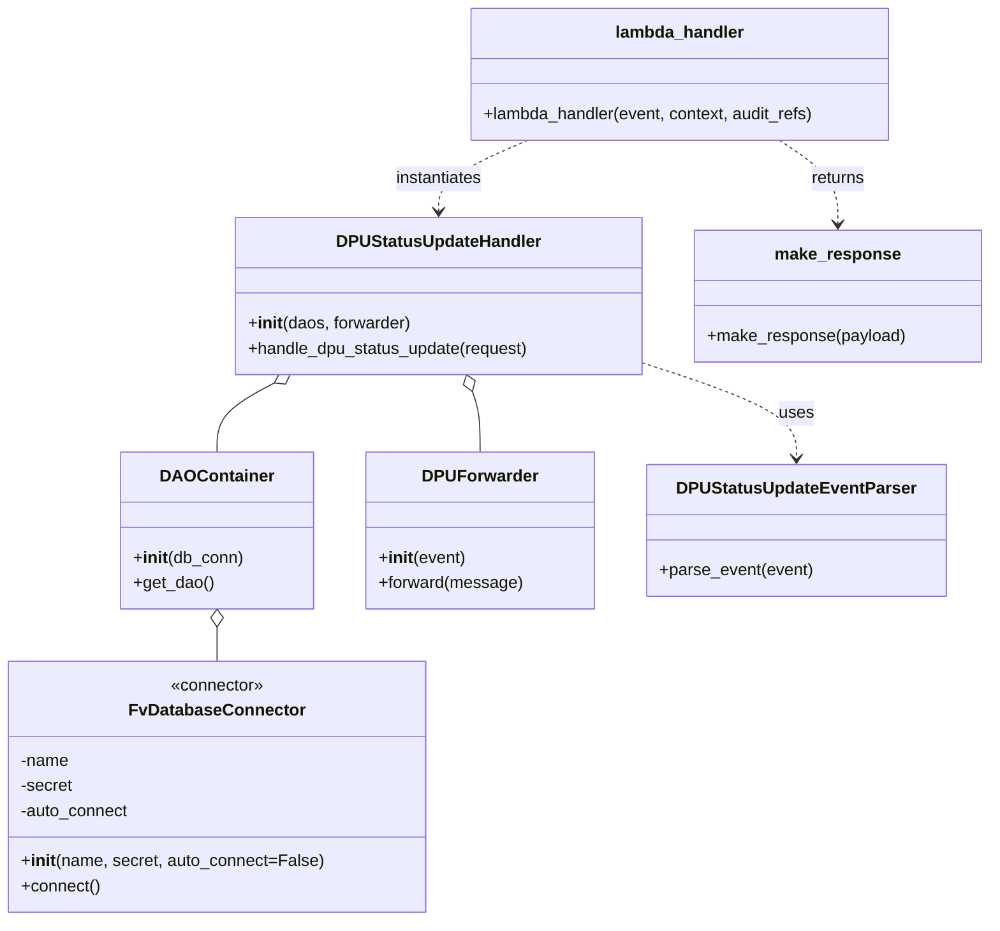

# Diagram: entity_core/entity_service/entity_service/dpu/dpu_service/lambdas/dpu_status_update.py


> Auto-generated by Obscura crawlers

## Diagram 1

```mermaid
flowchart LR
  Event[Incoming Event] --> Decorator[mandatory_lambda_handling<br/>(auth_check=AUTH_CHECK)]
  Decorator --> Lambda[lambda_handler(event, context, audit_refs)]
  Lambda --> AuthCheck[AUTH_CHECK<br/>(auth.AuthType.SOLUTION -> pathParameters.solution_id)]
  Lambda --> DB[FvDatabaseConnector<br/>("dpu_status_update", SecretNames.ENTITY_DATABASE)]
  Lambda --> Parser[DPUStatusUpdateEventParser.parse_event(event)]
  Parser --> HandlerCtor[DPUStatusUpdateHandler ← constructs]
  HandlerCtor --> DAO[DAOContainer(DB_CONN)]
  HandlerCtor --> Forwarder[DPUForwarder(event)]
  HandlerCtor --> Handle[handler.handle_dpu_status_update(request)]
  Handle --> MakeResp[make_response({})]
  MakeResp --> Response[HTTP Response]
```

> SVG rendering failed for this diagram.

## Diagram 2



### SVG

<svg id="container" width="930.876953125" xmlns="http://www.w3.org/2000/svg" class="classDiagram" height="880" viewBox="0 0 930.876953125 880" role="graphics-document document" aria-roledescription="class"><style>#container{font-family:"trebuchet ms",verdana,arial,sans-serif;font-size:16px;fill:#333;}@keyframes edge-animation-frame{from{stroke-dashoffset:0;}}@keyframes dash{to{stroke-dashoffset:0;}}#container .edge-animation-slow{stroke-dasharray:9,5!important;stroke-dashoffset:900;animation:dash 50s linear infinite;stroke-linecap:round;}#container .edge-animation-fast{stroke-dasharray:9,5!important;stroke-dashoffset:900;animation:dash 20s linear infinite;stroke-linecap:round;}#container .error-icon{fill:#552222;}#container .error-text{fill:#552222;stroke:#552222;}#container .edge-thickness-normal{stroke-width:1px;}#container .edge-thickness-thick{stroke-width:3.5px;}#container .edge-pattern-solid{stroke-dasharray:0;}#container .edge-thickness-invisible{stroke-width:0;fill:none;}#container .edge-pattern-dashed{stroke-dasharray:3;}#container .edge-pattern-dotted{stroke-dasharray:2;}#container .marker{fill:#333333;stroke:#333333;}#container .marker.cross{stroke:#333333;}#container svg{font-family:"trebuchet ms",verdana,arial,sans-serif;font-size:16px;}#container p{margin:0;}#container g.classGroup text{fill:#9370DB;stroke:none;font-family:"trebuchet ms",verdana,arial,sans-serif;font-size:10px;}#container g.classGroup text .title{font-weight:bolder;}#container .nodeLabel,#container .edgeLabel{color:#131300;}#container .edgeLabel .label rect{fill:#ECECFF;}#container .label text{fill:#131300;}#container .labelBkg{background:#ECECFF;}#container .edgeLabel .label span{background:#ECECFF;}#container .classTitle{font-weight:bolder;}#container .node rect,#container .node circle,#container .node ellipse,#container .node polygon,#container .node path{fill:#ECECFF;stroke:#9370DB;stroke-width:1px;}#container .divider{stroke:#9370DB;stroke-width:1;}#container g.clickable{cursor:pointer;}#container g.classGroup rect{fill:#ECECFF;stroke:#9370DB;}#container g.classGroup line{stroke:#9370DB;stroke-width:1;}#container .classLabel .box{stroke:none;stroke-width:0;fill:#ECECFF;opacity:0.5;}#container .classLabel .label{fill:#9370DB;font-size:10px;}#container .relation{stroke:#333333;stroke-width:1;fill:none;}#container .dashed-line{stroke-dasharray:3;}#container .dotted-line{stroke-dasharray:1 2;}#container #compositionStart,#container .composition{fill:#333333!important;stroke:#333333!important;stroke-width:1;}#container #compositionEnd,#container .composition{fill:#333333!important;stroke:#333333!important;stroke-width:1;}#container #dependencyStart,#container .dependency{fill:#333333!important;stroke:#333333!important;stroke-width:1;}#container #dependencyStart,#container .dependency{fill:#333333!important;stroke:#333333!important;stroke-width:1;}#container #extensionStart,#container .extension{fill:transparent!important;stroke:#333333!important;stroke-width:1;}#container #extensionEnd,#container .extension{fill:transparent!important;stroke:#333333!important;stroke-width:1;}#container #aggregationStart,#container .aggregation{fill:transparent!important;stroke:#333333!important;stroke-width:1;}#container #aggregationEnd,#container .aggregation{fill:transparent!important;stroke:#333333!important;stroke-width:1;}#container #lollipopStart,#container .lollipop{fill:#ECECFF!important;stroke:#333333!important;stroke-width:1;}#container #lollipopEnd,#container .lollipop{fill:#ECECFF!important;stroke:#333333!important;stroke-width:1;}#container .edgeTerminals{font-size:11px;line-height:initial;}#container .classTitleText{text-anchor:middle;font-size:18px;fill:#333;}#container .label-icon{display:inline-block;height:1em;overflow:visible;vertical-align:-0.125em;}#container .node .label-icon path{fill:currentColor;stroke:revert;stroke-width:revert;}#container :root{--mermaid-font-family:"trebuchet ms",verdana,arial,sans-serif;}</style><g><defs><marker id="container_class-aggregationStart" class="marker aggregation class" refX="18" refY="7" markerWidth="190" markerHeight="240" orient="auto"><path d="M 18,7 L9,13 L1,7 L9,1 Z"></path></marker></defs><defs><marker id="container_class-aggregationEnd" class="marker aggregation class" refX="1" refY="7" markerWidth="20" markerHeight="28" orient="auto"><path d="M 18,7 L9,13 L1,7 L9,1 Z"></path></marker></defs><defs><marker id="container_class-extensionStart" class="marker extension class" refX="18" refY="7" markerWidth="190" markerHeight="240" orient="auto"><path d="M 1,7 L18,13 V 1 Z"></path></marker></defs><defs><marker id="container_class-extensionEnd" class="marker extension class" refX="1" refY="7" markerWidth="20" markerHeight="28" orient="auto"><path d="M 1,1 V 13 L18,7 Z"></path></marker></defs><defs><marker id="container_class-compositionStart" class="marker composition class" refX="18" refY="7" markerWidth="190" markerHeight="240" orient="auto"><path d="M 18,7 L9,13 L1,7 L9,1 Z"></path></marker></defs><defs><marker id="container_class-compositionEnd" class="marker composition class" refX="1" refY="7" markerWidth="20" markerHeight="28" orient="auto"><path d="M 18,7 L9,13 L1,7 L9,1 Z"></path></marker></defs><defs><marker id="container_class-dependencyStart" class="marker dependency class" refX="6" refY="7" markerWidth="190" markerHeight="240" orient="auto"><path d="M 5,7 L9,13 L1,7 L9,1 Z"></path></marker></defs><defs><marker id="container_class-dependencyEnd" class="marker dependency class" refX="13" refY="7" markerWidth="20" markerHeight="28" orient="auto"><path d="M 18,7 L9,13 L14,7 L9,1 Z"></path></marker></defs><defs><marker id="container_class-lollipopStart" class="marker lollipop class" refX="13" refY="7" markerWidth="190" markerHeight="240" orient="auto"><circle stroke="black" fill="transparent" cx="7" cy="7" r="6"></circle></marker></defs><defs><marker id="container_class-lollipopEnd" class="marker lollipop class" refX="1" refY="7" markerWidth="190" markerHeight="240" orient="auto"><circle stroke="black" fill="transparent" cx="7" cy="7" r="6"></circle></marker></defs><g class="root"><g class="clusters"></g><g class="edgePaths"><path d="M202.59,599.25L202.59,600.542C202.59,601.833,202.59,604.417,202.59,609.875C202.59,615.333,202.59,623.667,202.59,627.833L202.59,632" id="id_DAOContainer_FvDatabaseConnector_1" class="edge-thickness-normal edge-pattern-solid relation" style=";;;" data-edge="true" data-et="edge" data-id="id_DAOContainer_FvDatabaseConnector_1" data-points="W3sieCI6MjAyLjU4OTg0Mzc1LCJ5Ijo1ODJ9LHsieCI6MjAyLjU4OTg0Mzc1LCJ5Ijo2MDd9LHsieCI6MjAyLjU4OTg0Mzc1LCJ5Ijo2MzJ9XQ==" marker-start="url(#container_class-aggregationStart)"></path><path d="M254.925,366.295L246.202,371.08C237.48,375.864,220.035,385.432,211.312,396.383C202.59,407.333,202.59,419.667,202.59,425.833L202.59,432" id="id_DPUStatusUpdateHandler_DAOContainer_2" class="edge-thickness-normal edge-pattern-solid relation" style=";;;" data-edge="true" data-et="edge" data-id="id_DPUStatusUpdateHandler_DAOContainer_2" data-points="W3sieCI6MjcwLjA0OTE1OTQ1ODcwNTQsInkiOjM1OH0seyJ4IjoyMDIuNTg5ODQzNzUsInkiOjM5NX0seyJ4IjoyMDIuNTg5ODQzNzUsInkiOjQzMn1d" marker-start="url(#container_class-aggregationStart)"></path><path d="M441.096,374.144L442.404,377.62C443.712,381.096,446.329,388.048,447.637,397.691C448.945,407.333,448.945,419.667,448.945,425.833L448.945,432" id="id_DPUStatusUpdateHandler_DPUForwarder_3" class="edge-thickness-normal edge-pattern-solid relation" style=";;;" data-edge="true" data-et="edge" data-id="id_DPUStatusUpdateHandler_DPUForwarder_3" data-points="W3sieCI6NDM1LjAxOTMzOTQyNTIyMzIsInkiOjM1OH0seyJ4Ijo0NDguOTQ1MzEyNSwieSI6Mzk1fSx7IngiOjQ0OC45NDUzMTI1LCJ5Ijo0MzJ9XQ==" marker-start="url(#container_class-aggregationStart)"></path><path d="M601.814,347.547L625.711,355.456C649.607,363.364,697.399,379.182,721.295,394.258C745.191,409.333,745.191,423.667,745.191,430.833L745.191,438" id="id_DPUStatusUpdateHandler_DPUStatusUpdateEventParser_4" class="edge-thickness-normal edge-pattern-dashed relation" style=";;;" data-edge="true" data-et="edge" data-id="id_DPUStatusUpdateHandler_DPUStatusUpdateEventParser_4" data-points="W3sieCI6NjAxLjgxNDQ1MzEyNSwieSI6MzQ3LjU0NjY4OTY3NjI2ODh9LHsieCI6NzQ1LjE5MTQwNjI1LCJ5IjozOTV9LHsieCI6NzQ1LjE5MTQwNjI1LCJ5Ijo0NDR9XQ==" marker-end="url(#container_class-dependencyEnd)"></path><path d="M492.791,134L478.457,140.167C464.124,146.333,435.458,158.667,421.124,170C406.791,181.333,406.791,191.667,406.791,196.833L406.791,202" id="id_lambda_handler_DPUStatusUpdateHandler_5" class="edge-thickness-normal edge-pattern-dashed relation" style=";;;" data-edge="true" data-et="edge" data-id="id_lambda_handler_DPUStatusUpdateHandler_5" data-points="W3sieCI6NDkyLjc5MDcyMjY1NjI1LCJ5IjoxMzR9LHsieCI6NDA2Ljc5MTAxNTYyNSwieSI6MTcxfSx7IngiOjQwNi43OTEwMTU2MjUsInkiOjIwOH1d" marker-end="url(#container_class-dependencyEnd)"></path><path d="M732.54,134L741.674,140.167C750.809,146.333,769.077,158.667,778.211,172C787.346,185.333,787.346,199.667,787.346,206.833L787.346,214" id="id_lambda_handler_make_response_6" class="edge-thickness-normal edge-pattern-dashed relation" style=";;;" data-edge="true" data-et="edge" data-id="id_lambda_handler_make_response_6" data-points="W3sieCI6NzMyLjU0MDE3NTc4MTI1LCJ5IjoxMzR9LHsieCI6Nzg3LjM0NTcwMzEyNSwieSI6MTcxfSx7IngiOjc4Ny4zNDU3MDMxMjUsInkiOjIyMH1d" marker-end="url(#container_class-dependencyEnd)"></path></g><g class="edgeLabels"><g class="edgeLabel"><g class="label" data-id="id_DAOContainer_FvDatabaseConnector_1" transform="translate(0, 0)"><foreignObject width="0" height="0"><div xmlns="http://www.w3.org/1999/xhtml" class="labelBkg" style="display: table-cell; white-space: nowrap; line-height: 1.5; max-width: 200px; text-align: center;"><span class="edgeLabel"></span></div></foreignObject></g></g><g class="edgeLabel"><g class="label" data-id="id_DPUStatusUpdateHandler_DAOContainer_2" transform="translate(0, 0)"><foreignObject width="0" height="0"><div xmlns="http://www.w3.org/1999/xhtml" class="labelBkg" style="display: table-cell; white-space: nowrap; line-height: 1.5; max-width: 200px; text-align: center;"><span class="edgeLabel"></span></div></foreignObject></g></g><g class="edgeLabel"><g class="label" data-id="id_DPUStatusUpdateHandler_DPUForwarder_3" transform="translate(0, 0)"><foreignObject width="0" height="0"><div xmlns="http://www.w3.org/1999/xhtml" class="labelBkg" style="display: table-cell; white-space: nowrap; line-height: 1.5; max-width: 200px; text-align: center;"><span class="edgeLabel"></span></div></foreignObject></g></g><g class="edgeLabel" transform="translate(745.19140625, 395)"><g class="label" data-id="id_DPUStatusUpdateHandler_DPUStatusUpdateEventParser_4" transform="translate(-16.4921875, -12)"><foreignObject width="32.984375" height="24"><div xmlns="http://www.w3.org/1999/xhtml" class="labelBkg" style="display: table-cell; white-space: nowrap; line-height: 1.5; max-width: 200px; text-align: center;"><span class="edgeLabel"><p>uses</p></span></div></foreignObject></g></g><g class="edgeLabel" transform="translate(406.791015625, 171)"><g class="label" data-id="id_lambda_handler_DPUStatusUpdateHandler_5" transform="translate(-42.9140625, -12)"><foreignObject width="85.828125" height="24"><div xmlns="http://www.w3.org/1999/xhtml" class="labelBkg" style="display: table-cell; white-space: nowrap; line-height: 1.5; max-width: 200px; text-align: center;"><span class="edgeLabel"><p>instantiates</p></span></div></foreignObject></g></g><g class="edgeLabel" transform="translate(787.345703125, 171)"><g class="label" data-id="id_lambda_handler_make_response_6" transform="translate(-26.265625, -12)"><foreignObject width="52.53125" height="24"><div xmlns="http://www.w3.org/1999/xhtml" class="labelBkg" style="display: table-cell; white-space: nowrap; line-height: 1.5; max-width: 200px; text-align: center;"><span class="edgeLabel"><p>returns</p></span></div></foreignObject></g></g></g><g class="nodes"><g class="node default" id="classId-FvDatabaseConnector-0" transform="translate(202.58984375, 752)"><g class="basic label-container"><path d="M-194.58984375 -120 L194.58984375 -120 L194.58984375 120 L-194.58984375 120" stroke="none" stroke-width="0" fill="#ECECFF" style=""></path><path d="M-194.58984375 -120 C-43.87400050605959 -120, 106.84184273788082 -120, 194.58984375 -120 M-194.58984375 -120 C-104.68479078224281 -120, -14.779737814485628 -120, 194.58984375 -120 M194.58984375 -120 C194.58984375 -50.17822084775749, 194.58984375 19.643558304485026, 194.58984375 120 M194.58984375 -120 C194.58984375 -67.5670338190192, 194.58984375 -15.134067638038402, 194.58984375 120 M194.58984375 120 C104.23927067240304 120, 13.888697594806075 120, -194.58984375 120 M194.58984375 120 C60.133151905289765 120, -74.32353993942047 120, -194.58984375 120 M-194.58984375 120 C-194.58984375 35.000583845804414, -194.58984375 -49.99883230839117, -194.58984375 -120 M-194.58984375 120 C-194.58984375 71.6718658473769, -194.58984375 23.343731694753814, -194.58984375 -120" stroke="#9370DB" stroke-width="1.3" fill="none" stroke-dasharray="0 0" style=""></path></g><g class="annotation-group text" transform="translate(-45.3125, -96)"><g class="label" style="" transform="translate(0,-12)"><foreignObject width="90.625" height="24"><div xmlns="http://www.w3.org/1999/xhtml" style="display: table-cell; white-space: nowrap; line-height: 1.5; max-width: 141px; text-align: center;"><span class="nodeLabel markdown-node-label" style=""><p>«connector»</p></span></div></foreignObject></g></g><g class="label-group text" transform="translate(-79.3046875, -72)"><g class="label" style="font-weight: bolder" transform="translate(0,-12)"><foreignObject width="158.609375" height="24"><div xmlns="http://www.w3.org/1999/xhtml" style="display: table-cell; white-space: nowrap; line-height: 1.5; max-width: 207px; text-align: center;"><span class="nodeLabel markdown-node-label" style=""><p>FvDatabaseConnector</p></span></div></foreignObject></g></g><g class="members-group text" transform="translate(-182.58984375, -24)"><g class="label" style="" transform="translate(0,-12)"><foreignObject width="46.96875" height="24"><div xmlns="http://www.w3.org/1999/xhtml" style="display: table-cell; white-space: nowrap; line-height: 1.5; max-width: 104px; text-align: center;"><span class="nodeLabel markdown-node-label" style=""><p>-name</p></span></div></foreignObject></g><g class="label" style="" transform="translate(0,12)"><foreignObject width="50.484375" height="24"><div xmlns="http://www.w3.org/1999/xhtml" style="display: table-cell; white-space: nowrap; line-height: 1.5; max-width: 108px; text-align: center;"><span class="nodeLabel markdown-node-label" style=""><p>-secret</p></span></div></foreignObject></g><g class="label" style="" transform="translate(0,36)"><foreignObject width="104.359375" height="24"><div xmlns="http://www.w3.org/1999/xhtml" style="display: table-cell; white-space: nowrap; line-height: 1.5; max-width: 162px; text-align: center;"><span class="nodeLabel markdown-node-label" style=""><p>-auto_connect</p></span></div></foreignObject></g></g><g class="methods-group text" transform="translate(-182.58984375, 72)"><g class="label" style="" transform="translate(0,-12)"><foreignObject width="285.875" height="24"><div xmlns="http://www.w3.org/1999/xhtml" style="display: table-cell; white-space: nowrap; line-height: 1.5; max-width: 375px; text-align: center;"><span class="nodeLabel markdown-node-label" style=""><p>+<strong>init</strong>(name, secret, auto_connect=False)</p></span></div></foreignObject></g><g class="label" style="" transform="translate(0,12)"><foreignObject width="75.921875" height="24"><div xmlns="http://www.w3.org/1999/xhtml" style="display: table-cell; white-space: nowrap; line-height: 1.5; max-width: 133px; text-align: center;"><span class="nodeLabel markdown-node-label" style=""><p>+connect()</p></span></div></foreignObject></g></g><g class="divider" style=""><path d="M-194.58984375 -48 C-71.24397543175574 -48, 52.101892886488514 -48, 194.58984375 -48 M-194.58984375 -48 C-71.27531313519603 -48, 52.03921747960794 -48, 194.58984375 -48" stroke="#9370DB" stroke-width="1.3" fill="none" stroke-dasharray="0 0" style=""></path></g><g class="divider" style=""><path d="M-194.58984375 48 C-53.305395103015286 48, 87.97905354396943 48, 194.58984375 48 M-194.58984375 48 C-99.99359257664935 48, -5.397341403298697 48, 194.58984375 48" stroke="#9370DB" stroke-width="1.3" fill="none" stroke-dasharray="0 0" style=""></path></g></g><g class="node default" id="classId-DAOContainer-1" transform="translate(202.58984375, 507)"><g class="basic label-container"><path d="M-89.93359375 -75 L89.93359375 -75 L89.93359375 75 L-89.93359375 75" stroke="none" stroke-width="0" fill="#ECECFF" style=""></path><path d="M-89.93359375 -75 C-41.30703444366372 -75, 7.319524862672566 -75, 89.93359375 -75 M-89.93359375 -75 C-21.162840318880612 -75, 47.607913112238776 -75, 89.93359375 -75 M89.93359375 -75 C89.93359375 -26.806171838381992, 89.93359375 21.387656323236016, 89.93359375 75 M89.93359375 -75 C89.93359375 -41.47124429240731, 89.93359375 -7.942488584814626, 89.93359375 75 M89.93359375 75 C29.397904361689818 75, -31.137785026620364 75, -89.93359375 75 M89.93359375 75 C51.557628793669444 75, 13.181663837338888 75, -89.93359375 75 M-89.93359375 75 C-89.93359375 43.46846714377415, -89.93359375 11.936934287548304, -89.93359375 -75 M-89.93359375 75 C-89.93359375 35.347229350745586, -89.93359375 -4.305541298508828, -89.93359375 -75" stroke="#9370DB" stroke-width="1.3" fill="none" stroke-dasharray="0 0" style=""></path></g><g class="annotation-group text" transform="translate(0, -51)"></g><g class="label-group text" transform="translate(-50.8984375, -51)"><g class="label" style="font-weight: bolder" transform="translate(0,-12)"><foreignObject width="101.796875" height="24"><div xmlns="http://www.w3.org/1999/xhtml" style="display: table-cell; white-space: nowrap; line-height: 1.5; max-width: 152px; text-align: center;"><span class="nodeLabel markdown-node-label" style=""><p>DAOContainer</p></span></div></foreignObject></g></g><g class="members-group text" transform="translate(-77.93359375, -3)"></g><g class="methods-group text" transform="translate(-77.93359375, 27)"><g class="label" style="" transform="translate(0,-12)"><foreignObject width="104.96875" height="24"><div xmlns="http://www.w3.org/1999/xhtml" style="display: table-cell; white-space: nowrap; line-height: 1.5; max-width: 194px; text-align: center;"><span class="nodeLabel markdown-node-label" style=""><p>+<strong>init</strong>(db_conn)</p></span></div></foreignObject></g><g class="label" style="" transform="translate(0,12)"><foreignObject width="76.53125" height="24"><div xmlns="http://www.w3.org/1999/xhtml" style="display: table-cell; white-space: nowrap; line-height: 1.5; max-width: 134px; text-align: center;"><span class="nodeLabel markdown-node-label" style=""><p>+get_dao()</p></span></div></foreignObject></g></g><g class="divider" style=""><path d="M-89.93359375 -27 C-35.6878200265488 -27, 18.557953696902402 -27, 89.93359375 -27 M-89.93359375 -27 C-21.208267382570114 -27, 47.51705898485977 -27, 89.93359375 -27" stroke="#9370DB" stroke-width="1.3" fill="none" stroke-dasharray="0 0" style=""></path></g><g class="divider" style=""><path d="M-89.93359375 -3 C-32.727384047993965 -3, 24.47882565401207 -3, 89.93359375 -3 M-89.93359375 -3 C-38.48362069514646 -3, 12.966352359707074 -3, 89.93359375 -3" stroke="#9370DB" stroke-width="1.3" fill="none" stroke-dasharray="0 0" style=""></path></g></g><g class="node default" id="classId-DPUForwarder-2" transform="translate(448.9453125, 507)"><g class="basic label-container"><path d="M-106.421875 -75 L106.421875 -75 L106.421875 75 L-106.421875 75" stroke="none" stroke-width="0" fill="#ECECFF" style=""></path><path d="M-106.421875 -75 C-42.061515600412065 -75, 22.29884379917587 -75, 106.421875 -75 M-106.421875 -75 C-26.903479795009744 -75, 52.61491540998051 -75, 106.421875 -75 M106.421875 -75 C106.421875 -23.283524609641546, 106.421875 28.432950780716908, 106.421875 75 M106.421875 -75 C106.421875 -33.662392865908636, 106.421875 7.675214268182728, 106.421875 75 M106.421875 75 C53.02452153262079 75, -0.37283193475842324 75, -106.421875 75 M106.421875 75 C25.769662263565962 75, -54.882550472868076 75, -106.421875 75 M-106.421875 75 C-106.421875 33.03542985817709, -106.421875 -8.929140283645822, -106.421875 -75 M-106.421875 75 C-106.421875 27.86784898941289, -106.421875 -19.264302021174217, -106.421875 -75" stroke="#9370DB" stroke-width="1.3" fill="none" stroke-dasharray="0 0" style=""></path></g><g class="annotation-group text" transform="translate(0, -51)"></g><g class="label-group text" transform="translate(-52.375, -51)"><g class="label" style="font-weight: bolder" transform="translate(0,-12)"><foreignObject width="104.75" height="24"><div xmlns="http://www.w3.org/1999/xhtml" style="display: table-cell; white-space: nowrap; line-height: 1.5; max-width: 154px; text-align: center;"><span class="nodeLabel markdown-node-label" style=""><p>DPUForwarder</p></span></div></foreignObject></g></g><g class="members-group text" transform="translate(-94.421875, -3)"></g><g class="methods-group text" transform="translate(-94.421875, 27)"><g class="label" style="" transform="translate(0,-12)"><foreignObject width="83.140625" height="24"><div xmlns="http://www.w3.org/1999/xhtml" style="display: table-cell; white-space: nowrap; line-height: 1.5; max-width: 172px; text-align: center;"><span class="nodeLabel markdown-node-label" style=""><p>+<strong>init</strong>(event)</p></span></div></foreignObject></g><g class="label" style="" transform="translate(0,12)"><foreignObject width="136.46875" height="24"><div xmlns="http://www.w3.org/1999/xhtml" style="display: table-cell; white-space: nowrap; line-height: 1.5; max-width: 194px; text-align: center;"><span class="nodeLabel markdown-node-label" style=""><p>+forward(message)</p></span></div></foreignObject></g></g><g class="divider" style=""><path d="M-106.421875 -27 C-49.68057033153884 -27, 7.060734336922323 -27, 106.421875 -27 M-106.421875 -27 C-55.83789972323048 -27, -5.253924446460957 -27, 106.421875 -27" stroke="#9370DB" stroke-width="1.3" fill="none" stroke-dasharray="0 0" style=""></path></g><g class="divider" style=""><path d="M-106.421875 -3 C-52.280258977211425 -3, 1.8613570455771509 -3, 106.421875 -3 M-106.421875 -3 C-22.92330085039866 -3, 60.57527329920268 -3, 106.421875 -3" stroke="#9370DB" stroke-width="1.3" fill="none" stroke-dasharray="0 0" style=""></path></g></g><g class="node default" id="classId-DPUStatusUpdateEventParser-3" transform="translate(745.19140625, 507)"><g class="basic label-container"><path d="M-139.82421875 -63 L139.82421875 -63 L139.82421875 63 L-139.82421875 63" stroke="none" stroke-width="0" fill="#ECECFF" style=""></path><path d="M-139.82421875 -63 C-48.73004386411647 -63, 42.364131021767065 -63, 139.82421875 -63 M-139.82421875 -63 C-72.63617633817945 -63, -5.448133926358906 -63, 139.82421875 -63 M139.82421875 -63 C139.82421875 -19.093597175032826, 139.82421875 24.812805649934347, 139.82421875 63 M139.82421875 -63 C139.82421875 -12.96145142342116, 139.82421875 37.07709715315768, 139.82421875 63 M139.82421875 63 C70.66514886372072 63, 1.5060789774414332 63, -139.82421875 63 M139.82421875 63 C28.606113108999537 63, -82.61199253200093 63, -139.82421875 63 M-139.82421875 63 C-139.82421875 15.42210206506384, -139.82421875 -32.15579586987232, -139.82421875 -63 M-139.82421875 63 C-139.82421875 18.132817579797795, -139.82421875 -26.73436484040441, -139.82421875 -63" stroke="#9370DB" stroke-width="1.3" fill="none" stroke-dasharray="0 0" style=""></path></g><g class="annotation-group text" transform="translate(0, -39)"></g><g class="label-group text" transform="translate(-108.7578125, -39)"><g class="label" style="font-weight: bolder" transform="translate(0,-12)"><foreignObject width="217.515625" height="24"><div xmlns="http://www.w3.org/1999/xhtml" style="display: table-cell; white-space: nowrap; line-height: 1.5; max-width: 265px; text-align: center;"><span class="nodeLabel markdown-node-label" style=""><p>DPUStatusUpdateEventParser</p></span></div></foreignObject></g></g><g class="members-group text" transform="translate(-127.82421875, 9)"></g><g class="methods-group text" transform="translate(-127.82421875, 39)"><g class="label" style="" transform="translate(0,-12)"><foreignObject width="146.890625" height="24"><div xmlns="http://www.w3.org/1999/xhtml" style="display: table-cell; white-space: nowrap; line-height: 1.5; max-width: 204px; text-align: center;"><span class="nodeLabel markdown-node-label" style=""><p>+parse_event(event)</p></span></div></foreignObject></g></g><g class="divider" style=""><path d="M-139.82421875 -15 C-65.80976373067702 -15, 8.20469128864596 -15, 139.82421875 -15 M-139.82421875 -15 C-47.696070935925334 -15, 44.43207687814933 -15, 139.82421875 -15" stroke="#9370DB" stroke-width="1.3" fill="none" stroke-dasharray="0 0" style=""></path></g><g class="divider" style=""><path d="M-139.82421875 9 C-30.840507382418167 9, 78.14320398516367 9, 139.82421875 9 M-139.82421875 9 C-33.426000765025805 9, 72.97221721994839 9, 139.82421875 9" stroke="#9370DB" stroke-width="1.3" fill="none" stroke-dasharray="0 0" style=""></path></g></g><g class="node default" id="classId-DPUStatusUpdateHandler-4" transform="translate(406.791015625, 283)"><g class="basic label-container"><path d="M-195.0234375 -75 L195.0234375 -75 L195.0234375 75 L-195.0234375 75" stroke="none" stroke-width="0" fill="#ECECFF" style=""></path><path d="M-195.0234375 -75 C-59.68194913224593 -75, 75.65953923550813 -75, 195.0234375 -75 M-195.0234375 -75 C-39.499697575589636 -75, 116.02404234882073 -75, 195.0234375 -75 M195.0234375 -75 C195.0234375 -27.041984033931833, 195.0234375 20.916031932136335, 195.0234375 75 M195.0234375 -75 C195.0234375 -33.71465795411967, 195.0234375 7.570684091760654, 195.0234375 75 M195.0234375 75 C55.212692353914946 75, -84.59805279217011 75, -195.0234375 75 M195.0234375 75 C58.153134423979566 75, -78.71716865204087 75, -195.0234375 75 M-195.0234375 75 C-195.0234375 26.80819284857852, -195.0234375 -21.383614302842957, -195.0234375 -75 M-195.0234375 75 C-195.0234375 43.169322363686646, -195.0234375 11.3386447273733, -195.0234375 -75" stroke="#9370DB" stroke-width="1.3" fill="none" stroke-dasharray="0 0" style=""></path></g><g class="annotation-group text" transform="translate(0, -51)"></g><g class="label-group text" transform="translate(-94.265625, -51)"><g class="label" style="font-weight: bolder" transform="translate(0,-12)"><foreignObject width="188.53125" height="24"><div xmlns="http://www.w3.org/1999/xhtml" style="display: table-cell; white-space: nowrap; line-height: 1.5; max-width: 237px; text-align: center;"><span class="nodeLabel markdown-node-label" style=""><p>DPUStatusUpdateHandler</p></span></div></foreignObject></g></g><g class="members-group text" transform="translate(-183.0234375, -3)"></g><g class="methods-group text" transform="translate(-183.0234375, 27)"><g class="label" style="" transform="translate(0,-12)"><foreignObject width="156.828125" height="24"><div xmlns="http://www.w3.org/1999/xhtml" style="display: table-cell; white-space: nowrap; line-height: 1.5; max-width: 246px; text-align: center;"><span class="nodeLabel markdown-node-label" style=""><p>+<strong>init</strong>(daos, forwarder)</p></span></div></foreignObject></g><g class="label" style="" transform="translate(0,12)"><foreignObject width="271.78125" height="24"><div xmlns="http://www.w3.org/1999/xhtml" style="display: table-cell; white-space: nowrap; line-height: 1.5; max-width: 329px; text-align: center;"><span class="nodeLabel markdown-node-label" style=""><p>+handle_dpu_status_update(request)</p></span></div></foreignObject></g></g><g class="divider" style=""><path d="M-195.0234375 -27 C-54.267301831119795 -27, 86.48883383776041 -27, 195.0234375 -27 M-195.0234375 -27 C-64.54420347703638 -27, 65.93503054592725 -27, 195.0234375 -27" stroke="#9370DB" stroke-width="1.3" fill="none" stroke-dasharray="0 0" style=""></path></g><g class="divider" style=""><path d="M-195.0234375 -3 C-51.61268197819251 -3, 91.79807354361498 -3, 195.0234375 -3 M-195.0234375 -3 C-108.40762588178798 -3, -21.791814263575958 -3, 195.0234375 -3" stroke="#9370DB" stroke-width="1.3" fill="none" stroke-dasharray="0 0" style=""></path></g></g><g class="node default" id="classId-make_response-5" transform="translate(787.345703125, 283)"><g class="basic label-container"><path d="M-135.53125 -63 L135.53125 -63 L135.53125 63 L-135.53125 63" stroke="none" stroke-width="0" fill="#ECECFF" style=""></path><path d="M-135.53125 -63 C-74.05891340179483 -63, -12.586576803589665 -63, 135.53125 -63 M-135.53125 -63 C-67.82023113849797 -63, -0.10921227699594738 -63, 135.53125 -63 M135.53125 -63 C135.53125 -24.452443342960713, 135.53125 14.095113314078574, 135.53125 63 M135.53125 -63 C135.53125 -25.403828876135492, 135.53125 12.192342247729016, 135.53125 63 M135.53125 63 C28.020518529341444 63, -79.49021294131711 63, -135.53125 63 M135.53125 63 C45.975748870459896 63, -43.57975225908021 63, -135.53125 63 M-135.53125 63 C-135.53125 24.952987408058632, -135.53125 -13.094025183882735, -135.53125 -63 M-135.53125 63 C-135.53125 35.982021878416866, -135.53125 8.964043756833732, -135.53125 -63" stroke="#9370DB" stroke-width="1.3" fill="none" stroke-dasharray="0 0" style=""></path></g><g class="annotation-group text" transform="translate(0, -39)"></g><g class="label-group text" transform="translate(-57.46875, -39)"><g class="label" style="font-weight: bolder" transform="translate(0,-12)"><foreignObject width="114.9375" height="24"><div xmlns="http://www.w3.org/1999/xhtml" style="display: table-cell; white-space: nowrap; line-height: 1.5; max-width: 164px; text-align: center;"><span class="nodeLabel markdown-node-label" style=""><p>make_response</p></span></div></foreignObject></g></g><g class="members-group text" transform="translate(-123.53125, 9)"></g><g class="methods-group text" transform="translate(-123.53125, 39)"><g class="label" style="" transform="translate(0,-12)"><foreignObject width="189.59375" height="24"><div xmlns="http://www.w3.org/1999/xhtml" style="display: table-cell; white-space: nowrap; line-height: 1.5; max-width: 247px; text-align: center;"><span class="nodeLabel markdown-node-label" style=""><p>+make_response(payload)</p></span></div></foreignObject></g></g><g class="divider" style=""><path d="M-135.53125 -15 C-38.310797219768105 -15, 58.90965556046379 -15, 135.53125 -15 M-135.53125 -15 C-56.55303467422867 -15, 22.42518065154266 -15, 135.53125 -15" stroke="#9370DB" stroke-width="1.3" fill="none" stroke-dasharray="0 0" style=""></path></g><g class="divider" style=""><path d="M-135.53125 9 C-52.80067570933474 9, 29.92989858133052 9, 135.53125 9 M-135.53125 9 C-76.6443902839433 9, -17.757530567886576 9, 135.53125 9" stroke="#9370DB" stroke-width="1.3" fill="none" stroke-dasharray="0 0" style=""></path></g></g><g class="node default" id="classId-lambda_handler-6" transform="translate(639.22265625, 71)"><g class="basic label-container"><path d="M-202.83203125 -63 L202.83203125 -63 L202.83203125 63 L-202.83203125 63" stroke="none" stroke-width="0" fill="#ECECFF" style=""></path><path d="M-202.83203125 -63 C-43.453840749542934 -63, 115.92434975091413 -63, 202.83203125 -63 M-202.83203125 -63 C-107.34913320069549 -63, -11.866235151390981 -63, 202.83203125 -63 M202.83203125 -63 C202.83203125 -18.312018060541554, 202.83203125 26.37596387891689, 202.83203125 63 M202.83203125 -63 C202.83203125 -14.132281001123651, 202.83203125 34.7354379977527, 202.83203125 63 M202.83203125 63 C56.46182545027861 63, -89.90838034944278 63, -202.83203125 63 M202.83203125 63 C96.59497013018876 63, -9.642090989622488 63, -202.83203125 63 M-202.83203125 63 C-202.83203125 37.21069743089156, -202.83203125 11.421394861783114, -202.83203125 -63 M-202.83203125 63 C-202.83203125 26.988346724622623, -202.83203125 -9.023306550754754, -202.83203125 -63" stroke="#9370DB" stroke-width="1.3" fill="none" stroke-dasharray="0 0" style=""></path></g><g class="annotation-group text" transform="translate(0, -39)"></g><g class="label-group text" transform="translate(-59.9765625, -39)"><g class="label" style="font-weight: bolder" transform="translate(0,-12)"><foreignObject width="119.953125" height="24"><div xmlns="http://www.w3.org/1999/xhtml" style="display: table-cell; white-space: nowrap; line-height: 1.5; max-width: 170px; text-align: center;"><span class="nodeLabel markdown-node-label" style=""><p>lambda_handler</p></span></div></foreignObject></g></g><g class="members-group text" transform="translate(-190.83203125, 9)"></g><g class="methods-group text" transform="translate(-190.83203125, 39)"><g class="label" style="" transform="translate(0,-12)"><foreignObject width="321.6875" height="24"><div xmlns="http://www.w3.org/1999/xhtml" style="display: table-cell; white-space: nowrap; line-height: 1.5; max-width: 379px; text-align: center;"><span class="nodeLabel markdown-node-label" style=""><p>+lambda_handler(event, context, audit_refs)</p></span></div></foreignObject></g></g><g class="divider" style=""><path d="M-202.83203125 -15 C-48.67517829217064 -15, 105.48167466565872 -15, 202.83203125 -15 M-202.83203125 -15 C-56.84139694037307 -15, 89.14923736925385 -15, 202.83203125 -15" stroke="#9370DB" stroke-width="1.3" fill="none" stroke-dasharray="0 0" style=""></path></g><g class="divider" style=""><path d="M-202.83203125 9 C-99.11914994787037 9, 4.593731354259262 9, 202.83203125 9 M-202.83203125 9 C-54.048516245102576 9, 94.73499875979485 9, 202.83203125 9" stroke="#9370DB" stroke-width="1.3" fill="none" stroke-dasharray="0 0" style=""></path></g></g></g></g></g></svg>
