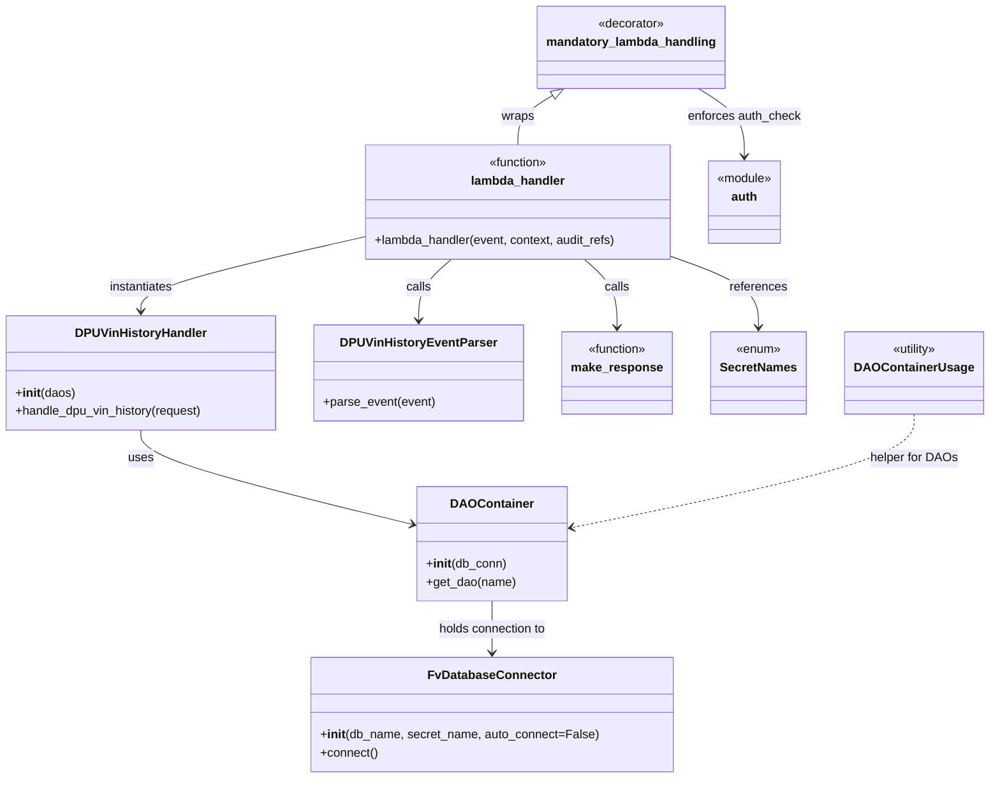

# Diagram: entity_core/entity_service/entity_service/dpu/dpu_service/lambdas/dpu_vin_history.py


> Auto-generated by Obscura crawlers

## Diagram 1

```mermaid
flowchart TD
  Event([Incoming event]) --> Decorator[mandatory_lambda_handling<br/>(auth_check=AUTH_CHECK)]
  Decorator --> Lambda[lambda_handler(event, context, audit_refs)]
  Lambda --> Parse[DPUVinHistoryEventParser.parse_event(event)]
  Lambda --> Instantiate[create DPUVinHistoryHandler(daos=DAOContainer(DB_CONN))]
  Parse --> CallHandle[handler.handle_dpu_vin_history(request)]
  Instantiate --> Handler[DPUVinHistoryHandler]
  Handler --> CallHandle
  CallHandle --> MakeResp[make_response(response)]
  MakeResp --> Response([HTTP response])
  AUTH_CHECK[AUTH_CHECK (auth.AuthType.PRIVILEGE -> Privilege.FV_ADMIN_TOOL)] -.-> Decorator
  DB_CONN[FvDatabaseConnector("dpu_vin_history", SecretNames.ENTITY_DATABASE)] --> DAOContainer[DAOContainer]
  DAOContainer --> Handler
```

> SVG rendering failed for this diagram.

## Diagram 2



> SVG rendering failed for this diagram.
