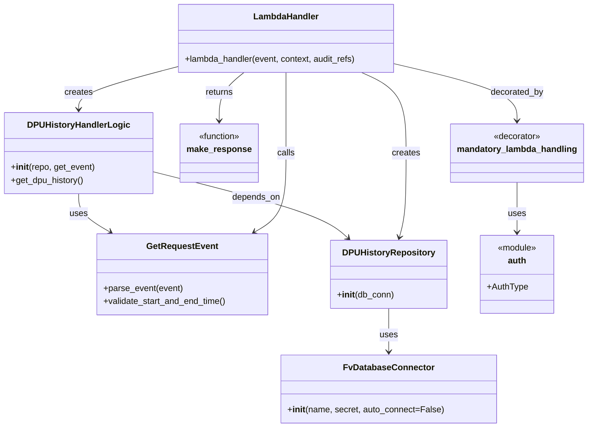

# Diagram: entity_core/entity_service/entity_service/dpu/dpu_service/lambdas/get_dpu_state_change_history.py


> Auto-generated by Obscura crawlers

## Diagram 1

```mermaid
flowchart LR
    Event[Incoming event] --> AuthCheck[mandatory_lambda_handling auth_check]
    AuthCheck --> Parse[GetRequestEvent.parse_event(event)]
    Parse --> Validate[validate_start_and_end_time()]
    Validate --> Repo[DPUHistoryRepository(DB_CONN)]
    DB_CONN[FvDatabaseConnector: DB_CONN] --> Repo
    Repo --> Service[DPUHistoryHandlerLogic(repo, get_event)]
    Service --> GetHistory[service.get_dpu_history()]
    GetHistory --> MR[make_response(response)]
    MR --> Response[HTTP Response]
```

> SVG rendering failed for this diagram.

## Diagram 2



### SVG

<svg id="container" width="1067.78125" xmlns="http://www.w3.org/2000/svg" class="classDiagram" height="790" viewBox="0 0 1067.78125 790" role="graphics-document document" aria-roledescription="class"><style>#container{font-family:"trebuchet ms",verdana,arial,sans-serif;font-size:16px;fill:#333;}@keyframes edge-animation-frame{from{stroke-dashoffset:0;}}@keyframes dash{to{stroke-dashoffset:0;}}#container .edge-animation-slow{stroke-dasharray:9,5!important;stroke-dashoffset:900;animation:dash 50s linear infinite;stroke-linecap:round;}#container .edge-animation-fast{stroke-dasharray:9,5!important;stroke-dashoffset:900;animation:dash 20s linear infinite;stroke-linecap:round;}#container .error-icon{fill:#552222;}#container .error-text{fill:#552222;stroke:#552222;}#container .edge-thickness-normal{stroke-width:1px;}#container .edge-thickness-thick{stroke-width:3.5px;}#container .edge-pattern-solid{stroke-dasharray:0;}#container .edge-thickness-invisible{stroke-width:0;fill:none;}#container .edge-pattern-dashed{stroke-dasharray:3;}#container .edge-pattern-dotted{stroke-dasharray:2;}#container .marker{fill:#333333;stroke:#333333;}#container .marker.cross{stroke:#333333;}#container svg{font-family:"trebuchet ms",verdana,arial,sans-serif;font-size:16px;}#container p{margin:0;}#container g.classGroup text{fill:#9370DB;stroke:none;font-family:"trebuchet ms",verdana,arial,sans-serif;font-size:10px;}#container g.classGroup text .title{font-weight:bolder;}#container .nodeLabel,#container .edgeLabel{color:#131300;}#container .edgeLabel .label rect{fill:#ECECFF;}#container .label text{fill:#131300;}#container .labelBkg{background:#ECECFF;}#container .edgeLabel .label span{background:#ECECFF;}#container .classTitle{font-weight:bolder;}#container .node rect,#container .node circle,#container .node ellipse,#container .node polygon,#container .node path{fill:#ECECFF;stroke:#9370DB;stroke-width:1px;}#container .divider{stroke:#9370DB;stroke-width:1;}#container g.clickable{cursor:pointer;}#container g.classGroup rect{fill:#ECECFF;stroke:#9370DB;}#container g.classGroup line{stroke:#9370DB;stroke-width:1;}#container .classLabel .box{stroke:none;stroke-width:0;fill:#ECECFF;opacity:0.5;}#container .classLabel .label{fill:#9370DB;font-size:10px;}#container .relation{stroke:#333333;stroke-width:1;fill:none;}#container .dashed-line{stroke-dasharray:3;}#container .dotted-line{stroke-dasharray:1 2;}#container #compositionStart,#container .composition{fill:#333333!important;stroke:#333333!important;stroke-width:1;}#container #compositionEnd,#container .composition{fill:#333333!important;stroke:#333333!important;stroke-width:1;}#container #dependencyStart,#container .dependency{fill:#333333!important;stroke:#333333!important;stroke-width:1;}#container #dependencyStart,#container .dependency{fill:#333333!important;stroke:#333333!important;stroke-width:1;}#container #extensionStart,#container .extension{fill:transparent!important;stroke:#333333!important;stroke-width:1;}#container #extensionEnd,#container .extension{fill:transparent!important;stroke:#333333!important;stroke-width:1;}#container #aggregationStart,#container .aggregation{fill:transparent!important;stroke:#333333!important;stroke-width:1;}#container #aggregationEnd,#container .aggregation{fill:transparent!important;stroke:#333333!important;stroke-width:1;}#container #lollipopStart,#container .lollipop{fill:#ECECFF!important;stroke:#333333!important;stroke-width:1;}#container #lollipopEnd,#container .lollipop{fill:#ECECFF!important;stroke:#333333!important;stroke-width:1;}#container .edgeTerminals{font-size:11px;line-height:initial;}#container .classTitleText{text-anchor:middle;font-size:18px;fill:#333;}#container .label-icon{display:inline-block;height:1em;overflow:visible;vertical-align:-0.125em;}#container .node .label-icon path{fill:currentColor;stroke:revert;stroke-width:revert;}#container :root{--mermaid-font-family:"trebuchet ms",verdana,arial,sans-serif;}</style><g><defs><marker id="container_class-aggregationStart" class="marker aggregation class" refX="18" refY="7" markerWidth="190" markerHeight="240" orient="auto"><path d="M 18,7 L9,13 L1,7 L9,1 Z"></path></marker></defs><defs><marker id="container_class-aggregationEnd" class="marker aggregation class" refX="1" refY="7" markerWidth="20" markerHeight="28" orient="auto"><path d="M 18,7 L9,13 L1,7 L9,1 Z"></path></marker></defs><defs><marker id="container_class-extensionStart" class="marker extension class" refX="18" refY="7" markerWidth="190" markerHeight="240" orient="auto"><path d="M 1,7 L18,13 V 1 Z"></path></marker></defs><defs><marker id="container_class-extensionEnd" class="marker extension class" refX="1" refY="7" markerWidth="20" markerHeight="28" orient="auto"><path d="M 1,1 V 13 L18,7 Z"></path></marker></defs><defs><marker id="container_class-compositionStart" class="marker composition class" refX="18" refY="7" markerWidth="190" markerHeight="240" orient="auto"><path d="M 18,7 L9,13 L1,7 L9,1 Z"></path></marker></defs><defs><marker id="container_class-compositionEnd" class="marker composition class" refX="1" refY="7" markerWidth="20" markerHeight="28" orient="auto"><path d="M 18,7 L9,13 L1,7 L9,1 Z"></path></marker></defs><defs><marker id="container_class-dependencyStart" class="marker dependency class" refX="6" refY="7" markerWidth="190" markerHeight="240" orient="auto"><path d="M 5,7 L9,13 L1,7 L9,1 Z"></path></marker></defs><defs><marker id="container_class-dependencyEnd" class="marker dependency class" refX="13" refY="7" markerWidth="20" markerHeight="28" orient="auto"><path d="M 18,7 L9,13 L14,7 L9,1 Z"></path></marker></defs><defs><marker id="container_class-lollipopStart" class="marker lollipop class" refX="13" refY="7" markerWidth="190" markerHeight="240" orient="auto"><circle stroke="black" fill="transparent" cx="7" cy="7" r="6"></circle></marker></defs><defs><marker id="container_class-lollipopEnd" class="marker lollipop class" refX="1" refY="7" markerWidth="190" markerHeight="240" orient="auto"><circle stroke="black" fill="transparent" cx="7" cy="7" r="6"></circle></marker></defs><g class="root"><g class="clusters"></g><g class="edgePaths"><path d="M706.174,570L706.174,578.167C706.174,586.333,706.174,602.667,706.174,616C706.174,629.333,706.174,639.667,706.174,644.833L706.174,650" id="id_DPUHistoryRepository_FvDatabaseConnector_1" class="edge-thickness-normal edge-pattern-solid relation" style=";;;" data-edge="true" data-et="edge" data-id="id_DPUHistoryRepository_FvDatabaseConnector_1" data-points="W3sieCI6NzA2LjE3MzgyODEyNSwieSI6NTcwfSx7IngiOjcwNi4xNzM4MjgxMjUsInkiOjYxOX0seyJ4Ijo3MDYuMTczODI4MTI1LCJ5Ijo2NTZ9XQ==" marker-end="url(#container_class-dependencyEnd)"></path><path d="M276.672,317.242L327.514,330.202C378.357,343.161,480.042,369.081,539.215,389.538C598.389,409.995,615.05,424.991,623.381,432.489L631.712,439.986" id="id_DPUHistoryHandlerLogic_DPUHistoryRepository_2" class="edge-thickness-normal edge-pattern-solid relation" style=";;;" data-edge="true" data-et="edge" data-id="id_DPUHistoryHandlerLogic_DPUHistoryRepository_2" data-points="W3sieCI6Mjc2LjY3MTg3NSwieSI6MzE3LjI0MjAyNTUzMjUyMDJ9LHsieCI6NTgxLjcyNjU2MjUsInkiOjM5NX0seyJ4Ijo2MzYuMTcyMjQxMjEwOTM3NSwieSI6NDQ0fV0=" marker-end="url(#container_class-dependencyEnd)"></path><path d="M142.336,358L142.336,364.167C142.336,370.333,142.336,382.667,151.794,394.487C161.251,406.307,180.166,417.614,189.624,423.268L199.081,428.921" id="id_DPUHistoryHandlerLogic_GetRequestEvent_3" class="edge-thickness-normal edge-pattern-solid relation" style=";;;" data-edge="true" data-et="edge" data-id="id_DPUHistoryHandlerLogic_GetRequestEvent_3" data-points="W3sieCI6MTQyLjMzNTkzNzUsInkiOjM1OH0seyJ4IjoxNDIuMzM1OTM3NSwieSI6Mzk1fSx7IngiOjIwNC4yMzE0NDUzMTI1LCJ5Ijo0MzJ9XQ==" marker-end="url(#container_class-dependencyEnd)"></path><path d="M517.055,134L517.055,140.167C517.055,146.333,517.055,158.667,517.055,183.5C517.055,208.333,517.055,245.667,517.055,283C517.055,320.333,517.055,357.667,507.597,381.987C498.14,406.307,479.224,417.614,469.767,423.268L460.309,428.921" id="id_LambdaHandler_GetRequestEvent_4" class="edge-thickness-normal edge-pattern-solid relation" style=";;;" data-edge="true" data-et="edge" data-id="id_LambdaHandler_GetRequestEvent_4" data-points="W3sieCI6NTE3LjA1NDY4NzUsInkiOjEzNH0seyJ4Ijo1MTcuMDU0Njg3NSwieSI6MTcxfSx7IngiOjUxNy4wNTQ2ODc1LCJ5IjoyODN9LHsieCI6NTE3LjA1NDY4NzUsInkiOjM5NX0seyJ4Ijo0NTUuMTU5MTc5Njg3NSwieSI6NDMyfV0=" marker-end="url(#container_class-dependencyEnd)"></path><path d="M315.102,124.895L286.307,132.579C257.513,140.263,199.924,155.632,171.13,168.482C142.336,181.333,142.336,191.667,142.336,196.833L142.336,202" id="id_LambdaHandler_DPUHistoryHandlerLogic_5" class="edge-thickness-normal edge-pattern-solid relation" style=";;;" data-edge="true" data-et="edge" data-id="id_LambdaHandler_DPUHistoryHandlerLogic_5" data-points="W3sieCI6MzE1LjEwMTU2MjUsInkiOjEyNC44OTQ1ODc2MDczNzIxOX0seyJ4IjoxNDIuMzM1OTM3NSwieSI6MTcxfSx7IngiOjE0Mi4zMzU5Mzc1LCJ5IjoyMDh9XQ==" marker-end="url(#container_class-dependencyEnd)"></path><path d="M656.571,134L670.228,140.167C683.884,146.333,711.197,158.667,724.853,183.5C738.51,208.333,738.51,245.667,738.51,283C738.51,320.333,738.51,357.667,736.429,383.539C734.349,409.412,730.188,423.824,728.108,431.03L726.027,438.235" id="id_LambdaHandler_DPUHistoryRepository_6" class="edge-thickness-normal edge-pattern-solid relation" style=";;;" data-edge="true" data-et="edge" data-id="id_LambdaHandler_DPUHistoryRepository_6" data-points="W3sieCI6NjU2LjU3MTM4NjcxODc1LCJ5IjoxMzR9LHsieCI6NzM4LjUwOTc2NTYyNSwieSI6MTcxfSx7IngiOjczOC41MDk3NjU2MjUsInkiOjI4M30seyJ4Ijo3MzguNTA5NzY1NjI1LCJ5IjozOTV9LHsieCI6NzI0LjM2Mjc5Mjk2ODc1LCJ5Ijo0NDR9XQ==" marker-end="url(#container_class-dependencyEnd)"></path><path d="M440.879,134L433.422,140.167C425.966,146.333,411.053,158.667,403.597,173.5C396.141,188.333,396.141,205.667,396.141,214.333L396.141,223" id="id_LambdaHandler_make_response_7" class="edge-thickness-normal edge-pattern-solid relation" style=";;;" data-edge="true" data-et="edge" data-id="id_LambdaHandler_make_response_7" data-points="W3sieCI6NDQwLjg3ODgyODEyNSwieSI6MTM0fSx7IngiOjM5Ni4xNDA2MjUsInkiOjE3MX0seyJ4IjozOTYuMTQwNjI1LCJ5IjoyMjl9XQ==" marker-end="url(#container_class-dependencyEnd)"></path><path d="M719.008,118.71L755.898,127.425C792.789,136.14,866.57,153.57,903.461,170.952C940.352,188.333,940.352,205.667,940.352,214.333L940.352,223" id="id_LambdaHandler_mandatory_lambda_handling_8" class="edge-thickness-normal edge-pattern-solid relation" style=";;;" data-edge="true" data-et="edge" data-id="id_LambdaHandler_mandatory_lambda_handling_8" data-points="W3sieCI6NzE5LjAwNzgxMjUsInkiOjExOC43MDk1NzE0NDQzOTExMn0seyJ4Ijo5NDAuMzUxNTYyNSwieSI6MTcxfSx7IngiOjk0MC4zNTE1NjI1LCJ5IjoyMjl9XQ==" marker-end="url(#container_class-dependencyEnd)"></path><path d="M940.352,337L940.352,346.667C940.352,356.333,940.352,375.667,940.352,391C940.352,406.333,940.352,417.667,940.352,423.333L940.352,429" id="id_mandatory_lambda_handling_auth_9" class="edge-thickness-normal edge-pattern-solid relation" style=";;;" data-edge="true" data-et="edge" data-id="id_mandatory_lambda_handling_auth_9" data-points="W3sieCI6OTQwLjM1MTU2MjUsInkiOjMzN30seyJ4Ijo5NDAuMzUxNTYyNSwieSI6Mzk1fSx7IngiOjk0MC4zNTE1NjI1LCJ5Ijo0MzV9XQ==" marker-end="url(#container_class-dependencyEnd)"></path></g><g class="edgeLabels"><g class="edgeLabel" transform="translate(706.173828125, 619)"><g class="label" data-id="id_DPUHistoryRepository_FvDatabaseConnector_1" transform="translate(-16.4921875, -12)"><foreignObject width="32.984375" height="24"><div xmlns="http://www.w3.org/1999/xhtml" class="labelBkg" style="display: table-cell; white-space: nowrap; line-height: 1.5; max-width: 200px; text-align: center;"><span class="edgeLabel"><p>uses</p></span></div></foreignObject></g></g><g class="edgeLabel" transform="translate(464.68864, 365.16721)"><g class="label" data-id="id_DPUHistoryHandlerLogic_DPUHistoryRepository_2" transform="translate(-44.671875, -12)"><foreignObject width="89.34375" height="24"><div xmlns="http://www.w3.org/1999/xhtml" class="labelBkg" style="display: table-cell; white-space: nowrap; line-height: 1.5; max-width: 200px; text-align: center;"><span class="edgeLabel"><p>depends_on</p></span></div></foreignObject></g></g><g class="edgeLabel" transform="translate(142.3359375, 395)"><g class="label" data-id="id_DPUHistoryHandlerLogic_GetRequestEvent_3" transform="translate(-16.4921875, -12)"><foreignObject width="32.984375" height="24"><div xmlns="http://www.w3.org/1999/xhtml" class="labelBkg" style="display: table-cell; white-space: nowrap; line-height: 1.5; max-width: 200px; text-align: center;"><span class="edgeLabel"><p>uses</p></span></div></foreignObject></g></g><g class="edgeLabel" transform="translate(517.0546875, 283)"><g class="label" data-id="id_LambdaHandler_GetRequestEvent_4" transform="translate(-16.4453125, -12)"><foreignObject width="32.890625" height="24"><div xmlns="http://www.w3.org/1999/xhtml" class="labelBkg" style="display: table-cell; white-space: nowrap; line-height: 1.5; max-width: 200px; text-align: center;"><span class="edgeLabel"><p>calls</p></span></div></foreignObject></g></g><g class="edgeLabel" transform="translate(142.3359375, 171)"><g class="label" data-id="id_LambdaHandler_DPUHistoryHandlerLogic_5" transform="translate(-26.171875, -12)"><foreignObject width="52.34375" height="24"><div xmlns="http://www.w3.org/1999/xhtml" class="labelBkg" style="display: table-cell; white-space: nowrap; line-height: 1.5; max-width: 200px; text-align: center;"><span class="edgeLabel"><p>creates</p></span></div></foreignObject></g></g><g class="edgeLabel" transform="translate(738.509765625, 283)"><g class="label" data-id="id_LambdaHandler_DPUHistoryRepository_6" transform="translate(-26.171875, -12)"><foreignObject width="52.34375" height="24"><div xmlns="http://www.w3.org/1999/xhtml" class="labelBkg" style="display: table-cell; white-space: nowrap; line-height: 1.5; max-width: 200px; text-align: center;"><span class="edgeLabel"><p>creates</p></span></div></foreignObject></g></g><g class="edgeLabel" transform="translate(396.140625, 171)"><g class="label" data-id="id_LambdaHandler_make_response_7" transform="translate(-26.265625, -12)"><foreignObject width="52.53125" height="24"><div xmlns="http://www.w3.org/1999/xhtml" class="labelBkg" style="display: table-cell; white-space: nowrap; line-height: 1.5; max-width: 200px; text-align: center;"><span class="edgeLabel"><p>returns</p></span></div></foreignObject></g></g><g class="edgeLabel" transform="translate(940.3515625, 171)"><g class="label" data-id="id_LambdaHandler_mandatory_lambda_handling_8" transform="translate(-49.375, -12)"><foreignObject width="98.75" height="24"><div xmlns="http://www.w3.org/1999/xhtml" class="labelBkg" style="display: table-cell; white-space: nowrap; line-height: 1.5; max-width: 200px; text-align: center;"><span class="edgeLabel"><p>decorated_by</p></span></div></foreignObject></g></g><g class="edgeLabel" transform="translate(940.3515625, 395)"><g class="label" data-id="id_mandatory_lambda_handling_auth_9" transform="translate(-16.4921875, -12)"><foreignObject width="32.984375" height="24"><div xmlns="http://www.w3.org/1999/xhtml" class="labelBkg" style="display: table-cell; white-space: nowrap; line-height: 1.5; max-width: 200px; text-align: center;"><span class="edgeLabel"><p>uses</p></span></div></foreignObject></g></g></g><g class="nodes"><g class="node default" id="classId-GetRequestEvent-0" transform="translate(329.6953125, 507)"><g class="basic label-container"><path d="M-158.37890625 -75 L158.37890625 -75 L158.37890625 75 L-158.37890625 75" stroke="none" stroke-width="0" fill="#ECECFF" style=""></path><path d="M-158.37890625 -75 C-45.12246806850136 -75, 68.13397011299728 -75, 158.37890625 -75 M-158.37890625 -75 C-87.7257032604835 -75, -17.072500270966998 -75, 158.37890625 -75 M158.37890625 -75 C158.37890625 -31.846314695603972, 158.37890625 11.307370608792056, 158.37890625 75 M158.37890625 -75 C158.37890625 -29.84309963344586, 158.37890625 15.31380073310828, 158.37890625 75 M158.37890625 75 C84.81974852442015 75, 11.260590798840298 75, -158.37890625 75 M158.37890625 75 C46.840367822355304 75, -64.69817060528939 75, -158.37890625 75 M-158.37890625 75 C-158.37890625 18.26781127602346, -158.37890625 -38.46437744795308, -158.37890625 -75 M-158.37890625 75 C-158.37890625 41.001672946977614, -158.37890625 7.0033458939552276, -158.37890625 -75" stroke="#9370DB" stroke-width="1.3" fill="none" stroke-dasharray="0 0" style=""></path></g><g class="annotation-group text" transform="translate(0, -51)"></g><g class="label-group text" transform="translate(-62.8515625, -51)"><g class="label" style="font-weight: bolder" transform="translate(0,-12)"><foreignObject width="125.703125" height="24"><div xmlns="http://www.w3.org/1999/xhtml" style="display: table-cell; white-space: nowrap; line-height: 1.5; max-width: 174px; text-align: center;"><span class="nodeLabel markdown-node-label" style=""><p>GetRequestEvent</p></span></div></foreignObject></g></g><g class="members-group text" transform="translate(-146.37890625, -3)"></g><g class="methods-group text" transform="translate(-146.37890625, 27)"><g class="label" style="" transform="translate(0,-12)"><foreignObject width="146.890625" height="24"><div xmlns="http://www.w3.org/1999/xhtml" style="display: table-cell; white-space: nowrap; line-height: 1.5; max-width: 204px; text-align: center;"><span class="nodeLabel markdown-node-label" style=""><p>+parse_event(event)</p></span></div></foreignObject></g><g class="label" style="" transform="translate(0,12)"><foreignObject width="229.90625" height="24"><div xmlns="http://www.w3.org/1999/xhtml" style="display: table-cell; white-space: nowrap; line-height: 1.5; max-width: 287px; text-align: center;"><span class="nodeLabel markdown-node-label" style=""><p>+validate_start_and_end_time()</p></span></div></foreignObject></g></g><g class="divider" style=""><path d="M-158.37890625 -27 C-56.434771931212495 -27, 45.50936238757501 -27, 158.37890625 -27 M-158.37890625 -27 C-82.2362439112422 -27, -6.093581572484396 -27, 158.37890625 -27" stroke="#9370DB" stroke-width="1.3" fill="none" stroke-dasharray="0 0" style=""></path></g><g class="divider" style=""><path d="M-158.37890625 -3 C-38.74991807234598 -3, 80.87907010530805 -3, 158.37890625 -3 M-158.37890625 -3 C-62.83681790123573 -3, 32.705270447528534 -3, 158.37890625 -3" stroke="#9370DB" stroke-width="1.3" fill="none" stroke-dasharray="0 0" style=""></path></g></g><g class="node default" id="classId-DPUHistoryRepository-1" transform="translate(706.173828125, 507)"><g class="basic label-container"><path d="M-105.1875 -63 L105.1875 -63 L105.1875 63 L-105.1875 63" stroke="none" stroke-width="0" fill="#ECECFF" style=""></path><path d="M-105.1875 -63 C-30.660346160394738 -63, 43.866807679210524 -63, 105.1875 -63 M-105.1875 -63 C-28.87859887909906 -63, 47.43030224180188 -63, 105.1875 -63 M105.1875 -63 C105.1875 -23.624575072637477, 105.1875 15.750849854725047, 105.1875 63 M105.1875 -63 C105.1875 -31.375779684560733, 105.1875 0.24844063087853385, 105.1875 63 M105.1875 63 C50.54837135672198 63, -4.090757286556041 63, -105.1875 63 M105.1875 63 C27.519497713958728 63, -50.148504572082544 63, -105.1875 63 M-105.1875 63 C-105.1875 25.044275817943884, -105.1875 -12.911448364112232, -105.1875 -63 M-105.1875 63 C-105.1875 13.318832353356129, -105.1875 -36.36233529328774, -105.1875 -63" stroke="#9370DB" stroke-width="1.3" fill="none" stroke-dasharray="0 0" style=""></path></g><g class="annotation-group text" transform="translate(0, -39)"></g><g class="label-group text" transform="translate(-81.40625, -39)"><g class="label" style="font-weight: bolder" transform="translate(0,-12)"><foreignObject width="162.8125" height="24"><div xmlns="http://www.w3.org/1999/xhtml" style="display: table-cell; white-space: nowrap; line-height: 1.5; max-width: 210px; text-align: center;"><span class="nodeLabel markdown-node-label" style=""><p>DPUHistoryRepository</p></span></div></foreignObject></g></g><g class="members-group text" transform="translate(-93.1875, 9)"></g><g class="methods-group text" transform="translate(-93.1875, 39)"><g class="label" style="" transform="translate(0,-12)"><foreignObject width="104.96875" height="24"><div xmlns="http://www.w3.org/1999/xhtml" style="display: table-cell; white-space: nowrap; line-height: 1.5; max-width: 194px; text-align: center;"><span class="nodeLabel markdown-node-label" style=""><p>+<strong>init</strong>(db_conn)</p></span></div></foreignObject></g></g><g class="divider" style=""><path d="M-105.1875 -15 C-43.66994320069029 -15, 17.847613598619418 -15, 105.1875 -15 M-105.1875 -15 C-48.20920713234811 -15, 8.769085735303776 -15, 105.1875 -15" stroke="#9370DB" stroke-width="1.3" fill="none" stroke-dasharray="0 0" style=""></path></g><g class="divider" style=""><path d="M-105.1875 9 C-22.934784775239905 9, 59.31793044952019 9, 105.1875 9 M-105.1875 9 C-46.25432203015981 9, 12.678855939680375 9, 105.1875 9" stroke="#9370DB" stroke-width="1.3" fill="none" stroke-dasharray="0 0" style=""></path></g></g><g class="node default" id="classId-DPUHistoryHandlerLogic-2" transform="translate(142.3359375, 283)"><g class="basic label-container"><path d="M-134.3359375 -75 L134.3359375 -75 L134.3359375 75 L-134.3359375 75" stroke="none" stroke-width="0" fill="#ECECFF" style=""></path><path d="M-134.3359375 -75 C-35.28341818871567 -75, 63.76910112256866 -75, 134.3359375 -75 M-134.3359375 -75 C-78.99904576967612 -75, -23.662154039352245 -75, 134.3359375 -75 M134.3359375 -75 C134.3359375 -18.203637685603674, 134.3359375 38.59272462879265, 134.3359375 75 M134.3359375 -75 C134.3359375 -42.64385030233734, 134.3359375 -10.287700604674683, 134.3359375 75 M134.3359375 75 C58.25682926293365 75, -17.8222789741327 75, -134.3359375 75 M134.3359375 75 C37.958158977987836 75, -58.41961954402433 75, -134.3359375 75 M-134.3359375 75 C-134.3359375 15.750969995589898, -134.3359375 -43.498060008820204, -134.3359375 -75 M-134.3359375 75 C-134.3359375 19.877538296912974, -134.3359375 -35.24492340617405, -134.3359375 -75" stroke="#9370DB" stroke-width="1.3" fill="none" stroke-dasharray="0 0" style=""></path></g><g class="annotation-group text" transform="translate(0, -51)"></g><g class="label-group text" transform="translate(-89.796875, -51)"><g class="label" style="font-weight: bolder" transform="translate(0,-12)"><foreignObject width="179.59375" height="24"><div xmlns="http://www.w3.org/1999/xhtml" style="display: table-cell; white-space: nowrap; line-height: 1.5; max-width: 228px; text-align: center;"><span class="nodeLabel markdown-node-label" style=""><p>DPUHistoryHandlerLogic</p></span></div></foreignObject></g></g><g class="members-group text" transform="translate(-122.3359375, -3)"></g><g class="methods-group text" transform="translate(-122.3359375, 27)"><g class="label" style="" transform="translate(0,-12)"><foreignObject width="154.875" height="24"><div xmlns="http://www.w3.org/1999/xhtml" style="display: table-cell; white-space: nowrap; line-height: 1.5; max-width: 244px; text-align: center;"><span class="nodeLabel markdown-node-label" style=""><p>+<strong>init</strong>(repo, get_event)</p></span></div></foreignObject></g><g class="label" style="" transform="translate(0,12)"><foreignObject width="135.90625" height="24"><div xmlns="http://www.w3.org/1999/xhtml" style="display: table-cell; white-space: nowrap; line-height: 1.5; max-width: 193px; text-align: center;"><span class="nodeLabel markdown-node-label" style=""><p>+get_dpu_history()</p></span></div></foreignObject></g></g><g class="divider" style=""><path d="M-134.3359375 -27 C-55.4944695905788 -27, 23.346998318842395 -27, 134.3359375 -27 M-134.3359375 -27 C-75.04390976969825 -27, -15.751882039396477 -27, 134.3359375 -27" stroke="#9370DB" stroke-width="1.3" fill="none" stroke-dasharray="0 0" style=""></path></g><g class="divider" style=""><path d="M-134.3359375 -3 C-63.25343157601981 -3, 7.829074347960386 -3, 134.3359375 -3 M-134.3359375 -3 C-46.53630666098313 -3, 41.26332417803374 -3, 134.3359375 -3" stroke="#9370DB" stroke-width="1.3" fill="none" stroke-dasharray="0 0" style=""></path></g></g><g class="node default" id="classId-FvDatabaseConnector-3" transform="translate(706.173828125, 719)"><g class="basic label-container"><path d="M-194.58984375 -63 L194.58984375 -63 L194.58984375 63 L-194.58984375 63" stroke="none" stroke-width="0" fill="#ECECFF" style=""></path><path d="M-194.58984375 -63 C-52.44150564913656 -63, 89.70683245172688 -63, 194.58984375 -63 M-194.58984375 -63 C-55.764210524481 -63, 83.061422701038 -63, 194.58984375 -63 M194.58984375 -63 C194.58984375 -36.300684154480805, 194.58984375 -9.601368308961604, 194.58984375 63 M194.58984375 -63 C194.58984375 -20.710382829856506, 194.58984375 21.579234340286988, 194.58984375 63 M194.58984375 63 C104.62635649956573 63, 14.662869249131461 63, -194.58984375 63 M194.58984375 63 C62.04261240089514 63, -70.50461894820972 63, -194.58984375 63 M-194.58984375 63 C-194.58984375 28.341745558339888, -194.58984375 -6.316508883320225, -194.58984375 -63 M-194.58984375 63 C-194.58984375 16.586909368333416, -194.58984375 -29.82618126333317, -194.58984375 -63" stroke="#9370DB" stroke-width="1.3" fill="none" stroke-dasharray="0 0" style=""></path></g><g class="annotation-group text" transform="translate(0, -39)"></g><g class="label-group text" transform="translate(-79.3046875, -39)"><g class="label" style="font-weight: bolder" transform="translate(0,-12)"><foreignObject width="158.609375" height="24"><div xmlns="http://www.w3.org/1999/xhtml" style="display: table-cell; white-space: nowrap; line-height: 1.5; max-width: 207px; text-align: center;"><span class="nodeLabel markdown-node-label" style=""><p>FvDatabaseConnector</p></span></div></foreignObject></g></g><g class="members-group text" transform="translate(-182.58984375, 9)"></g><g class="methods-group text" transform="translate(-182.58984375, 39)"><g class="label" style="" transform="translate(0,-12)"><foreignObject width="285.875" height="24"><div xmlns="http://www.w3.org/1999/xhtml" style="display: table-cell; white-space: nowrap; line-height: 1.5; max-width: 375px; text-align: center;"><span class="nodeLabel markdown-node-label" style=""><p>+<strong>init</strong>(name, secret, auto_connect=False)</p></span></div></foreignObject></g></g><g class="divider" style=""><path d="M-194.58984375 -15 C-87.00380430065708 -15, 20.58223514868584 -15, 194.58984375 -15 M-194.58984375 -15 C-49.15158599867016 -15, 96.28667175265969 -15, 194.58984375 -15" stroke="#9370DB" stroke-width="1.3" fill="none" stroke-dasharray="0 0" style=""></path></g><g class="divider" style=""><path d="M-194.58984375 9 C-69.5192695375448 9, 55.5513046749104 9, 194.58984375 9 M-194.58984375 9 C-99.11951135590505 9, -3.649178961810094 9, 194.58984375 9" stroke="#9370DB" stroke-width="1.3" fill="none" stroke-dasharray="0 0" style=""></path></g></g><g class="node default" id="classId-LambdaHandler-4" transform="translate(517.0546875, 71)"><g class="basic label-container"><path d="M-201.953125 -63 L201.953125 -63 L201.953125 63 L-201.953125 63" stroke="none" stroke-width="0" fill="#ECECFF" style=""></path><path d="M-201.953125 -63 C-74.72921521090689 -63, 52.49469457818623 -63, 201.953125 -63 M-201.953125 -63 C-118.30616499847315 -63, -34.6592049969463 -63, 201.953125 -63 M201.953125 -63 C201.953125 -16.97498894322213, 201.953125 29.05002211355574, 201.953125 63 M201.953125 -63 C201.953125 -28.830276492260957, 201.953125 5.339447015478086, 201.953125 63 M201.953125 63 C110.73407650753693 63, 19.515028015073852 63, -201.953125 63 M201.953125 63 C115.71169975813883 63, 29.47027451627767 63, -201.953125 63 M-201.953125 63 C-201.953125 33.61294115459792, -201.953125 4.225882309195832, -201.953125 -63 M-201.953125 63 C-201.953125 26.77665796233029, -201.953125 -9.44668407533942, -201.953125 -63" stroke="#9370DB" stroke-width="1.3" fill="none" stroke-dasharray="0 0" style=""></path></g><g class="annotation-group text" transform="translate(0, -39)"></g><g class="label-group text" transform="translate(-58.21875, -39)"><g class="label" style="font-weight: bolder" transform="translate(0,-12)"><foreignObject width="116.4375" height="24"><div xmlns="http://www.w3.org/1999/xhtml" style="display: table-cell; white-space: nowrap; line-height: 1.5; max-width: 167px; text-align: center;"><span class="nodeLabel markdown-node-label" style=""><p>LambdaHandler</p></span></div></foreignObject></g></g><g class="members-group text" transform="translate(-189.953125, 9)"></g><g class="methods-group text" transform="translate(-189.953125, 39)"><g class="label" style="" transform="translate(0,-12)"><foreignObject width="321.6875" height="24"><div xmlns="http://www.w3.org/1999/xhtml" style="display: table-cell; white-space: nowrap; line-height: 1.5; max-width: 379px; text-align: center;"><span class="nodeLabel markdown-node-label" style=""><p>+lambda_handler(event, context, audit_refs)</p></span></div></foreignObject></g></g><g class="divider" style=""><path d="M-201.953125 -15 C-102.32504513504696 -15, -2.6969652700939264 -15, 201.953125 -15 M-201.953125 -15 C-83.28726093231141 -15, 35.378603135377176 -15, 201.953125 -15" stroke="#9370DB" stroke-width="1.3" fill="none" stroke-dasharray="0 0" style=""></path></g><g class="divider" style=""><path d="M-201.953125 9 C-120.7328629363293 9, -39.512600872658595 9, 201.953125 9 M-201.953125 9 C-114.11257240748014 9, -26.272019814960288 9, 201.953125 9" stroke="#9370DB" stroke-width="1.3" fill="none" stroke-dasharray="0 0" style=""></path></g></g><g class="node default" id="classId-auth-5" transform="translate(940.3515625, 507)"><g class="basic label-container"><path d="M-67.89453125 -72 L67.89453125 -72 L67.89453125 72 L-67.89453125 72" stroke="none" stroke-width="0" fill="#ECECFF" style=""></path><path d="M-67.89453125 -72 C-24.514600783093456 -72, 18.865329683813087 -72, 67.89453125 -72 M-67.89453125 -72 C-22.135932835862043 -72, 23.622665578275914 -72, 67.89453125 -72 M67.89453125 -72 C67.89453125 -27.566478695656635, 67.89453125 16.86704260868673, 67.89453125 72 M67.89453125 -72 C67.89453125 -41.77493112943813, 67.89453125 -11.549862258876267, 67.89453125 72 M67.89453125 72 C31.689315845387647 72, -4.515899559224707 72, -67.89453125 72 M67.89453125 72 C27.352434010624293 72, -13.189663228751414 72, -67.89453125 72 M-67.89453125 72 C-67.89453125 39.31938807874722, -67.89453125 6.6387761574944335, -67.89453125 -72 M-67.89453125 72 C-67.89453125 37.46209795199743, -67.89453125 2.924195903994857, -67.89453125 -72" stroke="#9370DB" stroke-width="1.3" fill="none" stroke-dasharray="0 0" style=""></path></g><g class="annotation-group text" transform="translate(-36.6015625, -48)"><g class="label" style="" transform="translate(0,-12)"><foreignObject width="73.203125" height="24"><div xmlns="http://www.w3.org/1999/xhtml" style="display: table-cell; white-space: nowrap; line-height: 1.5; max-width: 123px; text-align: center;"><span class="nodeLabel markdown-node-label" style=""><p>«module»</p></span></div></foreignObject></g></g><g class="label-group text" transform="translate(-16.6640625, -24)"><g class="label" style="font-weight: bolder" transform="translate(0,-12)"><foreignObject width="33.328125" height="24"><div xmlns="http://www.w3.org/1999/xhtml" style="display: table-cell; white-space: nowrap; line-height: 1.5; max-width: 83px; text-align: center;"><span class="nodeLabel markdown-node-label" style=""><p>auth</p></span></div></foreignObject></g></g><g class="members-group text" transform="translate(-55.89453125, 24)"><g class="label" style="" transform="translate(0,-12)"><foreignObject width="75.1875" height="24"><div xmlns="http://www.w3.org/1999/xhtml" style="display: table-cell; white-space: nowrap; line-height: 1.5; max-width: 133px; text-align: center;"><span class="nodeLabel markdown-node-label" style=""><p>+AuthType</p></span></div></foreignObject></g></g><g class="methods-group text" transform="translate(-55.89453125, 72)"></g><g class="divider" style=""><path d="M-67.89453125 0 C-26.351344318344466 0, 15.191842613311067 0, 67.89453125 0 M-67.89453125 0 C-33.52657952752553 0, 0.8413721949489457 0, 67.89453125 0" stroke="#9370DB" stroke-width="1.3" fill="none" stroke-dasharray="0 0" style=""></path></g><g class="divider" style=""><path d="M-67.89453125 48 C-26.328044885080857 48, 15.238441479838286 48, 67.89453125 48 M-67.89453125 48 C-14.82462623918125 48, 38.2452787716375 48, 67.89453125 48" stroke="#9370DB" stroke-width="1.3" fill="none" stroke-dasharray="0 0" style=""></path></g></g><g class="node default" id="classId-make_response-6" transform="translate(396.140625, 283)"><g class="basic label-container"><path d="M-69.46875 -54 L69.46875 -54 L69.46875 54 L-69.46875 54" stroke="none" stroke-width="0" fill="#ECECFF" style=""></path><path d="M-69.46875 -54 C-16.18904754785619 -54, 37.09065490428762 -54, 69.46875 -54 M-69.46875 -54 C-40.85145428528706 -54, -12.234158570574124 -54, 69.46875 -54 M69.46875 -54 C69.46875 -24.82703993917157, 69.46875 4.34592012165686, 69.46875 54 M69.46875 -54 C69.46875 -23.641974886366913, 69.46875 6.716050227266173, 69.46875 54 M69.46875 54 C16.09643251013253 54, -37.27588497973494 54, -69.46875 54 M69.46875 54 C24.602349496464427 54, -20.264051007071146 54, -69.46875 54 M-69.46875 54 C-69.46875 18.25355524094443, -69.46875 -17.49288951811114, -69.46875 -54 M-69.46875 54 C-69.46875 18.93268566365154, -69.46875 -16.13462867269692, -69.46875 -54" stroke="#9370DB" stroke-width="1.3" fill="none" stroke-dasharray="0 0" style=""></path></g><g class="annotation-group text" transform="translate(-39.484375, -30)"><g class="label" style="" transform="translate(0,-12)"><foreignObject width="78.96875" height="24"><div xmlns="http://www.w3.org/1999/xhtml" style="display: table-cell; white-space: nowrap; line-height: 1.5; max-width: 129px; text-align: center;"><span class="nodeLabel markdown-node-label" style=""><p>«function»</p></span></div></foreignObject></g></g><g class="label-group text" transform="translate(-57.46875, -6)"><g class="label" style="font-weight: bolder" transform="translate(0,-12)"><foreignObject width="114.9375" height="24"><div xmlns="http://www.w3.org/1999/xhtml" style="display: table-cell; white-space: nowrap; line-height: 1.5; max-width: 164px; text-align: center;"><span class="nodeLabel markdown-node-label" style=""><p>make_response</p></span></div></foreignObject></g></g><g class="members-group text" transform="translate(-57.46875, 42)"></g><g class="methods-group text" transform="translate(-57.46875, 72)"></g><g class="divider" style=""><path d="M-69.46875 18 C-40.704434025261826 18, -11.940118050523651 18, 69.46875 18 M-69.46875 18 C-16.92913410457613 18, 35.61048179084774 18, 69.46875 18" stroke="#9370DB" stroke-width="1.3" fill="none" stroke-dasharray="0 0" style=""></path></g><g class="divider" style=""><path d="M-69.46875 36 C-36.7809356915884 36, -4.093121383176793 36, 69.46875 36 M-69.46875 36 C-32.16708617583354 36, 5.134577648332922 36, 69.46875 36" stroke="#9370DB" stroke-width="1.3" fill="none" stroke-dasharray="0 0" style=""></path></g></g><g class="node default" id="classId-mandatory_lambda_handling-7" transform="translate(940.3515625, 283)"><g class="basic label-container"><path d="M-119.4296875 -54 L119.4296875 -54 L119.4296875 54 L-119.4296875 54" stroke="none" stroke-width="0" fill="#ECECFF" style=""></path><path d="M-119.4296875 -54 C-25.75370498813136 -54, 67.92227752373728 -54, 119.4296875 -54 M-119.4296875 -54 C-46.44607893255923 -54, 26.537529634881537 -54, 119.4296875 -54 M119.4296875 -54 C119.4296875 -31.5607707019014, 119.4296875 -9.121541403802802, 119.4296875 54 M119.4296875 -54 C119.4296875 -16.502034963294825, 119.4296875 20.99593007341035, 119.4296875 54 M119.4296875 54 C56.395187455845075 54, -6.639312588309849 54, -119.4296875 54 M119.4296875 54 C33.11108066858776 54, -53.20752616282448 54, -119.4296875 54 M-119.4296875 54 C-119.4296875 18.88131560974807, -119.4296875 -16.237368780503857, -119.4296875 -54 M-119.4296875 54 C-119.4296875 25.44723653146173, -119.4296875 -3.10552693707654, -119.4296875 -54" stroke="#9370DB" stroke-width="1.3" fill="none" stroke-dasharray="0 0" style=""></path></g><g class="annotation-group text" transform="translate(-44.0625, -30)"><g class="label" style="" transform="translate(0,-12)"><foreignObject width="88.125" height="24"><div xmlns="http://www.w3.org/1999/xhtml" style="display: table-cell; white-space: nowrap; line-height: 1.5; max-width: 138px; text-align: center;"><span class="nodeLabel markdown-node-label" style=""><p>«decorator»</p></span></div></foreignObject></g></g><g class="label-group text" transform="translate(-107.4296875, -6)"><g class="label" style="font-weight: bolder" transform="translate(0,-12)"><foreignObject width="214.859375" height="24"><div xmlns="http://www.w3.org/1999/xhtml" style="display: table-cell; white-space: nowrap; line-height: 1.5; max-width: 264px; text-align: center;"><span class="nodeLabel markdown-node-label" style=""><p>mandatory_lambda_handling</p></span></div></foreignObject></g></g><g class="members-group text" transform="translate(-107.4296875, 42)"></g><g class="methods-group text" transform="translate(-107.4296875, 72)"></g><g class="divider" style=""><path d="M-119.4296875 18 C-42.97793693098781 18, 33.47381363802438 18, 119.4296875 18 M-119.4296875 18 C-42.60984492919758 18, 34.20999764160484 18, 119.4296875 18" stroke="#9370DB" stroke-width="1.3" fill="none" stroke-dasharray="0 0" style=""></path></g><g class="divider" style=""><path d="M-119.4296875 36 C-36.45610175530736 36, 46.51748398938528 36, 119.4296875 36 M-119.4296875 36 C-62.552185749589114 36, -5.674683999178228 36, 119.4296875 36" stroke="#9370DB" stroke-width="1.3" fill="none" stroke-dasharray="0 0" style=""></path></g></g></g></g></g></svg>
