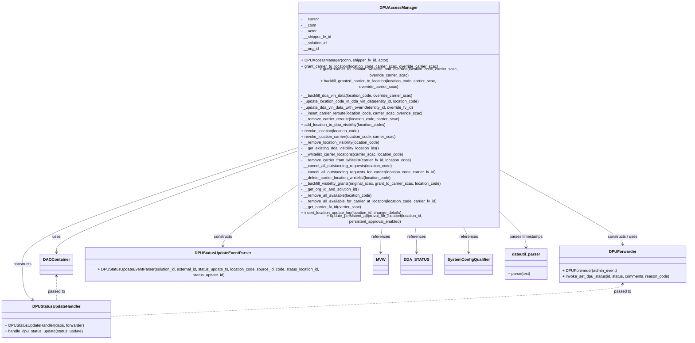
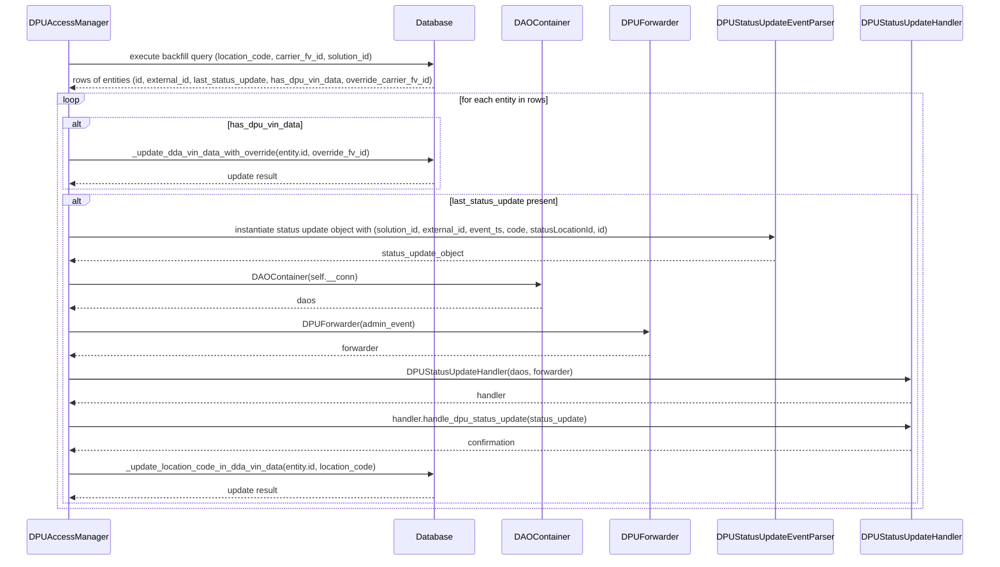

# Diagram: entity_core/entity_service/entity_service/dpu/dpu_service/location_management_service/common/dpu_access_granter.py

> Auto-generated by Obscura crawlers

## Diagram 1

### SVG

<svg id="container" width="2827.5703125" xmlns="http://www.w3.org/2000/svg" class="classDiagram" height="1328" viewBox="0 0 2827.5703125 1328" role="graphics-document document" aria-roledescription="class"><g><defs><marker id="container_class-aggregationStart" class="marker aggregation class" refX="18" refY="7" markerWidth="190" markerHeight="240" orient="auto"><path d="M 18,7 L9,13 L1,7 L9,1 Z"></path></marker></defs><defs><marker id="container_class-aggregationEnd" class="marker aggregation class" refX="1" refY="7" markerWidth="20" markerHeight="28" orient="auto"><path d="M 18,7 L9,13 L1,7 L9,1 Z"></path></marker></defs><defs><marker id="container_class-extensionStart" class="marker extension class" refX="18" refY="7" markerWidth="190" markerHeight="240" orient="auto"><path d="M 1,7 L18,13 V 1 Z"></path></marker></defs><defs><marker id="container_class-extensionEnd" class="marker extension class" refX="1" refY="7" markerWidth="20" markerHeight="28" orient="auto"><path d="M 1,1 V 13 L18,7 Z"></path></marker></defs><defs><marker id="container_class-compositionStart" class="marker composition class" refX="18" refY="7" markerWidth="190" markerHeight="240" orient="auto"><path d="M 18,7 L9,13 L1,7 L9,1 Z"></path></marker></defs><defs><marker id="container_class-compositionEnd" class="marker composition class" refX="1" refY="7" markerWidth="20" markerHeight="28" orient="auto"><path d="M 18,7 L9,13 L1,7 L9,1 Z"></path></marker></defs><defs><marker id="container_class-dependencyStart" class="marker dependency class" refX="6" refY="7" markerWidth="190" markerHeight="240" orient="auto"><path d="M 5,7 L9,13 L1,7 L9,1 Z"></path></marker></defs><defs><marker id="container_class-dependencyEnd" class="marker dependency class" refX="13" refY="7" markerWidth="20" markerHeight="28" orient="auto"><path d="M 18,7 L9,13 L14,7 L9,1 Z"></path></marker></defs><defs><marker id="container_class-lollipopStart" class="marker lollipop class" refX="13" refY="7" markerWidth="190" markerHeight="240" orient="auto"><circle stroke="black" fill="transparent" cx="7" cy="7" r="6"></circle></marker></defs><defs><marker id="container_class-lollipopEnd" class="marker lollipop class" refX="1" refY="7" markerWidth="190" markerHeight="240" orient="auto"><circle stroke="black" fill="transparent" cx="7" cy="7" r="6"></circle></marker></defs><g class="root"><g class="clusters"></g><g class="edgePaths"><path d="M1253.379,575.691L1082.687,631.242C911.995,686.794,570.611,797.897,399.919,864.115C229.227,930.333,229.227,951.667,229.227,962.333L229.227,973" id="id_DPUAccessManager_DAOContainer_1" class="edge-thickness-normal edge-pattern-solid relation" style=";;;" data-edge="true" data-et="edge" data-id="id_DPUAccessManager_DAOContainer_1" data-points="W3sieCI6MTI1My4zNzg5MDYyNSwieSI6NTc1LjY5MDYyNzcyNzU3MDl9LHsieCI6MjI5LjIyNjU2MjUsInkiOjkwOX0seyJ4IjoyMjkuMjI2NTYyNSwieSI6OTc5fV0=" marker-end="url(#container_class-dependencyEnd)"></path><path d="M2087.246,659.383L2166.312,700.985C2245.378,742.588,2403.509,825.794,2482.575,872.564C2561.641,919.333,2561.641,929.667,2561.641,934.833L2561.641,940" id="id_DPUAccessManager_DPUForwarder_2" class="edge-thickness-normal edge-pattern-solid relation" style=";;;" data-edge="true" data-et="edge" data-id="id_DPUAccessManager_DPUForwarder_2" data-points="W3sieCI6MjA4Ny4yNDYwOTM3NSwieSI6NjU5LjM4MjU3MDc3NzQ1NjR9LHsieCI6MjU2MS42NDA2MjUsInkiOjkwOX0seyJ4IjoyNTYxLjY0MDYyNSwieSI6OTQ2fV0=" marker-end="url(#container_class-dependencyEnd)"></path><path d="M1253.379,704.888L1199.833,738.906C1146.288,772.925,1039.197,840.963,985.651,882.148C932.105,923.333,932.105,937.667,932.105,944.833L932.105,952" id="id_DPUAccessManager_DPUStatusUpdateEventParser_3" class="edge-thickness-normal edge-pattern-solid relation" style=";;;" data-edge="true" data-et="edge" data-id="id_DPUAccessManager_DPUStatusUpdateEventParser_3" data-points="W3sieCI6MTI1My4zNzg5MDYyNSwieSI6NzA0Ljg4NzU1NDgzMzU1NDh9LHsieCI6OTMyLjEwNTQ2ODc1LCJ5Ijo5MDl9LHsieCI6OTMyLjEwNTQ2ODc1LCJ5Ijo5NTh9XQ==" marker-end="url(#container_class-dependencyEnd)"></path><path d="M1253.379,564.01L1060.063,621.508C866.747,679.006,480.116,794.003,286.8,870.168C93.484,946.333,93.484,983.667,93.484,1021C93.484,1058.333,93.484,1095.667,100.187,1119.864C106.889,1144.06,120.295,1155.121,126.997,1160.651L133.7,1166.181" id="id_DPUAccessManager_DPUStatusUpdateHandler_4" class="edge-thickness-normal edge-pattern-solid relation" style=";;;" data-edge="true" data-et="edge" data-id="id_DPUAccessManager_DPUStatusUpdateHandler_4" data-points="W3sieCI6MTI1My4zNzg5MDYyNSwieSI6NTY0LjAwOTYxOTI5MTEwMDZ9LHsieCI6OTMuNDg0Mzc1LCJ5Ijo5MDl9LHsieCI6OTMuNDg0Mzc1LCJ5IjoxMDIxfSx7IngiOjkzLjQ4NDM3NSwieSI6MTEzM30seyJ4IjoxMzguMzI3Nzc2MjI3Njc4NTYsInkiOjExNzB9XQ==" marker-end="url(#container_class-dependencyEnd)"></path><path d="M1607.065,872L1606.163,878.167C1605.26,884.333,1603.454,896.667,1602.551,913.5C1601.648,930.333,1601.648,951.667,1601.648,962.333L1601.648,973" id="id_DPUAccessManager_MVW_5" class="edge-thickness-normal edge-pattern-solid relation" style=";;;" data-edge="true" data-et="edge" data-id="id_DPUAccessManager_MVW_5" data-points="W3sieCI6MTYwNy4wNjU0MzE3Njk3MjI5LCJ5Ijo4NzJ9LHsieCI6MTYwMS42NDg0Mzc1LCJ5Ijo5MDl9LHsieCI6MTYwMS42NDg0Mzc1LCJ5Ijo5Nzl9XQ==" marker-end="url(#container_class-dependencyEnd)"></path><path d="M1733.56,872L1734.462,878.167C1735.365,884.333,1737.171,896.667,1738.074,913.5C1738.977,930.333,1738.977,951.667,1738.977,962.333L1738.977,973" id="id_DPUAccessManager_DDA_STATUS_6" class="edge-thickness-normal edge-pattern-solid relation" style=";;;" data-edge="true" data-et="edge" data-id="id_DPUAccessManager_DDA_STATUS_6" data-points="W3sieCI6MTczMy41NTk1NjgyMzAyNzcxLCJ5Ijo4NzJ9LHsieCI6MTczOC45NzY1NjI1LCJ5Ijo5MDl9LHsieCI6MTczOC45NzY1NjI1LCJ5Ijo5Nzl9XQ==" marker-end="url(#container_class-dependencyEnd)"></path><path d="M1918.422,872L1921.963,878.167C1925.505,884.333,1932.589,896.667,1936.13,913.5C1939.672,930.333,1939.672,951.667,1939.672,962.333L1939.672,973" id="id_DPUAccessManager_SystemConfigQualifier_7" class="edge-thickness-normal edge-pattern-solid relation" style=";;;" data-edge="true" data-et="edge" data-id="id_DPUAccessManager_SystemConfigQualifier_7" data-points="W3sieCI6MTkxOC40MjE3NzUwNTMzMDQ4LCJ5Ijo4NzJ9LHsieCI6MTkzOS42NzE4NzUsInkiOjkwOX0seyJ4IjoxOTM5LjY3MTg3NSwieSI6OTc5fV0=" marker-end="url(#container_class-dependencyEnd)"></path><path d="M2087.246,832.778L2100.731,845.481C2114.216,858.185,2141.186,883.593,2154.671,903.463C2168.156,923.333,2168.156,937.667,2168.156,944.833L2168.156,952" id="id_DPUAccessManager_dateutil_parser_8" class="edge-thickness-normal edge-pattern-solid relation" style=";;;" data-edge="true" data-et="edge" data-id="id_DPUAccessManager_dateutil_parser_8" data-points="W3sieCI6MjA4Ny4yNDYwOTM3NSwieSI6ODMyLjc3NzU2NDE4MzAzOTR9LHsieCI6MjE2OC4xNTYyNSwieSI6OTA5fSx7IngiOjIxNjguMTU2MjUsInkiOjk1OH1d" marker-end="url(#container_class-dependencyEnd)"></path><path d="M229.227,1069L229.227,1079.667C229.227,1090.333,229.227,1111.667,229.227,1128.5C229.227,1145.333,229.227,1157.667,229.227,1163.833L229.227,1170" id="id_DAOContainer_DPUStatusUpdateHandler_9" class="edge-thickness-normal edge-pattern-dashed relation" style=";;;" data-edge="true" data-et="edge" data-id="id_DAOContainer_DPUStatusUpdateHandler_9" data-points="W3sieCI6MjI5LjIyNjU2MjUsInkiOjEwNjN9LHsieCI6MjI5LjIyNjU2MjUsInkiOjExMzN9LHsieCI6MjI5LjIyNjU2MjUsInkiOjExNzB9XQ==" marker-start="url(#container_class-dependencyStart)"></path><path d="M2561.641,1102L2561.641,1107.167C2561.641,1112.333,2561.641,1122.667,2209.776,1144.729C1857.911,1166.792,1154.182,1200.585,802.318,1217.481L450.453,1234.377" id="id_DPUForwarder_DPUStatusUpdateHandler_10" class="edge-thickness-normal edge-pattern-dashed relation" style=";;;" data-edge="true" data-et="edge" data-id="id_DPUForwarder_DPUStatusUpdateHandler_10" data-points="W3sieCI6MjU2MS42NDA2MjUsInkiOjEwOTZ9LHsieCI6MjU2MS42NDA2MjUsInkiOjExMzN9LHsieCI6NDUwLjQ1MzEyNSwieSI6MTIzNC4zNzY5Mzk3OTg4Mjd9XQ==" marker-start="url(#container_class-dependencyStart)"></path></g><g class="edgeLabels"><g class="edgeLabel" transform="translate(229.2265625, 909)"><g class="label" data-id="id_DPUAccessManager_DAOContainer_1" transform="translate(-16.4921875, -12)"><foreignObject width="32.984375" height="24">

uses

</foreignObject></g></g><g class="edgeLabel" transform="translate(2561.640625, 909)"><g class="label" data-id="id_DPUAccessManager_DPUForwarder_2" transform="translate(-62.734375, -12)"><foreignObject width="125.46875" height="24">

constructs / uses

</foreignObject></g></g><g class="edgeLabel" transform="translate(932.10546875, 909)"><g class="label" data-id="id_DPUAccessManager_DPUStatusUpdateEventParser_3" transform="translate(-37.84375, -12)"><foreignObject width="75.6875" height="24">

constructs

</foreignObject></g></g><g class="edgeLabel" transform="translate(93.484375, 1021)"><g class="label" data-id="id_DPUAccessManager_DPUStatusUpdateHandler_4" transform="translate(-37.84375, -12)"><foreignObject width="75.6875" height="24">

constructs

</foreignObject></g></g><g class="edgeLabel" transform="translate(1601.6484375, 909)"><g class="label" data-id="id_DPUAccessManager_MVW_5" transform="translate(-37.828125, -12)"><foreignObject width="75.65625" height="24">

references

</foreignObject></g></g><g class="edgeLabel" transform="translate(1738.9765625, 909)"><g class="label" data-id="id_DPUAccessManager_DDA_STATUS_6" transform="translate(-37.828125, -12)"><foreignObject width="75.65625" height="24">

references

</foreignObject></g></g><g class="edgeLabel" transform="translate(1939.671875, 909)"><g class="label" data-id="id_DPUAccessManager_SystemConfigQualifier_7" transform="translate(-37.828125, -12)"><foreignObject width="75.65625" height="24">

references

</foreignObject></g></g><g class="edgeLabel" transform="translate(2168.15625, 909)"><g class="label" data-id="id_DPUAccessManager_dateutil_parser_8" transform="translate(-68.5703125, -12)"><foreignObject width="137.140625" height="24">

parses timestamps

</foreignObject></g></g><g class="edgeLabel" transform="translate(229.2265625, 1133)"><g class="label" data-id="id_DAOContainer_DPUStatusUpdateHandler_9" transform="translate(-35.046875, -12)"><foreignObject width="70.09375" height="24">

passed to

</foreignObject></g></g><g class="edgeLabel" transform="translate(2561.640625, 1133)"><g class="label" data-id="id_DPUForwarder_DPUStatusUpdateHandler_10" transform="translate(-35.046875, -12)"><foreignObject width="70.09375" height="24">

passed to

</foreignObject></g></g></g><g class="nodes"><g class="node default" id="classId-DPUAccessManager-0" transform="translate(1670.3125, 440)"><g class="basic label-container"><path d="M-416.93359375 -432 L416.93359375 -432 L416.93359375 432 L-416.93359375 432" stroke="none" stroke-width="0" fill="#ECECFF" style=""></path><path d="M-416.93359375 -432 C-188.26052776889028 -432, 40.41253821221943 -432, 416.93359375 -432 M-416.93359375 -432 C-197.32488098703948 -432, 22.283831775921044 -432, 416.93359375 -432 M416.93359375 -432 C416.93359375 -197.55623478869057, 416.93359375 36.88753042261885, 416.93359375 432 M416.93359375 -432 C416.93359375 -141.3067240298522, 416.93359375 149.3865519402956, 416.93359375 432 M416.93359375 432 C84.45308285602681 432, -248.02742803794638 432, -416.93359375 432 M416.93359375 432 C110.33583813831024 432, -196.26191747337953 432, -416.93359375 432 M-416.93359375 432 C-416.93359375 110.25405839866312, -416.93359375 -211.49188320267376, -416.93359375 -432 M-416.93359375 432 C-416.93359375 221.3720881342931, -416.93359375 10.744176268586216, -416.93359375 -432" stroke="#9370DB" stroke-width="1.3" fill="none" stroke-dasharray="0 0" style=""></path></g><g class="annotation-group text" transform="translate(0, -408)"></g><g class="label-group text" transform="translate(-70.7421875, -408)"><g class="label" style="font-weight: bolder" transform="translate(0,-12)"><foreignObject width="141.484375" height="24">

DPUAccessManager

</foreignObject></g></g><g class="members-group text" transform="translate(-404.93359375, -360)"><g class="label" style="" transform="translate(0,-12)"><foreignObject width="72.578125" height="24">

- __cursor

</foreignObject></g><g class="label" style="" transform="translate(0,12)"><foreignObject width="62.28125" height="24">

- __conn

</foreignObject></g><g class="label" style="" transform="translate(0,36)"><foreignObject width="64.265625" height="24">

- __actor

</foreignObject></g><g class="label" style="" transform="translate(0,60)"><foreignObject width="124.3125" height="24">

- __shipper_fv_id

</foreignObject></g><g class="label" style="" transform="translate(0,84)"><foreignObject width="109.40625" height="24">

- __solution_id

</foreignObject></g><g class="label" style="" transform="translate(0,108)"><foreignObject width="72.921875" height="24">

- __org_id

</foreignObject></g></g><g class="methods-group text" transform="translate(-404.93359375, -192)"><g class="label" style="" transform="translate(0,-12)"><foreignObject width="348.125" height="24">

+ DPUAccessManager(conn, shipper_fv_id, actor)

</foreignObject></g><g class="label" style="" transform="translate(0,12)"><foreignObject width="564.453125" height="24">

+ grant_carrier_to_location(location_code, carrier_scac, override_carrier_scac)

</foreignObject></g><g class="label" style="" transform="translate(0,36)"><foreignObject width="739.125" height="24">

+ grant_carrier_to_location_whitelist_and_override(location_code, carrier_scac, override_carrier_scac)

</foreignObject></g><g class="label" style="" transform="translate(0,60)"><foreignObject width="643.4375" height="24">

+ backfill_granted_carrier_to_location(location_code, carrier_scac, override_carrier_scac)

</foreignObject></g><g class="label" style="" transform="translate(0,84)"><foreignObject width="461.0625" height="24">

- __backfill_dda_vin_data(location_code, override_carrier_scac)

</foreignObject></g><g class="label" style="" transform="translate(0,108)"><foreignObject width="492.390625" height="24">

- _update_location_code_in_dda_vin_data(entity_id, location_code)

</foreignObject></g><g class="label" style="" transform="translate(0,132)"><foreignObject width="470.015625" height="24">

- _update_dda_vin_data_with_override(entity_id, override_fv_id)

</foreignObject></g><g class="label" style="" transform="translate(0,156)"><foreignObject width="500.4375" height="24">

- __insert_carrier_reroute(location_code, carrier_scac, override_scac)

</foreignObject></g><g class="label" style="" transform="translate(0,180)"><foreignObject width="403.515625" height="24">

- __remove_carrier_reroute(location_code, carrier_scac)

</foreignObject></g><g class="label" style="" transform="translate(0,204)"><foreignObject width="355.265625" height="24">

+ add_location_to_dpu_visibility(location_codes)

</foreignObject></g><g class="label" style="" transform="translate(0,228)"><foreignObject width="239.96875" height="24">

+ revoke_location(location_code)

</foreignObject></g><g class="label" style="" transform="translate(0,252)"><foreignObject width="390.15625" height="24">

+ revoke_location_carrier(location_code, carrier_scac)

</foreignObject></g><g class="label" style="" transform="translate(0,276)"><foreignObject width="329.578125" height="24">

- __remove_location_visibility(location_code)

</foreignObject></g><g class="label" style="" transform="translate(0,300)"><foreignObject width="326.15625" height="24">

- __get_existing_dda_visibility_location_ids()

</foreignObject></g><g class="label" style="" transform="translate(0,324)"><foreignObject width="425.40625" height="24">

- __whitelist_carrier_locations(carrier_scac, location_code)

</foreignObject></g><g class="label" style="" transform="translate(0,348)"><foreignObject width="458.03125" height="24">

- __remove_carrier_from_whitelist(carrier_fv_id, location_code)

</foreignObject></g><g class="label" style="" transform="translate(0,372)"><foreignObject width="378.109375" height="24">

- __cancel_all_outstanding_requests(location_code)

</foreignObject></g><g class="label" style="" transform="translate(0,396)"><foreignObject width="558.921875" height="24">

- __cancel_all_outstanding_requests_for_carrier(location_code, carrier_fv_id)

</foreignObject></g><g class="label" style="" transform="translate(0,420)"><foreignObject width="376.9375" height="24">

- __delete_carrier_location_whitelist(location_code)

</foreignObject></g><g class="label" style="" transform="translate(0,444)"><foreignObject width="580.59375" height="24">

- __backfill_visibility_grants(original_scac, grant_to_carrier_scac, location_code)

</foreignObject></g><g class="label" style="" transform="translate(0,468)"><foreignObject width="240.5" height="24">

- __get_org_id_and_solution_id()

</foreignObject></g><g class="label" style="" transform="translate(0,492)"><foreignObject width="292.625" height="24">

- __remove_all_available(location_code)

</foreignObject></g><g class="label" style="" transform="translate(0,516)"><foreignObject width="561.953125" height="24">

- __remove_all_available_for_carrier_at_location(location_code, carrier_fv_id)

</foreignObject></g><g class="label" style="" transform="translate(0,540)"><foreignObject width="244.375" height="24">

- __get_carrier_fv_id(carrier_scac)

</foreignObject></g><g class="label" style="" transform="translate(0,564)"><foreignObject width="419.921875" height="24">

+ insert_location_update_log(location_id, change_details)

</foreignObject></g><g class="label" style="" transform="translate(0,588)"><foreignObject width="622.65625" height="24">

+ update_persistent_approval_for_location(location_id, persistent_approval_enabled)

</foreignObject></g></g><g class="divider" style=""><path d="M-416.93359375 -384 C-136.24909492769063 -384, 144.43540389461873 -384, 416.93359375 -384 M-416.93359375 -384 C-122.99720598135309 -384, 170.93918178729382 -384, 416.93359375 -384" stroke="#9370DB" stroke-width="1.3" fill="none" stroke-dasharray="0 0" style=""></path></g><g class="divider" style=""><path d="M-416.93359375 -216 C-224.09556898623475 -216, -31.257544222469505 -216, 416.93359375 -216 M-416.93359375 -216 C-196.61670314829252 -216, 23.70018745341497 -216, 416.93359375 -216" stroke="#9370DB" stroke-width="1.3" fill="none" stroke-dasharray="0 0" style=""></path></g></g><g class="node default" id="classId-DAOContainer-1" transform="translate(229.2265625, 1021)"><g class="basic label-container"><path d="M-62.8984375 -42 L62.8984375 -42 L62.8984375 42 L-62.8984375 42" stroke="none" stroke-width="0" fill="#ECECFF" style=""></path><path d="M-62.8984375 -42 C-33.587816597504926 -42, -4.277195695009844 -42, 62.8984375 -42 M-62.8984375 -42 C-35.27439708664027 -42, -7.650356673280541 -42, 62.8984375 -42 M62.8984375 -42 C62.8984375 -9.38806901732039, 62.8984375 23.22386196535922, 62.8984375 42 M62.8984375 -42 C62.8984375 -18.520678883815606, 62.8984375 4.958642232368788, 62.8984375 42 M62.8984375 42 C14.539418129675568 42, -33.819601240648865 42, -62.8984375 42 M62.8984375 42 C22.59071354614337 42, -17.71701040771326 42, -62.8984375 42 M-62.8984375 42 C-62.8984375 16.07202462376948, -62.8984375 -9.855950752461041, -62.8984375 -42 M-62.8984375 42 C-62.8984375 22.62550099852841, -62.8984375 3.251001997056818, -62.8984375 -42" stroke="#9370DB" stroke-width="1.3" fill="none" stroke-dasharray="0 0" style=""></path></g><g class="annotation-group text" transform="translate(0, -18)"></g><g class="label-group text" transform="translate(-50.8984375, -18)"><g class="label" style="font-weight: bolder" transform="translate(0,-12)"><foreignObject width="101.796875" height="24">

DAOContainer

</foreignObject></g></g><g class="members-group text" transform="translate(-50.8984375, 30)"></g><g class="methods-group text" transform="translate(-50.8984375, 60)"></g><g class="divider" style=""><path d="M-62.8984375 6 C-22.10766626883524 6, 18.683104962329523 6, 62.8984375 6 M-62.8984375 6 C-30.72060905332139 6, 1.4572193933572208 6, 62.8984375 6" stroke="#9370DB" stroke-width="1.3" fill="none" stroke-dasharray="0 0" style=""></path></g><g class="divider" style=""><path d="M-62.8984375 24 C-29.5254987835811 24, 3.8474399328378013 24, 62.8984375 24 M-62.8984375 24 C-24.354189533515594 24, 14.190058432968812 24, 62.8984375 24" stroke="#9370DB" stroke-width="1.3" fill="none" stroke-dasharray="0 0" style=""></path></g></g><g class="node default" id="classId-DPUForwarder-2" transform="translate(2561.640625, 1021)"><g class="basic label-container"><path d="M-257.9296875 -75 L257.9296875 -75 L257.9296875 75 L-257.9296875 75" stroke="none" stroke-width="0" fill="#ECECFF" style=""></path><path d="M-257.9296875 -75 C-138.55387103306828 -75, -19.178054566136552 -75, 257.9296875 -75 M-257.9296875 -75 C-137.35612968917928 -75, -16.782571878358596 -75, 257.9296875 -75 M257.9296875 -75 C257.9296875 -40.33568181754314, 257.9296875 -5.67136363508628, 257.9296875 75 M257.9296875 -75 C257.9296875 -40.15597060508729, 257.9296875 -5.311941210174581, 257.9296875 75 M257.9296875 75 C84.54739099470498 75, -88.83490551059003 75, -257.9296875 75 M257.9296875 75 C79.72657913645529 75, -98.47652922708943 75, -257.9296875 75 M-257.9296875 75 C-257.9296875 20.802387485969966, -257.9296875 -33.39522502806007, -257.9296875 -75 M-257.9296875 75 C-257.9296875 22.50167296482889, -257.9296875 -29.996654070342217, -257.9296875 -75" stroke="#9370DB" stroke-width="1.3" fill="none" stroke-dasharray="0 0" style=""></path></g><g class="annotation-group text" transform="translate(0, -51)"></g><g class="label-group text" transform="translate(-52.375, -51)"><g class="label" style="font-weight: bolder" transform="translate(0,-12)"><foreignObject width="104.75" height="24">

DPUForwarder

</foreignObject></g></g><g class="members-group text" transform="translate(-245.9296875, -3)"></g><g class="methods-group text" transform="translate(-245.9296875, 27)"><g class="label" style="" transform="translate(0,-12)"><foreignObject width="219.953125" height="24">

+ DPUForwarder(admin_event)

</foreignObject></g><g class="label" style="" transform="translate(0,12)"><foreignObject width="439.484375" height="24">

+ invoke_set_dpu_status(id, status, comments, reason_code)

</foreignObject></g></g><g class="divider" style=""><path d="M-257.9296875 -27 C-94.39964513099147 -27, 69.13039723801705 -27, 257.9296875 -27 M-257.9296875 -27 C-128.82056039111293 -27, 0.2885667177741311 -27, 257.9296875 -27" stroke="#9370DB" stroke-width="1.3" fill="none" stroke-dasharray="0 0" style=""></path></g><g class="divider" style=""><path d="M-257.9296875 -3 C-54.17132980176322 -3, 149.58702789647356 -3, 257.9296875 -3 M-257.9296875 -3 C-80.6827186651607 -3, 96.56425016967859 -3, 257.9296875 -3" stroke="#9370DB" stroke-width="1.3" fill="none" stroke-dasharray="0 0" style=""></path></g></g><g class="node default" id="classId-DPUStatusUpdateEventParser-3" transform="translate(932.10546875, 1021)"><g class="basic label-container"><path d="M-589.98046875 -63 L589.98046875 -63 L589.98046875 63 L-589.98046875 63" stroke="none" stroke-width="0" fill="#ECECFF" style=""></path><path d="M-589.98046875 -63 C-194.04399640281662 -63, 201.89247594436677 -63, 589.98046875 -63 M-589.98046875 -63 C-256.35708695003433 -63, 77.26629484993134 -63, 589.98046875 -63 M589.98046875 -63 C589.98046875 -23.3539959983463, 589.98046875 16.2920080033074, 589.98046875 63 M589.98046875 -63 C589.98046875 -16.801390084625993, 589.98046875 29.397219830748014, 589.98046875 63 M589.98046875 63 C317.94921600612827 63, 45.917963262256535 63, -589.98046875 63 M589.98046875 63 C268.3351115158521 63, -53.310245718295846 63, -589.98046875 63 M-589.98046875 63 C-589.98046875 36.74076608146468, -589.98046875 10.481532162929355, -589.98046875 -63 M-589.98046875 63 C-589.98046875 29.54607033023754, -589.98046875 -3.9078593395249186, -589.98046875 -63" stroke="#9370DB" stroke-width="1.3" fill="none" stroke-dasharray="0 0" style=""></path></g><g class="annotation-group text" transform="translate(0, -39)"></g><g class="label-group text" transform="translate(-108.7578125, -39)"><g class="label" style="font-weight: bolder" transform="translate(0,-12)"><foreignObject width="217.515625" height="24">

DPUStatusUpdateEventParser

</foreignObject></g></g><g class="members-group text" transform="translate(-577.98046875, 9)"></g><g class="methods-group text" transform="translate(-577.98046875, 39)"><g class="label" style="" transform="translate(0,-12)"><foreignObject width="1047.203125" height="24">

+ DPUStatusUpdateEventParser(solution_id, external_id, status_update_ts, location_code, source_id, code, status_location_id, status_update_id)

</foreignObject></g></g><g class="divider" style=""><path d="M-589.98046875 -15 C-172.93274669487323 -15, 244.11497536025354 -15, 589.98046875 -15 M-589.98046875 -15 C-191.10651960340516 -15, 207.76742954318968 -15, 589.98046875 -15" stroke="#9370DB" stroke-width="1.3" fill="none" stroke-dasharray="0 0" style=""></path></g><g class="divider" style=""><path d="M-589.98046875 9 C-123.1616345831244 9, 343.6571995837512 9, 589.98046875 9 M-589.98046875 9 C-269.5921838186593 9, 50.79610111268141 9, 589.98046875 9" stroke="#9370DB" stroke-width="1.3" fill="none" stroke-dasharray="0 0" style=""></path></g></g><g class="node default" id="classId-DPUStatusUpdateHandler-4" transform="translate(229.2265625, 1245)"><g class="basic label-container"><path d="M-221.2265625 -75 L221.2265625 -75 L221.2265625 75 L-221.2265625 75" stroke="none" stroke-width="0" fill="#ECECFF" style=""></path><path d="M-221.2265625 -75 C-109.25559212405717 -75, 2.715378251885653 -75, 221.2265625 -75 M-221.2265625 -75 C-114.59325260875688 -75, -7.959942717513769 -75, 221.2265625 -75 M221.2265625 -75 C221.2265625 -37.780842033004596, 221.2265625 -0.5616840660091924, 221.2265625 75 M221.2265625 -75 C221.2265625 -27.709681339902723, 221.2265625 19.580637320194555, 221.2265625 75 M221.2265625 75 C81.15010483508405 75, -58.9263528298319 75, -221.2265625 75 M221.2265625 75 C121.10325752330466 75, 20.979952546609326 75, -221.2265625 75 M-221.2265625 75 C-221.2265625 21.689165144518753, -221.2265625 -31.621669710962493, -221.2265625 -75 M-221.2265625 75 C-221.2265625 31.015991757548548, -221.2265625 -12.968016484902904, -221.2265625 -75" stroke="#9370DB" stroke-width="1.3" fill="none" stroke-dasharray="0 0" style=""></path></g><g class="annotation-group text" transform="translate(0, -51)"></g><g class="label-group text" transform="translate(-94.265625, -51)"><g class="label" style="font-weight: bolder" transform="translate(0,-12)"><foreignObject width="188.53125" height="24">

DPUStatusUpdateHandler

</foreignObject></g></g><g class="members-group text" transform="translate(-209.2265625, -3)"></g><g class="methods-group text" transform="translate(-209.2265625, 27)"><g class="label" style="" transform="translate(0,-12)"><foreignObject width="323.015625" height="24">

+ DPUStatusUpdateHandler(daos, forwarder)

</foreignObject></g><g class="label" style="" transform="translate(0,12)"><foreignObject width="324.1875" height="24">

+ handle_dpu_status_update(status_update)

</foreignObject></g></g><g class="divider" style=""><path d="M-221.2265625 -27 C-120.80113772685003 -27, -20.37571295370006 -27, 221.2265625 -27 M-221.2265625 -27 C-92.10060081130746 -27, 37.02536087738508 -27, 221.2265625 -27" stroke="#9370DB" stroke-width="1.3" fill="none" stroke-dasharray="0 0" style=""></path></g><g class="divider" style=""><path d="M-221.2265625 -3 C-81.4985310875062 -3, 58.22950032498761 -3, 221.2265625 -3 M-221.2265625 -3 C-63.603039152967284 -3, 94.02048419406543 -3, 221.2265625 -3" stroke="#9370DB" stroke-width="1.3" fill="none" stroke-dasharray="0 0" style=""></path></g></g><g class="node default" id="classId-MVW-5" transform="translate(1601.6484375, 1021)"><g class="basic label-container"><path d="M-29.5625 -42 L29.5625 -42 L29.5625 42 L-29.5625 42" stroke="none" stroke-width="0" fill="#ECECFF" style=""></path><path d="M-29.5625 -42 C-16.491531950023198 -42, -3.420563900046396 -42, 29.5625 -42 M-29.5625 -42 C-17.362471757245146 -42, -5.162443514490288 -42, 29.5625 -42 M29.5625 -42 C29.5625 -22.37011020230376, 29.5625 -2.74022040460752, 29.5625 42 M29.5625 -42 C29.5625 -13.366062204037576, 29.5625 15.267875591924849, 29.5625 42 M29.5625 42 C16.845010469868928 42, 4.127520939737856 42, -29.5625 42 M29.5625 42 C15.550243788136086 42, 1.5379875762721724 42, -29.5625 42 M-29.5625 42 C-29.5625 21.64778038349721, -29.5625 1.29556076699442, -29.5625 -42 M-29.5625 42 C-29.5625 22.80479350680523, -29.5625 3.609587013610458, -29.5625 -42" stroke="#9370DB" stroke-width="1.3" fill="none" stroke-dasharray="0 0" style=""></path></g><g class="annotation-group text" transform="translate(0, -18)"></g><g class="label-group text" transform="translate(-17.5625, -18)"><g class="label" style="font-weight: bolder" transform="translate(0,-12)"><foreignObject width="35.125" height="24">

MVW

</foreignObject></g></g><g class="members-group text" transform="translate(-17.5625, 30)"></g><g class="methods-group text" transform="translate(-17.5625, 60)"></g><g class="divider" style=""><path d="M-29.5625 6 C-7.220741463100175 6, 15.12101707379965 6, 29.5625 6 M-29.5625 6 C-9.620774615797444 6, 10.320950768405112 6, 29.5625 6" stroke="#9370DB" stroke-width="1.3" fill="none" stroke-dasharray="0 0" style=""></path></g><g class="divider" style=""><path d="M-29.5625 24 C-9.175604870160168 24, 11.211290259679664 24, 29.5625 24 M-29.5625 24 C-14.317962429013381 24, 0.9265751419732382 24, 29.5625 24" stroke="#9370DB" stroke-width="1.3" fill="none" stroke-dasharray="0 0" style=""></path></g></g><g class="node default" id="classId-DDA_STATUS-6" transform="translate(1738.9765625, 1021)"><g class="basic label-container"><path d="M-57.765625 -42 L57.765625 -42 L57.765625 42 L-57.765625 42" stroke="none" stroke-width="0" fill="#ECECFF" style=""></path><path d="M-57.765625 -42 C-17.46913282224363 -42, 22.82735935551274 -42, 57.765625 -42 M-57.765625 -42 C-33.69632206637581 -42, -9.627019132751613 -42, 57.765625 -42 M57.765625 -42 C57.765625 -21.849545440259732, 57.765625 -1.6990908805194636, 57.765625 42 M57.765625 -42 C57.765625 -14.002452762758338, 57.765625 13.995094474483324, 57.765625 42 M57.765625 42 C28.03603371659719 42, -1.693557566805623 42, -57.765625 42 M57.765625 42 C27.022506950603187 42, -3.7206110987936256 42, -57.765625 42 M-57.765625 42 C-57.765625 22.47279532132272, -57.765625 2.945590642645442, -57.765625 -42 M-57.765625 42 C-57.765625 12.524566901300417, -57.765625 -16.950866197399165, -57.765625 -42" stroke="#9370DB" stroke-width="1.3" fill="none" stroke-dasharray="0 0" style=""></path></g><g class="annotation-group text" transform="translate(0, -18)"></g><g class="label-group text" transform="translate(-45.765625, -18)"><g class="label" style="font-weight: bolder" transform="translate(0,-12)"><foreignObject width="91.53125" height="24">

DDA_STATUS

</foreignObject></g></g><g class="members-group text" transform="translate(-45.765625, 30)"></g><g class="methods-group text" transform="translate(-45.765625, 60)"></g><g class="divider" style=""><path d="M-57.765625 6 C-13.195395014475444 6, 31.37483497104911 6, 57.765625 6 M-57.765625 6 C-13.209321323738578 6, 31.346982352522843 6, 57.765625 6" stroke="#9370DB" stroke-width="1.3" fill="none" stroke-dasharray="0 0" style=""></path></g><g class="divider" style=""><path d="M-57.765625 24 C-12.668099245790216 24, 32.42942650841957 24, 57.765625 24 M-57.765625 24 C-25.070723416035932 24, 7.624178167928136 24, 57.765625 24" stroke="#9370DB" stroke-width="1.3" fill="none" stroke-dasharray="0 0" style=""></path></g></g><g class="node default" id="classId-SystemConfigQualifier-7" transform="translate(1939.671875, 1021)"><g class="basic label-container"><path d="M-92.9296875 -42 L92.9296875 -42 L92.9296875 42 L-92.9296875 42" stroke="none" stroke-width="0" fill="#ECECFF" style=""></path><path d="M-92.9296875 -42 C-26.718185861908864 -42, 39.49331577618227 -42, 92.9296875 -42 M-92.9296875 -42 C-35.864730878730825 -42, 21.20022574253835 -42, 92.9296875 -42 M92.9296875 -42 C92.9296875 -14.742662607444075, 92.9296875 12.51467478511185, 92.9296875 42 M92.9296875 -42 C92.9296875 -10.283607172007365, 92.9296875 21.43278565598527, 92.9296875 42 M92.9296875 42 C51.35392418049582 42, 9.778160860991633 42, -92.9296875 42 M92.9296875 42 C45.448693515791604 42, -2.0323004684167927 42, -92.9296875 42 M-92.9296875 42 C-92.9296875 21.371266627263964, -92.9296875 0.7425332545279275, -92.9296875 -42 M-92.9296875 42 C-92.9296875 16.548868316784464, -92.9296875 -8.902263366431072, -92.9296875 -42" stroke="#9370DB" stroke-width="1.3" fill="none" stroke-dasharray="0 0" style=""></path></g><g class="annotation-group text" transform="translate(0, -18)"></g><g class="label-group text" transform="translate(-80.9296875, -18)"><g class="label" style="font-weight: bolder" transform="translate(0,-12)"><foreignObject width="161.859375" height="24">

SystemConfigQualifier

</foreignObject></g></g><g class="members-group text" transform="translate(-80.9296875, 30)"></g><g class="methods-group text" transform="translate(-80.9296875, 60)"></g><g class="divider" style=""><path d="M-92.9296875 6 C-53.249330218778326 6, -13.568972937556651 6, 92.9296875 6 M-92.9296875 6 C-55.67978694352875 6, -18.429886387057493 6, 92.9296875 6" stroke="#9370DB" stroke-width="1.3" fill="none" stroke-dasharray="0 0" style=""></path></g><g class="divider" style=""><path d="M-92.9296875 24 C-32.61007728737513 24, 27.709532925249746 24, 92.9296875 24 M-92.9296875 24 C-33.70142733056273 24, 25.52683283887454 24, 92.9296875 24" stroke="#9370DB" stroke-width="1.3" fill="none" stroke-dasharray="0 0" style=""></path></g></g><g class="node default" id="classId-dateutil_parser-8" transform="translate(2168.15625, 1021)"><g class="basic label-container"><path d="M-85.5546875 -63 L85.5546875 -63 L85.5546875 63 L-85.5546875 63" stroke="none" stroke-width="0" fill="#ECECFF" style=""></path><path d="M-85.5546875 -63 C-35.72354656152243 -63, 14.107594376955134 -63, 85.5546875 -63 M-85.5546875 -63 C-48.914783210541565 -63, -12.274878921083129 -63, 85.5546875 -63 M85.5546875 -63 C85.5546875 -17.55667511241444, 85.5546875 27.886649775171122, 85.5546875 63 M85.5546875 -63 C85.5546875 -13.776732636878847, 85.5546875 35.446534726242305, 85.5546875 63 M85.5546875 63 C38.9647922349951 63, -7.625103030009797 63, -85.5546875 63 M85.5546875 63 C30.828867493664013 63, -23.896952512671973 63, -85.5546875 63 M-85.5546875 63 C-85.5546875 21.290102423529795, -85.5546875 -20.41979515294041, -85.5546875 -63 M-85.5546875 63 C-85.5546875 34.70432894583773, -85.5546875 6.408657891675453, -85.5546875 -63" stroke="#9370DB" stroke-width="1.3" fill="none" stroke-dasharray="0 0" style=""></path></g><g class="annotation-group text" transform="translate(0, -39)"></g><g class="label-group text" transform="translate(-56.6875, -39)"><g class="label" style="font-weight: bolder" transform="translate(0,-12)"><foreignObject width="113.375" height="24">

dateutil_parser

</foreignObject></g></g><g class="members-group text" transform="translate(-73.5546875, 9)"></g><g class="methods-group text" transform="translate(-73.5546875, 39)"><g class="label" style="" transform="translate(0,-12)"><foreignObject width="90.421875" height="24">

+ parse(text)

</foreignObject></g></g><g class="divider" style=""><path d="M-85.5546875 -15 C-17.41422800043746 -15, 50.72623149912508 -15, 85.5546875 -15 M-85.5546875 -15 C-27.14647734632996 -15, 31.26173280734008 -15, 85.5546875 -15" stroke="#9370DB" stroke-width="1.3" fill="none" stroke-dasharray="0 0" style=""></path></g><g class="divider" style=""><path d="M-85.5546875 9 C-48.6503818404142 9, -11.746076180828396 9, 85.5546875 9 M-85.5546875 9 C-43.17117088822956 9, -0.7876542764591221 9, 85.5546875 9" stroke="#9370DB" stroke-width="1.3" fill="none" stroke-dasharray="0 0" style=""></path></g></g></g></g></g></svg>

## Diagram 2

### SVG

<svg id="container" width="1950" xmlns="http://www.w3.org/2000/svg" height="1104" viewBox="-50 -10 1950 1104" role="graphics-document document" aria-roledescription="sequence"><g><rect x="1643" y="1018" fill="#eaeaea" stroke="#666" width="207" height="65" name="Handler" rx="3" ry="3" class="actor actor-bottom"></rect><text x="1746.5" y="1050.5" dominant-baseline="central" alignment-baseline="central" class="actor actor-box" style="text-anchor: middle; font-size: 16px; font-weight: 400;"><tspan x="1746.5" dy="0">DPUStatusUpdateHandler</tspan></text></g><g><rect x="1358" y="1018" fill="#eaeaea" stroke="#666" width="235" height="65" name="Parser" rx="3" ry="3" class="actor actor-bottom"></rect><text x="1475.5" y="1050.5" dominant-baseline="central" alignment-baseline="central" class="actor actor-box" style="text-anchor: middle; font-size: 16px; font-weight: 400;"><tspan x="1475.5" dy="0">DPUStatusUpdateEventParser</tspan></text></g><g><rect x="1158" y="1018" fill="#eaeaea" stroke="#666" width="150" height="65" name="Forwarder" rx="3" ry="3" class="actor actor-bottom"></rect><text x="1233" y="1050.5" dominant-baseline="central" alignment-baseline="central" class="actor actor-box" style="text-anchor: middle; font-size: 16px; font-weight: 400;"><tspan x="1233" dy="0">DPUForwarder</tspan></text></g><g><rect x="958" y="1018" fill="#eaeaea" stroke="#666" width="150" height="65" name="DAO" rx="3" ry="3" class="actor actor-bottom"></rect><text x="1033" y="1050.5" dominant-baseline="central" alignment-baseline="central" class="actor actor-box" style="text-anchor: middle; font-size: 16px; font-weight: 400;"><tspan x="1033" dy="0">DAOContainer</tspan></text></g><g><rect x="758" y="1018" fill="#eaeaea" stroke="#666" width="150" height="65" name="DB" rx="3" ry="3" class="actor actor-bottom"></rect><text x="833" y="1050.5" dominant-baseline="central" alignment-baseline="central" class="actor actor-box" style="text-anchor: middle; font-size: 16px; font-weight: 400;"><tspan x="833" dy="0">Database</tspan></text></g><g><rect x="0" y="1018" fill="#eaeaea" stroke="#666" width="160" height="65" name="Manager" rx="3" ry="3" class="actor actor-bottom"></rect><text x="80" y="1050.5" dominant-baseline="central" alignment-baseline="central" class="actor actor-box" style="text-anchor: middle; font-size: 16px; font-weight: 400;"><tspan x="80" dy="0">DPUAccessManager</tspan></text></g><g><line id="actor5" x1="1746.5" y1="65" x2="1746.5" y2="1018" class="actor-line 200" stroke-width="0.5px" stroke="#999" name="Handler"></line><g id="root-5"><rect x="1643" y="0" fill="#eaeaea" stroke="#666" width="207" height="65" name="Handler" rx="3" ry="3" class="actor actor-top"></rect><text x="1746.5" y="32.5" dominant-baseline="central" alignment-baseline="central" class="actor actor-box" style="text-anchor: middle; font-size: 16px; font-weight: 400;"><tspan x="1746.5" dy="0">DPUStatusUpdateHandler</tspan></text></g></g><g><line id="actor4" x1="1475.5" y1="65" x2="1475.5" y2="1018" class="actor-line 200" stroke-width="0.5px" stroke="#999" name="Parser"></line><g id="root-4"><rect x="1358" y="0" fill="#eaeaea" stroke="#666" width="235" height="65" name="Parser" rx="3" ry="3" class="actor actor-top"></rect><text x="1475.5" y="32.5" dominant-baseline="central" alignment-baseline="central" class="actor actor-box" style="text-anchor: middle; font-size: 16px; font-weight: 400;"><tspan x="1475.5" dy="0">DPUStatusUpdateEventParser</tspan></text></g></g><g><line id="actor3" x1="1233" y1="65" x2="1233" y2="1018" class="actor-line 200" stroke-width="0.5px" stroke="#999" name="Forwarder"></line><g id="root-3"><rect x="1158" y="0" fill="#eaeaea" stroke="#666" width="150" height="65" name="Forwarder" rx="3" ry="3" class="actor actor-top"></rect><text x="1233" y="32.5" dominant-baseline="central" alignment-baseline="central" class="actor actor-box" style="text-anchor: middle; font-size: 16px; font-weight: 400;"><tspan x="1233" dy="0">DPUForwarder</tspan></text></g></g><g><line id="actor2" x1="1033" y1="65" x2="1033" y2="1018" class="actor-line 200" stroke-width="0.5px" stroke="#999" name="DAO"></line><g id="root-2"><rect x="958" y="0" fill="#eaeaea" stroke="#666" width="150" height="65" name="DAO" rx="3" ry="3" class="actor actor-top"></rect><text x="1033" y="32.5" dominant-baseline="central" alignment-baseline="central" class="actor actor-box" style="text-anchor: middle; font-size: 16px; font-weight: 400;"><tspan x="1033" dy="0">DAOContainer</tspan></text></g></g><g><line id="actor1" x1="833" y1="65" x2="833" y2="1018" class="actor-line 200" stroke-width="0.5px" stroke="#999" name="DB"></line><g id="root-1"><rect x="758" y="0" fill="#eaeaea" stroke="#666" width="150" height="65" name="DB" rx="3" ry="3" class="actor actor-top"></rect><text x="833" y="32.5" dominant-baseline="central" alignment-baseline="central" class="actor actor-box" style="text-anchor: middle; font-size: 16px; font-weight: 400;"><tspan x="833" dy="0">Database</tspan></text></g></g><g><line id="actor0" x1="80" y1="65" x2="80" y2="1018" class="actor-line 200" stroke-width="0.5px" stroke="#999" name="Manager"></line><g id="root-0"><rect x="0" y="0" fill="#eaeaea" stroke="#666" width="160" height="65" name="Manager" rx="3" ry="3" class="actor actor-top"></rect><text x="80" y="32.5" dominant-baseline="central" alignment-baseline="central" class="actor actor-box" style="text-anchor: middle; font-size: 16px; font-weight: 400;"><tspan x="80" dy="0">DPUAccessManager</tspan></text></g></g><g></g><defs><symbol id="computer" width="24" height="24"><path transform="scale(.5)" d="M2 2v13h20v-13h-20zm18 11h-16v-9h16v9zm-10.228 6l.466-1h3.524l.467 1h-4.457zm14.228 3h-24l2-6h2.104l-1.33 4h18.45l-1.297-4h2.073l2 6zm-5-10h-14v-7h14v7z"></path></symbol></defs><defs><symbol id="database" fill-rule="evenodd" clip-rule="evenodd"><path transform="scale(.5)" d="M12.258.001l.256.004.255.005.253.008.251.01.249.012.247.015.246.016.242.019.241.02.239.023.236.024.233.027.231.028.229.031.225.032.223.034.22.036.217.038.214.04.211.041.208.043.205.045.201.046.198.048.194.05.191.051.187.053.183.054.18.056.175.057.172.059.168.06.163.061.16.063.155.064.15.066.074.033.073.033.071.034.07.034.069.035.068.035.067.035.066.035.064.036.064.036.062.036.06.036.06.037.058.037.058.037.055.038.055.038.053.038.052.038.051.039.05.039.048.039.047.039.045.04.044.04.043.04.041.04.04.041.039.041.037.041.036.041.034.041.033.042.032.042.03.042.029.042.027.042.026.043.024.043.023.043.021.043.02.043.018.044.017.043.015.044.013.044.012.044.011.045.009.044.007.045.006.045.004.045.002.045.001.045v17l-.001.045-.002.045-.004.045-.006.045-.007.045-.009.044-.011.045-.012.044-.013.044-.015.044-.017.043-.018.044-.02.043-.021.043-.023.043-.024.043-.026.043-.027.042-.029.042-.03.042-.032.042-.033.042-.034.041-.036.041-.037.041-.039.041-.04.041-.041.04-.043.04-.044.04-.045.04-.047.039-.048.039-.05.039-.051.039-.052.038-.053.038-.055.038-.055.038-.058.037-.058.037-.06.037-.06.036-.062.036-.064.036-.064.036-.066.035-.067.035-.068.035-.069.035-.07.034-.071.034-.073.033-.074.033-.15.066-.155.064-.16.063-.163.061-.168.06-.172.059-.175.057-.18.056-.183.054-.187.053-.191.051-.194.05-.198.048-.201.046-.205.045-.208.043-.211.041-.214.04-.217.038-.22.036-.223.034-.225.032-.229.031-.231.028-.233.027-.236.024-.239.023-.241.02-.242.019-.246.016-.247.015-.249.012-.251.01-.253.008-.255.005-.256.004-.258.001-.258-.001-.256-.004-.255-.005-.253-.008-.251-.01-.249-.012-.247-.015-.245-.016-.243-.019-.241-.02-.238-.023-.236-.024-.234-.027-.231-.028-.228-.031-.226-.032-.223-.034-.22-.036-.217-.038-.214-.04-.211-.041-.208-.043-.204-.045-.201-.046-.198-.048-.195-.05-.19-.051-.187-.053-.184-.054-.179-.056-.176-.057-.172-.059-.167-.06-.164-.061-.159-.063-.155-.064-.151-.066-.074-.033-.072-.033-.072-.034-.07-.034-.069-.035-.068-.035-.067-.035-.066-.035-.064-.036-.063-.036-.062-.036-.061-.036-.06-.037-.058-.037-.057-.037-.056-.038-.055-.038-.053-.038-.052-.038-.051-.039-.049-.039-.049-.039-.046-.039-.046-.04-.044-.04-.043-.04-.041-.04-.04-.041-.039-.041-.037-.041-.036-.041-.034-.041-.033-.042-.032-.042-.03-.042-.029-.042-.027-.042-.026-.043-.024-.043-.023-.043-.021-.043-.02-.043-.018-.044-.017-.043-.015-.044-.013-.044-.012-.044-.011-.045-.009-.044-.007-.045-.006-.045-.004-.045-.002-.045-.001-.045v-17l.001-.045.002-.045.004-.045.006-.045.007-.045.009-.044.011-.045.012-.044.013-.044.015-.044.017-.043.018-.044.02-.043.021-.043.023-.043.024-.043.026-.043.027-.042.029-.042.03-.042.032-.042.033-.042.034-.041.036-.041.037-.041.039-.041.04-.041.041-.04.043-.04.044-.04.046-.04.046-.039.049-.039.049-.039.051-.039.052-.038.053-.038.055-.038.056-.038.057-.037.058-.037.06-.037.061-.036.062-.036.063-.036.064-.036.066-.035.067-.035.068-.035.069-.035.07-.034.072-.034.072-.033.074-.033.151-.066.155-.064.159-.063.164-.061.167-.06.172-.059.176-.057.179-.056.184-.054.187-.053.19-.051.195-.05.198-.048.201-.046.204-.045.208-.043.211-.041.214-.04.217-.038.22-.036.223-.034.226-.032.228-.031.231-.028.234-.027.236-.024.238-.023.241-.02.243-.019.245-.016.247-.015.249-.012.251-.01.253-.008.255-.005.256-.004.258-.001.258.001zm-9.258 20.499v.01l.001.021.003.021.004.022.005.021.006.022.007.022.009.023.01.022.011.023.012.023.013.023.015.023.016.024.017.023.018.024.019.024.021.024.022.025.023.024.024.025.052.049.056.05.061.051.066.051.07.051.075.051.079.052.084.052.088.052.092.052.097.052.102.051.105.052.11.052.114.051.119.051.123.051.127.05.131.05.135.05.139.048.144.049.147.047.152.047.155.047.16.045.163.045.167.043.171.043.176.041.178.041.183.039.187.039.19.037.194.035.197.035.202.033.204.031.209.03.212.029.216.027.219.025.222.024.226.021.23.02.233.018.236.016.24.015.243.012.246.01.249.008.253.005.256.004.259.001.26-.001.257-.004.254-.005.25-.008.247-.011.244-.012.241-.014.237-.016.233-.018.231-.021.226-.021.224-.024.22-.026.216-.027.212-.028.21-.031.205-.031.202-.034.198-.034.194-.036.191-.037.187-.039.183-.04.179-.04.175-.042.172-.043.168-.044.163-.045.16-.046.155-.046.152-.047.148-.048.143-.049.139-.049.136-.05.131-.05.126-.05.123-.051.118-.052.114-.051.11-.052.106-.052.101-.052.096-.052.092-.052.088-.053.083-.051.079-.052.074-.052.07-.051.065-.051.06-.051.056-.05.051-.05.023-.024.023-.025.021-.024.02-.024.019-.024.018-.024.017-.024.015-.023.014-.024.013-.023.012-.023.01-.023.01-.022.008-.022.006-.022.006-.022.004-.022.004-.021.001-.021.001-.021v-4.127l-.077.055-.08.053-.083.054-.085.053-.087.052-.09.052-.093.051-.095.05-.097.05-.1.049-.102.049-.105.048-.106.047-.109.047-.111.046-.114.045-.115.045-.118.044-.12.043-.122.042-.124.042-.126.041-.128.04-.13.04-.132.038-.134.038-.135.037-.138.037-.139.035-.142.035-.143.034-.144.033-.147.032-.148.031-.15.03-.151.03-.153.029-.154.027-.156.027-.158.026-.159.025-.161.024-.162.023-.163.022-.165.021-.166.02-.167.019-.169.018-.169.017-.171.016-.173.015-.173.014-.175.013-.175.012-.177.011-.178.01-.179.008-.179.008-.181.006-.182.005-.182.004-.184.003-.184.002h-.37l-.184-.002-.184-.003-.182-.004-.182-.005-.181-.006-.179-.008-.179-.008-.178-.01-.176-.011-.176-.012-.175-.013-.173-.014-.172-.015-.171-.016-.17-.017-.169-.018-.167-.019-.166-.02-.165-.021-.163-.022-.162-.023-.161-.024-.159-.025-.157-.026-.156-.027-.155-.027-.153-.029-.151-.03-.15-.03-.148-.031-.146-.032-.145-.033-.143-.034-.141-.035-.14-.035-.137-.037-.136-.037-.134-.038-.132-.038-.13-.04-.128-.04-.126-.041-.124-.042-.122-.042-.12-.044-.117-.043-.116-.045-.113-.045-.112-.046-.109-.047-.106-.047-.105-.048-.102-.049-.1-.049-.097-.05-.095-.05-.093-.052-.09-.051-.087-.052-.085-.053-.083-.054-.08-.054-.077-.054v4.127zm0-5.654v.011l.001.021.003.021.004.021.005.022.006.022.007.022.009.022.01.022.011.023.012.023.013.023.015.024.016.023.017.024.018.024.019.024.021.024.022.024.023.025.024.024.052.05.056.05.061.05.066.051.07.051.075.052.079.051.084.052.088.052.092.052.097.052.102.052.105.052.11.051.114.051.119.052.123.05.127.051.131.05.135.049.139.049.144.048.147.048.152.047.155.046.16.045.163.045.167.044.171.042.176.042.178.04.183.04.187.038.19.037.194.036.197.034.202.033.204.032.209.03.212.028.216.027.219.025.222.024.226.022.23.02.233.018.236.016.24.014.243.012.246.01.249.008.253.006.256.003.259.001.26-.001.257-.003.254-.006.25-.008.247-.01.244-.012.241-.015.237-.016.233-.018.231-.02.226-.022.224-.024.22-.025.216-.027.212-.029.21-.03.205-.032.202-.033.198-.035.194-.036.191-.037.187-.039.183-.039.179-.041.175-.042.172-.043.168-.044.163-.045.16-.045.155-.047.152-.047.148-.048.143-.048.139-.05.136-.049.131-.05.126-.051.123-.051.118-.051.114-.052.11-.052.106-.052.101-.052.096-.052.092-.052.088-.052.083-.052.079-.052.074-.051.07-.052.065-.051.06-.05.056-.051.051-.049.023-.025.023-.024.021-.025.02-.024.019-.024.018-.024.017-.024.015-.023.014-.023.013-.024.012-.022.01-.023.01-.023.008-.022.006-.022.006-.022.004-.021.004-.022.001-.021.001-.021v-4.139l-.077.054-.08.054-.083.054-.085.052-.087.053-.09.051-.093.051-.095.051-.097.05-.1.049-.102.049-.105.048-.106.047-.109.047-.111.046-.114.045-.115.044-.118.044-.12.044-.122.042-.124.042-.126.041-.128.04-.13.039-.132.039-.134.038-.135.037-.138.036-.139.036-.142.035-.143.033-.144.033-.147.033-.148.031-.15.03-.151.03-.153.028-.154.028-.156.027-.158.026-.159.025-.161.024-.162.023-.163.022-.165.021-.166.02-.167.019-.169.018-.169.017-.171.016-.173.015-.173.014-.175.013-.175.012-.177.011-.178.009-.179.009-.179.007-.181.007-.182.005-.182.004-.184.003-.184.002h-.37l-.184-.002-.184-.003-.182-.004-.182-.005-.181-.007-.179-.007-.179-.009-.178-.009-.176-.011-.176-.012-.175-.013-.173-.014-.172-.015-.171-.016-.17-.017-.169-.018-.167-.019-.166-.02-.165-.021-.163-.022-.162-.023-.161-.024-.159-.025-.157-.026-.156-.027-.155-.028-.153-.028-.151-.03-.15-.03-.148-.031-.146-.033-.145-.033-.143-.033-.141-.035-.14-.036-.137-.036-.136-.037-.134-.038-.132-.039-.13-.039-.128-.04-.126-.041-.124-.042-.122-.043-.12-.043-.117-.044-.116-.044-.113-.046-.112-.046-.109-.046-.106-.047-.105-.048-.102-.049-.1-.049-.097-.05-.095-.051-.093-.051-.09-.051-.087-.053-.085-.052-.083-.054-.08-.054-.077-.054v4.139zm0-5.666v.011l.001.02.003.022.004.021.005.022.006.021.007.022.009.023.01.022.011.023.012.023.013.023.015.023.016.024.017.024.018.023.019.024.021.025.022.024.023.024.024.025.052.05.056.05.061.05.066.051.07.051.075.052.079.051.084.052.088.052.092.052.097.052.102.052.105.051.11.052.114.051.119.051.123.051.127.05.131.05.135.05.139.049.144.048.147.048.152.047.155.046.16.045.163.045.167.043.171.043.176.042.178.04.183.04.187.038.19.037.194.036.197.034.202.033.204.032.209.03.212.028.216.027.219.025.222.024.226.021.23.02.233.018.236.017.24.014.243.012.246.01.249.008.253.006.256.003.259.001.26-.001.257-.003.254-.006.25-.008.247-.01.244-.013.241-.014.237-.016.233-.018.231-.02.226-.022.224-.024.22-.025.216-.027.212-.029.21-.03.205-.032.202-.033.198-.035.194-.036.191-.037.187-.039.183-.039.179-.041.175-.042.172-.043.168-.044.163-.045.16-.045.155-.047.152-.047.148-.048.143-.049.139-.049.136-.049.131-.051.126-.05.123-.051.118-.052.114-.051.11-.052.106-.052.101-.052.096-.052.092-.052.088-.052.083-.052.079-.052.074-.052.07-.051.065-.051.06-.051.056-.05.051-.049.023-.025.023-.025.021-.024.02-.024.019-.024.018-.024.017-.024.015-.023.014-.024.013-.023.012-.023.01-.022.01-.023.008-.022.006-.022.006-.022.004-.022.004-.021.001-.021.001-.021v-4.153l-.077.054-.08.054-.083.053-.085.053-.087.053-.09.051-.093.051-.095.051-.097.05-.1.049-.102.048-.105.048-.106.048-.109.046-.111.046-.114.046-.115.044-.118.044-.12.043-.122.043-.124.042-.126.041-.128.04-.13.039-.132.039-.134.038-.135.037-.138.036-.139.036-.142.034-.143.034-.144.033-.147.032-.148.032-.15.03-.151.03-.153.028-.154.028-.156.027-.158.026-.159.024-.161.024-.162.023-.163.023-.165.021-.166.02-.167.019-.169.018-.169.017-.171.016-.173.015-.173.014-.175.013-.175.012-.177.01-.178.01-.179.009-.179.007-.181.006-.182.006-.182.004-.184.003-.184.001-.185.001-.185-.001-.184-.001-.184-.003-.182-.004-.182-.006-.181-.006-.179-.007-.179-.009-.178-.01-.176-.01-.176-.012-.175-.013-.173-.014-.172-.015-.171-.016-.17-.017-.169-.018-.167-.019-.166-.02-.165-.021-.163-.023-.162-.023-.161-.024-.159-.024-.157-.026-.156-.027-.155-.028-.153-.028-.151-.03-.15-.03-.148-.032-.146-.032-.145-.033-.143-.034-.141-.034-.14-.036-.137-.036-.136-.037-.134-.038-.132-.039-.13-.039-.128-.041-.126-.041-.124-.041-.122-.043-.12-.043-.117-.044-.116-.044-.113-.046-.112-.046-.109-.046-.106-.048-.105-.048-.102-.048-.1-.05-.097-.049-.095-.051-.093-.051-.09-.052-.087-.052-.085-.053-.083-.053-.08-.054-.077-.054v4.153zm8.74-8.179l-.257.004-.254.005-.25.008-.247.011-.244.012-.241.014-.237.016-.233.018-.231.021-.226.022-.224.023-.22.026-.216.027-.212.028-.21.031-.205.032-.202.033-.198.034-.194.036-.191.038-.187.038-.183.04-.179.041-.175.042-.172.043-.168.043-.163.045-.16.046-.155.046-.152.048-.148.048-.143.048-.139.049-.136.05-.131.05-.126.051-.123.051-.118.051-.114.052-.11.052-.106.052-.101.052-.096.052-.092.052-.088.052-.083.052-.079.052-.074.051-.07.052-.065.051-.06.05-.056.05-.051.05-.023.025-.023.024-.021.024-.02.025-.019.024-.018.024-.017.023-.015.024-.014.023-.013.023-.012.023-.01.023-.01.022-.008.022-.006.023-.006.021-.004.022-.004.021-.001.021-.001.021.001.021.001.021.004.021.004.022.006.021.006.023.008.022.01.022.01.023.012.023.013.023.014.023.015.024.017.023.018.024.019.024.02.025.021.024.023.024.023.025.051.05.056.05.06.05.065.051.07.052.074.051.079.052.083.052.088.052.092.052.096.052.101.052.106.052.11.052.114.052.118.051.123.051.126.051.131.05.136.05.139.049.143.048.148.048.152.048.155.046.16.046.163.045.168.043.172.043.175.042.179.041.183.04.187.038.191.038.194.036.198.034.202.033.205.032.21.031.212.028.216.027.22.026.224.023.226.022.231.021.233.018.237.016.241.014.244.012.247.011.25.008.254.005.257.004.26.001.26-.001.257-.004.254-.005.25-.008.247-.011.244-.012.241-.014.237-.016.233-.018.231-.021.226-.022.224-.023.22-.026.216-.027.212-.028.21-.031.205-.032.202-.033.198-.034.194-.036.191-.038.187-.038.183-.04.179-.041.175-.042.172-.043.168-.043.163-.045.16-.046.155-.046.152-.048.148-.048.143-.048.139-.049.136-.05.131-.05.126-.051.123-.051.118-.051.114-.052.11-.052.106-.052.101-.052.096-.052.092-.052.088-.052.083-.052.079-.052.074-.051.07-.052.065-.051.06-.05.056-.05.051-.05.023-.025.023-.024.021-.024.02-.025.019-.024.018-.024.017-.023.015-.024.014-.023.013-.023.012-.023.01-.023.01-.022.008-.022.006-.023.006-.021.004-.022.004-.021.001-.021.001-.021-.001-.021-.001-.021-.004-.021-.004-.022-.006-.021-.006-.023-.008-.022-.01-.022-.01-.023-.012-.023-.013-.023-.014-.023-.015-.024-.017-.023-.018-.024-.019-.024-.02-.025-.021-.024-.023-.024-.023-.025-.051-.05-.056-.05-.06-.05-.065-.051-.07-.052-.074-.051-.079-.052-.083-.052-.088-.052-.092-.052-.096-.052-.101-.052-.106-.052-.11-.052-.114-.052-.118-.051-.123-.051-.126-.051-.131-.05-.136-.05-.139-.049-.143-.048-.148-.048-.152-.048-.155-.046-.16-.046-.163-.045-.168-.043-.172-.043-.175-.042-.179-.041-.183-.04-.187-.038-.191-.038-.194-.036-.198-.034-.202-.033-.205-.032-.21-.031-.212-.028-.216-.027-.22-.026-.224-.023-.226-.022-.231-.021-.233-.018-.237-.016-.241-.014-.244-.012-.247-.011-.25-.008-.254-.005-.257-.004-.26-.001-.26.001z"></path></symbol></defs><defs><symbol id="clock" width="24" height="24"><path transform="scale(.5)" d="M12 2c5.514 0 10 4.486 10 10s-4.486 10-10 10-10-4.486-10-10 4.486-10 10-10zm0-2c-6.627 0-12 5.373-12 12s5.373 12 12 12 12-5.373 12-12-5.373-12-12-12zm5.848 12.459c.202.038.202.333.001.372-1.907.361-6.045 1.111-6.547 1.111-.719 0-1.301-.582-1.301-1.301 0-.512.77-5.447 1.125-7.445.034-.192.312-.181.343.014l.985 6.238 5.394 1.011z"></path></symbol></defs><defs><marker id="arrowhead" refX="7.9" refY="5" markerUnits="userSpaceOnUse" markerWidth="12" markerHeight="12" orient="auto-start-reverse"><path d="M -1 0 L 10 5 L 0 10 z"></path></marker></defs><defs><marker id="crosshead" markerWidth="15" markerHeight="8" orient="auto" refX="4" refY="4.5"><path fill="none" stroke="#000000" stroke-width="1pt" d="M 1,2 L 6,7 M 6,2 L 1,7" style="stroke-dasharray: 0, 0;"></path></marker></defs><defs><marker id="filled-head" refX="15.5" refY="7" markerWidth="20" markerHeight="28" orient="auto"><path d="M 18,7 L9,13 L14,7 L9,1 Z"></path></marker></defs><defs><marker id="sequencenumber" refX="15" refY="15" markerWidth="60" markerHeight="40" orient="auto"><circle cx="15" cy="15" r="6"></circle></marker></defs><g><line x1="69" y1="216" x2="844" y2="216" class="loopLine"></line><line x1="844" y1="216" x2="844" y2="357" class="loopLine"></line><line x1="69" y1="357" x2="844" y2="357" class="loopLine"></line><line x1="69" y1="216" x2="69" y2="357" class="loopLine"></line><polygon points="69,216 119,216 119,229 110.6,236 69,236" class="labelBox"></polygon><text x="94" y="229" text-anchor="middle" dominant-baseline="middle" alignment-baseline="middle" class="labelText" style="font-size: 16px; font-weight: 400;">alt</text><text x="481.5" y="234" text-anchor="middle" class="loopText" style="font-size: 16px; font-weight: 400;"><tspan x="481.5">[has_dpu_vin_data]</tspan></text></g><g><line x1="69" y1="367" x2="1757.5" y2="367" class="loopLine"></line><line x1="1757.5" y1="367" x2="1757.5" y2="988" class="loopLine"></line><line x1="69" y1="988" x2="1757.5" y2="988" class="loopLine"></line><line x1="69" y1="367" x2="69" y2="988" class="loopLine"></line><polygon points="69,367 119,367 119,380 110.6,387 69,387" class="labelBox"></polygon><text x="94" y="380" text-anchor="middle" dominant-baseline="middle" alignment-baseline="middle" class="labelText" style="font-size: 16px; font-weight: 400;">alt</text><text x="938.25" y="385" text-anchor="middle" class="loopText" style="font-size: 16px; font-weight: 400;"><tspan x="938.25">[last_status_update present]</tspan></text></g><g><line x1="59" y1="171" x2="1767.5" y2="171" class="loopLine"></line><line x1="1767.5" y1="171" x2="1767.5" y2="998" class="loopLine"></line><line x1="59" y1="998" x2="1767.5" y2="998" class="loopLine"></line><line x1="59" y1="171" x2="59" y2="998" class="loopLine"></line><polygon points="59,171 109,171 109,184 100.6,191 59,191" class="labelBox"></polygon><text x="84" y="184" text-anchor="middle" dominant-baseline="middle" alignment-baseline="middle" class="labelText" style="font-size: 16px; font-weight: 400;">loop</text><text x="938.25" y="189" text-anchor="middle" class="loopText" style="font-size: 16px; font-weight: 400;"><tspan x="938.25">[for each entity in rows]</tspan></text></g><text x="455" y="80" text-anchor="middle" dominant-baseline="middle" alignment-baseline="middle" class="messageText" dy="1em" style="font-size: 16px; font-weight: 400;">execute backfill query (location_code, carrier_fv_id, solution_id)</text><line x1="81" y1="113" x2="829" y2="113" class="messageLine0" stroke-width="2" stroke="none" marker-end="url(#arrowhead)" style="fill: none;"></line><text x="458" y="128" text-anchor="middle" dominant-baseline="middle" alignment-baseline="middle" class="messageText" dy="1em" style="font-size: 16px; font-weight: 400;">rows of entities (id, external_id, last_status_update, has_dpu_vin_data, override_carrier_fv_id)</text><line x1="832" y1="161" x2="84" y2="161" class="messageLine1" stroke-width="2" stroke="none" marker-end="url(#arrowhead)" style="stroke-dasharray: 3, 3; fill: none;"></line><text x="455" y="266" text-anchor="middle" dominant-baseline="middle" alignment-baseline="middle" class="messageText" dy="1em" style="font-size: 16px; font-weight: 400;">_update_dda_vin_data_with_override(entity.id, override_fv_id)</text><line x1="81" y1="299" x2="829" y2="299" class="messageLine0" stroke-width="2" stroke="none" marker-end="url(#arrowhead)" style="fill: none;"></line><text x="458" y="314" text-anchor="middle" dominant-baseline="middle" alignment-baseline="middle" class="messageText" dy="1em" style="font-size: 16px; font-weight: 400;">update result</text><line x1="832" y1="347" x2="84" y2="347" class="messageLine1" stroke-width="2" stroke="none" marker-end="url(#arrowhead)" style="stroke-dasharray: 3, 3; fill: none;"></line><text x="776" y="417" text-anchor="middle" dominant-baseline="middle" alignment-baseline="middle" class="messageText" dy="1em" style="font-size: 16px; font-weight: 400;">instantiate status update object with (solution_id, external_id, event_ts, code, statusLocationId, id)</text><line x1="81" y1="450" x2="1471.5" y2="450" class="messageLine0" stroke-width="2" stroke="none" marker-end="url(#arrowhead)" style="fill: none;"></line><text x="779" y="465" text-anchor="middle" dominant-baseline="middle" alignment-baseline="middle" class="messageText" dy="1em" style="font-size: 16px; font-weight: 400;">status_update_object</text><line x1="1474.5" y1="498" x2="84" y2="498" class="messageLine1" stroke-width="2" stroke="none" marker-end="url(#arrowhead)" style="stroke-dasharray: 3, 3; fill: none;"></line><text x="555" y="513" text-anchor="middle" dominant-baseline="middle" alignment-baseline="middle" class="messageText" dy="1em" style="font-size: 16px; font-weight: 400;">DAOContainer(self.__conn)</text><line x1="81" y1="546" x2="1029" y2="546" class="messageLine0" stroke-width="2" stroke="none" marker-end="url(#arrowhead)" style="fill: none;"></line><text x="558" y="561" text-anchor="middle" dominant-baseline="middle" alignment-baseline="middle" class="messageText" dy="1em" style="font-size: 16px; font-weight: 400;">daos</text><line x1="1032" y1="594" x2="84" y2="594" class="messageLine1" stroke-width="2" stroke="none" marker-end="url(#arrowhead)" style="stroke-dasharray: 3, 3; fill: none;"></line><text x="655" y="609" text-anchor="middle" dominant-baseline="middle" alignment-baseline="middle" class="messageText" dy="1em" style="font-size: 16px; font-weight: 400;">DPUForwarder(admin_event)</text><line x1="81" y1="642" x2="1229" y2="642" class="messageLine0" stroke-width="2" stroke="none" marker-end="url(#arrowhead)" style="fill: none;"></line><text x="658" y="657" text-anchor="middle" dominant-baseline="middle" alignment-baseline="middle" class="messageText" dy="1em" style="font-size: 16px; font-weight: 400;">forwarder</text><line x1="1232" y1="690" x2="84" y2="690" class="messageLine1" stroke-width="2" stroke="none" marker-end="url(#arrowhead)" style="stroke-dasharray: 3, 3; fill: none;"></line><text x="912" y="705" text-anchor="middle" dominant-baseline="middle" alignment-baseline="middle" class="messageText" dy="1em" style="font-size: 16px; font-weight: 400;">DPUStatusUpdateHandler(daos, forwarder)</text><line x1="81" y1="738" x2="1742.5" y2="738" class="messageLine0" stroke-width="2" stroke="none" marker-end="url(#arrowhead)" style="fill: none;"></line><text x="915" y="753" text-anchor="middle" dominant-baseline="middle" alignment-baseline="middle" class="messageText" dy="1em" style="font-size: 16px; font-weight: 400;">handler</text><line x1="1745.5" y1="786" x2="84" y2="786" class="messageLine1" stroke-width="2" stroke="none" marker-end="url(#arrowhead)" style="stroke-dasharray: 3, 3; fill: none;"></line><text x="912" y="801" text-anchor="middle" dominant-baseline="middle" alignment-baseline="middle" class="messageText" dy="1em" style="font-size: 16px; font-weight: 400;">handler.handle_dpu_status_update(status_update)</text><line x1="81" y1="834" x2="1742.5" y2="834" class="messageLine0" stroke-width="2" stroke="none" marker-end="url(#arrowhead)" style="fill: none;"></line><text x="915" y="849" text-anchor="middle" dominant-baseline="middle" alignment-baseline="middle" class="messageText" dy="1em" style="font-size: 16px; font-weight: 400;">confirmation</text><line x1="1745.5" y1="882" x2="84" y2="882" class="messageLine1" stroke-width="2" stroke="none" marker-end="url(#arrowhead)" style="stroke-dasharray: 3, 3; fill: none;"></line><text x="455" y="897" text-anchor="middle" dominant-baseline="middle" alignment-baseline="middle" class="messageText" dy="1em" style="font-size: 16px; font-weight: 400;">_update_location_code_in_dda_vin_data(entity.id, location_code)</text><line x1="81" y1="930" x2="829" y2="930" class="messageLine0" stroke-width="2" stroke="none" marker-end="url(#arrowhead)" style="fill: none;"></line><text x="458" y="945" text-anchor="middle" dominant-baseline="middle" alignment-baseline="middle" class="messageText" dy="1em" style="font-size: 16px; font-weight: 400;">update result</text><line x1="832" y1="978" x2="84" y2="978" class="messageLine1" stroke-width="2" stroke="none" marker-end="url(#arrowhead)" style="stroke-dasharray: 3, 3; fill: none;"></line></svg>
