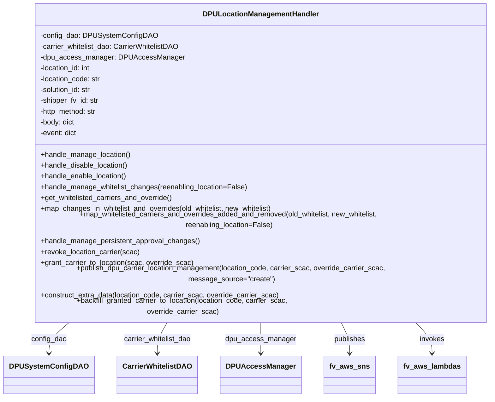

# Diagram: entity_core/entity_service/entity_service/dpu/dpu_service/location_management_service/dpu_location_management_handler.py


> Auto-generated by Obscura crawlers

## Diagram 1



### SVG

<svg id="container" width="1068.93359375" xmlns="http://www.w3.org/2000/svg" class="classDiagram" height="822" viewBox="0 0 1068.93359375 822" role="graphics-document document" aria-roledescription="class"><style>#container{font-family:"trebuchet ms",verdana,arial,sans-serif;font-size:16px;fill:#333;}@keyframes edge-animation-frame{from{stroke-dashoffset:0;}}@keyframes dash{to{stroke-dashoffset:0;}}#container .edge-animation-slow{stroke-dasharray:9,5!important;stroke-dashoffset:900;animation:dash 50s linear infinite;stroke-linecap:round;}#container .edge-animation-fast{stroke-dasharray:9,5!important;stroke-dashoffset:900;animation:dash 20s linear infinite;stroke-linecap:round;}#container .error-icon{fill:#552222;}#container .error-text{fill:#552222;stroke:#552222;}#container .edge-thickness-normal{stroke-width:1px;}#container .edge-thickness-thick{stroke-width:3.5px;}#container .edge-pattern-solid{stroke-dasharray:0;}#container .edge-thickness-invisible{stroke-width:0;fill:none;}#container .edge-pattern-dashed{stroke-dasharray:3;}#container .edge-pattern-dotted{stroke-dasharray:2;}#container .marker{fill:#333333;stroke:#333333;}#container .marker.cross{stroke:#333333;}#container svg{font-family:"trebuchet ms",verdana,arial,sans-serif;font-size:16px;}#container p{margin:0;}#container g.classGroup text{fill:#9370DB;stroke:none;font-family:"trebuchet ms",verdana,arial,sans-serif;font-size:10px;}#container g.classGroup text .title{font-weight:bolder;}#container .nodeLabel,#container .edgeLabel{color:#131300;}#container .edgeLabel .label rect{fill:#ECECFF;}#container .label text{fill:#131300;}#container .labelBkg{background:#ECECFF;}#container .edgeLabel .label span{background:#ECECFF;}#container .classTitle{font-weight:bolder;}#container .node rect,#container .node circle,#container .node ellipse,#container .node polygon,#container .node path{fill:#ECECFF;stroke:#9370DB;stroke-width:1px;}#container .divider{stroke:#9370DB;stroke-width:1;}#container g.clickable{cursor:pointer;}#container g.classGroup rect{fill:#ECECFF;stroke:#9370DB;}#container g.classGroup line{stroke:#9370DB;stroke-width:1;}#container .classLabel .box{stroke:none;stroke-width:0;fill:#ECECFF;opacity:0.5;}#container .classLabel .label{fill:#9370DB;font-size:10px;}#container .relation{stroke:#333333;stroke-width:1;fill:none;}#container .dashed-line{stroke-dasharray:3;}#container .dotted-line{stroke-dasharray:1 2;}#container #compositionStart,#container .composition{fill:#333333!important;stroke:#333333!important;stroke-width:1;}#container #compositionEnd,#container .composition{fill:#333333!important;stroke:#333333!important;stroke-width:1;}#container #dependencyStart,#container .dependency{fill:#333333!important;stroke:#333333!important;stroke-width:1;}#container #dependencyStart,#container .dependency{fill:#333333!important;stroke:#333333!important;stroke-width:1;}#container #extensionStart,#container .extension{fill:transparent!important;stroke:#333333!important;stroke-width:1;}#container #extensionEnd,#container .extension{fill:transparent!important;stroke:#333333!important;stroke-width:1;}#container #aggregationStart,#container .aggregation{fill:transparent!important;stroke:#333333!important;stroke-width:1;}#container #aggregationEnd,#container .aggregation{fill:transparent!important;stroke:#333333!important;stroke-width:1;}#container #lollipopStart,#container .lollipop{fill:#ECECFF!important;stroke:#333333!important;stroke-width:1;}#container #lollipopEnd,#container .lollipop{fill:#ECECFF!important;stroke:#333333!important;stroke-width:1;}#container .edgeTerminals{font-size:11px;line-height:initial;}#container .classTitleText{text-anchor:middle;font-size:18px;fill:#333;}#container .label-icon{display:inline-block;height:1em;overflow:visible;vertical-align:-0.125em;}#container .node .label-icon path{fill:currentColor;stroke:revert;stroke-width:revert;}#container :root{--mermaid-font-family:"trebuchet ms",verdana,arial,sans-serif;}</style><g><defs><marker id="container_class-aggregationStart" class="marker aggregation class" refX="18" refY="7" markerWidth="190" markerHeight="240" orient="auto"><path d="M 18,7 L9,13 L1,7 L9,1 Z"></path></marker></defs><defs><marker id="container_class-aggregationEnd" class="marker aggregation class" refX="1" refY="7" markerWidth="20" markerHeight="28" orient="auto"><path d="M 18,7 L9,13 L1,7 L9,1 Z"></path></marker></defs><defs><marker id="container_class-extensionStart" class="marker extension class" refX="18" refY="7" markerWidth="190" markerHeight="240" orient="auto"><path d="M 1,7 L18,13 V 1 Z"></path></marker></defs><defs><marker id="container_class-extensionEnd" class="marker extension class" refX="1" refY="7" markerWidth="20" markerHeight="28" orient="auto"><path d="M 1,1 V 13 L18,7 Z"></path></marker></defs><defs><marker id="container_class-compositionStart" class="marker composition class" refX="18" refY="7" markerWidth="190" markerHeight="240" orient="auto"><path d="M 18,7 L9,13 L1,7 L9,1 Z"></path></marker></defs><defs><marker id="container_class-compositionEnd" class="marker composition class" refX="1" refY="7" markerWidth="20" markerHeight="28" orient="auto"><path d="M 18,7 L9,13 L1,7 L9,1 Z"></path></marker></defs><defs><marker id="container_class-dependencyStart" class="marker dependency class" refX="6" refY="7" markerWidth="190" markerHeight="240" orient="auto"><path d="M 5,7 L9,13 L1,7 L9,1 Z"></path></marker></defs><defs><marker id="container_class-dependencyEnd" class="marker dependency class" refX="13" refY="7" markerWidth="20" markerHeight="28" orient="auto"><path d="M 18,7 L9,13 L14,7 L9,1 Z"></path></marker></defs><defs><marker id="container_class-lollipopStart" class="marker lollipop class" refX="13" refY="7" markerWidth="190" markerHeight="240" orient="auto"><circle stroke="black" fill="transparent" cx="7" cy="7" r="6"></circle></marker></defs><defs><marker id="container_class-lollipopEnd" class="marker lollipop class" refX="1" refY="7" markerWidth="190" markerHeight="240" orient="auto"><circle stroke="black" fill="transparent" cx="7" cy="7" r="6"></circle></marker></defs><g class="root"><g class="clusters"></g><g class="edgePaths"><path d="M145.542,656L137.942,662.167C130.343,668.333,115.144,680.667,107.545,692C99.945,703.333,99.945,713.667,99.945,718.833L99.945,724" id="id_DPULocationManagementHandler_DPUSystemConfigDAO_1" class="edge-thickness-normal edge-pattern-solid relation" style=";;;" data-edge="true" data-et="edge" data-id="id_DPULocationManagementHandler_DPUSystemConfigDAO_1" data-points="W3sieCI6MTQ1LjU0MTkxOTE0ODE5OTQ0LCJ5Ijo2NTZ9LHsieCI6OTkuOTQ1MzEyNSwieSI6NjkzfSx7IngiOjk5Ljk0NTMxMjUsInkiOjczMH1d" marker-end="url(#container_class-dependencyEnd)"></path><path d="M349.311,656L345.59,662.167C341.869,668.333,334.427,680.667,330.705,692C326.984,703.333,326.984,713.667,326.984,718.833L326.984,724" id="id_DPULocationManagementHandler_CarrierWhitelistDAO_2" class="edge-thickness-normal edge-pattern-solid relation" style=";;;" data-edge="true" data-et="edge" data-id="id_DPULocationManagementHandler_CarrierWhitelistDAO_2" data-points="W3sieCI6MzQ5LjMxMTA1MDAzNDYyNjEsInkiOjY1Nn0seyJ4IjozMjYuOTg0Mzc1LCJ5Ijo2OTN9LHsieCI6MzI2Ljk4NDM3NSwieSI6NzMwfV0=" marker-end="url(#container_class-dependencyEnd)"></path><path d="M544.82,656L544.82,662.167C544.82,668.333,544.82,680.667,544.82,692C544.82,703.333,544.82,713.667,544.82,718.833L544.82,724" id="id_DPULocationManagementHandler_DPUAccessManager_3" class="edge-thickness-normal edge-pattern-solid relation" style=";;;" data-edge="true" data-et="edge" data-id="id_DPULocationManagementHandler_DPUAccessManager_3" data-points="W3sieCI6NTQ0LjgyMDMxMjUsInkiOjY1Nn0seyJ4Ijo1NDQuODIwMzEyNSwieSI6NjkzfSx7IngiOjU0NC44MjAzMTI1LCJ5Ijo3MzB9XQ==" marker-end="url(#container_class-dependencyEnd)"></path><path d="M711.757,656L714.934,662.167C718.111,668.333,724.466,680.667,727.643,692C730.82,703.333,730.82,713.667,730.82,718.833L730.82,724" id="id_DPULocationManagementHandler_fv_aws_sns_4" class="edge-thickness-normal edge-pattern-solid relation" style=";;;" data-edge="true" data-et="edge" data-id="id_DPULocationManagementHandler_fv_aws_sns_4" data-points="W3sieCI6NzExLjc1NjYwMDU4ODY0MjYsInkiOjY1Nn0seyJ4Ijo3MzAuODIwMzEyNSwieSI6NjkzfSx7IngiOjczMC44MjAzMTI1LCJ5Ijo3MzB9XQ==" marker-end="url(#container_class-dependencyEnd)"></path><path d="M869.108,656L875.28,662.167C881.452,668.333,893.796,680.667,899.968,692C906.141,703.333,906.141,713.667,906.141,718.833L906.141,724" id="id_DPULocationManagementHandler_fv_aws_lambdas_5" class="edge-thickness-normal edge-pattern-solid relation" style=";;;" data-edge="true" data-et="edge" data-id="id_DPULocationManagementHandler_fv_aws_lambdas_5" data-points="W3sieCI6ODY5LjEwNzc5NTE4Njk4MDYsInkiOjY1Nn0seyJ4Ijo5MDYuMTQwNjI1LCJ5Ijo2OTN9LHsieCI6OTA2LjE0MDYyNSwieSI6NzMwfV0=" marker-end="url(#container_class-dependencyEnd)"></path></g><g class="edgeLabels"><g class="edgeLabel" transform="translate(99.9453125, 693)"><g class="label" data-id="id_DPULocationManagementHandler_DPUSystemConfigDAO_1" transform="translate(-39.625, -12)"><foreignObject width="79.25" height="24"><div xmlns="http://www.w3.org/1999/xhtml" class="labelBkg" style="display: table-cell; white-space: nowrap; line-height: 1.5; max-width: 200px; text-align: center;"><span class="edgeLabel"><p>config_dao</p></span></div></foreignObject></g></g><g class="edgeLabel" transform="translate(326.984375, 693)"><g class="label" data-id="id_DPULocationManagementHandler_CarrierWhitelistDAO_2" transform="translate(-76.1796875, -12)"><foreignObject width="152.359375" height="24"><div xmlns="http://www.w3.org/1999/xhtml" class="labelBkg" style="display: table-cell; white-space: nowrap; line-height: 1.5; max-width: 200px; text-align: center;"><span class="edgeLabel"><p>carrier_whitelist_dao</p></span></div></foreignObject></g></g><g class="edgeLabel" transform="translate(544.8203125, 693)"><g class="label" data-id="id_DPULocationManagementHandler_DPUAccessManager_3" transform="translate(-77.2734375, -12)"><foreignObject width="154.546875" height="24"><div xmlns="http://www.w3.org/1999/xhtml" class="labelBkg" style="display: table-cell; white-space: nowrap; line-height: 1.5; max-width: 200px; text-align: center;"><span class="edgeLabel"><p>dpu_access_manager</p></span></div></foreignObject></g></g><g class="edgeLabel" transform="translate(730.8203125, 693)"><g class="label" data-id="id_DPULocationManagementHandler_fv_aws_sns_4" transform="translate(-35.28125, -12)"><foreignObject width="70.5625" height="24"><div xmlns="http://www.w3.org/1999/xhtml" class="labelBkg" style="display: table-cell; white-space: nowrap; line-height: 1.5; max-width: 200px; text-align: center;"><span class="edgeLabel"><p>publishes</p></span></div></foreignObject></g></g><g class="edgeLabel" transform="translate(906.140625, 693)"><g class="label" data-id="id_DPULocationManagementHandler_fv_aws_lambdas_5" transform="translate(-27.5859375, -12)"><foreignObject width="55.171875" height="24"><div xmlns="http://www.w3.org/1999/xhtml" class="labelBkg" style="display: table-cell; white-space: nowrap; line-height: 1.5; max-width: 200px; text-align: center;"><span class="edgeLabel"><p>invokes</p></span></div></foreignObject></g></g></g><g class="nodes"><g class="node default" id="classId-DPULocationManagementHandler-0" transform="translate(544.8203125, 332)"><g class="basic label-container"><path d="M-516.11328125 -324 L516.11328125 -324 L516.11328125 324 L-516.11328125 324" stroke="none" stroke-width="0" fill="#ECECFF" style=""></path><path d="M-516.11328125 -324 C-194.98934235677547 -324, 126.13459653644907 -324, 516.11328125 -324 M-516.11328125 -324 C-286.85103854922323 -324, -57.588795848446466 -324, 516.11328125 -324 M516.11328125 -324 C516.11328125 -150.1190363071315, 516.11328125 23.76192738573701, 516.11328125 324 M516.11328125 -324 C516.11328125 -138.81642001287724, 516.11328125 46.36715997424551, 516.11328125 324 M516.11328125 324 C200.73584841610756 324, -114.64158441778488 324, -516.11328125 324 M516.11328125 324 C305.9592315653023 324, 95.8051818806045 324, -516.11328125 324 M-516.11328125 324 C-516.11328125 82.9518629995093, -516.11328125 -158.0962740009814, -516.11328125 -324 M-516.11328125 324 C-516.11328125 105.10142204304438, -516.11328125 -113.79715591391124, -516.11328125 -324" stroke="#9370DB" stroke-width="1.3" fill="none" stroke-dasharray="0 0" style=""></path></g><g class="annotation-group text" transform="translate(0, -300)"></g><g class="label-group text" transform="translate(-122.7734375, -300)"><g class="label" style="font-weight: bolder" transform="translate(0,-12)"><foreignObject width="245.546875" height="24"><div xmlns="http://www.w3.org/1999/xhtml" style="display: table-cell; white-space: nowrap; line-height: 1.5; max-width: 295px; text-align: center;"><span class="nodeLabel markdown-node-label" style=""><p>DPULocationManagementHandler</p></span></div></foreignObject></g></g><g class="members-group text" transform="translate(-504.11328125, -252)"><g class="label" style="" transform="translate(0,-12)"><foreignObject width="250.734375" height="24"><div xmlns="http://www.w3.org/1999/xhtml" style="display: table-cell; white-space: nowrap; line-height: 1.5; max-width: 308px; text-align: center;"><span class="nodeLabel markdown-node-label" style=""><p>-config_dao: DPUSystemConfigDAO</p></span></div></foreignObject></g><g class="label" style="" transform="translate(0,12)"><foreignObject width="310.1875" height="24"><div xmlns="http://www.w3.org/1999/xhtml" style="display: table-cell; white-space: nowrap; line-height: 1.5; max-width: 368px; text-align: center;"><span class="nodeLabel markdown-node-label" style=""><p>-carrier_whitelist_dao: CarrierWhitelistDAO</p></span></div></foreignObject></g><g class="label" style="" transform="translate(0,36)"><foreignObject width="308.625" height="24"><div xmlns="http://www.w3.org/1999/xhtml" style="display: table-cell; white-space: nowrap; line-height: 1.5; max-width: 367px; text-align: center;"><span class="nodeLabel markdown-node-label" style=""><p>-dpu_access_manager: DPUAccessManager</p></span></div></foreignObject></g><g class="label" style="" transform="translate(0,60)"><foreignObject width="115.75" height="24"><div xmlns="http://www.w3.org/1999/xhtml" style="display: table-cell; white-space: nowrap; line-height: 1.5; max-width: 173px; text-align: center;"><span class="nodeLabel markdown-node-label" style=""><p>-location_id: int</p></span></div></foreignObject></g><g class="label" style="" transform="translate(0,84)"><foreignObject width="136.078125" height="24"><div xmlns="http://www.w3.org/1999/xhtml" style="display: table-cell; white-space: nowrap; line-height: 1.5; max-width: 194px; text-align: center;"><span class="nodeLabel markdown-node-label" style=""><p>-location_code: str</p></span></div></foreignObject></g><g class="label" style="" transform="translate(0,108)"><foreignObject width="116.1875" height="24"><div xmlns="http://www.w3.org/1999/xhtml" style="display: table-cell; white-space: nowrap; line-height: 1.5; max-width: 174px; text-align: center;"><span class="nodeLabel markdown-node-label" style=""><p>-solution_id: str</p></span></div></foreignObject></g><g class="label" style="" transform="translate(0,132)"><foreignObject width="131.09375" height="24"><div xmlns="http://www.w3.org/1999/xhtml" style="display: table-cell; white-space: nowrap; line-height: 1.5; max-width: 189px; text-align: center;"><span class="nodeLabel markdown-node-label" style=""><p>-shipper_fv_id: str</p></span></div></foreignObject></g><g class="label" style="" transform="translate(0,156)"><foreignObject width="128.890625" height="24"><div xmlns="http://www.w3.org/1999/xhtml" style="display: table-cell; white-space: nowrap; line-height: 1.5; max-width: 187px; text-align: center;"><span class="nodeLabel markdown-node-label" style=""><p>-http_method: str</p></span></div></foreignObject></g><g class="label" style="" transform="translate(0,180)"><foreignObject width="78.390625" height="24"><div xmlns="http://www.w3.org/1999/xhtml" style="display: table-cell; white-space: nowrap; line-height: 1.5; max-width: 136px; text-align: center;"><span class="nodeLabel markdown-node-label" style=""><p>-body: dict</p></span></div></foreignObject></g><g class="label" style="" transform="translate(0,204)"><foreignObject width="82.4375" height="24"><div xmlns="http://www.w3.org/1999/xhtml" style="display: table-cell; white-space: nowrap; line-height: 1.5; max-width: 140px; text-align: center;"><span class="nodeLabel markdown-node-label" style=""><p>-event: dict</p></span></div></foreignObject></g></g><g class="methods-group text" transform="translate(-504.11328125, 12)"><g class="label" style="" transform="translate(0,-12)"><foreignObject width="200.828125" height="24"><div xmlns="http://www.w3.org/1999/xhtml" style="display: table-cell; white-space: nowrap; line-height: 1.5; max-width: 258px; text-align: center;"><span class="nodeLabel markdown-node-label" style=""><p>+handle_manage_location()</p></span></div></foreignObject></g><g class="label" style="" transform="translate(0,12)"><foreignObject width="196.3125" height="24"><div xmlns="http://www.w3.org/1999/xhtml" style="display: table-cell; white-space: nowrap; line-height: 1.5; max-width: 254px; text-align: center;"><span class="nodeLabel markdown-node-label" style=""><p>+handle_disable_location()</p></span></div></foreignObject></g><g class="label" style="" transform="translate(0,36)"><foreignObject width="193.015625" height="24"><div xmlns="http://www.w3.org/1999/xhtml" style="display: table-cell; white-space: nowrap; line-height: 1.5; max-width: 250px; text-align: center;"><span class="nodeLabel markdown-node-label" style=""><p>+handle_enable_location()</p></span></div></foreignObject></g><g class="label" style="" transform="translate(0,60)"><foreignObject width="460.25" height="24"><div xmlns="http://www.w3.org/1999/xhtml" style="display: table-cell; white-space: nowrap; line-height: 1.5; max-width: 518px; text-align: center;"><span class="nodeLabel markdown-node-label" style=""><p>+handle_manage_whitelist_changes(reenabling_location=False)</p></span></div></foreignObject></g><g class="label" style="" transform="translate(0,84)"><foreignObject width="296.5" height="24"><div xmlns="http://www.w3.org/1999/xhtml" style="display: table-cell; white-space: nowrap; line-height: 1.5; max-width: 354px; text-align: center;"><span class="nodeLabel markdown-node-label" style=""><p>+get_whitelisted_carriers_and_override()</p></span></div></foreignObject></g><g class="label" style="" transform="translate(0,108)"><foreignObject width="522.390625" height="24"><div xmlns="http://www.w3.org/1999/xhtml" style="display: table-cell; white-space: nowrap; line-height: 1.5; max-width: 580px; text-align: center;"><span class="nodeLabel markdown-node-label" style=""><p>+map_changes_in_whitelist_and_overrides(old_whitelist, new_whitelist)</p></span></div></foreignObject></g><g class="label" style="" transform="translate(0,132)"><foreignObject width="872.796875" height="24"><div xmlns="http://www.w3.org/1999/xhtml" style="display: table-cell; white-space: nowrap; line-height: 1.5; max-width: 930px; text-align: center;"><span class="nodeLabel markdown-node-label" style=""><p>+map_whitelisted_carriers_and_overrides_added_and_removed(old_whitelist, new_whitelist, reenabling_location=False)</p></span></div></foreignObject></g><g class="label" style="" transform="translate(0,156)"><foreignObject width="353.75" height="24"><div xmlns="http://www.w3.org/1999/xhtml" style="display: table-cell; white-space: nowrap; line-height: 1.5; max-width: 411px; text-align: center;"><span class="nodeLabel markdown-node-label" style=""><p>+handle_manage_persistent_approval_changes()</p></span></div></foreignObject></g><g class="label" style="" transform="translate(0,180)"><foreignObject width="220.890625" height="24"><div xmlns="http://www.w3.org/1999/xhtml" style="display: table-cell; white-space: nowrap; line-height: 1.5; max-width: 278px; text-align: center;"><span class="nodeLabel markdown-node-label" style=""><p>+revoke_location_carrier(scac)</p></span></div></foreignObject></g><g class="label" style="" transform="translate(0,204)"><foreignObject width="340.515625" height="24"><div xmlns="http://www.w3.org/1999/xhtml" style="display: table-cell; white-space: nowrap; line-height: 1.5; max-width: 398px; text-align: center;"><span class="nodeLabel markdown-node-label" style=""><p>+grant_carrier_to_location(scac, override_scac)</p></span></div></foreignObject></g><g class="label" style="" transform="translate(0,228)"><foreignObject width="885.453125" height="24"><div xmlns="http://www.w3.org/1999/xhtml" style="display: table-cell; white-space: nowrap; line-height: 1.5; max-width: 943px; text-align: center;"><span class="nodeLabel markdown-node-label" style=""><p>+publish_dpu_carrier_location_management(location_code, carrier_scac, override_carrier_scac, message_source="create")</p></span></div></foreignObject></g><g class="label" style="" transform="translate(0,252)"><foreignObject width="531.15625" height="24"><div xmlns="http://www.w3.org/1999/xhtml" style="display: table-cell; white-space: nowrap; line-height: 1.5; max-width: 589px; text-align: center;"><span class="nodeLabel markdown-node-label" style=""><p>+construct_extra_data(location_code, carrier_scac, override_carrier_scac)</p></span></div></foreignObject></g><g class="label" style="" transform="translate(0,276)"><foreignObject width="639.1875" height="24"><div xmlns="http://www.w3.org/1999/xhtml" style="display: table-cell; white-space: nowrap; line-height: 1.5; max-width: 697px; text-align: center;"><span class="nodeLabel markdown-node-label" style=""><p>+backfill_granted_carrier_to_location(location_code, carrier_scac, override_carrier_scac)</p></span></div></foreignObject></g></g><g class="divider" style=""><path d="M-516.11328125 -276 C-136.94929429681275 -276, 242.2146926563745 -276, 516.11328125 -276 M-516.11328125 -276 C-138.42402493697284 -276, 239.26523137605432 -276, 516.11328125 -276" stroke="#9370DB" stroke-width="1.3" fill="none" stroke-dasharray="0 0" style=""></path></g><g class="divider" style=""><path d="M-516.11328125 -12 C-148.412318809618 -12, 219.288643630764 -12, 516.11328125 -12 M-516.11328125 -12 C-162.17400758010933 -12, 191.76526608978133 -12, 516.11328125 -12" stroke="#9370DB" stroke-width="1.3" fill="none" stroke-dasharray="0 0" style=""></path></g></g><g class="node default" id="classId-DPUSystemConfigDAO-1" transform="translate(99.9453125, 772)"><g class="basic label-container"><path d="M-91.9453125 -42 L91.9453125 -42 L91.9453125 42 L-91.9453125 42" stroke="none" stroke-width="0" fill="#ECECFF" style=""></path><path d="M-91.9453125 -42 C-32.89939895380778 -42, 26.146514592384435 -42, 91.9453125 -42 M-91.9453125 -42 C-29.275045895715593 -42, 33.395220708568814 -42, 91.9453125 -42 M91.9453125 -42 C91.9453125 -14.224377970498857, 91.9453125 13.551244059002286, 91.9453125 42 M91.9453125 -42 C91.9453125 -10.857792611730748, 91.9453125 20.284414776538505, 91.9453125 42 M91.9453125 42 C41.84118707724322 42, -8.262938345513561 42, -91.9453125 42 M91.9453125 42 C43.300078096615366 42, -5.345156306769269 42, -91.9453125 42 M-91.9453125 42 C-91.9453125 19.38232141411995, -91.9453125 -3.2353571717601, -91.9453125 -42 M-91.9453125 42 C-91.9453125 10.937821386751292, -91.9453125 -20.124357226497416, -91.9453125 -42" stroke="#9370DB" stroke-width="1.3" fill="none" stroke-dasharray="0 0" style=""></path></g><g class="annotation-group text" transform="translate(0, -18)"></g><g class="label-group text" transform="translate(-79.9453125, -18)"><g class="label" style="font-weight: bolder" transform="translate(0,-12)"><foreignObject width="159.890625" height="24"><div xmlns="http://www.w3.org/1999/xhtml" style="display: table-cell; white-space: nowrap; line-height: 1.5; max-width: 207px; text-align: center;"><span class="nodeLabel markdown-node-label" style=""><p>DPUSystemConfigDAO</p></span></div></foreignObject></g></g><g class="members-group text" transform="translate(-79.9453125, 30)"></g><g class="methods-group text" transform="translate(-79.9453125, 60)"></g><g class="divider" style=""><path d="M-91.9453125 6 C-46.0241957571737 6, -0.10307901434740074 6, 91.9453125 6 M-91.9453125 6 C-25.91982342264913 6, 40.10566565470174 6, 91.9453125 6" stroke="#9370DB" stroke-width="1.3" fill="none" stroke-dasharray="0 0" style=""></path></g><g class="divider" style=""><path d="M-91.9453125 24 C-40.949606656902105 24, 10.04609918619579 24, 91.9453125 24 M-91.9453125 24 C-25.57399045479427 24, 40.79733159041146 24, 91.9453125 24" stroke="#9370DB" stroke-width="1.3" fill="none" stroke-dasharray="0 0" style=""></path></g></g><g class="node default" id="classId-CarrierWhitelistDAO-2" transform="translate(326.984375, 772)"><g class="basic label-container"><path d="M-85.09375 -42 L85.09375 -42 L85.09375 42 L-85.09375 42" stroke="none" stroke-width="0" fill="#ECECFF" style=""></path><path d="M-85.09375 -42 C-48.229584674224675 -42, -11.36541934844935 -42, 85.09375 -42 M-85.09375 -42 C-50.591489818486146 -42, -16.08922963697229 -42, 85.09375 -42 M85.09375 -42 C85.09375 -17.06005086162517, 85.09375 7.879898276749657, 85.09375 42 M85.09375 -42 C85.09375 -18.062820264502633, 85.09375 5.874359470994733, 85.09375 42 M85.09375 42 C21.234773462554358 42, -42.624203074891284 42, -85.09375 42 M85.09375 42 C37.246396722189985 42, -10.60095655562003 42, -85.09375 42 M-85.09375 42 C-85.09375 12.91568457122851, -85.09375 -16.16863085754298, -85.09375 -42 M-85.09375 42 C-85.09375 24.522927995882686, -85.09375 7.045855991765372, -85.09375 -42" stroke="#9370DB" stroke-width="1.3" fill="none" stroke-dasharray="0 0" style=""></path></g><g class="annotation-group text" transform="translate(0, -18)"></g><g class="label-group text" transform="translate(-73.09375, -18)"><g class="label" style="font-weight: bolder" transform="translate(0,-12)"><foreignObject width="146.1875" height="24"><div xmlns="http://www.w3.org/1999/xhtml" style="display: table-cell; white-space: nowrap; line-height: 1.5; max-width: 193px; text-align: center;"><span class="nodeLabel markdown-node-label" style=""><p>CarrierWhitelistDAO</p></span></div></foreignObject></g></g><g class="members-group text" transform="translate(-73.09375, 30)"></g><g class="methods-group text" transform="translate(-73.09375, 60)"></g><g class="divider" style=""><path d="M-85.09375 6 C-39.793033316456125 6, 5.5076833670877505 6, 85.09375 6 M-85.09375 6 C-25.74859665382685 6, 33.5965566923463 6, 85.09375 6" stroke="#9370DB" stroke-width="1.3" fill="none" stroke-dasharray="0 0" style=""></path></g><g class="divider" style=""><path d="M-85.09375 24 C-43.15662367327183 24, -1.2194973465436618 24, 85.09375 24 M-85.09375 24 C-31.65923087668842 24, 21.775288246623163 24, 85.09375 24" stroke="#9370DB" stroke-width="1.3" fill="none" stroke-dasharray="0 0" style=""></path></g></g><g class="node default" id="classId-DPUAccessManager-3" transform="translate(544.8203125, 772)"><g class="basic label-container"><path d="M-82.7421875 -42 L82.7421875 -42 L82.7421875 42 L-82.7421875 42" stroke="none" stroke-width="0" fill="#ECECFF" style=""></path><path d="M-82.7421875 -42 C-28.458400106216892 -42, 25.825387287566215 -42, 82.7421875 -42 M-82.7421875 -42 C-44.07680970964757 -42, -5.41143191929514 -42, 82.7421875 -42 M82.7421875 -42 C82.7421875 -9.190858757494993, 82.7421875 23.618282485010013, 82.7421875 42 M82.7421875 -42 C82.7421875 -10.08328150243527, 82.7421875 21.83343699512946, 82.7421875 42 M82.7421875 42 C34.664793888285274 42, -13.412599723429452 42, -82.7421875 42 M82.7421875 42 C47.36722966271166 42, 11.992271825423316 42, -82.7421875 42 M-82.7421875 42 C-82.7421875 9.656664880482865, -82.7421875 -22.68667023903427, -82.7421875 -42 M-82.7421875 42 C-82.7421875 23.437415104368302, -82.7421875 4.874830208736604, -82.7421875 -42" stroke="#9370DB" stroke-width="1.3" fill="none" stroke-dasharray="0 0" style=""></path></g><g class="annotation-group text" transform="translate(0, -18)"></g><g class="label-group text" transform="translate(-70.7421875, -18)"><g class="label" style="font-weight: bolder" transform="translate(0,-12)"><foreignObject width="141.484375" height="24"><div xmlns="http://www.w3.org/1999/xhtml" style="display: table-cell; white-space: nowrap; line-height: 1.5; max-width: 190px; text-align: center;"><span class="nodeLabel markdown-node-label" style=""><p>DPUAccessManager</p></span></div></foreignObject></g></g><g class="members-group text" transform="translate(-70.7421875, 30)"></g><g class="methods-group text" transform="translate(-70.7421875, 60)"></g><g class="divider" style=""><path d="M-82.7421875 6 C-39.55639367842125 6, 3.629400143157497 6, 82.7421875 6 M-82.7421875 6 C-45.48618758618547 6, -8.230187672370946 6, 82.7421875 6" stroke="#9370DB" stroke-width="1.3" fill="none" stroke-dasharray="0 0" style=""></path></g><g class="divider" style=""><path d="M-82.7421875 24 C-38.90924918645464 24, 4.923689127090725 24, 82.7421875 24 M-82.7421875 24 C-31.716914311659337 24, 19.308358876681325 24, 82.7421875 24" stroke="#9370DB" stroke-width="1.3" fill="none" stroke-dasharray="0 0" style=""></path></g></g><g class="node default" id="classId-fv_aws_sns-4" transform="translate(730.8203125, 772)"><g class="basic label-container"><path d="M-53.2578125 -42 L53.2578125 -42 L53.2578125 42 L-53.2578125 42" stroke="none" stroke-width="0" fill="#ECECFF" style=""></path><path d="M-53.2578125 -42 C-29.347449780706697 -42, -5.4370870614133935 -42, 53.2578125 -42 M-53.2578125 -42 C-25.078775883826292 -42, 3.100260732347415 -42, 53.2578125 -42 M53.2578125 -42 C53.2578125 -10.509621418647082, 53.2578125 20.980757162705835, 53.2578125 42 M53.2578125 -42 C53.2578125 -11.466499892421535, 53.2578125 19.06700021515693, 53.2578125 42 M53.2578125 42 C16.14335465897541 42, -20.971103182049177 42, -53.2578125 42 M53.2578125 42 C18.036685722602165 42, -17.18444105479567 42, -53.2578125 42 M-53.2578125 42 C-53.2578125 17.6638297010526, -53.2578125 -6.672340597894802, -53.2578125 -42 M-53.2578125 42 C-53.2578125 19.621423756602915, -53.2578125 -2.757152486794169, -53.2578125 -42" stroke="#9370DB" stroke-width="1.3" fill="none" stroke-dasharray="0 0" style=""></path></g><g class="annotation-group text" transform="translate(0, -18)"></g><g class="label-group text" transform="translate(-41.2578125, -18)"><g class="label" style="font-weight: bolder" transform="translate(0,-12)"><foreignObject width="82.515625" height="24"><div xmlns="http://www.w3.org/1999/xhtml" style="display: table-cell; white-space: nowrap; line-height: 1.5; max-width: 131px; text-align: center;"><span class="nodeLabel markdown-node-label" style=""><p>fv_aws_sns</p></span></div></foreignObject></g></g><g class="members-group text" transform="translate(-41.2578125, 30)"></g><g class="methods-group text" transform="translate(-41.2578125, 60)"></g><g class="divider" style=""><path d="M-53.2578125 6 C-31.38966643566593 6, -9.52152037133186 6, 53.2578125 6 M-53.2578125 6 C-28.76302357997129 6, -4.2682346599425784 6, 53.2578125 6" stroke="#9370DB" stroke-width="1.3" fill="none" stroke-dasharray="0 0" style=""></path></g><g class="divider" style=""><path d="M-53.2578125 24 C-31.236823335817892 24, -9.215834171635784 24, 53.2578125 24 M-53.2578125 24 C-15.635518656650092 24, 21.986775186699816 24, 53.2578125 24" stroke="#9370DB" stroke-width="1.3" fill="none" stroke-dasharray="0 0" style=""></path></g></g><g class="node default" id="classId-fv_aws_lambdas-5" transform="translate(906.140625, 772)"><g class="basic label-container"><path d="M-72.0625 -42 L72.0625 -42 L72.0625 42 L-72.0625 42" stroke="none" stroke-width="0" fill="#ECECFF" style=""></path><path d="M-72.0625 -42 C-18.434278642665312 -42, 35.193942714669376 -42, 72.0625 -42 M-72.0625 -42 C-20.916545072617566 -42, 30.229409854764867 -42, 72.0625 -42 M72.0625 -42 C72.0625 -11.041430800227005, 72.0625 19.91713839954599, 72.0625 42 M72.0625 -42 C72.0625 -12.118389978814697, 72.0625 17.763220042370605, 72.0625 42 M72.0625 42 C39.360645025110486 42, 6.658790050220972 42, -72.0625 42 M72.0625 42 C22.610659152229893 42, -26.841181695540214 42, -72.0625 42 M-72.0625 42 C-72.0625 24.474357145651144, -72.0625 6.948714291302288, -72.0625 -42 M-72.0625 42 C-72.0625 9.366465516216913, -72.0625 -23.267068967566175, -72.0625 -42" stroke="#9370DB" stroke-width="1.3" fill="none" stroke-dasharray="0 0" style=""></path></g><g class="annotation-group text" transform="translate(0, -18)"></g><g class="label-group text" transform="translate(-60.0625, -18)"><g class="label" style="font-weight: bolder" transform="translate(0,-12)"><foreignObject width="120.125" height="24"><div xmlns="http://www.w3.org/1999/xhtml" style="display: table-cell; white-space: nowrap; line-height: 1.5; max-width: 168px; text-align: center;"><span class="nodeLabel markdown-node-label" style=""><p>fv_aws_lambdas</p></span></div></foreignObject></g></g><g class="members-group text" transform="translate(-60.0625, 30)"></g><g class="methods-group text" transform="translate(-60.0625, 60)"></g><g class="divider" style=""><path d="M-72.0625 6 C-26.37708816116249 6, 19.30832367767502 6, 72.0625 6 M-72.0625 6 C-37.13955880214925 6, -2.2166176042985057 6, 72.0625 6" stroke="#9370DB" stroke-width="1.3" fill="none" stroke-dasharray="0 0" style=""></path></g><g class="divider" style=""><path d="M-72.0625 24 C-20.453261961680973 24, 31.155976076638055 24, 72.0625 24 M-72.0625 24 C-37.1854434218642 24, -2.3083868437283996 24, 72.0625 24" stroke="#9370DB" stroke-width="1.3" fill="none" stroke-dasharray="0 0" style=""></path></g></g></g></g></g></svg>

## Diagram 2

```mermaid
flowchart TD
    Start([Start: handle_manage_location]) --> CheckMethod{HTTP Method}
    CheckMethod -->|PUT| CheckEnabled{is_location_enabled?}
    CheckEnabled -->|No| Enable[handle_enable_location()\nadd_location_to_dpu_visibility]
    Enable --> ManageWhitelist
    CheckEnabled -->|Yes| ManageWhitelist[handle_manage_whitelist_changes(reenabling_location=False)]
    ManageWhitelist --> PersistentApproval[handle_manage_persistent_approval_changes()]
    PersistentApproval --> Accumulate{change_details present?}
    CheckMethod -->|DELETE| DeleteCheck{HTTP DELETE and is_location_enabled?}
    DeleteCheck -->|Yes| Disable[handle_disable_location()\nrevoke_location + insert log enabled=False]
    DeleteCheck -->|No| NoChangeLog[log "No changes to visibility, whitelist, or overrides"]
    Disable --> Accumulate
    Accumulate -->|Yes| InsertLog[dpu_access_manager.insert_location_update_log(location_id, change_details)]
    InsertLog --> Return[Return {"message":"Success"}, 200]
    Accumulate -->|No| NoChangeLog
    NoChangeLog --> Return
```

> SVG rendering failed for this diagram.
