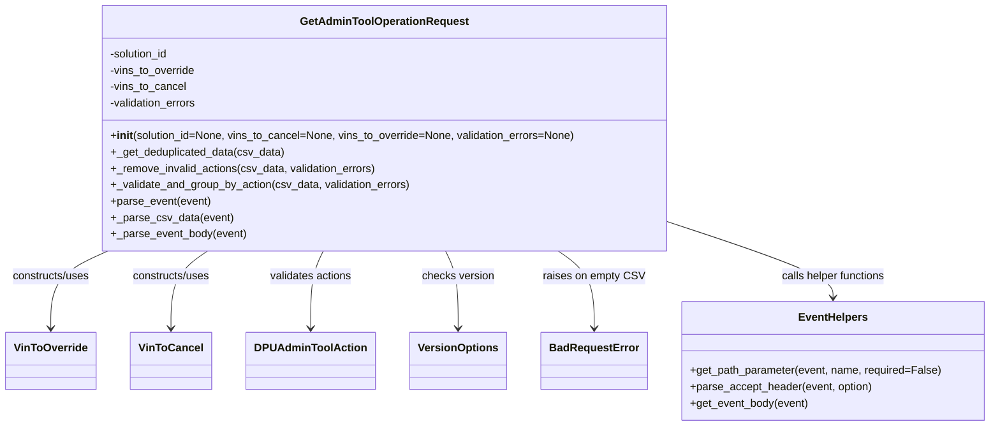

# Diagram: entity_core/entity_service/entity_service/dpu/dpu_service/service/dpu_admin_tool_operation_request.py


> Auto-generated by Obscura crawlers

## Diagram 1



### SVG

<svg id="container" width="1410.09375" xmlns="http://www.w3.org/2000/svg" class="classDiagram" height="624" viewBox="0 0 1410.09375 624" role="graphics-document document" aria-roledescription="class"><style>#container{font-family:"trebuchet ms",verdana,arial,sans-serif;font-size:16px;fill:#333;}@keyframes edge-animation-frame{from{stroke-dashoffset:0;}}@keyframes dash{to{stroke-dashoffset:0;}}#container .edge-animation-slow{stroke-dasharray:9,5!important;stroke-dashoffset:900;animation:dash 50s linear infinite;stroke-linecap:round;}#container .edge-animation-fast{stroke-dasharray:9,5!important;stroke-dashoffset:900;animation:dash 20s linear infinite;stroke-linecap:round;}#container .error-icon{fill:#552222;}#container .error-text{fill:#552222;stroke:#552222;}#container .edge-thickness-normal{stroke-width:1px;}#container .edge-thickness-thick{stroke-width:3.5px;}#container .edge-pattern-solid{stroke-dasharray:0;}#container .edge-thickness-invisible{stroke-width:0;fill:none;}#container .edge-pattern-dashed{stroke-dasharray:3;}#container .edge-pattern-dotted{stroke-dasharray:2;}#container .marker{fill:#333333;stroke:#333333;}#container .marker.cross{stroke:#333333;}#container svg{font-family:"trebuchet ms",verdana,arial,sans-serif;font-size:16px;}#container p{margin:0;}#container g.classGroup text{fill:#9370DB;stroke:none;font-family:"trebuchet ms",verdana,arial,sans-serif;font-size:10px;}#container g.classGroup text .title{font-weight:bolder;}#container .nodeLabel,#container .edgeLabel{color:#131300;}#container .edgeLabel .label rect{fill:#ECECFF;}#container .label text{fill:#131300;}#container .labelBkg{background:#ECECFF;}#container .edgeLabel .label span{background:#ECECFF;}#container .classTitle{font-weight:bolder;}#container .node rect,#container .node circle,#container .node ellipse,#container .node polygon,#container .node path{fill:#ECECFF;stroke:#9370DB;stroke-width:1px;}#container .divider{stroke:#9370DB;stroke-width:1;}#container g.clickable{cursor:pointer;}#container g.classGroup rect{fill:#ECECFF;stroke:#9370DB;}#container g.classGroup line{stroke:#9370DB;stroke-width:1;}#container .classLabel .box{stroke:none;stroke-width:0;fill:#ECECFF;opacity:0.5;}#container .classLabel .label{fill:#9370DB;font-size:10px;}#container .relation{stroke:#333333;stroke-width:1;fill:none;}#container .dashed-line{stroke-dasharray:3;}#container .dotted-line{stroke-dasharray:1 2;}#container #compositionStart,#container .composition{fill:#333333!important;stroke:#333333!important;stroke-width:1;}#container #compositionEnd,#container .composition{fill:#333333!important;stroke:#333333!important;stroke-width:1;}#container #dependencyStart,#container .dependency{fill:#333333!important;stroke:#333333!important;stroke-width:1;}#container #dependencyStart,#container .dependency{fill:#333333!important;stroke:#333333!important;stroke-width:1;}#container #extensionStart,#container .extension{fill:transparent!important;stroke:#333333!important;stroke-width:1;}#container #extensionEnd,#container .extension{fill:transparent!important;stroke:#333333!important;stroke-width:1;}#container #aggregationStart,#container .aggregation{fill:transparent!important;stroke:#333333!important;stroke-width:1;}#container #aggregationEnd,#container .aggregation{fill:transparent!important;stroke:#333333!important;stroke-width:1;}#container #lollipopStart,#container .lollipop{fill:#ECECFF!important;stroke:#333333!important;stroke-width:1;}#container #lollipopEnd,#container .lollipop{fill:#ECECFF!important;stroke:#333333!important;stroke-width:1;}#container .edgeTerminals{font-size:11px;line-height:initial;}#container .classTitleText{text-anchor:middle;font-size:18px;fill:#333;}#container .label-icon{display:inline-block;height:1em;overflow:visible;vertical-align:-0.125em;}#container .node .label-icon path{fill:currentColor;stroke:revert;stroke-width:revert;}#container :root{--mermaid-font-family:"trebuchet ms",verdana,arial,sans-serif;}</style><g><defs><marker id="container_class-aggregationStart" class="marker aggregation class" refX="18" refY="7" markerWidth="190" markerHeight="240" orient="auto"><path d="M 18,7 L9,13 L1,7 L9,1 Z"></path></marker></defs><defs><marker id="container_class-aggregationEnd" class="marker aggregation class" refX="1" refY="7" markerWidth="20" markerHeight="28" orient="auto"><path d="M 18,7 L9,13 L1,7 L9,1 Z"></path></marker></defs><defs><marker id="container_class-extensionStart" class="marker extension class" refX="18" refY="7" markerWidth="190" markerHeight="240" orient="auto"><path d="M 1,7 L18,13 V 1 Z"></path></marker></defs><defs><marker id="container_class-extensionEnd" class="marker extension class" refX="1" refY="7" markerWidth="20" markerHeight="28" orient="auto"><path d="M 1,1 V 13 L18,7 Z"></path></marker></defs><defs><marker id="container_class-compositionStart" class="marker composition class" refX="18" refY="7" markerWidth="190" markerHeight="240" orient="auto"><path d="M 18,7 L9,13 L1,7 L9,1 Z"></path></marker></defs><defs><marker id="container_class-compositionEnd" class="marker composition class" refX="1" refY="7" markerWidth="20" markerHeight="28" orient="auto"><path d="M 18,7 L9,13 L1,7 L9,1 Z"></path></marker></defs><defs><marker id="container_class-dependencyStart" class="marker dependency class" refX="6" refY="7" markerWidth="190" markerHeight="240" orient="auto"><path d="M 5,7 L9,13 L1,7 L9,1 Z"></path></marker></defs><defs><marker id="container_class-dependencyEnd" class="marker dependency class" refX="13" refY="7" markerWidth="20" markerHeight="28" orient="auto"><path d="M 18,7 L9,13 L14,7 L9,1 Z"></path></marker></defs><defs><marker id="container_class-lollipopStart" class="marker lollipop class" refX="13" refY="7" markerWidth="190" markerHeight="240" orient="auto"><circle stroke="black" fill="transparent" cx="7" cy="7" r="6"></circle></marker></defs><defs><marker id="container_class-lollipopEnd" class="marker lollipop class" refX="1" refY="7" markerWidth="190" markerHeight="240" orient="auto"><circle stroke="black" fill="transparent" cx="7" cy="7" r="6"></circle></marker></defs><g class="root"><g class="clusters"></g><g class="edgePaths"><path d="M151.736,368L138.423,374.167C125.11,380.333,98.485,392.667,85.172,411.5C71.859,430.333,71.859,455.667,71.859,468.333L71.859,481" id="id_GetAdminToolOperationRequest_VinToOverride_1" class="edge-thickness-normal edge-pattern-solid relation" style=";;;" data-edge="true" data-et="edge" data-id="id_GetAdminToolOperationRequest_VinToOverride_1" data-points="W3sieCI6MTUxLjczNTg2OTA5NTYyMjEsInkiOjM2OH0seyJ4Ijo3MS44NTkzNzUsInkiOjQwNX0seyJ4Ijo3MS44NTkzNzUsInkiOjQ4N31d" marker-end="url(#container_class-dependencyEnd)"></path><path d="M292.607,368L284.121,374.167C275.634,380.333,258.661,392.667,250.174,411.5C241.688,430.333,241.688,455.667,241.688,468.333L241.688,481" id="id_GetAdminToolOperationRequest_VinToCancel_2" class="edge-thickness-normal edge-pattern-solid relation" style=";;;" data-edge="true" data-et="edge" data-id="id_GetAdminToolOperationRequest_VinToCancel_2" data-points="W3sieCI6MjkyLjYwNzEyNDg1NTk5MDgsInkiOjM2OH0seyJ4IjoyNDEuNjg3NSwieSI6NDA1fSx7IngiOjI0MS42ODc1LCJ5Ijo0ODd9XQ==" marker-end="url(#container_class-dependencyEnd)"></path><path d="M454.397,368L451.453,374.167C448.51,380.333,442.622,392.667,439.678,411.5C436.734,430.333,436.734,455.667,436.734,468.333L436.734,481" id="id_GetAdminToolOperationRequest_DPUAdminToolAction_3" class="edge-thickness-normal edge-pattern-solid relation" style=";;;" data-edge="true" data-et="edge" data-id="id_GetAdminToolOperationRequest_DPUAdminToolAction_3" data-points="W3sieCI6NDU0LjM5NzE1OTQxODIwMjc2LCJ5IjozNjh9LHsieCI6NDM2LjczNDM3NSwieSI6NDA1fSx7IngiOjQzNi43MzQzNzUsInkiOjQ4N31d" marker-end="url(#container_class-dependencyEnd)"></path><path d="M626.251,368L629.195,374.167C632.139,380.333,638.026,392.667,640.97,411.5C643.914,430.333,643.914,455.667,643.914,468.333L643.914,481" id="id_GetAdminToolOperationRequest_VersionOptions_4" class="edge-thickness-normal edge-pattern-solid relation" style=";;;" data-edge="true" data-et="edge" data-id="id_GetAdminToolOperationRequest_VersionOptions_4" data-points="W3sieCI6NjI2LjI1MTI3ODA4MTc5NzIsInkiOjM2OH0seyJ4Ijo2NDMuOTE0MDYyNSwieSI6NDA1fSx7IngiOjY0My45MTQwNjI1LCJ5Ijo0ODd9XQ==" marker-end="url(#container_class-dependencyEnd)"></path><path d="M785.831,368L794.242,374.167C802.653,380.333,819.475,392.667,827.886,411.5C836.297,430.333,836.297,455.667,836.297,468.333L836.297,481" id="id_GetAdminToolOperationRequest_BadRequestError_5" class="edge-thickness-normal edge-pattern-solid relation" style=";;;" data-edge="true" data-et="edge" data-id="id_GetAdminToolOperationRequest_BadRequestError_5" data-points="W3sieCI6Nzg1LjgzMTQ5MTIxNTQzNzgsInkiOjM2OH0seyJ4Ijo4MzYuMjk2ODc1LCJ5Ijo0MDV9LHsieCI6ODM2LjI5Njg3NSwieSI6NDg3fV0=" marker-end="url(#container_class-dependencyEnd)"></path><path d="M953.582,327.899L991.541,340.749C1029.5,353.599,1105.418,379.3,1143.377,397.317C1181.336,415.333,1181.336,425.667,1181.336,430.833L1181.336,436" id="id_GetAdminToolOperationRequest_EventHelpers_6" class="edge-thickness-normal edge-pattern-solid relation" style=";;;" data-edge="true" data-et="edge" data-id="id_GetAdminToolOperationRequest_EventHelpers_6" data-points="W3sieCI6OTUzLjU4MjAzMTI1LCJ5IjozMjcuODk5MDczMTIwNDk0MzR9LHsieCI6MTE4MS4zMzU5Mzc1LCJ5Ijo0MDV9LHsieCI6MTE4MS4zMzU5Mzc1LCJ5Ijo0NDJ9XQ==" marker-end="url(#container_class-dependencyEnd)"></path></g><g class="edgeLabels"><g class="edgeLabel" transform="translate(71.859375, 405)"><g class="label" data-id="id_GetAdminToolOperationRequest_VinToOverride_1" transform="translate(-58.25, -12)"><foreignObject width="116.5" height="24"><div xmlns="http://www.w3.org/1999/xhtml" class="labelBkg" style="display: table-cell; white-space: nowrap; line-height: 1.5; max-width: 200px; text-align: center;"><span class="edgeLabel"><p>constructs/uses</p></span></div></foreignObject></g></g><g class="edgeLabel" transform="translate(241.6875, 405)"><g class="label" data-id="id_GetAdminToolOperationRequest_VinToCancel_2" transform="translate(-58.25, -12)"><foreignObject width="116.5" height="24"><div xmlns="http://www.w3.org/1999/xhtml" class="labelBkg" style="display: table-cell; white-space: nowrap; line-height: 1.5; max-width: 200px; text-align: center;"><span class="edgeLabel"><p>constructs/uses</p></span></div></foreignObject></g></g><g class="edgeLabel" transform="translate(436.734375, 405)"><g class="label" data-id="id_GetAdminToolOperationRequest_DPUAdminToolAction_3" transform="translate(-61.21875, -12)"><foreignObject width="122.4375" height="24"><div xmlns="http://www.w3.org/1999/xhtml" class="labelBkg" style="display: table-cell; white-space: nowrap; line-height: 1.5; max-width: 200px; text-align: center;"><span class="edgeLabel"><p>validates actions</p></span></div></foreignObject></g></g><g class="edgeLabel" transform="translate(643.9140625, 405)"><g class="label" data-id="id_GetAdminToolOperationRequest_VersionOptions_4" transform="translate(-53.1953125, -12)"><foreignObject width="106.390625" height="24"><div xmlns="http://www.w3.org/1999/xhtml" class="labelBkg" style="display: table-cell; white-space: nowrap; line-height: 1.5; max-width: 200px; text-align: center;"><span class="edgeLabel"><p>checks version</p></span></div></foreignObject></g></g><g class="edgeLabel" transform="translate(836.296875, 405)"><g class="label" data-id="id_GetAdminToolOperationRequest_BadRequestError_5" transform="translate(-72.7734375, -12)"><foreignObject width="145.546875" height="24"><div xmlns="http://www.w3.org/1999/xhtml" class="labelBkg" style="display: table-cell; white-space: nowrap; line-height: 1.5; max-width: 200px; text-align: center;"><span class="edgeLabel"><p>raises on empty CSV</p></span></div></foreignObject></g></g><g class="edgeLabel" transform="translate(1181.3359375, 405)"><g class="label" data-id="id_GetAdminToolOperationRequest_EventHelpers_6" transform="translate(-78.3671875, -12)"><foreignObject width="156.734375" height="24"><div xmlns="http://www.w3.org/1999/xhtml" class="labelBkg" style="display: table-cell; white-space: nowrap; line-height: 1.5; max-width: 200px; text-align: center;"><span class="edgeLabel"><p>calls helper functions</p></span></div></foreignObject></g></g></g><g class="nodes"><g class="node default" id="classId-GetAdminToolOperationRequest-0" transform="translate(540.32421875, 188)"><g class="basic label-container"><path d="M-413.2578125 -180 L413.2578125 -180 L413.2578125 180 L-413.2578125 180" stroke="none" stroke-width="0" fill="#ECECFF" style=""></path><path d="M-413.2578125 -180 C-203.87809456571276 -180, 5.501623368574485 -180, 413.2578125 -180 M-413.2578125 -180 C-235.76292112764068 -180, -58.26802975528136 -180, 413.2578125 -180 M413.2578125 -180 C413.2578125 -41.48204173801108, 413.2578125 97.03591652397785, 413.2578125 180 M413.2578125 -180 C413.2578125 -50.394328740664804, 413.2578125 79.21134251867039, 413.2578125 180 M413.2578125 180 C227.71462895552776 180, 42.171445411055515 180, -413.2578125 180 M413.2578125 180 C230.5932600836039 180, 47.92870766720779 180, -413.2578125 180 M-413.2578125 180 C-413.2578125 68.81204797193982, -413.2578125 -42.37590405612036, -413.2578125 -180 M-413.2578125 180 C-413.2578125 54.838302723028406, -413.2578125 -70.32339455394319, -413.2578125 -180" stroke="#9370DB" stroke-width="1.3" fill="none" stroke-dasharray="0 0" style=""></path></g><g class="annotation-group text" transform="translate(0, -156)"></g><g class="label-group text" transform="translate(-118.0625, -156)"><g class="label" style="font-weight: bolder" transform="translate(0,-12)"><foreignObject width="236.125" height="24"><div xmlns="http://www.w3.org/1999/xhtml" style="display: table-cell; white-space: nowrap; line-height: 1.5; max-width: 284px; text-align: center;"><span class="nodeLabel markdown-node-label" style=""><p>GetAdminToolOperationRequest</p></span></div></foreignObject></g></g><g class="members-group text" transform="translate(-401.2578125, -108)"><g class="label" style="" transform="translate(0,-12)"><foreignObject width="88.6875" height="24"><div xmlns="http://www.w3.org/1999/xhtml" style="display: table-cell; white-space: nowrap; line-height: 1.5; max-width: 146px; text-align: center;"><span class="nodeLabel markdown-node-label" style=""><p>-solution_id</p></span></div></foreignObject></g><g class="label" style="" transform="translate(0,12)"><foreignObject width="126.734375" height="24"><div xmlns="http://www.w3.org/1999/xhtml" style="display: table-cell; white-space: nowrap; line-height: 1.5; max-width: 184px; text-align: center;"><span class="nodeLabel markdown-node-label" style=""><p>-vins_to_override</p></span></div></foreignObject></g><g class="label" style="" transform="translate(0,36)"><foreignObject width="112.078125" height="24"><div xmlns="http://www.w3.org/1999/xhtml" style="display: table-cell; white-space: nowrap; line-height: 1.5; max-width: 170px; text-align: center;"><span class="nodeLabel markdown-node-label" style=""><p>-vins_to_cancel</p></span></div></foreignObject></g><g class="label" style="" transform="translate(0,60)"><foreignObject width="130.28125" height="24"><div xmlns="http://www.w3.org/1999/xhtml" style="display: table-cell; white-space: nowrap; line-height: 1.5; max-width: 188px; text-align: center;"><span class="nodeLabel markdown-node-label" style=""><p>-validation_errors</p></span></div></foreignObject></g></g><g class="methods-group text" transform="translate(-401.2578125, 12)"><g class="label" style="" transform="translate(0,-12)"><foreignObject width="684.453125" height="24"><div xmlns="http://www.w3.org/1999/xhtml" style="display: table-cell; white-space: nowrap; line-height: 1.5; max-width: 773px; text-align: center;"><span class="nodeLabel markdown-node-label" style=""><p>+<strong>init</strong>(solution_id=None, vins_to_cancel=None, vins_to_override=None, validation_errors=None)</p></span></div></foreignObject></g><g class="label" style="" transform="translate(0,12)"><foreignObject width="255.515625" height="24"><div xmlns="http://www.w3.org/1999/xhtml" style="display: table-cell; white-space: nowrap; line-height: 1.5; max-width: 313px; text-align: center;"><span class="nodeLabel markdown-node-label" style=""><p>+_get_deduplicated_data(csv_data)</p></span></div></foreignObject></g><g class="label" style="" transform="translate(0,36)"><foreignObject width="391.8125" height="24"><div xmlns="http://www.w3.org/1999/xhtml" style="display: table-cell; white-space: nowrap; line-height: 1.5; max-width: 449px; text-align: center;"><span class="nodeLabel markdown-node-label" style=""><p>+_remove_invalid_actions(csv_data, validation_errors)</p></span></div></foreignObject></g><g class="label" style="" transform="translate(0,60)"><foreignObject width="441.90625" height="24"><div xmlns="http://www.w3.org/1999/xhtml" style="display: table-cell; white-space: nowrap; line-height: 1.5; max-width: 499px; text-align: center;"><span class="nodeLabel markdown-node-label" style=""><p>+_validate_and_group_by_action(csv_data, validation_errors)</p></span></div></foreignObject></g><g class="label" style="" transform="translate(0,84)"><foreignObject width="146.890625" height="24"><div xmlns="http://www.w3.org/1999/xhtml" style="display: table-cell; white-space: nowrap; line-height: 1.5; max-width: 204px; text-align: center;"><span class="nodeLabel markdown-node-label" style=""><p>+parse_event(event)</p></span></div></foreignObject></g><g class="label" style="" transform="translate(0,108)"><foreignObject width="176.46875" height="24"><div xmlns="http://www.w3.org/1999/xhtml" style="display: table-cell; white-space: nowrap; line-height: 1.5; max-width: 234px; text-align: center;"><span class="nodeLabel markdown-node-label" style=""><p>+_parse_csv_data(event)</p></span></div></foreignObject></g><g class="label" style="" transform="translate(0,132)"><foreignObject width="198.53125" height="24"><div xmlns="http://www.w3.org/1999/xhtml" style="display: table-cell; white-space: nowrap; line-height: 1.5; max-width: 256px; text-align: center;"><span class="nodeLabel markdown-node-label" style=""><p>+_parse_event_body(event)</p></span></div></foreignObject></g></g><g class="divider" style=""><path d="M-413.2578125 -132 C-161.8582951116121 -132, 89.54122227677578 -132, 413.2578125 -132 M-413.2578125 -132 C-198.90643520765053 -132, 15.444942084698937 -132, 413.2578125 -132" stroke="#9370DB" stroke-width="1.3" fill="none" stroke-dasharray="0 0" style=""></path></g><g class="divider" style=""><path d="M-413.2578125 -12 C-174.85754276341922 -12, 63.542726973161564 -12, 413.2578125 -12 M-413.2578125 -12 C-92.35220735971512 -12, 228.55339778056975 -12, 413.2578125 -12" stroke="#9370DB" stroke-width="1.3" fill="none" stroke-dasharray="0 0" style=""></path></g></g><g class="node default" id="classId-VinToOverride-1" transform="translate(71.859375, 529)"><g class="basic label-container"><path d="M-63.859375 -42 L63.859375 -42 L63.859375 42 L-63.859375 42" stroke="none" stroke-width="0" fill="#ECECFF" style=""></path><path d="M-63.859375 -42 C-35.16741271699733 -42, -6.475450433994659 -42, 63.859375 -42 M-63.859375 -42 C-22.22526850410435 -42, 19.4088379917913 -42, 63.859375 -42 M63.859375 -42 C63.859375 -16.683985078188837, 63.859375 8.632029843622327, 63.859375 42 M63.859375 -42 C63.859375 -20.52949040075048, 63.859375 0.9410191984990419, 63.859375 42 M63.859375 42 C18.676009586885506 42, -26.507355826228988 42, -63.859375 42 M63.859375 42 C35.79524031965601 42, 7.73110563931202 42, -63.859375 42 M-63.859375 42 C-63.859375 9.243547656832085, -63.859375 -23.51290468633583, -63.859375 -42 M-63.859375 42 C-63.859375 13.195520175121501, -63.859375 -15.608959649756997, -63.859375 -42" stroke="#9370DB" stroke-width="1.3" fill="none" stroke-dasharray="0 0" style=""></path></g><g class="annotation-group text" transform="translate(0, -18)"></g><g class="label-group text" transform="translate(-51.859375, -18)"><g class="label" style="font-weight: bolder" transform="translate(0,-12)"><foreignObject width="103.71875" height="24"><div xmlns="http://www.w3.org/1999/xhtml" style="display: table-cell; white-space: nowrap; line-height: 1.5; max-width: 152px; text-align: center;"><span class="nodeLabel markdown-node-label" style=""><p>VinToOverride</p></span></div></foreignObject></g></g><g class="members-group text" transform="translate(-51.859375, 30)"></g><g class="methods-group text" transform="translate(-51.859375, 60)"></g><g class="divider" style=""><path d="M-63.859375 6 C-18.955282092500006 6, 25.948810814999987 6, 63.859375 6 M-63.859375 6 C-17.49355048322544 6, 28.872274033549118 6, 63.859375 6" stroke="#9370DB" stroke-width="1.3" fill="none" stroke-dasharray="0 0" style=""></path></g><g class="divider" style=""><path d="M-63.859375 24 C-18.81688006458193 24, 26.22561487083614 24, 63.859375 24 M-63.859375 24 C-20.488797895412922 24, 22.881779209174155 24, 63.859375 24" stroke="#9370DB" stroke-width="1.3" fill="none" stroke-dasharray="0 0" style=""></path></g></g><g class="node default" id="classId-VinToCancel-2" transform="translate(241.6875, 529)"><g class="basic label-container"><path d="M-55.96875 -42 L55.96875 -42 L55.96875 42 L-55.96875 42" stroke="none" stroke-width="0" fill="#ECECFF" style=""></path><path d="M-55.96875 -42 C-31.341680590882575 -42, -6.71461118176515 -42, 55.96875 -42 M-55.96875 -42 C-12.329056559002488 -42, 31.310636881995023 -42, 55.96875 -42 M55.96875 -42 C55.96875 -16.19954200162627, 55.96875 9.60091599674746, 55.96875 42 M55.96875 -42 C55.96875 -23.504361661638633, 55.96875 -5.008723323277266, 55.96875 42 M55.96875 42 C28.936169757822018 42, 1.9035895156440361 42, -55.96875 42 M55.96875 42 C15.359553300227446 42, -25.249643399545107 42, -55.96875 42 M-55.96875 42 C-55.96875 24.267674188888638, -55.96875 6.535348377777275, -55.96875 -42 M-55.96875 42 C-55.96875 24.310278399627745, -55.96875 6.620556799255489, -55.96875 -42" stroke="#9370DB" stroke-width="1.3" fill="none" stroke-dasharray="0 0" style=""></path></g><g class="annotation-group text" transform="translate(0, -18)"></g><g class="label-group text" transform="translate(-43.96875, -18)"><g class="label" style="font-weight: bolder" transform="translate(0,-12)"><foreignObject width="87.9375" height="24"><div xmlns="http://www.w3.org/1999/xhtml" style="display: table-cell; white-space: nowrap; line-height: 1.5; max-width: 137px; text-align: center;"><span class="nodeLabel markdown-node-label" style=""><p>VinToCancel</p></span></div></foreignObject></g></g><g class="members-group text" transform="translate(-43.96875, 30)"></g><g class="methods-group text" transform="translate(-43.96875, 60)"></g><g class="divider" style=""><path d="M-55.96875 6 C-31.436778676272795 6, -6.904807352545589 6, 55.96875 6 M-55.96875 6 C-29.640448667352207 6, -3.312147334704413 6, 55.96875 6" stroke="#9370DB" stroke-width="1.3" fill="none" stroke-dasharray="0 0" style=""></path></g><g class="divider" style=""><path d="M-55.96875 24 C-32.01296699969315 24, -8.057183999386304 24, 55.96875 24 M-55.96875 24 C-27.75477574400463 24, 0.459198511990742 24, 55.96875 24" stroke="#9370DB" stroke-width="1.3" fill="none" stroke-dasharray="0 0" style=""></path></g></g><g class="node default" id="classId-DPUAdminToolAction-3" transform="translate(436.734375, 529)"><g class="basic label-container"><path d="M-89.078125 -42 L89.078125 -42 L89.078125 42 L-89.078125 42" stroke="none" stroke-width="0" fill="#ECECFF" style=""></path><path d="M-89.078125 -42 C-21.08325016380232 -42, 46.91162467239536 -42, 89.078125 -42 M-89.078125 -42 C-36.47328443780042 -42, 16.131556124399154 -42, 89.078125 -42 M89.078125 -42 C89.078125 -21.515775761642775, 89.078125 -1.0315515232855503, 89.078125 42 M89.078125 -42 C89.078125 -22.861885144849296, 89.078125 -3.7237702896985923, 89.078125 42 M89.078125 42 C20.896000153245467 42, -47.286124693509066 42, -89.078125 42 M89.078125 42 C33.343319186468605 42, -22.39148662706279 42, -89.078125 42 M-89.078125 42 C-89.078125 11.122859688127356, -89.078125 -19.754280623745288, -89.078125 -42 M-89.078125 42 C-89.078125 9.003704798247476, -89.078125 -23.992590403505048, -89.078125 -42" stroke="#9370DB" stroke-width="1.3" fill="none" stroke-dasharray="0 0" style=""></path></g><g class="annotation-group text" transform="translate(0, -18)"></g><g class="label-group text" transform="translate(-77.078125, -18)"><g class="label" style="font-weight: bolder" transform="translate(0,-12)"><foreignObject width="154.15625" height="24"><div xmlns="http://www.w3.org/1999/xhtml" style="display: table-cell; white-space: nowrap; line-height: 1.5; max-width: 203px; text-align: center;"><span class="nodeLabel markdown-node-label" style=""><p>DPUAdminToolAction</p></span></div></foreignObject></g></g><g class="members-group text" transform="translate(-77.078125, 30)"></g><g class="methods-group text" transform="translate(-77.078125, 60)"></g><g class="divider" style=""><path d="M-89.078125 6 C-33.202617516671864 6, 22.67288996665627 6, 89.078125 6 M-89.078125 6 C-26.095618455570794 6, 36.88688808885841 6, 89.078125 6" stroke="#9370DB" stroke-width="1.3" fill="none" stroke-dasharray="0 0" style=""></path></g><g class="divider" style=""><path d="M-89.078125 24 C-40.87092901450563 24, 7.336266970988746 24, 89.078125 24 M-89.078125 24 C-41.369799009773814 24, 6.338526980452372 24, 89.078125 24" stroke="#9370DB" stroke-width="1.3" fill="none" stroke-dasharray="0 0" style=""></path></g></g><g class="node default" id="classId-VersionOptions-4" transform="translate(643.9140625, 529)"><g class="basic label-container"><path d="M-68.1015625 -42 L68.1015625 -42 L68.1015625 42 L-68.1015625 42" stroke="none" stroke-width="0" fill="#ECECFF" style=""></path><path d="M-68.1015625 -42 C-15.447526308611941 -42, 37.20650988277612 -42, 68.1015625 -42 M-68.1015625 -42 C-25.26481746797362 -42, 17.571927564052757 -42, 68.1015625 -42 M68.1015625 -42 C68.1015625 -21.286972319863484, 68.1015625 -0.5739446397269674, 68.1015625 42 M68.1015625 -42 C68.1015625 -17.85589192975278, 68.1015625 6.288216140494441, 68.1015625 42 M68.1015625 42 C25.386677589169295 42, -17.32820732166141 42, -68.1015625 42 M68.1015625 42 C18.665951769880678 42, -30.769658960238644 42, -68.1015625 42 M-68.1015625 42 C-68.1015625 20.357661535935897, -68.1015625 -1.2846769281282064, -68.1015625 -42 M-68.1015625 42 C-68.1015625 13.576226706864993, -68.1015625 -14.847546586270013, -68.1015625 -42" stroke="#9370DB" stroke-width="1.3" fill="none" stroke-dasharray="0 0" style=""></path></g><g class="annotation-group text" transform="translate(0, -18)"></g><g class="label-group text" transform="translate(-56.1015625, -18)"><g class="label" style="font-weight: bolder" transform="translate(0,-12)"><foreignObject width="112.203125" height="24"><div xmlns="http://www.w3.org/1999/xhtml" style="display: table-cell; white-space: nowrap; line-height: 1.5; max-width: 161px; text-align: center;"><span class="nodeLabel markdown-node-label" style=""><p>VersionOptions</p></span></div></foreignObject></g></g><g class="members-group text" transform="translate(-56.1015625, 30)"></g><g class="methods-group text" transform="translate(-56.1015625, 60)"></g><g class="divider" style=""><path d="M-68.1015625 6 C-13.971357095044276 6, 40.15884830991145 6, 68.1015625 6 M-68.1015625 6 C-34.501003035286715 6, -0.9004435705734295 6, 68.1015625 6" stroke="#9370DB" stroke-width="1.3" fill="none" stroke-dasharray="0 0" style=""></path></g><g class="divider" style=""><path d="M-68.1015625 24 C-15.306707513636887 24, 37.488147472726226 24, 68.1015625 24 M-68.1015625 24 C-31.998837090552108 24, 4.103888318895784 24, 68.1015625 24" stroke="#9370DB" stroke-width="1.3" fill="none" stroke-dasharray="0 0" style=""></path></g></g><g class="node default" id="classId-BadRequestError-5" transform="translate(836.296875, 529)"><g class="basic label-container"><path d="M-74.28125 -42 L74.28125 -42 L74.28125 42 L-74.28125 42" stroke="none" stroke-width="0" fill="#ECECFF" style=""></path><path d="M-74.28125 -42 C-19.449715866832776 -42, 35.38181826633445 -42, 74.28125 -42 M-74.28125 -42 C-41.255731115188624 -42, -8.230212230377248 -42, 74.28125 -42 M74.28125 -42 C74.28125 -9.888985980645835, 74.28125 22.22202803870833, 74.28125 42 M74.28125 -42 C74.28125 -9.23864279824096, 74.28125 23.52271440351808, 74.28125 42 M74.28125 42 C38.789250184413284 42, 3.2972503688265675 42, -74.28125 42 M74.28125 42 C36.58468031031393 42, -1.111889379372144 42, -74.28125 42 M-74.28125 42 C-74.28125 19.799671222809458, -74.28125 -2.400657554381084, -74.28125 -42 M-74.28125 42 C-74.28125 20.876277780777308, -74.28125 -0.24744443844538466, -74.28125 -42" stroke="#9370DB" stroke-width="1.3" fill="none" stroke-dasharray="0 0" style=""></path></g><g class="annotation-group text" transform="translate(0, -18)"></g><g class="label-group text" transform="translate(-62.28125, -18)"><g class="label" style="font-weight: bolder" transform="translate(0,-12)"><foreignObject width="124.5625" height="24"><div xmlns="http://www.w3.org/1999/xhtml" style="display: table-cell; white-space: nowrap; line-height: 1.5; max-width: 174px; text-align: center;"><span class="nodeLabel markdown-node-label" style=""><p>BadRequestError</p></span></div></foreignObject></g></g><g class="members-group text" transform="translate(-62.28125, 30)"></g><g class="methods-group text" transform="translate(-62.28125, 60)"></g><g class="divider" style=""><path d="M-74.28125 6 C-28.19494512388774 6, 17.891359752224517 6, 74.28125 6 M-74.28125 6 C-18.49267686869412 6, 37.29589626261176 6, 74.28125 6" stroke="#9370DB" stroke-width="1.3" fill="none" stroke-dasharray="0 0" style=""></path></g><g class="divider" style=""><path d="M-74.28125 24 C-24.45073810451406 24, 25.379773790971882 24, 74.28125 24 M-74.28125 24 C-23.163992573190086 24, 27.953264853619828 24, 74.28125 24" stroke="#9370DB" stroke-width="1.3" fill="none" stroke-dasharray="0 0" style=""></path></g></g><g class="node default" id="classId-EventHelpers-6" transform="translate(1181.3359375, 529)"><g class="basic label-container"><path d="M-220.7578125 -87 L220.7578125 -87 L220.7578125 87 L-220.7578125 87" stroke="none" stroke-width="0" fill="#ECECFF" style=""></path><path d="M-220.7578125 -87 C-60.86765484196323 -87, 99.02250281607354 -87, 220.7578125 -87 M-220.7578125 -87 C-96.29765402862925 -87, 28.162504442741493 -87, 220.7578125 -87 M220.7578125 -87 C220.7578125 -39.13150938383479, 220.7578125 8.736981232330422, 220.7578125 87 M220.7578125 -87 C220.7578125 -48.78203782520715, 220.7578125 -10.564075650414296, 220.7578125 87 M220.7578125 87 C106.50752436213223 87, -7.74276377573554 87, -220.7578125 87 M220.7578125 87 C121.29141613185527 87, 21.825019763710543 87, -220.7578125 87 M-220.7578125 87 C-220.7578125 18.938828529855783, -220.7578125 -49.12234294028843, -220.7578125 -87 M-220.7578125 87 C-220.7578125 35.46229580772643, -220.7578125 -16.075408384547146, -220.7578125 -87" stroke="#9370DB" stroke-width="1.3" fill="none" stroke-dasharray="0 0" style=""></path></g><g class="annotation-group text" transform="translate(0, -63)"></g><g class="label-group text" transform="translate(-48.5, -63)"><g class="label" style="font-weight: bolder" transform="translate(0,-12)"><foreignObject width="97" height="24"><div xmlns="http://www.w3.org/1999/xhtml" style="display: table-cell; white-space: nowrap; line-height: 1.5; max-width: 146px; text-align: center;"><span class="nodeLabel markdown-node-label" style=""><p>EventHelpers</p></span></div></foreignObject></g></g><g class="members-group text" transform="translate(-208.7578125, -15)"></g><g class="methods-group text" transform="translate(-208.7578125, 15)"><g class="label" style="" transform="translate(0,-12)"><foreignObject width="369.015625" height="24"><div xmlns="http://www.w3.org/1999/xhtml" style="display: table-cell; white-space: nowrap; line-height: 1.5; max-width: 426px; text-align: center;"><span class="nodeLabel markdown-node-label" style=""><p>+get_path_parameter(event, name, required=False)</p></span></div></foreignObject></g><g class="label" style="" transform="translate(0,12)"><foreignObject width="269.34375" height="24"><div xmlns="http://www.w3.org/1999/xhtml" style="display: table-cell; white-space: nowrap; line-height: 1.5; max-width: 327px; text-align: center;"><span class="nodeLabel markdown-node-label" style=""><p>+parse_accept_header(event, option)</p></span></div></foreignObject></g><g class="label" style="" transform="translate(0,36)"><foreignObject width="174.203125" height="24"><div xmlns="http://www.w3.org/1999/xhtml" style="display: table-cell; white-space: nowrap; line-height: 1.5; max-width: 232px; text-align: center;"><span class="nodeLabel markdown-node-label" style=""><p>+get_event_body(event)</p></span></div></foreignObject></g></g><g class="divider" style=""><path d="M-220.7578125 -39 C-123.67725583869473 -39, -26.596699177389468 -39, 220.7578125 -39 M-220.7578125 -39 C-98.75443643533715 -39, 23.24893962932569 -39, 220.7578125 -39" stroke="#9370DB" stroke-width="1.3" fill="none" stroke-dasharray="0 0" style=""></path></g><g class="divider" style=""><path d="M-220.7578125 -15 C-115.9983072766637 -15, -11.23880205332739 -15, 220.7578125 -15 M-220.7578125 -15 C-85.17872252630426 -15, 50.40036744739149 -15, 220.7578125 -15" stroke="#9370DB" stroke-width="1.3" fill="none" stroke-dasharray="0 0" style=""></path></g></g></g></g></g></svg>

## Diagram 2

```mermaid
flowchart TD
Start([parse_event(event)]) --> A[get_path_parameter(event, "solution_id", required=True)]
A --> B[parse_accept_header(event, VersionOptions.Entity)]
B --> C{version == DDA_ADMIN_TOOL_MASS_OPERATION?}
C -->|Yes| D[_parse_csv_data(event)]
D --> E[_get_deduplicated_data(csv_data)]
E --> F[_remove_invalid_actions(cleaned_data, validation_errors)]
F --> G[_validate_and_group_by_action(cleaned_data, validation_errors)]
G --> H[Collect vins_to_cancel, vins_to_override]
H --> R[Return GetAdminToolOperationRequest(solution_id, vins_to_override, vins_to_cancel, validation_errors)]
C -->|No| I[_parse_event_body(event) -> (external_id, location_code, carrier_scac, action)]
I --> J{action == OVERRIDE_VIN?}
J -->|Yes| K[Create VinToOverride(external_id, location_code, carrier_scac)]
J -->|No| L{action == CANCEL_REQUEST?}
L -->|Yes| M[Create VinToCancel(external_id)]
L -->|No| N[validation_errors updated]
K --> H
M --> H
N --> H
R --> End([end])
```

> SVG rendering failed for this diagram.
