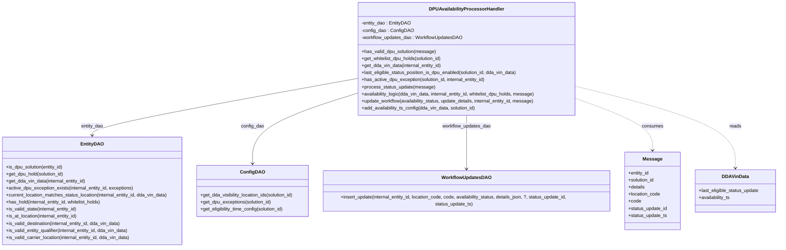

# Diagram: entity_core/entity_service/entity_service/dpu/dpu_service/service/dpu_availability_processor_handler.py


> Auto-generated by Obscura crawlers

## Diagram 1



### SVG

<svg id="container" width="2710.9609375" xmlns="http://www.w3.org/2000/svg" class="classDiagram" height="840" viewBox="0 0 2710.9609375 840" role="graphics-document document" aria-roledescription="class"><style>#container{font-family:"trebuchet ms",verdana,arial,sans-serif;font-size:16px;fill:#333;}@keyframes edge-animation-frame{from{stroke-dashoffset:0;}}@keyframes dash{to{stroke-dashoffset:0;}}#container .edge-animation-slow{stroke-dasharray:9,5!important;stroke-dashoffset:900;animation:dash 50s linear infinite;stroke-linecap:round;}#container .edge-animation-fast{stroke-dasharray:9,5!important;stroke-dashoffset:900;animation:dash 20s linear infinite;stroke-linecap:round;}#container .error-icon{fill:#552222;}#container .error-text{fill:#552222;stroke:#552222;}#container .edge-thickness-normal{stroke-width:1px;}#container .edge-thickness-thick{stroke-width:3.5px;}#container .edge-pattern-solid{stroke-dasharray:0;}#container .edge-thickness-invisible{stroke-width:0;fill:none;}#container .edge-pattern-dashed{stroke-dasharray:3;}#container .edge-pattern-dotted{stroke-dasharray:2;}#container .marker{fill:#333333;stroke:#333333;}#container .marker.cross{stroke:#333333;}#container svg{font-family:"trebuchet ms",verdana,arial,sans-serif;font-size:16px;}#container p{margin:0;}#container g.classGroup text{fill:#9370DB;stroke:none;font-family:"trebuchet ms",verdana,arial,sans-serif;font-size:10px;}#container g.classGroup text .title{font-weight:bolder;}#container .nodeLabel,#container .edgeLabel{color:#131300;}#container .edgeLabel .label rect{fill:#ECECFF;}#container .label text{fill:#131300;}#container .labelBkg{background:#ECECFF;}#container .edgeLabel .label span{background:#ECECFF;}#container .classTitle{font-weight:bolder;}#container .node rect,#container .node circle,#container .node ellipse,#container .node polygon,#container .node path{fill:#ECECFF;stroke:#9370DB;stroke-width:1px;}#container .divider{stroke:#9370DB;stroke-width:1;}#container g.clickable{cursor:pointer;}#container g.classGroup rect{fill:#ECECFF;stroke:#9370DB;}#container g.classGroup line{stroke:#9370DB;stroke-width:1;}#container .classLabel .box{stroke:none;stroke-width:0;fill:#ECECFF;opacity:0.5;}#container .classLabel .label{fill:#9370DB;font-size:10px;}#container .relation{stroke:#333333;stroke-width:1;fill:none;}#container .dashed-line{stroke-dasharray:3;}#container .dotted-line{stroke-dasharray:1 2;}#container #compositionStart,#container .composition{fill:#333333!important;stroke:#333333!important;stroke-width:1;}#container #compositionEnd,#container .composition{fill:#333333!important;stroke:#333333!important;stroke-width:1;}#container #dependencyStart,#container .dependency{fill:#333333!important;stroke:#333333!important;stroke-width:1;}#container #dependencyStart,#container .dependency{fill:#333333!important;stroke:#333333!important;stroke-width:1;}#container #extensionStart,#container .extension{fill:transparent!important;stroke:#333333!important;stroke-width:1;}#container #extensionEnd,#container .extension{fill:transparent!important;stroke:#333333!important;stroke-width:1;}#container #aggregationStart,#container .aggregation{fill:transparent!important;stroke:#333333!important;stroke-width:1;}#container #aggregationEnd,#container .aggregation{fill:transparent!important;stroke:#333333!important;stroke-width:1;}#container #lollipopStart,#container .lollipop{fill:#ECECFF!important;stroke:#333333!important;stroke-width:1;}#container #lollipopEnd,#container .lollipop{fill:#ECECFF!important;stroke:#333333!important;stroke-width:1;}#container .edgeTerminals{font-size:11px;line-height:initial;}#container .classTitleText{text-anchor:middle;font-size:18px;fill:#333;}#container .label-icon{display:inline-block;height:1em;overflow:visible;vertical-align:-0.125em;}#container .node .label-icon path{fill:currentColor;stroke:revert;stroke-width:revert;}#container :root{--mermaid-font-family:"trebuchet ms",verdana,arial,sans-serif;}</style><g><defs><marker id="container_class-aggregationStart" class="marker aggregation class" refX="18" refY="7" markerWidth="190" markerHeight="240" orient="auto"><path d="M 18,7 L9,13 L1,7 L9,1 Z"></path></marker></defs><defs><marker id="container_class-aggregationEnd" class="marker aggregation class" refX="1" refY="7" markerWidth="20" markerHeight="28" orient="auto"><path d="M 18,7 L9,13 L1,7 L9,1 Z"></path></marker></defs><defs><marker id="container_class-extensionStart" class="marker extension class" refX="18" refY="7" markerWidth="190" markerHeight="240" orient="auto"><path d="M 1,7 L18,13 V 1 Z"></path></marker></defs><defs><marker id="container_class-extensionEnd" class="marker extension class" refX="1" refY="7" markerWidth="20" markerHeight="28" orient="auto"><path d="M 1,1 V 13 L18,7 Z"></path></marker></defs><defs><marker id="container_class-compositionStart" class="marker composition class" refX="18" refY="7" markerWidth="190" markerHeight="240" orient="auto"><path d="M 18,7 L9,13 L1,7 L9,1 Z"></path></marker></defs><defs><marker id="container_class-compositionEnd" class="marker composition class" refX="1" refY="7" markerWidth="20" markerHeight="28" orient="auto"><path d="M 18,7 L9,13 L1,7 L9,1 Z"></path></marker></defs><defs><marker id="container_class-dependencyStart" class="marker dependency class" refX="6" refY="7" markerWidth="190" markerHeight="240" orient="auto"><path d="M 5,7 L9,13 L1,7 L9,1 Z"></path></marker></defs><defs><marker id="container_class-dependencyEnd" class="marker dependency class" refX="13" refY="7" markerWidth="20" markerHeight="28" orient="auto"><path d="M 18,7 L9,13 L14,7 L9,1 Z"></path></marker></defs><defs><marker id="container_class-lollipopStart" class="marker lollipop class" refX="13" refY="7" markerWidth="190" markerHeight="240" orient="auto"><circle stroke="black" fill="transparent" cx="7" cy="7" r="6"></circle></marker></defs><defs><marker id="container_class-lollipopEnd" class="marker lollipop class" refX="1" refY="7" markerWidth="190" markerHeight="240" orient="auto"><circle stroke="black" fill="transparent" cx="7" cy="7" r="6"></circle></marker></defs><g class="root"><g class="clusters"></g><g class="edgePaths"><path d="M1255.922,265.179L1099.822,292.482C943.721,319.786,631.521,374.393,475.421,406.863C319.32,439.333,319.32,449.667,319.32,454.833L319.32,460" id="id_DPUAvailabilityProcessorHandler_EntityDAO_1" class="edge-thickness-normal edge-pattern-solid relation" style=";;;" data-edge="true" data-et="edge" data-id="id_DPUAvailabilityProcessorHandler_EntityDAO_1" data-points="W3sieCI6MTI1NS45MjE4NzUsInkiOjI2NS4xNzg2OTk1MTAwOTM1fSx7IngiOjMxOS4zMjAzMTI1LCJ5Ijo0Mjl9LHsieCI6MzE5LjMyMDMxMjUsInkiOjQ2Nn1d" marker-end="url(#container_class-dependencyEnd)"></path><path d="M1255.922,313.106L1192.285,332.422C1128.647,351.738,1001.372,390.369,937.735,430.851C874.098,471.333,874.098,513.667,874.098,534.833L874.098,556" id="id_DPUAvailabilityProcessorHandler_ConfigDAO_2" class="edge-thickness-normal edge-pattern-solid relation" style=";;;" data-edge="true" data-et="edge" data-id="id_DPUAvailabilityProcessorHandler_ConfigDAO_2" data-points="W3sieCI6MTI1NS45MjE4NzUsInkiOjMxMy4xMDYyNjg0MTI1MjM0fSx7IngiOjg3NC4wOTc2NTYyNSwieSI6NDI5fSx7IngiOjg3NC4wOTc2NTYyNSwieSI6NTYyfV0=" marker-end="url(#container_class-dependencyEnd)"></path><path d="M1628.563,392L1628.563,398.167C1628.563,404.333,1628.563,416.667,1628.563,448C1628.563,479.333,1628.563,529.667,1628.563,554.833L1628.563,580" id="id_DPUAvailabilityProcessorHandler_WorkflowUpdatesDAO_3" class="edge-thickness-normal edge-pattern-solid relation" style=";;;" data-edge="true" data-et="edge" data-id="id_DPUAvailabilityProcessorHandler_WorkflowUpdatesDAO_3" data-points="W3sieCI6MTYyOC41NjI1LCJ5IjozOTJ9LHsieCI6MTYyOC41NjI1LCJ5Ijo0Mjl9LHsieCI6MTYyOC41NjI1LCJ5Ijo1ODZ9XQ==" marker-end="url(#container_class-dependencyEnd)"></path><path d="M2001.203,330.206L2048.327,346.672C2095.451,363.137,2189.698,396.069,2236.822,426.201C2283.945,456.333,2283.945,483.667,2283.945,497.333L2283.945,511" id="id_DPUAvailabilityProcessorHandler_Message_4" class="edge-thickness-normal edge-pattern-dashed relation" style=";;;" data-edge="true" data-et="edge" data-id="id_DPUAvailabilityProcessorHandler_Message_4" data-points="W3sieCI6MjAwMS4yMDMxMjUsInkiOjMzMC4yMDU4OTExMTgwMjV9LHsieCI6MjI4My45NDUzMTI1LCJ5Ijo0Mjl9LHsieCI6MjI4My45NDUzMTI1LCJ5Ijo1MTd9XQ==" marker-end="url(#container_class-dependencyEnd)"></path><path d="M2001.203,291.065L2095.276,314.054C2189.349,337.043,2377.495,383.022,2471.568,429.677C2565.641,476.333,2565.641,523.667,2565.641,547.333L2565.641,571" id="id_DPUAvailabilityProcessorHandler_DDAVinData_5" class="edge-thickness-normal edge-pattern-dashed relation" style=";;;" data-edge="true" data-et="edge" data-id="id_DPUAvailabilityProcessorHandler_DDAVinData_5" data-points="W3sieCI6MjAwMS4yMDMxMjUsInkiOjI5MS4wNjQ2NjI0MzE0Mjc0NX0seyJ4IjoyNTY1LjY0MDYyNSwieSI6NDI5fSx7IngiOjI1NjUuNjQwNjI1LCJ5Ijo1Nzd9XQ==" marker-end="url(#container_class-dependencyEnd)"></path></g><g class="edgeLabels"><g class="edgeLabel" transform="translate(319.3203125, 429)"><g class="label" data-id="id_DPUAvailabilityProcessorHandler_EntityDAO_1" transform="translate(-38.546875, -12)"><foreignObject width="77.09375" height="24"><div xmlns="http://www.w3.org/1999/xhtml" class="labelBkg" style="display: table-cell; white-space: nowrap; line-height: 1.5; max-width: 200px; text-align: center;"><span class="edgeLabel"><p>entity_dao</p></span></div></foreignObject></g></g><g class="edgeLabel" transform="translate(874.09765625, 429)"><g class="label" data-id="id_DPUAvailabilityProcessorHandler_ConfigDAO_2" transform="translate(-39.625, -12)"><foreignObject width="79.25" height="24"><div xmlns="http://www.w3.org/1999/xhtml" class="labelBkg" style="display: table-cell; white-space: nowrap; line-height: 1.5; max-width: 200px; text-align: center;"><span class="edgeLabel"><p>config_dao</p></span></div></foreignObject></g></g><g class="edgeLabel" transform="translate(1628.5625, 429)"><g class="label" data-id="id_DPUAvailabilityProcessorHandler_WorkflowUpdatesDAO_3" transform="translate(-83.59375, -12)"><foreignObject width="167.1875" height="24"><div xmlns="http://www.w3.org/1999/xhtml" class="labelBkg" style="display: table-cell; white-space: nowrap; line-height: 1.5; max-width: 200px; text-align: center;"><span class="edgeLabel"><p>workflow_updates_dao</p></span></div></foreignObject></g></g><g class="edgeLabel" transform="translate(2283.9453125, 429)"><g class="label" data-id="id_DPUAvailabilityProcessorHandler_Message_4" transform="translate(-36.375, -12)"><foreignObject width="72.75" height="24"><div xmlns="http://www.w3.org/1999/xhtml" class="labelBkg" style="display: table-cell; white-space: nowrap; line-height: 1.5; max-width: 200px; text-align: center;"><span class="edgeLabel"><p>consumes</p></span></div></foreignObject></g></g><g class="edgeLabel" transform="translate(2565.640625, 429)"><g class="label" data-id="id_DPUAvailabilityProcessorHandler_DDAVinData_5" transform="translate(-20.0078125, -12)"><foreignObject width="40.015625" height="24"><div xmlns="http://www.w3.org/1999/xhtml" class="labelBkg" style="display: table-cell; white-space: nowrap; line-height: 1.5; max-width: 200px; text-align: center;"><span class="edgeLabel"><p>reads</p></span></div></foreignObject></g></g></g><g class="nodes"><g class="node default" id="classId-DPUAvailabilityProcessorHandler-0" transform="translate(1628.5625, 200)"><g class="basic label-container"><path d="M-372.640625 -192 L372.640625 -192 L372.640625 192 L-372.640625 192" stroke="none" stroke-width="0" fill="#ECECFF" style=""></path><path d="M-372.640625 -192 C-178.64431538965684 -192, 15.351994220686322 -192, 372.640625 -192 M-372.640625 -192 C-104.79629605329484 -192, 163.04803289341032 -192, 372.640625 -192 M372.640625 -192 C372.640625 -101.61597907998475, 372.640625 -11.231958159969508, 372.640625 192 M372.640625 -192 C372.640625 -89.05367883662197, 372.640625 13.89264232675606, 372.640625 192 M372.640625 192 C136.01520650963985 192, -100.6102119807203 192, -372.640625 192 M372.640625 192 C180.26516499078366 192, -12.11029501843268 192, -372.640625 192 M-372.640625 192 C-372.640625 73.24977646331598, -372.640625 -45.500447073368036, -372.640625 -192 M-372.640625 192 C-372.640625 110.98287000577311, -372.640625 29.965740011546217, -372.640625 -192" stroke="#9370DB" stroke-width="1.3" fill="none" stroke-dasharray="0 0" style=""></path></g><g class="annotation-group text" transform="translate(0, -168)"></g><g class="label-group text" transform="translate(-121.015625, -168)"><g class="label" style="font-weight: bolder" transform="translate(0,-12)"><foreignObject width="242.03125" height="24"><div xmlns="http://www.w3.org/1999/xhtml" style="display: table-cell; white-space: nowrap; line-height: 1.5; max-width: 289px; text-align: center;"><span class="nodeLabel markdown-node-label" style=""><p>DPUAvailabilityProcessorHandler</p></span></div></foreignObject></g></g><g class="members-group text" transform="translate(-360.640625, -120)"><g class="label" style="" transform="translate(0,-12)"><foreignObject width="167.71875" height="24"><div xmlns="http://www.w3.org/1999/xhtml" style="display: table-cell; white-space: nowrap; line-height: 1.5; max-width: 225px; text-align: center;"><span class="nodeLabel markdown-node-label" style=""><p>-entity_dao : EntityDAO</p></span></div></foreignObject></g><g class="label" style="" transform="translate(0,12)"><foreignObject width="173.125" height="24"><div xmlns="http://www.w3.org/1999/xhtml" style="display: table-cell; white-space: nowrap; line-height: 1.5; max-width: 230px; text-align: center;"><span class="nodeLabel markdown-node-label" style=""><p>-config_dao : ConfigDAO</p></span></div></foreignObject></g><g class="label" style="" transform="translate(0,36)"><foreignObject width="343.25" height="24"><div xmlns="http://www.w3.org/1999/xhtml" style="display: table-cell; white-space: nowrap; line-height: 1.5; max-width: 401px; text-align: center;"><span class="nodeLabel markdown-node-label" style=""><p>-workflow_updates_dao : WorkflowUpdatesDAO</p></span></div></foreignObject></g></g><g class="methods-group text" transform="translate(-360.640625, -24)"><g class="label" style="" transform="translate(0,-12)"><foreignObject width="253.109375" height="24"><div xmlns="http://www.w3.org/1999/xhtml" style="display: table-cell; white-space: nowrap; line-height: 1.5; max-width: 310px; text-align: center;"><span class="nodeLabel markdown-node-label" style=""><p>+has_valid_dpu_solution(message)</p></span></div></foreignObject></g><g class="label" style="" transform="translate(0,12)"><foreignObject width="278.28125" height="24"><div xmlns="http://www.w3.org/1999/xhtml" style="display: table-cell; white-space: nowrap; line-height: 1.5; max-width: 336px; text-align: center;"><span class="nodeLabel markdown-node-label" style=""><p>+get_whitelist_dpu_holds(solution_id)</p></span></div></foreignObject></g><g class="label" style="" transform="translate(0,36)"><foreignObject width="275.796875" height="24"><div xmlns="http://www.w3.org/1999/xhtml" style="display: table-cell; white-space: nowrap; line-height: 1.5; max-width: 333px; text-align: center;"><span class="nodeLabel markdown-node-label" style=""><p>+get_dda_vin_data(internal_entity_id)</p></span></div></foreignObject></g><g class="label" style="" transform="translate(0,60)"><foreignObject width="538.53125" height="24"><div xmlns="http://www.w3.org/1999/xhtml" style="display: table-cell; white-space: nowrap; line-height: 1.5; max-width: 596px; text-align: center;"><span class="nodeLabel markdown-node-label" style=""><p>+last_eligible_status_position_is_dpu_enabled(solution_id, dda_vin_data)</p></span></div></foreignObject></g><g class="label" style="" transform="translate(0,84)"><foreignObject width="428.515625" height="24"><div xmlns="http://www.w3.org/1999/xhtml" style="display: table-cell; white-space: nowrap; line-height: 1.5; max-width: 486px; text-align: center;"><span class="nodeLabel markdown-node-label" style=""><p>+has_active_dpu_exception(solution_id, internal_entity_id)</p></span></div></foreignObject></g><g class="label" style="" transform="translate(0,108)"><foreignObject width="247.546875" height="24"><div xmlns="http://www.w3.org/1999/xhtml" style="display: table-cell; white-space: nowrap; line-height: 1.5; max-width: 305px; text-align: center;"><span class="nodeLabel markdown-node-label" style=""><p>+process_status_update(message)</p></span></div></foreignObject></g><g class="label" style="" transform="translate(0,132)"><foreignObject width="600.265625" height="24"><div xmlns="http://www.w3.org/1999/xhtml" style="display: table-cell; white-space: nowrap; line-height: 1.5; max-width: 658px; text-align: center;"><span class="nodeLabel markdown-node-label" style=""><p>+availability_logic(dda_vin_data, internal_entity_id, whitelist_dpu_holds, message)</p></span></div></foreignObject></g><g class="label" style="" transform="translate(0,156)"><foreignObject width="598.1875" height="24"><div xmlns="http://www.w3.org/1999/xhtml" style="display: table-cell; white-space: nowrap; line-height: 1.5; max-width: 656px; text-align: center;"><span class="nodeLabel markdown-node-label" style=""><p>+update_workflow(availability_status, update_details, internal_entity_id, message)</p></span></div></foreignObject></g><g class="label" style="" transform="translate(0,180)"><foreignObject width="393.75" height="24"><div xmlns="http://www.w3.org/1999/xhtml" style="display: table-cell; white-space: nowrap; line-height: 1.5; max-width: 451px; text-align: center;"><span class="nodeLabel markdown-node-label" style=""><p>+add_availability_ts_config(dda_vin_data, solution_id)</p></span></div></foreignObject></g></g><g class="divider" style=""><path d="M-372.640625 -144 C-89.45731198856464 -144, 193.72600102287072 -144, 372.640625 -144 M-372.640625 -144 C-193.13178866310238 -144, -13.622952326204768 -144, 372.640625 -144" stroke="#9370DB" stroke-width="1.3" fill="none" stroke-dasharray="0 0" style=""></path></g><g class="divider" style=""><path d="M-372.640625 -48 C-155.87247781062305 -48, 60.895669378753894 -48, 372.640625 -48 M-372.640625 -48 C-222.03348044298122 -48, -71.42633588596243 -48, 372.640625 -48" stroke="#9370DB" stroke-width="1.3" fill="none" stroke-dasharray="0 0" style=""></path></g></g><g class="node default" id="classId-EntityDAO-1" transform="translate(319.3203125, 649)"><g class="basic label-container"><path d="M-311.3203125 -183 L311.3203125 -183 L311.3203125 183 L-311.3203125 183" stroke="none" stroke-width="0" fill="#ECECFF" style=""></path><path d="M-311.3203125 -183 C-156.7504409273006 -183, -2.1805693546011753 -183, 311.3203125 -183 M-311.3203125 -183 C-140.73430061834375 -183, 29.851711263312495 -183, 311.3203125 -183 M311.3203125 -183 C311.3203125 -91.37514736604874, 311.3203125 0.24970526790252734, 311.3203125 183 M311.3203125 -183 C311.3203125 -65.95964495744803, 311.3203125 51.08071008510393, 311.3203125 183 M311.3203125 183 C125.58708950949998 183, -60.14613348100005 183, -311.3203125 183 M311.3203125 183 C139.19996176427262 183, -32.92038897145477 183, -311.3203125 183 M-311.3203125 183 C-311.3203125 86.9318863709183, -311.3203125 -9.136227258163387, -311.3203125 -183 M-311.3203125 183 C-311.3203125 50.38512878582159, -311.3203125 -82.22974242835681, -311.3203125 -183" stroke="#9370DB" stroke-width="1.3" fill="none" stroke-dasharray="0 0" style=""></path></g><g class="annotation-group text" transform="translate(0, -159)"></g><g class="label-group text" transform="translate(-36.578125, -159)"><g class="label" style="font-weight: bolder" transform="translate(0,-12)"><foreignObject width="73.15625" height="24"><div xmlns="http://www.w3.org/1999/xhtml" style="display: table-cell; white-space: nowrap; line-height: 1.5; max-width: 122px; text-align: center;"><span class="nodeLabel markdown-node-label" style=""><p>EntityDAO</p></span></div></foreignObject></g></g><g class="members-group text" transform="translate(-299.3203125, -111)"></g><g class="methods-group text" transform="translate(-299.3203125, -81)"><g class="label" style="" transform="translate(0,-12)"><foreignObject width="198.421875" height="24"><div xmlns="http://www.w3.org/1999/xhtml" style="display: table-cell; white-space: nowrap; line-height: 1.5; max-width: 256px; text-align: center;"><span class="nodeLabel markdown-node-label" style=""><p>+is_dpu_solution(entity_id)</p></span></div></foreignObject></g><g class="label" style="" transform="translate(0,12)"><foreignObject width="200.75" height="24"><div xmlns="http://www.w3.org/1999/xhtml" style="display: table-cell; white-space: nowrap; line-height: 1.5; max-width: 258px; text-align: center;"><span class="nodeLabel markdown-node-label" style=""><p>+get_dpu_hold(solution_id)</p></span></div></foreignObject></g><g class="label" style="" transform="translate(0,36)"><foreignObject width="275.796875" height="24"><div xmlns="http://www.w3.org/1999/xhtml" style="display: table-cell; white-space: nowrap; line-height: 1.5; max-width: 333px; text-align: center;"><span class="nodeLabel markdown-node-label" style=""><p>+get_dda_vin_data(internal_entity_id)</p></span></div></foreignObject></g><g class="label" style="" transform="translate(0,60)"><foreignObject width="440.78125" height="24"><div xmlns="http://www.w3.org/1999/xhtml" style="display: table-cell; white-space: nowrap; line-height: 1.5; max-width: 498px; text-align: center;"><span class="nodeLabel markdown-node-label" style=""><p>+active_dpu_exception_exists(internal_entity_id, exceptions)</p></span></div></foreignObject></g><g class="label" style="" transform="translate(0,84)"><foreignObject width="562.0625" height="24"><div xmlns="http://www.w3.org/1999/xhtml" style="display: table-cell; white-space: nowrap; line-height: 1.5; max-width: 619px; text-align: center;"><span class="nodeLabel markdown-node-label" style=""><p>+current_location_matches_status_location(internal_entity_id, dda_vin_data)</p></span></div></foreignObject></g><g class="label" style="" transform="translate(0,108)"><foreignObject width="332.28125" height="24"><div xmlns="http://www.w3.org/1999/xhtml" style="display: table-cell; white-space: nowrap; line-height: 1.5; max-width: 390px; text-align: center;"><span class="nodeLabel markdown-node-label" style=""><p>+has_hold(internal_entity_id, whitelist_holds)</p></span></div></foreignObject></g><g class="label" style="" transform="translate(0,132)"><foreignObject width="246.015625" height="24"><div xmlns="http://www.w3.org/1999/xhtml" style="display: table-cell; white-space: nowrap; line-height: 1.5; max-width: 303px; text-align: center;"><span class="nodeLabel markdown-node-label" style=""><p>+is_valid_state(internal_entity_id)</p></span></div></foreignObject></g><g class="label" style="" transform="translate(0,156)"><foreignObject width="248.609375" height="24"><div xmlns="http://www.w3.org/1999/xhtml" style="display: table-cell; white-space: nowrap; line-height: 1.5; max-width: 306px; text-align: center;"><span class="nodeLabel markdown-node-label" style=""><p>+is_at_location(internal_entity_id)</p></span></div></foreignObject></g><g class="label" style="" transform="translate(0,180)"><foreignObject width="398.890625" height="24"><div xmlns="http://www.w3.org/1999/xhtml" style="display: table-cell; white-space: nowrap; line-height: 1.5; max-width: 456px; text-align: center;"><span class="nodeLabel markdown-node-label" style=""><p>+is_valid_destination(internal_entity_id, dda_vin_data)</p></span></div></foreignObject></g><g class="label" style="" transform="translate(0,204)"><foreignObject width="425.9375" height="24"><div xmlns="http://www.w3.org/1999/xhtml" style="display: table-cell; white-space: nowrap; line-height: 1.5; max-width: 483px; text-align: center;"><span class="nodeLabel markdown-node-label" style=""><p>+is_valid_entity_qualifier(internal_entity_id, dda_vin_data)</p></span></div></foreignObject></g><g class="label" style="" transform="translate(0,228)"><foreignObject width="429.734375" height="24"><div xmlns="http://www.w3.org/1999/xhtml" style="display: table-cell; white-space: nowrap; line-height: 1.5; max-width: 487px; text-align: center;"><span class="nodeLabel markdown-node-label" style=""><p>+is_valid_carrier_location(internal_entity_id, dda_vin_data)</p></span></div></foreignObject></g></g><g class="divider" style=""><path d="M-311.3203125 -135 C-168.86453055962212 -135, -26.40874861924425 -135, 311.3203125 -135 M-311.3203125 -135 C-142.96040595015197 -135, 25.39950059969607 -135, 311.3203125 -135" stroke="#9370DB" stroke-width="1.3" fill="none" stroke-dasharray="0 0" style=""></path></g><g class="divider" style=""><path d="M-311.3203125 -111 C-124.00448217114561 -111, 63.31134815770878 -111, 311.3203125 -111 M-311.3203125 -111 C-130.33294670372157 -111, 50.65441909255685 -111, 311.3203125 -111" stroke="#9370DB" stroke-width="1.3" fill="none" stroke-dasharray="0 0" style=""></path></g></g><g class="node default" id="classId-ConfigDAO-2" transform="translate(874.09765625, 649)"><g class="basic label-container"><path d="M-193.45703125 -87 L193.45703125 -87 L193.45703125 87 L-193.45703125 87" stroke="none" stroke-width="0" fill="#ECECFF" style=""></path><path d="M-193.45703125 -87 C-60.88575246556266 -87, 71.68552631887468 -87, 193.45703125 -87 M-193.45703125 -87 C-55.439646905004906 -87, 82.57773743999019 -87, 193.45703125 -87 M193.45703125 -87 C193.45703125 -22.057663020372956, 193.45703125 42.88467395925409, 193.45703125 87 M193.45703125 -87 C193.45703125 -25.400574947963335, 193.45703125 36.19885010407333, 193.45703125 87 M193.45703125 87 C112.61681046776306 87, 31.77658968552612 87, -193.45703125 87 M193.45703125 87 C41.66005240877675 87, -110.1369264324465 87, -193.45703125 87 M-193.45703125 87 C-193.45703125 22.351132438367287, -193.45703125 -42.297735123265426, -193.45703125 -87 M-193.45703125 87 C-193.45703125 35.32686711869455, -193.45703125 -16.346265762610898, -193.45703125 -87" stroke="#9370DB" stroke-width="1.3" fill="none" stroke-dasharray="0 0" style=""></path></g><g class="annotation-group text" transform="translate(0, -63)"></g><g class="label-group text" transform="translate(-38.2265625, -63)"><g class="label" style="font-weight: bolder" transform="translate(0,-12)"><foreignObject width="76.453125" height="24"><div xmlns="http://www.w3.org/1999/xhtml" style="display: table-cell; white-space: nowrap; line-height: 1.5; max-width: 125px; text-align: center;"><span class="nodeLabel markdown-node-label" style=""><p>ConfigDAO</p></span></div></foreignObject></g></g><g class="members-group text" transform="translate(-181.45703125, -15)"></g><g class="methods-group text" transform="translate(-181.45703125, 15)"><g class="label" style="" transform="translate(0,-12)"><foreignObject width="324.6875" height="24"><div xmlns="http://www.w3.org/1999/xhtml" style="display: table-cell; white-space: nowrap; line-height: 1.5; max-width: 382px; text-align: center;"><span class="nodeLabel markdown-node-label" style=""><p>+get_dda_visibility_location_ids(solution_id)</p></span></div></foreignObject></g><g class="label" style="" transform="translate(0,12)"><foreignObject width="245.75" height="24"><div xmlns="http://www.w3.org/1999/xhtml" style="display: table-cell; white-space: nowrap; line-height: 1.5; max-width: 303px; text-align: center;"><span class="nodeLabel markdown-node-label" style=""><p>+get_dpu_exceptions(solution_id)</p></span></div></foreignObject></g><g class="label" style="" transform="translate(0,36)"><foreignObject width="290.171875" height="24"><div xmlns="http://www.w3.org/1999/xhtml" style="display: table-cell; white-space: nowrap; line-height: 1.5; max-width: 348px; text-align: center;"><span class="nodeLabel markdown-node-label" style=""><p>+get_eligibility_time_config(solution_id)</p></span></div></foreignObject></g></g><g class="divider" style=""><path d="M-193.45703125 -39 C-67.73282001359226 -39, 57.99139122281548 -39, 193.45703125 -39 M-193.45703125 -39 C-72.72977410792654 -39, 47.99748303414691 -39, 193.45703125 -39" stroke="#9370DB" stroke-width="1.3" fill="none" stroke-dasharray="0 0" style=""></path></g><g class="divider" style=""><path d="M-193.45703125 -15 C-65.51490342491006 -15, 62.42722440017988 -15, 193.45703125 -15 M-193.45703125 -15 C-107.46288061966958 -15, -21.468729989339153 -15, 193.45703125 -15" stroke="#9370DB" stroke-width="1.3" fill="none" stroke-dasharray="0 0" style=""></path></g></g><g class="node default" id="classId-WorkflowUpdatesDAO-3" transform="translate(1628.5625, 649)"><g class="basic label-container"><path d="M-511.0078125 -63 L511.0078125 -63 L511.0078125 63 L-511.0078125 63" stroke="none" stroke-width="0" fill="#ECECFF" style=""></path><path d="M-511.0078125 -63 C-195.89648945490478 -63, 119.21483359019044 -63, 511.0078125 -63 M-511.0078125 -63 C-179.59158978682018 -63, 151.82463292635964 -63, 511.0078125 -63 M511.0078125 -63 C511.0078125 -30.567467801006778, 511.0078125 1.865064397986444, 511.0078125 63 M511.0078125 -63 C511.0078125 -13.575186204733882, 511.0078125 35.849627590532236, 511.0078125 63 M511.0078125 63 C243.71800733945668 63, -23.571797821086648 63, -511.0078125 63 M511.0078125 63 C170.88195116852148 63, -169.24391016295704 63, -511.0078125 63 M-511.0078125 63 C-511.0078125 20.231571274128896, -511.0078125 -22.536857451742208, -511.0078125 -63 M-511.0078125 63 C-511.0078125 22.1997144055768, -511.0078125 -18.600571188846402, -511.0078125 -63" stroke="#9370DB" stroke-width="1.3" fill="none" stroke-dasharray="0 0" style=""></path></g><g class="annotation-group text" transform="translate(0, -39)"></g><g class="label-group text" transform="translate(-80.359375, -39)"><g class="label" style="font-weight: bolder" transform="translate(0,-12)"><foreignObject width="160.71875" height="24"><div xmlns="http://www.w3.org/1999/xhtml" style="display: table-cell; white-space: nowrap; line-height: 1.5; max-width: 207px; text-align: center;"><span class="nodeLabel markdown-node-label" style=""><p>WorkflowUpdatesDAO</p></span></div></foreignObject></g></g><g class="members-group text" transform="translate(-499.0078125, 9)"></g><g class="methods-group text" transform="translate(-499.0078125, 39)"><g class="label" style="" transform="translate(0,-12)"><foreignObject width="917.65625" height="24"><div xmlns="http://www.w3.org/1999/xhtml" style="display: table-cell; white-space: nowrap; line-height: 1.5; max-width: 975px; text-align: center;"><span class="nodeLabel markdown-node-label" style=""><p>+insert_update(internal_entity_id, location_code, code, availability_status, details_json, ?, status_update_id, status_update_ts)</p></span></div></foreignObject></g></g><g class="divider" style=""><path d="M-511.0078125 -15 C-185.90096186932942 -15, 139.20588876134116 -15, 511.0078125 -15 M-511.0078125 -15 C-227.02694374130215 -15, 56.953925017395704 -15, 511.0078125 -15" stroke="#9370DB" stroke-width="1.3" fill="none" stroke-dasharray="0 0" style=""></path></g><g class="divider" style=""><path d="M-511.0078125 9 C-147.51968181246167 9, 215.96844887507666 9, 511.0078125 9 M-511.0078125 9 C-239.29923329489708 9, 32.40934591020584 9, 511.0078125 9" stroke="#9370DB" stroke-width="1.3" fill="none" stroke-dasharray="0 0" style=""></path></g></g><g class="node default" id="classId-Message-4" transform="translate(2283.9453125, 649)"><g class="basic label-container"><path d="M-94.375 -132 L94.375 -132 L94.375 132 L-94.375 132" stroke="none" stroke-width="0" fill="#ECECFF" style=""></path><path d="M-94.375 -132 C-31.041344805278634 -132, 32.29231038944273 -132, 94.375 -132 M-94.375 -132 C-34.036508994327896 -132, 26.301982011344208 -132, 94.375 -132 M94.375 -132 C94.375 -79.08039774949225, 94.375 -26.160795498984484, 94.375 132 M94.375 -132 C94.375 -33.92267545207356, 94.375 64.15464909585288, 94.375 132 M94.375 132 C38.75521449155894 132, -16.864571016882124 132, -94.375 132 M94.375 132 C24.43387438094635 132, -45.5072512381073 132, -94.375 132 M-94.375 132 C-94.375 27.86747492591654, -94.375 -76.26505014816692, -94.375 -132 M-94.375 132 C-94.375 32.582644856965246, -94.375 -66.83471028606951, -94.375 -132" stroke="#9370DB" stroke-width="1.3" fill="none" stroke-dasharray="0 0" style=""></path></g><g class="annotation-group text" transform="translate(0, -108)"></g><g class="label-group text" transform="translate(-31.25, -108)"><g class="label" style="font-weight: bolder" transform="translate(0,-12)"><foreignObject width="62.5" height="24"><div xmlns="http://www.w3.org/1999/xhtml" style="display: table-cell; white-space: nowrap; line-height: 1.5; max-width: 111px; text-align: center;"><span class="nodeLabel markdown-node-label" style=""><p>Message</p></span></div></foreignObject></g></g><g class="members-group text" transform="translate(-82.375, -60)"><g class="label" style="" transform="translate(0,-12)"><foreignObject width="71.859375" height="24"><div xmlns="http://www.w3.org/1999/xhtml" style="display: table-cell; white-space: nowrap; line-height: 1.5; max-width: 129px; text-align: center;"><span class="nodeLabel markdown-node-label" style=""><p>+entity_id</p></span></div></foreignObject></g><g class="label" style="" transform="translate(0,12)"><foreignObject width="90.21875" height="24"><div xmlns="http://www.w3.org/1999/xhtml" style="display: table-cell; white-space: nowrap; line-height: 1.5; max-width: 148px; text-align: center;"><span class="nodeLabel markdown-node-label" style=""><p>+solution_id</p></span></div></foreignObject></g><g class="label" style="" transform="translate(0,36)"><foreignObject width="57.3125" height="24"><div xmlns="http://www.w3.org/1999/xhtml" style="display: table-cell; white-space: nowrap; line-height: 1.5; max-width: 115px; text-align: center;"><span class="nodeLabel markdown-node-label" style=""><p>+details</p></span></div></foreignObject></g><g class="label" style="" transform="translate(0,60)"><foreignObject width="110.109375" height="24"><div xmlns="http://www.w3.org/1999/xhtml" style="display: table-cell; white-space: nowrap; line-height: 1.5; max-width: 167px; text-align: center;"><span class="nodeLabel markdown-node-label" style=""><p>+location_code</p></span></div></foreignObject></g><g class="label" style="" transform="translate(0,84)"><foreignObject width="42.953125" height="24"><div xmlns="http://www.w3.org/1999/xhtml" style="display: table-cell; white-space: nowrap; line-height: 1.5; max-width: 100px; text-align: center;"><span class="nodeLabel markdown-node-label" style=""><p>+code</p></span></div></foreignObject></g><g class="label" style="" transform="translate(0,108)"><foreignObject width="133.5" height="24"><div xmlns="http://www.w3.org/1999/xhtml" style="display: table-cell; white-space: nowrap; line-height: 1.5; max-width: 191px; text-align: center;"><span class="nodeLabel markdown-node-label" style=""><p>+status_update_id</p></span></div></foreignObject></g><g class="label" style="" transform="translate(0,132)"><foreignObject width="132.34375" height="24"><div xmlns="http://www.w3.org/1999/xhtml" style="display: table-cell; white-space: nowrap; line-height: 1.5; max-width: 190px; text-align: center;"><span class="nodeLabel markdown-node-label" style=""><p>+status_update_ts</p></span></div></foreignObject></g></g><g class="methods-group text" transform="translate(-82.375, 132)"></g><g class="divider" style=""><path d="M-94.375 -84 C-36.51895357237369 -84, 21.33709285525262 -84, 94.375 -84 M-94.375 -84 C-56.02069038280331 -84, -17.66638076560662 -84, 94.375 -84" stroke="#9370DB" stroke-width="1.3" fill="none" stroke-dasharray="0 0" style=""></path></g><g class="divider" style=""><path d="M-94.375 108 C-21.51132759602919 108, 51.35234480794162 108, 94.375 108 M-94.375 108 C-39.18360501324388 108, 16.007789973512246 108, 94.375 108" stroke="#9370DB" stroke-width="1.3" fill="none" stroke-dasharray="0 0" style=""></path></g></g><g class="node default" id="classId-DDAVinData-5" transform="translate(2565.640625, 649)"><g class="basic label-container"><path d="M-137.3203125 -72 L137.3203125 -72 L137.3203125 72 L-137.3203125 72" stroke="none" stroke-width="0" fill="#ECECFF" style=""></path><path d="M-137.3203125 -72 C-34.37444669886786 -72, 68.57141910226429 -72, 137.3203125 -72 M-137.3203125 -72 C-79.42390933186113 -72, -21.527506163722265 -72, 137.3203125 -72 M137.3203125 -72 C137.3203125 -22.553432479346874, 137.3203125 26.89313504130625, 137.3203125 72 M137.3203125 -72 C137.3203125 -17.831859315846366, 137.3203125 36.33628136830727, 137.3203125 72 M137.3203125 72 C69.80031201765495 72, 2.2803115353098917 72, -137.3203125 72 M137.3203125 72 C57.19000380199385 72, -22.940304896012293 72, -137.3203125 72 M-137.3203125 72 C-137.3203125 27.84650111004742, -137.3203125 -16.30699777990516, -137.3203125 -72 M-137.3203125 72 C-137.3203125 20.371138345714144, -137.3203125 -31.257723308571713, -137.3203125 -72" stroke="#9370DB" stroke-width="1.3" fill="none" stroke-dasharray="0 0" style=""></path></g><g class="annotation-group text" transform="translate(0, -48)"></g><g class="label-group text" transform="translate(-43.234375, -48)"><g class="label" style="font-weight: bolder" transform="translate(0,-12)"><foreignObject width="86.46875" height="24"><div xmlns="http://www.w3.org/1999/xhtml" style="display: table-cell; white-space: nowrap; line-height: 1.5; max-width: 135px; text-align: center;"><span class="nodeLabel markdown-node-label" style=""><p>DDAVinData</p></span></div></foreignObject></g></g><g class="members-group text" transform="translate(-125.3203125, 0)"><g class="label" style="" transform="translate(0,-12)"><foreignObject width="207.40625" height="24"><div xmlns="http://www.w3.org/1999/xhtml" style="display: table-cell; white-space: nowrap; line-height: 1.5; max-width: 265px; text-align: center;"><span class="nodeLabel markdown-node-label" style=""><p>+last_eligible_status_update</p></span></div></foreignObject></g><g class="label" style="" transform="translate(0,12)"><foreignObject width="107.90625" height="24"><div xmlns="http://www.w3.org/1999/xhtml" style="display: table-cell; white-space: nowrap; line-height: 1.5; max-width: 165px; text-align: center;"><span class="nodeLabel markdown-node-label" style=""><p>+availability_ts</p></span></div></foreignObject></g></g><g class="methods-group text" transform="translate(-125.3203125, 72)"></g><g class="divider" style=""><path d="M-137.3203125 -24 C-74.59211821993003 -24, -11.863923939860058 -24, 137.3203125 -24 M-137.3203125 -24 C-38.343500560534835 -24, 60.63331137893033 -24, 137.3203125 -24" stroke="#9370DB" stroke-width="1.3" fill="none" stroke-dasharray="0 0" style=""></path></g><g class="divider" style=""><path d="M-137.3203125 48 C-39.716550829487886 48, 57.88721084102423 48, 137.3203125 48 M-137.3203125 48 C-70.35277364501746 48, -3.3852347900349287 48, 137.3203125 48" stroke="#9370DB" stroke-width="1.3" fill="none" stroke-dasharray="0 0" style=""></path></g></g></g></g></g></svg>

## Diagram 2

```mermaid
flowchart TD
A[Start: process_status_update(message)] --> B{message.entity_id present?}
B -- No --> C[Log error: "Entity ID is required" and return]
B -- Yes --> D[internal_entity_id = has_valid_dpu_solution(message)]
D --> E[whitelist_dpu_holds = get_whitelist_dpu_holds(message.solution_id)]
E --> F[dda_vin_data = get_dda_vin_data(internal_entity_id)]
F --> G[Compute update_details via availability_logic(...)]
G --> H{all checks in update_details True?}
H -- Yes --> I[Set availability_status = "Available"\nupdate_details.availability_ts = add_availability_ts_config(dda_vin_data, message.solution_id)]
H -- No --> J{message.details.trigger == "Override"?}
J -- Yes --> K[Set availability_status = "Available"\nupdate_details.availability_ts = now (ISO minutes)]
J -- No --> L[Set availability_status = "Not Available"\nupdate_details.availability_ts = null]
I --> M[update_workflow(availability_status, update_details, internal_entity_id, message)]
K --> M
L --> M
M --> Z[End]
```

> SVG rendering failed for this diagram.
