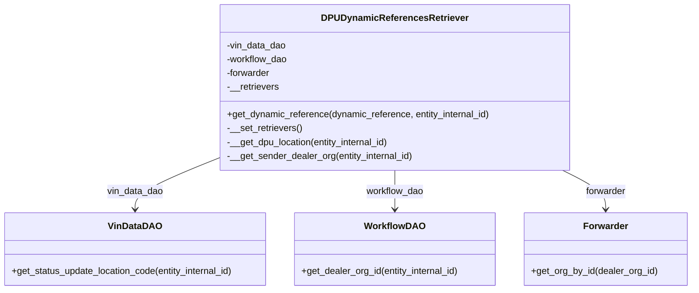

# Diagram: entity_core/entity_service/entity_service/dpu/dpu_service/service/dpu_dynamic_references_retriever.py


> Auto-generated by Obscura crawlers

## Diagram 1



### SVG

<svg id="container" width="1206.5625" xmlns="http://www.w3.org/2000/svg" class="classDiagram" height="504" viewBox="0 0 1206.5625 504" role="graphics-document document" aria-roledescription="class"><style>#container{font-family:"trebuchet ms",verdana,arial,sans-serif;font-size:16px;fill:#333;}@keyframes edge-animation-frame{from{stroke-dashoffset:0;}}@keyframes dash{to{stroke-dashoffset:0;}}#container .edge-animation-slow{stroke-dasharray:9,5!important;stroke-dashoffset:900;animation:dash 50s linear infinite;stroke-linecap:round;}#container .edge-animation-fast{stroke-dasharray:9,5!important;stroke-dashoffset:900;animation:dash 20s linear infinite;stroke-linecap:round;}#container .error-icon{fill:#552222;}#container .error-text{fill:#552222;stroke:#552222;}#container .edge-thickness-normal{stroke-width:1px;}#container .edge-thickness-thick{stroke-width:3.5px;}#container .edge-pattern-solid{stroke-dasharray:0;}#container .edge-thickness-invisible{stroke-width:0;fill:none;}#container .edge-pattern-dashed{stroke-dasharray:3;}#container .edge-pattern-dotted{stroke-dasharray:2;}#container .marker{fill:#333333;stroke:#333333;}#container .marker.cross{stroke:#333333;}#container svg{font-family:"trebuchet ms",verdana,arial,sans-serif;font-size:16px;}#container p{margin:0;}#container g.classGroup text{fill:#9370DB;stroke:none;font-family:"trebuchet ms",verdana,arial,sans-serif;font-size:10px;}#container g.classGroup text .title{font-weight:bolder;}#container .nodeLabel,#container .edgeLabel{color:#131300;}#container .edgeLabel .label rect{fill:#ECECFF;}#container .label text{fill:#131300;}#container .labelBkg{background:#ECECFF;}#container .edgeLabel .label span{background:#ECECFF;}#container .classTitle{font-weight:bolder;}#container .node rect,#container .node circle,#container .node ellipse,#container .node polygon,#container .node path{fill:#ECECFF;stroke:#9370DB;stroke-width:1px;}#container .divider{stroke:#9370DB;stroke-width:1;}#container g.clickable{cursor:pointer;}#container g.classGroup rect{fill:#ECECFF;stroke:#9370DB;}#container g.classGroup line{stroke:#9370DB;stroke-width:1;}#container .classLabel .box{stroke:none;stroke-width:0;fill:#ECECFF;opacity:0.5;}#container .classLabel .label{fill:#9370DB;font-size:10px;}#container .relation{stroke:#333333;stroke-width:1;fill:none;}#container .dashed-line{stroke-dasharray:3;}#container .dotted-line{stroke-dasharray:1 2;}#container #compositionStart,#container .composition{fill:#333333!important;stroke:#333333!important;stroke-width:1;}#container #compositionEnd,#container .composition{fill:#333333!important;stroke:#333333!important;stroke-width:1;}#container #dependencyStart,#container .dependency{fill:#333333!important;stroke:#333333!important;stroke-width:1;}#container #dependencyStart,#container .dependency{fill:#333333!important;stroke:#333333!important;stroke-width:1;}#container #extensionStart,#container .extension{fill:transparent!important;stroke:#333333!important;stroke-width:1;}#container #extensionEnd,#container .extension{fill:transparent!important;stroke:#333333!important;stroke-width:1;}#container #aggregationStart,#container .aggregation{fill:transparent!important;stroke:#333333!important;stroke-width:1;}#container #aggregationEnd,#container .aggregation{fill:transparent!important;stroke:#333333!important;stroke-width:1;}#container #lollipopStart,#container .lollipop{fill:#ECECFF!important;stroke:#333333!important;stroke-width:1;}#container #lollipopEnd,#container .lollipop{fill:#ECECFF!important;stroke:#333333!important;stroke-width:1;}#container .edgeTerminals{font-size:11px;line-height:initial;}#container .classTitleText{text-anchor:middle;font-size:18px;fill:#333;}#container .label-icon{display:inline-block;height:1em;overflow:visible;vertical-align:-0.125em;}#container .node .label-icon path{fill:currentColor;stroke:revert;stroke-width:revert;}#container :root{--mermaid-font-family:"trebuchet ms",verdana,arial,sans-serif;}</style><g><defs><marker id="container_class-aggregationStart" class="marker aggregation class" refX="18" refY="7" markerWidth="190" markerHeight="240" orient="auto"><path d="M 18,7 L9,13 L1,7 L9,1 Z"></path></marker></defs><defs><marker id="container_class-aggregationEnd" class="marker aggregation class" refX="1" refY="7" markerWidth="20" markerHeight="28" orient="auto"><path d="M 18,7 L9,13 L1,7 L9,1 Z"></path></marker></defs><defs><marker id="container_class-extensionStart" class="marker extension class" refX="18" refY="7" markerWidth="190" markerHeight="240" orient="auto"><path d="M 1,7 L18,13 V 1 Z"></path></marker></defs><defs><marker id="container_class-extensionEnd" class="marker extension class" refX="1" refY="7" markerWidth="20" markerHeight="28" orient="auto"><path d="M 1,1 V 13 L18,7 Z"></path></marker></defs><defs><marker id="container_class-compositionStart" class="marker composition class" refX="18" refY="7" markerWidth="190" markerHeight="240" orient="auto"><path d="M 18,7 L9,13 L1,7 L9,1 Z"></path></marker></defs><defs><marker id="container_class-compositionEnd" class="marker composition class" refX="1" refY="7" markerWidth="20" markerHeight="28" orient="auto"><path d="M 18,7 L9,13 L1,7 L9,1 Z"></path></marker></defs><defs><marker id="container_class-dependencyStart" class="marker dependency class" refX="6" refY="7" markerWidth="190" markerHeight="240" orient="auto"><path d="M 5,7 L9,13 L1,7 L9,1 Z"></path></marker></defs><defs><marker id="container_class-dependencyEnd" class="marker dependency class" refX="13" refY="7" markerWidth="20" markerHeight="28" orient="auto"><path d="M 18,7 L9,13 L14,7 L9,1 Z"></path></marker></defs><defs><marker id="container_class-lollipopStart" class="marker lollipop class" refX="13" refY="7" markerWidth="190" markerHeight="240" orient="auto"><circle stroke="black" fill="transparent" cx="7" cy="7" r="6"></circle></marker></defs><defs><marker id="container_class-lollipopEnd" class="marker lollipop class" refX="1" refY="7" markerWidth="190" markerHeight="240" orient="auto"><circle stroke="black" fill="transparent" cx="7" cy="7" r="6"></circle></marker></defs><g class="root"><g class="clusters"></g><g class="edgePaths"><path d="M389.672,272.556L364.339,282.63C339.007,292.704,288.341,312.852,263.008,328.093C237.676,343.333,237.676,353.667,237.676,358.833L237.676,364" id="id_DPUDynamicReferencesRetriever_VinDataDAO_1" class="edge-thickness-normal edge-pattern-solid relation" style=";;;" data-edge="true" data-et="edge" data-id="id_DPUDynamicReferencesRetriever_VinDataDAO_1" data-points="W3sieCI6Mzg5LjY3MTg3NSwieSI6MjcyLjU1NjM3NjU4NzcxMDI1fSx7IngiOjIzNy42NzU3ODEyNSwieSI6MzMzfSx7IngiOjIzNy42NzU3ODEyNSwieSI6MzcwfV0=" marker-end="url(#container_class-dependencyEnd)"></path><path d="M692.832,296L692.832,302.167C692.832,308.333,692.832,320.667,692.832,332C692.832,343.333,692.832,353.667,692.832,358.833L692.832,364" id="id_DPUDynamicReferencesRetriever_WorkflowDAO_2" class="edge-thickness-normal edge-pattern-solid relation" style=";;;" data-edge="true" data-et="edge" data-id="id_DPUDynamicReferencesRetriever_WorkflowDAO_2" data-points="W3sieCI6NjkyLjgzMjAzMTI1LCJ5IjoyOTZ9LHsieCI6NjkyLjgzMjAzMTI1LCJ5IjozMzN9LHsieCI6NjkyLjgzMjAzMTI1LCJ5IjozNzB9XQ==" marker-end="url(#container_class-dependencyEnd)"></path><path d="M983.7,296L996.157,302.167C1008.613,308.333,1033.525,320.667,1045.981,332C1058.438,343.333,1058.438,353.667,1058.438,358.833L1058.438,364" id="id_DPUDynamicReferencesRetriever_Forwarder_3" class="edge-thickness-normal edge-pattern-solid relation" style=";;;" data-edge="true" data-et="edge" data-id="id_DPUDynamicReferencesRetriever_Forwarder_3" data-points="W3sieCI6OTgzLjcwMDQ3MDQ3NjUxOTMsInkiOjI5Nn0seyJ4IjoxMDU4LjQzNzUsInkiOjMzM30seyJ4IjoxMDU4LjQzNzUsInkiOjM3MH1d" marker-end="url(#container_class-dependencyEnd)"></path></g><g class="edgeLabels"><g class="edgeLabel" transform="translate(237.67578125, 333)"><g class="label" data-id="id_DPUDynamicReferencesRetriever_VinDataDAO_1" transform="translate(-49.015625, -12)"><foreignObject width="98.03125" height="24"><div xmlns="http://www.w3.org/1999/xhtml" class="labelBkg" style="display: table-cell; white-space: nowrap; line-height: 1.5; max-width: 200px; text-align: center;"><span class="edgeLabel"><p>vin_data_dao</p></span></div></foreignObject></g></g><g class="edgeLabel" transform="translate(692.83203125, 333)"><g class="label" data-id="id_DPUDynamicReferencesRetriever_WorkflowDAO_2" transform="translate(-50.3515625, -12)"><foreignObject width="100.703125" height="24"><div xmlns="http://www.w3.org/1999/xhtml" class="labelBkg" style="display: table-cell; white-space: nowrap; line-height: 1.5; max-width: 200px; text-align: center;"><span class="edgeLabel"><p>workflow_dao</p></span></div></foreignObject></g></g><g class="edgeLabel" transform="translate(1058.4375, 333)"><g class="label" data-id="id_DPUDynamicReferencesRetriever_Forwarder_3" transform="translate(-35.4375, -12)"><foreignObject width="70.875" height="24"><div xmlns="http://www.w3.org/1999/xhtml" class="labelBkg" style="display: table-cell; white-space: nowrap; line-height: 1.5; max-width: 200px; text-align: center;"><span class="edgeLabel"><p>forwarder</p></span></div></foreignObject></g></g></g><g class="nodes"><g class="node default" id="classId-DPUDynamicReferencesRetriever-0" transform="translate(692.83203125, 152)"><g class="basic label-container"><path d="M-303.16015625 -144 L303.16015625 -144 L303.16015625 144 L-303.16015625 144" stroke="none" stroke-width="0" fill="#ECECFF" style=""></path><path d="M-303.16015625 -144 C-116.66033389134785 -144, 69.8394884673043 -144, 303.16015625 -144 M-303.16015625 -144 C-84.53478791161527 -144, 134.09058042676946 -144, 303.16015625 -144 M303.16015625 -144 C303.16015625 -57.975656395330844, 303.16015625 28.04868720933831, 303.16015625 144 M303.16015625 -144 C303.16015625 -58.6081218609865, 303.16015625 26.783756278027, 303.16015625 144 M303.16015625 144 C111.52790460872359 144, -80.10434703255282 144, -303.16015625 144 M303.16015625 144 C89.97274451430371 144, -123.21466722139257 144, -303.16015625 144 M-303.16015625 144 C-303.16015625 39.855830501696715, -303.16015625 -64.28833899660657, -303.16015625 -144 M-303.16015625 144 C-303.16015625 32.52889551579423, -303.16015625 -78.94220896841153, -303.16015625 -144" stroke="#9370DB" stroke-width="1.3" fill="none" stroke-dasharray="0 0" style=""></path></g><g class="annotation-group text" transform="translate(0, -120)"></g><g class="label-group text" transform="translate(-120.5859375, -120)"><g class="label" style="font-weight: bolder" transform="translate(0,-12)"><foreignObject width="241.171875" height="24"><div xmlns="http://www.w3.org/1999/xhtml" style="display: table-cell; white-space: nowrap; line-height: 1.5; max-width: 289px; text-align: center;"><span class="nodeLabel markdown-node-label" style=""><p>DPUDynamicReferencesRetriever</p></span></div></foreignObject></g></g><g class="members-group text" transform="translate(-291.16015625, -72)"><g class="label" style="" transform="translate(0,-12)"><foreignObject width="104.3125" height="24"><div xmlns="http://www.w3.org/1999/xhtml" style="display: table-cell; white-space: nowrap; line-height: 1.5; max-width: 162px; text-align: center;"><span class="nodeLabel markdown-node-label" style=""><p>-vin_data_dao</p></span></div></foreignObject></g><g class="label" style="" transform="translate(0,12)"><foreignObject width="107.140625" height="24"><div xmlns="http://www.w3.org/1999/xhtml" style="display: table-cell; white-space: nowrap; line-height: 1.5; max-width: 165px; text-align: center;"><span class="nodeLabel markdown-node-label" style=""><p>-workflow_dao</p></span></div></foreignObject></g><g class="label" style="" transform="translate(0,36)"><foreignObject width="77.078125" height="24"><div xmlns="http://www.w3.org/1999/xhtml" style="display: table-cell; white-space: nowrap; line-height: 1.5; max-width: 135px; text-align: center;"><span class="nodeLabel markdown-node-label" style=""><p>-forwarder</p></span></div></foreignObject></g><g class="label" style="" transform="translate(0,60)"><foreignObject width="91.125" height="24"><div xmlns="http://www.w3.org/1999/xhtml" style="display: table-cell; white-space: nowrap; line-height: 1.5; max-width: 148px; text-align: center;"><span class="nodeLabel markdown-node-label" style=""><p>-__retrievers</p></span></div></foreignObject></g></g><g class="methods-group text" transform="translate(-291.16015625, 48)"><g class="label" style="" transform="translate(0,-12)"><foreignObject width="461.734375" height="24"><div xmlns="http://www.w3.org/1999/xhtml" style="display: table-cell; white-space: nowrap; line-height: 1.5; max-width: 519px; text-align: center;"><span class="nodeLabel markdown-node-label" style=""><p>+get_dynamic_reference(dynamic_reference, entity_internal_id)</p></span></div></foreignObject></g><g class="label" style="" transform="translate(0,12)"><foreignObject width="131.78125" height="24"><div xmlns="http://www.w3.org/1999/xhtml" style="display: table-cell; white-space: nowrap; line-height: 1.5; max-width: 189px; text-align: center;"><span class="nodeLabel markdown-node-label" style=""><p>-__set_retrievers()</p></span></div></foreignObject></g><g class="label" style="" transform="translate(0,36)"><foreignObject width="287.546875" height="24"><div xmlns="http://www.w3.org/1999/xhtml" style="display: table-cell; white-space: nowrap; line-height: 1.5; max-width: 345px; text-align: center;"><span class="nodeLabel markdown-node-label" style=""><p>-__get_dpu_location(entity_internal_id)</p></span></div></foreignObject></g><g class="label" style="" transform="translate(0,60)"><foreignObject width="325.421875" height="24"><div xmlns="http://www.w3.org/1999/xhtml" style="display: table-cell; white-space: nowrap; line-height: 1.5; max-width: 383px; text-align: center;"><span class="nodeLabel markdown-node-label" style=""><p>-__get_sender_dealer_org(entity_internal_id)</p></span></div></foreignObject></g></g><g class="divider" style=""><path d="M-303.16015625 -96 C-78.96012192007791 -96, 145.23991240984418 -96, 303.16015625 -96 M-303.16015625 -96 C-137.7006126211955 -96, 27.75893100760902 -96, 303.16015625 -96" stroke="#9370DB" stroke-width="1.3" fill="none" stroke-dasharray="0 0" style=""></path></g><g class="divider" style=""><path d="M-303.16015625 24 C-152.89293816303265 24, -2.6257200760653063 24, 303.16015625 24 M-303.16015625 24 C-74.77717030660736 24, 153.60581563678528 24, 303.16015625 24" stroke="#9370DB" stroke-width="1.3" fill="none" stroke-dasharray="0 0" style=""></path></g></g><g class="node default" id="classId-VinDataDAO-1" transform="translate(237.67578125, 433)"><g class="basic label-container"><path d="M-229.67578125 -63 L229.67578125 -63 L229.67578125 63 L-229.67578125 63" stroke="none" stroke-width="0" fill="#ECECFF" style=""></path><path d="M-229.67578125 -63 C-70.74180245030303 -63, 88.19217634939395 -63, 229.67578125 -63 M-229.67578125 -63 C-47.75204432534332 -63, 134.17169259931336 -63, 229.67578125 -63 M229.67578125 -63 C229.67578125 -29.922125184246653, 229.67578125 3.155749631506694, 229.67578125 63 M229.67578125 -63 C229.67578125 -14.786962483302176, 229.67578125 33.42607503339565, 229.67578125 63 M229.67578125 63 C63.890172946322906 63, -101.89543535735419 63, -229.67578125 63 M229.67578125 63 C108.28835808729488 63, -13.099065075410238 63, -229.67578125 63 M-229.67578125 63 C-229.67578125 33.605206370510714, -229.67578125 4.210412741021436, -229.67578125 -63 M-229.67578125 63 C-229.67578125 22.007765091467668, -229.67578125 -18.984469817064664, -229.67578125 -63" stroke="#9370DB" stroke-width="1.3" fill="none" stroke-dasharray="0 0" style=""></path></g><g class="annotation-group text" transform="translate(0, -39)"></g><g class="label-group text" transform="translate(-43.6171875, -39)"><g class="label" style="font-weight: bolder" transform="translate(0,-12)"><foreignObject width="87.234375" height="24"><div xmlns="http://www.w3.org/1999/xhtml" style="display: table-cell; white-space: nowrap; line-height: 1.5; max-width: 136px; text-align: center;"><span class="nodeLabel markdown-node-label" style=""><p>VinDataDAO</p></span></div></foreignObject></g></g><g class="members-group text" transform="translate(-217.67578125, 9)"></g><g class="methods-group text" transform="translate(-217.67578125, 39)"><g class="label" style="" transform="translate(0,-12)"><foreignObject width="391.734375" height="24"><div xmlns="http://www.w3.org/1999/xhtml" style="display: table-cell; white-space: nowrap; line-height: 1.5; max-width: 449px; text-align: center;"><span class="nodeLabel markdown-node-label" style=""><p>+get_status_update_location_code(entity_internal_id)</p></span></div></foreignObject></g></g><g class="divider" style=""><path d="M-229.67578125 -15 C-74.51988428130045 -15, 80.6360126873991 -15, 229.67578125 -15 M-229.67578125 -15 C-67.21169204064924 -15, 95.25239716870152 -15, 229.67578125 -15" stroke="#9370DB" stroke-width="1.3" fill="none" stroke-dasharray="0 0" style=""></path></g><g class="divider" style=""><path d="M-229.67578125 9 C-88.01390223810745 9, 53.6479767737851 9, 229.67578125 9 M-229.67578125 9 C-90.53591167602198 9, 48.603957897956036 9, 229.67578125 9" stroke="#9370DB" stroke-width="1.3" fill="none" stroke-dasharray="0 0" style=""></path></g></g><g class="node default" id="classId-WorkflowDAO-2" transform="translate(692.83203125, 433)"><g class="basic label-container"><path d="M-175.48046875 -63 L175.48046875 -63 L175.48046875 63 L-175.48046875 63" stroke="none" stroke-width="0" fill="#ECECFF" style=""></path><path d="M-175.48046875 -63 C-104.18312374430853 -63, -32.88577873861706 -63, 175.48046875 -63 M-175.48046875 -63 C-96.52634381363589 -63, -17.57221887727178 -63, 175.48046875 -63 M175.48046875 -63 C175.48046875 -17.50139844032786, 175.48046875 27.997203119344277, 175.48046875 63 M175.48046875 -63 C175.48046875 -30.294180925127435, 175.48046875 2.41163814974513, 175.48046875 63 M175.48046875 63 C97.59307683048708 63, 19.705684910974156 63, -175.48046875 63 M175.48046875 63 C90.19415803678667 63, 4.90784732357335 63, -175.48046875 63 M-175.48046875 63 C-175.48046875 14.375659003783852, -175.48046875 -34.248681992432296, -175.48046875 -63 M-175.48046875 63 C-175.48046875 16.25838118866495, -175.48046875 -30.483237622670103, -175.48046875 -63" stroke="#9370DB" stroke-width="1.3" fill="none" stroke-dasharray="0 0" style=""></path></g><g class="annotation-group text" transform="translate(0, -39)"></g><g class="label-group text" transform="translate(-49.9609375, -39)"><g class="label" style="font-weight: bolder" transform="translate(0,-12)"><foreignObject width="99.921875" height="24"><div xmlns="http://www.w3.org/1999/xhtml" style="display: table-cell; white-space: nowrap; line-height: 1.5; max-width: 147px; text-align: center;"><span class="nodeLabel markdown-node-label" style=""><p>WorkflowDAO</p></span></div></foreignObject></g></g><g class="members-group text" transform="translate(-163.48046875, 9)"></g><g class="methods-group text" transform="translate(-163.48046875, 39)"><g class="label" style="" transform="translate(0,-12)"><foreignObject width="277" height="24"><div xmlns="http://www.w3.org/1999/xhtml" style="display: table-cell; white-space: nowrap; line-height: 1.5; max-width: 334px; text-align: center;"><span class="nodeLabel markdown-node-label" style=""><p>+get_dealer_org_id(entity_internal_id)</p></span></div></foreignObject></g></g><g class="divider" style=""><path d="M-175.48046875 -15 C-44.509867251539816 -15, 86.46073424692037 -15, 175.48046875 -15 M-175.48046875 -15 C-69.862676271485 -15, 35.75511620703 -15, 175.48046875 -15" stroke="#9370DB" stroke-width="1.3" fill="none" stroke-dasharray="0 0" style=""></path></g><g class="divider" style=""><path d="M-175.48046875 9 C-86.66630587366514 9, 2.147857002669724 9, 175.48046875 9 M-175.48046875 9 C-93.9535740511085 9, -12.426679352217008 9, 175.48046875 9" stroke="#9370DB" stroke-width="1.3" fill="none" stroke-dasharray="0 0" style=""></path></g></g><g class="node default" id="classId-Forwarder-3" transform="translate(1058.4375, 433)"><g class="basic label-container"><path d="M-140.125 -63 L140.125 -63 L140.125 63 L-140.125 63" stroke="none" stroke-width="0" fill="#ECECFF" style=""></path><path d="M-140.125 -63 C-60.060783630027146 -63, 20.00343273994571 -63, 140.125 -63 M-140.125 -63 C-54.327215345363996 -63, 31.47056930927201 -63, 140.125 -63 M140.125 -63 C140.125 -34.485111025942814, 140.125 -5.970222051885628, 140.125 63 M140.125 -63 C140.125 -36.742586218677474, 140.125 -10.48517243735494, 140.125 63 M140.125 63 C35.341177958353356 63, -69.44264408329329 63, -140.125 63 M140.125 63 C64.82052255164716 63, -10.483954896705683 63, -140.125 63 M-140.125 63 C-140.125 20.473587034572574, -140.125 -22.05282593085485, -140.125 -63 M-140.125 63 C-140.125 25.116300109151872, -140.125 -12.767399781696255, -140.125 -63" stroke="#9370DB" stroke-width="1.3" fill="none" stroke-dasharray="0 0" style=""></path></g><g class="annotation-group text" transform="translate(0, -39)"></g><g class="label-group text" transform="translate(-37.15625, -39)"><g class="label" style="font-weight: bolder" transform="translate(0,-12)"><foreignObject width="74.3125" height="24"><div xmlns="http://www.w3.org/1999/xhtml" style="display: table-cell; white-space: nowrap; line-height: 1.5; max-width: 124px; text-align: center;"><span class="nodeLabel markdown-node-label" style=""><p>Forwarder</p></span></div></foreignObject></g></g><g class="members-group text" transform="translate(-128.125, 9)"></g><g class="methods-group text" transform="translate(-128.125, 39)"><g class="label" style="" transform="translate(0,-12)"><foreignObject width="219.09375" height="24"><div xmlns="http://www.w3.org/1999/xhtml" style="display: table-cell; white-space: nowrap; line-height: 1.5; max-width: 276px; text-align: center;"><span class="nodeLabel markdown-node-label" style=""><p>+get_org_by_id(dealer_org_id)</p></span></div></foreignObject></g></g><g class="divider" style=""><path d="M-140.125 -15 C-50.85852745042351 -15, 38.40794509915298 -15, 140.125 -15 M-140.125 -15 C-59.95894607079403 -15, 20.207107858411945 -15, 140.125 -15" stroke="#9370DB" stroke-width="1.3" fill="none" stroke-dasharray="0 0" style=""></path></g><g class="divider" style=""><path d="M-140.125 9 C-41.86856592682619 9, 56.387868146347614 9, 140.125 9 M-140.125 9 C-72.74895970785586 9, -5.372919415711721 9, 140.125 9" stroke="#9370DB" stroke-width="1.3" fill="none" stroke-dasharray="0 0" style=""></path></g></g></g></g></g></svg>

## Diagram 2

```mermaid
flowchart TD
    Start([Start]) --> Check{dynamic_reference in __retrievers?}
    Check -- No --> Log[Log info: "Dynamic reference not found"] --> End([End])
    Check -- Yes --> Choose{Which dynamic_reference?}
    Choose -- "DPULOCATION" --> CallDPU[__get_dpu_location(entity_internal_id)]
    CallDPU --> VinCall[vin_data_dao.get_status_update_location_code(entity_internal_id)]
    VinCall --> ReturnLoc[Return location] --> End
    Choose -- "SENDERDEALERORG" --> CallSender[__get_sender_dealer_org(entity_internal_id)]
    CallSender --> GetDealer[dealer_org_id = workflow_dao.get_dealer_org_id(entity_internal_id)]
    GetDealer --> GetOrg[org_info = forwarder.get_org_by_id(dealer_org_id)]
    GetOrg --> Normalize{org_info is list?}
    Normalize -- Yes --> Unwrap[org_info = org_info[0]]
    Normalize -- No --> Unchanged[org_info unchanged]
    Unwrap --> Extract
    Unchanged --> Extract
    Extract[external_org_codes = org_info.get("external_org_codes", [])] --> Filter[Collect values where code.qualifier == "BAC"]
    Filter --> HasCodes{sender_dealer_codes not empty?}
    HasCodes -- Yes --> Join[Return ", ".join(sender_dealer_codes)] --> End
    HasCodes -- No --> NullRet[Return "null"] --> End
    Choose -- other --> Fallback[Return None] --> End
```

> SVG rendering failed for this diagram.
