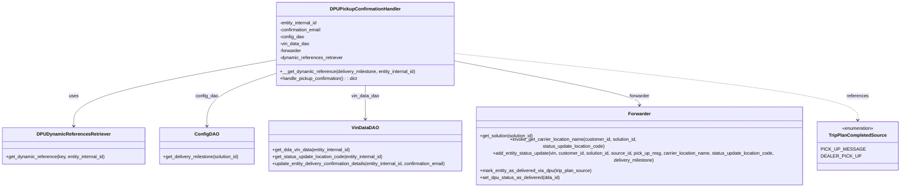
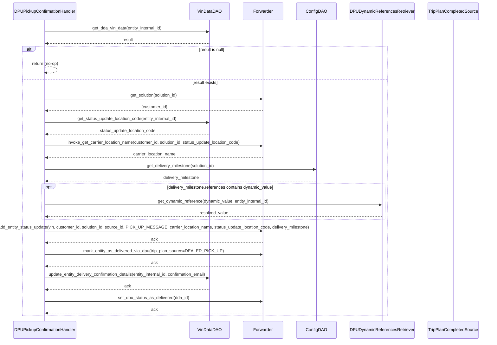

# Diagram: entity_core/entity_service/entity_service/dpu/dpu_service/service/dpu_pickup_confirmation_handler.py

> Auto-generated by Obscura crawlers

## Diagram 1

### SVG

<svg id="container" width="3175.421875" xmlns="http://www.w3.org/2000/svg" class="classDiagram" height="600" viewBox="0 0 3175.421875 600" role="graphics-document document" aria-roledescription="class"><g><defs><marker id="container_class-aggregationStart" class="marker aggregation class" refX="18" refY="7" markerWidth="190" markerHeight="240" orient="auto"><path d="M 18,7 L9,13 L1,7 L9,1 Z"></path></marker></defs><defs><marker id="container_class-aggregationEnd" class="marker aggregation class" refX="1" refY="7" markerWidth="20" markerHeight="28" orient="auto"><path d="M 18,7 L9,13 L1,7 L9,1 Z"></path></marker></defs><defs><marker id="container_class-extensionStart" class="marker extension class" refX="18" refY="7" markerWidth="190" markerHeight="240" orient="auto"><path d="M 1,7 L18,13 V 1 Z"></path></marker></defs><defs><marker id="container_class-extensionEnd" class="marker extension class" refX="1" refY="7" markerWidth="20" markerHeight="28" orient="auto"><path d="M 1,1 V 13 L18,7 Z"></path></marker></defs><defs><marker id="container_class-compositionStart" class="marker composition class" refX="18" refY="7" markerWidth="190" markerHeight="240" orient="auto"><path d="M 18,7 L9,13 L1,7 L9,1 Z"></path></marker></defs><defs><marker id="container_class-compositionEnd" class="marker composition class" refX="1" refY="7" markerWidth="20" markerHeight="28" orient="auto"><path d="M 18,7 L9,13 L1,7 L9,1 Z"></path></marker></defs><defs><marker id="container_class-dependencyStart" class="marker dependency class" refX="6" refY="7" markerWidth="190" markerHeight="240" orient="auto"><path d="M 5,7 L9,13 L1,7 L9,1 Z"></path></marker></defs><defs><marker id="container_class-dependencyEnd" class="marker dependency class" refX="13" refY="7" markerWidth="20" markerHeight="28" orient="auto"><path d="M 18,7 L9,13 L14,7 L9,1 Z"></path></marker></defs><defs><marker id="container_class-lollipopStart" class="marker lollipop class" refX="13" refY="7" markerWidth="190" markerHeight="240" orient="auto"><circle stroke="black" fill="transparent" cx="7" cy="7" r="6"></circle></marker></defs><defs><marker id="container_class-lollipopEnd" class="marker lollipop class" refX="1" refY="7" markerWidth="190" markerHeight="240" orient="auto"><circle stroke="black" fill="transparent" cx="7" cy="7" r="6"></circle></marker></defs><g class="root"><g class="clusters"></g><g class="edgePaths"><path d="M967.359,206.688L848.51,227.74C729.66,248.792,491.961,290.896,373.111,325.115C254.262,359.333,254.262,385.667,254.262,398.833L254.262,412" id="id_DPUPickupConfirmationHandler_DPUDynamicReferencesRetriever_1" class="edge-thickness-normal edge-pattern-solid relation" style=";;;" data-edge="true" data-et="edge" data-id="id_DPUPickupConfirmationHandler_DPUDynamicReferencesRetriever_1" data-points="W3sieCI6OTY3LjM1OTM3NSwieSI6MjA2LjY4ODQ0MjMwNzEwNDJ9LHsieCI6MjU0LjI2MTcxODc1LCJ5IjozMzN9LHsieCI6MjU0LjI2MTcxODc1LCJ5Ijo0MTh9XQ==" marker-end="url(#container_class-dependencyEnd)"></path><path d="M967.359,251.801L925.493,265.334C883.626,278.867,799.893,305.934,758.027,332.633C716.16,359.333,716.16,385.667,716.16,398.833L716.16,412" id="id_DPUPickupConfirmationHandler_ConfigDAO_2" class="edge-thickness-normal edge-pattern-solid relation" style=";;;" data-edge="true" data-et="edge" data-id="id_DPUPickupConfirmationHandler_ConfigDAO_2" data-points="W3sieCI6OTY3LjM1OTM3NSwieSI6MjUxLjgwMDg5NDMzOTU3fSx7IngiOjcxNi4xNjAxNTYyNSwieSI6MzMzfSx7IngiOjcxNi4xNjAxNTYyNSwieSI6NDE4fV0=" marker-end="url(#container_class-dependencyEnd)"></path><path d="M1276.105,296L1276.105,302.167C1276.105,308.333,1276.105,320.667,1276.105,336C1276.105,351.333,1276.105,369.667,1276.105,378.833L1276.105,388" id="id_DPUPickupConfirmationHandler_VinDataDAO_3" class="edge-thickness-normal edge-pattern-solid relation" style=";;;" data-edge="true" data-et="edge" data-id="id_DPUPickupConfirmationHandler_VinDataDAO_3" data-points="W3sieCI6MTI3Ni4xMDU0Njg3NSwieSI6Mjk2fSx7IngiOjEyNzYuMTA1NDY4NzUsInkiOjMzM30seyJ4IjoxMjc2LjEwNTQ2ODc1LCJ5IjozOTR9XQ==" marker-end="url(#container_class-dependencyEnd)"></path><path d="M1584.852,208.326L1698.75,229.105C1812.648,249.884,2040.445,291.442,2154.344,317.388C2268.242,343.333,2268.242,353.667,2268.242,358.833L2268.242,364" id="id_DPUPickupConfirmationHandler_Forwarder_4" class="edge-thickness-normal edge-pattern-solid relation" style=";;;" data-edge="true" data-et="edge" data-id="id_DPUPickupConfirmationHandler_Forwarder_4" data-points="W3sieCI6MTU4NC44NTE1NjI1LCJ5IjoyMDguMzI1OTQ5NzUzMzMzODJ9LHsieCI6MjI2OC4yNDIxODc1LCJ5IjozMzN9LHsieCI6MjI2OC4yNDIxODc1LCJ5IjozNzB9XQ==" marker-end="url(#container_class-dependencyEnd)"></path><path d="M1584.852,183.65L1827.667,208.542C2070.483,233.434,2556.115,283.217,2798.93,317.775C3041.746,352.333,3041.746,371.667,3041.746,381.333L3041.746,391" id="id_DPUPickupConfirmationHandler_TripPlanCompletedSource_5" class="edge-thickness-normal edge-pattern-dashed relation" style=";;;" data-edge="true" data-et="edge" data-id="id_DPUPickupConfirmationHandler_TripPlanCompletedSource_5" data-points="W3sieCI6MTU4NC44NTE1NjI1LCJ5IjoxODMuNjUwMjkyOTE3NzYxOH0seyJ4IjozMDQxLjc0NjA5Mzc1LCJ5IjozMzN9LHsieCI6MzA0MS43NDYwOTM3NSwieSI6Mzk3fV0=" marker-end="url(#container_class-dependencyEnd)"></path></g><g class="edgeLabels"><g class="edgeLabel" transform="translate(254.26171875, 333)"><g class="label" data-id="id_DPUPickupConfirmationHandler_DPUDynamicReferencesRetriever_1" transform="translate(-16.4921875, -12)"><foreignObject width="32.984375" height="24">

uses

</foreignObject></g></g><g class="edgeLabel" transform="translate(716.16015625, 333)"><g class="label" data-id="id_DPUPickupConfirmationHandler_ConfigDAO_2" transform="translate(-39.625, -12)"><foreignObject width="79.25" height="24">

config_dao

</foreignObject></g></g><g class="edgeLabel" transform="translate(1276.10546875, 333)"><g class="label" data-id="id_DPUPickupConfirmationHandler_VinDataDAO_3" transform="translate(-49.015625, -12)"><foreignObject width="98.03125" height="24">

vin_data_dao

</foreignObject></g></g><g class="edgeLabel" transform="translate(2268.2421875, 333)"><g class="label" data-id="id_DPUPickupConfirmationHandler_Forwarder_4" transform="translate(-35.4375, -12)"><foreignObject width="70.875" height="24">

forwarder

</foreignObject></g></g><g class="edgeLabel" transform="translate(3041.74609375, 333)"><g class="label" data-id="id_DPUPickupConfirmationHandler_TripPlanCompletedSource_5" transform="translate(-37.828125, -12)"><foreignObject width="75.65625" height="24">

references

</foreignObject></g></g></g><g class="nodes"><g class="node default" id="classId-DPUPickupConfirmationHandler-0" transform="translate(1276.10546875, 152)"><g class="basic label-container"><path d="M-308.74609375 -144 L308.74609375 -144 L308.74609375 144 L-308.74609375 144" stroke="none" stroke-width="0" fill="#ECECFF" style=""></path><path d="M-308.74609375 -144 C-97.68337301216684 -144, 113.37934772566632 -144, 308.74609375 -144 M-308.74609375 -144 C-67.38773561946724 -144, 173.97062251106553 -144, 308.74609375 -144 M308.74609375 -144 C308.74609375 -51.24396486190585, 308.74609375 41.5120702761883, 308.74609375 144 M308.74609375 -144 C308.74609375 -78.3890272562975, 308.74609375 -12.778054512594991, 308.74609375 144 M308.74609375 144 C177.0394126511205 144, 45.332731552241 144, -308.74609375 144 M308.74609375 144 C104.98237482713819 144, -98.78134409572363 144, -308.74609375 144 M-308.74609375 144 C-308.74609375 45.09291226154343, -308.74609375 -53.814175476913135, -308.74609375 -144 M-308.74609375 144 C-308.74609375 78.5204227169026, -308.74609375 13.040845433805202, -308.74609375 -144" stroke="#9370DB" stroke-width="1.3" fill="none" stroke-dasharray="0 0" style=""></path></g><g class="annotation-group text" transform="translate(0, -120)"></g><g class="label-group text" transform="translate(-116.3984375, -120)"><g class="label" style="font-weight: bolder" transform="translate(0,-12)"><foreignObject width="232.796875" height="24">

DPUPickupConfirmationHandler

</foreignObject></g></g><g class="members-group text" transform="translate(-296.74609375, -72)"><g class="label" style="" transform="translate(0,-12)"><foreignObject width="135.578125" height="24">

-entity_internal_id

</foreignObject></g><g class="label" style="" transform="translate(0,12)"><foreignObject width="147.640625" height="24">

-confirmation_email

</foreignObject></g><g class="label" style="" transform="translate(0,36)"><foreignObject width="85.703125" height="24">

-config_dao

</foreignObject></g><g class="label" style="" transform="translate(0,60)"><foreignObject width="104.3125" height="24">

-vin_data_dao

</foreignObject></g><g class="label" style="" transform="translate(0,84)"><foreignObject width="77.078125" height="24">

-forwarder

</foreignObject></g><g class="label" style="" transform="translate(0,108)"><foreignObject width="222.0625" height="24">

-dynamic_references_retriever

</foreignObject></g></g><g class="methods-group text" transform="translate(-296.74609375, 96)"><g class="label" style="" transform="translate(0,-12)"><foreignObject width="477.09375" height="24">

+__get_dynamic_reference(delivery_milestone, entity_internal_id)

</foreignObject></g><g class="label" style="" transform="translate(0,12)"><foreignObject width="273.703125" height="24">

+handle_pickup_confirmation() : : dict

</foreignObject></g></g><g class="divider" style=""><path d="M-308.74609375 -96 C-118.64902247703543 -96, 71.44804879592914 -96, 308.74609375 -96 M-308.74609375 -96 C-75.9020804214085 -96, 156.941932907183 -96, 308.74609375 -96" stroke="#9370DB" stroke-width="1.3" fill="none" stroke-dasharray="0 0" style=""></path></g><g class="divider" style=""><path d="M-308.74609375 72 C-175.07858743149657 72, -41.411081112993145 72, 308.74609375 72 M-308.74609375 72 C-140.14000200396725 72, 28.466089742065492 72, 308.74609375 72" stroke="#9370DB" stroke-width="1.3" fill="none" stroke-dasharray="0 0" style=""></path></g></g><g class="node default" id="classId-DPUDynamicReferencesRetriever-1" transform="translate(254.26171875, 481)"><g class="basic label-container"><path d="M-246.26171875 -63 L246.26171875 -63 L246.26171875 63 L-246.26171875 63" stroke="none" stroke-width="0" fill="#ECECFF" style=""></path><path d="M-246.26171875 -63 C-65.10671527805786 -63, 116.04828819388428 -63, 246.26171875 -63 M-246.26171875 -63 C-126.54903667283973 -63, -6.836354595679467 -63, 246.26171875 -63 M246.26171875 -63 C246.26171875 -19.94457354295882, 246.26171875 23.110852914082358, 246.26171875 63 M246.26171875 -63 C246.26171875 -31.926520264144827, 246.26171875 -0.8530405282896538, 246.26171875 63 M246.26171875 63 C108.75625025808802 63, -28.749218233823967 63, -246.26171875 63 M246.26171875 63 C142.12226043740765 63, 37.982802124815265 63, -246.26171875 63 M-246.26171875 63 C-246.26171875 30.684485259060565, -246.26171875 -1.631029481878869, -246.26171875 -63 M-246.26171875 63 C-246.26171875 13.475918553816186, -246.26171875 -36.04816289236763, -246.26171875 -63" stroke="#9370DB" stroke-width="1.3" fill="none" stroke-dasharray="0 0" style=""></path></g><g class="annotation-group text" transform="translate(0, -39)"></g><g class="label-group text" transform="translate(-120.5859375, -39)"><g class="label" style="font-weight: bolder" transform="translate(0,-12)"><foreignObject width="241.171875" height="24">

DPUDynamicReferencesRetriever

</foreignObject></g></g><g class="members-group text" transform="translate(-234.26171875, 9)"></g><g class="methods-group text" transform="translate(-234.26171875, 39)"><g class="label" style="" transform="translate(0,-12)"><foreignObject width="347.9375" height="24">

+get_dynamic_reference(key, entity_internal_id)

</foreignObject></g></g><g class="divider" style=""><path d="M-246.26171875 -15 C-70.77179017454912 -15, 104.71813840090175 -15, 246.26171875 -15 M-246.26171875 -15 C-66.97112668752294 -15, 112.31946537495412 -15, 246.26171875 -15" stroke="#9370DB" stroke-width="1.3" fill="none" stroke-dasharray="0 0" style=""></path></g><g class="divider" style=""><path d="M-246.26171875 9 C-113.7015815956791 9, 18.858555558641797 9, 246.26171875 9 M-246.26171875 9 C-105.70815911013864 9, 34.845400529722724 9, 246.26171875 9" stroke="#9370DB" stroke-width="1.3" fill="none" stroke-dasharray="0 0" style=""></path></g></g><g class="node default" id="classId-ConfigDAO-2" transform="translate(716.16015625, 481)"><g class="basic label-container"><path d="M-165.63671875 -63 L165.63671875 -63 L165.63671875 63 L-165.63671875 63" stroke="none" stroke-width="0" fill="#ECECFF" style=""></path><path d="M-165.63671875 -63 C-40.550402464805984 -63, 84.53591382038803 -63, 165.63671875 -63 M-165.63671875 -63 C-45.9424564261691 -63, 73.7518058976618 -63, 165.63671875 -63 M165.63671875 -63 C165.63671875 -15.288074074211728, 165.63671875 32.42385185157654, 165.63671875 63 M165.63671875 -63 C165.63671875 -13.459383104477318, 165.63671875 36.08123379104536, 165.63671875 63 M165.63671875 63 C72.74663437080976 63, -20.143450008380483 63, -165.63671875 63 M165.63671875 63 C82.75992734667565 63, -0.11686405664869426 63, -165.63671875 63 M-165.63671875 63 C-165.63671875 13.656040969461756, -165.63671875 -35.68791806107649, -165.63671875 -63 M-165.63671875 63 C-165.63671875 34.185268805742425, -165.63671875 5.370537611484856, -165.63671875 -63" stroke="#9370DB" stroke-width="1.3" fill="none" stroke-dasharray="0 0" style=""></path></g><g class="annotation-group text" transform="translate(0, -39)"></g><g class="label-group text" transform="translate(-38.2265625, -39)"><g class="label" style="font-weight: bolder" transform="translate(0,-12)"><foreignObject width="76.453125" height="24">

ConfigDAO

</foreignObject></g></g><g class="members-group text" transform="translate(-153.63671875, 9)"></g><g class="methods-group text" transform="translate(-153.63671875, 39)"><g class="label" style="" transform="translate(0,-12)"><foreignObject width="269.046875" height="24">

+get_delivery_milestone(solution_id)

</foreignObject></g></g><g class="divider" style=""><path d="M-165.63671875 -15 C-52.17064950548789 -15, 61.295419739024226 -15, 165.63671875 -15 M-165.63671875 -15 C-80.82370940015059 -15, 3.989299949698818 -15, 165.63671875 -15" stroke="#9370DB" stroke-width="1.3" fill="none" stroke-dasharray="0 0" style=""></path></g><g class="divider" style=""><path d="M-165.63671875 9 C-75.22863651245774 9, 15.17944572508452 9, 165.63671875 9 M-165.63671875 9 C-37.869501328231095 9, 89.89771609353781 9, 165.63671875 9" stroke="#9370DB" stroke-width="1.3" fill="none" stroke-dasharray="0 0" style=""></path></g></g><g class="node default" id="classId-VinDataDAO-3" transform="translate(1276.10546875, 481)"><g class="basic label-container"><path d="M-344.30859375 -87 L344.30859375 -87 L344.30859375 87 L-344.30859375 87" stroke="none" stroke-width="0" fill="#ECECFF" style=""></path><path d="M-344.30859375 -87 C-198.03541011154297 -87, -51.762226473085946 -87, 344.30859375 -87 M-344.30859375 -87 C-156.03883018733455 -87, 32.23093337533089 -87, 344.30859375 -87 M344.30859375 -87 C344.30859375 -33.33876486542458, 344.30859375 20.32247026915084, 344.30859375 87 M344.30859375 -87 C344.30859375 -35.662028226632565, 344.30859375 15.675943546734871, 344.30859375 87 M344.30859375 87 C144.26001935496208 87, -55.788555040075835 87, -344.30859375 87 M344.30859375 87 C193.6865871177416 87, 43.06458048548319 87, -344.30859375 87 M-344.30859375 87 C-344.30859375 27.22319577901201, -344.30859375 -32.55360844197598, -344.30859375 -87 M-344.30859375 87 C-344.30859375 51.58909079606105, -344.30859375 16.1781815921221, -344.30859375 -87" stroke="#9370DB" stroke-width="1.3" fill="none" stroke-dasharray="0 0" style=""></path></g><g class="annotation-group text" transform="translate(0, -63)"></g><g class="label-group text" transform="translate(-43.6171875, -63)"><g class="label" style="font-weight: bolder" transform="translate(0,-12)"><foreignObject width="87.234375" height="24">

VinDataDAO

</foreignObject></g></g><g class="members-group text" transform="translate(-332.30859375, -15)"></g><g class="methods-group text" transform="translate(-332.30859375, 15)"><g class="label" style="" transform="translate(0,-12)"><foreignObject width="276.125" height="24">

+get_dda_vin_data(entity_internal_id)

</foreignObject></g><g class="label" style="" transform="translate(0,12)"><foreignObject width="391.734375" height="24">

+get_status_update_location_code(entity_internal_id)

</foreignObject></g><g class="label" style="" transform="translate(0,36)"><foreignObject width="621" height="24">

+update_entity_delivery_confirmation_details(entity_internal_id, confirmation_email)

</foreignObject></g></g><g class="divider" style=""><path d="M-344.30859375 -39 C-78.41426730693092 -39, 187.48005913613815 -39, 344.30859375 -39 M-344.30859375 -39 C-130.17697670677245 -39, 83.9546403364551 -39, 344.30859375 -39" stroke="#9370DB" stroke-width="1.3" fill="none" stroke-dasharray="0 0" style=""></path></g><g class="divider" style=""><path d="M-344.30859375 -15 C-187.2930312819978 -15, -30.277468813995597 -15, 344.30859375 -15 M-344.30859375 -15 C-122.79856865169452 -15, 98.71145644661095 -15, 344.30859375 -15" stroke="#9370DB" stroke-width="1.3" fill="none" stroke-dasharray="0 0" style=""></path></g></g><g class="node default" id="classId-Forwarder-4" transform="translate(2268.2421875, 481)"><g class="basic label-container"><path d="M-597.828125 -111 L597.828125 -111 L597.828125 111 L-597.828125 111" stroke="none" stroke-width="0" fill="#ECECFF" style=""></path><path d="M-597.828125 -111 C-298.2569453636417 -111, 1.3142342727165897 -111, 597.828125 -111 M-597.828125 -111 C-296.4803704834293 -111, 4.867384033141434 -111, 597.828125 -111 M597.828125 -111 C597.828125 -40.48534926137974, 597.828125 30.029301477240523, 597.828125 111 M597.828125 -111 C597.828125 -23.811502343013046, 597.828125 63.37699531397391, 597.828125 111 M597.828125 111 C296.6718074689205 111, -4.484510062158961 111, -597.828125 111 M597.828125 111 C134.60858621061243 111, -328.61095257877514 111, -597.828125 111 M-597.828125 111 C-597.828125 55.59389195667833, -597.828125 0.1877839133566539, -597.828125 -111 M-597.828125 111 C-597.828125 30.747694476607293, -597.828125 -49.50461104678541, -597.828125 -111" stroke="#9370DB" stroke-width="1.3" fill="none" stroke-dasharray="0 0" style=""></path></g><g class="annotation-group text" transform="translate(0, -87)"></g><g class="label-group text" transform="translate(-37.15625, -87)"><g class="label" style="font-weight: bolder" transform="translate(0,-12)"><foreignObject width="74.3125" height="24">

Forwarder

</foreignObject></g></g><g class="members-group text" transform="translate(-585.828125, -39)"></g><g class="methods-group text" transform="translate(-585.828125, -9)"><g class="label" style="" transform="translate(0,-12)"><foreignObject width="191.28125" height="24">

+get_solution(solution_id)

</foreignObject></g><g class="label" style="" transform="translate(0,12)"><foreignObject width="668.21875" height="24">

+invoke_get_carrier_location_name(customer_id, solution_id, status_update_location_code)

</foreignObject></g><g class="label" style="" transform="translate(0,36)"><foreignObject width="1134.5" height="24">

+add_entity_status_update(vin, customer_id, solution_id, source_id, pick_up_msg, carrier_location_name, status_update_location_code, delivery_milestone)

</foreignObject></g><g class="label" style="" transform="translate(0,60)"><foreignObject width="391.96875" height="24">

+mark_entity_as_delivered_via_dpu(trip_plan_source)

</foreignObject></g><g class="label" style="" transform="translate(0,84)"><foreignObject width="279.046875" height="24">

+set_dpu_status_as_delivered(dda_id)

</foreignObject></g></g><g class="divider" style=""><path d="M-597.828125 -63 C-235.25006479294797 -63, 127.32799541410407 -63, 597.828125 -63 M-597.828125 -63 C-218.85484145408589 -63, 160.11844209182823 -63, 597.828125 -63" stroke="#9370DB" stroke-width="1.3" fill="none" stroke-dasharray="0 0" style=""></path></g><g class="divider" style=""><path d="M-597.828125 -39 C-225.93377124364935 -39, 145.9605825127013 -39, 597.828125 -39 M-597.828125 -39 C-213.90845550199367 -39, 170.01121399601266 -39, 597.828125 -39" stroke="#9370DB" stroke-width="1.3" fill="none" stroke-dasharray="0 0" style=""></path></g></g><g class="node default" id="classId-TripPlanCompletedSource-5" transform="translate(3041.74609375, 481)"><g class="basic label-container"><path d="M-125.67578125 -84 L125.67578125 -84 L125.67578125 84 L-125.67578125 84" stroke="none" stroke-width="0" fill="#ECECFF" style=""></path><path d="M-125.67578125 -84 C-56.04294564475698 -84, 13.589889960486033 -84, 125.67578125 -84 M-125.67578125 -84 C-56.86959560287167 -84, 11.936590044256661 -84, 125.67578125 -84 M125.67578125 -84 C125.67578125 -32.18666644959325, 125.67578125 19.626667100813506, 125.67578125 84 M125.67578125 -84 C125.67578125 -17.775685039394375, 125.67578125 48.44862992121125, 125.67578125 84 M125.67578125 84 C39.61957590343657 84, -46.43662944312686 84, -125.67578125 84 M125.67578125 84 C73.37408444463193 84, 21.07238763926388 84, -125.67578125 84 M-125.67578125 84 C-125.67578125 19.024468835039798, -125.67578125 -45.951062329920404, -125.67578125 -84 M-125.67578125 84 C-125.67578125 34.653012213820126, -125.67578125 -14.693975572359747, -125.67578125 -84" stroke="#9370DB" stroke-width="1.3" fill="none" stroke-dasharray="0 0" style=""></path></g><g class="annotation-group text" transform="translate(-55.5546875, -60)"><g class="label" style="" transform="translate(0,-12)"><foreignObject width="111.109375" height="24">

«enumeration»

</foreignObject></g></g><g class="label-group text" transform="translate(-94.8203125, -36)"><g class="label" style="font-weight: bolder" transform="translate(0,-12)"><foreignObject width="189.640625" height="24">

TripPlanCompletedSource

</foreignObject></g></g><g class="members-group text" transform="translate(-113.67578125, 12)"><g class="label" style="" transform="translate(0,-12)"><foreignObject width="132.53125" height="24">

PICK_UP_MESSAGE

</foreignObject></g><g class="label" style="" transform="translate(0,12)"><foreignObject width="122.703125" height="24">

DEALER_PICK_UP

</foreignObject></g></g><g class="methods-group text" transform="translate(-113.67578125, 84)"></g><g class="divider" style=""><path d="M-125.67578125 -12 C-30.067480690894925 -12, 65.54081986821015 -12, 125.67578125 -12 M-125.67578125 -12 C-51.77666029196001 -12, 22.122460666079974 -12, 125.67578125 -12" stroke="#9370DB" stroke-width="1.3" fill="none" stroke-dasharray="0 0" style=""></path></g><g class="divider" style=""><path d="M-125.67578125 60 C-54.041011141922695 60, 17.59375896615461 60, 125.67578125 60 M-125.67578125 60 C-74.25456485314713 60, -22.83334845629426 60, 125.67578125 60" stroke="#9370DB" stroke-width="1.3" fill="none" stroke-dasharray="0 0" style=""></path></g></g></g></g></g></svg>

## Diagram 2

### SVG

<svg id="container" width="1950" xmlns="http://www.w3.org/2000/svg" height="1364" viewBox="-50 -10 1950 1364" role="graphics-document document" aria-roledescription="sequence"><g><rect x="1643" y="1278" fill="#eaeaea" stroke="#666" width="207" height="65" name="Enum" rx="3" ry="3" class="actor actor-bottom"></rect><text x="1746.5" y="1310.5" dominant-baseline="central" alignment-baseline="central" class="actor actor-box" style="text-anchor: middle; font-size: 16px; font-weight: 400;"><tspan x="1746.5" dy="0">TripPlanCompletedSource</tspan></text></g><g><rect x="1334" y="1278" fill="#eaeaea" stroke="#666" width="259" height="65" name="DynRetriever" rx="3" ry="3" class="actor actor-bottom"></rect><text x="1463.5" y="1310.5" dominant-baseline="central" alignment-baseline="central" class="actor actor-box" style="text-anchor: middle; font-size: 16px; font-weight: 400;"><tspan x="1463.5" dy="0">DPUDynamicReferencesRetriever</tspan></text></g><g><rect x="1134" y="1278" fill="#eaeaea" stroke="#666" width="150" height="65" name="ConfigDAO" rx="3" ry="3" class="actor actor-bottom"></rect><text x="1209" y="1310.5" dominant-baseline="central" alignment-baseline="central" class="actor actor-box" style="text-anchor: middle; font-size: 16px; font-weight: 400;"><tspan x="1209" dy="0">ConfigDAO</tspan></text></g><g><rect x="934" y="1278" fill="#eaeaea" stroke="#666" width="150" height="65" name="Forwarder" rx="3" ry="3" class="actor actor-bottom"></rect><text x="1009" y="1310.5" dominant-baseline="central" alignment-baseline="central" class="actor actor-box" style="text-anchor: middle; font-size: 16px; font-weight: 400;"><tspan x="1009" dy="0">Forwarder</tspan></text></g><g><rect x="734" y="1278" fill="#eaeaea" stroke="#666" width="150" height="65" name="VinDAO" rx="3" ry="3" class="actor actor-bottom"></rect><text x="809" y="1310.5" dominant-baseline="central" alignment-baseline="central" class="actor actor-box" style="text-anchor: middle; font-size: 16px; font-weight: 400;"><tspan x="809" dy="0">VinDataDAO</tspan></text></g><g><rect x="0" y="1278" fill="#eaeaea" stroke="#666" width="252" height="65" name="Handler" rx="3" ry="3" class="actor actor-bottom"></rect><text x="126" y="1310.5" dominant-baseline="central" alignment-baseline="central" class="actor actor-box" style="text-anchor: middle; font-size: 16px; font-weight: 400;"><tspan x="126" dy="0">DPUPickupConfirmationHandler</tspan></text></g><g><line id="actor5" x1="1746.5" y1="65" x2="1746.5" y2="1278" class="actor-line 200" stroke-width="0.5px" stroke="#999" name="Enum"></line><g id="root-5"><rect x="1643" y="0" fill="#eaeaea" stroke="#666" width="207" height="65" name="Enum" rx="3" ry="3" class="actor actor-top"></rect><text x="1746.5" y="32.5" dominant-baseline="central" alignment-baseline="central" class="actor actor-box" style="text-anchor: middle; font-size: 16px; font-weight: 400;"><tspan x="1746.5" dy="0">TripPlanCompletedSource</tspan></text></g></g><g><line id="actor4" x1="1463.5" y1="65" x2="1463.5" y2="1278" class="actor-line 200" stroke-width="0.5px" stroke="#999" name="DynRetriever"></line><g id="root-4"><rect x="1334" y="0" fill="#eaeaea" stroke="#666" width="259" height="65" name="DynRetriever" rx="3" ry="3" class="actor actor-top"></rect><text x="1463.5" y="32.5" dominant-baseline="central" alignment-baseline="central" class="actor actor-box" style="text-anchor: middle; font-size: 16px; font-weight: 400;"><tspan x="1463.5" dy="0">DPUDynamicReferencesRetriever</tspan></text></g></g><g><line id="actor3" x1="1209" y1="65" x2="1209" y2="1278" class="actor-line 200" stroke-width="0.5px" stroke="#999" name="ConfigDAO"></line><g id="root-3"><rect x="1134" y="0" fill="#eaeaea" stroke="#666" width="150" height="65" name="ConfigDAO" rx="3" ry="3" class="actor actor-top"></rect><text x="1209" y="32.5" dominant-baseline="central" alignment-baseline="central" class="actor actor-box" style="text-anchor: middle; font-size: 16px; font-weight: 400;"><tspan x="1209" dy="0">ConfigDAO</tspan></text></g></g><g><line id="actor2" x1="1009" y1="65" x2="1009" y2="1278" class="actor-line 200" stroke-width="0.5px" stroke="#999" name="Forwarder"></line><g id="root-2"><rect x="934" y="0" fill="#eaeaea" stroke="#666" width="150" height="65" name="Forwarder" rx="3" ry="3" class="actor actor-top"></rect><text x="1009" y="32.5" dominant-baseline="central" alignment-baseline="central" class="actor actor-box" style="text-anchor: middle; font-size: 16px; font-weight: 400;"><tspan x="1009" dy="0">Forwarder</tspan></text></g></g><g><line id="actor1" x1="809" y1="65" x2="809" y2="1278" class="actor-line 200" stroke-width="0.5px" stroke="#999" name="VinDAO"></line><g id="root-1"><rect x="734" y="0" fill="#eaeaea" stroke="#666" width="150" height="65" name="VinDAO" rx="3" ry="3" class="actor actor-top"></rect><text x="809" y="32.5" dominant-baseline="central" alignment-baseline="central" class="actor actor-box" style="text-anchor: middle; font-size: 16px; font-weight: 400;"><tspan x="809" dy="0">VinDataDAO</tspan></text></g></g><g><line id="actor0" x1="126" y1="65" x2="126" y2="1278" class="actor-line 200" stroke-width="0.5px" stroke="#999" name="Handler"></line><g id="root-0"><rect x="0" y="0" fill="#eaeaea" stroke="#666" width="252" height="65" name="Handler" rx="3" ry="3" class="actor actor-top"></rect><text x="126" y="32.5" dominant-baseline="central" alignment-baseline="central" class="actor actor-box" style="text-anchor: middle; font-size: 16px; font-weight: 400;"><tspan x="126" dy="0">DPUPickupConfirmationHandler</tspan></text></g></g><g></g><defs><symbol id="computer" width="24" height="24"><path transform="scale(.5)" d="M2 2v13h20v-13h-20zm18 11h-16v-9h16v9zm-10.228 6l.466-1h3.524l.467 1h-4.457zm14.228 3h-24l2-6h2.104l-1.33 4h18.45l-1.297-4h2.073l2 6zm-5-10h-14v-7h14v7z"></path></symbol></defs><defs><symbol id="database" fill-rule="evenodd" clip-rule="evenodd"><path transform="scale(.5)" d="M12.258.001l.256.004.255.005.253.008.251.01.249.012.247.015.246.016.242.019.241.02.239.023.236.024.233.027.231.028.229.031.225.032.223.034.22.036.217.038.214.04.211.041.208.043.205.045.201.046.198.048.194.05.191.051.187.053.183.054.18.056.175.057.172.059.168.06.163.061.16.063.155.064.15.066.074.033.073.033.071.034.07.034.069.035.068.035.067.035.066.035.064.036.064.036.062.036.06.036.06.037.058.037.058.037.055.038.055.038.053.038.052.038.051.039.05.039.048.039.047.039.045.04.044.04.043.04.041.04.04.041.039.041.037.041.036.041.034.041.033.042.032.042.03.042.029.042.027.042.026.043.024.043.023.043.021.043.02.043.018.044.017.043.015.044.013.044.012.044.011.045.009.044.007.045.006.045.004.045.002.045.001.045v17l-.001.045-.002.045-.004.045-.006.045-.007.045-.009.044-.011.045-.012.044-.013.044-.015.044-.017.043-.018.044-.02.043-.021.043-.023.043-.024.043-.026.043-.027.042-.029.042-.03.042-.032.042-.033.042-.034.041-.036.041-.037.041-.039.041-.04.041-.041.04-.043.04-.044.04-.045.04-.047.039-.048.039-.05.039-.051.039-.052.038-.053.038-.055.038-.055.038-.058.037-.058.037-.06.037-.06.036-.062.036-.064.036-.064.036-.066.035-.067.035-.068.035-.069.035-.07.034-.071.034-.073.033-.074.033-.15.066-.155.064-.16.063-.163.061-.168.06-.172.059-.175.057-.18.056-.183.054-.187.053-.191.051-.194.05-.198.048-.201.046-.205.045-.208.043-.211.041-.214.04-.217.038-.22.036-.223.034-.225.032-.229.031-.231.028-.233.027-.236.024-.239.023-.241.02-.242.019-.246.016-.247.015-.249.012-.251.01-.253.008-.255.005-.256.004-.258.001-.258-.001-.256-.004-.255-.005-.253-.008-.251-.01-.249-.012-.247-.015-.245-.016-.243-.019-.241-.02-.238-.023-.236-.024-.234-.027-.231-.028-.228-.031-.226-.032-.223-.034-.22-.036-.217-.038-.214-.04-.211-.041-.208-.043-.204-.045-.201-.046-.198-.048-.195-.05-.19-.051-.187-.053-.184-.054-.179-.056-.176-.057-.172-.059-.167-.06-.164-.061-.159-.063-.155-.064-.151-.066-.074-.033-.072-.033-.072-.034-.07-.034-.069-.035-.068-.035-.067-.035-.066-.035-.064-.036-.063-.036-.062-.036-.061-.036-.06-.037-.058-.037-.057-.037-.056-.038-.055-.038-.053-.038-.052-.038-.051-.039-.049-.039-.049-.039-.046-.039-.046-.04-.044-.04-.043-.04-.041-.04-.04-.041-.039-.041-.037-.041-.036-.041-.034-.041-.033-.042-.032-.042-.03-.042-.029-.042-.027-.042-.026-.043-.024-.043-.023-.043-.021-.043-.02-.043-.018-.044-.017-.043-.015-.044-.013-.044-.012-.044-.011-.045-.009-.044-.007-.045-.006-.045-.004-.045-.002-.045-.001-.045v-17l.001-.045.002-.045.004-.045.006-.045.007-.045.009-.044.011-.045.012-.044.013-.044.015-.044.017-.043.018-.044.02-.043.021-.043.023-.043.024-.043.026-.043.027-.042.029-.042.03-.042.032-.042.033-.042.034-.041.036-.041.037-.041.039-.041.04-.041.041-.04.043-.04.044-.04.046-.04.046-.039.049-.039.049-.039.051-.039.052-.038.053-.038.055-.038.056-.038.057-.037.058-.037.06-.037.061-.036.062-.036.063-.036.064-.036.066-.035.067-.035.068-.035.069-.035.07-.034.072-.034.072-.033.074-.033.151-.066.155-.064.159-.063.164-.061.167-.06.172-.059.176-.057.179-.056.184-.054.187-.053.19-.051.195-.05.198-.048.201-.046.204-.045.208-.043.211-.041.214-.04.217-.038.22-.036.223-.034.226-.032.228-.031.231-.028.234-.027.236-.024.238-.023.241-.02.243-.019.245-.016.247-.015.249-.012.251-.01.253-.008.255-.005.256-.004.258-.001.258.001zm-9.258 20.499v.01l.001.021.003.021.004.022.005.021.006.022.007.022.009.023.01.022.011.023.012.023.013.023.015.023.016.024.017.023.018.024.019.024.021.024.022.025.023.024.024.025.052.049.056.05.061.051.066.051.07.051.075.051.079.052.084.052.088.052.092.052.097.052.102.051.105.052.11.052.114.051.119.051.123.051.127.05.131.05.135.05.139.048.144.049.147.047.152.047.155.047.16.045.163.045.167.043.171.043.176.041.178.041.183.039.187.039.19.037.194.035.197.035.202.033.204.031.209.03.212.029.216.027.219.025.222.024.226.021.23.02.233.018.236.016.24.015.243.012.246.01.249.008.253.005.256.004.259.001.26-.001.257-.004.254-.005.25-.008.247-.011.244-.012.241-.014.237-.016.233-.018.231-.021.226-.021.224-.024.22-.026.216-.027.212-.028.21-.031.205-.031.202-.034.198-.034.194-.036.191-.037.187-.039.183-.04.179-.04.175-.042.172-.043.168-.044.163-.045.16-.046.155-.046.152-.047.148-.048.143-.049.139-.049.136-.05.131-.05.126-.05.123-.051.118-.052.114-.051.11-.052.106-.052.101-.052.096-.052.092-.052.088-.053.083-.051.079-.052.074-.052.07-.051.065-.051.06-.051.056-.05.051-.05.023-.024.023-.025.021-.024.02-.024.019-.024.018-.024.017-.024.015-.023.014-.024.013-.023.012-.023.01-.023.01-.022.008-.022.006-.022.006-.022.004-.022.004-.021.001-.021.001-.021v-4.127l-.077.055-.08.053-.083.054-.085.053-.087.052-.09.052-.093.051-.095.05-.097.05-.1.049-.102.049-.105.048-.106.047-.109.047-.111.046-.114.045-.115.045-.118.044-.12.043-.122.042-.124.042-.126.041-.128.04-.13.04-.132.038-.134.038-.135.037-.138.037-.139.035-.142.035-.143.034-.144.033-.147.032-.148.031-.15.03-.151.03-.153.029-.154.027-.156.027-.158.026-.159.025-.161.024-.162.023-.163.022-.165.021-.166.02-.167.019-.169.018-.169.017-.171.016-.173.015-.173.014-.175.013-.175.012-.177.011-.178.01-.179.008-.179.008-.181.006-.182.005-.182.004-.184.003-.184.002h-.37l-.184-.002-.184-.003-.182-.004-.182-.005-.181-.006-.179-.008-.179-.008-.178-.01-.176-.011-.176-.012-.175-.013-.173-.014-.172-.015-.171-.016-.17-.017-.169-.018-.167-.019-.166-.02-.165-.021-.163-.022-.162-.023-.161-.024-.159-.025-.157-.026-.156-.027-.155-.027-.153-.029-.151-.03-.15-.03-.148-.031-.146-.032-.145-.033-.143-.034-.141-.035-.14-.035-.137-.037-.136-.037-.134-.038-.132-.038-.13-.04-.128-.04-.126-.041-.124-.042-.122-.042-.12-.044-.117-.043-.116-.045-.113-.045-.112-.046-.109-.047-.106-.047-.105-.048-.102-.049-.1-.049-.097-.05-.095-.05-.093-.052-.09-.051-.087-.052-.085-.053-.083-.054-.08-.054-.077-.054v4.127zm0-5.654v.011l.001.021.003.021.004.021.005.022.006.022.007.022.009.022.01.022.011.023.012.023.013.023.015.024.016.023.017.024.018.024.019.024.021.024.022.024.023.025.024.024.052.05.056.05.061.05.066.051.07.051.075.052.079.051.084.052.088.052.092.052.097.052.102.052.105.052.11.051.114.051.119.052.123.05.127.051.131.05.135.049.139.049.144.048.147.048.152.047.155.046.16.045.163.045.167.044.171.042.176.042.178.04.183.04.187.038.19.037.194.036.197.034.202.033.204.032.209.03.212.028.216.027.219.025.222.024.226.022.23.02.233.018.236.016.24.014.243.012.246.01.249.008.253.006.256.003.259.001.26-.001.257-.003.254-.006.25-.008.247-.01.244-.012.241-.015.237-.016.233-.018.231-.02.226-.022.224-.024.22-.025.216-.027.212-.029.21-.03.205-.032.202-.033.198-.035.194-.036.191-.037.187-.039.183-.039.179-.041.175-.042.172-.043.168-.044.163-.045.16-.045.155-.047.152-.047.148-.048.143-.048.139-.05.136-.049.131-.05.126-.051.123-.051.118-.051.114-.052.11-.052.106-.052.101-.052.096-.052.092-.052.088-.052.083-.052.079-.052.074-.051.07-.052.065-.051.06-.05.056-.051.051-.049.023-.025.023-.024.021-.025.02-.024.019-.024.018-.024.017-.024.015-.023.014-.023.013-.024.012-.022.01-.023.01-.023.008-.022.006-.022.006-.022.004-.021.004-.022.001-.021.001-.021v-4.139l-.077.054-.08.054-.083.054-.085.052-.087.053-.09.051-.093.051-.095.051-.097.05-.1.049-.102.049-.105.048-.106.047-.109.047-.111.046-.114.045-.115.044-.118.044-.12.044-.122.042-.124.042-.126.041-.128.04-.13.039-.132.039-.134.038-.135.037-.138.036-.139.036-.142.035-.143.033-.144.033-.147.033-.148.031-.15.03-.151.03-.153.028-.154.028-.156.027-.158.026-.159.025-.161.024-.162.023-.163.022-.165.021-.166.02-.167.019-.169.018-.169.017-.171.016-.173.015-.173.014-.175.013-.175.012-.177.011-.178.009-.179.009-.179.007-.181.007-.182.005-.182.004-.184.003-.184.002h-.37l-.184-.002-.184-.003-.182-.004-.182-.005-.181-.007-.179-.007-.179-.009-.178-.009-.176-.011-.176-.012-.175-.013-.173-.014-.172-.015-.171-.016-.17-.017-.169-.018-.167-.019-.166-.02-.165-.021-.163-.022-.162-.023-.161-.024-.159-.025-.157-.026-.156-.027-.155-.028-.153-.028-.151-.03-.15-.03-.148-.031-.146-.033-.145-.033-.143-.033-.141-.035-.14-.036-.137-.036-.136-.037-.134-.038-.132-.039-.13-.039-.128-.04-.126-.041-.124-.042-.122-.043-.12-.043-.117-.044-.116-.044-.113-.046-.112-.046-.109-.046-.106-.047-.105-.048-.102-.049-.1-.049-.097-.05-.095-.051-.093-.051-.09-.051-.087-.053-.085-.052-.083-.054-.08-.054-.077-.054v4.139zm0-5.666v.011l.001.02.003.022.004.021.005.022.006.021.007.022.009.023.01.022.011.023.012.023.013.023.015.023.016.024.017.024.018.023.019.024.021.025.022.024.023.024.024.025.052.05.056.05.061.05.066.051.07.051.075.052.079.051.084.052.088.052.092.052.097.052.102.052.105.051.11.052.114.051.119.051.123.051.127.05.131.05.135.05.139.049.144.048.147.048.152.047.155.046.16.045.163.045.167.043.171.043.176.042.178.04.183.04.187.038.19.037.194.036.197.034.202.033.204.032.209.03.212.028.216.027.219.025.222.024.226.021.23.02.233.018.236.017.24.014.243.012.246.01.249.008.253.006.256.003.259.001.26-.001.257-.003.254-.006.25-.008.247-.01.244-.013.241-.014.237-.016.233-.018.231-.02.226-.022.224-.024.22-.025.216-.027.212-.029.21-.03.205-.032.202-.033.198-.035.194-.036.191-.037.187-.039.183-.039.179-.041.175-.042.172-.043.168-.044.163-.045.16-.045.155-.047.152-.047.148-.048.143-.049.139-.049.136-.049.131-.051.126-.05.123-.051.118-.052.114-.051.11-.052.106-.052.101-.052.096-.052.092-.052.088-.052.083-.052.079-.052.074-.052.07-.051.065-.051.06-.051.056-.05.051-.049.023-.025.023-.025.021-.024.02-.024.019-.024.018-.024.017-.024.015-.023.014-.024.013-.023.012-.023.01-.022.01-.023.008-.022.006-.022.006-.022.004-.022.004-.021.001-.021.001-.021v-4.153l-.077.054-.08.054-.083.053-.085.053-.087.053-.09.051-.093.051-.095.051-.097.05-.1.049-.102.048-.105.048-.106.048-.109.046-.111.046-.114.046-.115.044-.118.044-.12.043-.122.043-.124.042-.126.041-.128.04-.13.039-.132.039-.134.038-.135.037-.138.036-.139.036-.142.034-.143.034-.144.033-.147.032-.148.032-.15.03-.151.03-.153.028-.154.028-.156.027-.158.026-.159.024-.161.024-.162.023-.163.023-.165.021-.166.02-.167.019-.169.018-.169.017-.171.016-.173.015-.173.014-.175.013-.175.012-.177.01-.178.01-.179.009-.179.007-.181.006-.182.006-.182.004-.184.003-.184.001-.185.001-.185-.001-.184-.001-.184-.003-.182-.004-.182-.006-.181-.006-.179-.007-.179-.009-.178-.01-.176-.01-.176-.012-.175-.013-.173-.014-.172-.015-.171-.016-.17-.017-.169-.018-.167-.019-.166-.02-.165-.021-.163-.023-.162-.023-.161-.024-.159-.024-.157-.026-.156-.027-.155-.028-.153-.028-.151-.03-.15-.03-.148-.032-.146-.032-.145-.033-.143-.034-.141-.034-.14-.036-.137-.036-.136-.037-.134-.038-.132-.039-.13-.039-.128-.041-.126-.041-.124-.041-.122-.043-.12-.043-.117-.044-.116-.044-.113-.046-.112-.046-.109-.046-.106-.048-.105-.048-.102-.048-.1-.05-.097-.049-.095-.051-.093-.051-.09-.052-.087-.052-.085-.053-.083-.053-.08-.054-.077-.054v4.153zm8.74-8.179l-.257.004-.254.005-.25.008-.247.011-.244.012-.241.014-.237.016-.233.018-.231.021-.226.022-.224.023-.22.026-.216.027-.212.028-.21.031-.205.032-.202.033-.198.034-.194.036-.191.038-.187.038-.183.04-.179.041-.175.042-.172.043-.168.043-.163.045-.16.046-.155.046-.152.048-.148.048-.143.048-.139.049-.136.05-.131.05-.126.051-.123.051-.118.051-.114.052-.11.052-.106.052-.101.052-.096.052-.092.052-.088.052-.083.052-.079.052-.074.051-.07.052-.065.051-.06.05-.056.05-.051.05-.023.025-.023.024-.021.024-.02.025-.019.024-.018.024-.017.023-.015.024-.014.023-.013.023-.012.023-.01.023-.01.022-.008.022-.006.023-.006.021-.004.022-.004.021-.001.021-.001.021.001.021.001.021.004.021.004.022.006.021.006.023.008.022.01.022.01.023.012.023.013.023.014.023.015.024.017.023.018.024.019.024.02.025.021.024.023.024.023.025.051.05.056.05.06.05.065.051.07.052.074.051.079.052.083.052.088.052.092.052.096.052.101.052.106.052.11.052.114.052.118.051.123.051.126.051.131.05.136.05.139.049.143.048.148.048.152.048.155.046.16.046.163.045.168.043.172.043.175.042.179.041.183.04.187.038.191.038.194.036.198.034.202.033.205.032.21.031.212.028.216.027.22.026.224.023.226.022.231.021.233.018.237.016.241.014.244.012.247.011.25.008.254.005.257.004.26.001.26-.001.257-.004.254-.005.25-.008.247-.011.244-.012.241-.014.237-.016.233-.018.231-.021.226-.022.224-.023.22-.026.216-.027.212-.028.21-.031.205-.032.202-.033.198-.034.194-.036.191-.038.187-.038.183-.04.179-.041.175-.042.172-.043.168-.043.163-.045.16-.046.155-.046.152-.048.148-.048.143-.048.139-.049.136-.05.131-.05.126-.051.123-.051.118-.051.114-.052.11-.052.106-.052.101-.052.096-.052.092-.052.088-.052.083-.052.079-.052.074-.051.07-.052.065-.051.06-.05.056-.05.051-.05.023-.025.023-.024.021-.024.02-.025.019-.024.018-.024.017-.023.015-.024.014-.023.013-.023.012-.023.01-.023.01-.022.008-.022.006-.023.006-.021.004-.022.004-.021.001-.021.001-.021-.001-.021-.001-.021-.004-.021-.004-.022-.006-.021-.006-.023-.008-.022-.01-.022-.01-.023-.012-.023-.013-.023-.014-.023-.015-.024-.017-.023-.018-.024-.019-.024-.02-.025-.021-.024-.023-.024-.023-.025-.051-.05-.056-.05-.06-.05-.065-.051-.07-.052-.074-.051-.079-.052-.083-.052-.088-.052-.092-.052-.096-.052-.101-.052-.106-.052-.11-.052-.114-.052-.118-.051-.123-.051-.126-.051-.131-.05-.136-.05-.139-.049-.143-.048-.148-.048-.152-.048-.155-.046-.16-.046-.163-.045-.168-.043-.172-.043-.175-.042-.179-.041-.183-.04-.187-.038-.191-.038-.194-.036-.198-.034-.202-.033-.205-.032-.21-.031-.212-.028-.216-.027-.22-.026-.224-.023-.226-.022-.231-.021-.233-.018-.237-.016-.241-.014-.244-.012-.247-.011-.25-.008-.254-.005-.257-.004-.26-.001-.26.001z"></path></symbol></defs><defs><symbol id="clock" width="24" height="24"><path transform="scale(.5)" d="M12 2c5.514 0 10 4.486 10 10s-4.486 10-10 10-10-4.486-10-10 4.486-10 10-10zm0-2c-6.627 0-12 5.373-12 12s5.373 12 12 12 12-5.373 12-12-5.373-12-12-12zm5.848 12.459c.202.038.202.333.001.372-1.907.361-6.045 1.111-6.547 1.111-.719 0-1.301-.582-1.301-1.301 0-.512.77-5.447 1.125-7.445.034-.192.312-.181.343.014l.985 6.238 5.394 1.011z"></path></symbol></defs><defs><marker id="arrowhead" refX="7.9" refY="5" markerUnits="userSpaceOnUse" markerWidth="12" markerHeight="12" orient="auto-start-reverse"><path d="M -1 0 L 10 5 L 0 10 z"></path></marker></defs><defs><marker id="crosshead" markerWidth="15" markerHeight="8" orient="auto" refX="4" refY="4.5"><path fill="none" stroke="#000000" stroke-width="1pt" d="M 1,2 L 6,7 M 6,2 L 1,7" style="stroke-dasharray: 0, 0;"></path></marker></defs><defs><marker id="filled-head" refX="15.5" refY="7" markerWidth="20" markerHeight="28" orient="auto"><path d="M 18,7 L9,13 L14,7 L9,1 Z"></path></marker></defs><defs><marker id="sequencenumber" refX="15" refY="15" markerWidth="60" markerHeight="40" orient="auto"><circle cx="15" cy="15" r="6"></circle></marker></defs><g><line x1="115" y1="723" x2="1474.5" y2="723" class="loopLine"></line><line x1="1474.5" y1="723" x2="1474.5" y2="864" class="loopLine"></line><line x1="115" y1="864" x2="1474.5" y2="864" class="loopLine"></line><line x1="115" y1="723" x2="115" y2="864" class="loopLine"></line><polygon points="115,723 165,723 165,736 156.6,743 115,743" class="labelBox"></polygon><text x="140" y="736" text-anchor="middle" dominant-baseline="middle" alignment-baseline="middle" class="labelText" style="font-size: 16px; font-weight: 400;">opt</text><text x="819.75" y="741" text-anchor="middle" class="loopText" style="font-size: 16px; font-weight: 400;"><tspan x="819.75">[delivery_milestone.references contains dynamic_value]</tspan></text></g><g><line x1="42" y1="171" x2="1484.5" y2="171" class="loopLine"></line><line x1="1484.5" y1="171" x2="1484.5" y2="1258" class="loopLine"></line><line x1="42" y1="1258" x2="1484.5" y2="1258" class="loopLine"></line><line x1="42" y1="171" x2="42" y2="1258" class="loopLine"></line><line x1="42" y1="299" x2="1484.5" y2="299" class="loopLine" style="stroke-dasharray: 3, 3;"></line><polygon points="42,171 92,171 92,184 83.6,191 42,191" class="labelBox"></polygon><text x="67" y="184" text-anchor="middle" dominant-baseline="middle" alignment-baseline="middle" class="labelText" style="font-size: 16px; font-weight: 400;">alt</text><text x="788.25" y="189" text-anchor="middle" class="loopText" style="font-size: 16px; font-weight: 400;"><tspan x="788.25">[result is null]</tspan></text><text x="763.25" y="317" text-anchor="middle" class="loopText" style="font-size: 16px; font-weight: 400;">[result exists]</text></g><text x="466" y="80" text-anchor="middle" dominant-baseline="middle" alignment-baseline="middle" class="messageText" dy="1em" style="font-size: 16px; font-weight: 400;">get_dda_vin_data(entity_internal_id)</text><line x1="127" y1="113" x2="805" y2="113" class="messageLine0" stroke-width="2" stroke="none" marker-end="url(#arrowhead)" style="fill: none;"></line><text x="469" y="128" text-anchor="middle" dominant-baseline="middle" alignment-baseline="middle" class="messageText" dy="1em" style="font-size: 16px; font-weight: 400;">result</text><line x1="808" y1="161" x2="130" y2="161" class="messageLine1" stroke-width="2" stroke="none" marker-end="url(#arrowhead)" style="stroke-dasharray: 3, 3; fill: none;"></line><text x="127" y="221" text-anchor="middle" dominant-baseline="middle" alignment-baseline="middle" class="messageText" dy="1em" style="font-size: 16px; font-weight: 400;">return (no-op)</text><path d="M 127,254 C 187,244 187,284 127,274" class="messageLine1" stroke-width="2" stroke="none" marker-end="url(#arrowhead)" style="stroke-dasharray: 3, 3; fill: none;"></path><text x="566" y="344" text-anchor="middle" dominant-baseline="middle" alignment-baseline="middle" class="messageText" dy="1em" style="font-size: 16px; font-weight: 400;">get_solution(solution_id)</text><line x1="127" y1="377" x2="1005" y2="377" class="messageLine0" stroke-width="2" stroke="none" marker-end="url(#arrowhead)" style="fill: none;"></line><text x="569" y="392" text-anchor="middle" dominant-baseline="middle" alignment-baseline="middle" class="messageText" dy="1em" style="font-size: 16px; font-weight: 400;">{customer_id}</text><line x1="1008" y1="425" x2="130" y2="425" class="messageLine1" stroke-width="2" stroke="none" marker-end="url(#arrowhead)" style="stroke-dasharray: 3, 3; fill: none;"></line><text x="466" y="440" text-anchor="middle" dominant-baseline="middle" alignment-baseline="middle" class="messageText" dy="1em" style="font-size: 16px; font-weight: 400;">get_status_update_location_code(entity_internal_id)</text><line x1="127" y1="473" x2="805" y2="473" class="messageLine0" stroke-width="2" stroke="none" marker-end="url(#arrowhead)" style="fill: none;"></line><text x="469" y="488" text-anchor="middle" dominant-baseline="middle" alignment-baseline="middle" class="messageText" dy="1em" style="font-size: 16px; font-weight: 400;">status_update_location_code</text><line x1="808" y1="521" x2="130" y2="521" class="messageLine1" stroke-width="2" stroke="none" marker-end="url(#arrowhead)" style="stroke-dasharray: 3, 3; fill: none;"></line><text x="566" y="536" text-anchor="middle" dominant-baseline="middle" alignment-baseline="middle" class="messageText" dy="1em" style="font-size: 16px; font-weight: 400;">invoke_get_carrier_location_name(customer_id, solution_id, status_update_location_code)</text><line x1="127" y1="569" x2="1005" y2="569" class="messageLine0" stroke-width="2" stroke="none" marker-end="url(#arrowhead)" style="fill: none;"></line><text x="569" y="584" text-anchor="middle" dominant-baseline="middle" alignment-baseline="middle" class="messageText" dy="1em" style="font-size: 16px; font-weight: 400;">carrier_location_name</text><line x1="1008" y1="617" x2="130" y2="617" class="messageLine1" stroke-width="2" stroke="none" marker-end="url(#arrowhead)" style="stroke-dasharray: 3, 3; fill: none;"></line><text x="666" y="632" text-anchor="middle" dominant-baseline="middle" alignment-baseline="middle" class="messageText" dy="1em" style="font-size: 16px; font-weight: 400;">get_delivery_milestone(solution_id)</text><line x1="127" y1="665" x2="1205" y2="665" class="messageLine0" stroke-width="2" stroke="none" marker-end="url(#arrowhead)" style="fill: none;"></line><text x="669" y="680" text-anchor="middle" dominant-baseline="middle" alignment-baseline="middle" class="messageText" dy="1em" style="font-size: 16px; font-weight: 400;">delivery_milestone</text><line x1="1208" y1="713" x2="130" y2="713" class="messageLine1" stroke-width="2" stroke="none" marker-end="url(#arrowhead)" style="stroke-dasharray: 3, 3; fill: none;"></line><text x="793" y="773" text-anchor="middle" dominant-baseline="middle" alignment-baseline="middle" class="messageText" dy="1em" style="font-size: 16px; font-weight: 400;">get_dynamic_reference(dynamic_value, entity_internal_id)</text><line x1="127" y1="806" x2="1459.5" y2="806" class="messageLine0" stroke-width="2" stroke="none" marker-end="url(#arrowhead)" style="fill: none;"></line><text x="796" y="821" text-anchor="middle" dominant-baseline="middle" alignment-baseline="middle" class="messageText" dy="1em" style="font-size: 16px; font-weight: 400;">resolved_value</text><line x1="1462.5" y1="854" x2="130" y2="854" class="messageLine1" stroke-width="2" stroke="none" marker-end="url(#arrowhead)" style="stroke-dasharray: 3, 3; fill: none;"></line><text x="566" y="879" text-anchor="middle" dominant-baseline="middle" alignment-baseline="middle" class="messageText" dy="1em" style="font-size: 16px; font-weight: 400;">add_entity_status_update(vin, customer_id, solution_id, source_id, PICK_UP_MESSAGE, carrier_location_name, status_update_location_code, delivery_milestone)</text><line x1="127" y1="912" x2="1005" y2="912" class="messageLine0" stroke-width="2" stroke="none" marker-end="url(#arrowhead)" style="fill: none;"></line><text x="569" y="927" text-anchor="middle" dominant-baseline="middle" alignment-baseline="middle" class="messageText" dy="1em" style="font-size: 16px; font-weight: 400;">ack</text><line x1="1008" y1="960" x2="130" y2="960" class="messageLine1" stroke-width="2" stroke="none" marker-end="url(#arrowhead)" style="stroke-dasharray: 3, 3; fill: none;"></line><text x="566" y="975" text-anchor="middle" dominant-baseline="middle" alignment-baseline="middle" class="messageText" dy="1em" style="font-size: 16px; font-weight: 400;">mark_entity_as_delivered_via_dpu(trip_plan_source=DEALER_PICK_UP)</text><line x1="127" y1="1008" x2="1005" y2="1008" class="messageLine0" stroke-width="2" stroke="none" marker-end="url(#arrowhead)" style="fill: none;"></line><text x="569" y="1023" text-anchor="middle" dominant-baseline="middle" alignment-baseline="middle" class="messageText" dy="1em" style="font-size: 16px; font-weight: 400;">ack</text><line x1="1008" y1="1056" x2="130" y2="1056" class="messageLine1" stroke-width="2" stroke="none" marker-end="url(#arrowhead)" style="stroke-dasharray: 3, 3; fill: none;"></line><text x="466" y="1071" text-anchor="middle" dominant-baseline="middle" alignment-baseline="middle" class="messageText" dy="1em" style="font-size: 16px; font-weight: 400;">update_entity_delivery_confirmation_details(entity_internal_id, confirmation_email)</text><line x1="127" y1="1104" x2="805" y2="1104" class="messageLine0" stroke-width="2" stroke="none" marker-end="url(#arrowhead)" style="fill: none;"></line><text x="469" y="1119" text-anchor="middle" dominant-baseline="middle" alignment-baseline="middle" class="messageText" dy="1em" style="font-size: 16px; font-weight: 400;">ack</text><line x1="808" y1="1152" x2="130" y2="1152" class="messageLine1" stroke-width="2" stroke="none" marker-end="url(#arrowhead)" style="stroke-dasharray: 3, 3; fill: none;"></line><text x="566" y="1167" text-anchor="middle" dominant-baseline="middle" alignment-baseline="middle" class="messageText" dy="1em" style="font-size: 16px; font-weight: 400;">set_dpu_status_as_delivered(dda_id)</text><line x1="127" y1="1200" x2="1005" y2="1200" class="messageLine0" stroke-width="2" stroke="none" marker-end="url(#arrowhead)" style="fill: none;"></line><text x="569" y="1215" text-anchor="middle" dominant-baseline="middle" alignment-baseline="middle" class="messageText" dy="1em" style="font-size: 16px; font-weight: 400;">ack</text><line x1="1008" y1="1248" x2="130" y2="1248" class="messageLine1" stroke-width="2" stroke="none" marker-end="url(#arrowhead)" style="stroke-dasharray: 3, 3; fill: none;"></line></svg>
