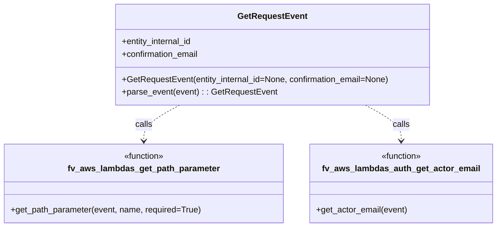

# Diagram: entity_core/entity_service/entity_service/dpu/dpu_service/service/dpu_pickup_confirmation_request.py

> Auto-generated by Obscura crawlers

## Mermaid

> SVG rendering failed for this diagram.
