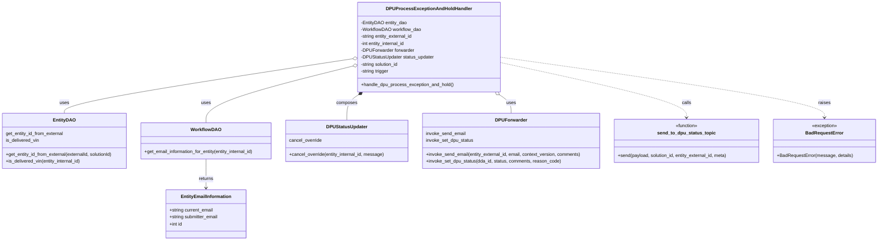

# Diagram: entity_core/entity_service/entity_service/dpu/dpu_service/service/dpu_process_exception_and_hold_handler.py

> Auto-generated by Obscura crawlers

## Mermaid

### SVG

<svg id="container" width="3067.71875" xmlns="http://www.w3.org/2000/svg" class="classDiagram" height="836" viewBox="0 0 3067.71875 836" role="graphics-document document" aria-roledescription="class"><g><defs><marker id="container_class-aggregationStart" class="marker aggregation class" refX="18" refY="7" markerWidth="190" markerHeight="240" orient="auto"><path d="M 18,7 L9,13 L1,7 L9,1 Z"></path></marker></defs><defs><marker id="container_class-aggregationEnd" class="marker aggregation class" refX="1" refY="7" markerWidth="20" markerHeight="28" orient="auto"><path d="M 18,7 L9,13 L1,7 L9,1 Z"></path></marker></defs><defs><marker id="container_class-extensionStart" class="marker extension class" refX="18" refY="7" markerWidth="190" markerHeight="240" orient="auto"><path d="M 1,7 L18,13 V 1 Z"></path></marker></defs><defs><marker id="container_class-extensionEnd" class="marker extension class" refX="1" refY="7" markerWidth="20" markerHeight="28" orient="auto"><path d="M 1,1 V 13 L18,7 Z"></path></marker></defs><defs><marker id="container_class-compositionStart" class="marker composition class" refX="18" refY="7" markerWidth="190" markerHeight="240" orient="auto"><path d="M 18,7 L9,13 L1,7 L9,1 Z"></path></marker></defs><defs><marker id="container_class-compositionEnd" class="marker composition class" refX="1" refY="7" markerWidth="20" markerHeight="28" orient="auto"><path d="M 18,7 L9,13 L1,7 L9,1 Z"></path></marker></defs><defs><marker id="container_class-dependencyStart" class="marker dependency class" refX="6" refY="7" markerWidth="190" markerHeight="240" orient="auto"><path d="M 5,7 L9,13 L1,7 L9,1 Z"></path></marker></defs><defs><marker id="container_class-dependencyEnd" class="marker dependency class" refX="13" refY="7" markerWidth="20" markerHeight="28" orient="auto"><path d="M 18,7 L9,13 L14,7 L9,1 Z"></path></marker></defs><defs><marker id="container_class-lollipopStart" class="marker lollipop class" refX="13" refY="7" markerWidth="190" markerHeight="240" orient="auto"><circle stroke="black" fill="transparent" cx="7" cy="7" r="6"></circle></marker></defs><defs><marker id="container_class-lollipopEnd" class="marker lollipop class" refX="1" refY="7" markerWidth="190" markerHeight="240" orient="auto"><circle stroke="black" fill="transparent" cx="7" cy="7" r="6"></circle></marker></defs><g class="root"><g class="clusters"></g><g class="edgePaths"><path d="M1249.387,203.213L1079.049,228.844C908.711,254.475,568.035,305.738,397.697,337.535C227.359,369.333,227.359,381.667,227.359,387.833L227.359,394" id="id_DPUProcessExceptionAndHoldHandler_EntityDAO_1" class="edge-thickness-normal edge-pattern-solid relation" style=";;;" data-edge="true" data-et="edge" data-id="id_DPUProcessExceptionAndHoldHandler_EntityDAO_1" data-points="W3sieCI6MTI2Ni40NDUzMTI1LCJ5IjoyMDAuNjQ1OTcxMzk2NTUwMDR9LHsieCI6MjI3LjM1OTM3NSwieSI6MzU3fSx7IngiOjIyNy4zNTkzNzUsInkiOjM5NH1d" marker-start="url(#container_class-aggregationStart)"></path><path d="M1249.699,228.303L1162.876,249.753C1076.053,271.202,902.407,314.101,815.585,347.217C728.762,380.333,728.762,403.667,728.762,415.333L728.762,427" id="id_DPUProcessExceptionAndHoldHandler_WorkflowDAO_2" class="edge-thickness-normal edge-pattern-solid relation" style=";;;" data-edge="true" data-et="edge" data-id="id_DPUProcessExceptionAndHoldHandler_WorkflowDAO_2" data-points="W3sieCI6MTI2Ni40NDUzMTI1LCJ5IjoyMjQuMTY1OTk1ODA5ODUzMzR9LHsieCI6NzI4Ljc2MTcxODc1LCJ5IjozNTd9LHsieCI6NzI4Ljc2MTcxODc1LCJ5Ijo0Mjd9XQ==" marker-start="url(#container_class-aggregationStart)"></path><path d="M728.762,553L728.762,564.667C728.762,576.333,728.762,599.667,728.762,616.5C728.762,633.333,728.762,643.667,728.762,648.833L728.762,654" id="id_WorkflowDAO_EntityEmailInformation_3" class="edge-thickness-normal edge-pattern-solid relation" style=";;;" data-edge="true" data-et="edge" data-id="id_WorkflowDAO_EntityEmailInformation_3" data-points="W3sieCI6NzI4Ljc2MTcxODc1LCJ5Ijo1NTN9LHsieCI6NzI4Ljc2MTcxODc1LCJ5Ijo2MjN9LHsieCI6NzI4Ljc2MTcxODc1LCJ5Ijo2NjB9XQ==" marker-end="url(#container_class-dependencyEnd)"></path><path d="M1755.77,329.64L1762.536,334.2C1769.302,338.76,1782.835,347.88,1789.601,358.607C1796.367,369.333,1796.367,381.667,1796.367,387.833L1796.367,394" id="id_DPUProcessExceptionAndHoldHandler_DPUForwarder_4" class="edge-thickness-normal edge-pattern-solid relation" style=";;;" data-edge="true" data-et="edge" data-id="id_DPUProcessExceptionAndHoldHandler_DPUForwarder_4" data-points="W3sieCI6MTc0MS40NjQ3ODMwMzEwODgsInkiOjMyMH0seyJ4IjoxNzk2LjM2NzE4NzUsInkiOjM1N30seyJ4IjoxNzk2LjM2NzE4NzUsInkiOjM5NH1d" marker-start="url(#container_class-aggregationStart)"></path><path d="M1264.199,329.64L1257.433,334.2C1250.667,338.76,1237.134,347.88,1230.368,362.607C1223.602,377.333,1223.602,397.667,1223.602,407.833L1223.602,418" id="id_DPUProcessExceptionAndHoldHandler_DPUStatusUpdater_5" class="edge-thickness-normal edge-pattern-solid relation" style=";;;" data-edge="true" data-et="edge" data-id="id_DPUProcessExceptionAndHoldHandler_DPUStatusUpdater_5" data-points="W3sieCI6MTI3OC41MDM5NjY5Njg5MTIsInkiOjMyMH0seyJ4IjoxMjIzLjYwMTU2MjUsInkiOjM1N30seyJ4IjoxMjIzLjYwMTU2MjUsInkiOjQxOH1d" marker-start="url(#container_class-compositionStart)"></path><path d="M1753.523,216.254L1862.851,239.712C1972.178,263.17,2190.833,310.085,2300.161,342.209C2409.488,374.333,2409.488,391.667,2409.488,400.333L2409.488,409" id="id_DPUProcessExceptionAndHoldHandler_send_to_dpu_status_topic_6" class="edge-thickness-normal edge-pattern-dashed relation" style=";;;" data-edge="true" data-et="edge" data-id="id_DPUProcessExceptionAndHoldHandler_send_to_dpu_status_topic_6" data-points="W3sieCI6MTc1My41MjM0Mzc1LCJ5IjoyMTYuMjU0NDAyMzgzMjU4MTR9LHsieCI6MjQwOS40ODgyODEyNSwieSI6MzU3fSx7IngiOjI0MDkuNDg4MjgxMjUsInkiOjQxNX1d" marker-end="url(#container_class-dependencyEnd)"></path><path d="M1753.523,198.154L1942.299,224.629C2131.076,251.103,2508.628,304.051,2697.404,339.192C2886.18,374.333,2886.18,391.667,2886.18,400.333L2886.18,409" id="id_DPUProcessExceptionAndHoldHandler_BadRequestError_7" class="edge-thickness-normal edge-pattern-dashed relation" style=";;;" data-edge="true" data-et="edge" data-id="id_DPUProcessExceptionAndHoldHandler_BadRequestError_7" data-points="W3sieCI6MTc1My41MjM0Mzc1LCJ5IjoxOTguMTU0MzM3NDIyNTgxNX0seyJ4IjoyODg2LjE3OTY4NzUsInkiOjM1N30seyJ4IjoyODg2LjE3OTY4NzUsInkiOjQxNX1d" marker-end="url(#container_class-dependencyEnd)"></path></g><g class="edgeLabels"><g class="edgeLabel" transform="translate(227.359375, 357)"><g class="label" data-id="id_DPUProcessExceptionAndHoldHandler_EntityDAO_1" transform="translate(-16.4921875, -12)"><foreignObject width="32.984375" height="24">

uses

</foreignObject></g></g><g class="edgeLabel" transform="translate(728.76171875, 357)"><g class="label" data-id="id_DPUProcessExceptionAndHoldHandler_WorkflowDAO_2" transform="translate(-16.4921875, -12)"><foreignObject width="32.984375" height="24">

uses

</foreignObject></g></g><g class="edgeLabel" transform="translate(728.76171875, 623)"><g class="label" data-id="id_WorkflowDAO_EntityEmailInformation_3" transform="translate(-26.265625, -12)"><foreignObject width="52.53125" height="24">

returns

</foreignObject></g></g><g class="edgeLabel" transform="translate(1796.3671875, 357)"><g class="label" data-id="id_DPUProcessExceptionAndHoldHandler_DPUForwarder_4" transform="translate(-16.4921875, -12)"><foreignObject width="32.984375" height="24">

uses

</foreignObject></g></g><g class="edgeLabel" transform="translate(1223.6015625, 357)"><g class="label" data-id="id_DPUProcessExceptionAndHoldHandler_DPUStatusUpdater_5" transform="translate(-36.453125, -12)"><foreignObject width="72.90625" height="24">

composes

</foreignObject></g></g><g class="edgeLabel" transform="translate(2409.48828125, 357)"><g class="label" data-id="id_DPUProcessExceptionAndHoldHandler_send_to_dpu_status_topic_6" transform="translate(-16.4453125, -12)"><foreignObject width="32.890625" height="24">

calls

</foreignObject></g></g><g class="edgeLabel" transform="translate(2886.1796875, 357)"><g class="label" data-id="id_DPUProcessExceptionAndHoldHandler_BadRequestError_7" transform="translate(-21.25, -12)"><foreignObject width="42.5" height="24">

raises

</foreignObject></g></g></g><g class="nodes"><g class="node default" id="classId-DPUProcessExceptionAndHoldHandler-0" transform="translate(1509.984375, 164)"><g class="basic label-container"><path d="M-243.5390625 -156 L243.5390625 -156 L243.5390625 156 L-243.5390625 156" stroke="none" stroke-width="0" fill="#ECECFF" style=""></path><path d="M-243.5390625 -156 C-120.12773730190395 -156, 3.2835878961921026 -156, 243.5390625 -156 M-243.5390625 -156 C-125.97160841070522 -156, -8.40415432141043 -156, 243.5390625 -156 M243.5390625 -156 C243.5390625 -81.38489291903066, 243.5390625 -6.769785838061324, 243.5390625 156 M243.5390625 -156 C243.5390625 -67.0604642282279, 243.5390625 21.8790715435442, 243.5390625 156 M243.5390625 156 C131.4521096966652 156, 19.36515689333038 156, -243.5390625 156 M243.5390625 156 C106.48350734588641 156, -30.572047808227182 156, -243.5390625 156 M-243.5390625 156 C-243.5390625 34.2925253739196, -243.5390625 -87.4149492521608, -243.5390625 -156 M-243.5390625 156 C-243.5390625 65.68756021468612, -243.5390625 -24.62487957062777, -243.5390625 -156" stroke="#9370DB" stroke-width="1.3" fill="none" stroke-dasharray="0 0" style=""></path></g><g class="annotation-group text" transform="translate(0, -132)"></g><g class="label-group text" transform="translate(-139.3125, -132)"><g class="label" style="font-weight: bolder" transform="translate(0,-12)"><foreignObject width="278.625" height="24">

DPUProcessExceptionAndHoldHandler

</foreignObject></g></g><g class="members-group text" transform="translate(-231.5390625, -84)"><g class="label" style="" transform="translate(0,-12)"><foreignObject width="159.640625" height="24">

-EntityDAO entity_dao

</foreignObject></g><g class="label" style="" transform="translate(0,12)"><foreignObject width="208.578125" height="24">

-WorkflowDAO workflow_dao

</foreignObject></g><g class="label" style="" transform="translate(0,36)"><foreignObject width="183.578125" height="24">

-string entity_external_id

</foreignObject></g><g class="label" style="" transform="translate(0,60)"><foreignObject width="159.484375" height="24">

-int entity_internal_id

</foreignObject></g><g class="label" style="" transform="translate(0,84)"><foreignObject width="184.71875" height="24">

-DPUForwarder forwarder

</foreignObject></g><g class="label" style="" transform="translate(0,108)"><foreignObject width="254.828125" height="24">

-DPUStatusUpdater status_updater

</foreignObject></g><g class="label" style="" transform="translate(0,132)"><foreignObject width="134.546875" height="24">

-string solution_id

</foreignObject></g><g class="label" style="" transform="translate(0,156)"><foreignObject width="100.078125" height="24">

-string trigger

</foreignObject></g></g><g class="methods-group text" transform="translate(-231.5390625, 132)"><g class="label" style="" transform="translate(0,-12)"><foreignObject width="323.765625" height="24">

+handle_dpu_process_exception_and_hold()

</foreignObject></g></g><g class="divider" style=""><path d="M-243.5390625 -108 C-112.30089428108224 -108, 18.937273937835528 -108, 243.5390625 -108 M-243.5390625 -108 C-101.18956911808078 -108, 41.159924263838434 -108, 243.5390625 -108" stroke="#9370DB" stroke-width="1.3" fill="none" stroke-dasharray="0 0" style=""></path></g><g class="divider" style=""><path d="M-243.5390625 108 C-105.38871019951912 108, 32.76164210096175 108, 243.5390625 108 M-243.5390625 108 C-97.89954774546356 108, 47.73996700907287 108, 243.5390625 108" stroke="#9370DB" stroke-width="1.3" fill="none" stroke-dasharray="0 0" style=""></path></g></g><g class="node default" id="classId-EntityDAO-1" transform="translate(227.359375, 490)"><g class="basic label-container"><path d="M-219.359375 -96 L219.359375 -96 L219.359375 96 L-219.359375 96" stroke="none" stroke-width="0" fill="#ECECFF" style=""></path><path d="M-219.359375 -96 C-122.78976150592044 -96, -26.220148011840877 -96, 219.359375 -96 M-219.359375 -96 C-47.55474730409287 -96, 124.24988039181426 -96, 219.359375 -96 M219.359375 -96 C219.359375 -41.25460510023013, 219.359375 13.49078979953974, 219.359375 96 M219.359375 -96 C219.359375 -24.20076274074843, 219.359375 47.59847451850314, 219.359375 96 M219.359375 96 C75.2196422050018 96, -68.92009058999639 96, -219.359375 96 M219.359375 96 C105.11144479465774 96, -9.136485410684514 96, -219.359375 96 M-219.359375 96 C-219.359375 42.12574988825803, -219.359375 -11.748500223483944, -219.359375 -96 M-219.359375 96 C-219.359375 29.495106818791584, -219.359375 -37.00978636241683, -219.359375 -96" stroke="#9370DB" stroke-width="1.3" fill="none" stroke-dasharray="0 0" style=""></path></g><g class="annotation-group text" transform="translate(0, -72)"></g><g class="label-group text" transform="translate(-36.578125, -72)"><g class="label" style="font-weight: bolder" transform="translate(0,-12)"><foreignObject width="73.15625" height="24">

EntityDAO

</foreignObject></g></g><g class="members-group text" transform="translate(-207.359375, -24)"><g class="label" style="" transform="translate(0,-12)"><foreignObject width="203.921875" height="24">

get_entity_id_from_external

</foreignObject></g><g class="label" style="" transform="translate(0,12)"><foreignObject width="117.265625" height="24">

is_delivered_vin

</foreignObject></g></g><g class="methods-group text" transform="translate(-207.359375, 48)"><g class="label" style="" transform="translate(0,-12)"><foreignObject width="378.140625" height="24">

+get_entity_id_from_external(externalId, solutionId)

</foreignObject></g><g class="label" style="" transform="translate(0,12)"><foreignObject width="264.75" height="24">

+is_delivered_vin(entity_internal_id)

</foreignObject></g></g><g class="divider" style=""><path d="M-219.359375 -48 C-61.129443244993894 -48, 97.10048851001221 -48, 219.359375 -48 M-219.359375 -48 C-67.94843426375846 -48, 83.46250647248308 -48, 219.359375 -48" stroke="#9370DB" stroke-width="1.3" fill="none" stroke-dasharray="0 0" style=""></path></g><g class="divider" style=""><path d="M-219.359375 24 C-71.08034683876679 24, 77.19868132246643 24, 219.359375 24 M-219.359375 24 C-116.53743928996424 24, -13.71550357992848 24, 219.359375 24" stroke="#9370DB" stroke-width="1.3" fill="none" stroke-dasharray="0 0" style=""></path></g></g><g class="node default" id="classId-WorkflowDAO-2" transform="translate(728.76171875, 490)"><g class="basic label-container"><path d="M-232.04296875 -63 L232.04296875 -63 L232.04296875 63 L-232.04296875 63" stroke="none" stroke-width="0" fill="#ECECFF" style=""></path><path d="M-232.04296875 -63 C-69.1176533400097 -63, 93.80766206998061 -63, 232.04296875 -63 M-232.04296875 -63 C-49.41559505924823 -63, 133.21177863150353 -63, 232.04296875 -63 M232.04296875 -63 C232.04296875 -26.01000832773355, 232.04296875 10.979983344532897, 232.04296875 63 M232.04296875 -63 C232.04296875 -17.833733499399173, 232.04296875 27.332533001201654, 232.04296875 63 M232.04296875 63 C75.93683869020217 63, -80.16929136959567 63, -232.04296875 63 M232.04296875 63 C76.53077737198112 63, -78.98141400603777 63, -232.04296875 63 M-232.04296875 63 C-232.04296875 23.17283337474028, -232.04296875 -16.654333250519443, -232.04296875 -63 M-232.04296875 63 C-232.04296875 13.7565525745756, -232.04296875 -35.4868948508488, -232.04296875 -63" stroke="#9370DB" stroke-width="1.3" fill="none" stroke-dasharray="0 0" style=""></path></g><g class="annotation-group text" transform="translate(0, -39)"></g><g class="label-group text" transform="translate(-49.9609375, -39)"><g class="label" style="font-weight: bolder" transform="translate(0,-12)"><foreignObject width="99.921875" height="24">

WorkflowDAO

</foreignObject></g></g><g class="members-group text" transform="translate(-220.04296875, 9)"></g><g class="methods-group text" transform="translate(-220.04296875, 39)"><g class="label" style="" transform="translate(0,-12)"><foreignObject width="390.125" height="24">

+get_email_information_for_entity(entity_internal_id)

</foreignObject></g></g><g class="divider" style=""><path d="M-232.04296875 -15 C-124.78562738138076 -15, -17.528286012761527 -15, 232.04296875 -15 M-232.04296875 -15 C-86.5669937575814 -15, 58.9089812348372 -15, 232.04296875 -15" stroke="#9370DB" stroke-width="1.3" fill="none" stroke-dasharray="0 0" style=""></path></g><g class="divider" style=""><path d="M-232.04296875 9 C-88.77302324696046 9, 54.496922256079074 9, 232.04296875 9 M-232.04296875 9 C-77.4398976934184 9, 77.1631733631632 9, 232.04296875 9" stroke="#9370DB" stroke-width="1.3" fill="none" stroke-dasharray="0 0" style=""></path></g></g><g class="node default" id="classId-EntityEmailInformation-3" transform="translate(728.76171875, 744)"><g class="basic label-container"><path d="M-140.10546875 -84 L140.10546875 -84 L140.10546875 84 L-140.10546875 84" stroke="none" stroke-width="0" fill="#ECECFF" style=""></path><path d="M-140.10546875 -84 C-64.35651137076542 -84, 11.392446008469165 -84, 140.10546875 -84 M-140.10546875 -84 C-48.5401115431481 -84, 43.0252456637038 -84, 140.10546875 -84 M140.10546875 -84 C140.10546875 -19.604504658112347, 140.10546875 44.790990683775306, 140.10546875 84 M140.10546875 -84 C140.10546875 -31.086636575468646, 140.10546875 21.82672684906271, 140.10546875 84 M140.10546875 84 C75.6147762384808 84, 11.1240837269616 84, -140.10546875 84 M140.10546875 84 C62.61898535309413 84, -14.867498043811736 84, -140.10546875 84 M-140.10546875 84 C-140.10546875 23.035417288495935, -140.10546875 -37.92916542300813, -140.10546875 -84 M-140.10546875 84 C-140.10546875 42.190544369509475, -140.10546875 0.38108873901894924, -140.10546875 -84" stroke="#9370DB" stroke-width="1.3" fill="none" stroke-dasharray="0 0" style=""></path></g><g class="annotation-group text" transform="translate(0, -60)"></g><g class="label-group text" transform="translate(-84.5703125, -60)"><g class="label" style="font-weight: bolder" transform="translate(0,-12)"><foreignObject width="169.140625" height="24">

EntityEmailInformation

</foreignObject></g></g><g class="members-group text" transform="translate(-128.10546875, -12)"><g class="label" style="" transform="translate(0,-12)"><foreignObject width="154.75" height="24">

+string current_email

</foreignObject></g><g class="label" style="" transform="translate(0,12)"><foreignObject width="171.640625" height="24">

+string submitter_email

</foreignObject></g><g class="label" style="" transform="translate(0,36)"><foreignObject width="45.96875" height="24">

+int id

</foreignObject></g></g><g class="methods-group text" transform="translate(-128.10546875, 84)"></g><g class="divider" style=""><path d="M-140.10546875 -36 C-73.52064583155551 -36, -6.935822913111025 -36, 140.10546875 -36 M-140.10546875 -36 C-57.17101199423075 -36, 25.763444761538494 -36, 140.10546875 -36" stroke="#9370DB" stroke-width="1.3" fill="none" stroke-dasharray="0 0" style=""></path></g><g class="divider" style=""><path d="M-140.10546875 60 C-39.058160543557946 60, 61.98914766288411 60, 140.10546875 60 M-140.10546875 60 C-44.26628169121038 60, 51.57290536757924 60, 140.10546875 60" stroke="#9370DB" stroke-width="1.3" fill="none" stroke-dasharray="0 0" style=""></path></g></g><g class="node default" id="classId-DPUStatusUpdater-4" transform="translate(1223.6015625, 490)"><g class="basic label-container"><path d="M-212.796875 -72 L212.796875 -72 L212.796875 72 L-212.796875 72" stroke="none" stroke-width="0" fill="#ECECFF" style=""></path><path d="M-212.796875 -72 C-124.80504366838532 -72, -36.81321233677065 -72, 212.796875 -72 M-212.796875 -72 C-95.95288191144411 -72, 20.89111117711178 -72, 212.796875 -72 M212.796875 -72 C212.796875 -38.50841868096982, 212.796875 -5.016837361939636, 212.796875 72 M212.796875 -72 C212.796875 -16.617461283793553, 212.796875 38.765077432412895, 212.796875 72 M212.796875 72 C110.29302727487227 72, 7.789179549744546 72, -212.796875 72 M212.796875 72 C70.39380156946214 72, -72.00927186107572 72, -212.796875 72 M-212.796875 72 C-212.796875 22.326640122760423, -212.796875 -27.346719754479153, -212.796875 -72 M-212.796875 72 C-212.796875 34.71423428224957, -212.796875 -2.5715314355008587, -212.796875 -72" stroke="#9370DB" stroke-width="1.3" fill="none" stroke-dasharray="0 0" style=""></path></g><g class="annotation-group text" transform="translate(0, -48)"></g><g class="label-group text" transform="translate(-68.390625, -48)"><g class="label" style="font-weight: bolder" transform="translate(0,-12)"><foreignObject width="136.78125" height="24">

DPUStatusUpdater

</foreignObject></g></g><g class="members-group text" transform="translate(-200.796875, 0)"><g class="label" style="" transform="translate(0,-12)"><foreignObject width="115.265625" height="24">

cancel_override

</foreignObject></g></g><g class="methods-group text" transform="translate(-200.796875, 48)"><g class="label" style="" transform="translate(0,-12)"><foreignObject width="333.203125" height="24">

+cancel_override(entity_internal_id, message)

</foreignObject></g></g><g class="divider" style=""><path d="M-212.796875 -24 C-69.70973813691845 -24, 73.37739872616311 -24, 212.796875 -24 M-212.796875 -24 C-101.24633644475811 -24, 10.304202110483772 -24, 212.796875 -24" stroke="#9370DB" stroke-width="1.3" fill="none" stroke-dasharray="0 0" style=""></path></g><g class="divider" style=""><path d="M-212.796875 24 C-65.34185975734988 24, 82.11315548530024 24, 212.796875 24 M-212.796875 24 C-124.30165416337341 24, -35.80643332674683 24, 212.796875 24" stroke="#9370DB" stroke-width="1.3" fill="none" stroke-dasharray="0 0" style=""></path></g></g><g class="node default" id="classId-DPUForwarder-5" transform="translate(1796.3671875, 490)"><g class="basic label-container"><path d="M-309.96875 -96 L309.96875 -96 L309.96875 96 L-309.96875 96" stroke="none" stroke-width="0" fill="#ECECFF" style=""></path><path d="M-309.96875 -96 C-131.77076627489652 -96, 46.42721745020697 -96, 309.96875 -96 M-309.96875 -96 C-89.98836369754409 -96, 129.99202260491182 -96, 309.96875 -96 M309.96875 -96 C309.96875 -39.75088233221316, 309.96875 16.498235335573682, 309.96875 96 M309.96875 -96 C309.96875 -25.368013836745817, 309.96875 45.263972326508366, 309.96875 96 M309.96875 96 C180.8018737710829 96, 51.63499754216582 96, -309.96875 96 M309.96875 96 C133.44658040317785 96, -43.075589193644305 96, -309.96875 96 M-309.96875 96 C-309.96875 37.26423279419773, -309.96875 -21.471534411604537, -309.96875 -96 M-309.96875 96 C-309.96875 51.334476176190975, -309.96875 6.66895235238195, -309.96875 -96" stroke="#9370DB" stroke-width="1.3" fill="none" stroke-dasharray="0 0" style=""></path></g><g class="annotation-group text" transform="translate(0, -72)"></g><g class="label-group text" transform="translate(-52.375, -72)"><g class="label" style="font-weight: bolder" transform="translate(0,-12)"><foreignObject width="104.75" height="24">

DPUForwarder

</foreignObject></g></g><g class="members-group text" transform="translate(-297.96875, -24)"><g class="label" style="" transform="translate(0,-12)"><foreignObject width="139.171875" height="24">

invoke_send_email

</foreignObject></g><g class="label" style="" transform="translate(0,12)"><foreignObject width="166.78125" height="24">

invoke_set_dpu_status

</foreignObject></g></g><g class="methods-group text" transform="translate(-297.96875, 48)"><g class="label" style="" transform="translate(0,-12)"><foreignObject width="543.5625" height="24">

+invoke_send_email(entity_external_id, email, context_version, comments)

</foreignObject></g><g class="label" style="" transform="translate(0,12)"><foreignObject width="471.40625" height="24">

+invoke_set_dpu_status(dda_id, status, comments, reason_code)

</foreignObject></g></g><g class="divider" style=""><path d="M-309.96875 -48 C-166.6568818288293 -48, -23.345013657658626 -48, 309.96875 -48 M-309.96875 -48 C-135.1795311256767 -48, 39.60968774864659 -48, 309.96875 -48" stroke="#9370DB" stroke-width="1.3" fill="none" stroke-dasharray="0 0" style=""></path></g><g class="divider" style=""><path d="M-309.96875 24 C-97.00460254812447 24, 115.95954490375107 24, 309.96875 24 M-309.96875 24 C-156.4700144362867 24, -2.971278872573407 24, 309.96875 24" stroke="#9370DB" stroke-width="1.3" fill="none" stroke-dasharray="0 0" style=""></path></g></g><g class="node default" id="classId-send_to_dpu_status_topic-6" transform="translate(2409.48828125, 490)"><g class="basic label-container"><path d="M-253.15234375 -75 L253.15234375 -75 L253.15234375 75 L-253.15234375 75" stroke="none" stroke-width="0" fill="#ECECFF" style=""></path><path d="M-253.15234375 -75 C-135.56247373305405 -75, -17.97260371610807 -75, 253.15234375 -75 M-253.15234375 -75 C-133.84881270031374 -75, -14.545281650627487 -75, 253.15234375 -75 M253.15234375 -75 C253.15234375 -33.89588113163303, 253.15234375 7.208237736733935, 253.15234375 75 M253.15234375 -75 C253.15234375 -44.1050668068188, 253.15234375 -13.210133613637588, 253.15234375 75 M253.15234375 75 C135.02042144024236 75, 16.888499130484718 75, -253.15234375 75 M253.15234375 75 C60.39453479333537 75, -132.36327416332927 75, -253.15234375 75 M-253.15234375 75 C-253.15234375 19.4611643165397, -253.15234375 -36.0776713669206, -253.15234375 -75 M-253.15234375 75 C-253.15234375 21.806497342793065, -253.15234375 -31.38700531441387, -253.15234375 -75" stroke="#9370DB" stroke-width="1.3" fill="none" stroke-dasharray="0 0" style=""></path></g><g class="annotation-group text" transform="translate(-39.484375, -51)"><g class="label" style="" transform="translate(0,-12)"><foreignObject width="78.96875" height="24">

«function»

</foreignObject></g></g><g class="label-group text" transform="translate(-96.5546875, -27)"><g class="label" style="font-weight: bolder" transform="translate(0,-12)"><foreignObject width="193.109375" height="24">

send_to_dpu_status_topic

</foreignObject></g></g><g class="members-group text" transform="translate(-241.15234375, 21)"></g><g class="methods-group text" transform="translate(-241.15234375, 51)"><g class="label" style="" transform="translate(0,-12)"><foreignObject width="385.75" height="24">

+send(payload, solution_id, entity_external_id, meta)

</foreignObject></g></g><g class="divider" style=""><path d="M-253.15234375 -3 C-107.58827244940136 -3, 37.97579885119728 -3, 253.15234375 -3 M-253.15234375 -3 C-121.37615439782056 -3, 10.400034954358887 -3, 253.15234375 -3" stroke="#9370DB" stroke-width="1.3" fill="none" stroke-dasharray="0 0" style=""></path></g><g class="divider" style=""><path d="M-253.15234375 21 C-74.08131624071342 21, 104.98971126857316 21, 253.15234375 21 M-253.15234375 21 C-132.84069825937897 21, -12.529052768757936 21, 253.15234375 21" stroke="#9370DB" stroke-width="1.3" fill="none" stroke-dasharray="0 0" style=""></path></g></g><g class="node default" id="classId-BadRequestError-7" transform="translate(2886.1796875, 490)"><g class="basic label-container"><path d="M-173.5390625 -75 L173.5390625 -75 L173.5390625 75 L-173.5390625 75" stroke="none" stroke-width="0" fill="#ECECFF" style=""></path><path d="M-173.5390625 -75 C-41.36789382448546 -75, 90.80327485102907 -75, 173.5390625 -75 M-173.5390625 -75 C-90.03019945577132 -75, -6.521336411542649 -75, 173.5390625 -75 M173.5390625 -75 C173.5390625 -21.90296617232959, 173.5390625 31.194067655340817, 173.5390625 75 M173.5390625 -75 C173.5390625 -43.40888668236168, 173.5390625 -11.817773364723358, 173.5390625 75 M173.5390625 75 C60.82230262561076 75, -51.89445724877848 75, -173.5390625 75 M173.5390625 75 C92.53602953501186 75, 11.532996570023727 75, -173.5390625 75 M-173.5390625 75 C-173.5390625 36.87308233843232, -173.5390625 -1.2538353231353625, -173.5390625 -75 M-173.5390625 75 C-173.5390625 19.683322396292525, -173.5390625 -35.63335520741495, -173.5390625 -75" stroke="#9370DB" stroke-width="1.3" fill="none" stroke-dasharray="0 0" style=""></path></g><g class="annotation-group text" transform="translate(-44.3515625, -51)"><g class="label" style="" transform="translate(0,-12)"><foreignObject width="88.703125" height="24">

«exception»

</foreignObject></g></g><g class="label-group text" transform="translate(-62.28125, -27)"><g class="label" style="font-weight: bolder" transform="translate(0,-12)"><foreignObject width="124.5625" height="24">

BadRequestError

</foreignObject></g></g><g class="members-group text" transform="translate(-161.5390625, 21)"></g><g class="methods-group text" transform="translate(-161.5390625, 51)"><g class="label" style="" transform="translate(0,-12)"><foreignObject width="260.796875" height="24">

+BadRequestError(message, details)

</foreignObject></g></g><g class="divider" style=""><path d="M-173.5390625 -3 C-63.37960732370827 -3, 46.77984785258346 -3, 173.5390625 -3 M-173.5390625 -3 C-85.9030785495443 -3, 1.7329054009113918 -3, 173.5390625 -3" stroke="#9370DB" stroke-width="1.3" fill="none" stroke-dasharray="0 0" style=""></path></g><g class="divider" style=""><path d="M-173.5390625 21 C-38.11977769696901 21, 97.29950710606198 21, 173.5390625 21 M-173.5390625 21 C-34.721924272233736 21, 104.09521395553253 21, 173.5390625 21" stroke="#9370DB" stroke-width="1.3" fill="none" stroke-dasharray="0 0" style=""></path></g></g></g></g></g></svg>
