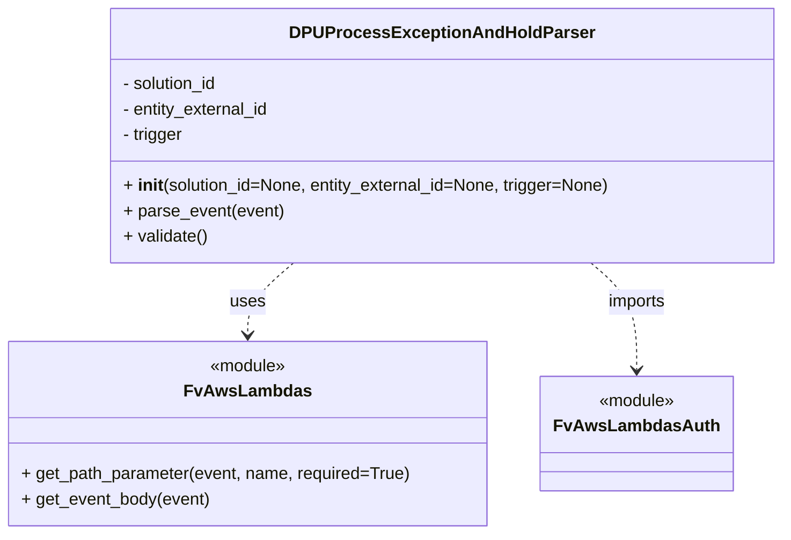

# Diagram: entity_core/entity_service/entity_service/dpu/dpu_service/service/dpu_process_exception_and_hold_parser.py


> Auto-generated by Obscura crawlers

## Diagram 1



### SVG

<svg id="container" width="729.615234375" xmlns="http://www.w3.org/2000/svg" class="classDiagram" height="504" viewBox="0 0 729.615234375 504" role="graphics-document document" aria-roledescription="class"><style>#container{font-family:"trebuchet ms",verdana,arial,sans-serif;font-size:16px;fill:#333;}@keyframes edge-animation-frame{from{stroke-dashoffset:0;}}@keyframes dash{to{stroke-dashoffset:0;}}#container .edge-animation-slow{stroke-dasharray:9,5!important;stroke-dashoffset:900;animation:dash 50s linear infinite;stroke-linecap:round;}#container .edge-animation-fast{stroke-dasharray:9,5!important;stroke-dashoffset:900;animation:dash 20s linear infinite;stroke-linecap:round;}#container .error-icon{fill:#552222;}#container .error-text{fill:#552222;stroke:#552222;}#container .edge-thickness-normal{stroke-width:1px;}#container .edge-thickness-thick{stroke-width:3.5px;}#container .edge-pattern-solid{stroke-dasharray:0;}#container .edge-thickness-invisible{stroke-width:0;fill:none;}#container .edge-pattern-dashed{stroke-dasharray:3;}#container .edge-pattern-dotted{stroke-dasharray:2;}#container .marker{fill:#333333;stroke:#333333;}#container .marker.cross{stroke:#333333;}#container svg{font-family:"trebuchet ms",verdana,arial,sans-serif;font-size:16px;}#container p{margin:0;}#container g.classGroup text{fill:#9370DB;stroke:none;font-family:"trebuchet ms",verdana,arial,sans-serif;font-size:10px;}#container g.classGroup text .title{font-weight:bolder;}#container .nodeLabel,#container .edgeLabel{color:#131300;}#container .edgeLabel .label rect{fill:#ECECFF;}#container .label text{fill:#131300;}#container .labelBkg{background:#ECECFF;}#container .edgeLabel .label span{background:#ECECFF;}#container .classTitle{font-weight:bolder;}#container .node rect,#container .node circle,#container .node ellipse,#container .node polygon,#container .node path{fill:#ECECFF;stroke:#9370DB;stroke-width:1px;}#container .divider{stroke:#9370DB;stroke-width:1;}#container g.clickable{cursor:pointer;}#container g.classGroup rect{fill:#ECECFF;stroke:#9370DB;}#container g.classGroup line{stroke:#9370DB;stroke-width:1;}#container .classLabel .box{stroke:none;stroke-width:0;fill:#ECECFF;opacity:0.5;}#container .classLabel .label{fill:#9370DB;font-size:10px;}#container .relation{stroke:#333333;stroke-width:1;fill:none;}#container .dashed-line{stroke-dasharray:3;}#container .dotted-line{stroke-dasharray:1 2;}#container #compositionStart,#container .composition{fill:#333333!important;stroke:#333333!important;stroke-width:1;}#container #compositionEnd,#container .composition{fill:#333333!important;stroke:#333333!important;stroke-width:1;}#container #dependencyStart,#container .dependency{fill:#333333!important;stroke:#333333!important;stroke-width:1;}#container #dependencyStart,#container .dependency{fill:#333333!important;stroke:#333333!important;stroke-width:1;}#container #extensionStart,#container .extension{fill:transparent!important;stroke:#333333!important;stroke-width:1;}#container #extensionEnd,#container .extension{fill:transparent!important;stroke:#333333!important;stroke-width:1;}#container #aggregationStart,#container .aggregation{fill:transparent!important;stroke:#333333!important;stroke-width:1;}#container #aggregationEnd,#container .aggregation{fill:transparent!important;stroke:#333333!important;stroke-width:1;}#container #lollipopStart,#container .lollipop{fill:#ECECFF!important;stroke:#333333!important;stroke-width:1;}#container #lollipopEnd,#container .lollipop{fill:#ECECFF!important;stroke:#333333!important;stroke-width:1;}#container .edgeTerminals{font-size:11px;line-height:initial;}#container .classTitleText{text-anchor:middle;font-size:18px;fill:#333;}#container .label-icon{display:inline-block;height:1em;overflow:visible;vertical-align:-0.125em;}#container .node .label-icon path{fill:currentColor;stroke:revert;stroke-width:revert;}#container :root{--mermaid-font-family:"trebuchet ms",verdana,arial,sans-serif;}</style><g><defs><marker id="container_class-aggregationStart" class="marker aggregation class" refX="18" refY="7" markerWidth="190" markerHeight="240" orient="auto"><path d="M 18,7 L9,13 L1,7 L9,1 Z"></path></marker></defs><defs><marker id="container_class-aggregationEnd" class="marker aggregation class" refX="1" refY="7" markerWidth="20" markerHeight="28" orient="auto"><path d="M 18,7 L9,13 L1,7 L9,1 Z"></path></marker></defs><defs><marker id="container_class-extensionStart" class="marker extension class" refX="18" refY="7" markerWidth="190" markerHeight="240" orient="auto"><path d="M 1,7 L18,13 V 1 Z"></path></marker></defs><defs><marker id="container_class-extensionEnd" class="marker extension class" refX="1" refY="7" markerWidth="20" markerHeight="28" orient="auto"><path d="M 1,1 V 13 L18,7 Z"></path></marker></defs><defs><marker id="container_class-compositionStart" class="marker composition class" refX="18" refY="7" markerWidth="190" markerHeight="240" orient="auto"><path d="M 18,7 L9,13 L1,7 L9,1 Z"></path></marker></defs><defs><marker id="container_class-compositionEnd" class="marker composition class" refX="1" refY="7" markerWidth="20" markerHeight="28" orient="auto"><path d="M 18,7 L9,13 L1,7 L9,1 Z"></path></marker></defs><defs><marker id="container_class-dependencyStart" class="marker dependency class" refX="6" refY="7" markerWidth="190" markerHeight="240" orient="auto"><path d="M 5,7 L9,13 L1,7 L9,1 Z"></path></marker></defs><defs><marker id="container_class-dependencyEnd" class="marker dependency class" refX="13" refY="7" markerWidth="20" markerHeight="28" orient="auto"><path d="M 18,7 L9,13 L14,7 L9,1 Z"></path></marker></defs><defs><marker id="container_class-lollipopStart" class="marker lollipop class" refX="13" refY="7" markerWidth="190" markerHeight="240" orient="auto"><circle stroke="black" fill="transparent" cx="7" cy="7" r="6"></circle></marker></defs><defs><marker id="container_class-lollipopEnd" class="marker lollipop class" refX="1" refY="7" markerWidth="190" markerHeight="240" orient="auto"><circle stroke="black" fill="transparent" cx="7" cy="7" r="6"></circle></marker></defs><g class="root"><g class="clusters"></g><g class="edgePaths"><path d="M274.293,248L267.256,254.167C260.22,260.333,246.147,272.667,239.111,284C232.074,295.333,232.074,305.667,232.074,310.833L232.074,316" id="id_DPUProcessExceptionAndHoldParser_FvAwsLambdas_1" class="edge-thickness-normal edge-pattern-dashed relation" style=";;;" data-edge="true" data-et="edge" data-id="id_DPUProcessExceptionAndHoldParser_FvAwsLambdas_1" data-points="W3sieCI6Mjc0LjI5MjUzMzMzOTk2ODE0LCJ5IjoyNDh9LHsieCI6MjMyLjA3NDIxODc1LCJ5IjoyODV9LHsieCI6MjMyLjA3NDIxODc1LCJ5IjozMjJ9XQ==" marker-end="url(#container_class-dependencyEnd)"></path><path d="M548.141,248L555.177,254.167C562.214,260.333,576.287,272.667,583.323,289.5C590.359,306.333,590.359,327.667,590.359,338.333L590.359,349" id="id_DPUProcessExceptionAndHoldParser_FvAwsLambdasAuth_2" class="edge-thickness-normal edge-pattern-dashed relation" style=";;;" data-edge="true" data-et="edge" data-id="id_DPUProcessExceptionAndHoldParser_FvAwsLambdasAuth_2" data-points="W3sieCI6NTQ4LjE0MTA2MDQxMDAzMTksInkiOjI0OH0seyJ4Ijo1OTAuMzU5Mzc1LCJ5IjoyODV9LHsieCI6NTkwLjM1OTM3NSwieSI6MzU1fV0=" marker-end="url(#container_class-dependencyEnd)"></path></g><g class="edgeLabels"><g class="edgeLabel" transform="translate(232.07421875, 285)"><g class="label" data-id="id_DPUProcessExceptionAndHoldParser_FvAwsLambdas_1" transform="translate(-16.4921875, -12)"><foreignObject width="32.984375" height="24"><div xmlns="http://www.w3.org/1999/xhtml" class="labelBkg" style="display: table-cell; white-space: nowrap; line-height: 1.5; max-width: 200px; text-align: center;"><span class="edgeLabel"><p>uses</p></span></div></foreignObject></g></g><g class="edgeLabel" transform="translate(590.359375, 285)"><g class="label" data-id="id_DPUProcessExceptionAndHoldParser_FvAwsLambdasAuth_2" transform="translate(-28.25, -12)"><foreignObject width="56.5" height="24"><div xmlns="http://www.w3.org/1999/xhtml" class="labelBkg" style="display: table-cell; white-space: nowrap; line-height: 1.5; max-width: 200px; text-align: center;"><span class="edgeLabel"><p>imports</p></span></div></foreignObject></g></g></g><g class="nodes"><g class="node default" id="classId-DPUProcessExceptionAndHoldParser-0" transform="translate(411.216796875, 128)"><g class="basic label-container"><path d="M-310.3984375 -120 L310.3984375 -120 L310.3984375 120 L-310.3984375 120" stroke="none" stroke-width="0" fill="#ECECFF" style=""></path><path d="M-310.3984375 -120 C-78.6582264721255 -120, 153.081984555749 -120, 310.3984375 -120 M-310.3984375 -120 C-177.22103078865302 -120, -44.04362407730605 -120, 310.3984375 -120 M310.3984375 -120 C310.3984375 -61.98854501977022, 310.3984375 -3.9770900395404425, 310.3984375 120 M310.3984375 -120 C310.3984375 -58.79390457880704, 310.3984375 2.4121908423859253, 310.3984375 120 M310.3984375 120 C72.00829446724546 120, -166.38184856550907 120, -310.3984375 120 M310.3984375 120 C73.19843223808024 120, -164.0015730238395 120, -310.3984375 120 M-310.3984375 120 C-310.3984375 62.63970297491326, -310.3984375 5.279405949826526, -310.3984375 -120 M-310.3984375 120 C-310.3984375 49.96202303425781, -310.3984375 -20.075953931484378, -310.3984375 -120" stroke="#9370DB" stroke-width="1.3" fill="none" stroke-dasharray="0 0" style=""></path></g><g class="annotation-group text" transform="translate(0, -96)"></g><g class="label-group text" transform="translate(-133.59375, -96)"><g class="label" style="font-weight: bolder" transform="translate(0,-12)"><foreignObject width="267.1875" height="24"><div xmlns="http://www.w3.org/1999/xhtml" style="display: table-cell; white-space: nowrap; line-height: 1.5; max-width: 315px; text-align: center;"><span class="nodeLabel markdown-node-label" style=""><p>DPUProcessExceptionAndHoldParser</p></span></div></foreignObject></g></g><g class="members-group text" transform="translate(-298.3984375, -48)"><g class="label" style="" transform="translate(0,-12)"><foreignObject width="92.921875" height="24"><div xmlns="http://www.w3.org/1999/xhtml" style="display: table-cell; white-space: nowrap; line-height: 1.5; max-width: 150px; text-align: center;"><span class="nodeLabel markdown-node-label" style=""><p>- solution_id</p></span></div></foreignObject></g><g class="label" style="" transform="translate(0,12)"><foreignObject width="141.9375" height="24"><div xmlns="http://www.w3.org/1999/xhtml" style="display: table-cell; white-space: nowrap; line-height: 1.5; max-width: 199px; text-align: center;"><span class="nodeLabel markdown-node-label" style=""><p>- entity_external_id</p></span></div></foreignObject></g><g class="label" style="" transform="translate(0,36)"><foreignObject width="58.4375" height="24"><div xmlns="http://www.w3.org/1999/xhtml" style="display: table-cell; white-space: nowrap; line-height: 1.5; max-width: 117px; text-align: center;"><span class="nodeLabel markdown-node-label" style=""><p>- trigger</p></span></div></foreignObject></g></g><g class="methods-group text" transform="translate(-298.3984375, 48)"><g class="label" style="" transform="translate(0,-12)"><foreignObject width="463.203125" height="24"><div xmlns="http://www.w3.org/1999/xhtml" style="display: table-cell; white-space: nowrap; line-height: 1.5; max-width: 553px; text-align: center;"><span class="nodeLabel markdown-node-label" style=""><p>+ <strong>init</strong>(solution_id=None, entity_external_id=None, trigger=None)</p></span></div></foreignObject></g><g class="label" style="" transform="translate(0,12)"><foreignObject width="151.125" height="24"><div xmlns="http://www.w3.org/1999/xhtml" style="display: table-cell; white-space: nowrap; line-height: 1.5; max-width: 208px; text-align: center;"><span class="nodeLabel markdown-node-label" style=""><p>+ parse_event(event)</p></span></div></foreignObject></g><g class="label" style="" transform="translate(0,36)"><foreignObject width="80.484375" height="24"><div xmlns="http://www.w3.org/1999/xhtml" style="display: table-cell; white-space: nowrap; line-height: 1.5; max-width: 138px; text-align: center;"><span class="nodeLabel markdown-node-label" style=""><p>+ validate()</p></span></div></foreignObject></g></g><g class="divider" style=""><path d="M-310.3984375 -72 C-94.2154890359549 -72, 121.9674594280902 -72, 310.3984375 -72 M-310.3984375 -72 C-67.56814062891277 -72, 175.26215624217446 -72, 310.3984375 -72" stroke="#9370DB" stroke-width="1.3" fill="none" stroke-dasharray="0 0" style=""></path></g><g class="divider" style=""><path d="M-310.3984375 24 C-71.12667583562691 24, 168.14508582874618 24, 310.3984375 24 M-310.3984375 24 C-76.28152071070707 24, 157.83539607858586 24, 310.3984375 24" stroke="#9370DB" stroke-width="1.3" fill="none" stroke-dasharray="0 0" style=""></path></g></g><g class="node default" id="classId-FvAwsLambdas-1" transform="translate(232.07421875, 409)"><g class="basic label-container"><path d="M-224.07421875 -87 L224.07421875 -87 L224.07421875 87 L-224.07421875 87" stroke="none" stroke-width="0" fill="#ECECFF" style=""></path><path d="M-224.07421875 -87 C-128.23791800842355 -87, -32.40161726684707 -87, 224.07421875 -87 M-224.07421875 -87 C-119.67188461754573 -87, -15.269550485091457 -87, 224.07421875 -87 M224.07421875 -87 C224.07421875 -38.30662185627623, 224.07421875 10.38675628744754, 224.07421875 87 M224.07421875 -87 C224.07421875 -50.65266048634283, 224.07421875 -14.305320972685664, 224.07421875 87 M224.07421875 87 C118.88541563839114 87, 13.696612526782275 87, -224.07421875 87 M224.07421875 87 C106.48288711874952 87, -11.108444512500967 87, -224.07421875 87 M-224.07421875 87 C-224.07421875 36.94935146970245, -224.07421875 -13.101297060595101, -224.07421875 -87 M-224.07421875 87 C-224.07421875 21.169219905708246, -224.07421875 -44.66156018858351, -224.07421875 -87" stroke="#9370DB" stroke-width="1.3" fill="none" stroke-dasharray="0 0" style=""></path></g><g class="annotation-group text" transform="translate(-36.6015625, -63)"><g class="label" style="" transform="translate(0,-12)"><foreignObject width="73.203125" height="24"><div xmlns="http://www.w3.org/1999/xhtml" style="display: table-cell; white-space: nowrap; line-height: 1.5; max-width: 123px; text-align: center;"><span class="nodeLabel markdown-node-label" style=""><p>«module»</p></span></div></foreignObject></g></g><g class="label-group text" transform="translate(-55.2109375, -39)"><g class="label" style="font-weight: bolder" transform="translate(0,-12)"><foreignObject width="110.421875" height="24"><div xmlns="http://www.w3.org/1999/xhtml" style="display: table-cell; white-space: nowrap; line-height: 1.5; max-width: 159px; text-align: center;"><span class="nodeLabel markdown-node-label" style=""><p>FvAwsLambdas</p></span></div></foreignObject></g></g><g class="members-group text" transform="translate(-212.07421875, 9)"></g><g class="methods-group text" transform="translate(-212.07421875, 39)"><g class="label" style="" transform="translate(0,-12)"><foreignObject width="368.9375" height="24"><div xmlns="http://www.w3.org/1999/xhtml" style="display: table-cell; white-space: nowrap; line-height: 1.5; max-width: 426px; text-align: center;"><span class="nodeLabel markdown-node-label" style=""><p>+ get_path_parameter(event, name, required=True)</p></span></div></foreignObject></g><g class="label" style="" transform="translate(0,12)"><foreignObject width="178.4375" height="24"><div xmlns="http://www.w3.org/1999/xhtml" style="display: table-cell; white-space: nowrap; line-height: 1.5; max-width: 236px; text-align: center;"><span class="nodeLabel markdown-node-label" style=""><p>+ get_event_body(event)</p></span></div></foreignObject></g></g><g class="divider" style=""><path d="M-224.07421875 -15 C-76.15882088439648 -15, 71.75657698120705 -15, 224.07421875 -15 M-224.07421875 -15 C-79.78273666985768 -15, 64.50874541028463 -15, 224.07421875 -15" stroke="#9370DB" stroke-width="1.3" fill="none" stroke-dasharray="0 0" style=""></path></g><g class="divider" style=""><path d="M-224.07421875 9 C-125.20048011557351 9, -26.326741481147025 9, 224.07421875 9 M-224.07421875 9 C-100.08877687857184 9, 23.89666499285633 9, 224.07421875 9" stroke="#9370DB" stroke-width="1.3" fill="none" stroke-dasharray="0 0" style=""></path></g></g><g class="node default" id="classId-FvAwsLambdasAuth-2" transform="translate(590.359375, 409)"><g class="basic label-container"><path d="M-84.2109375 -54 L84.2109375 -54 L84.2109375 54 L-84.2109375 54" stroke="none" stroke-width="0" fill="#ECECFF" style=""></path><path d="M-84.2109375 -54 C-26.642237521642606 -54, 30.926462456714788 -54, 84.2109375 -54 M-84.2109375 -54 C-48.57134425812957 -54, -12.931751016259142 -54, 84.2109375 -54 M84.2109375 -54 C84.2109375 -21.591712798277378, 84.2109375 10.816574403445244, 84.2109375 54 M84.2109375 -54 C84.2109375 -11.319900270289402, 84.2109375 31.360199459421196, 84.2109375 54 M84.2109375 54 C50.06492947019164 54, 15.918921440383286 54, -84.2109375 54 M84.2109375 54 C24.5214513441086 54, -35.1680348117828 54, -84.2109375 54 M-84.2109375 54 C-84.2109375 25.726670628933316, -84.2109375 -2.546658742133367, -84.2109375 -54 M-84.2109375 54 C-84.2109375 29.468744607124346, -84.2109375 4.937489214248693, -84.2109375 -54" stroke="#9370DB" stroke-width="1.3" fill="none" stroke-dasharray="0 0" style=""></path></g><g class="annotation-group text" transform="translate(-36.6015625, -30)"><g class="label" style="" transform="translate(0,-12)"><foreignObject width="73.203125" height="24"><div xmlns="http://www.w3.org/1999/xhtml" style="display: table-cell; white-space: nowrap; line-height: 1.5; max-width: 123px; text-align: center;"><span class="nodeLabel markdown-node-label" style=""><p>«module»</p></span></div></foreignObject></g></g><g class="label-group text" transform="translate(-72.2109375, -6)"><g class="label" style="font-weight: bolder" transform="translate(0,-12)"><foreignObject width="144.421875" height="24"><div xmlns="http://www.w3.org/1999/xhtml" style="display: table-cell; white-space: nowrap; line-height: 1.5; max-width: 192px; text-align: center;"><span class="nodeLabel markdown-node-label" style=""><p>FvAwsLambdasAuth</p></span></div></foreignObject></g></g><g class="members-group text" transform="translate(-72.2109375, 42)"></g><g class="methods-group text" transform="translate(-72.2109375, 72)"></g><g class="divider" style=""><path d="M-84.2109375 18 C-20.25244591261226 18, 43.70604567477548 18, 84.2109375 18 M-84.2109375 18 C-41.25558427969683 18, 1.699768940606333 18, 84.2109375 18" stroke="#9370DB" stroke-width="1.3" fill="none" stroke-dasharray="0 0" style=""></path></g><g class="divider" style=""><path d="M-84.2109375 36 C-43.08629223510837 36, -1.9616469702167336 36, 84.2109375 36 M-84.2109375 36 C-49.238018721831516 36, -14.265099943663031 36, 84.2109375 36" stroke="#9370DB" stroke-width="1.3" fill="none" stroke-dasharray="0 0" style=""></path></g></g></g></g></g></svg>

## Diagram 2

```mermaid
flowchart TD
Start([Lambda event received]) --> G(get_path_parameter(event, "entity_id", required=True))
Start --> H(get_path_parameter(event, "solution_id", required=True))
Start --> I(get_event_body(event))
I --> J(get_event_body(event).get("trigger",""))
G --> K[Create DPUProcessExceptionAndHoldParser instance]
H --> K
J --> K
K --> L[Instance: DPUProcessExceptionAndHoldParser]
L --> M[call validate()]
```

> SVG rendering failed for this diagram.
