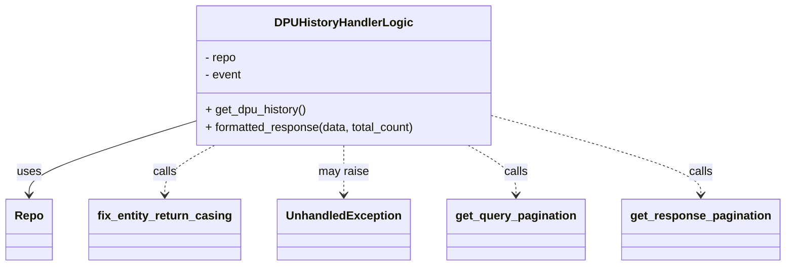

# Diagram: entity_core/entity_service/entity_service/dpu/dpu_service/service/dpu_state_change_history_handler.py


> Auto-generated by Obscura crawlers

## Diagram 1



### SVG

<svg id="container" width="1047.046875" xmlns="http://www.w3.org/2000/svg" class="classDiagram" height="366" viewBox="0 0 1047.046875 366" role="graphics-document document" aria-roledescription="class"><style>#container{font-family:"trebuchet ms",verdana,arial,sans-serif;font-size:16px;fill:#333;}@keyframes edge-animation-frame{from{stroke-dashoffset:0;}}@keyframes dash{to{stroke-dashoffset:0;}}#container .edge-animation-slow{stroke-dasharray:9,5!important;stroke-dashoffset:900;animation:dash 50s linear infinite;stroke-linecap:round;}#container .edge-animation-fast{stroke-dasharray:9,5!important;stroke-dashoffset:900;animation:dash 20s linear infinite;stroke-linecap:round;}#container .error-icon{fill:#552222;}#container .error-text{fill:#552222;stroke:#552222;}#container .edge-thickness-normal{stroke-width:1px;}#container .edge-thickness-thick{stroke-width:3.5px;}#container .edge-pattern-solid{stroke-dasharray:0;}#container .edge-thickness-invisible{stroke-width:0;fill:none;}#container .edge-pattern-dashed{stroke-dasharray:3;}#container .edge-pattern-dotted{stroke-dasharray:2;}#container .marker{fill:#333333;stroke:#333333;}#container .marker.cross{stroke:#333333;}#container svg{font-family:"trebuchet ms",verdana,arial,sans-serif;font-size:16px;}#container p{margin:0;}#container g.classGroup text{fill:#9370DB;stroke:none;font-family:"trebuchet ms",verdana,arial,sans-serif;font-size:10px;}#container g.classGroup text .title{font-weight:bolder;}#container .nodeLabel,#container .edgeLabel{color:#131300;}#container .edgeLabel .label rect{fill:#ECECFF;}#container .label text{fill:#131300;}#container .labelBkg{background:#ECECFF;}#container .edgeLabel .label span{background:#ECECFF;}#container .classTitle{font-weight:bolder;}#container .node rect,#container .node circle,#container .node ellipse,#container .node polygon,#container .node path{fill:#ECECFF;stroke:#9370DB;stroke-width:1px;}#container .divider{stroke:#9370DB;stroke-width:1;}#container g.clickable{cursor:pointer;}#container g.classGroup rect{fill:#ECECFF;stroke:#9370DB;}#container g.classGroup line{stroke:#9370DB;stroke-width:1;}#container .classLabel .box{stroke:none;stroke-width:0;fill:#ECECFF;opacity:0.5;}#container .classLabel .label{fill:#9370DB;font-size:10px;}#container .relation{stroke:#333333;stroke-width:1;fill:none;}#container .dashed-line{stroke-dasharray:3;}#container .dotted-line{stroke-dasharray:1 2;}#container #compositionStart,#container .composition{fill:#333333!important;stroke:#333333!important;stroke-width:1;}#container #compositionEnd,#container .composition{fill:#333333!important;stroke:#333333!important;stroke-width:1;}#container #dependencyStart,#container .dependency{fill:#333333!important;stroke:#333333!important;stroke-width:1;}#container #dependencyStart,#container .dependency{fill:#333333!important;stroke:#333333!important;stroke-width:1;}#container #extensionStart,#container .extension{fill:transparent!important;stroke:#333333!important;stroke-width:1;}#container #extensionEnd,#container .extension{fill:transparent!important;stroke:#333333!important;stroke-width:1;}#container #aggregationStart,#container .aggregation{fill:transparent!important;stroke:#333333!important;stroke-width:1;}#container #aggregationEnd,#container .aggregation{fill:transparent!important;stroke:#333333!important;stroke-width:1;}#container #lollipopStart,#container .lollipop{fill:#ECECFF!important;stroke:#333333!important;stroke-width:1;}#container #lollipopEnd,#container .lollipop{fill:#ECECFF!important;stroke:#333333!important;stroke-width:1;}#container .edgeTerminals{font-size:11px;line-height:initial;}#container .classTitleText{text-anchor:middle;font-size:18px;fill:#333;}#container .label-icon{display:inline-block;height:1em;overflow:visible;vertical-align:-0.125em;}#container .node .label-icon path{fill:currentColor;stroke:revert;stroke-width:revert;}#container :root{--mermaid-font-family:"trebuchet ms",verdana,arial,sans-serif;}</style><g><defs><marker id="container_class-aggregationStart" class="marker aggregation class" refX="18" refY="7" markerWidth="190" markerHeight="240" orient="auto"><path d="M 18,7 L9,13 L1,7 L9,1 Z"></path></marker></defs><defs><marker id="container_class-aggregationEnd" class="marker aggregation class" refX="1" refY="7" markerWidth="20" markerHeight="28" orient="auto"><path d="M 18,7 L9,13 L1,7 L9,1 Z"></path></marker></defs><defs><marker id="container_class-extensionStart" class="marker extension class" refX="18" refY="7" markerWidth="190" markerHeight="240" orient="auto"><path d="M 1,7 L18,13 V 1 Z"></path></marker></defs><defs><marker id="container_class-extensionEnd" class="marker extension class" refX="1" refY="7" markerWidth="20" markerHeight="28" orient="auto"><path d="M 1,1 V 13 L18,7 Z"></path></marker></defs><defs><marker id="container_class-compositionStart" class="marker composition class" refX="18" refY="7" markerWidth="190" markerHeight="240" orient="auto"><path d="M 18,7 L9,13 L1,7 L9,1 Z"></path></marker></defs><defs><marker id="container_class-compositionEnd" class="marker composition class" refX="1" refY="7" markerWidth="20" markerHeight="28" orient="auto"><path d="M 18,7 L9,13 L1,7 L9,1 Z"></path></marker></defs><defs><marker id="container_class-dependencyStart" class="marker dependency class" refX="6" refY="7" markerWidth="190" markerHeight="240" orient="auto"><path d="M 5,7 L9,13 L1,7 L9,1 Z"></path></marker></defs><defs><marker id="container_class-dependencyEnd" class="marker dependency class" refX="13" refY="7" markerWidth="20" markerHeight="28" orient="auto"><path d="M 18,7 L9,13 L14,7 L9,1 Z"></path></marker></defs><defs><marker id="container_class-lollipopStart" class="marker lollipop class" refX="13" refY="7" markerWidth="190" markerHeight="240" orient="auto"><circle stroke="black" fill="transparent" cx="7" cy="7" r="6"></circle></marker></defs><defs><marker id="container_class-lollipopEnd" class="marker lollipop class" refX="1" refY="7" markerWidth="190" markerHeight="240" orient="auto"><circle stroke="black" fill="transparent" cx="7" cy="7" r="6"></circle></marker></defs><g class="root"><g class="clusters"></g><g class="edgePaths"><path d="M254.078,168.644L218.18,180.037C182.281,191.429,110.484,214.215,74.586,230.774C38.688,247.333,38.688,257.667,38.688,262.833L38.688,268" id="id_DPUHistoryHandlerLogic_Repo_1" class="edge-thickness-normal edge-pattern-solid relation" style=";;;" data-edge="true" data-et="edge" data-id="id_DPUHistoryHandlerLogic_Repo_1" data-points="W3sieCI6MjU0LjA3ODEyNSwieSI6MTY4LjY0NDIwMzM0NDMzMTk3fSx7IngiOjM4LjY4NzUsInkiOjIzN30seyJ4IjozOC42ODc1LCJ5IjoyNzR9XQ==" marker-end="url(#container_class-dependencyEnd)"></path><path d="M286.023,200L274.991,206.167C263.958,212.333,241.893,224.667,230.861,236C219.828,247.333,219.828,257.667,219.828,262.833L219.828,268" id="id_DPUHistoryHandlerLogic_fix_entity_return_casing_2" class="edge-thickness-normal edge-pattern-dashed relation" style=";;;" data-edge="true" data-et="edge" data-id="id_DPUHistoryHandlerLogic_fix_entity_return_casing_2" data-points="W3sieCI6Mjg2LjAyMzQzNzUsInkiOjIwMH0seyJ4IjoyMTkuODI4MTI1LCJ5IjoyMzd9LHsieCI6MjE5LjgyODEyNSwieSI6Mjc0fV0=" marker-end="url(#container_class-dependencyEnd)"></path><path d="M457.773,200L457.773,206.167C457.773,212.333,457.773,224.667,457.773,236C457.773,247.333,457.773,257.667,457.773,262.833L457.773,268" id="id_DPUHistoryHandlerLogic_UnhandledException_3" class="edge-thickness-normal edge-pattern-dashed relation" style=";;;" data-edge="true" data-et="edge" data-id="id_DPUHistoryHandlerLogic_UnhandledException_3" data-points="W3sieCI6NDU3Ljc3MzQzNzUsInkiOjIwMH0seyJ4Ijo0NTcuNzczNDM3NSwieSI6MjM3fSx7IngiOjQ1Ny43NzM0Mzc1LCJ5IjoyNzR9XQ==" marker-end="url(#container_class-dependencyEnd)"></path><path d="M623.495,200L634.141,206.167C644.786,212.333,666.077,224.667,676.722,236C687.367,247.333,687.367,257.667,687.367,262.833L687.367,268" id="id_DPUHistoryHandlerLogic_get_query_pagination_4" class="edge-thickness-normal edge-pattern-dashed relation" style=";;;" data-edge="true" data-et="edge" data-id="id_DPUHistoryHandlerLogic_get_query_pagination_4" data-points="W3sieCI6NjIzLjQ5NTI0MjAxMTI3ODIsInkiOjIwMH0seyJ4Ijo2ODcuMzY3MTg3NSwieSI6MjM3fSx7IngiOjY4Ny4zNjcxODc1LCJ5IjoyNzR9XQ==" marker-end="url(#container_class-dependencyEnd)"></path><path d="M661.469,160.857L706.934,173.548C752.398,186.238,843.328,211.619,888.793,229.476C934.258,247.333,934.258,257.667,934.258,262.833L934.258,268" id="id_DPUHistoryHandlerLogic_get_response_pagination_5" class="edge-thickness-normal edge-pattern-dashed relation" style=";;;" data-edge="true" data-et="edge" data-id="id_DPUHistoryHandlerLogic_get_response_pagination_5" data-points="W3sieCI6NjYxLjQ2ODc1LCJ5IjoxNjAuODU3MDA5MzQ1Nzk0Mzh9LHsieCI6OTM0LjI1NzgxMjUsInkiOjIzN30seyJ4Ijo5MzQuMjU3ODEyNSwieSI6Mjc0fV0=" marker-end="url(#container_class-dependencyEnd)"></path></g><g class="edgeLabels"><g class="edgeLabel" transform="translate(38.6875, 237)"><g class="label" data-id="id_DPUHistoryHandlerLogic_Repo_1" transform="translate(-16.4921875, -12)"><foreignObject width="32.984375" height="24"><div xmlns="http://www.w3.org/1999/xhtml" class="labelBkg" style="display: table-cell; white-space: nowrap; line-height: 1.5; max-width: 200px; text-align: center;"><span class="edgeLabel"><p>uses</p></span></div></foreignObject></g></g><g class="edgeLabel" transform="translate(219.828125, 237)"><g class="label" data-id="id_DPUHistoryHandlerLogic_fix_entity_return_casing_2" transform="translate(-16.4453125, -12)"><foreignObject width="32.890625" height="24"><div xmlns="http://www.w3.org/1999/xhtml" class="labelBkg" style="display: table-cell; white-space: nowrap; line-height: 1.5; max-width: 200px; text-align: center;"><span class="edgeLabel"><p>calls</p></span></div></foreignObject></g></g><g class="edgeLabel" transform="translate(457.7734375, 237)"><g class="label" data-id="id_DPUHistoryHandlerLogic_UnhandledException_3" transform="translate(-34.65625, -12)"><foreignObject width="69.3125" height="24"><div xmlns="http://www.w3.org/1999/xhtml" class="labelBkg" style="display: table-cell; white-space: nowrap; line-height: 1.5; max-width: 200px; text-align: center;"><span class="edgeLabel"><p>may raise</p></span></div></foreignObject></g></g><g class="edgeLabel" transform="translate(687.3671875, 237)"><g class="label" data-id="id_DPUHistoryHandlerLogic_get_query_pagination_4" transform="translate(-16.4453125, -12)"><foreignObject width="32.890625" height="24"><div xmlns="http://www.w3.org/1999/xhtml" class="labelBkg" style="display: table-cell; white-space: nowrap; line-height: 1.5; max-width: 200px; text-align: center;"><span class="edgeLabel"><p>calls</p></span></div></foreignObject></g></g><g class="edgeLabel" transform="translate(934.2578125, 237)"><g class="label" data-id="id_DPUHistoryHandlerLogic_get_response_pagination_5" transform="translate(-16.4453125, -12)"><foreignObject width="32.890625" height="24"><div xmlns="http://www.w3.org/1999/xhtml" class="labelBkg" style="display: table-cell; white-space: nowrap; line-height: 1.5; max-width: 200px; text-align: center;"><span class="edgeLabel"><p>calls</p></span></div></foreignObject></g></g></g><g class="nodes"><g class="node default" id="classId-DPUHistoryHandlerLogic-0" transform="translate(457.7734375, 104)"><g class="basic label-container"><path d="M-203.6953125 -96 L203.6953125 -96 L203.6953125 96 L-203.6953125 96" stroke="none" stroke-width="0" fill="#ECECFF" style=""></path><path d="M-203.6953125 -96 C-113.91456742724135 -96, -24.133822354482703 -96, 203.6953125 -96 M-203.6953125 -96 C-101.04438897001499 -96, 1.6065345599700152 -96, 203.6953125 -96 M203.6953125 -96 C203.6953125 -34.06651441835229, 203.6953125 27.866971163295418, 203.6953125 96 M203.6953125 -96 C203.6953125 -34.02460866308374, 203.6953125 27.95078267383252, 203.6953125 96 M203.6953125 96 C46.59611718143964 96, -110.50307813712072 96, -203.6953125 96 M203.6953125 96 C80.94366699917546 96, -41.807978501649075 96, -203.6953125 96 M-203.6953125 96 C-203.6953125 44.52584035408708, -203.6953125 -6.94831929182584, -203.6953125 -96 M-203.6953125 96 C-203.6953125 53.62057126627, -203.6953125 11.241142532539996, -203.6953125 -96" stroke="#9370DB" stroke-width="1.3" fill="none" stroke-dasharray="0 0" style=""></path></g><g class="annotation-group text" transform="translate(0, -72)"></g><g class="label-group text" transform="translate(-89.796875, -72)"><g class="label" style="font-weight: bolder" transform="translate(0,-12)"><foreignObject width="179.59375" height="24"><div xmlns="http://www.w3.org/1999/xhtml" style="display: table-cell; white-space: nowrap; line-height: 1.5; max-width: 228px; text-align: center;"><span class="nodeLabel markdown-node-label" style=""><p>DPUHistoryHandlerLogic</p></span></div></foreignObject></g></g><g class="members-group text" transform="translate(-191.6953125, -24)"><g class="label" style="" transform="translate(0,-12)"><foreignObject width="43.953125" height="24"><div xmlns="http://www.w3.org/1999/xhtml" style="display: table-cell; white-space: nowrap; line-height: 1.5; max-width: 101px; text-align: center;"><span class="nodeLabel markdown-node-label" style=""><p>- repo</p></span></div></foreignObject></g><g class="label" style="" transform="translate(0,12)"><foreignObject width="51.03125" height="24"><div xmlns="http://www.w3.org/1999/xhtml" style="display: table-cell; white-space: nowrap; line-height: 1.5; max-width: 109px; text-align: center;"><span class="nodeLabel markdown-node-label" style=""><p>- event</p></span></div></foreignObject></g></g><g class="methods-group text" transform="translate(-191.6953125, 48)"><g class="label" style="" transform="translate(0,-12)"><foreignObject width="140.15625" height="24"><div xmlns="http://www.w3.org/1999/xhtml" style="display: table-cell; white-space: nowrap; line-height: 1.5; max-width: 198px; text-align: center;"><span class="nodeLabel markdown-node-label" style=""><p>+ get_dpu_history()</p></span></div></foreignObject></g><g class="label" style="" transform="translate(0,12)"><foreignObject width="293.59375" height="24"><div xmlns="http://www.w3.org/1999/xhtml" style="display: table-cell; white-space: nowrap; line-height: 1.5; max-width: 351px; text-align: center;"><span class="nodeLabel markdown-node-label" style=""><p>+ formatted_response(data, total_count)</p></span></div></foreignObject></g></g><g class="divider" style=""><path d="M-203.6953125 -48 C-67.39697432744413 -48, 68.90136384511175 -48, 203.6953125 -48 M-203.6953125 -48 C-118.14998157726185 -48, -32.60465065452371 -48, 203.6953125 -48" stroke="#9370DB" stroke-width="1.3" fill="none" stroke-dasharray="0 0" style=""></path></g><g class="divider" style=""><path d="M-203.6953125 24 C-97.91387420368385 24, 7.867564092632307 24, 203.6953125 24 M-203.6953125 24 C-70.96369109154426 24, 61.767930316911475 24, 203.6953125 24" stroke="#9370DB" stroke-width="1.3" fill="none" stroke-dasharray="0 0" style=""></path></g></g><g class="node default" id="classId-Repo-1" transform="translate(38.6875, 316)"><g class="basic label-container"><path d="M-30.6875 -42 L30.6875 -42 L30.6875 42 L-30.6875 42" stroke="none" stroke-width="0" fill="#ECECFF" style=""></path><path d="M-30.6875 -42 C-6.4439439318193905 -42, 17.79961213636122 -42, 30.6875 -42 M-30.6875 -42 C-6.242605472143509 -42, 18.20228905571298 -42, 30.6875 -42 M30.6875 -42 C30.6875 -8.795207430608158, 30.6875 24.409585138783683, 30.6875 42 M30.6875 -42 C30.6875 -17.67347701950009, 30.6875 6.653045960999819, 30.6875 42 M30.6875 42 C15.989213895803594 42, 1.2909277916071886 42, -30.6875 42 M30.6875 42 C9.887612281230545 42, -10.91227543753891 42, -30.6875 42 M-30.6875 42 C-30.6875 9.525744535373292, -30.6875 -22.948510929253416, -30.6875 -42 M-30.6875 42 C-30.6875 24.958501026048275, -30.6875 7.917002052096549, -30.6875 -42" stroke="#9370DB" stroke-width="1.3" fill="none" stroke-dasharray="0 0" style=""></path></g><g class="annotation-group text" transform="translate(0, -18)"></g><g class="label-group text" transform="translate(-18.6875, -18)"><g class="label" style="font-weight: bolder" transform="translate(0,-12)"><foreignObject width="37.375" height="24"><div xmlns="http://www.w3.org/1999/xhtml" style="display: table-cell; white-space: nowrap; line-height: 1.5; max-width: 87px; text-align: center;"><span class="nodeLabel markdown-node-label" style=""><p>Repo</p></span></div></foreignObject></g></g><g class="members-group text" transform="translate(-18.6875, 30)"></g><g class="methods-group text" transform="translate(-18.6875, 60)"></g><g class="divider" style=""><path d="M-30.6875 6 C-6.511071599386977 6, 17.665356801226046 6, 30.6875 6 M-30.6875 6 C-16.74617986170088 6, -2.8048597234017656 6, 30.6875 6" stroke="#9370DB" stroke-width="1.3" fill="none" stroke-dasharray="0 0" style=""></path></g><g class="divider" style=""><path d="M-30.6875 24 C-11.211124426275596 24, 8.265251147448808 24, 30.6875 24 M-30.6875 24 C-14.02257886101189 24, 2.642342277976219 24, 30.6875 24" stroke="#9370DB" stroke-width="1.3" fill="none" stroke-dasharray="0 0" style=""></path></g></g><g class="node default" id="classId-fix_entity_return_casing-2" transform="translate(219.828125, 316)"><g class="basic label-container"><path d="M-100.453125 -42 L100.453125 -42 L100.453125 42 L-100.453125 42" stroke="none" stroke-width="0" fill="#ECECFF" style=""></path><path d="M-100.453125 -42 C-58.43901408410079 -42, -16.42490316820158 -42, 100.453125 -42 M-100.453125 -42 C-49.68667739520402 -42, 1.0797702095919561 -42, 100.453125 -42 M100.453125 -42 C100.453125 -17.68255995222587, 100.453125 6.634880095548262, 100.453125 42 M100.453125 -42 C100.453125 -13.392629728328501, 100.453125 15.214740543342998, 100.453125 42 M100.453125 42 C58.47174919303327 42, 16.490373386066537 42, -100.453125 42 M100.453125 42 C24.15366137496406 42, -52.14580225007188 42, -100.453125 42 M-100.453125 42 C-100.453125 9.3149092170679, -100.453125 -23.3701815658642, -100.453125 -42 M-100.453125 42 C-100.453125 10.980756375662345, -100.453125 -20.03848724867531, -100.453125 -42" stroke="#9370DB" stroke-width="1.3" fill="none" stroke-dasharray="0 0" style=""></path></g><g class="annotation-group text" transform="translate(0, -18)"></g><g class="label-group text" transform="translate(-88.453125, -18)"><g class="label" style="font-weight: bolder" transform="translate(0,-12)"><foreignObject width="176.90625" height="24"><div xmlns="http://www.w3.org/1999/xhtml" style="display: table-cell; white-space: nowrap; line-height: 1.5; max-width: 224px; text-align: center;"><span class="nodeLabel markdown-node-label" style=""><p>fix_entity_return_casing</p></span></div></foreignObject></g></g><g class="members-group text" transform="translate(-88.453125, 30)"></g><g class="methods-group text" transform="translate(-88.453125, 60)"></g><g class="divider" style=""><path d="M-100.453125 6 C-41.927973102645296 6, 16.597178794709407 6, 100.453125 6 M-100.453125 6 C-41.98418926606456 6, 16.484746467870877 6, 100.453125 6" stroke="#9370DB" stroke-width="1.3" fill="none" stroke-dasharray="0 0" style=""></path></g><g class="divider" style=""><path d="M-100.453125 24 C-25.952326741891056 24, 48.54847151621789 24, 100.453125 24 M-100.453125 24 C-50.239010523723394 24, -0.02489604744678786 24, 100.453125 24" stroke="#9370DB" stroke-width="1.3" fill="none" stroke-dasharray="0 0" style=""></path></g></g><g class="node default" id="classId-UnhandledException-3" transform="translate(457.7734375, 316)"><g class="basic label-container"><path d="M-87.4921875 -42 L87.4921875 -42 L87.4921875 42 L-87.4921875 42" stroke="none" stroke-width="0" fill="#ECECFF" style=""></path><path d="M-87.4921875 -42 C-49.60142155032492 -42, -11.710655600649844 -42, 87.4921875 -42 M-87.4921875 -42 C-47.19442123559529 -42, -6.896654971190586 -42, 87.4921875 -42 M87.4921875 -42 C87.4921875 -18.841548517572598, 87.4921875 4.316902964854805, 87.4921875 42 M87.4921875 -42 C87.4921875 -20.30939622496603, 87.4921875 1.3812075500679413, 87.4921875 42 M87.4921875 42 C39.894956550448384 42, -7.702274399103231 42, -87.4921875 42 M87.4921875 42 C38.45342555173211 42, -10.58533639653578 42, -87.4921875 42 M-87.4921875 42 C-87.4921875 12.307234708865934, -87.4921875 -17.38553058226813, -87.4921875 -42 M-87.4921875 42 C-87.4921875 10.582527382268015, -87.4921875 -20.83494523546397, -87.4921875 -42" stroke="#9370DB" stroke-width="1.3" fill="none" stroke-dasharray="0 0" style=""></path></g><g class="annotation-group text" transform="translate(0, -18)"></g><g class="label-group text" transform="translate(-75.4921875, -18)"><g class="label" style="font-weight: bolder" transform="translate(0,-12)"><foreignObject width="150.984375" height="24"><div xmlns="http://www.w3.org/1999/xhtml" style="display: table-cell; white-space: nowrap; line-height: 1.5; max-width: 201px; text-align: center;"><span class="nodeLabel markdown-node-label" style=""><p>UnhandledException</p></span></div></foreignObject></g></g><g class="members-group text" transform="translate(-75.4921875, 30)"></g><g class="methods-group text" transform="translate(-75.4921875, 60)"></g><g class="divider" style=""><path d="M-87.4921875 6 C-25.81818511801847 6, 35.85581726396306 6, 87.4921875 6 M-87.4921875 6 C-22.59526494323262 6, 42.30165761353476 6, 87.4921875 6" stroke="#9370DB" stroke-width="1.3" fill="none" stroke-dasharray="0 0" style=""></path></g><g class="divider" style=""><path d="M-87.4921875 24 C-35.227613648946274 24, 17.03696020210745 24, 87.4921875 24 M-87.4921875 24 C-38.535202866780146 24, 10.421781766439707 24, 87.4921875 24" stroke="#9370DB" stroke-width="1.3" fill="none" stroke-dasharray="0 0" style=""></path></g></g><g class="node default" id="classId-get_query_pagination-4" transform="translate(687.3671875, 316)"><g class="basic label-container"><path d="M-92.1015625 -42 L92.1015625 -42 L92.1015625 42 L-92.1015625 42" stroke="none" stroke-width="0" fill="#ECECFF" style=""></path><path d="M-92.1015625 -42 C-21.147094339909216 -42, 49.80737382018157 -42, 92.1015625 -42 M-92.1015625 -42 C-37.60588201152748 -42, 16.889798476945046 -42, 92.1015625 -42 M92.1015625 -42 C92.1015625 -22.408822429983648, 92.1015625 -2.817644859967295, 92.1015625 42 M92.1015625 -42 C92.1015625 -24.377453392732697, 92.1015625 -6.754906785465394, 92.1015625 42 M92.1015625 42 C40.44503889733295 42, -11.211484705334101 42, -92.1015625 42 M92.1015625 42 C50.94462671463644 42, 9.787690929272884 42, -92.1015625 42 M-92.1015625 42 C-92.1015625 15.238864190934084, -92.1015625 -11.522271618131832, -92.1015625 -42 M-92.1015625 42 C-92.1015625 16.005002456153886, -92.1015625 -9.989995087692229, -92.1015625 -42" stroke="#9370DB" stroke-width="1.3" fill="none" stroke-dasharray="0 0" style=""></path></g><g class="annotation-group text" transform="translate(0, -18)"></g><g class="label-group text" transform="translate(-80.1015625, -18)"><g class="label" style="font-weight: bolder" transform="translate(0,-12)"><foreignObject width="160.203125" height="24"><div xmlns="http://www.w3.org/1999/xhtml" style="display: table-cell; white-space: nowrap; line-height: 1.5; max-width: 208px; text-align: center;"><span class="nodeLabel markdown-node-label" style=""><p>get_query_pagination</p></span></div></foreignObject></g></g><g class="members-group text" transform="translate(-80.1015625, 30)"></g><g class="methods-group text" transform="translate(-80.1015625, 60)"></g><g class="divider" style=""><path d="M-92.1015625 6 C-30.955118920481205 6, 30.19132465903759 6, 92.1015625 6 M-92.1015625 6 C-50.437608617197085 6, -8.77365473439417 6, 92.1015625 6" stroke="#9370DB" stroke-width="1.3" fill="none" stroke-dasharray="0 0" style=""></path></g><g class="divider" style=""><path d="M-92.1015625 24 C-49.567554584150315 24, -7.03354666830063 24, 92.1015625 24 M-92.1015625 24 C-44.36866693225043 24, 3.3642286354991455 24, 92.1015625 24" stroke="#9370DB" stroke-width="1.3" fill="none" stroke-dasharray="0 0" style=""></path></g></g><g class="node default" id="classId-get_response_pagination-5" transform="translate(934.2578125, 316)"><g class="basic label-container"><path d="M-104.7890625 -42 L104.7890625 -42 L104.7890625 42 L-104.7890625 42" stroke="none" stroke-width="0" fill="#ECECFF" style=""></path><path d="M-104.7890625 -42 C-43.53149643881258 -42, 17.726069622374837 -42, 104.7890625 -42 M-104.7890625 -42 C-48.404340453035125 -42, 7.980381593929749 -42, 104.7890625 -42 M104.7890625 -42 C104.7890625 -12.029003223286253, 104.7890625 17.941993553427494, 104.7890625 42 M104.7890625 -42 C104.7890625 -17.130819737801087, 104.7890625 7.738360524397827, 104.7890625 42 M104.7890625 42 C55.17749147696805 42, 5.565920453936101 42, -104.7890625 42 M104.7890625 42 C44.53843431703526 42, -15.712193865929478 42, -104.7890625 42 M-104.7890625 42 C-104.7890625 19.078462352826286, -104.7890625 -3.843075294347429, -104.7890625 -42 M-104.7890625 42 C-104.7890625 12.8715661733496, -104.7890625 -16.2568676533008, -104.7890625 -42" stroke="#9370DB" stroke-width="1.3" fill="none" stroke-dasharray="0 0" style=""></path></g><g class="annotation-group text" transform="translate(0, -18)"></g><g class="label-group text" transform="translate(-92.7890625, -18)"><g class="label" style="font-weight: bolder" transform="translate(0,-12)"><foreignObject width="185.578125" height="24"><div xmlns="http://www.w3.org/1999/xhtml" style="display: table-cell; white-space: nowrap; line-height: 1.5; max-width: 233px; text-align: center;"><span class="nodeLabel markdown-node-label" style=""><p>get_response_pagination</p></span></div></foreignObject></g></g><g class="members-group text" transform="translate(-92.7890625, 30)"></g><g class="methods-group text" transform="translate(-92.7890625, 60)"></g><g class="divider" style=""><path d="M-104.7890625 6 C-35.15684810626864 6, 34.47536628746272 6, 104.7890625 6 M-104.7890625 6 C-61.732377137897764 6, -18.675691775795528 6, 104.7890625 6" stroke="#9370DB" stroke-width="1.3" fill="none" stroke-dasharray="0 0" style=""></path></g><g class="divider" style=""><path d="M-104.7890625 24 C-24.657382694637917 24, 55.474297110724166 24, 104.7890625 24 M-104.7890625 24 C-39.291199721293324 24, 26.20666305741335 24, 104.7890625 24" stroke="#9370DB" stroke-width="1.3" fill="none" stroke-dasharray="0 0" style=""></path></g></g></g></g></g></svg>

## Diagram 2

```mermaid
flowchart TD
    Start([Start])
    Codes[repo.get_eligibility_milestone_code(event.solution_id)]
    Start --> Codes
    Codes -->|no codes| Err[UnhandledException: missing milestone codes]
    Codes -->|codes found| Pag[get_query_pagination(event.page_size, event.page_number)]
    Pag --> Query[repo.get_dpu_history(codes, event.solution_id, event.start_time, event.end_time, page_offset, page_size)]
    Query -->|empty result| ReturnEmpty[formatted_response([], 0)]
    Query -->|non-empty result| Extract[total_count = result[0].full_count if hasattr(result[0], "full_count") else 0]
    Extract --> Map[data = [fix_entity_return_casing(row[0]) for row in result]]
    Map --> ReturnData[formatted_response(data, total_count)]
    Err --> End([End])
    ReturnEmpty --> End
    ReturnData --> End
```

> SVG rendering failed for this diagram.
