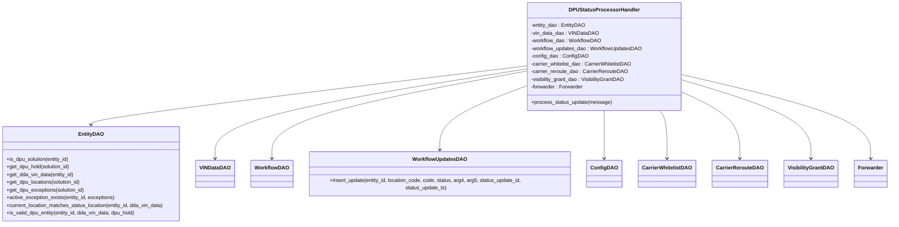

# Diagram: entity_core/entity_service/entity_service/dpu/dpu_service/service/dpu_status_processor_handler.py


> Auto-generated by Obscura crawlers

## Diagram 1



### SVG

<svg id="container" width="2738.265625" xmlns="http://www.w3.org/2000/svg" class="classDiagram" height="696" viewBox="0 0 2738.265625 696" role="graphics-document document" aria-roledescription="class"><style>#container{font-family:"trebuchet ms",verdana,arial,sans-serif;font-size:16px;fill:#333;}@keyframes edge-animation-frame{from{stroke-dashoffset:0;}}@keyframes dash{to{stroke-dashoffset:0;}}#container .edge-animation-slow{stroke-dasharray:9,5!important;stroke-dashoffset:900;animation:dash 50s linear infinite;stroke-linecap:round;}#container .edge-animation-fast{stroke-dasharray:9,5!important;stroke-dashoffset:900;animation:dash 20s linear infinite;stroke-linecap:round;}#container .error-icon{fill:#552222;}#container .error-text{fill:#552222;stroke:#552222;}#container .edge-thickness-normal{stroke-width:1px;}#container .edge-thickness-thick{stroke-width:3.5px;}#container .edge-pattern-solid{stroke-dasharray:0;}#container .edge-thickness-invisible{stroke-width:0;fill:none;}#container .edge-pattern-dashed{stroke-dasharray:3;}#container .edge-pattern-dotted{stroke-dasharray:2;}#container .marker{fill:#333333;stroke:#333333;}#container .marker.cross{stroke:#333333;}#container svg{font-family:"trebuchet ms",verdana,arial,sans-serif;font-size:16px;}#container p{margin:0;}#container g.classGroup text{fill:#9370DB;stroke:none;font-family:"trebuchet ms",verdana,arial,sans-serif;font-size:10px;}#container g.classGroup text .title{font-weight:bolder;}#container .nodeLabel,#container .edgeLabel{color:#131300;}#container .edgeLabel .label rect{fill:#ECECFF;}#container .label text{fill:#131300;}#container .labelBkg{background:#ECECFF;}#container .edgeLabel .label span{background:#ECECFF;}#container .classTitle{font-weight:bolder;}#container .node rect,#container .node circle,#container .node ellipse,#container .node polygon,#container .node path{fill:#ECECFF;stroke:#9370DB;stroke-width:1px;}#container .divider{stroke:#9370DB;stroke-width:1;}#container g.clickable{cursor:pointer;}#container g.classGroup rect{fill:#ECECFF;stroke:#9370DB;}#container g.classGroup line{stroke:#9370DB;stroke-width:1;}#container .classLabel .box{stroke:none;stroke-width:0;fill:#ECECFF;opacity:0.5;}#container .classLabel .label{fill:#9370DB;font-size:10px;}#container .relation{stroke:#333333;stroke-width:1;fill:none;}#container .dashed-line{stroke-dasharray:3;}#container .dotted-line{stroke-dasharray:1 2;}#container #compositionStart,#container .composition{fill:#333333!important;stroke:#333333!important;stroke-width:1;}#container #compositionEnd,#container .composition{fill:#333333!important;stroke:#333333!important;stroke-width:1;}#container #dependencyStart,#container .dependency{fill:#333333!important;stroke:#333333!important;stroke-width:1;}#container #dependencyStart,#container .dependency{fill:#333333!important;stroke:#333333!important;stroke-width:1;}#container #extensionStart,#container .extension{fill:transparent!important;stroke:#333333!important;stroke-width:1;}#container #extensionEnd,#container .extension{fill:transparent!important;stroke:#333333!important;stroke-width:1;}#container #aggregationStart,#container .aggregation{fill:transparent!important;stroke:#333333!important;stroke-width:1;}#container #aggregationEnd,#container .aggregation{fill:transparent!important;stroke:#333333!important;stroke-width:1;}#container #lollipopStart,#container .lollipop{fill:#ECECFF!important;stroke:#333333!important;stroke-width:1;}#container #lollipopEnd,#container .lollipop{fill:#ECECFF!important;stroke:#333333!important;stroke-width:1;}#container .edgeTerminals{font-size:11px;line-height:initial;}#container .classTitleText{text-anchor:middle;font-size:18px;fill:#333;}#container .label-icon{display:inline-block;height:1em;overflow:visible;vertical-align:-0.125em;}#container .node .label-icon path{fill:currentColor;stroke:revert;stroke-width:revert;}#container :root{--mermaid-font-family:"trebuchet ms",verdana,arial,sans-serif;}</style><g><defs><marker id="container_class-aggregationStart" class="marker aggregation class" refX="18" refY="7" markerWidth="190" markerHeight="240" orient="auto"><path d="M 18,7 L9,13 L1,7 L9,1 Z"></path></marker></defs><defs><marker id="container_class-aggregationEnd" class="marker aggregation class" refX="1" refY="7" markerWidth="20" markerHeight="28" orient="auto"><path d="M 18,7 L9,13 L1,7 L9,1 Z"></path></marker></defs><defs><marker id="container_class-extensionStart" class="marker extension class" refX="18" refY="7" markerWidth="190" markerHeight="240" orient="auto"><path d="M 1,7 L18,13 V 1 Z"></path></marker></defs><defs><marker id="container_class-extensionEnd" class="marker extension class" refX="1" refY="7" markerWidth="20" markerHeight="28" orient="auto"><path d="M 1,1 V 13 L18,7 Z"></path></marker></defs><defs><marker id="container_class-compositionStart" class="marker composition class" refX="18" refY="7" markerWidth="190" markerHeight="240" orient="auto"><path d="M 18,7 L9,13 L1,7 L9,1 Z"></path></marker></defs><defs><marker id="container_class-compositionEnd" class="marker composition class" refX="1" refY="7" markerWidth="20" markerHeight="28" orient="auto"><path d="M 18,7 L9,13 L1,7 L9,1 Z"></path></marker></defs><defs><marker id="container_class-dependencyStart" class="marker dependency class" refX="6" refY="7" markerWidth="190" markerHeight="240" orient="auto"><path d="M 5,7 L9,13 L1,7 L9,1 Z"></path></marker></defs><defs><marker id="container_class-dependencyEnd" class="marker dependency class" refX="13" refY="7" markerWidth="20" markerHeight="28" orient="auto"><path d="M 18,7 L9,13 L14,7 L9,1 Z"></path></marker></defs><defs><marker id="container_class-lollipopStart" class="marker lollipop class" refX="13" refY="7" markerWidth="190" markerHeight="240" orient="auto"><circle stroke="black" fill="transparent" cx="7" cy="7" r="6"></circle></marker></defs><defs><marker id="container_class-lollipopEnd" class="marker lollipop class" refX="1" refY="7" markerWidth="190" markerHeight="240" orient="auto"><circle stroke="black" fill="transparent" cx="7" cy="7" r="6"></circle></marker></defs><g class="root"><g class="clusters"></g><g class="edgePaths"><path d="M1654.945,204.339L1426.93,231.782C1198.914,259.226,742.883,314.113,514.867,344.723C286.852,375.333,286.852,381.667,286.852,384.833L286.852,388" id="id_DPUStatusProcessorHandler_EntityDAO_1" class="edge-thickness-normal edge-pattern-solid relation" style=";;;" data-edge="true" data-et="edge" data-id="id_DPUStatusProcessorHandler_EntityDAO_1" data-points="W3sieCI6MTY1NC45NDUzMTI1LCJ5IjoyMDQuMzM4NzEyMDM0ODQ0NjN9LHsieCI6Mjg2Ljg1MTU2MjUsInkiOjM2OX0seyJ4IjoyODYuODUxNTYyNSwieSI6Mzk0fV0=" marker-end="url(#container_class-dependencyEnd)"></path><path d="M1654.945,213.3L1491.138,239.25C1327.331,265.2,999.716,317.1,835.909,363.717C672.102,410.333,672.102,451.667,672.102,472.333L672.102,493" id="id_DPUStatusProcessorHandler_VINDataDAO_2" class="edge-thickness-normal edge-pattern-solid relation" style=";;;" data-edge="true" data-et="edge" data-id="id_DPUStatusProcessorHandler_VINDataDAO_2" data-points="W3sieCI6MTY1NC45NDUzMTI1LCJ5IjoyMTMuMjk5OTgzMzI3MTM0NDR9LHsieCI6NjcyLjEwMTU2MjUsInkiOjM2OX0seyJ4Ijo2NzIuMTAxNTYyNSwieSI6NDk5fV0=" marker-end="url(#container_class-dependencyEnd)"></path><path d="M1654.945,219.281L1519.198,244.234C1383.451,269.187,1111.956,319.094,976.208,364.714C840.461,410.333,840.461,451.667,840.461,472.333L840.461,493" id="id_DPUStatusProcessorHandler_WorkflowDAO_3" class="edge-thickness-normal edge-pattern-solid relation" style=";;;" data-edge="true" data-et="edge" data-id="id_DPUStatusProcessorHandler_WorkflowDAO_3" data-points="W3sieCI6MTY1NC45NDUzMTI1LCJ5IjoyMTkuMjgxMTAzMDQxODQ3NzN9LHsieCI6ODQwLjQ2MDkzNzUsInkiOjM2OX0seyJ4Ijo4NDAuNDYwOTM3NSwieSI6NDk5fV0=" marker-end="url(#container_class-dependencyEnd)"></path><path d="M1654.945,263.541L1607.671,281.117C1560.396,298.694,1465.846,333.847,1418.572,368.59C1371.297,403.333,1371.297,437.667,1371.297,454.833L1371.297,472" id="id_DPUStatusProcessorHandler_WorkflowUpdatesDAO_4" class="edge-thickness-normal edge-pattern-solid relation" style=";;;" data-edge="true" data-et="edge" data-id="id_DPUStatusProcessorHandler_WorkflowUpdatesDAO_4" data-points="W3sieCI6MTY1NC45NDUzMTI1LCJ5IjoyNjMuNTQwNTgyNDM2NjAxN30seyJ4IjoxMzcxLjI5Njg3NSwieSI6MzY5fSx7IngiOjEzNzEuMjk2ODc1LCJ5Ijo0Nzh9XQ==" marker-end="url(#container_class-dependencyEnd)"></path><path d="M1890.398,344L1890.398,348.167C1890.398,352.333,1890.398,360.667,1890.398,385.5C1890.398,410.333,1890.398,451.667,1890.398,472.333L1890.398,493" id="id_DPUStatusProcessorHandler_ConfigDAO_5" class="edge-thickness-normal edge-pattern-solid relation" style=";;;" data-edge="true" data-et="edge" data-id="id_DPUStatusProcessorHandler_ConfigDAO_5" data-points="W3sieCI6MTg5MC4zOTg0Mzc1LCJ5IjozNDR9LHsieCI6MTg5MC4zOTg0Mzc1LCJ5IjozNjl9LHsieCI6MTg5MC4zOTg0Mzc1LCJ5Ijo0OTl9XQ==" marker-end="url(#container_class-dependencyEnd)"></path><path d="M2051.714,344L2055.714,348.167C2059.715,352.333,2067.717,360.667,2071.718,385.5C2075.719,410.333,2075.719,451.667,2075.719,472.333L2075.719,493" id="id_DPUStatusProcessorHandler_CarrierWhitelistDAO_6" class="edge-thickness-normal edge-pattern-solid relation" style=";;;" data-edge="true" data-et="edge" data-id="id_DPUStatusProcessorHandler_CarrierWhitelistDAO_6" data-points="W3sieCI6MjA1MS43MTM1MjgxNzM1NzUsInkiOjM0NH0seyJ4IjoyMDc1LjcxODc1LCJ5IjozNjl9LHsieCI6MjA3NS43MTg3NSwieSI6NDk5fV0=" marker-end="url(#container_class-dependencyEnd)"></path><path d="M2125.852,289.12L2153.563,302.433C2181.273,315.747,2236.695,342.373,2264.406,376.353C2292.117,410.333,2292.117,451.667,2292.117,472.333L2292.117,493" id="id_DPUStatusProcessorHandler_CarrierRerouteDAO_7" class="edge-thickness-normal edge-pattern-solid relation" style=";;;" data-edge="true" data-et="edge" data-id="id_DPUStatusProcessorHandler_CarrierRerouteDAO_7" data-points="W3sieCI6MjEyNS44NTE1NjI1LCJ5IjoyODkuMTIwMDcwMDExNjY4NjR9LHsieCI6MjI5Mi4xMTcxODc1LCJ5IjozNjl9LHsieCI6MjI5Mi4xMTcxODc1LCJ5Ijo0OTl9XQ==" marker-end="url(#container_class-dependencyEnd)"></path><path d="M2125.852,250.217L2188.658,270.014C2251.464,289.812,2377.076,329.406,2439.882,369.87C2502.688,410.333,2502.688,451.667,2502.688,472.333L2502.688,493" id="id_DPUStatusProcessorHandler_VisibilityGrantDAO_8" class="edge-thickness-normal edge-pattern-solid relation" style=";;;" data-edge="true" data-et="edge" data-id="id_DPUStatusProcessorHandler_VisibilityGrantDAO_8" data-points="W3sieCI6MjEyNS44NTE1NjI1LCJ5IjoyNTAuMjE3MzE5NzQwMjE2NjV9LHsieCI6MjUwMi42ODc1LCJ5IjozNjl9LHsieCI6MjUwMi42ODc1LCJ5Ijo0OTl9XQ==" marker-end="url(#container_class-dependencyEnd)"></path><path d="M2125.852,233.47L2218.395,256.059C2310.938,278.647,2496.023,323.823,2588.566,367.078C2681.109,410.333,2681.109,451.667,2681.109,472.333L2681.109,493" id="id_DPUStatusProcessorHandler_Forwarder_9" class="edge-thickness-normal edge-pattern-solid relation" style=";;;" data-edge="true" data-et="edge" data-id="id_DPUStatusProcessorHandler_Forwarder_9" data-points="W3sieCI6MjEyNS44NTE1NjI1LCJ5IjoyMzMuNDcwMzczNzczNjAxN30seyJ4IjoyNjgxLjEwOTM3NSwieSI6MzY5fSx7IngiOjI2ODEuMTA5Mzc1LCJ5Ijo0OTl9XQ==" marker-end="url(#container_class-dependencyEnd)"></path></g><g class="edgeLabels"><g class="edgeLabel"><g class="label" data-id="id_DPUStatusProcessorHandler_EntityDAO_1" transform="translate(0, 0)"><foreignObject width="0" height="0"><div xmlns="http://www.w3.org/1999/xhtml" class="labelBkg" style="display: table-cell; white-space: nowrap; line-height: 1.5; max-width: 200px; text-align: center;"><span class="edgeLabel"></span></div></foreignObject></g></g><g class="edgeLabel"><g class="label" data-id="id_DPUStatusProcessorHandler_VINDataDAO_2" transform="translate(0, 0)"><foreignObject width="0" height="0"><div xmlns="http://www.w3.org/1999/xhtml" class="labelBkg" style="display: table-cell; white-space: nowrap; line-height: 1.5; max-width: 200px; text-align: center;"><span class="edgeLabel"></span></div></foreignObject></g></g><g class="edgeLabel"><g class="label" data-id="id_DPUStatusProcessorHandler_WorkflowDAO_3" transform="translate(0, 0)"><foreignObject width="0" height="0"><div xmlns="http://www.w3.org/1999/xhtml" class="labelBkg" style="display: table-cell; white-space: nowrap; line-height: 1.5; max-width: 200px; text-align: center;"><span class="edgeLabel"></span></div></foreignObject></g></g><g class="edgeLabel"><g class="label" data-id="id_DPUStatusProcessorHandler_WorkflowUpdatesDAO_4" transform="translate(0, 0)"><foreignObject width="0" height="0"><div xmlns="http://www.w3.org/1999/xhtml" class="labelBkg" style="display: table-cell; white-space: nowrap; line-height: 1.5; max-width: 200px; text-align: center;"><span class="edgeLabel"></span></div></foreignObject></g></g><g class="edgeLabel"><g class="label" data-id="id_DPUStatusProcessorHandler_ConfigDAO_5" transform="translate(0, 0)"><foreignObject width="0" height="0"><div xmlns="http://www.w3.org/1999/xhtml" class="labelBkg" style="display: table-cell; white-space: nowrap; line-height: 1.5; max-width: 200px; text-align: center;"><span class="edgeLabel"></span></div></foreignObject></g></g><g class="edgeLabel"><g class="label" data-id="id_DPUStatusProcessorHandler_CarrierWhitelistDAO_6" transform="translate(0, 0)"><foreignObject width="0" height="0"><div xmlns="http://www.w3.org/1999/xhtml" class="labelBkg" style="display: table-cell; white-space: nowrap; line-height: 1.5; max-width: 200px; text-align: center;"><span class="edgeLabel"></span></div></foreignObject></g></g><g class="edgeLabel"><g class="label" data-id="id_DPUStatusProcessorHandler_CarrierRerouteDAO_7" transform="translate(0, 0)"><foreignObject width="0" height="0"><div xmlns="http://www.w3.org/1999/xhtml" class="labelBkg" style="display: table-cell; white-space: nowrap; line-height: 1.5; max-width: 200px; text-align: center;"><span class="edgeLabel"></span></div></foreignObject></g></g><g class="edgeLabel"><g class="label" data-id="id_DPUStatusProcessorHandler_VisibilityGrantDAO_8" transform="translate(0, 0)"><foreignObject width="0" height="0"><div xmlns="http://www.w3.org/1999/xhtml" class="labelBkg" style="display: table-cell; white-space: nowrap; line-height: 1.5; max-width: 200px; text-align: center;"><span class="edgeLabel"></span></div></foreignObject></g></g><g class="edgeLabel"><g class="label" data-id="id_DPUStatusProcessorHandler_Forwarder_9" transform="translate(0, 0)"><foreignObject width="0" height="0"><div xmlns="http://www.w3.org/1999/xhtml" class="labelBkg" style="display: table-cell; white-space: nowrap; line-height: 1.5; max-width: 200px; text-align: center;"><span class="edgeLabel"></span></div></foreignObject></g></g></g><g class="nodes"><g class="node default" id="classId-DPUStatusProcessorHandler-0" transform="translate(1890.3984375, 176)"><g class="basic label-container"><path d="M-235.453125 -168 L235.453125 -168 L235.453125 168 L-235.453125 168" stroke="none" stroke-width="0" fill="#ECECFF" style=""></path><path d="M-235.453125 -168 C-141.05798329045254 -168, -46.66284158090508 -168, 235.453125 -168 M-235.453125 -168 C-130.76623814936642 -168, -26.07935129873283 -168, 235.453125 -168 M235.453125 -168 C235.453125 -85.47280656918632, 235.453125 -2.945613138372636, 235.453125 168 M235.453125 -168 C235.453125 -73.7913606243719, 235.453125 20.41727875125619, 235.453125 168 M235.453125 168 C113.57062165146725 168, -8.311881697065502 168, -235.453125 168 M235.453125 168 C49.683122896929234 168, -136.08687920614153 168, -235.453125 168 M-235.453125 168 C-235.453125 88.86155611483163, -235.453125 9.723112229663258, -235.453125 -168 M-235.453125 168 C-235.453125 46.04030299454638, -235.453125 -75.91939401090724, -235.453125 -168" stroke="#9370DB" stroke-width="1.3" fill="none" stroke-dasharray="0 0" style=""></path></g><g class="annotation-group text" transform="translate(0, -144)"></g><g class="label-group text" transform="translate(-103.65625, -144)"><g class="label" style="font-weight: bolder" transform="translate(0,-12)"><foreignObject width="207.3125" height="24"><div xmlns="http://www.w3.org/1999/xhtml" style="display: table-cell; white-space: nowrap; line-height: 1.5; max-width: 255px; text-align: center;"><span class="nodeLabel markdown-node-label" style=""><p>DPUStatusProcessorHandler</p></span></div></foreignObject></g></g><g class="members-group text" transform="translate(-223.453125, -96)"><g class="label" style="" transform="translate(0,-12)"><foreignObject width="167.71875" height="24"><div xmlns="http://www.w3.org/1999/xhtml" style="display: table-cell; white-space: nowrap; line-height: 1.5; max-width: 225px; text-align: center;"><span class="nodeLabel markdown-node-label" style=""><p>-entity_dao : EntityDAO</p></span></div></foreignObject></g><g class="label" style="" transform="translate(0,12)"><foreignObject width="204.609375" height="24"><div xmlns="http://www.w3.org/1999/xhtml" style="display: table-cell; white-space: nowrap; line-height: 1.5; max-width: 262px; text-align: center;"><span class="nodeLabel markdown-node-label" style=""><p>-vin_data_dao : VINDataDAO</p></span></div></foreignObject></g><g class="label" style="" transform="translate(0,36)"><foreignObject width="216.671875" height="24"><div xmlns="http://www.w3.org/1999/xhtml" style="display: table-cell; white-space: nowrap; line-height: 1.5; max-width: 274px; text-align: center;"><span class="nodeLabel markdown-node-label" style=""><p>-workflow_dao : WorkflowDAO</p></span></div></foreignObject></g><g class="label" style="" transform="translate(0,60)"><foreignObject width="343.25" height="24"><div xmlns="http://www.w3.org/1999/xhtml" style="display: table-cell; white-space: nowrap; line-height: 1.5; max-width: 401px; text-align: center;"><span class="nodeLabel markdown-node-label" style=""><p>-workflow_updates_dao : WorkflowUpdatesDAO</p></span></div></foreignObject></g><g class="label" style="" transform="translate(0,84)"><foreignObject width="173.125" height="24"><div xmlns="http://www.w3.org/1999/xhtml" style="display: table-cell; white-space: nowrap; line-height: 1.5; max-width: 230px; text-align: center;"><span class="nodeLabel markdown-node-label" style=""><p>-config_dao : ConfigDAO</p></span></div></foreignObject></g><g class="label" style="" transform="translate(0,108)"><foreignObject width="314.421875" height="24"><div xmlns="http://www.w3.org/1999/xhtml" style="display: table-cell; white-space: nowrap; line-height: 1.5; max-width: 372px; text-align: center;"><span class="nodeLabel markdown-node-label" style=""><p>-carrier_whitelist_dao : CarrierWhitelistDAO</p></span></div></foreignObject></g><g class="label" style="" transform="translate(0,132)"><foreignObject width="298.34375" height="24"><div xmlns="http://www.w3.org/1999/xhtml" style="display: table-cell; white-space: nowrap; line-height: 1.5; max-width: 356px; text-align: center;"><span class="nodeLabel markdown-node-label" style=""><p>-carrier_reroute_dao : CarrierRerouteDAO</p></span></div></foreignObject></g><g class="label" style="" transform="translate(0,156)"><foreignObject width="293.125" height="24"><div xmlns="http://www.w3.org/1999/xhtml" style="display: table-cell; white-space: nowrap; line-height: 1.5; max-width: 350px; text-align: center;"><span class="nodeLabel markdown-node-label" style=""><p>-visibility_grant_dao : VisibilityGrantDAO</p></span></div></foreignObject></g><g class="label" style="" transform="translate(0,180)"><foreignObject width="162.359375" height="24"><div xmlns="http://www.w3.org/1999/xhtml" style="display: table-cell; white-space: nowrap; line-height: 1.5; max-width: 221px; text-align: center;"><span class="nodeLabel markdown-node-label" style=""><p>-forwarder : Forwarder</p></span></div></foreignObject></g></g><g class="methods-group text" transform="translate(-223.453125, 144)"><g class="label" style="" transform="translate(0,-12)"><foreignObject width="247.546875" height="24"><div xmlns="http://www.w3.org/1999/xhtml" style="display: table-cell; white-space: nowrap; line-height: 1.5; max-width: 305px; text-align: center;"><span class="nodeLabel markdown-node-label" style=""><p>+process_status_update(message)</p></span></div></foreignObject></g></g><g class="divider" style=""><path d="M-235.453125 -120 C-83.7729339279143 -120, 67.90725714417141 -120, 235.453125 -120 M-235.453125 -120 C-84.41043949637509 -120, 66.63224600724982 -120, 235.453125 -120" stroke="#9370DB" stroke-width="1.3" fill="none" stroke-dasharray="0 0" style=""></path></g><g class="divider" style=""><path d="M-235.453125 120 C-135.97382478694254 120, -36.494524573885116 120, 235.453125 120 M-235.453125 120 C-113.81834646017346 120, 7.816432079653083 120, 235.453125 120" stroke="#9370DB" stroke-width="1.3" fill="none" stroke-dasharray="0 0" style=""></path></g></g><g class="node default" id="classId-EntityDAO-1" transform="translate(286.8515625, 541)"><g class="basic label-container"><path d="M-278.8515625 -147 L278.8515625 -147 L278.8515625 147 L-278.8515625 147" stroke="none" stroke-width="0" fill="#ECECFF" style=""></path><path d="M-278.8515625 -147 C-100.17527514208038 -147, 78.50101221583924 -147, 278.8515625 -147 M-278.8515625 -147 C-89.8868175864223 -147, 99.07792732715541 -147, 278.8515625 -147 M278.8515625 -147 C278.8515625 -38.087770554789955, 278.8515625 70.82445889042009, 278.8515625 147 M278.8515625 -147 C278.8515625 -39.69431070717809, 278.8515625 67.61137858564382, 278.8515625 147 M278.8515625 147 C67.81891889157095 147, -143.2137247168581 147, -278.8515625 147 M278.8515625 147 C60.8031450647338 147, -157.2452723705324 147, -278.8515625 147 M-278.8515625 147 C-278.8515625 66.64356215710258, -278.8515625 -13.712875685794842, -278.8515625 -147 M-278.8515625 147 C-278.8515625 70.77429483154468, -278.8515625 -5.451410336910641, -278.8515625 -147" stroke="#9370DB" stroke-width="1.3" fill="none" stroke-dasharray="0 0" style=""></path></g><g class="annotation-group text" transform="translate(0, -123)"></g><g class="label-group text" transform="translate(-36.578125, -123)"><g class="label" style="font-weight: bolder" transform="translate(0,-12)"><foreignObject width="73.15625" height="24"><div xmlns="http://www.w3.org/1999/xhtml" style="display: table-cell; white-space: nowrap; line-height: 1.5; max-width: 122px; text-align: center;"><span class="nodeLabel markdown-node-label" style=""><p>EntityDAO</p></span></div></foreignObject></g></g><g class="members-group text" transform="translate(-266.8515625, -75)"></g><g class="methods-group text" transform="translate(-266.8515625, -45)"><g class="label" style="" transform="translate(0,-12)"><foreignObject width="198.421875" height="24"><div xmlns="http://www.w3.org/1999/xhtml" style="display: table-cell; white-space: nowrap; line-height: 1.5; max-width: 256px; text-align: center;"><span class="nodeLabel markdown-node-label" style=""><p>+is_dpu_solution(entity_id)</p></span></div></foreignObject></g><g class="label" style="" transform="translate(0,12)"><foreignObject width="200.75" height="24"><div xmlns="http://www.w3.org/1999/xhtml" style="display: table-cell; white-space: nowrap; line-height: 1.5; max-width: 258px; text-align: center;"><span class="nodeLabel markdown-node-label" style=""><p>+get_dpu_hold(solution_id)</p></span></div></foreignObject></g><g class="label" style="" transform="translate(0,36)"><foreignObject width="210.875" height="24"><div xmlns="http://www.w3.org/1999/xhtml" style="display: table-cell; white-space: nowrap; line-height: 1.5; max-width: 268px; text-align: center;"><span class="nodeLabel markdown-node-label" style=""><p>+get_dda_vin_data(entity_id)</p></span></div></foreignObject></g><g class="label" style="" transform="translate(0,60)"><foreignObject width="234.3125" height="24"><div xmlns="http://www.w3.org/1999/xhtml" style="display: table-cell; white-space: nowrap; line-height: 1.5; max-width: 292px; text-align: center;"><span class="nodeLabel markdown-node-label" style=""><p>+get_dpu_locations(solution_id)</p></span></div></foreignObject></g><g class="label" style="" transform="translate(0,84)"><foreignObject width="245.75" height="24"><div xmlns="http://www.w3.org/1999/xhtml" style="display: table-cell; white-space: nowrap; line-height: 1.5; max-width: 303px; text-align: center;"><span class="nodeLabel markdown-node-label" style=""><p>+get_dpu_exceptions(solution_id)</p></span></div></foreignObject></g><g class="label" style="" transform="translate(0,108)"><foreignObject width="339.46875" height="24"><div xmlns="http://www.w3.org/1999/xhtml" style="display: table-cell; white-space: nowrap; line-height: 1.5; max-width: 397px; text-align: center;"><span class="nodeLabel markdown-node-label" style=""><p>+active_exception_exists(entity_id, exceptions)</p></span></div></foreignObject></g><g class="label" style="" transform="translate(0,132)"><foreignObject width="497.125" height="24"><div xmlns="http://www.w3.org/1999/xhtml" style="display: table-cell; white-space: nowrap; line-height: 1.5; max-width: 554px; text-align: center;"><span class="nodeLabel markdown-node-label" style=""><p>+current_location_matches_status_location(entity_id, dda_vin_data)</p></span></div></foreignObject></g><g class="label" style="" transform="translate(0,156)"><foreignObject width="406.84375" height="24"><div xmlns="http://www.w3.org/1999/xhtml" style="display: table-cell; white-space: nowrap; line-height: 1.5; max-width: 464px; text-align: center;"><span class="nodeLabel markdown-node-label" style=""><p>+is_valid_dpu_entity(entity_id, dda_vin_data, dpu_hold)</p></span></div></foreignObject></g></g><g class="divider" style=""><path d="M-278.8515625 -99 C-120.37758414603738 -99, 38.09639420792524 -99, 278.8515625 -99 M-278.8515625 -99 C-64.99416616420649 -99, 148.86323017158702 -99, 278.8515625 -99" stroke="#9370DB" stroke-width="1.3" fill="none" stroke-dasharray="0 0" style=""></path></g><g class="divider" style=""><path d="M-278.8515625 -75 C-155.79655493278682 -75, -32.74154736557361 -75, 278.8515625 -75 M-278.8515625 -75 C-147.7337500361167 -75, -16.615937572233406 -75, 278.8515625 -75" stroke="#9370DB" stroke-width="1.3" fill="none" stroke-dasharray="0 0" style=""></path></g></g><g class="node default" id="classId-VINDataDAO-2" transform="translate(672.1015625, 541)"><g class="basic label-container"><path d="M-56.3984375 -42 L56.3984375 -42 L56.3984375 42 L-56.3984375 42" stroke="none" stroke-width="0" fill="#ECECFF" style=""></path><path d="M-56.3984375 -42 C-23.949250160039504 -42, 8.499937179920991 -42, 56.3984375 -42 M-56.3984375 -42 C-15.7094415040604 -42, 24.9795544918792 -42, 56.3984375 -42 M56.3984375 -42 C56.3984375 -11.308092476762319, 56.3984375 19.383815046475362, 56.3984375 42 M56.3984375 -42 C56.3984375 -12.079238239877217, 56.3984375 17.841523520245566, 56.3984375 42 M56.3984375 42 C28.683025358349386 42, 0.9676132166987728 42, -56.3984375 42 M56.3984375 42 C23.664211857871393 42, -9.070013784257213 42, -56.3984375 42 M-56.3984375 42 C-56.3984375 18.65151822772515, -56.3984375 -4.696963544549703, -56.3984375 -42 M-56.3984375 42 C-56.3984375 24.47190818219971, -56.3984375 6.943816364399417, -56.3984375 -42" stroke="#9370DB" stroke-width="1.3" fill="none" stroke-dasharray="0 0" style=""></path></g><g class="annotation-group text" transform="translate(0, -18)"></g><g class="label-group text" transform="translate(-44.3984375, -18)"><g class="label" style="font-weight: bolder" transform="translate(0,-12)"><foreignObject width="88.796875" height="24"><div xmlns="http://www.w3.org/1999/xhtml" style="display: table-cell; white-space: nowrap; line-height: 1.5; max-width: 138px; text-align: center;"><span class="nodeLabel markdown-node-label" style=""><p>VINDataDAO</p></span></div></foreignObject></g></g><g class="members-group text" transform="translate(-44.3984375, 30)"></g><g class="methods-group text" transform="translate(-44.3984375, 60)"></g><g class="divider" style=""><path d="M-56.3984375 6 C-23.160234976212266 6, 10.077967547575469 6, 56.3984375 6 M-56.3984375 6 C-29.163852425160563 6, -1.9292673503211262 6, 56.3984375 6" stroke="#9370DB" stroke-width="1.3" fill="none" stroke-dasharray="0 0" style=""></path></g><g class="divider" style=""><path d="M-56.3984375 24 C-26.28961797969821 24, 3.8192015406035793 24, 56.3984375 24 M-56.3984375 24 C-28.776234510481725 24, -1.15403152096345 24, 56.3984375 24" stroke="#9370DB" stroke-width="1.3" fill="none" stroke-dasharray="0 0" style=""></path></g></g><g class="node default" id="classId-WorkflowDAO-3" transform="translate(840.4609375, 541)"><g class="basic label-container"><path d="M-61.9609375 -42 L61.9609375 -42 L61.9609375 42 L-61.9609375 42" stroke="none" stroke-width="0" fill="#ECECFF" style=""></path><path d="M-61.9609375 -42 C-20.41997957152814 -42, 21.120978356943723 -42, 61.9609375 -42 M-61.9609375 -42 C-27.272989325589684 -42, 7.414958848820632 -42, 61.9609375 -42 M61.9609375 -42 C61.9609375 -13.960068651888712, 61.9609375 14.079862696222577, 61.9609375 42 M61.9609375 -42 C61.9609375 -21.97721532063371, 61.9609375 -1.9544306412674217, 61.9609375 42 M61.9609375 42 C22.326686366799734 42, -17.30756476640053 42, -61.9609375 42 M61.9609375 42 C18.176402054496222 42, -25.608133391007556 42, -61.9609375 42 M-61.9609375 42 C-61.9609375 20.52439871288157, -61.9609375 -0.9512025742368593, -61.9609375 -42 M-61.9609375 42 C-61.9609375 9.916890183492285, -61.9609375 -22.16621963301543, -61.9609375 -42" stroke="#9370DB" stroke-width="1.3" fill="none" stroke-dasharray="0 0" style=""></path></g><g class="annotation-group text" transform="translate(0, -18)"></g><g class="label-group text" transform="translate(-49.9609375, -18)"><g class="label" style="font-weight: bolder" transform="translate(0,-12)"><foreignObject width="99.921875" height="24"><div xmlns="http://www.w3.org/1999/xhtml" style="display: table-cell; white-space: nowrap; line-height: 1.5; max-width: 147px; text-align: center;"><span class="nodeLabel markdown-node-label" style=""><p>WorkflowDAO</p></span></div></foreignObject></g></g><g class="members-group text" transform="translate(-49.9609375, 30)"></g><g class="methods-group text" transform="translate(-49.9609375, 60)"></g><g class="divider" style=""><path d="M-61.9609375 6 C-19.62832840020834 6, 22.70428069958332 6, 61.9609375 6 M-61.9609375 6 C-15.830030593101554 6, 30.30087631379689 6, 61.9609375 6" stroke="#9370DB" stroke-width="1.3" fill="none" stroke-dasharray="0 0" style=""></path></g><g class="divider" style=""><path d="M-61.9609375 24 C-13.832086691185381 24, 34.29676411762924 24, 61.9609375 24 M-61.9609375 24 C-15.414767714584833 24, 31.131402070830333 24, 61.9609375 24" stroke="#9370DB" stroke-width="1.3" fill="none" stroke-dasharray="0 0" style=""></path></g></g><g class="node default" id="classId-WorkflowUpdatesDAO-4" transform="translate(1371.296875, 541)"><g class="basic label-container"><path d="M-418.875 -63 L418.875 -63 L418.875 63 L-418.875 63" stroke="none" stroke-width="0" fill="#ECECFF" style=""></path><path d="M-418.875 -63 C-134.5855242929074 -63, 149.7039514141852 -63, 418.875 -63 M-418.875 -63 C-177.12601432830115 -63, 64.6229713433977 -63, 418.875 -63 M418.875 -63 C418.875 -36.79002313850076, 418.875 -10.580046277001514, 418.875 63 M418.875 -63 C418.875 -37.64205575614224, 418.875 -12.284111512284483, 418.875 63 M418.875 63 C118.1142500070547 63, -182.6464999858906 63, -418.875 63 M418.875 63 C207.33340602492322 63, -4.208187950153558 63, -418.875 63 M-418.875 63 C-418.875 22.763442123567494, -418.875 -17.473115752865013, -418.875 -63 M-418.875 63 C-418.875 30.627267385013944, -418.875 -1.7454652299721118, -418.875 -63" stroke="#9370DB" stroke-width="1.3" fill="none" stroke-dasharray="0 0" style=""></path></g><g class="annotation-group text" transform="translate(0, -39)"></g><g class="label-group text" transform="translate(-80.359375, -39)"><g class="label" style="font-weight: bolder" transform="translate(0,-12)"><foreignObject width="160.71875" height="24"><div xmlns="http://www.w3.org/1999/xhtml" style="display: table-cell; white-space: nowrap; line-height: 1.5; max-width: 207px; text-align: center;"><span class="nodeLabel markdown-node-label" style=""><p>WorkflowUpdatesDAO</p></span></div></foreignObject></g></g><g class="members-group text" transform="translate(-406.875, 9)"></g><g class="methods-group text" transform="translate(-406.875, 39)"><g class="label" style="" transform="translate(0,-12)"><foreignObject width="733.390625" height="24"><div xmlns="http://www.w3.org/1999/xhtml" style="display: table-cell; white-space: nowrap; line-height: 1.5; max-width: 791px; text-align: center;"><span class="nodeLabel markdown-node-label" style=""><p>+insert_update(entity_id, location_code, code, status, arg4, arg5, status_update_id, status_update_ts)</p></span></div></foreignObject></g></g><g class="divider" style=""><path d="M-418.875 -15 C-159.06601946089842 -15, 100.74296107820317 -15, 418.875 -15 M-418.875 -15 C-113.73482936584037 -15, 191.40534126831926 -15, 418.875 -15" stroke="#9370DB" stroke-width="1.3" fill="none" stroke-dasharray="0 0" style=""></path></g><g class="divider" style=""><path d="M-418.875 9 C-152.19299077422585 9, 114.4890184515483 9, 418.875 9 M-418.875 9 C-146.5717059397104 9, 125.7315881205792 9, 418.875 9" stroke="#9370DB" stroke-width="1.3" fill="none" stroke-dasharray="0 0" style=""></path></g></g><g class="node default" id="classId-ConfigDAO-5" transform="translate(1890.3984375, 541)"><g class="basic label-container"><path d="M-50.2265625 -42 L50.2265625 -42 L50.2265625 42 L-50.2265625 42" stroke="none" stroke-width="0" fill="#ECECFF" style=""></path><path d="M-50.2265625 -42 C-20.45193819030045 -42, 9.322686119399101 -42, 50.2265625 -42 M-50.2265625 -42 C-22.29911597045615 -42, 5.628330559087701 -42, 50.2265625 -42 M50.2265625 -42 C50.2265625 -9.507300756157427, 50.2265625 22.985398487685146, 50.2265625 42 M50.2265625 -42 C50.2265625 -19.847945781828557, 50.2265625 2.3041084363428865, 50.2265625 42 M50.2265625 42 C23.426840744189473 42, -3.372881011621054 42, -50.2265625 42 M50.2265625 42 C11.016170944239228 42, -28.194220611521544 42, -50.2265625 42 M-50.2265625 42 C-50.2265625 17.165955760575745, -50.2265625 -7.66808847884851, -50.2265625 -42 M-50.2265625 42 C-50.2265625 15.438613467223128, -50.2265625 -11.122773065553744, -50.2265625 -42" stroke="#9370DB" stroke-width="1.3" fill="none" stroke-dasharray="0 0" style=""></path></g><g class="annotation-group text" transform="translate(0, -18)"></g><g class="label-group text" transform="translate(-38.2265625, -18)"><g class="label" style="font-weight: bolder" transform="translate(0,-12)"><foreignObject width="76.453125" height="24"><div xmlns="http://www.w3.org/1999/xhtml" style="display: table-cell; white-space: nowrap; line-height: 1.5; max-width: 125px; text-align: center;"><span class="nodeLabel markdown-node-label" style=""><p>ConfigDAO</p></span></div></foreignObject></g></g><g class="members-group text" transform="translate(-38.2265625, 30)"></g><g class="methods-group text" transform="translate(-38.2265625, 60)"></g><g class="divider" style=""><path d="M-50.2265625 6 C-12.847213207472727 6, 24.532136085054546 6, 50.2265625 6 M-50.2265625 6 C-24.634603673170876 6, 0.9573551536582485 6, 50.2265625 6" stroke="#9370DB" stroke-width="1.3" fill="none" stroke-dasharray="0 0" style=""></path></g><g class="divider" style=""><path d="M-50.2265625 24 C-21.268345388170346 24, 7.689871723659309 24, 50.2265625 24 M-50.2265625 24 C-29.695650954551116 24, -9.164739409102232 24, 50.2265625 24" stroke="#9370DB" stroke-width="1.3" fill="none" stroke-dasharray="0 0" style=""></path></g></g><g class="node default" id="classId-CarrierWhitelistDAO-6" transform="translate(2075.71875, 541)"><g class="basic label-container"><path d="M-85.09375 -42 L85.09375 -42 L85.09375 42 L-85.09375 42" stroke="none" stroke-width="0" fill="#ECECFF" style=""></path><path d="M-85.09375 -42 C-31.083117667125684 -42, 22.92751466574863 -42, 85.09375 -42 M-85.09375 -42 C-29.222331549460016 -42, 26.64908690107997 -42, 85.09375 -42 M85.09375 -42 C85.09375 -12.29129029062441, 85.09375 17.41741941875118, 85.09375 42 M85.09375 -42 C85.09375 -17.783044676718344, 85.09375 6.433910646563312, 85.09375 42 M85.09375 42 C43.41060941780227 42, 1.7274688356045402 42, -85.09375 42 M85.09375 42 C46.255146164834784 42, 7.416542329669568 42, -85.09375 42 M-85.09375 42 C-85.09375 22.703939804954274, -85.09375 3.407879609908548, -85.09375 -42 M-85.09375 42 C-85.09375 13.91309236458558, -85.09375 -14.17381527082884, -85.09375 -42" stroke="#9370DB" stroke-width="1.3" fill="none" stroke-dasharray="0 0" style=""></path></g><g class="annotation-group text" transform="translate(0, -18)"></g><g class="label-group text" transform="translate(-73.09375, -18)"><g class="label" style="font-weight: bolder" transform="translate(0,-12)"><foreignObject width="146.1875" height="24"><div xmlns="http://www.w3.org/1999/xhtml" style="display: table-cell; white-space: nowrap; line-height: 1.5; max-width: 193px; text-align: center;"><span class="nodeLabel markdown-node-label" style=""><p>CarrierWhitelistDAO</p></span></div></foreignObject></g></g><g class="members-group text" transform="translate(-73.09375, 30)"></g><g class="methods-group text" transform="translate(-73.09375, 60)"></g><g class="divider" style=""><path d="M-85.09375 6 C-32.78467194388942 6, 19.524406112221158 6, 85.09375 6 M-85.09375 6 C-41.318330219743636 6, 2.4570895605127276 6, 85.09375 6" stroke="#9370DB" stroke-width="1.3" fill="none" stroke-dasharray="0 0" style=""></path></g><g class="divider" style=""><path d="M-85.09375 24 C-25.64699447816225 24, 33.7997610436755 24, 85.09375 24 M-85.09375 24 C-17.576944370179007 24, 49.93986125964199 24, 85.09375 24" stroke="#9370DB" stroke-width="1.3" fill="none" stroke-dasharray="0 0" style=""></path></g></g><g class="node default" id="classId-CarrierRerouteDAO-7" transform="translate(2292.1171875, 541)"><g class="basic label-container"><path d="M-81.3046875 -42 L81.3046875 -42 L81.3046875 42 L-81.3046875 42" stroke="none" stroke-width="0" fill="#ECECFF" style=""></path><path d="M-81.3046875 -42 C-31.055489300039888 -42, 19.193708899920225 -42, 81.3046875 -42 M-81.3046875 -42 C-26.54554784838951 -42, 28.21359180322098 -42, 81.3046875 -42 M81.3046875 -42 C81.3046875 -14.870014146614427, 81.3046875 12.259971706771147, 81.3046875 42 M81.3046875 -42 C81.3046875 -25.198154201443288, 81.3046875 -8.396308402886575, 81.3046875 42 M81.3046875 42 C37.698219313295446 42, -5.908248873409107 42, -81.3046875 42 M81.3046875 42 C29.44318162414705 42, -22.418324251705897 42, -81.3046875 42 M-81.3046875 42 C-81.3046875 15.3778798068704, -81.3046875 -11.2442403862592, -81.3046875 -42 M-81.3046875 42 C-81.3046875 14.170583188401206, -81.3046875 -13.658833623197587, -81.3046875 -42" stroke="#9370DB" stroke-width="1.3" fill="none" stroke-dasharray="0 0" style=""></path></g><g class="annotation-group text" transform="translate(0, -18)"></g><g class="label-group text" transform="translate(-69.3046875, -18)"><g class="label" style="font-weight: bolder" transform="translate(0,-12)"><foreignObject width="138.609375" height="24"><div xmlns="http://www.w3.org/1999/xhtml" style="display: table-cell; white-space: nowrap; line-height: 1.5; max-width: 186px; text-align: center;"><span class="nodeLabel markdown-node-label" style=""><p>CarrierRerouteDAO</p></span></div></foreignObject></g></g><g class="members-group text" transform="translate(-69.3046875, 30)"></g><g class="methods-group text" transform="translate(-69.3046875, 60)"></g><g class="divider" style=""><path d="M-81.3046875 6 C-44.39829634209307 6, -7.4919051841861375 6, 81.3046875 6 M-81.3046875 6 C-42.383371865227765 6, -3.4620562304555307 6, 81.3046875 6" stroke="#9370DB" stroke-width="1.3" fill="none" stroke-dasharray="0 0" style=""></path></g><g class="divider" style=""><path d="M-81.3046875 24 C-29.971579013201094 24, 21.361529473597813 24, 81.3046875 24 M-81.3046875 24 C-26.102348606064723 24, 29.099990287870554 24, 81.3046875 24" stroke="#9370DB" stroke-width="1.3" fill="none" stroke-dasharray="0 0" style=""></path></g></g><g class="node default" id="classId-VisibilityGrantDAO-8" transform="translate(2502.6875, 541)"><g class="basic label-container"><path d="M-79.265625 -42 L79.265625 -42 L79.265625 42 L-79.265625 42" stroke="none" stroke-width="0" fill="#ECECFF" style=""></path><path d="M-79.265625 -42 C-19.84024548453519 -42, 39.58513403092962 -42, 79.265625 -42 M-79.265625 -42 C-16.068861456231446 -42, 47.12790208753711 -42, 79.265625 -42 M79.265625 -42 C79.265625 -12.357567899520177, 79.265625 17.284864200959646, 79.265625 42 M79.265625 -42 C79.265625 -24.89724947311319, 79.265625 -7.794498946226383, 79.265625 42 M79.265625 42 C30.929337481786618 42, -17.406950036426764 42, -79.265625 42 M79.265625 42 C17.0727993286447 42, -45.1200263427106 42, -79.265625 42 M-79.265625 42 C-79.265625 10.750604421323263, -79.265625 -20.498791157353473, -79.265625 -42 M-79.265625 42 C-79.265625 9.71397790099585, -79.265625 -22.5720441980083, -79.265625 -42" stroke="#9370DB" stroke-width="1.3" fill="none" stroke-dasharray="0 0" style=""></path></g><g class="annotation-group text" transform="translate(0, -18)"></g><g class="label-group text" transform="translate(-67.265625, -18)"><g class="label" style="font-weight: bolder" transform="translate(0,-12)"><foreignObject width="134.53125" height="24"><div xmlns="http://www.w3.org/1999/xhtml" style="display: table-cell; white-space: nowrap; line-height: 1.5; max-width: 182px; text-align: center;"><span class="nodeLabel markdown-node-label" style=""><p>VisibilityGrantDAO</p></span></div></foreignObject></g></g><g class="members-group text" transform="translate(-67.265625, 30)"></g><g class="methods-group text" transform="translate(-67.265625, 60)"></g><g class="divider" style=""><path d="M-79.265625 6 C-24.37333821812753 6, 30.518948563744942 6, 79.265625 6 M-79.265625 6 C-24.541152657706732 6, 30.183319684586536 6, 79.265625 6" stroke="#9370DB" stroke-width="1.3" fill="none" stroke-dasharray="0 0" style=""></path></g><g class="divider" style=""><path d="M-79.265625 24 C-26.09644030196481 24, 27.072744396070377 24, 79.265625 24 M-79.265625 24 C-31.81918836907719 24, 15.627248261845622 24, 79.265625 24" stroke="#9370DB" stroke-width="1.3" fill="none" stroke-dasharray="0 0" style=""></path></g></g><g class="node default" id="classId-Forwarder-9" transform="translate(2681.109375, 541)"><g class="basic label-container"><path d="M-49.15625 -42 L49.15625 -42 L49.15625 42 L-49.15625 42" stroke="none" stroke-width="0" fill="#ECECFF" style=""></path><path d="M-49.15625 -42 C-14.363683060097863 -42, 20.428883879804275 -42, 49.15625 -42 M-49.15625 -42 C-13.03069008858101 -42, 23.09486982283798 -42, 49.15625 -42 M49.15625 -42 C49.15625 -24.614918783370264, 49.15625 -7.229837566740528, 49.15625 42 M49.15625 -42 C49.15625 -21.629220713316602, 49.15625 -1.2584414266332047, 49.15625 42 M49.15625 42 C11.194563306601488 42, -26.767123386797024 42, -49.15625 42 M49.15625 42 C10.298125507528162 42, -28.559998984943675 42, -49.15625 42 M-49.15625 42 C-49.15625 12.092955876300113, -49.15625 -17.814088247399773, -49.15625 -42 M-49.15625 42 C-49.15625 18.256871461552226, -49.15625 -5.486257076895548, -49.15625 -42" stroke="#9370DB" stroke-width="1.3" fill="none" stroke-dasharray="0 0" style=""></path></g><g class="annotation-group text" transform="translate(0, -18)"></g><g class="label-group text" transform="translate(-37.15625, -18)"><g class="label" style="font-weight: bolder" transform="translate(0,-12)"><foreignObject width="74.3125" height="24"><div xmlns="http://www.w3.org/1999/xhtml" style="display: table-cell; white-space: nowrap; line-height: 1.5; max-width: 124px; text-align: center;"><span class="nodeLabel markdown-node-label" style=""><p>Forwarder</p></span></div></foreignObject></g></g><g class="members-group text" transform="translate(-37.15625, 30)"></g><g class="methods-group text" transform="translate(-37.15625, 60)"></g><g class="divider" style=""><path d="M-49.15625 6 C-28.56104236492646 6, -7.965834729852922 6, 49.15625 6 M-49.15625 6 C-28.0892424744832 6, -7.0222349489664 6, 49.15625 6" stroke="#9370DB" stroke-width="1.3" fill="none" stroke-dasharray="0 0" style=""></path></g><g class="divider" style=""><path d="M-49.15625 24 C-19.8480891072156 24, 9.4600717855688 24, 49.15625 24 M-49.15625 24 C-26.06346467380384 24, -2.9706793476076783 24, 49.15625 24" stroke="#9370DB" stroke-width="1.3" fill="none" stroke-dasharray="0 0" style=""></path></g></g></g></g></g></svg>

## Diagram 2

```mermaid
flowchart TD
  Start([Start]) --> CheckEntityId{message.entity_id present?}
  CheckEntityId -- No --> LogErr_NoEntity[Log Error: "Entity ID is required for status update"]
  LogErr_NoEntity --> EndFail1([End])
  CheckEntityId -- Yes --> QueryDPU[entity_dao.is_dpu_solution(message.entity_id)]
  QueryDPU --> HasSolution{solution found?}
  HasSolution -- No --> LogErr_NoSolution[Log Error: "Couldn't find a valid DPU solution for the entity"]
  LogErr_NoSolution --> EndFail2([End])
  HasSolution -- Yes --> CheckSolutionMatch{message.solution_id == res.solution_id?}
  CheckSolutionMatch -- No --> LogErr_SolutionMismatch[Log Error: "Solution ID does not match entity solution ID"]
  LogErr_SolutionMismatch --> EndFail3([End])
  CheckSolutionMatch -- Yes --> GetEntityId[set entity_id = res.id]
  GetEntityId --> GetDpuHold[entity_dao.get_dpu_hold(solution_id) -> dpu_hold]
  GetDpuHold --> GetDdaVinData[entity_dao.get_dda_vin_data(entity_id)]
  GetDdaVinData --> HasDda{dda_vin_data found?}
  HasDda -- No --> LogErr_NoDda[Log Error: "Couldn't find DDA VIN data for the entity"]
  LogErr_NoDda --> EndFail4([End])
  HasDda -- Yes --> GetDpuLocations[entity_dao.get_dpu_locations(solution_id) -> dpu_locations]
  GetDpuLocations --> HasLocations{dpu_locations found?}
  HasLocations -- No --> LogErr_NoLocations[Log Error: "Couldn't find DPU locations for the solution"]
  LogErr_NoLocations --> EndFail5([End])
  HasLocations -- Yes --> CheckLocationMatch{is_valid_location_match(dda_vin_data, dpu_locations)?}
  CheckLocationMatch -- No --> LogErr_LocationMismatch[Log Error: "Entity does not have a valid DPU location match"]
  LogErr_LocationMismatch --> EndFail6([End])
  CheckLocationMatch -- Yes --> GetDpuExceptions[entity_dao.get_dpu_exceptions(solution_id) -> dpu_exceptions]
  GetDpuExceptions --> CheckActiveException[entity_dao.active_exception_exists(entity_id, dpu_exceptions)?]
  CheckActiveException -- Yes --> LogErr_ActiveException[Log Error: "Entity has an active exception"]
  LogErr_ActiveException --> EndFail7([End])
  CheckActiveException -- No --> CheckCurrentLocation[entity_dao.current_location_matches_status_location(entity_id, dda_vin_data)?]
  CheckCurrentLocation -- No --> LogErr_CurrentLocation[Log Error: "Entity does not have a valid current location match"]
  LogErr_CurrentLocation --> EndFail8([End])
  CheckCurrentLocation -- Yes --> ValidateEntity[entity_dao.is_valid_dpu_entity(entity_id, dda_vin_data, dpu_hold)?]
  ValidateEntity -- No --> LogErr_NotValid[Log Error: "Entity is not a valid DPU entity"]
  LogErr_NotValid --> EndFail9([End])
  ValidateEntity -- Yes --> InsertUpdate[workflow_updates_dao.insert_update(entity_id, message.location_code, message.code, "Available", None, None, message.status_update_id, message.status_update_ts)]
  InsertUpdate --> EndSuccess([End - Update Inserted])
```

> SVG rendering failed for this diagram.
