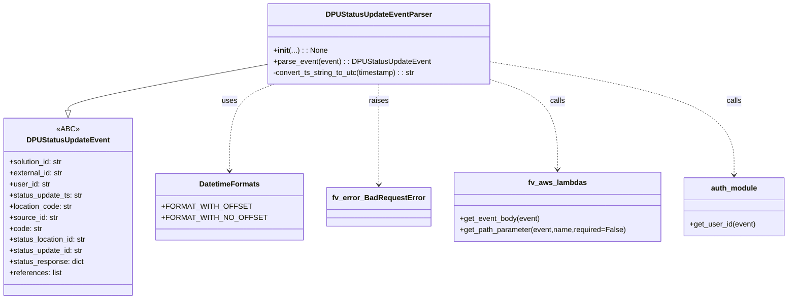
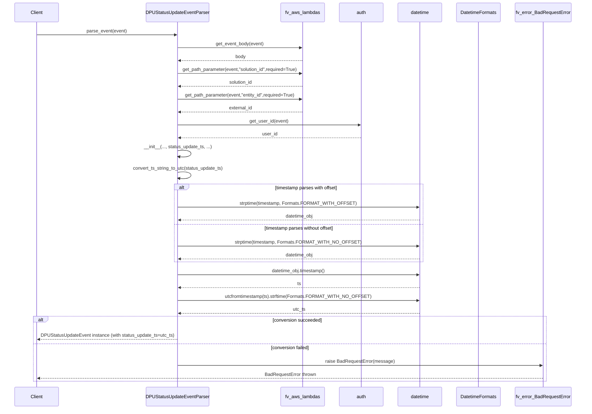

# Diagram: entity_core/entity_service/entity_service/dpu/dpu_service/service/dpu_status_update_event_parser.py

> Auto-generated by Obscura crawlers

## Diagram 1

### SVG

<svg id="container" width="1653.109375" xmlns="http://www.w3.org/2000/svg" class="classDiagram" height="648" viewBox="0 0 1653.109375 648" role="graphics-document document" aria-roledescription="class"><g><defs><marker id="container_class-aggregationStart" class="marker aggregation class" refX="18" refY="7" markerWidth="190" markerHeight="240" orient="auto"><path d="M 18,7 L9,13 L1,7 L9,1 Z"></path></marker></defs><defs><marker id="container_class-aggregationEnd" class="marker aggregation class" refX="1" refY="7" markerWidth="20" markerHeight="28" orient="auto"><path d="M 18,7 L9,13 L1,7 L9,1 Z"></path></marker></defs><defs><marker id="container_class-extensionStart" class="marker extension class" refX="18" refY="7" markerWidth="190" markerHeight="240" orient="auto"><path d="M 1,7 L18,13 V 1 Z"></path></marker></defs><defs><marker id="container_class-extensionEnd" class="marker extension class" refX="1" refY="7" markerWidth="20" markerHeight="28" orient="auto"><path d="M 1,1 V 13 L18,7 Z"></path></marker></defs><defs><marker id="container_class-compositionStart" class="marker composition class" refX="18" refY="7" markerWidth="190" markerHeight="240" orient="auto"><path d="M 18,7 L9,13 L1,7 L9,1 Z"></path></marker></defs><defs><marker id="container_class-compositionEnd" class="marker composition class" refX="1" refY="7" markerWidth="20" markerHeight="28" orient="auto"><path d="M 18,7 L9,13 L1,7 L9,1 Z"></path></marker></defs><defs><marker id="container_class-dependencyStart" class="marker dependency class" refX="6" refY="7" markerWidth="190" markerHeight="240" orient="auto"><path d="M 5,7 L9,13 L1,7 L9,1 Z"></path></marker></defs><defs><marker id="container_class-dependencyEnd" class="marker dependency class" refX="13" refY="7" markerWidth="20" markerHeight="28" orient="auto"><path d="M 18,7 L9,13 L14,7 L9,1 Z"></path></marker></defs><defs><marker id="container_class-lollipopStart" class="marker lollipop class" refX="13" refY="7" markerWidth="190" markerHeight="240" orient="auto"><circle stroke="black" fill="transparent" cx="7" cy="7" r="6"></circle></marker></defs><defs><marker id="container_class-lollipopEnd" class="marker lollipop class" refX="1" refY="7" markerWidth="190" markerHeight="240" orient="auto"><circle stroke="black" fill="transparent" cx="7" cy="7" r="6"></circle></marker></defs><g class="root"><g class="clusters"></g><g class="edgePaths"><path d="M544.918,140.962L478.654,153.968C412.391,166.974,279.863,192.987,213.6,209.285C147.336,225.583,147.336,232.167,147.336,235.458L147.336,238.75" id="id_DPUStatusUpdateEventParser_DPUStatusUpdateEvent_1" class="edge-thickness-normal edge-pattern-solid relation" style=";;;" data-edge="true" data-et="edge" data-id="id_DPUStatusUpdateEventParser_DPUStatusUpdateEvent_1" data-points="W3sieCI6NTQ0LjkxNzk2ODc1LCJ5IjoxNDAuOTYxNTY0NjIxNjQ0MDJ9LHsieCI6MTQ3LjMzNTkzNzUsInkiOjIxOX0seyJ4IjoxNDcuMzM1OTM3NSwieSI6MjU2fV0=" marker-end="url(#container_class-extensionEnd)"></path><path d="M568.808,182L553.904,188.167C539,194.333,509.191,206.667,494.287,238C479.383,269.333,479.383,319.667,479.383,344.833L479.383,370" id="id_DPUStatusUpdateEventParser_DatetimeFormats_2" class="edge-thickness-normal edge-pattern-dashed relation" style=";;;" data-edge="true" data-et="edge" data-id="id_DPUStatusUpdateEventParser_DatetimeFormats_2" data-points="W3sieCI6NTY4LjgwODAyNjcxMzcwOTYsInkiOjE4Mn0seyJ4Ijo0NzkuMzgyODEyNSwieSI6MjE5fSx7IngiOjQ3OS4zODI4MTI1LCJ5IjozNzZ9XQ==" marker-end="url(#container_class-dependencyEnd)"></path><path d="M779.078,182L779.078,188.167C779.078,194.333,779.078,206.667,779.078,243C779.078,279.333,779.078,339.667,779.078,369.833L779.078,400" id="id_DPUStatusUpdateEventParser_fv_error_BadRequestError_3" class="edge-thickness-normal edge-pattern-dashed relation" style=";;;" data-edge="true" data-et="edge" data-id="id_DPUStatusUpdateEventParser_fv_error_BadRequestError_3" data-points="W3sieCI6Nzc5LjA3ODEyNSwieSI6MTgyfSx7IngiOjc3OS4wNzgxMjUsInkiOjIxOX0seyJ4Ijo3NzkuMDc4MTI1LCJ5Ijo0MDZ9XQ==" marker-end="url(#container_class-dependencyEnd)"></path><path d="M1013.238,171.555L1037.425,179.462C1061.612,187.37,1109.986,203.185,1134.173,235.759C1158.359,268.333,1158.359,317.667,1158.359,342.333L1158.359,367" id="id_DPUStatusUpdateEventParser_fv_aws_lambdas_4" class="edge-thickness-normal edge-pattern-dashed relation" style=";;;" data-edge="true" data-et="edge" data-id="id_DPUStatusUpdateEventParser_fv_aws_lambdas_4" data-points="W3sieCI6MTAxMy4yMzgyODEyNSwieSI6MTcxLjU1NDk1NTkxOTkxNDN9LHsieCI6MTE1OC4zNTkzNzUsInkiOjIxOX0seyJ4IjoxMTU4LjM1OTM3NSwieSI6MzczfV0=" marker-end="url(#container_class-dependencyEnd)"></path><path d="M1013.238,133.265L1100.679,147.554C1188.12,161.844,1363.001,190.422,1450.442,231.378C1537.883,272.333,1537.883,325.667,1537.883,352.333L1537.883,379" id="id_DPUStatusUpdateEventParser_auth_module_5" class="edge-thickness-normal edge-pattern-dashed relation" style=";;;" data-edge="true" data-et="edge" data-id="id_DPUStatusUpdateEventParser_auth_module_5" data-points="W3sieCI6MTAxMy4yMzgyODEyNSwieSI6MTMzLjI2NTI2MDk0NzAwNzUzfSx7IngiOjE1MzcuODgyODEyNSwieSI6MjE5fSx7IngiOjE1MzcuODgyODEyNSwieSI6Mzg1fV0=" marker-end="url(#container_class-dependencyEnd)"></path></g><g class="edgeLabels"><g class="edgeLabel"><g class="label" data-id="id_DPUStatusUpdateEventParser_DPUStatusUpdateEvent_1" transform="translate(0, 0)"><foreignObject width="0" height="0">

</foreignObject></g></g><g class="edgeLabel" transform="translate(479.3828125, 219)"><g class="label" data-id="id_DPUStatusUpdateEventParser_DatetimeFormats_2" transform="translate(-16.4921875, -12)"><foreignObject width="32.984375" height="24">

uses

</foreignObject></g></g><g class="edgeLabel" transform="translate(779.078125, 219)"><g class="label" data-id="id_DPUStatusUpdateEventParser_fv_error_BadRequestError_3" transform="translate(-21.25, -12)"><foreignObject width="42.5" height="24">

raises

</foreignObject></g></g><g class="edgeLabel" transform="translate(1158.359375, 219)"><g class="label" data-id="id_DPUStatusUpdateEventParser_fv_aws_lambdas_4" transform="translate(-16.4453125, -12)"><foreignObject width="32.890625" height="24">

calls

</foreignObject></g></g><g class="edgeLabel" transform="translate(1537.8828125, 219)"><g class="label" data-id="id_DPUStatusUpdateEventParser_auth_module_5" transform="translate(-16.4453125, -12)"><foreignObject width="32.890625" height="24">

calls

</foreignObject></g></g></g><g class="nodes"><g class="node default" id="classId-DPUStatusUpdateEvent-0" transform="translate(147.3359375, 448)"><g class="basic label-container"><path d="M-139.3359375 -192 L139.3359375 -192 L139.3359375 192 L-139.3359375 192" stroke="none" stroke-width="0" fill="#ECECFF" style=""></path><path d="M-139.3359375 -192 C-50.17324677307495 -192, 38.9894439538501 -192, 139.3359375 -192 M-139.3359375 -192 C-75.68851399209075 -192, -12.041090484181481 -192, 139.3359375 -192 M139.3359375 -192 C139.3359375 -77.76835544058602, 139.3359375 36.46328911882796, 139.3359375 192 M139.3359375 -192 C139.3359375 -70.93600142253511, 139.3359375 50.12799715492977, 139.3359375 192 M139.3359375 192 C53.93181266989474 192, -31.47231216021052 192, -139.3359375 192 M139.3359375 192 C70.67568613557049 192, 2.015434771140974 192, -139.3359375 192 M-139.3359375 192 C-139.3359375 94.54243064890633, -139.3359375 -2.9151387021873347, -139.3359375 -192 M-139.3359375 192 C-139.3359375 40.626323991528864, -139.3359375 -110.74735201694227, -139.3359375 -192" stroke="#9370DB" stroke-width="1.3" fill="none" stroke-dasharray="0 0" style=""></path></g><g class="annotation-group text" transform="translate(-22.8984375, -168)"><g class="label" style="" transform="translate(0,-12)"><foreignObject width="45.796875" height="24">

«ABC»

</foreignObject></g></g><g class="label-group text" transform="translate(-85.390625, -144)"><g class="label" style="font-weight: bolder" transform="translate(0,-12)"><foreignObject width="170.78125" height="24">

DPUStatusUpdateEvent

</foreignObject></g></g><g class="members-group text" transform="translate(-127.3359375, -96)"><g class="label" style="" transform="translate(0,-12)"><foreignObject width="117.71875" height="24">

+solution_id: str

</foreignObject></g><g class="label" style="" transform="translate(0,12)"><foreignObject width="117.265625" height="24">

+external_id: str

</foreignObject></g><g class="label" style="" transform="translate(0,36)"><foreignObject width="88.296875" height="24">

+user_id: str

</foreignObject></g><g class="label" style="" transform="translate(0,60)"><foreignObject width="159.84375" height="24">

+status_update_ts: str

</foreignObject></g><g class="label" style="" transform="translate(0,84)"><foreignObject width="137.609375" height="24">

+location_code: str

</foreignObject></g><g class="label" style="" transform="translate(0,108)"><foreignObject width="105.453125" height="24">

+source_id: str

</foreignObject></g><g class="label" style="" transform="translate(0,132)"><foreignObject width="70.453125" height="24">

+code: str

</foreignObject></g><g class="label" style="" transform="translate(0,156)"><foreignObject width="169.28125" height="24">

+status_location_id: str

</foreignObject></g><g class="label" style="" transform="translate(0,180)"><foreignObject width="161" height="24">

+status_update_id: str

</foreignObject></g><g class="label" style="" transform="translate(0,204)"><foreignObject width="162.28125" height="24">

+status_response: dict

</foreignObject></g><g class="label" style="" transform="translate(0,228)"><foreignObject width="114.171875" height="24">

+references: list

</foreignObject></g></g><g class="methods-group text" transform="translate(-127.3359375, 192)"></g><g class="divider" style=""><path d="M-139.3359375 -120 C-36.45713092497715 -120, 66.4216756500457 -120, 139.3359375 -120 M-139.3359375 -120 C-54.44206782553513 -120, 30.451801848929733 -120, 139.3359375 -120" stroke="#9370DB" stroke-width="1.3" fill="none" stroke-dasharray="0 0" style=""></path></g><g class="divider" style=""><path d="M-139.3359375 168 C-57.942523755866276 168, 23.45088998826745 168, 139.3359375 168 M-139.3359375 168 C-76.56235578453405 168, -13.788774069068111 168, 139.3359375 168" stroke="#9370DB" stroke-width="1.3" fill="none" stroke-dasharray="0 0" style=""></path></g></g><g class="node default" id="classId-DPUStatusUpdateEventParser-1" transform="translate(779.078125, 95)"><g class="basic label-container"><path d="M-234.16015625 -87 L234.16015625 -87 L234.16015625 87 L-234.16015625 87" stroke="none" stroke-width="0" fill="#ECECFF" style=""></path><path d="M-234.16015625 -87 C-134.63683741453013 -87, -35.11351857906027 -87, 234.16015625 -87 M-234.16015625 -87 C-131.14601829366683 -87, -28.131880337333683 -87, 234.16015625 -87 M234.16015625 -87 C234.16015625 -51.16602056005256, 234.16015625 -15.332041120105117, 234.16015625 87 M234.16015625 -87 C234.16015625 -47.479647859873864, 234.16015625 -7.959295719747729, 234.16015625 87 M234.16015625 87 C96.33207060485688 87, -41.49601504028624 87, -234.16015625 87 M234.16015625 87 C139.4739148991041 87, 44.787673548208176 87, -234.16015625 87 M-234.16015625 87 C-234.16015625 36.60267210249869, -234.16015625 -13.794655795002626, -234.16015625 -87 M-234.16015625 87 C-234.16015625 20.880892387298914, -234.16015625 -45.23821522540217, -234.16015625 -87" stroke="#9370DB" stroke-width="1.3" fill="none" stroke-dasharray="0 0" style=""></path></g><g class="annotation-group text" transform="translate(0, -63)"></g><g class="label-group text" transform="translate(-108.7578125, -63)"><g class="label" style="font-weight: bolder" transform="translate(0,-12)"><foreignObject width="217.515625" height="24">

DPUStatusUpdateEventParser

</foreignObject></g></g><g class="members-group text" transform="translate(-222.16015625, -15)"></g><g class="methods-group text" transform="translate(-222.16015625, 15)"><g class="label" style="" transform="translate(0,-12)"><foreignObject width="113.078125" height="24">

+<strong>init</strong>(...) : : None

</foreignObject></g><g class="label" style="" transform="translate(0,12)"><foreignObject width="335.5625" height="24">

+parse_event(event) : : DPUStatusUpdateEvent

</foreignObject></g><g class="label" style="" transform="translate(0,36)"><foreignObject width="312.84375" height="24">

-convert_ts_string_to_utc(timestamp) : : str

</foreignObject></g></g><g class="divider" style=""><path d="M-234.16015625 -39 C-76.04748327239068 -39, 82.06518970521864 -39, 234.16015625 -39 M-234.16015625 -39 C-66.7901149517266 -39, 100.57992634654681 -39, 234.16015625 -39" stroke="#9370DB" stroke-width="1.3" fill="none" stroke-dasharray="0 0" style=""></path></g><g class="divider" style=""><path d="M-234.16015625 -15 C-68.31614405412913 -15, 97.52786814174175 -15, 234.16015625 -15 M-234.16015625 -15 C-73.25297296737892 -15, 87.65421031524215 -15, 234.16015625 -15" stroke="#9370DB" stroke-width="1.3" fill="none" stroke-dasharray="0 0" style=""></path></g></g><g class="node default" id="classId-DatetimeFormats-2" transform="translate(479.3828125, 448)"><g class="basic label-container"><path d="M-142.7109375 -72 L142.7109375 -72 L142.7109375 72 L-142.7109375 72" stroke="none" stroke-width="0" fill="#ECECFF" style=""></path><path d="M-142.7109375 -72 C-56.702270650362806 -72, 29.30639619927439 -72, 142.7109375 -72 M-142.7109375 -72 C-47.05181299754774 -72, 48.607311504904516 -72, 142.7109375 -72 M142.7109375 -72 C142.7109375 -37.446679737674586, 142.7109375 -2.893359475349172, 142.7109375 72 M142.7109375 -72 C142.7109375 -19.883684521186957, 142.7109375 32.232630957626085, 142.7109375 72 M142.7109375 72 C59.41511081427598 72, -23.880715871448047 72, -142.7109375 72 M142.7109375 72 C51.86078777534364 72, -38.98936194931272 72, -142.7109375 72 M-142.7109375 72 C-142.7109375 30.681704477786347, -142.7109375 -10.636591044427306, -142.7109375 -72 M-142.7109375 72 C-142.7109375 29.216094542582802, -142.7109375 -13.567810914834396, -142.7109375 -72" stroke="#9370DB" stroke-width="1.3" fill="none" stroke-dasharray="0 0" style=""></path></g><g class="annotation-group text" transform="translate(0, -48)"></g><g class="label-group text" transform="translate(-62.984375, -48)"><g class="label" style="font-weight: bolder" transform="translate(0,-12)"><foreignObject width="125.96875" height="24">

DatetimeFormats

</foreignObject></g></g><g class="members-group text" transform="translate(-130.7109375, 0)"><g class="label" style="" transform="translate(0,-12)"><foreignObject width="168.765625" height="24">

+FORMAT_WITH_OFFSET

</foreignObject></g><g class="label" style="" transform="translate(0,12)"><foreignObject width="198.4375" height="24">

+FORMAT_WITH_NO_OFFSET

</foreignObject></g></g><g class="methods-group text" transform="translate(-130.7109375, 72)"></g><g class="divider" style=""><path d="M-142.7109375 -24 C-30.449938055730655 -24, 81.81106138853869 -24, 142.7109375 -24 M-142.7109375 -24 C-69.96177659771676 -24, 2.787384304566473 -24, 142.7109375 -24" stroke="#9370DB" stroke-width="1.3" fill="none" stroke-dasharray="0 0" style=""></path></g><g class="divider" style=""><path d="M-142.7109375 48 C-73.27494199707054 48, -3.8389464941410836 48, 142.7109375 48 M-142.7109375 48 C-49.636776241426944 48, 43.43738501714611 48, 142.7109375 48" stroke="#9370DB" stroke-width="1.3" fill="none" stroke-dasharray="0 0" style=""></path></g></g><g class="node default" id="classId-fv_error_BadRequestError-3" transform="translate(779.078125, 448)"><g class="basic label-container"><path d="M-106.984375 -42 L106.984375 -42 L106.984375 42 L-106.984375 42" stroke="none" stroke-width="0" fill="#ECECFF" style=""></path><path d="M-106.984375 -42 C-50.34038008510335 -42, 6.303614829793304 -42, 106.984375 -42 M-106.984375 -42 C-36.4679301251813 -42, 34.048514749637405 -42, 106.984375 -42 M106.984375 -42 C106.984375 -9.657295398350648, 106.984375 22.685409203298704, 106.984375 42 M106.984375 -42 C106.984375 -23.377024069222617, 106.984375 -4.754048138445235, 106.984375 42 M106.984375 42 C48.69882134463442 42, -9.586732310731165 42, -106.984375 42 M106.984375 42 C28.358786993407392 42, -50.266801013185216 42, -106.984375 42 M-106.984375 42 C-106.984375 22.72217159341522, -106.984375 3.4443431868304373, -106.984375 -42 M-106.984375 42 C-106.984375 10.779796349504199, -106.984375 -20.440407300991602, -106.984375 -42" stroke="#9370DB" stroke-width="1.3" fill="none" stroke-dasharray="0 0" style=""></path></g><g class="annotation-group text" transform="translate(0, -18)"></g><g class="label-group text" transform="translate(-94.984375, -18)"><g class="label" style="font-weight: bolder" transform="translate(0,-12)"><foreignObject width="189.96875" height="24">

fv_error_BadRequestError

</foreignObject></g></g><g class="members-group text" transform="translate(-94.984375, 30)"></g><g class="methods-group text" transform="translate(-94.984375, 60)"></g><g class="divider" style=""><path d="M-106.984375 6 C-54.214873162053685 6, -1.44537132410737 6, 106.984375 6 M-106.984375 6 C-48.384591530487924 6, 10.215191939024152 6, 106.984375 6" stroke="#9370DB" stroke-width="1.3" fill="none" stroke-dasharray="0 0" style=""></path></g><g class="divider" style=""><path d="M-106.984375 24 C-50.723972515779096 24, 5.536429968441809 24, 106.984375 24 M-106.984375 24 C-51.499320132493125 24, 3.98573473501375 24, 106.984375 24" stroke="#9370DB" stroke-width="1.3" fill="none" stroke-dasharray="0 0" style=""></path></g></g><g class="node default" id="classId-fv_aws_lambdas-4" transform="translate(1158.359375, 448)"><g class="basic label-container"><path d="M-222.296875 -75 L222.296875 -75 L222.296875 75 L-222.296875 75" stroke="none" stroke-width="0" fill="#ECECFF" style=""></path><path d="M-222.296875 -75 C-107.8643754333305 -75, 6.568124133339012 -75, 222.296875 -75 M-222.296875 -75 C-51.84388247485825 -75, 118.6091100502835 -75, 222.296875 -75 M222.296875 -75 C222.296875 -38.995226591875316, 222.296875 -2.990453183750631, 222.296875 75 M222.296875 -75 C222.296875 -29.49710028582121, 222.296875 16.005799428357577, 222.296875 75 M222.296875 75 C78.17502282204197 75, -65.94682935591607 75, -222.296875 75 M222.296875 75 C109.10549951960243 75, -4.085875960795136 75, -222.296875 75 M-222.296875 75 C-222.296875 42.39437814169022, -222.296875 9.788756283380437, -222.296875 -75 M-222.296875 75 C-222.296875 19.35876370776503, -222.296875 -36.28247258446994, -222.296875 -75" stroke="#9370DB" stroke-width="1.3" fill="none" stroke-dasharray="0 0" style=""></path></g><g class="annotation-group text" transform="translate(0, -51)"></g><g class="label-group text" transform="translate(-60.0625, -51)"><g class="label" style="font-weight: bolder" transform="translate(0,-12)"><foreignObject width="120.125" height="24">

fv_aws_lambdas

</foreignObject></g></g><g class="members-group text" transform="translate(-210.296875, -3)"></g><g class="methods-group text" transform="translate(-210.296875, 27)"><g class="label" style="" transform="translate(0,-12)"><foreignObject width="174.203125" height="24">

+get_event_body(event)

</foreignObject></g><g class="label" style="" transform="translate(0,12)"><foreignObject width="360.53125" height="24">

+get_path_parameter(event,name,required=False)

</foreignObject></g></g><g class="divider" style=""><path d="M-222.296875 -27 C-63.54953929212644 -27, 95.19779641574712 -27, 222.296875 -27 M-222.296875 -27 C-122.94126465869779 -27, -23.58565431739558 -27, 222.296875 -27" stroke="#9370DB" stroke-width="1.3" fill="none" stroke-dasharray="0 0" style=""></path></g><g class="divider" style=""><path d="M-222.296875 -3 C-55.95703631526351 -3, 110.38280236947298 -3, 222.296875 -3 M-222.296875 -3 C-78.70453268068144 -3, 64.88780963863712 -3, 222.296875 -3" stroke="#9370DB" stroke-width="1.3" fill="none" stroke-dasharray="0 0" style=""></path></g></g><g class="node default" id="classId-auth_module-5" transform="translate(1537.8828125, 448)"><g class="basic label-container"><path d="M-107.2265625 -63 L107.2265625 -63 L107.2265625 63 L-107.2265625 63" stroke="none" stroke-width="0" fill="#ECECFF" style=""></path><path d="M-107.2265625 -63 C-37.91913875313479 -63, 31.388284993730423 -63, 107.2265625 -63 M-107.2265625 -63 C-30.533134357380362 -63, 46.160293785239276 -63, 107.2265625 -63 M107.2265625 -63 C107.2265625 -17.936854983356213, 107.2265625 27.126290033287574, 107.2265625 63 M107.2265625 -63 C107.2265625 -27.3487104043921, 107.2265625 8.302579191215798, 107.2265625 63 M107.2265625 63 C53.52325796487558 63, -0.18004657024883386 63, -107.2265625 63 M107.2265625 63 C56.38211055156097 63, 5.53765860312194 63, -107.2265625 63 M-107.2265625 63 C-107.2265625 27.859587158763937, -107.2265625 -7.280825682472127, -107.2265625 -63 M-107.2265625 63 C-107.2265625 14.219106948719713, -107.2265625 -34.561786102560575, -107.2265625 -63" stroke="#9370DB" stroke-width="1.3" fill="none" stroke-dasharray="0 0" style=""></path></g><g class="annotation-group text" transform="translate(0, -39)"></g><g class="label-group text" transform="translate(-48.390625, -39)"><g class="label" style="font-weight: bolder" transform="translate(0,-12)"><foreignObject width="96.78125" height="24">

auth_module

</foreignObject></g></g><g class="members-group text" transform="translate(-95.2265625, 9)"></g><g class="methods-group text" transform="translate(-95.2265625, 39)"><g class="label" style="" transform="translate(0,-12)"><foreignObject width="142.0625" height="24">

+get_user_id(event)

</foreignObject></g></g><g class="divider" style=""><path d="M-107.2265625 -15 C-61.46501819875742 -15, -15.70347389751484 -15, 107.2265625 -15 M-107.2265625 -15 C-36.06387355514238 -15, 35.09881538971524 -15, 107.2265625 -15" stroke="#9370DB" stroke-width="1.3" fill="none" stroke-dasharray="0 0" style=""></path></g><g class="divider" style=""><path d="M-107.2265625 9 C-27.917516130631483 9, 51.39153023873703 9, 107.2265625 9 M-107.2265625 9 C-36.72952690495238 9, 33.76750869009524 9, 107.2265625 9" stroke="#9370DB" stroke-width="1.3" fill="none" stroke-dasharray="0 0" style=""></path></g></g></g></g></g></svg>

## Diagram 2

### SVG

<svg id="container" width="2108" xmlns="http://www.w3.org/2000/svg" height="1487" viewBox="-50 -10 2108 1487" role="graphics-document document" aria-roledescription="sequence"><g><rect x="1800" y="1401" fill="#eaeaea" stroke="#666" width="208" height="65" name="Error" rx="3" ry="3" class="actor actor-bottom"></rect><text x="1904" y="1433.5" dominant-baseline="central" alignment-baseline="central" class="actor actor-box" style="text-anchor: middle; font-size: 16px; font-weight: 400;"><tspan x="1904" dy="0">fv_error_BadRequestError</tspan></text></g><g><rect x="1600" y="1401" fill="#eaeaea" stroke="#666" width="150" height="65" name="Formats" rx="3" ry="3" class="actor actor-bottom"></rect><text x="1675" y="1433.5" dominant-baseline="central" alignment-baseline="central" class="actor actor-box" style="text-anchor: middle; font-size: 16px; font-weight: 400;"><tspan x="1675" dy="0">DatetimeFormats</tspan></text></g><g><rect x="1400" y="1401" fill="#eaeaea" stroke="#666" width="150" height="65" name="Datetime" rx="3" ry="3" class="actor actor-bottom"></rect><text x="1475" y="1433.5" dominant-baseline="central" alignment-baseline="central" class="actor actor-box" style="text-anchor: middle; font-size: 16px; font-weight: 400;"><tspan x="1475" dy="0">datetime</tspan></text></g><g><rect x="1200" y="1401" fill="#eaeaea" stroke="#666" width="150" height="65" name="Auth" rx="3" ry="3" class="actor actor-bottom"></rect><text x="1275" y="1433.5" dominant-baseline="central" alignment-baseline="central" class="actor actor-box" style="text-anchor: middle; font-size: 16px; font-weight: 400;"><tspan x="1275" dy="0">auth</tspan></text></g><g><rect x="1000" y="1401" fill="#eaeaea" stroke="#666" width="150" height="65" name="Lambdas" rx="3" ry="3" class="actor actor-bottom"></rect><text x="1075" y="1433.5" dominant-baseline="central" alignment-baseline="central" class="actor actor-box" style="text-anchor: middle; font-size: 16px; font-weight: 400;"><tspan x="1075" dy="0">fv_aws_lambdas</tspan></text></g><g><rect x="487.5" y="1401" fill="#eaeaea" stroke="#666" width="235" height="65" name="Parser" rx="3" ry="3" class="actor actor-bottom"></rect><text x="605" y="1433.5" dominant-baseline="central" alignment-baseline="central" class="actor actor-box" style="text-anchor: middle; font-size: 16px; font-weight: 400;"><tspan x="605" dy="0">DPUStatusUpdateEventParser</tspan></text></g><g><rect x="0" y="1401" fill="#eaeaea" stroke="#666" width="150" height="65" name="Client" rx="3" ry="3" class="actor actor-bottom"></rect><text x="75" y="1433.5" dominant-baseline="central" alignment-baseline="central" class="actor actor-box" style="text-anchor: middle; font-size: 16px; font-weight: 400;"><tspan x="75" dy="0">Client</tspan></text></g><g><line id="actor6" x1="1904" y1="65" x2="1904" y2="1401" class="actor-line 200" stroke-width="0.5px" stroke="#999" name="Error"></line><g id="root-6"><rect x="1800" y="0" fill="#eaeaea" stroke="#666" width="208" height="65" name="Error" rx="3" ry="3" class="actor actor-top"></rect><text x="1904" y="32.5" dominant-baseline="central" alignment-baseline="central" class="actor actor-box" style="text-anchor: middle; font-size: 16px; font-weight: 400;"><tspan x="1904" dy="0">fv_error_BadRequestError</tspan></text></g></g><g><line id="actor5" x1="1675" y1="65" x2="1675" y2="1401" class="actor-line 200" stroke-width="0.5px" stroke="#999" name="Formats"></line><g id="root-5"><rect x="1600" y="0" fill="#eaeaea" stroke="#666" width="150" height="65" name="Formats" rx="3" ry="3" class="actor actor-top"></rect><text x="1675" y="32.5" dominant-baseline="central" alignment-baseline="central" class="actor actor-box" style="text-anchor: middle; font-size: 16px; font-weight: 400;"><tspan x="1675" dy="0">DatetimeFormats</tspan></text></g></g><g><line id="actor4" x1="1475" y1="65" x2="1475" y2="1401" class="actor-line 200" stroke-width="0.5px" stroke="#999" name="Datetime"></line><g id="root-4"><rect x="1400" y="0" fill="#eaeaea" stroke="#666" width="150" height="65" name="Datetime" rx="3" ry="3" class="actor actor-top"></rect><text x="1475" y="32.5" dominant-baseline="central" alignment-baseline="central" class="actor actor-box" style="text-anchor: middle; font-size: 16px; font-weight: 400;"><tspan x="1475" dy="0">datetime</tspan></text></g></g><g><line id="actor3" x1="1275" y1="65" x2="1275" y2="1401" class="actor-line 200" stroke-width="0.5px" stroke="#999" name="Auth"></line><g id="root-3"><rect x="1200" y="0" fill="#eaeaea" stroke="#666" width="150" height="65" name="Auth" rx="3" ry="3" class="actor actor-top"></rect><text x="1275" y="32.5" dominant-baseline="central" alignment-baseline="central" class="actor actor-box" style="text-anchor: middle; font-size: 16px; font-weight: 400;"><tspan x="1275" dy="0">auth</tspan></text></g></g><g><line id="actor2" x1="1075" y1="65" x2="1075" y2="1401" class="actor-line 200" stroke-width="0.5px" stroke="#999" name="Lambdas"></line><g id="root-2"><rect x="1000" y="0" fill="#eaeaea" stroke="#666" width="150" height="65" name="Lambdas" rx="3" ry="3" class="actor actor-top"></rect><text x="1075" y="32.5" dominant-baseline="central" alignment-baseline="central" class="actor actor-box" style="text-anchor: middle; font-size: 16px; font-weight: 400;"><tspan x="1075" dy="0">fv_aws_lambdas</tspan></text></g></g><g><line id="actor1" x1="605" y1="65" x2="605" y2="1401" class="actor-line 200" stroke-width="0.5px" stroke="#999" name="Parser"></line><g id="root-1"><rect x="487.5" y="0" fill="#eaeaea" stroke="#666" width="235" height="65" name="Parser" rx="3" ry="3" class="actor actor-top"></rect><text x="605" y="32.5" dominant-baseline="central" alignment-baseline="central" class="actor actor-box" style="text-anchor: middle; font-size: 16px; font-weight: 400;"><tspan x="605" dy="0">DPUStatusUpdateEventParser</tspan></text></g></g><g><line id="actor0" x1="75" y1="65" x2="75" y2="1401" class="actor-line 200" stroke-width="0.5px" stroke="#999" name="Client"></line><g id="root-0"><rect x="0" y="0" fill="#eaeaea" stroke="#666" width="150" height="65" name="Client" rx="3" ry="3" class="actor actor-top"></rect><text x="75" y="32.5" dominant-baseline="central" alignment-baseline="central" class="actor actor-box" style="text-anchor: middle; font-size: 16px; font-weight: 400;"><tspan x="75" dy="0">Client</tspan></text></g></g><g></g><defs><symbol id="computer" width="24" height="24"><path transform="scale(.5)" d="M2 2v13h20v-13h-20zm18 11h-16v-9h16v9zm-10.228 6l.466-1h3.524l.467 1h-4.457zm14.228 3h-24l2-6h2.104l-1.33 4h18.45l-1.297-4h2.073l2 6zm-5-10h-14v-7h14v7z"></path></symbol></defs><defs><symbol id="database" fill-rule="evenodd" clip-rule="evenodd"><path transform="scale(.5)" d="M12.258.001l.256.004.255.005.253.008.251.01.249.012.247.015.246.016.242.019.241.02.239.023.236.024.233.027.231.028.229.031.225.032.223.034.22.036.217.038.214.04.211.041.208.043.205.045.201.046.198.048.194.05.191.051.187.053.183.054.18.056.175.057.172.059.168.06.163.061.16.063.155.064.15.066.074.033.073.033.071.034.07.034.069.035.068.035.067.035.066.035.064.036.064.036.062.036.06.036.06.037.058.037.058.037.055.038.055.038.053.038.052.038.051.039.05.039.048.039.047.039.045.04.044.04.043.04.041.04.04.041.039.041.037.041.036.041.034.041.033.042.032.042.03.042.029.042.027.042.026.043.024.043.023.043.021.043.02.043.018.044.017.043.015.044.013.044.012.044.011.045.009.044.007.045.006.045.004.045.002.045.001.045v17l-.001.045-.002.045-.004.045-.006.045-.007.045-.009.044-.011.045-.012.044-.013.044-.015.044-.017.043-.018.044-.02.043-.021.043-.023.043-.024.043-.026.043-.027.042-.029.042-.03.042-.032.042-.033.042-.034.041-.036.041-.037.041-.039.041-.04.041-.041.04-.043.04-.044.04-.045.04-.047.039-.048.039-.05.039-.051.039-.052.038-.053.038-.055.038-.055.038-.058.037-.058.037-.06.037-.06.036-.062.036-.064.036-.064.036-.066.035-.067.035-.068.035-.069.035-.07.034-.071.034-.073.033-.074.033-.15.066-.155.064-.16.063-.163.061-.168.06-.172.059-.175.057-.18.056-.183.054-.187.053-.191.051-.194.05-.198.048-.201.046-.205.045-.208.043-.211.041-.214.04-.217.038-.22.036-.223.034-.225.032-.229.031-.231.028-.233.027-.236.024-.239.023-.241.02-.242.019-.246.016-.247.015-.249.012-.251.01-.253.008-.255.005-.256.004-.258.001-.258-.001-.256-.004-.255-.005-.253-.008-.251-.01-.249-.012-.247-.015-.245-.016-.243-.019-.241-.02-.238-.023-.236-.024-.234-.027-.231-.028-.228-.031-.226-.032-.223-.034-.22-.036-.217-.038-.214-.04-.211-.041-.208-.043-.204-.045-.201-.046-.198-.048-.195-.05-.19-.051-.187-.053-.184-.054-.179-.056-.176-.057-.172-.059-.167-.06-.164-.061-.159-.063-.155-.064-.151-.066-.074-.033-.072-.033-.072-.034-.07-.034-.069-.035-.068-.035-.067-.035-.066-.035-.064-.036-.063-.036-.062-.036-.061-.036-.06-.037-.058-.037-.057-.037-.056-.038-.055-.038-.053-.038-.052-.038-.051-.039-.049-.039-.049-.039-.046-.039-.046-.04-.044-.04-.043-.04-.041-.04-.04-.041-.039-.041-.037-.041-.036-.041-.034-.041-.033-.042-.032-.042-.03-.042-.029-.042-.027-.042-.026-.043-.024-.043-.023-.043-.021-.043-.02-.043-.018-.044-.017-.043-.015-.044-.013-.044-.012-.044-.011-.045-.009-.044-.007-.045-.006-.045-.004-.045-.002-.045-.001-.045v-17l.001-.045.002-.045.004-.045.006-.045.007-.045.009-.044.011-.045.012-.044.013-.044.015-.044.017-.043.018-.044.02-.043.021-.043.023-.043.024-.043.026-.043.027-.042.029-.042.03-.042.032-.042.033-.042.034-.041.036-.041.037-.041.039-.041.04-.041.041-.04.043-.04.044-.04.046-.04.046-.039.049-.039.049-.039.051-.039.052-.038.053-.038.055-.038.056-.038.057-.037.058-.037.06-.037.061-.036.062-.036.063-.036.064-.036.066-.035.067-.035.068-.035.069-.035.07-.034.072-.034.072-.033.074-.033.151-.066.155-.064.159-.063.164-.061.167-.06.172-.059.176-.057.179-.056.184-.054.187-.053.19-.051.195-.05.198-.048.201-.046.204-.045.208-.043.211-.041.214-.04.217-.038.22-.036.223-.034.226-.032.228-.031.231-.028.234-.027.236-.024.238-.023.241-.02.243-.019.245-.016.247-.015.249-.012.251-.01.253-.008.255-.005.256-.004.258-.001.258.001zm-9.258 20.499v.01l.001.021.003.021.004.022.005.021.006.022.007.022.009.023.01.022.011.023.012.023.013.023.015.023.016.024.017.023.018.024.019.024.021.024.022.025.023.024.024.025.052.049.056.05.061.051.066.051.07.051.075.051.079.052.084.052.088.052.092.052.097.052.102.051.105.052.11.052.114.051.119.051.123.051.127.05.131.05.135.05.139.048.144.049.147.047.152.047.155.047.16.045.163.045.167.043.171.043.176.041.178.041.183.039.187.039.19.037.194.035.197.035.202.033.204.031.209.03.212.029.216.027.219.025.222.024.226.021.23.02.233.018.236.016.24.015.243.012.246.01.249.008.253.005.256.004.259.001.26-.001.257-.004.254-.005.25-.008.247-.011.244-.012.241-.014.237-.016.233-.018.231-.021.226-.021.224-.024.22-.026.216-.027.212-.028.21-.031.205-.031.202-.034.198-.034.194-.036.191-.037.187-.039.183-.04.179-.04.175-.042.172-.043.168-.044.163-.045.16-.046.155-.046.152-.047.148-.048.143-.049.139-.049.136-.05.131-.05.126-.05.123-.051.118-.052.114-.051.11-.052.106-.052.101-.052.096-.052.092-.052.088-.053.083-.051.079-.052.074-.052.07-.051.065-.051.06-.051.056-.05.051-.05.023-.024.023-.025.021-.024.02-.024.019-.024.018-.024.017-.024.015-.023.014-.024.013-.023.012-.023.01-.023.01-.022.008-.022.006-.022.006-.022.004-.022.004-.021.001-.021.001-.021v-4.127l-.077.055-.08.053-.083.054-.085.053-.087.052-.09.052-.093.051-.095.05-.097.05-.1.049-.102.049-.105.048-.106.047-.109.047-.111.046-.114.045-.115.045-.118.044-.12.043-.122.042-.124.042-.126.041-.128.04-.13.04-.132.038-.134.038-.135.037-.138.037-.139.035-.142.035-.143.034-.144.033-.147.032-.148.031-.15.03-.151.03-.153.029-.154.027-.156.027-.158.026-.159.025-.161.024-.162.023-.163.022-.165.021-.166.02-.167.019-.169.018-.169.017-.171.016-.173.015-.173.014-.175.013-.175.012-.177.011-.178.01-.179.008-.179.008-.181.006-.182.005-.182.004-.184.003-.184.002h-.37l-.184-.002-.184-.003-.182-.004-.182-.005-.181-.006-.179-.008-.179-.008-.178-.01-.176-.011-.176-.012-.175-.013-.173-.014-.172-.015-.171-.016-.17-.017-.169-.018-.167-.019-.166-.02-.165-.021-.163-.022-.162-.023-.161-.024-.159-.025-.157-.026-.156-.027-.155-.027-.153-.029-.151-.03-.15-.03-.148-.031-.146-.032-.145-.033-.143-.034-.141-.035-.14-.035-.137-.037-.136-.037-.134-.038-.132-.038-.13-.04-.128-.04-.126-.041-.124-.042-.122-.042-.12-.044-.117-.043-.116-.045-.113-.045-.112-.046-.109-.047-.106-.047-.105-.048-.102-.049-.1-.049-.097-.05-.095-.05-.093-.052-.09-.051-.087-.052-.085-.053-.083-.054-.08-.054-.077-.054v4.127zm0-5.654v.011l.001.021.003.021.004.021.005.022.006.022.007.022.009.022.01.022.011.023.012.023.013.023.015.024.016.023.017.024.018.024.019.024.021.024.022.024.023.025.024.024.052.05.056.05.061.05.066.051.07.051.075.052.079.051.084.052.088.052.092.052.097.052.102.052.105.052.11.051.114.051.119.052.123.05.127.051.131.05.135.049.139.049.144.048.147.048.152.047.155.046.16.045.163.045.167.044.171.042.176.042.178.04.183.04.187.038.19.037.194.036.197.034.202.033.204.032.209.03.212.028.216.027.219.025.222.024.226.022.23.02.233.018.236.016.24.014.243.012.246.01.249.008.253.006.256.003.259.001.26-.001.257-.003.254-.006.25-.008.247-.01.244-.012.241-.015.237-.016.233-.018.231-.02.226-.022.224-.024.22-.025.216-.027.212-.029.21-.03.205-.032.202-.033.198-.035.194-.036.191-.037.187-.039.183-.039.179-.041.175-.042.172-.043.168-.044.163-.045.16-.045.155-.047.152-.047.148-.048.143-.048.139-.05.136-.049.131-.05.126-.051.123-.051.118-.051.114-.052.11-.052.106-.052.101-.052.096-.052.092-.052.088-.052.083-.052.079-.052.074-.051.07-.052.065-.051.06-.05.056-.051.051-.049.023-.025.023-.024.021-.025.02-.024.019-.024.018-.024.017-.024.015-.023.014-.023.013-.024.012-.022.01-.023.01-.023.008-.022.006-.022.006-.022.004-.021.004-.022.001-.021.001-.021v-4.139l-.077.054-.08.054-.083.054-.085.052-.087.053-.09.051-.093.051-.095.051-.097.05-.1.049-.102.049-.105.048-.106.047-.109.047-.111.046-.114.045-.115.044-.118.044-.12.044-.122.042-.124.042-.126.041-.128.04-.13.039-.132.039-.134.038-.135.037-.138.036-.139.036-.142.035-.143.033-.144.033-.147.033-.148.031-.15.03-.151.03-.153.028-.154.028-.156.027-.158.026-.159.025-.161.024-.162.023-.163.022-.165.021-.166.02-.167.019-.169.018-.169.017-.171.016-.173.015-.173.014-.175.013-.175.012-.177.011-.178.009-.179.009-.179.007-.181.007-.182.005-.182.004-.184.003-.184.002h-.37l-.184-.002-.184-.003-.182-.004-.182-.005-.181-.007-.179-.007-.179-.009-.178-.009-.176-.011-.176-.012-.175-.013-.173-.014-.172-.015-.171-.016-.17-.017-.169-.018-.167-.019-.166-.02-.165-.021-.163-.022-.162-.023-.161-.024-.159-.025-.157-.026-.156-.027-.155-.028-.153-.028-.151-.03-.15-.03-.148-.031-.146-.033-.145-.033-.143-.033-.141-.035-.14-.036-.137-.036-.136-.037-.134-.038-.132-.039-.13-.039-.128-.04-.126-.041-.124-.042-.122-.043-.12-.043-.117-.044-.116-.044-.113-.046-.112-.046-.109-.046-.106-.047-.105-.048-.102-.049-.1-.049-.097-.05-.095-.051-.093-.051-.09-.051-.087-.053-.085-.052-.083-.054-.08-.054-.077-.054v4.139zm0-5.666v.011l.001.02.003.022.004.021.005.022.006.021.007.022.009.023.01.022.011.023.012.023.013.023.015.023.016.024.017.024.018.023.019.024.021.025.022.024.023.024.024.025.052.05.056.05.061.05.066.051.07.051.075.052.079.051.084.052.088.052.092.052.097.052.102.052.105.051.11.052.114.051.119.051.123.051.127.05.131.05.135.05.139.049.144.048.147.048.152.047.155.046.16.045.163.045.167.043.171.043.176.042.178.04.183.04.187.038.19.037.194.036.197.034.202.033.204.032.209.03.212.028.216.027.219.025.222.024.226.021.23.02.233.018.236.017.24.014.243.012.246.01.249.008.253.006.256.003.259.001.26-.001.257-.003.254-.006.25-.008.247-.01.244-.013.241-.014.237-.016.233-.018.231-.02.226-.022.224-.024.22-.025.216-.027.212-.029.21-.03.205-.032.202-.033.198-.035.194-.036.191-.037.187-.039.183-.039.179-.041.175-.042.172-.043.168-.044.163-.045.16-.045.155-.047.152-.047.148-.048.143-.049.139-.049.136-.049.131-.051.126-.05.123-.051.118-.052.114-.051.11-.052.106-.052.101-.052.096-.052.092-.052.088-.052.083-.052.079-.052.074-.052.07-.051.065-.051.06-.051.056-.05.051-.049.023-.025.023-.025.021-.024.02-.024.019-.024.018-.024.017-.024.015-.023.014-.024.013-.023.012-.023.01-.022.01-.023.008-.022.006-.022.006-.022.004-.022.004-.021.001-.021.001-.021v-4.153l-.077.054-.08.054-.083.053-.085.053-.087.053-.09.051-.093.051-.095.051-.097.05-.1.049-.102.048-.105.048-.106.048-.109.046-.111.046-.114.046-.115.044-.118.044-.12.043-.122.043-.124.042-.126.041-.128.04-.13.039-.132.039-.134.038-.135.037-.138.036-.139.036-.142.034-.143.034-.144.033-.147.032-.148.032-.15.03-.151.03-.153.028-.154.028-.156.027-.158.026-.159.024-.161.024-.162.023-.163.023-.165.021-.166.02-.167.019-.169.018-.169.017-.171.016-.173.015-.173.014-.175.013-.175.012-.177.01-.178.01-.179.009-.179.007-.181.006-.182.006-.182.004-.184.003-.184.001-.185.001-.185-.001-.184-.001-.184-.003-.182-.004-.182-.006-.181-.006-.179-.007-.179-.009-.178-.01-.176-.01-.176-.012-.175-.013-.173-.014-.172-.015-.171-.016-.17-.017-.169-.018-.167-.019-.166-.02-.165-.021-.163-.023-.162-.023-.161-.024-.159-.024-.157-.026-.156-.027-.155-.028-.153-.028-.151-.03-.15-.03-.148-.032-.146-.032-.145-.033-.143-.034-.141-.034-.14-.036-.137-.036-.136-.037-.134-.038-.132-.039-.13-.039-.128-.041-.126-.041-.124-.041-.122-.043-.12-.043-.117-.044-.116-.044-.113-.046-.112-.046-.109-.046-.106-.048-.105-.048-.102-.048-.1-.05-.097-.049-.095-.051-.093-.051-.09-.052-.087-.052-.085-.053-.083-.053-.08-.054-.077-.054v4.153zm8.74-8.179l-.257.004-.254.005-.25.008-.247.011-.244.012-.241.014-.237.016-.233.018-.231.021-.226.022-.224.023-.22.026-.216.027-.212.028-.21.031-.205.032-.202.033-.198.034-.194.036-.191.038-.187.038-.183.04-.179.041-.175.042-.172.043-.168.043-.163.045-.16.046-.155.046-.152.048-.148.048-.143.048-.139.049-.136.05-.131.05-.126.051-.123.051-.118.051-.114.052-.11.052-.106.052-.101.052-.096.052-.092.052-.088.052-.083.052-.079.052-.074.051-.07.052-.065.051-.06.05-.056.05-.051.05-.023.025-.023.024-.021.024-.02.025-.019.024-.018.024-.017.023-.015.024-.014.023-.013.023-.012.023-.01.023-.01.022-.008.022-.006.023-.006.021-.004.022-.004.021-.001.021-.001.021.001.021.001.021.004.021.004.022.006.021.006.023.008.022.01.022.01.023.012.023.013.023.014.023.015.024.017.023.018.024.019.024.02.025.021.024.023.024.023.025.051.05.056.05.06.05.065.051.07.052.074.051.079.052.083.052.088.052.092.052.096.052.101.052.106.052.11.052.114.052.118.051.123.051.126.051.131.05.136.05.139.049.143.048.148.048.152.048.155.046.16.046.163.045.168.043.172.043.175.042.179.041.183.04.187.038.191.038.194.036.198.034.202.033.205.032.21.031.212.028.216.027.22.026.224.023.226.022.231.021.233.018.237.016.241.014.244.012.247.011.25.008.254.005.257.004.26.001.26-.001.257-.004.254-.005.25-.008.247-.011.244-.012.241-.014.237-.016.233-.018.231-.021.226-.022.224-.023.22-.026.216-.027.212-.028.21-.031.205-.032.202-.033.198-.034.194-.036.191-.038.187-.038.183-.04.179-.041.175-.042.172-.043.168-.043.163-.045.16-.046.155-.046.152-.048.148-.048.143-.048.139-.049.136-.05.131-.05.126-.051.123-.051.118-.051.114-.052.11-.052.106-.052.101-.052.096-.052.092-.052.088-.052.083-.052.079-.052.074-.051.07-.052.065-.051.06-.05.056-.05.051-.05.023-.025.023-.024.021-.024.02-.025.019-.024.018-.024.017-.023.015-.024.014-.023.013-.023.012-.023.01-.023.01-.022.008-.022.006-.023.006-.021.004-.022.004-.021.001-.021.001-.021-.001-.021-.001-.021-.004-.021-.004-.022-.006-.021-.006-.023-.008-.022-.01-.022-.01-.023-.012-.023-.013-.023-.014-.023-.015-.024-.017-.023-.018-.024-.019-.024-.02-.025-.021-.024-.023-.024-.023-.025-.051-.05-.056-.05-.06-.05-.065-.051-.07-.052-.074-.051-.079-.052-.083-.052-.088-.052-.092-.052-.096-.052-.101-.052-.106-.052-.11-.052-.114-.052-.118-.051-.123-.051-.126-.051-.131-.05-.136-.05-.139-.049-.143-.048-.148-.048-.152-.048-.155-.046-.16-.046-.163-.045-.168-.043-.172-.043-.175-.042-.179-.041-.183-.04-.187-.038-.191-.038-.194-.036-.198-.034-.202-.033-.205-.032-.21-.031-.212-.028-.216-.027-.22-.026-.224-.023-.226-.022-.231-.021-.233-.018-.237-.016-.241-.014-.244-.012-.247-.011-.25-.008-.254-.005-.257-.004-.26-.001-.26.001z"></path></symbol></defs><defs><symbol id="clock" width="24" height="24"><path transform="scale(.5)" d="M12 2c5.514 0 10 4.486 10 10s-4.486 10-10 10-10-4.486-10-10 4.486-10 10-10zm0-2c-6.627 0-12 5.373-12 12s5.373 12 12 12 12-5.373 12-12-5.373-12-12-12zm5.848 12.459c.202.038.202.333.001.372-1.907.361-6.045 1.111-6.547 1.111-.719 0-1.301-.582-1.301-1.301 0-.512.77-5.447 1.125-7.445.034-.192.312-.181.343.014l.985 6.238 5.394 1.011z"></path></symbol></defs><defs><marker id="arrowhead" refX="7.9" refY="5" markerUnits="userSpaceOnUse" markerWidth="12" markerHeight="12" orient="auto-start-reverse"><path d="M -1 0 L 10 5 L 0 10 z"></path></marker></defs><defs><marker id="crosshead" markerWidth="15" markerHeight="8" orient="auto" refX="4" refY="4.5"><path fill="none" stroke="#000000" stroke-width="1pt" d="M 1,2 L 6,7 M 6,2 L 1,7" style="stroke-dasharray: 0, 0;"></path></marker></defs><defs><marker id="filled-head" refX="15.5" refY="7" markerWidth="20" markerHeight="28" orient="auto"><path d="M 18,7 L9,13 L14,7 L9,1 Z"></path></marker></defs><defs><marker id="sequencenumber" refX="15" refY="15" markerWidth="60" markerHeight="40" orient="auto"><circle cx="15" cy="15" r="6"></circle></marker></defs><g><line x1="594" y1="663" x2="1486" y2="663" class="loopLine"></line><line x1="1486" y1="663" x2="1486" y2="945" class="loopLine"></line><line x1="594" y1="945" x2="1486" y2="945" class="loopLine"></line><line x1="594" y1="663" x2="594" y2="945" class="loopLine"></line><line x1="594" y1="809" x2="1486" y2="809" class="loopLine" style="stroke-dasharray: 3, 3;"></line><polygon points="594,663 644,663 644,676 635.6,683 594,683" class="labelBox"></polygon><text x="619" y="676" text-anchor="middle" dominant-baseline="middle" alignment-baseline="middle" class="labelText" style="font-size: 16px; font-weight: 400;">alt</text><text x="1065" y="681" text-anchor="middle" class="loopText" style="font-size: 16px; font-weight: 400;"><tspan x="1065">[timestamp parses with offset]</tspan></text><text x="1040" y="827" text-anchor="middle" class="loopText" style="font-size: 16px; font-weight: 400;">[timestamp parses without offset]</text></g><g><line x1="64" y1="1147" x2="1915" y2="1147" class="loopLine"></line><line x1="1915" y1="1147" x2="1915" y2="1381" class="loopLine"></line><line x1="64" y1="1381" x2="1915" y2="1381" class="loopLine"></line><line x1="64" y1="1147" x2="64" y2="1381" class="loopLine"></line><line x1="64" y1="1245" x2="1915" y2="1245" class="loopLine" style="stroke-dasharray: 3, 3;"></line><polygon points="64,1147 114,1147 114,1160 105.6,1167 64,1167" class="labelBox"></polygon><text x="89" y="1160" text-anchor="middle" dominant-baseline="middle" alignment-baseline="middle" class="labelText" style="font-size: 16px; font-weight: 400;">alt</text><text x="1014.5" y="1165" text-anchor="middle" class="loopText" style="font-size: 16px; font-weight: 400;"><tspan x="1014.5">[conversion succeeded]</tspan></text><text x="989.5" y="1263" text-anchor="middle" class="loopText" style="font-size: 16px; font-weight: 400;">[conversion failed]</text></g><text x="339" y="80" text-anchor="middle" dominant-baseline="middle" alignment-baseline="middle" class="messageText" dy="1em" style="font-size: 16px; font-weight: 400;">parse_event(event)</text><line x1="76" y1="113" x2="601" y2="113" class="messageLine0" stroke-width="2" stroke="none" marker-end="url(#arrowhead)" style="fill: none;"></line><text x="839" y="128" text-anchor="middle" dominant-baseline="middle" alignment-baseline="middle" class="messageText" dy="1em" style="font-size: 16px; font-weight: 400;">get_event_body(event)</text><line x1="606" y1="161" x2="1071" y2="161" class="messageLine0" stroke-width="2" stroke="none" marker-end="url(#arrowhead)" style="fill: none;"></line><text x="842" y="176" text-anchor="middle" dominant-baseline="middle" alignment-baseline="middle" class="messageText" dy="1em" style="font-size: 16px; font-weight: 400;">body</text><line x1="1074" y1="209" x2="609" y2="209" class="messageLine1" stroke-width="2" stroke="none" marker-end="url(#arrowhead)" style="stroke-dasharray: 3, 3; fill: none;"></line><text x="839" y="224" text-anchor="middle" dominant-baseline="middle" alignment-baseline="middle" class="messageText" dy="1em" style="font-size: 16px; font-weight: 400;">get_path_parameter(event,"solution_id",required=True)</text><line x1="606" y1="257" x2="1071" y2="257" class="messageLine0" stroke-width="2" stroke="none" marker-end="url(#arrowhead)" style="fill: none;"></line><text x="842" y="272" text-anchor="middle" dominant-baseline="middle" alignment-baseline="middle" class="messageText" dy="1em" style="font-size: 16px; font-weight: 400;">solution_id</text><line x1="1074" y1="305" x2="609" y2="305" class="messageLine1" stroke-width="2" stroke="none" marker-end="url(#arrowhead)" style="stroke-dasharray: 3, 3; fill: none;"></line><text x="839" y="320" text-anchor="middle" dominant-baseline="middle" alignment-baseline="middle" class="messageText" dy="1em" style="font-size: 16px; font-weight: 400;">get_path_parameter(event,"entity_id",required=True)</text><line x1="606" y1="353" x2="1071" y2="353" class="messageLine0" stroke-width="2" stroke="none" marker-end="url(#arrowhead)" style="fill: none;"></line><text x="842" y="368" text-anchor="middle" dominant-baseline="middle" alignment-baseline="middle" class="messageText" dy="1em" style="font-size: 16px; font-weight: 400;">external_id</text><line x1="1074" y1="401" x2="609" y2="401" class="messageLine1" stroke-width="2" stroke="none" marker-end="url(#arrowhead)" style="stroke-dasharray: 3, 3; fill: none;"></line><text x="939" y="416" text-anchor="middle" dominant-baseline="middle" alignment-baseline="middle" class="messageText" dy="1em" style="font-size: 16px; font-weight: 400;">get_user_id(event)</text><line x1="606" y1="449" x2="1271" y2="449" class="messageLine0" stroke-width="2" stroke="none" marker-end="url(#arrowhead)" style="fill: none;"></line><text x="942" y="464" text-anchor="middle" dominant-baseline="middle" alignment-baseline="middle" class="messageText" dy="1em" style="font-size: 16px; font-weight: 400;">user_id</text><line x1="1274" y1="497" x2="609" y2="497" class="messageLine1" stroke-width="2" stroke="none" marker-end="url(#arrowhead)" style="stroke-dasharray: 3, 3; fill: none;"></line><text x="606" y="512" text-anchor="middle" dominant-baseline="middle" alignment-baseline="middle" class="messageText" dy="1em" style="font-size: 16px; font-weight: 400;">__init__(..., status_update_ts, ...)</text><path d="M 606,545 C 666,535 666,575 606,565" class="messageLine0" stroke-width="2" stroke="none" marker-end="url(#arrowhead)" style="fill: none;"></path><text x="606" y="590" text-anchor="middle" dominant-baseline="middle" alignment-baseline="middle" class="messageText" dy="1em" style="font-size: 16px; font-weight: 400;">convert_ts_string_to_utc(status_update_ts)</text><path d="M 606,623 C 666,613 666,653 606,643" class="messageLine0" stroke-width="2" stroke="none" marker-end="url(#arrowhead)" style="fill: none;"></path><text x="1039" y="713" text-anchor="middle" dominant-baseline="middle" alignment-baseline="middle" class="messageText" dy="1em" style="font-size: 16px; font-weight: 400;">strptime(timestamp, Formats.FORMAT_WITH_OFFSET)</text><line x1="606" y1="746" x2="1471" y2="746" class="messageLine0" stroke-width="2" stroke="none" marker-end="url(#arrowhead)" style="fill: none;"></line><text x="1042" y="761" text-anchor="middle" dominant-baseline="middle" alignment-baseline="middle" class="messageText" dy="1em" style="font-size: 16px; font-weight: 400;">datetime_obj</text><line x1="1474" y1="794" x2="609" y2="794" class="messageLine1" stroke-width="2" stroke="none" marker-end="url(#arrowhead)" style="stroke-dasharray: 3, 3; fill: none;"></line><text x="1039" y="854" text-anchor="middle" dominant-baseline="middle" alignment-baseline="middle" class="messageText" dy="1em" style="font-size: 16px; font-weight: 400;">strptime(timestamp, Formats.FORMAT_WITH_NO_OFFSET)</text><line x1="606" y1="887" x2="1471" y2="887" class="messageLine0" stroke-width="2" stroke="none" marker-end="url(#arrowhead)" style="fill: none;"></line><text x="1042" y="902" text-anchor="middle" dominant-baseline="middle" alignment-baseline="middle" class="messageText" dy="1em" style="font-size: 16px; font-weight: 400;">datetime_obj</text><line x1="1474" y1="935" x2="609" y2="935" class="messageLine1" stroke-width="2" stroke="none" marker-end="url(#arrowhead)" style="stroke-dasharray: 3, 3; fill: none;"></line><text x="1039" y="960" text-anchor="middle" dominant-baseline="middle" alignment-baseline="middle" class="messageText" dy="1em" style="font-size: 16px; font-weight: 400;">datetime_obj.timestamp()</text><line x1="606" y1="993" x2="1471" y2="993" class="messageLine0" stroke-width="2" stroke="none" marker-end="url(#arrowhead)" style="fill: none;"></line><text x="1042" y="1008" text-anchor="middle" dominant-baseline="middle" alignment-baseline="middle" class="messageText" dy="1em" style="font-size: 16px; font-weight: 400;">ts</text><line x1="1474" y1="1041" x2="609" y2="1041" class="messageLine1" stroke-width="2" stroke="none" marker-end="url(#arrowhead)" style="stroke-dasharray: 3, 3; fill: none;"></line><text x="1039" y="1056" text-anchor="middle" dominant-baseline="middle" alignment-baseline="middle" class="messageText" dy="1em" style="font-size: 16px; font-weight: 400;">utcfromtimestamp(ts).strftime(Formats.FORMAT_WITH_NO_OFFSET)</text><line x1="606" y1="1089" x2="1471" y2="1089" class="messageLine0" stroke-width="2" stroke="none" marker-end="url(#arrowhead)" style="fill: none;"></line><text x="1042" y="1104" text-anchor="middle" dominant-baseline="middle" alignment-baseline="middle" class="messageText" dy="1em" style="font-size: 16px; font-weight: 400;">utc_ts</text><line x1="1474" y1="1137" x2="609" y2="1137" class="messageLine1" stroke-width="2" stroke="none" marker-end="url(#arrowhead)" style="stroke-dasharray: 3, 3; fill: none;"></line><text x="342" y="1197" text-anchor="middle" dominant-baseline="middle" alignment-baseline="middle" class="messageText" dy="1em" style="font-size: 16px; font-weight: 400;">DPUStatusUpdateEvent instance (with status_update_ts=utc_ts)</text><line x1="604" y1="1230" x2="79" y2="1230" class="messageLine1" stroke-width="2" stroke="none" marker-end="url(#arrowhead)" style="stroke-dasharray: 3, 3; fill: none;"></line><text x="1253" y="1290" text-anchor="middle" dominant-baseline="middle" alignment-baseline="middle" class="messageText" dy="1em" style="font-size: 16px; font-weight: 400;">raise BadRequestError(message)</text><line x1="606" y1="1323" x2="1900" y2="1323" class="messageLine0" stroke-width="2" stroke="none" marker-end="url(#arrowhead)" style="fill: none;"></line><text x="991" y="1338" text-anchor="middle" dominant-baseline="middle" alignment-baseline="middle" class="messageText" dy="1em" style="font-size: 16px; font-weight: 400;">BadRequestError thrown</text><line x1="1903" y1="1371" x2="79" y2="1371" class="messageLine1" stroke-width="2" stroke="none" marker-end="url(#arrowhead)" style="stroke-dasharray: 3, 3; fill: none;"></line></svg>
