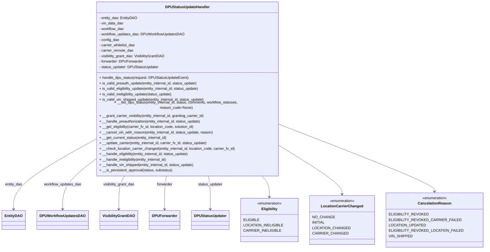

# Diagram: entity_core/entity_service/entity_service/dpu/dpu_service/service/dpu_status_update_handler.py


> Auto-generated by Obscura crawlers

## Diagram 1



### SVG

<svg id="container" width="2003.9296875" xmlns="http://www.w3.org/2000/svg" class="classDiagram" height="1074" viewBox="0 0 2003.9296875 1074" role="graphics-document document" aria-roledescription="class"><style>#container{font-family:"trebuchet ms",verdana,arial,sans-serif;font-size:16px;fill:#333;}@keyframes edge-animation-frame{from{stroke-dashoffset:0;}}@keyframes dash{to{stroke-dashoffset:0;}}#container .edge-animation-slow{stroke-dasharray:9,5!important;stroke-dashoffset:900;animation:dash 50s linear infinite;stroke-linecap:round;}#container .edge-animation-fast{stroke-dasharray:9,5!important;stroke-dashoffset:900;animation:dash 20s linear infinite;stroke-linecap:round;}#container .error-icon{fill:#552222;}#container .error-text{fill:#552222;stroke:#552222;}#container .edge-thickness-normal{stroke-width:1px;}#container .edge-thickness-thick{stroke-width:3.5px;}#container .edge-pattern-solid{stroke-dasharray:0;}#container .edge-thickness-invisible{stroke-width:0;fill:none;}#container .edge-pattern-dashed{stroke-dasharray:3;}#container .edge-pattern-dotted{stroke-dasharray:2;}#container .marker{fill:#333333;stroke:#333333;}#container .marker.cross{stroke:#333333;}#container svg{font-family:"trebuchet ms",verdana,arial,sans-serif;font-size:16px;}#container p{margin:0;}#container g.classGroup text{fill:#9370DB;stroke:none;font-family:"trebuchet ms",verdana,arial,sans-serif;font-size:10px;}#container g.classGroup text .title{font-weight:bolder;}#container .nodeLabel,#container .edgeLabel{color:#131300;}#container .edgeLabel .label rect{fill:#ECECFF;}#container .label text{fill:#131300;}#container .labelBkg{background:#ECECFF;}#container .edgeLabel .label span{background:#ECECFF;}#container .classTitle{font-weight:bolder;}#container .node rect,#container .node circle,#container .node ellipse,#container .node polygon,#container .node path{fill:#ECECFF;stroke:#9370DB;stroke-width:1px;}#container .divider{stroke:#9370DB;stroke-width:1;}#container g.clickable{cursor:pointer;}#container g.classGroup rect{fill:#ECECFF;stroke:#9370DB;}#container g.classGroup line{stroke:#9370DB;stroke-width:1;}#container .classLabel .box{stroke:none;stroke-width:0;fill:#ECECFF;opacity:0.5;}#container .classLabel .label{fill:#9370DB;font-size:10px;}#container .relation{stroke:#333333;stroke-width:1;fill:none;}#container .dashed-line{stroke-dasharray:3;}#container .dotted-line{stroke-dasharray:1 2;}#container #compositionStart,#container .composition{fill:#333333!important;stroke:#333333!important;stroke-width:1;}#container #compositionEnd,#container .composition{fill:#333333!important;stroke:#333333!important;stroke-width:1;}#container #dependencyStart,#container .dependency{fill:#333333!important;stroke:#333333!important;stroke-width:1;}#container #dependencyStart,#container .dependency{fill:#333333!important;stroke:#333333!important;stroke-width:1;}#container #extensionStart,#container .extension{fill:transparent!important;stroke:#333333!important;stroke-width:1;}#container #extensionEnd,#container .extension{fill:transparent!important;stroke:#333333!important;stroke-width:1;}#container #aggregationStart,#container .aggregation{fill:transparent!important;stroke:#333333!important;stroke-width:1;}#container #aggregationEnd,#container .aggregation{fill:transparent!important;stroke:#333333!important;stroke-width:1;}#container #lollipopStart,#container .lollipop{fill:#ECECFF!important;stroke:#333333!important;stroke-width:1;}#container #lollipopEnd,#container .lollipop{fill:#ECECFF!important;stroke:#333333!important;stroke-width:1;}#container .edgeTerminals{font-size:11px;line-height:initial;}#container .classTitleText{text-anchor:middle;font-size:18px;fill:#333;}#container .label-icon{display:inline-block;height:1em;overflow:visible;vertical-align:-0.125em;}#container .node .label-icon path{fill:currentColor;stroke:revert;stroke-width:revert;}#container :root{--mermaid-font-family:"trebuchet ms",verdana,arial,sans-serif;}</style><g><defs><marker id="container_class-aggregationStart" class="marker aggregation class" refX="18" refY="7" markerWidth="190" markerHeight="240" orient="auto"><path d="M 18,7 L9,13 L1,7 L9,1 Z"></path></marker></defs><defs><marker id="container_class-aggregationEnd" class="marker aggregation class" refX="1" refY="7" markerWidth="20" markerHeight="28" orient="auto"><path d="M 18,7 L9,13 L1,7 L9,1 Z"></path></marker></defs><defs><marker id="container_class-extensionStart" class="marker extension class" refX="18" refY="7" markerWidth="190" markerHeight="240" orient="auto"><path d="M 1,7 L18,13 V 1 Z"></path></marker></defs><defs><marker id="container_class-extensionEnd" class="marker extension class" refX="1" refY="7" markerWidth="20" markerHeight="28" orient="auto"><path d="M 1,1 V 13 L18,7 Z"></path></marker></defs><defs><marker id="container_class-compositionStart" class="marker composition class" refX="18" refY="7" markerWidth="190" markerHeight="240" orient="auto"><path d="M 18,7 L9,13 L1,7 L9,1 Z"></path></marker></defs><defs><marker id="container_class-compositionEnd" class="marker composition class" refX="1" refY="7" markerWidth="20" markerHeight="28" orient="auto"><path d="M 18,7 L9,13 L1,7 L9,1 Z"></path></marker></defs><defs><marker id="container_class-dependencyStart" class="marker dependency class" refX="6" refY="7" markerWidth="190" markerHeight="240" orient="auto"><path d="M 5,7 L9,13 L1,7 L9,1 Z"></path></marker></defs><defs><marker id="container_class-dependencyEnd" class="marker dependency class" refX="13" refY="7" markerWidth="20" markerHeight="28" orient="auto"><path d="M 18,7 L9,13 L14,7 L9,1 Z"></path></marker></defs><defs><marker id="container_class-lollipopStart" class="marker lollipop class" refX="13" refY="7" markerWidth="190" markerHeight="240" orient="auto"><circle stroke="black" fill="transparent" cx="7" cy="7" r="6"></circle></marker></defs><defs><marker id="container_class-lollipopEnd" class="marker lollipop class" refX="1" refY="7" markerWidth="190" markerHeight="240" orient="auto"><circle stroke="black" fill="transparent" cx="7" cy="7" r="6"></circle></marker></defs><g class="root"><g class="clusters"></g><g class="edgePaths"><path d="M379.586,609.015L325.751,639.013C271.917,669.01,164.247,729.005,110.413,777.169C56.578,825.333,56.578,861.667,56.578,879.833L56.578,898" id="id_DPUStatusUpdateHandler_EntityDAO_1" class="edge-thickness-normal edge-pattern-solid relation" style=";;;" data-edge="true" data-et="edge" data-id="id_DPUStatusUpdateHandler_EntityDAO_1" data-points="W3sieCI6Mzc5LjU4NTkzNzUsInkiOjYwOS4wMTUyNzM1OTQyNDM5fSx7IngiOjU2LjU3ODEyNSwieSI6Nzg5fSx7IngiOjU2LjU3ODEyNSwieSI6OTA0fV0=" marker-end="url(#container_class-dependencyEnd)"></path><path d="M379.586,698.454L360.109,713.545C340.633,728.636,301.68,758.818,282.203,792.076C262.727,825.333,262.727,861.667,262.727,879.833L262.727,898" id="id_DPUStatusUpdateHandler_DPUWorkflowUpdatesDAO_2" class="edge-thickness-normal edge-pattern-solid relation" style=";;;" data-edge="true" data-et="edge" data-id="id_DPUStatusUpdateHandler_DPUWorkflowUpdatesDAO_2" data-points="W3sieCI6Mzc5LjU4NTkzNzUsInkiOjY5OC40NTQxMzM3MzU5MDI3fSx7IngiOjI2Mi43MjY1NjI1LCJ5Ijo3ODl9LHsieCI6MjYyLjcyNjU2MjUsInkiOjkwNH1d" marker-end="url(#container_class-dependencyEnd)"></path><path d="M525.89,752L521.502,758.167C517.114,764.333,508.338,776.667,503.95,801C499.563,825.333,499.563,861.667,499.563,879.833L499.563,898" id="id_DPUStatusUpdateHandler_VisibilityGrantDAO_3" class="edge-thickness-normal edge-pattern-solid relation" style=";;;" data-edge="true" data-et="edge" data-id="id_DPUStatusUpdateHandler_VisibilityGrantDAO_3" data-points="W3sieCI6NTI1Ljg4OTgwMzYzNjkxOTQsInkiOjc1Mn0seyJ4Ijo0OTkuNTYyNSwieSI6Nzg5fSx7IngiOjQ5OS41NjI1LCJ5Ijo5MDR9XQ==" marker-end="url(#container_class-dependencyEnd)"></path><path d="M702.013,752L700.545,758.167C699.076,764.333,696.14,776.667,694.671,801C693.203,825.333,693.203,861.667,693.203,879.833L693.203,898" id="id_DPUStatusUpdateHandler_DPUForwarder_4" class="edge-thickness-normal edge-pattern-solid relation" style=";;;" data-edge="true" data-et="edge" data-id="id_DPUStatusUpdateHandler_DPUForwarder_4" data-points="W3sieCI6NzAyLjAxMjgxNzA4NDM1MiwieSI6NzUyfSx7IngiOjY5My4yMDMxMjUsInkiOjc4OX0seyJ4Ijo2OTMuMjAzMTI1LCJ5Ijo5MDR9XQ==" marker-end="url(#container_class-dependencyEnd)"></path><path d="M879.159,752L880.627,758.167C882.096,764.333,885.032,776.667,886.5,801C887.969,825.333,887.969,861.667,887.969,879.833L887.969,898" id="id_DPUStatusUpdateHandler_DPUStatusUpdater_5" class="edge-thickness-normal edge-pattern-solid relation" style=";;;" data-edge="true" data-et="edge" data-id="id_DPUStatusUpdateHandler_DPUStatusUpdater_5" data-points="W3sieCI6ODc5LjE1OTA1NzkxNTY0OCwieSI6NzUyfSx7IngiOjg4Ny45Njg3NSwieSI6Nzg5fSx7IngiOjg4Ny45Njg3NSwieSI6OTA0fV0=" marker-end="url(#container_class-dependencyEnd)"></path><path d="M1105.303,752L1110.52,758.167C1115.737,764.333,1126.171,776.667,1131.388,792C1136.605,807.333,1136.605,825.667,1136.605,834.833L1136.605,844" id="id_DPUStatusUpdateHandler_Eligibility_6" class="edge-thickness-normal edge-pattern-solid relation" style=";;;" data-edge="true" data-et="edge" data-id="id_DPUStatusUpdateHandler_Eligibility_6" data-points="W3sieCI6MTEwNS4zMDI5NjgzNjc5NzA2LCJ5Ijo3NTJ9LHsieCI6MTEzNi42MDU0Njg3NSwieSI6Nzg5fSx7IngiOjExMzYuNjA1NDY4NzUsInkiOjg1MH1d" marker-end="url(#container_class-dependencyEnd)"></path><path d="M1201.586,641.047L1240.41,665.706C1279.233,690.365,1356.88,739.682,1395.704,771.508C1434.527,803.333,1434.527,817.667,1434.527,824.833L1434.527,832" id="id_DPUStatusUpdateHandler_LocationCarrierChanged_7" class="edge-thickness-normal edge-pattern-solid relation" style=";;;" data-edge="true" data-et="edge" data-id="id_DPUStatusUpdateHandler_LocationCarrierChanged_7" data-points="W3sieCI6MTIwMS41ODU5Mzc1LCJ5Ijo2NDEuMDQ3MDQzMDUxNTJ9LHsieCI6MTQzNC41MjczNDM3NSwieSI6Nzg5fSx7IngiOjE0MzQuNTI3MzQzNzUsInkiOjgzOH1d" marker-end="url(#container_class-dependencyEnd)"></path><path d="M1201.586,545.7L1302.166,586.25C1402.746,626.8,1603.906,707.9,1704.486,753.617C1805.066,799.333,1805.066,809.667,1805.066,814.833L1805.066,820" id="id_DPUStatusUpdateHandler_CancelationReason_8" class="edge-thickness-normal edge-pattern-solid relation" style=";;;" data-edge="true" data-et="edge" data-id="id_DPUStatusUpdateHandler_CancelationReason_8" data-points="W3sieCI6MTIwMS41ODU5Mzc1LCJ5Ijo1NDUuNjk5NTkyMjMyNzg1NH0seyJ4IjoxODA1LjA2NjQwNjI1LCJ5Ijo3ODl9LHsieCI6MTgwNS4wNjY0MDYyNSwieSI6ODI2fV0=" marker-end="url(#container_class-dependencyEnd)"></path></g><g class="edgeLabels"><g class="edgeLabel" transform="translate(56.578125, 789)"><g class="label" data-id="id_DPUStatusUpdateHandler_EntityDAO_1" transform="translate(-38.546875, -12)"><foreignObject width="77.09375" height="24"><div xmlns="http://www.w3.org/1999/xhtml" class="labelBkg" style="display: table-cell; white-space: nowrap; line-height: 1.5; max-width: 200px; text-align: center;"><span class="edgeLabel"><p>entity_dao</p></span></div></foreignObject></g></g><g class="edgeLabel" transform="translate(262.7265625, 789)"><g class="label" data-id="id_DPUStatusUpdateHandler_DPUWorkflowUpdatesDAO_2" transform="translate(-83.59375, -12)"><foreignObject width="167.1875" height="24"><div xmlns="http://www.w3.org/1999/xhtml" class="labelBkg" style="display: table-cell; white-space: nowrap; line-height: 1.5; max-width: 200px; text-align: center;"><span class="edgeLabel"><p>workflow_updates_dao</p></span></div></foreignObject></g></g><g class="edgeLabel" transform="translate(499.5625, 789)"><g class="label" data-id="id_DPUStatusUpdateHandler_VisibilityGrantDAO_3" transform="translate(-71.2734375, -12)"><foreignObject width="142.546875" height="24"><div xmlns="http://www.w3.org/1999/xhtml" class="labelBkg" style="display: table-cell; white-space: nowrap; line-height: 1.5; max-width: 200px; text-align: center;"><span class="edgeLabel"><p>visibility_grant_dao</p></span></div></foreignObject></g></g><g class="edgeLabel" transform="translate(693.203125, 789)"><g class="label" data-id="id_DPUStatusUpdateHandler_DPUForwarder_4" transform="translate(-35.4375, -12)"><foreignObject width="70.875" height="24"><div xmlns="http://www.w3.org/1999/xhtml" class="labelBkg" style="display: table-cell; white-space: nowrap; line-height: 1.5; max-width: 200px; text-align: center;"><span class="edgeLabel"><p>forwarder</p></span></div></foreignObject></g></g><g class="edgeLabel" transform="translate(887.96875, 789)"><g class="label" data-id="id_DPUStatusUpdateHandler_DPUStatusUpdater_5" transform="translate(-54.8046875, -12)"><foreignObject width="109.609375" height="24"><div xmlns="http://www.w3.org/1999/xhtml" class="labelBkg" style="display: table-cell; white-space: nowrap; line-height: 1.5; max-width: 200px; text-align: center;"><span class="edgeLabel"><p>status_updater</p></span></div></foreignObject></g></g><g class="edgeLabel"><g class="label" data-id="id_DPUStatusUpdateHandler_Eligibility_6" transform="translate(0, 0)"><foreignObject width="0" height="0"><div xmlns="http://www.w3.org/1999/xhtml" class="labelBkg" style="display: table-cell; white-space: nowrap; line-height: 1.5; max-width: 200px; text-align: center;"><span class="edgeLabel"></span></div></foreignObject></g></g><g class="edgeLabel"><g class="label" data-id="id_DPUStatusUpdateHandler_LocationCarrierChanged_7" transform="translate(0, 0)"><foreignObject width="0" height="0"><div xmlns="http://www.w3.org/1999/xhtml" class="labelBkg" style="display: table-cell; white-space: nowrap; line-height: 1.5; max-width: 200px; text-align: center;"><span class="edgeLabel"></span></div></foreignObject></g></g><g class="edgeLabel"><g class="label" data-id="id_DPUStatusUpdateHandler_CancelationReason_8" transform="translate(0, 0)"><foreignObject width="0" height="0"><div xmlns="http://www.w3.org/1999/xhtml" class="labelBkg" style="display: table-cell; white-space: nowrap; line-height: 1.5; max-width: 200px; text-align: center;"><span class="edgeLabel"></span></div></foreignObject></g></g></g><g class="nodes"><g class="node default" id="classId-DPUStatusUpdateHandler-0" transform="translate(790.5859375, 380)"><g class="basic label-container"><path d="M-411 -372 L411 -372 L411 372 L-411 372" stroke="none" stroke-width="0" fill="#ECECFF" style=""></path><path d="M-411 -372 C-242.68548634252878 -372, -74.37097268505755 -372, 411 -372 M-411 -372 C-143.0995769625552 -372, 124.80084607488959 -372, 411 -372 M411 -372 C411 -75.64421214527113, 411 220.71157570945775, 411 372 M411 -372 C411 -122.54789137368542, 411 126.90421725262917, 411 372 M411 372 C179.10380801937927 372, -52.792383961241455 372, -411 372 M411 372 C167.67624938682363 372, -75.64750122635274 372, -411 372 M-411 372 C-411 174.40534275017814, -411 -23.18931449964373, -411 -372 M-411 372 C-411 168.16636518409314, -411 -35.667269631813724, -411 -372" stroke="#9370DB" stroke-width="1.3" fill="none" stroke-dasharray="0 0" style=""></path></g><g class="annotation-group text" transform="translate(0, -348)"></g><g class="label-group text" transform="translate(-94.265625, -348)"><g class="label" style="font-weight: bolder" transform="translate(0,-12)"><foreignObject width="188.53125" height="24"><div xmlns="http://www.w3.org/1999/xhtml" style="display: table-cell; white-space: nowrap; line-height: 1.5; max-width: 237px; text-align: center;"><span class="nodeLabel markdown-node-label" style=""><p>DPUStatusUpdateHandler</p></span></div></foreignObject></g></g><g class="members-group text" transform="translate(-399, -300)"><g class="label" style="" transform="translate(0,-12)"><foreignObject width="167.71875" height="24"><div xmlns="http://www.w3.org/1999/xhtml" style="display: table-cell; white-space: nowrap; line-height: 1.5; max-width: 225px; text-align: center;"><span class="nodeLabel markdown-node-label" style=""><p>- entity_dao: EntityDAO</p></span></div></foreignObject></g><g class="label" style="" transform="translate(0,12)"><foreignObject width="108.71875" height="24"><div xmlns="http://www.w3.org/1999/xhtml" style="display: table-cell; white-space: nowrap; line-height: 1.5; max-width: 166px; text-align: center;"><span class="nodeLabel markdown-node-label" style=""><p>- vin_data_dao</p></span></div></foreignObject></g><g class="label" style="" transform="translate(0,36)"><foreignObject width="111.390625" height="24"><div xmlns="http://www.w3.org/1999/xhtml" style="display: table-cell; white-space: nowrap; line-height: 1.5; max-width: 169px; text-align: center;"><span class="nodeLabel markdown-node-label" style=""><p>- workflow_dao</p></span></div></foreignObject></g><g class="label" style="" transform="translate(0,60)"><foreignObject width="373.453125" height="24"><div xmlns="http://www.w3.org/1999/xhtml" style="display: table-cell; white-space: nowrap; line-height: 1.5; max-width: 431px; text-align: center;"><span class="nodeLabel markdown-node-label" style=""><p>- workflow_updates_dao: DPUWorkflowUpdatesDAO</p></span></div></foreignObject></g><g class="label" style="" transform="translate(0,84)"><foreignObject width="89.9375" height="24"><div xmlns="http://www.w3.org/1999/xhtml" style="display: table-cell; white-space: nowrap; line-height: 1.5; max-width: 147px; text-align: center;"><span class="nodeLabel markdown-node-label" style=""><p>- config_dao</p></span></div></foreignObject></g><g class="label" style="" transform="translate(0,108)"><foreignObject width="163.046875" height="24"><div xmlns="http://www.w3.org/1999/xhtml" style="display: table-cell; white-space: nowrap; line-height: 1.5; max-width: 220px; text-align: center;"><span class="nodeLabel markdown-node-label" style=""><p>- carrier_whitelist_dao</p></span></div></foreignObject></g><g class="label" style="" transform="translate(0,132)"><foreignObject width="154.015625" height="24"><div xmlns="http://www.w3.org/1999/xhtml" style="display: table-cell; white-space: nowrap; line-height: 1.5; max-width: 211px; text-align: center;"><span class="nodeLabel markdown-node-label" style=""><p>- carrier_reroute_dao</p></span></div></foreignObject></g><g class="label" style="" transform="translate(0,156)"><foreignObject width="293.28125" height="24"><div xmlns="http://www.w3.org/1999/xhtml" style="display: table-cell; white-space: nowrap; line-height: 1.5; max-width: 351px; text-align: center;"><span class="nodeLabel markdown-node-label" style=""><p>- visibility_grant_dao: VisibilityGrantDAO</p></span></div></foreignObject></g><g class="label" style="" transform="translate(0,180)"><foreignObject width="192.953125" height="24"><div xmlns="http://www.w3.org/1999/xhtml" style="display: table-cell; white-space: nowrap; line-height: 1.5; max-width: 251px; text-align: center;"><span class="nodeLabel markdown-node-label" style=""><p>- forwarder: DPUForwarder</p></span></div></foreignObject></g><g class="label" style="" transform="translate(0,204)"><foreignObject width="263.0625" height="24"><div xmlns="http://www.w3.org/1999/xhtml" style="display: table-cell; white-space: nowrap; line-height: 1.5; max-width: 321px; text-align: center;"><span class="nodeLabel markdown-node-label" style=""><p>- status_updater: DPUStatusUpdater</p></span></div></foreignObject></g></g><g class="methods-group text" transform="translate(-399, -36)"><g class="label" style="" transform="translate(0,-12)"><foreignObject width="393.421875" height="24"><div xmlns="http://www.w3.org/1999/xhtml" style="display: table-cell; white-space: nowrap; line-height: 1.5; max-width: 451px; text-align: center;"><span class="nodeLabel markdown-node-label" style=""><p>+ handle_dpu_status(request: DPUStatusUpdateEvent)</p></span></div></foreignObject></g><g class="label" style="" transform="translate(0,12)"><foreignObject width="442.25" height="24"><div xmlns="http://www.w3.org/1999/xhtml" style="display: table-cell; white-space: nowrap; line-height: 1.5; max-width: 500px; text-align: center;"><span class="nodeLabel markdown-node-label" style=""><p>+ is_valid_preauth_update(entity_internal_id, status_update)</p></span></div></foreignObject></g><g class="label" style="" transform="translate(0,36)"><foreignObject width="452.0625" height="24"><div xmlns="http://www.w3.org/1999/xhtml" style="display: table-cell; white-space: nowrap; line-height: 1.5; max-width: 509px; text-align: center;"><span class="nodeLabel markdown-node-label" style=""><p>+ is_valid_eligibility_update(entity_internal_id, status_update)</p></span></div></foreignObject></g><g class="label" style="" transform="translate(0,60)"><foreignObject width="329.0625" height="24"><div xmlns="http://www.w3.org/1999/xhtml" style="display: table-cell; white-space: nowrap; line-height: 1.5; max-width: 386px; text-align: center;"><span class="nodeLabel markdown-node-label" style=""><p>+ is_valid_ineligibility_update(status_update)</p></span></div></foreignObject></g><g class="label" style="" transform="translate(0,84)"><foreignObject width="473.578125" height="24"><div xmlns="http://www.w3.org/1999/xhtml" style="display: table-cell; white-space: nowrap; line-height: 1.5; max-width: 531px; text-align: center;"><span class="nodeLabel markdown-node-label" style=""><p>+ is_valid_vin_shipped_update(entity_internal_id, status_update)</p></span></div></foreignObject></g><g class="label" style="" transform="translate(0,108)"><foreignObject width="703.734375" height="24"><div xmlns="http://www.w3.org/1999/xhtml" style="display: table-cell; white-space: nowrap; line-height: 1.5; max-width: 761px; text-align: center;"><span class="nodeLabel markdown-node-label" style=""><p>+ __set_dpu_status(entity_internal_id, status, comments, workflow_statuses, reason_code=None)</p></span></div></foreignObject></g><g class="label" style="" transform="translate(0,132)"><foreignObject width="475.015625" height="24"><div xmlns="http://www.w3.org/1999/xhtml" style="display: table-cell; white-space: nowrap; line-height: 1.5; max-width: 532px; text-align: center;"><span class="nodeLabel markdown-node-label" style=""><p>+ __grant_carrier_visibility(entity_internal_id, granting_carrier_id)</p></span></div></foreignObject></g><g class="label" style="" transform="translate(0,156)"><foreignObject width="459.484375" height="24"><div xmlns="http://www.w3.org/1999/xhtml" style="display: table-cell; white-space: nowrap; line-height: 1.5; max-width: 517px; text-align: center;"><span class="nodeLabel markdown-node-label" style=""><p>+ __handle_preauthorization(entity_internal_id, status_update)</p></span></div></foreignObject></g><g class="label" style="" transform="translate(0,180)"><foreignObject width="427.484375" height="24"><div xmlns="http://www.w3.org/1999/xhtml" style="display: table-cell; white-space: nowrap; line-height: 1.5; max-width: 485px; text-align: center;"><span class="nodeLabel markdown-node-label" style=""><p>+ __get_eligibility(carrier_fv_id, location_code, solution_id)</p></span></div></foreignObject></g><g class="label" style="" transform="translate(0,204)"><foreignObject width="508.65625" height="24"><div xmlns="http://www.w3.org/1999/xhtml" style="display: table-cell; white-space: nowrap; line-height: 1.5; max-width: 566px; text-align: center;"><span class="nodeLabel markdown-node-label" style=""><p>+ __cancel_vin_with_reason(entity_internal_id, status_update, reason)</p></span></div></foreignObject></g><g class="label" style="" transform="translate(0,228)"><foreignObject width="304.171875" height="24"><div xmlns="http://www.w3.org/1999/xhtml" style="display: table-cell; white-space: nowrap; line-height: 1.5; max-width: 362px; text-align: center;"><span class="nodeLabel markdown-node-label" style=""><p>+ __get_current_status(entity_internal_id)</p></span></div></foreignObject></g><g class="label" style="" transform="translate(0,252)"><foreignObject width="484.265625" height="24"><div xmlns="http://www.w3.org/1999/xhtml" style="display: table-cell; white-space: nowrap; line-height: 1.5; max-width: 542px; text-align: center;"><span class="nodeLabel markdown-node-label" style=""><p>+ __update_carrier(entity_internal_id, carrier_fv_id, status_update)</p></span></div></foreignObject></g><g class="label" style="" transform="translate(0,276)"><foreignObject width="608.84375" height="24"><div xmlns="http://www.w3.org/1999/xhtml" style="display: table-cell; white-space: nowrap; line-height: 1.5; max-width: 666px; text-align: center;"><span class="nodeLabel markdown-node-label" style=""><p>+ __check_location_carrier_changed(entity_internal_id, location_code, carrier_fv_id)</p></span></div></foreignObject></g><g class="label" style="" transform="translate(0,300)"><foreignObject width="405.265625" height="24"><div xmlns="http://www.w3.org/1999/xhtml" style="display: table-cell; white-space: nowrap; line-height: 1.5; max-width: 463px; text-align: center;"><span class="nodeLabel markdown-node-label" style=""><p>+ __handle_eligibility(entity_internal_id, status_update)</p></span></div></foreignObject></g><g class="label" style="" transform="translate(0,324)"><foreignObject width="307.96875" height="24"><div xmlns="http://www.w3.org/1999/xhtml" style="display: table-cell; white-space: nowrap; line-height: 1.5; max-width: 365px; text-align: center;"><span class="nodeLabel markdown-node-label" style=""><p>+ __handle_ineligibility(entity_internal_id)</p></span></div></foreignObject></g><g class="label" style="" transform="translate(0,348)"><foreignObject width="426.3125" height="24"><div xmlns="http://www.w3.org/1999/xhtml" style="display: table-cell; white-space: nowrap; line-height: 1.5; max-width: 484px; text-align: center;"><span class="nodeLabel markdown-node-label" style=""><p>+ __handle_vin_shipped(entity_internal_id, status_update)</p></span></div></foreignObject></g><g class="label" style="" transform="translate(0,372)"><foreignObject width="326.796875" height="24"><div xmlns="http://www.w3.org/1999/xhtml" style="display: table-cell; white-space: nowrap; line-height: 1.5; max-width: 384px; text-align: center;"><span class="nodeLabel markdown-node-label" style=""><p>+ __is_persistent_approval(status, substatus)</p></span></div></foreignObject></g></g><g class="divider" style=""><path d="M-411 -324 C-199.1827548236387 -324, 12.634490352722594 -324, 411 -324 M-411 -324 C-238.25455692594304 -324, -65.50911385188607 -324, 411 -324" stroke="#9370DB" stroke-width="1.3" fill="none" stroke-dasharray="0 0" style=""></path></g><g class="divider" style=""><path d="M-411 -60 C-115.14991908354312 -60, 180.70016183291375 -60, 411 -60 M-411 -60 C-127.9753008540929 -60, 155.0493982918142 -60, 411 -60" stroke="#9370DB" stroke-width="1.3" fill="none" stroke-dasharray="0 0" style=""></path></g></g><g class="node default" id="classId-Eligibility-1" transform="translate(1136.60546875, 946)"><g class="basic label-container"><path d="M-118.24609375 -96 L118.24609375 -96 L118.24609375 96 L-118.24609375 96" stroke="none" stroke-width="0" fill="#ECECFF" style=""></path><path d="M-118.24609375 -96 C-37.66016596495179 -96, 42.925761820096426 -96, 118.24609375 -96 M-118.24609375 -96 C-68.15804902202837 -96, -18.070004294056716 -96, 118.24609375 -96 M118.24609375 -96 C118.24609375 -25.151138759613488, 118.24609375 45.697722480773024, 118.24609375 96 M118.24609375 -96 C118.24609375 -48.50296882139774, 118.24609375 -1.0059376427954732, 118.24609375 96 M118.24609375 96 C28.246342358625768 96, -61.753409032748465 96, -118.24609375 96 M118.24609375 96 C45.63850408808824 96, -26.96908557382352 96, -118.24609375 96 M-118.24609375 96 C-118.24609375 21.919142686944895, -118.24609375 -52.16171462611021, -118.24609375 -96 M-118.24609375 96 C-118.24609375 22.243552102454416, -118.24609375 -51.51289579509117, -118.24609375 -96" stroke="#9370DB" stroke-width="1.3" fill="none" stroke-dasharray="0 0" style=""></path></g><g class="annotation-group text" transform="translate(-55.5546875, -72)"><g class="label" style="" transform="translate(0,-12)"><foreignObject width="111.109375" height="24"><div xmlns="http://www.w3.org/1999/xhtml" style="display: table-cell; white-space: nowrap; line-height: 1.5; max-width: 161px; text-align: center;"><span class="nodeLabel markdown-node-label" style=""><p>«enumeration»</p></span></div></foreignObject></g></g><g class="label-group text" transform="translate(-34.2890625, -48)"><g class="label" style="font-weight: bolder" transform="translate(0,-12)"><foreignObject width="68.578125" height="24"><div xmlns="http://www.w3.org/1999/xhtml" style="display: table-cell; white-space: nowrap; line-height: 1.5; max-width: 117px; text-align: center;"><span class="nodeLabel markdown-node-label" style=""><p>Eligibility</p></span></div></foreignObject></g></g><g class="members-group text" transform="translate(-106.24609375, 0)"><g class="label" style="" transform="translate(0,-12)"><foreignObject width="62.328125" height="24"><div xmlns="http://www.w3.org/1999/xhtml" style="display: table-cell; white-space: nowrap; line-height: 1.5; max-width: 112px; text-align: center;"><span class="nodeLabel markdown-node-label" style=""><p>ELIGIBLE</p></span></div></foreignObject></g><g class="label" style="" transform="translate(0,12)"><foreignObject width="156.9375" height="24"><div xmlns="http://www.w3.org/1999/xhtml" style="display: table-cell; white-space: nowrap; line-height: 1.5; max-width: 207px; text-align: center;"><span class="nodeLabel markdown-node-label" style=""><p>LOCATION_INELIGIBLE</p></span></div></foreignObject></g><g class="label" style="" transform="translate(0,36)"><foreignObject width="146.75" height="24"><div xmlns="http://www.w3.org/1999/xhtml" style="display: table-cell; white-space: nowrap; line-height: 1.5; max-width: 197px; text-align: center;"><span class="nodeLabel markdown-node-label" style=""><p>CARRIER_INELIGIBLE</p></span></div></foreignObject></g></g><g class="methods-group text" transform="translate(-106.24609375, 96)"></g><g class="divider" style=""><path d="M-118.24609375 -24 C-34.74435565817937 -24, 48.757382433641254 -24, 118.24609375 -24 M-118.24609375 -24 C-64.32966888790934 -24, -10.41324402581867 -24, 118.24609375 -24" stroke="#9370DB" stroke-width="1.3" fill="none" stroke-dasharray="0 0" style=""></path></g><g class="divider" style=""><path d="M-118.24609375 72 C-40.946048657829934 72, 36.35399643434013 72, 118.24609375 72 M-118.24609375 72 C-29.556365397494574 72, 59.13336295501085 72, 118.24609375 72" stroke="#9370DB" stroke-width="1.3" fill="none" stroke-dasharray="0 0" style=""></path></g></g><g class="node default" id="classId-LocationCarrierChanged-2" transform="translate(1434.52734375, 946)"><g class="basic label-container"><path d="M-129.67578125 -108 L129.67578125 -108 L129.67578125 108 L-129.67578125 108" stroke="none" stroke-width="0" fill="#ECECFF" style=""></path><path d="M-129.67578125 -108 C-37.01750878806941 -108, 55.64076367386119 -108, 129.67578125 -108 M-129.67578125 -108 C-41.33611411268757 -108, 47.003553024624864 -108, 129.67578125 -108 M129.67578125 -108 C129.67578125 -61.961264029895545, 129.67578125 -15.922528059791091, 129.67578125 108 M129.67578125 -108 C129.67578125 -59.27566253750075, 129.67578125 -10.5513250750015, 129.67578125 108 M129.67578125 108 C36.96651882056888 108, -55.74274360886224 108, -129.67578125 108 M129.67578125 108 C31.43567876954775 108, -66.8044237109045 108, -129.67578125 108 M-129.67578125 108 C-129.67578125 54.26300430535855, -129.67578125 0.5260086107170991, -129.67578125 -108 M-129.67578125 108 C-129.67578125 55.12113033580693, -129.67578125 2.242260671613863, -129.67578125 -108" stroke="#9370DB" stroke-width="1.3" fill="none" stroke-dasharray="0 0" style=""></path></g><g class="annotation-group text" transform="translate(-55.5546875, -84)"><g class="label" style="" transform="translate(0,-12)"><foreignObject width="111.109375" height="24"><div xmlns="http://www.w3.org/1999/xhtml" style="display: table-cell; white-space: nowrap; line-height: 1.5; max-width: 161px; text-align: center;"><span class="nodeLabel markdown-node-label" style=""><p>«enumeration»</p></span></div></foreignObject></g></g><g class="label-group text" transform="translate(-88.1328125, -60)"><g class="label" style="font-weight: bolder" transform="translate(0,-12)"><foreignObject width="176.265625" height="24"><div xmlns="http://www.w3.org/1999/xhtml" style="display: table-cell; white-space: nowrap; line-height: 1.5; max-width: 224px; text-align: center;"><span class="nodeLabel markdown-node-label" style=""><p>LocationCarrierChanged</p></span></div></foreignObject></g></g><g class="members-group text" transform="translate(-117.67578125, -12)"><g class="label" style="" transform="translate(0,-12)"><foreignObject width="87.640625" height="24"><div xmlns="http://www.w3.org/1999/xhtml" style="display: table-cell; white-space: nowrap; line-height: 1.5; max-width: 138px; text-align: center;"><span class="nodeLabel markdown-node-label" style=""><p>NO_CHANGE</p></span></div></foreignObject></g><g class="label" style="" transform="translate(0,12)"><foreignObject width="50.5" height="24"><div xmlns="http://www.w3.org/1999/xhtml" style="display: table-cell; white-space: nowrap; line-height: 1.5; max-width: 101px; text-align: center;"><span class="nodeLabel markdown-node-label" style=""><p>INITIAL</p></span></div></foreignObject></g><g class="label" style="" transform="translate(0,36)"><foreignObject width="147.21875" height="24"><div xmlns="http://www.w3.org/1999/xhtml" style="display: table-cell; white-space: nowrap; line-height: 1.5; max-width: 197px; text-align: center;"><span class="nodeLabel markdown-node-label" style=""><p>LOCATION_CHANGED</p></span></div></foreignObject></g><g class="label" style="" transform="translate(0,60)"><foreignObject width="137.03125" height="24"><div xmlns="http://www.w3.org/1999/xhtml" style="display: table-cell; white-space: nowrap; line-height: 1.5; max-width: 187px; text-align: center;"><span class="nodeLabel markdown-node-label" style=""><p>CARRIER_CHANGED</p></span></div></foreignObject></g></g><g class="methods-group text" transform="translate(-117.67578125, 108)"></g><g class="divider" style=""><path d="M-129.67578125 -36 C-61.51846089853251 -36, 6.63885945293498 -36, 129.67578125 -36 M-129.67578125 -36 C-58.119707840573724 -36, 13.436365568852551 -36, 129.67578125 -36" stroke="#9370DB" stroke-width="1.3" fill="none" stroke-dasharray="0 0" style=""></path></g><g class="divider" style=""><path d="M-129.67578125 84 C-38.74436840365945 84, 52.1870444426811 84, 129.67578125 84 M-129.67578125 84 C-35.02322046322995 84, 59.629340323540106 84, 129.67578125 84" stroke="#9370DB" stroke-width="1.3" fill="none" stroke-dasharray="0 0" style=""></path></g></g><g class="node default" id="classId-CancelationReason-3" transform="translate(1805.06640625, 946)"><g class="basic label-container"><path d="M-190.86328125 -120 L190.86328125 -120 L190.86328125 120 L-190.86328125 120" stroke="none" stroke-width="0" fill="#ECECFF" style=""></path><path d="M-190.86328125 -120 C-74.0376093950319 -120, 42.788062459936214 -120, 190.86328125 -120 M-190.86328125 -120 C-74.62461575125502 -120, 41.61404974748996 -120, 190.86328125 -120 M190.86328125 -120 C190.86328125 -27.336040293171237, 190.86328125 65.32791941365753, 190.86328125 120 M190.86328125 -120 C190.86328125 -65.07084316744229, 190.86328125 -10.141686334884582, 190.86328125 120 M190.86328125 120 C95.31266307152826 120, -0.237955106943474 120, -190.86328125 120 M190.86328125 120 C87.22889629979737 120, -16.40548865040526 120, -190.86328125 120 M-190.86328125 120 C-190.86328125 51.40999212604822, -190.86328125 -17.180015747903553, -190.86328125 -120 M-190.86328125 120 C-190.86328125 53.59294889540931, -190.86328125 -12.814102209181385, -190.86328125 -120" stroke="#9370DB" stroke-width="1.3" fill="none" stroke-dasharray="0 0" style=""></path></g><g class="annotation-group text" transform="translate(-55.5546875, -96)"><g class="label" style="" transform="translate(0,-12)"><foreignObject width="111.109375" height="24"><div xmlns="http://www.w3.org/1999/xhtml" style="display: table-cell; white-space: nowrap; line-height: 1.5; max-width: 161px; text-align: center;"><span class="nodeLabel markdown-node-label" style=""><p>«enumeration»</p></span></div></foreignObject></g></g><g class="label-group text" transform="translate(-69.5703125, -72)"><g class="label" style="font-weight: bolder" transform="translate(0,-12)"><foreignObject width="139.140625" height="24"><div xmlns="http://www.w3.org/1999/xhtml" style="display: table-cell; white-space: nowrap; line-height: 1.5; max-width: 188px; text-align: center;"><span class="nodeLabel markdown-node-label" style=""><p>CancelationReason</p></span></div></foreignObject></g></g><g class="members-group text" transform="translate(-178.86328125, -24)"><g class="label" style="" transform="translate(0,-12)"><foreignObject width="153.734375" height="24"><div xmlns="http://www.w3.org/1999/xhtml" style="display: table-cell; white-space: nowrap; line-height: 1.5; max-width: 204px; text-align: center;"><span class="nodeLabel markdown-node-label" style=""><p>ELIGIBILITY_REVOKED</p></span></div></foreignObject></g><g class="label" style="" transform="translate(0,12)"><foreignObject width="277.328125" height="24"><div xmlns="http://www.w3.org/1999/xhtml" style="display: table-cell; white-space: nowrap; line-height: 1.5; max-width: 327px; text-align: center;"><span class="nodeLabel markdown-node-label" style=""><p>ELIGIBILITY_REVOKED_CARRIER_FAILED</p></span></div></foreignObject></g><g class="label" style="" transform="translate(0,36)"><foreignObject width="144.03125" height="24"><div xmlns="http://www.w3.org/1999/xhtml" style="display: table-cell; white-space: nowrap; line-height: 1.5; max-width: 194px; text-align: center;"><span class="nodeLabel markdown-node-label" style=""><p>LOCATION_UPDATED</p></span></div></foreignObject></g><g class="label" style="" transform="translate(0,60)"><foreignObject width="288.15625" height="24"><div xmlns="http://www.w3.org/1999/xhtml" style="display: table-cell; white-space: nowrap; line-height: 1.5; max-width: 338px; text-align: center;"><span class="nodeLabel markdown-node-label" style=""><p>ELIGIBILITY_REVOKED_LOCATION_FAILED</p></span></div></foreignObject></g><g class="label" style="" transform="translate(0,84)"><foreignObject width="94.328125" height="24"><div xmlns="http://www.w3.org/1999/xhtml" style="display: table-cell; white-space: nowrap; line-height: 1.5; max-width: 144px; text-align: center;"><span class="nodeLabel markdown-node-label" style=""><p>VIN_SHIPPED</p></span></div></foreignObject></g></g><g class="methods-group text" transform="translate(-178.86328125, 120)"></g><g class="divider" style=""><path d="M-190.86328125 -48 C-47.87143003530193 -48, 95.12042117939615 -48, 190.86328125 -48 M-190.86328125 -48 C-92.61993226600488 -48, 5.623416717990239 -48, 190.86328125 -48" stroke="#9370DB" stroke-width="1.3" fill="none" stroke-dasharray="0 0" style=""></path></g><g class="divider" style=""><path d="M-190.86328125 96 C-49.331721934461854 96, 92.19983738107629 96, 190.86328125 96 M-190.86328125 96 C-51.20486187164133 96, 88.45355750671735 96, 190.86328125 96" stroke="#9370DB" stroke-width="1.3" fill="none" stroke-dasharray="0 0" style=""></path></g></g><g class="node default" id="classId-EntityDAO-4" transform="translate(56.578125, 946)"><g class="basic label-container"><path d="M-48.578125 -42 L48.578125 -42 L48.578125 42 L-48.578125 42" stroke="none" stroke-width="0" fill="#ECECFF" style=""></path><path d="M-48.578125 -42 C-29.0781246500621 -42, -9.578124300124202 -42, 48.578125 -42 M-48.578125 -42 C-15.560311266655468 -42, 17.457502466689064 -42, 48.578125 -42 M48.578125 -42 C48.578125 -19.103060184985473, 48.578125 3.7938796300290534, 48.578125 42 M48.578125 -42 C48.578125 -24.182634840938317, 48.578125 -6.365269681876633, 48.578125 42 M48.578125 42 C24.16178889748161 42, -0.2545472050367792 42, -48.578125 42 M48.578125 42 C24.9540546598847 42, 1.3299843197694017 42, -48.578125 42 M-48.578125 42 C-48.578125 10.029700763331476, -48.578125 -21.940598473337047, -48.578125 -42 M-48.578125 42 C-48.578125 14.699347625671614, -48.578125 -12.601304748656773, -48.578125 -42" stroke="#9370DB" stroke-width="1.3" fill="none" stroke-dasharray="0 0" style=""></path></g><g class="annotation-group text" transform="translate(0, -18)"></g><g class="label-group text" transform="translate(-36.578125, -18)"><g class="label" style="font-weight: bolder" transform="translate(0,-12)"><foreignObject width="73.15625" height="24"><div xmlns="http://www.w3.org/1999/xhtml" style="display: table-cell; white-space: nowrap; line-height: 1.5; max-width: 122px; text-align: center;"><span class="nodeLabel markdown-node-label" style=""><p>EntityDAO</p></span></div></foreignObject></g></g><g class="members-group text" transform="translate(-36.578125, 30)"></g><g class="methods-group text" transform="translate(-36.578125, 60)"></g><g class="divider" style=""><path d="M-48.578125 6 C-13.521546370708393 6, 21.535032258583215 6, 48.578125 6 M-48.578125 6 C-26.13248099620582 6, -3.686836992411642 6, 48.578125 6" stroke="#9370DB" stroke-width="1.3" fill="none" stroke-dasharray="0 0" style=""></path></g><g class="divider" style=""><path d="M-48.578125 24 C-20.59723781957797 24, 7.3836493608440605 24, 48.578125 24 M-48.578125 24 C-18.168493908326376 24, 12.241137183347249 24, 48.578125 24" stroke="#9370DB" stroke-width="1.3" fill="none" stroke-dasharray="0 0" style=""></path></g></g><g class="node default" id="classId-DPUWorkflowUpdatesDAO-5" transform="translate(262.7265625, 946)"><g class="basic label-container"><path d="M-107.5703125 -42 L107.5703125 -42 L107.5703125 42 L-107.5703125 42" stroke="none" stroke-width="0" fill="#ECECFF" style=""></path><path d="M-107.5703125 -42 C-62.68865193325552 -42, -17.806991366511042 -42, 107.5703125 -42 M-107.5703125 -42 C-56.24793400739201 -42, -4.925555514784023 -42, 107.5703125 -42 M107.5703125 -42 C107.5703125 -22.38902044491271, 107.5703125 -2.7780408898254194, 107.5703125 42 M107.5703125 -42 C107.5703125 -10.639924578662992, 107.5703125 20.720150842674016, 107.5703125 42 M107.5703125 42 C45.204922278404176 42, -17.160467943191648 42, -107.5703125 42 M107.5703125 42 C61.388223479488815 42, 15.20613445897763 42, -107.5703125 42 M-107.5703125 42 C-107.5703125 11.604330153108265, -107.5703125 -18.79133969378347, -107.5703125 -42 M-107.5703125 42 C-107.5703125 20.233455975644283, -107.5703125 -1.5330880487114342, -107.5703125 -42" stroke="#9370DB" stroke-width="1.3" fill="none" stroke-dasharray="0 0" style=""></path></g><g class="annotation-group text" transform="translate(0, -18)"></g><g class="label-group text" transform="translate(-95.5703125, -18)"><g class="label" style="font-weight: bolder" transform="translate(0,-12)"><foreignObject width="191.140625" height="24"><div xmlns="http://www.w3.org/1999/xhtml" style="display: table-cell; white-space: nowrap; line-height: 1.5; max-width: 238px; text-align: center;"><span class="nodeLabel markdown-node-label" style=""><p>DPUWorkflowUpdatesDAO</p></span></div></foreignObject></g></g><g class="members-group text" transform="translate(-95.5703125, 30)"></g><g class="methods-group text" transform="translate(-95.5703125, 60)"></g><g class="divider" style=""><path d="M-107.5703125 6 C-30.150396690997553 6, 47.269519118004894 6, 107.5703125 6 M-107.5703125 6 C-21.64947456719959 6, 64.27136336560082 6, 107.5703125 6" stroke="#9370DB" stroke-width="1.3" fill="none" stroke-dasharray="0 0" style=""></path></g><g class="divider" style=""><path d="M-107.5703125 24 C-64.07658659753672 24, -20.582860695073435 24, 107.5703125 24 M-107.5703125 24 C-24.469218951799732 24, 58.631874596400536 24, 107.5703125 24" stroke="#9370DB" stroke-width="1.3" fill="none" stroke-dasharray="0 0" style=""></path></g></g><g class="node default" id="classId-VisibilityGrantDAO-6" transform="translate(499.5625, 946)"><g class="basic label-container"><path d="M-79.265625 -42 L79.265625 -42 L79.265625 42 L-79.265625 42" stroke="none" stroke-width="0" fill="#ECECFF" style=""></path><path d="M-79.265625 -42 C-45.29388550749789 -42, -11.32214601499578 -42, 79.265625 -42 M-79.265625 -42 C-29.247818735565936 -42, 20.76998752886813 -42, 79.265625 -42 M79.265625 -42 C79.265625 -12.158647707197733, 79.265625 17.682704585604533, 79.265625 42 M79.265625 -42 C79.265625 -21.549805925219736, 79.265625 -1.099611850439473, 79.265625 42 M79.265625 42 C46.718252289501955 42, 14.170879579003909 42, -79.265625 42 M79.265625 42 C24.65950184481421 42, -29.946621310371583 42, -79.265625 42 M-79.265625 42 C-79.265625 17.552336676557502, -79.265625 -6.895326646884996, -79.265625 -42 M-79.265625 42 C-79.265625 21.199943112111335, -79.265625 0.3998862242226693, -79.265625 -42" stroke="#9370DB" stroke-width="1.3" fill="none" stroke-dasharray="0 0" style=""></path></g><g class="annotation-group text" transform="translate(0, -18)"></g><g class="label-group text" transform="translate(-67.265625, -18)"><g class="label" style="font-weight: bolder" transform="translate(0,-12)"><foreignObject width="134.53125" height="24"><div xmlns="http://www.w3.org/1999/xhtml" style="display: table-cell; white-space: nowrap; line-height: 1.5; max-width: 182px; text-align: center;"><span class="nodeLabel markdown-node-label" style=""><p>VisibilityGrantDAO</p></span></div></foreignObject></g></g><g class="members-group text" transform="translate(-67.265625, 30)"></g><g class="methods-group text" transform="translate(-67.265625, 60)"></g><g class="divider" style=""><path d="M-79.265625 6 C-27.761712893508445 6, 23.74219921298311 6, 79.265625 6 M-79.265625 6 C-39.50734058509777 6, 0.25094382980445573 6, 79.265625 6" stroke="#9370DB" stroke-width="1.3" fill="none" stroke-dasharray="0 0" style=""></path></g><g class="divider" style=""><path d="M-79.265625 24 C-36.5432942898411 24, 6.1790364203178 24, 79.265625 24 M-79.265625 24 C-46.94984082255638 24, -14.634056645112764 24, 79.265625 24" stroke="#9370DB" stroke-width="1.3" fill="none" stroke-dasharray="0 0" style=""></path></g></g><g class="node default" id="classId-DPUForwarder-7" transform="translate(693.203125, 946)"><g class="basic label-container"><path d="M-64.375 -42 L64.375 -42 L64.375 42 L-64.375 42" stroke="none" stroke-width="0" fill="#ECECFF" style=""></path><path d="M-64.375 -42 C-32.25052593428101 -42, -0.12605186856201556 -42, 64.375 -42 M-64.375 -42 C-35.63270657619279 -42, -6.89041315238557 -42, 64.375 -42 M64.375 -42 C64.375 -9.358223601925076, 64.375 23.28355279614985, 64.375 42 M64.375 -42 C64.375 -13.546248104375746, 64.375 14.907503791248509, 64.375 42 M64.375 42 C20.491499987342728 42, -23.392000025314545 42, -64.375 42 M64.375 42 C28.584827412070325 42, -7.20534517585935 42, -64.375 42 M-64.375 42 C-64.375 13.06291643095605, -64.375 -15.874167138087898, -64.375 -42 M-64.375 42 C-64.375 12.5052829162894, -64.375 -16.9894341674212, -64.375 -42" stroke="#9370DB" stroke-width="1.3" fill="none" stroke-dasharray="0 0" style=""></path></g><g class="annotation-group text" transform="translate(0, -18)"></g><g class="label-group text" transform="translate(-52.375, -18)"><g class="label" style="font-weight: bolder" transform="translate(0,-12)"><foreignObject width="104.75" height="24"><div xmlns="http://www.w3.org/1999/xhtml" style="display: table-cell; white-space: nowrap; line-height: 1.5; max-width: 154px; text-align: center;"><span class="nodeLabel markdown-node-label" style=""><p>DPUForwarder</p></span></div></foreignObject></g></g><g class="members-group text" transform="translate(-52.375, 30)"></g><g class="methods-group text" transform="translate(-52.375, 60)"></g><g class="divider" style=""><path d="M-64.375 6 C-32.82509968948136 6, -1.275199378962725 6, 64.375 6 M-64.375 6 C-31.324634968074356 6, 1.7257300638512874 6, 64.375 6" stroke="#9370DB" stroke-width="1.3" fill="none" stroke-dasharray="0 0" style=""></path></g><g class="divider" style=""><path d="M-64.375 24 C-21.56803451107841 24, 21.238930977843182 24, 64.375 24 M-64.375 24 C-36.651777466659205 24, -8.92855493331841 24, 64.375 24" stroke="#9370DB" stroke-width="1.3" fill="none" stroke-dasharray="0 0" style=""></path></g></g><g class="node default" id="classId-DPUStatusUpdater-8" transform="translate(887.96875, 946)"><g class="basic label-container"><path d="M-80.390625 -42 L80.390625 -42 L80.390625 42 L-80.390625 42" stroke="none" stroke-width="0" fill="#ECECFF" style=""></path><path d="M-80.390625 -42 C-21.537160076177486 -42, 37.31630484764503 -42, 80.390625 -42 M-80.390625 -42 C-32.086256141438156 -42, 16.218112717123688 -42, 80.390625 -42 M80.390625 -42 C80.390625 -10.99149311958665, 80.390625 20.0170137608267, 80.390625 42 M80.390625 -42 C80.390625 -19.02246612457801, 80.390625 3.9550677508439804, 80.390625 42 M80.390625 42 C44.60953896617472 42, 8.828452932349435 42, -80.390625 42 M80.390625 42 C41.500283737729355 42, 2.609942475458709 42, -80.390625 42 M-80.390625 42 C-80.390625 20.930062097723816, -80.390625 -0.1398758045523678, -80.390625 -42 M-80.390625 42 C-80.390625 18.933832537628025, -80.390625 -4.132334924743951, -80.390625 -42" stroke="#9370DB" stroke-width="1.3" fill="none" stroke-dasharray="0 0" style=""></path></g><g class="annotation-group text" transform="translate(0, -18)"></g><g class="label-group text" transform="translate(-68.390625, -18)"><g class="label" style="font-weight: bolder" transform="translate(0,-12)"><foreignObject width="136.78125" height="24"><div xmlns="http://www.w3.org/1999/xhtml" style="display: table-cell; white-space: nowrap; line-height: 1.5; max-width: 185px; text-align: center;"><span class="nodeLabel markdown-node-label" style=""><p>DPUStatusUpdater</p></span></div></foreignObject></g></g><g class="members-group text" transform="translate(-68.390625, 30)"></g><g class="methods-group text" transform="translate(-68.390625, 60)"></g><g class="divider" style=""><path d="M-80.390625 6 C-17.128735989062328 6, 46.133153021875344 6, 80.390625 6 M-80.390625 6 C-47.43353210290748 6, -14.476439205814955 6, 80.390625 6" stroke="#9370DB" stroke-width="1.3" fill="none" stroke-dasharray="0 0" style=""></path></g><g class="divider" style=""><path d="M-80.390625 24 C-28.39435816897923 24, 23.601908662041538 24, 80.390625 24 M-80.390625 24 C-45.85447786882497 24, -11.318330737649944 24, 80.390625 24" stroke="#9370DB" stroke-width="1.3" fill="none" stroke-dasharray="0 0" style=""></path></g></g></g></g></g></svg>

## Diagram 2

```mermaid
flowchart LR
Start([Start]) --> GetID[Get entity_internal_id from entity_dao]
GetID --> CheckDelivered{is_delivered_vin?}
CheckDelivered -- Yes --> DeliveredErr[Raise BadRequestError: "already delivered"] --> EndErr([End])
CheckDelivered -- No --> PreauthCheck{is_valid_preauth_update?}
PreauthCheck -- Yes --> HandlePreauth[__handle_preauthorization(entity_internal_id,status_update)]
PreauthCheck -- Yes --> EligibilityCheck
PreauthCheck -- No --> EligibilityCheck
EligibilityCheck{is_valid_eligibility_update?} -- Yes --> HandleEligibility[__handle_eligibility(entity_internal_id,status_update)]
EligibilityCheck -- Yes --> IneligibilityCheck
EligibilityCheck -- No --> IneligibilityCheck
IneligibilityCheck{is_valid_ineligibility_update?} -- Yes --> HandleIneligibility[__handle_ineligibility(entity_internal_id)]
IneligibilityCheck -- Yes --> VinShippedCheck
IneligibilityCheck -- No --> VinShippedCheck
VinShippedCheck{is_valid_vin_shipped_update?} -- Yes --> HandleVinShipped[__handle_vin_shipped(entity_internal_id,status_update)]
VinShippedCheck -- Yes --> SendTopic
VinShippedCheck -- No --> SendTopic
SendTopic[send_to_dpu_status_topic(status_response, solution_id, external_id, {"trigger":"DPU Status Update"})] --> End([End])
```

> SVG rendering failed for this diagram.
