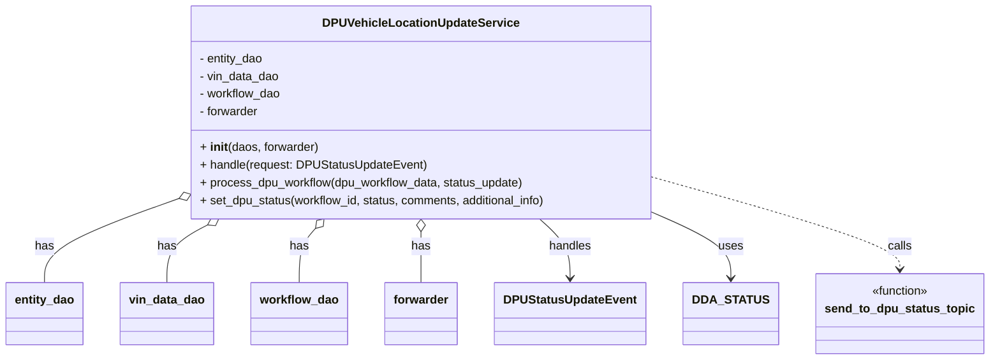

# Diagram: entity_core/entity_service/entity_service/dpu/dpu_service/service/dpu_vehicle_location_update_handler.py


> Auto-generated by Obscura crawlers

## Diagram 1



> SVG rendering failed for this diagram.

## Diagram 2

```mermaid
flowchart TD
Start((Start)) --> A[get entity_internal_id<br/>entity_dao.get_entity_id_from_external]
A --> B[get current location<br/>vin_data_dao.get_current_location_code]
B --> C{Location code<br/>changed vs request?}
C -- Changed --> D[vin_data_dao.set_current_location_code(entity_internal_id, request.location_code)]
D --> E[get dpu_workflow_data<br/>workflow_dao.get_dda_workflow_data]
C -- Not changed --> E
E --> F{result exists AND<br/>location changed AND<br/>dpu_workflow_data present?}
F -- Yes --> G[process_dpu_workflow(dpu_workflow_data, status_update)]
F -- No --> H[send_to_dpu_status_topic(...,"Vehicle Location Update")]
G --> subProcess
subgraph process_dpu_workflow["process_dpu_workflow"]
  P1{workflow_status == SUBMITTED?}
  P2[set_dpu_status(..., status=CANCELED,<br/>comments="This vin was moved to another location.", additional_info)]
  P3{workflow_status == DENIED?}
  P4[workflow_dao.update_dda_workflow_completed_ts(dda_workflow_id)]
  P1 -- Yes --> P2 --> EndProcess((done))
  P1 -- No --> P3
  P3 -- Yes --> P4 --> EndProcess
  P3 -- No --> EndProcess
end
subProcess --> H
H --> I((End))
```

> SVG rendering failed for this diagram.
