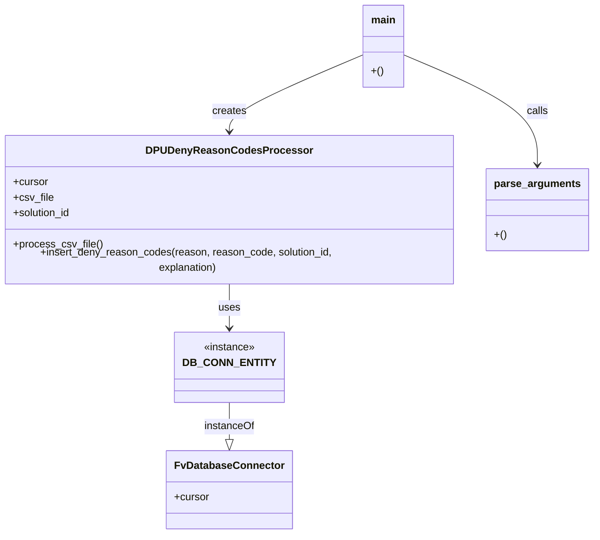

# Diagram: entity_core/entity_service/entity_service/dpu/scripts/backfill_dpu_deny_reason_codes.py


> Auto-generated by Obscura crawlers

## Diagram 1



> SVG rendering failed for this diagram.

## Diagram 2

```mermaid
flowchart TD
    Start([Start]) --> ParseArgs[parse_arguments()]
    ParseArgs --> Main[main()]
    Main --> Instantiate[Create DPUDenyReasonCodesProcessor]
    Instantiate --> OpenCSV[Open CSV file (csv.DictReader)]
    OpenCSV --> ForEach{More rows?}
    ForEach --> Row[Read row]
    Row --> Check{reason and reason_code?}
    Check -- Yes --> Insert[insert_deny_reason_codes(reason, reason_code, solution_id, explanation)]
    Insert --> ExecuteSQL[Cursor.execute(SQL, params)]
    ExecuteSQL --> ForEach
    Check -- No --> ForEach
    ForEach -- No --> End([End])
```

> SVG rendering failed for this diagram.
