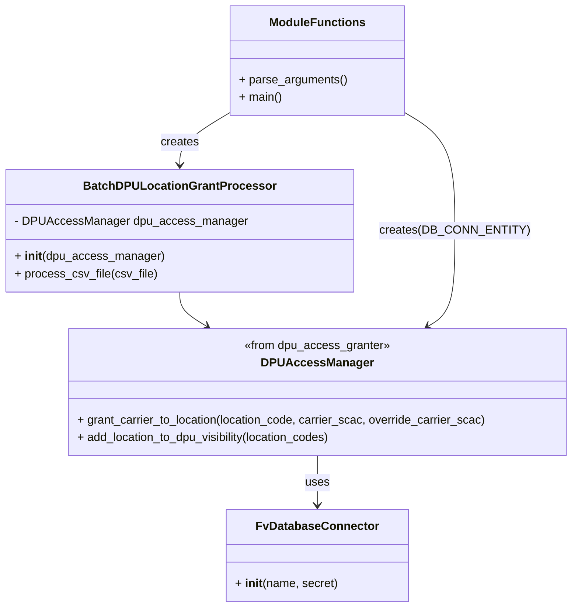

# Diagram: entity_core/entity_service/entity_service/dpu/scripts/grant_carrier_access_to_dpu_location_and_backfill_visibility.py


> Auto-generated by Obscura crawlers

## Diagram 1



### SVG

<svg id="container" width="767.375" xmlns="http://www.w3.org/2000/svg" class="classDiagram" height="832" viewBox="0 0 767.375 832" role="graphics-document document" aria-roledescription="class"><style>#container{font-family:"trebuchet ms",verdana,arial,sans-serif;font-size:16px;fill:#333;}@keyframes edge-animation-frame{from{stroke-dashoffset:0;}}@keyframes dash{to{stroke-dashoffset:0;}}#container .edge-animation-slow{stroke-dasharray:9,5!important;stroke-dashoffset:900;animation:dash 50s linear infinite;stroke-linecap:round;}#container .edge-animation-fast{stroke-dasharray:9,5!important;stroke-dashoffset:900;animation:dash 20s linear infinite;stroke-linecap:round;}#container .error-icon{fill:#552222;}#container .error-text{fill:#552222;stroke:#552222;}#container .edge-thickness-normal{stroke-width:1px;}#container .edge-thickness-thick{stroke-width:3.5px;}#container .edge-pattern-solid{stroke-dasharray:0;}#container .edge-thickness-invisible{stroke-width:0;fill:none;}#container .edge-pattern-dashed{stroke-dasharray:3;}#container .edge-pattern-dotted{stroke-dasharray:2;}#container .marker{fill:#333333;stroke:#333333;}#container .marker.cross{stroke:#333333;}#container svg{font-family:"trebuchet ms",verdana,arial,sans-serif;font-size:16px;}#container p{margin:0;}#container g.classGroup text{fill:#9370DB;stroke:none;font-family:"trebuchet ms",verdana,arial,sans-serif;font-size:10px;}#container g.classGroup text .title{font-weight:bolder;}#container .nodeLabel,#container .edgeLabel{color:#131300;}#container .edgeLabel .label rect{fill:#ECECFF;}#container .label text{fill:#131300;}#container .labelBkg{background:#ECECFF;}#container .edgeLabel .label span{background:#ECECFF;}#container .classTitle{font-weight:bolder;}#container .node rect,#container .node circle,#container .node ellipse,#container .node polygon,#container .node path{fill:#ECECFF;stroke:#9370DB;stroke-width:1px;}#container .divider{stroke:#9370DB;stroke-width:1;}#container g.clickable{cursor:pointer;}#container g.classGroup rect{fill:#ECECFF;stroke:#9370DB;}#container g.classGroup line{stroke:#9370DB;stroke-width:1;}#container .classLabel .box{stroke:none;stroke-width:0;fill:#ECECFF;opacity:0.5;}#container .classLabel .label{fill:#9370DB;font-size:10px;}#container .relation{stroke:#333333;stroke-width:1;fill:none;}#container .dashed-line{stroke-dasharray:3;}#container .dotted-line{stroke-dasharray:1 2;}#container #compositionStart,#container .composition{fill:#333333!important;stroke:#333333!important;stroke-width:1;}#container #compositionEnd,#container .composition{fill:#333333!important;stroke:#333333!important;stroke-width:1;}#container #dependencyStart,#container .dependency{fill:#333333!important;stroke:#333333!important;stroke-width:1;}#container #dependencyStart,#container .dependency{fill:#333333!important;stroke:#333333!important;stroke-width:1;}#container #extensionStart,#container .extension{fill:transparent!important;stroke:#333333!important;stroke-width:1;}#container #extensionEnd,#container .extension{fill:transparent!important;stroke:#333333!important;stroke-width:1;}#container #aggregationStart,#container .aggregation{fill:transparent!important;stroke:#333333!important;stroke-width:1;}#container #aggregationEnd,#container .aggregation{fill:transparent!important;stroke:#333333!important;stroke-width:1;}#container #lollipopStart,#container .lollipop{fill:#ECECFF!important;stroke:#333333!important;stroke-width:1;}#container #lollipopEnd,#container .lollipop{fill:#ECECFF!important;stroke:#333333!important;stroke-width:1;}#container .edgeTerminals{font-size:11px;line-height:initial;}#container .classTitleText{text-anchor:middle;font-size:18px;fill:#333;}#container .label-icon{display:inline-block;height:1em;overflow:visible;vertical-align:-0.125em;}#container .node .label-icon path{fill:currentColor;stroke:revert;stroke-width:revert;}#container :root{--mermaid-font-family:"trebuchet ms",verdana,arial,sans-serif;}</style><g><defs><marker id="container_class-aggregationStart" class="marker aggregation class" refX="18" refY="7" markerWidth="190" markerHeight="240" orient="auto"><path d="M 18,7 L9,13 L1,7 L9,1 Z"></path></marker></defs><defs><marker id="container_class-aggregationEnd" class="marker aggregation class" refX="1" refY="7" markerWidth="20" markerHeight="28" orient="auto"><path d="M 18,7 L9,13 L1,7 L9,1 Z"></path></marker></defs><defs><marker id="container_class-extensionStart" class="marker extension class" refX="18" refY="7" markerWidth="190" markerHeight="240" orient="auto"><path d="M 1,7 L18,13 V 1 Z"></path></marker></defs><defs><marker id="container_class-extensionEnd" class="marker extension class" refX="1" refY="7" markerWidth="20" markerHeight="28" orient="auto"><path d="M 1,1 V 13 L18,7 Z"></path></marker></defs><defs><marker id="container_class-compositionStart" class="marker composition class" refX="18" refY="7" markerWidth="190" markerHeight="240" orient="auto"><path d="M 18,7 L9,13 L1,7 L9,1 Z"></path></marker></defs><defs><marker id="container_class-compositionEnd" class="marker composition class" refX="1" refY="7" markerWidth="20" markerHeight="28" orient="auto"><path d="M 18,7 L9,13 L1,7 L9,1 Z"></path></marker></defs><defs><marker id="container_class-dependencyStart" class="marker dependency class" refX="6" refY="7" markerWidth="190" markerHeight="240" orient="auto"><path d="M 5,7 L9,13 L1,7 L9,1 Z"></path></marker></defs><defs><marker id="container_class-dependencyEnd" class="marker dependency class" refX="13" refY="7" markerWidth="20" markerHeight="28" orient="auto"><path d="M 18,7 L9,13 L14,7 L9,1 Z"></path></marker></defs><defs><marker id="container_class-lollipopStart" class="marker lollipop class" refX="13" refY="7" markerWidth="190" markerHeight="240" orient="auto"><circle stroke="black" fill="transparent" cx="7" cy="7" r="6"></circle></marker></defs><defs><marker id="container_class-lollipopEnd" class="marker lollipop class" refX="1" refY="7" markerWidth="190" markerHeight="240" orient="auto"><circle stroke="black" fill="transparent" cx="7" cy="7" r="6"></circle></marker></defs><g class="root"><g class="clusters"></g><g class="edgePaths"><path d="M236.125,400L236.125,404.167C236.125,408.333,236.125,416.667,241.935,424.469C247.744,432.272,259.364,439.545,265.173,443.181L270.983,446.817" id="id_BatchDPULocationGrantProcessor_DPUAccessManager_1" class="edge-thickness-normal edge-pattern-solid relation" style=";;;" data-edge="true" data-et="edge" data-id="id_BatchDPULocationGrantProcessor_DPUAccessManager_1" data-points="W3sieCI6MjM2LjEyNSwieSI6NDAwfSx7IngiOjIzNi4xMjUsInkiOjQyNX0seyJ4IjoyNzYuMDY5MDIyMDQyNDEwNywieSI6NDUwfV0=" marker-end="url(#container_class-dependencyEnd)"></path><path d="M415.074,624L415.074,630.167C415.074,636.333,415.074,648.667,415.074,660C415.074,671.333,415.074,681.667,415.074,686.833L415.074,692" id="id_DPUAccessManager_FvDatabaseConnector_2" class="edge-thickness-normal edge-pattern-solid relation" style=";;;" data-edge="true" data-et="edge" data-id="id_DPUAccessManager_FvDatabaseConnector_2" data-points="W3sieCI6NDE1LjA3NDIxODc1LCJ5Ijo2MjR9LHsieCI6NDE1LjA3NDIxODc1LCJ5Ijo2NjF9LHsieCI6NDE1LjA3NDIxODc1LCJ5Ijo2OTh9XQ==" marker-end="url(#container_class-dependencyEnd)"></path><path d="M298.152,156.179L287.814,162.649C277.477,169.119,256.801,182.06,246.463,193.696C236.125,205.333,236.125,215.667,236.125,220.833L236.125,226" id="id_ModuleFunctions_BatchDPULocationGrantProcessor_3" class="edge-thickness-normal edge-pattern-solid relation" style=";;;" data-edge="true" data-et="edge" data-id="id_ModuleFunctions_BatchDPULocationGrantProcessor_3" data-points="W3sieCI6Mjk4LjE1MjM0Mzc1LCJ5IjoxNTYuMTc4NTgxNTYzMzc5OTZ9LHsieCI6MjM2LjEyNSwieSI6MTk1fSx7IngiOjIzNi4xMjUsInkiOjIzMn1d" marker-end="url(#container_class-dependencyEnd)"></path><path d="M531.996,156.179L542.334,162.649C552.672,169.119,573.348,182.06,583.686,208.696C594.023,235.333,594.023,275.667,594.023,314C594.023,352.333,594.023,388.667,588.214,410.469C582.404,432.272,570.785,439.545,564.975,443.181L559.165,446.817" id="id_ModuleFunctions_DPUAccessManager_4" class="edge-thickness-normal edge-pattern-solid relation" style=";;;" data-edge="true" data-et="edge" data-id="id_ModuleFunctions_DPUAccessManager_4" data-points="W3sieCI6NTMxLjk5NjA5Mzc1LCJ5IjoxNTYuMTc4NTgxNTYzMzc5OTZ9LHsieCI6NTk0LjAyMzQzNzUsInkiOjE5NX0seyJ4Ijo1OTQuMDIzNDM3NSwieSI6MzE2fSx7IngiOjU5NC4wMjM0Mzc1LCJ5Ijo0MjV9LHsieCI6NTU0LjA3OTQxNTQ1NzU4OTIsInkiOjQ1MH1d" marker-end="url(#container_class-dependencyEnd)"></path></g><g class="edgeLabels"><g class="edgeLabel"><g class="label" data-id="id_BatchDPULocationGrantProcessor_DPUAccessManager_1" transform="translate(0, 0)"><foreignObject width="0" height="0"><div xmlns="http://www.w3.org/1999/xhtml" class="labelBkg" style="display: table-cell; white-space: nowrap; line-height: 1.5; max-width: 200px; text-align: center;"><span class="edgeLabel"></span></div></foreignObject></g></g><g class="edgeLabel" transform="translate(415.07421875, 661)"><g class="label" data-id="id_DPUAccessManager_FvDatabaseConnector_2" transform="translate(-16.4921875, -12)"><foreignObject width="32.984375" height="24"><div xmlns="http://www.w3.org/1999/xhtml" class="labelBkg" style="display: table-cell; white-space: nowrap; line-height: 1.5; max-width: 200px; text-align: center;"><span class="edgeLabel"><p>uses</p></span></div></foreignObject></g></g><g class="edgeLabel" transform="translate(236.125, 195)"><g class="label" data-id="id_ModuleFunctions_BatchDPULocationGrantProcessor_3" transform="translate(-26.171875, -12)"><foreignObject width="52.34375" height="24"><div xmlns="http://www.w3.org/1999/xhtml" class="labelBkg" style="display: table-cell; white-space: nowrap; line-height: 1.5; max-width: 200px; text-align: center;"><span class="edgeLabel"><p>creates</p></span></div></foreignObject></g></g><g class="edgeLabel" transform="translate(594.0234375, 316)"><g class="label" data-id="id_ModuleFunctions_DPUAccessManager_4" transform="translate(-94.7734375, -12)"><foreignObject width="189.546875" height="24"><div xmlns="http://www.w3.org/1999/xhtml" class="labelBkg" style="display: table-cell; white-space: nowrap; line-height: 1.5; max-width: 200px; text-align: center;"><span class="edgeLabel"><p>creates(DB_CONN_ENTITY)</p></span></div></foreignObject></g></g></g><g class="nodes"><g class="node default" id="classId-BatchDPULocationGrantProcessor-0" transform="translate(236.125, 316)"><g class="basic label-container"><path d="M-228.125 -84 L228.125 -84 L228.125 84 L-228.125 84" stroke="none" stroke-width="0" fill="#ECECFF" style=""></path><path d="M-228.125 -84 C-129.3535146903523 -84, -30.582029380704654 -84, 228.125 -84 M-228.125 -84 C-62.67755662561487 -84, 102.76988674877026 -84, 228.125 -84 M228.125 -84 C228.125 -37.235427595011956, 228.125 9.529144809976088, 228.125 84 M228.125 -84 C228.125 -32.652540548390675, 228.125 18.69491890321865, 228.125 84 M228.125 84 C62.55759954902038 84, -103.00980090195924 84, -228.125 84 M228.125 84 C108.40956033296638 84, -11.305879334067242 84, -228.125 84 M-228.125 84 C-228.125 22.827040670036055, -228.125 -38.34591865992789, -228.125 -84 M-228.125 84 C-228.125 47.126625162300215, -228.125 10.25325032460043, -228.125 -84" stroke="#9370DB" stroke-width="1.3" fill="none" stroke-dasharray="0 0" style=""></path></g><g class="annotation-group text" transform="translate(0, -60)"></g><g class="label-group text" transform="translate(-123.375, -60)"><g class="label" style="font-weight: bolder" transform="translate(0,-12)"><foreignObject width="246.75" height="24"><div xmlns="http://www.w3.org/1999/xhtml" style="display: table-cell; white-space: nowrap; line-height: 1.5; max-width: 294px; text-align: center;"><span class="nodeLabel markdown-node-label" style=""><p>BatchDPULocationGrantProcessor</p></span></div></foreignObject></g></g><g class="members-group text" transform="translate(-216.125, -12)"><g class="label" style="" transform="translate(0,-12)"><foreignObject width="308.875" height="24"><div xmlns="http://www.w3.org/1999/xhtml" style="display: table-cell; white-space: nowrap; line-height: 1.5; max-width: 367px; text-align: center;"><span class="nodeLabel markdown-node-label" style=""><p>- DPUAccessManager dpu_access_manager</p></span></div></foreignObject></g></g><g class="methods-group text" transform="translate(-216.125, 36)"><g class="label" style="" transform="translate(0,-12)"><foreignObject width="201.59375" height="24"><div xmlns="http://www.w3.org/1999/xhtml" style="display: table-cell; white-space: nowrap; line-height: 1.5; max-width: 292px; text-align: center;"><span class="nodeLabel markdown-node-label" style=""><p>+ <strong>init</strong>(dpu_access_manager)</p></span></div></foreignObject></g><g class="label" style="" transform="translate(0,12)"><foreignObject width="191.1875" height="24"><div xmlns="http://www.w3.org/1999/xhtml" style="display: table-cell; white-space: nowrap; line-height: 1.5; max-width: 249px; text-align: center;"><span class="nodeLabel markdown-node-label" style=""><p>+ process_csv_file(csv_file)</p></span></div></foreignObject></g></g><g class="divider" style=""><path d="M-228.125 -36 C-62.29270958131994 -36, 103.53958083736012 -36, 228.125 -36 M-228.125 -36 C-80.81389517723863 -36, 66.49720964552273 -36, 228.125 -36" stroke="#9370DB" stroke-width="1.3" fill="none" stroke-dasharray="0 0" style=""></path></g><g class="divider" style=""><path d="M-228.125 12 C-110.68327706220306 12, 6.758445875593878 12, 228.125 12 M-228.125 12 C-54.7182221128632 12, 118.6885557742736 12, 228.125 12" stroke="#9370DB" stroke-width="1.3" fill="none" stroke-dasharray="0 0" style=""></path></g></g><g class="node default" id="classId-DPUAccessManager-1" transform="translate(415.07421875, 537)"><g class="basic label-container"><path d="M-344.30078125 -87 L344.30078125 -87 L344.30078125 87 L-344.30078125 87" stroke="none" stroke-width="0" fill="#ECECFF" style=""></path><path d="M-344.30078125 -87 C-178.65156470710534 -87, -13.002348164210673 -87, 344.30078125 -87 M-344.30078125 -87 C-149.05049579711195 -87, 46.1997896557761 -87, 344.30078125 -87 M344.30078125 -87 C344.30078125 -40.991932114175924, 344.30078125 5.016135771648152, 344.30078125 87 M344.30078125 -87 C344.30078125 -43.52336501046105, 344.30078125 -0.04673002092209799, 344.30078125 87 M344.30078125 87 C146.84674675374117 87, -50.607287742517656 87, -344.30078125 87 M344.30078125 87 C77.26858965914442 87, -189.76360193171115 87, -344.30078125 87 M-344.30078125 87 C-344.30078125 49.33364758885702, -344.30078125 11.667295177714038, -344.30078125 -87 M-344.30078125 87 C-344.30078125 27.466510945855987, -344.30078125 -32.066978108288026, -344.30078125 -87" stroke="#9370DB" stroke-width="1.3" fill="none" stroke-dasharray="0 0" style=""></path></g><g class="annotation-group text" transform="translate(-100.1484375, -63)"><g class="label" style="" transform="translate(0,-12)"><foreignObject width="200.296875" height="24"><div xmlns="http://www.w3.org/1999/xhtml" style="display: table-cell; white-space: nowrap; line-height: 1.5; max-width: 250px; text-align: center;"><span class="nodeLabel markdown-node-label" style=""><p>«from dpu_access_granter»</p></span></div></foreignObject></g></g><g class="label-group text" transform="translate(-70.7421875, -39)"><g class="label" style="font-weight: bolder" transform="translate(0,-12)"><foreignObject width="141.484375" height="24"><div xmlns="http://www.w3.org/1999/xhtml" style="display: table-cell; white-space: nowrap; line-height: 1.5; max-width: 190px; text-align: center;"><span class="nodeLabel markdown-node-label" style=""><p>DPUAccessManager</p></span></div></foreignObject></g></g><g class="members-group text" transform="translate(-332.30078125, 9)"></g><g class="methods-group text" transform="translate(-332.30078125, 39)"><g class="label" style="" transform="translate(0,-12)"><foreignObject width="564.453125" height="24"><div xmlns="http://www.w3.org/1999/xhtml" style="display: table-cell; white-space: nowrap; line-height: 1.5; max-width: 622px; text-align: center;"><span class="nodeLabel markdown-node-label" style=""><p>+ grant_carrier_to_location(location_code, carrier_scac, override_carrier_scac)</p></span></div></foreignObject></g><g class="label" style="" transform="translate(0,12)"><foreignObject width="355.265625" height="24"><div xmlns="http://www.w3.org/1999/xhtml" style="display: table-cell; white-space: nowrap; line-height: 1.5; max-width: 413px; text-align: center;"><span class="nodeLabel markdown-node-label" style=""><p>+ add_location_to_dpu_visibility(location_codes)</p></span></div></foreignObject></g></g><g class="divider" style=""><path d="M-344.30078125 -15 C-155.26851463692503 -15, 33.76375197614993 -15, 344.30078125 -15 M-344.30078125 -15 C-200.0760634382919 -15, -55.85134562658379 -15, 344.30078125 -15" stroke="#9370DB" stroke-width="1.3" fill="none" stroke-dasharray="0 0" style=""></path></g><g class="divider" style=""><path d="M-344.30078125 9 C-135.95604389675103 9, 72.38869345649795 9, 344.30078125 9 M-344.30078125 9 C-201.9530123817257 9, -59.6052435134514 9, 344.30078125 9" stroke="#9370DB" stroke-width="1.3" fill="none" stroke-dasharray="0 0" style=""></path></g></g><g class="node default" id="classId-FvDatabaseConnector-2" transform="translate(415.07421875, 761)"><g class="basic label-container"><path d="M-121.41015625 -63 L121.41015625 -63 L121.41015625 63 L-121.41015625 63" stroke="none" stroke-width="0" fill="#ECECFF" style=""></path><path d="M-121.41015625 -63 C-62.6435746403796 -63, -3.876993030759195 -63, 121.41015625 -63 M-121.41015625 -63 C-25.43412500138865 -63, 70.5419062472227 -63, 121.41015625 -63 M121.41015625 -63 C121.41015625 -32.79958324290722, 121.41015625 -2.599166485814443, 121.41015625 63 M121.41015625 -63 C121.41015625 -21.44253882986706, 121.41015625 20.114922340265878, 121.41015625 63 M121.41015625 63 C41.68641702128558 63, -38.03732220742884 63, -121.41015625 63 M121.41015625 63 C47.51204199743728 63, -26.38607225512544 63, -121.41015625 63 M-121.41015625 63 C-121.41015625 31.67934320809218, -121.41015625 0.35868641618436214, -121.41015625 -63 M-121.41015625 63 C-121.41015625 16.589017879238135, -121.41015625 -29.82196424152373, -121.41015625 -63" stroke="#9370DB" stroke-width="1.3" fill="none" stroke-dasharray="0 0" style=""></path></g><g class="annotation-group text" transform="translate(0, -39)"></g><g class="label-group text" transform="translate(-79.3046875, -39)"><g class="label" style="font-weight: bolder" transform="translate(0,-12)"><foreignObject width="158.609375" height="24"><div xmlns="http://www.w3.org/1999/xhtml" style="display: table-cell; white-space: nowrap; line-height: 1.5; max-width: 207px; text-align: center;"><span class="nodeLabel markdown-node-label" style=""><p>FvDatabaseConnector</p></span></div></foreignObject></g></g><g class="members-group text" transform="translate(-109.41015625, 9)"></g><g class="methods-group text" transform="translate(-109.41015625, 39)"><g class="label" style="" transform="translate(0,-12)"><foreignObject width="139.515625" height="24"><div xmlns="http://www.w3.org/1999/xhtml" style="display: table-cell; white-space: nowrap; line-height: 1.5; max-width: 230px; text-align: center;"><span class="nodeLabel markdown-node-label" style=""><p>+ <strong>init</strong>(name, secret)</p></span></div></foreignObject></g></g><g class="divider" style=""><path d="M-121.41015625 -15 C-53.72259775428216 -15, 13.964960741435675 -15, 121.41015625 -15 M-121.41015625 -15 C-35.8231558054092 -15, 49.7638446391816 -15, 121.41015625 -15" stroke="#9370DB" stroke-width="1.3" fill="none" stroke-dasharray="0 0" style=""></path></g><g class="divider" style=""><path d="M-121.41015625 9 C-44.305657471015905 9, 32.79884130796819 9, 121.41015625 9 M-121.41015625 9 C-27.488731059603708 9, 66.43269413079258 9, 121.41015625 9" stroke="#9370DB" stroke-width="1.3" fill="none" stroke-dasharray="0 0" style=""></path></g></g><g class="node default" id="classId-ModuleFunctions-3" transform="translate(415.07421875, 83)"><g class="basic label-container"><path d="M-116.921875 -75 L116.921875 -75 L116.921875 75 L-116.921875 75" stroke="none" stroke-width="0" fill="#ECECFF" style=""></path><path d="M-116.921875 -75 C-31.637971847060825 -75, 53.64593130587835 -75, 116.921875 -75 M-116.921875 -75 C-58.91163847803752 -75, -0.9014019560750341 -75, 116.921875 -75 M116.921875 -75 C116.921875 -39.375605249796195, 116.921875 -3.751210499592389, 116.921875 75 M116.921875 -75 C116.921875 -17.935708013443573, 116.921875 39.12858397311285, 116.921875 75 M116.921875 75 C30.390844170015626 75, -56.14018665996875 75, -116.921875 75 M116.921875 75 C58.79367213716887 75, 0.6654692743377382 75, -116.921875 75 M-116.921875 75 C-116.921875 29.72470565754532, -116.921875 -15.550588684909357, -116.921875 -75 M-116.921875 75 C-116.921875 19.77574071180247, -116.921875 -35.44851857639506, -116.921875 -75" stroke="#9370DB" stroke-width="1.3" fill="none" stroke-dasharray="0 0" style=""></path></g><g class="annotation-group text" transform="translate(0, -51)"></g><g class="label-group text" transform="translate(-62.21875, -51)"><g class="label" style="font-weight: bolder" transform="translate(0,-12)"><foreignObject width="124.4375" height="24"><div xmlns="http://www.w3.org/1999/xhtml" style="display: table-cell; white-space: nowrap; line-height: 1.5; max-width: 174px; text-align: center;"><span class="nodeLabel markdown-node-label" style=""><p>ModuleFunctions</p></span></div></foreignObject></g></g><g class="members-group text" transform="translate(-104.921875, -3)"></g><g class="methods-group text" transform="translate(-104.921875, 27)"><g class="label" style="" transform="translate(0,-12)"><foreignObject width="147.625" height="24"><div xmlns="http://www.w3.org/1999/xhtml" style="display: table-cell; white-space: nowrap; line-height: 1.5; max-width: 205px; text-align: center;"><span class="nodeLabel markdown-node-label" style=""><p>+ parse_arguments()</p></span></div></foreignObject></g><g class="label" style="" transform="translate(0,12)"><foreignObject width="58.90625" height="24"><div xmlns="http://www.w3.org/1999/xhtml" style="display: table-cell; white-space: nowrap; line-height: 1.5; max-width: 116px; text-align: center;"><span class="nodeLabel markdown-node-label" style=""><p>+ main()</p></span></div></foreignObject></g></g><g class="divider" style=""><path d="M-116.921875 -27 C-50.94296366103271 -27, 15.035947677934587 -27, 116.921875 -27 M-116.921875 -27 C-51.63058271877911 -27, 13.660709562441781 -27, 116.921875 -27" stroke="#9370DB" stroke-width="1.3" fill="none" stroke-dasharray="0 0" style=""></path></g><g class="divider" style=""><path d="M-116.921875 -3 C-50.87725891437901 -3, 15.167357171241974 -3, 116.921875 -3 M-116.921875 -3 C-39.46092119375723 -3, 38.00003261248554 -3, 116.921875 -3" stroke="#9370DB" stroke-width="1.3" fill="none" stroke-dasharray="0 0" style=""></path></g></g></g></g></g></svg>

## Diagram 2

```mermaid
flowchart TD
    Start([Start]) --> Parse[parse_arguments()]
    Parse --> CreateDB[DB_CONN_ENTITY = FvDatabaseConnector(...)]
    Parse --> CreateManager[Create DPUAccessManager(DB_CONN_ENTITY, shipper_fv_id, ticket)]
    CreateManager --> CreateProcessor[Create BatchDPULocationGrantProcessor(dpu_access_manager)]
    CreateProcessor --> CallProcess[Call process_csv_file(csv_file)]
    CallProcess --> OpenCSV[Open CSV file (utf-8-sig)]
    OpenCSV --> ForEach[For each row in CSV]
    ForEach --> Extract[Extract "Ramp Code", "FD Carrier SCAC", "Yard Manager (Assmbly/RR) SCAC"]
    Extract --> Append[Append Ramp Code to location_codes]
    Extract --> Check{location_code AND carrier_scac?}
    Check -->|Yes| Grant[grant_carrier_to_location(location_code, carrier_scac, override_carrier_scac)]
    Check -->|No| Warn[logging.warning("Missing location code or carrier SCAC")]
    ForEach --> AfterLoop[After all rows processed]
    AfterLoop --> AddVisibility[add_location_to_dpu_visibility(location_codes)]
    AddVisibility --> End([End])
```

> SVG rendering failed for this diagram.
