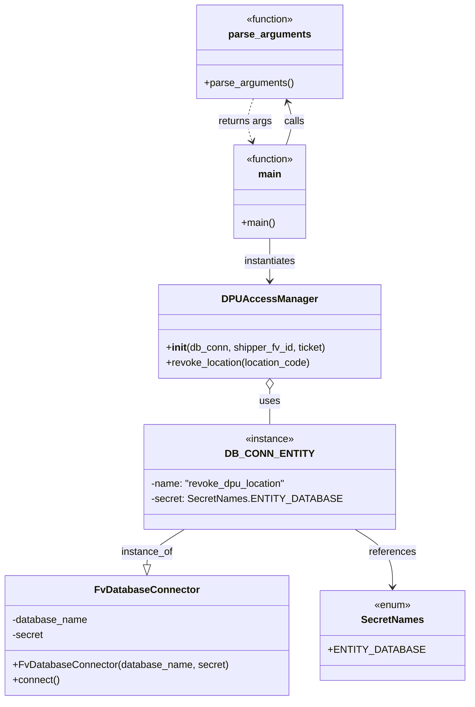

# Diagram: entity_core/entity_service/entity_service/dpu/scripts/revoke_dpu_location.py


> Auto-generated by Obscura crawlers

## Diagram 1



### SVG

<svg id="container" width="719.3359375" xmlns="http://www.w3.org/2000/svg" class="classDiagram" height="1122" viewBox="0 0 719.3359375 1122" role="graphics-document document" aria-roledescription="class"><style>#container{font-family:"trebuchet ms",verdana,arial,sans-serif;font-size:16px;fill:#333;}@keyframes edge-animation-frame{from{stroke-dashoffset:0;}}@keyframes dash{to{stroke-dashoffset:0;}}#container .edge-animation-slow{stroke-dasharray:9,5!important;stroke-dashoffset:900;animation:dash 50s linear infinite;stroke-linecap:round;}#container .edge-animation-fast{stroke-dasharray:9,5!important;stroke-dashoffset:900;animation:dash 20s linear infinite;stroke-linecap:round;}#container .error-icon{fill:#552222;}#container .error-text{fill:#552222;stroke:#552222;}#container .edge-thickness-normal{stroke-width:1px;}#container .edge-thickness-thick{stroke-width:3.5px;}#container .edge-pattern-solid{stroke-dasharray:0;}#container .edge-thickness-invisible{stroke-width:0;fill:none;}#container .edge-pattern-dashed{stroke-dasharray:3;}#container .edge-pattern-dotted{stroke-dasharray:2;}#container .marker{fill:#333333;stroke:#333333;}#container .marker.cross{stroke:#333333;}#container svg{font-family:"trebuchet ms",verdana,arial,sans-serif;font-size:16px;}#container p{margin:0;}#container g.classGroup text{fill:#9370DB;stroke:none;font-family:"trebuchet ms",verdana,arial,sans-serif;font-size:10px;}#container g.classGroup text .title{font-weight:bolder;}#container .nodeLabel,#container .edgeLabel{color:#131300;}#container .edgeLabel .label rect{fill:#ECECFF;}#container .label text{fill:#131300;}#container .labelBkg{background:#ECECFF;}#container .edgeLabel .label span{background:#ECECFF;}#container .classTitle{font-weight:bolder;}#container .node rect,#container .node circle,#container .node ellipse,#container .node polygon,#container .node path{fill:#ECECFF;stroke:#9370DB;stroke-width:1px;}#container .divider{stroke:#9370DB;stroke-width:1;}#container g.clickable{cursor:pointer;}#container g.classGroup rect{fill:#ECECFF;stroke:#9370DB;}#container g.classGroup line{stroke:#9370DB;stroke-width:1;}#container .classLabel .box{stroke:none;stroke-width:0;fill:#ECECFF;opacity:0.5;}#container .classLabel .label{fill:#9370DB;font-size:10px;}#container .relation{stroke:#333333;stroke-width:1;fill:none;}#container .dashed-line{stroke-dasharray:3;}#container .dotted-line{stroke-dasharray:1 2;}#container #compositionStart,#container .composition{fill:#333333!important;stroke:#333333!important;stroke-width:1;}#container #compositionEnd,#container .composition{fill:#333333!important;stroke:#333333!important;stroke-width:1;}#container #dependencyStart,#container .dependency{fill:#333333!important;stroke:#333333!important;stroke-width:1;}#container #dependencyStart,#container .dependency{fill:#333333!important;stroke:#333333!important;stroke-width:1;}#container #extensionStart,#container .extension{fill:transparent!important;stroke:#333333!important;stroke-width:1;}#container #extensionEnd,#container .extension{fill:transparent!important;stroke:#333333!important;stroke-width:1;}#container #aggregationStart,#container .aggregation{fill:transparent!important;stroke:#333333!important;stroke-width:1;}#container #aggregationEnd,#container .aggregation{fill:transparent!important;stroke:#333333!important;stroke-width:1;}#container #lollipopStart,#container .lollipop{fill:#ECECFF!important;stroke:#333333!important;stroke-width:1;}#container #lollipopEnd,#container .lollipop{fill:#ECECFF!important;stroke:#333333!important;stroke-width:1;}#container .edgeTerminals{font-size:11px;line-height:initial;}#container .classTitleText{text-anchor:middle;font-size:18px;fill:#333;}#container .label-icon{display:inline-block;height:1em;overflow:visible;vertical-align:-0.125em;}#container .node .label-icon path{fill:currentColor;stroke:revert;stroke-width:revert;}#container :root{--mermaid-font-family:"trebuchet ms",verdana,arial,sans-serif;}</style><g><defs><marker id="container_class-aggregationStart" class="marker aggregation class" refX="18" refY="7" markerWidth="190" markerHeight="240" orient="auto"><path d="M 18,7 L9,13 L1,7 L9,1 Z"></path></marker></defs><defs><marker id="container_class-aggregationEnd" class="marker aggregation class" refX="1" refY="7" markerWidth="20" markerHeight="28" orient="auto"><path d="M 18,7 L9,13 L1,7 L9,1 Z"></path></marker></defs><defs><marker id="container_class-extensionStart" class="marker extension class" refX="18" refY="7" markerWidth="190" markerHeight="240" orient="auto"><path d="M 1,7 L18,13 V 1 Z"></path></marker></defs><defs><marker id="container_class-extensionEnd" class="marker extension class" refX="1" refY="7" markerWidth="20" markerHeight="28" orient="auto"><path d="M 1,1 V 13 L18,7 Z"></path></marker></defs><defs><marker id="container_class-compositionStart" class="marker composition class" refX="18" refY="7" markerWidth="190" markerHeight="240" orient="auto"><path d="M 18,7 L9,13 L1,7 L9,1 Z"></path></marker></defs><defs><marker id="container_class-compositionEnd" class="marker composition class" refX="1" refY="7" markerWidth="20" markerHeight="28" orient="auto"><path d="M 18,7 L9,13 L1,7 L9,1 Z"></path></marker></defs><defs><marker id="container_class-dependencyStart" class="marker dependency class" refX="6" refY="7" markerWidth="190" markerHeight="240" orient="auto"><path d="M 5,7 L9,13 L1,7 L9,1 Z"></path></marker></defs><defs><marker id="container_class-dependencyEnd" class="marker dependency class" refX="13" refY="7" markerWidth="20" markerHeight="28" orient="auto"><path d="M 18,7 L9,13 L14,7 L9,1 Z"></path></marker></defs><defs><marker id="container_class-lollipopStart" class="marker lollipop class" refX="13" refY="7" markerWidth="190" markerHeight="240" orient="auto"><circle stroke="black" fill="transparent" cx="7" cy="7" r="6"></circle></marker></defs><defs><marker id="container_class-lollipopEnd" class="marker lollipop class" refX="1" refY="7" markerWidth="190" markerHeight="240" orient="auto"><circle stroke="black" fill="transparent" cx="7" cy="7" r="6"></circle></marker></defs><g class="root"><g class="clusters"></g><g class="edgePaths"><path d="M288.328,848L278.73,854.167C269.131,860.333,249.935,872.667,240.337,882.125C230.738,891.583,230.738,898.167,230.738,901.458L230.738,904.75" id="id_DB_CONN_ENTITY_FvDatabaseConnector_1" class="edge-thickness-normal edge-pattern-solid relation" style=";;;" data-edge="true" data-et="edge" data-id="id_DB_CONN_ENTITY_FvDatabaseConnector_1" data-points="W3sieCI6Mjg4LjMyODAxMjAwOTI5NzUsInkiOjg0OH0seyJ4IjoyMzAuNzM4MjgxMjUsInkiOjg4NX0seyJ4IjoyMzAuNzM4MjgxMjUsInkiOjkyMn1d" marker-end="url(#container_class-extensionEnd)"></path><path d="M419.072,623.25L419.072,626.542C419.072,629.833,419.072,636.417,419.072,645.875C419.072,655.333,419.072,667.667,419.072,673.833L419.072,680" id="id_DPUAccessManager_DB_CONN_ENTITY_2" class="edge-thickness-normal edge-pattern-solid relation" style=";;;" data-edge="true" data-et="edge" data-id="id_DPUAccessManager_DB_CONN_ENTITY_2" data-points="W3sieCI6NDE5LjA3MjI2NTYyNSwieSI6NjA2fSx7IngiOjQxOS4wNzIyNjU2MjUsInkiOjY0M30seyJ4Ijo0MTkuMDcyMjY1NjI1LCJ5Ijo2ODB9XQ==" marker-start="url(#container_class-aggregationStart)"></path><path d="M549.817,848L559.415,854.167C569.013,860.333,588.21,872.667,597.808,888C607.406,903.333,607.406,921.667,607.406,930.833L607.406,940" id="id_DB_CONN_ENTITY_SecretNames_3" class="edge-thickness-normal edge-pattern-solid relation" style=";;;" data-edge="true" data-et="edge" data-id="id_DB_CONN_ENTITY_SecretNames_3" data-points="W3sieCI6NTQ5LjgxNjUxOTI0MDcwMjUsInkiOjg0OH0seyJ4Ijo2MDcuNDA2MjUsInkiOjg4NX0seyJ4Ijo2MDcuNDA2MjUsInkiOjk0Nn1d" marker-end="url(#container_class-dependencyEnd)"></path><path d="M445.855,232L448.058,225.833C450.26,219.667,454.664,207.333,455,195.942C455.337,184.55,451.605,174.1,449.739,168.875L447.873,163.651" id="id_main_parse_arguments_4" class="edge-thickness-normal edge-pattern-solid relation" style=";;;" data-edge="true" data-et="edge" data-id="id_main_parse_arguments_4" data-points="W3sieCI6NDQ1Ljg1NTM2NDExODMwMzU2LCJ5IjoyMzJ9LHsieCI6NDU5LjA2ODM1OTM3NSwieSI6MTk1fSx7IngiOjQ0NS44NTUzNjQxMTgzMDM1NiwieSI6MTU4fV0=" marker-end="url(#container_class-dependencyEnd)"></path><path d="M419.072,382L419.072,388.167C419.072,394.333,419.072,406.667,419.072,418C419.072,429.333,419.072,439.667,419.072,444.833L419.072,450" id="id_main_DPUAccessManager_5" class="edge-thickness-normal edge-pattern-solid relation" style=";;;" data-edge="true" data-et="edge" data-id="id_main_DPUAccessManager_5" data-points="W3sieCI6NDE5LjA3MjI2NTYyNSwieSI6MzgyfSx7IngiOjQxOS4wNzIyNjU2MjUsInkiOjQxOX0seyJ4Ijo0MTkuMDcyMjY1NjI1LCJ5Ijo0NTZ9XQ==" marker-end="url(#container_class-dependencyEnd)"></path><path d="M392.289,158L390.087,164.167C387.885,170.333,383.481,182.667,383.144,194.058C382.808,205.45,386.54,215.9,388.405,221.125L390.271,226.349" id="id_parse_arguments_main_6" class="edge-thickness-normal edge-pattern-dashed relation" style=";;;" data-edge="true" data-et="edge" data-id="id_parse_arguments_main_6" data-points="W3sieCI6MzkyLjI4OTE2NzEzMTY5NjQ0LCJ5IjoxNTh9LHsieCI6Mzc5LjA3NjE3MTg3NSwieSI6MTk1fSx7IngiOjM5Mi4yODkxNjcxMzE2OTY0NCwieSI6MjMyfV0=" marker-end="url(#container_class-dependencyEnd)"></path></g><g class="edgeLabels"><g class="edgeLabel" transform="translate(230.73828125, 885)"><g class="label" data-id="id_DB_CONN_ENTITY_FvDatabaseConnector_1" transform="translate(-41.7734375, -12)"><foreignObject width="83.546875" height="24"><div xmlns="http://www.w3.org/1999/xhtml" class="labelBkg" style="display: table-cell; white-space: nowrap; line-height: 1.5; max-width: 200px; text-align: center;"><span class="edgeLabel"><p>instance_of</p></span></div></foreignObject></g></g><g class="edgeLabel" transform="translate(419.072265625, 643)"><g class="label" data-id="id_DPUAccessManager_DB_CONN_ENTITY_2" transform="translate(-16.4921875, -12)"><foreignObject width="32.984375" height="24"><div xmlns="http://www.w3.org/1999/xhtml" class="labelBkg" style="display: table-cell; white-space: nowrap; line-height: 1.5; max-width: 200px; text-align: center;"><span class="edgeLabel"><p>uses</p></span></div></foreignObject></g></g><g class="edgeLabel" transform="translate(607.40625, 885)"><g class="label" data-id="id_DB_CONN_ENTITY_SecretNames_3" transform="translate(-37.828125, -12)"><foreignObject width="75.65625" height="24"><div xmlns="http://www.w3.org/1999/xhtml" class="labelBkg" style="display: table-cell; white-space: nowrap; line-height: 1.5; max-width: 200px; text-align: center;"><span class="edgeLabel"><p>references</p></span></div></foreignObject></g></g><g class="edgeLabel" transform="translate(459.068359375, 195)"><g class="label" data-id="id_main_parse_arguments_4" transform="translate(-16.4453125, -12)"><foreignObject width="32.890625" height="24"><div xmlns="http://www.w3.org/1999/xhtml" class="labelBkg" style="display: table-cell; white-space: nowrap; line-height: 1.5; max-width: 200px; text-align: center;"><span class="edgeLabel"><p>calls</p></span></div></foreignObject></g></g><g class="edgeLabel" transform="translate(419.072265625, 419)"><g class="label" data-id="id_main_DPUAccessManager_5" transform="translate(-42.9140625, -12)"><foreignObject width="85.828125" height="24"><div xmlns="http://www.w3.org/1999/xhtml" class="labelBkg" style="display: table-cell; white-space: nowrap; line-height: 1.5; max-width: 200px; text-align: center;"><span class="edgeLabel"><p>instantiates</p></span></div></foreignObject></g></g><g class="edgeLabel" transform="translate(379.076171875, 195)"><g class="label" data-id="id_parse_arguments_main_6" transform="translate(-43.546875, -12)"><foreignObject width="87.09375" height="24"><div xmlns="http://www.w3.org/1999/xhtml" class="labelBkg" style="display: table-cell; white-space: nowrap; line-height: 1.5; max-width: 200px; text-align: center;"><span class="edgeLabel"><p>returns args</p></span></div></foreignObject></g></g></g><g class="nodes"><g class="node default" id="classId-DPUAccessManager-0" transform="translate(419.072265625, 531)"><g class="basic label-container"><path d="M-176.74609375 -75 L176.74609375 -75 L176.74609375 75 L-176.74609375 75" stroke="none" stroke-width="0" fill="#ECECFF" style=""></path><path d="M-176.74609375 -75 C-93.39350702337843 -75, -10.040920296756866 -75, 176.74609375 -75 M-176.74609375 -75 C-66.03813558821595 -75, 44.6698225735681 -75, 176.74609375 -75 M176.74609375 -75 C176.74609375 -15.234440011467761, 176.74609375 44.53111997706448, 176.74609375 75 M176.74609375 -75 C176.74609375 -22.233493734411127, 176.74609375 30.533012531177746, 176.74609375 75 M176.74609375 75 C59.12396865816831 75, -58.49815643366338 75, -176.74609375 75 M176.74609375 75 C43.19423828948186 75, -90.35761717103628 75, -176.74609375 75 M-176.74609375 75 C-176.74609375 22.444205613254113, -176.74609375 -30.111588773491775, -176.74609375 -75 M-176.74609375 75 C-176.74609375 38.844356252959166, -176.74609375 2.688712505918332, -176.74609375 -75" stroke="#9370DB" stroke-width="1.3" fill="none" stroke-dasharray="0 0" style=""></path></g><g class="annotation-group text" transform="translate(0, -51)"></g><g class="label-group text" transform="translate(-70.7421875, -51)"><g class="label" style="font-weight: bolder" transform="translate(0,-12)"><foreignObject width="141.484375" height="24"><div xmlns="http://www.w3.org/1999/xhtml" style="display: table-cell; white-space: nowrap; line-height: 1.5; max-width: 190px; text-align: center;"><span class="nodeLabel markdown-node-label" style=""><p>DPUAccessManager</p></span></div></foreignObject></g></g><g class="members-group text" transform="translate(-164.74609375, -3)"></g><g class="methods-group text" transform="translate(-164.74609375, 27)"><g class="label" style="" transform="translate(0,-12)"><foreignObject width="258.75" height="24"><div xmlns="http://www.w3.org/1999/xhtml" style="display: table-cell; white-space: nowrap; line-height: 1.5; max-width: 348px; text-align: center;"><span class="nodeLabel markdown-node-label" style=""><p>+<strong>init</strong>(db_conn, shipper_fv_id, ticket)</p></span></div></foreignObject></g><g class="label" style="" transform="translate(0,12)"><foreignObject width="235.734375" height="24"><div xmlns="http://www.w3.org/1999/xhtml" style="display: table-cell; white-space: nowrap; line-height: 1.5; max-width: 293px; text-align: center;"><span class="nodeLabel markdown-node-label" style=""><p>+revoke_location(location_code)</p></span></div></foreignObject></g></g><g class="divider" style=""><path d="M-176.74609375 -27 C-89.89683864614227 -27, -3.047583542284542 -27, 176.74609375 -27 M-176.74609375 -27 C-87.74414403636396 -27, 1.2578056772720743 -27, 176.74609375 -27" stroke="#9370DB" stroke-width="1.3" fill="none" stroke-dasharray="0 0" style=""></path></g><g class="divider" style=""><path d="M-176.74609375 -3 C-87.58106148981848 -3, 1.5839707703630381 -3, 176.74609375 -3 M-176.74609375 -3 C-43.87049575501311 -3, 89.00510223997378 -3, 176.74609375 -3" stroke="#9370DB" stroke-width="1.3" fill="none" stroke-dasharray="0 0" style=""></path></g></g><g class="node default" id="classId-FvDatabaseConnector-1" transform="translate(230.73828125, 1018)"><g class="basic label-container"><path d="M-222.73828125 -96 L222.73828125 -96 L222.73828125 96 L-222.73828125 96" stroke="none" stroke-width="0" fill="#ECECFF" style=""></path><path d="M-222.73828125 -96 C-71.22404871631508 -96, 80.29018381736984 -96, 222.73828125 -96 M-222.73828125 -96 C-127.41962628306928 -96, -32.100971316138555 -96, 222.73828125 -96 M222.73828125 -96 C222.73828125 -23.930440523713955, 222.73828125 48.13911895257209, 222.73828125 96 M222.73828125 -96 C222.73828125 -55.6730439593304, 222.73828125 -15.3460879186608, 222.73828125 96 M222.73828125 96 C131.2874529839683 96, 39.836624717936644 96, -222.73828125 96 M222.73828125 96 C61.10129008925543 96, -100.53570107148914 96, -222.73828125 96 M-222.73828125 96 C-222.73828125 56.65011663016302, -222.73828125 17.30023326032604, -222.73828125 -96 M-222.73828125 96 C-222.73828125 26.268001832742485, -222.73828125 -43.46399633451503, -222.73828125 -96" stroke="#9370DB" stroke-width="1.3" fill="none" stroke-dasharray="0 0" style=""></path></g><g class="annotation-group text" transform="translate(0, -72)"></g><g class="label-group text" transform="translate(-79.3046875, -72)"><g class="label" style="font-weight: bolder" transform="translate(0,-12)"><foreignObject width="158.609375" height="24"><div xmlns="http://www.w3.org/1999/xhtml" style="display: table-cell; white-space: nowrap; line-height: 1.5; max-width: 207px; text-align: center;"><span class="nodeLabel markdown-node-label" style=""><p>FvDatabaseConnector</p></span></div></foreignObject></g></g><g class="members-group text" transform="translate(-210.73828125, -24)"><g class="label" style="" transform="translate(0,-12)"><foreignObject width="121.6875" height="24"><div xmlns="http://www.w3.org/1999/xhtml" style="display: table-cell; white-space: nowrap; line-height: 1.5; max-width: 179px; text-align: center;"><span class="nodeLabel markdown-node-label" style=""><p>-database_name</p></span></div></foreignObject></g><g class="label" style="" transform="translate(0,12)"><foreignObject width="50.484375" height="24"><div xmlns="http://www.w3.org/1999/xhtml" style="display: table-cell; white-space: nowrap; line-height: 1.5; max-width: 108px; text-align: center;"><span class="nodeLabel markdown-node-label" style=""><p>-secret</p></span></div></foreignObject></g></g><g class="methods-group text" transform="translate(-210.73828125, 48)"><g class="label" style="" transform="translate(0,-12)"><foreignObject width="342.171875" height="24"><div xmlns="http://www.w3.org/1999/xhtml" style="display: table-cell; white-space: nowrap; line-height: 1.5; max-width: 400px; text-align: center;"><span class="nodeLabel markdown-node-label" style=""><p>+FvDatabaseConnector(database_name, secret)</p></span></div></foreignObject></g><g class="label" style="" transform="translate(0,12)"><foreignObject width="75.921875" height="24"><div xmlns="http://www.w3.org/1999/xhtml" style="display: table-cell; white-space: nowrap; line-height: 1.5; max-width: 133px; text-align: center;"><span class="nodeLabel markdown-node-label" style=""><p>+connect()</p></span></div></foreignObject></g></g><g class="divider" style=""><path d="M-222.73828125 -48 C-73.61383395272998 -48, 75.51061334454005 -48, 222.73828125 -48 M-222.73828125 -48 C-78.05027327270508 -48, 66.63773470458983 -48, 222.73828125 -48" stroke="#9370DB" stroke-width="1.3" fill="none" stroke-dasharray="0 0" style=""></path></g><g class="divider" style=""><path d="M-222.73828125 24 C-78.18183172847603 24, 66.37461779304795 24, 222.73828125 24 M-222.73828125 24 C-109.77055614061352 24, 3.1971689687729565 24, 222.73828125 24" stroke="#9370DB" stroke-width="1.3" fill="none" stroke-dasharray="0 0" style=""></path></g></g><g class="node default" id="classId-SecretNames-2" transform="translate(607.40625, 1018)"><g class="basic label-container"><path d="M-103.9296875 -72 L103.9296875 -72 L103.9296875 72 L-103.9296875 72" stroke="none" stroke-width="0" fill="#ECECFF" style=""></path><path d="M-103.9296875 -72 C-31.84824968835514 -72, 40.23318812328972 -72, 103.9296875 -72 M-103.9296875 -72 C-58.21227914442778 -72, -12.494870788855565 -72, 103.9296875 -72 M103.9296875 -72 C103.9296875 -16.086701759678547, 103.9296875 39.826596480642905, 103.9296875 72 M103.9296875 -72 C103.9296875 -34.68481606610552, 103.9296875 2.630367867788962, 103.9296875 72 M103.9296875 72 C59.016934807095275 72, 14.10418211419055 72, -103.9296875 72 M103.9296875 72 C34.3160262101259 72, -35.297635079748204 72, -103.9296875 72 M-103.9296875 72 C-103.9296875 24.604089985103194, -103.9296875 -22.791820029793612, -103.9296875 -72 M-103.9296875 72 C-103.9296875 31.961335646219787, -103.9296875 -8.077328707560426, -103.9296875 -72" stroke="#9370DB" stroke-width="1.3" fill="none" stroke-dasharray="0 0" style=""></path></g><g class="annotation-group text" transform="translate(-29.53125, -48)"><g class="label" style="" transform="translate(0,-12)"><foreignObject width="59.0625" height="24"><div xmlns="http://www.w3.org/1999/xhtml" style="display: table-cell; white-space: nowrap; line-height: 1.5; max-width: 109px; text-align: center;"><span class="nodeLabel markdown-node-label" style=""><p>«enum»</p></span></div></foreignObject></g></g><g class="label-group text" transform="translate(-48.03125, -24)"><g class="label" style="font-weight: bolder" transform="translate(0,-12)"><foreignObject width="96.0625" height="24"><div xmlns="http://www.w3.org/1999/xhtml" style="display: table-cell; white-space: nowrap; line-height: 1.5; max-width: 145px; text-align: center;"><span class="nodeLabel markdown-node-label" style=""><p>SecretNames</p></span></div></foreignObject></g></g><g class="members-group text" transform="translate(-91.9296875, 24)"><g class="label" style="" transform="translate(0,-12)"><foreignObject width="135.828125" height="24"><div xmlns="http://www.w3.org/1999/xhtml" style="display: table-cell; white-space: nowrap; line-height: 1.5; max-width: 193px; text-align: center;"><span class="nodeLabel markdown-node-label" style=""><p>+ENTITY_DATABASE</p></span></div></foreignObject></g></g><g class="methods-group text" transform="translate(-91.9296875, 72)"></g><g class="divider" style=""><path d="M-103.9296875 0 C-47.30308960188155 0, 9.323508296236895 0, 103.9296875 0 M-103.9296875 0 C-31.168787415957254 0, 41.59211266808549 0, 103.9296875 0" stroke="#9370DB" stroke-width="1.3" fill="none" stroke-dasharray="0 0" style=""></path></g><g class="divider" style=""><path d="M-103.9296875 48 C-51.321727056203336 48, 1.2862333875933274 48, 103.9296875 48 M-103.9296875 48 C-61.852426645204154 48, -19.77516579040831 48, 103.9296875 48" stroke="#9370DB" stroke-width="1.3" fill="none" stroke-dasharray="0 0" style=""></path></g></g><g class="node default" id="classId-parse_arguments-3" transform="translate(419.072265625, 83)"><g class="basic label-container"><path d="M-115.42578125 -75 L115.42578125 -75 L115.42578125 75 L-115.42578125 75" stroke="none" stroke-width="0" fill="#ECECFF" style=""></path><path d="M-115.42578125 -75 C-60.62689109478563 -75, -5.828000939571254 -75, 115.42578125 -75 M-115.42578125 -75 C-62.81339795833599 -75, -10.20101466667198 -75, 115.42578125 -75 M115.42578125 -75 C115.42578125 -42.97348118930576, 115.42578125 -10.946962378611516, 115.42578125 75 M115.42578125 -75 C115.42578125 -19.526944300096112, 115.42578125 35.946111399807776, 115.42578125 75 M115.42578125 75 C39.93149548343884 75, -35.562790283122325 75, -115.42578125 75 M115.42578125 75 C36.25189864626941 75, -42.92198395746118 75, -115.42578125 75 M-115.42578125 75 C-115.42578125 44.49412849971679, -115.42578125 13.988256999433574, -115.42578125 -75 M-115.42578125 75 C-115.42578125 33.36966464134067, -115.42578125 -8.26067071731866, -115.42578125 -75" stroke="#9370DB" stroke-width="1.3" fill="none" stroke-dasharray="0 0" style=""></path></g><g class="annotation-group text" transform="translate(-39.484375, -51)"><g class="label" style="" transform="translate(0,-12)"><foreignObject width="78.96875" height="24"><div xmlns="http://www.w3.org/1999/xhtml" style="display: table-cell; white-space: nowrap; line-height: 1.5; max-width: 129px; text-align: center;"><span class="nodeLabel markdown-node-label" style=""><p>«function»</p></span></div></foreignObject></g></g><g class="label-group text" transform="translate(-63.4609375, -27)"><g class="label" style="font-weight: bolder" transform="translate(0,-12)"><foreignObject width="126.921875" height="24"><div xmlns="http://www.w3.org/1999/xhtml" style="display: table-cell; white-space: nowrap; line-height: 1.5; max-width: 175px; text-align: center;"><span class="nodeLabel markdown-node-label" style=""><p>parse_arguments</p></span></div></foreignObject></g></g><g class="members-group text" transform="translate(-103.42578125, 21)"></g><g class="methods-group text" transform="translate(-103.42578125, 51)"><g class="label" style="" transform="translate(0,-12)"><foreignObject width="143.390625" height="24"><div xmlns="http://www.w3.org/1999/xhtml" style="display: table-cell; white-space: nowrap; line-height: 1.5; max-width: 201px; text-align: center;"><span class="nodeLabel markdown-node-label" style=""><p>+parse_arguments()</p></span></div></foreignObject></g></g><g class="divider" style=""><path d="M-115.42578125 -3 C-64.53798600413859 -3, -13.65019075827719 -3, 115.42578125 -3 M-115.42578125 -3 C-33.63595840890804 -3, 48.15386443218392 -3, 115.42578125 -3" stroke="#9370DB" stroke-width="1.3" fill="none" stroke-dasharray="0 0" style=""></path></g><g class="divider" style=""><path d="M-115.42578125 21 C-66.09219995013491 21, -16.758618650269824 21, 115.42578125 21 M-115.42578125 21 C-58.58361582611097 21, -1.7414504022219432 21, 115.42578125 21" stroke="#9370DB" stroke-width="1.3" fill="none" stroke-dasharray="0 0" style=""></path></g></g><g class="node default" id="classId-main-4" transform="translate(419.072265625, 307)"><g class="basic label-container"><path d="M-59.0703125 -75 L59.0703125 -75 L59.0703125 75 L-59.0703125 75" stroke="none" stroke-width="0" fill="#ECECFF" style=""></path><path d="M-59.0703125 -75 C-13.694940786063647 -75, 31.680430927872706 -75, 59.0703125 -75 M-59.0703125 -75 C-18.960845366496144 -75, 21.14862176700771 -75, 59.0703125 -75 M59.0703125 -75 C59.0703125 -29.951610301267017, 59.0703125 15.096779397465966, 59.0703125 75 M59.0703125 -75 C59.0703125 -40.84790971017599, 59.0703125 -6.695819420351981, 59.0703125 75 M59.0703125 75 C19.162250400366702 75, -20.745811699266596 75, -59.0703125 75 M59.0703125 75 C20.060426522311523 75, -18.949459455376953 75, -59.0703125 75 M-59.0703125 75 C-59.0703125 28.798271371913245, -59.0703125 -17.40345725617351, -59.0703125 -75 M-59.0703125 75 C-59.0703125 26.716091391406877, -59.0703125 -21.567817217186246, -59.0703125 -75" stroke="#9370DB" stroke-width="1.3" fill="none" stroke-dasharray="0 0" style=""></path></g><g class="annotation-group text" transform="translate(-39.484375, -51)"><g class="label" style="" transform="translate(0,-12)"><foreignObject width="78.96875" height="24"><div xmlns="http://www.w3.org/1999/xhtml" style="display: table-cell; white-space: nowrap; line-height: 1.5; max-width: 129px; text-align: center;"><span class="nodeLabel markdown-node-label" style=""><p>«function»</p></span></div></foreignObject></g></g><g class="label-group text" transform="translate(-18.0234375, -27)"><g class="label" style="font-weight: bolder" transform="translate(0,-12)"><foreignObject width="36.046875" height="24"><div xmlns="http://www.w3.org/1999/xhtml" style="display: table-cell; white-space: nowrap; line-height: 1.5; max-width: 86px; text-align: center;"><span class="nodeLabel markdown-node-label" style=""><p>main</p></span></div></foreignObject></g></g><g class="members-group text" transform="translate(-47.0703125, 21)"></g><g class="methods-group text" transform="translate(-47.0703125, 51)"><g class="label" style="" transform="translate(0,-12)"><foreignObject width="54.65625" height="24"><div xmlns="http://www.w3.org/1999/xhtml" style="display: table-cell; white-space: nowrap; line-height: 1.5; max-width: 112px; text-align: center;"><span class="nodeLabel markdown-node-label" style=""><p>+main()</p></span></div></foreignObject></g></g><g class="divider" style=""><path d="M-59.0703125 -3 C-30.827478690029874 -3, -2.5846448800597486 -3, 59.0703125 -3 M-59.0703125 -3 C-17.619833126745483 -3, 23.830646246509033 -3, 59.0703125 -3" stroke="#9370DB" stroke-width="1.3" fill="none" stroke-dasharray="0 0" style=""></path></g><g class="divider" style=""><path d="M-59.0703125 21 C-23.982425282582398 21, 11.105461934835205 21, 59.0703125 21 M-59.0703125 21 C-13.7893308234704 21, 31.4916508530592 21, 59.0703125 21" stroke="#9370DB" stroke-width="1.3" fill="none" stroke-dasharray="0 0" style=""></path></g></g><g class="node default" id="classId-DB_CONN_ENTITY-5" transform="translate(419.072265625, 764)"><g class="basic label-container"><path d="M-186.46875 -84 L186.46875 -84 L186.46875 84 L-186.46875 84" stroke="none" stroke-width="0" fill="#ECECFF" style=""></path><path d="M-186.46875 -84 C-80.21626545139928 -84, 26.03621909720144 -84, 186.46875 -84 M-186.46875 -84 C-92.60272065790397 -84, 1.2633086841920544 -84, 186.46875 -84 M186.46875 -84 C186.46875 -44.527608628177965, 186.46875 -5.055217256355931, 186.46875 84 M186.46875 -84 C186.46875 -32.01586018350035, 186.46875 19.968279632999298, 186.46875 84 M186.46875 84 C52.274210959261495 84, -81.92032808147701 84, -186.46875 84 M186.46875 84 C100.37447650161972 84, 14.28020300323945 84, -186.46875 84 M-186.46875 84 C-186.46875 46.52831135847718, -186.46875 9.056622716954365, -186.46875 -84 M-186.46875 84 C-186.46875 20.62909140976562, -186.46875 -42.74181718046876, -186.46875 -84" stroke="#9370DB" stroke-width="1.3" fill="none" stroke-dasharray="0 0" style=""></path></g><g class="annotation-group text" transform="translate(-39.546875, -60)"><g class="label" style="" transform="translate(0,-12)"><foreignObject width="79.09375" height="24"><div xmlns="http://www.w3.org/1999/xhtml" style="display: table-cell; white-space: nowrap; line-height: 1.5; max-width: 129px; text-align: center;"><span class="nodeLabel markdown-node-label" style=""><p>«instance»</p></span></div></foreignObject></g></g><g class="label-group text" transform="translate(-63.8125, -36)"><g class="label" style="font-weight: bolder" transform="translate(0,-12)"><foreignObject width="127.625" height="24"><div xmlns="http://www.w3.org/1999/xhtml" style="display: table-cell; white-space: nowrap; line-height: 1.5; max-width: 177px; text-align: center;"><span class="nodeLabel markdown-node-label" style=""><p>DB_CONN_ENTITY</p></span></div></foreignObject></g></g><g class="members-group text" transform="translate(-174.46875, 12)"><g class="label" style="" transform="translate(0,-12)"><foreignObject width="219.296875" height="24"><div xmlns="http://www.w3.org/1999/xhtml" style="display: table-cell; white-space: nowrap; line-height: 1.5; max-width: 277px; text-align: center;"><span class="nodeLabel markdown-node-label" style=""><p>-name: "revoke_dpu_location"</p></span></div></foreignObject></g><g class="label" style="" transform="translate(0,12)"><foreignObject width="285.125" height="24"><div xmlns="http://www.w3.org/1999/xhtml" style="display: table-cell; white-space: nowrap; line-height: 1.5; max-width: 342px; text-align: center;"><span class="nodeLabel markdown-node-label" style=""><p>-secret: SecretNames.ENTITY_DATABASE</p></span></div></foreignObject></g></g><g class="methods-group text" transform="translate(-174.46875, 84)"></g><g class="divider" style=""><path d="M-186.46875 -12 C-81.57618682732458 -12, 23.316376345350847 -12, 186.46875 -12 M-186.46875 -12 C-103.51446142014755 -12, -20.56017284029511 -12, 186.46875 -12" stroke="#9370DB" stroke-width="1.3" fill="none" stroke-dasharray="0 0" style=""></path></g><g class="divider" style=""><path d="M-186.46875 60 C-110.78526629814934 60, -35.101782596298676 60, 186.46875 60 M-186.46875 60 C-64.82107167236833 60, 56.82660665526333 60, 186.46875 60" stroke="#9370DB" stroke-width="1.3" fill="none" stroke-dasharray="0 0" style=""></path></g></g></g></g></g></svg>

## Diagram 2

```mermaid
flowchart TD
    Start([Start]) --> ParseArgs[parse_arguments()]
    ParseArgs --> Args{{args}}
    Args --> MainCall[main()]
    MainCall --> Instantiate[DPUAccessManager(DB_CONN_ENTITY, args.shipper_fv_id, args.ticket)]
    Instantiate --> RevokeCall[DPUAccessManager.revoke_location(args.location_code)]
    RevokeCall --> End([End])
```

> SVG rendering failed for this diagram.
