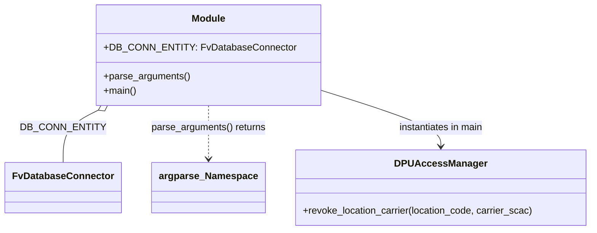

# Diagram: entity_core/entity_service/entity_service/dpu/scripts/revoke_dpu_location_carrier.py


> Auto-generated by Obscura crawlers

## Diagram 1



### SVG

<svg id="container" width="959.8046875" xmlns="http://www.w3.org/2000/svg" class="classDiagram" height="384" viewBox="0 0 959.8046875 384" role="graphics-document document" aria-roledescription="class"><style>#container{font-family:"trebuchet ms",verdana,arial,sans-serif;font-size:16px;fill:#333;}@keyframes edge-animation-frame{from{stroke-dashoffset:0;}}@keyframes dash{to{stroke-dashoffset:0;}}#container .edge-animation-slow{stroke-dasharray:9,5!important;stroke-dashoffset:900;animation:dash 50s linear infinite;stroke-linecap:round;}#container .edge-animation-fast{stroke-dasharray:9,5!important;stroke-dashoffset:900;animation:dash 20s linear infinite;stroke-linecap:round;}#container .error-icon{fill:#552222;}#container .error-text{fill:#552222;stroke:#552222;}#container .edge-thickness-normal{stroke-width:1px;}#container .edge-thickness-thick{stroke-width:3.5px;}#container .edge-pattern-solid{stroke-dasharray:0;}#container .edge-thickness-invisible{stroke-width:0;fill:none;}#container .edge-pattern-dashed{stroke-dasharray:3;}#container .edge-pattern-dotted{stroke-dasharray:2;}#container .marker{fill:#333333;stroke:#333333;}#container .marker.cross{stroke:#333333;}#container svg{font-family:"trebuchet ms",verdana,arial,sans-serif;font-size:16px;}#container p{margin:0;}#container g.classGroup text{fill:#9370DB;stroke:none;font-family:"trebuchet ms",verdana,arial,sans-serif;font-size:10px;}#container g.classGroup text .title{font-weight:bolder;}#container .nodeLabel,#container .edgeLabel{color:#131300;}#container .edgeLabel .label rect{fill:#ECECFF;}#container .label text{fill:#131300;}#container .labelBkg{background:#ECECFF;}#container .edgeLabel .label span{background:#ECECFF;}#container .classTitle{font-weight:bolder;}#container .node rect,#container .node circle,#container .node ellipse,#container .node polygon,#container .node path{fill:#ECECFF;stroke:#9370DB;stroke-width:1px;}#container .divider{stroke:#9370DB;stroke-width:1;}#container g.clickable{cursor:pointer;}#container g.classGroup rect{fill:#ECECFF;stroke:#9370DB;}#container g.classGroup line{stroke:#9370DB;stroke-width:1;}#container .classLabel .box{stroke:none;stroke-width:0;fill:#ECECFF;opacity:0.5;}#container .classLabel .label{fill:#9370DB;font-size:10px;}#container .relation{stroke:#333333;stroke-width:1;fill:none;}#container .dashed-line{stroke-dasharray:3;}#container .dotted-line{stroke-dasharray:1 2;}#container #compositionStart,#container .composition{fill:#333333!important;stroke:#333333!important;stroke-width:1;}#container #compositionEnd,#container .composition{fill:#333333!important;stroke:#333333!important;stroke-width:1;}#container #dependencyStart,#container .dependency{fill:#333333!important;stroke:#333333!important;stroke-width:1;}#container #dependencyStart,#container .dependency{fill:#333333!important;stroke:#333333!important;stroke-width:1;}#container #extensionStart,#container .extension{fill:transparent!important;stroke:#333333!important;stroke-width:1;}#container #extensionEnd,#container .extension{fill:transparent!important;stroke:#333333!important;stroke-width:1;}#container #aggregationStart,#container .aggregation{fill:transparent!important;stroke:#333333!important;stroke-width:1;}#container #aggregationEnd,#container .aggregation{fill:transparent!important;stroke:#333333!important;stroke-width:1;}#container #lollipopStart,#container .lollipop{fill:#ECECFF!important;stroke:#333333!important;stroke-width:1;}#container #lollipopEnd,#container .lollipop{fill:#ECECFF!important;stroke:#333333!important;stroke-width:1;}#container .edgeTerminals{font-size:11px;line-height:initial;}#container .classTitleText{text-anchor:middle;font-size:18px;fill:#333;}#container .label-icon{display:inline-block;height:1em;overflow:visible;vertical-align:-0.125em;}#container .node .label-icon path{fill:currentColor;stroke:revert;stroke-width:revert;}#container :root{--mermaid-font-family:"trebuchet ms",verdana,arial,sans-serif;}</style><g><defs><marker id="container_class-aggregationStart" class="marker aggregation class" refX="18" refY="7" markerWidth="190" markerHeight="240" orient="auto"><path d="M 18,7 L9,13 L1,7 L9,1 Z"></path></marker></defs><defs><marker id="container_class-aggregationEnd" class="marker aggregation class" refX="1" refY="7" markerWidth="20" markerHeight="28" orient="auto"><path d="M 18,7 L9,13 L1,7 L9,1 Z"></path></marker></defs><defs><marker id="container_class-extensionStart" class="marker extension class" refX="18" refY="7" markerWidth="190" markerHeight="240" orient="auto"><path d="M 1,7 L18,13 V 1 Z"></path></marker></defs><defs><marker id="container_class-extensionEnd" class="marker extension class" refX="1" refY="7" markerWidth="20" markerHeight="28" orient="auto"><path d="M 1,1 V 13 L18,7 Z"></path></marker></defs><defs><marker id="container_class-compositionStart" class="marker composition class" refX="18" refY="7" markerWidth="190" markerHeight="240" orient="auto"><path d="M 18,7 L9,13 L1,7 L9,1 Z"></path></marker></defs><defs><marker id="container_class-compositionEnd" class="marker composition class" refX="1" refY="7" markerWidth="20" markerHeight="28" orient="auto"><path d="M 18,7 L9,13 L1,7 L9,1 Z"></path></marker></defs><defs><marker id="container_class-dependencyStart" class="marker dependency class" refX="6" refY="7" markerWidth="190" markerHeight="240" orient="auto"><path d="M 5,7 L9,13 L1,7 L9,1 Z"></path></marker></defs><defs><marker id="container_class-dependencyEnd" class="marker dependency class" refX="13" refY="7" markerWidth="20" markerHeight="28" orient="auto"><path d="M 18,7 L9,13 L14,7 L9,1 Z"></path></marker></defs><defs><marker id="container_class-lollipopStart" class="marker lollipop class" refX="13" refY="7" markerWidth="190" markerHeight="240" orient="auto"><circle stroke="black" fill="transparent" cx="7" cy="7" r="6"></circle></marker></defs><defs><marker id="container_class-lollipopEnd" class="marker lollipop class" refX="1" refY="7" markerWidth="190" markerHeight="240" orient="auto"><circle stroke="black" fill="transparent" cx="7" cy="7" r="6"></circle></marker></defs><g class="root"><g class="clusters"></g><g class="edgePaths"><path d="M154.829,183.988L145.575,188.824C136.321,193.659,117.813,203.329,108.559,217.831C99.305,232.333,99.305,251.667,99.305,261.333L99.305,271" id="id_Module_FvDatabaseConnector_1" class="edge-thickness-normal edge-pattern-solid relation" style=";;;" data-edge="true" data-et="edge" data-id="id_Module_FvDatabaseConnector_1" data-points="W3sieCI6MTcwLjExNzgzMzE2MTE1NzAyLCJ5IjoxNzZ9LHsieCI6OTkuMzA0Njg3NSwieSI6MjEzfSx7IngiOjk5LjMwNDY4NzUsInkiOjI3MX1d" marker-start="url(#container_class-aggregationStart)"></path><path d="M330.883,176L330.883,182.167C330.883,188.333,330.883,200.667,330.883,215.5C330.883,230.333,330.883,247.667,330.883,256.333L330.883,265" id="id_Module_argparse_Namespace_2" class="edge-thickness-normal edge-pattern-dashed relation" style=";;;" data-edge="true" data-et="edge" data-id="id_Module_argparse_Namespace_2" data-points="W3sieCI6MzMwLjg4MjgxMjUsInkiOjE3Nn0seyJ4IjozMzAuODgyODEyNSwieSI6MjEzfSx7IngiOjMzMC44ODI4MTI1LCJ5IjoyNzF9XQ==" marker-end="url(#container_class-dependencyEnd)"></path><path d="M505.766,147.599L540.051,158.499C574.337,169.399,642.909,191.2,677.195,207.266C711.48,223.333,711.48,233.667,711.48,238.833L711.48,244" id="id_Module_DPUAccessManager_3" class="edge-thickness-normal edge-pattern-solid relation" style=";;;" data-edge="true" data-et="edge" data-id="id_Module_DPUAccessManager_3" data-points="W3sieCI6NTA1Ljc2NTYyNSwieSI6MTQ3LjU5ODkyNDM4OTA2NzM1fSx7IngiOjcxMS40ODA0Njg3NSwieSI6MjEzfSx7IngiOjcxMS40ODA0Njg3NSwieSI6MjUwfV0=" marker-end="url(#container_class-dependencyEnd)"></path></g><g class="edgeLabels"><g class="edgeLabel" transform="translate(99.3046875, 213)"><g class="label" data-id="id_Module_FvDatabaseConnector_1" transform="translate(-63.421875, -12)"><foreignObject width="126.84375" height="24"><div xmlns="http://www.w3.org/1999/xhtml" class="labelBkg" style="display: table-cell; white-space: nowrap; line-height: 1.5; max-width: 200px; text-align: center;"><span class="edgeLabel"><p>DB_CONN_ENTITY</p></span></div></foreignObject></g></g><g class="edgeLabel" transform="translate(330.8828125, 213)"><g class="label" data-id="id_Module_argparse_Namespace_2" transform="translate(-96.0859375, -12)"><foreignObject width="192.171875" height="24"><div xmlns="http://www.w3.org/1999/xhtml" class="labelBkg" style="display: table-cell; white-space: nowrap; line-height: 1.5; max-width: 200px; text-align: center;"><span class="edgeLabel"><p>parse_arguments() returns</p></span></div></foreignObject></g></g><g class="edgeLabel" transform="translate(711.48046875, 213)"><g class="label" data-id="id_Module_DPUAccessManager_3" transform="translate(-72.25, -12)"><foreignObject width="144.5" height="24"><div xmlns="http://www.w3.org/1999/xhtml" class="labelBkg" style="display: table-cell; white-space: nowrap; line-height: 1.5; max-width: 200px; text-align: center;"><span class="edgeLabel"><p>instantiates in main</p></span></div></foreignObject></g></g></g><g class="nodes"><g class="node default" id="classId-Module-0" transform="translate(330.8828125, 92)"><g class="basic label-container"><path d="M-174.8828125 -84 L174.8828125 -84 L174.8828125 84 L-174.8828125 84" stroke="none" stroke-width="0" fill="#ECECFF" style=""></path><path d="M-174.8828125 -84 C-48.03582311655765 -84, 78.8111662668847 -84, 174.8828125 -84 M-174.8828125 -84 C-104.4260872481914 -84, -33.96936199638279 -84, 174.8828125 -84 M174.8828125 -84 C174.8828125 -28.013694233034805, 174.8828125 27.97261153393039, 174.8828125 84 M174.8828125 -84 C174.8828125 -30.056721282603135, 174.8828125 23.88655743479373, 174.8828125 84 M174.8828125 84 C97.15149030810943 84, 19.42016811621886 84, -174.8828125 84 M174.8828125 84 C40.963535442053484 84, -92.95574161589303 84, -174.8828125 84 M-174.8828125 84 C-174.8828125 27.377742859174738, -174.8828125 -29.244514281650524, -174.8828125 -84 M-174.8828125 84 C-174.8828125 19.013517703498152, -174.8828125 -45.972964593003695, -174.8828125 -84" stroke="#9370DB" stroke-width="1.3" fill="none" stroke-dasharray="0 0" style=""></path></g><g class="annotation-group text" transform="translate(0, -60)"></g><g class="label-group text" transform="translate(-27.09375, -60)"><g class="label" style="font-weight: bolder" transform="translate(0,-12)"><foreignObject width="54.1875" height="24"><div xmlns="http://www.w3.org/1999/xhtml" style="display: table-cell; white-space: nowrap; line-height: 1.5; max-width: 104px; text-align: center;"><span class="nodeLabel markdown-node-label" style=""><p>Module</p></span></div></foreignObject></g></g><g class="members-group text" transform="translate(-162.8828125, -12)"><g class="label" style="" transform="translate(0,-12)"><foreignObject width="298.671875" height="24"><div xmlns="http://www.w3.org/1999/xhtml" style="display: table-cell; white-space: nowrap; line-height: 1.5; max-width: 357px; text-align: center;"><span class="nodeLabel markdown-node-label" style=""><p>+DB_CONN_ENTITY: FvDatabaseConnector</p></span></div></foreignObject></g></g><g class="methods-group text" transform="translate(-162.8828125, 36)"><g class="label" style="" transform="translate(0,-12)"><foreignObject width="143.390625" height="24"><div xmlns="http://www.w3.org/1999/xhtml" style="display: table-cell; white-space: nowrap; line-height: 1.5; max-width: 201px; text-align: center;"><span class="nodeLabel markdown-node-label" style=""><p>+parse_arguments()</p></span></div></foreignObject></g><g class="label" style="" transform="translate(0,12)"><foreignObject width="54.65625" height="24"><div xmlns="http://www.w3.org/1999/xhtml" style="display: table-cell; white-space: nowrap; line-height: 1.5; max-width: 112px; text-align: center;"><span class="nodeLabel markdown-node-label" style=""><p>+main()</p></span></div></foreignObject></g></g><g class="divider" style=""><path d="M-174.8828125 -36 C-81.34049172203791 -36, 12.201829055924179 -36, 174.8828125 -36 M-174.8828125 -36 C-96.96925363472438 -36, -19.055694769448763 -36, 174.8828125 -36" stroke="#9370DB" stroke-width="1.3" fill="none" stroke-dasharray="0 0" style=""></path></g><g class="divider" style=""><path d="M-174.8828125 12 C-49.88756509420344 12, 75.10768231159312 12, 174.8828125 12 M-174.8828125 12 C-61.79551131638807 12, 51.291789867223855 12, 174.8828125 12" stroke="#9370DB" stroke-width="1.3" fill="none" stroke-dasharray="0 0" style=""></path></g></g><g class="node default" id="classId-FvDatabaseConnector-1" transform="translate(99.3046875, 313)"><g class="basic label-container"><path d="M-91.3046875 -42 L91.3046875 -42 L91.3046875 42 L-91.3046875 42" stroke="none" stroke-width="0" fill="#ECECFF" style=""></path><path d="M-91.3046875 -42 C-52.01318085191475 -42, -12.721674203829494 -42, 91.3046875 -42 M-91.3046875 -42 C-36.805140935255196 -42, 17.69440562948961 -42, 91.3046875 -42 M91.3046875 -42 C91.3046875 -14.103687918048465, 91.3046875 13.79262416390307, 91.3046875 42 M91.3046875 -42 C91.3046875 -24.192019734180082, 91.3046875 -6.3840394683601644, 91.3046875 42 M91.3046875 42 C34.78855426718388 42, -21.727578965632233 42, -91.3046875 42 M91.3046875 42 C39.378986517821296 42, -12.546714464357407 42, -91.3046875 42 M-91.3046875 42 C-91.3046875 21.34681245485412, -91.3046875 0.693624909708241, -91.3046875 -42 M-91.3046875 42 C-91.3046875 11.623074137156397, -91.3046875 -18.753851725687205, -91.3046875 -42" stroke="#9370DB" stroke-width="1.3" fill="none" stroke-dasharray="0 0" style=""></path></g><g class="annotation-group text" transform="translate(0, -18)"></g><g class="label-group text" transform="translate(-79.3046875, -18)"><g class="label" style="font-weight: bolder" transform="translate(0,-12)"><foreignObject width="158.609375" height="24"><div xmlns="http://www.w3.org/1999/xhtml" style="display: table-cell; white-space: nowrap; line-height: 1.5; max-width: 207px; text-align: center;"><span class="nodeLabel markdown-node-label" style=""><p>FvDatabaseConnector</p></span></div></foreignObject></g></g><g class="members-group text" transform="translate(-79.3046875, 30)"></g><g class="methods-group text" transform="translate(-79.3046875, 60)"></g><g class="divider" style=""><path d="M-91.3046875 6 C-44.9420825984647 6, 1.420522303070598 6, 91.3046875 6 M-91.3046875 6 C-20.20986248672388 6, 50.88496252655224 6, 91.3046875 6" stroke="#9370DB" stroke-width="1.3" fill="none" stroke-dasharray="0 0" style=""></path></g><g class="divider" style=""><path d="M-91.3046875 24 C-36.4927360191305 24, 18.319215461739006 24, 91.3046875 24 M-91.3046875 24 C-31.394799124008827 24, 28.515089251982346 24, 91.3046875 24" stroke="#9370DB" stroke-width="1.3" fill="none" stroke-dasharray="0 0" style=""></path></g></g><g class="node default" id="classId-DPUAccessManager-2" transform="translate(711.48046875, 313)"><g class="basic label-container"><path d="M-240.32421875 -63 L240.32421875 -63 L240.32421875 63 L-240.32421875 63" stroke="none" stroke-width="0" fill="#ECECFF" style=""></path><path d="M-240.32421875 -63 C-135.89876989016446 -63, -31.47332103032892 -63, 240.32421875 -63 M-240.32421875 -63 C-143.42389859846918 -63, -46.52357844693833 -63, 240.32421875 -63 M240.32421875 -63 C240.32421875 -15.08639449187882, 240.32421875 32.82721101624236, 240.32421875 63 M240.32421875 -63 C240.32421875 -13.224066820574677, 240.32421875 36.551866358850646, 240.32421875 63 M240.32421875 63 C121.21850985941916 63, 2.1128009688383145 63, -240.32421875 63 M240.32421875 63 C92.23691702578014 63, -55.85038469843971 63, -240.32421875 63 M-240.32421875 63 C-240.32421875 29.741837393500425, -240.32421875 -3.516325212999149, -240.32421875 -63 M-240.32421875 63 C-240.32421875 29.267595086081784, -240.32421875 -4.464809827836433, -240.32421875 -63" stroke="#9370DB" stroke-width="1.3" fill="none" stroke-dasharray="0 0" style=""></path></g><g class="annotation-group text" transform="translate(0, -39)"></g><g class="label-group text" transform="translate(-70.7421875, -39)"><g class="label" style="font-weight: bolder" transform="translate(0,-12)"><foreignObject width="141.484375" height="24"><div xmlns="http://www.w3.org/1999/xhtml" style="display: table-cell; white-space: nowrap; line-height: 1.5; max-width: 190px; text-align: center;"><span class="nodeLabel markdown-node-label" style=""><p>DPUAccessManager</p></span></div></foreignObject></g></g><g class="members-group text" transform="translate(-228.32421875, 9)"></g><g class="methods-group text" transform="translate(-228.32421875, 39)"><g class="label" style="" transform="translate(0,-12)"><foreignObject width="385.90625" height="24"><div xmlns="http://www.w3.org/1999/xhtml" style="display: table-cell; white-space: nowrap; line-height: 1.5; max-width: 443px; text-align: center;"><span class="nodeLabel markdown-node-label" style=""><p>+revoke_location_carrier(location_code, carrier_scac)</p></span></div></foreignObject></g></g><g class="divider" style=""><path d="M-240.32421875 -15 C-83.55846907009416 -15, 73.20728060981168 -15, 240.32421875 -15 M-240.32421875 -15 C-87.00519248558552 -15, 66.31383377882895 -15, 240.32421875 -15" stroke="#9370DB" stroke-width="1.3" fill="none" stroke-dasharray="0 0" style=""></path></g><g class="divider" style=""><path d="M-240.32421875 9 C-112.91929390061988 9, 14.485630948760246 9, 240.32421875 9 M-240.32421875 9 C-53.96840211257731 9, 132.38741452484538 9, 240.32421875 9" stroke="#9370DB" stroke-width="1.3" fill="none" stroke-dasharray="0 0" style=""></path></g></g><g class="node default" id="classId-argparse_Namespace-3" transform="translate(330.8828125, 313)"><g class="basic label-container"><path d="M-90.2734375 -42 L90.2734375 -42 L90.2734375 42 L-90.2734375 42" stroke="none" stroke-width="0" fill="#ECECFF" style=""></path><path d="M-90.2734375 -42 C-25.86401106868921 -42, 38.54541536262158 -42, 90.2734375 -42 M-90.2734375 -42 C-19.097124681602466 -42, 52.07918813679507 -42, 90.2734375 -42 M90.2734375 -42 C90.2734375 -11.82882652145182, 90.2734375 18.34234695709636, 90.2734375 42 M90.2734375 -42 C90.2734375 -18.608333991941528, 90.2734375 4.783332016116944, 90.2734375 42 M90.2734375 42 C46.216595171810084 42, 2.1597528436201685 42, -90.2734375 42 M90.2734375 42 C36.29112369298408 42, -17.69119011403184 42, -90.2734375 42 M-90.2734375 42 C-90.2734375 17.683929109685035, -90.2734375 -6.632141780629929, -90.2734375 -42 M-90.2734375 42 C-90.2734375 12.405300185252912, -90.2734375 -17.189399629494176, -90.2734375 -42" stroke="#9370DB" stroke-width="1.3" fill="none" stroke-dasharray="0 0" style=""></path></g><g class="annotation-group text" transform="translate(0, -18)"></g><g class="label-group text" transform="translate(-78.2734375, -18)"><g class="label" style="font-weight: bolder" transform="translate(0,-12)"><foreignObject width="156.546875" height="24"><div xmlns="http://www.w3.org/1999/xhtml" style="display: table-cell; white-space: nowrap; line-height: 1.5; max-width: 205px; text-align: center;"><span class="nodeLabel markdown-node-label" style=""><p>argparse_Namespace</p></span></div></foreignObject></g></g><g class="members-group text" transform="translate(-78.2734375, 30)"></g><g class="methods-group text" transform="translate(-78.2734375, 60)"></g><g class="divider" style=""><path d="M-90.2734375 6 C-25.435461895599204 6, 39.40251370880159 6, 90.2734375 6 M-90.2734375 6 C-54.05767093062217 6, -17.841904361244346 6, 90.2734375 6" stroke="#9370DB" stroke-width="1.3" fill="none" stroke-dasharray="0 0" style=""></path></g><g class="divider" style=""><path d="M-90.2734375 24 C-21.305292113428763 24, 47.662853273142474 24, 90.2734375 24 M-90.2734375 24 C-44.879355803230396 24, 0.5147258935392074 24, 90.2734375 24" stroke="#9370DB" stroke-width="1.3" fill="none" stroke-dasharray="0 0" style=""></path></g></g></g></g></g></svg>

## Diagram 2

```mermaid
flowchart TD
    Start([Start]) --> ParseArgs[parse_arguments()]
    ParseArgs --> Args{args: location_code,\ncarrier_scac, shipper_fv_id, ticket}
    Args --> CreateDB[DB_CONN_ENTITY\nFvDatabaseConnector("revoke_dpu_location_carrier")]
    CreateDB --> Instantiate[DPUAccessManager(DB_CONN_ENTITY,\nargs.shipper_fv_id,args.ticket)]
    Instantiate --> Revoke[revoke_location_carrier(args.location_code,\nargs.carrier_scac)]
    Revoke --> End([End])
```

> SVG rendering failed for this diagram.
