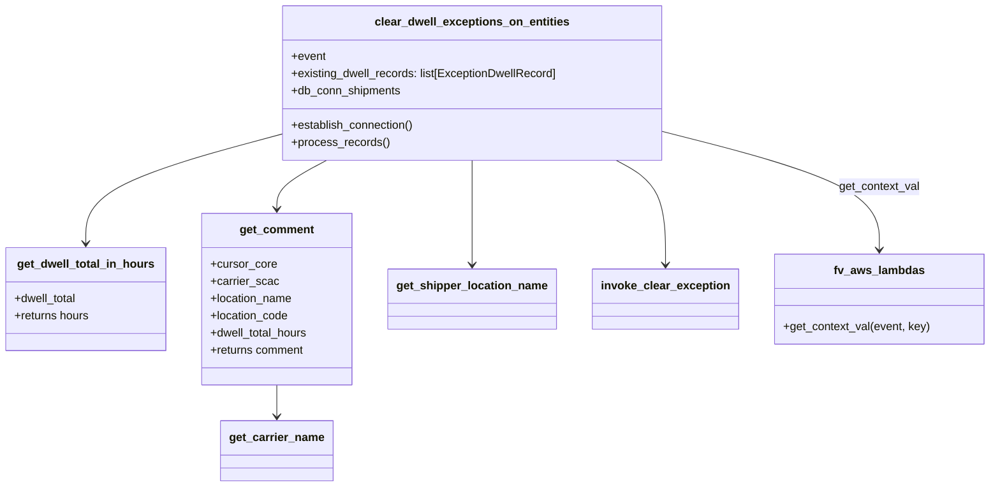

# Diagram: entity_core/entity_service/entity_service/dwell/clear_dwell_exception_on_entity.py


> Auto-generated by Obscura crawlers

## Diagram 1

```mermaid
flowchart TD
    Start[Event received]
    Start --> Establish[db_conn_shipments.establish_connection()]
    Establish --> Cursor[cursor_shipments = db_conn_shipments.cursor]
    Cursor --> Extract[Extract location_code & carrier_scac from existing_dwell_records[0]]
    Extract --> OrgId[fv.aws.lambdas.get_context_val(event, "organization_id")]
    OrgId --> LocationName[get_shipper_location_name(cursor_shipments, location_code, org_id)]
    LocationName --> LoopStart{For each dwell_record in existing_dwell_records}
    LoopStart --> Calc[get_dwell_total_in_hours(dwell_record.total_dwell)]
    Calc --> UpdateHours[update dwell_record.dwell_total_hours]
    UpdateHours --> CommentFlow[get_comment(cursor_shipments, carrier_scac, location_name, location_code, dwell_total_hours)]
    CommentFlow --> TryCarrier{get_carrier_name succeeds?}
    TryCarrier --> CarrierNameObj[carrier_name = get_carrier_name(...)]
    TryCarrier --> CarrierNameNone[carrier_name = None]
    CarrierNameObj --> CarrierNameExtract[carrier_name = carrier_name.name]
    CarrierNameNone --> CarrierFallback[carrier_name = carrier_scac]
    CarrierNameExtract --> BuildComment[format comment string]
    CarrierFallback --> BuildComment
    BuildComment --> UpdateComment[update dwell_record.comment]
    UpdateComment --> LoopStart
    LoopStart --> Invoke[invoke_clear_exception(event=event, org_id=org_id, dwell_records=existing_dwell_records)]
    Invoke --> End[Done]
```

> SVG rendering failed for this diagram.

## Diagram 2



### SVG

<svg id="container" width="1361.515625" xmlns="http://www.w3.org/2000/svg" class="classDiagram" height="680" viewBox="0 0 1361.515625 680" role="graphics-document document" aria-roledescription="class"><style>#container{font-family:"trebuchet ms",verdana,arial,sans-serif;font-size:16px;fill:#333;}@keyframes edge-animation-frame{from{stroke-dashoffset:0;}}@keyframes dash{to{stroke-dashoffset:0;}}#container .edge-animation-slow{stroke-dasharray:9,5!important;stroke-dashoffset:900;animation:dash 50s linear infinite;stroke-linecap:round;}#container .edge-animation-fast{stroke-dasharray:9,5!important;stroke-dashoffset:900;animation:dash 20s linear infinite;stroke-linecap:round;}#container .error-icon{fill:#552222;}#container .error-text{fill:#552222;stroke:#552222;}#container .edge-thickness-normal{stroke-width:1px;}#container .edge-thickness-thick{stroke-width:3.5px;}#container .edge-pattern-solid{stroke-dasharray:0;}#container .edge-thickness-invisible{stroke-width:0;fill:none;}#container .edge-pattern-dashed{stroke-dasharray:3;}#container .edge-pattern-dotted{stroke-dasharray:2;}#container .marker{fill:#333333;stroke:#333333;}#container .marker.cross{stroke:#333333;}#container svg{font-family:"trebuchet ms",verdana,arial,sans-serif;font-size:16px;}#container p{margin:0;}#container g.classGroup text{fill:#9370DB;stroke:none;font-family:"trebuchet ms",verdana,arial,sans-serif;font-size:10px;}#container g.classGroup text .title{font-weight:bolder;}#container .nodeLabel,#container .edgeLabel{color:#131300;}#container .edgeLabel .label rect{fill:#ECECFF;}#container .label text{fill:#131300;}#container .labelBkg{background:#ECECFF;}#container .edgeLabel .label span{background:#ECECFF;}#container .classTitle{font-weight:bolder;}#container .node rect,#container .node circle,#container .node ellipse,#container .node polygon,#container .node path{fill:#ECECFF;stroke:#9370DB;stroke-width:1px;}#container .divider{stroke:#9370DB;stroke-width:1;}#container g.clickable{cursor:pointer;}#container g.classGroup rect{fill:#ECECFF;stroke:#9370DB;}#container g.classGroup line{stroke:#9370DB;stroke-width:1;}#container .classLabel .box{stroke:none;stroke-width:0;fill:#ECECFF;opacity:0.5;}#container .classLabel .label{fill:#9370DB;font-size:10px;}#container .relation{stroke:#333333;stroke-width:1;fill:none;}#container .dashed-line{stroke-dasharray:3;}#container .dotted-line{stroke-dasharray:1 2;}#container #compositionStart,#container .composition{fill:#333333!important;stroke:#333333!important;stroke-width:1;}#container #compositionEnd,#container .composition{fill:#333333!important;stroke:#333333!important;stroke-width:1;}#container #dependencyStart,#container .dependency{fill:#333333!important;stroke:#333333!important;stroke-width:1;}#container #dependencyStart,#container .dependency{fill:#333333!important;stroke:#333333!important;stroke-width:1;}#container #extensionStart,#container .extension{fill:transparent!important;stroke:#333333!important;stroke-width:1;}#container #extensionEnd,#container .extension{fill:transparent!important;stroke:#333333!important;stroke-width:1;}#container #aggregationStart,#container .aggregation{fill:transparent!important;stroke:#333333!important;stroke-width:1;}#container #aggregationEnd,#container .aggregation{fill:transparent!important;stroke:#333333!important;stroke-width:1;}#container #lollipopStart,#container .lollipop{fill:#ECECFF!important;stroke:#333333!important;stroke-width:1;}#container #lollipopEnd,#container .lollipop{fill:#ECECFF!important;stroke:#333333!important;stroke-width:1;}#container .edgeTerminals{font-size:11px;line-height:initial;}#container .classTitleText{text-anchor:middle;font-size:18px;fill:#333;}#container .label-icon{display:inline-block;height:1em;overflow:visible;vertical-align:-0.125em;}#container .node .label-icon path{fill:currentColor;stroke:revert;stroke-width:revert;}#container :root{--mermaid-font-family:"trebuchet ms",verdana,arial,sans-serif;}</style><g><defs><marker id="container_class-aggregationStart" class="marker aggregation class" refX="18" refY="7" markerWidth="190" markerHeight="240" orient="auto"><path d="M 18,7 L9,13 L1,7 L9,1 Z"></path></marker></defs><defs><marker id="container_class-aggregationEnd" class="marker aggregation class" refX="1" refY="7" markerWidth="20" markerHeight="28" orient="auto"><path d="M 18,7 L9,13 L1,7 L9,1 Z"></path></marker></defs><defs><marker id="container_class-extensionStart" class="marker extension class" refX="18" refY="7" markerWidth="190" markerHeight="240" orient="auto"><path d="M 1,7 L18,13 V 1 Z"></path></marker></defs><defs><marker id="container_class-extensionEnd" class="marker extension class" refX="1" refY="7" markerWidth="20" markerHeight="28" orient="auto"><path d="M 1,1 V 13 L18,7 Z"></path></marker></defs><defs><marker id="container_class-compositionStart" class="marker composition class" refX="18" refY="7" markerWidth="190" markerHeight="240" orient="auto"><path d="M 18,7 L9,13 L1,7 L9,1 Z"></path></marker></defs><defs><marker id="container_class-compositionEnd" class="marker composition class" refX="1" refY="7" markerWidth="20" markerHeight="28" orient="auto"><path d="M 18,7 L9,13 L1,7 L9,1 Z"></path></marker></defs><defs><marker id="container_class-dependencyStart" class="marker dependency class" refX="6" refY="7" markerWidth="190" markerHeight="240" orient="auto"><path d="M 5,7 L9,13 L1,7 L9,1 Z"></path></marker></defs><defs><marker id="container_class-dependencyEnd" class="marker dependency class" refX="13" refY="7" markerWidth="20" markerHeight="28" orient="auto"><path d="M 18,7 L9,13 L14,7 L9,1 Z"></path></marker></defs><defs><marker id="container_class-lollipopStart" class="marker lollipop class" refX="13" refY="7" markerWidth="190" markerHeight="240" orient="auto"><circle stroke="black" fill="transparent" cx="7" cy="7" r="6"></circle></marker></defs><defs><marker id="container_class-lollipopEnd" class="marker lollipop class" refX="1" refY="7" markerWidth="190" markerHeight="240" orient="auto"><circle stroke="black" fill="transparent" cx="7" cy="7" r="6"></circle></marker></defs><g class="root"><g class="clusters"></g><g class="edgePaths"><path d="M921.684,185.49L969.62,198.075C1017.557,210.66,1113.431,235.83,1161.368,263.082C1209.305,290.333,1209.305,319.667,1209.305,334.333L1209.305,349" id="id_clear_dwell_exceptions_on_entities_fv_aws_lambdas_1" class="edge-thickness-normal edge-pattern-solid relation" style=";;;" data-edge="true" data-et="edge" data-id="id_clear_dwell_exceptions_on_entities_fv_aws_lambdas_1" data-points="W3sieCI6OTIxLjY4MzU5Mzc1LCJ5IjoxODUuNDkwMTA1NTIyMjM2MDR9LHsieCI6MTIwOS4zMDQ2ODc1LCJ5IjoyNjF9LHsieCI6MTIwOS4zMDQ2ODc1LCJ5IjozNTV9XQ==" marker-end="url(#container_class-dependencyEnd)"></path><path d="M656.992,224L656.992,230.167C656.992,236.333,656.992,248.667,656.992,273C656.992,297.333,656.992,333.667,656.992,351.833L656.992,370" id="id_clear_dwell_exceptions_on_entities_get_shipper_location_name_2" class="edge-thickness-normal edge-pattern-solid relation" style=";;;" data-edge="true" data-et="edge" data-id="id_clear_dwell_exceptions_on_entities_get_shipper_location_name_2" data-points="W3sieCI6NjU2Ljk5MjE4NzUsInkiOjIyNH0seyJ4Ijo2NTYuOTkyMTg3NSwieSI6MjYxfSx7IngiOjY1Ni45OTIxODc1LCJ5IjozNzZ9XQ==" marker-end="url(#container_class-dependencyEnd)"></path><path d="M392.301,187.421L346.853,199.684C301.405,211.947,210.509,236.474,165.061,261.904C119.613,287.333,119.613,313.667,119.613,326.833L119.613,340" id="id_clear_dwell_exceptions_on_entities_get_dwell_total_in_hours_3" class="edge-thickness-normal edge-pattern-solid relation" style=";;;" data-edge="true" data-et="edge" data-id="id_clear_dwell_exceptions_on_entities_get_dwell_total_in_hours_3" data-points="W3sieCI6MzkyLjMwMDc4MTI1LCJ5IjoxODcuNDIxMjE0MDgxNjYwODJ9LHsieCI6MTE5LjYxMzI4MTI1LCJ5IjoyNjF9LHsieCI6MTE5LjYxMzI4MTI1LCJ5IjozNDZ9XQ==" marker-end="url(#container_class-dependencyEnd)"></path><path d="M456.212,224L444.747,230.167C433.283,236.333,410.354,248.667,398.89,260C387.426,271.333,387.426,281.667,387.426,286.833L387.426,292" id="id_clear_dwell_exceptions_on_entities_get_comment_4" class="edge-thickness-normal edge-pattern-solid relation" style=";;;" data-edge="true" data-et="edge" data-id="id_clear_dwell_exceptions_on_entities_get_comment_4" data-points="W3sieCI6NDU2LjIxMTY5MTgxMDM0NDg2LCJ5IjoyMjR9LHsieCI6Mzg3LjQyNTc4MTI1LCJ5IjoyNjF9LHsieCI6Mzg3LjQyNTc4MTI1LCJ5IjoyOTh9XQ==" marker-end="url(#container_class-dependencyEnd)"></path><path d="M851.194,224L862.283,230.167C873.372,236.333,895.549,248.667,906.638,273C917.727,297.333,917.727,333.667,917.727,351.833L917.727,370" id="id_clear_dwell_exceptions_on_entities_invoke_clear_exception_5" class="edge-thickness-normal edge-pattern-solid relation" style=";;;" data-edge="true" data-et="edge" data-id="id_clear_dwell_exceptions_on_entities_invoke_clear_exception_5" data-points="W3sieCI6ODUxLjE5NDM0MjY3MjQxMzgsInkiOjIyNH0seyJ4Ijo5MTcuNzI2NTYyNSwieSI6MjYxfSx7IngiOjkxNy43MjY1NjI1LCJ5IjozNzZ9XQ==" marker-end="url(#container_class-dependencyEnd)"></path><path d="M387.426,538L387.426,542.167C387.426,546.333,387.426,554.667,387.426,562C387.426,569.333,387.426,575.667,387.426,578.833L387.426,582" id="id_get_comment_get_carrier_name_6" class="edge-thickness-normal edge-pattern-solid relation" style=";;;" data-edge="true" data-et="edge" data-id="id_get_comment_get_carrier_name_6" data-points="W3sieCI6Mzg3LjQyNTc4MTI1LCJ5Ijo1Mzh9LHsieCI6Mzg3LjQyNTc4MTI1LCJ5Ijo1NjN9LHsieCI6Mzg3LjQyNTc4MTI1LCJ5Ijo1ODh9XQ==" marker-end="url(#container_class-dependencyEnd)"></path></g><g class="edgeLabels"><g class="edgeLabel" transform="translate(1209.3046875, 261)"><g class="label" data-id="id_clear_dwell_exceptions_on_entities_fv_aws_lambdas_1" transform="translate(-56.4765625, -12)"><foreignObject width="112.953125" height="24"><div xmlns="http://www.w3.org/1999/xhtml" class="labelBkg" style="display: table-cell; white-space: nowrap; line-height: 1.5; max-width: 200px; text-align: center;"><span class="edgeLabel"><p>get_context_val</p></span></div></foreignObject></g></g><g class="edgeLabel"><g class="label" data-id="id_clear_dwell_exceptions_on_entities_get_shipper_location_name_2" transform="translate(0, 0)"><foreignObject width="0" height="0"><div xmlns="http://www.w3.org/1999/xhtml" class="labelBkg" style="display: table-cell; white-space: nowrap; line-height: 1.5; max-width: 200px; text-align: center;"><span class="edgeLabel"></span></div></foreignObject></g></g><g class="edgeLabel"><g class="label" data-id="id_clear_dwell_exceptions_on_entities_get_dwell_total_in_hours_3" transform="translate(0, 0)"><foreignObject width="0" height="0"><div xmlns="http://www.w3.org/1999/xhtml" class="labelBkg" style="display: table-cell; white-space: nowrap; line-height: 1.5; max-width: 200px; text-align: center;"><span class="edgeLabel"></span></div></foreignObject></g></g><g class="edgeLabel"><g class="label" data-id="id_clear_dwell_exceptions_on_entities_get_comment_4" transform="translate(0, 0)"><foreignObject width="0" height="0"><div xmlns="http://www.w3.org/1999/xhtml" class="labelBkg" style="display: table-cell; white-space: nowrap; line-height: 1.5; max-width: 200px; text-align: center;"><span class="edgeLabel"></span></div></foreignObject></g></g><g class="edgeLabel"><g class="label" data-id="id_clear_dwell_exceptions_on_entities_invoke_clear_exception_5" transform="translate(0, 0)"><foreignObject width="0" height="0"><div xmlns="http://www.w3.org/1999/xhtml" class="labelBkg" style="display: table-cell; white-space: nowrap; line-height: 1.5; max-width: 200px; text-align: center;"><span class="edgeLabel"></span></div></foreignObject></g></g><g class="edgeLabel"><g class="label" data-id="id_get_comment_get_carrier_name_6" transform="translate(0, 0)"><foreignObject width="0" height="0"><div xmlns="http://www.w3.org/1999/xhtml" class="labelBkg" style="display: table-cell; white-space: nowrap; line-height: 1.5; max-width: 200px; text-align: center;"><span class="edgeLabel"></span></div></foreignObject></g></g></g><g class="nodes"><g class="node default" id="classId-clear_dwell_exceptions_on_entities-0" transform="translate(656.9921875, 116)"><g class="basic label-container"><path d="M-264.69140625 -108 L264.69140625 -108 L264.69140625 108 L-264.69140625 108" stroke="none" stroke-width="0" fill="#ECECFF" style=""></path><path d="M-264.69140625 -108 C-84.05989757825822 -108, 96.57161109348357 -108, 264.69140625 -108 M-264.69140625 -108 C-151.25253022156826 -108, -37.81365419313653 -108, 264.69140625 -108 M264.69140625 -108 C264.69140625 -32.60482094016689, 264.69140625 42.79035811966622, 264.69140625 108 M264.69140625 -108 C264.69140625 -47.49949209321554, 264.69140625 13.001015813568927, 264.69140625 108 M264.69140625 108 C79.57304152018503 108, -105.54532320962994 108, -264.69140625 108 M264.69140625 108 C154.11112411525068 108, 43.53084198050135 108, -264.69140625 108 M-264.69140625 108 C-264.69140625 30.50360391954537, -264.69140625 -46.99279216090926, -264.69140625 -108 M-264.69140625 108 C-264.69140625 39.39281466204859, -264.69140625 -29.214370675902813, -264.69140625 -108" stroke="#9370DB" stroke-width="1.3" fill="none" stroke-dasharray="0 0" style=""></path></g><g class="annotation-group text" transform="translate(0, -84)"></g><g class="label-group text" transform="translate(-130.2109375, -84)"><g class="label" style="font-weight: bolder" transform="translate(0,-12)"><foreignObject width="260.421875" height="24"><div xmlns="http://www.w3.org/1999/xhtml" style="display: table-cell; white-space: nowrap; line-height: 1.5; max-width: 307px; text-align: center;"><span class="nodeLabel markdown-node-label" style=""><p>clear_dwell_exceptions_on_entities</p></span></div></foreignObject></g></g><g class="members-group text" transform="translate(-252.69140625, -36)"><g class="label" style="" transform="translate(0,-12)"><foreignObject width="48.328125" height="24"><div xmlns="http://www.w3.org/1999/xhtml" style="display: table-cell; white-space: nowrap; line-height: 1.5; max-width: 106px; text-align: center;"><span class="nodeLabel markdown-node-label" style=""><p>+event</p></span></div></foreignObject></g><g class="label" style="" transform="translate(0,12)"><foreignObject width="375.171875" height="24"><div xmlns="http://www.w3.org/1999/xhtml" style="display: table-cell; white-space: nowrap; line-height: 1.5; max-width: 433px; text-align: center;"><span class="nodeLabel markdown-node-label" style=""><p>+existing_dwell_records: list[ExceptionDwellRecord]</p></span></div></foreignObject></g><g class="label" style="" transform="translate(0,36)"><foreignObject width="154.40625" height="24"><div xmlns="http://www.w3.org/1999/xhtml" style="display: table-cell; white-space: nowrap; line-height: 1.5; max-width: 212px; text-align: center;"><span class="nodeLabel markdown-node-label" style=""><p>+db_conn_shipments</p></span></div></foreignObject></g></g><g class="methods-group text" transform="translate(-252.69140625, 60)"><g class="label" style="" transform="translate(0,-12)"><foreignObject width="173.265625" height="24"><div xmlns="http://www.w3.org/1999/xhtml" style="display: table-cell; white-space: nowrap; line-height: 1.5; max-width: 231px; text-align: center;"><span class="nodeLabel markdown-node-label" style=""><p>+establish_connection()</p></span></div></foreignObject></g><g class="label" style="" transform="translate(0,12)"><foreignObject width="135.5625" height="24"><div xmlns="http://www.w3.org/1999/xhtml" style="display: table-cell; white-space: nowrap; line-height: 1.5; max-width: 193px; text-align: center;"><span class="nodeLabel markdown-node-label" style=""><p>+process_records()</p></span></div></foreignObject></g></g><g class="divider" style=""><path d="M-264.69140625 -60 C-158.54623728782855 -60, -52.40106832565712 -60, 264.69140625 -60 M-264.69140625 -60 C-89.75526069998062 -60, 85.18088485003875 -60, 264.69140625 -60" stroke="#9370DB" stroke-width="1.3" fill="none" stroke-dasharray="0 0" style=""></path></g><g class="divider" style=""><path d="M-264.69140625 36 C-115.48548193479309 36, 33.72044238041383 36, 264.69140625 36 M-264.69140625 36 C-149.78240825851782 36, -34.873410267035666 36, 264.69140625 36" stroke="#9370DB" stroke-width="1.3" fill="none" stroke-dasharray="0 0" style=""></path></g></g><g class="node default" id="classId-get_dwell_total_in_hours-1" transform="translate(119.61328125, 418)"><g class="basic label-container"><path d="M-111.61328125 -72 L111.61328125 -72 L111.61328125 72 L-111.61328125 72" stroke="none" stroke-width="0" fill="#ECECFF" style=""></path><path d="M-111.61328125 -72 C-36.72426007848996 -72, 38.164761093020076 -72, 111.61328125 -72 M-111.61328125 -72 C-46.563191980946314 -72, 18.48689728810737 -72, 111.61328125 -72 M111.61328125 -72 C111.61328125 -24.772606170628798, 111.61328125 22.454787658742404, 111.61328125 72 M111.61328125 -72 C111.61328125 -22.92354759041134, 111.61328125 26.152904819177323, 111.61328125 72 M111.61328125 72 C58.80810815806346 72, 6.002935066126923 72, -111.61328125 72 M111.61328125 72 C56.947954257543394 72, 2.282627265086788 72, -111.61328125 72 M-111.61328125 72 C-111.61328125 29.902356879939155, -111.61328125 -12.195286240121689, -111.61328125 -72 M-111.61328125 72 C-111.61328125 22.666306277511964, -111.61328125 -26.66738744497607, -111.61328125 -72" stroke="#9370DB" stroke-width="1.3" fill="none" stroke-dasharray="0 0" style=""></path></g><g class="annotation-group text" transform="translate(0, -48)"></g><g class="label-group text" transform="translate(-93.0234375, -48)"><g class="label" style="font-weight: bolder" transform="translate(0,-12)"><foreignObject width="186.046875" height="24"><div xmlns="http://www.w3.org/1999/xhtml" style="display: table-cell; white-space: nowrap; line-height: 1.5; max-width: 233px; text-align: center;"><span class="nodeLabel markdown-node-label" style=""><p>get_dwell_total_in_hours</p></span></div></foreignObject></g></g><g class="members-group text" transform="translate(-99.61328125, 0)"><g class="label" style="" transform="translate(0,-12)"><foreignObject width="88.90625" height="24"><div xmlns="http://www.w3.org/1999/xhtml" style="display: table-cell; white-space: nowrap; line-height: 1.5; max-width: 147px; text-align: center;"><span class="nodeLabel markdown-node-label" style=""><p>+dwell_total</p></span></div></foreignObject></g><g class="label" style="" transform="translate(0,12)"><foreignObject width="106.203125" height="24"><div xmlns="http://www.w3.org/1999/xhtml" style="display: table-cell; white-space: nowrap; line-height: 1.5; max-width: 164px; text-align: center;"><span class="nodeLabel markdown-node-label" style=""><p>+returns hours</p></span></div></foreignObject></g></g><g class="methods-group text" transform="translate(-99.61328125, 72)"></g><g class="divider" style=""><path d="M-111.61328125 -24 C-44.363774448758534 -24, 22.885732352482933 -24, 111.61328125 -24 M-111.61328125 -24 C-60.13104305350639 -24, -8.648804857012777 -24, 111.61328125 -24" stroke="#9370DB" stroke-width="1.3" fill="none" stroke-dasharray="0 0" style=""></path></g><g class="divider" style=""><path d="M-111.61328125 48 C-29.304106244973198 48, 53.005068760053604 48, 111.61328125 48 M-111.61328125 48 C-48.54997195824453 48, 14.513337333510947 48, 111.61328125 48" stroke="#9370DB" stroke-width="1.3" fill="none" stroke-dasharray="0 0" style=""></path></g></g><g class="node default" id="classId-get_comment-2" transform="translate(387.42578125, 418)"><g class="basic label-container"><path d="M-106.19921875 -120 L106.19921875 -120 L106.19921875 120 L-106.19921875 120" stroke="none" stroke-width="0" fill="#ECECFF" style=""></path><path d="M-106.19921875 -120 C-63.33320295679168 -120, -20.46718716358336 -120, 106.19921875 -120 M-106.19921875 -120 C-59.603380717481336 -120, -13.007542684962672 -120, 106.19921875 -120 M106.19921875 -120 C106.19921875 -44.42184900576643, 106.19921875 31.156301988467135, 106.19921875 120 M106.19921875 -120 C106.19921875 -53.153466781905124, 106.19921875 13.693066436189753, 106.19921875 120 M106.19921875 120 C42.11531070264817 120, -21.968597344703653 120, -106.19921875 120 M106.19921875 120 C32.36790561905863 120, -41.463407511882735 120, -106.19921875 120 M-106.19921875 120 C-106.19921875 36.53552798316265, -106.19921875 -46.928944033674696, -106.19921875 -120 M-106.19921875 120 C-106.19921875 54.31039989118304, -106.19921875 -11.379200217633922, -106.19921875 -120" stroke="#9370DB" stroke-width="1.3" fill="none" stroke-dasharray="0 0" style=""></path></g><g class="annotation-group text" transform="translate(0, -96)"></g><g class="label-group text" transform="translate(-49.7265625, -96)"><g class="label" style="font-weight: bolder" transform="translate(0,-12)"><foreignObject width="99.453125" height="24"><div xmlns="http://www.w3.org/1999/xhtml" style="display: table-cell; white-space: nowrap; line-height: 1.5; max-width: 149px; text-align: center;"><span class="nodeLabel markdown-node-label" style=""><p>get_comment</p></span></div></foreignObject></g></g><g class="members-group text" transform="translate(-94.19921875, -48)"><g class="label" style="" transform="translate(0,-12)"><foreignObject width="91.53125" height="24"><div xmlns="http://www.w3.org/1999/xhtml" style="display: table-cell; white-space: nowrap; line-height: 1.5; max-width: 149px; text-align: center;"><span class="nodeLabel markdown-node-label" style=""><p>+cursor_core</p></span></div></foreignObject></g><g class="label" style="" transform="translate(0,12)"><foreignObject width="94.296875" height="24"><div xmlns="http://www.w3.org/1999/xhtml" style="display: table-cell; white-space: nowrap; line-height: 1.5; max-width: 152px; text-align: center;"><span class="nodeLabel markdown-node-label" style=""><p>+carrier_scac</p></span></div></foreignObject></g><g class="label" style="" transform="translate(0,36)"><foreignObject width="115.96875" height="24"><div xmlns="http://www.w3.org/1999/xhtml" style="display: table-cell; white-space: nowrap; line-height: 1.5; max-width: 173px; text-align: center;"><span class="nodeLabel markdown-node-label" style=""><p>+location_name</p></span></div></foreignObject></g><g class="label" style="" transform="translate(0,60)"><foreignObject width="110.109375" height="24"><div xmlns="http://www.w3.org/1999/xhtml" style="display: table-cell; white-space: nowrap; line-height: 1.5; max-width: 167px; text-align: center;"><span class="nodeLabel markdown-node-label" style=""><p>+location_code</p></span></div></foreignObject></g><g class="label" style="" transform="translate(0,84)"><foreignObject width="138.671875" height="24"><div xmlns="http://www.w3.org/1999/xhtml" style="display: table-cell; white-space: nowrap; line-height: 1.5; max-width: 196px; text-align: center;"><span class="nodeLabel markdown-node-label" style=""><p>+dwell_total_hours</p></span></div></foreignObject></g><g class="label" style="" transform="translate(0,108)"><foreignObject width="132.734375" height="24"><div xmlns="http://www.w3.org/1999/xhtml" style="display: table-cell; white-space: nowrap; line-height: 1.5; max-width: 190px; text-align: center;"><span class="nodeLabel markdown-node-label" style=""><p>+returns comment</p></span></div></foreignObject></g></g><g class="methods-group text" transform="translate(-94.19921875, 120)"></g><g class="divider" style=""><path d="M-106.19921875 -72 C-46.40773181839794 -72, 13.383755113204117 -72, 106.19921875 -72 M-106.19921875 -72 C-53.14104810134816 -72, -0.08287745269632296 -72, 106.19921875 -72" stroke="#9370DB" stroke-width="1.3" fill="none" stroke-dasharray="0 0" style=""></path></g><g class="divider" style=""><path d="M-106.19921875 96 C-48.02966876787753 96, 10.139881214244937 96, 106.19921875 96 M-106.19921875 96 C-41.257283010639995 96, 23.68465272872001 96, 106.19921875 96" stroke="#9370DB" stroke-width="1.3" fill="none" stroke-dasharray="0 0" style=""></path></g></g><g class="node default" id="classId-get_carrier_name-3" transform="translate(387.42578125, 630)"><g class="basic label-container"><path d="M-75.8671875 -42 L75.8671875 -42 L75.8671875 42 L-75.8671875 42" stroke="none" stroke-width="0" fill="#ECECFF" style=""></path><path d="M-75.8671875 -42 C-17.334221519474873 -42, 41.198744461050254 -42, 75.8671875 -42 M-75.8671875 -42 C-37.06307887827044 -42, 1.7410297434591229 -42, 75.8671875 -42 M75.8671875 -42 C75.8671875 -17.33162879361067, 75.8671875 7.336742412778662, 75.8671875 42 M75.8671875 -42 C75.8671875 -17.963942765263067, 75.8671875 6.072114469473867, 75.8671875 42 M75.8671875 42 C27.886647035860953 42, -20.093893428278093 42, -75.8671875 42 M75.8671875 42 C19.531024955589395 42, -36.80513758882121 42, -75.8671875 42 M-75.8671875 42 C-75.8671875 11.062291501114487, -75.8671875 -19.875416997771026, -75.8671875 -42 M-75.8671875 42 C-75.8671875 14.986962927077485, -75.8671875 -12.02607414584503, -75.8671875 -42" stroke="#9370DB" stroke-width="1.3" fill="none" stroke-dasharray="0 0" style=""></path></g><g class="annotation-group text" transform="translate(0, -18)"></g><g class="label-group text" transform="translate(-63.8671875, -18)"><g class="label" style="font-weight: bolder" transform="translate(0,-12)"><foreignObject width="127.734375" height="24"><div xmlns="http://www.w3.org/1999/xhtml" style="display: table-cell; white-space: nowrap; line-height: 1.5; max-width: 176px; text-align: center;"><span class="nodeLabel markdown-node-label" style=""><p>get_carrier_name</p></span></div></foreignObject></g></g><g class="members-group text" transform="translate(-63.8671875, 30)"></g><g class="methods-group text" transform="translate(-63.8671875, 60)"></g><g class="divider" style=""><path d="M-75.8671875 6 C-21.550153633396718 6, 32.766880233206564 6, 75.8671875 6 M-75.8671875 6 C-15.365949293085777 6, 45.13528891382845 6, 75.8671875 6" stroke="#9370DB" stroke-width="1.3" fill="none" stroke-dasharray="0 0" style=""></path></g><g class="divider" style=""><path d="M-75.8671875 24 C-16.78195344249054 24, 42.30328061501892 24, 75.8671875 24 M-75.8671875 24 C-44.241959328412186 24, -12.616731156824372 24, 75.8671875 24" stroke="#9370DB" stroke-width="1.3" fill="none" stroke-dasharray="0 0" style=""></path></g></g><g class="node default" id="classId-get_shipper_location_name-4" transform="translate(656.9921875, 418)"><g class="basic label-container"><path d="M-113.3671875 -42 L113.3671875 -42 L113.3671875 42 L-113.3671875 42" stroke="none" stroke-width="0" fill="#ECECFF" style=""></path><path d="M-113.3671875 -42 C-54.143032284658396 -42, 5.0811229306832075 -42, 113.3671875 -42 M-113.3671875 -42 C-38.77768616304368 -42, 35.811815173912635 -42, 113.3671875 -42 M113.3671875 -42 C113.3671875 -12.569548362187838, 113.3671875 16.860903275624324, 113.3671875 42 M113.3671875 -42 C113.3671875 -16.60706734858303, 113.3671875 8.78586530283394, 113.3671875 42 M113.3671875 42 C62.76171857254623 42, 12.156249645092458 42, -113.3671875 42 M113.3671875 42 C41.54329365909089 42, -30.280600181818215 42, -113.3671875 42 M-113.3671875 42 C-113.3671875 19.54405688560731, -113.3671875 -2.9118862287853773, -113.3671875 -42 M-113.3671875 42 C-113.3671875 13.510370932590074, -113.3671875 -14.979258134819851, -113.3671875 -42" stroke="#9370DB" stroke-width="1.3" fill="none" stroke-dasharray="0 0" style=""></path></g><g class="annotation-group text" transform="translate(0, -18)"></g><g class="label-group text" transform="translate(-101.3671875, -18)"><g class="label" style="font-weight: bolder" transform="translate(0,-12)"><foreignObject width="202.734375" height="24"><div xmlns="http://www.w3.org/1999/xhtml" style="display: table-cell; white-space: nowrap; line-height: 1.5; max-width: 251px; text-align: center;"><span class="nodeLabel markdown-node-label" style=""><p>get_shipper_location_name</p></span></div></foreignObject></g></g><g class="members-group text" transform="translate(-101.3671875, 30)"></g><g class="methods-group text" transform="translate(-101.3671875, 60)"></g><g class="divider" style=""><path d="M-113.3671875 6 C-28.715431017638295 6, 55.93632546472341 6, 113.3671875 6 M-113.3671875 6 C-67.1499774656829 6, -20.932767431365804 6, 113.3671875 6" stroke="#9370DB" stroke-width="1.3" fill="none" stroke-dasharray="0 0" style=""></path></g><g class="divider" style=""><path d="M-113.3671875 24 C-23.307240258369262 24, 66.75270698326148 24, 113.3671875 24 M-113.3671875 24 C-57.55808626071408 24, -1.7489850214281546 24, 113.3671875 24" stroke="#9370DB" stroke-width="1.3" fill="none" stroke-dasharray="0 0" style=""></path></g></g><g class="node default" id="classId-invoke_clear_exception-5" transform="translate(917.7265625, 418)"><g class="basic label-container"><path d="M-97.3671875 -42 L97.3671875 -42 L97.3671875 42 L-97.3671875 42" stroke="none" stroke-width="0" fill="#ECECFF" style=""></path><path d="M-97.3671875 -42 C-56.647749567141936 -42, -15.928311634283872 -42, 97.3671875 -42 M-97.3671875 -42 C-23.78886641493787 -42, 49.78945467012426 -42, 97.3671875 -42 M97.3671875 -42 C97.3671875 -21.573259272899612, 97.3671875 -1.1465185457992249, 97.3671875 42 M97.3671875 -42 C97.3671875 -24.967657995375074, 97.3671875 -7.935315990750148, 97.3671875 42 M97.3671875 42 C21.396926290572452 42, -54.573334918855096 42, -97.3671875 42 M97.3671875 42 C43.76877060848943 42, -9.829646283021134 42, -97.3671875 42 M-97.3671875 42 C-97.3671875 15.941868836828899, -97.3671875 -10.116262326342202, -97.3671875 -42 M-97.3671875 42 C-97.3671875 18.84397621162852, -97.3671875 -4.3120475767429625, -97.3671875 -42" stroke="#9370DB" stroke-width="1.3" fill="none" stroke-dasharray="0 0" style=""></path></g><g class="annotation-group text" transform="translate(0, -18)"></g><g class="label-group text" transform="translate(-85.3671875, -18)"><g class="label" style="font-weight: bolder" transform="translate(0,-12)"><foreignObject width="170.734375" height="24"><div xmlns="http://www.w3.org/1999/xhtml" style="display: table-cell; white-space: nowrap; line-height: 1.5; max-width: 219px; text-align: center;"><span class="nodeLabel markdown-node-label" style=""><p>invoke_clear_exception</p></span></div></foreignObject></g></g><g class="members-group text" transform="translate(-85.3671875, 30)"></g><g class="methods-group text" transform="translate(-85.3671875, 60)"></g><g class="divider" style=""><path d="M-97.3671875 6 C-58.056823151763965 6, -18.74645880352793 6, 97.3671875 6 M-97.3671875 6 C-49.16655970565491 6, -0.9659319113098235 6, 97.3671875 6" stroke="#9370DB" stroke-width="1.3" fill="none" stroke-dasharray="0 0" style=""></path></g><g class="divider" style=""><path d="M-97.3671875 24 C-47.640149513061104 24, 2.086888473877792 24, 97.3671875 24 M-97.3671875 24 C-22.12924237346418 24, 53.10870275307164 24, 97.3671875 24" stroke="#9370DB" stroke-width="1.3" fill="none" stroke-dasharray="0 0" style=""></path></g></g><g class="node default" id="classId-fv_aws_lambdas-6" transform="translate(1209.3046875, 418)"><g class="basic label-container"><path d="M-144.2109375 -63 L144.2109375 -63 L144.2109375 63 L-144.2109375 63" stroke="none" stroke-width="0" fill="#ECECFF" style=""></path><path d="M-144.2109375 -63 C-66.89339457854123 -63, 10.424148342917533 -63, 144.2109375 -63 M-144.2109375 -63 C-66.85230902107806 -63, 10.506319457843887 -63, 144.2109375 -63 M144.2109375 -63 C144.2109375 -24.63248417935587, 144.2109375 13.73503164128826, 144.2109375 63 M144.2109375 -63 C144.2109375 -22.145851631695813, 144.2109375 18.708296736608375, 144.2109375 63 M144.2109375 63 C44.307016192041516 63, -55.59690511591697 63, -144.2109375 63 M144.2109375 63 C45.43642378397823 63, -53.338089932043545 63, -144.2109375 63 M-144.2109375 63 C-144.2109375 24.96638639644126, -144.2109375 -13.067227207117483, -144.2109375 -63 M-144.2109375 63 C-144.2109375 30.96930755671545, -144.2109375 -1.0613848865691011, -144.2109375 -63" stroke="#9370DB" stroke-width="1.3" fill="none" stroke-dasharray="0 0" style=""></path></g><g class="annotation-group text" transform="translate(0, -39)"></g><g class="label-group text" transform="translate(-60.0625, -39)"><g class="label" style="font-weight: bolder" transform="translate(0,-12)"><foreignObject width="120.125" height="24"><div xmlns="http://www.w3.org/1999/xhtml" style="display: table-cell; white-space: nowrap; line-height: 1.5; max-width: 168px; text-align: center;"><span class="nodeLabel markdown-node-label" style=""><p>fv_aws_lambdas</p></span></div></foreignObject></g></g><g class="members-group text" transform="translate(-132.2109375, 9)"></g><g class="methods-group text" transform="translate(-132.2109375, 39)"><g class="label" style="" transform="translate(0,-12)"><foreignObject width="204.359375" height="24"><div xmlns="http://www.w3.org/1999/xhtml" style="display: table-cell; white-space: nowrap; line-height: 1.5; max-width: 262px; text-align: center;"><span class="nodeLabel markdown-node-label" style=""><p>+get_context_val(event, key)</p></span></div></foreignObject></g></g><g class="divider" style=""><path d="M-144.2109375 -15 C-43.78995270779163 -15, 56.631032084416745 -15, 144.2109375 -15 M-144.2109375 -15 C-76.15113625951064 -15, -8.091335019021273 -15, 144.2109375 -15" stroke="#9370DB" stroke-width="1.3" fill="none" stroke-dasharray="0 0" style=""></path></g><g class="divider" style=""><path d="M-144.2109375 9 C-71.75649696054148 9, 0.6979435789170338 9, 144.2109375 9 M-144.2109375 9 C-28.888442372836053 9, 86.4340527543279 9, 144.2109375 9" stroke="#9370DB" stroke-width="1.3" fill="none" stroke-dasharray="0 0" style=""></path></g></g></g></g></g></svg>
