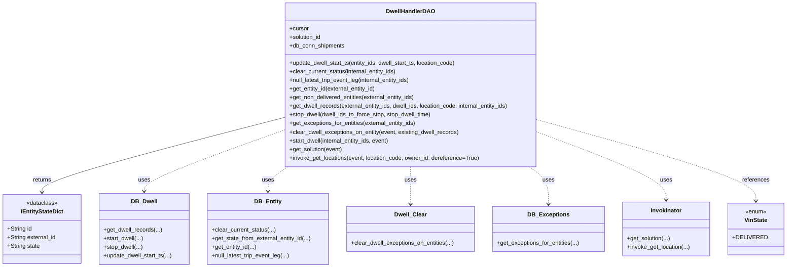

# Diagram: entity_core/entity_service/entity_service/dwell/dwell_handler_dao.py

> Auto-generated by Obscura crawlers

## Mermaid

### SVG

<svg id="container" width="2163.09375" xmlns="http://www.w3.org/2000/svg" class="classDiagram" height="744" viewBox="0 0 2163.09375 744" role="graphics-document document" aria-roledescription="class"><g><defs><marker id="container_class-aggregationStart" class="marker aggregation class" refX="18" refY="7" markerWidth="190" markerHeight="240" orient="auto"><path d="M 18,7 L9,13 L1,7 L9,1 Z"></path></marker></defs><defs><marker id="container_class-aggregationEnd" class="marker aggregation class" refX="1" refY="7" markerWidth="20" markerHeight="28" orient="auto"><path d="M 18,7 L9,13 L1,7 L9,1 Z"></path></marker></defs><defs><marker id="container_class-extensionStart" class="marker extension class" refX="18" refY="7" markerWidth="190" markerHeight="240" orient="auto"><path d="M 1,7 L18,13 V 1 Z"></path></marker></defs><defs><marker id="container_class-extensionEnd" class="marker extension class" refX="1" refY="7" markerWidth="20" markerHeight="28" orient="auto"><path d="M 1,1 V 13 L18,7 Z"></path></marker></defs><defs><marker id="container_class-compositionStart" class="marker composition class" refX="18" refY="7" markerWidth="190" markerHeight="240" orient="auto"><path d="M 18,7 L9,13 L1,7 L9,1 Z"></path></marker></defs><defs><marker id="container_class-compositionEnd" class="marker composition class" refX="1" refY="7" markerWidth="20" markerHeight="28" orient="auto"><path d="M 18,7 L9,13 L1,7 L9,1 Z"></path></marker></defs><defs><marker id="container_class-dependencyStart" class="marker dependency class" refX="6" refY="7" markerWidth="190" markerHeight="240" orient="auto"><path d="M 5,7 L9,13 L1,7 L9,1 Z"></path></marker></defs><defs><marker id="container_class-dependencyEnd" class="marker dependency class" refX="13" refY="7" markerWidth="20" markerHeight="28" orient="auto"><path d="M 18,7 L9,13 L14,7 L9,1 Z"></path></marker></defs><defs><marker id="container_class-lollipopStart" class="marker lollipop class" refX="13" refY="7" markerWidth="190" markerHeight="240" orient="auto"><circle stroke="black" fill="transparent" cx="7" cy="7" r="6"></circle></marker></defs><defs><marker id="container_class-lollipopEnd" class="marker lollipop class" refX="1" refY="7" markerWidth="190" markerHeight="240" orient="auto"><circle stroke="black" fill="transparent" cx="7" cy="7" r="6"></circle></marker></defs><g class="root"><g class="clusters"></g><g class="edgePaths"><path d="M785.195,327.851L673.794,356.709C562.392,385.567,339.589,443.284,228.187,477.809C116.785,512.333,116.785,523.667,116.785,529.333L116.785,535" id="id_DwellHandlerDAO_IEntityStateDict_1" class="edge-thickness-normal edge-pattern-solid relation" style=";;;" data-edge="true" data-et="edge" data-id="id_DwellHandlerDAO_IEntityStateDict_1" data-points="W3sieCI6Nzg1LjE5NTMxMjUsInkiOjMyNy44NTEwMjk0NjM0MjY2fSx7IngiOjExNi43ODUxNTYyNSwieSI6NTAxfSx7IngiOjExNi43ODUxNTYyNSwieSI6NTQxfV0=" marker-end="url(#container_class-dependencyEnd)"></path><path d="M785.195,363.107L721.085,386.089C656.974,409.071,528.753,455.036,464.642,483.184C400.531,511.333,400.531,521.667,400.531,526.833L400.531,532" id="id_DwellHandlerDAO_DB_Dwell_2" class="edge-thickness-normal edge-pattern-dashed relation" style=";;;" data-edge="true" data-et="edge" data-id="id_DwellHandlerDAO_DB_Dwell_2" data-points="W3sieCI6Nzg1LjE5NTMxMjUsInkiOjM2My4xMDY3Mzk5NDAyODkwNn0seyJ4Ijo0MDAuNTMxMjUsInkiOjUwMX0seyJ4Ijo0MDAuNTMxMjUsInkiOjUzOH1d" marker-end="url(#container_class-dependencyEnd)"></path><path d="M799.389,464L790.183,470.167C780.977,476.333,762.565,488.667,753.359,500C744.152,511.333,744.152,521.667,744.152,526.833L744.152,532" id="id_DwellHandlerDAO_DB_Entity_3" class="edge-thickness-normal edge-pattern-dashed relation" style=";;;" data-edge="true" data-et="edge" data-id="id_DwellHandlerDAO_DB_Entity_3" data-points="W3sieCI6Nzk5LjM4OTQ2MDQ5NTI4MywieSI6NDY0fSx7IngiOjc0NC4xNTIzNDM3NSwieSI6NTAxfSx7IngiOjc0NC4xNTIzNDM3NSwieSI6NTM4fV0=" marker-end="url(#container_class-dependencyEnd)"></path><path d="M1139.77,464L1139.77,470.167C1139.77,476.333,1139.77,488.667,1139.77,506C1139.77,523.333,1139.77,545.667,1139.77,556.833L1139.77,568" id="id_DwellHandlerDAO_Dwell_Clear_4" class="edge-thickness-normal edge-pattern-dashed relation" style=";;;" data-edge="true" data-et="edge" data-id="id_DwellHandlerDAO_Dwell_Clear_4" data-points="W3sieCI6MTEzOS43Njk1MzEyNSwieSI6NDY0fSx7IngiOjExMzkuNzY5NTMxMjUsInkiOjUwMX0seyJ4IjoxMTM5Ljc2OTUzMTI1LCJ5Ijo1NzR9XQ==" marker-end="url(#container_class-dependencyEnd)"></path><path d="M1466.827,464L1475.673,470.167C1484.519,476.333,1502.211,488.667,1511.056,506C1519.902,523.333,1519.902,545.667,1519.902,556.833L1519.902,568" id="id_DwellHandlerDAO_DB_Exceptions_5" class="edge-thickness-normal edge-pattern-dashed relation" style=";;;" data-edge="true" data-et="edge" data-id="id_DwellHandlerDAO_DB_Exceptions_5" data-points="W3sieCI6MTQ2Ni44MjcxOTYzNDQzMzk3LCJ5Ijo0NjR9LHsieCI6MTUxOS45MDIzNDM3NSwieSI6NTAxfSx7IngiOjE1MTkuOTAyMzQzNzUsInkiOjU3NH1d" marker-end="url(#container_class-dependencyEnd)"></path><path d="M1494.344,369.437L1552.609,391.364C1610.875,413.291,1727.406,457.146,1785.672,488.24C1843.938,519.333,1843.938,537.667,1843.938,546.833L1843.938,556" id="id_DwellHandlerDAO_Invokinator_6" class="edge-thickness-normal edge-pattern-dashed relation" style=";;;" data-edge="true" data-et="edge" data-id="id_DwellHandlerDAO_Invokinator_6" data-points="W3sieCI6MTQ5NC4zNDM3NSwieSI6MzY5LjQzNzE1MTU1ODUyMTV9LHsieCI6MTg0My45Mzc1LCJ5Ijo1MDF9LHsieCI6MTg0My45Mzc1LCJ5Ijo1NjJ9XQ==" marker-end="url(#container_class-dependencyEnd)"></path><path d="M1494.344,335.412L1592.777,363.01C1691.211,390.608,1888.078,445.804,1986.512,483.069C2084.945,520.333,2084.945,539.667,2084.945,549.333L2084.945,559" id="id_DwellHandlerDAO_VinState_7" class="edge-thickness-normal edge-pattern-dashed relation" style=";;;" data-edge="true" data-et="edge" data-id="id_DwellHandlerDAO_VinState_7" data-points="W3sieCI6MTQ5NC4zNDM3NSwieSI6MzM1LjQxMjM3MzY5MDQwOTc3fSx7IngiOjIwODQuOTQ1MzEyNSwieSI6NTAxfSx7IngiOjIwODQuOTQ1MzEyNSwieSI6NTY1fV0=" marker-end="url(#container_class-dependencyEnd)"></path></g><g class="edgeLabels"><g class="edgeLabel" transform="translate(116.78515625, 501)"><g class="label" data-id="id_DwellHandlerDAO_IEntityStateDict_1" transform="translate(-26.265625, -12)"><foreignObject width="52.53125" height="24">

returns

</foreignObject></g></g><g class="edgeLabel" transform="translate(400.53125, 501)"><g class="label" data-id="id_DwellHandlerDAO_DB_Dwell_2" transform="translate(-16.4921875, -12)"><foreignObject width="32.984375" height="24">

uses

</foreignObject></g></g><g class="edgeLabel" transform="translate(744.15234375, 501)"><g class="label" data-id="id_DwellHandlerDAO_DB_Entity_3" transform="translate(-16.4921875, -12)"><foreignObject width="32.984375" height="24">

uses

</foreignObject></g></g><g class="edgeLabel" transform="translate(1139.76953125, 501)"><g class="label" data-id="id_DwellHandlerDAO_Dwell_Clear_4" transform="translate(-16.4921875, -12)"><foreignObject width="32.984375" height="24">

uses

</foreignObject></g></g><g class="edgeLabel" transform="translate(1519.90234375, 501)"><g class="label" data-id="id_DwellHandlerDAO_DB_Exceptions_5" transform="translate(-16.4921875, -12)"><foreignObject width="32.984375" height="24">

uses

</foreignObject></g></g><g class="edgeLabel" transform="translate(1843.9375, 501)"><g class="label" data-id="id_DwellHandlerDAO_Invokinator_6" transform="translate(-16.4921875, -12)"><foreignObject width="32.984375" height="24">

uses

</foreignObject></g></g><g class="edgeLabel" transform="translate(2084.9453125, 501)"><g class="label" data-id="id_DwellHandlerDAO_VinState_7" transform="translate(-37.828125, -12)"><foreignObject width="75.65625" height="24">

references

</foreignObject></g></g></g><g class="nodes"><g class="node default" id="classId-IEntityStateDict-0" transform="translate(116.78515625, 637)"><g class="basic label-container"><path d="M-108.78515625 -96 L108.78515625 -96 L108.78515625 96 L-108.78515625 96" stroke="none" stroke-width="0" fill="#ECECFF" style=""></path><path d="M-108.78515625 -96 C-46.17825621431323 -96, 16.42864382137354 -96, 108.78515625 -96 M-108.78515625 -96 C-39.780795629600036 -96, 29.22356499079993 -96, 108.78515625 -96 M108.78515625 -96 C108.78515625 -23.551704888784855, 108.78515625 48.89659022243029, 108.78515625 96 M108.78515625 -96 C108.78515625 -21.652355137564314, 108.78515625 52.69528972487137, 108.78515625 96 M108.78515625 96 C33.43332595293862 96, -41.918504344122766 96, -108.78515625 96 M108.78515625 96 C64.43808930246018 96, 20.091022354920355 96, -108.78515625 96 M-108.78515625 96 C-108.78515625 26.111128814773366, -108.78515625 -43.77774237045327, -108.78515625 -96 M-108.78515625 96 C-108.78515625 23.698493263187288, -108.78515625 -48.603013473625424, -108.78515625 -96" stroke="#9370DB" stroke-width="1.3" fill="none" stroke-dasharray="0 0" style=""></path></g><g class="annotation-group text" transform="translate(-43.0859375, -72)"><g class="label" style="" transform="translate(0,-12)"><foreignObject width="86.171875" height="24">

«dataclass»

</foreignObject></g></g><g class="label-group text" transform="translate(-57.3203125, -48)"><g class="label" style="font-weight: bolder" transform="translate(0,-12)"><foreignObject width="114.640625" height="24">

IEntityStateDict

</foreignObject></g></g><g class="members-group text" transform="translate(-96.78515625, 0)"><g class="label" style="" transform="translate(0,-12)"><foreignObject width="68.546875" height="24">

+String id

</foreignObject></g><g class="label" style="" transform="translate(0,12)"><foreignObject width="136.25" height="24">

+String external_id

</foreignObject></g><g class="label" style="" transform="translate(0,36)"><foreignObject width="90.5625" height="24">

+String state

</foreignObject></g></g><g class="methods-group text" transform="translate(-96.78515625, 96)"></g><g class="divider" style=""><path d="M-108.78515625 -24 C-49.91629602363647 -24, 8.95256420272706 -24, 108.78515625 -24 M-108.78515625 -24 C-46.53692209979655 -24, 15.711312050406903 -24, 108.78515625 -24" stroke="#9370DB" stroke-width="1.3" fill="none" stroke-dasharray="0 0" style=""></path></g><g class="divider" style=""><path d="M-108.78515625 72 C-49.58248227338044 72, 9.620191703239115 72, 108.78515625 72 M-108.78515625 72 C-30.219725588024588 72, 48.345705073950825 72, 108.78515625 72" stroke="#9370DB" stroke-width="1.3" fill="none" stroke-dasharray="0 0" style=""></path></g></g><g class="node default" id="classId-DwellHandlerDAO-1" transform="translate(1139.76953125, 236)"><g class="basic label-container"><path d="M-354.57421875 -228 L354.57421875 -228 L354.57421875 228 L-354.57421875 228" stroke="none" stroke-width="0" fill="#ECECFF" style=""></path><path d="M-354.57421875 -228 C-75.58754926798315 -228, 203.3991202140337 -228, 354.57421875 -228 M-354.57421875 -228 C-74.71100593110822 -228, 205.15220688778356 -228, 354.57421875 -228 M354.57421875 -228 C354.57421875 -122.36598997313976, 354.57421875 -16.731979946279523, 354.57421875 228 M354.57421875 -228 C354.57421875 -72.231662454077, 354.57421875 83.536675091846, 354.57421875 228 M354.57421875 228 C148.53743484272206 228, -57.49934906455587 228, -354.57421875 228 M354.57421875 228 C95.80035056006659 228, -162.97351762986682 228, -354.57421875 228 M-354.57421875 228 C-354.57421875 99.07309415553371, -354.57421875 -29.85381168893258, -354.57421875 -228 M-354.57421875 228 C-354.57421875 82.68722951219002, -354.57421875 -62.62554097561997, -354.57421875 -228" stroke="#9370DB" stroke-width="1.3" fill="none" stroke-dasharray="0 0" style=""></path></g><g class="annotation-group text" transform="translate(0, -204)"></g><g class="label-group text" transform="translate(-64.7578125, -204)"><g class="label" style="font-weight: bolder" transform="translate(0,-12)"><foreignObject width="129.515625" height="24">

DwellHandlerDAO

</foreignObject></g></g><g class="members-group text" transform="translate(-342.57421875, -156)"><g class="label" style="" transform="translate(0,-12)"><foreignObject width="53.71875" height="24">

+cursor

</foreignObject></g><g class="label" style="" transform="translate(0,12)"><foreignObject width="90.21875" height="24">

+solution_id

</foreignObject></g><g class="label" style="" transform="translate(0,36)"><foreignObject width="154.40625" height="24">

+db_conn_shipments

</foreignObject></g></g><g class="methods-group text" transform="translate(-342.57421875, -60)"><g class="label" style="" transform="translate(0,-12)"><foreignObject width="472" height="24">

+update_dwell_start_ts(entity_ids, dwell_start_ts, location_code)

</foreignObject></g><g class="label" style="" transform="translate(0,12)"><foreignObject width="302.3125" height="24">

+clear_current_status(internal_entity_ids)

</foreignObject></g><g class="label" style="" transform="translate(0,36)"><foreignObject width="343.46875" height="24">

+null_latest_trip_event_leg(internal_entity_ids)

</foreignObject></g><g class="label" style="" transform="translate(0,60)"><foreignObject width="244.046875" height="24">

+get_entity_id(external_entity_id)

</foreignObject></g><g class="label" style="" transform="translate(0,84)"><foreignObject width="354.921875" height="24">

+get_non_delivered_entities(external_entity_ids)

</foreignObject></g><g class="label" style="" transform="translate(0,108)"><foreignObject width="620.390625" height="24">

+get_dwell_records(external_entity_ids, dwell_ids, location_code, internal_entity_ids)

</foreignObject></g><g class="label" style="" transform="translate(0,132)"><foreignObject width="399.734375" height="24">

+stop_dwell(dwell_ids_to_force_stop, stop_dwell_time)

</foreignObject></g><g class="label" style="" transform="translate(0,156)"><foreignObject width="355.84375" height="24">

+get_exceptions_for_entities(external_entity_ids)

</foreignObject></g><g class="label" style="" transform="translate(0,180)"><foreignObject width="476.609375" height="24">

+clear_dwell_exceptions_on_entity(event, existing_dwell_records)

</foreignObject></g><g class="label" style="" transform="translate(0,204)"><foreignObject width="283.96875" height="24">

+start_dwell(internal_entity_ids, event)

</foreignObject></g><g class="label" style="" transform="translate(0,228)"><foreignObject width="149.40625" height="24">

+get_solution(event)

</foreignObject></g><g class="label" style="" transform="translate(0,252)"><foreignObject width="530.8125" height="24">

+invoke_get_locations(event, location_code, owner_id, dereference=True)

</foreignObject></g></g><g class="divider" style=""><path d="M-354.57421875 -180 C-145.95600108668762 -180, 62.66221657662476 -180, 354.57421875 -180 M-354.57421875 -180 C-106.4746582334376 -180, 141.6249022831248 -180, 354.57421875 -180" stroke="#9370DB" stroke-width="1.3" fill="none" stroke-dasharray="0 0" style=""></path></g><g class="divider" style=""><path d="M-354.57421875 -84 C-160.43166532612642 -84, 33.71088809774716 -84, 354.57421875 -84 M-354.57421875 -84 C-174.76028121153777 -84, 5.053656326924454 -84, 354.57421875 -84" stroke="#9370DB" stroke-width="1.3" fill="none" stroke-dasharray="0 0" style=""></path></g></g><g class="node default" id="classId-DB_Dwell-2" transform="translate(400.53125, 637)"><g class="basic label-container"><path d="M-124.9609375 -99 L124.9609375 -99 L124.9609375 99 L-124.9609375 99" stroke="none" stroke-width="0" fill="#ECECFF" style=""></path><path d="M-124.9609375 -99 C-67.96158142356273 -99, -10.962225347125454 -99, 124.9609375 -99 M-124.9609375 -99 C-55.576449533003 -99, 13.808038433994 -99, 124.9609375 -99 M124.9609375 -99 C124.9609375 -56.15712116755808, 124.9609375 -13.314242335116163, 124.9609375 99 M124.9609375 -99 C124.9609375 -38.97693257612583, 124.9609375 21.046134847748334, 124.9609375 99 M124.9609375 99 C60.207006842355355 99, -4.54692381528929 99, -124.9609375 99 M124.9609375 99 C71.66008806885077 99, 18.359238637701523 99, -124.9609375 99 M-124.9609375 99 C-124.9609375 28.134026305373496, -124.9609375 -42.73194738925301, -124.9609375 -99 M-124.9609375 99 C-124.9609375 41.230087775686385, -124.9609375 -16.53982444862723, -124.9609375 -99" stroke="#9370DB" stroke-width="1.3" fill="none" stroke-dasharray="0 0" style=""></path></g><g class="annotation-group text" transform="translate(0, -75)"></g><g class="label-group text" transform="translate(-34.515625, -75)"><g class="label" style="font-weight: bolder" transform="translate(0,-12)"><foreignObject width="69.03125" height="24">

DB_Dwell

</foreignObject></g></g><g class="members-group text" transform="translate(-112.9609375, -27)"></g><g class="methods-group text" transform="translate(-112.9609375, 3)"><g class="label" style="" transform="translate(0,-12)"><foreignObject width="161.71875" height="24">

+get_dwell_records(...)

</foreignObject></g><g class="label" style="" transform="translate(0,12)"><foreignObject width="110.8125" height="24">

+start_dwell(...)

</foreignObject></g><g class="label" style="" transform="translate(0,36)"><foreignObject width="108.546875" height="24">

+stop_dwell(...)

</foreignObject></g><g class="label" style="" transform="translate(0,60)"><foreignObject width="191.40625" height="24">

+update_dwell_start_ts(...)

</foreignObject></g></g><g class="divider" style=""><path d="M-124.9609375 -51 C-68.31312226684949 -51, -11.665307033698966 -51, 124.9609375 -51 M-124.9609375 -51 C-49.150298884094425 -51, 26.66033973181115 -51, 124.9609375 -51" stroke="#9370DB" stroke-width="1.3" fill="none" stroke-dasharray="0 0" style=""></path></g><g class="divider" style=""><path d="M-124.9609375 -27 C-35.62016510714528 -27, 53.720607285709434 -27, 124.9609375 -27 M-124.9609375 -27 C-46.19859320433409 -27, 32.563751091331824 -27, 124.9609375 -27" stroke="#9370DB" stroke-width="1.3" fill="none" stroke-dasharray="0 0" style=""></path></g></g><g class="node default" id="classId-DB_Entity-3" transform="translate(744.15234375, 637)"><g class="basic label-container"><path d="M-168.66015625 -99 L168.66015625 -99 L168.66015625 99 L-168.66015625 99" stroke="none" stroke-width="0" fill="#ECECFF" style=""></path><path d="M-168.66015625 -99 C-83.04494283866813 -99, 2.5702705726637305 -99, 168.66015625 -99 M-168.66015625 -99 C-71.46825881631055 -99, 25.723638617378896 -99, 168.66015625 -99 M168.66015625 -99 C168.66015625 -25.816315513063657, 168.66015625 47.367368973872686, 168.66015625 99 M168.66015625 -99 C168.66015625 -51.91969941839329, 168.66015625 -4.839398836786586, 168.66015625 99 M168.66015625 99 C38.218850826869215 99, -92.22245459626157 99, -168.66015625 99 M168.66015625 99 C85.53533365805522 99, 2.4105110661104447 99, -168.66015625 99 M-168.66015625 99 C-168.66015625 22.99704186822879, -168.66015625 -53.00591626354242, -168.66015625 -99 M-168.66015625 99 C-168.66015625 43.46369970998848, -168.66015625 -12.072600580023035, -168.66015625 -99" stroke="#9370DB" stroke-width="1.3" fill="none" stroke-dasharray="0 0" style=""></path></g><g class="annotation-group text" transform="translate(0, -75)"></g><g class="label-group text" transform="translate(-35.4296875, -75)"><g class="label" style="font-weight: bolder" transform="translate(0,-12)"><foreignObject width="70.859375" height="24">

DB_Entity

</foreignObject></g></g><g class="members-group text" transform="translate(-156.66015625, -27)"></g><g class="methods-group text" transform="translate(-156.66015625, 3)"><g class="label" style="" transform="translate(0,-12)"><foreignObject width="177.5625" height="24">

+clear_current_status(...)

</foreignObject></g><g class="label" style="" transform="translate(0,12)"><foreignObject width="277.890625" height="24">

+get_state_from_external_entity_id(...)

</foreignObject></g><g class="label" style="" transform="translate(0,36)"><foreignObject width="124.3125" height="24">

+get_entity_id(...)

</foreignObject></g><g class="label" style="" transform="translate(0,60)"><foreignObject width="218.71875" height="24">

+null_latest_trip_event_leg(...)

</foreignObject></g></g><g class="divider" style=""><path d="M-168.66015625 -51 C-83.27955739747749 -51, 2.1010414550450207 -51, 168.66015625 -51 M-168.66015625 -51 C-46.007378287266135 -51, 76.64539967546773 -51, 168.66015625 -51" stroke="#9370DB" stroke-width="1.3" fill="none" stroke-dasharray="0 0" style=""></path></g><g class="divider" style=""><path d="M-168.66015625 -27 C-64.80503451502175 -27, 39.05008721995651 -27, 168.66015625 -27 M-168.66015625 -27 C-44.216189566360256 -27, 80.22777711727949 -27, 168.66015625 -27" stroke="#9370DB" stroke-width="1.3" fill="none" stroke-dasharray="0 0" style=""></path></g></g><g class="node default" id="classId-Dwell_Clear-4" transform="translate(1139.76953125, 637)"><g class="basic label-container"><path d="M-176.95703125 -63 L176.95703125 -63 L176.95703125 63 L-176.95703125 63" stroke="none" stroke-width="0" fill="#ECECFF" style=""></path><path d="M-176.95703125 -63 C-39.47892776840837 -63, 97.99917571318326 -63, 176.95703125 -63 M-176.95703125 -63 C-62.181492299021826 -63, 52.59404665195635 -63, 176.95703125 -63 M176.95703125 -63 C176.95703125 -14.855945718221406, 176.95703125 33.28810856355719, 176.95703125 63 M176.95703125 -63 C176.95703125 -32.655687769338954, 176.95703125 -2.3113755386779076, 176.95703125 63 M176.95703125 63 C44.998076330862546 63, -86.96087858827491 63, -176.95703125 63 M176.95703125 63 C92.07184741226172 63, 7.186663574523436 63, -176.95703125 63 M-176.95703125 63 C-176.95703125 30.720449021145726, -176.95703125 -1.559101957708549, -176.95703125 -63 M-176.95703125 63 C-176.95703125 30.340032779160047, -176.95703125 -2.319934441679905, -176.95703125 -63" stroke="#9370DB" stroke-width="1.3" fill="none" stroke-dasharray="0 0" style=""></path></g><g class="annotation-group text" transform="translate(0, -39)"></g><g class="label-group text" transform="translate(-42.9921875, -39)"><g class="label" style="font-weight: bolder" transform="translate(0,-12)"><foreignObject width="85.984375" height="24">

Dwell_Clear

</foreignObject></g></g><g class="members-group text" transform="translate(-164.95703125, 9)"></g><g class="methods-group text" transform="translate(-164.95703125, 39)"><g class="label" style="" transform="translate(0,-12)"><foreignObject width="286.921875" height="24">

+clear_dwell_exceptions_on_entities(...)

</foreignObject></g></g><g class="divider" style=""><path d="M-176.95703125 -15 C-69.53046266453343 -15, 37.89610592093314 -15, 176.95703125 -15 M-176.95703125 -15 C-55.00821278723495 -15, 66.9406056755301 -15, 176.95703125 -15" stroke="#9370DB" stroke-width="1.3" fill="none" stroke-dasharray="0 0" style=""></path></g><g class="divider" style=""><path d="M-176.95703125 9 C-47.78672616184841 9, 81.38357892630319 9, 176.95703125 9 M-176.95703125 9 C-103.35873900508045 9, -29.760446760160903 9, 176.95703125 9" stroke="#9370DB" stroke-width="1.3" fill="none" stroke-dasharray="0 0" style=""></path></g></g><g class="node default" id="classId-DB_Exceptions-5" transform="translate(1519.90234375, 637)"><g class="basic label-container"><path d="M-153.17578125 -63 L153.17578125 -63 L153.17578125 63 L-153.17578125 63" stroke="none" stroke-width="0" fill="#ECECFF" style=""></path><path d="M-153.17578125 -63 C-56.615150523737555 -63, 39.94548020252489 -63, 153.17578125 -63 M-153.17578125 -63 C-52.33959226119954 -63, 48.49659672760092 -63, 153.17578125 -63 M153.17578125 -63 C153.17578125 -28.061955011485125, 153.17578125 6.87608997702975, 153.17578125 63 M153.17578125 -63 C153.17578125 -28.775119461215667, 153.17578125 5.449761077568667, 153.17578125 63 M153.17578125 63 C60.21334648323361 63, -32.749088283532785 63, -153.17578125 63 M153.17578125 63 C66.48383625827927 63, -20.208108733441463 63, -153.17578125 63 M-153.17578125 63 C-153.17578125 30.932686730787907, -153.17578125 -1.134626538424186, -153.17578125 -63 M-153.17578125 63 C-153.17578125 32.590155354877936, -153.17578125 2.1803107097558723, -153.17578125 -63" stroke="#9370DB" stroke-width="1.3" fill="none" stroke-dasharray="0 0" style=""></path></g><g class="annotation-group text" transform="translate(0, -39)"></g><g class="label-group text" transform="translate(-53.7109375, -39)"><g class="label" style="font-weight: bolder" transform="translate(0,-12)"><foreignObject width="107.421875" height="24">

DB_Exceptions

</foreignObject></g></g><g class="members-group text" transform="translate(-141.17578125, 9)"></g><g class="methods-group text" transform="translate(-141.17578125, 39)"><g class="label" style="" transform="translate(0,-12)"><foreignObject width="228.640625" height="24">

+get_exceptions_for_entities(...)

</foreignObject></g></g><g class="divider" style=""><path d="M-153.17578125 -15 C-85.38433184818089 -15, -17.592882446361784 -15, 153.17578125 -15 M-153.17578125 -15 C-68.02155892155876 -15, 17.13266340688247 -15, 153.17578125 -15" stroke="#9370DB" stroke-width="1.3" fill="none" stroke-dasharray="0 0" style=""></path></g><g class="divider" style=""><path d="M-153.17578125 9 C-43.99624454269984 9, 65.18329216460032 9, 153.17578125 9 M-153.17578125 9 C-69.36648362151479 9, 14.442814006970423 9, 153.17578125 9" stroke="#9370DB" stroke-width="1.3" fill="none" stroke-dasharray="0 0" style=""></path></g></g><g class="node default" id="classId-Invokinator-6" transform="translate(1843.9375, 637)"><g class="basic label-container"><path d="M-120.859375 -75 L120.859375 -75 L120.859375 75 L-120.859375 75" stroke="none" stroke-width="0" fill="#ECECFF" style=""></path><path d="M-120.859375 -75 C-53.74000497916742 -75, 13.379365041665153 -75, 120.859375 -75 M-120.859375 -75 C-36.153071553960785 -75, 48.55323189207843 -75, 120.859375 -75 M120.859375 -75 C120.859375 -26.17613215932227, 120.859375 22.647735681355456, 120.859375 75 M120.859375 -75 C120.859375 -40.619202323919886, 120.859375 -6.238404647839772, 120.859375 75 M120.859375 75 C65.70380164001358 75, 10.54822828002716 75, -120.859375 75 M120.859375 75 C42.95003800291144 75, -34.95929899417712 75, -120.859375 75 M-120.859375 75 C-120.859375 34.91179346767999, -120.859375 -5.176413064640016, -120.859375 -75 M-120.859375 75 C-120.859375 16.716376641993158, -120.859375 -41.567246716013685, -120.859375 -75" stroke="#9370DB" stroke-width="1.3" fill="none" stroke-dasharray="0 0" style=""></path></g><g class="annotation-group text" transform="translate(0, -51)"></g><g class="label-group text" transform="translate(-42.125, -51)"><g class="label" style="font-weight: bolder" transform="translate(0,-12)"><foreignObject width="84.25" height="24">

Invokinator

</foreignObject></g></g><g class="members-group text" transform="translate(-108.859375, -3)"></g><g class="methods-group text" transform="translate(-108.859375, 27)"><g class="label" style="" transform="translate(0,-12)"><foreignObject width="120.578125" height="24">

+get_solution(...)

</foreignObject></g><g class="label" style="" transform="translate(0,12)"><foreignObject width="175.59375" height="24">

+invoke_get_location(...)

</foreignObject></g></g><g class="divider" style=""><path d="M-120.859375 -27 C-48.03788626229631 -27, 24.783602475407378 -27, 120.859375 -27 M-120.859375 -27 C-56.491274942577746 -27, 7.876825114844507 -27, 120.859375 -27" stroke="#9370DB" stroke-width="1.3" fill="none" stroke-dasharray="0 0" style=""></path></g><g class="divider" style=""><path d="M-120.859375 -3 C-41.152430711840424 -3, 38.55451357631915 -3, 120.859375 -3 M-120.859375 -3 C-57.132043874610275 -3, 6.5952872507794496 -3, 120.859375 -3" stroke="#9370DB" stroke-width="1.3" fill="none" stroke-dasharray="0 0" style=""></path></g></g><g class="node default" id="classId-VinState-7" transform="translate(2084.9453125, 637)"><g class="basic label-container"><path d="M-70.1484375 -72 L70.1484375 -72 L70.1484375 72 L-70.1484375 72" stroke="none" stroke-width="0" fill="#ECECFF" style=""></path><path d="M-70.1484375 -72 C-15.843687767676371 -72, 38.46106196464726 -72, 70.1484375 -72 M-70.1484375 -72 C-17.06194641795991 -72, 36.02454466408018 -72, 70.1484375 -72 M70.1484375 -72 C70.1484375 -41.812740589779594, 70.1484375 -11.625481179559195, 70.1484375 72 M70.1484375 -72 C70.1484375 -20.345918808248143, 70.1484375 31.308162383503713, 70.1484375 72 M70.1484375 72 C14.681484130098426 72, -40.78546923980315 72, -70.1484375 72 M70.1484375 72 C28.638682649629644 72, -12.871072200740713 72, -70.1484375 72 M-70.1484375 72 C-70.1484375 36.51821968819556, -70.1484375 1.0364393763911153, -70.1484375 -72 M-70.1484375 72 C-70.1484375 23.555083180237183, -70.1484375 -24.889833639525634, -70.1484375 -72" stroke="#9370DB" stroke-width="1.3" fill="none" stroke-dasharray="0 0" style=""></path></g><g class="annotation-group text" transform="translate(-29.53125, -48)"><g class="label" style="" transform="translate(0,-12)"><foreignObject width="59.0625" height="24">

«enum»

</foreignObject></g></g><g class="label-group text" transform="translate(-30.75, -24)"><g class="label" style="font-weight: bolder" transform="translate(0,-12)"><foreignObject width="61.5" height="24">

VinState

</foreignObject></g></g><g class="members-group text" transform="translate(-58.1484375, 24)"><g class="label" style="" transform="translate(0,-12)"><foreignObject width="85.546875" height="24">

+DELIVERED

</foreignObject></g></g><g class="methods-group text" transform="translate(-58.1484375, 72)"></g><g class="divider" style=""><path d="M-70.1484375 0 C-23.520478225652667 0, 23.107481048694666 0, 70.1484375 0 M-70.1484375 0 C-23.525492511547952 0, 23.097452476904095 0, 70.1484375 0" stroke="#9370DB" stroke-width="1.3" fill="none" stroke-dasharray="0 0" style=""></path></g><g class="divider" style=""><path d="M-70.1484375 48 C-33.42661261827055 48, 3.295212263458893 48, 70.1484375 48 M-70.1484375 48 C-21.011148590528336 48, 28.126140318943328 48, 70.1484375 48" stroke="#9370DB" stroke-width="1.3" fill="none" stroke-dasharray="0 0" style=""></path></g></g></g></g></g></svg>
