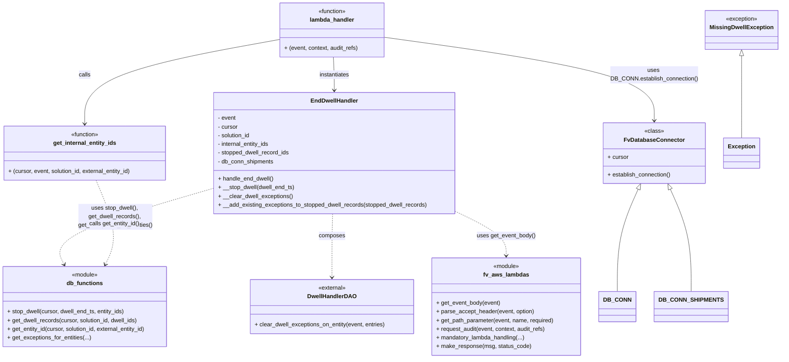

# Diagram: entity_core/entity_service/entity_service/dwell/end_dwell.py


> Auto-generated by Obscura crawlers

## Diagram 1



> SVG rendering failed for this diagram.

## Diagram 2

```mermaid
sequenceDiagram
    participant Lambda as lambda_handler
    participant AWS as fv.aws.lambdas
    participant DB as DB_CONN
    participant Cursor as cursor
    participant IntIDs as get_internal_entity_ids
    participant End as EndDwellHandler
    participant DBFuncs as entity_service.db
    participant DAO as DwellHandlerDAO
    participant Resp as make_response

    Lambda->>AWS: get_path_parameter(solution_id, entity_id)
    Lambda->>AWS: get_event_body(event)
    Lambda->>DB: establish_connection()
    DB-->>Lambda: cursor
    Lambda->>IntIDs: get_internal_entity_ids(cursor, event, solution_id, external_entity_id)
    IntIDs->>AWS: get_event_body(event)
    alt batch request
        IntIDs->>IntIDs: return internal_entity_ids from body
    else single
        IntIDs->>DBFuncs: get_entity_id(cursor, solution_id, external_entity_id)
        DBFuncs-->>IntIDs: internal_entity_id
    end
    Lambda->>End: new EndDwellHandler(cursor, DB_CONN_SHIPMENTS, event, internal_entity_ids, solution_id)
    Lambda->>End: handle_end_dwell()
    End->>AWS: get_event_body(event)
    AWS-->>End: event_body
    End->>DBFuncs: get_utc_datetime(event_body["dwellEndTs"])
    DBFuncs-->>End: dwell_end_ts
    End->>DBFuncs: stop_dwell(cursor, dwell_end_ts, internal_entity_ids)
    DBFuncs-->>End: stopped_dwell_record_ids
    End->>DBFuncs: get_dwell_records(cursor, solution_id, dwell_ids)
    DBFuncs-->>End: stopped_dwell_records
    End->>DBFuncs: get_exceptions_for_entities(cursor, external_ids, solution_id, ...)
    DBFuncs-->>End: exceptions_for_entities
    End->>DAO: new DwellHandlerDAO(cursor, solution_id, DB_CONN_SHIPMENTS)
    End->>DAO: clear_dwell_exceptions_on_entity(event, filtered_stopped_dwell_entries)
    DAO-->>End: success
    End->>Resp: make_response("SUCCESS", 200)
    Resp-->>Lambda: HTTP 200 SUCCESS
```

> SVG rendering failed for this diagram.
