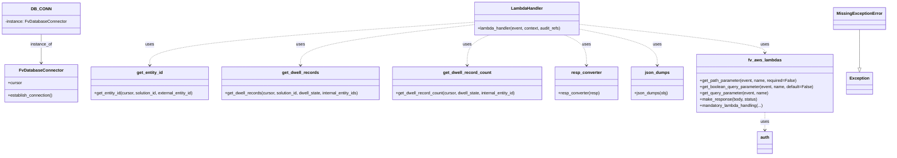

# Diagram: entity_core/entity_service/entity_service/dwell/get_dwell_records.py


> Auto-generated by Obscura crawlers

## Diagram 1



### SVG

<svg id="container" width="3391.85546875" xmlns="http://www.w3.org/2000/svg" class="classDiagram" height="596" viewBox="0 0 3391.85546875 596" role="graphics-document document" aria-roledescription="class"><style>#container{font-family:"trebuchet ms",verdana,arial,sans-serif;font-size:16px;fill:#333;}@keyframes edge-animation-frame{from{stroke-dashoffset:0;}}@keyframes dash{to{stroke-dashoffset:0;}}#container .edge-animation-slow{stroke-dasharray:9,5!important;stroke-dashoffset:900;animation:dash 50s linear infinite;stroke-linecap:round;}#container .edge-animation-fast{stroke-dasharray:9,5!important;stroke-dashoffset:900;animation:dash 20s linear infinite;stroke-linecap:round;}#container .error-icon{fill:#552222;}#container .error-text{fill:#552222;stroke:#552222;}#container .edge-thickness-normal{stroke-width:1px;}#container .edge-thickness-thick{stroke-width:3.5px;}#container .edge-pattern-solid{stroke-dasharray:0;}#container .edge-thickness-invisible{stroke-width:0;fill:none;}#container .edge-pattern-dashed{stroke-dasharray:3;}#container .edge-pattern-dotted{stroke-dasharray:2;}#container .marker{fill:#333333;stroke:#333333;}#container .marker.cross{stroke:#333333;}#container svg{font-family:"trebuchet ms",verdana,arial,sans-serif;font-size:16px;}#container p{margin:0;}#container g.classGroup text{fill:#9370DB;stroke:none;font-family:"trebuchet ms",verdana,arial,sans-serif;font-size:10px;}#container g.classGroup text .title{font-weight:bolder;}#container .nodeLabel,#container .edgeLabel{color:#131300;}#container .edgeLabel .label rect{fill:#ECECFF;}#container .label text{fill:#131300;}#container .labelBkg{background:#ECECFF;}#container .edgeLabel .label span{background:#ECECFF;}#container .classTitle{font-weight:bolder;}#container .node rect,#container .node circle,#container .node ellipse,#container .node polygon,#container .node path{fill:#ECECFF;stroke:#9370DB;stroke-width:1px;}#container .divider{stroke:#9370DB;stroke-width:1;}#container g.clickable{cursor:pointer;}#container g.classGroup rect{fill:#ECECFF;stroke:#9370DB;}#container g.classGroup line{stroke:#9370DB;stroke-width:1;}#container .classLabel .box{stroke:none;stroke-width:0;fill:#ECECFF;opacity:0.5;}#container .classLabel .label{fill:#9370DB;font-size:10px;}#container .relation{stroke:#333333;stroke-width:1;fill:none;}#container .dashed-line{stroke-dasharray:3;}#container .dotted-line{stroke-dasharray:1 2;}#container #compositionStart,#container .composition{fill:#333333!important;stroke:#333333!important;stroke-width:1;}#container #compositionEnd,#container .composition{fill:#333333!important;stroke:#333333!important;stroke-width:1;}#container #dependencyStart,#container .dependency{fill:#333333!important;stroke:#333333!important;stroke-width:1;}#container #dependencyStart,#container .dependency{fill:#333333!important;stroke:#333333!important;stroke-width:1;}#container #extensionStart,#container .extension{fill:transparent!important;stroke:#333333!important;stroke-width:1;}#container #extensionEnd,#container .extension{fill:transparent!important;stroke:#333333!important;stroke-width:1;}#container #aggregationStart,#container .aggregation{fill:transparent!important;stroke:#333333!important;stroke-width:1;}#container #aggregationEnd,#container .aggregation{fill:transparent!important;stroke:#333333!important;stroke-width:1;}#container #lollipopStart,#container .lollipop{fill:#ECECFF!important;stroke:#333333!important;stroke-width:1;}#container #lollipopEnd,#container .lollipop{fill:#ECECFF!important;stroke:#333333!important;stroke-width:1;}#container .edgeTerminals{font-size:11px;line-height:initial;}#container .classTitleText{text-anchor:middle;font-size:18px;fill:#333;}#container .label-icon{display:inline-block;height:1em;overflow:visible;vertical-align:-0.125em;}#container .node .label-icon path{fill:currentColor;stroke:revert;stroke-width:revert;}#container :root{--mermaid-font-family:"trebuchet ms",verdana,arial,sans-serif;}</style><g><defs><marker id="container_class-aggregationStart" class="marker aggregation class" refX="18" refY="7" markerWidth="190" markerHeight="240" orient="auto"><path d="M 18,7 L9,13 L1,7 L9,1 Z"></path></marker></defs><defs><marker id="container_class-aggregationEnd" class="marker aggregation class" refX="1" refY="7" markerWidth="20" markerHeight="28" orient="auto"><path d="M 18,7 L9,13 L1,7 L9,1 Z"></path></marker></defs><defs><marker id="container_class-extensionStart" class="marker extension class" refX="18" refY="7" markerWidth="190" markerHeight="240" orient="auto"><path d="M 1,7 L18,13 V 1 Z"></path></marker></defs><defs><marker id="container_class-extensionEnd" class="marker extension class" refX="1" refY="7" markerWidth="20" markerHeight="28" orient="auto"><path d="M 1,1 V 13 L18,7 Z"></path></marker></defs><defs><marker id="container_class-compositionStart" class="marker composition class" refX="18" refY="7" markerWidth="190" markerHeight="240" orient="auto"><path d="M 18,7 L9,13 L1,7 L9,1 Z"></path></marker></defs><defs><marker id="container_class-compositionEnd" class="marker composition class" refX="1" refY="7" markerWidth="20" markerHeight="28" orient="auto"><path d="M 18,7 L9,13 L1,7 L9,1 Z"></path></marker></defs><defs><marker id="container_class-dependencyStart" class="marker dependency class" refX="6" refY="7" markerWidth="190" markerHeight="240" orient="auto"><path d="M 5,7 L9,13 L1,7 L9,1 Z"></path></marker></defs><defs><marker id="container_class-dependencyEnd" class="marker dependency class" refX="13" refY="7" markerWidth="20" markerHeight="28" orient="auto"><path d="M 18,7 L9,13 L14,7 L9,1 Z"></path></marker></defs><defs><marker id="container_class-lollipopStart" class="marker lollipop class" refX="13" refY="7" markerWidth="190" markerHeight="240" orient="auto"><circle stroke="black" fill="transparent" cx="7" cy="7" r="6"></circle></marker></defs><defs><marker id="container_class-lollipopEnd" class="marker lollipop class" refX="1" refY="7" markerWidth="190" markerHeight="240" orient="auto"><circle stroke="black" fill="transparent" cx="7" cy="7" r="6"></circle></marker></defs><g class="root"><g class="clusters"></g><g class="edgePaths"><path d="M3290.473,113L3290.473,122.667C3290.473,132.333,3290.473,151.667,3290.473,176.125C3290.473,200.583,3290.473,230.167,3290.473,244.958L3290.473,259.75" id="id_MissingExceptionError_Exception_1" class="edge-thickness-normal edge-pattern-solid relation" style=";;;" data-edge="true" data-et="edge" data-id="id_MissingExceptionError_Exception_1" data-points="W3sieCI6MzI5MC40NzI2NTYyNSwieSI6MTEzfSx7IngiOjMyOTAuNDcyNjU2MjUsInkiOjE3MX0seyJ4IjozMjkwLjQ3MjY1NjI1LCJ5IjoyNzd9XQ==" marker-end="url(#container_class-extensionEnd)"></path><path d="M153.359,131L153.359,137.667C153.359,144.333,153.359,157.667,153.359,176C153.359,194.333,153.359,217.667,153.359,229.333L153.359,241" id="id_DB_CONN_FvDatabaseConnector_2" class="edge-thickness-normal edge-pattern-solid relation" style=";;;" data-edge="true" data-et="edge" data-id="id_DB_CONN_FvDatabaseConnector_2" data-points="W3sieCI6MTUzLjM1OTM3NSwieSI6MTMxfSx7IngiOjE1My4zNTkzNzUsInkiOjE3MX0seyJ4IjoxNTMuMzU5Mzc1LCJ5IjoyNDd9XQ==" marker-end="url(#container_class-dependencyEnd)"></path><path d="M2231.467,93.339L2348.478,106.283C2465.49,119.226,2699.512,145.113,2816.524,163.223C2933.535,181.333,2933.535,191.667,2933.535,196.833L2933.535,202" id="id_LambdaHandler_fv_aws_lambdas_3" class="edge-thickness-normal edge-pattern-dashed relation" style=";;;" data-edge="true" data-et="edge" data-id="id_LambdaHandler_fv_aws_lambdas_3" data-points="W3sieCI6MjIzMS40NjY3OTY4NzUsInkiOjkzLjMzOTQxNjUzOTM3ODA4fSx7IngiOjI5MzMuNTM1MTU2MjUsInkiOjE3MX0seyJ4IjoyOTMzLjUzNTE1NjI1LCJ5IjoyMDh9XQ==" marker-end="url(#container_class-dependencyEnd)"></path><path d="M1827.561,84.849L1618.171,99.207C1408.781,113.566,990.002,142.283,780.612,169.808C571.223,197.333,571.223,223.667,571.223,236.833L571.223,250" id="id_LambdaHandler_get_entity_id_4" class="edge-thickness-normal edge-pattern-dashed relation" style=";;;" data-edge="true" data-et="edge" data-id="id_LambdaHandler_get_entity_id_4" data-points="W3sieCI6MTgyNy41NjA1NDY4NzUsInkiOjg0Ljg0ODYxNjE0Mjg3OTE1fSx7IngiOjU3MS4yMjI2NTYyNSwieSI6MTcxfSx7IngiOjU3MS4yMjI2NTYyNSwieSI6MjU2fV0=" marker-end="url(#container_class-dependencyEnd)"></path><path d="M1827.561,94.141L1715.767,106.951C1603.974,119.761,1380.387,145.38,1268.594,171.357C1156.801,197.333,1156.801,223.667,1156.801,236.833L1156.801,250" id="id_LambdaHandler_get_dwell_records_5" class="edge-thickness-normal edge-pattern-dashed relation" style=";;;" data-edge="true" data-et="edge" data-id="id_LambdaHandler_get_dwell_records_5" data-points="W3sieCI6MTgyNy41NjA1NDY4NzUsInkiOjk0LjE0MDg0MzU4ODkzNDQ3fSx7IngiOjExNTYuODAwNzgxMjUsInkiOjE3MX0seyJ4IjoxMTU2LjgwMDc4MTI1LCJ5IjoyNTZ9XQ==" marker-end="url(#container_class-dependencyEnd)"></path><path d="M1885.629,134L1871.545,140.167C1857.461,146.333,1829.293,158.667,1815.209,178C1801.125,197.333,1801.125,223.667,1801.125,236.833L1801.125,250" id="id_LambdaHandler_get_dwell_record_count_6" class="edge-thickness-normal edge-pattern-dashed relation" style=";;;" data-edge="true" data-et="edge" data-id="id_LambdaHandler_get_dwell_record_count_6" data-points="W3sieCI6MTg4NS42Mjg4MDg1OTM3NSwieSI6MTM0fSx7IngiOjE4MDEuMTI1LCJ5IjoxNzF9LHsieCI6MTgwMS4xMjUsInkiOjI1Nn1d" marker-end="url(#container_class-dependencyEnd)"></path><path d="M2173.399,134L2187.483,140.167C2201.566,146.333,2229.734,158.667,2243.818,178C2257.902,197.333,2257.902,223.667,2257.902,236.833L2257.902,250" id="id_LambdaHandler_resp_converter_7" class="edge-thickness-normal edge-pattern-dashed relation" style=";;;" data-edge="true" data-et="edge" data-id="id_LambdaHandler_resp_converter_7" data-points="W3sieCI6MjE3My4zOTg1MzUxNTYyNSwieSI6MTM0fSx7IngiOjIyNTcuOTAyMzQzNzUsInkiOjE3MX0seyJ4IjoyMjU3LjkwMjM0Mzc1LCJ5IjoyNTZ9XQ==" marker-end="url(#container_class-dependencyEnd)"></path><path d="M2231.467,111.732L2280.444,121.61C2329.421,131.488,2427.374,151.244,2476.351,174.289C2525.328,197.333,2525.328,223.667,2525.328,236.833L2525.328,250" id="id_LambdaHandler_json_dumps_8" class="edge-thickness-normal edge-pattern-dashed relation" style=";;;" data-edge="true" data-et="edge" data-id="id_LambdaHandler_json_dumps_8" data-points="W3sieCI6MjIzMS40NjY3OTY4NzUsInkiOjExMS43MzE1OTI5ODM0NTEzMn0seyJ4IjoyNTI1LjMyODEyNSwieSI6MTcxfSx7IngiOjI1MjUuMzI4MTI1LCJ5IjoyNTZ9XQ==" marker-end="url(#container_class-dependencyEnd)"></path><path d="M2933.535,430L2933.535,436.167C2933.535,442.333,2933.535,454.667,2933.535,466C2933.535,477.333,2933.535,487.667,2933.535,492.833L2933.535,498" id="id_fv_aws_lambdas_auth_9" class="edge-thickness-normal edge-pattern-dashed relation" style=";;;" data-edge="true" data-et="edge" data-id="id_fv_aws_lambdas_auth_9" data-points="W3sieCI6MjkzMy41MzUxNTYyNSwieSI6NDMwfSx7IngiOjI5MzMuNTM1MTU2MjUsInkiOjQ2N30seyJ4IjoyOTMzLjUzNTE1NjI1LCJ5Ijo1MDR9XQ==" marker-end="url(#container_class-dependencyEnd)"></path></g><g class="edgeLabels"><g class="edgeLabel"><g class="label" data-id="id_MissingExceptionError_Exception_1" transform="translate(0, 0)"><foreignObject width="0" height="0"><div xmlns="http://www.w3.org/1999/xhtml" class="labelBkg" style="display: table-cell; white-space: nowrap; line-height: 1.5; max-width: 200px; text-align: center;"><span class="edgeLabel"></span></div></foreignObject></g></g><g class="edgeLabel" transform="translate(153.359375, 171)"><g class="label" data-id="id_DB_CONN_FvDatabaseConnector_2" transform="translate(-41.7734375, -12)"><foreignObject width="83.546875" height="24"><div xmlns="http://www.w3.org/1999/xhtml" class="labelBkg" style="display: table-cell; white-space: nowrap; line-height: 1.5; max-width: 200px; text-align: center;"><span class="edgeLabel"><p>instance_of</p></span></div></foreignObject></g></g><g class="edgeLabel" transform="translate(2933.53515625, 171)"><g class="label" data-id="id_LambdaHandler_fv_aws_lambdas_3" transform="translate(-16.4921875, -12)"><foreignObject width="32.984375" height="24"><div xmlns="http://www.w3.org/1999/xhtml" class="labelBkg" style="display: table-cell; white-space: nowrap; line-height: 1.5; max-width: 200px; text-align: center;"><span class="edgeLabel"><p>uses</p></span></div></foreignObject></g></g><g class="edgeLabel" transform="translate(571.22265625, 171)"><g class="label" data-id="id_LambdaHandler_get_entity_id_4" transform="translate(-16.4921875, -12)"><foreignObject width="32.984375" height="24"><div xmlns="http://www.w3.org/1999/xhtml" class="labelBkg" style="display: table-cell; white-space: nowrap; line-height: 1.5; max-width: 200px; text-align: center;"><span class="edgeLabel"><p>uses</p></span></div></foreignObject></g></g><g class="edgeLabel" transform="translate(1156.80078125, 171)"><g class="label" data-id="id_LambdaHandler_get_dwell_records_5" transform="translate(-16.4921875, -12)"><foreignObject width="32.984375" height="24"><div xmlns="http://www.w3.org/1999/xhtml" class="labelBkg" style="display: table-cell; white-space: nowrap; line-height: 1.5; max-width: 200px; text-align: center;"><span class="edgeLabel"><p>uses</p></span></div></foreignObject></g></g><g class="edgeLabel" transform="translate(1801.125, 171)"><g class="label" data-id="id_LambdaHandler_get_dwell_record_count_6" transform="translate(-16.4921875, -12)"><foreignObject width="32.984375" height="24"><div xmlns="http://www.w3.org/1999/xhtml" class="labelBkg" style="display: table-cell; white-space: nowrap; line-height: 1.5; max-width: 200px; text-align: center;"><span class="edgeLabel"><p>uses</p></span></div></foreignObject></g></g><g class="edgeLabel" transform="translate(2257.90234375, 171)"><g class="label" data-id="id_LambdaHandler_resp_converter_7" transform="translate(-16.4921875, -12)"><foreignObject width="32.984375" height="24"><div xmlns="http://www.w3.org/1999/xhtml" class="labelBkg" style="display: table-cell; white-space: nowrap; line-height: 1.5; max-width: 200px; text-align: center;"><span class="edgeLabel"><p>uses</p></span></div></foreignObject></g></g><g class="edgeLabel" transform="translate(2525.328125, 171)"><g class="label" data-id="id_LambdaHandler_json_dumps_8" transform="translate(-16.4921875, -12)"><foreignObject width="32.984375" height="24"><div xmlns="http://www.w3.org/1999/xhtml" class="labelBkg" style="display: table-cell; white-space: nowrap; line-height: 1.5; max-width: 200px; text-align: center;"><span class="edgeLabel"><p>uses</p></span></div></foreignObject></g></g><g class="edgeLabel" transform="translate(2933.53515625, 467)"><g class="label" data-id="id_fv_aws_lambdas_auth_9" transform="translate(-16.4921875, -12)"><foreignObject width="32.984375" height="24"><div xmlns="http://www.w3.org/1999/xhtml" class="labelBkg" style="display: table-cell; white-space: nowrap; line-height: 1.5; max-width: 200px; text-align: center;"><span class="edgeLabel"><p>uses</p></span></div></foreignObject></g></g></g><g class="nodes"><g class="node default" id="classId-MissingExceptionError-0" transform="translate(3290.47265625, 71)"><g class="basic label-container"><path d="M-93.3828125 -42 L93.3828125 -42 L93.3828125 42 L-93.3828125 42" stroke="none" stroke-width="0" fill="#ECECFF" style=""></path><path d="M-93.3828125 -42 C-20.04133815768097 -42, 53.30013618463806 -42, 93.3828125 -42 M-93.3828125 -42 C-32.40230817921164 -42, 28.578196141576726 -42, 93.3828125 -42 M93.3828125 -42 C93.3828125 -21.232892047025373, 93.3828125 -0.46578409405074694, 93.3828125 42 M93.3828125 -42 C93.3828125 -15.543800356438016, 93.3828125 10.912399287123968, 93.3828125 42 M93.3828125 42 C24.567884598235196 42, -44.24704330352961 42, -93.3828125 42 M93.3828125 42 C48.84602748552779 42, 4.309242471055583 42, -93.3828125 42 M-93.3828125 42 C-93.3828125 19.617293630964483, -93.3828125 -2.765412738071035, -93.3828125 -42 M-93.3828125 42 C-93.3828125 11.02391770242982, -93.3828125 -19.95216459514036, -93.3828125 -42" stroke="#9370DB" stroke-width="1.3" fill="none" stroke-dasharray="0 0" style=""></path></g><g class="annotation-group text" transform="translate(0, -18)"></g><g class="label-group text" transform="translate(-81.3828125, -18)"><g class="label" style="font-weight: bolder" transform="translate(0,-12)"><foreignObject width="162.765625" height="24"><div xmlns="http://www.w3.org/1999/xhtml" style="display: table-cell; white-space: nowrap; line-height: 1.5; max-width: 211px; text-align: center;"><span class="nodeLabel markdown-node-label" style=""><p>MissingExceptionError</p></span></div></foreignObject></g></g><g class="members-group text" transform="translate(-81.3828125, 30)"></g><g class="methods-group text" transform="translate(-81.3828125, 60)"></g><g class="divider" style=""><path d="M-93.3828125 6 C-24.649426345025333 6, 44.083959809949334 6, 93.3828125 6 M-93.3828125 6 C-24.906930460225993 6, 43.56895157954801 6, 93.3828125 6" stroke="#9370DB" stroke-width="1.3" fill="none" stroke-dasharray="0 0" style=""></path></g><g class="divider" style=""><path d="M-93.3828125 24 C-19.90085122656565 24, 53.5811100468687 24, 93.3828125 24 M-93.3828125 24 C-19.01483244209487 24, 55.35314761581026 24, 93.3828125 24" stroke="#9370DB" stroke-width="1.3" fill="none" stroke-dasharray="0 0" style=""></path></g></g><g class="node default" id="classId-FvDatabaseConnector-1" transform="translate(153.359375, 319)"><g class="basic label-container"><path d="M-138.28515625 -72 L138.28515625 -72 L138.28515625 72 L-138.28515625 72" stroke="none" stroke-width="0" fill="#ECECFF" style=""></path><path d="M-138.28515625 -72 C-40.76538100565857 -72, 56.75439423868286 -72, 138.28515625 -72 M-138.28515625 -72 C-37.1816483803246 -72, 63.921859489350794 -72, 138.28515625 -72 M138.28515625 -72 C138.28515625 -32.350625550253056, 138.28515625 7.298748899493887, 138.28515625 72 M138.28515625 -72 C138.28515625 -28.601243290486316, 138.28515625 14.797513419027368, 138.28515625 72 M138.28515625 72 C54.43815128344177 72, -29.40885368311646 72, -138.28515625 72 M138.28515625 72 C56.78081014409817 72, -24.723535961803663 72, -138.28515625 72 M-138.28515625 72 C-138.28515625 16.739781790361036, -138.28515625 -38.52043641927793, -138.28515625 -72 M-138.28515625 72 C-138.28515625 26.558678501910663, -138.28515625 -18.882642996178674, -138.28515625 -72" stroke="#9370DB" stroke-width="1.3" fill="none" stroke-dasharray="0 0" style=""></path></g><g class="annotation-group text" transform="translate(0, -48)"></g><g class="label-group text" transform="translate(-79.3046875, -48)"><g class="label" style="font-weight: bolder" transform="translate(0,-12)"><foreignObject width="158.609375" height="24"><div xmlns="http://www.w3.org/1999/xhtml" style="display: table-cell; white-space: nowrap; line-height: 1.5; max-width: 207px; text-align: center;"><span class="nodeLabel markdown-node-label" style=""><p>FvDatabaseConnector</p></span></div></foreignObject></g></g><g class="members-group text" transform="translate(-126.28515625, 0)"><g class="label" style="" transform="translate(0,-12)"><foreignObject width="53.71875" height="24"><div xmlns="http://www.w3.org/1999/xhtml" style="display: table-cell; white-space: nowrap; line-height: 1.5; max-width: 112px; text-align: center;"><span class="nodeLabel markdown-node-label" style=""><p>+cursor</p></span></div></foreignObject></g></g><g class="methods-group text" transform="translate(-126.28515625, 48)"><g class="label" style="" transform="translate(0,-12)"><foreignObject width="173.265625" height="24"><div xmlns="http://www.w3.org/1999/xhtml" style="display: table-cell; white-space: nowrap; line-height: 1.5; max-width: 231px; text-align: center;"><span class="nodeLabel markdown-node-label" style=""><p>+establish_connection()</p></span></div></foreignObject></g></g><g class="divider" style=""><path d="M-138.28515625 -24 C-30.097675815648174 -24, 78.08980461870365 -24, 138.28515625 -24 M-138.28515625 -24 C-37.99137536461677 -24, 62.302405520766456 -24, 138.28515625 -24" stroke="#9370DB" stroke-width="1.3" fill="none" stroke-dasharray="0 0" style=""></path></g><g class="divider" style=""><path d="M-138.28515625 24 C-37.379600547634354 24, 63.52595515473129 24, 138.28515625 24 M-138.28515625 24 C-45.712512734065214 24, 46.86013078186957 24, 138.28515625 24" stroke="#9370DB" stroke-width="1.3" fill="none" stroke-dasharray="0 0" style=""></path></g></g><g class="node default" id="classId-DB_CONN-2" transform="translate(153.359375, 71)"><g class="basic label-container"><path d="M-145.359375 -60 L145.359375 -60 L145.359375 60 L-145.359375 60" stroke="none" stroke-width="0" fill="#ECECFF" style=""></path><path d="M-145.359375 -60 C-58.7357685492172 -60, 27.887837901565604 -60, 145.359375 -60 M-145.359375 -60 C-72.82540226942686 -60, -0.2914295388537198 -60, 145.359375 -60 M145.359375 -60 C145.359375 -21.225909394673373, 145.359375 17.548181210653254, 145.359375 60 M145.359375 -60 C145.359375 -26.623516670682484, 145.359375 6.752966658635032, 145.359375 60 M145.359375 60 C81.22409002997954 60, 17.08880505995907 60, -145.359375 60 M145.359375 60 C53.534573556350196 60, -38.29022788729961 60, -145.359375 60 M-145.359375 60 C-145.359375 25.287764383561182, -145.359375 -9.424471232877636, -145.359375 -60 M-145.359375 60 C-145.359375 32.075268163616435, -145.359375 4.150536327232871, -145.359375 -60" stroke="#9370DB" stroke-width="1.3" fill="none" stroke-dasharray="0 0" style=""></path></g><g class="annotation-group text" transform="translate(0, -36)"></g><g class="label-group text" transform="translate(-34.40625, -36)"><g class="label" style="font-weight: bolder" transform="translate(0,-12)"><foreignObject width="68.8125" height="24"><div xmlns="http://www.w3.org/1999/xhtml" style="display: table-cell; white-space: nowrap; line-height: 1.5; max-width: 119px; text-align: center;"><span class="nodeLabel markdown-node-label" style=""><p>DB_CONN</p></span></div></foreignObject></g></g><g class="members-group text" transform="translate(-133.359375, 12)"><g class="label" style="" transform="translate(0,-12)"><foreignObject width="232.3125" height="24"><div xmlns="http://www.w3.org/1999/xhtml" style="display: table-cell; white-space: nowrap; line-height: 1.5; max-width: 290px; text-align: center;"><span class="nodeLabel markdown-node-label" style=""><p>-instance: FvDatabaseConnector</p></span></div></foreignObject></g></g><g class="methods-group text" transform="translate(-133.359375, 60)"></g><g class="divider" style=""><path d="M-145.359375 -12 C-29.273138789427804 -12, 86.81309742114439 -12, 145.359375 -12 M-145.359375 -12 C-80.86993739198921 -12, -16.380499783978422 -12, 145.359375 -12" stroke="#9370DB" stroke-width="1.3" fill="none" stroke-dasharray="0 0" style=""></path></g><g class="divider" style=""><path d="M-145.359375 36 C-44.14910909316691 36, 57.06115681366617 36, 145.359375 36 M-145.359375 36 C-39.56295102300717 36, 66.23347295398565 36, 145.359375 36" stroke="#9370DB" stroke-width="1.3" fill="none" stroke-dasharray="0 0" style=""></path></g></g><g class="node default" id="classId-LambdaHandler-3" transform="translate(2029.513671875, 71)"><g class="basic label-container"><path d="M-201.953125 -63 L201.953125 -63 L201.953125 63 L-201.953125 63" stroke="none" stroke-width="0" fill="#ECECFF" style=""></path><path d="M-201.953125 -63 C-97.80738785342874 -63, 6.338349293142528 -63, 201.953125 -63 M-201.953125 -63 C-84.02234509788796 -63, 33.90843480422407 -63, 201.953125 -63 M201.953125 -63 C201.953125 -35.667080672972006, 201.953125 -8.334161345944004, 201.953125 63 M201.953125 -63 C201.953125 -27.111165156449296, 201.953125 8.777669687101408, 201.953125 63 M201.953125 63 C112.31399601869482 63, 22.674867037389646 63, -201.953125 63 M201.953125 63 C54.77521305968182 63, -92.40269888063636 63, -201.953125 63 M-201.953125 63 C-201.953125 13.21919658806383, -201.953125 -36.56160682387234, -201.953125 -63 M-201.953125 63 C-201.953125 12.931624702238814, -201.953125 -37.13675059552237, -201.953125 -63" stroke="#9370DB" stroke-width="1.3" fill="none" stroke-dasharray="0 0" style=""></path></g><g class="annotation-group text" transform="translate(0, -39)"></g><g class="label-group text" transform="translate(-58.21875, -39)"><g class="label" style="font-weight: bolder" transform="translate(0,-12)"><foreignObject width="116.4375" height="24"><div xmlns="http://www.w3.org/1999/xhtml" style="display: table-cell; white-space: nowrap; line-height: 1.5; max-width: 167px; text-align: center;"><span class="nodeLabel markdown-node-label" style=""><p>LambdaHandler</p></span></div></foreignObject></g></g><g class="members-group text" transform="translate(-189.953125, 9)"></g><g class="methods-group text" transform="translate(-189.953125, 39)"><g class="label" style="" transform="translate(0,-12)"><foreignObject width="321.6875" height="24"><div xmlns="http://www.w3.org/1999/xhtml" style="display: table-cell; white-space: nowrap; line-height: 1.5; max-width: 379px; text-align: center;"><span class="nodeLabel markdown-node-label" style=""><p>+lambda_handler(event, context, audit_refs)</p></span></div></foreignObject></g></g><g class="divider" style=""><path d="M-201.953125 -15 C-106.50084519975896 -15, -11.048565399517912 -15, 201.953125 -15 M-201.953125 -15 C-110.24075598904349 -15, -18.528386978086985 -15, 201.953125 -15" stroke="#9370DB" stroke-width="1.3" fill="none" stroke-dasharray="0 0" style=""></path></g><g class="divider" style=""><path d="M-201.953125 9 C-104.41067330032517 9, -6.868221600650344 9, 201.953125 9 M-201.953125 9 C-42.2897031953712 9, 117.3737186092576 9, 201.953125 9" stroke="#9370DB" stroke-width="1.3" fill="none" stroke-dasharray="0 0" style=""></path></g></g><g class="node default" id="classId-get_entity_id-4" transform="translate(571.22265625, 319)"><g class="basic label-container"><path d="M-229.578125 -63 L229.578125 -63 L229.578125 63 L-229.578125 63" stroke="none" stroke-width="0" fill="#ECECFF" style=""></path><path d="M-229.578125 -63 C-101.02661167505394 -63, 27.524901649892115 -63, 229.578125 -63 M-229.578125 -63 C-72.35995787217632 -63, 84.85820925564735 -63, 229.578125 -63 M229.578125 -63 C229.578125 -33.32450497060846, 229.578125 -3.64900994121691, 229.578125 63 M229.578125 -63 C229.578125 -32.068388976277376, 229.578125 -1.136777952554759, 229.578125 63 M229.578125 63 C48.534120718201876 63, -132.50988356359625 63, -229.578125 63 M229.578125 63 C56.02721501819565 63, -117.5236949636087 63, -229.578125 63 M-229.578125 63 C-229.578125 29.279800194308336, -229.578125 -4.440399611383327, -229.578125 -63 M-229.578125 63 C-229.578125 18.576768918366312, -229.578125 -25.846462163267375, -229.578125 -63" stroke="#9370DB" stroke-width="1.3" fill="none" stroke-dasharray="0 0" style=""></path></g><g class="annotation-group text" transform="translate(0, -39)"></g><g class="label-group text" transform="translate(-48.28125, -39)"><g class="label" style="font-weight: bolder" transform="translate(0,-12)"><foreignObject width="96.5625" height="24"><div xmlns="http://www.w3.org/1999/xhtml" style="display: table-cell; white-space: nowrap; line-height: 1.5; max-width: 144px; text-align: center;"><span class="nodeLabel markdown-node-label" style=""><p>get_entity_id</p></span></div></foreignObject></g></g><g class="members-group text" transform="translate(-217.578125, 9)"></g><g class="methods-group text" transform="translate(-217.578125, 39)"><g class="label" style="" transform="translate(0,-12)"><foreignObject width="386.875" height="24"><div xmlns="http://www.w3.org/1999/xhtml" style="display: table-cell; white-space: nowrap; line-height: 1.5; max-width: 444px; text-align: center;"><span class="nodeLabel markdown-node-label" style=""><p>+get_entity_id(cursor, solution_id, external_entity_id)</p></span></div></foreignObject></g></g><g class="divider" style=""><path d="M-229.578125 -15 C-103.73940292957599 -15, 22.099319140848024 -15, 229.578125 -15 M-229.578125 -15 C-115.64714787018895 -15, -1.7161707403778905 -15, 229.578125 -15" stroke="#9370DB" stroke-width="1.3" fill="none" stroke-dasharray="0 0" style=""></path></g><g class="divider" style=""><path d="M-229.578125 9 C-58.906105997842786 9, 111.76591300431443 9, 229.578125 9 M-229.578125 9 C-113.67011679562093 9, 2.237891408758145 9, 229.578125 9" stroke="#9370DB" stroke-width="1.3" fill="none" stroke-dasharray="0 0" style=""></path></g></g><g class="node default" id="classId-get_dwell_records-5" transform="translate(1156.80078125, 319)"><g class="basic label-container"><path d="M-306 -63 L306 -63 L306 63 L-306 63" stroke="none" stroke-width="0" fill="#ECECFF" style=""></path><path d="M-306 -63 C-99.12153793689782 -63, 107.75692412620435 -63, 306 -63 M-306 -63 C-180.94851667947768 -63, -55.897033358955326 -63, 306 -63 M306 -63 C306 -36.33276264222254, 306 -9.665525284445081, 306 63 M306 -63 C306 -21.264690398148623, 306 20.470619203702753, 306 63 M306 63 C143.93391994007072 63, -18.132160119858554 63, -306 63 M306 63 C117.25840935386256 63, -71.48318129227488 63, -306 63 M-306 63 C-306 24.303824479818545, -306 -14.392351040362911, -306 -63 M-306 63 C-306 18.786922055789482, -306 -25.426155888421036, -306 -63" stroke="#9370DB" stroke-width="1.3" fill="none" stroke-dasharray="0 0" style=""></path></g><g class="annotation-group text" transform="translate(0, -39)"></g><g class="label-group text" transform="translate(-67.21875, -39)"><g class="label" style="font-weight: bolder" transform="translate(0,-12)"><foreignObject width="134.4375" height="24"><div xmlns="http://www.w3.org/1999/xhtml" style="display: table-cell; white-space: nowrap; line-height: 1.5; max-width: 182px; text-align: center;"><span class="nodeLabel markdown-node-label" style=""><p>get_dwell_records</p></span></div></foreignObject></g></g><g class="members-group text" transform="translate(-294, 9)"></g><g class="methods-group text" transform="translate(-294, 39)"><g class="label" style="" transform="translate(0,-12)"><foreignObject width="520.78125" height="24"><div xmlns="http://www.w3.org/1999/xhtml" style="display: table-cell; white-space: nowrap; line-height: 1.5; max-width: 578px; text-align: center;"><span class="nodeLabel markdown-node-label" style=""><p>+get_dwell_records(cursor, solution_id, dwell_state, internal_entity_ids)</p></span></div></foreignObject></g></g><g class="divider" style=""><path d="M-306 -15 C-128.744347501048 -15, 48.511304997904006 -15, 306 -15 M-306 -15 C-82.01770005238552 -15, 141.96459989522896 -15, 306 -15" stroke="#9370DB" stroke-width="1.3" fill="none" stroke-dasharray="0 0" style=""></path></g><g class="divider" style=""><path d="M-306 9 C-167.75107009558644 9, -29.502140191172884 9, 306 9 M-306 9 C-73.66780023897846 9, 158.66439952204308 9, 306 9" stroke="#9370DB" stroke-width="1.3" fill="none" stroke-dasharray="0 0" style=""></path></g></g><g class="node default" id="classId-get_dwell_record_count-6" transform="translate(1801.125, 319)"><g class="basic label-container"><path d="M-288.32421875 -63 L288.32421875 -63 L288.32421875 63 L-288.32421875 63" stroke="none" stroke-width="0" fill="#ECECFF" style=""></path><path d="M-288.32421875 -63 C-69.83085345051512 -63, 148.66251184896976 -63, 288.32421875 -63 M-288.32421875 -63 C-141.50528805897156 -63, 5.313642632056883 -63, 288.32421875 -63 M288.32421875 -63 C288.32421875 -34.99486376274306, 288.32421875 -6.989727525486117, 288.32421875 63 M288.32421875 -63 C288.32421875 -21.244751303420422, 288.32421875 20.510497393159156, 288.32421875 63 M288.32421875 63 C154.93466584048986 63, 21.545112930979712 63, -288.32421875 63 M288.32421875 63 C120.17403035151295 63, -47.97615804697409 63, -288.32421875 63 M-288.32421875 63 C-288.32421875 36.695522653324204, -288.32421875 10.391045306648415, -288.32421875 -63 M-288.32421875 63 C-288.32421875 18.632201104588923, -288.32421875 -25.735597790822155, -288.32421875 -63" stroke="#9370DB" stroke-width="1.3" fill="none" stroke-dasharray="0 0" style=""></path></g><g class="annotation-group text" transform="translate(0, -39)"></g><g class="label-group text" transform="translate(-87.9765625, -39)"><g class="label" style="font-weight: bolder" transform="translate(0,-12)"><foreignObject width="175.953125" height="24"><div xmlns="http://www.w3.org/1999/xhtml" style="display: table-cell; white-space: nowrap; line-height: 1.5; max-width: 224px; text-align: center;"><span class="nodeLabel markdown-node-label" style=""><p>get_dwell_record_count</p></span></div></foreignObject></g></g><g class="members-group text" transform="translate(-276.32421875, 9)"></g><g class="methods-group text" transform="translate(-276.32421875, 39)"><g class="label" style="" transform="translate(0,-12)"><foreignObject width="464.671875" height="24"><div xmlns="http://www.w3.org/1999/xhtml" style="display: table-cell; white-space: nowrap; line-height: 1.5; max-width: 522px; text-align: center;"><span class="nodeLabel markdown-node-label" style=""><p>+get_dwell_record_count(cursor, dwell_state, internal_entity_id)</p></span></div></foreignObject></g></g><g class="divider" style=""><path d="M-288.32421875 -15 C-62.947471330491226 -15, 162.42927608901755 -15, 288.32421875 -15 M-288.32421875 -15 C-98.72481652725966 -15, 90.87458569548068 -15, 288.32421875 -15" stroke="#9370DB" stroke-width="1.3" fill="none" stroke-dasharray="0 0" style=""></path></g><g class="divider" style=""><path d="M-288.32421875 9 C-135.33893907436592 9, 17.64634060126815 9, 288.32421875 9 M-288.32421875 9 C-91.20442885543156 9, 105.91536103913688 9, 288.32421875 9" stroke="#9370DB" stroke-width="1.3" fill="none" stroke-dasharray="0 0" style=""></path></g></g><g class="node default" id="classId-resp_converter-7" transform="translate(2257.90234375, 319)"><g class="basic label-container"><path d="M-118.453125 -63 L118.453125 -63 L118.453125 63 L-118.453125 63" stroke="none" stroke-width="0" fill="#ECECFF" style=""></path><path d="M-118.453125 -63 C-48.944350269620955 -63, 20.56442446075809 -63, 118.453125 -63 M-118.453125 -63 C-54.44125543385951 -63, 9.57061413228098 -63, 118.453125 -63 M118.453125 -63 C118.453125 -22.790528409591673, 118.453125 17.418943180816655, 118.453125 63 M118.453125 -63 C118.453125 -28.022353399133415, 118.453125 6.95529320173317, 118.453125 63 M118.453125 63 C55.37230381059861 63, -7.708517378802782 63, -118.453125 63 M118.453125 63 C41.10387693436097 63, -36.24537113127806 63, -118.453125 63 M-118.453125 63 C-118.453125 31.3323238186896, -118.453125 -0.33535236262080304, -118.453125 -63 M-118.453125 63 C-118.453125 15.759667153741383, -118.453125 -31.480665692517235, -118.453125 -63" stroke="#9370DB" stroke-width="1.3" fill="none" stroke-dasharray="0 0" style=""></path></g><g class="annotation-group text" transform="translate(0, -39)"></g><g class="label-group text" transform="translate(-55.015625, -39)"><g class="label" style="font-weight: bolder" transform="translate(0,-12)"><foreignObject width="110.03125" height="24"><div xmlns="http://www.w3.org/1999/xhtml" style="display: table-cell; white-space: nowrap; line-height: 1.5; max-width: 159px; text-align: center;"><span class="nodeLabel markdown-node-label" style=""><p>resp_converter</p></span></div></foreignObject></g></g><g class="members-group text" transform="translate(-106.453125, 9)"></g><g class="methods-group text" transform="translate(-106.453125, 39)"><g class="label" style="" transform="translate(0,-12)"><foreignObject width="157.890625" height="24"><div xmlns="http://www.w3.org/1999/xhtml" style="display: table-cell; white-space: nowrap; line-height: 1.5; max-width: 215px; text-align: center;"><span class="nodeLabel markdown-node-label" style=""><p>+resp_converter(resp)</p></span></div></foreignObject></g></g><g class="divider" style=""><path d="M-118.453125 -15 C-60.538888940750866 -15, -2.6246528815017314 -15, 118.453125 -15 M-118.453125 -15 C-58.79533248589703 -15, 0.8624600282059447 -15, 118.453125 -15" stroke="#9370DB" stroke-width="1.3" fill="none" stroke-dasharray="0 0" style=""></path></g><g class="divider" style=""><path d="M-118.453125 9 C-43.56627180328688 9, 31.320581393426238 9, 118.453125 9 M-118.453125 9 C-38.70524713389517 9, 41.04263073220966 9, 118.453125 9" stroke="#9370DB" stroke-width="1.3" fill="none" stroke-dasharray="0 0" style=""></path></g></g><g class="node default" id="classId-json_dumps-8" transform="translate(2525.328125, 319)"><g class="basic label-container"><path d="M-98.97265625 -63 L98.97265625 -63 L98.97265625 63 L-98.97265625 63" stroke="none" stroke-width="0" fill="#ECECFF" style=""></path><path d="M-98.97265625 -63 C-23.85380971619155 -63, 51.2650368176169 -63, 98.97265625 -63 M-98.97265625 -63 C-56.18315337737602 -63, -13.393650504752046 -63, 98.97265625 -63 M98.97265625 -63 C98.97265625 -19.966076930803858, 98.97265625 23.067846138392284, 98.97265625 63 M98.97265625 -63 C98.97265625 -15.606123552380303, 98.97265625 31.787752895239393, 98.97265625 63 M98.97265625 63 C36.08138738901218 63, -26.809881471975643 63, -98.97265625 63 M98.97265625 63 C55.917572246405314 63, 12.862488242810628 63, -98.97265625 63 M-98.97265625 63 C-98.97265625 33.9516213230817, -98.97265625 4.903242646163406, -98.97265625 -63 M-98.97265625 63 C-98.97265625 18.272638265245583, -98.97265625 -26.454723469508835, -98.97265625 -63" stroke="#9370DB" stroke-width="1.3" fill="none" stroke-dasharray="0 0" style=""></path></g><g class="annotation-group text" transform="translate(0, -39)"></g><g class="label-group text" transform="translate(-44.1796875, -39)"><g class="label" style="font-weight: bolder" transform="translate(0,-12)"><foreignObject width="88.359375" height="24"><div xmlns="http://www.w3.org/1999/xhtml" style="display: table-cell; white-space: nowrap; line-height: 1.5; max-width: 139px; text-align: center;"><span class="nodeLabel markdown-node-label" style=""><p>json_dumps</p></span></div></foreignObject></g></g><g class="members-group text" transform="translate(-86.97265625, 9)"></g><g class="methods-group text" transform="translate(-86.97265625, 39)"><g class="label" style="" transform="translate(0,-12)"><foreignObject width="129.765625" height="24"><div xmlns="http://www.w3.org/1999/xhtml" style="display: table-cell; white-space: nowrap; line-height: 1.5; max-width: 187px; text-align: center;"><span class="nodeLabel markdown-node-label" style=""><p>+json_dumps(obj)</p></span></div></foreignObject></g></g><g class="divider" style=""><path d="M-98.97265625 -15 C-31.43362373656207 -15, 36.10540877687586 -15, 98.97265625 -15 M-98.97265625 -15 C-36.38419227774399 -15, 26.204271694512016 -15, 98.97265625 -15" stroke="#9370DB" stroke-width="1.3" fill="none" stroke-dasharray="0 0" style=""></path></g><g class="divider" style=""><path d="M-98.97265625 9 C-38.010264113660675 9, 22.95212802267865 9, 98.97265625 9 M-98.97265625 9 C-58.36326029332058 9, -17.753864336641158 9, 98.97265625 9" stroke="#9370DB" stroke-width="1.3" fill="none" stroke-dasharray="0 0" style=""></path></g></g><g class="node default" id="classId-fv_aws_lambdas-9" transform="translate(2933.53515625, 319)"><g class="basic label-container"><path d="M-259.234375 -111 L259.234375 -111 L259.234375 111 L-259.234375 111" stroke="none" stroke-width="0" fill="#ECECFF" style=""></path><path d="M-259.234375 -111 C-133.37016456308896 -111, -7.505954126177954 -111, 259.234375 -111 M-259.234375 -111 C-141.17915772916308 -111, -23.12394045832619 -111, 259.234375 -111 M259.234375 -111 C259.234375 -49.53404118959872, 259.234375 11.931917620802565, 259.234375 111 M259.234375 -111 C259.234375 -26.941255487105693, 259.234375 57.117489025788615, 259.234375 111 M259.234375 111 C74.01066016805098 111, -111.21305466389805 111, -259.234375 111 M259.234375 111 C74.32866189895714 111, -110.57705120208573 111, -259.234375 111 M-259.234375 111 C-259.234375 47.98616196229079, -259.234375 -15.027676075418427, -259.234375 -111 M-259.234375 111 C-259.234375 56.35805582597389, -259.234375 1.7161116519477844, -259.234375 -111" stroke="#9370DB" stroke-width="1.3" fill="none" stroke-dasharray="0 0" style=""></path></g><g class="annotation-group text" transform="translate(0, -87)"></g><g class="label-group text" transform="translate(-60.0625, -87)"><g class="label" style="font-weight: bolder" transform="translate(0,-12)"><foreignObject width="120.125" height="24"><div xmlns="http://www.w3.org/1999/xhtml" style="display: table-cell; white-space: nowrap; line-height: 1.5; max-width: 168px; text-align: center;"><span class="nodeLabel markdown-node-label" style=""><p>fv_aws_lambdas</p></span></div></foreignObject></g></g><g class="members-group text" transform="translate(-247.234375, -39)"></g><g class="methods-group text" transform="translate(-247.234375, -9)"><g class="label" style="" transform="translate(0,-12)"><foreignObject width="369.015625" height="24"><div xmlns="http://www.w3.org/1999/xhtml" style="display: table-cell; white-space: nowrap; line-height: 1.5; max-width: 426px; text-align: center;"><span class="nodeLabel markdown-node-label" style=""><p>+get_path_parameter(event, name, required=False)</p></span></div></foreignObject></g><g class="label" style="" transform="translate(0,12)"><foreignObject width="434.40625" height="24"><div xmlns="http://www.w3.org/1999/xhtml" style="display: table-cell; white-space: nowrap; line-height: 1.5; max-width: 492px; text-align: center;"><span class="nodeLabel markdown-node-label" style=""><p>+get_boolean_query_parameter(event, name, default=False)</p></span></div></foreignObject></g><g class="label" style="" transform="translate(0,36)"><foreignObject width="262.625" height="24"><div xmlns="http://www.w3.org/1999/xhtml" style="display: table-cell; white-space: nowrap; line-height: 1.5; max-width: 320px; text-align: center;"><span class="nodeLabel markdown-node-label" style=""><p>+get_query_parameter(event, name)</p></span></div></foreignObject></g><g class="label" style="" transform="translate(0,60)"><foreignObject width="219.96875" height="24"><div xmlns="http://www.w3.org/1999/xhtml" style="display: table-cell; white-space: nowrap; line-height: 1.5; max-width: 277px; text-align: center;"><span class="nodeLabel markdown-node-label" style=""><p>+make_response(body, status)</p></span></div></foreignObject></g><g class="label" style="" transform="translate(0,84)"><foreignObject width="243.59375" height="24"><div xmlns="http://www.w3.org/1999/xhtml" style="display: table-cell; white-space: nowrap; line-height: 1.5; max-width: 301px; text-align: center;"><span class="nodeLabel markdown-node-label" style=""><p>+mandatory_lambda_handling(...)</p></span></div></foreignObject></g></g><g class="divider" style=""><path d="M-259.234375 -63 C-55.172920640793535 -63, 148.88853371841293 -63, 259.234375 -63 M-259.234375 -63 C-58.827474574487894 -63, 141.5794258510242 -63, 259.234375 -63" stroke="#9370DB" stroke-width="1.3" fill="none" stroke-dasharray="0 0" style=""></path></g><g class="divider" style=""><path d="M-259.234375 -39 C-65.90680302253185 -39, 127.4207689549363 -39, 259.234375 -39 M-259.234375 -39 C-92.98987477529778 -39, 73.25462544940444 -39, 259.234375 -39" stroke="#9370DB" stroke-width="1.3" fill="none" stroke-dasharray="0 0" style=""></path></g></g><g class="node default" id="classId-Exception-10" transform="translate(3290.47265625, 319)"><g class="basic label-container"><path d="M-47.703125 -42 L47.703125 -42 L47.703125 42 L-47.703125 42" stroke="none" stroke-width="0" fill="#ECECFF" style=""></path><path d="M-47.703125 -42 C-10.446269981511875 -42, 26.81058503697625 -42, 47.703125 -42 M-47.703125 -42 C-15.151121911292151 -42, 17.400881177415698 -42, 47.703125 -42 M47.703125 -42 C47.703125 -23.682313976555214, 47.703125 -5.364627953110428, 47.703125 42 M47.703125 -42 C47.703125 -14.35163187215985, 47.703125 13.296736255680301, 47.703125 42 M47.703125 42 C16.637369032738583 42, -14.428386934522834 42, -47.703125 42 M47.703125 42 C23.102075262165112 42, -1.498974475669776 42, -47.703125 42 M-47.703125 42 C-47.703125 15.28507329754985, -47.703125 -11.4298534049003, -47.703125 -42 M-47.703125 42 C-47.703125 15.052249743162154, -47.703125 -11.895500513675692, -47.703125 -42" stroke="#9370DB" stroke-width="1.3" fill="none" stroke-dasharray="0 0" style=""></path></g><g class="annotation-group text" transform="translate(0, -18)"></g><g class="label-group text" transform="translate(-35.703125, -18)"><g class="label" style="font-weight: bolder" transform="translate(0,-12)"><foreignObject width="71.40625" height="24"><div xmlns="http://www.w3.org/1999/xhtml" style="display: table-cell; white-space: nowrap; line-height: 1.5; max-width: 121px; text-align: center;"><span class="nodeLabel markdown-node-label" style=""><p>Exception</p></span></div></foreignObject></g></g><g class="members-group text" transform="translate(-35.703125, 30)"></g><g class="methods-group text" transform="translate(-35.703125, 60)"></g><g class="divider" style=""><path d="M-47.703125 6 C-27.678047187837514 6, -7.652969375675028 6, 47.703125 6 M-47.703125 6 C-21.760103662686955 6, 4.18291767462609 6, 47.703125 6" stroke="#9370DB" stroke-width="1.3" fill="none" stroke-dasharray="0 0" style=""></path></g><g class="divider" style=""><path d="M-47.703125 24 C-21.846063128968495 24, 4.010998742063009 24, 47.703125 24 M-47.703125 24 C-25.928768903882755 24, -4.15441280776551 24, 47.703125 24" stroke="#9370DB" stroke-width="1.3" fill="none" stroke-dasharray="0 0" style=""></path></g></g><g class="node default" id="classId-auth-11" transform="translate(2933.53515625, 546)"><g class="basic label-container"><path d="M-28.6640625 -42 L28.6640625 -42 L28.6640625 42 L-28.6640625 42" stroke="none" stroke-width="0" fill="#ECECFF" style=""></path><path d="M-28.6640625 -42 C-14.816325684847094 -42, -0.9685888696941873 -42, 28.6640625 -42 M-28.6640625 -42 C-6.55578743194096 -42, 15.55248763611808 -42, 28.6640625 -42 M28.6640625 -42 C28.6640625 -8.486522551719254, 28.6640625 25.02695489656149, 28.6640625 42 M28.6640625 -42 C28.6640625 -12.44710867536147, 28.6640625 17.10578264927706, 28.6640625 42 M28.6640625 42 C12.45386667149473 42, -3.7563291570105406 42, -28.6640625 42 M28.6640625 42 C6.170330674599999 42, -16.323401150800002 42, -28.6640625 42 M-28.6640625 42 C-28.6640625 14.994243117322974, -28.6640625 -12.011513765354053, -28.6640625 -42 M-28.6640625 42 C-28.6640625 20.303797861934108, -28.6640625 -1.392404276131785, -28.6640625 -42" stroke="#9370DB" stroke-width="1.3" fill="none" stroke-dasharray="0 0" style=""></path></g><g class="annotation-group text" transform="translate(0, -18)"></g><g class="label-group text" transform="translate(-16.6640625, -18)"><g class="label" style="font-weight: bolder" transform="translate(0,-12)"><foreignObject width="33.328125" height="24"><div xmlns="http://www.w3.org/1999/xhtml" style="display: table-cell; white-space: nowrap; line-height: 1.5; max-width: 83px; text-align: center;"><span class="nodeLabel markdown-node-label" style=""><p>auth</p></span></div></foreignObject></g></g><g class="members-group text" transform="translate(-16.6640625, 30)"></g><g class="methods-group text" transform="translate(-16.6640625, 60)"></g><g class="divider" style=""><path d="M-28.6640625 6 C-7.458714335352081 6, 13.746633829295838 6, 28.6640625 6 M-28.6640625 6 C-6.182464743843756 6, 16.29913301231249 6, 28.6640625 6" stroke="#9370DB" stroke-width="1.3" fill="none" stroke-dasharray="0 0" style=""></path></g><g class="divider" style=""><path d="M-28.6640625 24 C-16.54063631178181 24, -4.4172101235636205 24, 28.6640625 24 M-28.6640625 24 C-12.869968740399939 24, 2.9241250192001225 24, 28.6640625 24" stroke="#9370DB" stroke-width="1.3" fill="none" stroke-dasharray="0 0" style=""></path></g></g></g></g></g></svg>

## Diagram 2

```mermaid
flowchart LR
Start((Start)) --> Establish[Establish DB connection\nDB_CONN.establish_connection()]
Establish --> GetSolution[get_path_parameter(event, "solution_id")]
GetSolution --> GetExternal[get_path_parameter(event, "entity_id")]
GetExternal --> CheckExternal{external_entity_id ?}
CheckExternal -- yes --> ResolveEntity[get_entity_id(cursor, solution_id, external_entity_id)]
CheckExternal -- no --> NoEntity[entity_id = None]
ResolveEntity --> Params
NoEntity --> Params
Params[Determine dwell_state\nstatus = get_query_parameter(event, "status") and lower it if present] --> CountCheck{get_boolean_query_parameter(event, "count") ?}
CountCheck -- true --> CountCall[get_dwell_record_count(cursor, dwell_state, internal_entity_id=entity_id)]
CountCheck -- false --> RecordsCall[get_dwell_records(cursor, solution_id, dwell_state, internal_entity_ids=[entity_id])]
CountCall --> Format[formatted_resp = [resp_converter(resp) for resp in retval]\njson = json_dumps(formatted_resp)]
RecordsCall --> Format
Format --> Return[make_response(json, 200)]
CountCall -.-> DBError[psycopg2.Error caught\nRaise DatabaseError]
RecordsCall -.-> DBError
Establish -.-> DBError
DBError --> End((Error))
```

> SVG rendering failed for this diagram.
