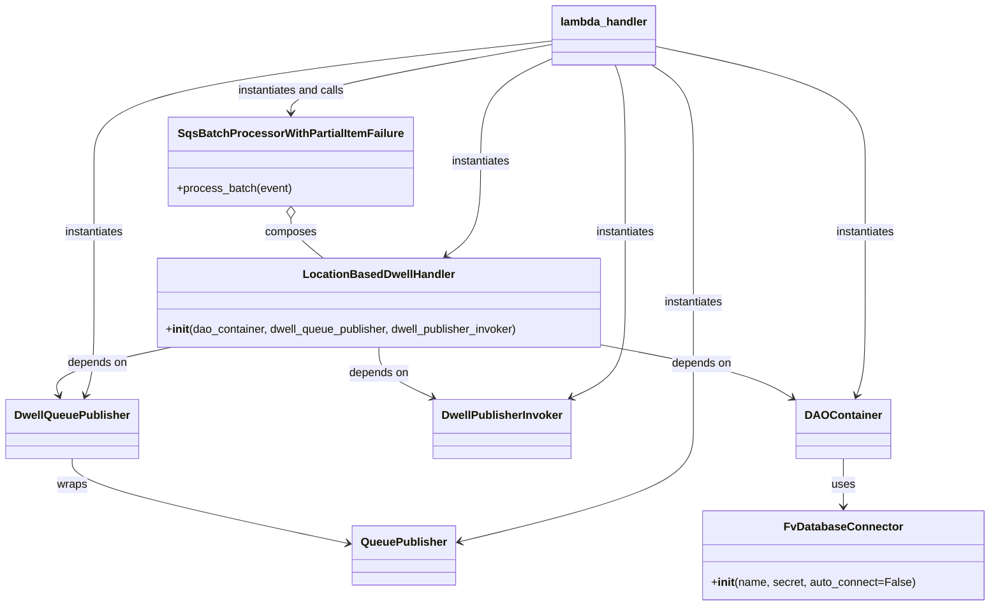
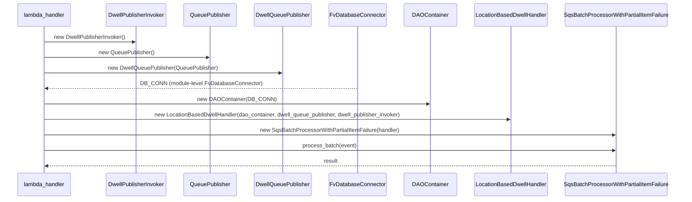

# Diagram: entity_core/entity_service/entity_service/dwell/location_based_dwell/api.py

> Auto-generated by Obscura crawlers

## Diagram 1

### SVG

<svg id="container" width="1390.017578125" xmlns="http://www.w3.org/2000/svg" class="classDiagram" height="858" viewBox="0 0 1390.017578125 858" role="graphics-document document" aria-roledescription="class"><g><defs><marker id="container_class-aggregationStart" class="marker aggregation class" refX="18" refY="7" markerWidth="190" markerHeight="240" orient="auto"><path d="M 18,7 L9,13 L1,7 L9,1 Z"></path></marker></defs><defs><marker id="container_class-aggregationEnd" class="marker aggregation class" refX="1" refY="7" markerWidth="20" markerHeight="28" orient="auto"><path d="M 18,7 L9,13 L1,7 L9,1 Z"></path></marker></defs><defs><marker id="container_class-extensionStart" class="marker extension class" refX="18" refY="7" markerWidth="190" markerHeight="240" orient="auto"><path d="M 1,7 L18,13 V 1 Z"></path></marker></defs><defs><marker id="container_class-extensionEnd" class="marker extension class" refX="1" refY="7" markerWidth="20" markerHeight="28" orient="auto"><path d="M 1,1 V 13 L18,7 Z"></path></marker></defs><defs><marker id="container_class-compositionStart" class="marker composition class" refX="18" refY="7" markerWidth="190" markerHeight="240" orient="auto"><path d="M 18,7 L9,13 L1,7 L9,1 Z"></path></marker></defs><defs><marker id="container_class-compositionEnd" class="marker composition class" refX="1" refY="7" markerWidth="20" markerHeight="28" orient="auto"><path d="M 18,7 L9,13 L1,7 L9,1 Z"></path></marker></defs><defs><marker id="container_class-dependencyStart" class="marker dependency class" refX="6" refY="7" markerWidth="190" markerHeight="240" orient="auto"><path d="M 5,7 L9,13 L1,7 L9,1 Z"></path></marker></defs><defs><marker id="container_class-dependencyEnd" class="marker dependency class" refX="13" refY="7" markerWidth="20" markerHeight="28" orient="auto"><path d="M 18,7 L9,13 L14,7 L9,1 Z"></path></marker></defs><defs><marker id="container_class-lollipopStart" class="marker lollipop class" refX="13" refY="7" markerWidth="190" markerHeight="240" orient="auto"><circle stroke="black" fill="transparent" cx="7" cy="7" r="6"></circle></marker></defs><defs><marker id="container_class-lollipopEnd" class="marker lollipop class" refX="1" refY="7" markerWidth="190" markerHeight="240" orient="auto"><circle stroke="black" fill="transparent" cx="7" cy="7" r="6"></circle></marker></defs><g class="root"><g class="clusters"></g><g class="edgePaths"><path d="M1187.428,650L1187.428,656.167C1187.428,662.333,1187.428,674.667,1187.428,686C1187.428,697.333,1187.428,707.667,1187.428,712.833L1187.428,718" id="id_DAOContainer_FvDatabaseConnector_1" class="edge-thickness-normal edge-pattern-solid relation" style=";;;" data-edge="true" data-et="edge" data-id="id_DAOContainer_FvDatabaseConnector_1" data-points="W3sieCI6MTE4Ny40Mjc3MzQzNzUsInkiOjY1MH0seyJ4IjoxMTg3LjQyNzczNDM3NSwieSI6Njg3fSx7IngiOjExODcuNDI3NzM0Mzc1LCJ5Ijo3MjR9XQ==" marker-end="url(#container_class-dependencyEnd)"></path><path d="M98.555,650L98.555,656.167C98.555,662.333,98.555,674.667,163.673,694.784C228.79,714.902,359.026,742.804,424.144,756.755L489.262,770.706" id="id_DwellQueuePublisher_QueuePublisher_2" class="edge-thickness-normal edge-pattern-solid relation" style=";;;" data-edge="true" data-et="edge" data-id="id_DwellQueuePublisher_QueuePublisher_2" data-points="W3sieCI6OTguNTU0Njg3NSwieSI6NjUwfSx7IngiOjk4LjU1NDY4NzUsInkiOjY4N30seyJ4Ijo0OTUuMTI4OTA2MjUsInkiOjc3MS45NjI4ODQyMzM5NTl9XQ==" marker-end="url(#container_class-dependencyEnd)"></path><path d="M849.828,489.024L885.109,495.687C920.389,502.349,990.951,515.675,1035.887,528.395C1080.823,541.116,1100.135,553.232,1109.791,559.291L1119.447,565.349" id="id_LocationBasedDwellHandler_DAOContainer_3" class="edge-thickness-normal edge-pattern-solid relation" style=";;;" data-edge="true" data-et="edge" data-id="id_LocationBasedDwellHandler_DAOContainer_3" data-points="W3sieCI6ODQ5LjgyODEyNSwieSI6NDg5LjAyNDA0ODU2OTI1Nzd9LHsieCI6MTA2MS41MTE3MTg3NSwieSI6NTI5fSx7IngiOjExMjQuNTI5Mjk2ODc1LCJ5Ijo1NjguNTM3Mzc0NTUyMTEwNH1d" marker-end="url(#container_class-dependencyEnd)"></path><path d="M239.096,492L210.427,498.167C181.758,504.333,124.42,516.667,97.838,528.071C71.255,539.475,75.429,549.951,77.515,555.188L79.602,560.426" id="id_LocationBasedDwellHandler_DwellQueuePublisher_4" class="edge-thickness-normal edge-pattern-solid relation" style=";;;" data-edge="true" data-et="edge" data-id="id_LocationBasedDwellHandler_DwellQueuePublisher_4" data-points="W3sieCI6MjM5LjA5NTg5ODQzNzUsInkiOjQ5Mn0seyJ4Ijo2Ny4wODIwMzEyNSwieSI6NTI5fSx7IngiOjgxLjgyMjM4OTI0MDUwNjMzLCJ5Ijo1NjZ9XQ==" marker-end="url(#container_class-dependencyEnd)"></path><path d="M531.984,492L531.984,498.167C531.984,504.333,531.984,516.667,544.843,528.591C557.702,540.516,583.419,552.032,596.278,557.79L609.136,563.548" id="id_LocationBasedDwellHandler_DwellPublisherInvoker_5" class="edge-thickness-normal edge-pattern-solid relation" style=";;;" data-edge="true" data-et="edge" data-id="id_LocationBasedDwellHandler_DwellPublisherInvoker_5" data-points="W3sieCI6NTMxLjk4NDM3NSwieSI6NDkyfSx7IngiOjUzMS45ODQzNzUsInkiOjUyOX0seyJ4Ijo2MTQuNjEyMzQxNzcyMTUxOSwieSI6NTY2fV0=" marker-end="url(#container_class-dependencyEnd)"></path><path d="M408.488,309.25L408.488,312.542C408.488,315.833,408.488,322.417,416.104,331.875C423.719,341.333,438.951,353.667,446.566,359.833L454.182,366" id="id_SqsBatchProcessorWithPartialItemFailure_LocationBasedDwellHandler_6" class="edge-thickness-normal edge-pattern-solid relation" style=";;;" data-edge="true" data-et="edge" data-id="id_SqsBatchProcessorWithPartialItemFailure_LocationBasedDwellHandler_6" data-points="W3sieCI6NDA4LjQ4ODI4MTI1LCJ5IjoyOTJ9LHsieCI6NDA4LjQ4ODI4MTI1LCJ5IjozMjl9LHsieCI6NDU0LjE4MTgzNTkzNzUsInkiOjM2Nn1d" marker-start="url(#container_class-aggregationStart)"></path><path d="M870.095,92L872.551,98.167C875.006,104.333,879.917,116.667,882.373,139.5C884.828,162.333,884.828,195.667,884.828,229C884.828,262.333,884.828,295.667,884.828,329C884.828,362.333,884.828,395.667,884.828,429C884.828,462.333,884.828,495.667,871.969,518.091C859.111,540.516,833.394,552.032,820.535,557.79L807.676,563.548" id="id_lambda_handler_DwellPublisherInvoker_7" class="edge-thickness-normal edge-pattern-solid relation" style=";;;" data-edge="true" data-et="edge" data-id="id_lambda_handler_DwellPublisherInvoker_7" data-points="W3sieCI6ODcwLjA5NTA4NTA0NzQ2ODQsInkiOjkyfSx7IngiOjg4NC44MjgxMjUsInkiOjEyOX0seyJ4Ijo4ODQuODI4MTI1LCJ5IjoyMjl9LHsieCI6ODg0LjgyODEyNSwieSI6MzI5fSx7IngiOjg4NC44MjgxMjUsInkiOjQyOX0seyJ4Ijo4ODQuODI4MTI1LCJ5Ijo1Mjl9LHsieCI6ODAyLjIwMDE1ODIyNzg0ODEsInkiOjU2Nn1d" marker-end="url(#container_class-dependencyEnd)"></path><path d="M921.272,92L931.242,98.167C941.211,104.333,961.151,116.667,971.12,139.5C981.09,162.333,981.09,195.667,981.09,229C981.09,262.333,981.09,295.667,981.09,329C981.09,362.333,981.09,395.667,981.09,429C981.09,462.333,981.09,495.667,981.09,525.5C981.09,555.333,981.09,581.667,981.09,608C981.09,634.333,981.09,660.667,924.464,687.453C867.839,714.239,754.588,741.477,697.963,755.096L641.338,768.716" id="id_lambda_handler_QueuePublisher_8" class="edge-thickness-normal edge-pattern-solid relation" style=";;;" data-edge="true" data-et="edge" data-id="id_lambda_handler_QueuePublisher_8" data-points="W3sieCI6OTIxLjI3MjIwMTM0NDkzNjcsInkiOjkyfSx7IngiOjk4MS4wODk4NDM3NSwieSI6MTI5fSx7IngiOjk4MS4wODk4NDM3NSwieSI6MjI5fSx7IngiOjk4MS4wODk4NDM3NSwieSI6MzI5fSx7IngiOjk4MS4wODk4NDM3NSwieSI6NDI5fSx7IngiOjk4MS4wODk4NDM3NSwieSI6NTI5fSx7IngiOjk4MS4wODk4NDM3NSwieSI6NjA4fSx7IngiOjk4MS4wODk4NDM3NSwieSI6Njg3fSx7IngiOjYzNS41MDM5MDYyNSwieSI6NzcwLjExODgxMDk1MDk3NjF9XQ==" marker-end="url(#container_class-dependencyEnd)"></path><path d="M781.395,57.861L672.833,69.717C564.272,81.574,347.15,105.287,238.589,133.81C130.027,162.333,130.027,195.667,130.027,229C130.027,262.333,130.027,295.667,130.027,329C130.027,362.333,130.027,395.667,130.027,429C130.027,462.333,130.027,495.667,127.941,517.571C125.854,539.475,121.681,549.951,119.594,555.188L117.508,560.426" id="id_lambda_handler_DwellQueuePublisher_9" class="edge-thickness-normal edge-pattern-solid relation" style=";;;" data-edge="true" data-et="edge" data-id="id_lambda_handler_DwellQueuePublisher_9" data-points="W3sieCI6NzgxLjM5NDUzMTI1LCJ5Ijo1Ny44NjA5MjE1MDE3MDY0ODZ9LHsieCI6MTMwLjAyNzM0Mzc1LCJ5IjoxMjl9LHsieCI6MTMwLjAyNzM0Mzc1LCJ5IjoyMjl9LHsieCI6MTMwLjAyNzM0Mzc1LCJ5IjozMjl9LHsieCI6MTMwLjAyNzM0Mzc1LCJ5Ijo0Mjl9LHsieCI6MTMwLjAyNzM0Mzc1LCJ5Ijo1Mjl9LHsieCI6MTE1LjI4Njk4NTc1OTQ5MzY3LCJ5Ijo1NjZ9XQ==" marker-end="url(#container_class-dependencyEnd)"></path><path d="M925.348,65.556L974.273,76.13C1023.199,86.704,1121.049,107.852,1169.975,135.093C1218.9,162.333,1218.9,195.667,1218.9,229C1218.9,262.333,1218.9,295.667,1218.9,329C1218.9,362.333,1218.9,395.667,1218.9,429C1218.9,462.333,1218.9,495.667,1216.814,517.571C1214.727,539.475,1210.554,549.951,1208.467,555.188L1206.381,560.426" id="id_lambda_handler_DAOContainer_10" class="edge-thickness-normal edge-pattern-solid relation" style=";;;" data-edge="true" data-et="edge" data-id="id_lambda_handler_DAOContainer_10" data-points="W3sieCI6OTI1LjM0NzY1NjI1LCJ5Ijo2NS41NTU5MzA3NzI0Nzc4NH0seyJ4IjoxMjE4LjkwMDM5MDYyNSwieSI6MTI5fSx7IngiOjEyMTguOTAwMzkwNjI1LCJ5IjoyMjl9LHsieCI6MTIxOC45MDAzOTA2MjUsInkiOjMyOX0seyJ4IjoxMjE4LjkwMDM5MDYyNSwieSI6NDI5fSx7IngiOjEyMTguOTAwMzkwNjI1LCJ5Ijo1Mjl9LHsieCI6MTIwNC4xNjAwMzI2MzQ0OTM3LCJ5Ijo1NjZ9XQ==" marker-end="url(#container_class-dependencyEnd)"></path><path d="M781.395,82.23L763.987,90.025C746.579,97.82,711.764,113.41,694.357,137.872C676.949,162.333,676.949,195.667,676.949,229C676.949,262.333,676.949,295.667,668.833,317.932C660.717,340.198,644.484,351.395,636.367,356.994L628.251,362.593" id="id_lambda_handler_LocationBasedDwellHandler_11" class="edge-thickness-normal edge-pattern-solid relation" style=";;;" data-edge="true" data-et="edge" data-id="id_lambda_handler_LocationBasedDwellHandler_11" data-points="W3sieCI6NzgxLjM5NDUzMTI1LCJ5Ijo4Mi4yMzA0MDQ3NDcxNDM3NX0seyJ4Ijo2NzYuOTQ5MjE4NzUsInkiOjEyOX0seyJ4Ijo2NzYuOTQ5MjE4NzUsInkiOjIyOX0seyJ4Ijo2NzYuOTQ5MjE4NzUsInkiOjMyOX0seyJ4Ijo2MjMuMzEyMjI2NTYyNSwieSI6MzY2fV0=" marker-end="url(#container_class-dependencyEnd)"></path><path d="M781.395,62.781L719.243,73.818C657.092,84.854,532.79,106.927,470.639,123.13C408.488,139.333,408.488,149.667,408.488,154.833L408.488,160" id="id_lambda_handler_SqsBatchProcessorWithPartialItemFailure_12" class="edge-thickness-normal edge-pattern-solid relation" style=";;;" data-edge="true" data-et="edge" data-id="id_lambda_handler_SqsBatchProcessorWithPartialItemFailure_12" data-points="W3sieCI6NzgxLjM5NDUzMTI1LCJ5Ijo2Mi43ODEyMjc1MDAyMTk1MX0seyJ4Ijo0MDguNDg4MjgxMjUsInkiOjEyOX0seyJ4Ijo0MDguNDg4MjgxMjUsInkiOjE2Nn1d" marker-end="url(#container_class-dependencyEnd)"></path></g><g class="edgeLabels"><g class="edgeLabel" transform="translate(1187.427734375, 687)"><g class="label" data-id="id_DAOContainer_FvDatabaseConnector_1" transform="translate(-16.4921875, -12)"><foreignObject width="32.984375" height="24">

uses

</foreignObject></g></g><g class="edgeLabel" transform="translate(98.5546875, 687)"><g class="label" data-id="id_DwellQueuePublisher_QueuePublisher_2" transform="translate(-21.390625, -12)"><foreignObject width="42.78125" height="24">

wraps

</foreignObject></g></g><g class="edgeLabel" transform="translate(992.22071, 515.91455)"><g class="label" data-id="id_LocationBasedDwellHandler_DAOContainer_3" transform="translate(-42.9453125, -12)"><foreignObject width="85.890625" height="24">

depends on

</foreignObject></g></g><g class="edgeLabel" transform="translate(133.6202, 514.68771)"><g class="label" data-id="id_LocationBasedDwellHandler_DwellQueuePublisher_4" transform="translate(-42.9453125, -12)"><foreignObject width="85.890625" height="24">

depends on

</foreignObject></g></g><g class="edgeLabel" transform="translate(531.984375, 529)"><g class="label" data-id="id_LocationBasedDwellHandler_DwellPublisherInvoker_5" transform="translate(-42.9453125, -12)"><foreignObject width="85.890625" height="24">

depends on

</foreignObject></g></g><g class="edgeLabel" transform="translate(408.48828125, 329)"><g class="label" data-id="id_SqsBatchProcessorWithPartialItemFailure_LocationBasedDwellHandler_6" transform="translate(-36.453125, -12)"><foreignObject width="72.90625" height="24">

composes

</foreignObject></g></g><g class="edgeLabel" transform="translate(884.828125, 329)"><g class="label" data-id="id_lambda_handler_DwellPublisherInvoker_7" transform="translate(-42.9140625, -12)"><foreignObject width="85.828125" height="24">

instantiates

</foreignObject></g></g><g class="edgeLabel" transform="translate(981.08984375, 429)"><g class="label" data-id="id_lambda_handler_QueuePublisher_8" transform="translate(-42.9140625, -12)"><foreignObject width="85.828125" height="24">

instantiates

</foreignObject></g></g><g class="edgeLabel" transform="translate(130.02734375, 329)"><g class="label" data-id="id_lambda_handler_DwellQueuePublisher_9" transform="translate(-42.9140625, -12)"><foreignObject width="85.828125" height="24">

instantiates

</foreignObject></g></g><g class="edgeLabel" transform="translate(1218.900390625, 329)"><g class="label" data-id="id_lambda_handler_DAOContainer_10" transform="translate(-42.9140625, -12)"><foreignObject width="85.828125" height="24">

instantiates

</foreignObject></g></g><g class="edgeLabel" transform="translate(676.94921875, 229)"><g class="label" data-id="id_lambda_handler_LocationBasedDwellHandler_11" transform="translate(-42.9140625, -12)"><foreignObject width="85.828125" height="24">

instantiates

</foreignObject></g></g><g class="edgeLabel" transform="translate(408.48828125, 129)"><g class="label" data-id="id_lambda_handler_SqsBatchProcessorWithPartialItemFailure_12" transform="translate(-77.421875, -12)"><foreignObject width="154.84375" height="24">

instantiates and calls

</foreignObject></g></g></g><g class="nodes"><g class="node default" id="classId-FvDatabaseConnector-0" transform="translate(1187.427734375, 787)"><g class="basic label-container"><path d="M-194.58984375 -63 L194.58984375 -63 L194.58984375 63 L-194.58984375 63" stroke="none" stroke-width="0" fill="#ECECFF" style=""></path><path d="M-194.58984375 -63 C-113.32694855509496 -63, -32.06405336018992 -63, 194.58984375 -63 M-194.58984375 -63 C-102.1092406607942 -63, -9.6286375715884 -63, 194.58984375 -63 M194.58984375 -63 C194.58984375 -31.668566953661944, 194.58984375 -0.3371339073238886, 194.58984375 63 M194.58984375 -63 C194.58984375 -25.762711776126395, 194.58984375 11.47457644774721, 194.58984375 63 M194.58984375 63 C39.292145594382674 63, -116.00555256123465 63, -194.58984375 63 M194.58984375 63 C59.59256026456828 63, -75.40472322086345 63, -194.58984375 63 M-194.58984375 63 C-194.58984375 28.744985931070715, -194.58984375 -5.510028137858569, -194.58984375 -63 M-194.58984375 63 C-194.58984375 16.75703875363041, -194.58984375 -29.485922492739178, -194.58984375 -63" stroke="#9370DB" stroke-width="1.3" fill="none" stroke-dasharray="0 0" style=""></path></g><g class="annotation-group text" transform="translate(0, -39)"></g><g class="label-group text" transform="translate(-79.3046875, -39)"><g class="label" style="font-weight: bolder" transform="translate(0,-12)"><foreignObject width="158.609375" height="24">

FvDatabaseConnector

</foreignObject></g></g><g class="members-group text" transform="translate(-182.58984375, 9)"></g><g class="methods-group text" transform="translate(-182.58984375, 39)"><g class="label" style="" transform="translate(0,-12)"><foreignObject width="285.875" height="24">

+<strong>init</strong>(name, secret, auto_connect=False)

</foreignObject></g></g><g class="divider" style=""><path d="M-194.58984375 -15 C-74.1442722930618 -15, 46.30129916387639 -15, 194.58984375 -15 M-194.58984375 -15 C-59.765760085339565 -15, 75.05832357932087 -15, 194.58984375 -15" stroke="#9370DB" stroke-width="1.3" fill="none" stroke-dasharray="0 0" style=""></path></g><g class="divider" style=""><path d="M-194.58984375 9 C-66.82956493447877 9, 60.930713881042465 9, 194.58984375 9 M-194.58984375 9 C-89.20214916745189 9, 16.185545415096215 9, 194.58984375 9" stroke="#9370DB" stroke-width="1.3" fill="none" stroke-dasharray="0 0" style=""></path></g></g><g class="node default" id="classId-DAOContainer-1" transform="translate(1187.427734375, 608)"><g class="basic label-container"><path d="M-62.8984375 -42 L62.8984375 -42 L62.8984375 42 L-62.8984375 42" stroke="none" stroke-width="0" fill="#ECECFF" style=""></path><path d="M-62.8984375 -42 C-23.954885528205345 -42, 14.98866644358931 -42, 62.8984375 -42 M-62.8984375 -42 C-14.725914295138473 -42, 33.446608909723054 -42, 62.8984375 -42 M62.8984375 -42 C62.8984375 -21.201177478068338, 62.8984375 -0.4023549561366764, 62.8984375 42 M62.8984375 -42 C62.8984375 -14.386400390082567, 62.8984375 13.227199219834866, 62.8984375 42 M62.8984375 42 C14.551154807007933 42, -33.796127885984134 42, -62.8984375 42 M62.8984375 42 C25.50806155567303 42, -11.882314388653938 42, -62.8984375 42 M-62.8984375 42 C-62.8984375 10.02854050268747, -62.8984375 -21.94291899462506, -62.8984375 -42 M-62.8984375 42 C-62.8984375 21.145347737736245, -62.8984375 0.2906954754724893, -62.8984375 -42" stroke="#9370DB" stroke-width="1.3" fill="none" stroke-dasharray="0 0" style=""></path></g><g class="annotation-group text" transform="translate(0, -18)"></g><g class="label-group text" transform="translate(-50.8984375, -18)"><g class="label" style="font-weight: bolder" transform="translate(0,-12)"><foreignObject width="101.796875" height="24">

DAOContainer

</foreignObject></g></g><g class="members-group text" transform="translate(-50.8984375, 30)"></g><g class="methods-group text" transform="translate(-50.8984375, 60)"></g><g class="divider" style=""><path d="M-62.8984375 6 C-37.70267709598083 6, -12.50691669196167 6, 62.8984375 6 M-62.8984375 6 C-16.484679845534977 6, 29.929077808930046 6, 62.8984375 6" stroke="#9370DB" stroke-width="1.3" fill="none" stroke-dasharray="0 0" style=""></path></g><g class="divider" style=""><path d="M-62.8984375 24 C-37.477812219327284 24, -12.057186938654567 24, 62.8984375 24 M-62.8984375 24 C-17.2291432480851 24, 28.440151003829797 24, 62.8984375 24" stroke="#9370DB" stroke-width="1.3" fill="none" stroke-dasharray="0 0" style=""></path></g></g><g class="node default" id="classId-DwellPublisherInvoker-2" transform="translate(708.40625, 608)"><g class="basic label-container"><path d="M-94.609375 -42 L94.609375 -42 L94.609375 42 L-94.609375 42" stroke="none" stroke-width="0" fill="#ECECFF" style=""></path><path d="M-94.609375 -42 C-54.65271091620054 -42, -14.69604683240108 -42, 94.609375 -42 M-94.609375 -42 C-48.61419657386127 -42, -2.6190181477225423 -42, 94.609375 -42 M94.609375 -42 C94.609375 -20.18250172604214, 94.609375 1.6349965479157191, 94.609375 42 M94.609375 -42 C94.609375 -18.628117119339056, 94.609375 4.743765761321889, 94.609375 42 M94.609375 42 C20.17895861616917 42, -54.25145776766166 42, -94.609375 42 M94.609375 42 C56.066372207039244 42, 17.523369414078488 42, -94.609375 42 M-94.609375 42 C-94.609375 22.579841734301528, -94.609375 3.159683468603056, -94.609375 -42 M-94.609375 42 C-94.609375 8.606565186558818, -94.609375 -24.786869626882364, -94.609375 -42" stroke="#9370DB" stroke-width="1.3" fill="none" stroke-dasharray="0 0" style=""></path></g><g class="annotation-group text" transform="translate(0, -18)"></g><g class="label-group text" transform="translate(-82.609375, -18)"><g class="label" style="font-weight: bolder" transform="translate(0,-12)"><foreignObject width="165.21875" height="24">

DwellPublisherInvoker

</foreignObject></g></g><g class="members-group text" transform="translate(-82.609375, 30)"></g><g class="methods-group text" transform="translate(-82.609375, 60)"></g><g class="divider" style=""><path d="M-94.609375 6 C-53.37960810468325 6, -12.1498412093665 6, 94.609375 6 M-94.609375 6 C-56.08937626315657 6, -17.569377526313147 6, 94.609375 6" stroke="#9370DB" stroke-width="1.3" fill="none" stroke-dasharray="0 0" style=""></path></g><g class="divider" style=""><path d="M-94.609375 24 C-40.95201115348528 24, 12.70535269302944 24, 94.609375 24 M-94.609375 24 C-32.93438399083003 24, 28.740607018339944 24, 94.609375 24" stroke="#9370DB" stroke-width="1.3" fill="none" stroke-dasharray="0 0" style=""></path></g></g><g class="node default" id="classId-QueuePublisher-3" transform="translate(565.31640625, 787)"><g class="basic label-container"><path d="M-70.1875 -42 L70.1875 -42 L70.1875 42 L-70.1875 42" stroke="none" stroke-width="0" fill="#ECECFF" style=""></path><path d="M-70.1875 -42 C-35.88877114241262 -42, -1.5900422848252447 -42, 70.1875 -42 M-70.1875 -42 C-31.357154436008727 -42, 7.473191127982545 -42, 70.1875 -42 M70.1875 -42 C70.1875 -14.415203863010326, 70.1875 13.169592273979347, 70.1875 42 M70.1875 -42 C70.1875 -15.005075345202822, 70.1875 11.989849309594355, 70.1875 42 M70.1875 42 C34.280351676951156 42, -1.626796646097688 42, -70.1875 42 M70.1875 42 C29.987094670458518 42, -10.213310659082964 42, -70.1875 42 M-70.1875 42 C-70.1875 23.596901565280575, -70.1875 5.19380313056115, -70.1875 -42 M-70.1875 42 C-70.1875 18.463233042254156, -70.1875 -5.073533915491687, -70.1875 -42" stroke="#9370DB" stroke-width="1.3" fill="none" stroke-dasharray="0 0" style=""></path></g><g class="annotation-group text" transform="translate(0, -18)"></g><g class="label-group text" transform="translate(-58.1875, -18)"><g class="label" style="font-weight: bolder" transform="translate(0,-12)"><foreignObject width="116.375" height="24">

QueuePublisher

</foreignObject></g></g><g class="members-group text" transform="translate(-58.1875, 30)"></g><g class="methods-group text" transform="translate(-58.1875, 60)"></g><g class="divider" style=""><path d="M-70.1875 6 C-29.783312677253527 6, 10.620874645492947 6, 70.1875 6 M-70.1875 6 C-37.844755984434876 6, -5.502011968869752 6, 70.1875 6" stroke="#9370DB" stroke-width="1.3" fill="none" stroke-dasharray="0 0" style=""></path></g><g class="divider" style=""><path d="M-70.1875 24 C-21.95017867072309 24, 26.28714265855382 24, 70.1875 24 M-70.1875 24 C-32.648733864500755 24, 4.890032270998489 24, 70.1875 24" stroke="#9370DB" stroke-width="1.3" fill="none" stroke-dasharray="0 0" style=""></path></g></g><g class="node default" id="classId-DwellQueuePublisher-4" transform="translate(98.5546875, 608)"><g class="basic label-container"><path d="M-90.5546875 -42 L90.5546875 -42 L90.5546875 42 L-90.5546875 42" stroke="none" stroke-width="0" fill="#ECECFF" style=""></path><path d="M-90.5546875 -42 C-49.56449764492199 -42, -8.574307789843985 -42, 90.5546875 -42 M-90.5546875 -42 C-33.34731544360634 -42, 23.860056612787318 -42, 90.5546875 -42 M90.5546875 -42 C90.5546875 -24.83077104999654, 90.5546875 -7.661542099993078, 90.5546875 42 M90.5546875 -42 C90.5546875 -20.707868788526426, 90.5546875 0.5842624229471483, 90.5546875 42 M90.5546875 42 C38.346680310166 42, -13.861326879667999 42, -90.5546875 42 M90.5546875 42 C49.38721000137595 42, 8.219732502751896 42, -90.5546875 42 M-90.5546875 42 C-90.5546875 12.860979136703271, -90.5546875 -16.278041726593457, -90.5546875 -42 M-90.5546875 42 C-90.5546875 20.692979295571273, -90.5546875 -0.6140414088574531, -90.5546875 -42" stroke="#9370DB" stroke-width="1.3" fill="none" stroke-dasharray="0 0" style=""></path></g><g class="annotation-group text" transform="translate(0, -18)"></g><g class="label-group text" transform="translate(-78.5546875, -18)"><g class="label" style="font-weight: bolder" transform="translate(0,-12)"><foreignObject width="157.109375" height="24">

DwellQueuePublisher

</foreignObject></g></g><g class="members-group text" transform="translate(-78.5546875, 30)"></g><g class="methods-group text" transform="translate(-78.5546875, 60)"></g><g class="divider" style=""><path d="M-90.5546875 6 C-27.071156218855172 6, 36.412375062289655 6, 90.5546875 6 M-90.5546875 6 C-22.66900500102247 6, 45.21667749795506 6, 90.5546875 6" stroke="#9370DB" stroke-width="1.3" fill="none" stroke-dasharray="0 0" style=""></path></g><g class="divider" style=""><path d="M-90.5546875 24 C-27.154133594248776 24, 36.24642031150245 24, 90.5546875 24 M-90.5546875 24 C-51.053508865839326 24, -11.552330231678653 24, 90.5546875 24" stroke="#9370DB" stroke-width="1.3" fill="none" stroke-dasharray="0 0" style=""></path></g></g><g class="node default" id="classId-LocationBasedDwellHandler-5" transform="translate(531.984375, 429)"><g class="basic label-container"><path d="M-317.84375 -63 L317.84375 -63 L317.84375 63 L-317.84375 63" stroke="none" stroke-width="0" fill="#ECECFF" style=""></path><path d="M-317.84375 -63 C-185.84110305660275 -63, -53.838456113205496 -63, 317.84375 -63 M-317.84375 -63 C-161.51703893936806 -63, -5.190327878736127 -63, 317.84375 -63 M317.84375 -63 C317.84375 -21.17949889445738, 317.84375 20.641002211085237, 317.84375 63 M317.84375 -63 C317.84375 -37.672783890460536, 317.84375 -12.34556778092108, 317.84375 63 M317.84375 63 C76.6437822787612 63, -164.5561854424776 63, -317.84375 63 M317.84375 63 C109.01548579294314 63, -99.81277841411372 63, -317.84375 63 M-317.84375 63 C-317.84375 18.41540741370003, -317.84375 -26.16918517259994, -317.84375 -63 M-317.84375 63 C-317.84375 13.682544912241333, -317.84375 -35.634910175517334, -317.84375 -63" stroke="#9370DB" stroke-width="1.3" fill="none" stroke-dasharray="0 0" style=""></path></g><g class="annotation-group text" transform="translate(0, -39)"></g><g class="label-group text" transform="translate(-103.125, -39)"><g class="label" style="font-weight: bolder" transform="translate(0,-12)"><foreignObject width="206.25" height="24">

LocationBasedDwellHandler

</foreignObject></g></g><g class="members-group text" transform="translate(-305.84375, 9)"></g><g class="methods-group text" transform="translate(-305.84375, 39)"><g class="label" style="" transform="translate(0,-12)"><foreignObject width="508.5625" height="24">

+<strong>init</strong>(dao_container, dwell_queue_publisher, dwell_publisher_invoker)

</foreignObject></g></g><g class="divider" style=""><path d="M-317.84375 -15 C-150.41295830360698 -15, 17.01783339278603 -15, 317.84375 -15 M-317.84375 -15 C-186.6090390345222 -15, -55.374328069044395 -15, 317.84375 -15" stroke="#9370DB" stroke-width="1.3" fill="none" stroke-dasharray="0 0" style=""></path></g><g class="divider" style=""><path d="M-317.84375 9 C-112.46138835944208 9, 92.92097328111583 9, 317.84375 9 M-317.84375 9 C-156.27786281454385 9, 5.2880243709122965 9, 317.84375 9" stroke="#9370DB" stroke-width="1.3" fill="none" stroke-dasharray="0 0" style=""></path></g></g><g class="node default" id="classId-SqsBatchProcessorWithPartialItemFailure-6" transform="translate(408.48828125, 229)"><g class="basic label-container"><path d="M-169.078125 -63 L169.078125 -63 L169.078125 63 L-169.078125 63" stroke="none" stroke-width="0" fill="#ECECFF" style=""></path><path d="M-169.078125 -63 C-59.887863682846444 -63, 49.30239763430711 -63, 169.078125 -63 M-169.078125 -63 C-74.72777355139277 -63, 19.622577897214455 -63, 169.078125 -63 M169.078125 -63 C169.078125 -33.64871641167813, 169.078125 -4.29743282335626, 169.078125 63 M169.078125 -63 C169.078125 -31.892411760163263, 169.078125 -0.7848235203265261, 169.078125 63 M169.078125 63 C70.42040983996881 63, -28.237305320062376 63, -169.078125 63 M169.078125 63 C81.22283715498362 63, -6.632450690032755 63, -169.078125 63 M-169.078125 63 C-169.078125 19.032184755143575, -169.078125 -24.93563048971285, -169.078125 -63 M-169.078125 63 C-169.078125 33.54312685264917, -169.078125 4.086253705298347, -169.078125 -63" stroke="#9370DB" stroke-width="1.3" fill="none" stroke-dasharray="0 0" style=""></path></g><g class="annotation-group text" transform="translate(0, -39)"></g><g class="label-group text" transform="translate(-151.46875, -39)"><g class="label" style="font-weight: bolder" transform="translate(0,-12)"><foreignObject width="302.9375" height="24">

SqsBatchProcessorWithPartialItemFailure

</foreignObject></g></g><g class="members-group text" transform="translate(-157.078125, 9)"></g><g class="methods-group text" transform="translate(-157.078125, 39)"><g class="label" style="" transform="translate(0,-12)"><foreignObject width="162.6875" height="24">

+process_batch(event)

</foreignObject></g></g><g class="divider" style=""><path d="M-169.078125 -15 C-65.9043141493411 -15, 37.26949670131779 -15, 169.078125 -15 M-169.078125 -15 C-84.93676024565181 -15, -0.7953954913036227 -15, 169.078125 -15" stroke="#9370DB" stroke-width="1.3" fill="none" stroke-dasharray="0 0" style=""></path></g><g class="divider" style=""><path d="M-169.078125 9 C-90.0220728988256 9, -10.966020797651197 9, 169.078125 9 M-169.078125 9 C-44.247676413209206 9, 80.58277217358159 9, 169.078125 9" stroke="#9370DB" stroke-width="1.3" fill="none" stroke-dasharray="0 0" style=""></path></g></g><g class="node default" id="classId-lambda_handler-7" transform="translate(853.37109375, 50)"><g class="basic label-container"><path d="M-71.9765625 -42 L71.9765625 -42 L71.9765625 42 L-71.9765625 42" stroke="none" stroke-width="0" fill="#ECECFF" style=""></path><path d="M-71.9765625 -42 C-17.38964952993694 -42, 37.19726344012612 -42, 71.9765625 -42 M-71.9765625 -42 C-36.37000800460391 -42, -0.763453509207821 -42, 71.9765625 -42 M71.9765625 -42 C71.9765625 -11.627733801521416, 71.9765625 18.74453239695717, 71.9765625 42 M71.9765625 -42 C71.9765625 -14.865518548866628, 71.9765625 12.268962902266743, 71.9765625 42 M71.9765625 42 C33.15178500793103 42, -5.672992484137936 42, -71.9765625 42 M71.9765625 42 C39.3605693118983 42, 6.744576123796605 42, -71.9765625 42 M-71.9765625 42 C-71.9765625 12.761064226664999, -71.9765625 -16.477871546670002, -71.9765625 -42 M-71.9765625 42 C-71.9765625 21.60373992472719, -71.9765625 1.20747984945438, -71.9765625 -42" stroke="#9370DB" stroke-width="1.3" fill="none" stroke-dasharray="0 0" style=""></path></g><g class="annotation-group text" transform="translate(0, -18)"></g><g class="label-group text" transform="translate(-59.9765625, -18)"><g class="label" style="font-weight: bolder" transform="translate(0,-12)"><foreignObject width="119.953125" height="24">

lambda_handler

</foreignObject></g></g><g class="members-group text" transform="translate(-59.9765625, 30)"></g><g class="methods-group text" transform="translate(-59.9765625, 60)"></g><g class="divider" style=""><path d="M-71.9765625 6 C-14.755895807864391 6, 42.46477088427122 6, 71.9765625 6 M-71.9765625 6 C-35.4292641751926 6, 1.1180341496148003 6, 71.9765625 6" stroke="#9370DB" stroke-width="1.3" fill="none" stroke-dasharray="0 0" style=""></path></g><g class="divider" style=""><path d="M-71.9765625 24 C-31.300052472633283 24, 9.376457554733435 24, 71.9765625 24 M-71.9765625 24 C-42.323805090361844 24, -12.671047680723689 24, 71.9765625 24" stroke="#9370DB" stroke-width="1.3" fill="none" stroke-dasharray="0 0" style=""></path></g></g></g></g></g></svg>

## Diagram 2

### SVG

<svg id="container" width="2039.5" xmlns="http://www.w3.org/2000/svg" height="603" viewBox="-50 -10 2039.5 603" role="graphics-document document" aria-roledescription="sequence"><g><rect x="1621.5" y="517" fill="#eaeaea" stroke="#666" width="318" height="65" name="Processor" rx="3" ry="3" class="actor actor-bottom"></rect><text x="1780.5" y="549.5" dominant-baseline="central" alignment-baseline="central" class="actor actor-box" style="text-anchor: middle; font-size: 16px; font-weight: 400;"><tspan x="1780.5" dy="0">SqsBatchProcessorWithPartialItemFailure</tspan></text></g><g><rect x="1346.5" y="517" fill="#eaeaea" stroke="#666" width="225" height="65" name="Handler" rx="3" ry="3" class="actor actor-bottom"></rect><text x="1459" y="549.5" dominant-baseline="central" alignment-baseline="central" class="actor actor-box" style="text-anchor: middle; font-size: 16px; font-weight: 400;"><tspan x="1459" dy="0">LocationBasedDwellHandler</tspan></text></g><g><rect x="1146.5" y="517" fill="#eaeaea" stroke="#666" width="150" height="65" name="DAO" rx="3" ry="3" class="actor actor-bottom"></rect><text x="1221.5" y="549.5" dominant-baseline="central" alignment-baseline="central" class="actor actor-box" style="text-anchor: middle; font-size: 16px; font-weight: 400;"><tspan x="1221.5" dy="0">DAOContainer</tspan></text></g><g><rect x="919.5" y="517" fill="#eaeaea" stroke="#666" width="177" height="65" name="DB" rx="3" ry="3" class="actor actor-bottom"></rect><text x="1008" y="549.5" dominant-baseline="central" alignment-baseline="central" class="actor actor-box" style="text-anchor: middle; font-size: 16px; font-weight: 400;"><tspan x="1008" dy="0">FvDatabaseConnector</tspan></text></g><g><rect x="693.5" y="517" fill="#eaeaea" stroke="#666" width="176" height="65" name="DQPublisher" rx="3" ry="3" class="actor actor-bottom"></rect><text x="781.5" y="549.5" dominant-baseline="central" alignment-baseline="central" class="actor actor-box" style="text-anchor: middle; font-size: 16px; font-weight: 400;"><tspan x="781.5" dy="0">DwellQueuePublisher</tspan></text></g><g><rect x="493.5" y="517" fill="#eaeaea" stroke="#666" width="150" height="65" name="QPublisher" rx="3" ry="3" class="actor actor-bottom"></rect><text x="568.5" y="549.5" dominant-baseline="central" alignment-baseline="central" class="actor actor-box" style="text-anchor: middle; font-size: 16px; font-weight: 400;"><tspan x="568.5" dy="0">QueuePublisher</tspan></text></g><g><rect x="260.5" y="517" fill="#eaeaea" stroke="#666" width="183" height="65" name="DInvoker" rx="3" ry="3" class="actor actor-bottom"></rect><text x="352" y="549.5" dominant-baseline="central" alignment-baseline="central" class="actor actor-box" style="text-anchor: middle; font-size: 16px; font-weight: 400;"><tspan x="352" dy="0">DwellPublisherInvoker</tspan></text></g><g><rect x="0" y="517" fill="#eaeaea" stroke="#666" width="150" height="65" name="Lambda" rx="3" ry="3" class="actor actor-bottom"></rect><text x="75" y="549.5" dominant-baseline="central" alignment-baseline="central" class="actor actor-box" style="text-anchor: middle; font-size: 16px; font-weight: 400;"><tspan x="75" dy="0">lambda_handler</tspan></text></g><g><line id="actor7" x1="1780.5" y1="65" x2="1780.5" y2="517" class="actor-line 200" stroke-width="0.5px" stroke="#999" name="Processor"></line><g id="root-7"><rect x="1621.5" y="0" fill="#eaeaea" stroke="#666" width="318" height="65" name="Processor" rx="3" ry="3" class="actor actor-top"></rect><text x="1780.5" y="32.5" dominant-baseline="central" alignment-baseline="central" class="actor actor-box" style="text-anchor: middle; font-size: 16px; font-weight: 400;"><tspan x="1780.5" dy="0">SqsBatchProcessorWithPartialItemFailure</tspan></text></g></g><g><line id="actor6" x1="1459" y1="65" x2="1459" y2="517" class="actor-line 200" stroke-width="0.5px" stroke="#999" name="Handler"></line><g id="root-6"><rect x="1346.5" y="0" fill="#eaeaea" stroke="#666" width="225" height="65" name="Handler" rx="3" ry="3" class="actor actor-top"></rect><text x="1459" y="32.5" dominant-baseline="central" alignment-baseline="central" class="actor actor-box" style="text-anchor: middle; font-size: 16px; font-weight: 400;"><tspan x="1459" dy="0">LocationBasedDwellHandler</tspan></text></g></g><g><line id="actor5" x1="1221.5" y1="65" x2="1221.5" y2="517" class="actor-line 200" stroke-width="0.5px" stroke="#999" name="DAO"></line><g id="root-5"><rect x="1146.5" y="0" fill="#eaeaea" stroke="#666" width="150" height="65" name="DAO" rx="3" ry="3" class="actor actor-top"></rect><text x="1221.5" y="32.5" dominant-baseline="central" alignment-baseline="central" class="actor actor-box" style="text-anchor: middle; font-size: 16px; font-weight: 400;"><tspan x="1221.5" dy="0">DAOContainer</tspan></text></g></g><g><line id="actor4" x1="1008" y1="65" x2="1008" y2="517" class="actor-line 200" stroke-width="0.5px" stroke="#999" name="DB"></line><g id="root-4"><rect x="919.5" y="0" fill="#eaeaea" stroke="#666" width="177" height="65" name="DB" rx="3" ry="3" class="actor actor-top"></rect><text x="1008" y="32.5" dominant-baseline="central" alignment-baseline="central" class="actor actor-box" style="text-anchor: middle; font-size: 16px; font-weight: 400;"><tspan x="1008" dy="0">FvDatabaseConnector</tspan></text></g></g><g><line id="actor3" x1="781.5" y1="65" x2="781.5" y2="517" class="actor-line 200" stroke-width="0.5px" stroke="#999" name="DQPublisher"></line><g id="root-3"><rect x="693.5" y="0" fill="#eaeaea" stroke="#666" width="176" height="65" name="DQPublisher" rx="3" ry="3" class="actor actor-top"></rect><text x="781.5" y="32.5" dominant-baseline="central" alignment-baseline="central" class="actor actor-box" style="text-anchor: middle; font-size: 16px; font-weight: 400;"><tspan x="781.5" dy="0">DwellQueuePublisher</tspan></text></g></g><g><line id="actor2" x1="568.5" y1="65" x2="568.5" y2="517" class="actor-line 200" stroke-width="0.5px" stroke="#999" name="QPublisher"></line><g id="root-2"><rect x="493.5" y="0" fill="#eaeaea" stroke="#666" width="150" height="65" name="QPublisher" rx="3" ry="3" class="actor actor-top"></rect><text x="568.5" y="32.5" dominant-baseline="central" alignment-baseline="central" class="actor actor-box" style="text-anchor: middle; font-size: 16px; font-weight: 400;"><tspan x="568.5" dy="0">QueuePublisher</tspan></text></g></g><g><line id="actor1" x1="352" y1="65" x2="352" y2="517" class="actor-line 200" stroke-width="0.5px" stroke="#999" name="DInvoker"></line><g id="root-1"><rect x="260.5" y="0" fill="#eaeaea" stroke="#666" width="183" height="65" name="DInvoker" rx="3" ry="3" class="actor actor-top"></rect><text x="352" y="32.5" dominant-baseline="central" alignment-baseline="central" class="actor actor-box" style="text-anchor: middle; font-size: 16px; font-weight: 400;"><tspan x="352" dy="0">DwellPublisherInvoker</tspan></text></g></g><g><line id="actor0" x1="75" y1="65" x2="75" y2="517" class="actor-line 200" stroke-width="0.5px" stroke="#999" name="Lambda"></line><g id="root-0"><rect x="0" y="0" fill="#eaeaea" stroke="#666" width="150" height="65" name="Lambda" rx="3" ry="3" class="actor actor-top"></rect><text x="75" y="32.5" dominant-baseline="central" alignment-baseline="central" class="actor actor-box" style="text-anchor: middle; font-size: 16px; font-weight: 400;"><tspan x="75" dy="0">lambda_handler</tspan></text></g></g><g></g><defs><symbol id="computer" width="24" height="24"><path transform="scale(.5)" d="M2 2v13h20v-13h-20zm18 11h-16v-9h16v9zm-10.228 6l.466-1h3.524l.467 1h-4.457zm14.228 3h-24l2-6h2.104l-1.33 4h18.45l-1.297-4h2.073l2 6zm-5-10h-14v-7h14v7z"></path></symbol></defs><defs><symbol id="database" fill-rule="evenodd" clip-rule="evenodd"><path transform="scale(.5)" d="M12.258.001l.256.004.255.005.253.008.251.01.249.012.247.015.246.016.242.019.241.02.239.023.236.024.233.027.231.028.229.031.225.032.223.034.22.036.217.038.214.04.211.041.208.043.205.045.201.046.198.048.194.05.191.051.187.053.183.054.18.056.175.057.172.059.168.06.163.061.16.063.155.064.15.066.074.033.073.033.071.034.07.034.069.035.068.035.067.035.066.035.064.036.064.036.062.036.06.036.06.037.058.037.058.037.055.038.055.038.053.038.052.038.051.039.05.039.048.039.047.039.045.04.044.04.043.04.041.04.04.041.039.041.037.041.036.041.034.041.033.042.032.042.03.042.029.042.027.042.026.043.024.043.023.043.021.043.02.043.018.044.017.043.015.044.013.044.012.044.011.045.009.044.007.045.006.045.004.045.002.045.001.045v17l-.001.045-.002.045-.004.045-.006.045-.007.045-.009.044-.011.045-.012.044-.013.044-.015.044-.017.043-.018.044-.02.043-.021.043-.023.043-.024.043-.026.043-.027.042-.029.042-.03.042-.032.042-.033.042-.034.041-.036.041-.037.041-.039.041-.04.041-.041.04-.043.04-.044.04-.045.04-.047.039-.048.039-.05.039-.051.039-.052.038-.053.038-.055.038-.055.038-.058.037-.058.037-.06.037-.06.036-.062.036-.064.036-.064.036-.066.035-.067.035-.068.035-.069.035-.07.034-.071.034-.073.033-.074.033-.15.066-.155.064-.16.063-.163.061-.168.06-.172.059-.175.057-.18.056-.183.054-.187.053-.191.051-.194.05-.198.048-.201.046-.205.045-.208.043-.211.041-.214.04-.217.038-.22.036-.223.034-.225.032-.229.031-.231.028-.233.027-.236.024-.239.023-.241.02-.242.019-.246.016-.247.015-.249.012-.251.01-.253.008-.255.005-.256.004-.258.001-.258-.001-.256-.004-.255-.005-.253-.008-.251-.01-.249-.012-.247-.015-.245-.016-.243-.019-.241-.02-.238-.023-.236-.024-.234-.027-.231-.028-.228-.031-.226-.032-.223-.034-.22-.036-.217-.038-.214-.04-.211-.041-.208-.043-.204-.045-.201-.046-.198-.048-.195-.05-.19-.051-.187-.053-.184-.054-.179-.056-.176-.057-.172-.059-.167-.06-.164-.061-.159-.063-.155-.064-.151-.066-.074-.033-.072-.033-.072-.034-.07-.034-.069-.035-.068-.035-.067-.035-.066-.035-.064-.036-.063-.036-.062-.036-.061-.036-.06-.037-.058-.037-.057-.037-.056-.038-.055-.038-.053-.038-.052-.038-.051-.039-.049-.039-.049-.039-.046-.039-.046-.04-.044-.04-.043-.04-.041-.04-.04-.041-.039-.041-.037-.041-.036-.041-.034-.041-.033-.042-.032-.042-.03-.042-.029-.042-.027-.042-.026-.043-.024-.043-.023-.043-.021-.043-.02-.043-.018-.044-.017-.043-.015-.044-.013-.044-.012-.044-.011-.045-.009-.044-.007-.045-.006-.045-.004-.045-.002-.045-.001-.045v-17l.001-.045.002-.045.004-.045.006-.045.007-.045.009-.044.011-.045.012-.044.013-.044.015-.044.017-.043.018-.044.02-.043.021-.043.023-.043.024-.043.026-.043.027-.042.029-.042.03-.042.032-.042.033-.042.034-.041.036-.041.037-.041.039-.041.04-.041.041-.04.043-.04.044-.04.046-.04.046-.039.049-.039.049-.039.051-.039.052-.038.053-.038.055-.038.056-.038.057-.037.058-.037.06-.037.061-.036.062-.036.063-.036.064-.036.066-.035.067-.035.068-.035.069-.035.07-.034.072-.034.072-.033.074-.033.151-.066.155-.064.159-.063.164-.061.167-.06.172-.059.176-.057.179-.056.184-.054.187-.053.19-.051.195-.05.198-.048.201-.046.204-.045.208-.043.211-.041.214-.04.217-.038.22-.036.223-.034.226-.032.228-.031.231-.028.234-.027.236-.024.238-.023.241-.02.243-.019.245-.016.247-.015.249-.012.251-.01.253-.008.255-.005.256-.004.258-.001.258.001zm-9.258 20.499v.01l.001.021.003.021.004.022.005.021.006.022.007.022.009.023.01.022.011.023.012.023.013.023.015.023.016.024.017.023.018.024.019.024.021.024.022.025.023.024.024.025.052.049.056.05.061.051.066.051.07.051.075.051.079.052.084.052.088.052.092.052.097.052.102.051.105.052.11.052.114.051.119.051.123.051.127.05.131.05.135.05.139.048.144.049.147.047.152.047.155.047.16.045.163.045.167.043.171.043.176.041.178.041.183.039.187.039.19.037.194.035.197.035.202.033.204.031.209.03.212.029.216.027.219.025.222.024.226.021.23.02.233.018.236.016.24.015.243.012.246.01.249.008.253.005.256.004.259.001.26-.001.257-.004.254-.005.25-.008.247-.011.244-.012.241-.014.237-.016.233-.018.231-.021.226-.021.224-.024.22-.026.216-.027.212-.028.21-.031.205-.031.202-.034.198-.034.194-.036.191-.037.187-.039.183-.04.179-.04.175-.042.172-.043.168-.044.163-.045.16-.046.155-.046.152-.047.148-.048.143-.049.139-.049.136-.05.131-.05.126-.05.123-.051.118-.052.114-.051.11-.052.106-.052.101-.052.096-.052.092-.052.088-.053.083-.051.079-.052.074-.052.07-.051.065-.051.06-.051.056-.05.051-.05.023-.024.023-.025.021-.024.02-.024.019-.024.018-.024.017-.024.015-.023.014-.024.013-.023.012-.023.01-.023.01-.022.008-.022.006-.022.006-.022.004-.022.004-.021.001-.021.001-.021v-4.127l-.077.055-.08.053-.083.054-.085.053-.087.052-.09.052-.093.051-.095.05-.097.05-.1.049-.102.049-.105.048-.106.047-.109.047-.111.046-.114.045-.115.045-.118.044-.12.043-.122.042-.124.042-.126.041-.128.04-.13.04-.132.038-.134.038-.135.037-.138.037-.139.035-.142.035-.143.034-.144.033-.147.032-.148.031-.15.03-.151.03-.153.029-.154.027-.156.027-.158.026-.159.025-.161.024-.162.023-.163.022-.165.021-.166.02-.167.019-.169.018-.169.017-.171.016-.173.015-.173.014-.175.013-.175.012-.177.011-.178.01-.179.008-.179.008-.181.006-.182.005-.182.004-.184.003-.184.002h-.37l-.184-.002-.184-.003-.182-.004-.182-.005-.181-.006-.179-.008-.179-.008-.178-.01-.176-.011-.176-.012-.175-.013-.173-.014-.172-.015-.171-.016-.17-.017-.169-.018-.167-.019-.166-.02-.165-.021-.163-.022-.162-.023-.161-.024-.159-.025-.157-.026-.156-.027-.155-.027-.153-.029-.151-.03-.15-.03-.148-.031-.146-.032-.145-.033-.143-.034-.141-.035-.14-.035-.137-.037-.136-.037-.134-.038-.132-.038-.13-.04-.128-.04-.126-.041-.124-.042-.122-.042-.12-.044-.117-.043-.116-.045-.113-.045-.112-.046-.109-.047-.106-.047-.105-.048-.102-.049-.1-.049-.097-.05-.095-.05-.093-.052-.09-.051-.087-.052-.085-.053-.083-.054-.08-.054-.077-.054v4.127zm0-5.654v.011l.001.021.003.021.004.021.005.022.006.022.007.022.009.022.01.022.011.023.012.023.013.023.015.024.016.023.017.024.018.024.019.024.021.024.022.024.023.025.024.024.052.05.056.05.061.05.066.051.07.051.075.052.079.051.084.052.088.052.092.052.097.052.102.052.105.052.11.051.114.051.119.052.123.05.127.051.131.05.135.049.139.049.144.048.147.048.152.047.155.046.16.045.163.045.167.044.171.042.176.042.178.04.183.04.187.038.19.037.194.036.197.034.202.033.204.032.209.03.212.028.216.027.219.025.222.024.226.022.23.02.233.018.236.016.24.014.243.012.246.01.249.008.253.006.256.003.259.001.26-.001.257-.003.254-.006.25-.008.247-.01.244-.012.241-.015.237-.016.233-.018.231-.02.226-.022.224-.024.22-.025.216-.027.212-.029.21-.03.205-.032.202-.033.198-.035.194-.036.191-.037.187-.039.183-.039.179-.041.175-.042.172-.043.168-.044.163-.045.16-.045.155-.047.152-.047.148-.048.143-.048.139-.05.136-.049.131-.05.126-.051.123-.051.118-.051.114-.052.11-.052.106-.052.101-.052.096-.052.092-.052.088-.052.083-.052.079-.052.074-.051.07-.052.065-.051.06-.05.056-.051.051-.049.023-.025.023-.024.021-.025.02-.024.019-.024.018-.024.017-.024.015-.023.014-.023.013-.024.012-.022.01-.023.01-.023.008-.022.006-.022.006-.022.004-.021.004-.022.001-.021.001-.021v-4.139l-.077.054-.08.054-.083.054-.085.052-.087.053-.09.051-.093.051-.095.051-.097.05-.1.049-.102.049-.105.048-.106.047-.109.047-.111.046-.114.045-.115.044-.118.044-.12.044-.122.042-.124.042-.126.041-.128.04-.13.039-.132.039-.134.038-.135.037-.138.036-.139.036-.142.035-.143.033-.144.033-.147.033-.148.031-.15.03-.151.03-.153.028-.154.028-.156.027-.158.026-.159.025-.161.024-.162.023-.163.022-.165.021-.166.02-.167.019-.169.018-.169.017-.171.016-.173.015-.173.014-.175.013-.175.012-.177.011-.178.009-.179.009-.179.007-.181.007-.182.005-.182.004-.184.003-.184.002h-.37l-.184-.002-.184-.003-.182-.004-.182-.005-.181-.007-.179-.007-.179-.009-.178-.009-.176-.011-.176-.012-.175-.013-.173-.014-.172-.015-.171-.016-.17-.017-.169-.018-.167-.019-.166-.02-.165-.021-.163-.022-.162-.023-.161-.024-.159-.025-.157-.026-.156-.027-.155-.028-.153-.028-.151-.03-.15-.03-.148-.031-.146-.033-.145-.033-.143-.033-.141-.035-.14-.036-.137-.036-.136-.037-.134-.038-.132-.039-.13-.039-.128-.04-.126-.041-.124-.042-.122-.043-.12-.043-.117-.044-.116-.044-.113-.046-.112-.046-.109-.046-.106-.047-.105-.048-.102-.049-.1-.049-.097-.05-.095-.051-.093-.051-.09-.051-.087-.053-.085-.052-.083-.054-.08-.054-.077-.054v4.139zm0-5.666v.011l.001.02.003.022.004.021.005.022.006.021.007.022.009.023.01.022.011.023.012.023.013.023.015.023.016.024.017.024.018.023.019.024.021.025.022.024.023.024.024.025.052.05.056.05.061.05.066.051.07.051.075.052.079.051.084.052.088.052.092.052.097.052.102.052.105.051.11.052.114.051.119.051.123.051.127.05.131.05.135.05.139.049.144.048.147.048.152.047.155.046.16.045.163.045.167.043.171.043.176.042.178.04.183.04.187.038.19.037.194.036.197.034.202.033.204.032.209.03.212.028.216.027.219.025.222.024.226.021.23.02.233.018.236.017.24.014.243.012.246.01.249.008.253.006.256.003.259.001.26-.001.257-.003.254-.006.25-.008.247-.01.244-.013.241-.014.237-.016.233-.018.231-.02.226-.022.224-.024.22-.025.216-.027.212-.029.21-.03.205-.032.202-.033.198-.035.194-.036.191-.037.187-.039.183-.039.179-.041.175-.042.172-.043.168-.044.163-.045.16-.045.155-.047.152-.047.148-.048.143-.049.139-.049.136-.049.131-.051.126-.05.123-.051.118-.052.114-.051.11-.052.106-.052.101-.052.096-.052.092-.052.088-.052.083-.052.079-.052.074-.052.07-.051.065-.051.06-.051.056-.05.051-.049.023-.025.023-.025.021-.024.02-.024.019-.024.018-.024.017-.024.015-.023.014-.024.013-.023.012-.023.01-.022.01-.023.008-.022.006-.022.006-.022.004-.022.004-.021.001-.021.001-.021v-4.153l-.077.054-.08.054-.083.053-.085.053-.087.053-.09.051-.093.051-.095.051-.097.05-.1.049-.102.048-.105.048-.106.048-.109.046-.111.046-.114.046-.115.044-.118.044-.12.043-.122.043-.124.042-.126.041-.128.04-.13.039-.132.039-.134.038-.135.037-.138.036-.139.036-.142.034-.143.034-.144.033-.147.032-.148.032-.15.03-.151.03-.153.028-.154.028-.156.027-.158.026-.159.024-.161.024-.162.023-.163.023-.165.021-.166.02-.167.019-.169.018-.169.017-.171.016-.173.015-.173.014-.175.013-.175.012-.177.01-.178.01-.179.009-.179.007-.181.006-.182.006-.182.004-.184.003-.184.001-.185.001-.185-.001-.184-.001-.184-.003-.182-.004-.182-.006-.181-.006-.179-.007-.179-.009-.178-.01-.176-.01-.176-.012-.175-.013-.173-.014-.172-.015-.171-.016-.17-.017-.169-.018-.167-.019-.166-.02-.165-.021-.163-.023-.162-.023-.161-.024-.159-.024-.157-.026-.156-.027-.155-.028-.153-.028-.151-.03-.15-.03-.148-.032-.146-.032-.145-.033-.143-.034-.141-.034-.14-.036-.137-.036-.136-.037-.134-.038-.132-.039-.13-.039-.128-.041-.126-.041-.124-.041-.122-.043-.12-.043-.117-.044-.116-.044-.113-.046-.112-.046-.109-.046-.106-.048-.105-.048-.102-.048-.1-.05-.097-.049-.095-.051-.093-.051-.09-.052-.087-.052-.085-.053-.083-.053-.08-.054-.077-.054v4.153zm8.74-8.179l-.257.004-.254.005-.25.008-.247.011-.244.012-.241.014-.237.016-.233.018-.231.021-.226.022-.224.023-.22.026-.216.027-.212.028-.21.031-.205.032-.202.033-.198.034-.194.036-.191.038-.187.038-.183.04-.179.041-.175.042-.172.043-.168.043-.163.045-.16.046-.155.046-.152.048-.148.048-.143.048-.139.049-.136.05-.131.05-.126.051-.123.051-.118.051-.114.052-.11.052-.106.052-.101.052-.096.052-.092.052-.088.052-.083.052-.079.052-.074.051-.07.052-.065.051-.06.05-.056.05-.051.05-.023.025-.023.024-.021.024-.02.025-.019.024-.018.024-.017.023-.015.024-.014.023-.013.023-.012.023-.01.023-.01.022-.008.022-.006.023-.006.021-.004.022-.004.021-.001.021-.001.021.001.021.001.021.004.021.004.022.006.021.006.023.008.022.01.022.01.023.012.023.013.023.014.023.015.024.017.023.018.024.019.024.02.025.021.024.023.024.023.025.051.05.056.05.06.05.065.051.07.052.074.051.079.052.083.052.088.052.092.052.096.052.101.052.106.052.11.052.114.052.118.051.123.051.126.051.131.05.136.05.139.049.143.048.148.048.152.048.155.046.16.046.163.045.168.043.172.043.175.042.179.041.183.04.187.038.191.038.194.036.198.034.202.033.205.032.21.031.212.028.216.027.22.026.224.023.226.022.231.021.233.018.237.016.241.014.244.012.247.011.25.008.254.005.257.004.26.001.26-.001.257-.004.254-.005.25-.008.247-.011.244-.012.241-.014.237-.016.233-.018.231-.021.226-.022.224-.023.22-.026.216-.027.212-.028.21-.031.205-.032.202-.033.198-.034.194-.036.191-.038.187-.038.183-.04.179-.041.175-.042.172-.043.168-.043.163-.045.16-.046.155-.046.152-.048.148-.048.143-.048.139-.049.136-.05.131-.05.126-.051.123-.051.118-.051.114-.052.11-.052.106-.052.101-.052.096-.052.092-.052.088-.052.083-.052.079-.052.074-.051.07-.052.065-.051.06-.05.056-.05.051-.05.023-.025.023-.024.021-.024.02-.025.019-.024.018-.024.017-.023.015-.024.014-.023.013-.023.012-.023.01-.023.01-.022.008-.022.006-.023.006-.021.004-.022.004-.021.001-.021.001-.021-.001-.021-.001-.021-.004-.021-.004-.022-.006-.021-.006-.023-.008-.022-.01-.022-.01-.023-.012-.023-.013-.023-.014-.023-.015-.024-.017-.023-.018-.024-.019-.024-.02-.025-.021-.024-.023-.024-.023-.025-.051-.05-.056-.05-.06-.05-.065-.051-.07-.052-.074-.051-.079-.052-.083-.052-.088-.052-.092-.052-.096-.052-.101-.052-.106-.052-.11-.052-.114-.052-.118-.051-.123-.051-.126-.051-.131-.05-.136-.05-.139-.049-.143-.048-.148-.048-.152-.048-.155-.046-.16-.046-.163-.045-.168-.043-.172-.043-.175-.042-.179-.041-.183-.04-.187-.038-.191-.038-.194-.036-.198-.034-.202-.033-.205-.032-.21-.031-.212-.028-.216-.027-.22-.026-.224-.023-.226-.022-.231-.021-.233-.018-.237-.016-.241-.014-.244-.012-.247-.011-.25-.008-.254-.005-.257-.004-.26-.001-.26.001z"></path></symbol></defs><defs><symbol id="clock" width="24" height="24"><path transform="scale(.5)" d="M12 2c5.514 0 10 4.486 10 10s-4.486 10-10 10-10-4.486-10-10 4.486-10 10-10zm0-2c-6.627 0-12 5.373-12 12s5.373 12 12 12 12-5.373 12-12-5.373-12-12-12zm5.848 12.459c.202.038.202.333.001.372-1.907.361-6.045 1.111-6.547 1.111-.719 0-1.301-.582-1.301-1.301 0-.512.77-5.447 1.125-7.445.034-.192.312-.181.343.014l.985 6.238 5.394 1.011z"></path></symbol></defs><defs><marker id="arrowhead" refX="7.9" refY="5" markerUnits="userSpaceOnUse" markerWidth="12" markerHeight="12" orient="auto-start-reverse"><path d="M -1 0 L 10 5 L 0 10 z"></path></marker></defs><defs><marker id="crosshead" markerWidth="15" markerHeight="8" orient="auto" refX="4" refY="4.5"><path fill="none" stroke="#000000" stroke-width="1pt" d="M 1,2 L 6,7 M 6,2 L 1,7" style="stroke-dasharray: 0, 0;"></path></marker></defs><defs><marker id="filled-head" refX="15.5" refY="7" markerWidth="20" markerHeight="28" orient="auto"><path d="M 18,7 L9,13 L14,7 L9,1 Z"></path></marker></defs><defs><marker id="sequencenumber" refX="15" refY="15" markerWidth="60" markerHeight="40" orient="auto"><circle cx="15" cy="15" r="6"></circle></marker></defs><text x="212" y="80" text-anchor="middle" dominant-baseline="middle" alignment-baseline="middle" class="messageText" dy="1em" style="font-size: 16px; font-weight: 400;">new DwellPublisherInvoker()</text><line x1="76" y1="113" x2="348" y2="113" class="messageLine0" stroke-width="2" stroke="none" marker-end="url(#arrowhead)" style="fill: none;"></line><text x="320" y="128" text-anchor="middle" dominant-baseline="middle" alignment-baseline="middle" class="messageText" dy="1em" style="font-size: 16px; font-weight: 400;">new QueuePublisher()</text><line x1="76" y1="161" x2="564.5" y2="161" class="messageLine0" stroke-width="2" stroke="none" marker-end="url(#arrowhead)" style="fill: none;"></line><text x="427" y="176" text-anchor="middle" dominant-baseline="middle" alignment-baseline="middle" class="messageText" dy="1em" style="font-size: 16px; font-weight: 400;">new DwellQueuePublisher(QueuePublisher)</text><line x1="76" y1="209" x2="777.5" y2="209" class="messageLine0" stroke-width="2" stroke="none" marker-end="url(#arrowhead)" style="fill: none;"></line><text x="543" y="224" text-anchor="middle" dominant-baseline="middle" alignment-baseline="middle" class="messageText" dy="1em" style="font-size: 16px; font-weight: 400;">DB_CONN (module-level FvDatabaseConnector)</text><line x1="1007" y1="257" x2="79" y2="257" class="messageLine1" stroke-width="2" stroke="none" marker-end="url(#arrowhead)" style="stroke-dasharray: 3, 3; fill: none;"></line><text x="647" y="272" text-anchor="middle" dominant-baseline="middle" alignment-baseline="middle" class="messageText" dy="1em" style="font-size: 16px; font-weight: 400;">new DAOContainer(DB_CONN)</text><line x1="76" y1="305" x2="1217.5" y2="305" class="messageLine0" stroke-width="2" stroke="none" marker-end="url(#arrowhead)" style="fill: none;"></line><text x="766" y="320" text-anchor="middle" dominant-baseline="middle" alignment-baseline="middle" class="messageText" dy="1em" style="font-size: 16px; font-weight: 400;">new LocationBasedDwellHandler(dao_container, dwell_queue_publisher, dwell_publisher_invoker)</text><line x1="76" y1="353" x2="1455" y2="353" class="messageLine0" stroke-width="2" stroke="none" marker-end="url(#arrowhead)" style="fill: none;"></line><text x="926" y="368" text-anchor="middle" dominant-baseline="middle" alignment-baseline="middle" class="messageText" dy="1em" style="font-size: 16px; font-weight: 400;">new SqsBatchProcessorWithPartialItemFailure(handler)</text><line x1="76" y1="401" x2="1776.5" y2="401" class="messageLine0" stroke-width="2" stroke="none" marker-end="url(#arrowhead)" style="fill: none;"></line><text x="926" y="416" text-anchor="middle" dominant-baseline="middle" alignment-baseline="middle" class="messageText" dy="1em" style="font-size: 16px; font-weight: 400;">process_batch(event)</text><line x1="76" y1="449" x2="1776.5" y2="449" class="messageLine0" stroke-width="2" stroke="none" marker-end="url(#arrowhead)" style="fill: none;"></line><text x="929" y="464" text-anchor="middle" dominant-baseline="middle" alignment-baseline="middle" class="messageText" dy="1em" style="font-size: 16px; font-weight: 400;">result</text><line x1="1779.5" y1="497" x2="79" y2="497" class="messageLine1" stroke-width="2" stroke="none" marker-end="url(#arrowhead)" style="stroke-dasharray: 3, 3; fill: none;"></line></svg>
