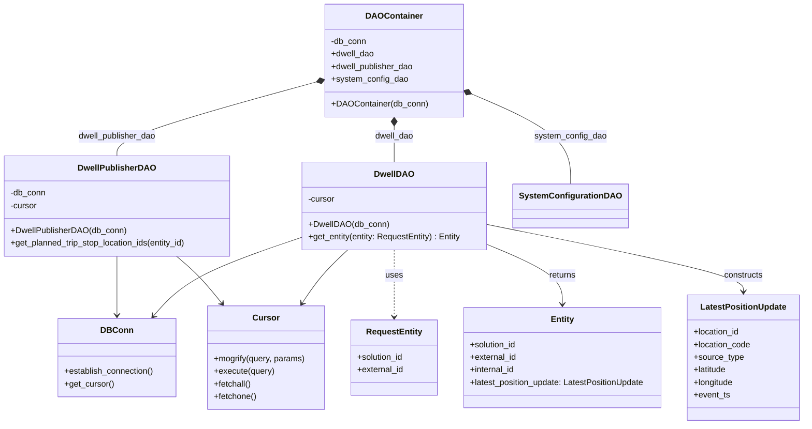
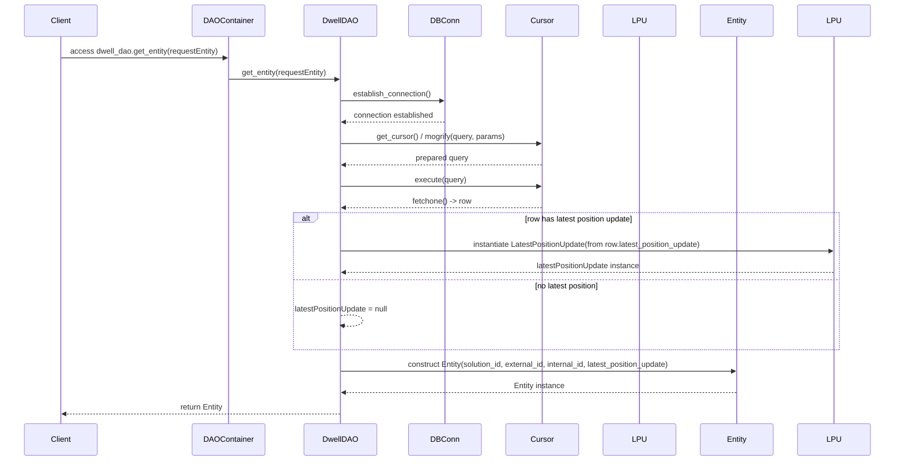

# Diagram: entity_core/entity_service/entity_service/dwell/location_based_dwell/dwell_dao.py

> Auto-generated by Obscura crawlers

## Diagram 1

### SVG

<svg id="container" width="1546.375" xmlns="http://www.w3.org/2000/svg" class="classDiagram" height="812" viewBox="0 0 1546.375 812" role="graphics-document document" aria-roledescription="class"><g><defs><marker id="container_class-aggregationStart" class="marker aggregation class" refX="18" refY="7" markerWidth="190" markerHeight="240" orient="auto"><path d="M 18,7 L9,13 L1,7 L9,1 Z"></path></marker></defs><defs><marker id="container_class-aggregationEnd" class="marker aggregation class" refX="1" refY="7" markerWidth="20" markerHeight="28" orient="auto"><path d="M 18,7 L9,13 L1,7 L9,1 Z"></path></marker></defs><defs><marker id="container_class-extensionStart" class="marker extension class" refX="18" refY="7" markerWidth="190" markerHeight="240" orient="auto"><path d="M 1,7 L18,13 V 1 Z"></path></marker></defs><defs><marker id="container_class-extensionEnd" class="marker extension class" refX="1" refY="7" markerWidth="20" markerHeight="28" orient="auto"><path d="M 1,1 V 13 L18,7 Z"></path></marker></defs><defs><marker id="container_class-compositionStart" class="marker composition class" refX="18" refY="7" markerWidth="190" markerHeight="240" orient="auto"><path d="M 18,7 L9,13 L1,7 L9,1 Z"></path></marker></defs><defs><marker id="container_class-compositionEnd" class="marker composition class" refX="1" refY="7" markerWidth="20" markerHeight="28" orient="auto"><path d="M 18,7 L9,13 L1,7 L9,1 Z"></path></marker></defs><defs><marker id="container_class-dependencyStart" class="marker dependency class" refX="6" refY="7" markerWidth="190" markerHeight="240" orient="auto"><path d="M 5,7 L9,13 L1,7 L9,1 Z"></path></marker></defs><defs><marker id="container_class-dependencyEnd" class="marker dependency class" refX="13" refY="7" markerWidth="20" markerHeight="28" orient="auto"><path d="M 18,7 L9,13 L14,7 L9,1 Z"></path></marker></defs><defs><marker id="container_class-lollipopStart" class="marker lollipop class" refX="13" refY="7" markerWidth="190" markerHeight="240" orient="auto"><circle stroke="black" fill="transparent" cx="7" cy="7" r="6"></circle></marker></defs><defs><marker id="container_class-lollipopEnd" class="marker lollipop class" refX="1" refY="7" markerWidth="190" markerHeight="240" orient="auto"><circle stroke="black" fill="transparent" cx="7" cy="7" r="6"></circle></marker></defs><g class="root"><g class="clusters"></g><g class="edgePaths"><path d="M756.824,241.25L756.824,244.542C756.824,247.833,756.824,254.417,756.824,265.875C756.824,277.333,756.824,293.667,756.824,301.833L756.824,310" id="id_DAOContainer_DwellDAO_1" class="edge-thickness-normal edge-pattern-solid relation" style=";;;" data-edge="true" data-et="edge" data-id="id_DAOContainer_DwellDAO_1" data-points="W3sieCI6NzU2LjgyNDIxODc1LCJ5IjoyMjR9LHsieCI6NzU2LjgyNDIxODc1LCJ5IjoyNjF9LHsieCI6NzU2LjgyNDIxODc1LCJ5IjozMTB9XQ==" marker-start="url(#container_class-compositionStart)"></path><path d="M612.104,155.607L547.921,173.172C483.737,190.738,355.371,225.869,291.187,249.601C227.004,273.333,227.004,285.667,227.004,291.833L227.004,298" id="id_DAOContainer_DwellPublisherDAO_2" class="edge-thickness-normal edge-pattern-solid relation" style=";;;" data-edge="true" data-et="edge" data-id="id_DAOContainer_DwellPublisherDAO_2" data-points="W3sieCI6NjI4Ljc0MjE4NzUsInkiOjE1MS4wNTMxOTQ2MjY3MTYwMn0seyJ4IjoyMjcuMDAzOTA2MjUsInkiOjI2MX0seyJ4IjoyMjcuMDAzOTA2MjUsInkiOjI5OH1d" marker-start="url(#container_class-compositionStart)"></path><path d="M900.705,179.062L931.864,192.718C963.022,206.374,1025.339,233.687,1056.498,262.51C1087.656,291.333,1087.656,321.667,1087.656,336.833L1087.656,352" id="id_DAOContainer_SystemConfigurationDAO_3" class="edge-thickness-normal edge-pattern-solid relation" style=";;;" data-edge="true" data-et="edge" data-id="id_DAOContainer_SystemConfigurationDAO_3" data-points="W3sieCI6ODg0LjkwNjI1LCJ5IjoxNzIuMTM2OTI5ODUyNTI2MTh9LHsieCI6MTA4Ny42NTYyNSwieSI6MjYxfSx7IngiOjEwODcuNjU2MjUsInkiOjM1Mn1d" marker-start="url(#container_class-compositionStart)"></path><path d="M227.004,490L227.004,496.167C227.004,502.333,227.004,514.667,227.004,533.5C227.004,552.333,227.004,577.667,227.004,590.333L227.004,603" id="id_DwellPublisherDAO_DBConn_4" class="edge-thickness-normal edge-pattern-solid relation" style=";;;" data-edge="true" data-et="edge" data-id="id_DwellPublisherDAO_DBConn_4" data-points="W3sieCI6MjI3LjAwMzkwNjI1LCJ5Ijo0OTB9LHsieCI6MjI3LjAwMzkwNjI1LCJ5Ijo1Mjd9LHsieCI6MjI3LjAwMzkwNjI1LCJ5Ijo2MDl9XQ==" marker-end="url(#container_class-dependencyEnd)"></path><path d="M340.681,490L347.983,496.167C355.285,502.333,369.89,514.667,384.411,529.724C398.933,544.781,413.371,562.562,420.591,571.452L427.81,580.342" id="id_DwellPublisherDAO_Cursor_5" class="edge-thickness-normal edge-pattern-solid relation" style=";;;" data-edge="true" data-et="edge" data-id="id_DwellPublisherDAO_Cursor_5" data-points="W3sieCI6MzQwLjY4MTA2NzkwNDEzNTMsInkiOjQ5MH0seyJ4IjozODQuNDk0MTQwNjI1LCJ5Ijo1Mjd9LHsieCI6NDMxLjU5MjQ0Mzc2OTkwNDQzLCJ5Ijo1ODV9XQ==" marker-end="url(#container_class-dependencyEnd)"></path><path d="M579.211,454.211L543.425,466.342C507.639,478.474,436.066,502.737,388.971,527.783C341.875,552.829,319.256,578.657,307.946,591.572L296.637,604.486" id="id_DwellDAO_DBConn_6" class="edge-thickness-normal edge-pattern-solid relation" style=";;;" data-edge="true" data-et="edge" data-id="id_DwellDAO_DBConn_6" data-points="W3sieCI6NTc5LjIxMDkzNzUsInkiOjQ1NC4yMTA5NDkyMDY3MTI3fSx7IngiOjM2NC40OTQxNDA2MjUsInkiOjUyN30seyJ4IjoyOTIuNjgzOTU0NTE4MzEyMTMsInkiOjYwOX1d" marker-end="url(#container_class-dependencyEnd)"></path><path d="M667.983,478L659.345,486.167C650.708,494.333,633.433,510.667,618.934,527.667C604.436,544.667,592.713,562.334,586.852,571.167L580.991,580" id="id_DwellDAO_Cursor_7" class="edge-thickness-normal edge-pattern-solid relation" style=";;;" data-edge="true" data-et="edge" data-id="id_DwellDAO_Cursor_7" data-points="W3sieCI6NjY3Ljk4MjUyNDY3MTA1MjYsInkiOjQ3OH0seyJ4Ijo2MTYuMTU4MjAzMTI1LCJ5Ijo1Mjd9LHsieCI6NTc3LjY3MzYwNDE5OTg0MDcsInkiOjU4NX1d" marker-end="url(#container_class-dependencyEnd)"></path><path d="M756.824,478L756.824,486.167C756.824,494.333,756.824,510.667,756.824,532C756.824,553.333,756.824,579.667,756.824,592.833L756.824,606" id="id_DwellDAO_RequestEntity_8" class="edge-thickness-normal edge-pattern-dashed relation" style=";;;" data-edge="true" data-et="edge" data-id="id_DwellDAO_RequestEntity_8" data-points="W3sieCI6NzU2LjgyNDIxODc1LCJ5Ijo0Nzh9LHsieCI6NzU2LjgyNDIxODc1LCJ5Ijo1Mjd9LHsieCI6NzU2LjgyNDIxODc1LCJ5Ijo2MTJ9XQ==" marker-end="url(#container_class-dependencyEnd)"></path><path d="M934.438,466.579L959.081,476.649C983.724,486.72,1033.01,506.86,1057.654,526.097C1082.297,545.333,1082.297,563.667,1082.297,572.833L1082.297,582" id="id_DwellDAO_Entity_9" class="edge-thickness-normal edge-pattern-solid relation" style=";;;" data-edge="true" data-et="edge" data-id="id_DwellDAO_Entity_9" data-points="W3sieCI6OTM0LjQzNzUsInkiOjQ2Ni41NzkyNjU3MzEzMjgyM30seyJ4IjoxMDgyLjI5Njg3NSwieSI6NTI3fSx7IngiOjEwODIuMjk2ODc1LCJ5Ijo1ODh9XQ==" marker-end="url(#container_class-dependencyEnd)"></path><path d="M934.438,429.003L1017.315,445.336C1100.193,461.668,1265.948,494.334,1348.826,515.834C1431.703,537.333,1431.703,547.667,1431.703,552.833L1431.703,558" id="id_DwellDAO_LatestPositionUpdate_10" class="edge-thickness-normal edge-pattern-solid relation" style=";;;" data-edge="true" data-et="edge" data-id="id_DwellDAO_LatestPositionUpdate_10" data-points="W3sieCI6OTM0LjQzNzUsInkiOjQyOS4wMDI2NzQwOTA4MzgwN30seyJ4IjoxNDMxLjcwMzEyNSwieSI6NTI3fSx7IngiOjE0MzEuNzAzMTI1LCJ5Ijo1NjR9XQ==" marker-end="url(#container_class-dependencyEnd)"></path></g><g class="edgeLabels"><g class="edgeLabel" transform="translate(756.82421875, 261)"><g class="label" data-id="id_DAOContainer_DwellDAO_1" transform="translate(-37.3828125, -12)"><foreignObject width="74.765625" height="24">

dwell_dao

</foreignObject></g></g><g class="edgeLabel" transform="translate(227.00390625, 261)"><g class="label" data-id="id_DAOContainer_DwellPublisherDAO_2" transform="translate(-75.53125, -12)"><foreignObject width="151.0625" height="24">

dwell_publisher_dao

</foreignObject></g></g><g class="edgeLabel" transform="translate(1087.65625, 261)"><g class="label" data-id="id_DAOContainer_SystemConfigurationDAO_3" transform="translate(-68.828125, -12)"><foreignObject width="137.65625" height="24">

system_config_dao

</foreignObject></g></g><g class="edgeLabel"><g class="label" data-id="id_DwellPublisherDAO_DBConn_4" transform="translate(0, 0)"><foreignObject width="0" height="0">

</foreignObject></g></g><g class="edgeLabel"><g class="label" data-id="id_DwellPublisherDAO_Cursor_5" transform="translate(0, 0)"><foreignObject width="0" height="0">

</foreignObject></g></g><g class="edgeLabel"><g class="label" data-id="id_DwellDAO_DBConn_6" transform="translate(0, 0)"><foreignObject width="0" height="0">

</foreignObject></g></g><g class="edgeLabel"><g class="label" data-id="id_DwellDAO_Cursor_7" transform="translate(0, 0)"><foreignObject width="0" height="0">

</foreignObject></g></g><g class="edgeLabel" transform="translate(756.82421875, 527)"><g class="label" data-id="id_DwellDAO_RequestEntity_8" transform="translate(-16.4921875, -12)"><foreignObject width="32.984375" height="24">

uses

</foreignObject></g></g><g class="edgeLabel" transform="translate(1082.296875, 527)"><g class="label" data-id="id_DwellDAO_Entity_9" transform="translate(-26.265625, -12)"><foreignObject width="52.53125" height="24">

returns

</foreignObject></g></g><g class="edgeLabel" transform="translate(1431.703125, 527)"><g class="label" data-id="id_DwellDAO_LatestPositionUpdate_10" transform="translate(-37.84375, -12)"><foreignObject width="75.6875" height="24">

constructs

</foreignObject></g></g></g><g class="nodes"><g class="node default" id="classId-DAOContainer-0" transform="translate(756.82421875, 116)"><g class="basic label-container"><path d="M-128.08203125 -108 L128.08203125 -108 L128.08203125 108 L-128.08203125 108" stroke="none" stroke-width="0" fill="#ECECFF" style=""></path><path d="M-128.08203125 -108 C-29.00480119737115 -108, 70.0724288552577 -108, 128.08203125 -108 M-128.08203125 -108 C-39.90311262711654 -108, 48.275805995766916 -108, 128.08203125 -108 M128.08203125 -108 C128.08203125 -48.5962341446757, 128.08203125 10.807531710648604, 128.08203125 108 M128.08203125 -108 C128.08203125 -31.52634303966515, 128.08203125 44.9473139206697, 128.08203125 108 M128.08203125 108 C75.00174539550198 108, 21.92145954100397 108, -128.08203125 108 M128.08203125 108 C73.1576513406545 108, 18.233271431308978 108, -128.08203125 108 M-128.08203125 108 C-128.08203125 25.049874196603454, -128.08203125 -57.90025160679309, -128.08203125 -108 M-128.08203125 108 C-128.08203125 31.564318121281573, -128.08203125 -44.87136375743685, -128.08203125 -108" stroke="#9370DB" stroke-width="1.3" fill="none" stroke-dasharray="0 0" style=""></path></g><g class="annotation-group text" transform="translate(0, -84)"></g><g class="label-group text" transform="translate(-50.8984375, -84)"><g class="label" style="font-weight: bolder" transform="translate(0,-12)"><foreignObject width="101.796875" height="24">

DAOContainer

</foreignObject></g></g><g class="members-group text" transform="translate(-116.08203125, -36)"><g class="label" style="" transform="translate(0,-12)"><foreignObject width="68.625" height="24">

-db_conn

</foreignObject></g><g class="label" style="" transform="translate(0,12)"><foreignObject width="82.75" height="24">

+dwell_dao

</foreignObject></g><g class="label" style="" transform="translate(0,36)"><foreignObject width="159.046875" height="24">

+dwell_publisher_dao

</foreignObject></g><g class="label" style="" transform="translate(0,60)"><foreignObject width="145.640625" height="24">

+system_config_dao

</foreignObject></g></g><g class="methods-group text" transform="translate(-116.08203125, 84)"><g class="label" style="" transform="translate(0,-12)"><foreignObject width="181.265625" height="24">

+DAOContainer(db_conn)

</foreignObject></g></g><g class="divider" style=""><path d="M-128.08203125 -60 C-40.82108724521676 -60, 46.43985675956648 -60, 128.08203125 -60 M-128.08203125 -60 C-71.9559512235821 -60, -15.829871197164223 -60, 128.08203125 -60" stroke="#9370DB" stroke-width="1.3" fill="none" stroke-dasharray="0 0" style=""></path></g><g class="divider" style=""><path d="M-128.08203125 60 C-72.76417336667109 60, -17.44631548334216 60, 128.08203125 60 M-128.08203125 60 C-62.791540891076124 60, 2.4989494678477513 60, 128.08203125 60" stroke="#9370DB" stroke-width="1.3" fill="none" stroke-dasharray="0 0" style=""></path></g></g><g class="node default" id="classId-DwellPublisherDAO-1" transform="translate(227.00390625, 394)"><g class="basic label-container"><path d="M-219.00390625 -96 L219.00390625 -96 L219.00390625 96 L-219.00390625 96" stroke="none" stroke-width="0" fill="#ECECFF" style=""></path><path d="M-219.00390625 -96 C-72.95198277662058 -96, 73.09994069675884 -96, 219.00390625 -96 M-219.00390625 -96 C-100.8858436129895 -96, 17.232219024020992 -96, 219.00390625 -96 M219.00390625 -96 C219.00390625 -46.710541932883274, 219.00390625 2.5789161342334523, 219.00390625 96 M219.00390625 -96 C219.00390625 -49.817044222837225, 219.00390625 -3.6340884456744504, 219.00390625 96 M219.00390625 96 C63.37116019030677 96, -92.26158586938647 96, -219.00390625 96 M219.00390625 96 C125.98612262972155 96, 32.9683390094431 96, -219.00390625 96 M-219.00390625 96 C-219.00390625 25.00316588853312, -219.00390625 -45.99366822293376, -219.00390625 -96 M-219.00390625 96 C-219.00390625 46.29720103707285, -219.00390625 -3.4055979258542948, -219.00390625 -96" stroke="#9370DB" stroke-width="1.3" fill="none" stroke-dasharray="0 0" style=""></path></g><g class="annotation-group text" transform="translate(0, -72)"></g><g class="label-group text" transform="translate(-70.3515625, -72)"><g class="label" style="font-weight: bolder" transform="translate(0,-12)"><foreignObject width="140.703125" height="24">

DwellPublisherDAO

</foreignObject></g></g><g class="members-group text" transform="translate(-207.00390625, -24)"><g class="label" style="" transform="translate(0,-12)"><foreignObject width="68.625" height="24">

-db_conn

</foreignObject></g><g class="label" style="" transform="translate(0,12)"><foreignObject width="52.1875" height="24">

-cursor

</foreignObject></g></g><g class="methods-group text" transform="translate(-207.00390625, 48)"><g class="label" style="" transform="translate(0,-12)"><foreignObject width="219.25" height="24">

+DwellPublisherDAO(db_conn)

</foreignObject></g><g class="label" style="" transform="translate(0,12)"><foreignObject width="343.65625" height="24">

+get_planned_trip_stop_location_ids(entity_id)

</foreignObject></g></g><g class="divider" style=""><path d="M-219.00390625 -48 C-55.0574789897498 -48, 108.8889482705004 -48, 219.00390625 -48 M-219.00390625 -48 C-108.61066703250232 -48, 1.7825721849953595 -48, 219.00390625 -48" stroke="#9370DB" stroke-width="1.3" fill="none" stroke-dasharray="0 0" style=""></path></g><g class="divider" style=""><path d="M-219.00390625 24 C-115.84567108563664 24, -12.687435921273277 24, 219.00390625 24 M-219.00390625 24 C-118.9097814022465 24, -18.81565655449299 24, 219.00390625 24" stroke="#9370DB" stroke-width="1.3" fill="none" stroke-dasharray="0 0" style=""></path></g></g><g class="node default" id="classId-DwellDAO-2" transform="translate(756.82421875, 394)"><g class="basic label-container"><path d="M-177.61328125 -84 L177.61328125 -84 L177.61328125 84 L-177.61328125 84" stroke="none" stroke-width="0" fill="#ECECFF" style=""></path><path d="M-177.61328125 -84 C-102.65586029047097 -84, -27.698439330941937 -84, 177.61328125 -84 M-177.61328125 -84 C-67.0412151612211 -84, 43.53085092755779 -84, 177.61328125 -84 M177.61328125 -84 C177.61328125 -28.162210324428493, 177.61328125 27.675579351143014, 177.61328125 84 M177.61328125 -84 C177.61328125 -41.163189982738636, 177.61328125 1.6736200345227275, 177.61328125 84 M177.61328125 84 C51.39839571464633 84, -74.81648982070735 84, -177.61328125 84 M177.61328125 84 C53.776311797867535 84, -70.06065765426493 84, -177.61328125 84 M-177.61328125 84 C-177.61328125 23.574691700314673, -177.61328125 -36.85061659937065, -177.61328125 -84 M-177.61328125 84 C-177.61328125 27.554677129951358, -177.61328125 -28.890645740097284, -177.61328125 -84" stroke="#9370DB" stroke-width="1.3" fill="none" stroke-dasharray="0 0" style=""></path></g><g class="annotation-group text" transform="translate(0, -60)"></g><g class="label-group text" transform="translate(-35.6640625, -60)"><g class="label" style="font-weight: bolder" transform="translate(0,-12)"><foreignObject width="71.328125" height="24">

DwellDAO

</foreignObject></g></g><g class="members-group text" transform="translate(-165.61328125, -12)"><g class="label" style="" transform="translate(0,-12)"><foreignObject width="52.1875" height="24">

-cursor

</foreignObject></g></g><g class="methods-group text" transform="translate(-165.61328125, 36)"><g class="label" style="" transform="translate(0,-12)"><foreignObject width="150.625" height="24">

+DwellDAO(db_conn)

</foreignObject></g><g class="label" style="" transform="translate(0,12)"><foreignObject width="295.5625" height="24">

+get_entity(entity: RequestEntity) : Entity

</foreignObject></g></g><g class="divider" style=""><path d="M-177.61328125 -36 C-67.0515749178807 -36, 43.5101314142386 -36, 177.61328125 -36 M-177.61328125 -36 C-94.18593739369055 -36, -10.758593537381103 -36, 177.61328125 -36" stroke="#9370DB" stroke-width="1.3" fill="none" stroke-dasharray="0 0" style=""></path></g><g class="divider" style=""><path d="M-177.61328125 12 C-64.60639775532437 12, 48.40048573935127 12, 177.61328125 12 M-177.61328125 12 C-104.05583644298527 12, -30.498391635970535 12, 177.61328125 12" stroke="#9370DB" stroke-width="1.3" fill="none" stroke-dasharray="0 0" style=""></path></g></g><g class="node default" id="classId-SystemConfigurationDAO-3" transform="translate(1087.65625, 394)"><g class="basic label-container"><path d="M-103.21875 -42 L103.21875 -42 L103.21875 42 L-103.21875 42" stroke="none" stroke-width="0" fill="#ECECFF" style=""></path><path d="M-103.21875 -42 C-45.04892211038653 -42, 13.120905779226945 -42, 103.21875 -42 M-103.21875 -42 C-30.34047080663386 -42, 42.53780838673228 -42, 103.21875 -42 M103.21875 -42 C103.21875 -12.943503884299659, 103.21875 16.112992231400682, 103.21875 42 M103.21875 -42 C103.21875 -9.87371514956429, 103.21875 22.25256970087142, 103.21875 42 M103.21875 42 C20.79095936575503 42, -61.63683126848994 42, -103.21875 42 M103.21875 42 C38.5370592927129 42, -26.144631414574206 42, -103.21875 42 M-103.21875 42 C-103.21875 10.140770685519001, -103.21875 -21.718458628961997, -103.21875 -42 M-103.21875 42 C-103.21875 23.333182560822564, -103.21875 4.6663651216451285, -103.21875 -42" stroke="#9370DB" stroke-width="1.3" fill="none" stroke-dasharray="0 0" style=""></path></g><g class="annotation-group text" transform="translate(0, -18)"></g><g class="label-group text" transform="translate(-91.21875, -18)"><g class="label" style="font-weight: bolder" transform="translate(0,-12)"><foreignObject width="182.4375" height="24">

SystemConfigurationDAO

</foreignObject></g></g><g class="members-group text" transform="translate(-91.21875, 30)"></g><g class="methods-group text" transform="translate(-91.21875, 60)"></g><g class="divider" style=""><path d="M-103.21875 6 C-59.67313025535866 6, -16.127510510717315 6, 103.21875 6 M-103.21875 6 C-24.975552511651657 6, 53.26764497669669 6, 103.21875 6" stroke="#9370DB" stroke-width="1.3" fill="none" stroke-dasharray="0 0" style=""></path></g><g class="divider" style=""><path d="M-103.21875 24 C-29.74029347783656 24, 43.73816304432688 24, 103.21875 24 M-103.21875 24 C-22.68264981018835 24, 57.8534503796233 24, 103.21875 24" stroke="#9370DB" stroke-width="1.3" fill="none" stroke-dasharray="0 0" style=""></path></g></g><g class="node default" id="classId-RequestEntity-4" transform="translate(756.82421875, 684)"><g class="basic label-container"><path d="M-82.73828125 -72 L82.73828125 -72 L82.73828125 72 L-82.73828125 72" stroke="none" stroke-width="0" fill="#ECECFF" style=""></path><path d="M-82.73828125 -72 C-22.49380561783955 -72, 37.7506700143209 -72, 82.73828125 -72 M-82.73828125 -72 C-22.933117223307406 -72, 36.87204680338519 -72, 82.73828125 -72 M82.73828125 -72 C82.73828125 -37.28646212397484, 82.73828125 -2.572924247949686, 82.73828125 72 M82.73828125 -72 C82.73828125 -28.974994140642316, 82.73828125 14.050011718715368, 82.73828125 72 M82.73828125 72 C44.5874445015301 72, 6.436607753060201 72, -82.73828125 72 M82.73828125 72 C20.00787245017174 72, -42.72253634965652 72, -82.73828125 72 M-82.73828125 72 C-82.73828125 38.1002987824905, -82.73828125 4.2005975649809955, -82.73828125 -72 M-82.73828125 72 C-82.73828125 23.011678586073643, -82.73828125 -25.976642827852714, -82.73828125 -72" stroke="#9370DB" stroke-width="1.3" fill="none" stroke-dasharray="0 0" style=""></path></g><g class="annotation-group text" transform="translate(0, -48)"></g><g class="label-group text" transform="translate(-51.2578125, -48)"><g class="label" style="font-weight: bolder" transform="translate(0,-12)"><foreignObject width="102.515625" height="24">

RequestEntity

</foreignObject></g></g><g class="members-group text" transform="translate(-70.73828125, 0)"><g class="label" style="" transform="translate(0,-12)"><foreignObject width="90.21875" height="24">

+solution_id

</foreignObject></g><g class="label" style="" transform="translate(0,12)"><foreignObject width="89.765625" height="24">

+external_id

</foreignObject></g></g><g class="methods-group text" transform="translate(-70.73828125, 72)"></g><g class="divider" style=""><path d="M-82.73828125 -24 C-36.28312506991079 -24, 10.172031110178423 -24, 82.73828125 -24 M-82.73828125 -24 C-29.96720498732708 -24, 22.80387127534584 -24, 82.73828125 -24" stroke="#9370DB" stroke-width="1.3" fill="none" stroke-dasharray="0 0" style=""></path></g><g class="divider" style=""><path d="M-82.73828125 48 C-17.612948834723213 48, 47.512383580553575 48, 82.73828125 48 M-82.73828125 48 C-38.71287850998426 48, 5.312524230031485 48, 82.73828125 48" stroke="#9370DB" stroke-width="1.3" fill="none" stroke-dasharray="0 0" style=""></path></g></g><g class="node default" id="classId-Entity-5" transform="translate(1082.296875, 684)"><g class="basic label-container"><path d="M-192.734375 -96 L192.734375 -96 L192.734375 96 L-192.734375 96" stroke="none" stroke-width="0" fill="#ECECFF" style=""></path><path d="M-192.734375 -96 C-73.33516381135104 -96, 46.064047377297925 -96, 192.734375 -96 M-192.734375 -96 C-114.81856328493858 -96, -36.902751569877154 -96, 192.734375 -96 M192.734375 -96 C192.734375 -28.603901875191212, 192.734375 38.792196249617575, 192.734375 96 M192.734375 -96 C192.734375 -32.68172751191224, 192.734375 30.636544976175514, 192.734375 96 M192.734375 96 C59.30627413082996 96, -74.12182673834008 96, -192.734375 96 M192.734375 96 C115.26933654969322 96, 37.80429809938644 96, -192.734375 96 M-192.734375 96 C-192.734375 36.507632148634784, -192.734375 -22.984735702730433, -192.734375 -96 M-192.734375 96 C-192.734375 33.972473361710456, -192.734375 -28.055053276579088, -192.734375 -96" stroke="#9370DB" stroke-width="1.3" fill="none" stroke-dasharray="0 0" style=""></path></g><g class="annotation-group text" transform="translate(0, -72)"></g><g class="label-group text" transform="translate(-21.28125, -72)"><g class="label" style="font-weight: bolder" transform="translate(0,-12)"><foreignObject width="42.5625" height="24">

Entity

</foreignObject></g></g><g class="members-group text" transform="translate(-180.734375, -24)"><g class="label" style="" transform="translate(0,-12)"><foreignObject width="90.21875" height="24">

+solution_id

</foreignObject></g><g class="label" style="" transform="translate(0,12)"><foreignObject width="89.765625" height="24">

+external_id

</foreignObject></g><g class="label" style="" transform="translate(0,36)"><foreignObject width="87.3125" height="24">

+internal_id

</foreignObject></g><g class="label" style="" transform="translate(0,60)"><foreignObject width="340.1875" height="24">

+latest_position_update: LatestPositionUpdate

</foreignObject></g></g><g class="methods-group text" transform="translate(-180.734375, 96)"></g><g class="divider" style=""><path d="M-192.734375 -48 C-47.259149635639744 -48, 98.21607572872051 -48, 192.734375 -48 M-192.734375 -48 C-106.33444579252395 -48, -19.934516585047902 -48, 192.734375 -48" stroke="#9370DB" stroke-width="1.3" fill="none" stroke-dasharray="0 0" style=""></path></g><g class="divider" style=""><path d="M-192.734375 72 C-55.46098459806592 72, 81.81240580386816 72, 192.734375 72 M-192.734375 72 C-42.73208063158836 72, 107.27021373682328 72, 192.734375 72" stroke="#9370DB" stroke-width="1.3" fill="none" stroke-dasharray="0 0" style=""></path></g></g><g class="node default" id="classId-LatestPositionUpdate-6" transform="translate(1431.703125, 684)"><g class="basic label-container"><path d="M-106.671875 -120 L106.671875 -120 L106.671875 120 L-106.671875 120" stroke="none" stroke-width="0" fill="#ECECFF" style=""></path><path d="M-106.671875 -120 C-40.54043293406498 -120, 25.591009131870038 -120, 106.671875 -120 M-106.671875 -120 C-35.644010837620584 -120, 35.38385332475883 -120, 106.671875 -120 M106.671875 -120 C106.671875 -24.707306970246975, 106.671875 70.58538605950605, 106.671875 120 M106.671875 -120 C106.671875 -57.20209196511512, 106.671875 5.595816069769754, 106.671875 120 M106.671875 120 C22.085539486691843 120, -62.500796026616314 120, -106.671875 120 M106.671875 120 C52.62894591155048 120, -1.4139831768990376 120, -106.671875 120 M-106.671875 120 C-106.671875 65.16864415745151, -106.671875 10.33728831490302, -106.671875 -120 M-106.671875 120 C-106.671875 27.64356043082894, -106.671875 -64.71287913834212, -106.671875 -120" stroke="#9370DB" stroke-width="1.3" fill="none" stroke-dasharray="0 0" style=""></path></g><g class="annotation-group text" transform="translate(0, -96)"></g><g class="label-group text" transform="translate(-79.234375, -96)"><g class="label" style="font-weight: bolder" transform="translate(0,-12)"><foreignObject width="158.46875" height="24">

LatestPositionUpdate

</foreignObject></g></g><g class="members-group text" transform="translate(-94.671875, -48)"><g class="label" style="" transform="translate(0,-12)"><foreignObject width="89.546875" height="24">

+location_id

</foreignObject></g><g class="label" style="" transform="translate(0,12)"><foreignObject width="110.109375" height="24">

+location_code

</foreignObject></g><g class="label" style="" transform="translate(0,36)"><foreignObject width="95.34375" height="24">

+source_type

</foreignObject></g><g class="label" style="" transform="translate(0,60)"><foreignObject width="64.96875" height="24">

+latitude

</foreignObject></g><g class="label" style="" transform="translate(0,84)"><foreignObject width="77.53125" height="24">

+longitude

</foreignObject></g><g class="label" style="" transform="translate(0,108)"><foreignObject width="69.578125" height="24">

+event_ts

</foreignObject></g></g><g class="methods-group text" transform="translate(-94.671875, 120)"></g><g class="divider" style=""><path d="M-106.671875 -72 C-21.74157023908927 -72, 63.18873452182146 -72, 106.671875 -72 M-106.671875 -72 C-36.5589324019366 -72, 33.5540101961268 -72, 106.671875 -72" stroke="#9370DB" stroke-width="1.3" fill="none" stroke-dasharray="0 0" style=""></path></g><g class="divider" style=""><path d="M-106.671875 96 C-52.57247043423957 96, 1.5269341315208607 96, 106.671875 96 M-106.671875 96 C-52.36853677278628 96, 1.9348014544274434 96, 106.671875 96" stroke="#9370DB" stroke-width="1.3" fill="none" stroke-dasharray="0 0" style=""></path></g></g><g class="node default" id="classId-DBConn-7" transform="translate(227.00390625, 684)"><g class="basic label-container"><path d="M-112.87890625 -75 L112.87890625 -75 L112.87890625 75 L-112.87890625 75" stroke="none" stroke-width="0" fill="#ECECFF" style=""></path><path d="M-112.87890625 -75 C-51.38565972414602 -75, 10.107586801707967 -75, 112.87890625 -75 M-112.87890625 -75 C-41.131584773084796 -75, 30.615736703830407 -75, 112.87890625 -75 M112.87890625 -75 C112.87890625 -35.535844518323046, 112.87890625 3.9283109633539084, 112.87890625 75 M112.87890625 -75 C112.87890625 -28.145958633416512, 112.87890625 18.708082733166975, 112.87890625 75 M112.87890625 75 C23.618695496471872 75, -65.64151525705626 75, -112.87890625 75 M112.87890625 75 C59.45852847704114 75, 6.038150704082284 75, -112.87890625 75 M-112.87890625 75 C-112.87890625 42.1881102276302, -112.87890625 9.376220455260395, -112.87890625 -75 M-112.87890625 75 C-112.87890625 33.978677026345196, -112.87890625 -7.042645947309609, -112.87890625 -75" stroke="#9370DB" stroke-width="1.3" fill="none" stroke-dasharray="0 0" style=""></path></g><g class="annotation-group text" transform="translate(0, -51)"></g><g class="label-group text" transform="translate(-28.4921875, -51)"><g class="label" style="font-weight: bolder" transform="translate(0,-12)"><foreignObject width="56.984375" height="24">

DBConn

</foreignObject></g></g><g class="members-group text" transform="translate(-100.87890625, -3)"></g><g class="methods-group text" transform="translate(-100.87890625, 27)"><g class="label" style="" transform="translate(0,-12)"><foreignObject width="173.265625" height="24">

+establish_connection()

</foreignObject></g><g class="label" style="" transform="translate(0,12)"><foreignObject width="94.640625" height="24">

+get_cursor()

</foreignObject></g></g><g class="divider" style=""><path d="M-112.87890625 -27 C-54.112726211354016 -27, 4.653453827291969 -27, 112.87890625 -27 M-112.87890625 -27 C-35.600093125022056 -27, 41.67871999995589 -27, 112.87890625 -27" stroke="#9370DB" stroke-width="1.3" fill="none" stroke-dasharray="0 0" style=""></path></g><g class="divider" style=""><path d="M-112.87890625 -3 C-34.64112260761489 -3, 43.59666103477022 -3, 112.87890625 -3 M-112.87890625 -3 C-43.606841729884636 -3, 25.66522279023073 -3, 112.87890625 -3" stroke="#9370DB" stroke-width="1.3" fill="none" stroke-dasharray="0 0" style=""></path></g></g><g class="node default" id="classId-Cursor-8" transform="translate(511.984375, 684)"><g class="basic label-container"><path d="M-112.1015625 -99 L112.1015625 -99 L112.1015625 99 L-112.1015625 99" stroke="none" stroke-width="0" fill="#ECECFF" style=""></path><path d="M-112.1015625 -99 C-42.28809732830199 -99, 27.525367843396026 -99, 112.1015625 -99 M-112.1015625 -99 C-52.783356273010064 -99, 6.534849953979872 -99, 112.1015625 -99 M112.1015625 -99 C112.1015625 -45.605624768481206, 112.1015625 7.788750463037587, 112.1015625 99 M112.1015625 -99 C112.1015625 -53.51573588699412, 112.1015625 -8.031471773988244, 112.1015625 99 M112.1015625 99 C55.181576481493664 99, -1.7384095370126715 99, -112.1015625 99 M112.1015625 99 C26.92905016800752 99, -58.24346216398496 99, -112.1015625 99 M-112.1015625 99 C-112.1015625 36.130306463171145, -112.1015625 -26.73938707365771, -112.1015625 -99 M-112.1015625 99 C-112.1015625 36.71083255377657, -112.1015625 -25.57833489244686, -112.1015625 -99" stroke="#9370DB" stroke-width="1.3" fill="none" stroke-dasharray="0 0" style=""></path></g><g class="annotation-group text" transform="translate(0, -75)"></g><g class="label-group text" transform="translate(-23.90625, -75)"><g class="label" style="font-weight: bolder" transform="translate(0,-12)"><foreignObject width="47.8125" height="24">

Cursor

</foreignObject></g></g><g class="members-group text" transform="translate(-100.1015625, -27)"></g><g class="methods-group text" transform="translate(-100.1015625, 3)"><g class="label" style="" transform="translate(0,-12)"><foreignObject width="176.296875" height="24">

+mogrify(query, params)

</foreignObject></g><g class="label" style="" transform="translate(0,12)"><foreignObject width="115.96875" height="24">

+execute(query)

</foreignObject></g><g class="label" style="" transform="translate(0,36)"><foreignObject width="72.515625" height="24">

+fetchall()

</foreignObject></g><g class="label" style="" transform="translate(0,60)"><foreignObject width="82.046875" height="24">

+fetchone()

</foreignObject></g></g><g class="divider" style=""><path d="M-112.1015625 -51 C-39.17245665114446 -51, 33.756649197711084 -51, 112.1015625 -51 M-112.1015625 -51 C-54.34316798480298 -51, 3.415226530394037 -51, 112.1015625 -51" stroke="#9370DB" stroke-width="1.3" fill="none" stroke-dasharray="0 0" style=""></path></g><g class="divider" style=""><path d="M-112.1015625 -27 C-32.94134941123724 -27, 46.21886367752552 -27, 112.1015625 -27 M-112.1015625 -27 C-66.44213167981954 -27, -20.78270085963908 -27, 112.1015625 -27" stroke="#9370DB" stroke-width="1.3" fill="none" stroke-dasharray="0 0" style=""></path></g></g></g></g></g></svg>

## Diagram 2

### SVG

<svg id="container" width="1918" xmlns="http://www.w3.org/2000/svg" height="1003" viewBox="-50 -10 1918 1003" role="graphics-document document" aria-roledescription="sequence"><g><rect x="1668" y="917" fill="#eaeaea" stroke="#666" width="150" height="65" name="LPU" rx="3" ry="3" class="actor actor-bottom"></rect><text x="1743" y="949.5" dominant-baseline="central" alignment-baseline="central" class="actor actor-box" style="text-anchor: middle; font-size: 16px; font-weight: 400;"><tspan x="1743" dy="0">LPU</tspan></text></g><g><rect x="1468" y="917" fill="#eaeaea" stroke="#666" width="150" height="65" name="EntityModel" rx="3" ry="3" class="actor actor-bottom"></rect><text x="1543" y="949.5" dominant-baseline="central" alignment-baseline="central" class="actor actor-box" style="text-anchor: middle; font-size: 16px; font-weight: 400;"><tspan x="1543" dy="0">Entity</tspan></text></g><g><rect x="1268" y="917" fill="#eaeaea" stroke="#666" width="150" height="65" name="LatestPositionUpdate" rx="3" ry="3" class="actor actor-bottom"></rect><text x="1343" y="949.5" dominant-baseline="central" alignment-baseline="central" class="actor actor-box" style="text-anchor: middle; font-size: 16px; font-weight: 400;"><tspan x="1343" dy="0">LPU</tspan></text></g><g><rect x="1068" y="917" fill="#eaeaea" stroke="#666" width="150" height="65" name="Cursor" rx="3" ry="3" class="actor actor-bottom"></rect><text x="1143" y="949.5" dominant-baseline="central" alignment-baseline="central" class="actor actor-box" style="text-anchor: middle; font-size: 16px; font-weight: 400;"><tspan x="1143" dy="0">Cursor</tspan></text></g><g><rect x="868" y="917" fill="#eaeaea" stroke="#666" width="150" height="65" name="DBConn" rx="3" ry="3" class="actor actor-bottom"></rect><text x="943" y="949.5" dominant-baseline="central" alignment-baseline="central" class="actor actor-box" style="text-anchor: middle; font-size: 16px; font-weight: 400;"><tspan x="943" dy="0">DBConn</tspan></text></g><g><rect x="629" y="917" fill="#eaeaea" stroke="#666" width="150" height="65" name="DwellDAO" rx="3" ry="3" class="actor actor-bottom"></rect><text x="704" y="949.5" dominant-baseline="central" alignment-baseline="central" class="actor actor-box" style="text-anchor: middle; font-size: 16px; font-weight: 400;"><tspan x="704" dy="0">DwellDAO</tspan></text></g><g><rect x="379" y="917" fill="#eaeaea" stroke="#666" width="150" height="65" name="DAOContainer" rx="3" ry="3" class="actor actor-bottom"></rect><text x="454" y="949.5" dominant-baseline="central" alignment-baseline="central" class="actor actor-box" style="text-anchor: middle; font-size: 16px; font-weight: 400;"><tspan x="454" dy="0">DAOContainer</tspan></text></g><g><rect x="0" y="917" fill="#eaeaea" stroke="#666" width="150" height="65" name="Client" rx="3" ry="3" class="actor actor-bottom"></rect><text x="75" y="949.5" dominant-baseline="central" alignment-baseline="central" class="actor actor-box" style="text-anchor: middle; font-size: 16px; font-weight: 400;"><tspan x="75" dy="0">Client</tspan></text></g><g><line id="actor7" x1="1743" y1="65" x2="1743" y2="917" class="actor-line 200" stroke-width="0.5px" stroke="#999" name="LPU"></line><g id="root-7"><rect x="1668" y="0" fill="#eaeaea" stroke="#666" width="150" height="65" name="LPU" rx="3" ry="3" class="actor actor-top"></rect><text x="1743" y="32.5" dominant-baseline="central" alignment-baseline="central" class="actor actor-box" style="text-anchor: middle; font-size: 16px; font-weight: 400;"><tspan x="1743" dy="0">LPU</tspan></text></g></g><g><line id="actor6" x1="1543" y1="65" x2="1543" y2="917" class="actor-line 200" stroke-width="0.5px" stroke="#999" name="EntityModel"></line><g id="root-6"><rect x="1468" y="0" fill="#eaeaea" stroke="#666" width="150" height="65" name="EntityModel" rx="3" ry="3" class="actor actor-top"></rect><text x="1543" y="32.5" dominant-baseline="central" alignment-baseline="central" class="actor actor-box" style="text-anchor: middle; font-size: 16px; font-weight: 400;"><tspan x="1543" dy="0">Entity</tspan></text></g></g><g><line id="actor5" x1="1343" y1="65" x2="1343" y2="917" class="actor-line 200" stroke-width="0.5px" stroke="#999" name="LatestPositionUpdate"></line><g id="root-5"><rect x="1268" y="0" fill="#eaeaea" stroke="#666" width="150" height="65" name="LatestPositionUpdate" rx="3" ry="3" class="actor actor-top"></rect><text x="1343" y="32.5" dominant-baseline="central" alignment-baseline="central" class="actor actor-box" style="text-anchor: middle; font-size: 16px; font-weight: 400;"><tspan x="1343" dy="0">LPU</tspan></text></g></g><g><line id="actor4" x1="1143" y1="65" x2="1143" y2="917" class="actor-line 200" stroke-width="0.5px" stroke="#999" name="Cursor"></line><g id="root-4"><rect x="1068" y="0" fill="#eaeaea" stroke="#666" width="150" height="65" name="Cursor" rx="3" ry="3" class="actor actor-top"></rect><text x="1143" y="32.5" dominant-baseline="central" alignment-baseline="central" class="actor actor-box" style="text-anchor: middle; font-size: 16px; font-weight: 400;"><tspan x="1143" dy="0">Cursor</tspan></text></g></g><g><line id="actor3" x1="943" y1="65" x2="943" y2="917" class="actor-line 200" stroke-width="0.5px" stroke="#999" name="DBConn"></line><g id="root-3"><rect x="868" y="0" fill="#eaeaea" stroke="#666" width="150" height="65" name="DBConn" rx="3" ry="3" class="actor actor-top"></rect><text x="943" y="32.5" dominant-baseline="central" alignment-baseline="central" class="actor actor-box" style="text-anchor: middle; font-size: 16px; font-weight: 400;"><tspan x="943" dy="0">DBConn</tspan></text></g></g><g><line id="actor2" x1="704" y1="65" x2="704" y2="917" class="actor-line 200" stroke-width="0.5px" stroke="#999" name="DwellDAO"></line><g id="root-2"><rect x="629" y="0" fill="#eaeaea" stroke="#666" width="150" height="65" name="DwellDAO" rx="3" ry="3" class="actor actor-top"></rect><text x="704" y="32.5" dominant-baseline="central" alignment-baseline="central" class="actor actor-box" style="text-anchor: middle; font-size: 16px; font-weight: 400;"><tspan x="704" dy="0">DwellDAO</tspan></text></g></g><g><line id="actor1" x1="454" y1="65" x2="454" y2="917" class="actor-line 200" stroke-width="0.5px" stroke="#999" name="DAOContainer"></line><g id="root-1"><rect x="379" y="0" fill="#eaeaea" stroke="#666" width="150" height="65" name="DAOContainer" rx="3" ry="3" class="actor actor-top"></rect><text x="454" y="32.5" dominant-baseline="central" alignment-baseline="central" class="actor actor-box" style="text-anchor: middle; font-size: 16px; font-weight: 400;"><tspan x="454" dy="0">DAOContainer</tspan></text></g></g><g><line id="actor0" x1="75" y1="65" x2="75" y2="917" class="actor-line 200" stroke-width="0.5px" stroke="#999" name="Client"></line><g id="root-0"><rect x="0" y="0" fill="#eaeaea" stroke="#666" width="150" height="65" name="Client" rx="3" ry="3" class="actor actor-top"></rect><text x="75" y="32.5" dominant-baseline="central" alignment-baseline="central" class="actor actor-box" style="text-anchor: middle; font-size: 16px; font-weight: 400;"><tspan x="75" dy="0">Client</tspan></text></g></g><g></g><defs><symbol id="computer" width="24" height="24"><path transform="scale(.5)" d="M2 2v13h20v-13h-20zm18 11h-16v-9h16v9zm-10.228 6l.466-1h3.524l.467 1h-4.457zm14.228 3h-24l2-6h2.104l-1.33 4h18.45l-1.297-4h2.073l2 6zm-5-10h-14v-7h14v7z"></path></symbol></defs><defs><symbol id="database" fill-rule="evenodd" clip-rule="evenodd"><path transform="scale(.5)" d="M12.258.001l.256.004.255.005.253.008.251.01.249.012.247.015.246.016.242.019.241.02.239.023.236.024.233.027.231.028.229.031.225.032.223.034.22.036.217.038.214.04.211.041.208.043.205.045.201.046.198.048.194.05.191.051.187.053.183.054.18.056.175.057.172.059.168.06.163.061.16.063.155.064.15.066.074.033.073.033.071.034.07.034.069.035.068.035.067.035.066.035.064.036.064.036.062.036.06.036.06.037.058.037.058.037.055.038.055.038.053.038.052.038.051.039.05.039.048.039.047.039.045.04.044.04.043.04.041.04.04.041.039.041.037.041.036.041.034.041.033.042.032.042.03.042.029.042.027.042.026.043.024.043.023.043.021.043.02.043.018.044.017.043.015.044.013.044.012.044.011.045.009.044.007.045.006.045.004.045.002.045.001.045v17l-.001.045-.002.045-.004.045-.006.045-.007.045-.009.044-.011.045-.012.044-.013.044-.015.044-.017.043-.018.044-.02.043-.021.043-.023.043-.024.043-.026.043-.027.042-.029.042-.03.042-.032.042-.033.042-.034.041-.036.041-.037.041-.039.041-.04.041-.041.04-.043.04-.044.04-.045.04-.047.039-.048.039-.05.039-.051.039-.052.038-.053.038-.055.038-.055.038-.058.037-.058.037-.06.037-.06.036-.062.036-.064.036-.064.036-.066.035-.067.035-.068.035-.069.035-.07.034-.071.034-.073.033-.074.033-.15.066-.155.064-.16.063-.163.061-.168.06-.172.059-.175.057-.18.056-.183.054-.187.053-.191.051-.194.05-.198.048-.201.046-.205.045-.208.043-.211.041-.214.04-.217.038-.22.036-.223.034-.225.032-.229.031-.231.028-.233.027-.236.024-.239.023-.241.02-.242.019-.246.016-.247.015-.249.012-.251.01-.253.008-.255.005-.256.004-.258.001-.258-.001-.256-.004-.255-.005-.253-.008-.251-.01-.249-.012-.247-.015-.245-.016-.243-.019-.241-.02-.238-.023-.236-.024-.234-.027-.231-.028-.228-.031-.226-.032-.223-.034-.22-.036-.217-.038-.214-.04-.211-.041-.208-.043-.204-.045-.201-.046-.198-.048-.195-.05-.19-.051-.187-.053-.184-.054-.179-.056-.176-.057-.172-.059-.167-.06-.164-.061-.159-.063-.155-.064-.151-.066-.074-.033-.072-.033-.072-.034-.07-.034-.069-.035-.068-.035-.067-.035-.066-.035-.064-.036-.063-.036-.062-.036-.061-.036-.06-.037-.058-.037-.057-.037-.056-.038-.055-.038-.053-.038-.052-.038-.051-.039-.049-.039-.049-.039-.046-.039-.046-.04-.044-.04-.043-.04-.041-.04-.04-.041-.039-.041-.037-.041-.036-.041-.034-.041-.033-.042-.032-.042-.03-.042-.029-.042-.027-.042-.026-.043-.024-.043-.023-.043-.021-.043-.02-.043-.018-.044-.017-.043-.015-.044-.013-.044-.012-.044-.011-.045-.009-.044-.007-.045-.006-.045-.004-.045-.002-.045-.001-.045v-17l.001-.045.002-.045.004-.045.006-.045.007-.045.009-.044.011-.045.012-.044.013-.044.015-.044.017-.043.018-.044.02-.043.021-.043.023-.043.024-.043.026-.043.027-.042.029-.042.03-.042.032-.042.033-.042.034-.041.036-.041.037-.041.039-.041.04-.041.041-.04.043-.04.044-.04.046-.04.046-.039.049-.039.049-.039.051-.039.052-.038.053-.038.055-.038.056-.038.057-.037.058-.037.06-.037.061-.036.062-.036.063-.036.064-.036.066-.035.067-.035.068-.035.069-.035.07-.034.072-.034.072-.033.074-.033.151-.066.155-.064.159-.063.164-.061.167-.06.172-.059.176-.057.179-.056.184-.054.187-.053.19-.051.195-.05.198-.048.201-.046.204-.045.208-.043.211-.041.214-.04.217-.038.22-.036.223-.034.226-.032.228-.031.231-.028.234-.027.236-.024.238-.023.241-.02.243-.019.245-.016.247-.015.249-.012.251-.01.253-.008.255-.005.256-.004.258-.001.258.001zm-9.258 20.499v.01l.001.021.003.021.004.022.005.021.006.022.007.022.009.023.01.022.011.023.012.023.013.023.015.023.016.024.017.023.018.024.019.024.021.024.022.025.023.024.024.025.052.049.056.05.061.051.066.051.07.051.075.051.079.052.084.052.088.052.092.052.097.052.102.051.105.052.11.052.114.051.119.051.123.051.127.05.131.05.135.05.139.048.144.049.147.047.152.047.155.047.16.045.163.045.167.043.171.043.176.041.178.041.183.039.187.039.19.037.194.035.197.035.202.033.204.031.209.03.212.029.216.027.219.025.222.024.226.021.23.02.233.018.236.016.24.015.243.012.246.01.249.008.253.005.256.004.259.001.26-.001.257-.004.254-.005.25-.008.247-.011.244-.012.241-.014.237-.016.233-.018.231-.021.226-.021.224-.024.22-.026.216-.027.212-.028.21-.031.205-.031.202-.034.198-.034.194-.036.191-.037.187-.039.183-.04.179-.04.175-.042.172-.043.168-.044.163-.045.16-.046.155-.046.152-.047.148-.048.143-.049.139-.049.136-.05.131-.05.126-.05.123-.051.118-.052.114-.051.11-.052.106-.052.101-.052.096-.052.092-.052.088-.053.083-.051.079-.052.074-.052.07-.051.065-.051.06-.051.056-.05.051-.05.023-.024.023-.025.021-.024.02-.024.019-.024.018-.024.017-.024.015-.023.014-.024.013-.023.012-.023.01-.023.01-.022.008-.022.006-.022.006-.022.004-.022.004-.021.001-.021.001-.021v-4.127l-.077.055-.08.053-.083.054-.085.053-.087.052-.09.052-.093.051-.095.05-.097.05-.1.049-.102.049-.105.048-.106.047-.109.047-.111.046-.114.045-.115.045-.118.044-.12.043-.122.042-.124.042-.126.041-.128.04-.13.04-.132.038-.134.038-.135.037-.138.037-.139.035-.142.035-.143.034-.144.033-.147.032-.148.031-.15.03-.151.03-.153.029-.154.027-.156.027-.158.026-.159.025-.161.024-.162.023-.163.022-.165.021-.166.02-.167.019-.169.018-.169.017-.171.016-.173.015-.173.014-.175.013-.175.012-.177.011-.178.01-.179.008-.179.008-.181.006-.182.005-.182.004-.184.003-.184.002h-.37l-.184-.002-.184-.003-.182-.004-.182-.005-.181-.006-.179-.008-.179-.008-.178-.01-.176-.011-.176-.012-.175-.013-.173-.014-.172-.015-.171-.016-.17-.017-.169-.018-.167-.019-.166-.02-.165-.021-.163-.022-.162-.023-.161-.024-.159-.025-.157-.026-.156-.027-.155-.027-.153-.029-.151-.03-.15-.03-.148-.031-.146-.032-.145-.033-.143-.034-.141-.035-.14-.035-.137-.037-.136-.037-.134-.038-.132-.038-.13-.04-.128-.04-.126-.041-.124-.042-.122-.042-.12-.044-.117-.043-.116-.045-.113-.045-.112-.046-.109-.047-.106-.047-.105-.048-.102-.049-.1-.049-.097-.05-.095-.05-.093-.052-.09-.051-.087-.052-.085-.053-.083-.054-.08-.054-.077-.054v4.127zm0-5.654v.011l.001.021.003.021.004.021.005.022.006.022.007.022.009.022.01.022.011.023.012.023.013.023.015.024.016.023.017.024.018.024.019.024.021.024.022.024.023.025.024.024.052.05.056.05.061.05.066.051.07.051.075.052.079.051.084.052.088.052.092.052.097.052.102.052.105.052.11.051.114.051.119.052.123.05.127.051.131.05.135.049.139.049.144.048.147.048.152.047.155.046.16.045.163.045.167.044.171.042.176.042.178.04.183.04.187.038.19.037.194.036.197.034.202.033.204.032.209.03.212.028.216.027.219.025.222.024.226.022.23.02.233.018.236.016.24.014.243.012.246.01.249.008.253.006.256.003.259.001.26-.001.257-.003.254-.006.25-.008.247-.01.244-.012.241-.015.237-.016.233-.018.231-.02.226-.022.224-.024.22-.025.216-.027.212-.029.21-.03.205-.032.202-.033.198-.035.194-.036.191-.037.187-.039.183-.039.179-.041.175-.042.172-.043.168-.044.163-.045.16-.045.155-.047.152-.047.148-.048.143-.048.139-.05.136-.049.131-.05.126-.051.123-.051.118-.051.114-.052.11-.052.106-.052.101-.052.096-.052.092-.052.088-.052.083-.052.079-.052.074-.051.07-.052.065-.051.06-.05.056-.051.051-.049.023-.025.023-.024.021-.025.02-.024.019-.024.018-.024.017-.024.015-.023.014-.023.013-.024.012-.022.01-.023.01-.023.008-.022.006-.022.006-.022.004-.021.004-.022.001-.021.001-.021v-4.139l-.077.054-.08.054-.083.054-.085.052-.087.053-.09.051-.093.051-.095.051-.097.05-.1.049-.102.049-.105.048-.106.047-.109.047-.111.046-.114.045-.115.044-.118.044-.12.044-.122.042-.124.042-.126.041-.128.04-.13.039-.132.039-.134.038-.135.037-.138.036-.139.036-.142.035-.143.033-.144.033-.147.033-.148.031-.15.03-.151.03-.153.028-.154.028-.156.027-.158.026-.159.025-.161.024-.162.023-.163.022-.165.021-.166.02-.167.019-.169.018-.169.017-.171.016-.173.015-.173.014-.175.013-.175.012-.177.011-.178.009-.179.009-.179.007-.181.007-.182.005-.182.004-.184.003-.184.002h-.37l-.184-.002-.184-.003-.182-.004-.182-.005-.181-.007-.179-.007-.179-.009-.178-.009-.176-.011-.176-.012-.175-.013-.173-.014-.172-.015-.171-.016-.17-.017-.169-.018-.167-.019-.166-.02-.165-.021-.163-.022-.162-.023-.161-.024-.159-.025-.157-.026-.156-.027-.155-.028-.153-.028-.151-.03-.15-.03-.148-.031-.146-.033-.145-.033-.143-.033-.141-.035-.14-.036-.137-.036-.136-.037-.134-.038-.132-.039-.13-.039-.128-.04-.126-.041-.124-.042-.122-.043-.12-.043-.117-.044-.116-.044-.113-.046-.112-.046-.109-.046-.106-.047-.105-.048-.102-.049-.1-.049-.097-.05-.095-.051-.093-.051-.09-.051-.087-.053-.085-.052-.083-.054-.08-.054-.077-.054v4.139zm0-5.666v.011l.001.02.003.022.004.021.005.022.006.021.007.022.009.023.01.022.011.023.012.023.013.023.015.023.016.024.017.024.018.023.019.024.021.025.022.024.023.024.024.025.052.05.056.05.061.05.066.051.07.051.075.052.079.051.084.052.088.052.092.052.097.052.102.052.105.051.11.052.114.051.119.051.123.051.127.05.131.05.135.05.139.049.144.048.147.048.152.047.155.046.16.045.163.045.167.043.171.043.176.042.178.04.183.04.187.038.19.037.194.036.197.034.202.033.204.032.209.03.212.028.216.027.219.025.222.024.226.021.23.02.233.018.236.017.24.014.243.012.246.01.249.008.253.006.256.003.259.001.26-.001.257-.003.254-.006.25-.008.247-.01.244-.013.241-.014.237-.016.233-.018.231-.02.226-.022.224-.024.22-.025.216-.027.212-.029.21-.03.205-.032.202-.033.198-.035.194-.036.191-.037.187-.039.183-.039.179-.041.175-.042.172-.043.168-.044.163-.045.16-.045.155-.047.152-.047.148-.048.143-.049.139-.049.136-.049.131-.051.126-.05.123-.051.118-.052.114-.051.11-.052.106-.052.101-.052.096-.052.092-.052.088-.052.083-.052.079-.052.074-.052.07-.051.065-.051.06-.051.056-.05.051-.049.023-.025.023-.025.021-.024.02-.024.019-.024.018-.024.017-.024.015-.023.014-.024.013-.023.012-.023.01-.022.01-.023.008-.022.006-.022.006-.022.004-.022.004-.021.001-.021.001-.021v-4.153l-.077.054-.08.054-.083.053-.085.053-.087.053-.09.051-.093.051-.095.051-.097.05-.1.049-.102.048-.105.048-.106.048-.109.046-.111.046-.114.046-.115.044-.118.044-.12.043-.122.043-.124.042-.126.041-.128.04-.13.039-.132.039-.134.038-.135.037-.138.036-.139.036-.142.034-.143.034-.144.033-.147.032-.148.032-.15.03-.151.03-.153.028-.154.028-.156.027-.158.026-.159.024-.161.024-.162.023-.163.023-.165.021-.166.02-.167.019-.169.018-.169.017-.171.016-.173.015-.173.014-.175.013-.175.012-.177.01-.178.01-.179.009-.179.007-.181.006-.182.006-.182.004-.184.003-.184.001-.185.001-.185-.001-.184-.001-.184-.003-.182-.004-.182-.006-.181-.006-.179-.007-.179-.009-.178-.01-.176-.01-.176-.012-.175-.013-.173-.014-.172-.015-.171-.016-.17-.017-.169-.018-.167-.019-.166-.02-.165-.021-.163-.023-.162-.023-.161-.024-.159-.024-.157-.026-.156-.027-.155-.028-.153-.028-.151-.03-.15-.03-.148-.032-.146-.032-.145-.033-.143-.034-.141-.034-.14-.036-.137-.036-.136-.037-.134-.038-.132-.039-.13-.039-.128-.041-.126-.041-.124-.041-.122-.043-.12-.043-.117-.044-.116-.044-.113-.046-.112-.046-.109-.046-.106-.048-.105-.048-.102-.048-.1-.05-.097-.049-.095-.051-.093-.051-.09-.052-.087-.052-.085-.053-.083-.053-.08-.054-.077-.054v4.153zm8.74-8.179l-.257.004-.254.005-.25.008-.247.011-.244.012-.241.014-.237.016-.233.018-.231.021-.226.022-.224.023-.22.026-.216.027-.212.028-.21.031-.205.032-.202.033-.198.034-.194.036-.191.038-.187.038-.183.04-.179.041-.175.042-.172.043-.168.043-.163.045-.16.046-.155.046-.152.048-.148.048-.143.048-.139.049-.136.05-.131.05-.126.051-.123.051-.118.051-.114.052-.11.052-.106.052-.101.052-.096.052-.092.052-.088.052-.083.052-.079.052-.074.051-.07.052-.065.051-.06.05-.056.05-.051.05-.023.025-.023.024-.021.024-.02.025-.019.024-.018.024-.017.023-.015.024-.014.023-.013.023-.012.023-.01.023-.01.022-.008.022-.006.023-.006.021-.004.022-.004.021-.001.021-.001.021.001.021.001.021.004.021.004.022.006.021.006.023.008.022.01.022.01.023.012.023.013.023.014.023.015.024.017.023.018.024.019.024.02.025.021.024.023.024.023.025.051.05.056.05.06.05.065.051.07.052.074.051.079.052.083.052.088.052.092.052.096.052.101.052.106.052.11.052.114.052.118.051.123.051.126.051.131.05.136.05.139.049.143.048.148.048.152.048.155.046.16.046.163.045.168.043.172.043.175.042.179.041.183.04.187.038.191.038.194.036.198.034.202.033.205.032.21.031.212.028.216.027.22.026.224.023.226.022.231.021.233.018.237.016.241.014.244.012.247.011.25.008.254.005.257.004.26.001.26-.001.257-.004.254-.005.25-.008.247-.011.244-.012.241-.014.237-.016.233-.018.231-.021.226-.022.224-.023.22-.026.216-.027.212-.028.21-.031.205-.032.202-.033.198-.034.194-.036.191-.038.187-.038.183-.04.179-.041.175-.042.172-.043.168-.043.163-.045.16-.046.155-.046.152-.048.148-.048.143-.048.139-.049.136-.05.131-.05.126-.051.123-.051.118-.051.114-.052.11-.052.106-.052.101-.052.096-.052.092-.052.088-.052.083-.052.079-.052.074-.051.07-.052.065-.051.06-.05.056-.05.051-.05.023-.025.023-.024.021-.024.02-.025.019-.024.018-.024.017-.023.015-.024.014-.023.013-.023.012-.023.01-.023.01-.022.008-.022.006-.023.006-.021.004-.022.004-.021.001-.021.001-.021-.001-.021-.001-.021-.004-.021-.004-.022-.006-.021-.006-.023-.008-.022-.01-.022-.01-.023-.012-.023-.013-.023-.014-.023-.015-.024-.017-.023-.018-.024-.019-.024-.02-.025-.021-.024-.023-.024-.023-.025-.051-.05-.056-.05-.06-.05-.065-.051-.07-.052-.074-.051-.079-.052-.083-.052-.088-.052-.092-.052-.096-.052-.101-.052-.106-.052-.11-.052-.114-.052-.118-.051-.123-.051-.126-.051-.131-.05-.136-.05-.139-.049-.143-.048-.148-.048-.152-.048-.155-.046-.16-.046-.163-.045-.168-.043-.172-.043-.175-.042-.179-.041-.183-.04-.187-.038-.191-.038-.194-.036-.198-.034-.202-.033-.205-.032-.21-.031-.212-.028-.216-.027-.22-.026-.224-.023-.226-.022-.231-.021-.233-.018-.237-.016-.241-.014-.244-.012-.247-.011-.25-.008-.254-.005-.257-.004-.26-.001-.26.001z"></path></symbol></defs><defs><symbol id="clock" width="24" height="24"><path transform="scale(.5)" d="M12 2c5.514 0 10 4.486 10 10s-4.486 10-10 10-10-4.486-10-10 4.486-10 10-10zm0-2c-6.627 0-12 5.373-12 12s5.373 12 12 12 12-5.373 12-12-5.373-12-12-12zm5.848 12.459c.202.038.202.333.001.372-1.907.361-6.045 1.111-6.547 1.111-.719 0-1.301-.582-1.301-1.301 0-.512.77-5.447 1.125-7.445.034-.192.312-.181.343.014l.985 6.238 5.394 1.011z"></path></symbol></defs><defs><marker id="arrowhead" refX="7.9" refY="5" markerUnits="userSpaceOnUse" markerWidth="12" markerHeight="12" orient="auto-start-reverse"><path d="M -1 0 L 10 5 L 0 10 z"></path></marker></defs><defs><marker id="crosshead" markerWidth="15" markerHeight="8" orient="auto" refX="4" refY="4.5"><path fill="none" stroke="#000000" stroke-width="1pt" d="M 1,2 L 6,7 M 6,2 L 1,7" style="stroke-dasharray: 0, 0;"></path></marker></defs><defs><marker id="filled-head" refX="15.5" refY="7" markerWidth="20" markerHeight="28" orient="auto"><path d="M 18,7 L9,13 L14,7 L9,1 Z"></path></marker></defs><defs><marker id="sequencenumber" refX="15" refY="15" markerWidth="60" markerHeight="40" orient="auto"><circle cx="15" cy="15" r="6"></circle></marker></defs><g><line x1="596.5" y1="459" x2="1754" y2="459" class="loopLine"></line><line x1="1754" y1="459" x2="1754" y2="753" class="loopLine"></line><line x1="596.5" y1="753" x2="1754" y2="753" class="loopLine"></line><line x1="596.5" y1="459" x2="596.5" y2="753" class="loopLine"></line><line x1="596.5" y1="605" x2="1754" y2="605" class="loopLine" style="stroke-dasharray: 3, 3;"></line><polygon points="596.5,459 646.5,459 646.5,472 638.1,479 596.5,479" class="labelBox"></polygon><text x="622" y="472" text-anchor="middle" dominant-baseline="middle" alignment-baseline="middle" class="labelText" style="font-size: 16px; font-weight: 400;">alt</text><text x="1200.25" y="477" text-anchor="middle" class="loopText" style="font-size: 16px; font-weight: 400;"><tspan x="1200.25">[row has latest position update]</tspan></text><text x="1175.25" y="623" text-anchor="middle" class="loopText" style="font-size: 16px; font-weight: 400;">[no latest position]</text></g><text x="263" y="80" text-anchor="middle" dominant-baseline="middle" alignment-baseline="middle" class="messageText" dy="1em" style="font-size: 16px; font-weight: 400;">access dwell_dao.get_entity(requestEntity)</text><line x1="76" y1="113" x2="450" y2="113" class="messageLine0" stroke-width="2" stroke="none" marker-end="url(#arrowhead)" style="fill: none;"></line><text x="578" y="128" text-anchor="middle" dominant-baseline="middle" alignment-baseline="middle" class="messageText" dy="1em" style="font-size: 16px; font-weight: 400;">get_entity(requestEntity)</text><line x1="455" y1="161" x2="700" y2="161" class="messageLine0" stroke-width="2" stroke="none" marker-end="url(#arrowhead)" style="fill: none;"></line><text x="822" y="176" text-anchor="middle" dominant-baseline="middle" alignment-baseline="middle" class="messageText" dy="1em" style="font-size: 16px; font-weight: 400;">establish_connection()</text><line x1="705" y1="209" x2="939" y2="209" class="messageLine0" stroke-width="2" stroke="none" marker-end="url(#arrowhead)" style="fill: none;"></line><text x="825" y="224" text-anchor="middle" dominant-baseline="middle" alignment-baseline="middle" class="messageText" dy="1em" style="font-size: 16px; font-weight: 400;">connection established</text><line x1="942" y1="257" x2="708" y2="257" class="messageLine1" stroke-width="2" stroke="none" marker-end="url(#arrowhead)" style="stroke-dasharray: 3, 3; fill: none;"></line><text x="922" y="272" text-anchor="middle" dominant-baseline="middle" alignment-baseline="middle" class="messageText" dy="1em" style="font-size: 16px; font-weight: 400;">get_cursor() / mogrify(query, params)</text><line x1="705" y1="305" x2="1139" y2="305" class="messageLine0" stroke-width="2" stroke="none" marker-end="url(#arrowhead)" style="fill: none;"></line><text x="925" y="320" text-anchor="middle" dominant-baseline="middle" alignment-baseline="middle" class="messageText" dy="1em" style="font-size: 16px; font-weight: 400;">prepared query</text><line x1="1142" y1="353" x2="708" y2="353" class="messageLine1" stroke-width="2" stroke="none" marker-end="url(#arrowhead)" style="stroke-dasharray: 3, 3; fill: none;"></line><text x="922" y="368" text-anchor="middle" dominant-baseline="middle" alignment-baseline="middle" class="messageText" dy="1em" style="font-size: 16px; font-weight: 400;">execute(query)</text><line x1="705" y1="401" x2="1139" y2="401" class="messageLine0" stroke-width="2" stroke="none" marker-end="url(#arrowhead)" style="fill: none;"></line><text x="925" y="416" text-anchor="middle" dominant-baseline="middle" alignment-baseline="middle" class="messageText" dy="1em" style="font-size: 16px; font-weight: 400;">fetchone() -&gt; row</text><line x1="1142" y1="449" x2="708" y2="449" class="messageLine1" stroke-width="2" stroke="none" marker-end="url(#arrowhead)" style="stroke-dasharray: 3, 3; fill: none;"></line><text x="1222" y="509" text-anchor="middle" dominant-baseline="middle" alignment-baseline="middle" class="messageText" dy="1em" style="font-size: 16px; font-weight: 400;">instantiate LatestPositionUpdate(from row.latest_position_update)</text><line x1="705" y1="542" x2="1739" y2="542" class="messageLine0" stroke-width="2" stroke="none" marker-end="url(#arrowhead)" style="fill: none;"></line><text x="1225" y="557" text-anchor="middle" dominant-baseline="middle" alignment-baseline="middle" class="messageText" dy="1em" style="font-size: 16px; font-weight: 400;">latestPositionUpdate instance</text><line x1="1742" y1="590" x2="708" y2="590" class="messageLine1" stroke-width="2" stroke="none" marker-end="url(#arrowhead)" style="stroke-dasharray: 3, 3; fill: none;"></line><text x="705" y="650" text-anchor="middle" dominant-baseline="middle" alignment-baseline="middle" class="messageText" dy="1em" style="font-size: 16px; font-weight: 400;">latestPositionUpdate = null</text><path d="M 705,683 C 765,673 765,713 705,703" class="messageLine1" stroke-width="2" stroke="none" marker-end="url(#arrowhead)" style="stroke-dasharray: 3, 3; fill: none;"></path><text x="1122" y="768" text-anchor="middle" dominant-baseline="middle" alignment-baseline="middle" class="messageText" dy="1em" style="font-size: 16px; font-weight: 400;">construct Entity(solution_id, external_id, internal_id, latest_position_update)</text><line x1="705" y1="801" x2="1539" y2="801" class="messageLine0" stroke-width="2" stroke="none" marker-end="url(#arrowhead)" style="fill: none;"></line><text x="1125" y="816" text-anchor="middle" dominant-baseline="middle" alignment-baseline="middle" class="messageText" dy="1em" style="font-size: 16px; font-weight: 400;">Entity instance</text><line x1="1542" y1="849" x2="708" y2="849" class="messageLine1" stroke-width="2" stroke="none" marker-end="url(#arrowhead)" style="stroke-dasharray: 3, 3; fill: none;"></line><text x="391" y="864" text-anchor="middle" dominant-baseline="middle" alignment-baseline="middle" class="messageText" dy="1em" style="font-size: 16px; font-weight: 400;">return Entity</text><line x1="703" y1="897" x2="79" y2="897" class="messageLine1" stroke-width="2" stroke="none" marker-end="url(#arrowhead)" style="stroke-dasharray: 3, 3; fill: none;"></line></svg>
