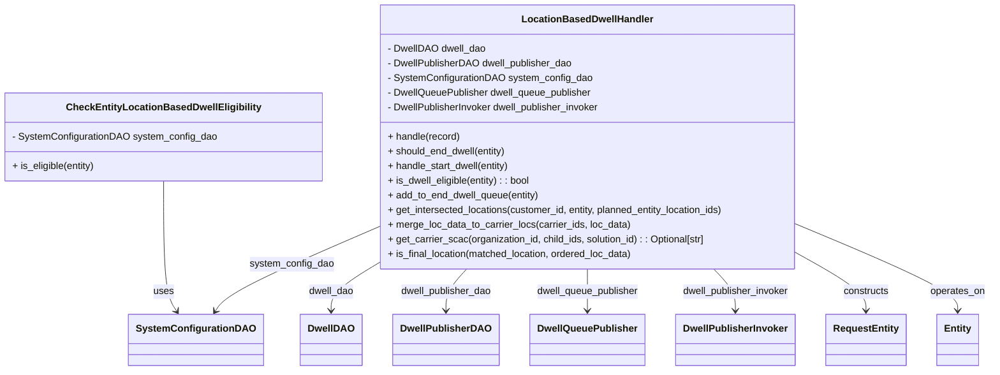

# Diagram: entity_core/entity_service/entity_service/dwell/location_based_dwell/handler.py


> Auto-generated by Obscura crawlers

## Diagram 1



### SVG

<svg id="container" width="1583.14453125" xmlns="http://www.w3.org/2000/svg" class="classDiagram" height="606" viewBox="0 0 1583.14453125 606" role="graphics-document document" aria-roledescription="class"><style>#container{font-family:"trebuchet ms",verdana,arial,sans-serif;font-size:16px;fill:#333;}@keyframes edge-animation-frame{from{stroke-dashoffset:0;}}@keyframes dash{to{stroke-dashoffset:0;}}#container .edge-animation-slow{stroke-dasharray:9,5!important;stroke-dashoffset:900;animation:dash 50s linear infinite;stroke-linecap:round;}#container .edge-animation-fast{stroke-dasharray:9,5!important;stroke-dashoffset:900;animation:dash 20s linear infinite;stroke-linecap:round;}#container .error-icon{fill:#552222;}#container .error-text{fill:#552222;stroke:#552222;}#container .edge-thickness-normal{stroke-width:1px;}#container .edge-thickness-thick{stroke-width:3.5px;}#container .edge-pattern-solid{stroke-dasharray:0;}#container .edge-thickness-invisible{stroke-width:0;fill:none;}#container .edge-pattern-dashed{stroke-dasharray:3;}#container .edge-pattern-dotted{stroke-dasharray:2;}#container .marker{fill:#333333;stroke:#333333;}#container .marker.cross{stroke:#333333;}#container svg{font-family:"trebuchet ms",verdana,arial,sans-serif;font-size:16px;}#container p{margin:0;}#container g.classGroup text{fill:#9370DB;stroke:none;font-family:"trebuchet ms",verdana,arial,sans-serif;font-size:10px;}#container g.classGroup text .title{font-weight:bolder;}#container .nodeLabel,#container .edgeLabel{color:#131300;}#container .edgeLabel .label rect{fill:#ECECFF;}#container .label text{fill:#131300;}#container .labelBkg{background:#ECECFF;}#container .edgeLabel .label span{background:#ECECFF;}#container .classTitle{font-weight:bolder;}#container .node rect,#container .node circle,#container .node ellipse,#container .node polygon,#container .node path{fill:#ECECFF;stroke:#9370DB;stroke-width:1px;}#container .divider{stroke:#9370DB;stroke-width:1;}#container g.clickable{cursor:pointer;}#container g.classGroup rect{fill:#ECECFF;stroke:#9370DB;}#container g.classGroup line{stroke:#9370DB;stroke-width:1;}#container .classLabel .box{stroke:none;stroke-width:0;fill:#ECECFF;opacity:0.5;}#container .classLabel .label{fill:#9370DB;font-size:10px;}#container .relation{stroke:#333333;stroke-width:1;fill:none;}#container .dashed-line{stroke-dasharray:3;}#container .dotted-line{stroke-dasharray:1 2;}#container #compositionStart,#container .composition{fill:#333333!important;stroke:#333333!important;stroke-width:1;}#container #compositionEnd,#container .composition{fill:#333333!important;stroke:#333333!important;stroke-width:1;}#container #dependencyStart,#container .dependency{fill:#333333!important;stroke:#333333!important;stroke-width:1;}#container #dependencyStart,#container .dependency{fill:#333333!important;stroke:#333333!important;stroke-width:1;}#container #extensionStart,#container .extension{fill:transparent!important;stroke:#333333!important;stroke-width:1;}#container #extensionEnd,#container .extension{fill:transparent!important;stroke:#333333!important;stroke-width:1;}#container #aggregationStart,#container .aggregation{fill:transparent!important;stroke:#333333!important;stroke-width:1;}#container #aggregationEnd,#container .aggregation{fill:transparent!important;stroke:#333333!important;stroke-width:1;}#container #lollipopStart,#container .lollipop{fill:#ECECFF!important;stroke:#333333!important;stroke-width:1;}#container #lollipopEnd,#container .lollipop{fill:#ECECFF!important;stroke:#333333!important;stroke-width:1;}#container .edgeTerminals{font-size:11px;line-height:initial;}#container .classTitleText{text-anchor:middle;font-size:18px;fill:#333;}#container .label-icon{display:inline-block;height:1em;overflow:visible;vertical-align:-0.125em;}#container .node .label-icon path{fill:currentColor;stroke:revert;stroke-width:revert;}#container :root{--mermaid-font-family:"trebuchet ms",verdana,arial,sans-serif;}</style><g><defs><marker id="container_class-aggregationStart" class="marker aggregation class" refX="18" refY="7" markerWidth="190" markerHeight="240" orient="auto"><path d="M 18,7 L9,13 L1,7 L9,1 Z"></path></marker></defs><defs><marker id="container_class-aggregationEnd" class="marker aggregation class" refX="1" refY="7" markerWidth="20" markerHeight="28" orient="auto"><path d="M 18,7 L9,13 L1,7 L9,1 Z"></path></marker></defs><defs><marker id="container_class-extensionStart" class="marker extension class" refX="18" refY="7" markerWidth="190" markerHeight="240" orient="auto"><path d="M 1,7 L18,13 V 1 Z"></path></marker></defs><defs><marker id="container_class-extensionEnd" class="marker extension class" refX="1" refY="7" markerWidth="20" markerHeight="28" orient="auto"><path d="M 1,1 V 13 L18,7 Z"></path></marker></defs><defs><marker id="container_class-compositionStart" class="marker composition class" refX="18" refY="7" markerWidth="190" markerHeight="240" orient="auto"><path d="M 18,7 L9,13 L1,7 L9,1 Z"></path></marker></defs><defs><marker id="container_class-compositionEnd" class="marker composition class" refX="1" refY="7" markerWidth="20" markerHeight="28" orient="auto"><path d="M 18,7 L9,13 L1,7 L9,1 Z"></path></marker></defs><defs><marker id="container_class-dependencyStart" class="marker dependency class" refX="6" refY="7" markerWidth="190" markerHeight="240" orient="auto"><path d="M 5,7 L9,13 L1,7 L9,1 Z"></path></marker></defs><defs><marker id="container_class-dependencyEnd" class="marker dependency class" refX="13" refY="7" markerWidth="20" markerHeight="28" orient="auto"><path d="M 18,7 L9,13 L14,7 L9,1 Z"></path></marker></defs><defs><marker id="container_class-lollipopStart" class="marker lollipop class" refX="13" refY="7" markerWidth="190" markerHeight="240" orient="auto"><circle stroke="black" fill="transparent" cx="7" cy="7" r="6"></circle></marker></defs><defs><marker id="container_class-lollipopEnd" class="marker lollipop class" refX="1" refY="7" markerWidth="190" markerHeight="240" orient="auto"><circle stroke="black" fill="transparent" cx="7" cy="7" r="6"></circle></marker></defs><g class="root"><g class="clusters"></g><g class="edgePaths"><path d="M261.664,296L261.664,326.167C261.664,356.333,261.664,416.667,265.22,452.168C268.776,487.669,275.888,498.338,279.444,503.673L283,509.008" id="id_CheckEntityLocationBasedDwellEligibility_SystemConfigurationDAO_1" class="edge-thickness-normal edge-pattern-solid relation" style=";;;" data-edge="true" data-et="edge" data-id="id_CheckEntityLocationBasedDwellEligibility_SystemConfigurationDAO_1" data-points="W3sieCI6MjYxLjY2NDA2MjUsInkiOjI5Nn0seyJ4IjoyNjEuNjY0MDYyNSwieSI6NDc3fSx7IngiOjI4Ni4zMjc2Nzk5ODQxNzcyLCJ5Ijo1MTR9XQ==" marker-end="url(#container_class-dependencyEnd)"></path><path d="M596.562,440L586.741,446.167C576.92,452.333,557.278,464.667,547.458,476C537.637,487.333,537.637,497.667,537.637,502.833L537.637,508" id="id_LocationBasedDwellHandler_DwellDAO_2" class="edge-thickness-normal edge-pattern-solid relation" style=";;;" data-edge="true" data-et="edge" data-id="id_LocationBasedDwellHandler_DwellDAO_2" data-points="W3sieCI6NTk2LjU2MjA1MjI0ODAyMzcsInkiOjQ0MH0seyJ4Ijo1MzcuNjM2NzE4NzUsInkiOjQ3N30seyJ4Ijo1MzcuNjM2NzE4NzUsInkiOjUxNH1d" marker-end="url(#container_class-dependencyEnd)"></path><path d="M750.251,440L744.818,446.167C739.385,452.333,728.519,464.667,723.086,476C717.652,487.333,717.652,497.667,717.652,502.833L717.652,508" id="id_LocationBasedDwellHandler_DwellPublisherDAO_3" class="edge-thickness-normal edge-pattern-solid relation" style=";;;" data-edge="true" data-et="edge" data-id="id_LocationBasedDwellHandler_DwellPublisherDAO_3" data-points="W3sieCI6NzUwLjI1MTI4MTQ5NzAzNTUsInkiOjQ0MH0seyJ4Ijo3MTcuNjUyMzQzNzUsInkiOjQ3N30seyJ4Ijo3MTcuNjUyMzQzNzUsInkiOjUxNH1d" marker-end="url(#container_class-dependencyEnd)"></path><path d="M595.559,378.086L558.647,394.572C521.736,411.057,447.913,444.029,406.939,465.884C365.966,487.738,357.842,498.477,353.78,503.846L349.718,509.215" id="id_LocationBasedDwellHandler_SystemConfigurationDAO_4" class="edge-thickness-normal edge-pattern-solid relation" style=";;;" data-edge="true" data-et="edge" data-id="id_LocationBasedDwellHandler_SystemConfigurationDAO_4" data-points="W3sieCI6NTk1LjU1ODU5Mzc1LCJ5IjozNzguMDg2MTY5ODAxOTUyOX0seyJ4IjozNzQuMDg5ODQzNzUsInkiOjQ3N30seyJ4IjozNDYuMDk4MzQ4NDk2ODM1NDYsInkiOjUxNH1d" marker-end="url(#container_class-dependencyEnd)"></path><path d="M940.559,440L940.559,446.167C940.559,452.333,940.559,464.667,940.559,476C940.559,487.333,940.559,497.667,940.559,502.833L940.559,508" id="id_LocationBasedDwellHandler_DwellQueuePublisher_5" class="edge-thickness-normal edge-pattern-solid relation" style=";;;" data-edge="true" data-et="edge" data-id="id_LocationBasedDwellHandler_DwellQueuePublisher_5" data-points="W3sieCI6OTQwLjU1ODU5Mzc1LCJ5Ijo0NDB9LHsieCI6OTQwLjU1ODU5Mzc1LCJ5Ijo0Nzd9LHsieCI6OTQwLjU1ODU5Mzc1LCJ5Ijo1MTR9XQ==" marker-end="url(#container_class-dependencyEnd)"></path><path d="M1141.331,440L1147.063,446.167C1152.795,452.333,1164.259,464.667,1169.991,476C1175.723,487.333,1175.723,497.667,1175.723,502.833L1175.723,508" id="id_LocationBasedDwellHandler_DwellPublisherInvoker_6" class="edge-thickness-normal edge-pattern-solid relation" style=";;;" data-edge="true" data-et="edge" data-id="id_LocationBasedDwellHandler_DwellPublisherInvoker_6" data-points="W3sieCI6MTE0MS4zMzEwNzM5ODcxNTQyLCJ5Ijo0NDB9LHsieCI6MTE3NS43MjI2NTYyNSwieSI6NDc3fSx7IngiOjExNzUuNzIyNjU2MjUsInkiOjUxNH1d" marker-end="url(#container_class-dependencyEnd)"></path><path d="M1285.559,421.018L1301.897,430.348C1318.236,439.678,1350.913,458.339,1367.251,472.836C1383.59,487.333,1383.59,497.667,1383.59,502.833L1383.59,508" id="id_LocationBasedDwellHandler_RequestEntity_7" class="edge-thickness-normal edge-pattern-solid relation" style=";;;" data-edge="true" data-et="edge" data-id="id_LocationBasedDwellHandler_RequestEntity_7" data-points="W3sieCI6MTI4NS41NTg1OTM3NSwieSI6NDIxLjAxNzcwNDczMzAxODI2fSx7IngiOjEzODMuNTg5ODQzNzUsInkiOjQ3N30seyJ4IjoxMzgzLjU4OTg0Mzc1LCJ5Ijo1MTR9XQ==" marker-end="url(#container_class-dependencyEnd)"></path><path d="M1285.559,372.048L1326.32,389.54C1367.082,407.032,1448.605,442.016,1489.367,464.675C1530.129,487.333,1530.129,497.667,1530.129,502.833L1530.129,508" id="id_LocationBasedDwellHandler_Entity_8" class="edge-thickness-normal edge-pattern-solid relation" style=";;;" data-edge="true" data-et="edge" data-id="id_LocationBasedDwellHandler_Entity_8" data-points="W3sieCI6MTI4NS41NTg1OTM3NSwieSI6MzcyLjA0ODQ5OTMwNDMxMzN9LHsieCI6MTUzMC4xMjg5MDYyNSwieSI6NDc3fSx7IngiOjE1MzAuMTI4OTA2MjUsInkiOjUxNH1d" marker-end="url(#container_class-dependencyEnd)"></path></g><g class="edgeLabels"><g class="edgeLabel" transform="translate(261.6640625, 477)"><g class="label" data-id="id_CheckEntityLocationBasedDwellEligibility_SystemConfigurationDAO_1" transform="translate(-16.4921875, -12)"><foreignObject width="32.984375" height="24"><div xmlns="http://www.w3.org/1999/xhtml" class="labelBkg" style="display: table-cell; white-space: nowrap; line-height: 1.5; max-width: 200px; text-align: center;"><span class="edgeLabel"><p>uses</p></span></div></foreignObject></g></g><g class="edgeLabel" transform="translate(537.63671875, 477)"><g class="label" data-id="id_LocationBasedDwellHandler_DwellDAO_2" transform="translate(-37.3828125, -12)"><foreignObject width="74.765625" height="24"><div xmlns="http://www.w3.org/1999/xhtml" class="labelBkg" style="display: table-cell; white-space: nowrap; line-height: 1.5; max-width: 200px; text-align: center;"><span class="edgeLabel"><p>dwell_dao</p></span></div></foreignObject></g></g><g class="edgeLabel" transform="translate(717.65234375, 477)"><g class="label" data-id="id_LocationBasedDwellHandler_DwellPublisherDAO_3" transform="translate(-75.53125, -12)"><foreignObject width="151.0625" height="24"><div xmlns="http://www.w3.org/1999/xhtml" class="labelBkg" style="display: table-cell; white-space: nowrap; line-height: 1.5; max-width: 200px; text-align: center;"><span class="edgeLabel"><p>dwell_publisher_dao</p></span></div></foreignObject></g></g><g class="edgeLabel" transform="translate(463.64313, 437.00312)"><g class="label" data-id="id_LocationBasedDwellHandler_SystemConfigurationDAO_4" transform="translate(-68.828125, -12)"><foreignObject width="137.65625" height="24"><div xmlns="http://www.w3.org/1999/xhtml" class="labelBkg" style="display: table-cell; white-space: nowrap; line-height: 1.5; max-width: 200px; text-align: center;"><span class="edgeLabel"><p>system_config_dao</p></span></div></foreignObject></g></g><g class="edgeLabel" transform="translate(940.55859375, 477)"><g class="label" data-id="id_LocationBasedDwellHandler_DwellQueuePublisher_5" transform="translate(-85.0234375, -12)"><foreignObject width="170.046875" height="24"><div xmlns="http://www.w3.org/1999/xhtml" class="labelBkg" style="display: table-cell; white-space: nowrap; line-height: 1.5; max-width: 200px; text-align: center;"><span class="edgeLabel"><p>dwell_queue_publisher</p></span></div></foreignObject></g></g><g class="edgeLabel" transform="translate(1175.72265625, 477)"><g class="label" data-id="id_LocationBasedDwellHandler_DwellPublisherInvoker_6" transform="translate(-88.8203125, -12)"><foreignObject width="177.640625" height="24"><div xmlns="http://www.w3.org/1999/xhtml" class="labelBkg" style="display: table-cell; white-space: nowrap; line-height: 1.5; max-width: 200px; text-align: center;"><span class="edgeLabel"><p>dwell_publisher_invoker</p></span></div></foreignObject></g></g><g class="edgeLabel" transform="translate(1383.58984375, 477)"><g class="label" data-id="id_LocationBasedDwellHandler_RequestEntity_7" transform="translate(-37.84375, -12)"><foreignObject width="75.6875" height="24"><div xmlns="http://www.w3.org/1999/xhtml" class="labelBkg" style="display: table-cell; white-space: nowrap; line-height: 1.5; max-width: 200px; text-align: center;"><span class="edgeLabel"><p>constructs</p></span></div></foreignObject></g></g><g class="edgeLabel" transform="translate(1530.12890625, 477)"><g class="label" data-id="id_LocationBasedDwellHandler_Entity_8" transform="translate(-45.015625, -12)"><foreignObject width="90.03125" height="24"><div xmlns="http://www.w3.org/1999/xhtml" class="labelBkg" style="display: table-cell; white-space: nowrap; line-height: 1.5; max-width: 200px; text-align: center;"><span class="edgeLabel"><p>operates_on</p></span></div></foreignObject></g></g></g><g class="nodes"><g class="node default" id="classId-CheckEntityLocationBasedDwellEligibility-0" transform="translate(261.6640625, 224)"><g class="basic label-container"><path d="M-253.6640625 -72 L253.6640625 -72 L253.6640625 72 L-253.6640625 72" stroke="none" stroke-width="0" fill="#ECECFF" style=""></path><path d="M-253.6640625 -72 C-97.09285180989829 -72, 59.478358880203416 -72, 253.6640625 -72 M-253.6640625 -72 C-140.46204567582743 -72, -27.26002885165485 -72, 253.6640625 -72 M253.6640625 -72 C253.6640625 -34.01536610942497, 253.6640625 3.969267781150066, 253.6640625 72 M253.6640625 -72 C253.6640625 -21.041941764331867, 253.6640625 29.916116471336267, 253.6640625 72 M253.6640625 72 C99.22152785387479 72, -55.22100679225042 72, -253.6640625 72 M253.6640625 72 C113.2448784986166 72, -27.1743055027668 72, -253.6640625 72 M-253.6640625 72 C-253.6640625 37.75501325481642, -253.6640625 3.510026509632837, -253.6640625 -72 M-253.6640625 72 C-253.6640625 23.021630403121875, -253.6640625 -25.95673919375625, -253.6640625 -72" stroke="#9370DB" stroke-width="1.3" fill="none" stroke-dasharray="0 0" style=""></path></g><g class="annotation-group text" transform="translate(0, -48)"></g><g class="label-group text" transform="translate(-151.40625, -48)"><g class="label" style="font-weight: bolder" transform="translate(0,-12)"><foreignObject width="302.8125" height="24"><div xmlns="http://www.w3.org/1999/xhtml" style="display: table-cell; white-space: nowrap; line-height: 1.5; max-width: 348px; text-align: center;"><span class="nodeLabel markdown-node-label" style=""><p>CheckEntityLocationBasedDwellEligibility</p></span></div></foreignObject></g></g><g class="members-group text" transform="translate(-241.6640625, 0)"><g class="label" style="" transform="translate(0,-12)"><foreignObject width="331.921875" height="24"><div xmlns="http://www.w3.org/1999/xhtml" style="display: table-cell; white-space: nowrap; line-height: 1.5; max-width: 389px; text-align: center;"><span class="nodeLabel markdown-node-label" style=""><p>- SystemConfigurationDAO system_config_dao</p></span></div></foreignObject></g></g><g class="methods-group text" transform="translate(-241.6640625, 48)"><g class="label" style="" transform="translate(0,-12)"><foreignObject width="137.796875" height="24"><div xmlns="http://www.w3.org/1999/xhtml" style="display: table-cell; white-space: nowrap; line-height: 1.5; max-width: 195px; text-align: center;"><span class="nodeLabel markdown-node-label" style=""><p>+ is_eligible(entity)</p></span></div></foreignObject></g></g><g class="divider" style=""><path d="M-253.6640625 -24 C-133.46191844879334 -24, -13.259774397586682 -24, 253.6640625 -24 M-253.6640625 -24 C-82.10665111687203 -24, 89.45076026625594 -24, 253.6640625 -24" stroke="#9370DB" stroke-width="1.3" fill="none" stroke-dasharray="0 0" style=""></path></g><g class="divider" style=""><path d="M-253.6640625 24 C-59.51222323122215 24, 134.6396160375557 24, 253.6640625 24 M-253.6640625 24 C-67.22279473639276 24, 119.21847302721449 24, 253.6640625 24" stroke="#9370DB" stroke-width="1.3" fill="none" stroke-dasharray="0 0" style=""></path></g></g><g class="node default" id="classId-LocationBasedDwellHandler-1" transform="translate(940.55859375, 224)"><g class="basic label-container"><path d="M-345 -216 L345 -216 L345 216 L-345 216" stroke="none" stroke-width="0" fill="#ECECFF" style=""></path><path d="M-345 -216 C-76.64406588815018 -216, 191.71186822369964 -216, 345 -216 M-345 -216 C-130.89290914409875 -216, 83.2141817118025 -216, 345 -216 M345 -216 C345 -64.53597693060686, 345 86.92804613878627, 345 216 M345 -216 C345 -63.61324370329248, 345 88.77351259341503, 345 216 M345 216 C134.02027621573194 216, -76.95944756853612 216, -345 216 M345 216 C175.0524972367596 216, 5.104994473519184 216, -345 216 M-345 216 C-345 94.54556290656551, -345 -26.908874186868985, -345 -216 M-345 216 C-345 47.68362275315599, -345 -120.63275449368803, -345 -216" stroke="#9370DB" stroke-width="1.3" fill="none" stroke-dasharray="0 0" style=""></path></g><g class="annotation-group text" transform="translate(0, -192)"></g><g class="label-group text" transform="translate(-103.125, -192)"><g class="label" style="font-weight: bolder" transform="translate(0,-12)"><foreignObject width="206.25" height="24"><div xmlns="http://www.w3.org/1999/xhtml" style="display: table-cell; white-space: nowrap; line-height: 1.5; max-width: 255px; text-align: center;"><span class="nodeLabel markdown-node-label" style=""><p>LocationBasedDwellHandler</p></span></div></foreignObject></g></g><g class="members-group text" transform="translate(-333, -144)"><g class="label" style="" transform="translate(0,-12)"><foreignObject width="159.78125" height="24"><div xmlns="http://www.w3.org/1999/xhtml" style="display: table-cell; white-space: nowrap; line-height: 1.5; max-width: 217px; text-align: center;"><span class="nodeLabel markdown-node-label" style=""><p>- DwellDAO dwell_dao</p></span></div></foreignObject></g><g class="label" style="" transform="translate(0,12)"><foreignObject width="304.71875" height="24"><div xmlns="http://www.w3.org/1999/xhtml" style="display: table-cell; white-space: nowrap; line-height: 1.5; max-width: 362px; text-align: center;"><span class="nodeLabel markdown-node-label" style=""><p>- DwellPublisherDAO dwell_publisher_dao</p></span></div></foreignObject></g><g class="label" style="" transform="translate(0,36)"><foreignObject width="331.921875" height="24"><div xmlns="http://www.w3.org/1999/xhtml" style="display: table-cell; white-space: nowrap; line-height: 1.5; max-width: 389px; text-align: center;"><span class="nodeLabel markdown-node-label" style=""><p>- SystemConfigurationDAO system_config_dao</p></span></div></foreignObject></g><g class="label" style="" transform="translate(0,60)"><foreignObject width="340.578125" height="24"><div xmlns="http://www.w3.org/1999/xhtml" style="display: table-cell; white-space: nowrap; line-height: 1.5; max-width: 399px; text-align: center;"><span class="nodeLabel markdown-node-label" style=""><p>- DwellQueuePublisher dwell_queue_publisher</p></span></div></foreignObject></g><g class="label" style="" transform="translate(0,84)"><foreignObject width="355.140625" height="24"><div xmlns="http://www.w3.org/1999/xhtml" style="display: table-cell; white-space: nowrap; line-height: 1.5; max-width: 413px; text-align: center;"><span class="nodeLabel markdown-node-label" style=""><p>- DwellPublisherInvoker dwell_publisher_invoker</p></span></div></foreignObject></g></g><g class="methods-group text" transform="translate(-333, 0)"><g class="label" style="" transform="translate(0,-12)"><foreignObject width="119.296875" height="24"><div xmlns="http://www.w3.org/1999/xhtml" style="display: table-cell; white-space: nowrap; line-height: 1.5; max-width: 177px; text-align: center;"><span class="nodeLabel markdown-node-label" style=""><p>+ handle(record)</p></span></div></foreignObject></g><g class="label" style="" transform="translate(0,12)"><foreignObject width="197.03125" height="24"><div xmlns="http://www.w3.org/1999/xhtml" style="display: table-cell; white-space: nowrap; line-height: 1.5; max-width: 254px; text-align: center;"><span class="nodeLabel markdown-node-label" style=""><p>+ should_end_dwell(entity)</p></span></div></foreignObject></g><g class="label" style="" transform="translate(0,36)"><foreignObject width="203.828125" height="24"><div xmlns="http://www.w3.org/1999/xhtml" style="display: table-cell; white-space: nowrap; line-height: 1.5; max-width: 261px; text-align: center;"><span class="nodeLabel markdown-node-label" style=""><p>+ handle_start_dwell(entity)</p></span></div></foreignObject></g><g class="label" style="" transform="translate(0,60)"><foreignObject width="238.21875" height="24"><div xmlns="http://www.w3.org/1999/xhtml" style="display: table-cell; white-space: nowrap; line-height: 1.5; max-width: 296px; text-align: center;"><span class="nodeLabel markdown-node-label" style=""><p>+ is_dwell_eligible(entity) : : bool</p></span></div></foreignObject></g><g class="label" style="" transform="translate(0,84)"><foreignObject width="251.390625" height="24"><div xmlns="http://www.w3.org/1999/xhtml" style="display: table-cell; white-space: nowrap; line-height: 1.5; max-width: 309px; text-align: center;"><span class="nodeLabel markdown-node-label" style=""><p>+ add_to_end_dwell_queue(entity)</p></span></div></foreignObject></g><g class="label" style="" transform="translate(0,108)"><foreignObject width="562.875" height="24"><div xmlns="http://www.w3.org/1999/xhtml" style="display: table-cell; white-space: nowrap; line-height: 1.5; max-width: 620px; text-align: center;"><span class="nodeLabel markdown-node-label" style=""><p>+ get_intersected_locations(customer_id, entity, planned_entity_location_ids)</p></span></div></foreignObject></g><g class="label" style="" transform="translate(0,132)"><foreignObject width="399.15625" height="24"><div xmlns="http://www.w3.org/1999/xhtml" style="display: table-cell; white-space: nowrap; line-height: 1.5; max-width: 457px; text-align: center;"><span class="nodeLabel markdown-node-label" style=""><p>+ merge_loc_data_to_carrier_locs(carrier_ids, loc_data)</p></span></div></foreignObject></g><g class="label" style="" transform="translate(0,156)"><foreignObject width="529.125" height="24"><div xmlns="http://www.w3.org/1999/xhtml" style="display: table-cell; white-space: nowrap; line-height: 1.5; max-width: 586px; text-align: center;"><span class="nodeLabel markdown-node-label" style=""><p>+ get_carrier_scac(organization_id, child_ids, solution_id) : : Optional[str]</p></span></div></foreignObject></g><g class="label" style="" transform="translate(0,180)"><foreignObject width="407.75" height="24"><div xmlns="http://www.w3.org/1999/xhtml" style="display: table-cell; white-space: nowrap; line-height: 1.5; max-width: 465px; text-align: center;"><span class="nodeLabel markdown-node-label" style=""><p>+ is_final_location(matched_location, ordered_loc_data)</p></span></div></foreignObject></g></g><g class="divider" style=""><path d="M-345 -168 C-169.7360456403979 -168, 5.52790871920422 -168, 345 -168 M-345 -168 C-205.35002991712105 -168, -65.7000598342421 -168, 345 -168" stroke="#9370DB" stroke-width="1.3" fill="none" stroke-dasharray="0 0" style=""></path></g><g class="divider" style=""><path d="M-345 -24 C-127.15926350900136 -24, 90.68147298199727 -24, 345 -24 M-345 -24 C-201.25549555052353 -24, -57.51099110104707 -24, 345 -24" stroke="#9370DB" stroke-width="1.3" fill="none" stroke-dasharray="0 0" style=""></path></g></g><g class="node default" id="classId-DwellDAO-2" transform="translate(537.63671875, 556)"><g class="basic label-container"><path d="M-47.6640625 -42 L47.6640625 -42 L47.6640625 42 L-47.6640625 42" stroke="none" stroke-width="0" fill="#ECECFF" style=""></path><path d="M-47.6640625 -42 C-26.473101642964714 -42, -5.282140785929428 -42, 47.6640625 -42 M-47.6640625 -42 C-20.06562718593642 -42, 7.532808128127158 -42, 47.6640625 -42 M47.6640625 -42 C47.6640625 -21.297348428096207, 47.6640625 -0.5946968561924137, 47.6640625 42 M47.6640625 -42 C47.6640625 -8.916140828842444, 47.6640625 24.167718342315112, 47.6640625 42 M47.6640625 42 C12.705632361953057 42, -22.252797776093885 42, -47.6640625 42 M47.6640625 42 C20.637198820960585 42, -6.389664858078831 42, -47.6640625 42 M-47.6640625 42 C-47.6640625 19.67290271522483, -47.6640625 -2.6541945695503415, -47.6640625 -42 M-47.6640625 42 C-47.6640625 12.121989827613518, -47.6640625 -17.756020344772963, -47.6640625 -42" stroke="#9370DB" stroke-width="1.3" fill="none" stroke-dasharray="0 0" style=""></path></g><g class="annotation-group text" transform="translate(0, -18)"></g><g class="label-group text" transform="translate(-35.6640625, -18)"><g class="label" style="font-weight: bolder" transform="translate(0,-12)"><foreignObject width="71.328125" height="24"><div xmlns="http://www.w3.org/1999/xhtml" style="display: table-cell; white-space: nowrap; line-height: 1.5; max-width: 120px; text-align: center;"><span class="nodeLabel markdown-node-label" style=""><p>DwellDAO</p></span></div></foreignObject></g></g><g class="members-group text" transform="translate(-35.6640625, 30)"></g><g class="methods-group text" transform="translate(-35.6640625, 60)"></g><g class="divider" style=""><path d="M-47.6640625 6 C-20.979784864181983 6, 5.704492771636033 6, 47.6640625 6 M-47.6640625 6 C-18.230739730214772 6, 11.202583039570456 6, 47.6640625 6" stroke="#9370DB" stroke-width="1.3" fill="none" stroke-dasharray="0 0" style=""></path></g><g class="divider" style=""><path d="M-47.6640625 24 C-24.77223651318049 24, -1.8804105263609827 24, 47.6640625 24 M-47.6640625 24 C-24.273276774689997 24, -0.8824910493799933 24, 47.6640625 24" stroke="#9370DB" stroke-width="1.3" fill="none" stroke-dasharray="0 0" style=""></path></g></g><g class="node default" id="classId-DwellPublisherDAO-3" transform="translate(717.65234375, 556)"><g class="basic label-container"><path d="M-82.3515625 -42 L82.3515625 -42 L82.3515625 42 L-82.3515625 42" stroke="none" stroke-width="0" fill="#ECECFF" style=""></path><path d="M-82.3515625 -42 C-27.281330656893957 -42, 27.788901186212087 -42, 82.3515625 -42 M-82.3515625 -42 C-28.072769333614254 -42, 26.206023832771493 -42, 82.3515625 -42 M82.3515625 -42 C82.3515625 -17.8567351636432, 82.3515625 6.286529672713598, 82.3515625 42 M82.3515625 -42 C82.3515625 -10.341305612589963, 82.3515625 21.317388774820074, 82.3515625 42 M82.3515625 42 C49.047649045848985 42, 15.74373559169797 42, -82.3515625 42 M82.3515625 42 C24.6864169232815 42, -32.978728653437 42, -82.3515625 42 M-82.3515625 42 C-82.3515625 9.418257117319975, -82.3515625 -23.16348576536005, -82.3515625 -42 M-82.3515625 42 C-82.3515625 9.678193436891306, -82.3515625 -22.64361312621739, -82.3515625 -42" stroke="#9370DB" stroke-width="1.3" fill="none" stroke-dasharray="0 0" style=""></path></g><g class="annotation-group text" transform="translate(0, -18)"></g><g class="label-group text" transform="translate(-70.3515625, -18)"><g class="label" style="font-weight: bolder" transform="translate(0,-12)"><foreignObject width="140.703125" height="24"><div xmlns="http://www.w3.org/1999/xhtml" style="display: table-cell; white-space: nowrap; line-height: 1.5; max-width: 189px; text-align: center;"><span class="nodeLabel markdown-node-label" style=""><p>DwellPublisherDAO</p></span></div></foreignObject></g></g><g class="members-group text" transform="translate(-70.3515625, 30)"></g><g class="methods-group text" transform="translate(-70.3515625, 60)"></g><g class="divider" style=""><path d="M-82.3515625 6 C-21.511152322917027 6, 39.329257854165945 6, 82.3515625 6 M-82.3515625 6 C-17.629139290252482 6, 47.093283919495036 6, 82.3515625 6" stroke="#9370DB" stroke-width="1.3" fill="none" stroke-dasharray="0 0" style=""></path></g><g class="divider" style=""><path d="M-82.3515625 24 C-43.31301313260766 24, -4.274463765215316 24, 82.3515625 24 M-82.3515625 24 C-19.363357406574167 24, 43.624847686851666 24, 82.3515625 24" stroke="#9370DB" stroke-width="1.3" fill="none" stroke-dasharray="0 0" style=""></path></g></g><g class="node default" id="classId-SystemConfigurationDAO-4" transform="translate(314.32421875, 556)"><g class="basic label-container"><path d="M-103.21875 -42 L103.21875 -42 L103.21875 42 L-103.21875 42" stroke="none" stroke-width="0" fill="#ECECFF" style=""></path><path d="M-103.21875 -42 C-59.77522834316252 -42, -16.331706686325035 -42, 103.21875 -42 M-103.21875 -42 C-25.1946902388772 -42, 52.8293695222456 -42, 103.21875 -42 M103.21875 -42 C103.21875 -21.746060013283234, 103.21875 -1.492120026566468, 103.21875 42 M103.21875 -42 C103.21875 -15.394640947942111, 103.21875 11.210718104115777, 103.21875 42 M103.21875 42 C60.404918666941825 42, 17.59108733388365 42, -103.21875 42 M103.21875 42 C25.452706047792788 42, -52.313337904414425 42, -103.21875 42 M-103.21875 42 C-103.21875 10.843538457709595, -103.21875 -20.31292308458081, -103.21875 -42 M-103.21875 42 C-103.21875 15.29312594990359, -103.21875 -11.41374810019282, -103.21875 -42" stroke="#9370DB" stroke-width="1.3" fill="none" stroke-dasharray="0 0" style=""></path></g><g class="annotation-group text" transform="translate(0, -18)"></g><g class="label-group text" transform="translate(-91.21875, -18)"><g class="label" style="font-weight: bolder" transform="translate(0,-12)"><foreignObject width="182.4375" height="24"><div xmlns="http://www.w3.org/1999/xhtml" style="display: table-cell; white-space: nowrap; line-height: 1.5; max-width: 229px; text-align: center;"><span class="nodeLabel markdown-node-label" style=""><p>SystemConfigurationDAO</p></span></div></foreignObject></g></g><g class="members-group text" transform="translate(-91.21875, 30)"></g><g class="methods-group text" transform="translate(-91.21875, 60)"></g><g class="divider" style=""><path d="M-103.21875 6 C-55.346484484569835 6, -7.47421896913967 6, 103.21875 6 M-103.21875 6 C-23.405386954353432 6, 56.407976091293136 6, 103.21875 6" stroke="#9370DB" stroke-width="1.3" fill="none" stroke-dasharray="0 0" style=""></path></g><g class="divider" style=""><path d="M-103.21875 24 C-21.71510657868292 24, 59.78853684263416 24, 103.21875 24 M-103.21875 24 C-26.599076601435826 24, 50.02059679712835 24, 103.21875 24" stroke="#9370DB" stroke-width="1.3" fill="none" stroke-dasharray="0 0" style=""></path></g></g><g class="node default" id="classId-DwellQueuePublisher-5" transform="translate(940.55859375, 556)"><g class="basic label-container"><path d="M-90.5546875 -42 L90.5546875 -42 L90.5546875 42 L-90.5546875 42" stroke="none" stroke-width="0" fill="#ECECFF" style=""></path><path d="M-90.5546875 -42 C-23.502718572769112 -42, 43.549250354461776 -42, 90.5546875 -42 M-90.5546875 -42 C-41.95012922934057 -42, 6.654429041318863 -42, 90.5546875 -42 M90.5546875 -42 C90.5546875 -25.128833552250782, 90.5546875 -8.257667104501564, 90.5546875 42 M90.5546875 -42 C90.5546875 -17.13736033270448, 90.5546875 7.725279334591043, 90.5546875 42 M90.5546875 42 C24.439810567751223 42, -41.67506636449755 42, -90.5546875 42 M90.5546875 42 C44.321340967993265 42, -1.9120055640134694 42, -90.5546875 42 M-90.5546875 42 C-90.5546875 24.45474719127257, -90.5546875 6.909494382545141, -90.5546875 -42 M-90.5546875 42 C-90.5546875 19.633579790098885, -90.5546875 -2.73284041980223, -90.5546875 -42" stroke="#9370DB" stroke-width="1.3" fill="none" stroke-dasharray="0 0" style=""></path></g><g class="annotation-group text" transform="translate(0, -18)"></g><g class="label-group text" transform="translate(-78.5546875, -18)"><g class="label" style="font-weight: bolder" transform="translate(0,-12)"><foreignObject width="157.109375" height="24"><div xmlns="http://www.w3.org/1999/xhtml" style="display: table-cell; white-space: nowrap; line-height: 1.5; max-width: 206px; text-align: center;"><span class="nodeLabel markdown-node-label" style=""><p>DwellQueuePublisher</p></span></div></foreignObject></g></g><g class="members-group text" transform="translate(-78.5546875, 30)"></g><g class="methods-group text" transform="translate(-78.5546875, 60)"></g><g class="divider" style=""><path d="M-90.5546875 6 C-22.573641102415607 6, 45.407405295168786 6, 90.5546875 6 M-90.5546875 6 C-37.337052479044736 6, 15.880582541910528 6, 90.5546875 6" stroke="#9370DB" stroke-width="1.3" fill="none" stroke-dasharray="0 0" style=""></path></g><g class="divider" style=""><path d="M-90.5546875 24 C-29.55758237756948 24, 31.439522744861037 24, 90.5546875 24 M-90.5546875 24 C-26.16575548345901 24, 38.22317653308198 24, 90.5546875 24" stroke="#9370DB" stroke-width="1.3" fill="none" stroke-dasharray="0 0" style=""></path></g></g><g class="node default" id="classId-DwellPublisherInvoker-6" transform="translate(1175.72265625, 556)"><g class="basic label-container"><path d="M-94.609375 -42 L94.609375 -42 L94.609375 42 L-94.609375 42" stroke="none" stroke-width="0" fill="#ECECFF" style=""></path><path d="M-94.609375 -42 C-25.915196178769676 -42, 42.77898264246065 -42, 94.609375 -42 M-94.609375 -42 C-32.74428693834951 -42, 29.12080112330098 -42, 94.609375 -42 M94.609375 -42 C94.609375 -16.979794454386944, 94.609375 8.040411091226112, 94.609375 42 M94.609375 -42 C94.609375 -13.178737907269046, 94.609375 15.642524185461909, 94.609375 42 M94.609375 42 C49.202541542905536 42, 3.7957080858110714 42, -94.609375 42 M94.609375 42 C35.995841775268964 42, -22.61769144946207 42, -94.609375 42 M-94.609375 42 C-94.609375 9.715675370356038, -94.609375 -22.568649259287923, -94.609375 -42 M-94.609375 42 C-94.609375 21.116648754577263, -94.609375 0.23329750915452507, -94.609375 -42" stroke="#9370DB" stroke-width="1.3" fill="none" stroke-dasharray="0 0" style=""></path></g><g class="annotation-group text" transform="translate(0, -18)"></g><g class="label-group text" transform="translate(-82.609375, -18)"><g class="label" style="font-weight: bolder" transform="translate(0,-12)"><foreignObject width="165.21875" height="24"><div xmlns="http://www.w3.org/1999/xhtml" style="display: table-cell; white-space: nowrap; line-height: 1.5; max-width: 213px; text-align: center;"><span class="nodeLabel markdown-node-label" style=""><p>DwellPublisherInvoker</p></span></div></foreignObject></g></g><g class="members-group text" transform="translate(-82.609375, 30)"></g><g class="methods-group text" transform="translate(-82.609375, 60)"></g><g class="divider" style=""><path d="M-94.609375 6 C-41.58877301462663 6, 11.431828970746736 6, 94.609375 6 M-94.609375 6 C-19.607085962172818 6, 55.395203075654365 6, 94.609375 6" stroke="#9370DB" stroke-width="1.3" fill="none" stroke-dasharray="0 0" style=""></path></g><g class="divider" style=""><path d="M-94.609375 24 C-25.663961641916103 24, 43.281451716167794 24, 94.609375 24 M-94.609375 24 C-21.390292738079253 24, 51.82878952384149 24, 94.609375 24" stroke="#9370DB" stroke-width="1.3" fill="none" stroke-dasharray="0 0" style=""></path></g></g><g class="node default" id="classId-Entity-7" transform="translate(1530.12890625, 556)"><g class="basic label-container"><path d="M-33.28125 -42 L33.28125 -42 L33.28125 42 L-33.28125 42" stroke="none" stroke-width="0" fill="#ECECFF" style=""></path><path d="M-33.28125 -42 C-13.784103103010036 -42, 5.713043793979928 -42, 33.28125 -42 M-33.28125 -42 C-17.938667299348815 -42, -2.596084598697626 -42, 33.28125 -42 M33.28125 -42 C33.28125 -23.982272787309952, 33.28125 -5.964545574619905, 33.28125 42 M33.28125 -42 C33.28125 -9.030709253681131, 33.28125 23.938581492637738, 33.28125 42 M33.28125 42 C9.475238523032491 42, -14.330772953935018 42, -33.28125 42 M33.28125 42 C12.264200786639861 42, -8.752848426720277 42, -33.28125 42 M-33.28125 42 C-33.28125 11.366649253702231, -33.28125 -19.266701492595537, -33.28125 -42 M-33.28125 42 C-33.28125 21.787273822890814, -33.28125 1.574547645781628, -33.28125 -42" stroke="#9370DB" stroke-width="1.3" fill="none" stroke-dasharray="0 0" style=""></path></g><g class="annotation-group text" transform="translate(0, -18)"></g><g class="label-group text" transform="translate(-21.28125, -18)"><g class="label" style="font-weight: bolder" transform="translate(0,-12)"><foreignObject width="42.5625" height="24"><div xmlns="http://www.w3.org/1999/xhtml" style="display: table-cell; white-space: nowrap; line-height: 1.5; max-width: 92px; text-align: center;"><span class="nodeLabel markdown-node-label" style=""><p>Entity</p></span></div></foreignObject></g></g><g class="members-group text" transform="translate(-21.28125, 30)"></g><g class="methods-group text" transform="translate(-21.28125, 60)"></g><g class="divider" style=""><path d="M-33.28125 6 C-13.343886348944565 6, 6.59347730211087 6, 33.28125 6 M-33.28125 6 C-16.200304808802333 6, 0.8806403823953346 6, 33.28125 6" stroke="#9370DB" stroke-width="1.3" fill="none" stroke-dasharray="0 0" style=""></path></g><g class="divider" style=""><path d="M-33.28125 24 C-6.945826461909842 24, 19.389597076180316 24, 33.28125 24 M-33.28125 24 C-12.326034026938299 24, 8.629181946123403 24, 33.28125 24" stroke="#9370DB" stroke-width="1.3" fill="none" stroke-dasharray="0 0" style=""></path></g></g><g class="node default" id="classId-RequestEntity-8" transform="translate(1383.58984375, 556)"><g class="basic label-container"><path d="M-63.2578125 -42 L63.2578125 -42 L63.2578125 42 L-63.2578125 42" stroke="none" stroke-width="0" fill="#ECECFF" style=""></path><path d="M-63.2578125 -42 C-24.87471421919927 -42, 13.508384061601461 -42, 63.2578125 -42 M-63.2578125 -42 C-20.869276133404412 -42, 21.519260233191176 -42, 63.2578125 -42 M63.2578125 -42 C63.2578125 -16.80739314743709, 63.2578125 8.385213705125821, 63.2578125 42 M63.2578125 -42 C63.2578125 -25.195110246405697, 63.2578125 -8.390220492811395, 63.2578125 42 M63.2578125 42 C33.56294982527021 42, 3.8680871505404255 42, -63.2578125 42 M63.2578125 42 C12.803800863128878 42, -37.650210773742245 42, -63.2578125 42 M-63.2578125 42 C-63.2578125 18.54851013753462, -63.2578125 -4.902979724930759, -63.2578125 -42 M-63.2578125 42 C-63.2578125 8.565736185353053, -63.2578125 -24.868527629293894, -63.2578125 -42" stroke="#9370DB" stroke-width="1.3" fill="none" stroke-dasharray="0 0" style=""></path></g><g class="annotation-group text" transform="translate(0, -18)"></g><g class="label-group text" transform="translate(-51.2578125, -18)"><g class="label" style="font-weight: bolder" transform="translate(0,-12)"><foreignObject width="102.515625" height="24"><div xmlns="http://www.w3.org/1999/xhtml" style="display: table-cell; white-space: nowrap; line-height: 1.5; max-width: 151px; text-align: center;"><span class="nodeLabel markdown-node-label" style=""><p>RequestEntity</p></span></div></foreignObject></g></g><g class="members-group text" transform="translate(-51.2578125, 30)"></g><g class="methods-group text" transform="translate(-51.2578125, 60)"></g><g class="divider" style=""><path d="M-63.2578125 6 C-31.45748209871322 6, 0.34284830257355736 6, 63.2578125 6 M-63.2578125 6 C-13.391517724876074 6, 36.47477705024785 6, 63.2578125 6" stroke="#9370DB" stroke-width="1.3" fill="none" stroke-dasharray="0 0" style=""></path></g><g class="divider" style=""><path d="M-63.2578125 24 C-14.726090909292829 24, 33.80563068141434 24, 63.2578125 24 M-63.2578125 24 C-34.268216392788496 24, -5.2786202855769915 24, 63.2578125 24" stroke="#9370DB" stroke-width="1.3" fill="none" stroke-dasharray="0 0" style=""></path></g></g></g></g></g></svg>

## Diagram 2

```mermaid
flowchart TD
  Start[Start] --> Parse[Parse record body -> message -> data]
  Parse --> CheckExternalId{"data contains\nentity_external_id?"}
  CheckExternalId -- yes --> MapLegacy[use data.solution_id\nuse data.entity_external_id]
  CheckExternalId -- no --> MapNew[use data.solutionId\nuse data.entityId]
  MapLegacy --> ValidateIDs
  MapNew --> ValidateIDs
  ValidateIDs{solution_id and\nentity_external_id present?} -- no --> ErrMissing[Throw Exception: "Solution ID or External ID is missing"]
  ErrMissing --> End[End]
  ValidateIDs -- yes --> CreateRequest[Create RequestEntity(solution_id, external_id)]
  CreateRequest --> GetEntity[entity = dwell_dao.get_entity(request_entity)]
  GetEntity --> EntityFound{entity found?} 
  EntityFound -- no --> ErrNoEntity[Throw Exception: "No matching entity found"]
  ErrNoEntity --> End
  EntityFound -- yes --> ShouldEnd{should_end_dwell(entity)?}
  ShouldEnd -- yes --> AddEndQueue[add_to_end_dwell_queue(entity)]
  AddEndQueue --> End
  ShouldEnd -- no --> StartDwell[handle_start_dwell(entity)]
  StartDwell --> GetCustomer[customer_id = get_customer_id(solution_id)]
  GetCustomer --> GetPlanned[planned_trip_stop_location_ids = dwell_publisher_dao.get_planned_trip_stop_location_ids(internal_id)]
  GetPlanned --> Intersect[get_intersected_locations(customer_id, entity, planned_trip_stop_location_ids)]
  Intersect --> EligibleCheck{intersected_locations exist\nand planned_trip_stop_location_ids\nand is_dwell_eligible(entity)?}
  EligibleCheck -- no --> End
  EligibleCheck -- yes --> Resolve[resolved_locations = invoke_get_location(customer_id, planned_trip_stop_location_ids, [solution_id])]
  Resolve --> SelectIntersect[intersected_location = intersected_locations[0]]
  SelectIntersect --> Ordered[ordered_trip_stops = merge_loc_data_to_carrier_locs(planned_trip_stop_location_ids, resolved_locations)]
  Ordered --> Matched[matched_location = find ordered_trip_stops with id == intersected_location]
  Matched --> ValidateMatch{matched_location exists\nand not is_final_location\nand organization_id and child_ids and code exist?}
  ValidateMatch -- no --> End
  ValidateMatch -- yes --> GetSCAC[carrier_scac = get_carrier_scac(organization_id, child_ids, solution_id)]
  GetSCAC --> SCACCheck{carrier_scac?}
  SCACCheck -- no --> End
  SCACCheck -- yes --> PublishStart[publish_start_dwell_messages(entity, matched_location.id, code, carrier_scac)]
  PublishStart --> End
```

> SVG rendering failed for this diagram.
