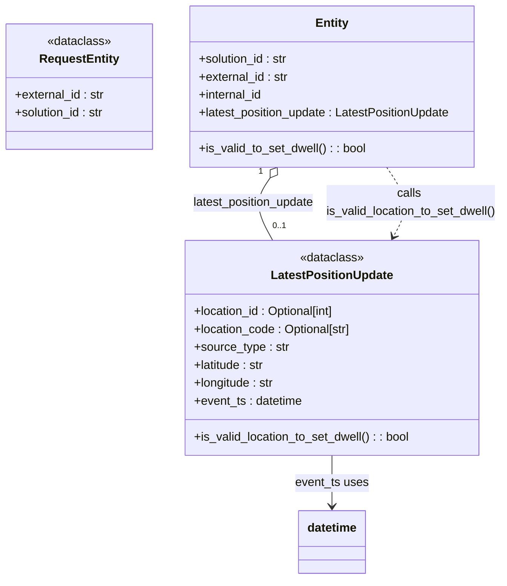

# Diagram: entity_core/entity_service/entity_service/dwell/location_based_dwell/models.py

> Auto-generated by Obscura crawlers

## Mermaid

### SVG

<svg id="container" width="683.2284545898438" xmlns="http://www.w3.org/2000/svg" class="classDiagram" height="776" viewBox="0 0 683.2284545898438 776" role="graphics-document document" aria-roledescription="class"><g><defs><marker id="container_class-aggregationStart" class="marker aggregation class" refX="18" refY="7" markerWidth="190" markerHeight="240" orient="auto"><path d="M 18,7 L9,13 L1,7 L9,1 Z"></path></marker></defs><defs><marker id="container_class-aggregationEnd" class="marker aggregation class" refX="1" refY="7" markerWidth="20" markerHeight="28" orient="auto"><path d="M 18,7 L9,13 L1,7 L9,1 Z"></path></marker></defs><defs><marker id="container_class-extensionStart" class="marker extension class" refX="18" refY="7" markerWidth="190" markerHeight="240" orient="auto"><path d="M 1,7 L18,13 V 1 Z"></path></marker></defs><defs><marker id="container_class-extensionEnd" class="marker extension class" refX="1" refY="7" markerWidth="20" markerHeight="28" orient="auto"><path d="M 1,1 V 13 L18,7 Z"></path></marker></defs><defs><marker id="container_class-compositionStart" class="marker composition class" refX="18" refY="7" markerWidth="190" markerHeight="240" orient="auto"><path d="M 18,7 L9,13 L1,7 L9,1 Z"></path></marker></defs><defs><marker id="container_class-compositionEnd" class="marker composition class" refX="1" refY="7" markerWidth="20" markerHeight="28" orient="auto"><path d="M 18,7 L9,13 L1,7 L9,1 Z"></path></marker></defs><defs><marker id="container_class-dependencyStart" class="marker dependency class" refX="6" refY="7" markerWidth="190" markerHeight="240" orient="auto"><path d="M 5,7 L9,13 L1,7 L9,1 Z"></path></marker></defs><defs><marker id="container_class-dependencyEnd" class="marker dependency class" refX="13" refY="7" markerWidth="20" markerHeight="28" orient="auto"><path d="M 18,7 L9,13 L14,7 L9,1 Z"></path></marker></defs><defs><marker id="container_class-lollipopStart" class="marker lollipop class" refX="13" refY="7" markerWidth="190" markerHeight="240" orient="auto"><circle stroke="black" fill="transparent" cx="7" cy="7" r="6"></circle></marker></defs><defs><marker id="container_class-lollipopEnd" class="marker lollipop class" refX="1" refY="7" markerWidth="190" markerHeight="240" orient="auto"><circle stroke="black" fill="transparent" cx="7" cy="7" r="6"></circle></marker></defs><g class="root"><g class="clusters"></g><g class="edgePaths"><path d="M364.417,238.123L360.34,243.936C356.263,249.749,348.11,261.374,348.693,275.354C349.275,289.333,358.593,305.667,363.252,313.833L367.911,322" id="id_Entity_LatestPositionUpdate_1" class="edge-thickness-normal edge-pattern-solid relation" style=";;;" data-edge="true" data-et="edge" data-id="id_Entity_LatestPositionUpdate_1" data-points="W3sieCI6Mzc0LjMyMTE1ODQzOTQ5MDQzLCJ5IjoyMjR9LHsieCI6MzM5Ljk1NzAzMTI1LCJ5IjoyNzN9LHsieCI6MzY3LjkxMTI2OTQzMDA1MTgsInkiOjMyMn1d" marker-start="url(#container_class-aggregationStart)"></path><path d="M525.804,224L531.531,232.167C537.259,240.333,548.713,256.667,550.277,272.131C551.841,287.596,543.514,302.192,539.35,309.49L535.187,316.788" id="id_Entity_LatestPositionUpdate_2" class="edge-thickness-normal edge-pattern-dashed relation" style=";;;" data-edge="true" data-et="edge" data-id="id_Entity_LatestPositionUpdate_2" data-points="W3sieCI6NTI1LjgwMzg0MTU2MDUwOTYsInkiOjIyNH0seyJ4Ijo1NjAuMTY3OTY4NzUsInkiOjI3M30seyJ4Ijo1MzIuMjEzNzMwNTY5OTQ4MiwieSI6MzIyfV0=" marker-end="url(#container_class-dependencyEnd)"></path><path d="M450.063,610L450.063,616.167C450.063,622.333,450.063,634.667,450.063,646C450.063,657.333,450.063,667.667,450.063,672.833L450.063,678" id="id_LatestPositionUpdate_datetime_3" class="edge-thickness-normal edge-pattern-solid relation" style=";;;" data-edge="true" data-et="edge" data-id="id_LatestPositionUpdate_datetime_3" data-points="W3sieCI6NDUwLjA2MjUsInkiOjYxMH0seyJ4Ijo0NTAuMDYyNSwieSI6NjQ3fSx7IngiOjQ1MC4wNjI1LCJ5Ijo2ODR9XQ==" marker-end="url(#container_class-dependencyEnd)"></path></g><g class="edgeLabels"><g class="edgeLabel" transform="translate(340.94342, 271.5935)"><g class="label" data-id="id_Entity_LatestPositionUpdate_1" transform="translate(-84.1640625, -12)"><foreignObject width="168.328125" height="24">

latest_position_update

</foreignObject></g></g><g class="edgeLabel" transform="translate(559.18158, 271.5935)"><g class="label" data-id="id_Entity_LatestPositionUpdate_2" transform="translate(-116.046875, -24)"><foreignObject width="232.09375" height="48">

calls is_valid_location_to_set_dwell()

</foreignObject></g></g><g class="edgeLabel" transform="translate(450.0625, 647)"><g class="label" data-id="id_LatestPositionUpdate_datetime_3" transform="translate(-49.40625, -12)"><foreignObject width="98.8125" height="24">

event_ts uses

</foreignObject></g></g><g class="edgeTerminals" transform="translate(351.99206456216774, 229.71502826514185)"><g class="inner" transform="translate(0, 0)"><foreignObject style="width: 9px; height: 12px;">
1
</foreignObject></g></g><g class="edgeTerminals" transform="translate(367.26842416275167, 294.36672372326535)"><g class="inner" transform="translate(0, 0)"></g><foreignObject style="width: 36px; height: 12px;">
0..1
</foreignObject></g></g><g class="nodes"><g class="node default" id="classId-RequestEntity-0" transform="translate(106.60546875, 116)"><g class="basic label-container"><path d="M-98.60546875 -84 L98.60546875 -84 L98.60546875 84 L-98.60546875 84" stroke="none" stroke-width="0" fill="#ECECFF" style=""></path><path d="M-98.60546875 -84 C-54.96775542631575 -84, -11.330042102631495 -84, 98.60546875 -84 M-98.60546875 -84 C-51.730918084980104 -84, -4.856367419960208 -84, 98.60546875 -84 M98.60546875 -84 C98.60546875 -43.671160384862446, 98.60546875 -3.3423207697248927, 98.60546875 84 M98.60546875 -84 C98.60546875 -42.262055694920825, 98.60546875 -0.5241113898416501, 98.60546875 84 M98.60546875 84 C33.099765009755046 84, -32.40593873048991 84, -98.60546875 84 M98.60546875 84 C24.33880854164717 84, -49.92785166670566 84, -98.60546875 84 M-98.60546875 84 C-98.60546875 23.868360874313687, -98.60546875 -36.263278251372626, -98.60546875 -84 M-98.60546875 84 C-98.60546875 16.984914408842386, -98.60546875 -50.03017118231523, -98.60546875 -84" stroke="#9370DB" stroke-width="1.3" fill="none" stroke-dasharray="0 0" style=""></path></g><g class="annotation-group text" transform="translate(-43.0859375, -60)"><g class="label" style="" transform="translate(0,-12)"><foreignObject width="86.171875" height="24">

«dataclass»

</foreignObject></g></g><g class="label-group text" transform="translate(-51.2578125, -36)"><g class="label" style="font-weight: bolder" transform="translate(0,-12)"><foreignObject width="102.515625" height="24">

RequestEntity

</foreignObject></g></g><g class="members-group text" transform="translate(-86.60546875, 12)"><g class="label" style="" transform="translate(0,-12)"><foreignObject width="121.515625" height="24">

+external_id : str

</foreignObject></g><g class="label" style="" transform="translate(0,12)"><foreignObject width="121.953125" height="24">

+solution_id : str

</foreignObject></g></g><g class="methods-group text" transform="translate(-86.60546875, 84)"></g><g class="divider" style=""><path d="M-98.60546875 -12 C-56.65351891134648 -12, -14.701569072692962 -12, 98.60546875 -12 M-98.60546875 -12 C-42.2109019291641 -12, 14.183664891671796 -12, 98.60546875 -12" stroke="#9370DB" stroke-width="1.3" fill="none" stroke-dasharray="0 0" style=""></path></g><g class="divider" style=""><path d="M-98.60546875 60 C-32.79944781915489 60, 33.006573111690216 60, 98.60546875 60 M-98.60546875 60 C-54.18625153833297 60, -9.767034326665936 60, 98.60546875 60" stroke="#9370DB" stroke-width="1.3" fill="none" stroke-dasharray="0 0" style=""></path></g></g><g class="node default" id="classId-LatestPositionUpdate-1" transform="translate(450.0625, 466)"><g class="basic label-container"><path d="M-198.3046875 -144 L198.3046875 -144 L198.3046875 144 L-198.3046875 144" stroke="none" stroke-width="0" fill="#ECECFF" style=""></path><path d="M-198.3046875 -144 C-70.67999899156398 -144, 56.944689516872046 -144, 198.3046875 -144 M-198.3046875 -144 C-51.43290835944228 -144, 95.43887078111544 -144, 198.3046875 -144 M198.3046875 -144 C198.3046875 -85.61112472809512, 198.3046875 -27.22224945619024, 198.3046875 144 M198.3046875 -144 C198.3046875 -51.23724861572455, 198.3046875 41.52550276855089, 198.3046875 144 M198.3046875 144 C108.71660105934485 144, 19.128514618689707 144, -198.3046875 144 M198.3046875 144 C63.03699056428064 144, -72.23070637143871 144, -198.3046875 144 M-198.3046875 144 C-198.3046875 49.314182240354484, -198.3046875 -45.37163551929103, -198.3046875 -144 M-198.3046875 144 C-198.3046875 47.26191059428871, -198.3046875 -49.476178811422585, -198.3046875 -144" stroke="#9370DB" stroke-width="1.3" fill="none" stroke-dasharray="0 0" style=""></path></g><g class="annotation-group text" transform="translate(-43.0859375, -120)"><g class="label" style="" transform="translate(0,-12)"><foreignObject width="86.171875" height="24">

«dataclass»

</foreignObject></g></g><g class="label-group text" transform="translate(-79.234375, -96)"><g class="label" style="font-weight: bolder" transform="translate(0,-12)"><foreignObject width="158.46875" height="24">

LatestPositionUpdate

</foreignObject></g></g><g class="members-group text" transform="translate(-186.3046875, -48)"><g class="label" style="" transform="translate(0,-12)"><foreignObject width="194.8125" height="24">

+location_id : Optional[int]

</foreignObject></g><g class="label" style="" transform="translate(0,12)"><foreignObject width="214.96875" height="24">

+location_code : Optional[str]

</foreignObject></g><g class="label" style="" transform="translate(0,36)"><foreignObject width="127.078125" height="24">

+source_type : str

</foreignObject></g><g class="label" style="" transform="translate(0,60)"><foreignObject width="96.71875" height="24">

+latitude : str

</foreignObject></g><g class="label" style="" transform="translate(0,84)"><foreignObject width="109.265625" height="24">

+longitude : str

</foreignObject></g><g class="label" style="" transform="translate(0,108)"><foreignObject width="147.140625" height="24">

+event_ts : datetime

</foreignObject></g></g><g class="methods-group text" transform="translate(-186.3046875, 120)"><g class="label" style="" transform="translate(0,-12)"><foreignObject width="293.375" height="24">

+is_valid_location_to_set_dwell() : : bool

</foreignObject></g></g><g class="divider" style=""><path d="M-198.3046875 -72 C-52.59613773935112 -72, 93.11241202129776 -72, 198.3046875 -72 M-198.3046875 -72 C-117.33937095231231 -72, -36.374054404624616 -72, 198.3046875 -72" stroke="#9370DB" stroke-width="1.3" fill="none" stroke-dasharray="0 0" style=""></path></g><g class="divider" style=""><path d="M-198.3046875 96 C-81.91303012804748 96, 34.47862724390504 96, 198.3046875 96 M-198.3046875 96 C-47.95813750501142 96, 102.38841248997716 96, 198.3046875 96" stroke="#9370DB" stroke-width="1.3" fill="none" stroke-dasharray="0 0" style=""></path></g></g><g class="node default" id="classId-Entity-2" transform="translate(450.0625, 116)"><g class="basic label-container"><path d="M-194.8515625 -108 L194.8515625 -108 L194.8515625 108 L-194.8515625 108" stroke="none" stroke-width="0" fill="#ECECFF" style=""></path><path d="M-194.8515625 -108 C-91.79503713037815 -108, 11.261488239243704 -108, 194.8515625 -108 M-194.8515625 -108 C-105.4789621980998 -108, -16.106361896199587 -108, 194.8515625 -108 M194.8515625 -108 C194.8515625 -23.67860101243602, 194.8515625 60.64279797512796, 194.8515625 108 M194.8515625 -108 C194.8515625 -52.16898977942703, 194.8515625 3.662020441145941, 194.8515625 108 M194.8515625 108 C112.04158763090211 108, 29.23161276180423 108, -194.8515625 108 M194.8515625 108 C72.8047207173741 108, -49.24212106525181 108, -194.8515625 108 M-194.8515625 108 C-194.8515625 21.944240142712303, -194.8515625 -64.1115197145754, -194.8515625 -108 M-194.8515625 108 C-194.8515625 64.29383113319464, -194.8515625 20.587662266389287, -194.8515625 -108" stroke="#9370DB" stroke-width="1.3" fill="none" stroke-dasharray="0 0" style=""></path></g><g class="annotation-group text" transform="translate(0, -84)"></g><g class="label-group text" transform="translate(-21.28125, -84)"><g class="label" style="font-weight: bolder" transform="translate(0,-12)"><foreignObject width="42.5625" height="24">

Entity

</foreignObject></g></g><g class="members-group text" transform="translate(-182.8515625, -36)"><g class="label" style="" transform="translate(0,-12)"><foreignObject width="121.953125" height="24">

+solution_id : str

</foreignObject></g><g class="label" style="" transform="translate(0,12)"><foreignObject width="121.515625" height="24">

+external_id : str

</foreignObject></g><g class="label" style="" transform="translate(0,36)"><foreignObject width="87.3125" height="24">

+internal_id

</foreignObject></g><g class="label" style="" transform="translate(0,60)"><foreignObject width="344.421875" height="24">

+latest_position_update : LatestPositionUpdate

</foreignObject></g></g><g class="methods-group text" transform="translate(-182.8515625, 84)"><g class="label" style="" transform="translate(0,-12)"><foreignObject width="226.0625" height="24">

+is_valid_to_set_dwell() : : bool

</foreignObject></g></g><g class="divider" style=""><path d="M-194.8515625 -60 C-98.11858982701673 -60, -1.3856171540334685 -60, 194.8515625 -60 M-194.8515625 -60 C-74.25580911378721 -60, 46.33994427242558 -60, 194.8515625 -60" stroke="#9370DB" stroke-width="1.3" fill="none" stroke-dasharray="0 0" style=""></path></g><g class="divider" style=""><path d="M-194.8515625 60 C-102.99159588421847 60, -11.131629268436939 60, 194.8515625 60 M-194.8515625 60 C-69.43930623557449 60, 55.97295002885102 60, 194.8515625 60" stroke="#9370DB" stroke-width="1.3" fill="none" stroke-dasharray="0 0" style=""></path></g></g><g class="node default" id="classId-datetime-3" transform="translate(450.0625, 726)"><g class="basic label-container"><path d="M-45.0703125 -42 L45.0703125 -42 L45.0703125 42 L-45.0703125 42" stroke="none" stroke-width="0" fill="#ECECFF" style=""></path><path d="M-45.0703125 -42 C-15.892338168168376 -42, 13.285636163663249 -42, 45.0703125 -42 M-45.0703125 -42 C-24.876840377322655 -42, -4.683368254645309 -42, 45.0703125 -42 M45.0703125 -42 C45.0703125 -9.211675817808938, 45.0703125 23.576648364382123, 45.0703125 42 M45.0703125 -42 C45.0703125 -24.170512057032454, 45.0703125 -6.341024114064908, 45.0703125 42 M45.0703125 42 C14.25329985107123 42, -16.56371279785754 42, -45.0703125 42 M45.0703125 42 C9.394593977004739 42, -26.281124545990522 42, -45.0703125 42 M-45.0703125 42 C-45.0703125 12.103853482530987, -45.0703125 -17.792293034938027, -45.0703125 -42 M-45.0703125 42 C-45.0703125 13.313355534804565, -45.0703125 -15.37328893039087, -45.0703125 -42" stroke="#9370DB" stroke-width="1.3" fill="none" stroke-dasharray="0 0" style=""></path></g><g class="annotation-group text" transform="translate(0, -18)"></g><g class="label-group text" transform="translate(-33.0703125, -18)"><g class="label" style="font-weight: bolder" transform="translate(0,-12)"><foreignObject width="66.140625" height="24">

datetime

</foreignObject></g></g><g class="members-group text" transform="translate(-33.0703125, 30)"></g><g class="methods-group text" transform="translate(-33.0703125, 60)"></g><g class="divider" style=""><path d="M-45.0703125 6 C-15.770714299935928 6, 13.528883900128143 6, 45.0703125 6 M-45.0703125 6 C-25.46197002352313 6, -5.853627547046258 6, 45.0703125 6" stroke="#9370DB" stroke-width="1.3" fill="none" stroke-dasharray="0 0" style=""></path></g><g class="divider" style=""><path d="M-45.0703125 24 C-16.05553785339277 24, 12.959236793214458 24, 45.0703125 24 M-45.0703125 24 C-14.898278012361711 24, 15.273756475276578 24, 45.0703125 24" stroke="#9370DB" stroke-width="1.3" fill="none" stroke-dasharray="0 0" style=""></path></g></g></g></g></g></svg>
