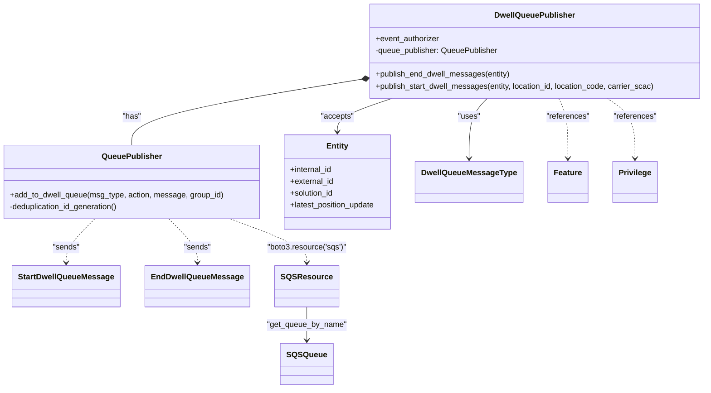
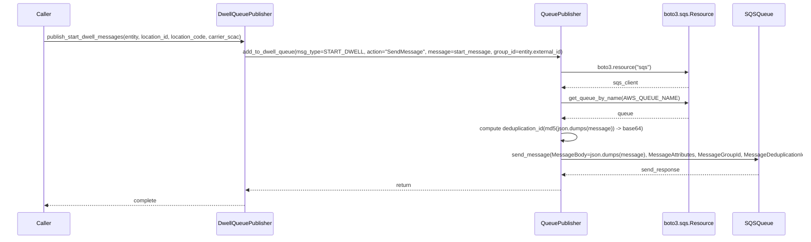
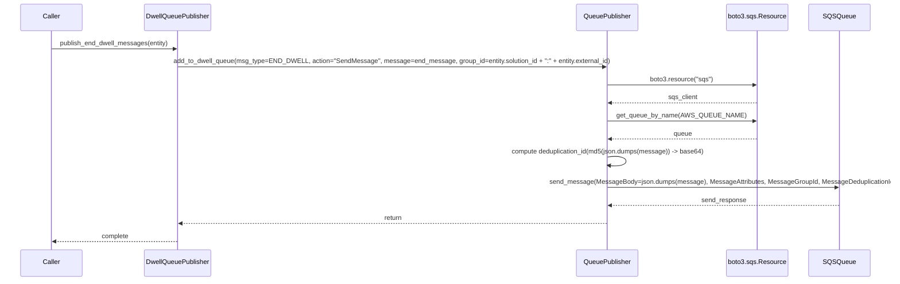

# Diagram: entity_core/entity_service/entity_service/dwell/location_based_dwell/queue_publisher.py

> Auto-generated by Obscura crawlers

## Diagram 1

### SVG

<svg id="container" width="1425.86328125" xmlns="http://www.w3.org/2000/svg" class="classDiagram" height="790" viewBox="0 0 1425.86328125 790" role="graphics-document document" aria-roledescription="class"><g><defs><marker id="container_class-aggregationStart" class="marker aggregation class" refX="18" refY="7" markerWidth="190" markerHeight="240" orient="auto"><path d="M 18,7 L9,13 L1,7 L9,1 Z"></path></marker></defs><defs><marker id="container_class-aggregationEnd" class="marker aggregation class" refX="1" refY="7" markerWidth="20" markerHeight="28" orient="auto"><path d="M 18,7 L9,13 L1,7 L9,1 Z"></path></marker></defs><defs><marker id="container_class-extensionStart" class="marker extension class" refX="18" refY="7" markerWidth="190" markerHeight="240" orient="auto"><path d="M 1,7 L18,13 V 1 Z"></path></marker></defs><defs><marker id="container_class-extensionEnd" class="marker extension class" refX="1" refY="7" markerWidth="20" markerHeight="28" orient="auto"><path d="M 1,1 V 13 L18,7 Z"></path></marker></defs><defs><marker id="container_class-compositionStart" class="marker composition class" refX="18" refY="7" markerWidth="190" markerHeight="240" orient="auto"><path d="M 18,7 L9,13 L1,7 L9,1 Z"></path></marker></defs><defs><marker id="container_class-compositionEnd" class="marker composition class" refX="1" refY="7" markerWidth="20" markerHeight="28" orient="auto"><path d="M 18,7 L9,13 L1,7 L9,1 Z"></path></marker></defs><defs><marker id="container_class-dependencyStart" class="marker dependency class" refX="6" refY="7" markerWidth="190" markerHeight="240" orient="auto"><path d="M 5,7 L9,13 L1,7 L9,1 Z"></path></marker></defs><defs><marker id="container_class-dependencyEnd" class="marker dependency class" refX="13" refY="7" markerWidth="20" markerHeight="28" orient="auto"><path d="M 18,7 L9,13 L14,7 L9,1 Z"></path></marker></defs><defs><marker id="container_class-lollipopStart" class="marker lollipop class" refX="13" refY="7" markerWidth="190" markerHeight="240" orient="auto"><circle stroke="black" fill="transparent" cx="7" cy="7" r="6"></circle></marker></defs><defs><marker id="container_class-lollipopEnd" class="marker lollipop class" refX="1" refY="7" markerWidth="190" markerHeight="240" orient="auto"><circle stroke="black" fill="transparent" cx="7" cy="7" r="6"></circle></marker></defs><g class="root"><g class="clusters"></g><g class="edgePaths"><path d="M722.77,162.287L646.704,174.74C570.638,187.192,418.507,212.096,342.441,234.215C266.375,256.333,266.375,275.667,266.375,285.333L266.375,295" id="id_DwellQueuePublisher_QueuePublisher_1" class="edge-thickness-normal edge-pattern-solid relation" style=";;;" data-edge="true" data-et="edge" data-id="id_DwellQueuePublisher_QueuePublisher_1" data-points="W3sieCI6NzM5Ljc5Mjk2ODc1LCJ5IjoxNTkuNTAwNjQ5MDc1OTA4MjN9LHsieCI6MjY2LjM3NSwieSI6MjM3fSx7IngiOjI2Ni4zNzUsInkiOjI5NX1d" marker-start="url(#container_class-compositionStart)"></path><path d="M794.956,200L776.721,206.167C758.486,212.333,722.017,224.667,703.782,236C685.547,247.333,685.547,257.667,685.547,262.833L685.547,268" id="id_DwellQueuePublisher_Entity_2" class="edge-thickness-normal edge-pattern-solid relation" style=";;;" data-edge="true" data-et="edge" data-id="id_DwellQueuePublisher_Entity_2" data-points="W3sieCI6Nzk0Ljk1NTk0NDU0ODg3MjEsInkiOjIwMH0seyJ4Ijo2ODUuNTQ2ODc1LCJ5IjoyMzd9LHsieCI6Njg1LjU0Njg3NSwieSI6Mjc0fV0=" marker-end="url(#container_class-dependencyEnd)"></path><path d="M986.42,200L980.484,206.167C974.548,212.333,962.677,224.667,956.741,245C950.805,265.333,950.805,293.667,950.805,307.833L950.805,322" id="id_DwellQueuePublisher_DwellQueueMessageType_3" class="edge-thickness-normal edge-pattern-solid relation" style=";;;" data-edge="true" data-et="edge" data-id="id_DwellQueuePublisher_DwellQueueMessageType_3" data-points="W3sieCI6OTg2LjQyMDIzMDI2MzE1NzksInkiOjIwMH0seyJ4Ijo5NTAuODA0Njg3NSwieSI6MjM3fSx7IngiOjk1MC44MDQ2ODc1LCJ5IjozMjh9XQ==" marker-end="url(#container_class-dependencyEnd)"></path><path d="M457.413,445L482.035,454.667C506.658,464.333,555.903,483.667,580.526,498.5C605.148,513.333,605.148,523.667,605.148,528.833L605.148,534" id="id_QueuePublisher_SQSResource_4" class="edge-thickness-normal edge-pattern-dashed relation" style=";;;" data-edge="true" data-et="edge" data-id="id_QueuePublisher_SQSResource_4" data-points="W3sieCI6NDU3LjQxMjY1MjcyNTU2MzkzLCJ5Ijo0NDV9LHsieCI6NjA1LjE0ODQzNzUsInkiOjUwM30seyJ4Ijo2MDUuMTQ4NDM3NSwieSI6NTQwfV0=" marker-end="url(#container_class-dependencyEnd)"></path><path d="M605.148,624L605.148,630.167C605.148,636.333,605.148,648.667,605.148,660C605.148,671.333,605.148,681.667,605.148,686.833L605.148,692" id="id_SQSResource_SQSQueue_5" class="edge-thickness-normal edge-pattern-solid relation" style=";;;" data-edge="true" data-et="edge" data-id="id_SQSResource_SQSQueue_5" data-points="W3sieCI6NjA1LjE0ODQzNzUsInkiOjYyNH0seyJ4Ijo2MDUuMTQ4NDM3NSwieSI6NjYxfSx7IngiOjYwNS4xNDg0Mzc1LCJ5Ijo2OTh9XQ==" marker-end="url(#container_class-dependencyEnd)"></path><path d="M194.181,445L184.876,454.667C175.571,464.333,156.961,483.667,147.657,498.5C138.352,513.333,138.352,523.667,138.352,528.833L138.352,534" id="id_QueuePublisher_StartDwellQueueMessage_6" class="edge-thickness-normal edge-pattern-dashed relation" style=";;;" data-edge="true" data-et="edge" data-id="id_QueuePublisher_StartDwellQueueMessage_6" data-points="W3sieCI6MTk0LjE4MTMzMjIzNjg0MjEsInkiOjQ0NX0seyJ4IjoxMzguMzUxNTYyNSwieSI6NTAzfSx7IngiOjEzOC4zNTE1NjI1LCJ5Ijo1NDB9XQ==" marker-end="url(#container_class-dependencyEnd)"></path><path d="M338.569,445L347.874,454.667C357.179,464.333,375.789,483.667,385.093,498.5C394.398,513.333,394.398,523.667,394.398,528.833L394.398,534" id="id_QueuePublisher_EndDwellQueueMessage_7" class="edge-thickness-normal edge-pattern-dashed relation" style=";;;" data-edge="true" data-et="edge" data-id="id_QueuePublisher_EndDwellQueueMessage_7" data-points="W3sieCI6MzM4LjU2ODY2Nzc2MzE1NzksInkiOjQ0NX0seyJ4IjozOTQuMzk4NDM3NSwieSI6NTAzfSx7IngiOjM5NC4zOTg0Mzc1LCJ5Ijo1NDB9XQ==" marker-end="url(#container_class-dependencyEnd)"></path><path d="M1126.343,200L1129.395,206.167C1132.448,212.333,1138.552,224.667,1141.604,245C1144.656,265.333,1144.656,293.667,1144.656,307.833L1144.656,322" id="id_DwellQueuePublisher_Feature_8" class="edge-thickness-normal edge-pattern-dashed relation" style=";;;" data-edge="true" data-et="edge" data-id="id_DwellQueuePublisher_Feature_8" data-points="W3sieCI6MTEyNi4zNDMxNjI1OTM5ODUsInkiOjIwMH0seyJ4IjoxMTQ0LjY1NjI1LCJ5IjoyMzd9LHsieCI6MTE0NC42NTYyNSwieSI6MzI4fV0=" marker-end="url(#container_class-dependencyEnd)"></path><path d="M1222.529,200L1231.76,206.167C1240.991,212.333,1259.452,224.667,1268.683,245C1277.914,265.333,1277.914,293.667,1277.914,307.833L1277.914,322" id="id_DwellQueuePublisher_Privilege_9" class="edge-thickness-normal edge-pattern-dashed relation" style=";;;" data-edge="true" data-et="edge" data-id="id_DwellQueuePublisher_Privilege_9" data-points="W3sieCI6MTIyMi41MjkyNTI4MTk1NDksInkiOjIwMH0seyJ4IjoxMjc3LjkxNDA2MjUsInkiOjIzN30seyJ4IjoxMjc3LjkxNDA2MjUsInkiOjMyOH1d" marker-end="url(#container_class-dependencyEnd)"></path></g><g class="edgeLabels"><g class="edgeLabel" transform="translate(266.375, 237)"><g class="label" data-id="id_DwellQueuePublisher_QueuePublisher_1" transform="translate(-18.9609375, -12)"><foreignObject width="37.921875" height="24">

"has"

</foreignObject></g></g><g class="edgeLabel" transform="translate(685.546875, 237)"><g class="label" data-id="id_DwellQueuePublisher_Entity_2" transform="translate(-33.5625, -12)"><foreignObject width="67.125" height="24">

"accepts"

</foreignObject></g></g><g class="edgeLabel" transform="translate(950.8046875, 237)"><g class="label" data-id="id_DwellQueuePublisher_DwellQueueMessageType_3" transform="translate(-22.7578125, -12)"><foreignObject width="45.515625" height="24">

"uses"

</foreignObject></g></g><g class="edgeLabel" transform="translate(605.1484375, 503)"><g class="label" data-id="id_QueuePublisher_SQSResource_4" transform="translate(-80.890625, -12)"><foreignObject width="161.78125" height="24">

"boto3.resource('sqs')"

</foreignObject></g></g><g class="edgeLabel" transform="translate(605.1484375, 661)"><g class="label" data-id="id_SQSResource_SQSQueue_5" transform="translate(-81.234375, -12)"><foreignObject width="162.46875" height="24">

"get_queue_by_name"

</foreignObject></g></g><g class="edgeLabel" transform="translate(138.3515625, 503)"><g class="label" data-id="id_QueuePublisher_StartDwellQueueMessage_6" transform="translate(-27.4921875, -12)"><foreignObject width="54.984375" height="24">

"sends"

</foreignObject></g></g><g class="edgeLabel" transform="translate(394.3984375, 503)"><g class="label" data-id="id_QueuePublisher_EndDwellQueueMessage_7" transform="translate(-27.4921875, -12)"><foreignObject width="54.984375" height="24">

"sends"

</foreignObject></g></g><g class="edgeLabel" transform="translate(1144.65625, 237)"><g class="label" data-id="id_DwellQueuePublisher_Feature_8" transform="translate(-44.09375, -12)"><foreignObject width="88.1875" height="24">

"references"

</foreignObject></g></g><g class="edgeLabel" transform="translate(1277.9140625, 237)"><g class="label" data-id="id_DwellQueuePublisher_Privilege_9" transform="translate(-44.09375, -12)"><foreignObject width="88.1875" height="24">

"references"

</foreignObject></g></g></g><g class="nodes"><g class="node default" id="classId-QueuePublisher-0" transform="translate(266.375, 370)"><g class="basic label-container"><path d="M-258.375 -75 L258.375 -75 L258.375 75 L-258.375 75" stroke="none" stroke-width="0" fill="#ECECFF" style=""></path><path d="M-258.375 -75 C-153.6818219351757 -75, -48.98864387035138 -75, 258.375 -75 M-258.375 -75 C-143.08722830541947 -75, -27.799456610838945 -75, 258.375 -75 M258.375 -75 C258.375 -34.8634842942089, 258.375 5.2730314115821955, 258.375 75 M258.375 -75 C258.375 -27.90831040162314, 258.375 19.18337919675372, 258.375 75 M258.375 75 C115.19271427966581 75, -27.989571440668385 75, -258.375 75 M258.375 75 C121.68829213380971 75, -14.998415732380579 75, -258.375 75 M-258.375 75 C-258.375 22.061464830071593, -258.375 -30.877070339856814, -258.375 -75 M-258.375 75 C-258.375 34.70561022766272, -258.375 -5.588779544674566, -258.375 -75" stroke="#9370DB" stroke-width="1.3" fill="none" stroke-dasharray="0 0" style=""></path></g><g class="annotation-group text" transform="translate(0, -51)"></g><g class="label-group text" transform="translate(-58.1875, -51)"><g class="label" style="font-weight: bolder" transform="translate(0,-12)"><foreignObject width="116.375" height="24">

QueuePublisher

</foreignObject></g></g><g class="members-group text" transform="translate(-246.375, -3)"></g><g class="methods-group text" transform="translate(-246.375, 27)"><g class="label" style="" transform="translate(0,-12)"><foreignObject width="434.5625" height="24">

+add_to_dwell_queue(msg_type, action, message, group_id)

</foreignObject></g><g class="label" style="" transform="translate(0,12)"><foreignObject width="226.96875" height="24">

-deduplication_id_generation()

</foreignObject></g></g><g class="divider" style=""><path d="M-258.375 -27 C-56.4224747405074 -27, 145.5300505189852 -27, 258.375 -27 M-258.375 -27 C-58.32102453336947 -27, 141.73295093326107 -27, 258.375 -27" stroke="#9370DB" stroke-width="1.3" fill="none" stroke-dasharray="0 0" style=""></path></g><g class="divider" style=""><path d="M-258.375 -3 C-77.90325511883873 -3, 102.56848976232254 -3, 258.375 -3 M-258.375 -3 C-110.70719035748195 -3, 36.9606192850361 -3, 258.375 -3" stroke="#9370DB" stroke-width="1.3" fill="none" stroke-dasharray="0 0" style=""></path></g></g><g class="node default" id="classId-DwellQueuePublisher-1" transform="translate(1078.828125, 104)"><g class="basic label-container"><path d="M-339.03515625 -96 L339.03515625 -96 L339.03515625 96 L-339.03515625 96" stroke="none" stroke-width="0" fill="#ECECFF" style=""></path><path d="M-339.03515625 -96 C-169.9444641764845 -96, -0.8537721029690033 -96, 339.03515625 -96 M-339.03515625 -96 C-156.73649138831283 -96, 25.562173473374344 -96, 339.03515625 -96 M339.03515625 -96 C339.03515625 -28.92730397258009, 339.03515625 38.14539205483982, 339.03515625 96 M339.03515625 -96 C339.03515625 -53.06354583403732, 339.03515625 -10.127091668074641, 339.03515625 96 M339.03515625 96 C108.41571577212335 96, -122.2037247057533 96, -339.03515625 96 M339.03515625 96 C137.44685683177985 96, -64.14144258644029 96, -339.03515625 96 M-339.03515625 96 C-339.03515625 45.34594872090483, -339.03515625 -5.308102558190342, -339.03515625 -96 M-339.03515625 96 C-339.03515625 25.45914283388693, -339.03515625 -45.08171433222614, -339.03515625 -96" stroke="#9370DB" stroke-width="1.3" fill="none" stroke-dasharray="0 0" style=""></path></g><g class="annotation-group text" transform="translate(0, -72)"></g><g class="label-group text" transform="translate(-78.5546875, -72)"><g class="label" style="font-weight: bolder" transform="translate(0,-12)"><foreignObject width="157.109375" height="24">

DwellQueuePublisher

</foreignObject></g></g><g class="members-group text" transform="translate(-327.03515625, -24)"><g class="label" style="" transform="translate(0,-12)"><foreignObject width="131.296875" height="24">

+event_authorizer

</foreignObject></g><g class="label" style="" transform="translate(0,12)"><foreignObject width="253.34375" height="24">

-queue_publisher: QueuePublisher

</foreignObject></g></g><g class="methods-group text" transform="translate(-327.03515625, 48)"><g class="label" style="" transform="translate(0,-12)"><foreignObject width="275.65625" height="24">

+publish_end_dwell_messages(entity)

</foreignObject></g><g class="label" style="" transform="translate(0,12)"><foreignObject width="575.515625" height="24">

+publish_start_dwell_messages(entity, location_id, location_code, carrier_scac)

</foreignObject></g></g><g class="divider" style=""><path d="M-339.03515625 -48 C-193.77844922150237 -48, -48.52174219300474 -48, 339.03515625 -48 M-339.03515625 -48 C-157.7434673813204 -48, 23.54822148735923 -48, 339.03515625 -48" stroke="#9370DB" stroke-width="1.3" fill="none" stroke-dasharray="0 0" style=""></path></g><g class="divider" style=""><path d="M-339.03515625 24 C-198.03027098696123 24, -57.025385723922454 24, 339.03515625 24 M-339.03515625 24 C-90.19540618142466 24, 158.64434388715068 24, 339.03515625 24" stroke="#9370DB" stroke-width="1.3" fill="none" stroke-dasharray="0 0" style=""></path></g></g><g class="node default" id="classId-Entity-2" transform="translate(685.546875, 370)"><g class="basic label-container"><path d="M-110.796875 -96 L110.796875 -96 L110.796875 96 L-110.796875 96" stroke="none" stroke-width="0" fill="#ECECFF" style=""></path><path d="M-110.796875 -96 C-63.81883813660702 -96, -16.84080127321404 -96, 110.796875 -96 M-110.796875 -96 C-25.817971924100107 -96, 59.16093115179979 -96, 110.796875 -96 M110.796875 -96 C110.796875 -45.46476289183447, 110.796875 5.070474216331064, 110.796875 96 M110.796875 -96 C110.796875 -48.153745684247085, 110.796875 -0.30749136849416914, 110.796875 96 M110.796875 96 C64.98509567929506 96, 19.173316358590128 96, -110.796875 96 M110.796875 96 C36.45283013997613 96, -37.89121472004774 96, -110.796875 96 M-110.796875 96 C-110.796875 54.302369547948345, -110.796875 12.60473909589669, -110.796875 -96 M-110.796875 96 C-110.796875 22.022645409257862, -110.796875 -51.954709181484276, -110.796875 -96" stroke="#9370DB" stroke-width="1.3" fill="none" stroke-dasharray="0 0" style=""></path></g><g class="annotation-group text" transform="translate(0, -72)"></g><g class="label-group text" transform="translate(-21.28125, -72)"><g class="label" style="font-weight: bolder" transform="translate(0,-12)"><foreignObject width="42.5625" height="24">

Entity

</foreignObject></g></g><g class="members-group text" transform="translate(-98.796875, -24)"><g class="label" style="" transform="translate(0,-12)"><foreignObject width="87.3125" height="24">

+internal_id

</foreignObject></g><g class="label" style="" transform="translate(0,12)"><foreignObject width="89.765625" height="24">

+external_id

</foreignObject></g><g class="label" style="" transform="translate(0,36)"><foreignObject width="90.21875" height="24">

+solution_id

</foreignObject></g><g class="label" style="" transform="translate(0,60)"><foreignObject width="176.3125" height="24">

+latest_position_update

</foreignObject></g></g><g class="methods-group text" transform="translate(-98.796875, 96)"></g><g class="divider" style=""><path d="M-110.796875 -48 C-60.971387279997224 -48, -11.145899559994447 -48, 110.796875 -48 M-110.796875 -48 C-31.101150585312155 -48, 48.59457382937569 -48, 110.796875 -48" stroke="#9370DB" stroke-width="1.3" fill="none" stroke-dasharray="0 0" style=""></path></g><g class="divider" style=""><path d="M-110.796875 72 C-48.67120304933953 72, 13.454468901320936 72, 110.796875 72 M-110.796875 72 C-28.722497013125746 72, 53.35188097374851 72, 110.796875 72" stroke="#9370DB" stroke-width="1.3" fill="none" stroke-dasharray="0 0" style=""></path></g></g><g class="node default" id="classId-DwellQueueMessageType-3" transform="translate(950.8046875, 370)"><g class="basic label-container"><path d="M-104.4609375 -42 L104.4609375 -42 L104.4609375 42 L-104.4609375 42" stroke="none" stroke-width="0" fill="#ECECFF" style=""></path><path d="M-104.4609375 -42 C-51.25338928226619 -42, 1.9541589354676177 -42, 104.4609375 -42 M-104.4609375 -42 C-24.739717836806335 -42, 54.98150182638733 -42, 104.4609375 -42 M104.4609375 -42 C104.4609375 -10.31755870714747, 104.4609375 21.36488258570506, 104.4609375 42 M104.4609375 -42 C104.4609375 -11.699166124037614, 104.4609375 18.601667751924772, 104.4609375 42 M104.4609375 42 C56.29689508344136 42, 8.132852666882727 42, -104.4609375 42 M104.4609375 42 C33.93289865075458 42, -36.59514019849084 42, -104.4609375 42 M-104.4609375 42 C-104.4609375 23.6559387741029, -104.4609375 5.3118775482058, -104.4609375 -42 M-104.4609375 42 C-104.4609375 11.50447083256666, -104.4609375 -18.99105833486668, -104.4609375 -42" stroke="#9370DB" stroke-width="1.3" fill="none" stroke-dasharray="0 0" style=""></path></g><g class="annotation-group text" transform="translate(0, -18)"></g><g class="label-group text" transform="translate(-92.4609375, -18)"><g class="label" style="font-weight: bolder" transform="translate(0,-12)"><foreignObject width="184.921875" height="24">

DwellQueueMessageType

</foreignObject></g></g><g class="members-group text" transform="translate(-92.4609375, 30)"></g><g class="methods-group text" transform="translate(-92.4609375, 60)"></g><g class="divider" style=""><path d="M-104.4609375 6 C-33.395094501813944 6, 37.67074849637211 6, 104.4609375 6 M-104.4609375 6 C-59.14519666321861 6, -13.829455826437226 6, 104.4609375 6" stroke="#9370DB" stroke-width="1.3" fill="none" stroke-dasharray="0 0" style=""></path></g><g class="divider" style=""><path d="M-104.4609375 24 C-28.50063425457307 24, 47.45966899085386 24, 104.4609375 24 M-104.4609375 24 C-37.18635060340168 24, 30.088236293196644 24, 104.4609375 24" stroke="#9370DB" stroke-width="1.3" fill="none" stroke-dasharray="0 0" style=""></path></g></g><g class="node default" id="classId-StartDwellQueueMessage-4" transform="translate(138.3515625, 582)"><g class="basic label-container"><path d="M-105.375 -42 L105.375 -42 L105.375 42 L-105.375 42" stroke="none" stroke-width="0" fill="#ECECFF" style=""></path><path d="M-105.375 -42 C-33.820993102388 -42, 37.733013795224 -42, 105.375 -42 M-105.375 -42 C-41.29116147867421 -42, 22.792677042651576 -42, 105.375 -42 M105.375 -42 C105.375 -8.795780633961606, 105.375 24.40843873207679, 105.375 42 M105.375 -42 C105.375 -11.223138496101217, 105.375 19.553723007797565, 105.375 42 M105.375 42 C56.89149745358069 42, 8.407994907161381 42, -105.375 42 M105.375 42 C31.224028825023623 42, -42.92694234995275 42, -105.375 42 M-105.375 42 C-105.375 14.496836502970861, -105.375 -13.006326994058277, -105.375 -42 M-105.375 42 C-105.375 22.0260554353374, -105.375 2.0521108706748024, -105.375 -42" stroke="#9370DB" stroke-width="1.3" fill="none" stroke-dasharray="0 0" style=""></path></g><g class="annotation-group text" transform="translate(0, -18)"></g><g class="label-group text" transform="translate(-93.375, -18)"><g class="label" style="font-weight: bolder" transform="translate(0,-12)"><foreignObject width="186.75" height="24">

StartDwellQueueMessage

</foreignObject></g></g><g class="members-group text" transform="translate(-93.375, 30)"></g><g class="methods-group text" transform="translate(-93.375, 60)"></g><g class="divider" style=""><path d="M-105.375 6 C-41.09189091078515 6, 23.191218178429693 6, 105.375 6 M-105.375 6 C-26.71637907599876 6, 51.94224184800248 6, 105.375 6" stroke="#9370DB" stroke-width="1.3" fill="none" stroke-dasharray="0 0" style=""></path></g><g class="divider" style=""><path d="M-105.375 24 C-30.511312167706123 24, 44.352375664587754 24, 105.375 24 M-105.375 24 C-34.645368290250886 24, 36.08426341949823 24, 105.375 24" stroke="#9370DB" stroke-width="1.3" fill="none" stroke-dasharray="0 0" style=""></path></g></g><g class="node default" id="classId-EndDwellQueueMessage-5" transform="translate(394.3984375, 582)"><g class="basic label-container"><path d="M-100.671875 -42 L100.671875 -42 L100.671875 42 L-100.671875 42" stroke="none" stroke-width="0" fill="#ECECFF" style=""></path><path d="M-100.671875 -42 C-23.309523660085205 -42, 54.05282767982959 -42, 100.671875 -42 M-100.671875 -42 C-48.1222388843612 -42, 4.427397231277595 -42, 100.671875 -42 M100.671875 -42 C100.671875 -18.853424397694965, 100.671875 4.293151204610069, 100.671875 42 M100.671875 -42 C100.671875 -18.226706258612225, 100.671875 5.54658748277555, 100.671875 42 M100.671875 42 C35.81354869079493 42, -29.044777618410137 42, -100.671875 42 M100.671875 42 C54.288215565895065 42, 7.90455613179013 42, -100.671875 42 M-100.671875 42 C-100.671875 18.2246799479131, -100.671875 -5.550640104173802, -100.671875 -42 M-100.671875 42 C-100.671875 21.85660541727365, -100.671875 1.7132108345472972, -100.671875 -42" stroke="#9370DB" stroke-width="1.3" fill="none" stroke-dasharray="0 0" style=""></path></g><g class="annotation-group text" transform="translate(0, -18)"></g><g class="label-group text" transform="translate(-88.671875, -18)"><g class="label" style="font-weight: bolder" transform="translate(0,-12)"><foreignObject width="177.34375" height="24">

EndDwellQueueMessage

</foreignObject></g></g><g class="members-group text" transform="translate(-88.671875, 30)"></g><g class="methods-group text" transform="translate(-88.671875, 60)"></g><g class="divider" style=""><path d="M-100.671875 6 C-31.63634896834408 6, 37.39917706331184 6, 100.671875 6 M-100.671875 6 C-27.96113823461468 6, 44.74959853077064 6, 100.671875 6" stroke="#9370DB" stroke-width="1.3" fill="none" stroke-dasharray="0 0" style=""></path></g><g class="divider" style=""><path d="M-100.671875 24 C-56.47759226416892 24, -12.283309528337838 24, 100.671875 24 M-100.671875 24 C-60.374599000706894 24, -20.077323001413788 24, 100.671875 24" stroke="#9370DB" stroke-width="1.3" fill="none" stroke-dasharray="0 0" style=""></path></g></g><g class="node default" id="classId-Feature-6" transform="translate(1144.65625, 370)"><g class="basic label-container"><path d="M-39.390625 -42 L39.390625 -42 L39.390625 42 L-39.390625 42" stroke="none" stroke-width="0" fill="#ECECFF" style=""></path><path d="M-39.390625 -42 C-18.016686219619046 -42, 3.357252560761907 -42, 39.390625 -42 M-39.390625 -42 C-18.707913867868267 -42, 1.974797264263465 -42, 39.390625 -42 M39.390625 -42 C39.390625 -11.107389826657077, 39.390625 19.785220346685847, 39.390625 42 M39.390625 -42 C39.390625 -13.207014171112188, 39.390625 15.585971657775623, 39.390625 42 M39.390625 42 C19.926883921507716 42, 0.46314284301543296 42, -39.390625 42 M39.390625 42 C9.434589319519741 42, -20.521446360960518 42, -39.390625 42 M-39.390625 42 C-39.390625 12.830056463136533, -39.390625 -16.339887073726935, -39.390625 -42 M-39.390625 42 C-39.390625 20.876673373659465, -39.390625 -0.24665325268107097, -39.390625 -42" stroke="#9370DB" stroke-width="1.3" fill="none" stroke-dasharray="0 0" style=""></path></g><g class="annotation-group text" transform="translate(0, -18)"></g><g class="label-group text" transform="translate(-27.390625, -18)"><g class="label" style="font-weight: bolder" transform="translate(0,-12)"><foreignObject width="54.78125" height="24">

Feature

</foreignObject></g></g><g class="members-group text" transform="translate(-27.390625, 30)"></g><g class="methods-group text" transform="translate(-27.390625, 60)"></g><g class="divider" style=""><path d="M-39.390625 6 C-12.713142697408678 6, 13.964339605182644 6, 39.390625 6 M-39.390625 6 C-14.369758036700997 6, 10.651108926598006 6, 39.390625 6" stroke="#9370DB" stroke-width="1.3" fill="none" stroke-dasharray="0 0" style=""></path></g><g class="divider" style=""><path d="M-39.390625 24 C-8.898837150605065 24, 21.59295069878987 24, 39.390625 24 M-39.390625 24 C-14.240237495980853 24, 10.910150008038293 24, 39.390625 24" stroke="#9370DB" stroke-width="1.3" fill="none" stroke-dasharray="0 0" style=""></path></g></g><g class="node default" id="classId-Privilege-7" transform="translate(1277.9140625, 370)"><g class="basic label-container"><path d="M-43.8671875 -42 L43.8671875 -42 L43.8671875 42 L-43.8671875 42" stroke="none" stroke-width="0" fill="#ECECFF" style=""></path><path d="M-43.8671875 -42 C-18.5908844893584 -42, 6.6854185212831965 -42, 43.8671875 -42 M-43.8671875 -42 C-25.68783536258056 -42, -7.508483225161122 -42, 43.8671875 -42 M43.8671875 -42 C43.8671875 -13.651850491555564, 43.8671875 14.696299016888872, 43.8671875 42 M43.8671875 -42 C43.8671875 -22.155610284559042, 43.8671875 -2.3112205691180847, 43.8671875 42 M43.8671875 42 C24.695837926370757 42, 5.524488352741514 42, -43.8671875 42 M43.8671875 42 C12.36973217486689 42, -19.12772315026622 42, -43.8671875 42 M-43.8671875 42 C-43.8671875 22.807641830192843, -43.8671875 3.6152836603856855, -43.8671875 -42 M-43.8671875 42 C-43.8671875 20.75468168283583, -43.8671875 -0.4906366343283395, -43.8671875 -42" stroke="#9370DB" stroke-width="1.3" fill="none" stroke-dasharray="0 0" style=""></path></g><g class="annotation-group text" transform="translate(0, -18)"></g><g class="label-group text" transform="translate(-31.8671875, -18)"><g class="label" style="font-weight: bolder" transform="translate(0,-12)"><foreignObject width="63.734375" height="24">

Privilege

</foreignObject></g></g><g class="members-group text" transform="translate(-31.8671875, 30)"></g><g class="methods-group text" transform="translate(-31.8671875, 60)"></g><g class="divider" style=""><path d="M-43.8671875 6 C-24.03042854395711 6, -4.193669587914222 6, 43.8671875 6 M-43.8671875 6 C-13.582103681069245 6, 16.70298013786151 6, 43.8671875 6" stroke="#9370DB" stroke-width="1.3" fill="none" stroke-dasharray="0 0" style=""></path></g><g class="divider" style=""><path d="M-43.8671875 24 C-14.868723947583444 24, 14.129739604833112 24, 43.8671875 24 M-43.8671875 24 C-9.314683582904578 24, 25.237820334190843 24, 43.8671875 24" stroke="#9370DB" stroke-width="1.3" fill="none" stroke-dasharray="0 0" style=""></path></g></g><g class="node default" id="classId-SQSResource-8" transform="translate(605.1484375, 582)"><g class="basic label-container"><path d="M-60.078125 -42 L60.078125 -42 L60.078125 42 L-60.078125 42" stroke="none" stroke-width="0" fill="#ECECFF" style=""></path><path d="M-60.078125 -42 C-31.592595592939404 -42, -3.107066185878807 -42, 60.078125 -42 M-60.078125 -42 C-18.10290431844964 -42, 23.872316363100722 -42, 60.078125 -42 M60.078125 -42 C60.078125 -20.017569543712682, 60.078125 1.9648609125746361, 60.078125 42 M60.078125 -42 C60.078125 -14.148817719626269, 60.078125 13.702364560747462, 60.078125 42 M60.078125 42 C27.33258169003718 42, -5.412961619925639 42, -60.078125 42 M60.078125 42 C35.12008675540663 42, 10.162048510813264 42, -60.078125 42 M-60.078125 42 C-60.078125 17.22784752190648, -60.078125 -7.544304956187041, -60.078125 -42 M-60.078125 42 C-60.078125 11.621380806682097, -60.078125 -18.757238386635805, -60.078125 -42" stroke="#9370DB" stroke-width="1.3" fill="none" stroke-dasharray="0 0" style=""></path></g><g class="annotation-group text" transform="translate(0, -18)"></g><g class="label-group text" transform="translate(-48.078125, -18)"><g class="label" style="font-weight: bolder" transform="translate(0,-12)"><foreignObject width="96.15625" height="24">

SQSResource

</foreignObject></g></g><g class="members-group text" transform="translate(-48.078125, 30)"></g><g class="methods-group text" transform="translate(-48.078125, 60)"></g><g class="divider" style=""><path d="M-60.078125 6 C-23.2810746186599 6, 13.515975762680199 6, 60.078125 6 M-60.078125 6 C-12.70934620731331 6, 34.65943258537338 6, 60.078125 6" stroke="#9370DB" stroke-width="1.3" fill="none" stroke-dasharray="0 0" style=""></path></g><g class="divider" style=""><path d="M-60.078125 24 C-32.64024496516181 24, -5.2023649303236255 24, 60.078125 24 M-60.078125 24 C-34.80690022889273 24, -9.535675457785466 24, 60.078125 24" stroke="#9370DB" stroke-width="1.3" fill="none" stroke-dasharray="0 0" style=""></path></g></g><g class="node default" id="classId-SQSQueue-9" transform="translate(605.1484375, 740)"><g class="basic label-container"><path d="M-50.1796875 -42 L50.1796875 -42 L50.1796875 42 L-50.1796875 42" stroke="none" stroke-width="0" fill="#ECECFF" style=""></path><path d="M-50.1796875 -42 C-12.722839633620296 -42, 24.734008232759408 -42, 50.1796875 -42 M-50.1796875 -42 C-17.107722162478332 -42, 15.964243175043336 -42, 50.1796875 -42 M50.1796875 -42 C50.1796875 -10.160742177120373, 50.1796875 21.678515645759255, 50.1796875 42 M50.1796875 -42 C50.1796875 -17.94689176063456, 50.1796875 6.106216478730879, 50.1796875 42 M50.1796875 42 C20.910038749061037 42, -8.359610001877925 42, -50.1796875 42 M50.1796875 42 C26.58092073053936 42, 2.9821539610787227 42, -50.1796875 42 M-50.1796875 42 C-50.1796875 14.275492219329983, -50.1796875 -13.449015561340033, -50.1796875 -42 M-50.1796875 42 C-50.1796875 11.508145043945152, -50.1796875 -18.983709912109695, -50.1796875 -42" stroke="#9370DB" stroke-width="1.3" fill="none" stroke-dasharray="0 0" style=""></path></g><g class="annotation-group text" transform="translate(0, -18)"></g><g class="label-group text" transform="translate(-38.1796875, -18)"><g class="label" style="font-weight: bolder" transform="translate(0,-12)"><foreignObject width="76.359375" height="24">

SQSQueue

</foreignObject></g></g><g class="members-group text" transform="translate(-38.1796875, 30)"></g><g class="methods-group text" transform="translate(-38.1796875, 60)"></g><g class="divider" style=""><path d="M-50.1796875 6 C-19.00734159626074 6, 12.165004307478519 6, 50.1796875 6 M-50.1796875 6 C-14.85974236318733 6, 20.46020277362534 6, 50.1796875 6" stroke="#9370DB" stroke-width="1.3" fill="none" stroke-dasharray="0 0" style=""></path></g><g class="divider" style=""><path d="M-50.1796875 24 C-24.693649595812555 24, 0.792388308374889 24, 50.1796875 24 M-50.1796875 24 C-12.940030680934989 24, 24.299626138130023 24, 50.1796875 24" stroke="#9370DB" stroke-width="1.3" fill="none" stroke-dasharray="0 0" style=""></path></g></g></g></g></g></svg>

## Diagram 2

### SVG

<svg id="container" width="2427" xmlns="http://www.w3.org/2000/svg" height="729" viewBox="-50 -10 2427 729" role="graphics-document document" aria-roledescription="sequence"><g><rect x="2177" y="643" fill="#eaeaea" stroke="#666" width="150" height="65" name="Queue" rx="3" ry="3" class="actor actor-bottom"></rect><text x="2252" y="675.5" dominant-baseline="central" alignment-baseline="central" class="actor actor-box" style="text-anchor: middle; font-size: 16px; font-weight: 400;"><tspan x="2252" dy="0">SQSQueue</tspan></text></g><g><rect x="1967" y="643" fill="#eaeaea" stroke="#666" width="160" height="65" name="SQSRes" rx="3" ry="3" class="actor actor-bottom"></rect><text x="2047" y="675.5" dominant-baseline="central" alignment-baseline="central" class="actor actor-box" style="text-anchor: middle; font-size: 16px; font-weight: 400;"><tspan x="2047" dy="0">boto3.sqs.Resource</tspan></text></g><g><rect x="1605" y="643" fill="#eaeaea" stroke="#666" width="150" height="65" name="QueuePub" rx="3" ry="3" class="actor actor-bottom"></rect><text x="1680" y="675.5" dominant-baseline="central" alignment-baseline="central" class="actor actor-box" style="text-anchor: middle; font-size: 16px; font-weight: 400;"><tspan x="1680" dy="0">QueuePublisher</tspan></text></g><g><rect x="625" y="643" fill="#eaeaea" stroke="#666" width="176" height="65" name="Dwell" rx="3" ry="3" class="actor actor-bottom"></rect><text x="713" y="675.5" dominant-baseline="central" alignment-baseline="central" class="actor actor-box" style="text-anchor: middle; font-size: 16px; font-weight: 400;"><tspan x="713" dy="0">DwellQueuePublisher</tspan></text></g><g><rect x="0" y="643" fill="#eaeaea" stroke="#666" width="150" height="65" name="Caller" rx="3" ry="3" class="actor actor-bottom"></rect><text x="75" y="675.5" dominant-baseline="central" alignment-baseline="central" class="actor actor-box" style="text-anchor: middle; font-size: 16px; font-weight: 400;"><tspan x="75" dy="0">Caller</tspan></text></g><g><line id="actor4" x1="2252" y1="65" x2="2252" y2="643" class="actor-line 200" stroke-width="0.5px" stroke="#999" name="Queue"></line><g id="root-4"><rect x="2177" y="0" fill="#eaeaea" stroke="#666" width="150" height="65" name="Queue" rx="3" ry="3" class="actor actor-top"></rect><text x="2252" y="32.5" dominant-baseline="central" alignment-baseline="central" class="actor actor-box" style="text-anchor: middle; font-size: 16px; font-weight: 400;"><tspan x="2252" dy="0">SQSQueue</tspan></text></g></g><g><line id="actor3" x1="2047" y1="65" x2="2047" y2="643" class="actor-line 200" stroke-width="0.5px" stroke="#999" name="SQSRes"></line><g id="root-3"><rect x="1967" y="0" fill="#eaeaea" stroke="#666" width="160" height="65" name="SQSRes" rx="3" ry="3" class="actor actor-top"></rect><text x="2047" y="32.5" dominant-baseline="central" alignment-baseline="central" class="actor actor-box" style="text-anchor: middle; font-size: 16px; font-weight: 400;"><tspan x="2047" dy="0">boto3.sqs.Resource</tspan></text></g></g><g><line id="actor2" x1="1680" y1="65" x2="1680" y2="643" class="actor-line 200" stroke-width="0.5px" stroke="#999" name="QueuePub"></line><g id="root-2"><rect x="1605" y="0" fill="#eaeaea" stroke="#666" width="150" height="65" name="QueuePub" rx="3" ry="3" class="actor actor-top"></rect><text x="1680" y="32.5" dominant-baseline="central" alignment-baseline="central" class="actor actor-box" style="text-anchor: middle; font-size: 16px; font-weight: 400;"><tspan x="1680" dy="0">QueuePublisher</tspan></text></g></g><g><line id="actor1" x1="713" y1="65" x2="713" y2="643" class="actor-line 200" stroke-width="0.5px" stroke="#999" name="Dwell"></line><g id="root-1"><rect x="625" y="0" fill="#eaeaea" stroke="#666" width="176" height="65" name="Dwell" rx="3" ry="3" class="actor actor-top"></rect><text x="713" y="32.5" dominant-baseline="central" alignment-baseline="central" class="actor actor-box" style="text-anchor: middle; font-size: 16px; font-weight: 400;"><tspan x="713" dy="0">DwellQueuePublisher</tspan></text></g></g><g><line id="actor0" x1="75" y1="65" x2="75" y2="643" class="actor-line 200" stroke-width="0.5px" stroke="#999" name="Caller"></line><g id="root-0"><rect x="0" y="0" fill="#eaeaea" stroke="#666" width="150" height="65" name="Caller" rx="3" ry="3" class="actor actor-top"></rect><text x="75" y="32.5" dominant-baseline="central" alignment-baseline="central" class="actor actor-box" style="text-anchor: middle; font-size: 16px; font-weight: 400;"><tspan x="75" dy="0">Caller</tspan></text></g></g><g></g><defs><symbol id="computer" width="24" height="24"><path transform="scale(.5)" d="M2 2v13h20v-13h-20zm18 11h-16v-9h16v9zm-10.228 6l.466-1h3.524l.467 1h-4.457zm14.228 3h-24l2-6h2.104l-1.33 4h18.45l-1.297-4h2.073l2 6zm-5-10h-14v-7h14v7z"></path></symbol></defs><defs><symbol id="database" fill-rule="evenodd" clip-rule="evenodd"><path transform="scale(.5)" d="M12.258.001l.256.004.255.005.253.008.251.01.249.012.247.015.246.016.242.019.241.02.239.023.236.024.233.027.231.028.229.031.225.032.223.034.22.036.217.038.214.04.211.041.208.043.205.045.201.046.198.048.194.05.191.051.187.053.183.054.18.056.175.057.172.059.168.06.163.061.16.063.155.064.15.066.074.033.073.033.071.034.07.034.069.035.068.035.067.035.066.035.064.036.064.036.062.036.06.036.06.037.058.037.058.037.055.038.055.038.053.038.052.038.051.039.05.039.048.039.047.039.045.04.044.04.043.04.041.04.04.041.039.041.037.041.036.041.034.041.033.042.032.042.03.042.029.042.027.042.026.043.024.043.023.043.021.043.02.043.018.044.017.043.015.044.013.044.012.044.011.045.009.044.007.045.006.045.004.045.002.045.001.045v17l-.001.045-.002.045-.004.045-.006.045-.007.045-.009.044-.011.045-.012.044-.013.044-.015.044-.017.043-.018.044-.02.043-.021.043-.023.043-.024.043-.026.043-.027.042-.029.042-.03.042-.032.042-.033.042-.034.041-.036.041-.037.041-.039.041-.04.041-.041.04-.043.04-.044.04-.045.04-.047.039-.048.039-.05.039-.051.039-.052.038-.053.038-.055.038-.055.038-.058.037-.058.037-.06.037-.06.036-.062.036-.064.036-.064.036-.066.035-.067.035-.068.035-.069.035-.07.034-.071.034-.073.033-.074.033-.15.066-.155.064-.16.063-.163.061-.168.06-.172.059-.175.057-.18.056-.183.054-.187.053-.191.051-.194.05-.198.048-.201.046-.205.045-.208.043-.211.041-.214.04-.217.038-.22.036-.223.034-.225.032-.229.031-.231.028-.233.027-.236.024-.239.023-.241.02-.242.019-.246.016-.247.015-.249.012-.251.01-.253.008-.255.005-.256.004-.258.001-.258-.001-.256-.004-.255-.005-.253-.008-.251-.01-.249-.012-.247-.015-.245-.016-.243-.019-.241-.02-.238-.023-.236-.024-.234-.027-.231-.028-.228-.031-.226-.032-.223-.034-.22-.036-.217-.038-.214-.04-.211-.041-.208-.043-.204-.045-.201-.046-.198-.048-.195-.05-.19-.051-.187-.053-.184-.054-.179-.056-.176-.057-.172-.059-.167-.06-.164-.061-.159-.063-.155-.064-.151-.066-.074-.033-.072-.033-.072-.034-.07-.034-.069-.035-.068-.035-.067-.035-.066-.035-.064-.036-.063-.036-.062-.036-.061-.036-.06-.037-.058-.037-.057-.037-.056-.038-.055-.038-.053-.038-.052-.038-.051-.039-.049-.039-.049-.039-.046-.039-.046-.04-.044-.04-.043-.04-.041-.04-.04-.041-.039-.041-.037-.041-.036-.041-.034-.041-.033-.042-.032-.042-.03-.042-.029-.042-.027-.042-.026-.043-.024-.043-.023-.043-.021-.043-.02-.043-.018-.044-.017-.043-.015-.044-.013-.044-.012-.044-.011-.045-.009-.044-.007-.045-.006-.045-.004-.045-.002-.045-.001-.045v-17l.001-.045.002-.045.004-.045.006-.045.007-.045.009-.044.011-.045.012-.044.013-.044.015-.044.017-.043.018-.044.02-.043.021-.043.023-.043.024-.043.026-.043.027-.042.029-.042.03-.042.032-.042.033-.042.034-.041.036-.041.037-.041.039-.041.04-.041.041-.04.043-.04.044-.04.046-.04.046-.039.049-.039.049-.039.051-.039.052-.038.053-.038.055-.038.056-.038.057-.037.058-.037.06-.037.061-.036.062-.036.063-.036.064-.036.066-.035.067-.035.068-.035.069-.035.07-.034.072-.034.072-.033.074-.033.151-.066.155-.064.159-.063.164-.061.167-.06.172-.059.176-.057.179-.056.184-.054.187-.053.19-.051.195-.05.198-.048.201-.046.204-.045.208-.043.211-.041.214-.04.217-.038.22-.036.223-.034.226-.032.228-.031.231-.028.234-.027.236-.024.238-.023.241-.02.243-.019.245-.016.247-.015.249-.012.251-.01.253-.008.255-.005.256-.004.258-.001.258.001zm-9.258 20.499v.01l.001.021.003.021.004.022.005.021.006.022.007.022.009.023.01.022.011.023.012.023.013.023.015.023.016.024.017.023.018.024.019.024.021.024.022.025.023.024.024.025.052.049.056.05.061.051.066.051.07.051.075.051.079.052.084.052.088.052.092.052.097.052.102.051.105.052.11.052.114.051.119.051.123.051.127.05.131.05.135.05.139.048.144.049.147.047.152.047.155.047.16.045.163.045.167.043.171.043.176.041.178.041.183.039.187.039.19.037.194.035.197.035.202.033.204.031.209.03.212.029.216.027.219.025.222.024.226.021.23.02.233.018.236.016.24.015.243.012.246.01.249.008.253.005.256.004.259.001.26-.001.257-.004.254-.005.25-.008.247-.011.244-.012.241-.014.237-.016.233-.018.231-.021.226-.021.224-.024.22-.026.216-.027.212-.028.21-.031.205-.031.202-.034.198-.034.194-.036.191-.037.187-.039.183-.04.179-.04.175-.042.172-.043.168-.044.163-.045.16-.046.155-.046.152-.047.148-.048.143-.049.139-.049.136-.05.131-.05.126-.05.123-.051.118-.052.114-.051.11-.052.106-.052.101-.052.096-.052.092-.052.088-.053.083-.051.079-.052.074-.052.07-.051.065-.051.06-.051.056-.05.051-.05.023-.024.023-.025.021-.024.02-.024.019-.024.018-.024.017-.024.015-.023.014-.024.013-.023.012-.023.01-.023.01-.022.008-.022.006-.022.006-.022.004-.022.004-.021.001-.021.001-.021v-4.127l-.077.055-.08.053-.083.054-.085.053-.087.052-.09.052-.093.051-.095.05-.097.05-.1.049-.102.049-.105.048-.106.047-.109.047-.111.046-.114.045-.115.045-.118.044-.12.043-.122.042-.124.042-.126.041-.128.04-.13.04-.132.038-.134.038-.135.037-.138.037-.139.035-.142.035-.143.034-.144.033-.147.032-.148.031-.15.03-.151.03-.153.029-.154.027-.156.027-.158.026-.159.025-.161.024-.162.023-.163.022-.165.021-.166.02-.167.019-.169.018-.169.017-.171.016-.173.015-.173.014-.175.013-.175.012-.177.011-.178.01-.179.008-.179.008-.181.006-.182.005-.182.004-.184.003-.184.002h-.37l-.184-.002-.184-.003-.182-.004-.182-.005-.181-.006-.179-.008-.179-.008-.178-.01-.176-.011-.176-.012-.175-.013-.173-.014-.172-.015-.171-.016-.17-.017-.169-.018-.167-.019-.166-.02-.165-.021-.163-.022-.162-.023-.161-.024-.159-.025-.157-.026-.156-.027-.155-.027-.153-.029-.151-.03-.15-.03-.148-.031-.146-.032-.145-.033-.143-.034-.141-.035-.14-.035-.137-.037-.136-.037-.134-.038-.132-.038-.13-.04-.128-.04-.126-.041-.124-.042-.122-.042-.12-.044-.117-.043-.116-.045-.113-.045-.112-.046-.109-.047-.106-.047-.105-.048-.102-.049-.1-.049-.097-.05-.095-.05-.093-.052-.09-.051-.087-.052-.085-.053-.083-.054-.08-.054-.077-.054v4.127zm0-5.654v.011l.001.021.003.021.004.021.005.022.006.022.007.022.009.022.01.022.011.023.012.023.013.023.015.024.016.023.017.024.018.024.019.024.021.024.022.024.023.025.024.024.052.05.056.05.061.05.066.051.07.051.075.052.079.051.084.052.088.052.092.052.097.052.102.052.105.052.11.051.114.051.119.052.123.05.127.051.131.05.135.049.139.049.144.048.147.048.152.047.155.046.16.045.163.045.167.044.171.042.176.042.178.04.183.04.187.038.19.037.194.036.197.034.202.033.204.032.209.03.212.028.216.027.219.025.222.024.226.022.23.02.233.018.236.016.24.014.243.012.246.01.249.008.253.006.256.003.259.001.26-.001.257-.003.254-.006.25-.008.247-.01.244-.012.241-.015.237-.016.233-.018.231-.02.226-.022.224-.024.22-.025.216-.027.212-.029.21-.03.205-.032.202-.033.198-.035.194-.036.191-.037.187-.039.183-.039.179-.041.175-.042.172-.043.168-.044.163-.045.16-.045.155-.047.152-.047.148-.048.143-.048.139-.05.136-.049.131-.05.126-.051.123-.051.118-.051.114-.052.11-.052.106-.052.101-.052.096-.052.092-.052.088-.052.083-.052.079-.052.074-.051.07-.052.065-.051.06-.05.056-.051.051-.049.023-.025.023-.024.021-.025.02-.024.019-.024.018-.024.017-.024.015-.023.014-.023.013-.024.012-.022.01-.023.01-.023.008-.022.006-.022.006-.022.004-.021.004-.022.001-.021.001-.021v-4.139l-.077.054-.08.054-.083.054-.085.052-.087.053-.09.051-.093.051-.095.051-.097.05-.1.049-.102.049-.105.048-.106.047-.109.047-.111.046-.114.045-.115.044-.118.044-.12.044-.122.042-.124.042-.126.041-.128.04-.13.039-.132.039-.134.038-.135.037-.138.036-.139.036-.142.035-.143.033-.144.033-.147.033-.148.031-.15.03-.151.03-.153.028-.154.028-.156.027-.158.026-.159.025-.161.024-.162.023-.163.022-.165.021-.166.02-.167.019-.169.018-.169.017-.171.016-.173.015-.173.014-.175.013-.175.012-.177.011-.178.009-.179.009-.179.007-.181.007-.182.005-.182.004-.184.003-.184.002h-.37l-.184-.002-.184-.003-.182-.004-.182-.005-.181-.007-.179-.007-.179-.009-.178-.009-.176-.011-.176-.012-.175-.013-.173-.014-.172-.015-.171-.016-.17-.017-.169-.018-.167-.019-.166-.02-.165-.021-.163-.022-.162-.023-.161-.024-.159-.025-.157-.026-.156-.027-.155-.028-.153-.028-.151-.03-.15-.03-.148-.031-.146-.033-.145-.033-.143-.033-.141-.035-.14-.036-.137-.036-.136-.037-.134-.038-.132-.039-.13-.039-.128-.04-.126-.041-.124-.042-.122-.043-.12-.043-.117-.044-.116-.044-.113-.046-.112-.046-.109-.046-.106-.047-.105-.048-.102-.049-.1-.049-.097-.05-.095-.051-.093-.051-.09-.051-.087-.053-.085-.052-.083-.054-.08-.054-.077-.054v4.139zm0-5.666v.011l.001.02.003.022.004.021.005.022.006.021.007.022.009.023.01.022.011.023.012.023.013.023.015.023.016.024.017.024.018.023.019.024.021.025.022.024.023.024.024.025.052.05.056.05.061.05.066.051.07.051.075.052.079.051.084.052.088.052.092.052.097.052.102.052.105.051.11.052.114.051.119.051.123.051.127.05.131.05.135.05.139.049.144.048.147.048.152.047.155.046.16.045.163.045.167.043.171.043.176.042.178.04.183.04.187.038.19.037.194.036.197.034.202.033.204.032.209.03.212.028.216.027.219.025.222.024.226.021.23.02.233.018.236.017.24.014.243.012.246.01.249.008.253.006.256.003.259.001.26-.001.257-.003.254-.006.25-.008.247-.01.244-.013.241-.014.237-.016.233-.018.231-.02.226-.022.224-.024.22-.025.216-.027.212-.029.21-.03.205-.032.202-.033.198-.035.194-.036.191-.037.187-.039.183-.039.179-.041.175-.042.172-.043.168-.044.163-.045.16-.045.155-.047.152-.047.148-.048.143-.049.139-.049.136-.049.131-.051.126-.05.123-.051.118-.052.114-.051.11-.052.106-.052.101-.052.096-.052.092-.052.088-.052.083-.052.079-.052.074-.052.07-.051.065-.051.06-.051.056-.05.051-.049.023-.025.023-.025.021-.024.02-.024.019-.024.018-.024.017-.024.015-.023.014-.024.013-.023.012-.023.01-.022.01-.023.008-.022.006-.022.006-.022.004-.022.004-.021.001-.021.001-.021v-4.153l-.077.054-.08.054-.083.053-.085.053-.087.053-.09.051-.093.051-.095.051-.097.05-.1.049-.102.048-.105.048-.106.048-.109.046-.111.046-.114.046-.115.044-.118.044-.12.043-.122.043-.124.042-.126.041-.128.04-.13.039-.132.039-.134.038-.135.037-.138.036-.139.036-.142.034-.143.034-.144.033-.147.032-.148.032-.15.03-.151.03-.153.028-.154.028-.156.027-.158.026-.159.024-.161.024-.162.023-.163.023-.165.021-.166.02-.167.019-.169.018-.169.017-.171.016-.173.015-.173.014-.175.013-.175.012-.177.01-.178.01-.179.009-.179.007-.181.006-.182.006-.182.004-.184.003-.184.001-.185.001-.185-.001-.184-.001-.184-.003-.182-.004-.182-.006-.181-.006-.179-.007-.179-.009-.178-.01-.176-.01-.176-.012-.175-.013-.173-.014-.172-.015-.171-.016-.17-.017-.169-.018-.167-.019-.166-.02-.165-.021-.163-.023-.162-.023-.161-.024-.159-.024-.157-.026-.156-.027-.155-.028-.153-.028-.151-.03-.15-.03-.148-.032-.146-.032-.145-.033-.143-.034-.141-.034-.14-.036-.137-.036-.136-.037-.134-.038-.132-.039-.13-.039-.128-.041-.126-.041-.124-.041-.122-.043-.12-.043-.117-.044-.116-.044-.113-.046-.112-.046-.109-.046-.106-.048-.105-.048-.102-.048-.1-.05-.097-.049-.095-.051-.093-.051-.09-.052-.087-.052-.085-.053-.083-.053-.08-.054-.077-.054v4.153zm8.74-8.179l-.257.004-.254.005-.25.008-.247.011-.244.012-.241.014-.237.016-.233.018-.231.021-.226.022-.224.023-.22.026-.216.027-.212.028-.21.031-.205.032-.202.033-.198.034-.194.036-.191.038-.187.038-.183.04-.179.041-.175.042-.172.043-.168.043-.163.045-.16.046-.155.046-.152.048-.148.048-.143.048-.139.049-.136.05-.131.05-.126.051-.123.051-.118.051-.114.052-.11.052-.106.052-.101.052-.096.052-.092.052-.088.052-.083.052-.079.052-.074.051-.07.052-.065.051-.06.05-.056.05-.051.05-.023.025-.023.024-.021.024-.02.025-.019.024-.018.024-.017.023-.015.024-.014.023-.013.023-.012.023-.01.023-.01.022-.008.022-.006.023-.006.021-.004.022-.004.021-.001.021-.001.021.001.021.001.021.004.021.004.022.006.021.006.023.008.022.01.022.01.023.012.023.013.023.014.023.015.024.017.023.018.024.019.024.02.025.021.024.023.024.023.025.051.05.056.05.06.05.065.051.07.052.074.051.079.052.083.052.088.052.092.052.096.052.101.052.106.052.11.052.114.052.118.051.123.051.126.051.131.05.136.05.139.049.143.048.148.048.152.048.155.046.16.046.163.045.168.043.172.043.175.042.179.041.183.04.187.038.191.038.194.036.198.034.202.033.205.032.21.031.212.028.216.027.22.026.224.023.226.022.231.021.233.018.237.016.241.014.244.012.247.011.25.008.254.005.257.004.26.001.26-.001.257-.004.254-.005.25-.008.247-.011.244-.012.241-.014.237-.016.233-.018.231-.021.226-.022.224-.023.22-.026.216-.027.212-.028.21-.031.205-.032.202-.033.198-.034.194-.036.191-.038.187-.038.183-.04.179-.041.175-.042.172-.043.168-.043.163-.045.16-.046.155-.046.152-.048.148-.048.143-.048.139-.049.136-.05.131-.05.126-.051.123-.051.118-.051.114-.052.11-.052.106-.052.101-.052.096-.052.092-.052.088-.052.083-.052.079-.052.074-.051.07-.052.065-.051.06-.05.056-.05.051-.05.023-.025.023-.024.021-.024.02-.025.019-.024.018-.024.017-.023.015-.024.014-.023.013-.023.012-.023.01-.023.01-.022.008-.022.006-.023.006-.021.004-.022.004-.021.001-.021.001-.021-.001-.021-.001-.021-.004-.021-.004-.022-.006-.021-.006-.023-.008-.022-.01-.022-.01-.023-.012-.023-.013-.023-.014-.023-.015-.024-.017-.023-.018-.024-.019-.024-.02-.025-.021-.024-.023-.024-.023-.025-.051-.05-.056-.05-.06-.05-.065-.051-.07-.052-.074-.051-.079-.052-.083-.052-.088-.052-.092-.052-.096-.052-.101-.052-.106-.052-.11-.052-.114-.052-.118-.051-.123-.051-.126-.051-.131-.05-.136-.05-.139-.049-.143-.048-.148-.048-.152-.048-.155-.046-.16-.046-.163-.045-.168-.043-.172-.043-.175-.042-.179-.041-.183-.04-.187-.038-.191-.038-.194-.036-.198-.034-.202-.033-.205-.032-.21-.031-.212-.028-.216-.027-.22-.026-.224-.023-.226-.022-.231-.021-.233-.018-.237-.016-.241-.014-.244-.012-.247-.011-.25-.008-.254-.005-.257-.004-.26-.001-.26.001z"></path></symbol></defs><defs><symbol id="clock" width="24" height="24"><path transform="scale(.5)" d="M12 2c5.514 0 10 4.486 10 10s-4.486 10-10 10-10-4.486-10-10 4.486-10 10-10zm0-2c-6.627 0-12 5.373-12 12s5.373 12 12 12 12-5.373 12-12-5.373-12-12-12zm5.848 12.459c.202.038.202.333.001.372-1.907.361-6.045 1.111-6.547 1.111-.719 0-1.301-.582-1.301-1.301 0-.512.77-5.447 1.125-7.445.034-.192.312-.181.343.014l.985 6.238 5.394 1.011z"></path></symbol></defs><defs><marker id="arrowhead" refX="7.9" refY="5" markerUnits="userSpaceOnUse" markerWidth="12" markerHeight="12" orient="auto-start-reverse"><path d="M -1 0 L 10 5 L 0 10 z"></path></marker></defs><defs><marker id="crosshead" markerWidth="15" markerHeight="8" orient="auto" refX="4" refY="4.5"><path fill="none" stroke="#000000" stroke-width="1pt" d="M 1,2 L 6,7 M 6,2 L 1,7" style="stroke-dasharray: 0, 0;"></path></marker></defs><defs><marker id="filled-head" refX="15.5" refY="7" markerWidth="20" markerHeight="28" orient="auto"><path d="M 18,7 L9,13 L14,7 L9,1 Z"></path></marker></defs><defs><marker id="sequencenumber" refX="15" refY="15" markerWidth="60" markerHeight="40" orient="auto"><circle cx="15" cy="15" r="6"></circle></marker></defs><text x="393" y="80" text-anchor="middle" dominant-baseline="middle" alignment-baseline="middle" class="messageText" dy="1em" style="font-size: 16px; font-weight: 400;">publish_start_dwell_messages(entity, location_id, location_code, carrier_scac)</text><line x1="76" y1="113" x2="709" y2="113" class="messageLine0" stroke-width="2" stroke="none" marker-end="url(#arrowhead)" style="fill: none;"></line><text x="1195" y="128" text-anchor="middle" dominant-baseline="middle" alignment-baseline="middle" class="messageText" dy="1em" style="font-size: 16px; font-weight: 400;">add_to_dwell_queue(msg_type=START_DWELL, action="SendMessage", message=start_message, group_id=entity.external_id)</text><line x1="714" y1="161" x2="1676" y2="161" class="messageLine0" stroke-width="2" stroke="none" marker-end="url(#arrowhead)" style="fill: none;"></line><text x="1862" y="176" text-anchor="middle" dominant-baseline="middle" alignment-baseline="middle" class="messageText" dy="1em" style="font-size: 16px; font-weight: 400;">boto3.resource("sqs")</text><line x1="1681" y1="209" x2="2043" y2="209" class="messageLine0" stroke-width="2" stroke="none" marker-end="url(#arrowhead)" style="fill: none;"></line><text x="1865" y="224" text-anchor="middle" dominant-baseline="middle" alignment-baseline="middle" class="messageText" dy="1em" style="font-size: 16px; font-weight: 400;">sqs_client</text><line x1="2046" y1="257" x2="1684" y2="257" class="messageLine1" stroke-width="2" stroke="none" marker-end="url(#arrowhead)" style="stroke-dasharray: 3, 3; fill: none;"></line><text x="1862" y="272" text-anchor="middle" dominant-baseline="middle" alignment-baseline="middle" class="messageText" dy="1em" style="font-size: 16px; font-weight: 400;">get_queue_by_name(AWS_QUEUE_NAME)</text><line x1="1681" y1="305" x2="2043" y2="305" class="messageLine0" stroke-width="2" stroke="none" marker-end="url(#arrowhead)" style="fill: none;"></line><text x="1865" y="320" text-anchor="middle" dominant-baseline="middle" alignment-baseline="middle" class="messageText" dy="1em" style="font-size: 16px; font-weight: 400;">queue</text><line x1="2046" y1="353" x2="1684" y2="353" class="messageLine1" stroke-width="2" stroke="none" marker-end="url(#arrowhead)" style="stroke-dasharray: 3, 3; fill: none;"></line><text x="1681" y="368" text-anchor="middle" dominant-baseline="middle" alignment-baseline="middle" class="messageText" dy="1em" style="font-size: 16px; font-weight: 400;">compute deduplication_id(md5(json.dumps(message)) -&gt; base64)</text><path d="M 1681,401 C 1741,391 1741,431 1681,421" class="messageLine0" stroke-width="2" stroke="none" marker-end="url(#arrowhead)" style="fill: none;"></path><text x="1965" y="446" text-anchor="middle" dominant-baseline="middle" alignment-baseline="middle" class="messageText" dy="1em" style="font-size: 16px; font-weight: 400;">send_message(MessageBody=json.dumps(message), MessageAttributes, MessageGroupId, MessageDeduplicationId)</text><line x1="1681" y1="479" x2="2248" y2="479" class="messageLine0" stroke-width="2" stroke="none" marker-end="url(#arrowhead)" style="fill: none;"></line><text x="1968" y="494" text-anchor="middle" dominant-baseline="middle" alignment-baseline="middle" class="messageText" dy="1em" style="font-size: 16px; font-weight: 400;">send_response</text><line x1="2251" y1="527" x2="1684" y2="527" class="messageLine1" stroke-width="2" stroke="none" marker-end="url(#arrowhead)" style="stroke-dasharray: 3, 3; fill: none;"></line><text x="1198" y="542" text-anchor="middle" dominant-baseline="middle" alignment-baseline="middle" class="messageText" dy="1em" style="font-size: 16px; font-weight: 400;">return</text><line x1="1679" y1="575" x2="717" y2="575" class="messageLine1" stroke-width="2" stroke="none" marker-end="url(#arrowhead)" style="stroke-dasharray: 3, 3; fill: none;"></line><text x="396" y="590" text-anchor="middle" dominant-baseline="middle" alignment-baseline="middle" class="messageText" dy="1em" style="font-size: 16px; font-weight: 400;">complete</text><line x1="712" y1="623" x2="79" y2="623" class="messageLine1" stroke-width="2" stroke="none" marker-end="url(#arrowhead)" style="stroke-dasharray: 3, 3; fill: none;"></line></svg>

## Diagram 3

### SVG

<svg id="container" width="2285" xmlns="http://www.w3.org/2000/svg" height="729" viewBox="-50 -10 2285 729" role="graphics-document document" aria-roledescription="sequence"><g><rect x="2035" y="643" fill="#eaeaea" stroke="#666" width="150" height="65" name="Queue2" rx="3" ry="3" class="actor actor-bottom"></rect><text x="2110" y="675.5" dominant-baseline="central" alignment-baseline="central" class="actor actor-box" style="text-anchor: middle; font-size: 16px; font-weight: 400;"><tspan x="2110" dy="0">SQSQueue</tspan></text></g><g><rect x="1825" y="643" fill="#eaeaea" stroke="#666" width="160" height="65" name="SQSRes2" rx="3" ry="3" class="actor actor-bottom"></rect><text x="1905" y="675.5" dominant-baseline="central" alignment-baseline="central" class="actor actor-box" style="text-anchor: middle; font-size: 16px; font-weight: 400;"><tspan x="1905" dy="0">boto3.sqs.Resource</tspan></text></g><g><rect x="1463" y="643" fill="#eaeaea" stroke="#666" width="150" height="65" name="QueuePub2" rx="3" ry="3" class="actor actor-bottom"></rect><text x="1538" y="675.5" dominant-baseline="central" alignment-baseline="central" class="actor actor-box" style="text-anchor: middle; font-size: 16px; font-weight: 400;"><tspan x="1538" dy="0">QueuePublisher</tspan></text></g><g><rect x="325" y="643" fill="#eaeaea" stroke="#666" width="176" height="65" name="Dwell2" rx="3" ry="3" class="actor actor-bottom"></rect><text x="413" y="675.5" dominant-baseline="central" alignment-baseline="central" class="actor actor-box" style="text-anchor: middle; font-size: 16px; font-weight: 400;"><tspan x="413" dy="0">DwellQueuePublisher</tspan></text></g><g><rect x="0" y="643" fill="#eaeaea" stroke="#666" width="150" height="65" name="Caller2" rx="3" ry="3" class="actor actor-bottom"></rect><text x="75" y="675.5" dominant-baseline="central" alignment-baseline="central" class="actor actor-box" style="text-anchor: middle; font-size: 16px; font-weight: 400;"><tspan x="75" dy="0">Caller</tspan></text></g><g><line id="actor4" x1="2110" y1="65" x2="2110" y2="643" class="actor-line 200" stroke-width="0.5px" stroke="#999" name="Queue2"></line><g id="root-4"><rect x="2035" y="0" fill="#eaeaea" stroke="#666" width="150" height="65" name="Queue2" rx="3" ry="3" class="actor actor-top"></rect><text x="2110" y="32.5" dominant-baseline="central" alignment-baseline="central" class="actor actor-box" style="text-anchor: middle; font-size: 16px; font-weight: 400;"><tspan x="2110" dy="0">SQSQueue</tspan></text></g></g><g><line id="actor3" x1="1905" y1="65" x2="1905" y2="643" class="actor-line 200" stroke-width="0.5px" stroke="#999" name="SQSRes2"></line><g id="root-3"><rect x="1825" y="0" fill="#eaeaea" stroke="#666" width="160" height="65" name="SQSRes2" rx="3" ry="3" class="actor actor-top"></rect><text x="1905" y="32.5" dominant-baseline="central" alignment-baseline="central" class="actor actor-box" style="text-anchor: middle; font-size: 16px; font-weight: 400;"><tspan x="1905" dy="0">boto3.sqs.Resource</tspan></text></g></g><g><line id="actor2" x1="1538" y1="65" x2="1538" y2="643" class="actor-line 200" stroke-width="0.5px" stroke="#999" name="QueuePub2"></line><g id="root-2"><rect x="1463" y="0" fill="#eaeaea" stroke="#666" width="150" height="65" name="QueuePub2" rx="3" ry="3" class="actor actor-top"></rect><text x="1538" y="32.5" dominant-baseline="central" alignment-baseline="central" class="actor actor-box" style="text-anchor: middle; font-size: 16px; font-weight: 400;"><tspan x="1538" dy="0">QueuePublisher</tspan></text></g></g><g><line id="actor1" x1="413" y1="65" x2="413" y2="643" class="actor-line 200" stroke-width="0.5px" stroke="#999" name="Dwell2"></line><g id="root-1"><rect x="325" y="0" fill="#eaeaea" stroke="#666" width="176" height="65" name="Dwell2" rx="3" ry="3" class="actor actor-top"></rect><text x="413" y="32.5" dominant-baseline="central" alignment-baseline="central" class="actor actor-box" style="text-anchor: middle; font-size: 16px; font-weight: 400;"><tspan x="413" dy="0">DwellQueuePublisher</tspan></text></g></g><g><line id="actor0" x1="75" y1="65" x2="75" y2="643" class="actor-line 200" stroke-width="0.5px" stroke="#999" name="Caller2"></line><g id="root-0"><rect x="0" y="0" fill="#eaeaea" stroke="#666" width="150" height="65" name="Caller2" rx="3" ry="3" class="actor actor-top"></rect><text x="75" y="32.5" dominant-baseline="central" alignment-baseline="central" class="actor actor-box" style="text-anchor: middle; font-size: 16px; font-weight: 400;"><tspan x="75" dy="0">Caller</tspan></text></g></g><g></g><defs><symbol id="computer" width="24" height="24"><path transform="scale(.5)" d="M2 2v13h20v-13h-20zm18 11h-16v-9h16v9zm-10.228 6l.466-1h3.524l.467 1h-4.457zm14.228 3h-24l2-6h2.104l-1.33 4h18.45l-1.297-4h2.073l2 6zm-5-10h-14v-7h14v7z"></path></symbol></defs><defs><symbol id="database" fill-rule="evenodd" clip-rule="evenodd"><path transform="scale(.5)" d="M12.258.001l.256.004.255.005.253.008.251.01.249.012.247.015.246.016.242.019.241.02.239.023.236.024.233.027.231.028.229.031.225.032.223.034.22.036.217.038.214.04.211.041.208.043.205.045.201.046.198.048.194.05.191.051.187.053.183.054.18.056.175.057.172.059.168.06.163.061.16.063.155.064.15.066.074.033.073.033.071.034.07.034.069.035.068.035.067.035.066.035.064.036.064.036.062.036.06.036.06.037.058.037.058.037.055.038.055.038.053.038.052.038.051.039.05.039.048.039.047.039.045.04.044.04.043.04.041.04.04.041.039.041.037.041.036.041.034.041.033.042.032.042.03.042.029.042.027.042.026.043.024.043.023.043.021.043.02.043.018.044.017.043.015.044.013.044.012.044.011.045.009.044.007.045.006.045.004.045.002.045.001.045v17l-.001.045-.002.045-.004.045-.006.045-.007.045-.009.044-.011.045-.012.044-.013.044-.015.044-.017.043-.018.044-.02.043-.021.043-.023.043-.024.043-.026.043-.027.042-.029.042-.03.042-.032.042-.033.042-.034.041-.036.041-.037.041-.039.041-.04.041-.041.04-.043.04-.044.04-.045.04-.047.039-.048.039-.05.039-.051.039-.052.038-.053.038-.055.038-.055.038-.058.037-.058.037-.06.037-.06.036-.062.036-.064.036-.064.036-.066.035-.067.035-.068.035-.069.035-.07.034-.071.034-.073.033-.074.033-.15.066-.155.064-.16.063-.163.061-.168.06-.172.059-.175.057-.18.056-.183.054-.187.053-.191.051-.194.05-.198.048-.201.046-.205.045-.208.043-.211.041-.214.04-.217.038-.22.036-.223.034-.225.032-.229.031-.231.028-.233.027-.236.024-.239.023-.241.02-.242.019-.246.016-.247.015-.249.012-.251.01-.253.008-.255.005-.256.004-.258.001-.258-.001-.256-.004-.255-.005-.253-.008-.251-.01-.249-.012-.247-.015-.245-.016-.243-.019-.241-.02-.238-.023-.236-.024-.234-.027-.231-.028-.228-.031-.226-.032-.223-.034-.22-.036-.217-.038-.214-.04-.211-.041-.208-.043-.204-.045-.201-.046-.198-.048-.195-.05-.19-.051-.187-.053-.184-.054-.179-.056-.176-.057-.172-.059-.167-.06-.164-.061-.159-.063-.155-.064-.151-.066-.074-.033-.072-.033-.072-.034-.07-.034-.069-.035-.068-.035-.067-.035-.066-.035-.064-.036-.063-.036-.062-.036-.061-.036-.06-.037-.058-.037-.057-.037-.056-.038-.055-.038-.053-.038-.052-.038-.051-.039-.049-.039-.049-.039-.046-.039-.046-.04-.044-.04-.043-.04-.041-.04-.04-.041-.039-.041-.037-.041-.036-.041-.034-.041-.033-.042-.032-.042-.03-.042-.029-.042-.027-.042-.026-.043-.024-.043-.023-.043-.021-.043-.02-.043-.018-.044-.017-.043-.015-.044-.013-.044-.012-.044-.011-.045-.009-.044-.007-.045-.006-.045-.004-.045-.002-.045-.001-.045v-17l.001-.045.002-.045.004-.045.006-.045.007-.045.009-.044.011-.045.012-.044.013-.044.015-.044.017-.043.018-.044.02-.043.021-.043.023-.043.024-.043.026-.043.027-.042.029-.042.03-.042.032-.042.033-.042.034-.041.036-.041.037-.041.039-.041.04-.041.041-.04.043-.04.044-.04.046-.04.046-.039.049-.039.049-.039.051-.039.052-.038.053-.038.055-.038.056-.038.057-.037.058-.037.06-.037.061-.036.062-.036.063-.036.064-.036.066-.035.067-.035.068-.035.069-.035.07-.034.072-.034.072-.033.074-.033.151-.066.155-.064.159-.063.164-.061.167-.06.172-.059.176-.057.179-.056.184-.054.187-.053.19-.051.195-.05.198-.048.201-.046.204-.045.208-.043.211-.041.214-.04.217-.038.22-.036.223-.034.226-.032.228-.031.231-.028.234-.027.236-.024.238-.023.241-.02.243-.019.245-.016.247-.015.249-.012.251-.01.253-.008.255-.005.256-.004.258-.001.258.001zm-9.258 20.499v.01l.001.021.003.021.004.022.005.021.006.022.007.022.009.023.01.022.011.023.012.023.013.023.015.023.016.024.017.023.018.024.019.024.021.024.022.025.023.024.024.025.052.049.056.05.061.051.066.051.07.051.075.051.079.052.084.052.088.052.092.052.097.052.102.051.105.052.11.052.114.051.119.051.123.051.127.05.131.05.135.05.139.048.144.049.147.047.152.047.155.047.16.045.163.045.167.043.171.043.176.041.178.041.183.039.187.039.19.037.194.035.197.035.202.033.204.031.209.03.212.029.216.027.219.025.222.024.226.021.23.02.233.018.236.016.24.015.243.012.246.01.249.008.253.005.256.004.259.001.26-.001.257-.004.254-.005.25-.008.247-.011.244-.012.241-.014.237-.016.233-.018.231-.021.226-.021.224-.024.22-.026.216-.027.212-.028.21-.031.205-.031.202-.034.198-.034.194-.036.191-.037.187-.039.183-.04.179-.04.175-.042.172-.043.168-.044.163-.045.16-.046.155-.046.152-.047.148-.048.143-.049.139-.049.136-.05.131-.05.126-.05.123-.051.118-.052.114-.051.11-.052.106-.052.101-.052.096-.052.092-.052.088-.053.083-.051.079-.052.074-.052.07-.051.065-.051.06-.051.056-.05.051-.05.023-.024.023-.025.021-.024.02-.024.019-.024.018-.024.017-.024.015-.023.014-.024.013-.023.012-.023.01-.023.01-.022.008-.022.006-.022.006-.022.004-.022.004-.021.001-.021.001-.021v-4.127l-.077.055-.08.053-.083.054-.085.053-.087.052-.09.052-.093.051-.095.05-.097.05-.1.049-.102.049-.105.048-.106.047-.109.047-.111.046-.114.045-.115.045-.118.044-.12.043-.122.042-.124.042-.126.041-.128.04-.13.04-.132.038-.134.038-.135.037-.138.037-.139.035-.142.035-.143.034-.144.033-.147.032-.148.031-.15.03-.151.03-.153.029-.154.027-.156.027-.158.026-.159.025-.161.024-.162.023-.163.022-.165.021-.166.02-.167.019-.169.018-.169.017-.171.016-.173.015-.173.014-.175.013-.175.012-.177.011-.178.01-.179.008-.179.008-.181.006-.182.005-.182.004-.184.003-.184.002h-.37l-.184-.002-.184-.003-.182-.004-.182-.005-.181-.006-.179-.008-.179-.008-.178-.01-.176-.011-.176-.012-.175-.013-.173-.014-.172-.015-.171-.016-.17-.017-.169-.018-.167-.019-.166-.02-.165-.021-.163-.022-.162-.023-.161-.024-.159-.025-.157-.026-.156-.027-.155-.027-.153-.029-.151-.03-.15-.03-.148-.031-.146-.032-.145-.033-.143-.034-.141-.035-.14-.035-.137-.037-.136-.037-.134-.038-.132-.038-.13-.04-.128-.04-.126-.041-.124-.042-.122-.042-.12-.044-.117-.043-.116-.045-.113-.045-.112-.046-.109-.047-.106-.047-.105-.048-.102-.049-.1-.049-.097-.05-.095-.05-.093-.052-.09-.051-.087-.052-.085-.053-.083-.054-.08-.054-.077-.054v4.127zm0-5.654v.011l.001.021.003.021.004.021.005.022.006.022.007.022.009.022.01.022.011.023.012.023.013.023.015.024.016.023.017.024.018.024.019.024.021.024.022.024.023.025.024.024.052.05.056.05.061.05.066.051.07.051.075.052.079.051.084.052.088.052.092.052.097.052.102.052.105.052.11.051.114.051.119.052.123.05.127.051.131.05.135.049.139.049.144.048.147.048.152.047.155.046.16.045.163.045.167.044.171.042.176.042.178.04.183.04.187.038.19.037.194.036.197.034.202.033.204.032.209.03.212.028.216.027.219.025.222.024.226.022.23.02.233.018.236.016.24.014.243.012.246.01.249.008.253.006.256.003.259.001.26-.001.257-.003.254-.006.25-.008.247-.01.244-.012.241-.015.237-.016.233-.018.231-.02.226-.022.224-.024.22-.025.216-.027.212-.029.21-.03.205-.032.202-.033.198-.035.194-.036.191-.037.187-.039.183-.039.179-.041.175-.042.172-.043.168-.044.163-.045.16-.045.155-.047.152-.047.148-.048.143-.048.139-.05.136-.049.131-.05.126-.051.123-.051.118-.051.114-.052.11-.052.106-.052.101-.052.096-.052.092-.052.088-.052.083-.052.079-.052.074-.051.07-.052.065-.051.06-.05.056-.051.051-.049.023-.025.023-.024.021-.025.02-.024.019-.024.018-.024.017-.024.015-.023.014-.023.013-.024.012-.022.01-.023.01-.023.008-.022.006-.022.006-.022.004-.021.004-.022.001-.021.001-.021v-4.139l-.077.054-.08.054-.083.054-.085.052-.087.053-.09.051-.093.051-.095.051-.097.05-.1.049-.102.049-.105.048-.106.047-.109.047-.111.046-.114.045-.115.044-.118.044-.12.044-.122.042-.124.042-.126.041-.128.04-.13.039-.132.039-.134.038-.135.037-.138.036-.139.036-.142.035-.143.033-.144.033-.147.033-.148.031-.15.03-.151.03-.153.028-.154.028-.156.027-.158.026-.159.025-.161.024-.162.023-.163.022-.165.021-.166.02-.167.019-.169.018-.169.017-.171.016-.173.015-.173.014-.175.013-.175.012-.177.011-.178.009-.179.009-.179.007-.181.007-.182.005-.182.004-.184.003-.184.002h-.37l-.184-.002-.184-.003-.182-.004-.182-.005-.181-.007-.179-.007-.179-.009-.178-.009-.176-.011-.176-.012-.175-.013-.173-.014-.172-.015-.171-.016-.17-.017-.169-.018-.167-.019-.166-.02-.165-.021-.163-.022-.162-.023-.161-.024-.159-.025-.157-.026-.156-.027-.155-.028-.153-.028-.151-.03-.15-.03-.148-.031-.146-.033-.145-.033-.143-.033-.141-.035-.14-.036-.137-.036-.136-.037-.134-.038-.132-.039-.13-.039-.128-.04-.126-.041-.124-.042-.122-.043-.12-.043-.117-.044-.116-.044-.113-.046-.112-.046-.109-.046-.106-.047-.105-.048-.102-.049-.1-.049-.097-.05-.095-.051-.093-.051-.09-.051-.087-.053-.085-.052-.083-.054-.08-.054-.077-.054v4.139zm0-5.666v.011l.001.02.003.022.004.021.005.022.006.021.007.022.009.023.01.022.011.023.012.023.013.023.015.023.016.024.017.024.018.023.019.024.021.025.022.024.023.024.024.025.052.05.056.05.061.05.066.051.07.051.075.052.079.051.084.052.088.052.092.052.097.052.102.052.105.051.11.052.114.051.119.051.123.051.127.05.131.05.135.05.139.049.144.048.147.048.152.047.155.046.16.045.163.045.167.043.171.043.176.042.178.04.183.04.187.038.19.037.194.036.197.034.202.033.204.032.209.03.212.028.216.027.219.025.222.024.226.021.23.02.233.018.236.017.24.014.243.012.246.01.249.008.253.006.256.003.259.001.26-.001.257-.003.254-.006.25-.008.247-.01.244-.013.241-.014.237-.016.233-.018.231-.02.226-.022.224-.024.22-.025.216-.027.212-.029.21-.03.205-.032.202-.033.198-.035.194-.036.191-.037.187-.039.183-.039.179-.041.175-.042.172-.043.168-.044.163-.045.16-.045.155-.047.152-.047.148-.048.143-.049.139-.049.136-.049.131-.051.126-.05.123-.051.118-.052.114-.051.11-.052.106-.052.101-.052.096-.052.092-.052.088-.052.083-.052.079-.052.074-.052.07-.051.065-.051.06-.051.056-.05.051-.049.023-.025.023-.025.021-.024.02-.024.019-.024.018-.024.017-.024.015-.023.014-.024.013-.023.012-.023.01-.022.01-.023.008-.022.006-.022.006-.022.004-.022.004-.021.001-.021.001-.021v-4.153l-.077.054-.08.054-.083.053-.085.053-.087.053-.09.051-.093.051-.095.051-.097.05-.1.049-.102.048-.105.048-.106.048-.109.046-.111.046-.114.046-.115.044-.118.044-.12.043-.122.043-.124.042-.126.041-.128.04-.13.039-.132.039-.134.038-.135.037-.138.036-.139.036-.142.034-.143.034-.144.033-.147.032-.148.032-.15.03-.151.03-.153.028-.154.028-.156.027-.158.026-.159.024-.161.024-.162.023-.163.023-.165.021-.166.02-.167.019-.169.018-.169.017-.171.016-.173.015-.173.014-.175.013-.175.012-.177.01-.178.01-.179.009-.179.007-.181.006-.182.006-.182.004-.184.003-.184.001-.185.001-.185-.001-.184-.001-.184-.003-.182-.004-.182-.006-.181-.006-.179-.007-.179-.009-.178-.01-.176-.01-.176-.012-.175-.013-.173-.014-.172-.015-.171-.016-.17-.017-.169-.018-.167-.019-.166-.02-.165-.021-.163-.023-.162-.023-.161-.024-.159-.024-.157-.026-.156-.027-.155-.028-.153-.028-.151-.03-.15-.03-.148-.032-.146-.032-.145-.033-.143-.034-.141-.034-.14-.036-.137-.036-.136-.037-.134-.038-.132-.039-.13-.039-.128-.041-.126-.041-.124-.041-.122-.043-.12-.043-.117-.044-.116-.044-.113-.046-.112-.046-.109-.046-.106-.048-.105-.048-.102-.048-.1-.05-.097-.049-.095-.051-.093-.051-.09-.052-.087-.052-.085-.053-.083-.053-.08-.054-.077-.054v4.153zm8.74-8.179l-.257.004-.254.005-.25.008-.247.011-.244.012-.241.014-.237.016-.233.018-.231.021-.226.022-.224.023-.22.026-.216.027-.212.028-.21.031-.205.032-.202.033-.198.034-.194.036-.191.038-.187.038-.183.04-.179.041-.175.042-.172.043-.168.043-.163.045-.16.046-.155.046-.152.048-.148.048-.143.048-.139.049-.136.05-.131.05-.126.051-.123.051-.118.051-.114.052-.11.052-.106.052-.101.052-.096.052-.092.052-.088.052-.083.052-.079.052-.074.051-.07.052-.065.051-.06.05-.056.05-.051.05-.023.025-.023.024-.021.024-.02.025-.019.024-.018.024-.017.023-.015.024-.014.023-.013.023-.012.023-.01.023-.01.022-.008.022-.006.023-.006.021-.004.022-.004.021-.001.021-.001.021.001.021.001.021.004.021.004.022.006.021.006.023.008.022.01.022.01.023.012.023.013.023.014.023.015.024.017.023.018.024.019.024.02.025.021.024.023.024.023.025.051.05.056.05.06.05.065.051.07.052.074.051.079.052.083.052.088.052.092.052.096.052.101.052.106.052.11.052.114.052.118.051.123.051.126.051.131.05.136.05.139.049.143.048.148.048.152.048.155.046.16.046.163.045.168.043.172.043.175.042.179.041.183.04.187.038.191.038.194.036.198.034.202.033.205.032.21.031.212.028.216.027.22.026.224.023.226.022.231.021.233.018.237.016.241.014.244.012.247.011.25.008.254.005.257.004.26.001.26-.001.257-.004.254-.005.25-.008.247-.011.244-.012.241-.014.237-.016.233-.018.231-.021.226-.022.224-.023.22-.026.216-.027.212-.028.21-.031.205-.032.202-.033.198-.034.194-.036.191-.038.187-.038.183-.04.179-.041.175-.042.172-.043.168-.043.163-.045.16-.046.155-.046.152-.048.148-.048.143-.048.139-.049.136-.05.131-.05.126-.051.123-.051.118-.051.114-.052.11-.052.106-.052.101-.052.096-.052.092-.052.088-.052.083-.052.079-.052.074-.051.07-.052.065-.051.06-.05.056-.05.051-.05.023-.025.023-.024.021-.024.02-.025.019-.024.018-.024.017-.023.015-.024.014-.023.013-.023.012-.023.01-.023.01-.022.008-.022.006-.023.006-.021.004-.022.004-.021.001-.021.001-.021-.001-.021-.001-.021-.004-.021-.004-.022-.006-.021-.006-.023-.008-.022-.01-.022-.01-.023-.012-.023-.013-.023-.014-.023-.015-.024-.017-.023-.018-.024-.019-.024-.02-.025-.021-.024-.023-.024-.023-.025-.051-.05-.056-.05-.06-.05-.065-.051-.07-.052-.074-.051-.079-.052-.083-.052-.088-.052-.092-.052-.096-.052-.101-.052-.106-.052-.11-.052-.114-.052-.118-.051-.123-.051-.126-.051-.131-.05-.136-.05-.139-.049-.143-.048-.148-.048-.152-.048-.155-.046-.16-.046-.163-.045-.168-.043-.172-.043-.175-.042-.179-.041-.183-.04-.187-.038-.191-.038-.194-.036-.198-.034-.202-.033-.205-.032-.21-.031-.212-.028-.216-.027-.22-.026-.224-.023-.226-.022-.231-.021-.233-.018-.237-.016-.241-.014-.244-.012-.247-.011-.25-.008-.254-.005-.257-.004-.26-.001-.26.001z"></path></symbol></defs><defs><symbol id="clock" width="24" height="24"><path transform="scale(.5)" d="M12 2c5.514 0 10 4.486 10 10s-4.486 10-10 10-10-4.486-10-10 4.486-10 10-10zm0-2c-6.627 0-12 5.373-12 12s5.373 12 12 12 12-5.373 12-12-5.373-12-12-12zm5.848 12.459c.202.038.202.333.001.372-1.907.361-6.045 1.111-6.547 1.111-.719 0-1.301-.582-1.301-1.301 0-.512.77-5.447 1.125-7.445.034-.192.312-.181.343.014l.985 6.238 5.394 1.011z"></path></symbol></defs><defs><marker id="arrowhead" refX="7.9" refY="5" markerUnits="userSpaceOnUse" markerWidth="12" markerHeight="12" orient="auto-start-reverse"><path d="M -1 0 L 10 5 L 0 10 z"></path></marker></defs><defs><marker id="crosshead" markerWidth="15" markerHeight="8" orient="auto" refX="4" refY="4.5"><path fill="none" stroke="#000000" stroke-width="1pt" d="M 1,2 L 6,7 M 6,2 L 1,7" style="stroke-dasharray: 0, 0;"></path></marker></defs><defs><marker id="filled-head" refX="15.5" refY="7" markerWidth="20" markerHeight="28" orient="auto"><path d="M 18,7 L9,13 L14,7 L9,1 Z"></path></marker></defs><defs><marker id="sequencenumber" refX="15" refY="15" markerWidth="60" markerHeight="40" orient="auto"><circle cx="15" cy="15" r="6"></circle></marker></defs><text x="243" y="80" text-anchor="middle" dominant-baseline="middle" alignment-baseline="middle" class="messageText" dy="1em" style="font-size: 16px; font-weight: 400;">publish_end_dwell_messages(entity)</text><line x1="76" y1="113" x2="409" y2="113" class="messageLine0" stroke-width="2" stroke="none" marker-end="url(#arrowhead)" style="fill: none;"></line><text x="974" y="128" text-anchor="middle" dominant-baseline="middle" alignment-baseline="middle" class="messageText" dy="1em" style="font-size: 16px; font-weight: 400;">add_to_dwell_queue(msg_type=END_DWELL, action="SendMessage", message=end_message, group_id=entity.solution_id + ":" + entity.external_id)</text><line x1="414" y1="161" x2="1534" y2="161" class="messageLine0" stroke-width="2" stroke="none" marker-end="url(#arrowhead)" style="fill: none;"></line><text x="1720" y="176" text-anchor="middle" dominant-baseline="middle" alignment-baseline="middle" class="messageText" dy="1em" style="font-size: 16px; font-weight: 400;">boto3.resource("sqs")</text><line x1="1539" y1="209" x2="1901" y2="209" class="messageLine0" stroke-width="2" stroke="none" marker-end="url(#arrowhead)" style="fill: none;"></line><text x="1723" y="224" text-anchor="middle" dominant-baseline="middle" alignment-baseline="middle" class="messageText" dy="1em" style="font-size: 16px; font-weight: 400;">sqs_client</text><line x1="1904" y1="257" x2="1542" y2="257" class="messageLine1" stroke-width="2" stroke="none" marker-end="url(#arrowhead)" style="stroke-dasharray: 3, 3; fill: none;"></line><text x="1720" y="272" text-anchor="middle" dominant-baseline="middle" alignment-baseline="middle" class="messageText" dy="1em" style="font-size: 16px; font-weight: 400;">get_queue_by_name(AWS_QUEUE_NAME)</text><line x1="1539" y1="305" x2="1901" y2="305" class="messageLine0" stroke-width="2" stroke="none" marker-end="url(#arrowhead)" style="fill: none;"></line><text x="1723" y="320" text-anchor="middle" dominant-baseline="middle" alignment-baseline="middle" class="messageText" dy="1em" style="font-size: 16px; font-weight: 400;">queue</text><line x1="1904" y1="353" x2="1542" y2="353" class="messageLine1" stroke-width="2" stroke="none" marker-end="url(#arrowhead)" style="stroke-dasharray: 3, 3; fill: none;"></line><text x="1539" y="368" text-anchor="middle" dominant-baseline="middle" alignment-baseline="middle" class="messageText" dy="1em" style="font-size: 16px; font-weight: 400;">compute deduplication_id(md5(json.dumps(message)) -&gt; base64)</text><path d="M 1539,401 C 1599,391 1599,431 1539,421" class="messageLine0" stroke-width="2" stroke="none" marker-end="url(#arrowhead)" style="fill: none;"></path><text x="1823" y="446" text-anchor="middle" dominant-baseline="middle" alignment-baseline="middle" class="messageText" dy="1em" style="font-size: 16px; font-weight: 400;">send_message(MessageBody=json.dumps(message), MessageAttributes, MessageGroupId, MessageDeduplicationId)</text><line x1="1539" y1="479" x2="2106" y2="479" class="messageLine0" stroke-width="2" stroke="none" marker-end="url(#arrowhead)" style="fill: none;"></line><text x="1826" y="494" text-anchor="middle" dominant-baseline="middle" alignment-baseline="middle" class="messageText" dy="1em" style="font-size: 16px; font-weight: 400;">send_response</text><line x1="2109" y1="527" x2="1542" y2="527" class="messageLine1" stroke-width="2" stroke="none" marker-end="url(#arrowhead)" style="stroke-dasharray: 3, 3; fill: none;"></line><text x="977" y="542" text-anchor="middle" dominant-baseline="middle" alignment-baseline="middle" class="messageText" dy="1em" style="font-size: 16px; font-weight: 400;">return</text><line x1="1537" y1="575" x2="417" y2="575" class="messageLine1" stroke-width="2" stroke="none" marker-end="url(#arrowhead)" style="stroke-dasharray: 3, 3; fill: none;"></line><text x="246" y="590" text-anchor="middle" dominant-baseline="middle" alignment-baseline="middle" class="messageText" dy="1em" style="font-size: 16px; font-weight: 400;">complete</text><line x1="412" y1="623" x2="79" y2="623" class="messageLine1" stroke-width="2" stroke="none" marker-end="url(#arrowhead)" style="stroke-dasharray: 3, 3; fill: none;"></line></svg>
