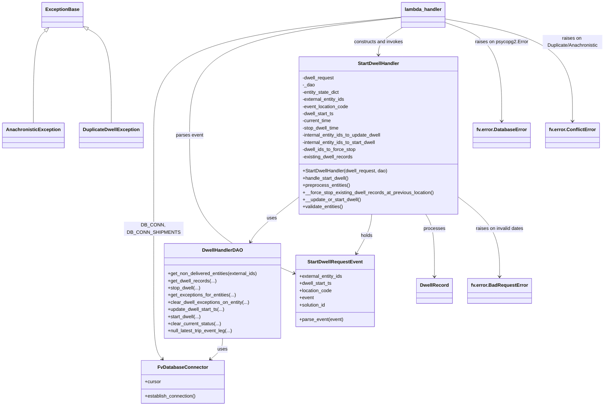

# Diagram: entity_core/entity_service/entity_service/dwell/start_dwell.py


> Auto-generated by Obscura crawlers

## Diagram 1



### SVG

<svg id="container" width="1990.412109375" xmlns="http://www.w3.org/2000/svg" class="classDiagram" height="1360" viewBox="0 0 1990.412109375 1360" role="graphics-document document" aria-roledescription="class"><style>#container{font-family:"trebuchet ms",verdana,arial,sans-serif;font-size:16px;fill:#333;}@keyframes edge-animation-frame{from{stroke-dashoffset:0;}}@keyframes dash{to{stroke-dashoffset:0;}}#container .edge-animation-slow{stroke-dasharray:9,5!important;stroke-dashoffset:900;animation:dash 50s linear infinite;stroke-linecap:round;}#container .edge-animation-fast{stroke-dasharray:9,5!important;stroke-dashoffset:900;animation:dash 20s linear infinite;stroke-linecap:round;}#container .error-icon{fill:#552222;}#container .error-text{fill:#552222;stroke:#552222;}#container .edge-thickness-normal{stroke-width:1px;}#container .edge-thickness-thick{stroke-width:3.5px;}#container .edge-pattern-solid{stroke-dasharray:0;}#container .edge-thickness-invisible{stroke-width:0;fill:none;}#container .edge-pattern-dashed{stroke-dasharray:3;}#container .edge-pattern-dotted{stroke-dasharray:2;}#container .marker{fill:#333333;stroke:#333333;}#container .marker.cross{stroke:#333333;}#container svg{font-family:"trebuchet ms",verdana,arial,sans-serif;font-size:16px;}#container p{margin:0;}#container g.classGroup text{fill:#9370DB;stroke:none;font-family:"trebuchet ms",verdana,arial,sans-serif;font-size:10px;}#container g.classGroup text .title{font-weight:bolder;}#container .nodeLabel,#container .edgeLabel{color:#131300;}#container .edgeLabel .label rect{fill:#ECECFF;}#container .label text{fill:#131300;}#container .labelBkg{background:#ECECFF;}#container .edgeLabel .label span{background:#ECECFF;}#container .classTitle{font-weight:bolder;}#container .node rect,#container .node circle,#container .node ellipse,#container .node polygon,#container .node path{fill:#ECECFF;stroke:#9370DB;stroke-width:1px;}#container .divider{stroke:#9370DB;stroke-width:1;}#container g.clickable{cursor:pointer;}#container g.classGroup rect{fill:#ECECFF;stroke:#9370DB;}#container g.classGroup line{stroke:#9370DB;stroke-width:1;}#container .classLabel .box{stroke:none;stroke-width:0;fill:#ECECFF;opacity:0.5;}#container .classLabel .label{fill:#9370DB;font-size:10px;}#container .relation{stroke:#333333;stroke-width:1;fill:none;}#container .dashed-line{stroke-dasharray:3;}#container .dotted-line{stroke-dasharray:1 2;}#container #compositionStart,#container .composition{fill:#333333!important;stroke:#333333!important;stroke-width:1;}#container #compositionEnd,#container .composition{fill:#333333!important;stroke:#333333!important;stroke-width:1;}#container #dependencyStart,#container .dependency{fill:#333333!important;stroke:#333333!important;stroke-width:1;}#container #dependencyStart,#container .dependency{fill:#333333!important;stroke:#333333!important;stroke-width:1;}#container #extensionStart,#container .extension{fill:transparent!important;stroke:#333333!important;stroke-width:1;}#container #extensionEnd,#container .extension{fill:transparent!important;stroke:#333333!important;stroke-width:1;}#container #aggregationStart,#container .aggregation{fill:transparent!important;stroke:#333333!important;stroke-width:1;}#container #aggregationEnd,#container .aggregation{fill:transparent!important;stroke:#333333!important;stroke-width:1;}#container #lollipopStart,#container .lollipop{fill:#ECECFF!important;stroke:#333333!important;stroke-width:1;}#container #lollipopEnd,#container .lollipop{fill:#ECECFF!important;stroke:#333333!important;stroke-width:1;}#container .edgeTerminals{font-size:11px;line-height:initial;}#container .classTitleText{text-anchor:middle;font-size:18px;fill:#333;}#container .label-icon{display:inline-block;height:1em;overflow:visible;vertical-align:-0.125em;}#container .node .label-icon path{fill:currentColor;stroke:revert;stroke-width:revert;}#container :root{--mermaid-font-family:"trebuchet ms",verdana,arial,sans-serif;}</style><g><defs><marker id="container_class-aggregationStart" class="marker aggregation class" refX="18" refY="7" markerWidth="190" markerHeight="240" orient="auto"><path d="M 18,7 L9,13 L1,7 L9,1 Z"></path></marker></defs><defs><marker id="container_class-aggregationEnd" class="marker aggregation class" refX="1" refY="7" markerWidth="20" markerHeight="28" orient="auto"><path d="M 18,7 L9,13 L1,7 L9,1 Z"></path></marker></defs><defs><marker id="container_class-extensionStart" class="marker extension class" refX="18" refY="7" markerWidth="190" markerHeight="240" orient="auto"><path d="M 1,7 L18,13 V 1 Z"></path></marker></defs><defs><marker id="container_class-extensionEnd" class="marker extension class" refX="1" refY="7" markerWidth="20" markerHeight="28" orient="auto"><path d="M 1,1 V 13 L18,7 Z"></path></marker></defs><defs><marker id="container_class-compositionStart" class="marker composition class" refX="18" refY="7" markerWidth="190" markerHeight="240" orient="auto"><path d="M 18,7 L9,13 L1,7 L9,1 Z"></path></marker></defs><defs><marker id="container_class-compositionEnd" class="marker composition class" refX="1" refY="7" markerWidth="20" markerHeight="28" orient="auto"><path d="M 18,7 L9,13 L1,7 L9,1 Z"></path></marker></defs><defs><marker id="container_class-dependencyStart" class="marker dependency class" refX="6" refY="7" markerWidth="190" markerHeight="240" orient="auto"><path d="M 5,7 L9,13 L1,7 L9,1 Z"></path></marker></defs><defs><marker id="container_class-dependencyEnd" class="marker dependency class" refX="13" refY="7" markerWidth="20" markerHeight="28" orient="auto"><path d="M 18,7 L9,13 L14,7 L9,1 Z"></path></marker></defs><defs><marker id="container_class-lollipopStart" class="marker lollipop class" refX="13" refY="7" markerWidth="190" markerHeight="240" orient="auto"><circle stroke="black" fill="transparent" cx="7" cy="7" r="6"></circle></marker></defs><defs><marker id="container_class-lollipopEnd" class="marker lollipop class" refX="1" refY="7" markerWidth="190" markerHeight="240" orient="auto"><circle stroke="black" fill="transparent" cx="7" cy="7" r="6"></circle></marker></defs><g class="root"><g class="clusters"></g><g class="edgePaths"><path d="M144.624,103.863L138.09,110.053C131.556,116.242,118.489,128.621,111.956,179.977C105.422,231.333,105.422,321.667,105.422,366.833L105.422,412" id="id_ExceptionBase_AnachronisticException_1" class="edge-thickness-normal edge-pattern-solid relation" style=";;;" data-edge="true" data-et="edge" data-id="id_ExceptionBase_AnachronisticException_1" data-points="W3sieCI6MTU3LjE0Njc4NDg1NTc2OTIzLCJ5Ijo5Mn0seyJ4IjoxMDUuNDIxODc1LCJ5IjoxNDF9LHsieCI6MTA1LjQyMTg3NSwieSI6NDEyfV0=" marker-start="url(#container_class-extensionStart)"></path><path d="M281.555,97.279L293.896,104.566C306.237,111.853,330.919,126.426,343.26,178.88C355.602,231.333,355.602,321.667,355.602,366.833L355.602,412" id="id_ExceptionBase_DuplicateDwellException_2" class="edge-thickness-normal edge-pattern-solid relation" style=";;;" data-edge="true" data-et="edge" data-id="id_ExceptionBase_DuplicateDwellException_2" data-points="W3sieCI6MjY2LjcwMTE3MTg3NSwieSI6ODguNTA4NTYwNDkzNzMzMjh9LHsieCI6MzU1LjYwMTU2MjUsInkiOjE0MX0seyJ4IjozNTUuNjAxNTYyNSwieSI6NDEyfV0=" marker-start="url(#container_class-extensionStart)"></path><path d="M976.795,662.825L954.585,680.188C932.375,697.55,887.955,732.275,861.603,756.935C835.251,781.594,826.967,796.188,822.825,803.485L818.682,810.782" id="id_StartDwellHandler_DwellHandlerDAO_3" class="edge-thickness-normal edge-pattern-solid relation" style=";;;" data-edge="true" data-et="edge" data-id="id_StartDwellHandler_DwellHandlerDAO_3" data-points="W3sieCI6OTc2Ljc5NDkyMTg3NSwieSI6NjYyLjgyNTQ1NzY4NTE1OTR9LHsieCI6ODQzLjUzNTE1NjI1LCJ5Ijo3Njd9LHsieCI6ODE1LjcyMDUxNTMyNDUxOTMsInkiOjgxNn1d" marker-end="url(#container_class-dependencyEnd)"></path><path d="M1224.157,718L1223.546,726.167C1222.934,734.333,1221.711,750.667,1213.268,772.63C1204.825,794.594,1189.161,822.188,1181.329,835.985L1173.497,849.782" id="id_StartDwellHandler_StartDwellRequestEvent_4" class="edge-thickness-normal edge-pattern-solid relation" style=";;;" data-edge="true" data-et="edge" data-id="id_StartDwellHandler_StartDwellRequestEvent_4" data-points="W3sieCI6MTIyNC4xNTcxMDQ4ODIxODg2LCJ5Ijo3MTh9LHsieCI6MTIyMC40ODgyODEyNSwieSI6NzY3fSx7IngiOjExNzAuNTM1NDU2NzMwNzY5MywieSI6ODU1fV0=" marker-end="url(#container_class-dependencyEnd)"></path><path d="M1403.664,718L1408.605,726.167C1413.547,734.333,1423.43,750.667,1428.371,785.5C1433.313,820.333,1433.313,873.667,1433.313,900.333L1433.313,927" id="id_StartDwellHandler_DwellRecord_5" class="edge-thickness-normal edge-pattern-solid relation" style=";;;" data-edge="true" data-et="edge" data-id="id_StartDwellHandler_DwellRecord_5" data-points="W3sieCI6MTQwMy42NjM3OTQxNzkzMTMsInkiOjcxOH0seyJ4IjoxNDMzLjMxMjUsInkiOjc2N30seyJ4IjoxNDMzLjMxMjUsInkiOjkzM31d" marker-end="url(#container_class-dependencyEnd)"></path><path d="M1511.053,663.23L1533.134,680.525C1555.215,697.82,1599.377,732.41,1621.458,776.372C1643.539,820.333,1643.539,873.667,1643.539,900.333L1643.539,927" id="id_StartDwellHandler_fv.error.BadRequestError_6" class="edge-thickness-normal edge-pattern-solid relation" style=";;;" data-edge="true" data-et="edge" data-id="id_StartDwellHandler_fv.error.BadRequestError_6" data-points="W3sieCI6MTUxMS4wNTI3MzQzNzUsInkiOjY2My4yMjk2MzAwNjQwNzUzfSx7IngiOjE2NDMuNTM5MDYyNSwieSI6NzY3fSx7IngiOjE2NDMuNTM5MDYyNSwieSI6OTMzfV0=" marker-end="url(#container_class-dependencyEnd)"></path><path d="M725.465,1134L725.465,1140.167C725.465,1146.333,725.465,1158.667,718.549,1170.375C711.632,1182.083,697.8,1193.166,690.883,1198.707L683.967,1204.248" id="id_DwellHandlerDAO_FvDatabaseConnector_7" class="edge-thickness-normal edge-pattern-solid relation" style=";;;" data-edge="true" data-et="edge" data-id="id_DwellHandlerDAO_FvDatabaseConnector_7" data-points="W3sieCI6NzI1LjQ2NDg0Mzc1LCJ5IjoxMTM0fSx7IngiOjcyNS40NjQ4NDM3NSwieSI6MTE3MX0seyJ4Ijo2NzkuMjg0NDU3NDI1NDU4OCwieSI6MTIwOH1d" marker-end="url(#container_class-dependencyEnd)"></path><path d="M1323.348,57.262L1185.016,71.218C1046.685,85.175,770.022,113.087,631.691,179.21C493.359,245.333,493.359,349.667,493.359,454C493.359,558.333,493.359,662.667,493.359,749.5C493.359,836.333,493.359,905.667,493.359,973C493.359,1040.333,493.359,1105.667,498.133,1143.75C502.906,1181.833,512.453,1192.666,517.227,1198.082L522,1203.499" id="id_lambda_handler_FvDatabaseConnector_8" class="edge-thickness-normal edge-pattern-solid relation" style=";;;" data-edge="true" data-et="edge" data-id="id_lambda_handler_FvDatabaseConnector_8" data-points="W3sieCI6MTMyMy4zNDc2NTYyNSwieSI6NTcuMjYxNzc2NTkwMTY5OX0seyJ4Ijo0OTMuMzU5Mzc1LCJ5IjoxNDF9LHsieCI6NDkzLjM1OTM3NSwieSI6NDU0fSx7IngiOjQ5My4zNTkzNzUsInkiOjc2N30seyJ4Ijo0OTMuMzU5Mzc1LCJ5Ijo5NzV9LHsieCI6NDkzLjM1OTM3NSwieSI6MTE3MX0seyJ4Ijo1MjUuOTY3MDgzNTcyMjQ3NywieSI6MTIwOH1d" marker-end="url(#container_class-dependencyEnd)"></path><path d="M1323.348,58.376L1205.016,72.147C1086.685,85.917,850.022,113.459,731.691,179.396C613.359,245.333,613.359,349.667,613.359,454C613.359,558.333,613.359,662.667,672.308,739.904C731.256,817.142,849.152,867.284,908.101,892.356L967.049,917.427" id="id_lambda_handler_StartDwellRequestEvent_9" class="edge-thickness-normal edge-pattern-solid relation" style=";;;" data-edge="true" data-et="edge" data-id="id_lambda_handler_StartDwellRequestEvent_9" data-points="W3sieCI6MTMyMy4zNDc2NTYyNSwieSI6NTguMzc2MTY1ODA4Mjg1NDJ9LHsieCI6NjEzLjM1OTM3NSwieSI6MTQxfSx7IngiOjYxMy4zNTkzNzUsInkiOjQ1NH0seyJ4Ijo2MTMuMzU5Mzc1LCJ5Ijo3Njd9LHsieCI6OTcyLjU3MDMxMjUsInkiOjkxOS43NzQ4OTQzNjgxNjU5fV0=" marker-end="url(#container_class-dependencyEnd)"></path><path d="M1325.447,92L1311.86,100.167C1298.273,108.333,1271.098,124.667,1257.511,140C1243.924,155.333,1243.924,169.667,1243.924,176.833L1243.924,184" id="id_lambda_handler_StartDwellHandler_10" class="edge-thickness-normal edge-pattern-solid relation" style=";;;" data-edge="true" data-et="edge" data-id="id_lambda_handler_StartDwellHandler_10" data-points="W3sieCI6MTMyNS40NDcxMTUzODQ2MTU1LCJ5Ijo5Mn0seyJ4IjoxMjQzLjkyMzgyODEyNSwieSI6MTQxfSx7IngiOjEyNDMuOTIzODI4MTI1LCJ5IjoxOTB9XQ==" marker-end="url(#container_class-dependencyEnd)"></path><path d="M1467.301,75.357L1498.356,86.297C1529.411,97.238,1591.521,119.119,1622.576,174.226C1653.631,229.333,1653.631,317.667,1653.631,361.833L1653.631,406" id="id_lambda_handler_fv.error.DatabaseError_11" class="edge-thickness-normal edge-pattern-solid relation" style=";;;" data-edge="true" data-et="edge" data-id="id_lambda_handler_fv.error.DatabaseError_11" data-points="W3sieCI6MTQ2Ny4zMDA3ODEyNSwieSI6NzUuMzU2OTQ0NjQzOTc3ODN9LHsieCI6MTY1My42MzA4NTkzNzUsInkiOjE0MX0seyJ4IjoxNjUzLjYzMDg1OTM3NSwieSI6NDEyfV0=" marker-end="url(#container_class-dependencyEnd)"></path><path d="M1467.301,63.447L1536.486,76.372C1605.671,89.298,1744.042,115.149,1813.227,172.241C1882.412,229.333,1882.412,317.667,1882.412,361.833L1882.412,406" id="id_lambda_handler_fv.error.ConflictError_12" class="edge-thickness-normal edge-pattern-solid relation" style=";;;" data-edge="true" data-et="edge" data-id="id_lambda_handler_fv.error.ConflictError_12" data-points="W3sieCI6MTQ2Ny4zMDA3ODEyNSwieSI6NjMuNDQ2OTkyNDQ5NTQ2Njl9LHsieCI6MTg4Mi40MTIxMDkzNzUsInkiOjE0MX0seyJ4IjoxODgyLjQxMjEwOTM3NSwieSI6NDEyfV0=" marker-end="url(#container_class-dependencyEnd)"></path></g><g class="edgeLabels"><g class="edgeLabel"><g class="label" data-id="id_ExceptionBase_AnachronisticException_1" transform="translate(0, 0)"><foreignObject width="0" height="0"><div xmlns="http://www.w3.org/1999/xhtml" class="labelBkg" style="display: table-cell; white-space: nowrap; line-height: 1.5; max-width: 200px; text-align: center;"><span class="edgeLabel"></span></div></foreignObject></g></g><g class="edgeLabel"><g class="label" data-id="id_ExceptionBase_DuplicateDwellException_2" transform="translate(0, 0)"><foreignObject width="0" height="0"><div xmlns="http://www.w3.org/1999/xhtml" class="labelBkg" style="display: table-cell; white-space: nowrap; line-height: 1.5; max-width: 200px; text-align: center;"><span class="edgeLabel"></span></div></foreignObject></g></g><g class="edgeLabel" transform="translate(887.97007, 732.26343)"><g class="label" data-id="id_StartDwellHandler_DwellHandlerDAO_3" transform="translate(-16.4921875, -12)"><foreignObject width="32.984375" height="24"><div xmlns="http://www.w3.org/1999/xhtml" class="labelBkg" style="display: table-cell; white-space: nowrap; line-height: 1.5; max-width: 200px; text-align: center;"><span class="edgeLabel"><p>uses</p></span></div></foreignObject></g></g><g class="edgeLabel" transform="translate(1207.64032, 789.63377)"><g class="label" data-id="id_StartDwellHandler_StartDwellRequestEvent_4" transform="translate(-20.1875, -12)"><foreignObject width="40.375" height="24"><div xmlns="http://www.w3.org/1999/xhtml" class="labelBkg" style="display: table-cell; white-space: nowrap; line-height: 1.5; max-width: 200px; text-align: center;"><span class="edgeLabel"><p>holds</p></span></div></foreignObject></g></g><g class="edgeLabel" transform="translate(1433.3125, 767)"><g class="label" data-id="id_StartDwellHandler_DwellRecord_5" transform="translate(-35.7890625, -12)"><foreignObject width="71.578125" height="24"><div xmlns="http://www.w3.org/1999/xhtml" class="labelBkg" style="display: table-cell; white-space: nowrap; line-height: 1.5; max-width: 200px; text-align: center;"><span class="edgeLabel"><p>processes</p></span></div></foreignObject></g></g><g class="edgeLabel" transform="translate(1643.5390625, 767)"><g class="label" data-id="id_StartDwellHandler_fv.error.BadRequestError_6" transform="translate(-81.3203125, -12)"><foreignObject width="162.640625" height="24"><div xmlns="http://www.w3.org/1999/xhtml" class="labelBkg" style="display: table-cell; white-space: nowrap; line-height: 1.5; max-width: 200px; text-align: center;"><span class="edgeLabel"><p>raises on invalid dates</p></span></div></foreignObject></g></g><g class="edgeLabel" transform="translate(725.46484375, 1171)"><g class="label" data-id="id_DwellHandlerDAO_FvDatabaseConnector_7" transform="translate(-16.4921875, -12)"><foreignObject width="32.984375" height="24"><div xmlns="http://www.w3.org/1999/xhtml" class="labelBkg" style="display: table-cell; white-space: nowrap; line-height: 1.5; max-width: 200px; text-align: center;"><span class="edgeLabel"><p>uses</p></span></div></foreignObject></g></g><g class="edgeLabel" transform="translate(493.359375, 767)"><g class="label" data-id="id_lambda_handler_FvDatabaseConnector_8" transform="translate(-100, -24)"><foreignObject width="200" height="48"><div xmlns="http://www.w3.org/1999/xhtml" class="labelBkg" style="display: table; white-space: break-spaces; line-height: 1.5; max-width: 200px; text-align: center; width: 200px;"><span class="edgeLabel"><p>DB_CONN, DB_CONN_SHIPMENTS</p></span></div></foreignObject></g></g><g class="edgeLabel" transform="translate(613.359375, 454)"><g class="label" data-id="id_lambda_handler_StartDwellRequestEvent_9" transform="translate(-46.1171875, -12)"><foreignObject width="92.234375" height="24"><div xmlns="http://www.w3.org/1999/xhtml" class="labelBkg" style="display: table-cell; white-space: nowrap; line-height: 1.5; max-width: 200px; text-align: center;"><span class="edgeLabel"><p>parses event</p></span></div></foreignObject></g></g><g class="edgeLabel" transform="translate(1243.923828125, 141)"><g class="label" data-id="id_lambda_handler_StartDwellHandler_10" transform="translate(-83.4921875, -12)"><foreignObject width="166.984375" height="24"><div xmlns="http://www.w3.org/1999/xhtml" class="labelBkg" style="display: table-cell; white-space: nowrap; line-height: 1.5; max-width: 200px; text-align: center;"><span class="edgeLabel"><p>constructs and invokes</p></span></div></foreignObject></g></g><g class="edgeLabel" transform="translate(1653.630859375, 141)"><g class="label" data-id="id_lambda_handler_fv.error.DatabaseError_11" transform="translate(-88.1328125, -12)"><foreignObject width="176.265625" height="24"><div xmlns="http://www.w3.org/1999/xhtml" class="labelBkg" style="display: table-cell; white-space: nowrap; line-height: 1.5; max-width: 200px; text-align: center;"><span class="edgeLabel"><p>raises on psycopg2.Error</p></span></div></foreignObject></g></g><g class="edgeLabel" transform="translate(1882.412109375, 141)"><g class="label" data-id="id_lambda_handler_fv.error.ConflictError_12" transform="translate(-100, -24)"><foreignObject width="200" height="48"><div xmlns="http://www.w3.org/1999/xhtml" class="labelBkg" style="display: table; white-space: break-spaces; line-height: 1.5; max-width: 200px; text-align: center; width: 200px;"><span class="edgeLabel"><p>raises on Duplicate/Anachronistic</p></span></div></foreignObject></g></g></g><g class="nodes"><g class="node default" id="classId-StartDwellHandler-0" transform="translate(1243.923828125, 454)"><g class="basic label-container"><path d="M-267.12890625 -264 L267.12890625 -264 L267.12890625 264 L-267.12890625 264" stroke="none" stroke-width="0" fill="#ECECFF" style=""></path><path d="M-267.12890625 -264 C-102.5835117885396 -264, 61.96188267292081 -264, 267.12890625 -264 M-267.12890625 -264 C-125.71282347292089 -264, 15.703259304158223 -264, 267.12890625 -264 M267.12890625 -264 C267.12890625 -88.91394942280095, 267.12890625 86.17210115439809, 267.12890625 264 M267.12890625 -264 C267.12890625 -74.61112072901469, 267.12890625 114.77775854197063, 267.12890625 264 M267.12890625 264 C83.40547663916956 264, -100.31795297166087 264, -267.12890625 264 M267.12890625 264 C105.84520953798014 264, -55.43848717403972 264, -267.12890625 264 M-267.12890625 264 C-267.12890625 99.58014595063474, -267.12890625 -64.83970809873051, -267.12890625 -264 M-267.12890625 264 C-267.12890625 127.62837353110939, -267.12890625 -8.743252937781222, -267.12890625 -264" stroke="#9370DB" stroke-width="1.3" fill="none" stroke-dasharray="0 0" style=""></path></g><g class="annotation-group text" transform="translate(0, -240)"></g><g class="label-group text" transform="translate(-67.7109375, -240)"><g class="label" style="font-weight: bolder" transform="translate(0,-12)"><foreignObject width="135.421875" height="24"><div xmlns="http://www.w3.org/1999/xhtml" style="display: table-cell; white-space: nowrap; line-height: 1.5; max-width: 184px; text-align: center;"><span class="nodeLabel markdown-node-label" style=""><p>StartDwellHandler</p></span></div></foreignObject></g></g><g class="members-group text" transform="translate(-255.12890625, -192)"><g class="label" style="" transform="translate(0,-12)"><foreignObject width="109.171875" height="24"><div xmlns="http://www.w3.org/1999/xhtml" style="display: table-cell; white-space: nowrap; line-height: 1.5; max-width: 167px; text-align: center;"><span class="nodeLabel markdown-node-label" style=""><p>-dwell_request</p></span></div></foreignObject></g><g class="label" style="" transform="translate(0,12)"><foreignObject width="40.796875" height="24"><div xmlns="http://www.w3.org/1999/xhtml" style="display: table-cell; white-space: nowrap; line-height: 1.5; max-width: 98px; text-align: center;"><span class="nodeLabel markdown-node-label" style=""><p>-_dao</p></span></div></foreignObject></g><g class="label" style="" transform="translate(0,36)"><foreignObject width="127.53125" height="24"><div xmlns="http://www.w3.org/1999/xhtml" style="display: table-cell; white-space: nowrap; line-height: 1.5; max-width: 185px; text-align: center;"><span class="nodeLabel markdown-node-label" style=""><p>-entity_state_dict</p></span></div></foreignObject></g><g class="label" style="" transform="translate(0,60)"><foreignObject width="145.171875" height="24"><div xmlns="http://www.w3.org/1999/xhtml" style="display: table-cell; white-space: nowrap; line-height: 1.5; max-width: 203px; text-align: center;"><span class="nodeLabel markdown-node-label" style=""><p>-external_entity_ids</p></span></div></foreignObject></g><g class="label" style="" transform="translate(0,84)"><foreignObject width="157.0625" height="24"><div xmlns="http://www.w3.org/1999/xhtml" style="display: table-cell; white-space: nowrap; line-height: 1.5; max-width: 214px; text-align: center;"><span class="nodeLabel markdown-node-label" style=""><p>-event_location_code</p></span></div></foreignObject></g><g class="label" style="" transform="translate(0,108)"><foreignObject width="108.953125" height="24"><div xmlns="http://www.w3.org/1999/xhtml" style="display: table-cell; white-space: nowrap; line-height: 1.5; max-width: 166px; text-align: center;"><span class="nodeLabel markdown-node-label" style=""><p>-dwell_start_ts</p></span></div></foreignObject></g><g class="label" style="" transform="translate(0,132)"><foreignObject width="99.71875" height="24"><div xmlns="http://www.w3.org/1999/xhtml" style="display: table-cell; white-space: nowrap; line-height: 1.5; max-width: 157px; text-align: center;"><span class="nodeLabel markdown-node-label" style=""><p>-current_time</p></span></div></foreignObject></g><g class="label" style="" transform="translate(0,156)"><foreignObject width="125.84375" height="24"><div xmlns="http://www.w3.org/1999/xhtml" style="display: table-cell; white-space: nowrap; line-height: 1.5; max-width: 183px; text-align: center;"><span class="nodeLabel markdown-node-label" style=""><p>-stop_dwell_time</p></span></div></foreignObject></g><g class="label" style="" transform="translate(0,180)"><foreignObject width="271.125" height="24"><div xmlns="http://www.w3.org/1999/xhtml" style="display: table-cell; white-space: nowrap; line-height: 1.5; max-width: 329px; text-align: center;"><span class="nodeLabel markdown-node-label" style=""><p>-internal_entity_ids_to_update_dwell</p></span></div></foreignObject></g><g class="label" style="" transform="translate(0,204)"><foreignObject width="254.21875" height="24"><div xmlns="http://www.w3.org/1999/xhtml" style="display: table-cell; white-space: nowrap; line-height: 1.5; max-width: 312px; text-align: center;"><span class="nodeLabel markdown-node-label" style=""><p>-internal_entity_ids_to_start_dwell</p></span></div></foreignObject></g><g class="label" style="" transform="translate(0,228)"><foreignObject width="181.84375" height="24"><div xmlns="http://www.w3.org/1999/xhtml" style="display: table-cell; white-space: nowrap; line-height: 1.5; max-width: 239px; text-align: center;"><span class="nodeLabel markdown-node-label" style=""><p>-dwell_ids_to_force_stop</p></span></div></foreignObject></g><g class="label" style="" transform="translate(0,252)"><foreignObject width="172.109375" height="24"><div xmlns="http://www.w3.org/1999/xhtml" style="display: table-cell; white-space: nowrap; line-height: 1.5; max-width: 229px; text-align: center;"><span class="nodeLabel markdown-node-label" style=""><p>-existing_dwell_records</p></span></div></foreignObject></g></g><g class="methods-group text" transform="translate(-255.12890625, 120)"><g class="label" style="" transform="translate(0,-12)"><foreignObject width="289.140625" height="24"><div xmlns="http://www.w3.org/1999/xhtml" style="display: table-cell; white-space: nowrap; line-height: 1.5; max-width: 347px; text-align: center;"><span class="nodeLabel markdown-node-label" style=""><p>+StartDwellHandler(dwell_request, dao)</p></span></div></foreignObject></g><g class="label" style="" transform="translate(0,12)"><foreignObject width="157.640625" height="24"><div xmlns="http://www.w3.org/1999/xhtml" style="display: table-cell; white-space: nowrap; line-height: 1.5; max-width: 215px; text-align: center;"><span class="nodeLabel markdown-node-label" style=""><p>+handle_start_dwell()</p></span></div></foreignObject></g><g class="label" style="" transform="translate(0,36)"><foreignObject width="160.203125" height="24"><div xmlns="http://www.w3.org/1999/xhtml" style="display: table-cell; white-space: nowrap; line-height: 1.5; max-width: 218px; text-align: center;"><span class="nodeLabel markdown-node-label" style=""><p>+preprocess_entities()</p></span></div></foreignObject></g><g class="label" style="" transform="translate(0,60)"><foreignObject width="442.546875" height="24"><div xmlns="http://www.w3.org/1999/xhtml" style="display: table-cell; white-space: nowrap; line-height: 1.5; max-width: 500px; text-align: center;"><span class="nodeLabel markdown-node-label" style=""><p>+__force_stop_existing_dwell_records_at_previous_location()</p></span></div></foreignObject></g><g class="label" style="" transform="translate(0,84)"><foreignObject width="195.75" height="24"><div xmlns="http://www.w3.org/1999/xhtml" style="display: table-cell; white-space: nowrap; line-height: 1.5; max-width: 253px; text-align: center;"><span class="nodeLabel markdown-node-label" style=""><p>+__update_or_start_dwell()</p></span></div></foreignObject></g><g class="label" style="" transform="translate(0,108)"><foreignObject width="138.625" height="24"><div xmlns="http://www.w3.org/1999/xhtml" style="display: table-cell; white-space: nowrap; line-height: 1.5; max-width: 196px; text-align: center;"><span class="nodeLabel markdown-node-label" style=""><p>+validate_entities()</p></span></div></foreignObject></g></g><g class="divider" style=""><path d="M-267.12890625 -216 C-119.6278748610099 -216, 27.8731565279802 -216, 267.12890625 -216 M-267.12890625 -216 C-135.31583728916593 -216, -3.502768328331854 -216, 267.12890625 -216" stroke="#9370DB" stroke-width="1.3" fill="none" stroke-dasharray="0 0" style=""></path></g><g class="divider" style=""><path d="M-267.12890625 96 C-76.43092300063222 96, 114.26706024873556 96, 267.12890625 96 M-267.12890625 96 C-98.91748840898273 96, 69.29392943203453 96, 267.12890625 96" stroke="#9370DB" stroke-width="1.3" fill="none" stroke-dasharray="0 0" style=""></path></g></g><g class="node default" id="classId-DwellHandlerDAO-1" transform="translate(725.46484375, 975)"><g class="basic label-container"><path d="M-197.10546875 -159 L197.10546875 -159 L197.10546875 159 L-197.10546875 159" stroke="none" stroke-width="0" fill="#ECECFF" style=""></path><path d="M-197.10546875 -159 C-86.58979860100823 -159, 23.925871547983547 -159, 197.10546875 -159 M-197.10546875 -159 C-64.90825360272808 -159, 67.28896154454384 -159, 197.10546875 -159 M197.10546875 -159 C197.10546875 -62.95680290164319, 197.10546875 33.08639419671363, 197.10546875 159 M197.10546875 -159 C197.10546875 -37.43459743691881, 197.10546875 84.13080512616239, 197.10546875 159 M197.10546875 159 C66.10819207817349 159, -64.88908459365302 159, -197.10546875 159 M197.10546875 159 C89.30089741757234 159, -18.503673914855312 159, -197.10546875 159 M-197.10546875 159 C-197.10546875 32.53443085176272, -197.10546875 -93.93113829647456, -197.10546875 -159 M-197.10546875 159 C-197.10546875 88.29305871661225, -197.10546875 17.5861174332245, -197.10546875 -159" stroke="#9370DB" stroke-width="1.3" fill="none" stroke-dasharray="0 0" style=""></path></g><g class="annotation-group text" transform="translate(0, -135)"></g><g class="label-group text" transform="translate(-64.7578125, -135)"><g class="label" style="font-weight: bolder" transform="translate(0,-12)"><foreignObject width="129.515625" height="24"><div xmlns="http://www.w3.org/1999/xhtml" style="display: table-cell; white-space: nowrap; line-height: 1.5; max-width: 178px; text-align: center;"><span class="nodeLabel markdown-node-label" style=""><p>DwellHandlerDAO</p></span></div></foreignObject></g></g><g class="members-group text" transform="translate(-185.10546875, -87)"></g><g class="methods-group text" transform="translate(-185.10546875, -57)"><g class="label" style="" transform="translate(0,-12)"><foreignObject width="305.453125" height="24"><div xmlns="http://www.w3.org/1999/xhtml" style="display: table-cell; white-space: nowrap; line-height: 1.5; max-width: 363px; text-align: center;"><span class="nodeLabel markdown-node-label" style=""><p>+get_non_delivered_entities(external_ids)</p></span></div></foreignObject></g><g class="label" style="" transform="translate(0,12)"><foreignObject width="161.71875" height="24"><div xmlns="http://www.w3.org/1999/xhtml" style="display: table-cell; white-space: nowrap; line-height: 1.5; max-width: 219px; text-align: center;"><span class="nodeLabel markdown-node-label" style=""><p>+get_dwell_records(...)</p></span></div></foreignObject></g><g class="label" style="" transform="translate(0,36)"><foreignObject width="108.546875" height="24"><div xmlns="http://www.w3.org/1999/xhtml" style="display: table-cell; white-space: nowrap; line-height: 1.5; max-width: 166px; text-align: center;"><span class="nodeLabel markdown-node-label" style=""><p>+stop_dwell(...)</p></span></div></foreignObject></g><g class="label" style="" transform="translate(0,60)"><foreignObject width="228.640625" height="24"><div xmlns="http://www.w3.org/1999/xhtml" style="display: table-cell; white-space: nowrap; line-height: 1.5; max-width: 286px; text-align: center;"><span class="nodeLabel markdown-node-label" style=""><p>+get_exceptions_for_entities(...)</p></span></div></foreignObject></g><g class="label" style="" transform="translate(0,84)"><foreignObject width="274.015625" height="24"><div xmlns="http://www.w3.org/1999/xhtml" style="display: table-cell; white-space: nowrap; line-height: 1.5; max-width: 331px; text-align: center;"><span class="nodeLabel markdown-node-label" style=""><p>+clear_dwell_exceptions_on_entity(...)</p></span></div></foreignObject></g><g class="label" style="" transform="translate(0,108)"><foreignObject width="191.40625" height="24"><div xmlns="http://www.w3.org/1999/xhtml" style="display: table-cell; white-space: nowrap; line-height: 1.5; max-width: 249px; text-align: center;"><span class="nodeLabel markdown-node-label" style=""><p>+update_dwell_start_ts(...)</p></span></div></foreignObject></g><g class="label" style="" transform="translate(0,132)"><foreignObject width="110.8125" height="24"><div xmlns="http://www.w3.org/1999/xhtml" style="display: table-cell; white-space: nowrap; line-height: 1.5; max-width: 168px; text-align: center;"><span class="nodeLabel markdown-node-label" style=""><p>+start_dwell(...)</p></span></div></foreignObject></g><g class="label" style="" transform="translate(0,156)"><foreignObject width="177.5625" height="24"><div xmlns="http://www.w3.org/1999/xhtml" style="display: table-cell; white-space: nowrap; line-height: 1.5; max-width: 235px; text-align: center;"><span class="nodeLabel markdown-node-label" style=""><p>+clear_current_status(...)</p></span></div></foreignObject></g><g class="label" style="" transform="translate(0,180)"><foreignObject width="218.71875" height="24"><div xmlns="http://www.w3.org/1999/xhtml" style="display: table-cell; white-space: nowrap; line-height: 1.5; max-width: 276px; text-align: center;"><span class="nodeLabel markdown-node-label" style=""><p>+null_latest_trip_event_leg(...)</p></span></div></foreignObject></g></g><g class="divider" style=""><path d="M-197.10546875 -111 C-71.69774458724758 -111, 53.70997957550483 -111, 197.10546875 -111 M-197.10546875 -111 C-48.64166104046322 -111, 99.82214666907356 -111, 197.10546875 -111" stroke="#9370DB" stroke-width="1.3" fill="none" stroke-dasharray="0 0" style=""></path></g><g class="divider" style=""><path d="M-197.10546875 -87 C-109.47959225524397 -87, -21.853715760487944 -87, 197.10546875 -87 M-197.10546875 -87 C-70.42302848937595 -87, 56.2594117712481 -87, 197.10546875 -87" stroke="#9370DB" stroke-width="1.3" fill="none" stroke-dasharray="0 0" style=""></path></g></g><g class="node default" id="classId-StartDwellRequestEvent-2" transform="translate(1102.41796875, 975)"><g class="basic label-container"><path d="M-129.84765625 -120 L129.84765625 -120 L129.84765625 120 L-129.84765625 120" stroke="none" stroke-width="0" fill="#ECECFF" style=""></path><path d="M-129.84765625 -120 C-31.997439378419955 -120, 65.85277749316009 -120, 129.84765625 -120 M-129.84765625 -120 C-76.97524489946082 -120, -24.102833548921637 -120, 129.84765625 -120 M129.84765625 -120 C129.84765625 -67.96758327091521, 129.84765625 -15.935166541830412, 129.84765625 120 M129.84765625 -120 C129.84765625 -48.23491921016448, 129.84765625 23.530161579671045, 129.84765625 120 M129.84765625 120 C66.14910464675177 120, 2.4505530435035325 120, -129.84765625 120 M129.84765625 120 C60.69520363923239 120, -8.457248971535222 120, -129.84765625 120 M-129.84765625 120 C-129.84765625 68.49896504524435, -129.84765625 16.99793009048868, -129.84765625 -120 M-129.84765625 120 C-129.84765625 40.30136397000264, -129.84765625 -39.39727205999472, -129.84765625 -120" stroke="#9370DB" stroke-width="1.3" fill="none" stroke-dasharray="0 0" style=""></path></g><g class="annotation-group text" transform="translate(0, -96)"></g><g class="label-group text" transform="translate(-88.8046875, -96)"><g class="label" style="font-weight: bolder" transform="translate(0,-12)"><foreignObject width="177.609375" height="24"><div xmlns="http://www.w3.org/1999/xhtml" style="display: table-cell; white-space: nowrap; line-height: 1.5; max-width: 224px; text-align: center;"><span class="nodeLabel markdown-node-label" style=""><p>StartDwellRequestEvent</p></span></div></foreignObject></g></g><g class="members-group text" transform="translate(-117.84765625, -48)"><g class="label" style="" transform="translate(0,-12)"><foreignObject width="146.71875" height="24"><div xmlns="http://www.w3.org/1999/xhtml" style="display: table-cell; white-space: nowrap; line-height: 1.5; max-width: 204px; text-align: center;"><span class="nodeLabel markdown-node-label" style=""><p>+external_entity_ids</p></span></div></foreignObject></g><g class="label" style="" transform="translate(0,12)"><foreignObject width="110.484375" height="24"><div xmlns="http://www.w3.org/1999/xhtml" style="display: table-cell; white-space: nowrap; line-height: 1.5; max-width: 168px; text-align: center;"><span class="nodeLabel markdown-node-label" style=""><p>+dwell_start_ts</p></span></div></foreignObject></g><g class="label" style="" transform="translate(0,36)"><foreignObject width="110.109375" height="24"><div xmlns="http://www.w3.org/1999/xhtml" style="display: table-cell; white-space: nowrap; line-height: 1.5; max-width: 167px; text-align: center;"><span class="nodeLabel markdown-node-label" style=""><p>+location_code</p></span></div></foreignObject></g><g class="label" style="" transform="translate(0,60)"><foreignObject width="48.328125" height="24"><div xmlns="http://www.w3.org/1999/xhtml" style="display: table-cell; white-space: nowrap; line-height: 1.5; max-width: 106px; text-align: center;"><span class="nodeLabel markdown-node-label" style=""><p>+event</p></span></div></foreignObject></g><g class="label" style="" transform="translate(0,84)"><foreignObject width="90.21875" height="24"><div xmlns="http://www.w3.org/1999/xhtml" style="display: table-cell; white-space: nowrap; line-height: 1.5; max-width: 148px; text-align: center;"><span class="nodeLabel markdown-node-label" style=""><p>+solution_id</p></span></div></foreignObject></g></g><g class="methods-group text" transform="translate(-117.84765625, 96)"><g class="label" style="" transform="translate(0,-12)"><foreignObject width="146.890625" height="24"><div xmlns="http://www.w3.org/1999/xhtml" style="display: table-cell; white-space: nowrap; line-height: 1.5; max-width: 204px; text-align: center;"><span class="nodeLabel markdown-node-label" style=""><p>+parse_event(event)</p></span></div></foreignObject></g></g><g class="divider" style=""><path d="M-129.84765625 -72 C-49.74850941923549 -72, 30.35063741152902 -72, 129.84765625 -72 M-129.84765625 -72 C-38.28751697089005 -72, 53.272622308219894 -72, 129.84765625 -72" stroke="#9370DB" stroke-width="1.3" fill="none" stroke-dasharray="0 0" style=""></path></g><g class="divider" style=""><path d="M-129.84765625 72 C-32.75627201656789 72, 64.33511221686422 72, 129.84765625 72 M-129.84765625 72 C-60.07249800933866 72, 9.702660231322682 72, 129.84765625 72" stroke="#9370DB" stroke-width="1.3" fill="none" stroke-dasharray="0 0" style=""></path></g></g><g class="node default" id="classId-DwellRecord-3" transform="translate(1433.3125, 975)"><g class="basic label-container"><path d="M-57.71875 -42 L57.71875 -42 L57.71875 42 L-57.71875 42" stroke="none" stroke-width="0" fill="#ECECFF" style=""></path><path d="M-57.71875 -42 C-14.760990526315219 -42, 28.196768947369563 -42, 57.71875 -42 M-57.71875 -42 C-34.41361756259336 -42, -11.108485125186725 -42, 57.71875 -42 M57.71875 -42 C57.71875 -8.945556281245182, 57.71875 24.108887437509637, 57.71875 42 M57.71875 -42 C57.71875 -14.258548355049516, 57.71875 13.482903289900968, 57.71875 42 M57.71875 42 C29.06682386594381 42, 0.4148977318876206 42, -57.71875 42 M57.71875 42 C26.5695218691339 42, -4.579706261732198 42, -57.71875 42 M-57.71875 42 C-57.71875 21.13082117285801, -57.71875 0.2616423457160195, -57.71875 -42 M-57.71875 42 C-57.71875 16.46031927700815, -57.71875 -9.0793614459837, -57.71875 -42" stroke="#9370DB" stroke-width="1.3" fill="none" stroke-dasharray="0 0" style=""></path></g><g class="annotation-group text" transform="translate(0, -18)"></g><g class="label-group text" transform="translate(-45.71875, -18)"><g class="label" style="font-weight: bolder" transform="translate(0,-12)"><foreignObject width="91.4375" height="24"><div xmlns="http://www.w3.org/1999/xhtml" style="display: table-cell; white-space: nowrap; line-height: 1.5; max-width: 140px; text-align: center;"><span class="nodeLabel markdown-node-label" style=""><p>DwellRecord</p></span></div></foreignObject></g></g><g class="members-group text" transform="translate(-45.71875, 30)"></g><g class="methods-group text" transform="translate(-45.71875, 60)"></g><g class="divider" style=""><path d="M-57.71875 6 C-29.299225914167764 6, -0.8797018283355271 6, 57.71875 6 M-57.71875 6 C-24.171535650470588 6, 9.375678699058824 6, 57.71875 6" stroke="#9370DB" stroke-width="1.3" fill="none" stroke-dasharray="0 0" style=""></path></g><g class="divider" style=""><path d="M-57.71875 24 C-22.269354164357672 24, 13.180041671284656 24, 57.71875 24 M-57.71875 24 C-13.449134305665368 24, 30.820481388669265 24, 57.71875 24" stroke="#9370DB" stroke-width="1.3" fill="none" stroke-dasharray="0 0" style=""></path></g></g><g class="node default" id="classId-FvDatabaseConnector-4" transform="translate(589.419921875, 1280)"><g class="basic label-container"><path d="M-138.28515625 -72 L138.28515625 -72 L138.28515625 72 L-138.28515625 72" stroke="none" stroke-width="0" fill="#ECECFF" style=""></path><path d="M-138.28515625 -72 C-78.41554283969481 -72, -18.54592942938963 -72, 138.28515625 -72 M-138.28515625 -72 C-58.99748624210082 -72, 20.29018376579836 -72, 138.28515625 -72 M138.28515625 -72 C138.28515625 -30.072276548931818, 138.28515625 11.855446902136364, 138.28515625 72 M138.28515625 -72 C138.28515625 -29.259811066813853, 138.28515625 13.480377866372294, 138.28515625 72 M138.28515625 72 C80.43175238758106 72, 22.578348525162113 72, -138.28515625 72 M138.28515625 72 C71.98836072492612 72, 5.691565199852249 72, -138.28515625 72 M-138.28515625 72 C-138.28515625 33.055257018631394, -138.28515625 -5.889485962737211, -138.28515625 -72 M-138.28515625 72 C-138.28515625 35.80347124978085, -138.28515625 -0.393057500438303, -138.28515625 -72" stroke="#9370DB" stroke-width="1.3" fill="none" stroke-dasharray="0 0" style=""></path></g><g class="annotation-group text" transform="translate(0, -48)"></g><g class="label-group text" transform="translate(-79.3046875, -48)"><g class="label" style="font-weight: bolder" transform="translate(0,-12)"><foreignObject width="158.609375" height="24"><div xmlns="http://www.w3.org/1999/xhtml" style="display: table-cell; white-space: nowrap; line-height: 1.5; max-width: 207px; text-align: center;"><span class="nodeLabel markdown-node-label" style=""><p>FvDatabaseConnector</p></span></div></foreignObject></g></g><g class="members-group text" transform="translate(-126.28515625, 0)"><g class="label" style="" transform="translate(0,-12)"><foreignObject width="53.71875" height="24"><div xmlns="http://www.w3.org/1999/xhtml" style="display: table-cell; white-space: nowrap; line-height: 1.5; max-width: 112px; text-align: center;"><span class="nodeLabel markdown-node-label" style=""><p>+cursor</p></span></div></foreignObject></g></g><g class="methods-group text" transform="translate(-126.28515625, 48)"><g class="label" style="" transform="translate(0,-12)"><foreignObject width="173.265625" height="24"><div xmlns="http://www.w3.org/1999/xhtml" style="display: table-cell; white-space: nowrap; line-height: 1.5; max-width: 231px; text-align: center;"><span class="nodeLabel markdown-node-label" style=""><p>+establish_connection()</p></span></div></foreignObject></g></g><g class="divider" style=""><path d="M-138.28515625 -24 C-78.10215225561636 -24, -17.91914826123272 -24, 138.28515625 -24 M-138.28515625 -24 C-37.12480789166466 -24, 64.03554046667068 -24, 138.28515625 -24" stroke="#9370DB" stroke-width="1.3" fill="none" stroke-dasharray="0 0" style=""></path></g><g class="divider" style=""><path d="M-138.28515625 24 C-36.01767132176012 24, 66.24981360647976 24, 138.28515625 24 M-138.28515625 24 C-57.66002813339419 24, 22.965099983211616 24, 138.28515625 24" stroke="#9370DB" stroke-width="1.3" fill="none" stroke-dasharray="0 0" style=""></path></g></g><g class="node default" id="classId-AnachronisticException-5" transform="translate(105.421875, 454)"><g class="basic label-container"><path d="M-97.421875 -42 L97.421875 -42 L97.421875 42 L-97.421875 42" stroke="none" stroke-width="0" fill="#ECECFF" style=""></path><path d="M-97.421875 -42 C-33.063601511164066 -42, 31.294671977671868 -42, 97.421875 -42 M-97.421875 -42 C-48.42514156745145 -42, 0.5715918650971048 -42, 97.421875 -42 M97.421875 -42 C97.421875 -21.271080632902216, 97.421875 -0.542161265804431, 97.421875 42 M97.421875 -42 C97.421875 -24.152797967133402, 97.421875 -6.305595934266805, 97.421875 42 M97.421875 42 C31.87184570321763 42, -33.67818359356474 42, -97.421875 42 M97.421875 42 C26.025450113037564 42, -45.37097477392487 42, -97.421875 42 M-97.421875 42 C-97.421875 18.13760126138123, -97.421875 -5.724797477237537, -97.421875 -42 M-97.421875 42 C-97.421875 24.66872018732339, -97.421875 7.337440374646782, -97.421875 -42" stroke="#9370DB" stroke-width="1.3" fill="none" stroke-dasharray="0 0" style=""></path></g><g class="annotation-group text" transform="translate(0, -18)"></g><g class="label-group text" transform="translate(-85.421875, -18)"><g class="label" style="font-weight: bolder" transform="translate(0,-12)"><foreignObject width="170.84375" height="24"><div xmlns="http://www.w3.org/1999/xhtml" style="display: table-cell; white-space: nowrap; line-height: 1.5; max-width: 219px; text-align: center;"><span class="nodeLabel markdown-node-label" style=""><p>AnachronisticException</p></span></div></foreignObject></g></g><g class="members-group text" transform="translate(-85.421875, 30)"></g><g class="methods-group text" transform="translate(-85.421875, 60)"></g><g class="divider" style=""><path d="M-97.421875 6 C-31.946857247677627 6, 33.528160504644745 6, 97.421875 6 M-97.421875 6 C-51.92323735686639 6, -6.424599713732775 6, 97.421875 6" stroke="#9370DB" stroke-width="1.3" fill="none" stroke-dasharray="0 0" style=""></path></g><g class="divider" style=""><path d="M-97.421875 24 C-56.56139954688165 24, -15.700924093763305 24, 97.421875 24 M-97.421875 24 C-33.531140382742244 24, 30.359594234515512 24, 97.421875 24" stroke="#9370DB" stroke-width="1.3" fill="none" stroke-dasharray="0 0" style=""></path></g></g><g class="node default" id="classId-DuplicateDwellException-6" transform="translate(355.6015625, 454)"><g class="basic label-container"><path d="M-102.7578125 -42 L102.7578125 -42 L102.7578125 42 L-102.7578125 42" stroke="none" stroke-width="0" fill="#ECECFF" style=""></path><path d="M-102.7578125 -42 C-28.66777181852413 -42, 45.42226886295174 -42, 102.7578125 -42 M-102.7578125 -42 C-57.10280306558695 -42, -11.447793631173894 -42, 102.7578125 -42 M102.7578125 -42 C102.7578125 -9.15651736247677, 102.7578125 23.68696527504646, 102.7578125 42 M102.7578125 -42 C102.7578125 -24.56407435327329, 102.7578125 -7.1281487065465825, 102.7578125 42 M102.7578125 42 C35.88202561317256 42, -30.993761273654883 42, -102.7578125 42 M102.7578125 42 C30.248393944890793 42, -42.26102461021841 42, -102.7578125 42 M-102.7578125 42 C-102.7578125 18.79396296018878, -102.7578125 -4.4120740796224425, -102.7578125 -42 M-102.7578125 42 C-102.7578125 22.730477538798137, -102.7578125 3.4609550775962745, -102.7578125 -42" stroke="#9370DB" stroke-width="1.3" fill="none" stroke-dasharray="0 0" style=""></path></g><g class="annotation-group text" transform="translate(0, -18)"></g><g class="label-group text" transform="translate(-90.7578125, -18)"><g class="label" style="font-weight: bolder" transform="translate(0,-12)"><foreignObject width="181.515625" height="24"><div xmlns="http://www.w3.org/1999/xhtml" style="display: table-cell; white-space: nowrap; line-height: 1.5; max-width: 229px; text-align: center;"><span class="nodeLabel markdown-node-label" style=""><p>DuplicateDwellException</p></span></div></foreignObject></g></g><g class="members-group text" transform="translate(-90.7578125, 30)"></g><g class="methods-group text" transform="translate(-90.7578125, 60)"></g><g class="divider" style=""><path d="M-102.7578125 6 C-20.767268335442054 6, 61.22327582911589 6, 102.7578125 6 M-102.7578125 6 C-56.657740470742056 6, -10.557668441484111 6, 102.7578125 6" stroke="#9370DB" stroke-width="1.3" fill="none" stroke-dasharray="0 0" style=""></path></g><g class="divider" style=""><path d="M-102.7578125 24 C-34.888138805619036 24, 32.98153488876193 24, 102.7578125 24 M-102.7578125 24 C-29.22669575994078 24, 44.30442098011844 24, 102.7578125 24" stroke="#9370DB" stroke-width="1.3" fill="none" stroke-dasharray="0 0" style=""></path></g></g><g class="node default" id="classId-fv.error.BadRequestError-7" transform="translate(1643.5390625, 975)"><g class="basic label-container"><path d="M-102.5078125 -42 L102.5078125 -42 L102.5078125 42 L-102.5078125 42" stroke="none" stroke-width="0" fill="#ECECFF" style=""></path><path d="M-102.5078125 -42 C-53.34197595191091 -42, -4.176139403821821 -42, 102.5078125 -42 M-102.5078125 -42 C-30.217822776911348 -42, 42.072166946177305 -42, 102.5078125 -42 M102.5078125 -42 C102.5078125 -21.954444542781655, 102.5078125 -1.9088890855633096, 102.5078125 42 M102.5078125 -42 C102.5078125 -16.63805450813481, 102.5078125 8.723890983730378, 102.5078125 42 M102.5078125 42 C30.16234801057186 42, -42.18311647885628 42, -102.5078125 42 M102.5078125 42 C40.08775529016629 42, -22.332301919667415 42, -102.5078125 42 M-102.5078125 42 C-102.5078125 15.556884735588621, -102.5078125 -10.886230528822757, -102.5078125 -42 M-102.5078125 42 C-102.5078125 19.204718181312067, -102.5078125 -3.5905636373758654, -102.5078125 -42" stroke="#9370DB" stroke-width="1.3" fill="none" stroke-dasharray="0 0" style=""></path></g><g class="annotation-group text" transform="translate(0, -18)"></g><g class="label-group text" transform="translate(-90.5078125, -18)"><g class="label" style="font-weight: bolder" transform="translate(0,-12)"><foreignObject width="181.015625" height="24"><div xmlns="http://www.w3.org/1999/xhtml" style="display: table-cell; white-space: nowrap; line-height: 1.5; max-width: 229px; text-align: center;"><span class="nodeLabel markdown-node-label" style=""><p>fv.error.BadRequestError</p></span></div></foreignObject></g></g><g class="members-group text" transform="translate(-90.5078125, 30)"></g><g class="methods-group text" transform="translate(-90.5078125, 60)"></g><g class="divider" style=""><path d="M-102.5078125 6 C-54.83178903808123 6, -7.155765576162466 6, 102.5078125 6 M-102.5078125 6 C-20.781826690361726 6, 60.94415911927655 6, 102.5078125 6" stroke="#9370DB" stroke-width="1.3" fill="none" stroke-dasharray="0 0" style=""></path></g><g class="divider" style=""><path d="M-102.5078125 24 C-61.363451353348836 24, -20.219090206697672 24, 102.5078125 24 M-102.5078125 24 C-27.159123969602632 24, 48.189564560794736 24, 102.5078125 24" stroke="#9370DB" stroke-width="1.3" fill="none" stroke-dasharray="0 0" style=""></path></g></g><g class="node default" id="classId-fv.error.DatabaseError-8" transform="translate(1653.630859375, 454)"><g class="basic label-container"><path d="M-92.578125 -42 L92.578125 -42 L92.578125 42 L-92.578125 42" stroke="none" stroke-width="0" fill="#ECECFF" style=""></path><path d="M-92.578125 -42 C-22.2007961714216 -42, 48.1765326571568 -42, 92.578125 -42 M-92.578125 -42 C-35.85508776457126 -42, 20.867949470857482 -42, 92.578125 -42 M92.578125 -42 C92.578125 -24.063837262496705, 92.578125 -6.1276745249934095, 92.578125 42 M92.578125 -42 C92.578125 -17.625019017661028, 92.578125 6.749961964677944, 92.578125 42 M92.578125 42 C28.971122431073155 42, -34.63588013785369 42, -92.578125 42 M92.578125 42 C26.927418317000104 42, -38.72328836599979 42, -92.578125 42 M-92.578125 42 C-92.578125 20.756997981525362, -92.578125 -0.4860040369492751, -92.578125 -42 M-92.578125 42 C-92.578125 11.118860465489043, -92.578125 -19.762279069021915, -92.578125 -42" stroke="#9370DB" stroke-width="1.3" fill="none" stroke-dasharray="0 0" style=""></path></g><g class="annotation-group text" transform="translate(0, -18)"></g><g class="label-group text" transform="translate(-80.578125, -18)"><g class="label" style="font-weight: bolder" transform="translate(0,-12)"><foreignObject width="161.15625" height="24"><div xmlns="http://www.w3.org/1999/xhtml" style="display: table-cell; white-space: nowrap; line-height: 1.5; max-width: 209px; text-align: center;"><span class="nodeLabel markdown-node-label" style=""><p>fv.error.DatabaseError</p></span></div></foreignObject></g></g><g class="members-group text" transform="translate(-80.578125, 30)"></g><g class="methods-group text" transform="translate(-80.578125, 60)"></g><g class="divider" style=""><path d="M-92.578125 6 C-23.43637534210282 6, 45.70537431579436 6, 92.578125 6 M-92.578125 6 C-34.21878627793562 6, 24.14055244412876 6, 92.578125 6" stroke="#9370DB" stroke-width="1.3" fill="none" stroke-dasharray="0 0" style=""></path></g><g class="divider" style=""><path d="M-92.578125 24 C-21.849151311549264 24, 48.87982237690147 24, 92.578125 24 M-92.578125 24 C-22.134953453282122 24, 48.308218093435755 24, 92.578125 24" stroke="#9370DB" stroke-width="1.3" fill="none" stroke-dasharray="0 0" style=""></path></g></g><g class="node default" id="classId-fv.error.ConflictError-9" transform="translate(1882.412109375, 454)"><g class="basic label-container"><path d="M-86.203125 -42 L86.203125 -42 L86.203125 42 L-86.203125 42" stroke="none" stroke-width="0" fill="#ECECFF" style=""></path><path d="M-86.203125 -42 C-29.331339640477893 -42, 27.540445719044214 -42, 86.203125 -42 M-86.203125 -42 C-19.45233640055875 -42, 47.2984521988825 -42, 86.203125 -42 M86.203125 -42 C86.203125 -13.03223663132465, 86.203125 15.935526737350699, 86.203125 42 M86.203125 -42 C86.203125 -22.278936116276615, 86.203125 -2.5578722325532297, 86.203125 42 M86.203125 42 C29.81046582099445 42, -26.582193358011097 42, -86.203125 42 M86.203125 42 C48.85649634302941 42, 11.509867686058826 42, -86.203125 42 M-86.203125 42 C-86.203125 12.844458375441206, -86.203125 -16.311083249117587, -86.203125 -42 M-86.203125 42 C-86.203125 10.810089572106829, -86.203125 -20.379820855786342, -86.203125 -42" stroke="#9370DB" stroke-width="1.3" fill="none" stroke-dasharray="0 0" style=""></path></g><g class="annotation-group text" transform="translate(0, -18)"></g><g class="label-group text" transform="translate(-74.203125, -18)"><g class="label" style="font-weight: bolder" transform="translate(0,-12)"><foreignObject width="148.40625" height="24"><div xmlns="http://www.w3.org/1999/xhtml" style="display: table-cell; white-space: nowrap; line-height: 1.5; max-width: 196px; text-align: center;"><span class="nodeLabel markdown-node-label" style=""><p>fv.error.ConflictError</p></span></div></foreignObject></g></g><g class="members-group text" transform="translate(-74.203125, 30)"></g><g class="methods-group text" transform="translate(-74.203125, 60)"></g><g class="divider" style=""><path d="M-86.203125 6 C-46.38417448419592 6, -6.565223968391834 6, 86.203125 6 M-86.203125 6 C-39.641948977148516 6, 6.919227045702968 6, 86.203125 6" stroke="#9370DB" stroke-width="1.3" fill="none" stroke-dasharray="0 0" style=""></path></g><g class="divider" style=""><path d="M-86.203125 24 C-38.424876142576515 24, 9.35337271484697 24, 86.203125 24 M-86.203125 24 C-24.01289697495332 24, 38.17733105009336 24, 86.203125 24" stroke="#9370DB" stroke-width="1.3" fill="none" stroke-dasharray="0 0" style=""></path></g></g><g class="node default" id="classId-ExceptionBase-10" transform="translate(201.482421875, 50)"><g class="basic label-container"><path d="M-65.21875 -42 L65.21875 -42 L65.21875 42 L-65.21875 42" stroke="none" stroke-width="0" fill="#ECECFF" style=""></path><path d="M-65.21875 -42 C-30.81431130756434 -42, 3.590127384871323 -42, 65.21875 -42 M-65.21875 -42 C-25.54326899036593 -42, 14.132212019268138 -42, 65.21875 -42 M65.21875 -42 C65.21875 -9.324706027515326, 65.21875 23.350587944969348, 65.21875 42 M65.21875 -42 C65.21875 -22.8537812929756, 65.21875 -3.7075625859512016, 65.21875 42 M65.21875 42 C20.021643699538238 42, -25.175462600923524 42, -65.21875 42 M65.21875 42 C37.15219074919223 42, 9.085631498384458 42, -65.21875 42 M-65.21875 42 C-65.21875 22.01568737493015, -65.21875 2.031374749860298, -65.21875 -42 M-65.21875 42 C-65.21875 24.826552981532387, -65.21875 7.653105963064775, -65.21875 -42" stroke="#9370DB" stroke-width="1.3" fill="none" stroke-dasharray="0 0" style=""></path></g><g class="annotation-group text" transform="translate(0, -18)"></g><g class="label-group text" transform="translate(-53.21875, -18)"><g class="label" style="font-weight: bolder" transform="translate(0,-12)"><foreignObject width="106.4375" height="24"><div xmlns="http://www.w3.org/1999/xhtml" style="display: table-cell; white-space: nowrap; line-height: 1.5; max-width: 155px; text-align: center;"><span class="nodeLabel markdown-node-label" style=""><p>ExceptionBase</p></span></div></foreignObject></g></g><g class="members-group text" transform="translate(-53.21875, 30)"></g><g class="methods-group text" transform="translate(-53.21875, 60)"></g><g class="divider" style=""><path d="M-65.21875 6 C-24.88620291549684 6, 15.446344169006323 6, 65.21875 6 M-65.21875 6 C-37.29591641425435 6, -9.373082828508693 6, 65.21875 6" stroke="#9370DB" stroke-width="1.3" fill="none" stroke-dasharray="0 0" style=""></path></g><g class="divider" style=""><path d="M-65.21875 24 C-26.255914811883997 24, 12.706920376232006 24, 65.21875 24 M-65.21875 24 C-33.56329937800729 24, -1.9078487560145732 24, 65.21875 24" stroke="#9370DB" stroke-width="1.3" fill="none" stroke-dasharray="0 0" style=""></path></g></g><g class="node default" id="classId-lambda_handler-11" transform="translate(1395.32421875, 50)"><g class="basic label-container"><path d="M-71.9765625 -42 L71.9765625 -42 L71.9765625 42 L-71.9765625 42" stroke="none" stroke-width="0" fill="#ECECFF" style=""></path><path d="M-71.9765625 -42 C-39.76525971538073 -42, -7.5539569307614585 -42, 71.9765625 -42 M-71.9765625 -42 C-32.97542839009315 -42, 6.0257057198137005 -42, 71.9765625 -42 M71.9765625 -42 C71.9765625 -11.247828851846737, 71.9765625 19.504342296306525, 71.9765625 42 M71.9765625 -42 C71.9765625 -23.69998625236118, 71.9765625 -5.3999725047223635, 71.9765625 42 M71.9765625 42 C17.55774657255312 42, -36.86106935489376 42, -71.9765625 42 M71.9765625 42 C17.272200390745063 42, -37.432161718509875 42, -71.9765625 42 M-71.9765625 42 C-71.9765625 17.089052619790788, -71.9765625 -7.821894760418424, -71.9765625 -42 M-71.9765625 42 C-71.9765625 12.850893541344405, -71.9765625 -16.29821291731119, -71.9765625 -42" stroke="#9370DB" stroke-width="1.3" fill="none" stroke-dasharray="0 0" style=""></path></g><g class="annotation-group text" transform="translate(0, -18)"></g><g class="label-group text" transform="translate(-59.9765625, -18)"><g class="label" style="font-weight: bolder" transform="translate(0,-12)"><foreignObject width="119.953125" height="24"><div xmlns="http://www.w3.org/1999/xhtml" style="display: table-cell; white-space: nowrap; line-height: 1.5; max-width: 170px; text-align: center;"><span class="nodeLabel markdown-node-label" style=""><p>lambda_handler</p></span></div></foreignObject></g></g><g class="members-group text" transform="translate(-59.9765625, 30)"></g><g class="methods-group text" transform="translate(-59.9765625, 60)"></g><g class="divider" style=""><path d="M-71.9765625 6 C-22.418750239085057 6, 27.139062021829886 6, 71.9765625 6 M-71.9765625 6 C-22.416881258928655 6, 27.14279998214269 6, 71.9765625 6" stroke="#9370DB" stroke-width="1.3" fill="none" stroke-dasharray="0 0" style=""></path></g><g class="divider" style=""><path d="M-71.9765625 24 C-25.608310432547867 24, 20.759941634904266 24, 71.9765625 24 M-71.9765625 24 C-22.355792478077035 24, 27.26497754384593 24, 71.9765625 24" stroke="#9370DB" stroke-width="1.3" fill="none" stroke-dasharray="0 0" style=""></path></g></g></g></g></g></svg>

## Diagram 2

```mermaid
flowchart TD
    A[Lambda invoked] --> B[DB_CONN.establish_connection()]
    B --> C[StartDwellRequestEvent.parse_event(event)]
    C --> D{len(external_entity_ids)==1?}
    D -->|yes| E[request_audit(audit_refs)]
    D -->|no| F[skip audit]
    E --> G[Create StartDwellHandler(dwell_request, DwellHandlerDAO)]
    F --> G
    G --> H[validate_entities()]
    H --> I[handle_start_dwell()]
    I --> J[get_dwell_records(external_entity_ids)]
    J --> K[preprocess_entities()]
    K --> L[stop existing dwells if needed]
    L --> M[update_dwell_start_ts(...) / start_dwell(...)]
    M --> N[clear_current_status() & null_latest_trip_event_leg()]
    N --> O[make_response({updated_dwell_ids}, status=201)]
    O --> P[Return SUCCESS response]

    subgraph Exceptions
        I -->|psycopg2.Error| DBERR[Raise DatabaseError -> Propagate]
        I -->|DuplicateDwellException| DUP[Raise ConflictError (duplicate)]
        I -->|AnachronisticException| ANA[Raise ConflictError (anachronistic)]
    end

    DBERR --> Q[Return error response]
    DUP --> Q
    ANA --> Q
```

> SVG rendering failed for this diagram.
