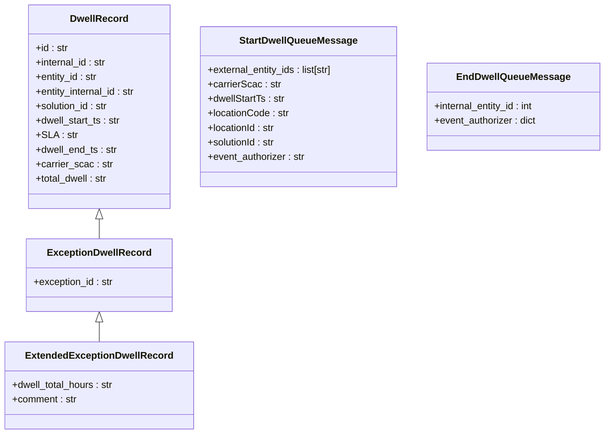

# Diagram: entity_core/entity_service/entity_service/dwell/typings.py

> Auto-generated by Obscura crawlers

## Mermaid

### SVG

<svg id="container" width="1002.72265625" xmlns="http://www.w3.org/2000/svg" class="classDiagram" height="716" viewBox="0 0 1002.72265625 716" role="graphics-document document" aria-roledescription="class"><g><defs><marker id="container_class-aggregationStart" class="marker aggregation class" refX="18" refY="7" markerWidth="190" markerHeight="240" orient="auto"><path d="M 18,7 L9,13 L1,7 L9,1 Z"></path></marker></defs><defs><marker id="container_class-aggregationEnd" class="marker aggregation class" refX="1" refY="7" markerWidth="20" markerHeight="28" orient="auto"><path d="M 18,7 L9,13 L1,7 L9,1 Z"></path></marker></defs><defs><marker id="container_class-extensionStart" class="marker extension class" refX="18" refY="7" markerWidth="190" markerHeight="240" orient="auto"><path d="M 1,7 L18,13 V 1 Z"></path></marker></defs><defs><marker id="container_class-extensionEnd" class="marker extension class" refX="1" refY="7" markerWidth="20" markerHeight="28" orient="auto"><path d="M 1,1 V 13 L18,7 Z"></path></marker></defs><defs><marker id="container_class-compositionStart" class="marker composition class" refX="18" refY="7" markerWidth="190" markerHeight="240" orient="auto"><path d="M 18,7 L9,13 L1,7 L9,1 Z"></path></marker></defs><defs><marker id="container_class-compositionEnd" class="marker composition class" refX="1" refY="7" markerWidth="20" markerHeight="28" orient="auto"><path d="M 18,7 L9,13 L1,7 L9,1 Z"></path></marker></defs><defs><marker id="container_class-dependencyStart" class="marker dependency class" refX="6" refY="7" markerWidth="190" markerHeight="240" orient="auto"><path d="M 5,7 L9,13 L1,7 L9,1 Z"></path></marker></defs><defs><marker id="container_class-dependencyEnd" class="marker dependency class" refX="13" refY="7" markerWidth="20" markerHeight="28" orient="auto"><path d="M 18,7 L9,13 L14,7 L9,1 Z"></path></marker></defs><defs><marker id="container_class-lollipopStart" class="marker lollipop class" refX="13" refY="7" markerWidth="190" markerHeight="240" orient="auto"><circle stroke="black" fill="transparent" cx="7" cy="7" r="6"></circle></marker></defs><defs><marker id="container_class-lollipopEnd" class="marker lollipop class" refX="1" refY="7" markerWidth="190" markerHeight="240" orient="auto"><circle stroke="black" fill="transparent" cx="7" cy="7" r="6"></circle></marker></defs><g class="root"><g class="clusters"></g><g class="edgePaths"><path d="M163.059,361.25L163.059,362.542C163.059,363.833,163.059,366.417,163.059,371.875C163.059,377.333,163.059,385.667,163.059,389.833L163.059,394" id="id_DwellRecord_ExceptionDwellRecord_1" class="edge-thickness-normal edge-pattern-solid relation" style=";;;" data-edge="true" data-et="edge" data-id="id_DwellRecord_ExceptionDwellRecord_1" data-points="W3sieCI6MTYzLjA1ODU5Mzc1LCJ5IjozNDR9LHsieCI6MTYzLjA1ODU5Mzc1LCJ5IjozNjl9LHsieCI6MTYzLjA1ODU5Mzc1LCJ5IjozOTR9XQ==" marker-start="url(#container_class-extensionStart)"></path><path d="M163.059,531.25L163.059,532.542C163.059,533.833,163.059,536.417,163.059,541.875C163.059,547.333,163.059,555.667,163.059,559.833L163.059,564" id="id_ExceptionDwellRecord_ExtendedExceptionDwellRecord_2" class="edge-thickness-normal edge-pattern-solid relation" style=";;;" data-edge="true" data-et="edge" data-id="id_ExceptionDwellRecord_ExtendedExceptionDwellRecord_2" data-points="W3sieCI6MTYzLjA1ODU5Mzc1LCJ5Ijo1MTR9LHsieCI6MTYzLjA1ODU5Mzc1LCJ5Ijo1Mzl9LHsieCI6MTYzLjA1ODU5Mzc1LCJ5Ijo1NjR9XQ==" marker-start="url(#container_class-extensionStart)"></path></g><g class="edgeLabels"><g class="edgeLabel"><g class="label" data-id="id_DwellRecord_ExceptionDwellRecord_1" transform="translate(0, 0)"><foreignObject width="0" height="0">

</foreignObject></g></g><g class="edgeLabel"><g class="label" data-id="id_ExceptionDwellRecord_ExtendedExceptionDwellRecord_2" transform="translate(0, 0)"><foreignObject width="0" height="0">

</foreignObject></g></g></g><g class="nodes"><g class="node default" id="classId-DwellRecord-0" transform="translate(163.05859375, 176)"><g class="basic label-container"><path d="M-119.2890625 -168 L119.2890625 -168 L119.2890625 168 L-119.2890625 168" stroke="none" stroke-width="0" fill="#ECECFF" style=""></path><path d="M-119.2890625 -168 C-47.753835329927526 -168, 23.78139184014495 -168, 119.2890625 -168 M-119.2890625 -168 C-38.66662898464797 -168, 41.95580453070406 -168, 119.2890625 -168 M119.2890625 -168 C119.2890625 -72.55475337116525, 119.2890625 22.890493257669505, 119.2890625 168 M119.2890625 -168 C119.2890625 -50.95689771858635, 119.2890625 66.0862045628273, 119.2890625 168 M119.2890625 168 C68.88765210562572 168, 18.486241711251438 168, -119.2890625 168 M119.2890625 168 C56.776745964038845 168, -5.73557057192231 168, -119.2890625 168 M-119.2890625 168 C-119.2890625 83.91514375970935, -119.2890625 -0.16971248058129618, -119.2890625 -168 M-119.2890625 168 C-119.2890625 39.862026740075436, -119.2890625 -88.27594651984913, -119.2890625 -168" stroke="#9370DB" stroke-width="1.3" fill="none" stroke-dasharray="0 0" style=""></path></g><g class="annotation-group text" transform="translate(0, -144)"></g><g class="label-group text" transform="translate(-45.71875, -144)"><g class="label" style="font-weight: bolder" transform="translate(0,-12)"><foreignObject width="91.4375" height="24">

DwellRecord

</foreignObject></g></g><g class="members-group text" transform="translate(-107.2890625, -96)"><g class="label" style="" transform="translate(0,-12)"><foreignObject width="53.8125" height="24">

+id : str

</foreignObject></g><g class="label" style="" transform="translate(0,12)"><foreignObject width="119.0625" height="24">

+internal_id : str

</foreignObject></g><g class="label" style="" transform="translate(0,36)"><foreignObject width="103.609375" height="24">

+entity_id : str

</foreignObject></g><g class="label" style="" transform="translate(0,60)"><foreignObject width="168.859375" height="24">

+entity_internal_id : str

</foreignObject></g><g class="label" style="" transform="translate(0,84)"><foreignObject width="121.953125" height="24">

+solution_id : str

</foreignObject></g><g class="label" style="" transform="translate(0,108)"><foreignObject width="142.234375" height="24">

+dwell_start_ts : str

</foreignObject></g><g class="label" style="" transform="translate(0,132)"><foreignObject width="64.953125" height="24">

+SLA : str

</foreignObject></g><g class="label" style="" transform="translate(0,156)"><foreignObject width="135.78125" height="24">

+dwell_end_ts : str

</foreignObject></g><g class="label" style="" transform="translate(0,180)"><foreignObject width="126.046875" height="24">

+carrier_scac : str

</foreignObject></g><g class="label" style="" transform="translate(0,204)"><foreignObject width="120.5625" height="24">

+total_dwell : str

</foreignObject></g></g><g class="methods-group text" transform="translate(-107.2890625, 168)"></g><g class="divider" style=""><path d="M-119.2890625 -120 C-34.1732517595281 -120, 50.9425589809438 -120, 119.2890625 -120 M-119.2890625 -120 C-38.03239827894275 -120, 43.2242659421145 -120, 119.2890625 -120" stroke="#9370DB" stroke-width="1.3" fill="none" stroke-dasharray="0 0" style=""></path></g><g class="divider" style=""><path d="M-119.2890625 144 C-69.02688448877657 144, -18.764706477553162 144, 119.2890625 144 M-119.2890625 144 C-51.16638573441776 144, 16.956291031164483 144, 119.2890625 144" stroke="#9370DB" stroke-width="1.3" fill="none" stroke-dasharray="0 0" style=""></path></g></g><g class="node default" id="classId-ExceptionDwellRecord-1" transform="translate(163.05859375, 454)"><g class="basic label-container"><path d="M-119.15234375 -60 L119.15234375 -60 L119.15234375 60 L-119.15234375 60" stroke="none" stroke-width="0" fill="#ECECFF" style=""></path><path d="M-119.15234375 -60 C-29.5352635972161 -60, 60.0818165555678 -60, 119.15234375 -60 M-119.15234375 -60 C-62.645189749116746 -60, -6.1380357482334915 -60, 119.15234375 -60 M119.15234375 -60 C119.15234375 -14.833331699381397, 119.15234375 30.333336601237207, 119.15234375 60 M119.15234375 -60 C119.15234375 -12.19943390545022, 119.15234375 35.60113218909956, 119.15234375 60 M119.15234375 60 C59.788131760677025 60, 0.42391977135405057 60, -119.15234375 60 M119.15234375 60 C33.939449856080614 60, -51.27344403783877 60, -119.15234375 60 M-119.15234375 60 C-119.15234375 13.801035711347403, -119.15234375 -32.397928577305194, -119.15234375 -60 M-119.15234375 60 C-119.15234375 17.382802906337098, -119.15234375 -25.234394187325805, -119.15234375 -60" stroke="#9370DB" stroke-width="1.3" fill="none" stroke-dasharray="0 0" style=""></path></g><g class="annotation-group text" transform="translate(0, -36)"></g><g class="label-group text" transform="translate(-81.4140625, -36)"><g class="label" style="font-weight: bolder" transform="translate(0,-12)"><foreignObject width="162.828125" height="24">

ExceptionDwellRecord

</foreignObject></g></g><g class="members-group text" transform="translate(-107.15234375, 12)"><g class="label" style="" transform="translate(0,-12)"><foreignObject width="132.890625" height="24">

+exception_id : str

</foreignObject></g></g><g class="methods-group text" transform="translate(-107.15234375, 60)"></g><g class="divider" style=""><path d="M-119.15234375 -12 C-66.6293304286797 -12, -14.106317107359388 -12, 119.15234375 -12 M-119.15234375 -12 C-65.02041967165133 -12, -10.88849559330265 -12, 119.15234375 -12" stroke="#9370DB" stroke-width="1.3" fill="none" stroke-dasharray="0 0" style=""></path></g><g class="divider" style=""><path d="M-119.15234375 36 C-54.75039908838309 36, 9.651545573233818 36, 119.15234375 36 M-119.15234375 36 C-62.90396156748347 36, -6.655579384966941 36, 119.15234375 36" stroke="#9370DB" stroke-width="1.3" fill="none" stroke-dasharray="0 0" style=""></path></g></g><g class="node default" id="classId-ExtendedExceptionDwellRecord-2" transform="translate(163.05859375, 636)"><g class="basic label-container"><path d="M-155.05859375 -72 L155.05859375 -72 L155.05859375 72 L-155.05859375 72" stroke="none" stroke-width="0" fill="#ECECFF" style=""></path><path d="M-155.05859375 -72 C-72.48701288145449 -72, 10.08456798709102 -72, 155.05859375 -72 M-155.05859375 -72 C-88.84674338961702 -72, -22.634893029234036 -72, 155.05859375 -72 M155.05859375 -72 C155.05859375 -21.608123520112116, 155.05859375 28.783752959775768, 155.05859375 72 M155.05859375 -72 C155.05859375 -41.381017683658165, 155.05859375 -10.76203536731633, 155.05859375 72 M155.05859375 72 C74.68472807892611 72, -5.689137592147773 72, -155.05859375 72 M155.05859375 72 C74.14144333201494 72, -6.775707085970112 72, -155.05859375 72 M-155.05859375 72 C-155.05859375 19.825291616467076, -155.05859375 -32.34941676706585, -155.05859375 -72 M-155.05859375 72 C-155.05859375 36.185457066776, -155.05859375 0.37091413355200586, -155.05859375 -72" stroke="#9370DB" stroke-width="1.3" fill="none" stroke-dasharray="0 0" style=""></path></g><g class="annotation-group text" transform="translate(0, -48)"></g><g class="label-group text" transform="translate(-115.7109375, -48)"><g class="label" style="font-weight: bolder" transform="translate(0,-12)"><foreignObject width="231.421875" height="24">

ExtendedExceptionDwellRecord

</foreignObject></g></g><g class="members-group text" transform="translate(-143.05859375, 0)"><g class="label" style="" transform="translate(0,-12)"><foreignObject width="170.40625" height="24">

+dwell_total_hours : str

</foreignObject></g><g class="label" style="" transform="translate(0,12)"><foreignObject width="107.703125" height="24">

+comment : str

</foreignObject></g></g><g class="methods-group text" transform="translate(-143.05859375, 72)"></g><g class="divider" style=""><path d="M-155.05859375 -24 C-72.56804878310184 -24, 9.922496183796312 -24, 155.05859375 -24 M-155.05859375 -24 C-52.6020822661564 -24, 49.8544292176872 -24, 155.05859375 -24" stroke="#9370DB" stroke-width="1.3" fill="none" stroke-dasharray="0 0" style=""></path></g><g class="divider" style=""><path d="M-155.05859375 48 C-33.548730782348485 48, 87.96113218530303 48, 155.05859375 48 M-155.05859375 48 C-87.9989700250154 48, -20.939346300030792 48, 155.05859375 48" stroke="#9370DB" stroke-width="1.3" fill="none" stroke-dasharray="0 0" style=""></path></g></g><g class="node default" id="classId-StartDwellQueueMessage-3" transform="translate(496.63671875, 176)"><g class="basic label-container"><path d="M-164.2890625 -132 L164.2890625 -132 L164.2890625 132 L-164.2890625 132" stroke="none" stroke-width="0" fill="#ECECFF" style=""></path><path d="M-164.2890625 -132 C-73.76270540418105 -132, 16.763651691637904 -132, 164.2890625 -132 M-164.2890625 -132 C-93.60026214430094 -132, -22.911461788601883 -132, 164.2890625 -132 M164.2890625 -132 C164.2890625 -75.18052851492914, 164.2890625 -18.361057029858287, 164.2890625 132 M164.2890625 -132 C164.2890625 -59.40221238076242, 164.2890625 13.195575238475158, 164.2890625 132 M164.2890625 132 C39.857157250615884 132, -84.57474799876823 132, -164.2890625 132 M164.2890625 132 C71.96506593574517 132, -20.358930628509654 132, -164.2890625 132 M-164.2890625 132 C-164.2890625 71.37283170324724, -164.2890625 10.745663406494486, -164.2890625 -132 M-164.2890625 132 C-164.2890625 55.85012998411818, -164.2890625 -20.299740031763633, -164.2890625 -132" stroke="#9370DB" stroke-width="1.3" fill="none" stroke-dasharray="0 0" style=""></path></g><g class="annotation-group text" transform="translate(0, -108)"></g><g class="label-group text" transform="translate(-93.375, -108)"><g class="label" style="font-weight: bolder" transform="translate(0,-12)"><foreignObject width="186.75" height="24">

StartDwellQueueMessage

</foreignObject></g></g><g class="members-group text" transform="translate(-152.2890625, -60)"><g class="label" style="" transform="translate(0,-12)"><foreignObject width="211.203125" height="24">

+external_entity_ids : list[str]

</foreignObject></g><g class="label" style="" transform="translate(0,12)"><foreignObject width="120.25" height="24">

+carrierScac : str

</foreignObject></g><g class="label" style="" transform="translate(0,36)"><foreignObject width="128.859375" height="24">

+dwellStartTs : str

</foreignObject></g><g class="label" style="" transform="translate(0,60)"><foreignObject width="135.15625" height="24">

+locationCode : str

</foreignObject></g><g class="label" style="" transform="translate(0,84)"><foreignObject width="113.171875" height="24">

+locationId : str

</foreignObject></g><g class="label" style="" transform="translate(0,108)"><foreignObject width="113.84375" height="24">

+solutionId : str

</foreignObject></g><g class="label" style="" transform="translate(0,132)"><foreignObject width="163.046875" height="24">

+event_authorizer : str

</foreignObject></g></g><g class="methods-group text" transform="translate(-152.2890625, 132)"></g><g class="divider" style=""><path d="M-164.2890625 -84 C-76.66766127324244 -84, 10.953739953515111 -84, 164.2890625 -84 M-164.2890625 -84 C-44.08896756587636 -84, 76.11112736824728 -84, 164.2890625 -84" stroke="#9370DB" stroke-width="1.3" fill="none" stroke-dasharray="0 0" style=""></path></g><g class="divider" style=""><path d="M-164.2890625 108 C-97.12783682734148 108, -29.966611154682965 108, 164.2890625 108 M-164.2890625 108 C-94.76510791146748 108, -25.241153322934963 108, 164.2890625 108" stroke="#9370DB" stroke-width="1.3" fill="none" stroke-dasharray="0 0" style=""></path></g></g><g class="node default" id="classId-EndDwellQueueMessage-4" transform="translate(852.82421875, 176)"><g class="basic label-container"><path d="M-141.8984375 -72 L141.8984375 -72 L141.8984375 72 L-141.8984375 72" stroke="none" stroke-width="0" fill="#ECECFF" style=""></path><path d="M-141.8984375 -72 C-57.939862398338704 -72, 26.018712703322592 -72, 141.8984375 -72 M-141.8984375 -72 C-85.03586068981141 -72, -28.17328387962283 -72, 141.8984375 -72 M141.8984375 -72 C141.8984375 -19.460511320328862, 141.8984375 33.078977359342275, 141.8984375 72 M141.8984375 -72 C141.8984375 -24.1088887941959, 141.8984375 23.782222411608203, 141.8984375 72 M141.8984375 72 C43.558162773385305 72, -54.78211195322939 72, -141.8984375 72 M141.8984375 72 C55.034342736246046 72, -31.829752027507908 72, -141.8984375 72 M-141.8984375 72 C-141.8984375 15.538696045395632, -141.8984375 -40.922607909208736, -141.8984375 -72 M-141.8984375 72 C-141.8984375 16.583277121345397, -141.8984375 -38.83344575730921, -141.8984375 -72" stroke="#9370DB" stroke-width="1.3" fill="none" stroke-dasharray="0 0" style=""></path></g><g class="annotation-group text" transform="translate(0, -48)"></g><g class="label-group text" transform="translate(-88.671875, -48)"><g class="label" style="font-weight: bolder" transform="translate(0,-12)"><foreignObject width="177.34375" height="24">

EndDwellQueueMessage

</foreignObject></g></g><g class="members-group text" transform="translate(-129.8984375, 0)"><g class="label" style="" transform="translate(0,-12)"><foreignObject width="168.78125" height="24">

+internal_entity_id : int

</foreignObject></g><g class="label" style="" transform="translate(0,12)"><foreignObject width="171.125" height="24">

+event_authorizer : dict

</foreignObject></g></g><g class="methods-group text" transform="translate(-129.8984375, 72)"></g><g class="divider" style=""><path d="M-141.8984375 -24 C-51.61135349263398 -24, 38.67573051473204 -24, 141.8984375 -24 M-141.8984375 -24 C-64.23197593654231 -24, 13.434485626915375 -24, 141.8984375 -24" stroke="#9370DB" stroke-width="1.3" fill="none" stroke-dasharray="0 0" style=""></path></g><g class="divider" style=""><path d="M-141.8984375 48 C-66.07296106262184 48, 9.752515374756314 48, 141.8984375 48 M-141.8984375 48 C-59.395186003843094 48, 23.108065492313813 48, 141.8984375 48" stroke="#9370DB" stroke-width="1.3" fill="none" stroke-dasharray="0 0" style=""></path></g></g></g></g></g></svg>
