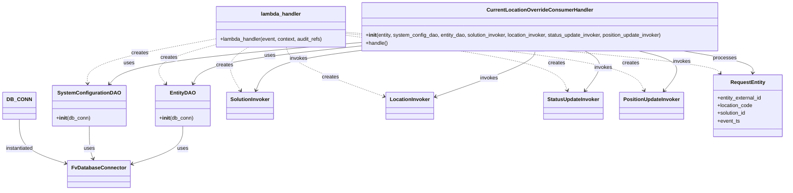

# Diagram: entity_core/entity_service/entity_service/entity/admin_tool/current_location_override/api_consumer.py


> Auto-generated by Obscura crawlers

## Diagram 1

```mermaid
flowchart TD
Start([lambda_handler invoked]) --> CheckRecords{event has "Records"?}
CheckRecords -->|yes| ForEach[Iterate over Records]
CheckRecords -->|no| NoRecords[Return create_sqs_consumer_response([])]
ForEach --> ParseBody[Parse record.body JSON -> body]
ParseBody --> Validate{solution_id, entity_external_id, location_code, event_ts present?}
ParseBody -->|parse error| HandleError1[Log error; append failed_records]
Validate -->|yes| CreateObjects[Create RequestEntity and PositionUpdateInvoker]
CreateObjects --> InstantiateHandler[Instantiate CurrentLocationOverrideConsumerHandler with SystemConfigurationDAO, EntityDAO, SolutionInvoker, LocationInvoker, StatusUpdateInvoker, PositionUpdateInvoker]
InstantiateHandler --> InvokeHandle[Call .handle()]
InvokeHandle --> ForEach
Validate -->|no| RaiseError[Raise Exception("Required parameters are missing")]
RaiseError --> HandleError2[Log error; append failed_records]
HandleError1 --> ForEach
HandleError2 --> ForEach
ForEach --> AfterLoop[After processing all records]
AfterLoop --> ReturnResp[Return create_sqs_consumer_response(failed_records)]
ReturnResp --> End([End])
```

> SVG rendering failed for this diagram.

## Diagram 2



### SVG

<svg id="container" width="2395.18359375" xmlns="http://www.w3.org/2000/svg" class="classDiagram" height="590" viewBox="0 0 2395.18359375 590" role="graphics-document document" aria-roledescription="class"><style>#container{font-family:"trebuchet ms",verdana,arial,sans-serif;font-size:16px;fill:#333;}@keyframes edge-animation-frame{from{stroke-dashoffset:0;}}@keyframes dash{to{stroke-dashoffset:0;}}#container .edge-animation-slow{stroke-dasharray:9,5!important;stroke-dashoffset:900;animation:dash 50s linear infinite;stroke-linecap:round;}#container .edge-animation-fast{stroke-dasharray:9,5!important;stroke-dashoffset:900;animation:dash 20s linear infinite;stroke-linecap:round;}#container .error-icon{fill:#552222;}#container .error-text{fill:#552222;stroke:#552222;}#container .edge-thickness-normal{stroke-width:1px;}#container .edge-thickness-thick{stroke-width:3.5px;}#container .edge-pattern-solid{stroke-dasharray:0;}#container .edge-thickness-invisible{stroke-width:0;fill:none;}#container .edge-pattern-dashed{stroke-dasharray:3;}#container .edge-pattern-dotted{stroke-dasharray:2;}#container .marker{fill:#333333;stroke:#333333;}#container .marker.cross{stroke:#333333;}#container svg{font-family:"trebuchet ms",verdana,arial,sans-serif;font-size:16px;}#container p{margin:0;}#container g.classGroup text{fill:#9370DB;stroke:none;font-family:"trebuchet ms",verdana,arial,sans-serif;font-size:10px;}#container g.classGroup text .title{font-weight:bolder;}#container .nodeLabel,#container .edgeLabel{color:#131300;}#container .edgeLabel .label rect{fill:#ECECFF;}#container .label text{fill:#131300;}#container .labelBkg{background:#ECECFF;}#container .edgeLabel .label span{background:#ECECFF;}#container .classTitle{font-weight:bolder;}#container .node rect,#container .node circle,#container .node ellipse,#container .node polygon,#container .node path{fill:#ECECFF;stroke:#9370DB;stroke-width:1px;}#container .divider{stroke:#9370DB;stroke-width:1;}#container g.clickable{cursor:pointer;}#container g.classGroup rect{fill:#ECECFF;stroke:#9370DB;}#container g.classGroup line{stroke:#9370DB;stroke-width:1;}#container .classLabel .box{stroke:none;stroke-width:0;fill:#ECECFF;opacity:0.5;}#container .classLabel .label{fill:#9370DB;font-size:10px;}#container .relation{stroke:#333333;stroke-width:1;fill:none;}#container .dashed-line{stroke-dasharray:3;}#container .dotted-line{stroke-dasharray:1 2;}#container #compositionStart,#container .composition{fill:#333333!important;stroke:#333333!important;stroke-width:1;}#container #compositionEnd,#container .composition{fill:#333333!important;stroke:#333333!important;stroke-width:1;}#container #dependencyStart,#container .dependency{fill:#333333!important;stroke:#333333!important;stroke-width:1;}#container #dependencyStart,#container .dependency{fill:#333333!important;stroke:#333333!important;stroke-width:1;}#container #extensionStart,#container .extension{fill:transparent!important;stroke:#333333!important;stroke-width:1;}#container #extensionEnd,#container .extension{fill:transparent!important;stroke:#333333!important;stroke-width:1;}#container #aggregationStart,#container .aggregation{fill:transparent!important;stroke:#333333!important;stroke-width:1;}#container #aggregationEnd,#container .aggregation{fill:transparent!important;stroke:#333333!important;stroke-width:1;}#container #lollipopStart,#container .lollipop{fill:#ECECFF!important;stroke:#333333!important;stroke-width:1;}#container #lollipopEnd,#container .lollipop{fill:#ECECFF!important;stroke:#333333!important;stroke-width:1;}#container .edgeTerminals{font-size:11px;line-height:initial;}#container .classTitleText{text-anchor:middle;font-size:18px;fill:#333;}#container .label-icon{display:inline-block;height:1em;overflow:visible;vertical-align:-0.125em;}#container .node .label-icon path{fill:currentColor;stroke:revert;stroke-width:revert;}#container :root{--mermaid-font-family:"trebuchet ms",verdana,arial,sans-serif;}</style><g><defs><marker id="container_class-aggregationStart" class="marker aggregation class" refX="18" refY="7" markerWidth="190" markerHeight="240" orient="auto"><path d="M 18,7 L9,13 L1,7 L9,1 Z"></path></marker></defs><defs><marker id="container_class-aggregationEnd" class="marker aggregation class" refX="1" refY="7" markerWidth="20" markerHeight="28" orient="auto"><path d="M 18,7 L9,13 L1,7 L9,1 Z"></path></marker></defs><defs><marker id="container_class-extensionStart" class="marker extension class" refX="18" refY="7" markerWidth="190" markerHeight="240" orient="auto"><path d="M 1,7 L18,13 V 1 Z"></path></marker></defs><defs><marker id="container_class-extensionEnd" class="marker extension class" refX="1" refY="7" markerWidth="20" markerHeight="28" orient="auto"><path d="M 1,1 V 13 L18,7 Z"></path></marker></defs><defs><marker id="container_class-compositionStart" class="marker composition class" refX="18" refY="7" markerWidth="190" markerHeight="240" orient="auto"><path d="M 18,7 L9,13 L1,7 L9,1 Z"></path></marker></defs><defs><marker id="container_class-compositionEnd" class="marker composition class" refX="1" refY="7" markerWidth="20" markerHeight="28" orient="auto"><path d="M 18,7 L9,13 L1,7 L9,1 Z"></path></marker></defs><defs><marker id="container_class-dependencyStart" class="marker dependency class" refX="6" refY="7" markerWidth="190" markerHeight="240" orient="auto"><path d="M 5,7 L9,13 L1,7 L9,1 Z"></path></marker></defs><defs><marker id="container_class-dependencyEnd" class="marker dependency class" refX="13" refY="7" markerWidth="20" markerHeight="28" orient="auto"><path d="M 18,7 L9,13 L14,7 L9,1 Z"></path></marker></defs><defs><marker id="container_class-lollipopStart" class="marker lollipop class" refX="13" refY="7" markerWidth="190" markerHeight="240" orient="auto"><circle stroke="black" fill="transparent" cx="7" cy="7" r="6"></circle></marker></defs><defs><marker id="container_class-lollipopEnd" class="marker lollipop class" refX="1" refY="7" markerWidth="190" markerHeight="240" orient="auto"><circle stroke="black" fill="transparent" cx="7" cy="7" r="6"></circle></marker></defs><g class="root"><g class="clusters"></g><g class="edgePaths"><path d="M54.406,370L54.406,385.167C54.406,400.333,54.406,430.667,77.825,453.623C101.244,476.579,148.081,492.158,171.499,499.947L194.918,507.737" id="id_DB_CONN_FvDatabaseConnector_1" class="edge-thickness-normal edge-pattern-solid relation" style=";;;" data-edge="true" data-et="edge" data-id="id_DB_CONN_FvDatabaseConnector_1" data-points="W3sieCI6NTQuNDA2MjUsInkiOjM3MH0seyJ4Ijo1NC40MDYyNSwieSI6NDYxfSx7IngiOjIwMC42MTEzMjgxMjUsInkiOjUwOS42MzA0MjYzODA0OTQyfV0=" marker-end="url(#container_class-dependencyEnd)"></path><path d="M260.906,391L260.906,402.667C260.906,414.333,260.906,437.667,262.961,454.569C265.017,471.472,269.127,481.943,271.182,487.179L273.237,492.415" id="id_SystemConfigurationDAO_FvDatabaseConnector_2" class="edge-thickness-normal edge-pattern-solid relation" style=";;;" data-edge="true" data-et="edge" data-id="id_SystemConfigurationDAO_FvDatabaseConnector_2" data-points="W3sieCI6MjYwLjkwNjI1LCJ5IjozOTF9LHsieCI6MjYwLjkwNjI1LCJ5Ijo0NjF9LHsieCI6Mjc1LjQyOTgxMTExNTUwNjMsInkiOjQ5OH1d" marker-end="url(#container_class-dependencyEnd)"></path><path d="M544.436,391L544.436,402.667C544.436,414.333,544.436,437.667,518.521,457.441C492.606,477.215,440.777,493.429,414.862,501.537L388.947,509.644" id="id_EntityDAO_FvDatabaseConnector_3" class="edge-thickness-normal edge-pattern-solid relation" style=";;;" data-edge="true" data-et="edge" data-id="id_EntityDAO_FvDatabaseConnector_3" data-points="W3sieCI6NTQ0LjQzNTU0Njg3NSwieSI6MzkxfSx7IngiOjU0NC40MzU1NDY4NzUsInkiOjQ2MX0seyJ4IjozODMuMjIwNzAzMTI1LCJ5Ijo1MTEuNDM1NTk0NDAwMTg1Nn1d" marker-end="url(#container_class-dependencyEnd)"></path><path d="M636.645,121.62L572.413,133.85C508.181,146.08,379.717,170.54,316.26,193.439C252.803,216.339,254.351,237.677,255.125,248.346L255.9,259.016" id="id_lambda_handler_SystemConfigurationDAO_4" class="edge-thickness-normal edge-pattern-dashed relation" style=";;;" data-edge="true" data-et="edge" data-id="id_lambda_handler_SystemConfigurationDAO_4" data-points="W3sieCI6NjM2LjY0NDUzMTI1LCJ5IjoxMjEuNjIwMDQ4NDc3NjA0fSx7IngiOjI1MS4yNTM5MDYyNSwieSI6MTk1fSx7IngiOjI1Ni4zMzQwODcxNzEwNTI2NiwieSI6MjY1fV0=" marker-end="url(#container_class-dependencyEnd)"></path><path d="M636.645,140.542L604.651,149.618C572.657,158.694,508.669,176.847,484.826,196.79C460.982,216.733,477.283,238.467,485.433,249.333L493.584,260.2" id="id_lambda_handler_EntityDAO_5" class="edge-thickness-normal edge-pattern-dashed relation" style=";;;" data-edge="true" data-et="edge" data-id="id_lambda_handler_EntityDAO_5" data-points="W3sieCI6NjM2LjY0NDUzMTI1LCJ5IjoxNDAuNTQxNzQxOTA1MTYyMzh9LHsieCI6NDQ0LjY4MTY0MDYyNSwieSI6MTk1fSx7IngiOjQ5Ny4xODM2OTY1NDYwNTI2LCJ5IjoyNjV9XQ==" marker-end="url(#container_class-dependencyEnd)"></path><path d="M742.853,146L730.328,154.167C717.802,162.333,692.752,178.667,688.824,201.143C684.895,223.619,702.09,252.238,710.687,266.547L719.284,280.857" id="id_lambda_handler_SolutionInvoker_6" class="edge-thickness-normal edge-pattern-dashed relation" style=";;;" data-edge="true" data-et="edge" data-id="id_lambda_handler_SolutionInvoker_6" data-points="W3sieCI6NzQyLjg1MjkwNTI3MzQzNzUsInkiOjE0Nn0seyJ4Ijo2NjcuNzAxMTcxODc1LCJ5IjoxOTV9LHsieCI6NzIyLjM3Mzg2OTI0MzQyMSwieSI6Mjg2fV0=" marker-end="url(#container_class-dependencyEnd)"></path><path d="M856.92,146L859.181,154.167C861.442,162.333,865.964,178.667,917.692,204.455C969.419,230.243,1068.352,265.485,1117.819,283.107L1167.285,300.728" id="id_lambda_handler_LocationInvoker_7" class="edge-thickness-normal edge-pattern-dashed relation" style=";;;" data-edge="true" data-et="edge" data-id="id_lambda_handler_LocationInvoker_7" data-points="W3sieCI6ODU2LjkxOTU1NTY2NDA2MjUsInkiOjE0Nn0seyJ4Ijo4NzAuNDg2MzI4MTI1LCJ5IjoxOTV9LHsieCI6MTE3Mi45Mzc1LCJ5IjozMDIuNzQxMjc4MjAyOTYxOTV9XQ==" marker-end="url(#container_class-dependencyEnd)"></path><path d="M1042.309,109.373L1152.068,123.644C1261.827,137.915,1481.345,166.458,1596.359,194.957C1711.373,223.457,1721.884,251.914,1727.139,266.143L1732.394,280.372" id="id_lambda_handler_StatusUpdateInvoker_8" class="edge-thickness-normal edge-pattern-dashed relation" style=";;;" data-edge="true" data-et="edge" data-id="id_lambda_handler_StatusUpdateInvoker_8" data-points="W3sieCI6MTA0Mi4zMDg1OTM3NSwieSI6MTA5LjM3MjgwOTEwNTk1NjV9LHsieCI6MTcwMC44NjMyODEyNSwieSI6MTk1fSx7IngiOjE3MzQuNDcyNDUwNjU3ODk0OCwieSI6Mjg2fV0=" marker-end="url(#container_class-dependencyEnd)"></path><path d="M1042.309,103.948L1189.245,119.123C1336.181,134.299,1630.053,164.649,1783.605,194.084C1937.158,223.519,1950.389,252.038,1957.005,266.298L1963.621,280.557" id="id_lambda_handler_PositionUpdateInvoker_9" class="edge-thickness-normal edge-pattern-dashed relation" style=";;;" data-edge="true" data-et="edge" data-id="id_lambda_handler_PositionUpdateInvoker_9" data-points="W3sieCI6MTA0Mi4zMDg1OTM3NSwieSI6MTAzLjk0ODEzMzk1MzM2Nzc0fSx7IngiOjE5MjMuOTI1NzgxMjUsInkiOjE5NX0seyJ4IjoxOTY2LjE0NjM4MTU3ODk0NzMsInkiOjI4Nn1d" marker-end="url(#container_class-dependencyEnd)"></path><path d="M1042.309,100.094L1229.993,115.912C1417.676,131.73,1793.044,163.365,1985.257,184.583C2177.469,205.801,2186.526,216.602,2191.054,222.002L2195.583,227.402" id="id_lambda_handler_RequestEntity_10" class="edge-thickness-normal edge-pattern-dashed relation" style=";;;" data-edge="true" data-et="edge" data-id="id_lambda_handler_RequestEntity_10" data-points="W3sieCI6MTA0Mi4zMDg1OTM3NSwieSI6MTAwLjA5NDI3MzM0Nzg4MzI3fSx7IngiOjIxNjguNDEyMTA5Mzc1LCJ5IjoxOTV9LHsieCI6MjE5OS40Mzc5Njk5MjQ4MTIsInkiOjIzMn1d" marker-end="url(#container_class-dependencyEnd)"></path><path d="M2084.335,158L2120.142,164.167C2155.949,170.333,2227.562,182.667,2262.62,194.01C2297.678,205.354,2296.18,215.708,2295.432,220.885L2294.683,226.062" id="id_CurrentLocationOverrideConsumerHandler_RequestEntity_11" class="edge-thickness-normal edge-pattern-solid relation" style=";;;" data-edge="true" data-et="edge" data-id="id_CurrentLocationOverrideConsumerHandler_RequestEntity_11" data-points="W3sieCI6MjA4NC4zMzUyMzk5NTUzNTczLCJ5IjoxNTh9LHsieCI6MjI5OS4xNzU3ODEyNSwieSI6MTk1fSx7IngiOjIyOTMuODIzNzc4MTk1NDg4NiwieSI6MjMyfV0=" marker-end="url(#container_class-dependencyEnd)"></path><path d="M1092.309,132.203L973.927,142.67C855.545,153.136,618.781,174.068,490.449,195.461C362.117,216.855,342.216,238.709,332.265,249.636L322.315,260.564" id="id_CurrentLocationOverrideConsumerHandler_SystemConfigurationDAO_12" class="edge-thickness-normal edge-pattern-solid relation" style=";;;" data-edge="true" data-et="edge" data-id="id_CurrentLocationOverrideConsumerHandler_SystemConfigurationDAO_12" data-points="W3sieCI6MTA5Mi4zMDg1OTM3NSwieSI6MTMyLjIwMzQyMjA1MDMwMDg3fSx7IngiOjM4Mi4wMTc1NzgxMjUsInkiOjE5NX0seyJ4IjozMTguMjc0NzczODQ4Njg0MiwieSI6MjY1fV0=" marker-end="url(#container_class-dependencyEnd)"></path><path d="M1092.309,142.716L1011.097,151.43C929.885,160.144,767.461,177.572,681.348,197.043C595.235,216.513,585.432,238.027,580.531,248.783L575.629,259.54" id="id_CurrentLocationOverrideConsumerHandler_EntityDAO_13" class="edge-thickness-normal edge-pattern-solid relation" style=";;;" data-edge="true" data-et="edge" data-id="id_CurrentLocationOverrideConsumerHandler_EntityDAO_13" data-points="W3sieCI6MTA5Mi4zMDg1OTM3NSwieSI6MTQyLjcxNjE3NjY0Mzk0NDY2fSx7IngiOjYwNS4wMzcxMDkzNzUsInkiOjE5NX0seyJ4Ijo1NzMuMTQxNTUwMTY0NDczNiwieSI6MjY1fV0=" marker-end="url(#container_class-dependencyEnd)"></path><path d="M1092.309,156.15L1043.045,162.625C993.782,169.1,895.255,182.05,840.737,202.754C786.218,223.457,775.708,251.914,770.453,266.143L765.198,280.372" id="id_CurrentLocationOverrideConsumerHandler_SolutionInvoker_14" class="edge-thickness-normal edge-pattern-solid relation" style=";;;" data-edge="true" data-et="edge" data-id="id_CurrentLocationOverrideConsumerHandler_SolutionInvoker_14" data-points="W3sieCI6MTA5Mi4zMDg1OTM3NSwieSI6MTU2LjE0OTgzNTU0MzI4MDE4fSx7IngiOjc5Ni43Mjg1MTU2MjUsInkiOjE5NX0seyJ4Ijo3NjMuMTE5MzQ2MjE3MTA1MywieSI6Mjg2fV0=" marker-end="url(#container_class-dependencyEnd)"></path><path d="M1634.288,158L1633.091,164.167C1631.894,170.333,1629.5,182.667,1577.188,206.571C1524.876,230.476,1422.647,265.951,1371.533,283.689L1320.418,301.427" id="id_CurrentLocationOverrideConsumerHandler_LocationInvoker_15" class="edge-thickness-normal edge-pattern-solid relation" style=";;;" data-edge="true" data-et="edge" data-id="id_CurrentLocationOverrideConsumerHandler_LocationInvoker_15" data-points="W3sieCI6MTYzNC4yODgxNTU2OTE5NjQyLCJ5IjoxNTh9LHsieCI6MTYyNy4xMDU0Njg3NSwieSI6MTk1fSx7IngiOjEzMTQuNzUsInkiOjMwMy4zOTQwMTcyMjQ2ODUzNH1d" marker-end="url(#container_class-dependencyEnd)"></path><path d="M1783.66,158L1794.745,164.167C1805.83,170.333,1827.999,182.667,1828.261,203.201C1828.522,223.736,1806.877,252.472,1796.054,266.84L1785.231,281.208" id="id_CurrentLocationOverrideConsumerHandler_StatusUpdateInvoker_16" class="edge-thickness-normal edge-pattern-solid relation" style=";;;" data-edge="true" data-et="edge" data-id="id_CurrentLocationOverrideConsumerHandler_StatusUpdateInvoker_16" data-points="W3sieCI6MTc4My42NjAzNjU1MTMzOTMsInkiOjE1OH0seyJ4IjoxODUwLjE2Nzk2ODc1LCJ5IjoxOTV9LHsieCI6MTc4MS42MjEyOTkzNDIxMDUyLCJ5IjoyODZ9XQ==" marker-end="url(#container_class-dependencyEnd)"></path><path d="M1947.379,158L1971.925,164.167C1996.471,170.333,2045.562,182.667,2058.31,203.227C2071.058,223.787,2047.461,252.573,2035.663,266.966L2023.864,281.36" id="id_CurrentLocationOverrideConsumerHandler_PositionUpdateInvoker_17" class="edge-thickness-normal edge-pattern-solid relation" style=";;;" data-edge="true" data-et="edge" data-id="id_CurrentLocationOverrideConsumerHandler_PositionUpdateInvoker_17" data-points="W3sieCI6MTk0Ny4zNzg4ODg4MTEzODQsInkiOjE1OH0seyJ4IjoyMDk0LjY1NDI5Njg3NSwieSI6MTk1fSx7IngiOjIwMjAuMDYwNjQ5NjcxMDUyNywieSI6Mjg2fV0=" marker-end="url(#container_class-dependencyEnd)"></path></g><g class="edgeLabels"><g class="edgeLabel" transform="translate(54.40625, 461)"><g class="label" data-id="id_DB_CONN_FvDatabaseConnector_1" transform="translate(-43.9609375, -12)"><foreignObject width="87.921875" height="24"><div xmlns="http://www.w3.org/1999/xhtml" class="labelBkg" style="display: table-cell; white-space: nowrap; line-height: 1.5; max-width: 200px; text-align: center;"><span class="edgeLabel"><p>instantiated</p></span></div></foreignObject></g></g><g class="edgeLabel" transform="translate(260.90625, 461)"><g class="label" data-id="id_SystemConfigurationDAO_FvDatabaseConnector_2" transform="translate(-16.4921875, -12)"><foreignObject width="32.984375" height="24"><div xmlns="http://www.w3.org/1999/xhtml" class="labelBkg" style="display: table-cell; white-space: nowrap; line-height: 1.5; max-width: 200px; text-align: center;"><span class="edgeLabel"><p>uses</p></span></div></foreignObject></g></g><g class="edgeLabel" transform="translate(544.435546875, 461)"><g class="label" data-id="id_EntityDAO_FvDatabaseConnector_3" transform="translate(-16.4921875, -12)"><foreignObject width="32.984375" height="24"><div xmlns="http://www.w3.org/1999/xhtml" class="labelBkg" style="display: table-cell; white-space: nowrap; line-height: 1.5; max-width: 200px; text-align: center;"><span class="edgeLabel"><p>uses</p></span></div></foreignObject></g></g><g class="edgeLabel" transform="translate(409.47649, 164.87377)"><g class="label" data-id="id_lambda_handler_SystemConfigurationDAO_4" transform="translate(-26.171875, -12)"><foreignObject width="52.34375" height="24"><div xmlns="http://www.w3.org/1999/xhtml" class="labelBkg" style="display: table-cell; white-space: nowrap; line-height: 1.5; max-width: 200px; text-align: center;"><span class="edgeLabel"><p>creates</p></span></div></foreignObject></g></g><g class="edgeLabel" transform="translate(498.57341, 179.71136)"><g class="label" data-id="id_lambda_handler_EntityDAO_5" transform="translate(-26.171875, -12)"><foreignObject width="52.34375" height="24"><div xmlns="http://www.w3.org/1999/xhtml" class="labelBkg" style="display: table-cell; white-space: nowrap; line-height: 1.5; max-width: 200px; text-align: center;"><span class="edgeLabel"><p>creates</p></span></div></foreignObject></g></g><g class="edgeLabel" transform="translate(671.93594, 202.04857)"><g class="label" data-id="id_lambda_handler_SolutionInvoker_6" transform="translate(-26.171875, -12)"><foreignObject width="52.34375" height="24"><div xmlns="http://www.w3.org/1999/xhtml" class="labelBkg" style="display: table-cell; white-space: nowrap; line-height: 1.5; max-width: 200px; text-align: center;"><span class="edgeLabel"><p>creates</p></span></div></foreignObject></g></g><g class="edgeLabel" transform="translate(997.76427, 240.33984)"><g class="label" data-id="id_lambda_handler_LocationInvoker_7" transform="translate(-26.171875, -12)"><foreignObject width="52.34375" height="24"><div xmlns="http://www.w3.org/1999/xhtml" class="labelBkg" style="display: table-cell; white-space: nowrap; line-height: 1.5; max-width: 200px; text-align: center;"><span class="edgeLabel"><p>creates</p></span></div></foreignObject></g></g><g class="edgeLabel" transform="translate(1700.86328125, 195)"><g class="label" data-id="id_lambda_handler_StatusUpdateInvoker_8" transform="translate(-26.171875, -12)"><foreignObject width="52.34375" height="24"><div xmlns="http://www.w3.org/1999/xhtml" class="labelBkg" style="display: table-cell; white-space: nowrap; line-height: 1.5; max-width: 200px; text-align: center;"><span class="edgeLabel"><p>creates</p></span></div></foreignObject></g></g><g class="edgeLabel" transform="translate(1923.92578125, 195)"><g class="label" data-id="id_lambda_handler_PositionUpdateInvoker_9" transform="translate(-26.171875, -12)"><foreignObject width="52.34375" height="24"><div xmlns="http://www.w3.org/1999/xhtml" class="labelBkg" style="display: table-cell; white-space: nowrap; line-height: 1.5; max-width: 200px; text-align: center;"><span class="edgeLabel"><p>creates</p></span></div></foreignObject></g></g><g class="edgeLabel" transform="translate(1629.41841, 149.5747)"><g class="label" data-id="id_lambda_handler_RequestEntity_10" transform="translate(-26.171875, -12)"><foreignObject width="52.34375" height="24"><div xmlns="http://www.w3.org/1999/xhtml" class="labelBkg" style="display: table-cell; white-space: nowrap; line-height: 1.5; max-width: 200px; text-align: center;"><span class="edgeLabel"><p>creates</p></span></div></foreignObject></g></g><g class="edgeLabel" transform="translate(2210.17686, 179.67254)"><g class="label" data-id="id_CurrentLocationOverrideConsumerHandler_RequestEntity_11" transform="translate(-35.7890625, -12)"><foreignObject width="71.578125" height="24"><div xmlns="http://www.w3.org/1999/xhtml" class="labelBkg" style="display: table-cell; white-space: nowrap; line-height: 1.5; max-width: 200px; text-align: center;"><span class="edgeLabel"><p>processes</p></span></div></foreignObject></g></g><g class="edgeLabel" transform="translate(382.017578125, 195)"><g class="label" data-id="id_CurrentLocationOverrideConsumerHandler_SystemConfigurationDAO_12" transform="translate(-16.4921875, -12)"><foreignObject width="32.984375" height="24"><div xmlns="http://www.w3.org/1999/xhtml" class="labelBkg" style="display: table-cell; white-space: nowrap; line-height: 1.5; max-width: 200px; text-align: center;"><span class="edgeLabel"><p>uses</p></span></div></foreignObject></g></g><g class="edgeLabel" transform="translate(810.43029, 172.96148)"><g class="label" data-id="id_CurrentLocationOverrideConsumerHandler_EntityDAO_13" transform="translate(-16.4921875, -12)"><foreignObject width="32.984375" height="24"><div xmlns="http://www.w3.org/1999/xhtml" class="labelBkg" style="display: table-cell; white-space: nowrap; line-height: 1.5; max-width: 200px; text-align: center;"><span class="edgeLabel"><p>uses</p></span></div></foreignObject></g></g><g class="edgeLabel" transform="translate(896.42811, 181.89578)"><g class="label" data-id="id_CurrentLocationOverrideConsumerHandler_SolutionInvoker_14" transform="translate(-27.5859375, -12)"><foreignObject width="55.171875" height="24"><div xmlns="http://www.w3.org/1999/xhtml" class="labelBkg" style="display: table-cell; white-space: nowrap; line-height: 1.5; max-width: 200px; text-align: center;"><span class="edgeLabel"><p>invokes</p></span></div></foreignObject></g></g><g class="edgeLabel" transform="translate(1488.73156, 243.0187)"><g class="label" data-id="id_CurrentLocationOverrideConsumerHandler_LocationInvoker_15" transform="translate(-27.5859375, -12)"><foreignObject width="55.171875" height="24"><div xmlns="http://www.w3.org/1999/xhtml" class="labelBkg" style="display: table-cell; white-space: nowrap; line-height: 1.5; max-width: 200px; text-align: center;"><span class="edgeLabel"><p>invokes</p></span></div></foreignObject></g></g><g class="edgeLabel" transform="translate(1838.79008, 210.10487)"><g class="label" data-id="id_CurrentLocationOverrideConsumerHandler_StatusUpdateInvoker_16" transform="translate(-27.5859375, -12)"><foreignObject width="55.171875" height="24"><div xmlns="http://www.w3.org/1999/xhtml" class="labelBkg" style="display: table-cell; white-space: nowrap; line-height: 1.5; max-width: 200px; text-align: center;"><span class="edgeLabel"><p>invokes</p></span></div></foreignObject></g></g><g class="edgeLabel" transform="translate(2078.07628, 190.8351)"><g class="label" data-id="id_CurrentLocationOverrideConsumerHandler_PositionUpdateInvoker_17" transform="translate(-27.5859375, -12)"><foreignObject width="55.171875" height="24"><div xmlns="http://www.w3.org/1999/xhtml" class="labelBkg" style="display: table-cell; white-space: nowrap; line-height: 1.5; max-width: 200px; text-align: center;"><span class="edgeLabel"><p>invokes</p></span></div></foreignObject></g></g></g><g class="nodes"><g class="node default" id="classId-lambda_handler-0" transform="translate(839.4765625, 83)"><g class="basic label-container"><path d="M-202.83203125 -63 L202.83203125 -63 L202.83203125 63 L-202.83203125 63" stroke="none" stroke-width="0" fill="#ECECFF" style=""></path><path d="M-202.83203125 -63 C-55.91276940970582 -63, 91.00649243058837 -63, 202.83203125 -63 M-202.83203125 -63 C-65.87296140025435 -63, 71.08610844949129 -63, 202.83203125 -63 M202.83203125 -63 C202.83203125 -14.528324446682483, 202.83203125 33.943351106635035, 202.83203125 63 M202.83203125 -63 C202.83203125 -26.766899669908547, 202.83203125 9.466200660182906, 202.83203125 63 M202.83203125 63 C48.824447376052206 63, -105.18313649789559 63, -202.83203125 63 M202.83203125 63 C46.645935447666204 63, -109.54016035466759 63, -202.83203125 63 M-202.83203125 63 C-202.83203125 30.5305161398335, -202.83203125 -1.9389677203329967, -202.83203125 -63 M-202.83203125 63 C-202.83203125 24.653759503249205, -202.83203125 -13.69248099350159, -202.83203125 -63" stroke="#9370DB" stroke-width="1.3" fill="none" stroke-dasharray="0 0" style=""></path></g><g class="annotation-group text" transform="translate(0, -39)"></g><g class="label-group text" transform="translate(-59.9765625, -39)"><g class="label" style="font-weight: bolder" transform="translate(0,-12)"><foreignObject width="119.953125" height="24"><div xmlns="http://www.w3.org/1999/xhtml" style="display: table-cell; white-space: nowrap; line-height: 1.5; max-width: 170px; text-align: center;"><span class="nodeLabel markdown-node-label" style=""><p>lambda_handler</p></span></div></foreignObject></g></g><g class="members-group text" transform="translate(-190.83203125, 9)"></g><g class="methods-group text" transform="translate(-190.83203125, 39)"><g class="label" style="" transform="translate(0,-12)"><foreignObject width="321.6875" height="24"><div xmlns="http://www.w3.org/1999/xhtml" style="display: table-cell; white-space: nowrap; line-height: 1.5; max-width: 379px; text-align: center;"><span class="nodeLabel markdown-node-label" style=""><p>+lambda_handler(event, context, audit_refs)</p></span></div></foreignObject></g></g><g class="divider" style=""><path d="M-202.83203125 -15 C-101.40985396634368 -15, 0.012323317312649351 -15, 202.83203125 -15 M-202.83203125 -15 C-111.59162150763582 -15, -20.351211765271643 -15, 202.83203125 -15" stroke="#9370DB" stroke-width="1.3" fill="none" stroke-dasharray="0 0" style=""></path></g><g class="divider" style=""><path d="M-202.83203125 9 C-80.82110179695833 9, 41.18982765608334 9, 202.83203125 9 M-202.83203125 9 C-86.27744267425996 9, 30.277145901480083 9, 202.83203125 9" stroke="#9370DB" stroke-width="1.3" fill="none" stroke-dasharray="0 0" style=""></path></g></g><g class="node default" id="classId-FvDatabaseConnector-1" transform="translate(291.916015625, 540)"><g class="basic label-container"><path d="M-91.3046875 -42 L91.3046875 -42 L91.3046875 42 L-91.3046875 42" stroke="none" stroke-width="0" fill="#ECECFF" style=""></path><path d="M-91.3046875 -42 C-49.99990827612885 -42, -8.695129052257698 -42, 91.3046875 -42 M-91.3046875 -42 C-38.927554136347716 -42, 13.449579227304568 -42, 91.3046875 -42 M91.3046875 -42 C91.3046875 -12.27978563283034, 91.3046875 17.44042873433932, 91.3046875 42 M91.3046875 -42 C91.3046875 -10.174381592316106, 91.3046875 21.65123681536779, 91.3046875 42 M91.3046875 42 C41.735850672393596 42, -7.832986155212808 42, -91.3046875 42 M91.3046875 42 C53.33461469379287 42, 15.364541887585744 42, -91.3046875 42 M-91.3046875 42 C-91.3046875 21.122029624860733, -91.3046875 0.24405924972146664, -91.3046875 -42 M-91.3046875 42 C-91.3046875 20.890279884678222, -91.3046875 -0.21944023064355633, -91.3046875 -42" stroke="#9370DB" stroke-width="1.3" fill="none" stroke-dasharray="0 0" style=""></path></g><g class="annotation-group text" transform="translate(0, -18)"></g><g class="label-group text" transform="translate(-79.3046875, -18)"><g class="label" style="font-weight: bolder" transform="translate(0,-12)"><foreignObject width="158.609375" height="24"><div xmlns="http://www.w3.org/1999/xhtml" style="display: table-cell; white-space: nowrap; line-height: 1.5; max-width: 207px; text-align: center;"><span class="nodeLabel markdown-node-label" style=""><p>FvDatabaseConnector</p></span></div></foreignObject></g></g><g class="members-group text" transform="translate(-79.3046875, 30)"></g><g class="methods-group text" transform="translate(-79.3046875, 60)"></g><g class="divider" style=""><path d="M-91.3046875 6 C-21.852815828773117 6, 47.599055842453765 6, 91.3046875 6 M-91.3046875 6 C-18.293478209153292 6, 54.717731081693415 6, 91.3046875 6" stroke="#9370DB" stroke-width="1.3" fill="none" stroke-dasharray="0 0" style=""></path></g><g class="divider" style=""><path d="M-91.3046875 24 C-19.65031990229214 24, 52.00404769541572 24, 91.3046875 24 M-91.3046875 24 C-49.874324594960406 24, -8.443961689920812 24, 91.3046875 24" stroke="#9370DB" stroke-width="1.3" fill="none" stroke-dasharray="0 0" style=""></path></g></g><g class="node default" id="classId-DB_CONN-2" transform="translate(54.40625, 328)"><g class="basic label-container"><path d="M-46.40625 -42 L46.40625 -42 L46.40625 42 L-46.40625 42" stroke="none" stroke-width="0" fill="#ECECFF" style=""></path><path d="M-46.40625 -42 C-21.437231344377583 -42, 3.531787311244834 -42, 46.40625 -42 M-46.40625 -42 C-23.620868826728906 -42, -0.8354876534578111 -42, 46.40625 -42 M46.40625 -42 C46.40625 -16.479376823015343, 46.40625 9.041246353969314, 46.40625 42 M46.40625 -42 C46.40625 -19.217064764570164, 46.40625 3.5658704708596716, 46.40625 42 M46.40625 42 C12.194762833486507 42, -22.016724333026986 42, -46.40625 42 M46.40625 42 C16.140742635927953 42, -14.124764728144093 42, -46.40625 42 M-46.40625 42 C-46.40625 22.003808394954895, -46.40625 2.0076167899097896, -46.40625 -42 M-46.40625 42 C-46.40625 23.08943089372405, -46.40625 4.178861787448099, -46.40625 -42" stroke="#9370DB" stroke-width="1.3" fill="none" stroke-dasharray="0 0" style=""></path></g><g class="annotation-group text" transform="translate(0, -18)"></g><g class="label-group text" transform="translate(-34.40625, -18)"><g class="label" style="font-weight: bolder" transform="translate(0,-12)"><foreignObject width="68.8125" height="24"><div xmlns="http://www.w3.org/1999/xhtml" style="display: table-cell; white-space: nowrap; line-height: 1.5; max-width: 119px; text-align: center;"><span class="nodeLabel markdown-node-label" style=""><p>DB_CONN</p></span></div></foreignObject></g></g><g class="members-group text" transform="translate(-34.40625, 30)"></g><g class="methods-group text" transform="translate(-34.40625, 60)"></g><g class="divider" style=""><path d="M-46.40625 6 C-17.718899909698113 6, 10.968450180603774 6, 46.40625 6 M-46.40625 6 C-10.159141213539193 6, 26.087967572921613 6, 46.40625 6" stroke="#9370DB" stroke-width="1.3" fill="none" stroke-dasharray="0 0" style=""></path></g><g class="divider" style=""><path d="M-46.40625 24 C-18.36712075860474 24, 9.672008482790517 24, 46.40625 24 M-46.40625 24 C-12.99663242671597 24, 20.41298514656806 24, 46.40625 24" stroke="#9370DB" stroke-width="1.3" fill="none" stroke-dasharray="0 0" style=""></path></g></g><g class="node default" id="classId-SystemConfigurationDAO-3" transform="translate(260.90625, 328)"><g class="basic label-container"><path d="M-110.09375 -63 L110.09375 -63 L110.09375 63 L-110.09375 63" stroke="none" stroke-width="0" fill="#ECECFF" style=""></path><path d="M-110.09375 -63 C-23.355175302703913 -63, 63.383399394592175 -63, 110.09375 -63 M-110.09375 -63 C-31.379834207763622 -63, 47.334081584472756 -63, 110.09375 -63 M110.09375 -63 C110.09375 -22.839752112247915, 110.09375 17.32049577550417, 110.09375 63 M110.09375 -63 C110.09375 -26.235562181047626, 110.09375 10.528875637904747, 110.09375 63 M110.09375 63 C61.66707494655384 63, 13.240399893107679 63, -110.09375 63 M110.09375 63 C56.496227800117104 63, 2.8987056002342086 63, -110.09375 63 M-110.09375 63 C-110.09375 14.33668695771604, -110.09375 -34.32662608456792, -110.09375 -63 M-110.09375 63 C-110.09375 17.21198594206004, -110.09375 -28.57602811587992, -110.09375 -63" stroke="#9370DB" stroke-width="1.3" fill="none" stroke-dasharray="0 0" style=""></path></g><g class="annotation-group text" transform="translate(0, -39)"></g><g class="label-group text" transform="translate(-91.21875, -39)"><g class="label" style="font-weight: bolder" transform="translate(0,-12)"><foreignObject width="182.4375" height="24"><div xmlns="http://www.w3.org/1999/xhtml" style="display: table-cell; white-space: nowrap; line-height: 1.5; max-width: 229px; text-align: center;"><span class="nodeLabel markdown-node-label" style=""><p>SystemConfigurationDAO</p></span></div></foreignObject></g></g><g class="members-group text" transform="translate(-98.09375, 9)"></g><g class="methods-group text" transform="translate(-98.09375, 39)"><g class="label" style="" transform="translate(0,-12)"><foreignObject width="104.96875" height="24"><div xmlns="http://www.w3.org/1999/xhtml" style="display: table-cell; white-space: nowrap; line-height: 1.5; max-width: 194px; text-align: center;"><span class="nodeLabel markdown-node-label" style=""><p>+<strong>init</strong>(db_conn)</p></span></div></foreignObject></g></g><g class="divider" style=""><path d="M-110.09375 -15 C-38.5034896024066 -15, 33.086770795186794 -15, 110.09375 -15 M-110.09375 -15 C-66.02433850130441 -15, -21.954927002608812 -15, 110.09375 -15" stroke="#9370DB" stroke-width="1.3" fill="none" stroke-dasharray="0 0" style=""></path></g><g class="divider" style=""><path d="M-110.09375 9 C-62.28120806274571 9, -14.468666125491424 9, 110.09375 9 M-110.09375 9 C-53.956546359304355 9, 2.180657281391291 9, 110.09375 9" stroke="#9370DB" stroke-width="1.3" fill="none" stroke-dasharray="0 0" style=""></path></g></g><g class="node default" id="classId-EntityDAO-4" transform="translate(544.435546875, 328)"><g class="basic label-container"><path d="M-82.7734375 -63 L82.7734375 -63 L82.7734375 63 L-82.7734375 63" stroke="none" stroke-width="0" fill="#ECECFF" style=""></path><path d="M-82.7734375 -63 C-38.28937003072452 -63, 6.1946974385509606 -63, 82.7734375 -63 M-82.7734375 -63 C-25.388791225342047 -63, 31.995855049315907 -63, 82.7734375 -63 M82.7734375 -63 C82.7734375 -19.42784748266137, 82.7734375 24.14430503467726, 82.7734375 63 M82.7734375 -63 C82.7734375 -32.35336918892852, 82.7734375 -1.706738377857036, 82.7734375 63 M82.7734375 63 C28.93069411986219 63, -24.912049260275623 63, -82.7734375 63 M82.7734375 63 C26.149489105576833 63, -30.474459288846333 63, -82.7734375 63 M-82.7734375 63 C-82.7734375 17.99401670933043, -82.7734375 -27.011966581339138, -82.7734375 -63 M-82.7734375 63 C-82.7734375 14.531504469517174, -82.7734375 -33.93699106096565, -82.7734375 -63" stroke="#9370DB" stroke-width="1.3" fill="none" stroke-dasharray="0 0" style=""></path></g><g class="annotation-group text" transform="translate(0, -39)"></g><g class="label-group text" transform="translate(-36.578125, -39)"><g class="label" style="font-weight: bolder" transform="translate(0,-12)"><foreignObject width="73.15625" height="24"><div xmlns="http://www.w3.org/1999/xhtml" style="display: table-cell; white-space: nowrap; line-height: 1.5; max-width: 122px; text-align: center;"><span class="nodeLabel markdown-node-label" style=""><p>EntityDAO</p></span></div></foreignObject></g></g><g class="members-group text" transform="translate(-70.7734375, 9)"></g><g class="methods-group text" transform="translate(-70.7734375, 39)"><g class="label" style="" transform="translate(0,-12)"><foreignObject width="104.96875" height="24"><div xmlns="http://www.w3.org/1999/xhtml" style="display: table-cell; white-space: nowrap; line-height: 1.5; max-width: 194px; text-align: center;"><span class="nodeLabel markdown-node-label" style=""><p>+<strong>init</strong>(db_conn)</p></span></div></foreignObject></g></g><g class="divider" style=""><path d="M-82.7734375 -15 C-44.332663422262904 -15, -5.891889344525808 -15, 82.7734375 -15 M-82.7734375 -15 C-47.688674914804615 -15, -12.60391232960923 -15, 82.7734375 -15" stroke="#9370DB" stroke-width="1.3" fill="none" stroke-dasharray="0 0" style=""></path></g><g class="divider" style=""><path d="M-82.7734375 9 C-25.7390794766647 9, 31.295278546670602 9, 82.7734375 9 M-82.7734375 9 C-23.175893042344818 9, 36.421651415310365 9, 82.7734375 9" stroke="#9370DB" stroke-width="1.3" fill="none" stroke-dasharray="0 0" style=""></path></g></g><g class="node default" id="classId-SolutionInvoker-5" transform="translate(747.607421875, 328)"><g class="basic label-container"><path d="M-70.3984375 -42 L70.3984375 -42 L70.3984375 42 L-70.3984375 42" stroke="none" stroke-width="0" fill="#ECECFF" style=""></path><path d="M-70.3984375 -42 C-34.48226464382104 -42, 1.4339082123579203 -42, 70.3984375 -42 M-70.3984375 -42 C-33.946304071282825 -42, 2.505829357434351 -42, 70.3984375 -42 M70.3984375 -42 C70.3984375 -12.463256402652735, 70.3984375 17.07348719469453, 70.3984375 42 M70.3984375 -42 C70.3984375 -21.384909093236338, 70.3984375 -0.7698181864726763, 70.3984375 42 M70.3984375 42 C23.416028699847494 42, -23.56638010030501 42, -70.3984375 42 M70.3984375 42 C27.68553218604343 42, -15.027373127913137 42, -70.3984375 42 M-70.3984375 42 C-70.3984375 23.536818606547484, -70.3984375 5.073637213094969, -70.3984375 -42 M-70.3984375 42 C-70.3984375 20.07104576628643, -70.3984375 -1.8579084674271371, -70.3984375 -42" stroke="#9370DB" stroke-width="1.3" fill="none" stroke-dasharray="0 0" style=""></path></g><g class="annotation-group text" transform="translate(0, -18)"></g><g class="label-group text" transform="translate(-58.3984375, -18)"><g class="label" style="font-weight: bolder" transform="translate(0,-12)"><foreignObject width="116.796875" height="24"><div xmlns="http://www.w3.org/1999/xhtml" style="display: table-cell; white-space: nowrap; line-height: 1.5; max-width: 166px; text-align: center;"><span class="nodeLabel markdown-node-label" style=""><p>SolutionInvoker</p></span></div></foreignObject></g></g><g class="members-group text" transform="translate(-58.3984375, 30)"></g><g class="methods-group text" transform="translate(-58.3984375, 60)"></g><g class="divider" style=""><path d="M-70.3984375 6 C-31.36634615944041 6, 7.665745181119178 6, 70.3984375 6 M-70.3984375 6 C-25.911194695723566 6, 18.576048108552868 6, 70.3984375 6" stroke="#9370DB" stroke-width="1.3" fill="none" stroke-dasharray="0 0" style=""></path></g><g class="divider" style=""><path d="M-70.3984375 24 C-31.551831818683148 24, 7.294773862633704 24, 70.3984375 24 M-70.3984375 24 C-26.07558111118555 24, 18.2472752776289 24, 70.3984375 24" stroke="#9370DB" stroke-width="1.3" fill="none" stroke-dasharray="0 0" style=""></path></g></g><g class="node default" id="classId-LocationInvoker-6" transform="translate(1243.84375, 328)"><g class="basic label-container"><path d="M-70.90625 -42 L70.90625 -42 L70.90625 42 L-70.90625 42" stroke="none" stroke-width="0" fill="#ECECFF" style=""></path><path d="M-70.90625 -42 C-15.293771339014071 -42, 40.31870732197186 -42, 70.90625 -42 M-70.90625 -42 C-35.50029478051453 -42, -0.09433956102905938 -42, 70.90625 -42 M70.90625 -42 C70.90625 -23.24607205176227, 70.90625 -4.492144103524538, 70.90625 42 M70.90625 -42 C70.90625 -16.766046453491313, 70.90625 8.467907093017374, 70.90625 42 M70.90625 42 C32.67700381727796 42, -5.552242365444073 42, -70.90625 42 M70.90625 42 C16.599044682323708 42, -37.708160635352584 42, -70.90625 42 M-70.90625 42 C-70.90625 19.165647003885585, -70.90625 -3.66870599222883, -70.90625 -42 M-70.90625 42 C-70.90625 18.460216930219943, -70.90625 -5.079566139560114, -70.90625 -42" stroke="#9370DB" stroke-width="1.3" fill="none" stroke-dasharray="0 0" style=""></path></g><g class="annotation-group text" transform="translate(0, -18)"></g><g class="label-group text" transform="translate(-58.90625, -18)"><g class="label" style="font-weight: bolder" transform="translate(0,-12)"><foreignObject width="117.8125" height="24"><div xmlns="http://www.w3.org/1999/xhtml" style="display: table-cell; white-space: nowrap; line-height: 1.5; max-width: 167px; text-align: center;"><span class="nodeLabel markdown-node-label" style=""><p>LocationInvoker</p></span></div></foreignObject></g></g><g class="members-group text" transform="translate(-58.90625, 30)"></g><g class="methods-group text" transform="translate(-58.90625, 60)"></g><g class="divider" style=""><path d="M-70.90625 6 C-19.828341689403423 6, 31.249566621193154 6, 70.90625 6 M-70.90625 6 C-19.965331922324694 6, 30.975586155350612 6, 70.90625 6" stroke="#9370DB" stroke-width="1.3" fill="none" stroke-dasharray="0 0" style=""></path></g><g class="divider" style=""><path d="M-70.90625 24 C-17.432028104418904 24, 36.04219379116219 24, 70.90625 24 M-70.90625 24 C-18.21279406078412 24, 34.48066187843176 24, 70.90625 24" stroke="#9370DB" stroke-width="1.3" fill="none" stroke-dasharray="0 0" style=""></path></g></g><g class="node default" id="classId-StatusUpdateInvoker-7" transform="translate(1749.984375, 328)"><g class="basic label-container"><path d="M-89.5703125 -42 L89.5703125 -42 L89.5703125 42 L-89.5703125 42" stroke="none" stroke-width="0" fill="#ECECFF" style=""></path><path d="M-89.5703125 -42 C-22.115073940986164 -42, 45.34016461802767 -42, 89.5703125 -42 M-89.5703125 -42 C-18.22685524816687 -42, 53.11660200366626 -42, 89.5703125 -42 M89.5703125 -42 C89.5703125 -12.499328724102313, 89.5703125 17.001342551795375, 89.5703125 42 M89.5703125 -42 C89.5703125 -19.498812135188025, 89.5703125 3.0023757296239495, 89.5703125 42 M89.5703125 42 C33.120412730713745 42, -23.32948703857251 42, -89.5703125 42 M89.5703125 42 C52.2877451041097 42, 15.005177708219406 42, -89.5703125 42 M-89.5703125 42 C-89.5703125 22.365061640237567, -89.5703125 2.7301232804751336, -89.5703125 -42 M-89.5703125 42 C-89.5703125 16.858581962940136, -89.5703125 -8.282836074119729, -89.5703125 -42" stroke="#9370DB" stroke-width="1.3" fill="none" stroke-dasharray="0 0" style=""></path></g><g class="annotation-group text" transform="translate(0, -18)"></g><g class="label-group text" transform="translate(-77.5703125, -18)"><g class="label" style="font-weight: bolder" transform="translate(0,-12)"><foreignObject width="155.140625" height="24"><div xmlns="http://www.w3.org/1999/xhtml" style="display: table-cell; white-space: nowrap; line-height: 1.5; max-width: 203px; text-align: center;"><span class="nodeLabel markdown-node-label" style=""><p>StatusUpdateInvoker</p></span></div></foreignObject></g></g><g class="members-group text" transform="translate(-77.5703125, 30)"></g><g class="methods-group text" transform="translate(-77.5703125, 60)"></g><g class="divider" style=""><path d="M-89.5703125 6 C-20.49571519497114 6, 48.57888211005772 6, 89.5703125 6 M-89.5703125 6 C-19.763733450944954 6, 50.04284559811009 6, 89.5703125 6" stroke="#9370DB" stroke-width="1.3" fill="none" stroke-dasharray="0 0" style=""></path></g><g class="divider" style=""><path d="M-89.5703125 24 C-39.368418924219064 24, 10.833474651561872 24, 89.5703125 24 M-89.5703125 24 C-52.37636704060905 24, -15.182421581218094 24, 89.5703125 24" stroke="#9370DB" stroke-width="1.3" fill="none" stroke-dasharray="0 0" style=""></path></g></g><g class="node default" id="classId-PositionUpdateInvoker-8" transform="translate(1985.6328125, 328)"><g class="basic label-container"><path d="M-96.078125 -42 L96.078125 -42 L96.078125 42 L-96.078125 42" stroke="none" stroke-width="0" fill="#ECECFF" style=""></path><path d="M-96.078125 -42 C-28.441546551487676 -42, 39.19503189702465 -42, 96.078125 -42 M-96.078125 -42 C-24.904205915039753 -42, 46.26971316992049 -42, 96.078125 -42 M96.078125 -42 C96.078125 -21.597437861106805, 96.078125 -1.1948757222136095, 96.078125 42 M96.078125 -42 C96.078125 -8.484450142432664, 96.078125 25.031099715134673, 96.078125 42 M96.078125 42 C34.340756286357426 42, -27.39661242728515 42, -96.078125 42 M96.078125 42 C19.65188439391963 42, -56.77435621216074 42, -96.078125 42 M-96.078125 42 C-96.078125 11.75007666886846, -96.078125 -18.49984666226308, -96.078125 -42 M-96.078125 42 C-96.078125 14.892116150054985, -96.078125 -12.21576769989003, -96.078125 -42" stroke="#9370DB" stroke-width="1.3" fill="none" stroke-dasharray="0 0" style=""></path></g><g class="annotation-group text" transform="translate(0, -18)"></g><g class="label-group text" transform="translate(-84.078125, -18)"><g class="label" style="font-weight: bolder" transform="translate(0,-12)"><foreignObject width="168.15625" height="24"><div xmlns="http://www.w3.org/1999/xhtml" style="display: table-cell; white-space: nowrap; line-height: 1.5; max-width: 217px; text-align: center;"><span class="nodeLabel markdown-node-label" style=""><p>PositionUpdateInvoker</p></span></div></foreignObject></g></g><g class="members-group text" transform="translate(-84.078125, 30)"></g><g class="methods-group text" transform="translate(-84.078125, 60)"></g><g class="divider" style=""><path d="M-96.078125 6 C-28.50481317793971 6, 39.06849864412058 6, 96.078125 6 M-96.078125 6 C-46.5166686762363 6, 3.0447876475274 6, 96.078125 6" stroke="#9370DB" stroke-width="1.3" fill="none" stroke-dasharray="0 0" style=""></path></g><g class="divider" style=""><path d="M-96.078125 24 C-46.85881154309656 24, 2.3605019138068855 24, 96.078125 24 M-96.078125 24 C-52.17701009159661 24, -8.275895183193214 24, 96.078125 24" stroke="#9370DB" stroke-width="1.3" fill="none" stroke-dasharray="0 0" style=""></path></g></g><g class="node default" id="classId-RequestEntity-9" transform="translate(2279.9375, 328)"><g class="basic label-container"><path d="M-107.24609375 -96 L107.24609375 -96 L107.24609375 96 L-107.24609375 96" stroke="none" stroke-width="0" fill="#ECECFF" style=""></path><path d="M-107.24609375 -96 C-37.011811641155504 -96, 33.22247046768899 -96, 107.24609375 -96 M-107.24609375 -96 C-55.75607943256671 -96, -4.266065115133415 -96, 107.24609375 -96 M107.24609375 -96 C107.24609375 -47.40219996331257, 107.24609375 1.1956000733748624, 107.24609375 96 M107.24609375 -96 C107.24609375 -52.91844511117301, 107.24609375 -9.836890222346014, 107.24609375 96 M107.24609375 96 C55.777732980124625 96, 4.309372210249251 96, -107.24609375 96 M107.24609375 96 C53.13266576281403 96, -0.9807622243719436 96, -107.24609375 96 M-107.24609375 96 C-107.24609375 53.08462041092537, -107.24609375 10.169240821850735, -107.24609375 -96 M-107.24609375 96 C-107.24609375 45.43257971943576, -107.24609375 -5.134840561128485, -107.24609375 -96" stroke="#9370DB" stroke-width="1.3" fill="none" stroke-dasharray="0 0" style=""></path></g><g class="annotation-group text" transform="translate(0, -72)"></g><g class="label-group text" transform="translate(-51.2578125, -72)"><g class="label" style="font-weight: bolder" transform="translate(0,-12)"><foreignObject width="102.515625" height="24"><div xmlns="http://www.w3.org/1999/xhtml" style="display: table-cell; white-space: nowrap; line-height: 1.5; max-width: 151px; text-align: center;"><span class="nodeLabel markdown-node-label" style=""><p>RequestEntity</p></span></div></foreignObject></g></g><g class="members-group text" transform="translate(-95.24609375, -24)"><g class="label" style="" transform="translate(0,-12)"><foreignObject width="139.234375" height="24"><div xmlns="http://www.w3.org/1999/xhtml" style="display: table-cell; white-space: nowrap; line-height: 1.5; max-width: 197px; text-align: center;"><span class="nodeLabel markdown-node-label" style=""><p>+entity_external_id</p></span></div></foreignObject></g><g class="label" style="" transform="translate(0,12)"><foreignObject width="110.109375" height="24"><div xmlns="http://www.w3.org/1999/xhtml" style="display: table-cell; white-space: nowrap; line-height: 1.5; max-width: 167px; text-align: center;"><span class="nodeLabel markdown-node-label" style=""><p>+location_code</p></span></div></foreignObject></g><g class="label" style="" transform="translate(0,36)"><foreignObject width="90.21875" height="24"><div xmlns="http://www.w3.org/1999/xhtml" style="display: table-cell; white-space: nowrap; line-height: 1.5; max-width: 148px; text-align: center;"><span class="nodeLabel markdown-node-label" style=""><p>+solution_id</p></span></div></foreignObject></g><g class="label" style="" transform="translate(0,60)"><foreignObject width="69.578125" height="24"><div xmlns="http://www.w3.org/1999/xhtml" style="display: table-cell; white-space: nowrap; line-height: 1.5; max-width: 127px; text-align: center;"><span class="nodeLabel markdown-node-label" style=""><p>+event_ts</p></span></div></foreignObject></g></g><g class="methods-group text" transform="translate(-95.24609375, 96)"></g><g class="divider" style=""><path d="M-107.24609375 -48 C-28.4279123436378 -48, 50.3902690627244 -48, 107.24609375 -48 M-107.24609375 -48 C-30.372651616017222 -48, 46.500790517965555 -48, 107.24609375 -48" stroke="#9370DB" stroke-width="1.3" fill="none" stroke-dasharray="0 0" style=""></path></g><g class="divider" style=""><path d="M-107.24609375 72 C-24.18061922794311 72, 58.88485529411378 72, 107.24609375 72 M-107.24609375 72 C-28.027449730480427 72, 51.191194289039146 72, 107.24609375 72" stroke="#9370DB" stroke-width="1.3" fill="none" stroke-dasharray="0 0" style=""></path></g></g><g class="node default" id="classId-CurrentLocationOverrideConsumerHandler-10" transform="translate(1648.84765625, 83)"><g class="basic label-container"><path d="M-556.5390625 -75 L556.5390625 -75 L556.5390625 75 L-556.5390625 75" stroke="none" stroke-width="0" fill="#ECECFF" style=""></path><path d="M-556.5390625 -75 C-138.28255291833824 -75, 279.9739566633235 -75, 556.5390625 -75 M-556.5390625 -75 C-213.60327240095762 -75, 129.33251769808476 -75, 556.5390625 -75 M556.5390625 -75 C556.5390625 -29.703447198190226, 556.5390625 15.593105603619549, 556.5390625 75 M556.5390625 -75 C556.5390625 -33.95815496089041, 556.5390625 7.083690078219178, 556.5390625 75 M556.5390625 75 C119.02892032081223 75, -318.48122185837553 75, -556.5390625 75 M556.5390625 75 C270.92751512330875 75, -14.684032253382497 75, -556.5390625 75 M-556.5390625 75 C-556.5390625 40.97807358817569, -556.5390625 6.956147176351379, -556.5390625 -75 M-556.5390625 75 C-556.5390625 34.85428512222944, -556.5390625 -5.291429755541117, -556.5390625 -75" stroke="#9370DB" stroke-width="1.3" fill="none" stroke-dasharray="0 0" style=""></path></g><g class="annotation-group text" transform="translate(0, -51)"></g><g class="label-group text" transform="translate(-156.203125, -51)"><g class="label" style="font-weight: bolder" transform="translate(0,-12)"><foreignObject width="312.40625" height="24"><div xmlns="http://www.w3.org/1999/xhtml" style="display: table-cell; white-space: nowrap; line-height: 1.5; max-width: 360px; text-align: center;"><span class="nodeLabel markdown-node-label" style=""><p>CurrentLocationOverrideConsumerHandler</p></span></div></foreignObject></g></g><g class="members-group text" transform="translate(-544.5390625, -3)"></g><g class="methods-group text" transform="translate(-544.5390625, 27)"><g class="label" style="" transform="translate(0,-12)"><foreignObject width="932.875" height="24"><div xmlns="http://www.w3.org/1999/xhtml" style="display: table-cell; white-space: nowrap; line-height: 1.5; max-width: 1022px; text-align: center;"><span class="nodeLabel markdown-node-label" style=""><p>+<strong>init</strong>(entity, system_config_dao, entity_dao, solution_invoker, location_invoker, status_update_invoker, position_update_invoker)</p></span></div></foreignObject></g><g class="label" style="" transform="translate(0,12)"><foreignObject width="68.71875" height="24"><div xmlns="http://www.w3.org/1999/xhtml" style="display: table-cell; white-space: nowrap; line-height: 1.5; max-width: 126px; text-align: center;"><span class="nodeLabel markdown-node-label" style=""><p>+handle()</p></span></div></foreignObject></g></g><g class="divider" style=""><path d="M-556.5390625 -27 C-186.76274564130875 -27, 183.0135712173825 -27, 556.5390625 -27 M-556.5390625 -27 C-209.62937096459774 -27, 137.28032057080452 -27, 556.5390625 -27" stroke="#9370DB" stroke-width="1.3" fill="none" stroke-dasharray="0 0" style=""></path></g><g class="divider" style=""><path d="M-556.5390625 -3 C-269.3710898233433 -3, 17.796882853313377 -3, 556.5390625 -3 M-556.5390625 -3 C-326.6118694086912 -3, -96.6846763173823 -3, 556.5390625 -3" stroke="#9370DB" stroke-width="1.3" fill="none" stroke-dasharray="0 0" style=""></path></g></g></g></g></g></svg>
