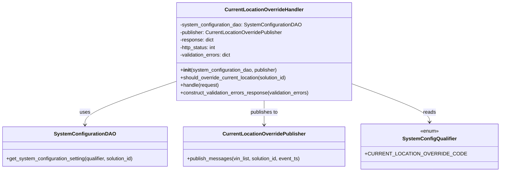

# Diagram: entity_core/entity_service/entity_service/entity/admin_tool/current_location_override/handler.py


> Auto-generated by Obscura crawlers

## Diagram 1



### SVG

<svg id="container" width="1538.390625" xmlns="http://www.w3.org/2000/svg" class="classDiagram" height="546" viewBox="0 0 1538.390625 546" role="graphics-document document" aria-roledescription="class"><style>#container{font-family:"trebuchet ms",verdana,arial,sans-serif;font-size:16px;fill:#333;}@keyframes edge-animation-frame{from{stroke-dashoffset:0;}}@keyframes dash{to{stroke-dashoffset:0;}}#container .edge-animation-slow{stroke-dasharray:9,5!important;stroke-dashoffset:900;animation:dash 50s linear infinite;stroke-linecap:round;}#container .edge-animation-fast{stroke-dasharray:9,5!important;stroke-dashoffset:900;animation:dash 20s linear infinite;stroke-linecap:round;}#container .error-icon{fill:#552222;}#container .error-text{fill:#552222;stroke:#552222;}#container .edge-thickness-normal{stroke-width:1px;}#container .edge-thickness-thick{stroke-width:3.5px;}#container .edge-pattern-solid{stroke-dasharray:0;}#container .edge-thickness-invisible{stroke-width:0;fill:none;}#container .edge-pattern-dashed{stroke-dasharray:3;}#container .edge-pattern-dotted{stroke-dasharray:2;}#container .marker{fill:#333333;stroke:#333333;}#container .marker.cross{stroke:#333333;}#container svg{font-family:"trebuchet ms",verdana,arial,sans-serif;font-size:16px;}#container p{margin:0;}#container g.classGroup text{fill:#9370DB;stroke:none;font-family:"trebuchet ms",verdana,arial,sans-serif;font-size:10px;}#container g.classGroup text .title{font-weight:bolder;}#container .nodeLabel,#container .edgeLabel{color:#131300;}#container .edgeLabel .label rect{fill:#ECECFF;}#container .label text{fill:#131300;}#container .labelBkg{background:#ECECFF;}#container .edgeLabel .label span{background:#ECECFF;}#container .classTitle{font-weight:bolder;}#container .node rect,#container .node circle,#container .node ellipse,#container .node polygon,#container .node path{fill:#ECECFF;stroke:#9370DB;stroke-width:1px;}#container .divider{stroke:#9370DB;stroke-width:1;}#container g.clickable{cursor:pointer;}#container g.classGroup rect{fill:#ECECFF;stroke:#9370DB;}#container g.classGroup line{stroke:#9370DB;stroke-width:1;}#container .classLabel .box{stroke:none;stroke-width:0;fill:#ECECFF;opacity:0.5;}#container .classLabel .label{fill:#9370DB;font-size:10px;}#container .relation{stroke:#333333;stroke-width:1;fill:none;}#container .dashed-line{stroke-dasharray:3;}#container .dotted-line{stroke-dasharray:1 2;}#container #compositionStart,#container .composition{fill:#333333!important;stroke:#333333!important;stroke-width:1;}#container #compositionEnd,#container .composition{fill:#333333!important;stroke:#333333!important;stroke-width:1;}#container #dependencyStart,#container .dependency{fill:#333333!important;stroke:#333333!important;stroke-width:1;}#container #dependencyStart,#container .dependency{fill:#333333!important;stroke:#333333!important;stroke-width:1;}#container #extensionStart,#container .extension{fill:transparent!important;stroke:#333333!important;stroke-width:1;}#container #extensionEnd,#container .extension{fill:transparent!important;stroke:#333333!important;stroke-width:1;}#container #aggregationStart,#container .aggregation{fill:transparent!important;stroke:#333333!important;stroke-width:1;}#container #aggregationEnd,#container .aggregation{fill:transparent!important;stroke:#333333!important;stroke-width:1;}#container #lollipopStart,#container .lollipop{fill:#ECECFF!important;stroke:#333333!important;stroke-width:1;}#container #lollipopEnd,#container .lollipop{fill:#ECECFF!important;stroke:#333333!important;stroke-width:1;}#container .edgeTerminals{font-size:11px;line-height:initial;}#container .classTitleText{text-anchor:middle;font-size:18px;fill:#333;}#container .label-icon{display:inline-block;height:1em;overflow:visible;vertical-align:-0.125em;}#container .node .label-icon path{fill:currentColor;stroke:revert;stroke-width:revert;}#container :root{--mermaid-font-family:"trebuchet ms",verdana,arial,sans-serif;}</style><g><defs><marker id="container_class-aggregationStart" class="marker aggregation class" refX="18" refY="7" markerWidth="190" markerHeight="240" orient="auto"><path d="M 18,7 L9,13 L1,7 L9,1 Z"></path></marker></defs><defs><marker id="container_class-aggregationEnd" class="marker aggregation class" refX="1" refY="7" markerWidth="20" markerHeight="28" orient="auto"><path d="M 18,7 L9,13 L1,7 L9,1 Z"></path></marker></defs><defs><marker id="container_class-extensionStart" class="marker extension class" refX="18" refY="7" markerWidth="190" markerHeight="240" orient="auto"><path d="M 1,7 L18,13 V 1 Z"></path></marker></defs><defs><marker id="container_class-extensionEnd" class="marker extension class" refX="1" refY="7" markerWidth="20" markerHeight="28" orient="auto"><path d="M 1,1 V 13 L18,7 Z"></path></marker></defs><defs><marker id="container_class-compositionStart" class="marker composition class" refX="18" refY="7" markerWidth="190" markerHeight="240" orient="auto"><path d="M 18,7 L9,13 L1,7 L9,1 Z"></path></marker></defs><defs><marker id="container_class-compositionEnd" class="marker composition class" refX="1" refY="7" markerWidth="20" markerHeight="28" orient="auto"><path d="M 18,7 L9,13 L1,7 L9,1 Z"></path></marker></defs><defs><marker id="container_class-dependencyStart" class="marker dependency class" refX="6" refY="7" markerWidth="190" markerHeight="240" orient="auto"><path d="M 5,7 L9,13 L1,7 L9,1 Z"></path></marker></defs><defs><marker id="container_class-dependencyEnd" class="marker dependency class" refX="13" refY="7" markerWidth="20" markerHeight="28" orient="auto"><path d="M 18,7 L9,13 L14,7 L9,1 Z"></path></marker></defs><defs><marker id="container_class-lollipopStart" class="marker lollipop class" refX="13" refY="7" markerWidth="190" markerHeight="240" orient="auto"><circle stroke="black" fill="transparent" cx="7" cy="7" r="6"></circle></marker></defs><defs><marker id="container_class-lollipopEnd" class="marker lollipop class" refX="1" refY="7" markerWidth="190" markerHeight="240" orient="auto"><circle stroke="black" fill="transparent" cx="7" cy="7" r="6"></circle></marker></defs><g class="root"><g class="clusters"></g><g class="edgePaths"><path d="M561.023,258.909L512.763,275.257C464.503,291.606,367.982,324.303,319.721,347.318C271.461,370.333,271.461,383.667,271.461,390.333L271.461,397" id="id_CurrentLocationOverrideHandler_SystemConfigurationDAO_1" class="edge-thickness-normal edge-pattern-solid relation" style=";;;" data-edge="true" data-et="edge" data-id="id_CurrentLocationOverrideHandler_SystemConfigurationDAO_1" data-points="W3sieCI6NTYxLjAyMzQzNzUsInkiOjI1OC45MDg3Njk5MDkwMTY3N30seyJ4IjoyNzEuNDYwOTM3NSwieSI6MzU3fSx7IngiOjI3MS40NjA5Mzc1LCJ5Ijo0MDN9XQ==" marker-end="url(#container_class-dependencyEnd)"></path><path d="M841.191,320L841.191,326.167C841.191,332.333,841.191,344.667,841.191,357.5C841.191,370.333,841.191,383.667,841.191,390.333L841.191,397" id="id_CurrentLocationOverrideHandler_CurrentLocationOverridePublisher_2" class="edge-thickness-normal edge-pattern-solid relation" style=";;;" data-edge="true" data-et="edge" data-id="id_CurrentLocationOverrideHandler_CurrentLocationOverridePublisher_2" data-points="W3sieCI6ODQxLjE5MTQwNjI1LCJ5IjozMjB9LHsieCI6ODQxLjE5MTQwNjI1LCJ5IjozNTd9LHsieCI6ODQxLjE5MTQwNjI1LCJ5Ijo0MDN9XQ==" marker-end="url(#container_class-dependencyEnd)"></path><path d="M1121.359,272.637L1157.62,286.698C1193.882,300.758,1266.404,328.879,1302.665,348.106C1338.926,367.333,1338.926,377.667,1338.926,382.833L1338.926,388" id="id_CurrentLocationOverrideHandler_SystemConfigQualifier_3" class="edge-thickness-normal edge-pattern-solid relation" style=";;;" data-edge="true" data-et="edge" data-id="id_CurrentLocationOverrideHandler_SystemConfigQualifier_3" data-points="W3sieCI6MTEyMS4zNTkzNzUsInkiOjI3Mi42MzcwOTc3ODY4NDY2NX0seyJ4IjoxMzM4LjkyNTc4MTI1LCJ5IjozNTd9LHsieCI6MTMzOC45MjU3ODEyNSwieSI6Mzk0fV0=" marker-end="url(#container_class-dependencyEnd)"></path></g><g class="edgeLabels"><g class="edgeLabel" transform="translate(271.4609375, 357)"><g class="label" data-id="id_CurrentLocationOverrideHandler_SystemConfigurationDAO_1" transform="translate(-16.4921875, -12)"><foreignObject width="32.984375" height="24"><div xmlns="http://www.w3.org/1999/xhtml" class="labelBkg" style="display: table-cell; white-space: nowrap; line-height: 1.5; max-width: 200px; text-align: center;"><span class="edgeLabel"><p>uses</p></span></div></foreignObject></g></g><g class="edgeLabel" transform="translate(841.19140625, 357)"><g class="label" data-id="id_CurrentLocationOverrideHandler_CurrentLocationOverridePublisher_2" transform="translate(-44.84375, -12)"><foreignObject width="89.6875" height="24"><div xmlns="http://www.w3.org/1999/xhtml" class="labelBkg" style="display: table-cell; white-space: nowrap; line-height: 1.5; max-width: 200px; text-align: center;"><span class="edgeLabel"><p>publishes to</p></span></div></foreignObject></g></g><g class="edgeLabel" transform="translate(1338.92578125, 357)"><g class="label" data-id="id_CurrentLocationOverrideHandler_SystemConfigQualifier_3" transform="translate(-20.0078125, -12)"><foreignObject width="40.015625" height="24"><div xmlns="http://www.w3.org/1999/xhtml" class="labelBkg" style="display: table-cell; white-space: nowrap; line-height: 1.5; max-width: 200px; text-align: center;"><span class="edgeLabel"><p>reads</p></span></div></foreignObject></g></g></g><g class="nodes"><g class="node default" id="classId-CurrentLocationOverrideHandler-0" transform="translate(841.19140625, 164)"><g class="basic label-container"><path d="M-280.16796875 -156 L280.16796875 -156 L280.16796875 156 L-280.16796875 156" stroke="none" stroke-width="0" fill="#ECECFF" style=""></path><path d="M-280.16796875 -156 C-67.46838767965238 -156, 145.23119339069524 -156, 280.16796875 -156 M-280.16796875 -156 C-131.27901750599375 -156, 17.6099337380125 -156, 280.16796875 -156 M280.16796875 -156 C280.16796875 -45.87812868999059, 280.16796875 64.24374262001882, 280.16796875 156 M280.16796875 -156 C280.16796875 -33.349060537512514, 280.16796875 89.30187892497497, 280.16796875 156 M280.16796875 156 C125.65848720022268 156, -28.85099434955464 156, -280.16796875 156 M280.16796875 156 C75.47998226082063 156, -129.20800422835873 156, -280.16796875 156 M-280.16796875 156 C-280.16796875 56.826677168718376, -280.16796875 -42.34664566256325, -280.16796875 -156 M-280.16796875 156 C-280.16796875 31.443498222379972, -280.16796875 -93.11300355524006, -280.16796875 -156" stroke="#9370DB" stroke-width="1.3" fill="none" stroke-dasharray="0 0" style=""></path></g><g class="annotation-group text" transform="translate(0, -132)"></g><g class="label-group text" transform="translate(-119.6484375, -132)"><g class="label" style="font-weight: bolder" transform="translate(0,-12)"><foreignObject width="239.296875" height="24"><div xmlns="http://www.w3.org/1999/xhtml" style="display: table-cell; white-space: nowrap; line-height: 1.5; max-width: 287px; text-align: center;"><span class="nodeLabel markdown-node-label" style=""><p>CurrentLocationOverrideHandler</p></span></div></foreignObject></g></g><g class="members-group text" transform="translate(-268.16796875, -84)"><g class="label" style="" transform="translate(0,-12)"><foreignObject width="383.9375" height="24"><div xmlns="http://www.w3.org/1999/xhtml" style="display: table-cell; white-space: nowrap; line-height: 1.5; max-width: 441px; text-align: center;"><span class="nodeLabel markdown-node-label" style=""><p>-system_configuration_dao: SystemConfigurationDAO</p></span></div></foreignObject></g><g class="label" style="" transform="translate(0,12)"><foreignObject width="331.1875" height="24"><div xmlns="http://www.w3.org/1999/xhtml" style="display: table-cell; white-space: nowrap; line-height: 1.5; max-width: 389px; text-align: center;"><span class="nodeLabel markdown-node-label" style=""><p>-publisher: CurrentLocationOverridePublisher</p></span></div></foreignObject></g><g class="label" style="" transform="translate(0,36)"><foreignObject width="108.34375" height="24"><div xmlns="http://www.w3.org/1999/xhtml" style="display: table-cell; white-space: nowrap; line-height: 1.5; max-width: 166px; text-align: center;"><span class="nodeLabel markdown-node-label" style=""><p>-response: dict</p></span></div></foreignObject></g><g class="label" style="" transform="translate(0,60)"><foreignObject width="117.03125" height="24"><div xmlns="http://www.w3.org/1999/xhtml" style="display: table-cell; white-space: nowrap; line-height: 1.5; max-width: 175px; text-align: center;"><span class="nodeLabel markdown-node-label" style=""><p>-http_status: int</p></span></div></foreignObject></g><g class="label" style="" transform="translate(0,84)"><foreignObject width="165.859375" height="24"><div xmlns="http://www.w3.org/1999/xhtml" style="display: table-cell; white-space: nowrap; line-height: 1.5; max-width: 223px; text-align: center;"><span class="nodeLabel markdown-node-label" style=""><p>-validation_errors: dict</p></span></div></foreignObject></g></g><g class="methods-group text" transform="translate(-268.16796875, 60)"><g class="label" style="" transform="translate(0,-12)"><foreignObject width="310.046875" height="24"><div xmlns="http://www.w3.org/1999/xhtml" style="display: table-cell; white-space: nowrap; line-height: 1.5; max-width: 399px; text-align: center;"><span class="nodeLabel markdown-node-label" style=""><p>+<strong>init</strong>(system_configuration_dao, publisher)</p></span></div></foreignObject></g><g class="label" style="" transform="translate(0,12)"><foreignObject width="346.765625" height="24"><div xmlns="http://www.w3.org/1999/xhtml" style="display: table-cell; white-space: nowrap; line-height: 1.5; max-width: 404px; text-align: center;"><span class="nodeLabel markdown-node-label" style=""><p>+should_override_current_location(solution_id)</p></span></div></foreignObject></g><g class="label" style="" transform="translate(0,36)"><foreignObject width="123.96875" height="24"><div xmlns="http://www.w3.org/1999/xhtml" style="display: table-cell; white-space: nowrap; line-height: 1.5; max-width: 181px; text-align: center;"><span class="nodeLabel markdown-node-label" style=""><p>+handle(request)</p></span></div></foreignObject></g><g class="label" style="" transform="translate(0,60)"><foreignObject width="416.6875" height="24"><div xmlns="http://www.w3.org/1999/xhtml" style="display: table-cell; white-space: nowrap; line-height: 1.5; max-width: 474px; text-align: center;"><span class="nodeLabel markdown-node-label" style=""><p>+construct_validation_errors_response(validation_errors)</p></span></div></foreignObject></g></g><g class="divider" style=""><path d="M-280.16796875 -108 C-113.15303498275617 -108, 53.861898784487664 -108, 280.16796875 -108 M-280.16796875 -108 C-124.16539563361081 -108, 31.837177482778372 -108, 280.16796875 -108" stroke="#9370DB" stroke-width="1.3" fill="none" stroke-dasharray="0 0" style=""></path></g><g class="divider" style=""><path d="M-280.16796875 36 C-91.56058480860901 36, 97.04679913278198 36, 280.16796875 36 M-280.16796875 36 C-93.64459390606382 36, 92.87878093787236 36, 280.16796875 36" stroke="#9370DB" stroke-width="1.3" fill="none" stroke-dasharray="0 0" style=""></path></g></g><g class="node default" id="classId-SystemConfigurationDAO-1" transform="translate(271.4609375, 466)"><g class="basic label-container"><path d="M-263.4609375 -63 L263.4609375 -63 L263.4609375 63 L-263.4609375 63" stroke="none" stroke-width="0" fill="#ECECFF" style=""></path><path d="M-263.4609375 -63 C-147.7906937337154 -63, -32.12044996743077 -63, 263.4609375 -63 M-263.4609375 -63 C-137.59566158812794 -63, -11.730385676255878 -63, 263.4609375 -63 M263.4609375 -63 C263.4609375 -28.139363634968262, 263.4609375 6.721272730063475, 263.4609375 63 M263.4609375 -63 C263.4609375 -16.14816862148379, 263.4609375 30.70366275703242, 263.4609375 63 M263.4609375 63 C72.33255228581226 63, -118.79583292837549 63, -263.4609375 63 M263.4609375 63 C154.65470938432387 63, 45.84848126864773 63, -263.4609375 63 M-263.4609375 63 C-263.4609375 29.90491589649576, -263.4609375 -3.190168207008483, -263.4609375 -63 M-263.4609375 63 C-263.4609375 32.49523486961049, -263.4609375 1.990469739220984, -263.4609375 -63" stroke="#9370DB" stroke-width="1.3" fill="none" stroke-dasharray="0 0" style=""></path></g><g class="annotation-group text" transform="translate(0, -39)"></g><g class="label-group text" transform="translate(-91.21875, -39)"><g class="label" style="font-weight: bolder" transform="translate(0,-12)"><foreignObject width="182.4375" height="24"><div xmlns="http://www.w3.org/1999/xhtml" style="display: table-cell; white-space: nowrap; line-height: 1.5; max-width: 229px; text-align: center;"><span class="nodeLabel markdown-node-label" style=""><p>SystemConfigurationDAO</p></span></div></foreignObject></g></g><g class="members-group text" transform="translate(-251.4609375, 9)"></g><g class="methods-group text" transform="translate(-251.4609375, 39)"><g class="label" style="" transform="translate(0,-12)"><foreignObject width="411.703125" height="24"><div xmlns="http://www.w3.org/1999/xhtml" style="display: table-cell; white-space: nowrap; line-height: 1.5; max-width: 469px; text-align: center;"><span class="nodeLabel markdown-node-label" style=""><p>+get_system_configuration_setting(qualifier, solution_id)</p></span></div></foreignObject></g></g><g class="divider" style=""><path d="M-263.4609375 -15 C-70.6184203656631 -15, 122.2240967686738 -15, 263.4609375 -15 M-263.4609375 -15 C-134.90665023244313 -15, -6.352362964886254 -15, 263.4609375 -15" stroke="#9370DB" stroke-width="1.3" fill="none" stroke-dasharray="0 0" style=""></path></g><g class="divider" style=""><path d="M-263.4609375 9 C-62.89889336041918 9, 137.66315077916164 9, 263.4609375 9 M-263.4609375 9 C-60.2103479026722 9, 143.0402416946556 9, 263.4609375 9" stroke="#9370DB" stroke-width="1.3" fill="none" stroke-dasharray="0 0" style=""></path></g></g><g class="node default" id="classId-CurrentLocationOverridePublisher-2" transform="translate(841.19140625, 466)"><g class="basic label-container"><path d="M-256.26953125 -63 L256.26953125 -63 L256.26953125 63 L-256.26953125 63" stroke="none" stroke-width="0" fill="#ECECFF" style=""></path><path d="M-256.26953125 -63 C-140.742233302596 -63, -25.21493535519201 -63, 256.26953125 -63 M-256.26953125 -63 C-142.69206199479027 -63, -29.11459273958053 -63, 256.26953125 -63 M256.26953125 -63 C256.26953125 -12.649640038208133, 256.26953125 37.70071992358373, 256.26953125 63 M256.26953125 -63 C256.26953125 -12.990677923356763, 256.26953125 37.01864415328647, 256.26953125 63 M256.26953125 63 C76.13300662715619 63, -104.00351799568762 63, -256.26953125 63 M256.26953125 63 C55.342090786863366 63, -145.58534967627327 63, -256.26953125 63 M-256.26953125 63 C-256.26953125 17.23478563542603, -256.26953125 -28.530428729147943, -256.26953125 -63 M-256.26953125 63 C-256.26953125 22.761921461936574, -256.26953125 -17.476157076126853, -256.26953125 -63" stroke="#9370DB" stroke-width="1.3" fill="none" stroke-dasharray="0 0" style=""></path></g><g class="annotation-group text" transform="translate(0, -39)"></g><g class="label-group text" transform="translate(-125.2421875, -39)"><g class="label" style="font-weight: bolder" transform="translate(0,-12)"><foreignObject width="250.484375" height="24"><div xmlns="http://www.w3.org/1999/xhtml" style="display: table-cell; white-space: nowrap; line-height: 1.5; max-width: 298px; text-align: center;"><span class="nodeLabel markdown-node-label" style=""><p>CurrentLocationOverridePublisher</p></span></div></foreignObject></g></g><g class="members-group text" transform="translate(-244.26953125, 9)"></g><g class="methods-group text" transform="translate(-244.26953125, 39)"><g class="label" style="" transform="translate(0,-12)"><foreignObject width="363.296875" height="24"><div xmlns="http://www.w3.org/1999/xhtml" style="display: table-cell; white-space: nowrap; line-height: 1.5; max-width: 421px; text-align: center;"><span class="nodeLabel markdown-node-label" style=""><p>+publish_messages(vin_list, solution_id, event_ts)</p></span></div></foreignObject></g></g><g class="divider" style=""><path d="M-256.26953125 -15 C-70.85970218407166 -15, 114.55012688185667 -15, 256.26953125 -15 M-256.26953125 -15 C-112.17616944019673 -15, 31.91719236960654 -15, 256.26953125 -15" stroke="#9370DB" stroke-width="1.3" fill="none" stroke-dasharray="0 0" style=""></path></g><g class="divider" style=""><path d="M-256.26953125 9 C-62.78874413408374 9, 130.69204298183251 9, 256.26953125 9 M-256.26953125 9 C-65.59964486310182 9, 125.07024152379637 9, 256.26953125 9" stroke="#9370DB" stroke-width="1.3" fill="none" stroke-dasharray="0 0" style=""></path></g></g><g class="node default" id="classId-SystemConfigQualifier-3" transform="translate(1338.92578125, 466)"><g class="basic label-container"><path d="M-191.46484375 -72 L191.46484375 -72 L191.46484375 72 L-191.46484375 72" stroke="none" stroke-width="0" fill="#ECECFF" style=""></path><path d="M-191.46484375 -72 C-38.36150924121938 -72, 114.74182526756124 -72, 191.46484375 -72 M-191.46484375 -72 C-41.216073418375004 -72, 109.03269691324999 -72, 191.46484375 -72 M191.46484375 -72 C191.46484375 -19.274078020646243, 191.46484375 33.451843958707514, 191.46484375 72 M191.46484375 -72 C191.46484375 -33.52856992425119, 191.46484375 4.9428601514976265, 191.46484375 72 M191.46484375 72 C112.53728897459908 72, 33.60973419919816 72, -191.46484375 72 M191.46484375 72 C72.09164852194705 72, -47.2815467061059 72, -191.46484375 72 M-191.46484375 72 C-191.46484375 25.39386037826985, -191.46484375 -21.2122792434603, -191.46484375 -72 M-191.46484375 72 C-191.46484375 16.63978808534695, -191.46484375 -38.7204238293061, -191.46484375 -72" stroke="#9370DB" stroke-width="1.3" fill="none" stroke-dasharray="0 0" style=""></path></g><g class="annotation-group text" transform="translate(-29.53125, -48)"><g class="label" style="" transform="translate(0,-12)"><foreignObject width="59.0625" height="24"><div xmlns="http://www.w3.org/1999/xhtml" style="display: table-cell; white-space: nowrap; line-height: 1.5; max-width: 109px; text-align: center;"><span class="nodeLabel markdown-node-label" style=""><p>«enum»</p></span></div></foreignObject></g></g><g class="label-group text" transform="translate(-80.9296875, -24)"><g class="label" style="font-weight: bolder" transform="translate(0,-12)"><foreignObject width="161.859375" height="24"><div xmlns="http://www.w3.org/1999/xhtml" style="display: table-cell; white-space: nowrap; line-height: 1.5; max-width: 210px; text-align: center;"><span class="nodeLabel markdown-node-label" style=""><p>SystemConfigQualifier</p></span></div></foreignObject></g></g><g class="members-group text" transform="translate(-179.46484375, 24)"><g class="label" style="" transform="translate(0,-12)"><foreignObject width="278" height="24"><div xmlns="http://www.w3.org/1999/xhtml" style="display: table-cell; white-space: nowrap; line-height: 1.5; max-width: 335px; text-align: center;"><span class="nodeLabel markdown-node-label" style=""><p>+CURRENT_LOCATION_OVERRIDE_CODE</p></span></div></foreignObject></g></g><g class="methods-group text" transform="translate(-179.46484375, 72)"></g><g class="divider" style=""><path d="M-191.46484375 0 C-88.69606348102883 0, 14.07271678794234 0, 191.46484375 0 M-191.46484375 0 C-70.19649177801656 0, 51.07186019396687 0, 191.46484375 0" stroke="#9370DB" stroke-width="1.3" fill="none" stroke-dasharray="0 0" style=""></path></g><g class="divider" style=""><path d="M-191.46484375 48 C-72.46267325041575 48, 46.539497249168505 48, 191.46484375 48 M-191.46484375 48 C-70.95578593307846 48, 49.55327188384308 48, 191.46484375 48" stroke="#9370DB" stroke-width="1.3" fill="none" stroke-dasharray="0 0" style=""></path></g></g></g></g></g></svg>

## Diagram 2

```mermaid
flowchart TD
    Req[Incoming request]
    Req --> ValidVIN{request.valid_vin_list?}
    ValidVIN -- Yes --> CheckOverride{should_override_current_location(solution_id)}
    CheckOverride -- True --> Publish[publisher.publish_messages(valid_vin_list, solution_id, event_ts)]
    CheckOverride -- False --> NoPublish[skip publish]
    ValidVIN -- No --> NoPublish
    Publish --> CheckErrors
    NoPublish --> CheckErrors
    Req --> CheckErrors{request.validation_errors?}
    CheckErrors -- Yes --> Construct[construct_validation_errors_response(validation_errors)]
    Construct --> SetResp[set response and http_status]
    CheckErrors -- No --> Return[return response, http_status]
    SetResp --> Return
```

> SVG rendering failed for this diagram.
