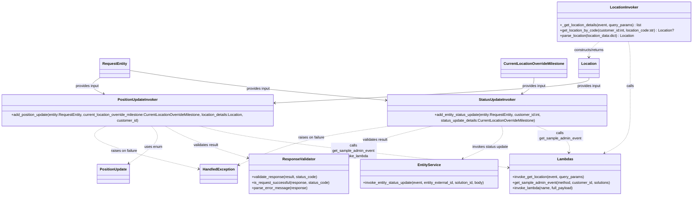

# Diagram: entity_core/entity_service/entity_service/entity/admin_tool/current_location_override/invokers.py


> Auto-generated by Obscura crawlers

## Diagram 1



### SVG

<svg id="container" width="3072.498046875" xmlns="http://www.w3.org/2000/svg" class="classDiagram" height="844" viewBox="0 0 3072.498046875 844" role="graphics-document document" aria-roledescription="class"><style>#container{font-family:"trebuchet ms",verdana,arial,sans-serif;font-size:16px;fill:#333;}@keyframes edge-animation-frame{from{stroke-dashoffset:0;}}@keyframes dash{to{stroke-dashoffset:0;}}#container .edge-animation-slow{stroke-dasharray:9,5!important;stroke-dashoffset:900;animation:dash 50s linear infinite;stroke-linecap:round;}#container .edge-animation-fast{stroke-dasharray:9,5!important;stroke-dashoffset:900;animation:dash 20s linear infinite;stroke-linecap:round;}#container .error-icon{fill:#552222;}#container .error-text{fill:#552222;stroke:#552222;}#container .edge-thickness-normal{stroke-width:1px;}#container .edge-thickness-thick{stroke-width:3.5px;}#container .edge-pattern-solid{stroke-dasharray:0;}#container .edge-thickness-invisible{stroke-width:0;fill:none;}#container .edge-pattern-dashed{stroke-dasharray:3;}#container .edge-pattern-dotted{stroke-dasharray:2;}#container .marker{fill:#333333;stroke:#333333;}#container .marker.cross{stroke:#333333;}#container svg{font-family:"trebuchet ms",verdana,arial,sans-serif;font-size:16px;}#container p{margin:0;}#container g.classGroup text{fill:#9370DB;stroke:none;font-family:"trebuchet ms",verdana,arial,sans-serif;font-size:10px;}#container g.classGroup text .title{font-weight:bolder;}#container .nodeLabel,#container .edgeLabel{color:#131300;}#container .edgeLabel .label rect{fill:#ECECFF;}#container .label text{fill:#131300;}#container .labelBkg{background:#ECECFF;}#container .edgeLabel .label span{background:#ECECFF;}#container .classTitle{font-weight:bolder;}#container .node rect,#container .node circle,#container .node ellipse,#container .node polygon,#container .node path{fill:#ECECFF;stroke:#9370DB;stroke-width:1px;}#container .divider{stroke:#9370DB;stroke-width:1;}#container g.clickable{cursor:pointer;}#container g.classGroup rect{fill:#ECECFF;stroke:#9370DB;}#container g.classGroup line{stroke:#9370DB;stroke-width:1;}#container .classLabel .box{stroke:none;stroke-width:0;fill:#ECECFF;opacity:0.5;}#container .classLabel .label{fill:#9370DB;font-size:10px;}#container .relation{stroke:#333333;stroke-width:1;fill:none;}#container .dashed-line{stroke-dasharray:3;}#container .dotted-line{stroke-dasharray:1 2;}#container #compositionStart,#container .composition{fill:#333333!important;stroke:#333333!important;stroke-width:1;}#container #compositionEnd,#container .composition{fill:#333333!important;stroke:#333333!important;stroke-width:1;}#container #dependencyStart,#container .dependency{fill:#333333!important;stroke:#333333!important;stroke-width:1;}#container #dependencyStart,#container .dependency{fill:#333333!important;stroke:#333333!important;stroke-width:1;}#container #extensionStart,#container .extension{fill:transparent!important;stroke:#333333!important;stroke-width:1;}#container #extensionEnd,#container .extension{fill:transparent!important;stroke:#333333!important;stroke-width:1;}#container #aggregationStart,#container .aggregation{fill:transparent!important;stroke:#333333!important;stroke-width:1;}#container #aggregationEnd,#container .aggregation{fill:transparent!important;stroke:#333333!important;stroke-width:1;}#container #lollipopStart,#container .lollipop{fill:#ECECFF!important;stroke:#333333!important;stroke-width:1;}#container #lollipopEnd,#container .lollipop{fill:#ECECFF!important;stroke:#333333!important;stroke-width:1;}#container .edgeTerminals{font-size:11px;line-height:initial;}#container .classTitleText{text-anchor:middle;font-size:18px;fill:#333;}#container .label-icon{display:inline-block;height:1em;overflow:visible;vertical-align:-0.125em;}#container .node .label-icon path{fill:currentColor;stroke:revert;stroke-width:revert;}#container :root{--mermaid-font-family:"trebuchet ms",verdana,arial,sans-serif;}</style><g><defs><marker id="container_class-aggregationStart" class="marker aggregation class" refX="18" refY="7" markerWidth="190" markerHeight="240" orient="auto"><path d="M 18,7 L9,13 L1,7 L9,1 Z"></path></marker></defs><defs><marker id="container_class-aggregationEnd" class="marker aggregation class" refX="1" refY="7" markerWidth="20" markerHeight="28" orient="auto"><path d="M 18,7 L9,13 L1,7 L9,1 Z"></path></marker></defs><defs><marker id="container_class-extensionStart" class="marker extension class" refX="18" refY="7" markerWidth="190" markerHeight="240" orient="auto"><path d="M 1,7 L18,13 V 1 Z"></path></marker></defs><defs><marker id="container_class-extensionEnd" class="marker extension class" refX="1" refY="7" markerWidth="20" markerHeight="28" orient="auto"><path d="M 1,1 V 13 L18,7 Z"></path></marker></defs><defs><marker id="container_class-compositionStart" class="marker composition class" refX="18" refY="7" markerWidth="190" markerHeight="240" orient="auto"><path d="M 18,7 L9,13 L1,7 L9,1 Z"></path></marker></defs><defs><marker id="container_class-compositionEnd" class="marker composition class" refX="1" refY="7" markerWidth="20" markerHeight="28" orient="auto"><path d="M 18,7 L9,13 L1,7 L9,1 Z"></path></marker></defs><defs><marker id="container_class-dependencyStart" class="marker dependency class" refX="6" refY="7" markerWidth="190" markerHeight="240" orient="auto"><path d="M 5,7 L9,13 L1,7 L9,1 Z"></path></marker></defs><defs><marker id="container_class-dependencyEnd" class="marker dependency class" refX="13" refY="7" markerWidth="20" markerHeight="28" orient="auto"><path d="M 18,7 L9,13 L14,7 L9,1 Z"></path></marker></defs><defs><marker id="container_class-lollipopStart" class="marker lollipop class" refX="13" refY="7" markerWidth="190" markerHeight="240" orient="auto"><circle stroke="black" fill="transparent" cx="7" cy="7" r="6"></circle></marker></defs><defs><marker id="container_class-lollipopEnd" class="marker lollipop class" refX="1" refY="7" markerWidth="190" markerHeight="240" orient="auto"><circle stroke="black" fill="transparent" cx="7" cy="7" r="6"></circle></marker></defs><g class="root"><g class="clusters"></g><g class="edgePaths"><path d="M2799.174,182L2801.158,188.167C2803.141,194.333,2807.108,206.667,2809.091,226C2811.074,245.333,2811.074,271.667,2811.074,298C2811.074,324.333,2811.074,350.667,2811.074,380.5C2811.074,410.333,2811.074,443.667,2811.074,481C2811.074,518.333,2811.074,559.667,2790.914,590.065C2770.754,620.464,2730.434,639.928,2710.274,649.66L2690.114,659.392" id="id_LocationInvoker_Lambdas_1" class="edge-thickness-normal edge-pattern-dashed relation" style=";;;" data-edge="true" data-et="edge" data-id="id_LocationInvoker_Lambdas_1" data-points="W3sieCI6Mjc5OS4xNzQyODQ5MDQyMzQsInkiOjE4Mn0seyJ4IjoyODExLjA3NDIxODc1LCJ5IjoyMTl9LHsieCI6MjgxMS4wNzQyMTg3NSwieSI6Mjk4fSx7IngiOjI4MTEuMDc0MjE4NzUsInkiOjM3N30seyJ4IjoyODExLjA3NDIxODc1LCJ5Ijo0Nzd9LHsieCI6MjgxMS4wNzQyMTg3NSwieSI6NjAxfSx7IngiOjI2ODQuNzExMDk1ODYxNDg2NywieSI6NjYyfV0=" marker-end="url(#container_class-dependencyEnd)"></path><path d="M2662.076,182L2654.342,188.167C2646.607,194.333,2631.139,206.667,2623.404,218C2615.67,229.333,2615.67,239.667,2615.67,244.833L2615.67,250" id="id_LocationInvoker_Location_2" class="edge-thickness-normal edge-pattern-dashed relation" style=";;;" data-edge="true" data-et="edge" data-id="id_LocationInvoker_Location_2" data-points="W3sieCI6MjY2Mi4wNzYxMDg4NzA5NjgsInkiOjE4Mn0seyJ4IjoyNjE1LjY2OTkyMTg3NSwieSI6MjE5fSx7IngiOjI2MTUuNjY5OTIxODc1LCJ5IjoyNTZ9XQ==" marker-end="url(#container_class-dependencyEnd)"></path><path d="M2379.821,540L2408.225,550.167C2436.629,560.333,2493.438,580.667,2518.994,600.045C2544.55,619.423,2538.855,637.845,2536.007,647.056L2533.159,656.268" id="id_StatusUpdateInvoker_Lambdas_3" class="edge-thickness-normal edge-pattern-dashed relation" style=";;;" data-edge="true" data-et="edge" data-id="id_StatusUpdateInvoker_Lambdas_3" data-points="W3sieCI6MjM3OS44MjExOTQ1NTY0NTE3LCJ5Ijo1NDB9LHsieCI6MjU1MC4yNDYwOTM3NSwieSI6NjAxfSx7IngiOjI1MzEuMzg2NDU0ODE0MTg5LCJ5Ijo2NjJ9XQ==" marker-end="url(#container_class-dependencyEnd)"></path><path d="M2239.458,540L2245.211,550.167C2250.964,560.333,2262.471,580.667,2233.655,604.629C2204.838,628.592,2135.7,656.184,2101.131,669.98L2066.562,683.776" id="id_StatusUpdateInvoker_EntityService_4" class="edge-thickness-normal edge-pattern-dashed relation" style=";;;" data-edge="true" data-et="edge" data-id="id_StatusUpdateInvoker_EntityService_4" data-points="W3sieCI6MjIzOS40NTg0NDg4NDA3MjYsInkiOjU0MH0seyJ4IjoyMjczLjk3NjU2MjUsInkiOjYwMX0seyJ4IjoyMDYwLjk4OTczMjg5Njk1OTYsInkiOjY4Nn1d" marker-end="url(#container_class-dependencyEnd)"></path><path d="M1948.994,540L1907.874,550.167C1866.753,560.333,1784.511,580.667,1718.355,600.825C1652.199,620.983,1602.128,640.965,1577.092,650.956L1552.057,660.948" id="id_StatusUpdateInvoker_ResponseValidator_5" class="edge-thickness-normal edge-pattern-dashed relation" style=";;;" data-edge="true" data-et="edge" data-id="id_StatusUpdateInvoker_ResponseValidator_5" data-points="W3sieCI6MTk0OC45OTQzOTI2NDExMjksInkiOjU0MH0seyJ4IjoxNzAyLjI2OTUzMTI1LCJ5Ijo2MDF9LHsieCI6MTU0Ni40ODQzNzUsInkiOjY2My4xNzE2Mjk2MDcwMDI1fV0=" marker-end="url(#container_class-dependencyEnd)"></path><path d="M909.963,540L955.078,550.167C1000.193,560.333,1090.423,580.667,1314.397,610.829C1538.372,640.992,1896.091,680.983,2074.951,700.979L2253.811,720.975" id="id_PositionUpdateInvoker_Lambdas_6" class="edge-thickness-normal edge-pattern-dashed relation" style=";;;" data-edge="true" data-et="edge" data-id="id_PositionUpdateInvoker_Lambdas_6" data-points="W3sieCI6OTA5Ljk2MjkyMjEyNzAxNjEsInkiOjU0MH0seyJ4IjoxMTgwLjY1MjM0Mzc1LCJ5Ijo2MDF9LHsieCI6MjI1OS43NzM0Mzc1LCJ5Ijo3MjEuNjQxNzc4NDQ5MjI3Mn1d" marker-end="url(#container_class-dependencyEnd)"></path><path d="M750.45,540L769.823,550.167C789.196,560.333,827.943,580.667,887.975,603.782C948.007,626.897,1029.325,652.793,1069.983,665.742L1110.642,678.69" id="id_PositionUpdateInvoker_ResponseValidator_7" class="edge-thickness-normal edge-pattern-dashed relation" style=";;;" data-edge="true" data-et="edge" data-id="id_PositionUpdateInvoker_ResponseValidator_7" data-points="W3sieCI6NzUwLjQ0OTUxODAxOTE1MzIsInkiOjU0MH0seyJ4Ijo4NjYuNjg5NDUzMTI1LCJ5Ijo2MDF9LHsieCI6MTExNi4zNTkzNzUsInkiOjY4MC41MTA1ODg2NzAzOTU4fV0=" marker-end="url(#container_class-dependencyEnd)"></path><path d="M692.121,540L702.082,550.167C712.042,560.333,731.964,580.667,717.347,607.929C702.73,635.191,653.576,669.383,628.999,686.478L604.421,703.574" id="id_PositionUpdateInvoker_PositionUpdate_8" class="edge-thickness-normal edge-pattern-dashed relation" style=";;;" data-edge="true" data-et="edge" data-id="id_PositionUpdateInvoker_PositionUpdate_8" data-points="W3sieCI6NjkyLjEyMTMzMDAxNTEyMSwieSI6NTQwfSx7IngiOjc1MS44ODQ3NjU2MjUsInkiOjYwMX0seyJ4Ijo1OTkuNDk1Nzc3MDI3MDI3LCJ5Ijo3MDd9XQ==" marker-end="url(#container_class-dependencyEnd)"></path><path d="M1774.502,540L1705.222,550.167C1635.943,560.333,1497.383,580.667,1380.288,609.916C1263.193,639.165,1167.563,677.33,1119.747,696.412L1071.932,715.495" id="id_StatusUpdateInvoker_HandledException_9" class="edge-thickness-normal edge-pattern-dashed relation" style=";;;" data-edge="true" data-et="edge" data-id="id_StatusUpdateInvoker_HandledException_9" data-points="W3sieCI6MTc3NC41MDIwMTYxMjkwMzIyLCJ5Ijo1NDB9LHsieCI6MTM1OC44MjQyMTg3NSwieSI6NjAxfSx7IngiOjEwNjYuMzU5Mzc1LCJ5Ijo3MTcuNzE4NTM5NjYzMTQ1MX1d" marker-end="url(#container_class-dependencyEnd)"></path><path d="M508.569,540L488.909,550.167C469.249,560.333,429.928,580.667,495.795,612.023C561.662,643.379,732.716,685.758,818.243,706.948L903.77,728.138" id="id_PositionUpdateInvoker_HandledException_10" class="edge-thickness-normal edge-pattern-dashed relation" style=";;;" data-edge="true" data-et="edge" data-id="id_PositionUpdateInvoker_HandledException_10" data-points="W3sieCI6NTA4LjU2OTEzMTE3NDM5NTIsInkiOjU0MH0seyJ4IjozOTAuNjA3NDIxODc1LCJ5Ijo2MDF9LHsieCI6OTA5LjU5Mzc1LCJ5Ijo3MjkuNTgwNDIyNjIxMzI0Nn1d" marker-end="url(#container_class-dependencyEnd)"></path><path d="M606.246,307.56L682.824,319.134C759.402,330.707,912.557,353.853,1094.753,374.707C1276.949,395.56,1488.185,414.121,1593.803,423.401L1699.421,432.681" id="id_RequestEntity_StatusUpdateInvoker_11" class="edge-thickness-normal edge-pattern-solid relation" style=";;;" data-edge="true" data-et="edge" data-id="id_RequestEntity_StatusUpdateInvoker_11" data-points="W3sieCI6NjA2LjI0NjA5Mzc1LCJ5IjozMDcuNTYwMjI5NDE2OTI5NzZ9LHsieCI6MTA2NS43MTI4OTA2MjUsInkiOjM3N30seyJ4IjoxNzA1LjM5ODQzNzUsInkiOjQzMy4yMDY2NTY4ODQ3MDE1NH1d" marker-end="url(#container_class-dependencyEnd)"></path><path d="M479.73,337.864L469.38,344.387C459.03,350.91,438.329,363.955,440.195,376.219C442.06,388.483,466.492,399.965,478.708,405.707L490.923,411.448" id="id_RequestEntity_PositionUpdateInvoker_12" class="edge-thickness-normal edge-pattern-solid relation" style=";;;" data-edge="true" data-et="edge" data-id="id_RequestEntity_PositionUpdateInvoker_12" data-points="W3sieCI6NDc5LjczMDQ2ODc1LCJ5IjozMzcuODY0MzI3NTU4MjY5OTZ9LHsieCI6NDE3LjYyODkwNjI1LCJ5IjozNzd9LHsieCI6NDk2LjM1MzYzMjgxMjUsInkiOjQxNH1d" marker-end="url(#container_class-dependencyEnd)"></path><path d="M2383.943,340L2383.943,346.167C2383.943,352.333,2383.943,364.667,2373.709,376.515C2363.475,388.363,2343.007,399.725,2332.773,405.407L2322.539,411.088" id="id_CurrentLocationOverrideMilestone_StatusUpdateInvoker_13" class="edge-thickness-normal edge-pattern-solid relation" style=";;;" data-edge="true" data-et="edge" data-id="id_CurrentLocationOverrideMilestone_StatusUpdateInvoker_13" data-points="W3sieCI6MjM4My45NDMzNTkzNzUsInkiOjM0MH0seyJ4IjoyMzgzLjk0MzM1OTM3NSwieSI6Mzc3fSx7IngiOjIzMTcuMjkzNDk2MDkzNzUsInkiOjQxNH1d" marker-end="url(#container_class-dependencyEnd)"></path><path d="M2615.67,340L2615.67,346.167C2615.67,352.333,2615.67,364.667,2389.523,382.225C2163.376,399.782,1711.083,422.565,1484.936,433.956L1258.789,445.347" id="id_Location_PositionUpdateInvoker_14" class="edge-thickness-normal edge-pattern-solid relation" style=";;;" data-edge="true" data-et="edge" data-id="id_Location_PositionUpdateInvoker_14" data-points="W3sieCI6MjYxNS42Njk5MjE4NzUsInkiOjM0MH0seyJ4IjoyNjE1LjY2OTkyMTg3NSwieSI6Mzc3fSx7IngiOjEyNTIuNzk2ODc1LCJ5Ijo0NDUuNjQ5MjAyNzcxNTgyNX1d" marker-end="url(#container_class-dependencyEnd)"></path></g><g class="edgeLabels"><g class="edgeLabel" transform="translate(2811.07421875, 377)"><g class="label" data-id="id_LocationInvoker_Lambdas_1" transform="translate(-16.4453125, -12)"><foreignObject width="32.890625" height="24"><div xmlns="http://www.w3.org/1999/xhtml" class="labelBkg" style="display: table-cell; white-space: nowrap; line-height: 1.5; max-width: 200px; text-align: center;"><span class="edgeLabel"><p>calls</p></span></div></foreignObject></g></g><g class="edgeLabel" transform="translate(2615.669921875, 219)"><g class="label" data-id="id_LocationInvoker_Location_2" transform="translate(-68.03125, -12)"><foreignObject width="136.0625" height="24"><div xmlns="http://www.w3.org/1999/xhtml" class="labelBkg" style="display: table-cell; white-space: nowrap; line-height: 1.5; max-width: 200px; text-align: center;"><span class="edgeLabel"><p>constructs/returns</p></span></div></foreignObject></g></g><g class="edgeLabel" transform="translate(2495.09076, 581.25831)"><g class="label" data-id="id_StatusUpdateInvoker_Lambdas_3" transform="translate(-100, -24)"><foreignObject width="200" height="48"><div xmlns="http://www.w3.org/1999/xhtml" class="labelBkg" style="display: table; white-space: break-spaces; line-height: 1.5; max-width: 200px; text-align: center; width: 200px;"><span class="edgeLabel"><p>calls get_sample_admin_event</p></span></div></foreignObject></g></g><g class="edgeLabel" transform="translate(2200.03151, 630.51041)"><g class="label" data-id="id_StatusUpdateInvoker_EntityService_4" transform="translate(-79.703125, -12)"><foreignObject width="159.40625" height="24"><div xmlns="http://www.w3.org/1999/xhtml" class="labelBkg" style="display: table-cell; white-space: nowrap; line-height: 1.5; max-width: 200px; text-align: center;"><span class="edgeLabel"><p>invokes status update</p></span></div></foreignObject></g></g><g class="edgeLabel" transform="translate(1702.26953125, 601)"><g class="label" data-id="id_StatusUpdateInvoker_ResponseValidator_5" transform="translate(-55.6328125, -12)"><foreignObject width="111.265625" height="24"><div xmlns="http://www.w3.org/1999/xhtml" class="labelBkg" style="display: table-cell; white-space: nowrap; line-height: 1.5; max-width: 200px; text-align: center;"><span class="edgeLabel"><p>validates result</p></span></div></foreignObject></g></g><g class="edgeLabel" transform="translate(1582.3331, 645.90644)"><g class="label" data-id="id_PositionUpdateInvoker_Lambdas_6" transform="translate(-100, -36)"><foreignObject width="200" height="72"><div xmlns="http://www.w3.org/1999/xhtml" class="labelBkg" style="display: table; white-space: break-spaces; line-height: 1.5; max-width: 200px; text-align: center; width: 200px;"><span class="edgeLabel"><p>calls get_sample_admin_event &amp; invoke_lambda</p></span></div></foreignObject></g></g><g class="edgeLabel" transform="translate(928.98256, 620.83804)"><g class="label" data-id="id_PositionUpdateInvoker_ResponseValidator_7" transform="translate(-55.6328125, -12)"><foreignObject width="111.265625" height="24"><div xmlns="http://www.w3.org/1999/xhtml" class="labelBkg" style="display: table-cell; white-space: nowrap; line-height: 1.5; max-width: 200px; text-align: center;"><span class="edgeLabel"><p>validates result</p></span></div></foreignObject></g></g><g class="edgeLabel" transform="translate(710.74279, 629.61788)"><g class="label" data-id="id_PositionUpdateInvoker_PositionUpdate_8" transform="translate(-39.171875, -12)"><foreignObject width="78.34375" height="24"><div xmlns="http://www.w3.org/1999/xhtml" class="labelBkg" style="display: table-cell; white-space: nowrap; line-height: 1.5; max-width: 200px; text-align: center;"><span class="edgeLabel"><p>uses enum</p></span></div></foreignObject></g></g><g class="edgeLabel" transform="translate(1410.88401, 593.36032)"><g class="label" data-id="id_StatusUpdateInvoker_HandledException_9" transform="translate(-58.171875, -12)"><foreignObject width="116.34375" height="24"><div xmlns="http://www.w3.org/1999/xhtml" class="labelBkg" style="display: table-cell; white-space: nowrap; line-height: 1.5; max-width: 200px; text-align: center;"><span class="edgeLabel"><p>raises on failure</p></span></div></foreignObject></g></g><g class="edgeLabel" transform="translate(585.64896, 649.32213)"><g class="label" data-id="id_PositionUpdateInvoker_HandledException_10" transform="translate(-58.171875, -12)"><foreignObject width="116.34375" height="24"><div xmlns="http://www.w3.org/1999/xhtml" class="labelBkg" style="display: table-cell; white-space: nowrap; line-height: 1.5; max-width: 200px; text-align: center;"><span class="edgeLabel"><p>raises on failure</p></span></div></foreignObject></g></g><g class="edgeLabel" transform="translate(1154.10518, 384.76668)"><g class="label" data-id="id_RequestEntity_StatusUpdateInvoker_11" transform="translate(-52.6796875, -12)"><foreignObject width="105.359375" height="24"><div xmlns="http://www.w3.org/1999/xhtml" class="labelBkg" style="display: table-cell; white-space: nowrap; line-height: 1.5; max-width: 200px; text-align: center;"><span class="edgeLabel"><p>provides input</p></span></div></foreignObject></g></g><g class="edgeLabel" transform="translate(423.77481, 379.88853)"><g class="label" data-id="id_RequestEntity_PositionUpdateInvoker_12" transform="translate(-52.6796875, -12)"><foreignObject width="105.359375" height="24"><div xmlns="http://www.w3.org/1999/xhtml" class="labelBkg" style="display: table-cell; white-space: nowrap; line-height: 1.5; max-width: 200px; text-align: center;"><span class="edgeLabel"><p>provides input</p></span></div></foreignObject></g></g><g class="edgeLabel" transform="translate(2383.943359375, 377)"><g class="label" data-id="id_CurrentLocationOverrideMilestone_StatusUpdateInvoker_13" transform="translate(-52.6796875, -12)"><foreignObject width="105.359375" height="24"><div xmlns="http://www.w3.org/1999/xhtml" class="labelBkg" style="display: table-cell; white-space: nowrap; line-height: 1.5; max-width: 200px; text-align: center;"><span class="edgeLabel"><p>provides input</p></span></div></foreignObject></g></g><g class="edgeLabel" transform="translate(2615.669921875, 377)"><g class="label" data-id="id_Location_PositionUpdateInvoker_14" transform="translate(-52.6796875, -12)"><foreignObject width="105.359375" height="24"><div xmlns="http://www.w3.org/1999/xhtml" class="labelBkg" style="display: table-cell; white-space: nowrap; line-height: 1.5; max-width: 200px; text-align: center;"><span class="edgeLabel"><p>provides input</p></span></div></foreignObject></g></g></g><g class="nodes"><g class="node default" id="classId-LocationInvoker-0" transform="translate(2771.193359375, 95)"><g class="basic label-container"><path d="M-293.3046875 -87 L293.3046875 -87 L293.3046875 87 L-293.3046875 87" stroke="none" stroke-width="0" fill="#ECECFF" style=""></path><path d="M-293.3046875 -87 C-131.419382236174 -87, 30.465923027652025 -87, 293.3046875 -87 M-293.3046875 -87 C-148.4292550744403 -87, -3.5538226488806117 -87, 293.3046875 -87 M293.3046875 -87 C293.3046875 -49.02957350767694, 293.3046875 -11.059147015353886, 293.3046875 87 M293.3046875 -87 C293.3046875 -18.887497373415115, 293.3046875 49.22500525316977, 293.3046875 87 M293.3046875 87 C58.72329073170769 87, -175.85810603658462 87, -293.3046875 87 M293.3046875 87 C145.79663647349932 87, -1.7114145530013616 87, -293.3046875 87 M-293.3046875 87 C-293.3046875 34.67162448253736, -293.3046875 -17.65675103492528, -293.3046875 -87 M-293.3046875 87 C-293.3046875 44.439625955736986, -293.3046875 1.8792519114739719, -293.3046875 -87" stroke="#9370DB" stroke-width="1.3" fill="none" stroke-dasharray="0 0" style=""></path></g><g class="annotation-group text" transform="translate(0, -63)"></g><g class="label-group text" transform="translate(-58.90625, -63)"><g class="label" style="font-weight: bolder" transform="translate(0,-12)"><foreignObject width="117.8125" height="24"><div xmlns="http://www.w3.org/1999/xhtml" style="display: table-cell; white-space: nowrap; line-height: 1.5; max-width: 167px; text-align: center;"><span class="nodeLabel markdown-node-label" style=""><p>LocationInvoker</p></span></div></foreignObject></g></g><g class="members-group text" transform="translate(-281.3046875, -15)"></g><g class="methods-group text" transform="translate(-281.3046875, 15)"><g class="label" style="" transform="translate(0,-12)"><foreignObject width="359.03125" height="24"><div xmlns="http://www.w3.org/1999/xhtml" style="display: table-cell; white-space: nowrap; line-height: 1.5; max-width: 417px; text-align: center;"><span class="nodeLabel markdown-node-label" style=""><p>+_get_location_details(event, query_params) : list</p></span></div></foreignObject></g><g class="label" style="" transform="translate(0,12)"><foreignObject width="503.703125" height="24"><div xmlns="http://www.w3.org/1999/xhtml" style="display: table-cell; white-space: nowrap; line-height: 1.5; max-width: 561px; text-align: center;"><span class="nodeLabel markdown-node-label" style=""><p>+get_location_by_code(customer_id:int, location_code:str) : Location?</p></span></div></foreignObject></g><g class="label" style="" transform="translate(0,36)"><foreignObject width="331.09375" height="24"><div xmlns="http://www.w3.org/1999/xhtml" style="display: table-cell; white-space: nowrap; line-height: 1.5; max-width: 388px; text-align: center;"><span class="nodeLabel markdown-node-label" style=""><p>+parse_location(location_data:dict) : Location</p></span></div></foreignObject></g></g><g class="divider" style=""><path d="M-293.3046875 -39 C-144.76653034311428 -39, 3.7716268137714337 -39, 293.3046875 -39 M-293.3046875 -39 C-84.15513589597865 -39, 124.99441570804271 -39, 293.3046875 -39" stroke="#9370DB" stroke-width="1.3" fill="none" stroke-dasharray="0 0" style=""></path></g><g class="divider" style=""><path d="M-293.3046875 -15 C-67.33287121558703 -15, 158.63894506882593 -15, 293.3046875 -15 M-293.3046875 -15 C-95.62517583678911 -15, 102.05433582642178 -15, 293.3046875 -15" stroke="#9370DB" stroke-width="1.3" fill="none" stroke-dasharray="0 0" style=""></path></g></g><g class="node default" id="classId-StatusUpdateInvoker-1" transform="translate(2203.80859375, 477)"><g class="basic label-container"><path d="M-498.41015625 -63 L498.41015625 -63 L498.41015625 63 L-498.41015625 63" stroke="none" stroke-width="0" fill="#ECECFF" style=""></path><path d="M-498.41015625 -63 C-258.07645411102914 -63, -17.742751972058272 -63, 498.41015625 -63 M-498.41015625 -63 C-257.1658481043608 -63, -15.92153995872161 -63, 498.41015625 -63 M498.41015625 -63 C498.41015625 -30.7017009011806, 498.41015625 1.596598197638798, 498.41015625 63 M498.41015625 -63 C498.41015625 -32.45931196613575, 498.41015625 -1.918623932271501, 498.41015625 63 M498.41015625 63 C189.58729157489591 63, -119.23557310020817 63, -498.41015625 63 M498.41015625 63 C185.8955340671397 63, -126.61908811572061 63, -498.41015625 63 M-498.41015625 63 C-498.41015625 29.67157759442528, -498.41015625 -3.6568448111494405, -498.41015625 -63 M-498.41015625 63 C-498.41015625 14.87433809158707, -498.41015625 -33.25132381682586, -498.41015625 -63" stroke="#9370DB" stroke-width="1.3" fill="none" stroke-dasharray="0 0" style=""></path></g><g class="annotation-group text" transform="translate(0, -39)"></g><g class="label-group text" transform="translate(-77.5703125, -39)"><g class="label" style="font-weight: bolder" transform="translate(0,-12)"><foreignObject width="155.140625" height="24"><div xmlns="http://www.w3.org/1999/xhtml" style="display: table-cell; white-space: nowrap; line-height: 1.5; max-width: 203px; text-align: center;"><span class="nodeLabel markdown-node-label" style=""><p>StatusUpdateInvoker</p></span></div></foreignObject></g></g><g class="members-group text" transform="translate(-486.41015625, 9)"></g><g class="methods-group text" transform="translate(-486.41015625, 39)"><g class="label" style="" transform="translate(0,-12)"><foreignObject width="895.25" height="24"><div xmlns="http://www.w3.org/1999/xhtml" style="display: table-cell; white-space: nowrap; line-height: 1.5; max-width: 953px; text-align: center;"><span class="nodeLabel markdown-node-label" style=""><p>+add_entity_status_update(entity:RequestEntity, customer_id:int, status_update_details:CurrentLocationOverrideMilestone)</p></span></div></foreignObject></g></g><g class="divider" style=""><path d="M-498.41015625 -15 C-279.26634250934046 -15, -60.12252876868098 -15, 498.41015625 -15 M-498.41015625 -15 C-243.12856003443176 -15, 12.153036181136486 -15, 498.41015625 -15" stroke="#9370DB" stroke-width="1.3" fill="none" stroke-dasharray="0 0" style=""></path></g><g class="divider" style=""><path d="M-498.41015625 9 C-280.64771913950636 9, -62.88528202901273 9, 498.41015625 9 M-498.41015625 9 C-132.57398504626553 9, 233.26218615746893 9, 498.41015625 9" stroke="#9370DB" stroke-width="1.3" fill="none" stroke-dasharray="0 0" style=""></path></g></g><g class="node default" id="classId-PositionUpdateInvoker-2" transform="translate(630.3984375, 477)"><g class="basic label-container"><path d="M-622.3984375 -63 L622.3984375 -63 L622.3984375 63 L-622.3984375 63" stroke="none" stroke-width="0" fill="#ECECFF" style=""></path><path d="M-622.3984375 -63 C-276.23360647486084 -63, 69.93122455027833 -63, 622.3984375 -63 M-622.3984375 -63 C-293.73763278131844 -63, 34.92317193736312 -63, 622.3984375 -63 M622.3984375 -63 C622.3984375 -14.981233474188322, 622.3984375 33.037533051623356, 622.3984375 63 M622.3984375 -63 C622.3984375 -35.306106174105494, 622.3984375 -7.612212348210981, 622.3984375 63 M622.3984375 63 C212.60650033193775 63, -197.1854368361245 63, -622.3984375 63 M622.3984375 63 C192.2412337501437 63, -237.91596999971262 63, -622.3984375 63 M-622.3984375 63 C-622.3984375 22.49350269854814, -622.3984375 -18.012994602903717, -622.3984375 -63 M-622.3984375 63 C-622.3984375 24.492436713121833, -622.3984375 -14.015126573756334, -622.3984375 -63" stroke="#9370DB" stroke-width="1.3" fill="none" stroke-dasharray="0 0" style=""></path></g><g class="annotation-group text" transform="translate(0, -39)"></g><g class="label-group text" transform="translate(-84.078125, -39)"><g class="label" style="font-weight: bolder" transform="translate(0,-12)"><foreignObject width="168.15625" height="24"><div xmlns="http://www.w3.org/1999/xhtml" style="display: table-cell; white-space: nowrap; line-height: 1.5; max-width: 217px; text-align: center;"><span class="nodeLabel markdown-node-label" style=""><p>PositionUpdateInvoker</p></span></div></foreignObject></g></g><g class="members-group text" transform="translate(-610.3984375, 9)"></g><g class="methods-group text" transform="translate(-610.3984375, 39)"><g class="label" style="" transform="translate(0,-12)"><foreignObject width="1136.71875" height="24"><div xmlns="http://www.w3.org/1999/xhtml" style="display: table-cell; white-space: nowrap; line-height: 1.5; max-width: 1194px; text-align: center;"><span class="nodeLabel markdown-node-label" style=""><p>+add_position_update(entity:RequestEntity, current_location_override_milestone:CurrentLocationOverrideMilestone, location_details:Location, customer_id)</p></span></div></foreignObject></g></g><g class="divider" style=""><path d="M-622.3984375 -15 C-330.62308174404916 -15, -38.84772598809832 -15, 622.3984375 -15 M-622.3984375 -15 C-130.64072897983885 -15, 361.1169795403223 -15, 622.3984375 -15" stroke="#9370DB" stroke-width="1.3" fill="none" stroke-dasharray="0 0" style=""></path></g><g class="divider" style=""><path d="M-622.3984375 9 C-172.1756243257537 9, 278.0471888484926 9, 622.3984375 9 M-622.3984375 9 C-260.8028139050731 9, 100.79280968985381 9, 622.3984375 9" stroke="#9370DB" stroke-width="1.3" fill="none" stroke-dasharray="0 0" style=""></path></g></g><g class="node default" id="classId-RequestEntity-3" transform="translate(542.98828125, 298)"><g class="basic label-container"><path d="M-63.2578125 -42 L63.2578125 -42 L63.2578125 42 L-63.2578125 42" stroke="none" stroke-width="0" fill="#ECECFF" style=""></path><path d="M-63.2578125 -42 C-14.048460626052417 -42, 35.160891247895165 -42, 63.2578125 -42 M-63.2578125 -42 C-24.187153410971106 -42, 14.883505678057787 -42, 63.2578125 -42 M63.2578125 -42 C63.2578125 -20.23504749101732, 63.2578125 1.529905017965362, 63.2578125 42 M63.2578125 -42 C63.2578125 -20.124865740901953, 63.2578125 1.7502685181960942, 63.2578125 42 M63.2578125 42 C25.232469334075468 42, -12.792873831849064 42, -63.2578125 42 M63.2578125 42 C20.927453451045196 42, -21.40290559790961 42, -63.2578125 42 M-63.2578125 42 C-63.2578125 21.513612215265535, -63.2578125 1.0272244305310707, -63.2578125 -42 M-63.2578125 42 C-63.2578125 21.116236127300322, -63.2578125 0.23247225460064413, -63.2578125 -42" stroke="#9370DB" stroke-width="1.3" fill="none" stroke-dasharray="0 0" style=""></path></g><g class="annotation-group text" transform="translate(0, -18)"></g><g class="label-group text" transform="translate(-51.2578125, -18)"><g class="label" style="font-weight: bolder" transform="translate(0,-12)"><foreignObject width="102.515625" height="24"><div xmlns="http://www.w3.org/1999/xhtml" style="display: table-cell; white-space: nowrap; line-height: 1.5; max-width: 151px; text-align: center;"><span class="nodeLabel markdown-node-label" style=""><p>RequestEntity</p></span></div></foreignObject></g></g><g class="members-group text" transform="translate(-51.2578125, 30)"></g><g class="methods-group text" transform="translate(-51.2578125, 60)"></g><g class="divider" style=""><path d="M-63.2578125 6 C-37.73881582347242 6, -12.219819146944836 6, 63.2578125 6 M-63.2578125 6 C-20.668681965312274 6, 21.920448569375452 6, 63.2578125 6" stroke="#9370DB" stroke-width="1.3" fill="none" stroke-dasharray="0 0" style=""></path></g><g class="divider" style=""><path d="M-63.2578125 24 C-31.5753877676438 24, 0.10703696471239965 24, 63.2578125 24 M-63.2578125 24 C-35.973136062501 24, -8.688459625002004 24, 63.2578125 24" stroke="#9370DB" stroke-width="1.3" fill="none" stroke-dasharray="0 0" style=""></path></g></g><g class="node default" id="classId-CurrentLocationOverrideMilestone-4" transform="translate(2383.943359375, 298)"><g class="basic label-container"><path d="M-138.375 -42 L138.375 -42 L138.375 42 L-138.375 42" stroke="none" stroke-width="0" fill="#ECECFF" style=""></path><path d="M-138.375 -42 C-50.29989799467447 -42, 37.775204010651066 -42, 138.375 -42 M-138.375 -42 C-31.445330365243393 -42, 75.48433926951321 -42, 138.375 -42 M138.375 -42 C138.375 -20.494239816427612, 138.375 1.011520367144776, 138.375 42 M138.375 -42 C138.375 -22.735852360153576, 138.375 -3.4717047203071516, 138.375 42 M138.375 42 C43.59902126885258 42, -51.17695746229484 42, -138.375 42 M138.375 42 C70.16272900580853 42, 1.9504580116170587 42, -138.375 42 M-138.375 42 C-138.375 14.496960053672051, -138.375 -13.006079892655897, -138.375 -42 M-138.375 42 C-138.375 24.615924656285603, -138.375 7.231849312571207, -138.375 -42" stroke="#9370DB" stroke-width="1.3" fill="none" stroke-dasharray="0 0" style=""></path></g><g class="annotation-group text" transform="translate(0, -18)"></g><g class="label-group text" transform="translate(-126.375, -18)"><g class="label" style="font-weight: bolder" transform="translate(0,-12)"><foreignObject width="252.75" height="24"><div xmlns="http://www.w3.org/1999/xhtml" style="display: table-cell; white-space: nowrap; line-height: 1.5; max-width: 299px; text-align: center;"><span class="nodeLabel markdown-node-label" style=""><p>CurrentLocationOverrideMilestone</p></span></div></foreignObject></g></g><g class="members-group text" transform="translate(-126.375, 30)"></g><g class="methods-group text" transform="translate(-126.375, 60)"></g><g class="divider" style=""><path d="M-138.375 6 C-36.584424688356435 6, 65.20615062328713 6, 138.375 6 M-138.375 6 C-39.360296095726795 6, 59.65440780854641 6, 138.375 6" stroke="#9370DB" stroke-width="1.3" fill="none" stroke-dasharray="0 0" style=""></path></g><g class="divider" style=""><path d="M-138.375 24 C-36.46862831320429 24, 65.43774337359142 24, 138.375 24 M-138.375 24 C-53.439922017956704 24, 31.495155964086592 24, 138.375 24" stroke="#9370DB" stroke-width="1.3" fill="none" stroke-dasharray="0 0" style=""></path></g></g><g class="node default" id="classId-Location-5" transform="translate(2615.669921875, 298)"><g class="basic label-container"><path d="M-43.3515625 -42 L43.3515625 -42 L43.3515625 42 L-43.3515625 42" stroke="none" stroke-width="0" fill="#ECECFF" style=""></path><path d="M-43.3515625 -42 C-20.559326465089576 -42, 2.2329095698208477 -42, 43.3515625 -42 M-43.3515625 -42 C-25.54922905741148 -42, -7.746895614822961 -42, 43.3515625 -42 M43.3515625 -42 C43.3515625 -23.07866488495729, 43.3515625 -4.157329769914583, 43.3515625 42 M43.3515625 -42 C43.3515625 -22.956263959999507, 43.3515625 -3.9125279199990146, 43.3515625 42 M43.3515625 42 C13.696901992169664 42, -15.957758515660672 42, -43.3515625 42 M43.3515625 42 C16.000834114514184 42, -11.349894270971632 42, -43.3515625 42 M-43.3515625 42 C-43.3515625 16.973781519947284, -43.3515625 -8.052436960105432, -43.3515625 -42 M-43.3515625 42 C-43.3515625 18.72687991500442, -43.3515625 -4.546240169991158, -43.3515625 -42" stroke="#9370DB" stroke-width="1.3" fill="none" stroke-dasharray="0 0" style=""></path></g><g class="annotation-group text" transform="translate(0, -18)"></g><g class="label-group text" transform="translate(-31.3515625, -18)"><g class="label" style="font-weight: bolder" transform="translate(0,-12)"><foreignObject width="62.703125" height="24"><div xmlns="http://www.w3.org/1999/xhtml" style="display: table-cell; white-space: nowrap; line-height: 1.5; max-width: 112px; text-align: center;"><span class="nodeLabel markdown-node-label" style=""><p>Location</p></span></div></foreignObject></g></g><g class="members-group text" transform="translate(-31.3515625, 30)"></g><g class="methods-group text" transform="translate(-31.3515625, 60)"></g><g class="divider" style=""><path d="M-43.3515625 6 C-21.786053402243255 6, -0.2205443044865092 6, 43.3515625 6 M-43.3515625 6 C-18.28790563952501 6, 6.775751220949978 6, 43.3515625 6" stroke="#9370DB" stroke-width="1.3" fill="none" stroke-dasharray="0 0" style=""></path></g><g class="divider" style=""><path d="M-43.3515625 24 C-19.501132758502536 24, 4.349296982994929 24, 43.3515625 24 M-43.3515625 24 C-15.79778107413005 24, 11.7560003517399 24, 43.3515625 24" stroke="#9370DB" stroke-width="1.3" fill="none" stroke-dasharray="0 0" style=""></path></g></g><g class="node default" id="classId-PositionUpdate-6" transform="translate(539.115234375, 749)"><g class="basic label-container"><path d="M-68.515625 -42 L68.515625 -42 L68.515625 42 L-68.515625 42" stroke="none" stroke-width="0" fill="#ECECFF" style=""></path><path d="M-68.515625 -42 C-34.13205587306755 -42, 0.25151325386489987 -42, 68.515625 -42 M-68.515625 -42 C-37.69430961424978 -42, -6.872994228499564 -42, 68.515625 -42 M68.515625 -42 C68.515625 -14.5871630105983, 68.515625 12.825673978803401, 68.515625 42 M68.515625 -42 C68.515625 -19.80235461292048, 68.515625 2.3952907741590366, 68.515625 42 M68.515625 42 C39.31484274223132 42, 10.114060484462641 42, -68.515625 42 M68.515625 42 C17.97969965259845 42, -32.5562256948031 42, -68.515625 42 M-68.515625 42 C-68.515625 16.75077533973587, -68.515625 -8.498449320528259, -68.515625 -42 M-68.515625 42 C-68.515625 23.101923161586072, -68.515625 4.203846323172144, -68.515625 -42" stroke="#9370DB" stroke-width="1.3" fill="none" stroke-dasharray="0 0" style=""></path></g><g class="annotation-group text" transform="translate(0, -18)"></g><g class="label-group text" transform="translate(-56.515625, -18)"><g class="label" style="font-weight: bolder" transform="translate(0,-12)"><foreignObject width="113.03125" height="24"><div xmlns="http://www.w3.org/1999/xhtml" style="display: table-cell; white-space: nowrap; line-height: 1.5; max-width: 162px; text-align: center;"><span class="nodeLabel markdown-node-label" style=""><p>PositionUpdate</p></span></div></foreignObject></g></g><g class="members-group text" transform="translate(-56.515625, 30)"></g><g class="methods-group text" transform="translate(-56.515625, 60)"></g><g class="divider" style=""><path d="M-68.515625 6 C-37.569612918040534 6, -6.62360083608106 6, 68.515625 6 M-68.515625 6 C-24.977201969807084 6, 18.561221060385833 6, 68.515625 6" stroke="#9370DB" stroke-width="1.3" fill="none" stroke-dasharray="0 0" style=""></path></g><g class="divider" style=""><path d="M-68.515625 24 C-23.86943718393067 24, 20.776750632138658 24, 68.515625 24 M-68.515625 24 C-29.10370103381956 24, 10.308222932360877 24, 68.515625 24" stroke="#9370DB" stroke-width="1.3" fill="none" stroke-dasharray="0 0" style=""></path></g></g><g class="node default" id="classId-HandledException-7" transform="translate(987.9765625, 749)"><g class="basic label-container"><path d="M-78.3828125 -42 L78.3828125 -42 L78.3828125 42 L-78.3828125 42" stroke="none" stroke-width="0" fill="#ECECFF" style=""></path><path d="M-78.3828125 -42 C-34.8055550545791 -42, 8.771702390841796 -42, 78.3828125 -42 M-78.3828125 -42 C-35.850594630479215 -42, 6.681623239041571 -42, 78.3828125 -42 M78.3828125 -42 C78.3828125 -12.257631272814997, 78.3828125 17.484737454370006, 78.3828125 42 M78.3828125 -42 C78.3828125 -15.74155453224315, 78.3828125 10.5168909355137, 78.3828125 42 M78.3828125 42 C33.53937454301405 42, -11.304063413971903 42, -78.3828125 42 M78.3828125 42 C35.84420856403182 42, -6.694395371936366 42, -78.3828125 42 M-78.3828125 42 C-78.3828125 21.713904506825717, -78.3828125 1.4278090136514336, -78.3828125 -42 M-78.3828125 42 C-78.3828125 18.375839752165017, -78.3828125 -5.248320495669965, -78.3828125 -42" stroke="#9370DB" stroke-width="1.3" fill="none" stroke-dasharray="0 0" style=""></path></g><g class="annotation-group text" transform="translate(0, -18)"></g><g class="label-group text" transform="translate(-66.3828125, -18)"><g class="label" style="font-weight: bolder" transform="translate(0,-12)"><foreignObject width="132.765625" height="24"><div xmlns="http://www.w3.org/1999/xhtml" style="display: table-cell; white-space: nowrap; line-height: 1.5; max-width: 182px; text-align: center;"><span class="nodeLabel markdown-node-label" style=""><p>HandledException</p></span></div></foreignObject></g></g><g class="members-group text" transform="translate(-66.3828125, 30)"></g><g class="methods-group text" transform="translate(-66.3828125, 60)"></g><g class="divider" style=""><path d="M-78.3828125 6 C-24.401001519133054 6, 29.580809461733892 6, 78.3828125 6 M-78.3828125 6 C-29.331576015155875 6, 19.71966046968825 6, 78.3828125 6" stroke="#9370DB" stroke-width="1.3" fill="none" stroke-dasharray="0 0" style=""></path></g><g class="divider" style=""><path d="M-78.3828125 24 C-22.01384138982695 24, 34.3551297203461 24, 78.3828125 24 M-78.3828125 24 C-45.904692043726264 24, -13.426571587452528 24, 78.3828125 24" stroke="#9370DB" stroke-width="1.3" fill="none" stroke-dasharray="0 0" style=""></path></g></g><g class="node default" id="classId-Lambdas-8" transform="translate(2504.48828125, 749)"><g class="basic label-container"><path d="M-244.71484375 -87 L244.71484375 -87 L244.71484375 87 L-244.71484375 87" stroke="none" stroke-width="0" fill="#ECECFF" style=""></path><path d="M-244.71484375 -87 C-65.66134252446011 -87, 113.39215870107978 -87, 244.71484375 -87 M-244.71484375 -87 C-136.10498744675232 -87, -27.495131143504636 -87, 244.71484375 -87 M244.71484375 -87 C244.71484375 -28.46354304215391, 244.71484375 30.072913915692183, 244.71484375 87 M244.71484375 -87 C244.71484375 -35.53645639243275, 244.71484375 15.927087215134506, 244.71484375 87 M244.71484375 87 C80.84381548690246 87, -83.02721277619509 87, -244.71484375 87 M244.71484375 87 C105.12718579765095 87, -34.460472154698095 87, -244.71484375 87 M-244.71484375 87 C-244.71484375 47.672132313389476, -244.71484375 8.344264626778951, -244.71484375 -87 M-244.71484375 87 C-244.71484375 29.366626015793386, -244.71484375 -28.266747968413227, -244.71484375 -87" stroke="#9370DB" stroke-width="1.3" fill="none" stroke-dasharray="0 0" style=""></path></g><g class="annotation-group text" transform="translate(0, -63)"></g><g class="label-group text" transform="translate(-32.9140625, -63)"><g class="label" style="font-weight: bolder" transform="translate(0,-12)"><foreignObject width="65.828125" height="24"><div xmlns="http://www.w3.org/1999/xhtml" style="display: table-cell; white-space: nowrap; line-height: 1.5; max-width: 115px; text-align: center;"><span class="nodeLabel markdown-node-label" style=""><p>Lambdas</p></span></div></foreignObject></g></g><g class="members-group text" transform="translate(-232.71484375, -15)"></g><g class="methods-group text" transform="translate(-232.71484375, 15)"><g class="label" style="" transform="translate(0,-12)"><foreignObject width="315.59375" height="24"><div xmlns="http://www.w3.org/1999/xhtml" style="display: table-cell; white-space: nowrap; line-height: 1.5; max-width: 373px; text-align: center;"><span class="nodeLabel markdown-node-label" style=""><p>+invoke_get_location(event, query_params)</p></span></div></foreignObject></g><g class="label" style="" transform="translate(0,12)"><foreignObject width="432.515625" height="24"><div xmlns="http://www.w3.org/1999/xhtml" style="display: table-cell; white-space: nowrap; line-height: 1.5; max-width: 490px; text-align: center;"><span class="nodeLabel markdown-node-label" style=""><p>+get_sample_admin_event(method, customer_id, solutions)</p></span></div></foreignObject></g><g class="label" style="" transform="translate(0,36)"><foreignObject width="267.234375" height="24"><div xmlns="http://www.w3.org/1999/xhtml" style="display: table-cell; white-space: nowrap; line-height: 1.5; max-width: 325px; text-align: center;"><span class="nodeLabel markdown-node-label" style=""><p>+invoke_lambda(name, full_payload)</p></span></div></foreignObject></g></g><g class="divider" style=""><path d="M-244.71484375 -39 C-59.29969338951673 -39, 126.11545697096653 -39, 244.71484375 -39 M-244.71484375 -39 C-108.65538208611522 -39, 27.40407957776955 -39, 244.71484375 -39" stroke="#9370DB" stroke-width="1.3" fill="none" stroke-dasharray="0 0" style=""></path></g><g class="divider" style=""><path d="M-244.71484375 -15 C-118.93752880539715 -15, 6.8397861392056996 -15, 244.71484375 -15 M-244.71484375 -15 C-59.84025833812464 -15, 125.03432707375072 -15, 244.71484375 -15" stroke="#9370DB" stroke-width="1.3" fill="none" stroke-dasharray="0 0" style=""></path></g></g><g class="node default" id="classId-EntityService-9" transform="translate(1903.12890625, 749)"><g class="basic label-container"><path d="M-306.64453125 -63 L306.64453125 -63 L306.64453125 63 L-306.64453125 63" stroke="none" stroke-width="0" fill="#ECECFF" style=""></path><path d="M-306.64453125 -63 C-110.15213901296801 -63, 86.34025322406399 -63, 306.64453125 -63 M-306.64453125 -63 C-133.38131295796094 -63, 39.88190533407811 -63, 306.64453125 -63 M306.64453125 -63 C306.64453125 -27.547906433364652, 306.64453125 7.904187133270696, 306.64453125 63 M306.64453125 -63 C306.64453125 -32.67891431096364, 306.64453125 -2.3578286219272826, 306.64453125 63 M306.64453125 63 C183.69167462180175 63, 60.738817993603504 63, -306.64453125 63 M306.64453125 63 C102.76551534246767 63, -101.11350056506467 63, -306.64453125 63 M-306.64453125 63 C-306.64453125 21.6132630234086, -306.64453125 -19.7734739531828, -306.64453125 -63 M-306.64453125 63 C-306.64453125 22.34071191076513, -306.64453125 -18.31857617846974, -306.64453125 -63" stroke="#9370DB" stroke-width="1.3" fill="none" stroke-dasharray="0 0" style=""></path></g><g class="annotation-group text" transform="translate(0, -39)"></g><g class="label-group text" transform="translate(-47.9296875, -39)"><g class="label" style="font-weight: bolder" transform="translate(0,-12)"><foreignObject width="95.859375" height="24"><div xmlns="http://www.w3.org/1999/xhtml" style="display: table-cell; white-space: nowrap; line-height: 1.5; max-width: 144px; text-align: center;"><span class="nodeLabel markdown-node-label" style=""><p>EntityService</p></span></div></foreignObject></g></g><g class="members-group text" transform="translate(-294.64453125, 9)"></g><g class="methods-group text" transform="translate(-294.64453125, 39)"><g class="label" style="" transform="translate(0,-12)"><foreignObject width="541.359375" height="24"><div xmlns="http://www.w3.org/1999/xhtml" style="display: table-cell; white-space: nowrap; line-height: 1.5; max-width: 599px; text-align: center;"><span class="nodeLabel markdown-node-label" style=""><p>+invoke_entity_status_update(event, entity_external_id, solution_id, body)</p></span></div></foreignObject></g></g><g class="divider" style=""><path d="M-306.64453125 -15 C-68.80655939823333 -15, 169.03141245353333 -15, 306.64453125 -15 M-306.64453125 -15 C-82.68606689186211 -15, 141.27239746627578 -15, 306.64453125 -15" stroke="#9370DB" stroke-width="1.3" fill="none" stroke-dasharray="0 0" style=""></path></g><g class="divider" style=""><path d="M-306.64453125 9 C-134.67311661241942 9, 37.29829802516116 9, 306.64453125 9 M-306.64453125 9 C-82.42771631121516 9, 141.78909862756967 9, 306.64453125 9" stroke="#9370DB" stroke-width="1.3" fill="none" stroke-dasharray="0 0" style=""></path></g></g><g class="node default" id="classId-ResponseValidator-10" transform="translate(1331.421875, 749)"><g class="basic label-container"><path d="M-215.0625 -87 L215.0625 -87 L215.0625 87 L-215.0625 87" stroke="none" stroke-width="0" fill="#ECECFF" style=""></path><path d="M-215.0625 -87 C-65.12732156546582 -87, 84.80785686906836 -87, 215.0625 -87 M-215.0625 -87 C-68.06337265421635 -87, 78.9357546915673 -87, 215.0625 -87 M215.0625 -87 C215.0625 -19.34471457712658, 215.0625 48.31057084574684, 215.0625 87 M215.0625 -87 C215.0625 -45.06842327069714, 215.0625 -3.136846541394277, 215.0625 87 M215.0625 87 C55.78111478841751 87, -103.50027042316498 87, -215.0625 87 M215.0625 87 C87.61988547374877 87, -39.82272905250247 87, -215.0625 87 M-215.0625 87 C-215.0625 22.737902365198636, -215.0625 -41.52419526960273, -215.0625 -87 M-215.0625 87 C-215.0625 38.84620637795061, -215.0625 -9.307587244098784, -215.0625 -87" stroke="#9370DB" stroke-width="1.3" fill="none" stroke-dasharray="0 0" style=""></path></g><g class="annotation-group text" transform="translate(0, -63)"></g><g class="label-group text" transform="translate(-68.625, -63)"><g class="label" style="font-weight: bolder" transform="translate(0,-12)"><foreignObject width="137.25" height="24"><div xmlns="http://www.w3.org/1999/xhtml" style="display: table-cell; white-space: nowrap; line-height: 1.5; max-width: 186px; text-align: center;"><span class="nodeLabel markdown-node-label" style=""><p>ResponseValidator</p></span></div></foreignObject></g></g><g class="members-group text" transform="translate(-203.0625, -15)"></g><g class="methods-group text" transform="translate(-203.0625, 15)"><g class="label" style="" transform="translate(0,-12)"><foreignObject width="287.234375" height="24"><div xmlns="http://www.w3.org/1999/xhtml" style="display: table-cell; white-space: nowrap; line-height: 1.5; max-width: 345px; text-align: center;"><span class="nodeLabel markdown-node-label" style=""><p>+validate_response(result, status_code)</p></span></div></foreignObject></g><g class="label" style="" transform="translate(0,12)"><foreignObject width="337.5" height="24"><div xmlns="http://www.w3.org/1999/xhtml" style="display: table-cell; white-space: nowrap; line-height: 1.5; max-width: 395px; text-align: center;"><span class="nodeLabel markdown-node-label" style=""><p>+is_request_successful(response, status_code)</p></span></div></foreignObject></g><g class="label" style="" transform="translate(0,36)"><foreignObject width="238.0625" height="24"><div xmlns="http://www.w3.org/1999/xhtml" style="display: table-cell; white-space: nowrap; line-height: 1.5; max-width: 295px; text-align: center;"><span class="nodeLabel markdown-node-label" style=""><p>+parse_error_message(response)</p></span></div></foreignObject></g></g><g class="divider" style=""><path d="M-215.0625 -39 C-92.33391376184748 -39, 30.394672476305033 -39, 215.0625 -39 M-215.0625 -39 C-85.47103875074001 -39, 44.120422498519986 -39, 215.0625 -39" stroke="#9370DB" stroke-width="1.3" fill="none" stroke-dasharray="0 0" style=""></path></g><g class="divider" style=""><path d="M-215.0625 -15 C-128.53089262475675 -15, -41.99928524951346 -15, 215.0625 -15 M-215.0625 -15 C-48.17065006270596 -15, 118.72119987458808 -15, 215.0625 -15" stroke="#9370DB" stroke-width="1.3" fill="none" stroke-dasharray="0 0" style=""></path></g></g></g></g></g></svg>

## Diagram 2

```mermaid
sequenceDiagram
participant LI as LocationInvoker
participant GSA as get_sample_admin_event
participant IGL as invoke_get_location
participant PAR as parse_location
participant SU as StatusUpdateInvoker
participant IE as invoke_entity_status_update
participant PV as validate_response
participant IS as is_request_successful
participant PE as parse_error_message
participant PI as PositionUpdateInvoker
participant IL as invoke_lambda
participant HE as HandledException

LI->>GSA: get_sample_admin_event("GET", customer_id)
GSA-->>LI: event
LI->>IGL: invoke_get_location(event, query_params, accept=basic)
alt invoke_get_location succeeds
IGL-->>LI: location_list
LI->>PAR: parse_location(location_list[0])
PAR-->>LI: Location
else invoke_get_location raises
IGL-->>LI: HandledException
LI-->>HE: HandledException propagated
end

SU->>GSA: get_sample_admin_event("POST", customer_id, solutions)
GSA-->>SU: event
SU->>IE: invoke_entity_status_update(event, entity_external_id, solution_id, body)
IE-->>SU: result
SU->>PV: validate_response(result, 200)
PV->>IS: is_request_successful(result,200)
IS-->>PV: true/false
alt success
PV-->>SU: validation ok
else failure
PV->>PE: parse_error_message(result)
PE-->>PV: err_message
PV-->>SU: raise Exception -> HandledException
SU-->>HE: HandledException raised
end

PI->>GSA: get_sample_admin_event("POST", solutions, customer_id)
GSA-->>PI: event
PI->>IL: invoke_lambda("add_entity_position_update", full_payload=event)
IL-->>PI: result
PI->>PV: validate_response(result, 201)
PV->>IS: is_request_successful(result,201)
IS-->>PV: true/false
alt success
PV-->>PI: validation ok
else failure
PV->>PE: parse_error_message(result)
PE-->>PV: err_message
PV-->>PI: raise Exception -> HandledException
PI-->>HE: HandledException raised
end
```

> SVG rendering failed for this diagram.
