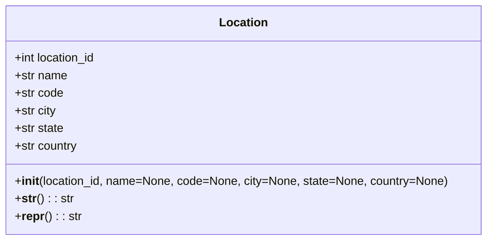

# Diagram: entity_core/entity_service/entity_service/entity/admin_tool/current_location_override/models.py

> Auto-generated by Obscura crawlers

## Mermaid

### SVG

<svg id="container" width="659.7890625" xmlns="http://www.w3.org/2000/svg" class="classDiagram" height="328" viewBox="0 0 659.7890625 328" role="graphics-document document" aria-roledescription="class"><g><defs><marker id="container_class-aggregationStart" class="marker aggregation class" refX="18" refY="7" markerWidth="190" markerHeight="240" orient="auto"><path d="M 18,7 L9,13 L1,7 L9,1 Z"></path></marker></defs><defs><marker id="container_class-aggregationEnd" class="marker aggregation class" refX="1" refY="7" markerWidth="20" markerHeight="28" orient="auto"><path d="M 18,7 L9,13 L1,7 L9,1 Z"></path></marker></defs><defs><marker id="container_class-extensionStart" class="marker extension class" refX="18" refY="7" markerWidth="190" markerHeight="240" orient="auto"><path d="M 1,7 L18,13 V 1 Z"></path></marker></defs><defs><marker id="container_class-extensionEnd" class="marker extension class" refX="1" refY="7" markerWidth="20" markerHeight="28" orient="auto"><path d="M 1,1 V 13 L18,7 Z"></path></marker></defs><defs><marker id="container_class-compositionStart" class="marker composition class" refX="18" refY="7" markerWidth="190" markerHeight="240" orient="auto"><path d="M 18,7 L9,13 L1,7 L9,1 Z"></path></marker></defs><defs><marker id="container_class-compositionEnd" class="marker composition class" refX="1" refY="7" markerWidth="20" markerHeight="28" orient="auto"><path d="M 18,7 L9,13 L1,7 L9,1 Z"></path></marker></defs><defs><marker id="container_class-dependencyStart" class="marker dependency class" refX="6" refY="7" markerWidth="190" markerHeight="240" orient="auto"><path d="M 5,7 L9,13 L1,7 L9,1 Z"></path></marker></defs><defs><marker id="container_class-dependencyEnd" class="marker dependency class" refX="13" refY="7" markerWidth="20" markerHeight="28" orient="auto"><path d="M 18,7 L9,13 L14,7 L9,1 Z"></path></marker></defs><defs><marker id="container_class-lollipopStart" class="marker lollipop class" refX="13" refY="7" markerWidth="190" markerHeight="240" orient="auto"><circle stroke="black" fill="transparent" cx="7" cy="7" r="6"></circle></marker></defs><defs><marker id="container_class-lollipopEnd" class="marker lollipop class" refX="1" refY="7" markerWidth="190" markerHeight="240" orient="auto"><circle stroke="black" fill="transparent" cx="7" cy="7" r="6"></circle></marker></defs><g class="root"><g class="clusters"></g><g class="edgePaths"></g><g class="edgeLabels"></g><g class="nodes"><g class="node default" id="classId-Location-0" transform="translate(329.89453125, 164)"><g class="basic label-container"><path d="M-321.89453125 -156 L321.89453125 -156 L321.89453125 156 L-321.89453125 156" stroke="none" stroke-width="0" fill="#ECECFF" style=""></path><path d="M-321.89453125 -156 C-190.29182870044173 -156, -58.68912615088345 -156, 321.89453125 -156 M-321.89453125 -156 C-65.1853073298663 -156, 191.5239165902674 -156, 321.89453125 -156 M321.89453125 -156 C321.89453125 -84.55178873892227, 321.89453125 -13.103577477844539, 321.89453125 156 M321.89453125 -156 C321.89453125 -68.11912858553306, 321.89453125 19.761742828933876, 321.89453125 156 M321.89453125 156 C177.1847210436735 156, 32.47491083734701 156, -321.89453125 156 M321.89453125 156 C180.68411384374863 156, 39.47369643749727 156, -321.89453125 156 M-321.89453125 156 C-321.89453125 71.46265326728506, -321.89453125 -13.074693465429874, -321.89453125 -156 M-321.89453125 156 C-321.89453125 66.6876049124216, -321.89453125 -22.62479017515679, -321.89453125 -156" stroke="#9370DB" stroke-width="1.3" fill="none" stroke-dasharray="0 0" style=""></path></g><g class="annotation-group text" transform="translate(0, -132)"></g><g class="label-group text" transform="translate(-31.3515625, -132)"><g class="label" style="font-weight: bolder" transform="translate(0,-12)"><foreignObject width="62.703125" height="24">

Location

</foreignObject></g></g><g class="members-group text" transform="translate(-309.89453125, -84)"><g class="label" style="" transform="translate(0,-12)"><foreignObject width="113.453125" height="24">

+int location_id

</foreignObject></g><g class="label" style="" transform="translate(0,12)"><foreignObject width="72.171875" height="24">

+str name

</foreignObject></g><g class="label" style="" transform="translate(0,36)"><foreignObject width="66.609375" height="24">

+str code

</foreignObject></g><g class="label" style="" transform="translate(0,60)"><foreignObject width="57.390625" height="24">

+str city

</foreignObject></g><g class="label" style="" transform="translate(0,84)"><foreignObject width="67.75" height="24">

+str state

</foreignObject></g><g class="label" style="" transform="translate(0,108)"><foreignObject width="86.84375" height="24">

+str country

</foreignObject></g></g><g class="methods-group text" transform="translate(-309.89453125, 84)"><g class="label" style="" transform="translate(0,-12)"><foreignObject width="588.4375" height="24">

+<strong>init</strong>(location_id, name=None, code=None, city=None, state=None, country=None)

</foreignObject></g><g class="label" style="" transform="translate(0,12)"><foreignObject width="78.515625" height="24">

+<strong>str</strong>() : : str

</foreignObject></g><g class="label" style="" transform="translate(0,36)"><foreignObject width="88.9375" height="24">

+<strong>repr</strong>() : : str

</foreignObject></g></g><g class="divider" style=""><path d="M-321.89453125 -108 C-157.60278432846548 -108, 6.68896259306905 -108, 321.89453125 -108 M-321.89453125 -108 C-89.96794836245425 -108, 141.9586345250915 -108, 321.89453125 -108" stroke="#9370DB" stroke-width="1.3" fill="none" stroke-dasharray="0 0" style=""></path></g><g class="divider" style=""><path d="M-321.89453125 60 C-178.40282472228685 60, -34.9111181945737 60, 321.89453125 60 M-321.89453125 60 C-87.4805050669996 60, 146.9335211160008 60, 321.89453125 60" stroke="#9370DB" stroke-width="1.3" fill="none" stroke-dasharray="0 0" style=""></path></g></g></g></g></g></svg>
