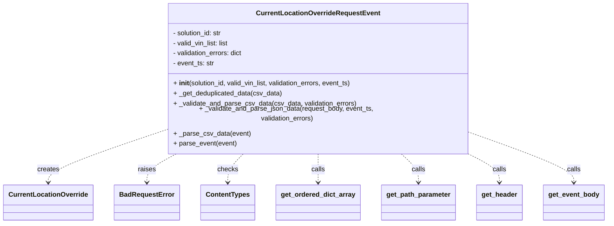

# Diagram: entity_core/entity_service/entity_service/entity/admin_tool/current_location_override/request.py


> Auto-generated by Obscura crawlers

## Diagram 1



### SVG

<svg id="container" width="1411.921875" xmlns="http://www.w3.org/2000/svg" class="classDiagram" height="510" viewBox="0 0 1411.921875 510" role="graphics-document document" aria-roledescription="class"><style>#container{font-family:"trebuchet ms",verdana,arial,sans-serif;font-size:16px;fill:#333;}@keyframes edge-animation-frame{from{stroke-dashoffset:0;}}@keyframes dash{to{stroke-dashoffset:0;}}#container .edge-animation-slow{stroke-dasharray:9,5!important;stroke-dashoffset:900;animation:dash 50s linear infinite;stroke-linecap:round;}#container .edge-animation-fast{stroke-dasharray:9,5!important;stroke-dashoffset:900;animation:dash 20s linear infinite;stroke-linecap:round;}#container .error-icon{fill:#552222;}#container .error-text{fill:#552222;stroke:#552222;}#container .edge-thickness-normal{stroke-width:1px;}#container .edge-thickness-thick{stroke-width:3.5px;}#container .edge-pattern-solid{stroke-dasharray:0;}#container .edge-thickness-invisible{stroke-width:0;fill:none;}#container .edge-pattern-dashed{stroke-dasharray:3;}#container .edge-pattern-dotted{stroke-dasharray:2;}#container .marker{fill:#333333;stroke:#333333;}#container .marker.cross{stroke:#333333;}#container svg{font-family:"trebuchet ms",verdana,arial,sans-serif;font-size:16px;}#container p{margin:0;}#container g.classGroup text{fill:#9370DB;stroke:none;font-family:"trebuchet ms",verdana,arial,sans-serif;font-size:10px;}#container g.classGroup text .title{font-weight:bolder;}#container .nodeLabel,#container .edgeLabel{color:#131300;}#container .edgeLabel .label rect{fill:#ECECFF;}#container .label text{fill:#131300;}#container .labelBkg{background:#ECECFF;}#container .edgeLabel .label span{background:#ECECFF;}#container .classTitle{font-weight:bolder;}#container .node rect,#container .node circle,#container .node ellipse,#container .node polygon,#container .node path{fill:#ECECFF;stroke:#9370DB;stroke-width:1px;}#container .divider{stroke:#9370DB;stroke-width:1;}#container g.clickable{cursor:pointer;}#container g.classGroup rect{fill:#ECECFF;stroke:#9370DB;}#container g.classGroup line{stroke:#9370DB;stroke-width:1;}#container .classLabel .box{stroke:none;stroke-width:0;fill:#ECECFF;opacity:0.5;}#container .classLabel .label{fill:#9370DB;font-size:10px;}#container .relation{stroke:#333333;stroke-width:1;fill:none;}#container .dashed-line{stroke-dasharray:3;}#container .dotted-line{stroke-dasharray:1 2;}#container #compositionStart,#container .composition{fill:#333333!important;stroke:#333333!important;stroke-width:1;}#container #compositionEnd,#container .composition{fill:#333333!important;stroke:#333333!important;stroke-width:1;}#container #dependencyStart,#container .dependency{fill:#333333!important;stroke:#333333!important;stroke-width:1;}#container #dependencyStart,#container .dependency{fill:#333333!important;stroke:#333333!important;stroke-width:1;}#container #extensionStart,#container .extension{fill:transparent!important;stroke:#333333!important;stroke-width:1;}#container #extensionEnd,#container .extension{fill:transparent!important;stroke:#333333!important;stroke-width:1;}#container #aggregationStart,#container .aggregation{fill:transparent!important;stroke:#333333!important;stroke-width:1;}#container #aggregationEnd,#container .aggregation{fill:transparent!important;stroke:#333333!important;stroke-width:1;}#container #lollipopStart,#container .lollipop{fill:#ECECFF!important;stroke:#333333!important;stroke-width:1;}#container #lollipopEnd,#container .lollipop{fill:#ECECFF!important;stroke:#333333!important;stroke-width:1;}#container .edgeTerminals{font-size:11px;line-height:initial;}#container .classTitleText{text-anchor:middle;font-size:18px;fill:#333;}#container .label-icon{display:inline-block;height:1em;overflow:visible;vertical-align:-0.125em;}#container .node .label-icon path{fill:currentColor;stroke:revert;stroke-width:revert;}#container :root{--mermaid-font-family:"trebuchet ms",verdana,arial,sans-serif;}</style><g><defs><marker id="container_class-aggregationStart" class="marker aggregation class" refX="18" refY="7" markerWidth="190" markerHeight="240" orient="auto"><path d="M 18,7 L9,13 L1,7 L9,1 Z"></path></marker></defs><defs><marker id="container_class-aggregationEnd" class="marker aggregation class" refX="1" refY="7" markerWidth="20" markerHeight="28" orient="auto"><path d="M 18,7 L9,13 L1,7 L9,1 Z"></path></marker></defs><defs><marker id="container_class-extensionStart" class="marker extension class" refX="18" refY="7" markerWidth="190" markerHeight="240" orient="auto"><path d="M 1,7 L18,13 V 1 Z"></path></marker></defs><defs><marker id="container_class-extensionEnd" class="marker extension class" refX="1" refY="7" markerWidth="20" markerHeight="28" orient="auto"><path d="M 1,1 V 13 L18,7 Z"></path></marker></defs><defs><marker id="container_class-compositionStart" class="marker composition class" refX="18" refY="7" markerWidth="190" markerHeight="240" orient="auto"><path d="M 18,7 L9,13 L1,7 L9,1 Z"></path></marker></defs><defs><marker id="container_class-compositionEnd" class="marker composition class" refX="1" refY="7" markerWidth="20" markerHeight="28" orient="auto"><path d="M 18,7 L9,13 L1,7 L9,1 Z"></path></marker></defs><defs><marker id="container_class-dependencyStart" class="marker dependency class" refX="6" refY="7" markerWidth="190" markerHeight="240" orient="auto"><path d="M 5,7 L9,13 L1,7 L9,1 Z"></path></marker></defs><defs><marker id="container_class-dependencyEnd" class="marker dependency class" refX="13" refY="7" markerWidth="20" markerHeight="28" orient="auto"><path d="M 18,7 L9,13 L14,7 L9,1 Z"></path></marker></defs><defs><marker id="container_class-lollipopStart" class="marker lollipop class" refX="13" refY="7" markerWidth="190" markerHeight="240" orient="auto"><circle stroke="black" fill="transparent" cx="7" cy="7" r="6"></circle></marker></defs><defs><marker id="container_class-lollipopEnd" class="marker lollipop class" refX="1" refY="7" markerWidth="190" markerHeight="240" orient="auto"><circle stroke="black" fill="transparent" cx="7" cy="7" r="6"></circle></marker></defs><g class="root"><g class="clusters"></g><g class="edgePaths"><path d="M374.484,294.127L330.497,308.606C286.51,323.085,198.536,352.042,154.549,371.688C110.563,391.333,110.563,401.667,110.563,406.833L110.563,412" id="id_CurrentLocationOverrideRequestEvent_CurrentLocationOverride_1" class="edge-thickness-normal edge-pattern-dashed relation" style=";;;" data-edge="true" data-et="edge" data-id="id_CurrentLocationOverrideRequestEvent_CurrentLocationOverride_1" data-points="W3sieCI6Mzc0LjQ4NDM3NSwieSI6Mjk0LjEyNzM5OTA4MTc2MzJ9LHsieCI6MTEwLjU2MjUsInkiOjM4MX0seyJ4IjoxMTAuNTYyNSwieSI6NDE4fV0=" marker-end="url(#container_class-dependencyEnd)"></path><path d="M408.871,344L396.96,350.167C385.049,356.333,361.228,368.667,349.317,380C337.406,391.333,337.406,401.667,337.406,406.833L337.406,412" id="id_CurrentLocationOverrideRequestEvent_BadRequestError_2" class="edge-thickness-normal edge-pattern-dashed relation" style=";;;" data-edge="true" data-et="edge" data-id="id_CurrentLocationOverrideRequestEvent_BadRequestError_2" data-points="W3sieCI6NDA4Ljg3MDk2MDM2NTg1MzY1LCJ5IjozNDR9LHsieCI6MzM3LjQwNjI1LCJ5IjozODF9LHsieCI6MzM3LjQwNjI1LCJ5Ijo0MTh9XQ==" marker-end="url(#container_class-dependencyEnd)"></path><path d="M561.524,344L555.217,350.167C548.909,356.333,536.295,368.667,529.987,380C523.68,391.333,523.68,401.667,523.68,406.833L523.68,412" id="id_CurrentLocationOverrideRequestEvent_ContentTypes_3" class="edge-thickness-normal edge-pattern-dashed relation" style=";;;" data-edge="true" data-et="edge" data-id="id_CurrentLocationOverrideRequestEvent_ContentTypes_3" data-points="W3sieCI6NTYxLjUyNDMxNDAyNDM5MDMsInkiOjM0NH0seyJ4Ijo1MjMuNjc5Njg3NSwieSI6MzgxfSx7IngiOjUyMy42Nzk2ODc1LCJ5Ijo0MTh9XQ==" marker-end="url(#container_class-dependencyEnd)"></path><path d="M733.359,344L733.359,350.167C733.359,356.333,733.359,368.667,733.359,380C733.359,391.333,733.359,401.667,733.359,406.833L733.359,412" id="id_CurrentLocationOverrideRequestEvent_get_ordered_dict_array_4" class="edge-thickness-normal edge-pattern-dashed relation" style=";;;" data-edge="true" data-et="edge" data-id="id_CurrentLocationOverrideRequestEvent_get_ordered_dict_array_4" data-points="W3sieCI6NzMzLjM1OTM3NSwieSI6MzQ0fSx7IngiOjczMy4zNTkzNzUsInkiOjM4MX0seyJ4Ijo3MzMuMzU5Mzc1LCJ5Ijo0MTh9XQ==" marker-end="url(#container_class-dependencyEnd)"></path><path d="M925.669,344L932.728,350.167C939.787,356.333,953.905,368.667,960.964,380C968.023,391.333,968.023,401.667,968.023,406.833L968.023,412" id="id_CurrentLocationOverrideRequestEvent_get_path_parameter_5" class="edge-thickness-normal edge-pattern-dashed relation" style=";;;" data-edge="true" data-et="edge" data-id="id_CurrentLocationOverrideRequestEvent_get_path_parameter_5" data-points="W3sieCI6OTI1LjY2OTQzNTk3NTYwOTgsInkiOjM0NH0seyJ4Ijo5NjguMDIzNDM3NSwieSI6MzgxfSx7IngiOjk2OC4wMjM0Mzc1LCJ5Ijo0MTh9XQ==" marker-end="url(#container_class-dependencyEnd)"></path><path d="M1081.895,344L1094.689,350.167C1107.482,356.333,1133.069,368.667,1145.863,380C1158.656,391.333,1158.656,401.667,1158.656,406.833L1158.656,412" id="id_CurrentLocationOverrideRequestEvent_get_header_6" class="edge-thickness-normal edge-pattern-dashed relation" style=";;;" data-edge="true" data-et="edge" data-id="id_CurrentLocationOverrideRequestEvent_get_header_6" data-points="W3sieCI6MTA4MS44OTUzNTA2MDk3NTYyLCJ5IjozNDR9LHsieCI6MTE1OC42NTYyNSwieSI6MzgxfSx7IngiOjExNTguNjU2MjUsInkiOjQxOH1d" marker-end="url(#container_class-dependencyEnd)"></path><path d="M1092.234,298.665L1132.382,312.388C1172.529,326.11,1252.823,353.555,1292.97,372.444C1333.117,391.333,1333.117,401.667,1333.117,406.833L1333.117,412" id="id_CurrentLocationOverrideRequestEvent_get_event_body_7" class="edge-thickness-normal edge-pattern-dashed relation" style=";;;" data-edge="true" data-et="edge" data-id="id_CurrentLocationOverrideRequestEvent_get_event_body_7" data-points="W3sieCI6MTA5Mi4yMzQzNzUsInkiOjI5OC42NjUxMzgyNzE5NTg3N30seyJ4IjoxMzMzLjExNzE4NzUsInkiOjM4MX0seyJ4IjoxMzMzLjExNzE4NzUsInkiOjQxOH1d" marker-end="url(#container_class-dependencyEnd)"></path></g><g class="edgeLabels"><g class="edgeLabel" transform="translate(110.5625, 381)"><g class="label" data-id="id_CurrentLocationOverrideRequestEvent_CurrentLocationOverride_1" transform="translate(-26.171875, -12)"><foreignObject width="52.34375" height="24"><div xmlns="http://www.w3.org/1999/xhtml" class="labelBkg" style="display: table-cell; white-space: nowrap; line-height: 1.5; max-width: 200px; text-align: center;"><span class="edgeLabel"><p>creates</p></span></div></foreignObject></g></g><g class="edgeLabel" transform="translate(337.40625, 381)"><g class="label" data-id="id_CurrentLocationOverrideRequestEvent_BadRequestError_2" transform="translate(-21.25, -12)"><foreignObject width="42.5" height="24"><div xmlns="http://www.w3.org/1999/xhtml" class="labelBkg" style="display: table-cell; white-space: nowrap; line-height: 1.5; max-width: 200px; text-align: center;"><span class="edgeLabel"><p>raises</p></span></div></foreignObject></g></g><g class="edgeLabel" transform="translate(523.6796875, 381)"><g class="label" data-id="id_CurrentLocationOverrideRequestEvent_ContentTypes_3" transform="translate(-24.4921875, -12)"><foreignObject width="48.984375" height="24"><div xmlns="http://www.w3.org/1999/xhtml" class="labelBkg" style="display: table-cell; white-space: nowrap; line-height: 1.5; max-width: 200px; text-align: center;"><span class="edgeLabel"><p>checks</p></span></div></foreignObject></g></g><g class="edgeLabel" transform="translate(733.359375, 381)"><g class="label" data-id="id_CurrentLocationOverrideRequestEvent_get_ordered_dict_array_4" transform="translate(-16.4453125, -12)"><foreignObject width="32.890625" height="24"><div xmlns="http://www.w3.org/1999/xhtml" class="labelBkg" style="display: table-cell; white-space: nowrap; line-height: 1.5; max-width: 200px; text-align: center;"><span class="edgeLabel"><p>calls</p></span></div></foreignObject></g></g><g class="edgeLabel" transform="translate(968.0234375, 381)"><g class="label" data-id="id_CurrentLocationOverrideRequestEvent_get_path_parameter_5" transform="translate(-16.4453125, -12)"><foreignObject width="32.890625" height="24"><div xmlns="http://www.w3.org/1999/xhtml" class="labelBkg" style="display: table-cell; white-space: nowrap; line-height: 1.5; max-width: 200px; text-align: center;"><span class="edgeLabel"><p>calls</p></span></div></foreignObject></g></g><g class="edgeLabel" transform="translate(1158.65625, 381)"><g class="label" data-id="id_CurrentLocationOverrideRequestEvent_get_header_6" transform="translate(-16.4453125, -12)"><foreignObject width="32.890625" height="24"><div xmlns="http://www.w3.org/1999/xhtml" class="labelBkg" style="display: table-cell; white-space: nowrap; line-height: 1.5; max-width: 200px; text-align: center;"><span class="edgeLabel"><p>calls</p></span></div></foreignObject></g></g><g class="edgeLabel" transform="translate(1333.1171875, 381)"><g class="label" data-id="id_CurrentLocationOverrideRequestEvent_get_event_body_7" transform="translate(-16.4453125, -12)"><foreignObject width="32.890625" height="24"><div xmlns="http://www.w3.org/1999/xhtml" class="labelBkg" style="display: table-cell; white-space: nowrap; line-height: 1.5; max-width: 200px; text-align: center;"><span class="edgeLabel"><p>calls</p></span></div></foreignObject></g></g></g><g class="nodes"><g class="node default" id="classId-CurrentLocationOverrideRequestEvent-0" transform="translate(733.359375, 176)"><g class="basic label-container"><path d="M-358.875 -168 L358.875 -168 L358.875 168 L-358.875 168" stroke="none" stroke-width="0" fill="#ECECFF" style=""></path><path d="M-358.875 -168 C-75.34928299463468 -168, 208.17643401073065 -168, 358.875 -168 M-358.875 -168 C-172.22362595472325 -168, 14.427748090553507 -168, 358.875 -168 M358.875 -168 C358.875 -57.432020498039066, 358.875 53.13595900392187, 358.875 168 M358.875 -168 C358.875 -72.9188933928733, 358.875 22.1622132142534, 358.875 168 M358.875 168 C96.78003572180927 168, -165.31492855638146 168, -358.875 168 M358.875 168 C75.7372578462469 168, -207.4004843075062 168, -358.875 168 M-358.875 168 C-358.875 87.02036538975517, -358.875 6.040730779510341, -358.875 -168 M-358.875 168 C-358.875 89.30360523683159, -358.875 10.607210473663173, -358.875 -168" stroke="#9370DB" stroke-width="1.3" fill="none" stroke-dasharray="0 0" style=""></path></g><g class="annotation-group text" transform="translate(0, -144)"></g><g class="label-group text" transform="translate(-140.75, -144)"><g class="label" style="font-weight: bolder" transform="translate(0,-12)"><foreignObject width="281.5" height="24"><div xmlns="http://www.w3.org/1999/xhtml" style="display: table-cell; white-space: nowrap; line-height: 1.5; max-width: 328px; text-align: center;"><span class="nodeLabel markdown-node-label" style=""><p>CurrentLocationOverrideRequestEvent</p></span></div></foreignObject></g></g><g class="members-group text" transform="translate(-346.875, -96)"><g class="label" style="" transform="translate(0,-12)"><foreignObject width="120.421875" height="24"><div xmlns="http://www.w3.org/1999/xhtml" style="display: table-cell; white-space: nowrap; line-height: 1.5; max-width: 179px; text-align: center;"><span class="nodeLabel markdown-node-label" style=""><p>- solution_id: str</p></span></div></foreignObject></g><g class="label" style="" transform="translate(0,12)"><foreignObject width="136.421875" height="24"><div xmlns="http://www.w3.org/1999/xhtml" style="display: table-cell; white-space: nowrap; line-height: 1.5; max-width: 194px; text-align: center;"><span class="nodeLabel markdown-node-label" style=""><p>- valid_vin_list: list</p></span></div></foreignObject></g><g class="label" style="" transform="translate(0,36)"><foreignObject width="170.265625" height="24"><div xmlns="http://www.w3.org/1999/xhtml" style="display: table-cell; white-space: nowrap; line-height: 1.5; max-width: 228px; text-align: center;"><span class="nodeLabel markdown-node-label" style=""><p>- validation_errors: dict</p></span></div></foreignObject></g><g class="label" style="" transform="translate(0,60)"><foreignObject width="99.78125" height="24"><div xmlns="http://www.w3.org/1999/xhtml" style="display: table-cell; white-space: nowrap; line-height: 1.5; max-width: 158px; text-align: center;"><span class="nodeLabel markdown-node-label" style=""><p>- event_ts: str</p></span></div></foreignObject></g></g><g class="methods-group text" transform="translate(-346.875, 24)"><g class="label" style="" transform="translate(0,-12)"><foreignObject width="434.28125" height="24"><div xmlns="http://www.w3.org/1999/xhtml" style="display: table-cell; white-space: nowrap; line-height: 1.5; max-width: 524px; text-align: center;"><span class="nodeLabel markdown-node-label" style=""><p>+ <strong>init</strong>(solution_id, valid_vin_list, validation_errors, event_ts)</p></span></div></foreignObject></g><g class="label" style="" transform="translate(0,12)"><foreignObject width="261.03125" height="24"><div xmlns="http://www.w3.org/1999/xhtml" style="display: table-cell; white-space: nowrap; line-height: 1.5; max-width: 318px; text-align: center;"><span class="nodeLabel markdown-node-label" style=""><p>+ _get_deduplicated_data(csv_data)</p></span></div></foreignObject></g><g class="label" style="" transform="translate(0,36)"><foreignObject width="437.65625" height="24"><div xmlns="http://www.w3.org/1999/xhtml" style="display: table-cell; white-space: nowrap; line-height: 1.5; max-width: 495px; text-align: center;"><span class="nodeLabel markdown-node-label" style=""><p>+ _validate_and_parse_csv_data(csv_data, validation_errors)</p></span></div></foreignObject></g><g class="label" style="" transform="translate(0,60)"><foreignObject width="553" height="24"><div xmlns="http://www.w3.org/1999/xhtml" style="display: table-cell; white-space: nowrap; line-height: 1.5; max-width: 610px; text-align: center;"><span class="nodeLabel markdown-node-label" style=""><p>+ _validate_and_parse_json_data(request_body, event_ts, validation_errors)</p></span></div></foreignObject></g><g class="label" style="" transform="translate(0,84)"><foreignObject width="181.984375" height="24"><div xmlns="http://www.w3.org/1999/xhtml" style="display: table-cell; white-space: nowrap; line-height: 1.5; max-width: 239px; text-align: center;"><span class="nodeLabel markdown-node-label" style=""><p>+ _parse_csv_data(event)</p></span></div></foreignObject></g><g class="label" style="" transform="translate(0,108)"><foreignObject width="151.125" height="24"><div xmlns="http://www.w3.org/1999/xhtml" style="display: table-cell; white-space: nowrap; line-height: 1.5; max-width: 208px; text-align: center;"><span class="nodeLabel markdown-node-label" style=""><p>+ parse_event(event)</p></span></div></foreignObject></g></g><g class="divider" style=""><path d="M-358.875 -120 C-164.31224709808257 -120, 30.25050580383487 -120, 358.875 -120 M-358.875 -120 C-113.17048368264327 -120, 132.53403263471347 -120, 358.875 -120" stroke="#9370DB" stroke-width="1.3" fill="none" stroke-dasharray="0 0" style=""></path></g><g class="divider" style=""><path d="M-358.875 0 C-177.96413815840998 0, 2.946723683180039 0, 358.875 0 M-358.875 0 C-100.72671129496814 0, 157.42157741006372 0, 358.875 0" stroke="#9370DB" stroke-width="1.3" fill="none" stroke-dasharray="0 0" style=""></path></g></g><g class="node default" id="classId-CurrentLocationOverride-1" transform="translate(110.5625, 460)"><g class="basic label-container"><path d="M-102.5625 -42 L102.5625 -42 L102.5625 42 L-102.5625 42" stroke="none" stroke-width="0" fill="#ECECFF" style=""></path><path d="M-102.5625 -42 C-23.352808269817274 -42, 55.85688346036545 -42, 102.5625 -42 M-102.5625 -42 C-54.93675414411583 -42, -7.311008288231662 -42, 102.5625 -42 M102.5625 -42 C102.5625 -12.002976382470393, 102.5625 17.994047235059213, 102.5625 42 M102.5625 -42 C102.5625 -17.3146261816561, 102.5625 7.370747636687803, 102.5625 42 M102.5625 42 C41.41714320027092 42, -19.728213599458158 42, -102.5625 42 M102.5625 42 C54.887861821263904 42, 7.213223642527808 42, -102.5625 42 M-102.5625 42 C-102.5625 20.081325246981194, -102.5625 -1.8373495060376115, -102.5625 -42 M-102.5625 42 C-102.5625 11.48488966236635, -102.5625 -19.0302206752673, -102.5625 -42" stroke="#9370DB" stroke-width="1.3" fill="none" stroke-dasharray="0 0" style=""></path></g><g class="annotation-group text" transform="translate(0, -18)"></g><g class="label-group text" transform="translate(-90.5625, -18)"><g class="label" style="font-weight: bolder" transform="translate(0,-12)"><foreignObject width="181.125" height="24"><div xmlns="http://www.w3.org/1999/xhtml" style="display: table-cell; white-space: nowrap; line-height: 1.5; max-width: 229px; text-align: center;"><span class="nodeLabel markdown-node-label" style=""><p>CurrentLocationOverride</p></span></div></foreignObject></g></g><g class="members-group text" transform="translate(-90.5625, 30)"></g><g class="methods-group text" transform="translate(-90.5625, 60)"></g><g class="divider" style=""><path d="M-102.5625 6 C-37.56916045121331 6, 27.424179097573386 6, 102.5625 6 M-102.5625 6 C-28.978139254975915 6, 44.60622149004817 6, 102.5625 6" stroke="#9370DB" stroke-width="1.3" fill="none" stroke-dasharray="0 0" style=""></path></g><g class="divider" style=""><path d="M-102.5625 24 C-57.74601908524227 24, -12.929538170484534 24, 102.5625 24 M-102.5625 24 C-37.91099532362139 24, 26.740509352757215 24, 102.5625 24" stroke="#9370DB" stroke-width="1.3" fill="none" stroke-dasharray="0 0" style=""></path></g></g><g class="node default" id="classId-BadRequestError-2" transform="translate(337.40625, 460)"><g class="basic label-container"><path d="M-74.28125 -42 L74.28125 -42 L74.28125 42 L-74.28125 42" stroke="none" stroke-width="0" fill="#ECECFF" style=""></path><path d="M-74.28125 -42 C-25.18888302986383 -42, 23.903483940272338 -42, 74.28125 -42 M-74.28125 -42 C-35.48345008503587 -42, 3.314349829928261 -42, 74.28125 -42 M74.28125 -42 C74.28125 -13.85529308649982, 74.28125 14.28941382700036, 74.28125 42 M74.28125 -42 C74.28125 -11.519497199659945, 74.28125 18.96100560068011, 74.28125 42 M74.28125 42 C41.89670904289181 42, 9.512168085783614 42, -74.28125 42 M74.28125 42 C22.99620709577666 42, -28.288835808446677 42, -74.28125 42 M-74.28125 42 C-74.28125 19.42594674704029, -74.28125 -3.148106505919422, -74.28125 -42 M-74.28125 42 C-74.28125 8.959021372992808, -74.28125 -24.081957254014384, -74.28125 -42" stroke="#9370DB" stroke-width="1.3" fill="none" stroke-dasharray="0 0" style=""></path></g><g class="annotation-group text" transform="translate(0, -18)"></g><g class="label-group text" transform="translate(-62.28125, -18)"><g class="label" style="font-weight: bolder" transform="translate(0,-12)"><foreignObject width="124.5625" height="24"><div xmlns="http://www.w3.org/1999/xhtml" style="display: table-cell; white-space: nowrap; line-height: 1.5; max-width: 174px; text-align: center;"><span class="nodeLabel markdown-node-label" style=""><p>BadRequestError</p></span></div></foreignObject></g></g><g class="members-group text" transform="translate(-62.28125, 30)"></g><g class="methods-group text" transform="translate(-62.28125, 60)"></g><g class="divider" style=""><path d="M-74.28125 6 C-16.083839076776762 6, 42.113571846446476 6, 74.28125 6 M-74.28125 6 C-18.32000705067894 6, 37.64123589864212 6, 74.28125 6" stroke="#9370DB" stroke-width="1.3" fill="none" stroke-dasharray="0 0" style=""></path></g><g class="divider" style=""><path d="M-74.28125 24 C-36.239361686426705 24, 1.802526627146591 24, 74.28125 24 M-74.28125 24 C-30.676881654988748 24, 12.927486690022505 24, 74.28125 24" stroke="#9370DB" stroke-width="1.3" fill="none" stroke-dasharray="0 0" style=""></path></g></g><g class="node default" id="classId-ContentTypes-3" transform="translate(523.6796875, 460)"><g class="basic label-container"><path d="M-61.9921875 -42 L61.9921875 -42 L61.9921875 42 L-61.9921875 42" stroke="none" stroke-width="0" fill="#ECECFF" style=""></path><path d="M-61.9921875 -42 C-32.617117385430234 -42, -3.2420472708604677 -42, 61.9921875 -42 M-61.9921875 -42 C-26.48827552045472 -42, 9.015636459090558 -42, 61.9921875 -42 M61.9921875 -42 C61.9921875 -14.168784210679664, 61.9921875 13.662431578640671, 61.9921875 42 M61.9921875 -42 C61.9921875 -17.904506415929223, 61.9921875 6.190987168141554, 61.9921875 42 M61.9921875 42 C26.274875261900412 42, -9.442436976199176 42, -61.9921875 42 M61.9921875 42 C32.918968547097805 42, 3.8457495941956026 42, -61.9921875 42 M-61.9921875 42 C-61.9921875 10.546184298594536, -61.9921875 -20.907631402810928, -61.9921875 -42 M-61.9921875 42 C-61.9921875 11.513024843136229, -61.9921875 -18.973950313727542, -61.9921875 -42" stroke="#9370DB" stroke-width="1.3" fill="none" stroke-dasharray="0 0" style=""></path></g><g class="annotation-group text" transform="translate(0, -18)"></g><g class="label-group text" transform="translate(-49.9921875, -18)"><g class="label" style="font-weight: bolder" transform="translate(0,-12)"><foreignObject width="99.984375" height="24"><div xmlns="http://www.w3.org/1999/xhtml" style="display: table-cell; white-space: nowrap; line-height: 1.5; max-width: 148px; text-align: center;"><span class="nodeLabel markdown-node-label" style=""><p>ContentTypes</p></span></div></foreignObject></g></g><g class="members-group text" transform="translate(-49.9921875, 30)"></g><g class="methods-group text" transform="translate(-49.9921875, 60)"></g><g class="divider" style=""><path d="M-61.9921875 6 C-12.528665739651842 6, 36.934856020696316 6, 61.9921875 6 M-61.9921875 6 C-36.805868942791236 6, -11.619550385582471 6, 61.9921875 6" stroke="#9370DB" stroke-width="1.3" fill="none" stroke-dasharray="0 0" style=""></path></g><g class="divider" style=""><path d="M-61.9921875 24 C-32.86896887351615 24, -3.745750247032298 24, 61.9921875 24 M-61.9921875 24 C-34.47806505467898 24, -6.963942609357964 24, 61.9921875 24" stroke="#9370DB" stroke-width="1.3" fill="none" stroke-dasharray="0 0" style=""></path></g></g><g class="node default" id="classId-get_ordered_dict_array-4" transform="translate(733.359375, 460)"><g class="basic label-container"><path d="M-97.6875 -42 L97.6875 -42 L97.6875 42 L-97.6875 42" stroke="none" stroke-width="0" fill="#ECECFF" style=""></path><path d="M-97.6875 -42 C-53.35702666139736 -42, -9.026553322794726 -42, 97.6875 -42 M-97.6875 -42 C-33.06446939596286 -42, 31.55856120807428 -42, 97.6875 -42 M97.6875 -42 C97.6875 -9.182684066832692, 97.6875 23.634631866334615, 97.6875 42 M97.6875 -42 C97.6875 -10.909109936186919, 97.6875 20.181780127626162, 97.6875 42 M97.6875 42 C50.661712812670615 42, 3.6359256253412298 42, -97.6875 42 M97.6875 42 C38.26021036979358 42, -21.167079260412834 42, -97.6875 42 M-97.6875 42 C-97.6875 20.58896270623339, -97.6875 -0.8220745875332227, -97.6875 -42 M-97.6875 42 C-97.6875 14.268942831322573, -97.6875 -13.462114337354855, -97.6875 -42" stroke="#9370DB" stroke-width="1.3" fill="none" stroke-dasharray="0 0" style=""></path></g><g class="annotation-group text" transform="translate(0, -18)"></g><g class="label-group text" transform="translate(-85.6875, -18)"><g class="label" style="font-weight: bolder" transform="translate(0,-12)"><foreignObject width="171.375" height="24"><div xmlns="http://www.w3.org/1999/xhtml" style="display: table-cell; white-space: nowrap; line-height: 1.5; max-width: 218px; text-align: center;"><span class="nodeLabel markdown-node-label" style=""><p>get_ordered_dict_array</p></span></div></foreignObject></g></g><g class="members-group text" transform="translate(-85.6875, 30)"></g><g class="methods-group text" transform="translate(-85.6875, 60)"></g><g class="divider" style=""><path d="M-97.6875 6 C-45.107178347387 6, 7.473143305226003 6, 97.6875 6 M-97.6875 6 C-28.291693664349438 6, 41.104112671301124 6, 97.6875 6" stroke="#9370DB" stroke-width="1.3" fill="none" stroke-dasharray="0 0" style=""></path></g><g class="divider" style=""><path d="M-97.6875 24 C-22.422572741640124 24, 52.84235451671975 24, 97.6875 24 M-97.6875 24 C-23.501285124202155 24, 50.68492975159569 24, 97.6875 24" stroke="#9370DB" stroke-width="1.3" fill="none" stroke-dasharray="0 0" style=""></path></g></g><g class="node default" id="classId-get_path_parameter-5" transform="translate(968.0234375, 460)"><g class="basic label-container"><path d="M-86.9765625 -42 L86.9765625 -42 L86.9765625 42 L-86.9765625 42" stroke="none" stroke-width="0" fill="#ECECFF" style=""></path><path d="M-86.9765625 -42 C-30.662843507544324 -42, 25.650875484911353 -42, 86.9765625 -42 M-86.9765625 -42 C-44.62516820227147 -42, -2.273773904542935 -42, 86.9765625 -42 M86.9765625 -42 C86.9765625 -13.886163608298727, 86.9765625 14.227672783402546, 86.9765625 42 M86.9765625 -42 C86.9765625 -9.622838110431132, 86.9765625 22.754323779137735, 86.9765625 42 M86.9765625 42 C42.649347393305185 42, -1.677867713389631 42, -86.9765625 42 M86.9765625 42 C25.05088281149507 42, -36.87479687700986 42, -86.9765625 42 M-86.9765625 42 C-86.9765625 21.40370404214366, -86.9765625 0.8074080842873173, -86.9765625 -42 M-86.9765625 42 C-86.9765625 15.411746891168065, -86.9765625 -11.17650621766387, -86.9765625 -42" stroke="#9370DB" stroke-width="1.3" fill="none" stroke-dasharray="0 0" style=""></path></g><g class="annotation-group text" transform="translate(0, -18)"></g><g class="label-group text" transform="translate(-74.9765625, -18)"><g class="label" style="font-weight: bolder" transform="translate(0,-12)"><foreignObject width="149.953125" height="24"><div xmlns="http://www.w3.org/1999/xhtml" style="display: table-cell; white-space: nowrap; line-height: 1.5; max-width: 198px; text-align: center;"><span class="nodeLabel markdown-node-label" style=""><p>get_path_parameter</p></span></div></foreignObject></g></g><g class="members-group text" transform="translate(-74.9765625, 30)"></g><g class="methods-group text" transform="translate(-74.9765625, 60)"></g><g class="divider" style=""><path d="M-86.9765625 6 C-33.54078589057973 6, 19.894990718840546 6, 86.9765625 6 M-86.9765625 6 C-31.165631518418294 6, 24.64529946316341 6, 86.9765625 6" stroke="#9370DB" stroke-width="1.3" fill="none" stroke-dasharray="0 0" style=""></path></g><g class="divider" style=""><path d="M-86.9765625 24 C-31.021857292775195 24, 24.93284791444961 24, 86.9765625 24 M-86.9765625 24 C-41.32471459044893 24, 4.3271333191021455 24, 86.9765625 24" stroke="#9370DB" stroke-width="1.3" fill="none" stroke-dasharray="0 0" style=""></path></g></g><g class="node default" id="classId-get_header-6" transform="translate(1158.65625, 460)"><g class="basic label-container"><path d="M-53.65625 -42 L53.65625 -42 L53.65625 42 L-53.65625 42" stroke="none" stroke-width="0" fill="#ECECFF" style=""></path><path d="M-53.65625 -42 C-27.40886717447794 -42, -1.1614843489558808 -42, 53.65625 -42 M-53.65625 -42 C-22.248973215692963 -42, 9.158303568614073 -42, 53.65625 -42 M53.65625 -42 C53.65625 -23.72022748246045, 53.65625 -5.440454964920903, 53.65625 42 M53.65625 -42 C53.65625 -13.533837879324224, 53.65625 14.932324241351552, 53.65625 42 M53.65625 42 C25.850183769652876 42, -1.955882460694248 42, -53.65625 42 M53.65625 42 C27.068639367980072 42, 0.4810287359601446 42, -53.65625 42 M-53.65625 42 C-53.65625 11.678184792722071, -53.65625 -18.643630414555858, -53.65625 -42 M-53.65625 42 C-53.65625 19.419962197389506, -53.65625 -3.160075605220989, -53.65625 -42" stroke="#9370DB" stroke-width="1.3" fill="none" stroke-dasharray="0 0" style=""></path></g><g class="annotation-group text" transform="translate(0, -18)"></g><g class="label-group text" transform="translate(-41.65625, -18)"><g class="label" style="font-weight: bolder" transform="translate(0,-12)"><foreignObject width="83.3125" height="24"><div xmlns="http://www.w3.org/1999/xhtml" style="display: table-cell; white-space: nowrap; line-height: 1.5; max-width: 133px; text-align: center;"><span class="nodeLabel markdown-node-label" style=""><p>get_header</p></span></div></foreignObject></g></g><g class="members-group text" transform="translate(-41.65625, 30)"></g><g class="methods-group text" transform="translate(-41.65625, 60)"></g><g class="divider" style=""><path d="M-53.65625 6 C-14.695557148814714 6, 24.26513570237057 6, 53.65625 6 M-53.65625 6 C-25.643026600030083 6, 2.3701967999398335 6, 53.65625 6" stroke="#9370DB" stroke-width="1.3" fill="none" stroke-dasharray="0 0" style=""></path></g><g class="divider" style=""><path d="M-53.65625 24 C-22.562811650103175 24, 8.53062669979365 24, 53.65625 24 M-53.65625 24 C-30.267720539004937 24, -6.879191078009875 24, 53.65625 24" stroke="#9370DB" stroke-width="1.3" fill="none" stroke-dasharray="0 0" style=""></path></g></g><g class="node default" id="classId-get_event_body-7" transform="translate(1333.1171875, 460)"><g class="basic label-container"><path d="M-70.8046875 -42 L70.8046875 -42 L70.8046875 42 L-70.8046875 42" stroke="none" stroke-width="0" fill="#ECECFF" style=""></path><path d="M-70.8046875 -42 C-14.222846398905759 -42, 42.35899470218848 -42, 70.8046875 -42 M-70.8046875 -42 C-37.38827431824639 -42, -3.9718611364927767 -42, 70.8046875 -42 M70.8046875 -42 C70.8046875 -16.823859748386955, 70.8046875 8.35228050322609, 70.8046875 42 M70.8046875 -42 C70.8046875 -13.206239357979136, 70.8046875 15.587521284041728, 70.8046875 42 M70.8046875 42 C31.038951172604264 42, -8.726785154791472 42, -70.8046875 42 M70.8046875 42 C15.262550784052102 42, -40.279585931895795 42, -70.8046875 42 M-70.8046875 42 C-70.8046875 24.91758750280089, -70.8046875 7.8351750056017835, -70.8046875 -42 M-70.8046875 42 C-70.8046875 14.356930799110366, -70.8046875 -13.286138401779269, -70.8046875 -42" stroke="#9370DB" stroke-width="1.3" fill="none" stroke-dasharray="0 0" style=""></path></g><g class="annotation-group text" transform="translate(0, -18)"></g><g class="label-group text" transform="translate(-58.8046875, -18)"><g class="label" style="font-weight: bolder" transform="translate(0,-12)"><foreignObject width="117.609375" height="24"><div xmlns="http://www.w3.org/1999/xhtml" style="display: table-cell; white-space: nowrap; line-height: 1.5; max-width: 166px; text-align: center;"><span class="nodeLabel markdown-node-label" style=""><p>get_event_body</p></span></div></foreignObject></g></g><g class="members-group text" transform="translate(-58.8046875, 30)"></g><g class="methods-group text" transform="translate(-58.8046875, 60)"></g><g class="divider" style=""><path d="M-70.8046875 6 C-38.494977547785545 6, -6.185267595571091 6, 70.8046875 6 M-70.8046875 6 C-16.630937377883335 6, 37.54281274423333 6, 70.8046875 6" stroke="#9370DB" stroke-width="1.3" fill="none" stroke-dasharray="0 0" style=""></path></g><g class="divider" style=""><path d="M-70.8046875 24 C-29.856418125613608 24, 11.091851248772784 24, 70.8046875 24 M-70.8046875 24 C-26.061920990424717 24, 18.680845519150566 24, 70.8046875 24" stroke="#9370DB" stroke-width="1.3" fill="none" stroke-dasharray="0 0" style=""></path></g></g></g></g></g></svg>

## Diagram 2

```mermaid
flowchart TD
    Start([parse_event(event)]) --> P1[get_path_parameter(event, "solution_id")]
    P1 --> P2[get_header(event, "Content-Type")]
    P2 --> Choice{Content-Type == JSON?}
    Choice -- Yes --> JSONFlow
    Choice -- No --> CSVCheck
    JSONFlow --> J1[request_body = get_event_body(event)]
    J1 --> J2{isinstance(request_body, dict)?}
    J2 -- No --> Err1[raise BadRequestError("Invalid payload")]
    J2 -- Yes --> J3[_validate_and_parse_json_data(request_body, event_ts, validation_errors)]
    J3 --> Return[return CurrentLocationOverrideRequestEvent(...)]
    CSVCheck --> ChoiceCSV{Content-Type == CSV?}
    ChoiceCSV -- Yes --> C1[csv_data = _parse_csv_data(event)]
    C1 --> C2[cleaned_data = _get_deduplicated_data(csv_data)]
    C2 --> C3[_validate_and_parse_csv_data(cleaned_data, validation_errors)]
    C3 --> Return
    ChoiceCSV -- No --> Err2[raise BadRequestError("Invalid request, unsupported accept headers")]
```

> SVG rendering failed for this diagram.
