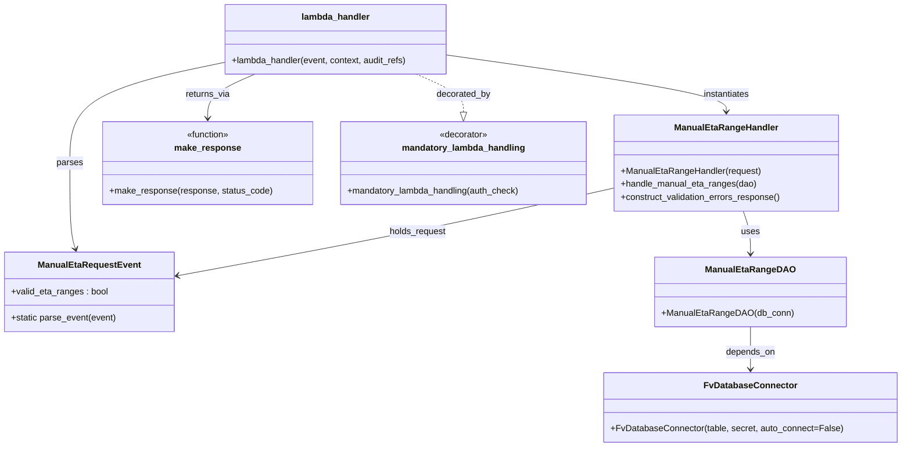

# Diagram: entity_core/entity_service/entity_service/entity/admin_tool/manual_eta_range/manual_eta_range.py


> Auto-generated by Obscura crawlers

## Diagram 1



### SVG

<svg id="container" width="1617.6171875" xmlns="http://www.w3.org/2000/svg" class="classDiagram" height="808" viewBox="0 0 1617.6171875 808" role="graphics-document document" aria-roledescription="class"><style>#container{font-family:"trebuchet ms",verdana,arial,sans-serif;font-size:16px;fill:#333;}@keyframes edge-animation-frame{from{stroke-dashoffset:0;}}@keyframes dash{to{stroke-dashoffset:0;}}#container .edge-animation-slow{stroke-dasharray:9,5!important;stroke-dashoffset:900;animation:dash 50s linear infinite;stroke-linecap:round;}#container .edge-animation-fast{stroke-dasharray:9,5!important;stroke-dashoffset:900;animation:dash 20s linear infinite;stroke-linecap:round;}#container .error-icon{fill:#552222;}#container .error-text{fill:#552222;stroke:#552222;}#container .edge-thickness-normal{stroke-width:1px;}#container .edge-thickness-thick{stroke-width:3.5px;}#container .edge-pattern-solid{stroke-dasharray:0;}#container .edge-thickness-invisible{stroke-width:0;fill:none;}#container .edge-pattern-dashed{stroke-dasharray:3;}#container .edge-pattern-dotted{stroke-dasharray:2;}#container .marker{fill:#333333;stroke:#333333;}#container .marker.cross{stroke:#333333;}#container svg{font-family:"trebuchet ms",verdana,arial,sans-serif;font-size:16px;}#container p{margin:0;}#container g.classGroup text{fill:#9370DB;stroke:none;font-family:"trebuchet ms",verdana,arial,sans-serif;font-size:10px;}#container g.classGroup text .title{font-weight:bolder;}#container .nodeLabel,#container .edgeLabel{color:#131300;}#container .edgeLabel .label rect{fill:#ECECFF;}#container .label text{fill:#131300;}#container .labelBkg{background:#ECECFF;}#container .edgeLabel .label span{background:#ECECFF;}#container .classTitle{font-weight:bolder;}#container .node rect,#container .node circle,#container .node ellipse,#container .node polygon,#container .node path{fill:#ECECFF;stroke:#9370DB;stroke-width:1px;}#container .divider{stroke:#9370DB;stroke-width:1;}#container g.clickable{cursor:pointer;}#container g.classGroup rect{fill:#ECECFF;stroke:#9370DB;}#container g.classGroup line{stroke:#9370DB;stroke-width:1;}#container .classLabel .box{stroke:none;stroke-width:0;fill:#ECECFF;opacity:0.5;}#container .classLabel .label{fill:#9370DB;font-size:10px;}#container .relation{stroke:#333333;stroke-width:1;fill:none;}#container .dashed-line{stroke-dasharray:3;}#container .dotted-line{stroke-dasharray:1 2;}#container #compositionStart,#container .composition{fill:#333333!important;stroke:#333333!important;stroke-width:1;}#container #compositionEnd,#container .composition{fill:#333333!important;stroke:#333333!important;stroke-width:1;}#container #dependencyStart,#container .dependency{fill:#333333!important;stroke:#333333!important;stroke-width:1;}#container #dependencyStart,#container .dependency{fill:#333333!important;stroke:#333333!important;stroke-width:1;}#container #extensionStart,#container .extension{fill:transparent!important;stroke:#333333!important;stroke-width:1;}#container #extensionEnd,#container .extension{fill:transparent!important;stroke:#333333!important;stroke-width:1;}#container #aggregationStart,#container .aggregation{fill:transparent!important;stroke:#333333!important;stroke-width:1;}#container #aggregationEnd,#container .aggregation{fill:transparent!important;stroke:#333333!important;stroke-width:1;}#container #lollipopStart,#container .lollipop{fill:#ECECFF!important;stroke:#333333!important;stroke-width:1;}#container #lollipopEnd,#container .lollipop{fill:#ECECFF!important;stroke:#333333!important;stroke-width:1;}#container .edgeTerminals{font-size:11px;line-height:initial;}#container .classTitleText{text-anchor:middle;font-size:18px;fill:#333;}#container .label-icon{display:inline-block;height:1em;overflow:visible;vertical-align:-0.125em;}#container .node .label-icon path{fill:currentColor;stroke:revert;stroke-width:revert;}#container :root{--mermaid-font-family:"trebuchet ms",verdana,arial,sans-serif;}</style><g><defs><marker id="container_class-aggregationStart" class="marker aggregation class" refX="18" refY="7" markerWidth="190" markerHeight="240" orient="auto"><path d="M 18,7 L9,13 L1,7 L9,1 Z"></path></marker></defs><defs><marker id="container_class-aggregationEnd" class="marker aggregation class" refX="1" refY="7" markerWidth="20" markerHeight="28" orient="auto"><path d="M 18,7 L9,13 L1,7 L9,1 Z"></path></marker></defs><defs><marker id="container_class-extensionStart" class="marker extension class" refX="18" refY="7" markerWidth="190" markerHeight="240" orient="auto"><path d="M 1,7 L18,13 V 1 Z"></path></marker></defs><defs><marker id="container_class-extensionEnd" class="marker extension class" refX="1" refY="7" markerWidth="20" markerHeight="28" orient="auto"><path d="M 1,1 V 13 L18,7 Z"></path></marker></defs><defs><marker id="container_class-compositionStart" class="marker composition class" refX="18" refY="7" markerWidth="190" markerHeight="240" orient="auto"><path d="M 18,7 L9,13 L1,7 L9,1 Z"></path></marker></defs><defs><marker id="container_class-compositionEnd" class="marker composition class" refX="1" refY="7" markerWidth="20" markerHeight="28" orient="auto"><path d="M 18,7 L9,13 L1,7 L9,1 Z"></path></marker></defs><defs><marker id="container_class-dependencyStart" class="marker dependency class" refX="6" refY="7" markerWidth="190" markerHeight="240" orient="auto"><path d="M 5,7 L9,13 L1,7 L9,1 Z"></path></marker></defs><defs><marker id="container_class-dependencyEnd" class="marker dependency class" refX="13" refY="7" markerWidth="20" markerHeight="28" orient="auto"><path d="M 18,7 L9,13 L14,7 L9,1 Z"></path></marker></defs><defs><marker id="container_class-lollipopStart" class="marker lollipop class" refX="13" refY="7" markerWidth="190" markerHeight="240" orient="auto"><circle stroke="black" fill="transparent" cx="7" cy="7" r="6"></circle></marker></defs><defs><marker id="container_class-lollipopEnd" class="marker lollipop class" refX="1" refY="7" markerWidth="190" markerHeight="240" orient="auto"><circle stroke="black" fill="transparent" cx="7" cy="7" r="6"></circle></marker></defs><g class="root"><g class="clusters"></g><g class="edgePaths"><path d="M744.987,134L759.183,140.167C773.379,146.333,801.772,158.667,815.968,170.125C830.164,181.583,830.164,192.167,830.164,197.458L830.164,202.75" id="id_lambda_handler_mandatory_lambda_handling_1" class="edge-thickness-normal edge-pattern-dashed relation" style=";;;" data-edge="true" data-et="edge" data-id="id_lambda_handler_mandatory_lambda_handling_1" data-points="W3sieCI6NzQ0Ljk4NjczODI4MTI1LCJ5IjoxMzR9LHsieCI6ODMwLjE2NDA2MjUsInkiOjE3MX0seyJ4Ijo4MzAuMTY0MDYyNSwieSI6MjIwfV0=" marker-end="url(#container_class-extensionEnd)"></path><path d="M397.123,113.583L351.541,123.152C305.958,132.722,214.794,151.861,169.211,182.097C123.629,212.333,123.629,253.667,123.629,295C123.629,336.333,123.629,377.667,125.348,403.55C127.066,429.434,130.504,439.868,132.222,445.084L133.941,450.301" id="id_lambda_handler_ManualEtaRequestEvent_2" class="edge-thickness-normal edge-pattern-solid relation" style=";;;" data-edge="true" data-et="edge" data-id="id_lambda_handler_ManualEtaRequestEvent_2" data-points="W3sieCI6Mzk3LjEyMzA0Njg3NSwieSI6MTEzLjU4MjU5MjE4NzEwOTE5fSx7IngiOjEyMy42Mjg5MDYyNSwieSI6MTcxfSx7IngiOjEyMy42Mjg5MDYyNSwieSI6Mjk1fSx7IngiOjEyMy42Mjg5MDYyNSwieSI6NDE5fSx7IngiOjEzNS44MTg1OTIzMTY1MTM3NiwieSI6NDU2fV0=" marker-end="url(#container_class-dependencyEnd)"></path><path d="M802.787,99.71L886.728,111.592C970.669,123.474,1138.551,147.237,1222.493,164.285C1306.434,181.333,1306.434,191.667,1306.434,196.833L1306.434,202" id="id_lambda_handler_ManualEtaRangeHandler_3" class="edge-thickness-normal edge-pattern-solid relation" style=";;;" data-edge="true" data-et="edge" data-id="id_lambda_handler_ManualEtaRangeHandler_3" data-points="W3sieCI6ODAyLjc4NzEwOTM3NSwieSI6OTkuNzEwMjkwMDg4NjYwNDd9LHsieCI6MTMwNi40MzM1OTM3NSwieSI6MTcxfSx7IngiOjEzMDYuNDMzNTkzNzUsInkiOjIwOH1d" marker-end="url(#container_class-dependencyEnd)"></path><path d="M1103.293,340.346L1044.568,353.455C985.842,366.564,868.392,392.782,737.34,419.221C606.287,445.661,461.633,472.322,389.306,485.652L316.979,498.983" id="id_ManualEtaRangeHandler_ManualEtaRequestEvent_4" class="edge-thickness-normal edge-pattern-solid relation" style=";;;" data-edge="true" data-et="edge" data-id="id_ManualEtaRangeHandler_ManualEtaRequestEvent_4" data-points="W3sieCI6MTEwMy4yOTI5Njg3NSwieSI6MzQwLjM0NjE1OTc5NjM1MTh9LHsieCI6NzUwLjk0MTQwNjI1LCJ5Ijo0MTl9LHsieCI6MzExLjA3ODEyNSwieSI6NTAwLjA3MDE4NTQwNDEzMDh9XQ==" marker-end="url(#container_class-dependencyEnd)"></path><path d="M1337.414,382L1339.61,388.167C1341.806,394.333,1346.198,406.667,1348.394,419.5C1350.59,432.333,1350.59,445.667,1350.59,452.333L1350.59,459" id="id_ManualEtaRangeHandler_ManualEtaRangeDAO_5" class="edge-thickness-normal edge-pattern-solid relation" style=";;;" data-edge="true" data-et="edge" data-id="id_ManualEtaRangeHandler_ManualEtaRangeDAO_5" data-points="W3sieCI6MTMzNy40MTQxODg1MDgwNjQ2LCJ5IjozODJ9LHsieCI6MTM1MC41ODk4NDM3NSwieSI6NDE5fSx7IngiOjEzNTAuNTg5ODQzNzUsInkiOjQ2NX1d" marker-end="url(#container_class-dependencyEnd)"></path><path d="M1350.59,591L1350.59,598.667C1350.59,606.333,1350.59,621.667,1350.59,634.5C1350.59,647.333,1350.59,657.667,1350.59,662.833L1350.59,668" id="id_ManualEtaRangeDAO_FvDatabaseConnector_6" class="edge-thickness-normal edge-pattern-solid relation" style=";;;" data-edge="true" data-et="edge" data-id="id_ManualEtaRangeDAO_FvDatabaseConnector_6" data-points="W3sieCI6MTM1MC41ODk4NDM3NSwieSI6NTkxfSx7IngiOjEzNTAuNTg5ODQzNzUsInkiOjYzN30seyJ4IjoxMzUwLjU4OTg0Mzc1LCJ5Ijo2NzR9XQ==" marker-end="url(#container_class-dependencyEnd)"></path><path d="M454.923,134L440.727,140.167C426.531,146.333,398.139,158.667,383.942,172C369.746,185.333,369.746,199.667,369.746,206.833L369.746,214" id="id_lambda_handler_make_response_7" class="edge-thickness-normal edge-pattern-solid relation" style=";;;" data-edge="true" data-et="edge" data-id="id_lambda_handler_make_response_7" data-points="W3sieCI6NDU0LjkyMzQxNzk2ODc0OTk2LCJ5IjoxMzR9LHsieCI6MzY5Ljc0NjA5Mzc1LCJ5IjoxNzF9LHsieCI6MzY5Ljc0NjA5Mzc1LCJ5IjoyMjB9XQ==" marker-end="url(#container_class-dependencyEnd)"></path></g><g class="edgeLabels"><g class="edgeLabel" transform="translate(830.1640625, 171)"><g class="label" data-id="id_lambda_handler_mandatory_lambda_handling_1" transform="translate(-49.375, -12)"><foreignObject width="98.75" height="24"><div xmlns="http://www.w3.org/1999/xhtml" class="labelBkg" style="display: table-cell; white-space: nowrap; line-height: 1.5; max-width: 200px; text-align: center;"><span class="edgeLabel"><p>decorated_by</p></span></div></foreignObject></g></g><g class="edgeLabel" transform="translate(123.62890625, 295)"><g class="label" data-id="id_lambda_handler_ManualEtaRequestEvent_2" transform="translate(-23.828125, -12)"><foreignObject width="47.65625" height="24"><div xmlns="http://www.w3.org/1999/xhtml" class="labelBkg" style="display: table-cell; white-space: nowrap; line-height: 1.5; max-width: 200px; text-align: center;"><span class="edgeLabel"><p>parses</p></span></div></foreignObject></g></g><g class="edgeLabel" transform="translate(1306.43359375, 171)"><g class="label" data-id="id_lambda_handler_ManualEtaRangeHandler_3" transform="translate(-42.9140625, -12)"><foreignObject width="85.828125" height="24"><div xmlns="http://www.w3.org/1999/xhtml" class="labelBkg" style="display: table-cell; white-space: nowrap; line-height: 1.5; max-width: 200px; text-align: center;"><span class="edgeLabel"><p>instantiates</p></span></div></foreignObject></g></g><g class="edgeLabel" transform="translate(750.94140625, 419)"><g class="label" data-id="id_ManualEtaRangeHandler_ManualEtaRequestEvent_4" transform="translate(-51.8203125, -12)"><foreignObject width="103.640625" height="24"><div xmlns="http://www.w3.org/1999/xhtml" class="labelBkg" style="display: table-cell; white-space: nowrap; line-height: 1.5; max-width: 200px; text-align: center;"><span class="edgeLabel"><p>holds_request</p></span></div></foreignObject></g></g><g class="edgeLabel" transform="translate(1350.58984375, 419)"><g class="label" data-id="id_ManualEtaRangeHandler_ManualEtaRangeDAO_5" transform="translate(-16.4921875, -12)"><foreignObject width="32.984375" height="24"><div xmlns="http://www.w3.org/1999/xhtml" class="labelBkg" style="display: table-cell; white-space: nowrap; line-height: 1.5; max-width: 200px; text-align: center;"><span class="edgeLabel"><p>uses</p></span></div></foreignObject></g></g><g class="edgeLabel" transform="translate(1350.58984375, 637)"><g class="label" data-id="id_ManualEtaRangeDAO_FvDatabaseConnector_6" transform="translate(-44.671875, -12)"><foreignObject width="89.34375" height="24"><div xmlns="http://www.w3.org/1999/xhtml" class="labelBkg" style="display: table-cell; white-space: nowrap; line-height: 1.5; max-width: 200px; text-align: center;"><span class="edgeLabel"><p>depends_on</p></span></div></foreignObject></g></g><g class="edgeLabel" transform="translate(369.74609375, 171)"><g class="label" data-id="id_lambda_handler_make_response_7" transform="translate(-40.5703125, -12)"><foreignObject width="81.140625" height="24"><div xmlns="http://www.w3.org/1999/xhtml" class="labelBkg" style="display: table-cell; white-space: nowrap; line-height: 1.5; max-width: 200px; text-align: center;"><span class="edgeLabel"><p>returns_via</p></span></div></foreignObject></g></g></g><g class="nodes"><g class="node default" id="classId-ManualEtaRequestEvent-0" transform="translate(159.5390625, 528)"><g class="basic label-container"><path d="M-151.5390625 -72 L151.5390625 -72 L151.5390625 72 L-151.5390625 72" stroke="none" stroke-width="0" fill="#ECECFF" style=""></path><path d="M-151.5390625 -72 C-49.12381969143628 -72, 53.29142311712744 -72, 151.5390625 -72 M-151.5390625 -72 C-42.56042708475947 -72, 66.41820833048106 -72, 151.5390625 -72 M151.5390625 -72 C151.5390625 -36.961716143205614, 151.5390625 -1.9234322864112272, 151.5390625 72 M151.5390625 -72 C151.5390625 -32.464249385622026, 151.5390625 7.071501228755949, 151.5390625 72 M151.5390625 72 C41.57674954902244 72, -68.38556340195512 72, -151.5390625 72 M151.5390625 72 C59.64308182384407 72, -32.25289885231186 72, -151.5390625 72 M-151.5390625 72 C-151.5390625 42.62093099068094, -151.5390625 13.241861981361879, -151.5390625 -72 M-151.5390625 72 C-151.5390625 28.43846572816706, -151.5390625 -15.12306854366588, -151.5390625 -72" stroke="#9370DB" stroke-width="1.3" fill="none" stroke-dasharray="0 0" style=""></path></g><g class="annotation-group text" transform="translate(0, -48)"></g><g class="label-group text" transform="translate(-88.171875, -48)"><g class="label" style="font-weight: bolder" transform="translate(0,-12)"><foreignObject width="176.34375" height="24"><div xmlns="http://www.w3.org/1999/xhtml" style="display: table-cell; white-space: nowrap; line-height: 1.5; max-width: 225px; text-align: center;"><span class="nodeLabel markdown-node-label" style=""><p>ManualEtaRequestEvent</p></span></div></foreignObject></g></g><g class="members-group text" transform="translate(-139.5390625, 0)"><g class="label" style="" transform="translate(0,-12)"><foreignObject width="175.3125" height="24"><div xmlns="http://www.w3.org/1999/xhtml" style="display: table-cell; white-space: nowrap; line-height: 1.5; max-width: 233px; text-align: center;"><span class="nodeLabel markdown-node-label" style=""><p>+valid_eta_ranges : bool</p></span></div></foreignObject></g></g><g class="methods-group text" transform="translate(-139.5390625, 48)"><g class="label" style="" transform="translate(0,-12)"><foreignObject width="190.90625" height="24"><div xmlns="http://www.w3.org/1999/xhtml" style="display: table-cell; white-space: nowrap; line-height: 1.5; max-width: 248px; text-align: center;"><span class="nodeLabel markdown-node-label" style=""><p>+static parse_event(event)</p></span></div></foreignObject></g></g><g class="divider" style=""><path d="M-151.5390625 -24 C-62.21779372988435 -24, 27.103475040231302 -24, 151.5390625 -24 M-151.5390625 -24 C-45.48844838235085 -24, 60.562165735298294 -24, 151.5390625 -24" stroke="#9370DB" stroke-width="1.3" fill="none" stroke-dasharray="0 0" style=""></path></g><g class="divider" style=""><path d="M-151.5390625 24 C-66.94062265951051 24, 17.65781718097898 24, 151.5390625 24 M-151.5390625 24 C-59.0375207824967 24, 33.4640209350066 24, 151.5390625 24" stroke="#9370DB" stroke-width="1.3" fill="none" stroke-dasharray="0 0" style=""></path></g></g><g class="node default" id="classId-ManualEtaRangeHandler-1" transform="translate(1306.43359375, 295)"><g class="basic label-container"><path d="M-203.140625 -87 L203.140625 -87 L203.140625 87 L-203.140625 87" stroke="none" stroke-width="0" fill="#ECECFF" style=""></path><path d="M-203.140625 -87 C-67.9574528806778 -87, 67.22571923864439 -87, 203.140625 -87 M-203.140625 -87 C-48.030787220690684 -87, 107.07905055861863 -87, 203.140625 -87 M203.140625 -87 C203.140625 -46.60486024993765, 203.140625 -6.209720499875303, 203.140625 87 M203.140625 -87 C203.140625 -39.251519973883156, 203.140625 8.496960052233689, 203.140625 87 M203.140625 87 C68.47844578869487 87, -66.18373342261026 87, -203.140625 87 M203.140625 87 C102.46605274141427 87, 1.7914804828285469 87, -203.140625 87 M-203.140625 87 C-203.140625 23.211363777283765, -203.140625 -40.57727244543247, -203.140625 -87 M-203.140625 87 C-203.140625 51.321174560958205, -203.140625 15.64234912191641, -203.140625 -87" stroke="#9370DB" stroke-width="1.3" fill="none" stroke-dasharray="0 0" style=""></path></g><g class="annotation-group text" transform="translate(0, -63)"></g><g class="label-group text" transform="translate(-89.578125, -63)"><g class="label" style="font-weight: bolder" transform="translate(0,-12)"><foreignObject width="179.15625" height="24"><div xmlns="http://www.w3.org/1999/xhtml" style="display: table-cell; white-space: nowrap; line-height: 1.5; max-width: 229px; text-align: center;"><span class="nodeLabel markdown-node-label" style=""><p>ManualEtaRangeHandler</p></span></div></foreignObject></g></g><g class="members-group text" transform="translate(-191.140625, -15)"></g><g class="methods-group text" transform="translate(-191.140625, 15)"><g class="label" style="" transform="translate(0,-12)"><foreignObject width="251.8125" height="24"><div xmlns="http://www.w3.org/1999/xhtml" style="display: table-cell; white-space: nowrap; line-height: 1.5; max-width: 309px; text-align: center;"><span class="nodeLabel markdown-node-label" style=""><p>+ManualEtaRangeHandler(request)</p></span></div></foreignObject></g><g class="label" style="" transform="translate(0,12)"><foreignObject width="246.03125" height="24"><div xmlns="http://www.w3.org/1999/xhtml" style="display: table-cell; white-space: nowrap; line-height: 1.5; max-width: 303px; text-align: center;"><span class="nodeLabel markdown-node-label" style=""><p>+handle_manual_eta_ranges(dao)</p></span></div></foreignObject></g><g class="label" style="" transform="translate(0,36)"><foreignObject width="292.703125" height="24"><div xmlns="http://www.w3.org/1999/xhtml" style="display: table-cell; white-space: nowrap; line-height: 1.5; max-width: 350px; text-align: center;"><span class="nodeLabel markdown-node-label" style=""><p>+construct_validation_errors_response()</p></span></div></foreignObject></g></g><g class="divider" style=""><path d="M-203.140625 -39 C-79.72784609557041 -39, 43.68493280885917 -39, 203.140625 -39 M-203.140625 -39 C-121.41244252547915 -39, -39.6842600509583 -39, 203.140625 -39" stroke="#9370DB" stroke-width="1.3" fill="none" stroke-dasharray="0 0" style=""></path></g><g class="divider" style=""><path d="M-203.140625 -15 C-42.26355193387295 -15, 118.6135211322541 -15, 203.140625 -15 M-203.140625 -15 C-93.30306703850673 -15, 16.53449092298655 -15, 203.140625 -15" stroke="#9370DB" stroke-width="1.3" fill="none" stroke-dasharray="0 0" style=""></path></g></g><g class="node default" id="classId-ManualEtaRangeDAO-2" transform="translate(1350.58984375, 528)"><g class="basic label-container"><path d="M-165.35546875 -63 L165.35546875 -63 L165.35546875 63 L-165.35546875 63" stroke="none" stroke-width="0" fill="#ECECFF" style=""></path><path d="M-165.35546875 -63 C-43.73911181677457 -63, 77.87724511645087 -63, 165.35546875 -63 M-165.35546875 -63 C-54.39963449563888 -63, 56.556199758722244 -63, 165.35546875 -63 M165.35546875 -63 C165.35546875 -17.37887991092306, 165.35546875 28.242240178153878, 165.35546875 63 M165.35546875 -63 C165.35546875 -30.84166137392043, 165.35546875 1.3166772521591383, 165.35546875 63 M165.35546875 63 C33.096906752502576 63, -99.16165524499485 63, -165.35546875 63 M165.35546875 63 C81.80890741202853 63, -1.7376539259429364 63, -165.35546875 63 M-165.35546875 63 C-165.35546875 29.57879050642439, -165.35546875 -3.8424189871512198, -165.35546875 -63 M-165.35546875 63 C-165.35546875 18.331151759186838, -165.35546875 -26.337696481626324, -165.35546875 -63" stroke="#9370DB" stroke-width="1.3" fill="none" stroke-dasharray="0 0" style=""></path></g><g class="annotation-group text" transform="translate(0, -39)"></g><g class="label-group text" transform="translate(-75.7890625, -39)"><g class="label" style="font-weight: bolder" transform="translate(0,-12)"><foreignObject width="151.578125" height="24"><div xmlns="http://www.w3.org/1999/xhtml" style="display: table-cell; white-space: nowrap; line-height: 1.5; max-width: 200px; text-align: center;"><span class="nodeLabel markdown-node-label" style=""><p>ManualEtaRangeDAO</p></span></div></foreignObject></g></g><g class="members-group text" transform="translate(-153.35546875, 9)"></g><g class="methods-group text" transform="translate(-153.35546875, 39)"><g class="label" style="" transform="translate(0,-12)"><foreignObject width="230.921875" height="24"><div xmlns="http://www.w3.org/1999/xhtml" style="display: table-cell; white-space: nowrap; line-height: 1.5; max-width: 288px; text-align: center;"><span class="nodeLabel markdown-node-label" style=""><p>+ManualEtaRangeDAO(db_conn)</p></span></div></foreignObject></g></g><g class="divider" style=""><path d="M-165.35546875 -15 C-59.27737369047648 -15, 46.80072136904704 -15, 165.35546875 -15 M-165.35546875 -15 C-68.76517894881091 -15, 27.825110852378174 -15, 165.35546875 -15" stroke="#9370DB" stroke-width="1.3" fill="none" stroke-dasharray="0 0" style=""></path></g><g class="divider" style=""><path d="M-165.35546875 9 C-41.623052700318084 9, 82.10936334936383 9, 165.35546875 9 M-165.35546875 9 C-36.52537526652506 9, 92.30471821694988 9, 165.35546875 9" stroke="#9370DB" stroke-width="1.3" fill="none" stroke-dasharray="0 0" style=""></path></g></g><g class="node default" id="classId-FvDatabaseConnector-3" transform="translate(1350.58984375, 737)"><g class="basic label-container"><path d="M-259.02734375 -63 L259.02734375 -63 L259.02734375 63 L-259.02734375 63" stroke="none" stroke-width="0" fill="#ECECFF" style=""></path><path d="M-259.02734375 -63 C-101.81771682155392 -63, 55.39191010689217 -63, 259.02734375 -63 M-259.02734375 -63 C-82.31116835227368 -63, 94.40500704545263 -63, 259.02734375 -63 M259.02734375 -63 C259.02734375 -36.25366845507794, 259.02734375 -9.507336910155885, 259.02734375 63 M259.02734375 -63 C259.02734375 -20.30984301328465, 259.02734375 22.380313973430702, 259.02734375 63 M259.02734375 63 C124.51405485571246 63, -9.999234038575082 63, -259.02734375 63 M259.02734375 63 C83.55918338701491 63, -91.90897697597018 63, -259.02734375 63 M-259.02734375 63 C-259.02734375 19.044248316696645, -259.02734375 -24.91150336660671, -259.02734375 -63 M-259.02734375 63 C-259.02734375 19.19764157298954, -259.02734375 -24.60471685402092, -259.02734375 -63" stroke="#9370DB" stroke-width="1.3" fill="none" stroke-dasharray="0 0" style=""></path></g><g class="annotation-group text" transform="translate(0, -39)"></g><g class="label-group text" transform="translate(-79.3046875, -39)"><g class="label" style="font-weight: bolder" transform="translate(0,-12)"><foreignObject width="158.609375" height="24"><div xmlns="http://www.w3.org/1999/xhtml" style="display: table-cell; white-space: nowrap; line-height: 1.5; max-width: 207px; text-align: center;"><span class="nodeLabel markdown-node-label" style=""><p>FvDatabaseConnector</p></span></div></foreignObject></g></g><g class="members-group text" transform="translate(-247.02734375, 9)"></g><g class="methods-group text" transform="translate(-247.02734375, 39)"><g class="label" style="" transform="translate(0,-12)"><foreignObject width="414.75" height="24"><div xmlns="http://www.w3.org/1999/xhtml" style="display: table-cell; white-space: nowrap; line-height: 1.5; max-width: 472px; text-align: center;"><span class="nodeLabel markdown-node-label" style=""><p>+FvDatabaseConnector(table, secret, auto_connect=False)</p></span></div></foreignObject></g></g><g class="divider" style=""><path d="M-259.02734375 -15 C-69.02871644950187 -15, 120.96991085099626 -15, 259.02734375 -15 M-259.02734375 -15 C-53.55196729809998 -15, 151.92340915380004 -15, 259.02734375 -15" stroke="#9370DB" stroke-width="1.3" fill="none" stroke-dasharray="0 0" style=""></path></g><g class="divider" style=""><path d="M-259.02734375 9 C-107.0715108553041 9, 44.884322039391805 9, 259.02734375 9 M-259.02734375 9 C-152.4257986472027 9, -45.824253544405394 9, 259.02734375 9" stroke="#9370DB" stroke-width="1.3" fill="none" stroke-dasharray="0 0" style=""></path></g></g><g class="node default" id="classId-make_response-4" transform="translate(369.74609375, 295)"><g class="basic label-container"><path d="M-187.2890625 -75 L187.2890625 -75 L187.2890625 75 L-187.2890625 75" stroke="none" stroke-width="0" fill="#ECECFF" style=""></path><path d="M-187.2890625 -75 C-45.07636384948353 -75, 97.13633480103294 -75, 187.2890625 -75 M-187.2890625 -75 C-72.71984495746815 -75, 41.84937258506369 -75, 187.2890625 -75 M187.2890625 -75 C187.2890625 -25.428174556045313, 187.2890625 24.143650887909374, 187.2890625 75 M187.2890625 -75 C187.2890625 -41.635482441724264, 187.2890625 -8.270964883448528, 187.2890625 75 M187.2890625 75 C64.31609482447658 75, -58.65687285104684 75, -187.2890625 75 M187.2890625 75 C67.530134218734 75, -52.22879406253199 75, -187.2890625 75 M-187.2890625 75 C-187.2890625 26.152484127502433, -187.2890625 -22.695031744995134, -187.2890625 -75 M-187.2890625 75 C-187.2890625 15.030480289461742, -187.2890625 -44.939039421076515, -187.2890625 -75" stroke="#9370DB" stroke-width="1.3" fill="none" stroke-dasharray="0 0" style=""></path></g><g class="annotation-group text" transform="translate(-39.484375, -51)"><g class="label" style="" transform="translate(0,-12)"><foreignObject width="78.96875" height="24"><div xmlns="http://www.w3.org/1999/xhtml" style="display: table-cell; white-space: nowrap; line-height: 1.5; max-width: 129px; text-align: center;"><span class="nodeLabel markdown-node-label" style=""><p>«function»</p></span></div></foreignObject></g></g><g class="label-group text" transform="translate(-57.46875, -27)"><g class="label" style="font-weight: bolder" transform="translate(0,-12)"><foreignObject width="114.9375" height="24"><div xmlns="http://www.w3.org/1999/xhtml" style="display: table-cell; white-space: nowrap; line-height: 1.5; max-width: 164px; text-align: center;"><span class="nodeLabel markdown-node-label" style=""><p>make_response</p></span></div></foreignObject></g></g><g class="members-group text" transform="translate(-175.2890625, 21)"></g><g class="methods-group text" transform="translate(-175.2890625, 51)"><g class="label" style="" transform="translate(0,-12)"><foreignObject width="293.109375" height="24"><div xmlns="http://www.w3.org/1999/xhtml" style="display: table-cell; white-space: nowrap; line-height: 1.5; max-width: 350px; text-align: center;"><span class="nodeLabel markdown-node-label" style=""><p>+make_response(response, status_code)</p></span></div></foreignObject></g></g><g class="divider" style=""><path d="M-187.2890625 -3 C-40.65760814390529 -3, 105.97384621218941 -3, 187.2890625 -3 M-187.2890625 -3 C-70.26171453001034 -3, 46.765633439979325 -3, 187.2890625 -3" stroke="#9370DB" stroke-width="1.3" fill="none" stroke-dasharray="0 0" style=""></path></g><g class="divider" style=""><path d="M-187.2890625 21 C-60.414101280682715 21, 66.46085993863457 21, 187.2890625 21 M-187.2890625 21 C-85.52478658351629 21, 16.239489332967423 21, 187.2890625 21" stroke="#9370DB" stroke-width="1.3" fill="none" stroke-dasharray="0 0" style=""></path></g></g><g class="node default" id="classId-mandatory_lambda_handling-5" transform="translate(830.1640625, 295)"><g class="basic label-container"><path d="M-223.12890625 -75 L223.12890625 -75 L223.12890625 75 L-223.12890625 75" stroke="none" stroke-width="0" fill="#ECECFF" style=""></path><path d="M-223.12890625 -75 C-67.14203283838236 -75, 88.84484057323527 -75, 223.12890625 -75 M-223.12890625 -75 C-132.9387505083929 -75, -42.74859476678583 -75, 223.12890625 -75 M223.12890625 -75 C223.12890625 -21.30006017813831, 223.12890625 32.39987964372338, 223.12890625 75 M223.12890625 -75 C223.12890625 -38.135950384328666, 223.12890625 -1.271900768657332, 223.12890625 75 M223.12890625 75 C126.96279550817312 75, 30.79668476634623 75, -223.12890625 75 M223.12890625 75 C64.06782068543546 75, -94.99326487912907 75, -223.12890625 75 M-223.12890625 75 C-223.12890625 23.387838590915244, -223.12890625 -28.22432281816951, -223.12890625 -75 M-223.12890625 75 C-223.12890625 16.811064589993826, -223.12890625 -41.37787082001235, -223.12890625 -75" stroke="#9370DB" stroke-width="1.3" fill="none" stroke-dasharray="0 0" style=""></path></g><g class="annotation-group text" transform="translate(-44.0625, -51)"><g class="label" style="" transform="translate(0,-12)"><foreignObject width="88.125" height="24"><div xmlns="http://www.w3.org/1999/xhtml" style="display: table-cell; white-space: nowrap; line-height: 1.5; max-width: 138px; text-align: center;"><span class="nodeLabel markdown-node-label" style=""><p>«decorator»</p></span></div></foreignObject></g></g><g class="label-group text" transform="translate(-107.4296875, -27)"><g class="label" style="font-weight: bolder" transform="translate(0,-12)"><foreignObject width="214.859375" height="24"><div xmlns="http://www.w3.org/1999/xhtml" style="display: table-cell; white-space: nowrap; line-height: 1.5; max-width: 264px; text-align: center;"><span class="nodeLabel markdown-node-label" style=""><p>mandatory_lambda_handling</p></span></div></foreignObject></g></g><g class="members-group text" transform="translate(-211.12890625, 21)"></g><g class="methods-group text" transform="translate(-211.12890625, 51)"><g class="label" style="" transform="translate(0,-12)"><foreignObject width="314.828125" height="24"><div xmlns="http://www.w3.org/1999/xhtml" style="display: table-cell; white-space: nowrap; line-height: 1.5; max-width: 372px; text-align: center;"><span class="nodeLabel markdown-node-label" style=""><p>+mandatory_lambda_handling(auth_check)</p></span></div></foreignObject></g></g><g class="divider" style=""><path d="M-223.12890625 -3 C-48.06230990985338 -3, 127.00428643029323 -3, 223.12890625 -3 M-223.12890625 -3 C-92.02641862102283 -3, 39.076069007954345 -3, 223.12890625 -3" stroke="#9370DB" stroke-width="1.3" fill="none" stroke-dasharray="0 0" style=""></path></g><g class="divider" style=""><path d="M-223.12890625 21 C-105.22675189579714 21, 12.675402458405728 21, 223.12890625 21 M-223.12890625 21 C-126.9324926210631 21, -30.73607899212621 21, 223.12890625 21" stroke="#9370DB" stroke-width="1.3" fill="none" stroke-dasharray="0 0" style=""></path></g></g><g class="node default" id="classId-lambda_handler-6" transform="translate(599.955078125, 71)"><g class="basic label-container"><path d="M-202.83203125 -63 L202.83203125 -63 L202.83203125 63 L-202.83203125 63" stroke="none" stroke-width="0" fill="#ECECFF" style=""></path><path d="M-202.83203125 -63 C-42.92417564454777 -63, 116.98367996090445 -63, 202.83203125 -63 M-202.83203125 -63 C-80.1756705375775 -63, 42.480690174844995 -63, 202.83203125 -63 M202.83203125 -63 C202.83203125 -23.04061600830633, 202.83203125 16.91876798338734, 202.83203125 63 M202.83203125 -63 C202.83203125 -14.83983302000496, 202.83203125 33.32033395999008, 202.83203125 63 M202.83203125 63 C114.64202491622477 63, 26.45201858244954 63, -202.83203125 63 M202.83203125 63 C63.47722560657911 63, -75.87758003684178 63, -202.83203125 63 M-202.83203125 63 C-202.83203125 31.594924683554474, -202.83203125 0.18984936710894829, -202.83203125 -63 M-202.83203125 63 C-202.83203125 14.883003573934275, -202.83203125 -33.23399285213145, -202.83203125 -63" stroke="#9370DB" stroke-width="1.3" fill="none" stroke-dasharray="0 0" style=""></path></g><g class="annotation-group text" transform="translate(0, -39)"></g><g class="label-group text" transform="translate(-59.9765625, -39)"><g class="label" style="font-weight: bolder" transform="translate(0,-12)"><foreignObject width="119.953125" height="24"><div xmlns="http://www.w3.org/1999/xhtml" style="display: table-cell; white-space: nowrap; line-height: 1.5; max-width: 170px; text-align: center;"><span class="nodeLabel markdown-node-label" style=""><p>lambda_handler</p></span></div></foreignObject></g></g><g class="members-group text" transform="translate(-190.83203125, 9)"></g><g class="methods-group text" transform="translate(-190.83203125, 39)"><g class="label" style="" transform="translate(0,-12)"><foreignObject width="321.6875" height="24"><div xmlns="http://www.w3.org/1999/xhtml" style="display: table-cell; white-space: nowrap; line-height: 1.5; max-width: 379px; text-align: center;"><span class="nodeLabel markdown-node-label" style=""><p>+lambda_handler(event, context, audit_refs)</p></span></div></foreignObject></g></g><g class="divider" style=""><path d="M-202.83203125 -15 C-58.87604533282595 -15, 85.0799405843481 -15, 202.83203125 -15 M-202.83203125 -15 C-115.21570662722104 -15, -27.599382004442077 -15, 202.83203125 -15" stroke="#9370DB" stroke-width="1.3" fill="none" stroke-dasharray="0 0" style=""></path></g><g class="divider" style=""><path d="M-202.83203125 9 C-44.51018933036477 9, 113.81165258927047 9, 202.83203125 9 M-202.83203125 9 C-65.15961285067809 9, 72.51280554864383 9, 202.83203125 9" stroke="#9370DB" stroke-width="1.3" fill="none" stroke-dasharray="0 0" style=""></path></g></g></g></g></g></svg>

## Diagram 2

```mermaid
flowchart TD
Evt[Incoming event, context, audit_refs] --> Parse[ManualEtaRequestEvent.parse_event(event)]
Parse --> Handler[ManualEtaRangeHandler(request)]
Handler --> Decision{request.valid_eta_ranges?}
Decision -- Yes --> Handle[handler.handle_manual_eta_ranges(dao=ManualEtaRangeDAO(DB_CONN))]
Handle --> MakeResp[make_response(response, status_code)]
Decision -- No --> Validate[handler.construct_validation_errors_response()]
Validate --> MakeResp
MakeResp --> Return[return response]
```

> SVG rendering failed for this diagram.
