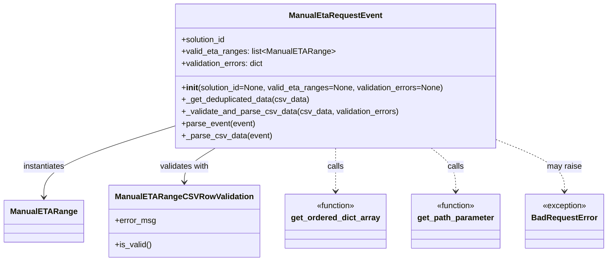

# Diagram: entity_core/entity_service/entity_service/entity/admin_tool/manual_eta_range/manual_eta_range_request.py


> Auto-generated by Obscura crawlers

## Diagram 1



> SVG rendering failed for this diagram.

## Diagram 2

```mermaid
flowchart TD
PE[parse_event(event)] --> GP[get_path_parameter(event, "solution_id")]
PE --> PC[_parse_csv_data(event)]
PC --> BOD{body present?}
BOD -- No --> ERR[BadRequestError: "The CSV file does not contain any data!"]
BOD -- Yes --> ORD[get_ordered_dict_array(data)]
ORD --> DED[_get_deduplicated_data(csv_data)]
DED --> VAL[_validate_and_parse_csv_data(cleaned_data, validation_errors)]
VAL --> RES[valid_eta_ranges + validation_errors]
RES --> CRT[ManualEtaRequestEvent(solution_id, valid_eta_ranges, validation_errors)]
```

> SVG rendering failed for this diagram.
