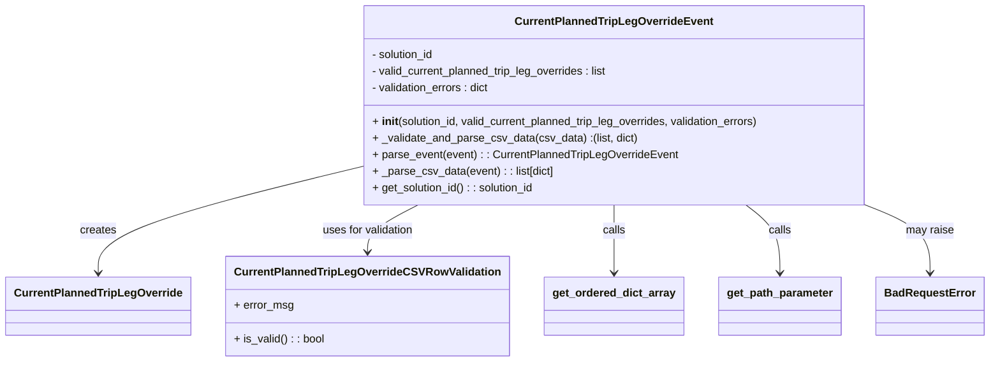

# Diagram: entity_core/entity_service/entity_service/entity/admin_tool/override_current_planned_trip_leg/request.py


> Auto-generated by Obscura crawlers

## Diagram 1



### SVG

<svg id="container" width="1378.453125" xmlns="http://www.w3.org/2000/svg" class="classDiagram" height="522" viewBox="0 0 1378.453125 522" role="graphics-document document" aria-roledescription="class"><style>#container{font-family:"trebuchet ms",verdana,arial,sans-serif;font-size:16px;fill:#333;}@keyframes edge-animation-frame{from{stroke-dashoffset:0;}}@keyframes dash{to{stroke-dashoffset:0;}}#container .edge-animation-slow{stroke-dasharray:9,5!important;stroke-dashoffset:900;animation:dash 50s linear infinite;stroke-linecap:round;}#container .edge-animation-fast{stroke-dasharray:9,5!important;stroke-dashoffset:900;animation:dash 20s linear infinite;stroke-linecap:round;}#container .error-icon{fill:#552222;}#container .error-text{fill:#552222;stroke:#552222;}#container .edge-thickness-normal{stroke-width:1px;}#container .edge-thickness-thick{stroke-width:3.5px;}#container .edge-pattern-solid{stroke-dasharray:0;}#container .edge-thickness-invisible{stroke-width:0;fill:none;}#container .edge-pattern-dashed{stroke-dasharray:3;}#container .edge-pattern-dotted{stroke-dasharray:2;}#container .marker{fill:#333333;stroke:#333333;}#container .marker.cross{stroke:#333333;}#container svg{font-family:"trebuchet ms",verdana,arial,sans-serif;font-size:16px;}#container p{margin:0;}#container g.classGroup text{fill:#9370DB;stroke:none;font-family:"trebuchet ms",verdana,arial,sans-serif;font-size:10px;}#container g.classGroup text .title{font-weight:bolder;}#container .nodeLabel,#container .edgeLabel{color:#131300;}#container .edgeLabel .label rect{fill:#ECECFF;}#container .label text{fill:#131300;}#container .labelBkg{background:#ECECFF;}#container .edgeLabel .label span{background:#ECECFF;}#container .classTitle{font-weight:bolder;}#container .node rect,#container .node circle,#container .node ellipse,#container .node polygon,#container .node path{fill:#ECECFF;stroke:#9370DB;stroke-width:1px;}#container .divider{stroke:#9370DB;stroke-width:1;}#container g.clickable{cursor:pointer;}#container g.classGroup rect{fill:#ECECFF;stroke:#9370DB;}#container g.classGroup line{stroke:#9370DB;stroke-width:1;}#container .classLabel .box{stroke:none;stroke-width:0;fill:#ECECFF;opacity:0.5;}#container .classLabel .label{fill:#9370DB;font-size:10px;}#container .relation{stroke:#333333;stroke-width:1;fill:none;}#container .dashed-line{stroke-dasharray:3;}#container .dotted-line{stroke-dasharray:1 2;}#container #compositionStart,#container .composition{fill:#333333!important;stroke:#333333!important;stroke-width:1;}#container #compositionEnd,#container .composition{fill:#333333!important;stroke:#333333!important;stroke-width:1;}#container #dependencyStart,#container .dependency{fill:#333333!important;stroke:#333333!important;stroke-width:1;}#container #dependencyStart,#container .dependency{fill:#333333!important;stroke:#333333!important;stroke-width:1;}#container #extensionStart,#container .extension{fill:transparent!important;stroke:#333333!important;stroke-width:1;}#container #extensionEnd,#container .extension{fill:transparent!important;stroke:#333333!important;stroke-width:1;}#container #aggregationStart,#container .aggregation{fill:transparent!important;stroke:#333333!important;stroke-width:1;}#container #aggregationEnd,#container .aggregation{fill:transparent!important;stroke:#333333!important;stroke-width:1;}#container #lollipopStart,#container .lollipop{fill:#ECECFF!important;stroke:#333333!important;stroke-width:1;}#container #lollipopEnd,#container .lollipop{fill:#ECECFF!important;stroke:#333333!important;stroke-width:1;}#container .edgeTerminals{font-size:11px;line-height:initial;}#container .classTitleText{text-anchor:middle;font-size:18px;fill:#333;}#container .label-icon{display:inline-block;height:1em;overflow:visible;vertical-align:-0.125em;}#container .node .label-icon path{fill:currentColor;stroke:revert;stroke-width:revert;}#container :root{--mermaid-font-family:"trebuchet ms",verdana,arial,sans-serif;}</style><g><defs><marker id="container_class-aggregationStart" class="marker aggregation class" refX="18" refY="7" markerWidth="190" markerHeight="240" orient="auto"><path d="M 18,7 L9,13 L1,7 L9,1 Z"></path></marker></defs><defs><marker id="container_class-aggregationEnd" class="marker aggregation class" refX="1" refY="7" markerWidth="20" markerHeight="28" orient="auto"><path d="M 18,7 L9,13 L1,7 L9,1 Z"></path></marker></defs><defs><marker id="container_class-extensionStart" class="marker extension class" refX="18" refY="7" markerWidth="190" markerHeight="240" orient="auto"><path d="M 1,7 L18,13 V 1 Z"></path></marker></defs><defs><marker id="container_class-extensionEnd" class="marker extension class" refX="1" refY="7" markerWidth="20" markerHeight="28" orient="auto"><path d="M 1,1 V 13 L18,7 Z"></path></marker></defs><defs><marker id="container_class-compositionStart" class="marker composition class" refX="18" refY="7" markerWidth="190" markerHeight="240" orient="auto"><path d="M 18,7 L9,13 L1,7 L9,1 Z"></path></marker></defs><defs><marker id="container_class-compositionEnd" class="marker composition class" refX="1" refY="7" markerWidth="20" markerHeight="28" orient="auto"><path d="M 18,7 L9,13 L1,7 L9,1 Z"></path></marker></defs><defs><marker id="container_class-dependencyStart" class="marker dependency class" refX="6" refY="7" markerWidth="190" markerHeight="240" orient="auto"><path d="M 5,7 L9,13 L1,7 L9,1 Z"></path></marker></defs><defs><marker id="container_class-dependencyEnd" class="marker dependency class" refX="13" refY="7" markerWidth="20" markerHeight="28" orient="auto"><path d="M 18,7 L9,13 L14,7 L9,1 Z"></path></marker></defs><defs><marker id="container_class-lollipopStart" class="marker lollipop class" refX="13" refY="7" markerWidth="190" markerHeight="240" orient="auto"><circle stroke="black" fill="transparent" cx="7" cy="7" r="6"></circle></marker></defs><defs><marker id="container_class-lollipopEnd" class="marker lollipop class" refX="1" refY="7" markerWidth="190" markerHeight="240" orient="auto"><circle stroke="black" fill="transparent" cx="7" cy="7" r="6"></circle></marker></defs><g class="root"><g class="clusters"></g><g class="edgePaths"><path d="M483.559,244.945L425.658,259.62C367.758,274.296,251.957,303.648,194.057,328.491C136.156,353.333,136.156,373.667,136.156,383.833L136.156,394" id="id_CurrentPlannedTripLegOverrideEvent_CurrentPlannedTripLegOverride_1" class="edge-thickness-normal edge-pattern-solid relation" style=";;;" data-edge="true" data-et="edge" data-id="id_CurrentPlannedTripLegOverrideEvent_CurrentPlannedTripLegOverride_1" data-points="W3sieCI6NDgzLjU1ODU5Mzc1LCJ5IjoyNDQuOTQ0NTgxMTk5OTQ3NX0seyJ4IjoxMzYuMTU2MjUsInkiOjMzM30seyJ4IjoxMzYuMTU2MjUsInkiOjQwMH1d" marker-end="url(#container_class-dependencyEnd)"></path><path d="M578.311,296L566.665,302.167C555.02,308.333,531.729,320.667,520.083,332C508.438,343.333,508.438,353.667,508.438,358.833L508.438,364" id="id_CurrentPlannedTripLegOverrideEvent_CurrentPlannedTripLegOverrideCSVRowValidation_2" class="edge-thickness-normal edge-pattern-solid relation" style=";;;" data-edge="true" data-et="edge" data-id="id_CurrentPlannedTripLegOverrideEvent_CurrentPlannedTripLegOverrideCSVRowValidation_2" data-points="W3sieCI6NTc4LjMxMDc3MzQ4MDY2MywieSI6Mjk2fSx7IngiOjUwOC40Mzc1LCJ5IjozMzN9LHsieCI6NTA4LjQzNzUsInkiOjM3MH1d" marker-end="url(#container_class-dependencyEnd)"></path><path d="M850.25,296L850.25,302.167C850.25,308.333,850.25,320.667,850.25,337C850.25,353.333,850.25,373.667,850.25,383.833L850.25,394" id="id_CurrentPlannedTripLegOverrideEvent_get_ordered_dict_array_3" class="edge-thickness-normal edge-pattern-solid relation" style=";;;" data-edge="true" data-et="edge" data-id="id_CurrentPlannedTripLegOverrideEvent_get_ordered_dict_array_3" data-points="W3sieCI6ODUwLjI1LCJ5IjoyOTZ9LHsieCI6ODUwLjI1LCJ5IjozMzN9LHsieCI6ODUwLjI1LCJ5Ijo0MDB9XQ==" marker-end="url(#container_class-dependencyEnd)"></path><path d="M1036.944,296L1044.939,302.167C1052.934,308.333,1068.924,320.667,1076.919,337C1084.914,353.333,1084.914,373.667,1084.914,383.833L1084.914,394" id="id_CurrentPlannedTripLegOverrideEvent_get_path_parameter_4" class="edge-thickness-normal edge-pattern-solid relation" style=";;;" data-edge="true" data-et="edge" data-id="id_CurrentPlannedTripLegOverrideEvent_get_path_parameter_4" data-points="W3sieCI6MTAzNi45NDQwNjA3NzM0ODA3LCJ5IjoyOTZ9LHsieCI6MTA4NC45MTQwNjI1LCJ5IjozMzN9LHsieCI6MTA4NC45MTQwNjI1LCJ5Ijo0MDB9XQ==" marker-end="url(#container_class-dependencyEnd)"></path><path d="M1205.017,296L1220.209,302.167C1235.402,308.333,1265.787,320.667,1280.979,337C1296.172,353.333,1296.172,373.667,1296.172,383.833L1296.172,394" id="id_CurrentPlannedTripLegOverrideEvent_BadRequestError_5" class="edge-thickness-normal edge-pattern-solid relation" style=";;;" data-edge="true" data-et="edge" data-id="id_CurrentPlannedTripLegOverrideEvent_BadRequestError_5" data-points="W3sieCI6MTIwNS4wMTY1NzQ1ODU2MzUyLCJ5IjoyOTZ9LHsieCI6MTI5Ni4xNzE4NzUsInkiOjMzM30seyJ4IjoxMjk2LjE3MTg3NSwieSI6NDAwfV0=" marker-end="url(#container_class-dependencyEnd)"></path></g><g class="edgeLabels"><g class="edgeLabel" transform="translate(136.15625, 333)"><g class="label" data-id="id_CurrentPlannedTripLegOverrideEvent_CurrentPlannedTripLegOverride_1" transform="translate(-26.171875, -12)"><foreignObject width="52.34375" height="24"><div xmlns="http://www.w3.org/1999/xhtml" class="labelBkg" style="display: table-cell; white-space: nowrap; line-height: 1.5; max-width: 200px; text-align: center;"><span class="edgeLabel"><p>creates</p></span></div></foreignObject></g></g><g class="edgeLabel" transform="translate(508.4375, 333)"><g class="label" data-id="id_CurrentPlannedTripLegOverrideEvent_CurrentPlannedTripLegOverrideCSVRowValidation_2" transform="translate(-67.4140625, -12)"><foreignObject width="134.828125" height="24"><div xmlns="http://www.w3.org/1999/xhtml" class="labelBkg" style="display: table-cell; white-space: nowrap; line-height: 1.5; max-width: 200px; text-align: center;"><span class="edgeLabel"><p>uses for validation</p></span></div></foreignObject></g></g><g class="edgeLabel" transform="translate(850.25, 333)"><g class="label" data-id="id_CurrentPlannedTripLegOverrideEvent_get_ordered_dict_array_3" transform="translate(-16.4453125, -12)"><foreignObject width="32.890625" height="24"><div xmlns="http://www.w3.org/1999/xhtml" class="labelBkg" style="display: table-cell; white-space: nowrap; line-height: 1.5; max-width: 200px; text-align: center;"><span class="edgeLabel"><p>calls</p></span></div></foreignObject></g></g><g class="edgeLabel" transform="translate(1084.9140625, 333)"><g class="label" data-id="id_CurrentPlannedTripLegOverrideEvent_get_path_parameter_4" transform="translate(-16.4453125, -12)"><foreignObject width="32.890625" height="24"><div xmlns="http://www.w3.org/1999/xhtml" class="labelBkg" style="display: table-cell; white-space: nowrap; line-height: 1.5; max-width: 200px; text-align: center;"><span class="edgeLabel"><p>calls</p></span></div></foreignObject></g></g><g class="edgeLabel" transform="translate(1296.171875, 333)"><g class="label" data-id="id_CurrentPlannedTripLegOverrideEvent_BadRequestError_5" transform="translate(-34.65625, -12)"><foreignObject width="69.3125" height="24"><div xmlns="http://www.w3.org/1999/xhtml" class="labelBkg" style="display: table-cell; white-space: nowrap; line-height: 1.5; max-width: 200px; text-align: center;"><span class="edgeLabel"><p>may raise</p></span></div></foreignObject></g></g></g><g class="nodes"><g class="node default" id="classId-CurrentPlannedTripLegOverrideEvent-0" transform="translate(850.25, 152)"><g class="basic label-container"><path d="M-366.69140625 -144 L366.69140625 -144 L366.69140625 144 L-366.69140625 144" stroke="none" stroke-width="0" fill="#ECECFF" style=""></path><path d="M-366.69140625 -144 C-87.5214078335132 -144, 191.6485905829736 -144, 366.69140625 -144 M-366.69140625 -144 C-104.60022444449271 -144, 157.49095736101458 -144, 366.69140625 -144 M366.69140625 -144 C366.69140625 -65.27147456781498, 366.69140625 13.457050864370046, 366.69140625 144 M366.69140625 -144 C366.69140625 -86.21109401284279, 366.69140625 -28.422188025685585, 366.69140625 144 M366.69140625 144 C94.71693116747599 144, -177.25754391504802 144, -366.69140625 144 M366.69140625 144 C200.989720821126 144, 35.28803539225203 144, -366.69140625 144 M-366.69140625 144 C-366.69140625 47.796630299605894, -366.69140625 -48.40673940078821, -366.69140625 -144 M-366.69140625 144 C-366.69140625 33.005537515125425, -366.69140625 -77.98892496974915, -366.69140625 -144" stroke="#9370DB" stroke-width="1.3" fill="none" stroke-dasharray="0 0" style=""></path></g><g class="annotation-group text" transform="translate(0, -120)"></g><g class="label-group text" transform="translate(-136.3671875, -120)"><g class="label" style="font-weight: bolder" transform="translate(0,-12)"><foreignObject width="272.734375" height="24"><div xmlns="http://www.w3.org/1999/xhtml" style="display: table-cell; white-space: nowrap; line-height: 1.5; max-width: 319px; text-align: center;"><span class="nodeLabel markdown-node-label" style=""><p>CurrentPlannedTripLegOverrideEvent</p></span></div></foreignObject></g></g><g class="members-group text" transform="translate(-354.69140625, -72)"><g class="label" style="" transform="translate(0,-12)"><foreignObject width="92.921875" height="24"><div xmlns="http://www.w3.org/1999/xhtml" style="display: table-cell; white-space: nowrap; line-height: 1.5; max-width: 150px; text-align: center;"><span class="nodeLabel markdown-node-label" style=""><p>- solution_id</p></span></div></foreignObject></g><g class="label" style="" transform="translate(0,12)"><foreignObject width="349.0625" height="24"><div xmlns="http://www.w3.org/1999/xhtml" style="display: table-cell; white-space: nowrap; line-height: 1.5; max-width: 407px; text-align: center;"><span class="nodeLabel markdown-node-label" style=""><p>- valid_current_planned_trip_leg_overrides : list</p></span></div></foreignObject></g><g class="label" style="" transform="translate(0,36)"><foreignObject width="174.5" height="24"><div xmlns="http://www.w3.org/1999/xhtml" style="display: table-cell; white-space: nowrap; line-height: 1.5; max-width: 232px; text-align: center;"><span class="nodeLabel markdown-node-label" style=""><p>- validation_errors : dict</p></span></div></foreignObject></g></g><g class="methods-group text" transform="translate(-354.69140625, 24)"><g class="label" style="" transform="translate(0,-12)"><foreignObject width="573.015625" height="24"><div xmlns="http://www.w3.org/1999/xhtml" style="display: table-cell; white-space: nowrap; line-height: 1.5; max-width: 663px; text-align: center;"><span class="nodeLabel markdown-node-label" style=""><p>+ <strong>init</strong>(solution_id, valid_current_planned_trip_leg_overrides, validation_errors)</p></span></div></foreignObject></g><g class="label" style="" transform="translate(0,12)"><foreignObject width="382.140625" height="24"><div xmlns="http://www.w3.org/1999/xhtml" style="display: table-cell; white-space: nowrap; line-height: 1.5; max-width: 440px; text-align: center;"><span class="nodeLabel markdown-node-label" style=""><p>+ _validate_and_parse_csv_data(csv_data) :(list, dict)</p></span></div></foreignObject></g><g class="label" style="" transform="translate(0,36)"><foreignObject width="440.03125" height="24"><div xmlns="http://www.w3.org/1999/xhtml" style="display: table-cell; white-space: nowrap; line-height: 1.5; max-width: 498px; text-align: center;"><span class="nodeLabel markdown-node-label" style=""><p>+ parse_event(event) : : CurrentPlannedTripLegOverrideEvent</p></span></div></foreignObject></g><g class="label" style="" transform="translate(0,60)"><foreignObject width="262.8125" height="24"><div xmlns="http://www.w3.org/1999/xhtml" style="display: table-cell; white-space: nowrap; line-height: 1.5; max-width: 320px; text-align: center;"><span class="nodeLabel markdown-node-label" style=""><p>+ _parse_csv_data(event) : : list[dict]</p></span></div></foreignObject></g><g class="label" style="" transform="translate(0,84)"><foreignObject width="238.328125" height="24"><div xmlns="http://www.w3.org/1999/xhtml" style="display: table-cell; white-space: nowrap; line-height: 1.5; max-width: 296px; text-align: center;"><span class="nodeLabel markdown-node-label" style=""><p>+ get_solution_id() : : solution_id</p></span></div></foreignObject></g></g><g class="divider" style=""><path d="M-366.69140625 -96 C-77.84503481591105 -96, 211.0013366181779 -96, 366.69140625 -96 M-366.69140625 -96 C-164.03702502625586 -96, 38.61735619748828 -96, 366.69140625 -96" stroke="#9370DB" stroke-width="1.3" fill="none" stroke-dasharray="0 0" style=""></path></g><g class="divider" style=""><path d="M-366.69140625 0 C-169.81278435192885 0, 27.06583754614229 0, 366.69140625 0 M-366.69140625 0 C-110.50541726856522 0, 145.68057171286955 0, 366.69140625 0" stroke="#9370DB" stroke-width="1.3" fill="none" stroke-dasharray="0 0" style=""></path></g></g><g class="node default" id="classId-CurrentPlannedTripLegOverride-1" transform="translate(136.15625, 442)"><g class="basic label-container"><path d="M-128.15625 -42 L128.15625 -42 L128.15625 42 L-128.15625 42" stroke="none" stroke-width="0" fill="#ECECFF" style=""></path><path d="M-128.15625 -42 C-70.59646699956158 -42, -13.036683999123156 -42, 128.15625 -42 M-128.15625 -42 C-73.87165534961176 -42, -19.587060699223514 -42, 128.15625 -42 M128.15625 -42 C128.15625 -8.959446616201397, 128.15625 24.081106767597205, 128.15625 42 M128.15625 -42 C128.15625 -14.803553054280862, 128.15625 12.392893891438277, 128.15625 42 M128.15625 42 C42.50869820273752 42, -43.13885359452496 42, -128.15625 42 M128.15625 42 C71.29475126547115 42, 14.433252530942312 42, -128.15625 42 M-128.15625 42 C-128.15625 19.240068673898282, -128.15625 -3.519862652203436, -128.15625 -42 M-128.15625 42 C-128.15625 13.10819343540373, -128.15625 -15.783613129192538, -128.15625 -42" stroke="#9370DB" stroke-width="1.3" fill="none" stroke-dasharray="0 0" style=""></path></g><g class="annotation-group text" transform="translate(0, -18)"></g><g class="label-group text" transform="translate(-116.15625, -18)"><g class="label" style="font-weight: bolder" transform="translate(0,-12)"><foreignObject width="232.3125" height="24"><div xmlns="http://www.w3.org/1999/xhtml" style="display: table-cell; white-space: nowrap; line-height: 1.5; max-width: 279px; text-align: center;"><span class="nodeLabel markdown-node-label" style=""><p>CurrentPlannedTripLegOverride</p></span></div></foreignObject></g></g><g class="members-group text" transform="translate(-116.15625, 30)"></g><g class="methods-group text" transform="translate(-116.15625, 60)"></g><g class="divider" style=""><path d="M-128.15625 6 C-72.32630351227353 6, -16.496357024547052 6, 128.15625 6 M-128.15625 6 C-64.00206909001804 6, 0.15211181996392042 6, 128.15625 6" stroke="#9370DB" stroke-width="1.3" fill="none" stroke-dasharray="0 0" style=""></path></g><g class="divider" style=""><path d="M-128.15625 24 C-72.54595494930867 24, -16.93565989861733 24, 128.15625 24 M-128.15625 24 C-59.94615597507199 24, 8.263938049856023 24, 128.15625 24" stroke="#9370DB" stroke-width="1.3" fill="none" stroke-dasharray="0 0" style=""></path></g></g><g class="node default" id="classId-CurrentPlannedTripLegOverrideCSVRowValidation-2" transform="translate(508.4375, 442)"><g class="basic label-container"><path d="M-194.125 -72 L194.125 -72 L194.125 72 L-194.125 72" stroke="none" stroke-width="0" fill="#ECECFF" style=""></path><path d="M-194.125 -72 C-114.14459397337771 -72, -34.16418794675542 -72, 194.125 -72 M-194.125 -72 C-52.00774500745578 -72, 90.10950998508844 -72, 194.125 -72 M194.125 -72 C194.125 -15.540662290488491, 194.125 40.91867541902302, 194.125 72 M194.125 -72 C194.125 -15.50601414702043, 194.125 40.98797170595914, 194.125 72 M194.125 72 C75.19081251196592 72, -43.74337497606817 72, -194.125 72 M194.125 72 C113.37036834160162 72, 32.61573668320324 72, -194.125 72 M-194.125 72 C-194.125 17.354543229671073, -194.125 -37.290913540657854, -194.125 -72 M-194.125 72 C-194.125 22.842254186072545, -194.125 -26.31549162785491, -194.125 -72" stroke="#9370DB" stroke-width="1.3" fill="none" stroke-dasharray="0 0" style=""></path></g><g class="annotation-group text" transform="translate(0, -48)"></g><g class="label-group text" transform="translate(-182.125, -48)"><g class="label" style="font-weight: bolder" transform="translate(0,-12)"><foreignObject width="364.25" height="24"><div xmlns="http://www.w3.org/1999/xhtml" style="display: table-cell; white-space: nowrap; line-height: 1.5; max-width: 408px; text-align: center;"><span class="nodeLabel markdown-node-label" style=""><p>CurrentPlannedTripLegOverrideCSVRowValidation</p></span></div></foreignObject></g></g><g class="members-group text" transform="translate(-182.125, 0)"><g class="label" style="" transform="translate(0,-12)"><foreignObject width="84.890625" height="24"><div xmlns="http://www.w3.org/1999/xhtml" style="display: table-cell; white-space: nowrap; line-height: 1.5; max-width: 143px; text-align: center;"><span class="nodeLabel markdown-node-label" style=""><p>+ error_msg</p></span></div></foreignObject></g></g><g class="methods-group text" transform="translate(-182.125, 48)"><g class="label" style="" transform="translate(0,-12)"><foreignObject width="130.3125" height="24"><div xmlns="http://www.w3.org/1999/xhtml" style="display: table-cell; white-space: nowrap; line-height: 1.5; max-width: 188px; text-align: center;"><span class="nodeLabel markdown-node-label" style=""><p>+ is_valid() : : bool</p></span></div></foreignObject></g></g><g class="divider" style=""><path d="M-194.125 -24 C-108.70798961576321 -24, -23.29097923152642 -24, 194.125 -24 M-194.125 -24 C-97.62321123712428 -24, -1.1214224742485612 -24, 194.125 -24" stroke="#9370DB" stroke-width="1.3" fill="none" stroke-dasharray="0 0" style=""></path></g><g class="divider" style=""><path d="M-194.125 24 C-56.22830777078059 24, 81.66838445843882 24, 194.125 24 M-194.125 24 C-113.81247572547825 24, -33.4999514509565 24, 194.125 24" stroke="#9370DB" stroke-width="1.3" fill="none" stroke-dasharray="0 0" style=""></path></g></g><g class="node default" id="classId-get_ordered_dict_array-3" transform="translate(850.25, 442)"><g class="basic label-container"><path d="M-97.6875 -42 L97.6875 -42 L97.6875 42 L-97.6875 42" stroke="none" stroke-width="0" fill="#ECECFF" style=""></path><path d="M-97.6875 -42 C-24.739500274187435 -42, 48.20849945162513 -42, 97.6875 -42 M-97.6875 -42 C-56.28489454755721 -42, -14.882289095114416 -42, 97.6875 -42 M97.6875 -42 C97.6875 -23.337366084249815, 97.6875 -4.674732168499631, 97.6875 42 M97.6875 -42 C97.6875 -11.057643084617574, 97.6875 19.884713830764852, 97.6875 42 M97.6875 42 C46.90503316574042 42, -3.87743366851916 42, -97.6875 42 M97.6875 42 C49.08903237276205 42, 0.4905647455240967 42, -97.6875 42 M-97.6875 42 C-97.6875 14.17334163342575, -97.6875 -13.6533167331485, -97.6875 -42 M-97.6875 42 C-97.6875 24.862229923713322, -97.6875 7.724459847426644, -97.6875 -42" stroke="#9370DB" stroke-width="1.3" fill="none" stroke-dasharray="0 0" style=""></path></g><g class="annotation-group text" transform="translate(0, -18)"></g><g class="label-group text" transform="translate(-85.6875, -18)"><g class="label" style="font-weight: bolder" transform="translate(0,-12)"><foreignObject width="171.375" height="24"><div xmlns="http://www.w3.org/1999/xhtml" style="display: table-cell; white-space: nowrap; line-height: 1.5; max-width: 218px; text-align: center;"><span class="nodeLabel markdown-node-label" style=""><p>get_ordered_dict_array</p></span></div></foreignObject></g></g><g class="members-group text" transform="translate(-85.6875, 30)"></g><g class="methods-group text" transform="translate(-85.6875, 60)"></g><g class="divider" style=""><path d="M-97.6875 6 C-39.24657508792926 6, 19.194349824141483 6, 97.6875 6 M-97.6875 6 C-51.40523747072826 6, -5.122974941456519 6, 97.6875 6" stroke="#9370DB" stroke-width="1.3" fill="none" stroke-dasharray="0 0" style=""></path></g><g class="divider" style=""><path d="M-97.6875 24 C-29.192254825674482 24, 39.302990348651036 24, 97.6875 24 M-97.6875 24 C-26.39047204683716 24, 44.90655590632568 24, 97.6875 24" stroke="#9370DB" stroke-width="1.3" fill="none" stroke-dasharray="0 0" style=""></path></g></g><g class="node default" id="classId-get_path_parameter-4" transform="translate(1084.9140625, 442)"><g class="basic label-container"><path d="M-86.9765625 -42 L86.9765625 -42 L86.9765625 42 L-86.9765625 42" stroke="none" stroke-width="0" fill="#ECECFF" style=""></path><path d="M-86.9765625 -42 C-49.881976371156156 -42, -12.787390242312313 -42, 86.9765625 -42 M-86.9765625 -42 C-18.528618059899358 -42, 49.919326380201284 -42, 86.9765625 -42 M86.9765625 -42 C86.9765625 -8.573880410261658, 86.9765625 24.852239179476683, 86.9765625 42 M86.9765625 -42 C86.9765625 -10.28911844284644, 86.9765625 21.42176311430712, 86.9765625 42 M86.9765625 42 C30.688062214334494 42, -25.600438071331013 42, -86.9765625 42 M86.9765625 42 C24.14148367696997 42, -38.69359514606006 42, -86.9765625 42 M-86.9765625 42 C-86.9765625 17.984574916740016, -86.9765625 -6.0308501665199685, -86.9765625 -42 M-86.9765625 42 C-86.9765625 17.65265581056737, -86.9765625 -6.6946883788652585, -86.9765625 -42" stroke="#9370DB" stroke-width="1.3" fill="none" stroke-dasharray="0 0" style=""></path></g><g class="annotation-group text" transform="translate(0, -18)"></g><g class="label-group text" transform="translate(-74.9765625, -18)"><g class="label" style="font-weight: bolder" transform="translate(0,-12)"><foreignObject width="149.953125" height="24"><div xmlns="http://www.w3.org/1999/xhtml" style="display: table-cell; white-space: nowrap; line-height: 1.5; max-width: 198px; text-align: center;"><span class="nodeLabel markdown-node-label" style=""><p>get_path_parameter</p></span></div></foreignObject></g></g><g class="members-group text" transform="translate(-74.9765625, 30)"></g><g class="methods-group text" transform="translate(-74.9765625, 60)"></g><g class="divider" style=""><path d="M-86.9765625 6 C-20.153843979920595 6, 46.66887454015881 6, 86.9765625 6 M-86.9765625 6 C-34.721367690387915 6, 17.53382711922417 6, 86.9765625 6" stroke="#9370DB" stroke-width="1.3" fill="none" stroke-dasharray="0 0" style=""></path></g><g class="divider" style=""><path d="M-86.9765625 24 C-21.39788570280632 24, 44.18079109438736 24, 86.9765625 24 M-86.9765625 24 C-38.12057376825858 24, 10.735414963482839 24, 86.9765625 24" stroke="#9370DB" stroke-width="1.3" fill="none" stroke-dasharray="0 0" style=""></path></g></g><g class="node default" id="classId-BadRequestError-5" transform="translate(1296.171875, 442)"><g class="basic label-container"><path d="M-74.28125 -42 L74.28125 -42 L74.28125 42 L-74.28125 42" stroke="none" stroke-width="0" fill="#ECECFF" style=""></path><path d="M-74.28125 -42 C-28.57714955868112 -42, 17.126950882637757 -42, 74.28125 -42 M-74.28125 -42 C-25.41274715761898 -42, 23.45575568476204 -42, 74.28125 -42 M74.28125 -42 C74.28125 -9.147224792684938, 74.28125 23.705550414630125, 74.28125 42 M74.28125 -42 C74.28125 -16.381812213458172, 74.28125 9.236375573083656, 74.28125 42 M74.28125 42 C38.30051926021065 42, 2.319788520421298 42, -74.28125 42 M74.28125 42 C21.389244308040446 42, -31.502761383919108 42, -74.28125 42 M-74.28125 42 C-74.28125 10.655245597345822, -74.28125 -20.689508805308357, -74.28125 -42 M-74.28125 42 C-74.28125 11.662945607100713, -74.28125 -18.674108785798573, -74.28125 -42" stroke="#9370DB" stroke-width="1.3" fill="none" stroke-dasharray="0 0" style=""></path></g><g class="annotation-group text" transform="translate(0, -18)"></g><g class="label-group text" transform="translate(-62.28125, -18)"><g class="label" style="font-weight: bolder" transform="translate(0,-12)"><foreignObject width="124.5625" height="24"><div xmlns="http://www.w3.org/1999/xhtml" style="display: table-cell; white-space: nowrap; line-height: 1.5; max-width: 174px; text-align: center;"><span class="nodeLabel markdown-node-label" style=""><p>BadRequestError</p></span></div></foreignObject></g></g><g class="members-group text" transform="translate(-62.28125, 30)"></g><g class="methods-group text" transform="translate(-62.28125, 60)"></g><g class="divider" style=""><path d="M-74.28125 6 C-21.612675041654057 6, 31.055899916691885 6, 74.28125 6 M-74.28125 6 C-36.119075929094514 6, 2.0430981418109724 6, 74.28125 6" stroke="#9370DB" stroke-width="1.3" fill="none" stroke-dasharray="0 0" style=""></path></g><g class="divider" style=""><path d="M-74.28125 24 C-42.57196923325316 24, -10.862688466506313 24, 74.28125 24 M-74.28125 24 C-37.749730734177575 24, -1.2182114683551504 24, 74.28125 24" stroke="#9370DB" stroke-width="1.3" fill="none" stroke-dasharray="0 0" style=""></path></g></g></g></g></g></svg>

## Diagram 2

```mermaid
flowchart TD
    A[parse_event(event)] --> B[get_path_parameter(event, "solution_id")]
    A --> C[_parse_csv_data(event)]
    C --> D{body empty?}
    D -- Yes --> E[raise BadRequestError("The CSV file does not contain any data!")]
    D -- No --> F[get_ordered_dict_array(data)]
    F --> G[_validate_and_parse_csv_data(csv_data)]
    G --> K[for each row in csv_data]
    K --> L[build CurrentPlannedTripLegOverrideCSVRowValidation(entity_external_id, origin, destination)]
    L --> M{is_valid?}
    M -- Yes --> N[append CurrentPlannedTripLegOverride(entity_external_id, origin, destination) to valid list]
    M -- No --> O[record validation_errors[entity_external_id] = error_msg]
    N --> P[return valid_current_planned_trip_leg_overrides, validation_errors]
    O --> P
    P --> Q[construct CurrentPlannedTripLegOverrideEvent(solution_id, valid_current_planned_trip_leg_overrides, validation_errors)]
    Q --> R[get_solution_id() returns solution_id]
```

> SVG rendering failed for this diagram.
