# Diagram: entity_core/entity_service/entity_service/entity/api_documentation/EntityService.yaml


> Auto-generated by Obscura crawlers

## Diagram 1

```mermaid
flowchart TD
  Server["https://data.freightverify.com/entity"]
  subgraph Endpoints
    POST_ENTITY["POST /solution/{solution_id}/entity<br/>Create Order"]
    GET_ENTITY_LIST["GET /solution/{solution_id}/entity<br/>Search Entities"]
    GET_ENTITY_ID["GET /solution/{solution_id}/entity/{entity_id}<br/>Get Entity Details"]
    PATCH_ENTITY_ID["PATCH /solution/{solution_id}/entity/{entity_id}<br/>Update Entity (partial)"]
    PUT_ENTITY_ID["PUT /solution/{solution_id}/entity/{entity_id}<br/>Update Entity (replace)"]
    DELETE_ENTITY_ID["DELETE /solution/{solution_id}/entity/{entity_id}<br/>Soft Delete Entity"]
    STATUS_UPDATE["POST /solution/{solution_id}/entity/{entity_id}/status-update<br/>Link / Unlink Order"]
    POSITION_UPDATE["POST /solution/{solution_id}/entity/{entity_id}/position-update<br/>Add Position Update"]
    EVENTS["GET /solution/{solution_id}/entity/{external_id}/event<br/>Get Events for Entity"]
    EXCEPTION["POST /solution/{solution_id}/entity/{entity_id}/exception<br/>Set Entity Exception"]
    INTERNAL["GET /internal<br/>Dealer Entity API"]
    MANUAL_ETA["POST /solution/{solution_id}/manual_eta_range<br/>Manual ETA Ranges"]
    STATUS_UPLOAD_FIELDS["GET /status-upload-config/fields<br/>Milestone CSV Fields"]
    BULK_STATUS_UPLOAD["POST /solution/{solution_id}/bulk-upload/status-update<br/>Single/Batch Milestones"]
    CURRENT_LOC_OVERRIDE["POST /solution/{solution_id}/current-location-override<br/>Current Location Override"]
  end

  subgraph Schemas
    orderSchema["order"]
    prebuiltRef["prebuiltEntityReferences"]
    linkSchema["link / unlink"]
    linkResp["linkResponse / unlinkResponse"]
    entityResp["EntityResponseSchema"]
    entityRef["EntityReferenceSchema"]
    eventsResp["EntityEventsResponseSchema"]
    posUpdateReq["PositionUpdateRequestSchema"]
    posUpdateResp["PositionUpdateResponseSchema"]
    setExceptionReq["SetEntityExceptionRequestSchema"]
    setExceptionResp["SetEntityExceptionResponseSchema"]
  end

  Server --> Endpoints
  Server --> INTERNAL
  Server --> STATUS_UPLOAD_FIELDS
  Server --> BULK_STATUS_UPLOAD
  Server --> MANUAL_ETA
  Server --> CURRENT_LOC_OVERRIDE

  POST_ENTITY --> orderSchema
  orderSchema --> prebuiltRef
  STATUS_UPDATE --> linkSchema
  STATUS_UPDATE --> linkResp
  linkSchema --> prebuiltRef

  GET_ENTITY_LIST --> entityResp
  GET_ENTITY_ID --> entityResp
  GET_ENTITY_ID --> entityResp
  GET_ENTITY_ID --> entityRef
  entityResp --> entityRef

  POSITION_UPDATE --> posUpdateReq
  POSITION_UPDATE --> posUpdateResp
  EVENTS --> eventsResp
  EXCEPTION --> setExceptionReq
  EXCEPTION --> setExceptionResp

  eventsResp --> posUpdateReq
  eventsResp --> posUpdateResp
  eventsResp --> setExceptionResp
```



### SVG

<svg id="container" width="6009.50390625" xmlns="http://www.w3.org/2000/svg" class="flowchart" height="578" viewBox="0 0 6009.50390625 578" role="graphics-document document" aria-roledescription="flowchart-v2"><style>#container{font-family:"trebuchet ms",verdana,arial,sans-serif;font-size:16px;fill:#333;}@keyframes edge-animation-frame{from{stroke-dashoffset:0;}}@keyframes dash{to{stroke-dashoffset:0;}}#container .edge-animation-slow{stroke-dasharray:9,5!important;stroke-dashoffset:900;animation:dash 50s linear infinite;stroke-linecap:round;}#container .edge-animation-fast{stroke-dasharray:9,5!important;stroke-dashoffset:900;animation:dash 20s linear infinite;stroke-linecap:round;}#container .error-icon{fill:#552222;}#container .error-text{fill:#552222;stroke:#552222;}#container .edge-thickness-normal{stroke-width:1px;}#container .edge-thickness-thick{stroke-width:3.5px;}#container .edge-pattern-solid{stroke-dasharray:0;}#container .edge-thickness-invisible{stroke-width:0;fill:none;}#container .edge-pattern-dashed{stroke-dasharray:3;}#container .edge-pattern-dotted{stroke-dasharray:2;}#container .marker{fill:#333333;stroke:#333333;}#container .marker.cross{stroke:#333333;}#container svg{font-family:"trebuchet ms",verdana,arial,sans-serif;font-size:16px;}#container p{margin:0;}#container .label{font-family:"trebuchet ms",verdana,arial,sans-serif;color:#333;}#container .cluster-label text{fill:#333;}#container .cluster-label span{color:#333;}#container .cluster-label span p{background-color:transparent;}#container .label text,#container span{fill:#333;color:#333;}#container .node rect,#container .node circle,#container .node ellipse,#container .node polygon,#container .node path{fill:#ECECFF;stroke:#9370DB;stroke-width:1px;}#container .rough-node .label text,#container .node .label text,#container .image-shape .label,#container .icon-shape .label{text-anchor:middle;}#container .node .katex path{fill:#000;stroke:#000;stroke-width:1px;}#container .rough-node .label,#container .node .label,#container .image-shape .label,#container .icon-shape .label{text-align:center;}#container .node.clickable{cursor:pointer;}#container .root .anchor path{fill:#333333!important;stroke-width:0;stroke:#333333;}#container .arrowheadPath{fill:#333333;}#container .edgePath .path{stroke:#333333;stroke-width:2.0px;}#container .flowchart-link{stroke:#333333;fill:none;}#container .edgeLabel{background-color:rgba(232,232,232, 0.8);text-align:center;}#container .edgeLabel p{background-color:rgba(232,232,232, 0.8);}#container .edgeLabel rect{opacity:0.5;background-color:rgba(232,232,232, 0.8);fill:rgba(232,232,232, 0.8);}#container .labelBkg{background-color:rgba(232, 232, 232, 0.5);}#container .cluster rect{fill:#ffffde;stroke:#aaaa33;stroke-width:1px;}#container .cluster text{fill:#333;}#container .cluster span{color:#333;}#container div.mermaidTooltip{position:absolute;text-align:center;max-width:200px;padding:2px;font-family:"trebuchet ms",verdana,arial,sans-serif;font-size:12px;background:hsl(80, 100%, 96.2745098039%);border:1px solid #aaaa33;border-radius:2px;pointer-events:none;z-index:100;}#container .flowchartTitleText{text-anchor:middle;font-size:18px;fill:#333;}#container rect.text{fill:none;stroke-width:0;}#container .icon-shape,#container .image-shape{background-color:rgba(232,232,232, 0.8);text-align:center;}#container .icon-shape p,#container .image-shape p{background-color:rgba(232,232,232, 0.8);padding:2px;}#container .icon-shape rect,#container .image-shape rect{opacity:0.5;background-color:rgba(232,232,232, 0.8);fill:rgba(232,232,232, 0.8);}#container .label-icon{display:inline-block;height:1em;overflow:visible;vertical-align:-0.125em;}#container .node .label-icon path{fill:currentColor;stroke:revert;stroke-width:revert;}#container :root{--mermaid-font-family:"trebuchet ms",verdana,arial,sans-serif;}</style><g><marker id="container_flowchart-v2-pointEnd" class="marker flowchart-v2" viewBox="0 0 10 10" refX="5" refY="5" markerUnits="userSpaceOnUse" markerWidth="8" markerHeight="8" orient="auto"><path d="M 0 0 L 10 5 L 0 10 z" class="arrowMarkerPath" style="stroke-width: 1; stroke-dasharray: 1, 0;"></path></marker><marker id="container_flowchart-v2-pointStart" class="marker flowchart-v2" viewBox="0 0 10 10" refX="4.5" refY="5" markerUnits="userSpaceOnUse" markerWidth="8" markerHeight="8" orient="auto"><path d="M 0 5 L 10 10 L 10 0 z" class="arrowMarkerPath" style="stroke-width: 1; stroke-dasharray: 1, 0;"></path></marker><marker id="container_flowchart-v2-circleEnd" class="marker flowchart-v2" viewBox="0 0 10 10" refX="11" refY="5" markerUnits="userSpaceOnUse" markerWidth="11" markerHeight="11" orient="auto"><circle cx="5" cy="5" r="5" class="arrowMarkerPath" style="stroke-width: 1; stroke-dasharray: 1, 0;"></circle></marker><marker id="container_flowchart-v2-circleStart" class="marker flowchart-v2" viewBox="0 0 10 10" refX="-1" refY="5" markerUnits="userSpaceOnUse" markerWidth="11" markerHeight="11" orient="auto"><circle cx="5" cy="5" r="5" class="arrowMarkerPath" style="stroke-width: 1; stroke-dasharray: 1, 0;"></circle></marker><marker id="container_flowchart-v2-crossEnd" class="marker cross flowchart-v2" viewBox="0 0 11 11" refX="12" refY="5.2" markerUnits="userSpaceOnUse" markerWidth="11" markerHeight="11" orient="auto"><path d="M 1,1 l 9,9 M 10,1 l -9,9" class="arrowMarkerPath" style="stroke-width: 2; stroke-dasharray: 1, 0;"></path></marker><marker id="container_flowchart-v2-crossStart" class="marker cross flowchart-v2" viewBox="0 0 11 11" refX="-1" refY="5.2" markerUnits="userSpaceOnUse" markerWidth="11" markerHeight="11" orient="auto"><path d="M 1,1 l 9,9 M 10,1 l -9,9" class="arrowMarkerPath" style="stroke-width: 2; stroke-dasharray: 1, 0;"></path></marker><g class="root"><g class="clusters"><g class="cluster" id="Schemas" data-look="classic"><rect style="" x="27.6171875" y="338" width="4312.97265625" height="232"></rect><g class="cluster-label" transform="translate(2152.001953125, 338)"><foreignObject width="64.203125" height="24"><div xmlns="http://www.w3.org/1999/xhtml" style="display: table-cell; white-space: nowrap; line-height: 1.5; max-width: 200px; text-align: center;"><span class="nodeLabel"><p>Schemas</p></span></div></foreignObject></g></g><g class="cluster" id="Endpoints" data-look="classic"><rect style="" x="8" y="112" width="5993.50390625" height="176"></rect><g class="cluster-label" transform="translate(2968.080078125, 112)"><foreignObject width="73.34375" height="24"><div xmlns="http://www.w3.org/1999/xhtml" style="display: table-cell; white-space: nowrap; line-height: 1.5; max-width: 200px; text-align: center;"><span class="nodeLabel"><p>Endpoints</p></span></div></foreignObject></g></g></g><g class="edgePaths"><path d="M4905.078,49.243L4833.732,55.536C4762.387,61.828,4619.695,74.414,4548.35,84.874C4477.004,95.333,4477.004,103.667,4477.004,115.333C4477.004,127,4477.004,142,4477.004,149.5L4477.004,157" id="L_Server_INTERNAL_0" class="edge-thickness-normal edge-pattern-solid edge-thickness-normal edge-pattern-solid flowchart-link" style=";" data-edge="true" data-et="edge" data-id="L_Server_INTERNAL_0" data-points="W3sieCI6NDkwNS4wNzgxMjUsInkiOjQ5LjI0MjY3NjgyNjIzODE5Nn0seyJ4Ijo0NDc3LjAwMzkwNjI1LCJ5Ijo4N30seyJ4Ijo0NDc3LjAwMzkwNjI1LCJ5IjoxMTJ9LHsieCI6NDQ3Ny4wMDM5MDYyNSwieSI6MTYxfV0=" marker-end="url(#container_flowchart-v2-pointEnd)"></path><path d="M5119.068,62L5127.172,66.167C5135.276,70.333,5151.484,78.667,5159.588,87C5167.691,95.333,5167.691,103.667,5167.691,113.333C5167.691,123,5167.691,134,5167.691,139.5L5167.691,145" id="L_Server_STATUS_UPLOAD_FIELDS_0" class="edge-thickness-normal edge-pattern-solid edge-thickness-normal edge-pattern-solid flowchart-link" style=";" data-edge="true" data-et="edge" data-id="L_Server_STATUS_UPLOAD_FIELDS_0" data-points="W3sieCI6NTExOS4wNjc5ODM3NzQwMzgsInkiOjYyfSx7IngiOjUxNjcuNjkxNDA2MjUsInkiOjg3fSx7IngiOjUxNjcuNjkxNDA2MjUsInkiOjExMn0seyJ4Ijo1MTY3LjY5MTQwNjI1LCJ5IjoxNDl9XQ==" marker-end="url(#container_flowchart-v2-pointEnd)"></path><path d="M5228.031,55.071L5270.843,60.393C5313.655,65.714,5399.279,76.357,5442.09,85.845C5484.902,95.333,5484.902,103.667,5484.902,111.333C5484.902,119,5484.902,126,5484.902,129.5L5484.902,133" id="L_Server_BULK_STATUS_UPLOAD_0" class="edge-thickness-normal edge-pattern-solid edge-thickness-normal edge-pattern-solid flowchart-link" style=";" data-edge="true" data-et="edge" data-id="L_Server_BULK_STATUS_UPLOAD_0" data-points="W3sieCI6NTIyOC4wMzEyNSwieSI6NTUuMDcxMjk5ODQ5NjY4OTl9LHsieCI6NTQ4NC45MDIzNDM3NSwieSI6ODd9LHsieCI6NTQ4NC45MDIzNDM3NSwieSI6MTEyfSx7IngiOjU0ODQuOTAyMzQzNzUsInkiOjEzN31d" marker-end="url(#container_flowchart-v2-pointEnd)"></path><path d="M4929.399,62L4908.233,66.167C4887.067,70.333,4844.734,78.667,4823.568,87C4802.402,95.333,4802.402,103.667,4802.402,113.333C4802.402,123,4802.402,134,4802.402,139.5L4802.402,145" id="L_Server_MANUAL_ETA_0" class="edge-thickness-normal edge-pattern-solid edge-thickness-normal edge-pattern-solid flowchart-link" style=";" data-edge="true" data-et="edge" data-id="L_Server_MANUAL_ETA_0" data-points="W3sieCI6NDkyOS4zOTg2NjI4NjA1NzcsInkiOjYyfSx7IngiOjQ4MDIuNDAyMzQzNzUsInkiOjg3fSx7IngiOjQ4MDIuNDAyMzQzNzUsInkiOjExMn0seyJ4Ijo0ODAyLjQwMjM0Mzc1LCJ5IjoxNDl9XQ==" marker-end="url(#container_flowchart-v2-pointEnd)"></path><path d="M5228.031,46.155L5326.577,52.962C5425.124,59.77,5622.216,73.385,5720.762,84.359C5819.309,95.333,5819.309,103.667,5819.309,111.333C5819.309,119,5819.309,126,5819.309,129.5L5819.309,133" id="L_Server_CURRENT_LOC_OVERRIDE_0" class="edge-thickness-normal edge-pattern-solid edge-thickness-normal edge-pattern-solid flowchart-link" style=";" data-edge="true" data-et="edge" data-id="L_Server_CURRENT_LOC_OVERRIDE_0" data-points="W3sieCI6NTIyOC4wMzEyNSwieSI6NDYuMTU0NzQ5NDg3NTU4N30seyJ4Ijo1ODE5LjMwODU5Mzc1LCJ5Ijo4N30seyJ4Ijo1ODE5LjMwODU5Mzc1LCJ5IjoxMTJ9LHsieCI6NTgxOS4zMDg1OTM3NSwieSI6MTM3fV0=" marker-end="url(#container_flowchart-v2-pointEnd)"></path><path d="M181.992,251L181.992,257.167C181.992,263.333,181.992,275.667,181.992,286C181.992,296.333,181.992,304.667,181.992,313C181.992,321.333,181.992,329.667,181.992,339.333C181.992,349,181.992,360,181.992,365.5L181.992,371" id="L_POST_ENTITY_orderSchema_0" class="edge-thickness-normal edge-pattern-solid edge-thickness-normal edge-pattern-solid flowchart-link" style=";" data-edge="true" data-et="edge" data-id="L_POST_ENTITY_orderSchema_0" data-points="W3sieCI6MTgxLjk5MjE4NzUsInkiOjI1MX0seyJ4IjoxODEuOTkyMTg3NSwieSI6Mjg4fSx7IngiOjE4MS45OTIxODc1LCJ5IjozMTN9LHsieCI6MTgxLjk5MjE4NzUsInkiOjMzOH0seyJ4IjoxODEuOTkyMTg3NSwieSI6Mzc1fV0=" marker-end="url(#container_flowchart-v2-pointEnd)"></path><path d="M181.992,429L181.992,435.167C181.992,441.333,181.992,453.667,185.644,463.526C189.295,473.385,196.599,480.771,200.25,484.463L203.902,488.156" id="L_orderSchema_prebuiltRef_0" class="edge-thickness-normal edge-pattern-solid edge-thickness-normal edge-pattern-solid flowchart-link" style=";" data-edge="true" data-et="edge" data-id="L_orderSchema_prebuiltRef_0" data-points="W3sieCI6MTgxLjk5MjE4NzUsInkiOjQyOX0seyJ4IjoxODEuOTkyMTg3NSwieSI6NDY2fSx7IngiOjIwNi43MTQyNDI3ODg0NjE1NSwieSI6NDkxfV0=" marker-end="url(#container_flowchart-v2-pointEnd)"></path><path d="M500.229,263L494.921,267.167C489.612,271.333,478.996,279.667,473.687,288C468.379,296.333,468.379,304.667,468.379,313C468.379,321.333,468.379,329.667,468.379,339.333C468.379,349,468.379,360,468.379,365.5L468.379,371" id="L_STATUS_UPDATE_linkSchema_0" class="edge-thickness-normal edge-pattern-solid edge-thickness-normal edge-pattern-solid flowchart-link" style=";" data-edge="true" data-et="edge" data-id="L_STATUS_UPDATE_linkSchema_0" data-points="W3sieCI6NTAwLjIyOTI3MDI0MTQ3NzI1LCJ5IjoyNjN9LHsieCI6NDY4LjM3ODkwNjI1LCJ5IjoyODh9LHsieCI6NDY4LjM3ODkwNjI1LCJ5IjozMTN9LHsieCI6NDY4LjM3ODkwNjI1LCJ5IjozMzh9LHsieCI6NDY4LjM3ODkwNjI1LCJ5IjozNzV9XQ==" marker-end="url(#container_flowchart-v2-pointEnd)"></path><path d="M682.439,263L689.182,267.167C695.924,271.333,709.409,279.667,716.152,288C722.895,296.333,722.895,304.667,722.895,313C722.895,321.333,722.895,329.667,722.895,337.333C722.895,345,722.895,352,722.895,355.5L722.895,359" id="L_STATUS_UPDATE_linkResp_0" class="edge-thickness-normal edge-pattern-solid edge-thickness-normal edge-pattern-solid flowchart-link" style=";" data-edge="true" data-et="edge" data-id="L_STATUS_UPDATE_linkResp_0" data-points="W3sieCI6NjgyLjQzOTMxOTk1NzM4NjQsInkiOjI2M30seyJ4Ijo3MjIuODk0NTMxMjUsInkiOjI4OH0seyJ4Ijo3MjIuODk0NTMxMjUsInkiOjMxM30seyJ4Ijo3MjIuODk0NTMxMjUsInkiOjMzOH0seyJ4Ijo3MjIuODk0NTMxMjUsInkiOjM2M31d" marker-end="url(#container_flowchart-v2-pointEnd)"></path><path d="M468.379,429L468.379,435.167C468.379,441.333,468.379,453.667,449.765,463.953C431.151,474.239,393.923,482.478,375.309,486.597L356.695,490.717" id="L_linkSchema_prebuiltRef_0" class="edge-thickness-normal edge-pattern-solid edge-thickness-normal edge-pattern-solid flowchart-link" style=";" data-edge="true" data-et="edge" data-id="L_linkSchema_prebuiltRef_0" data-points="W3sieCI6NDY4LjM3ODkwNjI1LCJ5Ijo0Mjl9LHsieCI6NDY4LjM3ODkwNjI1LCJ5Ijo0NjZ9LHsieCI6MzUyLjc4OTA2MjUsInkiOjQ5MS41ODExNTQwOTU1MjYyNH1d" marker-end="url(#container_flowchart-v2-pointEnd)"></path><path d="M1043.484,251L1049.451,257.167C1055.418,263.333,1067.351,275.667,1073.318,286C1079.285,296.333,1079.285,304.667,1079.285,313C1079.285,321.333,1079.285,329.667,1188.679,342.871C1298.072,356.076,1516.859,374.152,1626.253,383.191L1735.646,392.229" id="L_GET_ENTITY_LIST_entityResp_0" class="edge-thickness-normal edge-pattern-solid edge-thickness-normal edge-pattern-solid flowchart-link" style=";" data-edge="true" data-et="edge" data-id="L_GET_ENTITY_LIST_entityResp_0" data-points="W3sieCI6MTA0My40ODQxMDg2NjQ3NzI3LCJ5IjoyNTF9LHsieCI6MTA3OS4yODUxNTYyNSwieSI6Mjg4fSx7IngiOjEwNzkuMjg1MTU2MjUsInkiOjMxM30seyJ4IjoxMDc5LjI4NTE1NjI1LCJ5IjozMzh9LHsieCI6MTczOS42MzI4MTI1LCJ5IjozOTIuNTU4MDU5NTU0NzI2M31d" marker-end="url(#container_flowchart-v2-pointEnd)"></path><path d="M2623.473,251L2626.937,257.167C2630.401,263.333,2637.33,275.667,2640.794,286C2644.258,296.333,2644.258,304.667,2644.258,313C2644.258,321.333,2644.258,329.667,2532.245,342.904C2420.233,356.141,2196.207,374.282,2084.195,383.352L1972.182,392.423" id="L_GET_ENTITY_ID_entityResp_0" class="edge-thickness-normal edge-pattern-solid edge-thickness-normal edge-pattern-solid flowchart-link" style=";" data-edge="true" data-et="edge" data-id="L_GET_ENTITY_ID_entityResp_0" data-points="W3sieCI6MjYyMy40NzMyMzMzMDk2NTksInkiOjI1MX0seyJ4IjoyNjQ0LjI1NzgxMjUsInkiOjI4OH0seyJ4IjoyNjQ0LjI1NzgxMjUsInkiOjMxM30seyJ4IjoyNjQ0LjI1NzgxMjUsInkiOjMzOH0seyJ4IjoxOTY4LjE5NTMxMjUsInkiOjM5Mi43NDU3OTg5MDA3OTQ3NH1d" marker-end="url(#container_flowchart-v2-pointEnd)"></path><path d="M2712.791,251L2727.055,257.167C2741.319,263.333,2769.847,275.667,2784.111,286C2798.375,296.333,2798.375,304.667,2798.375,313C2798.375,321.333,2798.375,329.667,2660.677,343.164C2522.979,356.662,2247.582,375.324,2109.884,384.655L1972.186,393.985" id="L_GET_ENTITY_ID_entityResp_2" class="edge-thickness-normal edge-pattern-solid edge-thickness-normal edge-pattern-solid flowchart-link" style=";" data-edge="true" data-et="edge" data-id="L_GET_ENTITY_ID_entityResp_2" data-points="W3sieCI6MjcxMi43OTExNDg3OTI2MTM1LCJ5IjoyNTF9LHsieCI6Mjc5OC4zNzUsInkiOjI4OH0seyJ4IjoyNzk4LjM3NSwieSI6MzEzfSx7IngiOjI3OTguMzc1LCJ5IjozMzh9LHsieCI6MTk2OC4xOTUzMTI1LCJ5IjozOTQuMjU1ODk5OTQyOTIzOH1d" marker-end="url(#container_flowchart-v2-pointEnd)"></path><path d="M2414.582,209.292L2160.134,222.41C1905.686,235.528,1396.79,261.764,1142.342,279.049C887.895,296.333,887.895,304.667,887.895,313C887.895,321.333,887.895,329.667,887.895,344.5C887.895,359.333,887.895,380.667,887.895,402C887.895,423.333,887.895,444.667,1019.028,462.86C1150.162,481.053,1412.43,496.105,1543.564,503.632L1674.698,511.158" id="L_GET_ENTITY_ID_entityRef_0" class="edge-thickness-normal edge-pattern-solid edge-thickness-normal edge-pattern-solid flowchart-link" style=";" data-edge="true" data-et="edge" data-id="L_GET_ENTITY_ID_entityRef_0" data-points="W3sieCI6MjQxNC41ODIwMzEyNSwieSI6MjA5LjI5MjMwNTcyMDcwNjV9LHsieCI6ODg3Ljg5NDUzMTI1LCJ5IjoyODh9LHsieCI6ODg3Ljg5NDUzMTI1LCJ5IjozMTN9LHsieCI6ODg3Ljg5NDUzMTI1LCJ5IjozMzh9LHsieCI6ODg3Ljg5NDUzMTI1LCJ5Ijo0MDJ9LHsieCI6ODg3Ljg5NDUzMTI1LCJ5Ijo0NjZ9LHsieCI6MTY3OC42OTE0MDYyNSwieSI6NTExLjM4NzExNzM1NzkzNzM3fV0=" marker-end="url(#container_flowchart-v2-pointEnd)"></path><path d="M1853.914,429L1853.914,435.167C1853.914,441.333,1853.914,453.667,1849.61,463.563C1845.306,473.46,1836.697,480.92,1832.393,484.65L1828.089,488.38" id="L_entityResp_entityRef_0" class="edge-thickness-normal edge-pattern-solid edge-thickness-normal edge-pattern-solid flowchart-link" style=";" data-edge="true" data-et="edge" data-id="L_entityResp_entityRef_0" data-points="W3sieCI6MTg1My45MTQwNjI1LCJ5Ijo0Mjl9LHsieCI6MTg1My45MTQwNjI1LCJ5Ijo0NjZ9LHsieCI6MTgyNS4wNjYwMzA2NDkwMzg2LCJ5Ijo0OTF9XQ==" marker-end="url(#container_flowchart-v2-pointEnd)"></path><path d="M3259.676,249.267L3288.15,255.722C3316.624,262.178,3373.572,275.089,3402.046,285.711C3430.52,296.333,3430.52,304.667,3430.52,313C3430.52,321.333,3430.52,329.667,3430.52,344.5C3430.52,359.333,3430.52,380.667,3430.52,402C3430.52,423.333,3430.52,444.667,3431.195,458.845C3431.87,473.024,3433.221,480.048,3433.896,483.56L3434.572,487.072" id="L_POSITION_UPDATE_posUpdateReq_0" class="edge-thickness-normal edge-pattern-solid edge-thickness-normal edge-pattern-solid flowchart-link" style=";" data-edge="true" data-et="edge" data-id="L_POSITION_UPDATE_posUpdateReq_0" data-points="W3sieCI6MzI1OS42NzU3ODEyNSwieSI6MjQ5LjI2Njc1MTIwMjYyNDY1fSx7IngiOjM0MzAuNTE5NTMxMjUsInkiOjI4OH0seyJ4IjozNDMwLjUxOTUzMTI1LCJ5IjozMTN9LHsieCI6MzQzMC41MTk1MzEyNSwieSI6MzM4fSx7IngiOjM0MzAuNTE5NTMxMjUsInkiOjQwMn0seyJ4IjozNDMwLjUxOTUzMTI1LCJ5Ijo0NjZ9LHsieCI6MzQzNS4zMjcyMjM1NTc2OTI0LCJ5Ijo0OTF9XQ==" marker-end="url(#container_flowchart-v2-pointEnd)"></path><path d="M3259.676,232.985L3320.083,242.154C3380.49,251.323,3501.303,269.662,3561.71,282.997C3622.117,296.333,3622.117,304.667,3622.117,313C3622.117,321.333,3622.117,329.667,3622.117,344.5C3622.117,359.333,3622.117,380.667,3622.117,402C3622.117,423.333,3622.117,444.667,3634.431,459.296C3646.745,473.925,3671.373,481.85,3683.687,485.812L3696.001,489.775" id="L_POSITION_UPDATE_posUpdateResp_0" class="edge-thickness-normal edge-pattern-solid edge-thickness-normal edge-pattern-solid flowchart-link" style=";" data-edge="true" data-et="edge" data-id="L_POSITION_UPDATE_posUpdateResp_0" data-points="W3sieCI6MzI1OS42NzU3ODEyNSwieSI6MjMyLjk4NDgwNjExNzk3OTk5fSx7IngiOjM2MjIuMTE3MTg3NSwieSI6Mjg4fSx7IngiOjM2MjIuMTE3MTg3NSwieSI6MzEzfSx7IngiOjM2MjIuMTE3MTg3NSwieSI6MzM4fSx7IngiOjM2MjIuMTE3MTg3NSwieSI6NDAyfSx7IngiOjM2MjIuMTE3MTg3NSwieSI6NDY2fSx7IngiOjM2OTkuODA4MzY4Mzg5NDIzLCJ5Ijo0OTF9XQ==" marker-end="url(#container_flowchart-v2-pointEnd)"></path><path d="M3981.066,251L3963.81,257.167C3946.555,263.333,3912.045,275.667,3894.79,286C3877.535,296.333,3877.535,304.667,3877.535,313C3877.535,321.333,3877.535,329.667,3877.535,339.333C3877.535,349,3877.535,360,3877.535,365.5L3877.535,371" id="L_EVENTS_eventsResp_0" class="edge-thickness-normal edge-pattern-solid edge-thickness-normal edge-pattern-solid flowchart-link" style=";" data-edge="true" data-et="edge" data-id="L_EVENTS_eventsResp_0" data-points="W3sieCI6Mzk4MS4wNjU1MTg0NjU5MDksInkiOjI1MX0seyJ4IjozODc3LjUzNTE1NjI1LCJ5IjoyODh9LHsieCI6Mzg3Ny41MzUxNTYyNSwieSI6MzEzfSx7IngiOjM4NzcuNTM1MTU2MjUsInkiOjMzOH0seyJ4IjozODc3LjUzNTE1NjI1LCJ5IjozNzV9XQ==" marker-end="url(#container_flowchart-v2-pointEnd)"></path><path d="M3361.407,251L3341.135,257.167C3320.864,263.333,3280.321,275.667,3260.049,286C3239.777,296.333,3239.777,304.667,3239.777,313C3239.777,321.333,3239.777,329.667,3239.777,339.333C3239.777,349,3239.777,360,3239.777,365.5L3239.777,371" id="L_EXCEPTION_setExceptionReq_0" class="edge-thickness-normal edge-pattern-solid edge-thickness-normal edge-pattern-solid flowchart-link" style=";" data-edge="true" data-et="edge" data-id="L_EXCEPTION_setExceptionReq_0" data-points="W3sieCI6MzM2MS40MDY5NjAyMjcyNzI1LCJ5IjoyNTF9LHsieCI6MzIzOS43NzczNDM3NSwieSI6Mjg4fSx7IngiOjMyMzkuNzc3MzQzNzUsInkiOjMxM30seyJ4IjozMjM5Ljc3NzM0Mzc1LCJ5IjozMzh9LHsieCI6MzIzOS43NzczNDM3NSwieSI6Mzc1fV0=" marker-end="url(#container_flowchart-v2-pointEnd)"></path><path d="M3748.441,237.023L3798.786,245.519C3849.132,254.015,3949.822,271.008,4000.167,283.67C4050.512,296.333,4050.512,304.667,4050.512,313C4050.512,321.333,4050.512,329.667,4050.512,344.5C4050.512,359.333,4050.512,380.667,4050.512,402C4050.512,423.333,4050.512,444.667,4057.446,459.177C4064.381,473.687,4078.25,481.374,4085.185,485.217L4092.119,489.061" id="L_EXCEPTION_setExceptionResp_0" class="edge-thickness-normal edge-pattern-solid edge-thickness-normal edge-pattern-solid flowchart-link" style=";" data-edge="true" data-et="edge" data-id="L_EXCEPTION_setExceptionResp_0" data-points="W3sieCI6Mzc0OC40NDE0MDYyNSwieSI6MjM3LjAyMjg2Mjc5MzI3Nn0seyJ4Ijo0MDUwLjUxMTcxODc1LCJ5IjoyODh9LHsieCI6NDA1MC41MTE3MTg3NSwieSI6MzEzfSx7IngiOjQwNTAuNTExNzE4NzUsInkiOjMzOH0seyJ4Ijo0MDUwLjUxMTcxODc1LCJ5Ijo0MDJ9LHsieCI6NDA1MC41MTE3MTg3NSwieSI6NDY2fSx7IngiOjQwOTUuNjE3NjM4MjIxMTU0LCJ5Ijo0OTF9XQ==" marker-end="url(#container_flowchart-v2-pointEnd)"></path><path d="M3761.343,429L3734.806,435.167C3708.268,441.333,3655.193,453.667,3616.341,463.796C3577.489,473.925,3552.862,481.85,3540.548,485.812L3528.234,489.775" id="L_eventsResp_posUpdateReq_0" class="edge-thickness-normal edge-pattern-solid edge-thickness-normal edge-pattern-solid flowchart-link" style=";" data-edge="true" data-et="edge" data-id="L_eventsResp_posUpdateReq_0" data-points="W3sieCI6Mzc2MS4zNDMyMDA2ODM1OTM4LCJ5Ijo0Mjl9LHsieCI6MzYwMi4xMTcxODc1LCJ5Ijo0NjZ9LHsieCI6MzUyNC40MjYwMDY2MTA1NzcsInkiOjQ5MX1d" marker-end="url(#container_flowchart-v2-pointEnd)"></path><path d="M3877.535,429L3877.535,435.167C3877.535,441.333,3877.535,453.667,3870.601,463.677C3863.666,473.687,3849.797,481.374,3842.862,485.217L3835.928,489.061" id="L_eventsResp_posUpdateResp_0" class="edge-thickness-normal edge-pattern-solid edge-thickness-normal edge-pattern-solid flowchart-link" style=";" data-edge="true" data-et="edge" data-id="L_eventsResp_posUpdateResp_0" data-points="W3sieCI6Mzg3Ny41MzUxNTYyNSwieSI6NDI5fSx7IngiOjM4NzcuNTM1MTU2MjUsInkiOjQ2Nn0seyJ4IjozODMyLjQyOTIzNjc3ODg0NiwieSI6NDkxfV0=" marker-end="url(#container_flowchart-v2-pointEnd)"></path><path d="M4015.512,426.88L4051.67,433.4C4087.828,439.92,4160.145,452.96,4189.815,463.308C4219.486,473.656,4206.511,481.312,4200.024,485.139L4193.536,488.967" id="L_eventsResp_setExceptionResp_0" class="edge-thickness-normal edge-pattern-solid edge-thickness-normal edge-pattern-solid flowchart-link" style=";" data-edge="true" data-et="edge" data-id="L_eventsResp_setExceptionResp_0" data-points="W3sieCI6NDAxNS41MTE3MTg3NSwieSI6NDI2Ljg3OTg0OTQ0MDM1Mzk1fSx7IngiOjQyMzIuNDYwOTM3NSwieSI6NDY2fSx7IngiOjQxOTAuMDkxMjcxMDMzNjU0LCJ5Ijo0OTF9XQ==" marker-end="url(#container_flowchart-v2-pointEnd)"></path><path d="M4905.078,36.719L4117.897,45.099C3330.716,53.479,1756.354,70.24,969.173,82.12C181.992,94,181.992,101,181.992,104.5L181.992,108" id="L_Server_Endpoints_0" class="edge-thickness-normal edge-pattern-solid edge-thickness-normal edge-pattern-solid flowchart-link" style=";" data-edge="true" data-et="edge" data-id="L_Server_Endpoints_0" data-points="W3sieCI6NDkwNS4wNzgxMjUsInkiOjM2LjcxOTA0NDY5NDM4MTUzfSx7IngiOjE4MS45OTIxODc1LCJ5Ijo4N30seyJ4IjoxODEuOTkyMTg3NSwieSI6MTEyfSx7IngiOjE4MS45OTIxODc1LCJ5IjoxNDl9XQ==" marker-end="url(#container_flowchart-v2-pointEnd)"></path></g><g class="edgeLabels"><g class="edgeLabel"><g class="label" data-id="L_Server_INTERNAL_0" transform="translate(0, 0)"><foreignObject width="0" height="0"><div xmlns="http://www.w3.org/1999/xhtml" class="labelBkg" style="display: table-cell; white-space: nowrap; line-height: 1.5; max-width: 200px; text-align: center;"><span class="edgeLabel"></span></div></foreignObject></g></g><g class="edgeLabel"><g class="label" data-id="L_Server_STATUS_UPLOAD_FIELDS_0" transform="translate(0, 0)"><foreignObject width="0" height="0"><div xmlns="http://www.w3.org/1999/xhtml" class="labelBkg" style="display: table-cell; white-space: nowrap; line-height: 1.5; max-width: 200px; text-align: center;"><span class="edgeLabel"></span></div></foreignObject></g></g><g class="edgeLabel"><g class="label" data-id="L_Server_BULK_STATUS_UPLOAD_0" transform="translate(0, 0)"><foreignObject width="0" height="0"><div xmlns="http://www.w3.org/1999/xhtml" class="labelBkg" style="display: table-cell; white-space: nowrap; line-height: 1.5; max-width: 200px; text-align: center;"><span class="edgeLabel"></span></div></foreignObject></g></g><g class="edgeLabel"><g class="label" data-id="L_Server_MANUAL_ETA_0" transform="translate(0, 0)"><foreignObject width="0" height="0"><div xmlns="http://www.w3.org/1999/xhtml" class="labelBkg" style="display: table-cell; white-space: nowrap; line-height: 1.5; max-width: 200px; text-align: center;"><span class="edgeLabel"></span></div></foreignObject></g></g><g class="edgeLabel"><g class="label" data-id="L_Server_CURRENT_LOC_OVERRIDE_0" transform="translate(0, 0)"><foreignObject width="0" height="0"><div xmlns="http://www.w3.org/1999/xhtml" class="labelBkg" style="display: table-cell; white-space: nowrap; line-height: 1.5; max-width: 200px; text-align: center;"><span class="edgeLabel"></span></div></foreignObject></g></g><g class="edgeLabel"><g class="label" data-id="L_POST_ENTITY_orderSchema_0" transform="translate(0, 0)"><foreignObject width="0" height="0"><div xmlns="http://www.w3.org/1999/xhtml" class="labelBkg" style="display: table-cell; white-space: nowrap; line-height: 1.5; max-width: 200px; text-align: center;"><span class="edgeLabel"></span></div></foreignObject></g></g><g class="edgeLabel"><g class="label" data-id="L_orderSchema_prebuiltRef_0" transform="translate(0, 0)"><foreignObject width="0" height="0"><div xmlns="http://www.w3.org/1999/xhtml" class="labelBkg" style="display: table-cell; white-space: nowrap; line-height: 1.5; max-width: 200px; text-align: center;"><span class="edgeLabel"></span></div></foreignObject></g></g><g class="edgeLabel"><g class="label" data-id="L_STATUS_UPDATE_linkSchema_0" transform="translate(0, 0)"><foreignObject width="0" height="0"><div xmlns="http://www.w3.org/1999/xhtml" class="labelBkg" style="display: table-cell; white-space: nowrap; line-height: 1.5; max-width: 200px; text-align: center;"><span class="edgeLabel"></span></div></foreignObject></g></g><g class="edgeLabel"><g class="label" data-id="L_STATUS_UPDATE_linkResp_0" transform="translate(0, 0)"><foreignObject width="0" height="0"><div xmlns="http://www.w3.org/1999/xhtml" class="labelBkg" style="display: table-cell; white-space: nowrap; line-height: 1.5; max-width: 200px; text-align: center;"><span class="edgeLabel"></span></div></foreignObject></g></g><g class="edgeLabel"><g class="label" data-id="L_linkSchema_prebuiltRef_0" transform="translate(0, 0)"><foreignObject width="0" height="0"><div xmlns="http://www.w3.org/1999/xhtml" class="labelBkg" style="display: table-cell; white-space: nowrap; line-height: 1.5; max-width: 200px; text-align: center;"><span class="edgeLabel"></span></div></foreignObject></g></g><g class="edgeLabel"><g class="label" data-id="L_GET_ENTITY_LIST_entityResp_0" transform="translate(0, 0)"><foreignObject width="0" height="0"><div xmlns="http://www.w3.org/1999/xhtml" class="labelBkg" style="display: table-cell; white-space: nowrap; line-height: 1.5; max-width: 200px; text-align: center;"><span class="edgeLabel"></span></div></foreignObject></g></g><g class="edgeLabel"><g class="label" data-id="L_GET_ENTITY_ID_entityResp_0" transform="translate(0, 0)"><foreignObject width="0" height="0"><div xmlns="http://www.w3.org/1999/xhtml" class="labelBkg" style="display: table-cell; white-space: nowrap; line-height: 1.5; max-width: 200px; text-align: center;"><span class="edgeLabel"></span></div></foreignObject></g></g><g class="edgeLabel"><g class="label" data-id="L_GET_ENTITY_ID_entityResp_2" transform="translate(0, 0)"><foreignObject width="0" height="0"><div xmlns="http://www.w3.org/1999/xhtml" class="labelBkg" style="display: table-cell; white-space: nowrap; line-height: 1.5; max-width: 200px; text-align: center;"><span class="edgeLabel"></span></div></foreignObject></g></g><g class="edgeLabel"><g class="label" data-id="L_GET_ENTITY_ID_entityRef_0" transform="translate(0, 0)"><foreignObject width="0" height="0"><div xmlns="http://www.w3.org/1999/xhtml" class="labelBkg" style="display: table-cell; white-space: nowrap; line-height: 1.5; max-width: 200px; text-align: center;"><span class="edgeLabel"></span></div></foreignObject></g></g><g class="edgeLabel"><g class="label" data-id="L_entityResp_entityRef_0" transform="translate(0, 0)"><foreignObject width="0" height="0"><div xmlns="http://www.w3.org/1999/xhtml" class="labelBkg" style="display: table-cell; white-space: nowrap; line-height: 1.5; max-width: 200px; text-align: center;"><span class="edgeLabel"></span></div></foreignObject></g></g><g class="edgeLabel"><g class="label" data-id="L_POSITION_UPDATE_posUpdateReq_0" transform="translate(0, 0)"><foreignObject width="0" height="0"><div xmlns="http://www.w3.org/1999/xhtml" class="labelBkg" style="display: table-cell; white-space: nowrap; line-height: 1.5; max-width: 200px; text-align: center;"><span class="edgeLabel"></span></div></foreignObject></g></g><g class="edgeLabel"><g class="label" data-id="L_POSITION_UPDATE_posUpdateResp_0" transform="translate(0, 0)"><foreignObject width="0" height="0"><div xmlns="http://www.w3.org/1999/xhtml" class="labelBkg" style="display: table-cell; white-space: nowrap; line-height: 1.5; max-width: 200px; text-align: center;"><span class="edgeLabel"></span></div></foreignObject></g></g><g class="edgeLabel"><g class="label" data-id="L_EVENTS_eventsResp_0" transform="translate(0, 0)"><foreignObject width="0" height="0"><div xmlns="http://www.w3.org/1999/xhtml" class="labelBkg" style="display: table-cell; white-space: nowrap; line-height: 1.5; max-width: 200px; text-align: center;"><span class="edgeLabel"></span></div></foreignObject></g></g><g class="edgeLabel"><g class="label" data-id="L_EXCEPTION_setExceptionReq_0" transform="translate(0, 0)"><foreignObject width="0" height="0"><div xmlns="http://www.w3.org/1999/xhtml" class="labelBkg" style="display: table-cell; white-space: nowrap; line-height: 1.5; max-width: 200px; text-align: center;"><span class="edgeLabel"></span></div></foreignObject></g></g><g class="edgeLabel"><g class="label" data-id="L_EXCEPTION_setExceptionResp_0" transform="translate(0, 0)"><foreignObject width="0" height="0"><div xmlns="http://www.w3.org/1999/xhtml" class="labelBkg" style="display: table-cell; white-space: nowrap; line-height: 1.5; max-width: 200px; text-align: center;"><span class="edgeLabel"></span></div></foreignObject></g></g><g class="edgeLabel"><g class="label" data-id="L_eventsResp_posUpdateReq_0" transform="translate(0, 0)"><foreignObject width="0" height="0"><div xmlns="http://www.w3.org/1999/xhtml" class="labelBkg" style="display: table-cell; white-space: nowrap; line-height: 1.5; max-width: 200px; text-align: center;"><span class="edgeLabel"></span></div></foreignObject></g></g><g class="edgeLabel"><g class="label" data-id="L_eventsResp_posUpdateResp_0" transform="translate(0, 0)"><foreignObject width="0" height="0"><div xmlns="http://www.w3.org/1999/xhtml" class="labelBkg" style="display: table-cell; white-space: nowrap; line-height: 1.5; max-width: 200px; text-align: center;"><span class="edgeLabel"></span></div></foreignObject></g></g><g class="edgeLabel"><g class="label" data-id="L_eventsResp_setExceptionResp_0" transform="translate(0, 0)"><foreignObject width="0" height="0"><div xmlns="http://www.w3.org/1999/xhtml" class="labelBkg" style="display: table-cell; white-space: nowrap; line-height: 1.5; max-width: 200px; text-align: center;"><span class="edgeLabel"></span></div></foreignObject></g></g><g class="edgeLabel"><g class="label" data-id="L_Server_Endpoints_0" transform="translate(0, 0)"><foreignObject width="0" height="0"><div xmlns="http://www.w3.org/1999/xhtml" class="labelBkg" style="display: table-cell; white-space: nowrap; line-height: 1.5; max-width: 200px; text-align: center;"><span class="edgeLabel"></span></div></foreignObject></g></g></g><g class="nodes"><g class="node default" id="flowchart-Server-0" transform="translate(5066.5546875, 35)"><rect class="basic label-container" style="" x="-161.4765625" y="-27" width="322.953125" height="54"></rect><g class="label" style="" transform="translate(-131.4765625, -12)"><rect></rect><foreignObject width="262.953125" height="24"><div xmlns="http://www.w3.org/1999/xhtml" style="display: table; white-space: break-spaces; line-height: 1.5; max-width: 200px; text-align: center; width: 200px;"><span class="nodeLabel"><p>https://data.freightverify.com/entity</p></span></div></foreignObject></g></g><g class="node default" id="flowchart-POST_ENTITY-1" transform="translate(181.9921875, 200)"><rect class="basic label-container" style="" x="-138.9921875" y="-51" width="277.984375" height="102"></rect><g class="label" style="" transform="translate(-108.9921875, -36)"><rect></rect><foreignObject width="217.984375" height="72"><div xmlns="http://www.w3.org/1999/xhtml" style="display: table; white-space: break-spaces; line-height: 1.5; max-width: 200px; text-align: center; width: 200px;"><span class="nodeLabel"><p>POST /solution/{solution_id}/entity<br/>Create Order</p></span></div></foreignObject></g></g><g class="node default" id="flowchart-GET_ENTITY_LIST-2" transform="translate(994.13671875, 200)"><rect class="basic label-container" style="" x="-138.9921875" y="-51" width="277.984375" height="102"></rect><g class="label" style="" transform="translate(-108.9921875, -36)"><rect></rect><foreignObject width="217.984375" height="72"><div xmlns="http://www.w3.org/1999/xhtml" style="display: table; white-space: break-spaces; line-height: 1.5; max-width: 200px; text-align: center; width: 200px;"><span class="nodeLabel"><p>GET /solution/{solution_id}/entity<br/>Search Entities</p></span></div></foreignObject></g></g><g class="node default" id="flowchart-GET_ENTITY_ID-3" transform="translate(2594.82421875, 200)"><rect class="basic label-container" style="" x="-180.2421875" y="-51" width="360.484375" height="102"></rect><g class="label" style="" transform="translate(-150.2421875, -36)"><rect></rect><foreignObject width="300.484375" height="72"><div xmlns="http://www.w3.org/1999/xhtml" style="display: table; white-space: break-spaces; line-height: 1.5; max-width: 200px; text-align: center; width: 200px;"><span class="nodeLabel"><p>GET /solution/{solution_id}/entity/{entity_id}<br/>Get Entity Details</p></span></div></foreignObject></g></g><g class="node default" id="flowchart-PATCH_ENTITY_ID-4" transform="translate(1363.37109375, 200)"><rect class="basic label-container" style="" x="-180.2421875" y="-51" width="360.484375" height="102"></rect><g class="label" style="" transform="translate(-150.2421875, -36)"><rect></rect><foreignObject width="300.484375" height="72"><div xmlns="http://www.w3.org/1999/xhtml" style="display: table; white-space: break-spaces; line-height: 1.5; max-width: 200px; text-align: center; width: 200px;"><span class="nodeLabel"><p>PATCH /solution/{solution_id}/entity/{entity_id}<br/>Update Entity (partial)</p></span></div></foreignObject></g></g><g class="node default" id="flowchart-PUT_ENTITY_ID-5" transform="translate(1773.85546875, 200)"><rect class="basic label-container" style="" x="-180.2421875" y="-51" width="360.484375" height="102"></rect><g class="label" style="" transform="translate(-150.2421875, -36)"><rect></rect><foreignObject width="300.484375" height="72"><div xmlns="http://www.w3.org/1999/xhtml" style="display: table; white-space: break-spaces; line-height: 1.5; max-width: 200px; text-align: center; width: 200px;"><span class="nodeLabel"><p>PUT /solution/{solution_id}/entity/{entity_id}<br/>Update Entity (replace)</p></span></div></foreignObject></g></g><g class="node default" id="flowchart-DELETE_ENTITY_ID-6" transform="translate(2184.33984375, 200)"><rect class="basic label-container" style="" x="-180.2421875" y="-51" width="360.484375" height="102"></rect><g class="label" style="" transform="translate(-150.2421875, -36)"><rect></rect><foreignObject width="300.484375" height="72"><div xmlns="http://www.w3.org/1999/xhtml" style="display: table; white-space: break-spaces; line-height: 1.5; max-width: 200px; text-align: center; width: 200px;"><span class="nodeLabel"><p>DELETE /solution/{solution_id}/entity/{entity_id}<br/>Soft Delete Entity</p></span></div></foreignObject></g></g><g class="node default" id="flowchart-STATUS_UPDATE-7" transform="translate(580.4921875, 200)"><rect class="basic label-container" style="" x="-209.5078125" y="-63" width="419.015625" height="126"></rect><g class="label" style="" transform="translate(-179.5078125, -48)"><rect></rect><foreignObject width="359.015625" height="96"><div xmlns="http://www.w3.org/1999/xhtml" style="display: table; white-space: break-spaces; line-height: 1.5; max-width: 200px; text-align: center; width: 200px;"><span class="nodeLabel"><p>POST /solution/{solution_id}/entity/{entity_id}/status-update<br/>Link / Unlink Order</p></span></div></foreignObject></g></g><g class="node default" id="flowchart-POSITION_UPDATE-8" transform="translate(3042.37109375, 200)"><rect class="basic label-container" style="" x="-217.3046875" y="-63" width="434.609375" height="126"></rect><g class="label" style="" transform="translate(-187.3046875, -48)"><rect></rect><foreignObject width="374.609375" height="96"><div xmlns="http://www.w3.org/1999/xhtml" style="display: table; white-space: break-spaces; line-height: 1.5; max-width: 200px; text-align: center; width: 200px;"><span class="nodeLabel"><p>POST /solution/{solution_id}/entity/{entity_id}/position-update<br/>Add Position Update</p></span></div></foreignObject></g></g><g class="node default" id="flowchart-EVENTS-9" transform="translate(4123.76953125, 200)"><rect class="basic label-container" style="" x="-213.125" y="-51" width="426.25" height="102"></rect><g class="label" style="" transform="translate(-183.125, -36)"><rect></rect><foreignObject width="366.25" height="72"><div xmlns="http://www.w3.org/1999/xhtml" style="display: table; white-space: break-spaces; line-height: 1.5; max-width: 200px; text-align: center; width: 200px;"><span class="nodeLabel"><p>GET /solution/{solution_id}/entity/{external_id}/event<br/>Get Events for Entity</p></span></div></foreignObject></g></g><g class="node default" id="flowchart-EXCEPTION-10" transform="translate(3529.05859375, 200)"><rect class="basic label-container" style="" x="-219.3828125" y="-51" width="438.765625" height="102"></rect><g class="label" style="" transform="translate(-189.3828125, -36)"><rect></rect><foreignObject width="378.765625" height="72"><div xmlns="http://www.w3.org/1999/xhtml" style="display: table; white-space: break-spaces; line-height: 1.5; max-width: 200px; text-align: center; width: 200px;"><span class="nodeLabel"><p>POST /solution/{solution_id}/entity/{entity_id}/exception<br/>Set Entity Exception</p></span></div></foreignObject></g></g><g class="node default" id="flowchart-INTERNAL-11" transform="translate(4477.00390625, 200)"><rect class="basic label-container" style="" x="-90.109375" y="-39" width="180.21875" height="78"></rect><g class="label" style="" transform="translate(-60.109375, -24)"><rect></rect><foreignObject width="120.21875" height="48"><div xmlns="http://www.w3.org/1999/xhtml" style="display: table-cell; white-space: nowrap; line-height: 1.5; max-width: 200px; text-align: center;"><span class="nodeLabel"><p>GET /internal<br/>Dealer Entity API</p></span></div></foreignObject></g></g><g class="node default" id="flowchart-MANUAL_ETA-12" transform="translate(4802.40234375, 200)"><rect class="basic label-container" style="" x="-185.2890625" y="-51" width="370.578125" height="102"></rect><g class="label" style="" transform="translate(-155.2890625, -36)"><rect></rect><foreignObject width="310.578125" height="72"><div xmlns="http://www.w3.org/1999/xhtml" style="display: table; white-space: break-spaces; line-height: 1.5; max-width: 200px; text-align: center; width: 200px;"><span class="nodeLabel"><p>POST /solution/{solution_id}/manual_eta_range<br/>Manual ETA Ranges</p></span></div></foreignObject></g></g><g class="node default" id="flowchart-STATUS_UPLOAD_FIELDS-13" transform="translate(5167.69140625, 200)"><rect class="basic label-container" style="" x="-130" y="-51" width="260" height="102"></rect><g class="label" style="" transform="translate(-100, -36)"><rect></rect><foreignObject width="200" height="72"><div xmlns="http://www.w3.org/1999/xhtml" style="display: table; white-space: break-spaces; line-height: 1.5; max-width: 200px; text-align: center; width: 200px;"><span class="nodeLabel"><p>GET /status-upload-config/fields<br/>Milestone CSV Fields</p></span></div></foreignObject></g></g><g class="node default" id="flowchart-BULK_STATUS_UPLOAD-14" transform="translate(5484.90234375, 200)"><rect class="basic label-container" style="" x="-137.2109375" y="-63" width="274.421875" height="126"></rect><g class="label" style="" transform="translate(-107.2109375, -48)"><rect></rect><foreignObject width="214.421875" height="96"><div xmlns="http://www.w3.org/1999/xhtml" style="display: table; white-space: break-spaces; line-height: 1.5; max-width: 200px; text-align: center; width: 200px;"><span class="nodeLabel"><p>POST /solution/{solution_id}/bulk-upload/status-update<br/>Single/Batch Milestones</p></span></div></foreignObject></g></g><g class="node default" id="flowchart-CURRENT_LOC_OVERRIDE-15" transform="translate(5819.30859375, 200)"><rect class="basic label-container" style="" x="-147.1953125" y="-63" width="294.390625" height="126"></rect><g class="label" style="" transform="translate(-117.1953125, -48)"><rect></rect><foreignObject width="234.390625" height="96"><div xmlns="http://www.w3.org/1999/xhtml" style="display: table; white-space: break-spaces; line-height: 1.5; max-width: 200px; text-align: center; width: 200px;"><span class="nodeLabel"><p>POST /solution/{solution_id}/current-location-override<br/>Current Location Override</p></span></div></foreignObject></g></g><g class="node default" id="flowchart-orderSchema-16" transform="translate(181.9921875, 402)"><rect class="basic label-container" style="" x="-49.7578125" y="-27" width="99.515625" height="54"></rect><g class="label" style="" transform="translate(-19.7578125, -12)"><rect></rect><foreignObject width="39.515625" height="24"><div xmlns="http://www.w3.org/1999/xhtml" style="display: table-cell; white-space: nowrap; line-height: 1.5; max-width: 200px; text-align: center;"><span class="nodeLabel"><p>order</p></span></div></foreignObject></g></g><g class="node default" id="flowchart-prebuiltRef-17" transform="translate(233.4140625, 518)"><rect class="basic label-container" style="" x="-119.375" y="-27" width="238.75" height="54"></rect><g class="label" style="" transform="translate(-89.375, -12)"><rect></rect><foreignObject width="178.75" height="24"><div xmlns="http://www.w3.org/1999/xhtml" style="display: table-cell; white-space: nowrap; line-height: 1.5; max-width: 200px; text-align: center;"><span class="nodeLabel"><p>prebuiltEntityReferences</p></span></div></foreignObject></g></g><g class="node default" id="flowchart-linkSchema-18" transform="translate(468.37890625, 402)"><rect class="basic label-container" style="" x="-74.515625" y="-27" width="149.03125" height="54"></rect><g class="label" style="" transform="translate(-44.515625, -12)"><rect></rect><foreignObject width="89.03125" height="24"><div xmlns="http://www.w3.org/1999/xhtml" style="display: table-cell; white-space: nowrap; line-height: 1.5; max-width: 200px; text-align: center;"><span class="nodeLabel"><p>link / unlink</p></span></div></foreignObject></g></g><g class="node default" id="flowchart-linkResp-19" transform="translate(722.89453125, 402)"><rect class="basic label-container" style="" x="-130" y="-39" width="260" height="78"></rect><g class="label" style="" transform="translate(-100, -24)"><rect></rect><foreignObject width="200" height="48"><div xmlns="http://www.w3.org/1999/xhtml" style="display: table; white-space: break-spaces; line-height: 1.5; max-width: 200px; text-align: center; width: 200px;"><span class="nodeLabel"><p>linkResponse / unlinkResponse</p></span></div></foreignObject></g></g><g class="node default" id="flowchart-entityResp-20" transform="translate(1853.9140625, 402)"><rect class="basic label-container" style="" x="-114.28125" y="-27" width="228.5625" height="54"></rect><g class="label" style="" transform="translate(-84.28125, -12)"><rect></rect><foreignObject width="168.5625" height="24"><div xmlns="http://www.w3.org/1999/xhtml" style="display: table-cell; white-space: nowrap; line-height: 1.5; max-width: 200px; text-align: center;"><span class="nodeLabel"><p>EntityResponseSchema</p></span></div></foreignObject></g></g><g class="node default" id="flowchart-entityRef-21" transform="translate(1793.91015625, 518)"><rect class="basic label-container" style="" x="-115.21875" y="-27" width="230.4375" height="54"></rect><g class="label" style="" transform="translate(-85.21875, -12)"><rect></rect><foreignObject width="170.4375" height="24"><div xmlns="http://www.w3.org/1999/xhtml" style="display: table-cell; white-space: nowrap; line-height: 1.5; max-width: 200px; text-align: center;"><span class="nodeLabel"><p>EntityReferenceSchema</p></span></div></foreignObject></g></g><g class="node default" id="flowchart-eventsResp-22" transform="translate(3877.53515625, 402)"><rect class="basic label-container" style="" x="-137.9765625" y="-27" width="275.953125" height="54"></rect><g class="label" style="" transform="translate(-107.9765625, -12)"><rect></rect><foreignObject width="215.953125" height="24"><div xmlns="http://www.w3.org/1999/xhtml" style="display: table; white-space: break-spaces; line-height: 1.5; max-width: 200px; text-align: center; width: 200px;"><span class="nodeLabel"><p>EntityEventsResponseSchema</p></span></div></foreignObject></g></g><g class="node default" id="flowchart-posUpdateReq-23" transform="translate(3440.51953125, 518)"><rect class="basic label-container" style="" x="-143.8359375" y="-27" width="287.671875" height="54"></rect><g class="label" style="" transform="translate(-113.8359375, -12)"><rect></rect><foreignObject width="227.671875" height="24"><div xmlns="http://www.w3.org/1999/xhtml" style="display: table; white-space: break-spaces; line-height: 1.5; max-width: 200px; text-align: center; width: 200px;"><span class="nodeLabel"><p>PositionUpdateRequestSchema</p></span></div></foreignObject></g></g><g class="node default" id="flowchart-posUpdateResp-24" transform="translate(3783.71484375, 518)"><rect class="basic label-container" style="" x="-149.359375" y="-27" width="298.71875" height="54"></rect><g class="label" style="" transform="translate(-119.359375, -12)"><rect></rect><foreignObject width="238.71875" height="24"><div xmlns="http://www.w3.org/1999/xhtml" style="display: table; white-space: break-spaces; line-height: 1.5; max-width: 200px; text-align: center; width: 200px;"><span class="nodeLabel"><p>PositionUpdateResponseSchema</p></span></div></foreignObject></g></g><g class="node default" id="flowchart-setExceptionReq-25" transform="translate(3239.77734375, 402)"><rect class="basic label-container" style="" x="-155.7421875" y="-27" width="311.484375" height="54"></rect><g class="label" style="" transform="translate(-125.7421875, -12)"><rect></rect><foreignObject width="251.484375" height="24"><div xmlns="http://www.w3.org/1999/xhtml" style="display: table; white-space: break-spaces; line-height: 1.5; max-width: 200px; text-align: center; width: 200px;"><span class="nodeLabel"><p>SetEntityExceptionRequestSchema</p></span></div></foreignObject></g></g><g class="node default" id="flowchart-setExceptionResp-26" transform="translate(4144.33203125, 518)"><rect class="basic label-container" style="" x="-161.2578125" y="-27" width="322.515625" height="54"></rect><g class="label" style="" transform="translate(-131.2578125, -12)"><rect></rect><foreignObject width="262.515625" height="24"><div xmlns="http://www.w3.org/1999/xhtml" style="display: table; white-space: break-spaces; line-height: 1.5; max-width: 200px; text-align: center; width: 200px;"><span class="nodeLabel"><p>SetEntityExceptionResponseSchema</p></span></div></foreignObject></g></g></g></g></g></svg>

## Diagram 2

```mermaid
classDiagram
  class order {
    +id: string
    +lifeCycleState: string
    +references: prebuiltEntityReferences[]
  }
  class prebuiltEntityReferences {
    +qualifier: string
    +value: string
  }
  class link {
    +code: string
    +references: prebuiltEntityReferences[]
  }
  class unlink {
    +code: string
    +references: prebuiltEntityReferences[]
  }
  class linkResponse {
    +message: string
  }
  class unlinkResponse {
    +message: string
  }
  class EntityResponseSchema {
    +id: string
    +internal_id: string
    +description: string
    +altKey: string
    +watch: boolean
    +references: EntityReferenceSchema[]
    +ts: string
    +modified: string
    +lifeCycleState: string
  }
  class EntityReferenceSchema {
    +qualifier: string
    +value: string
    +type: string
    +details: object
  }
  class EntityEventsResponseSchema {
    <<array>>
  }
  class PositionUpdateEventSchema {
    +id: integer
    +entityId: string
    +type: string
    +position_update_id: integer
    +code: string
    +eventTs: string
  }
  class StatusUpdateEventSchema {
    +id: integer
    +entityId: string
    +statusUpdateId: integer
    +code: string
    +codeDescription: string
    +eventTs: string
  }
  class HoldEventSchema {
    +isHold: boolean
  }
  class ExceptionEventSchema {
    +id: integer
    +entityId: string
    +exceptionId: integer
    +code: string
    +codeDescription: string
    +eventTs: string
  }
  class PositionUpdateRequestSchema {
    +datetime: string
    +latitude: string
    +longitude: string
  }
  class PositionUpdateResponseSchema {
    +id: integer
    +city: string
    +state: string
    +datetime: string
    +entityId: integer
    +latitude: string
    +longitude: string
  }
  class SetEntityExceptionRequestSchema {
    +type: string
    +activatedEventDate: string
    +activatedComments: string
  }
  class SetEntityExceptionResponseSchema {
    +id: integer
    +type: string
    +typeName: string
    +activatedEventDate: string
    +activatedReceiveDate: string
    +activatedComments: string
    +status: string
    +severity: string
  }

  EntityResponseSchema --> EntityReferenceSchema : references
  order --> prebuiltEntityReferences : references
  link --> prebuiltEntityReferences : references
  unlink --> prebuiltEntityReferences : references

  EntityEventsResponseSchema --> PositionUpdateEventSchema : includes
  EntityEventsResponseSchema --> StatusUpdateEventSchema : includes
  EntityEventsResponseSchema --> ExceptionEventSchema : includes

  StatusUpdateEventSchema <|-- HoldEventSchema
  PositionUpdateRequestSchema --> PositionUpdateResponseSchema : produces
  SetEntityExceptionRequestSchema --> SetEntityExceptionResponseSchema : results_in
```

> SVG rendering failed for this diagram.
