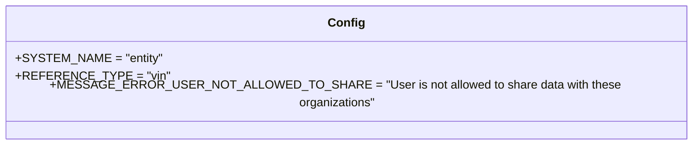
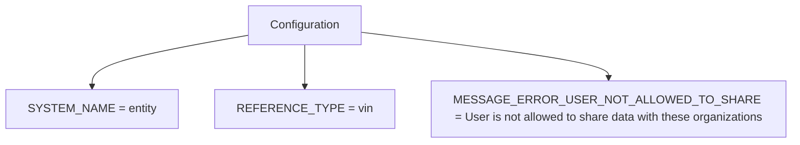

# Diagram: entity_core/entity_service/entity_service/entity/comment/constants.py

> Auto-generated by Obscura crawlers

## Diagram 1

### SVG

<svg id="container" width="881.8359375" xmlns="http://www.w3.org/2000/svg" class="classDiagram" height="184" viewBox="0 0 881.8359375 184" role="graphics-document document" aria-roledescription="class"><g><defs><marker id="container_class-aggregationStart" class="marker aggregation class" refX="18" refY="7" markerWidth="190" markerHeight="240" orient="auto"><path d="M 18,7 L9,13 L1,7 L9,1 Z"></path></marker></defs><defs><marker id="container_class-aggregationEnd" class="marker aggregation class" refX="1" refY="7" markerWidth="20" markerHeight="28" orient="auto"><path d="M 18,7 L9,13 L1,7 L9,1 Z"></path></marker></defs><defs><marker id="container_class-extensionStart" class="marker extension class" refX="18" refY="7" markerWidth="190" markerHeight="240" orient="auto"><path d="M 1,7 L18,13 V 1 Z"></path></marker></defs><defs><marker id="container_class-extensionEnd" class="marker extension class" refX="1" refY="7" markerWidth="20" markerHeight="28" orient="auto"><path d="M 1,1 V 13 L18,7 Z"></path></marker></defs><defs><marker id="container_class-compositionStart" class="marker composition class" refX="18" refY="7" markerWidth="190" markerHeight="240" orient="auto"><path d="M 18,7 L9,13 L1,7 L9,1 Z"></path></marker></defs><defs><marker id="container_class-compositionEnd" class="marker composition class" refX="1" refY="7" markerWidth="20" markerHeight="28" orient="auto"><path d="M 18,7 L9,13 L1,7 L9,1 Z"></path></marker></defs><defs><marker id="container_class-dependencyStart" class="marker dependency class" refX="6" refY="7" markerWidth="190" markerHeight="240" orient="auto"><path d="M 5,7 L9,13 L1,7 L9,1 Z"></path></marker></defs><defs><marker id="container_class-dependencyEnd" class="marker dependency class" refX="13" refY="7" markerWidth="20" markerHeight="28" orient="auto"><path d="M 18,7 L9,13 L14,7 L9,1 Z"></path></marker></defs><defs><marker id="container_class-lollipopStart" class="marker lollipop class" refX="13" refY="7" markerWidth="190" markerHeight="240" orient="auto"><circle stroke="black" fill="transparent" cx="7" cy="7" r="6"></circle></marker></defs><defs><marker id="container_class-lollipopEnd" class="marker lollipop class" refX="1" refY="7" markerWidth="190" markerHeight="240" orient="auto"><circle stroke="black" fill="transparent" cx="7" cy="7" r="6"></circle></marker></defs><g class="root"><g class="clusters"></g><g class="edgePaths"></g><g class="edgeLabels"></g><g class="nodes"><g class="node default" id="classId-Config-0" transform="translate(440.91796875, 92)"><g class="basic label-container"><path d="M-432.91796875 -84 L432.91796875 -84 L432.91796875 84 L-432.91796875 84" stroke="none" stroke-width="0" fill="#ECECFF" style=""></path><path d="M-432.91796875 -84 C-142.74083230934247 -84, 147.43630413131507 -84, 432.91796875 -84 M-432.91796875 -84 C-250.87483323235261 -84, -68.83169771470523 -84, 432.91796875 -84 M432.91796875 -84 C432.91796875 -33.21842592689564, 432.91796875 17.563148146208718, 432.91796875 84 M432.91796875 -84 C432.91796875 -30.326897500904153, 432.91796875 23.346204998191695, 432.91796875 84 M432.91796875 84 C114.70578626116964 84, -203.50639622766073 84, -432.91796875 84 M432.91796875 84 C144.06262895737922 84, -144.79271083524156 84, -432.91796875 84 M-432.91796875 84 C-432.91796875 39.66231963255649, -432.91796875 -4.675360734887022, -432.91796875 -84 M-432.91796875 84 C-432.91796875 46.75948577042465, -432.91796875 9.518971540849293, -432.91796875 -84" stroke="#9370DB" stroke-width="1.3" fill="none" stroke-dasharray="0 0" style=""></path></g><g class="annotation-group text" transform="translate(0, -60)"></g><g class="label-group text" transform="translate(-22.9296875, -60)"><g class="label" style="font-weight: bolder" transform="translate(0,-12)"><foreignObject width="45.859375" height="24">

Config

</foreignObject></g></g><g class="members-group text" transform="translate(-420.91796875, -12)"><g class="label" style="" transform="translate(0,-12)"><foreignObject width="182.34375" height="24">

+SYSTEM_NAME = "entity"

</foreignObject></g><g class="label" style="" transform="translate(0,12)"><foreignObject width="182.625" height="24">

+REFERENCE_TYPE = "vin"

</foreignObject></g><g class="label" style="" transform="translate(0,36)"><foreignObject width="818.90625" height="24">

+MESSAGE_ERROR_USER_NOT_ALLOWED_TO_SHARE = "User is not allowed to share data with these organizations"

</foreignObject></g></g><g class="methods-group text" transform="translate(-420.91796875, 84)"></g><g class="divider" style=""><path d="M-432.91796875 -36 C-153.70612466632247 -36, 125.50571941735507 -36, 432.91796875 -36 M-432.91796875 -36 C-223.0937351947294 -36, -13.269501639458781 -36, 432.91796875 -36" stroke="#9370DB" stroke-width="1.3" fill="none" stroke-dasharray="0 0" style=""></path></g><g class="divider" style=""><path d="M-432.91796875 60 C-112.06082986636261 60, 208.79630901727478 60, 432.91796875 60 M-432.91796875 60 C-169.30298107377303 60, 94.31200660245395 60, 432.91796875 60" stroke="#9370DB" stroke-width="1.3" fill="none" stroke-dasharray="0 0" style=""></path></g></g></g></g></g></svg>

## Diagram 2

### SVG

<svg id="container" width="985.609375" xmlns="http://www.w3.org/2000/svg" class="flowchart" height="222" viewBox="0 0 985.609375 222" role="graphics-document document" aria-roledescription="flowchart-v2"><g><marker id="container_flowchart-v2-pointEnd" class="marker flowchart-v2" viewBox="0 0 10 10" refX="5" refY="5" markerUnits="userSpaceOnUse" markerWidth="8" markerHeight="8" orient="auto"><path d="M 0 0 L 10 5 L 0 10 z" class="arrowMarkerPath" style="stroke-width: 1; stroke-dasharray: 1, 0;"></path></marker><marker id="container_flowchart-v2-pointStart" class="marker flowchart-v2" viewBox="0 0 10 10" refX="4.5" refY="5" markerUnits="userSpaceOnUse" markerWidth="8" markerHeight="8" orient="auto"><path d="M 0 5 L 10 10 L 10 0 z" class="arrowMarkerPath" style="stroke-width: 1; stroke-dasharray: 1, 0;"></path></marker><marker id="container_flowchart-v2-circleEnd" class="marker flowchart-v2" viewBox="0 0 10 10" refX="11" refY="5" markerUnits="userSpaceOnUse" markerWidth="11" markerHeight="11" orient="auto"><circle cx="5" cy="5" r="5" class="arrowMarkerPath" style="stroke-width: 1; stroke-dasharray: 1, 0;"></circle></marker><marker id="container_flowchart-v2-circleStart" class="marker flowchart-v2" viewBox="0 0 10 10" refX="-1" refY="5" markerUnits="userSpaceOnUse" markerWidth="11" markerHeight="11" orient="auto"><circle cx="5" cy="5" r="5" class="arrowMarkerPath" style="stroke-width: 1; stroke-dasharray: 1, 0;"></circle></marker><marker id="container_flowchart-v2-crossEnd" class="marker cross flowchart-v2" viewBox="0 0 11 11" refX="12" refY="5.2" markerUnits="userSpaceOnUse" markerWidth="11" markerHeight="11" orient="auto"><path d="M 1,1 l 9,9 M 10,1 l -9,9" class="arrowMarkerPath" style="stroke-width: 2; stroke-dasharray: 1, 0;"></path></marker><marker id="container_flowchart-v2-crossStart" class="marker cross flowchart-v2" viewBox="0 0 11 11" refX="-1" refY="5.2" markerUnits="userSpaceOnUse" markerWidth="11" markerHeight="11" orient="auto"><path d="M 1,1 l 9,9 M 10,1 l -9,9" class="arrowMarkerPath" style="stroke-width: 2; stroke-dasharray: 1, 0;"></path></marker><g class="root"><g class="clusters"></g><g class="edgePaths"><path d="M312.727,50.031L280.471,56.193C248.216,62.354,183.706,74.677,151.451,88.339C119.195,102,119.195,117,119.195,124.5L119.195,132" id="L_Config_SN_0" class="edge-thickness-normal edge-pattern-solid edge-thickness-normal edge-pattern-solid flowchart-link" style=";" data-edge="true" data-et="edge" data-id="L_Config_SN_0" data-points="W3sieCI6MzEyLjcyNjU2MjUsInkiOjUwLjAzMTExMDA5MDY4OTkzNn0seyJ4IjoxMTkuMTk1MzEyNSwieSI6ODd9LHsieCI6MTE5LjE5NTMxMjUsInkiOjEzNn1d" marker-end="url(#container_flowchart-v2-pointEnd)"></path><path d="M391.414,62L391.414,66.167C391.414,70.333,391.414,78.667,391.414,90.333C391.414,102,391.414,117,391.414,124.5L391.414,132" id="L_Config_RT_0" class="edge-thickness-normal edge-pattern-solid edge-thickness-normal edge-pattern-solid flowchart-link" style=";" data-edge="true" data-et="edge" data-id="L_Config_RT_0" data-points="W3sieCI6MzkxLjQxNDA2MjUsInkiOjYyfSx7IngiOjM5MS40MTQwNjI1LCJ5Ijo4N30seyJ4IjozOTEuNDE0MDYyNSwieSI6MTM2fV0=" marker-end="url(#container_flowchart-v2-pointEnd)"></path><path d="M470.102,45.952L519.255,52.793C568.409,59.635,666.716,73.317,715.87,83.659C765.023,94,765.023,101,765.023,104.5L765.023,108" id="L_Config_MSG_0" class="edge-thickness-normal edge-pattern-solid edge-thickness-normal edge-pattern-solid flowchart-link" style=";" data-edge="true" data-et="edge" data-id="L_Config_MSG_0" data-points="W3sieCI6NDcwLjEwMTU2MjUsInkiOjQ1Ljk1MTk0NjgwMjcyNjc4fSx7IngiOjc2NS4wMjM0Mzc1LCJ5Ijo4N30seyJ4Ijo3NjUuMDIzNDM3NSwieSI6MTEyfV0=" marker-end="url(#container_flowchart-v2-pointEnd)"></path></g><g class="edgeLabels"><g class="edgeLabel"><g class="label" data-id="L_Config_SN_0" transform="translate(0, 0)"><foreignObject width="0" height="0">

</foreignObject></g></g><g class="edgeLabel"><g class="label" data-id="L_Config_RT_0" transform="translate(0, 0)"><foreignObject width="0" height="0">

</foreignObject></g></g><g class="edgeLabel"><g class="label" data-id="L_Config_MSG_0" transform="translate(0, 0)"><foreignObject width="0" height="0">

</foreignObject></g></g></g><g class="nodes"><g class="node default" id="flowchart-Config-0" transform="translate(391.4140625, 35)"><rect class="basic label-container" style="" x="-78.6875" y="-27" width="157.375" height="54"></rect><g class="label" style="" transform="translate(-48.6875, -12)"><rect></rect><foreignObject width="97.375" height="24">

Configuration

</foreignObject></g></g><g class="node default" id="flowchart-SN-1" transform="translate(119.1953125, 163)"><rect class="basic label-container" style="" x="-111.1953125" y="-27" width="222.390625" height="54"></rect><g class="label" style="" transform="translate(-81.1953125, -12)"><rect></rect><foreignObject width="162.390625" height="24">

SYSTEM_NAME = entity

</foreignObject></g></g><g class="node default" id="flowchart-RT-3" transform="translate(391.4140625, 163)"><rect class="basic label-container" style="" x="-111.0234375" y="-27" width="222.046875" height="54"></rect><g class="label" style="" transform="translate(-81.0234375, -12)"><rect></rect><foreignObject width="162.046875" height="24">

REFERENCE_TYPE = vin

</foreignObject></g></g><g class="node default" id="flowchart-MSG-5" transform="translate(765.0234375, 163)"><rect class="basic label-container" style="" x="-212.5859375" y="-51" width="425.171875" height="102"></rect><g class="label" style="" transform="translate(-182.5859375, -36)"><rect></rect><foreignObject width="365.171875" height="72">

MESSAGE_ERROR_USER_NOT_ALLOWED_TO_SHARE = User is not allowed to share data with these organizations

</foreignObject></g></g></g></g></g></svg>
