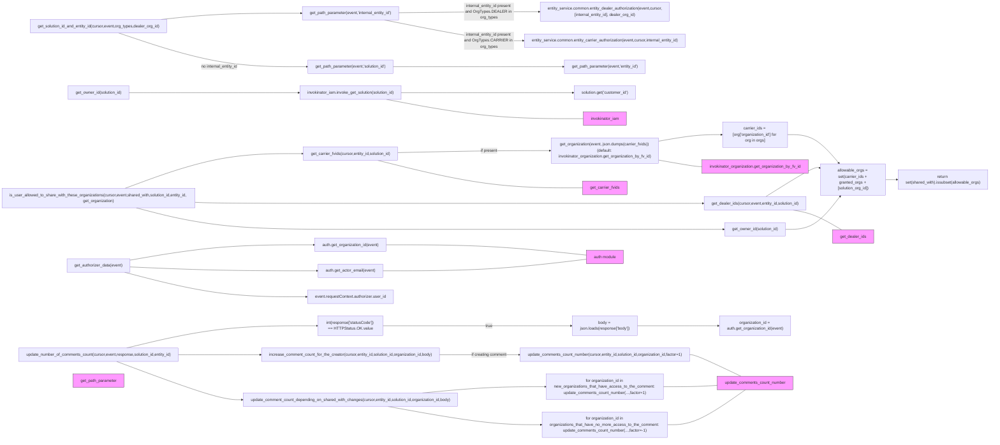

# Diagram: entity_core/entity_service/entity_service/entity/comment/utils.py

> Auto-generated by Obscura crawlers

## Mermaid

### SVG

<svg id="container" width="4032.734375" xmlns="http://www.w3.org/2000/svg" class="flowchart" height="1759" viewBox="0 0 4032.734375 1759" role="graphics-document document" aria-roledescription="flowchart-v2"><g><marker id="container_flowchart-v2-pointEnd" class="marker flowchart-v2" viewBox="0 0 10 10" refX="5" refY="5" markerUnits="userSpaceOnUse" markerWidth="8" markerHeight="8" orient="auto"><path d="M 0 0 L 10 5 L 0 10 z" class="arrowMarkerPath" style="stroke-width: 1; stroke-dasharray: 1, 0;"></path></marker><marker id="container_flowchart-v2-pointStart" class="marker flowchart-v2" viewBox="0 0 10 10" refX="4.5" refY="5" markerUnits="userSpaceOnUse" markerWidth="8" markerHeight="8" orient="auto"><path d="M 0 5 L 10 10 L 10 0 z" class="arrowMarkerPath" style="stroke-width: 1; stroke-dasharray: 1, 0;"></path></marker><marker id="container_flowchart-v2-circleEnd" class="marker flowchart-v2" viewBox="0 0 10 10" refX="11" refY="5" markerUnits="userSpaceOnUse" markerWidth="11" markerHeight="11" orient="auto"><circle cx="5" cy="5" r="5" class="arrowMarkerPath" style="stroke-width: 1; stroke-dasharray: 1, 0;"></circle></marker><marker id="container_flowchart-v2-circleStart" class="marker flowchart-v2" viewBox="0 0 10 10" refX="-1" refY="5" markerUnits="userSpaceOnUse" markerWidth="11" markerHeight="11" orient="auto"><circle cx="5" cy="5" r="5" class="arrowMarkerPath" style="stroke-width: 1; stroke-dasharray: 1, 0;"></circle></marker><marker id="container_flowchart-v2-crossEnd" class="marker cross flowchart-v2" viewBox="0 0 11 11" refX="12" refY="5.2" markerUnits="userSpaceOnUse" markerWidth="11" markerHeight="11" orient="auto"><path d="M 1,1 l 9,9 M 10,1 l -9,9" class="arrowMarkerPath" style="stroke-width: 2; stroke-dasharray: 1, 0;"></path></marker><marker id="container_flowchart-v2-crossStart" class="marker cross flowchart-v2" viewBox="0 0 11 11" refX="-1" refY="5.2" markerUnits="userSpaceOnUse" markerWidth="11" markerHeight="11" orient="auto"><path d="M 1,1 l 9,9 M 10,1 l -9,9" class="arrowMarkerPath" style="stroke-width: 2; stroke-dasharray: 1, 0;"></path></marker><g class="root"><g class="clusters"></g><g class="edgePaths"><path d="M528.953,1041.528L589.991,1031.273C651.029,1021.019,773.104,1000.509,899.216,990.255C1025.328,980,1155.477,980,1220.551,980L1285.625,980" id="L_get_authorizer_data_auth_get_org_0" class="edge-thickness-normal edge-pattern-solid edge-thickness-normal edge-pattern-solid flowchart-link" style=";" data-edge="true" data-et="edge" data-id="L_get_authorizer_data_auth_get_org_0" data-points="W3sieCI6NTI4Ljk1MzEyNSwieSI6MTA0MS41MjgxMDEwODE2NjIzfSx7IngiOjg5NS4xNzk2ODc1LCJ5Ijo5ODB9LHsieCI6MTI4OS42MjUsInkiOjk4MH1d" marker-end="url(#container_flowchart-v2-pointEnd)"></path><path d="M528.953,1068.433L589.991,1071.027C651.029,1073.622,773.104,1078.811,901.574,1081.405C1030.044,1084,1164.909,1084,1232.341,1084L1299.773,1084" id="L_get_authorizer_data_auth_get_email_0" class="edge-thickness-normal edge-pattern-solid edge-thickness-normal edge-pattern-solid flowchart-link" style=";" data-edge="true" data-et="edge" data-id="L_get_authorizer_data_auth_get_email_0" data-points="W3sieCI6NTI4Ljk1MzEyNSwieSI6MTA2OC40MzI2NDkxMjM5MTY3fSx7IngiOjg5NS4xNzk2ODc1LCJ5IjoxMDg0fSx7IngiOjEzMDMuNzczNDM3NSwieSI6MTA4NH1d" marker-end="url(#container_flowchart-v2-pointEnd)"></path><path d="M507.859,1090L572.413,1106.333C636.966,1122.667,766.073,1155.333,890.891,1171.667C1015.708,1188,1136.237,1188,1196.501,1188L1256.766,1188" id="L_get_authorizer_data_user_id_0" class="edge-thickness-normal edge-pattern-solid edge-thickness-normal edge-pattern-solid flowchart-link" style=";" data-edge="true" data-et="edge" data-id="L_get_authorizer_data_user_id_0" data-points="W3sieCI6NTA3Ljg1OTE4NzUsInkiOjEwOTB9LHsieCI6ODk1LjE3OTY4NzUsInkiOjExODh9LHsieCI6MTI2MC43NjU2MjUsInkiOjExODh9XQ==" marker-end="url(#container_flowchart-v2-pointEnd)"></path><path d="M657.665,78L697.251,73.833C736.836,69.667,816.008,61.333,911.87,57.167C1007.732,53,1120.284,53,1176.56,53L1232.836,53" id="L_get_solution_id_and_entity_id_p_internal_0" class="edge-thickness-normal edge-pattern-solid edge-thickness-normal edge-pattern-solid flowchart-link" style=";" data-edge="true" data-et="edge" data-id="L_get_solution_id_and_entity_id_p_internal_0" data-points="W3sieCI6NjU3LjY2NDY2MzQ2MTUzODUsInkiOjc4fSx7IngiOjg5NS4xNzk2ODc1LCJ5Ijo1M30seyJ4IjoxMjM2LjgzNTkzNzUsInkiOjUzfV0=" marker-end="url(#container_flowchart-v2-pointEnd)"></path><path d="M1633.289,50.891L1694.251,50.243C1755.214,49.594,1877.138,48.297,1972.082,47.649C2067.026,47,2134.99,47,2168.971,47L2202.953,47" id="L_p_internal_dealer_auth_0" class="edge-thickness-normal edge-pattern-solid edge-thickness-normal edge-pattern-solid flowchart-link" style=";" data-edge="true" data-et="edge" data-id="L_p_internal_dealer_auth_0" data-points="W3sieCI6MTYzMy4yODkwNjI1LCJ5Ijo1MC44OTEyMDY3ODE5MTQ4OTZ9LHsieCI6MTk5OS4wNjI1LCJ5Ijo0N30seyJ4IjoyMjA2Ljk1MzEyNSwieSI6NDd9XQ==" marker-end="url(#container_flowchart-v2-pointEnd)"></path><path d="M1573.499,80L1644.426,93.833C1715.353,107.667,1857.208,135.333,1950.803,149.167C2044.398,163,2089.734,163,2112.402,163L2135.07,163" id="L_p_internal_carrier_auth_0" class="edge-thickness-normal edge-pattern-solid edge-thickness-normal edge-pattern-solid flowchart-link" style=";" data-edge="true" data-et="edge" data-id="L_p_internal_carrier_auth_0" data-points="W3sieCI6MTU3My40OTg4NjM2MzYzNjM3LCJ5Ijo4MH0seyJ4IjoxOTk5LjA2MjUsInkiOjE2M30seyJ4IjoyMTM5LjA3MDMxMjUsInkiOjE2M31d" marker-end="url(#container_flowchart-v2-pointEnd)"></path><path d="M483.487,132L552.102,154.5C620.718,177,757.949,222,886.735,244.5C1015.521,267,1135.862,267,1196.033,267L1256.203,267" id="L_get_solution_id_and_entity_id_p_solution_0" class="edge-thickness-normal edge-pattern-solid edge-thickness-normal edge-pattern-solid flowchart-link" style=";" data-edge="true" data-et="edge" data-id="L_get_solution_id_and_entity_id_p_solution_0" data-points="W3sieCI6NDgzLjQ4Njk3OTE2NjY2NjcsInkiOjEzMn0seyJ4Ijo4OTUuMTc5Njg3NSwieSI6MjY3fSx7IngiOjEyNjAuMjAzMTI1LCJ5IjoyNjd9XQ==" marker-end="url(#container_flowchart-v2-pointEnd)"></path><path d="M1609.922,267L1674.779,267C1739.635,267,1869.349,267,1984.59,267C2099.831,267,2200.599,267,2250.983,267L2301.367,267" id="L_p_solution_p_entity_0" class="edge-thickness-normal edge-pattern-solid edge-thickness-normal edge-pattern-solid flowchart-link" style=";" data-edge="true" data-et="edge" data-id="L_p_solution_p_entity_0" data-points="W3sieCI6MTYwOS45MjE4NzUsInkiOjI2N30seyJ4IjoxOTk5LjA2MjUsInkiOjI2N30seyJ4IjoyMzA1LjM2NzE4NzUsInkiOjI2N31d" marker-end="url(#container_flowchart-v2-pointEnd)"></path><path d="M525.836,371L587.393,371C648.951,371,772.065,371,887.96,371C1003.854,371,1112.529,371,1166.866,371L1221.203,371" id="L_get_owner_id_invoke_solution_0" class="edge-thickness-normal edge-pattern-solid edge-thickness-normal edge-pattern-solid flowchart-link" style=";" data-edge="true" data-et="edge" data-id="L_get_owner_id_invoke_solution_0" data-points="W3sieCI6NTI1LjgzNTkzNzUsInkiOjM3MX0seyJ4Ijo4OTUuMTc5Njg3NSwieSI6MzcxfSx7IngiOjEyMjUuMjAzMTI1LCJ5IjozNzF9XQ==" marker-end="url(#container_flowchart-v2-pointEnd)"></path><path d="M1644.922,371L1703.945,371C1762.969,371,1881.016,371,1997.023,371C2113.031,371,2227,371,2283.984,371L2340.969,371" id="L_invoke_solution_solution_customer_0" class="edge-thickness-normal edge-pattern-solid edge-thickness-normal edge-pattern-solid flowchart-link" style=";" data-edge="true" data-et="edge" data-id="L_invoke_solution_solution_customer_0" data-points="W3sieCI6MTY0NC45MjE4NzUsInkiOjM3MX0seyJ4IjoxOTk5LjA2MjUsInkiOjM3MX0seyJ4IjoyMzQ0Ljk2ODc1LCJ5IjozNzF9XQ==" marker-end="url(#container_flowchart-v2-pointEnd)"></path><path d="M509.391,754L573.689,730.833C637.987,707.667,766.584,661.333,887.819,638.167C1009.055,615,1122.93,615,1179.867,615L1236.805,615" id="L_is_user_allowed_to_share_with_these_organizations_carrier_fvids_0" class="edge-thickness-normal edge-pattern-solid edge-thickness-normal edge-pattern-solid flowchart-link" style=";" data-edge="true" data-et="edge" data-id="L_is_user_allowed_to_share_with_these_organizations_carrier_fvids_0" data-points="W3sieCI6NTA5LjM5MTIzOTQ2NjI5MjEsInkiOjc1NH0seyJ4Ijo4OTUuMTc5Njg3NSwieSI6NjE1fSx7IngiOjEyNDAuODA0Njg3NSwieSI6NjE1fV0=" marker-end="url(#container_flowchart-v2-pointEnd)"></path><path d="M1629.32,610.867L1690.944,609.556C1752.568,608.245,1875.815,605.622,1978.944,604.311C2082.073,603,2165.083,603,2206.589,603L2248.094,603" id="L_carrier_fvids_get_orgs_0" class="edge-thickness-normal edge-pattern-solid edge-thickness-normal edge-pattern-solid flowchart-link" style=";" data-edge="true" data-et="edge" data-id="L_carrier_fvids_get_orgs_0" data-points="W3sieCI6MTYyOS4zMjAzMTI1LCJ5Ijo2MTAuODY2ODU1MDUzMTkxNH0seyJ4IjoxOTk5LjA2MjUsInkiOjYwM30seyJ4IjoyMjUyLjA5Mzc1LCJ5Ijo2MDN9XQ==" marker-end="url(#container_flowchart-v2-pointEnd)"></path><path d="M2690.016,565.329L2715.521,560.94C2741.026,556.552,2792.036,547.776,2835.438,543.388C2878.839,539,2914.63,539,2932.526,539L2950.422,539" id="L_get_orgs_carrier_ids_0" class="edge-thickness-normal edge-pattern-solid edge-thickness-normal edge-pattern-solid flowchart-link" style=";" data-edge="true" data-et="edge" data-id="L_get_orgs_carrier_ids_0" data-points="W3sieCI6MjY5MC4wMTU2MjUsInkiOjU2NS4zMjg1MDk5MjMzNDM1fSx7IngiOjI4NDMuMDQ2ODc1LCJ5Ijo1Mzl9LHsieCI6Mjk1NC40MjE4NzUsInkiOjUzOX1d" marker-end="url(#container_flowchart-v2-pointEnd)"></path><path d="M794.297,809.712L811.111,810.426C827.924,811.141,861.552,812.571,968.346,813.285C1075.141,814,1255.102,814,1439.082,814C1623.063,814,1811.063,814,1983.728,814C2156.393,814,2313.724,814,2454.388,814C2595.052,814,2719.049,814,2785.785,814C2852.521,814,2861.995,814,2866.732,814L2871.469,814" id="L_is_user_allowed_to_share_with_these_organizations_dealer_ids_0" class="edge-thickness-normal edge-pattern-solid edge-thickness-normal edge-pattern-solid flowchart-link" style=";" data-edge="true" data-et="edge" data-id="L_is_user_allowed_to_share_with_these_organizations_dealer_ids_0" data-points="W3sieCI6Nzk0LjI5Njg3NSwieSI6ODA5LjcxMTczMDY1OTc1MDd9LHsieCI6ODk1LjE3OTY4NzUsInkiOjgxNH0seyJ4IjoxNDM1LjA2MjUsInkiOjgxNH0seyJ4IjoxOTk5LjA2MjUsInkiOjgxNH0seyJ4IjoyNDcxLjA1NDY4NzUsInkiOjgxNH0seyJ4IjoyODQzLjA0Njg3NSwieSI6ODE0fSx7IngiOjI4NzUuNDY4NzUsInkiOjgxNH1d" marker-end="url(#container_flowchart-v2-pointEnd)"></path><path d="M555.286,832L611.935,846.333C668.584,860.667,781.882,889.333,928.511,903.667C1075.141,918,1255.102,918,1439.082,918C1623.063,918,1811.063,918,1983.728,918C2156.393,918,2313.724,918,2454.388,918C2595.052,918,2719.049,918,2799.829,918C2880.609,918,2918.172,918,2936.953,918L2955.734,918" id="L_is_user_allowed_to_share_with_these_organizations_owner_org_0" class="edge-thickness-normal edge-pattern-solid edge-thickness-normal edge-pattern-solid flowchart-link" style=";" data-edge="true" data-et="edge" data-id="L_is_user_allowed_to_share_with_these_organizations_owner_org_0" data-points="W3sieCI6NTU1LjI4NjE4NzUsInkiOjgzMn0seyJ4Ijo4OTUuMTc5Njg3NSwieSI6OTE4fSx7IngiOjE0MzUuMDYyNSwieSI6OTE4fSx7IngiOjE5OTkuMDYyNSwieSI6OTE4fSx7IngiOjI0NzEuMDU0Njg3NSwieSI6OTE4fSx7IngiOjI4NDMuMDQ2ODc1LCJ5Ijo5MTh9LHsieCI6Mjk1OS43MzQzNzUsInkiOjkxOH1d" marker-end="url(#container_flowchart-v2-pointEnd)"></path><path d="M3214.422,539L3232.984,539C3251.547,539,3288.672,539,3323.591,557.995C3358.51,576.99,3391.223,614.979,3407.58,633.974L3423.937,652.969" id="L_carrier_ids_allowable_0" class="edge-thickness-normal edge-pattern-solid edge-thickness-normal edge-pattern-solid flowchart-link" style=";" data-edge="true" data-et="edge" data-id="L_carrier_ids_allowable_0" data-points="W3sieCI6MzIxNC40MjE4NzUsInkiOjUzOX0seyJ4IjozMzI1Ljc5Njg3NSwieSI6NTM5fSx7IngiOjM0MjYuNTQ2ODc1LCJ5Ijo2NTZ9XQ==" marker-end="url(#container_flowchart-v2-pointEnd)"></path><path d="M3128.161,787L3161.1,766.667C3194.04,746.333,3259.918,705.667,3296.395,686.566C3332.871,667.465,3339.945,669.929,3343.482,671.161L3347.02,672.394" id="L_dealer_ids_allowable_0" class="edge-thickness-normal edge-pattern-solid edge-thickness-normal edge-pattern-solid flowchart-link" style=";" data-edge="true" data-et="edge" data-id="L_dealer_ids_allowable_0" data-points="W3sieCI6MzEyOC4xNjA5Njg5NTk3MzE3LCJ5Ijo3ODd9LHsieCI6MzMyNS43OTY4NzUsInkiOjY2NX0seyJ4IjozMzUwLjc5Njg3NSwieSI6NjczLjcwOTY3NzQxOTM1NDl9XQ==" marker-end="url(#container_flowchart-v2-pointEnd)"></path><path d="M3209.109,918L3228.557,918C3248.005,918,3286.901,918,3323.594,895.859C3360.287,873.719,3394.778,829.437,3412.023,807.296L3429.269,785.156" id="L_owner_org_allowable_0" class="edge-thickness-normal edge-pattern-solid edge-thickness-normal edge-pattern-solid flowchart-link" style=";" data-edge="true" data-et="edge" data-id="L_owner_org_allowable_0" data-points="W3sieCI6MzIwOS4xMDkzNzUsInkiOjkxOH0seyJ4IjozMzI1Ljc5Njg3NSwieSI6OTE4fSx7IngiOjM0MzEuNzI2NTIzMjQxMjA2LCJ5Ijo3ODJ9XQ==" marker-end="url(#container_flowchart-v2-pointEnd)"></path><path d="M3610.797,719L3614.964,719C3619.13,719,3627.464,719,3635.13,719C3642.797,719,3649.797,719,3653.297,719L3656.797,719" id="L_allowable_check_subset_0" class="edge-thickness-normal edge-pattern-solid edge-thickness-normal edge-pattern-solid flowchart-link" style=";" data-edge="true" data-et="edge" data-id="L_allowable_check_subset_0" data-points="W3sieCI6MzYxMC43OTY4NzUsInkiOjcxOX0seyJ4IjozNjM1Ljc5Njg3NSwieSI6NzE5fSx7IngiOjM2NjAuNzk2ODc1LCJ5Ijo3MTl9XQ==" marker-end="url(#container_flowchart-v2-pointEnd)"></path><path d="M516.138,1393L579.312,1378.167C642.486,1363.333,768.833,1333.667,899.653,1318.833C1030.474,1304,1165.768,1304,1233.415,1304L1301.063,1304" id="L_update_number_of_comments_count_status_check_0" class="edge-thickness-normal edge-pattern-solid edge-thickness-normal edge-pattern-solid flowchart-link" style=";" data-edge="true" data-et="edge" data-id="L_update_number_of_comments_count_status_check_0" data-points="W3sieCI6NTE2LjEzODQ2OTgyNzU4NjIsInkiOjEzOTN9LHsieCI6ODk1LjE3OTY4NzUsInkiOjEzMDR9LHsieCI6MTMwNS4wNjI1LCJ5IjoxMzA0fV0=" marker-end="url(#container_flowchart-v2-pointEnd)"></path><path d="M1565.063,1304L1637.396,1304C1709.729,1304,1854.396,1304,1982.674,1304C2110.953,1304,2222.844,1304,2278.789,1304L2334.734,1304" id="L_status_check_parse_body_0" class="edge-thickness-normal edge-pattern-solid edge-thickness-normal edge-pattern-solid flowchart-link" style=";" data-edge="true" data-et="edge" data-id="L_status_check_parse_body_0" data-points="W3sieCI6MTU2NS4wNjI1LCJ5IjoxMzA0fSx7IngiOjE5OTkuMDYyNSwieSI6MTMwNH0seyJ4IjoyMzM4LjczNDM3NSwieSI6MTMwNH1d" marker-end="url(#container_flowchart-v2-pointEnd)"></path><path d="M2603.375,1304L2643.32,1304C2683.266,1304,2763.156,1304,2818.424,1304C2873.693,1304,2904.339,1304,2919.661,1304L2934.984,1304" id="L_parse_body_org_id_from_auth_0" class="edge-thickness-normal edge-pattern-solid edge-thickness-normal edge-pattern-solid flowchart-link" style=";" data-edge="true" data-et="edge" data-id="L_parse_body_org_id_from_auth_0" data-points="W3sieCI6MjYwMy4zNzUsInkiOjEzMDR9LHsieCI6Mjg0My4wNDY4NzUsInkiOjEzMDR9LHsieCI6MjkzOC45ODQzNzUsInkiOjEzMDR9XQ==" marker-end="url(#container_flowchart-v2-pointEnd)"></path><path d="M727.102,1420L755.115,1420C783.128,1420,839.154,1420,895.728,1420C952.302,1420,1009.424,1420,1037.986,1420L1066.547,1420" id="L_update_number_of_comments_count_inc_creator_0" class="edge-thickness-normal edge-pattern-solid edge-thickness-normal edge-pattern-solid flowchart-link" style=";" data-edge="true" data-et="edge" data-id="L_update_number_of_comments_count_inc_creator_0" data-points="W3sieCI6NzI3LjEwMTU2MjUsInkiOjE0MjB9LHsieCI6ODk1LjE3OTY4NzUsInkiOjE0MjB9LHsieCI6MTA3MC41NDY4NzUsInkiOjE0MjB9XQ==" marker-end="url(#container_flowchart-v2-pointEnd)"></path><path d="M1799.578,1420L1832.826,1420C1866.073,1420,1932.568,1420,1985.982,1420C2039.396,1420,2079.729,1420,2099.896,1420L2120.063,1420" id="L_inc_creator_update_comments_inc_0" class="edge-thickness-normal edge-pattern-solid edge-thickness-normal edge-pattern-solid flowchart-link" style=";" data-edge="true" data-et="edge" data-id="L_inc_creator_update_comments_inc_0" data-points="W3sieCI6MTc5OS41NzgxMjUsInkiOjE0MjB9LHsieCI6MTk5OS4wNjI1LCJ5IjoxNDIwfSx7IngiOjIxMjQuMDYyNSwieSI6MTQyMH1d" marker-end="url(#container_flowchart-v2-pointEnd)"></path><path d="M475.253,1447L545.241,1472.5C615.229,1498,755.204,1549,841.339,1574.5C927.474,1600,959.768,1600,975.915,1600L992.063,1600" id="L_update_number_of_comments_count_upd_shared_0" class="edge-thickness-normal edge-pattern-solid edge-thickness-normal edge-pattern-solid flowchart-link" style=";" data-edge="true" data-et="edge" data-id="L_update_number_of_comments_count_upd_shared_0" data-points="W3sieCI6NDc1LjI1MzEyNSwieSI6MTQ0N30seyJ4Ijo4OTUuMTc5Njg3NSwieSI6MTYwMH0seyJ4Ijo5OTYuMDYyNSwieSI6MTYwMH1d" marker-end="url(#container_flowchart-v2-pointEnd)"></path><path d="M1727.909,1573L1773.101,1568.833C1818.293,1564.667,1908.678,1556.333,1992.909,1552.167C2077.141,1548,2155.219,1548,2194.258,1548L2233.297,1548" id="L_upd_shared_new_orgs_0" class="edge-thickness-normal edge-pattern-solid edge-thickness-normal edge-pattern-solid flowchart-link" style=";" data-edge="true" data-et="edge" data-id="L_upd_shared_new_orgs_0" data-points="W3sieCI6MTcyNy45MDg2NTM4NDYxNTM4LCJ5IjoxNTczfSx7IngiOjE5OTkuMDYyNSwieSI6MTU0OH0seyJ4IjoyMjM3LjI5Njg3NSwieSI6MTU0OH1d" marker-end="url(#container_flowchart-v2-pointEnd)"></path><path d="M1587.343,1627L1655.962,1639.167C1724.582,1651.333,1861.823,1675.667,1966.57,1687.833C2071.318,1700,2143.573,1700,2179.701,1700L2215.828,1700" id="L_upd_shared_removed_orgs_0" class="edge-thickness-normal edge-pattern-solid edge-thickness-normal edge-pattern-solid flowchart-link" style=";" data-edge="true" data-et="edge" data-id="L_upd_shared_removed_orgs_0" data-points="W3sieCI6MTU4Ny4zNDI1LCJ5IjoxNjI3fSx7IngiOjE5OTkuMDYyNSwieSI6MTcwMH0seyJ4IjoyMjE5LjgyODEyNSwieSI6MTcwMH1d" marker-end="url(#container_flowchart-v2-pointEnd)"></path><path d="M1580.5,980L1650.26,980C1720.021,980,1859.542,980,1995.243,986.846C2130.945,993.691,2262.828,1007.383,2328.77,1014.229L2394.711,1021.074" id="L_auth_get_org_auth_0" class="edge-thickness-normal edge-pattern-solid edge-thickness-normal edge-pattern-solid flowchart-link" style=";" data-edge="true" data-et="edge" data-id="L_auth_get_org_auth_0" data-points="W3sieCI6MTU4MC41LCJ5Ijo5ODB9LHsieCI6MTk5OS4wNjI1LCJ5Ijo5ODB9LHsieCI6MjM5NC43MTA5Mzc1LCJ5IjoxMDIxLjA3NDM1MjM5NTkyODF9XQ=="></path><path d="M1566.352,1084L1638.47,1084C1710.589,1084,1854.826,1084,1992.885,1076.316C2130.945,1068.632,2262.828,1053.264,2328.77,1045.58L2394.711,1037.896" id="L_auth_get_email_auth_0" class="edge-thickness-normal edge-pattern-solid edge-thickness-normal edge-pattern-solid flowchart-link" style=";" data-edge="true" data-et="edge" data-id="L_auth_get_email_auth_0" data-points="W3sieCI6MTU2Ni4zNTE1NjI1LCJ5IjoxMDg0fSx7IngiOjE5OTkuMDYyNSwieSI6MTA4NH0seyJ4IjoyMzk0LjcxMDkzNzUsInkiOjEwMzcuODk2MTM1MDY1Nzk0OX1d"></path><path d="M1581.486,398L1651.082,410.833C1720.678,423.667,1859.87,449.333,1993.403,462.167C2126.935,475,2254.807,475,2318.743,475L2382.68,475" id="L_invoke_solution_invokinator_iam_0" class="edge-thickness-normal edge-pattern-solid edge-thickness-normal edge-pattern-solid flowchart-link" style=";" data-edge="true" data-et="edge" data-id="L_invoke_solution_invokinator_iam_0" data-points="W3sieCI6MTU4MS40ODU1NzY5MjMwNzcsInkiOjM5OH0seyJ4IjoxOTk5LjA2MjUsInkiOjQ3NX0seyJ4IjoyMzgyLjY3OTY4NzUsInkiOjQ3NX1d"></path><path d="M2690.016,640.671L2715.521,645.06C2741.026,649.448,2792.036,658.224,2821.708,662.612C2851.38,667,2859.714,667,2863.88,667L2868.047,667" id="L_get_orgs_invokinator_organization_0" class="edge-thickness-normal edge-pattern-solid edge-thickness-normal edge-pattern-solid flowchart-link" style=";" data-edge="true" data-et="edge" data-id="L_get_orgs_invokinator_organization_0" data-points="W3sieCI6MjY5MC4wMTU2MjUsInkiOjY0MC42NzE0OTAwNzY2NTY1fSx7IngiOjI4NDMuMDQ2ODc1LCJ5Ijo2Njd9LHsieCI6Mjg2OC4wNDY4NzUsInkiOjY2N31d"></path><path d="M1546.216,642L1621.69,660.333C1697.165,678.667,1848.114,715.333,1987.251,733.667C2126.388,752,2253.714,752,2317.376,752L2381.039,752" id="L_carrier_fvids_get_carrier_fvids_0" class="edge-thickness-normal edge-pattern-solid edge-thickness-normal edge-pattern-solid flowchart-link" style=";" data-edge="true" data-et="edge" data-id="L_carrier_fvids_get_carrier_fvids_0" data-points="W3sieCI6MTU0Ni4yMTU3ODQ2NzE1MzMsInkiOjY0Mn0seyJ4IjoxOTk5LjA2MjUsInkiOjc1Mn0seyJ4IjoyMzgxLjAzOTA2MjUsInkiOjc1Mn1d"></path><path d="M3239.592,841L3253.959,843.5C3268.327,846,3297.062,851,3329.598,864.167C3362.134,877.333,3398.471,898.667,3416.639,909.333L3434.808,920" id="L_dealer_ids_get_dealer_ids_0" class="edge-thickness-normal edge-pattern-solid edge-thickness-normal edge-pattern-solid flowchart-link" style=";" data-edge="true" data-et="edge" data-id="L_dealer_ids_get_dealer_ids_0" data-points="W3sieCI6MzIzOS41OTE1MTc4NTcxNDI3LCJ5Ijo4NDF9LHsieCI6MzMyNS43OTY4NzUsInkiOjg1Nn0seyJ4IjozNDM0LjgwNzg2NDAxMDk4OSwieSI6OTIwfV0="></path><path d="M2818.047,1420L2822.214,1420C2826.38,1420,2834.714,1420,2869.497,1434.333C2904.281,1448.667,2965.514,1477.333,2996.131,1491.667L3026.748,1506" id="L_update_comments_inc_update_comments_count_number_0" class="edge-thickness-normal edge-pattern-solid edge-thickness-normal edge-pattern-solid flowchart-link" style=";" data-edge="true" data-et="edge" data-id="L_update_comments_inc_update_comments_count_number_0" data-points="W3sieCI6MjgxOC4wNDY4NzUsInkiOjE0MjB9LHsieCI6Mjg0My4wNDY4NzUsInkiOjE0MjB9LHsieCI6MzAyNi43NDgyMDI0MzM2MjgsInkiOjE1MDZ9XQ=="></path><path d="M2704.813,1548L2727.852,1548C2750.891,1548,2796.969,1548,2834.536,1547.097C2872.104,1546.194,2901.161,1544.389,2915.69,1543.486L2930.219,1542.583" id="L_new_orgs_update_comments_count_number_0" class="edge-thickness-normal edge-pattern-solid edge-thickness-normal edge-pattern-solid flowchart-link" style=";" data-edge="true" data-et="edge" data-id="L_new_orgs_update_comments_count_number_0" data-points="W3sieCI6MjcwNC44MTI1LCJ5IjoxNTQ4fSx7IngiOjI4NDMuMDQ2ODc1LCJ5IjoxNTQ4fSx7IngiOjI5MzAuMjE4NzUsInkiOjE1NDIuNTgyNzkzODg5MTc2Nn1d"></path><path d="M2722.281,1700L2742.409,1700C2762.536,1700,2802.792,1700,2856.644,1676.667C2910.497,1653.333,2977.947,1606.667,3011.672,1583.333L3045.397,1560" id="L_removed_orgs_update_comments_count_number_0" class="edge-thickness-normal edge-pattern-solid edge-thickness-normal edge-pattern-solid flowchart-link" style=";" data-edge="true" data-et="edge" data-id="L_removed_orgs_update_comments_count_number_0" data-points="W3sieCI6MjcyMi4yODEyNSwieSI6MTcwMH0seyJ4IjoyODQzLjA0Njg3NSwieSI6MTcwMH0seyJ4IjozMDQ1LjM5NzE3NDQwMTE5NzQsInkiOjE1NjB9XQ=="></path></g><g class="edgeLabels"><g class="edgeLabel"><g class="label" data-id="L_get_authorizer_data_auth_get_org_0" transform="translate(0, 0)"><foreignObject width="0" height="0">

</foreignObject></g></g><g class="edgeLabel"><g class="label" data-id="L_get_authorizer_data_auth_get_email_0" transform="translate(0, 0)"><foreignObject width="0" height="0">

</foreignObject></g></g><g class="edgeLabel"><g class="label" data-id="L_get_authorizer_data_user_id_0" transform="translate(0, 0)"><foreignObject width="0" height="0">

</foreignObject></g></g><g class="edgeLabel"><g class="label" data-id="L_get_solution_id_and_entity_id_p_internal_0" transform="translate(0, 0)"><foreignObject width="0" height="0">

</foreignObject></g></g><g class="edgeLabel" transform="translate(1999.0625, 47)"><g class="label" data-id="L_p_internal_dealer_auth_0" transform="translate(-100, -36)"><foreignObject width="200" height="72">

internal_entity_id present and OrgTypes.DEALER in org_types

</foreignObject></g></g><g class="edgeLabel" transform="translate(1999.0625, 163)"><g class="label" data-id="L_p_internal_carrier_auth_0" transform="translate(-100, -36)"><foreignObject width="200" height="72">

internal_entity_id present and OrgTypes.CARRIER in org_types

</foreignObject></g></g><g class="edgeLabel" transform="translate(895.1796875, 267)"><g class="label" data-id="L_get_solution_id_and_entity_id_p_solution_0" transform="translate(-75.8828125, -12)"><foreignObject width="151.765625" height="24">

no internal_entity_id

</foreignObject></g></g><g class="edgeLabel"><g class="label" data-id="L_p_solution_p_entity_0" transform="translate(0, 0)"><foreignObject width="0" height="0">

</foreignObject></g></g><g class="edgeLabel"><g class="label" data-id="L_get_owner_id_invoke_solution_0" transform="translate(0, 0)"><foreignObject width="0" height="0">

</foreignObject></g></g><g class="edgeLabel"><g class="label" data-id="L_invoke_solution_solution_customer_0" transform="translate(0, 0)"><foreignObject width="0" height="0">

</foreignObject></g></g><g class="edgeLabel"><g class="label" data-id="L_is_user_allowed_to_share_with_these_organizations_carrier_fvids_0" transform="translate(0, 0)"><foreignObject width="0" height="0">

</foreignObject></g></g><g class="edgeLabel" transform="translate(1999.0625, 603)"><g class="label" data-id="L_carrier_fvids_get_orgs_0" transform="translate(-34.6953125, -12)"><foreignObject width="69.390625" height="24">

if present

</foreignObject></g></g><g class="edgeLabel"><g class="label" data-id="L_get_orgs_carrier_ids_0" transform="translate(0, 0)"><foreignObject width="0" height="0">

</foreignObject></g></g><g class="edgeLabel"><g class="label" data-id="L_is_user_allowed_to_share_with_these_organizations_dealer_ids_0" transform="translate(0, 0)"><foreignObject width="0" height="0">

</foreignObject></g></g><g class="edgeLabel"><g class="label" data-id="L_is_user_allowed_to_share_with_these_organizations_owner_org_0" transform="translate(0, 0)"><foreignObject width="0" height="0">

</foreignObject></g></g><g class="edgeLabel"><g class="label" data-id="L_carrier_ids_allowable_0" transform="translate(0, 0)"><foreignObject width="0" height="0">

</foreignObject></g></g><g class="edgeLabel"><g class="label" data-id="L_dealer_ids_allowable_0" transform="translate(0, 0)"><foreignObject width="0" height="0">

</foreignObject></g></g><g class="edgeLabel"><g class="label" data-id="L_owner_org_allowable_0" transform="translate(0, 0)"><foreignObject width="0" height="0">

</foreignObject></g></g><g class="edgeLabel"><g class="label" data-id="L_allowable_check_subset_0" transform="translate(0, 0)"><foreignObject width="0" height="0">

</foreignObject></g></g><g class="edgeLabel"><g class="label" data-id="L_update_number_of_comments_count_status_check_0" transform="translate(0, 0)"><foreignObject width="0" height="0">

</foreignObject></g></g><g class="edgeLabel" transform="translate(1999.0625, 1304)"><g class="label" data-id="L_status_check_parse_body_0" transform="translate(-14.9921875, -12)"><foreignObject width="29.984375" height="24">

true

</foreignObject></g></g><g class="edgeLabel"><g class="label" data-id="L_parse_body_org_id_from_auth_0" transform="translate(0, 0)"><foreignObject width="0" height="0">

</foreignObject></g></g><g class="edgeLabel"><g class="label" data-id="L_update_number_of_comments_count_inc_creator_0" transform="translate(0, 0)"><foreignObject width="0" height="0">

</foreignObject></g></g><g class="edgeLabel" transform="translate(1999.0625, 1420)"><g class="label" data-id="L_inc_creator_update_comments_inc_0" transform="translate(-72.4609375, -12)"><foreignObject width="144.921875" height="24">

if creating comment

</foreignObject></g></g><g class="edgeLabel"><g class="label" data-id="L_update_number_of_comments_count_upd_shared_0" transform="translate(0, 0)"><foreignObject width="0" height="0">

</foreignObject></g></g><g class="edgeLabel"><g class="label" data-id="L_upd_shared_new_orgs_0" transform="translate(0, 0)"><foreignObject width="0" height="0">

</foreignObject></g></g><g class="edgeLabel"><g class="label" data-id="L_upd_shared_removed_orgs_0" transform="translate(0, 0)"><foreignObject width="0" height="0">

</foreignObject></g></g><g class="edgeLabel"><g class="label" data-id="L_auth_get_org_auth_0" transform="translate(0, 0)"><foreignObject width="0" height="0">

</foreignObject></g></g><g class="edgeLabel"><g class="label" data-id="L_auth_get_email_auth_0" transform="translate(0, 0)"><foreignObject width="0" height="0">

</foreignObject></g></g><g class="edgeLabel"><g class="label" data-id="L_invoke_solution_invokinator_iam_0" transform="translate(0, 0)"><foreignObject width="0" height="0">

</foreignObject></g></g><g class="edgeLabel"><g class="label" data-id="L_get_orgs_invokinator_organization_0" transform="translate(0, 0)"><foreignObject width="0" height="0">

</foreignObject></g></g><g class="edgeLabel"><g class="label" data-id="L_carrier_fvids_get_carrier_fvids_0" transform="translate(0, 0)"><foreignObject width="0" height="0">

</foreignObject></g></g><g class="edgeLabel"><g class="label" data-id="L_dealer_ids_get_dealer_ids_0" transform="translate(0, 0)"><foreignObject width="0" height="0">

</foreignObject></g></g><g class="edgeLabel"><g class="label" data-id="L_update_comments_inc_update_comments_count_number_0" transform="translate(0, 0)"><foreignObject width="0" height="0">

</foreignObject></g></g><g class="edgeLabel"><g class="label" data-id="L_new_orgs_update_comments_count_number_0" transform="translate(0, 0)"><foreignObject width="0" height="0">

</foreignObject></g></g><g class="edgeLabel"><g class="label" data-id="L_removed_orgs_update_comments_count_number_0" transform="translate(0, 0)"><foreignObject width="0" height="0">

</foreignObject></g></g></g><g class="nodes"><g class="node default" id="flowchart-get_authorizer_data-0" transform="translate(401.1484375, 1063)"><rect class="basic label-container" style="" x="-127.8046875" y="-27" width="255.609375" height="54"></rect><g class="label" style="" transform="translate(-97.8046875, -12)"><rect></rect><foreignObject width="195.609375" height="24">

get_authorizer_data(event)

</foreignObject></g></g><g class="node default" id="flowchart-auth_get_org-1" transform="translate(1435.0625, 980)"><rect class="basic label-container" style="" x="-145.4375" y="-27" width="290.875" height="54"></rect><g class="label" style="" transform="translate(-115.4375, -12)"><rect></rect><foreignObject width="230.875" height="24">

auth.get_organization_id(event)

</foreignObject></g></g><g class="node default" id="flowchart-auth_get_email-3" transform="translate(1435.0625, 1084)"><rect class="basic label-container" style="" x="-131.2890625" y="-27" width="262.578125" height="54"></rect><g class="label" style="" transform="translate(-101.2890625, -12)"><rect></rect><foreignObject width="202.578125" height="24">

auth.get_actor_email(event)

</foreignObject></g></g><g class="node default" id="flowchart-user_id-5" transform="translate(1435.0625, 1188)"><rect class="basic label-container" style="" x="-174.296875" y="-27" width="348.59375" height="54"></rect><g class="label" style="" transform="translate(-144.296875, -12)"><rect></rect><foreignObject width="288.59375" height="24">

event.requestContext.authorizer.user_id

</foreignObject></g></g><g class="node default" id="flowchart-get_solution_id_and_entity_id-6" transform="translate(401.1484375, 105)"><rect class="basic label-container" style="" x="-278.390625" y="-27" width="556.78125" height="54"></rect><g class="label" style="" transform="translate(-248.390625, -12)"><rect></rect><foreignObject width="496.78125" height="24">

get_solution_id_and_entity_id(cursor,event,org_types,dealer_org_id)

</foreignObject></g></g><g class="node default" id="flowchart-p_internal-7" transform="translate(1435.0625, 53)"><rect class="basic label-container" style="" x="-198.2265625" y="-27" width="396.453125" height="54"></rect><g class="label" style="" transform="translate(-168.2265625, -12)"><rect></rect><foreignObject width="336.453125" height="24">

get_path_parameter(event,'internal_entity_id')

</foreignObject></g></g><g class="node default" id="flowchart-dealer_auth-9" transform="translate(2471.0546875, 47)"><rect class="basic label-container" style="" x="-264.1015625" y="-39" width="528.203125" height="78"></rect><g class="label" style="" transform="translate(-234.1015625, -24)"><rect></rect><foreignObject width="468.203125" height="48">

entity_service.common.entity_dealer_authorization(event,cursor,[internal_entity_id], dealer_org_id)

</foreignObject></g></g><g class="node default" id="flowchart-carrier_auth-11" transform="translate(2471.0546875, 163)"><rect class="basic label-container" style="" x="-331.984375" y="-27" width="663.96875" height="54"></rect><g class="label" style="" transform="translate(-301.984375, -12)"><rect></rect><foreignObject width="603.96875" height="24">

entity_service.common.entity_carrier_authorization(event,cursor,internal_entity_id)

</foreignObject></g></g><g class="node default" id="flowchart-p_solution-13" transform="translate(1435.0625, 267)"><rect class="basic label-container" style="" x="-174.859375" y="-27" width="349.71875" height="54"></rect><g class="label" style="" transform="translate(-144.859375, -12)"><rect></rect><foreignObject width="289.71875" height="24">

get_path_parameter(event,'solution_id')

</foreignObject></g></g><g class="node default" id="flowchart-p_entity-14" transform="translate(2471.0546875, 267)"><rect class="basic label-container" style="" x="-165.6875" y="-27" width="331.375" height="54"></rect><g class="label" style="" transform="translate(-135.6875, -12)"><rect></rect><foreignObject width="271.375" height="24">

get_path_parameter(event,'entity_id')

</foreignObject></g></g><g class="node default" id="flowchart-get_owner_id-15" transform="translate(401.1484375, 371)"><rect class="basic label-container" style="" x="-124.6875" y="-27" width="249.375" height="54"></rect><g class="label" style="" transform="translate(-94.6875, -12)"><rect></rect><foreignObject width="189.375" height="24">

get_owner_id(solution_id)

</foreignObject></g></g><g class="node default" id="flowchart-invoke_solution-16" transform="translate(1435.0625, 371)"><rect class="basic label-container" style="" x="-209.859375" y="-27" width="419.71875" height="54"></rect><g class="label" style="" transform="translate(-179.859375, -12)"><rect></rect><foreignObject width="359.71875" height="24">

invokinator_iam.invoke_get_solution(solution_id)

</foreignObject></g></g><g class="node default" id="flowchart-solution_customer-18" transform="translate(2471.0546875, 371)"><rect class="basic label-container" style="" x="-126.0859375" y="-27" width="252.171875" height="54"></rect><g class="label" style="" transform="translate(-96.0859375, -12)"><rect></rect><foreignObject width="192.171875" height="24">

solution.get('customer_id')

</foreignObject></g></g><g class="node default" id="flowchart-is_user_allowed_to_share_with_these_organizations-19" transform="translate(401.1484375, 793)"><rect class="basic label-container" style="" x="-393.1484375" y="-39" width="786.296875" height="78"></rect><g class="label" style="" transform="translate(-363.1484375, -24)"><rect></rect><foreignObject width="726.296875" height="48">

is_user_allowed_to_share_with_these_organizations(cursor,event,shared_with,solution_id,entity_id, get_organization)

</foreignObject></g></g><g class="node default" id="flowchart-carrier_fvids-20" transform="translate(1435.0625, 615)"><rect class="basic label-container" style="" x="-194.2578125" y="-27" width="388.515625" height="54"></rect><g class="label" style="" transform="translate(-164.2578125, -12)"><rect></rect><foreignObject width="328.515625" height="24">

get_carrier_fvids(cursor,entity_id,solution_id)

</foreignObject></g></g><g class="node default" id="flowchart-get_orgs-22" transform="translate(2471.0546875, 603)"><rect class="basic label-container" style="" x="-218.9609375" y="-51" width="437.921875" height="102"></rect><g class="label" style="" transform="translate(-188.9609375, -36)"><rect></rect><foreignObject width="377.921875" height="72">

get_organization(event, json.dumps(carrier_fvids)) (default: invokinator_organization.get_organization_by_fv_id)

</foreignObject></g></g><g class="node default" id="flowchart-carrier_ids-24" transform="translate(3084.421875, 539)"><rect class="basic label-container" style="" x="-130" y="-51" width="260" height="102"></rect><g class="label" style="" transform="translate(-100, -36)"><rect></rect><foreignObject width="200" height="72">

carrier_ids = [org['organization_id'] for org in orgs]

</foreignObject></g></g><g class="node default" id="flowchart-dealer_ids-26" transform="translate(3084.421875, 814)"><rect class="basic label-container" style="" x="-208.953125" y="-27" width="417.90625" height="54"></rect><g class="label" style="" transform="translate(-178.953125, -12)"><rect></rect><foreignObject width="357.90625" height="24">

get_dealer_ids(cursor,event,entity_id,solution_id)

</foreignObject></g></g><g class="node default" id="flowchart-owner_org-28" transform="translate(3084.421875, 918)"><rect class="basic label-container" style="" x="-124.6875" y="-27" width="249.375" height="54"></rect><g class="label" style="" transform="translate(-94.6875, -12)"><rect></rect><foreignObject width="189.375" height="24">

get_owner_id(solution_id)

</foreignObject></g></g><g class="node default" id="flowchart-allowable-30" transform="translate(3480.796875, 719)"><rect class="basic label-container" style="" x="-130" y="-63" width="260" height="126"></rect><g class="label" style="" transform="translate(-100, -48)"><rect></rect><foreignObject width="200" height="96">

allowable_orgs = set(carrier_ids + granted_orgs + [solution_org_id])

</foreignObject></g></g><g class="node default" id="flowchart-check_subset-36" transform="translate(3842.765625, 719)"><rect class="basic label-container" style="" x="-181.96875" y="-39" width="363.9375" height="78"></rect><g class="label" style="" transform="translate(-151.96875, -24)"><rect></rect><foreignObject width="303.9375" height="48">

return set(shared_with).issubset(allowable_orgs)

</foreignObject></g></g><g class="node default" id="flowchart-update_number_of_comments_count-37" transform="translate(401.1484375, 1420)"><rect class="basic label-container" style="" x="-325.953125" y="-27" width="651.90625" height="54"></rect><g class="label" style="" transform="translate(-295.953125, -12)"><rect></rect><foreignObject width="591.90625" height="24">

update_number_of_comments_count(cursor,event,response,solution_id,entity_id)

</foreignObject></g></g><g class="node default" id="flowchart-status_check-38" transform="translate(1435.0625, 1304)"><rect class="basic label-container" style="" x="-130" y="-39" width="260" height="78"></rect><g class="label" style="" transform="translate(-100, -24)"><rect></rect><foreignObject width="200" height="48">

int(response['statusCode']) == HTTPStatus.OK.value

</foreignObject></g></g><g class="node default" id="flowchart-parse_body-40" transform="translate(2471.0546875, 1304)"><rect class="basic label-container" style="" x="-132.3203125" y="-39" width="264.640625" height="78"></rect><g class="label" style="" transform="translate(-102.3203125, -24)"><rect></rect><foreignObject width="204.640625" height="48">

body = json.loads(response['body'])

</foreignObject></g></g><g class="node default" id="flowchart-org_id_from_auth-42" transform="translate(3084.421875, 1304)"><rect class="basic label-container" style="" x="-145.4375" y="-39" width="290.875" height="78"></rect><g class="label" style="" transform="translate(-115.4375, -24)"><rect></rect><foreignObject width="230.875" height="48">

organization_id = auth.get_organization_id(event)

</foreignObject></g></g><g class="node default" id="flowchart-inc_creator-44" transform="translate(1435.0625, 1420)"><rect class="basic label-container" style="" x="-364.515625" y="-27" width="729.03125" height="54"></rect><g class="label" style="" transform="translate(-334.515625, -12)"><rect></rect><foreignObject width="669.03125" height="24">

increase_comment_count_for_the_creator(cursor,entity_id,solution_id,organization_id,body)

</foreignObject></g></g><g class="node default" id="flowchart-update_comments_inc-46" transform="translate(2471.0546875, 1420)"><rect class="basic label-container" style="" x="-346.9921875" y="-27" width="693.984375" height="54"></rect><g class="label" style="" transform="translate(-316.9921875, -12)"><rect></rect><foreignObject width="633.984375" height="24">

update_comments_count_number(cursor,entity_id,solution_id,organization_id,factor=1)

</foreignObject></g></g><g class="node default" id="flowchart-upd_shared-48" transform="translate(1435.0625, 1600)"><rect class="basic label-container" style="" x="-439" y="-27" width="878" height="54"></rect><g class="label" style="" transform="translate(-409, -12)"><rect></rect><foreignObject width="818" height="24">

update_comment_count_depending_on_shared_with_changes(cursor,entity_id,solution_id,organization_id,body)

</foreignObject></g></g><g class="node default" id="flowchart-new_orgs-50" transform="translate(2471.0546875, 1548)"><rect class="basic label-container" style="" x="-233.7578125" y="-51" width="467.515625" height="102"></rect><g class="label" style="" transform="translate(-203.7578125, -36)"><rect></rect><foreignObject width="407.515625" height="72">

for organization_id in new_organizations_that_have_access_to_the_comment: update_comments_count_number(...,factor=1)

</foreignObject></g></g><g class="node default" id="flowchart-removed_orgs-52" transform="translate(2471.0546875, 1700)"><rect class="basic label-container" style="" x="-251.2265625" y="-51" width="502.453125" height="102"></rect><g class="label" style="" transform="translate(-221.2265625, -36)"><rect></rect><foreignObject width="442.453125" height="72">

for organization_id in organizations_that_have_no_more_access_to_the_comment: update_comments_count_number(...,factor=-1)

</foreignObject></g></g><g class="node default ext" id="flowchart-get_path_parameter-53" transform="translate(401.1484375, 1524)"><rect class="basic label-container" style="fill:#f9f !important;stroke:#333 !important;stroke-width:1px !important" x="-103.8203125" y="-27" width="207.640625" height="54"></rect><g class="label" style="" transform="translate(-73.8203125, -12)"><rect></rect><foreignObject width="147.640625" height="24">

get_path_parameter

</foreignObject></g></g><g class="node default ext" id="flowchart-auth-55" transform="translate(2471.0546875, 1029)"><rect class="basic label-container" style="fill:#f9f !important;stroke:#333 !important;stroke-width:1px !important" x="-76.34375" y="-27" width="152.6875" height="54"></rect><g class="label" style="" transform="translate(-46.34375, -12)"><rect></rect><foreignObject width="92.6875" height="24">

auth module

</foreignObject></g></g><g class="node default ext" id="flowchart-invokinator_iam-59" transform="translate(2471.0546875, 475)"><rect class="basic label-container" style="fill:#f9f !important;stroke:#333 !important;stroke-width:1px !important" x="-88.375" y="-27" width="176.75" height="54"></rect><g class="label" style="" transform="translate(-58.375, -12)"><rect></rect><foreignObject width="116.75" height="24">

invokinator_iam

</foreignObject></g></g><g class="node default ext" id="flowchart-invokinator_organization-61" transform="translate(3084.421875, 667)"><rect class="basic label-container" style="fill:#f9f !important;stroke:#333 !important;stroke-width:1px !important" x="-216.375" y="-27" width="432.75" height="54"></rect><g class="label" style="" transform="translate(-186.375, -12)"><rect></rect><foreignObject width="372.75" height="24">

invokinator_organization.get_organization_by_fv_id

</foreignObject></g></g><g class="node default ext" id="flowchart-get_carrier_fvids-63" transform="translate(2471.0546875, 752)"><rect class="basic label-container" style="fill:#f9f !important;stroke:#333 !important;stroke-width:1px !important" x="-90.015625" y="-27" width="180.03125" height="54"></rect><g class="label" style="" transform="translate(-60.015625, -12)"><rect></rect><foreignObject width="120.03125" height="24">

get_carrier_fvids

</foreignObject></g></g><g class="node default ext" id="flowchart-get_dealer_ids-65" transform="translate(3480.796875, 947)"><rect class="basic label-container" style="fill:#f9f !important;stroke:#333 !important;stroke-width:1px !important" x="-82.671875" y="-27" width="165.34375" height="54"></rect><g class="label" style="" transform="translate(-52.671875, -12)"><rect></rect><foreignObject width="105.34375" height="24">

get_dealer_ids

</foreignObject></g></g><g class="node default ext" id="flowchart-update_comments_count_number-67" transform="translate(3084.421875, 1533)"><rect class="basic label-container" style="fill:#f9f !important;stroke:#333 !important;stroke-width:1px !important" x="-154.203125" y="-27" width="308.40625" height="54"></rect><g class="label" style="" transform="translate(-124.203125, -12)"><rect></rect><foreignObject width="248.40625" height="24">

update_comments_count_number

</foreignObject></g></g></g></g></g></svg>
