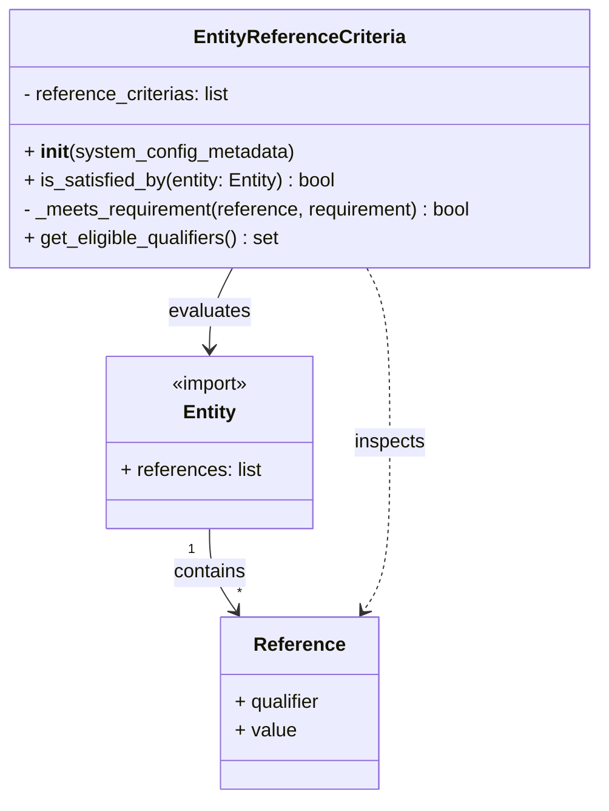
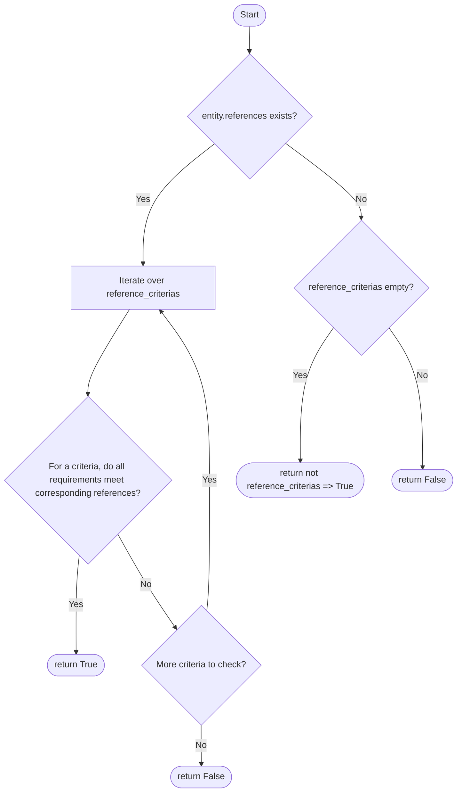

# Diagram: entity_core/entity_service/entity_service/entity/criteria/entity_reference.py

> Auto-generated by Obscura crawlers

## Diagram 1

### SVG

<svg id="container" width="507.6640625" xmlns="http://www.w3.org/2000/svg" class="classDiagram" height="668" viewBox="0 0 507.6640625 668" role="graphics-document document" aria-roledescription="class"><g><defs><marker id="container_class-aggregationStart" class="marker aggregation class" refX="18" refY="7" markerWidth="190" markerHeight="240" orient="auto"><path d="M 18,7 L9,13 L1,7 L9,1 Z"></path></marker></defs><defs><marker id="container_class-aggregationEnd" class="marker aggregation class" refX="1" refY="7" markerWidth="20" markerHeight="28" orient="auto"><path d="M 18,7 L9,13 L1,7 L9,1 Z"></path></marker></defs><defs><marker id="container_class-extensionStart" class="marker extension class" refX="18" refY="7" markerWidth="190" markerHeight="240" orient="auto"><path d="M 1,7 L18,13 V 1 Z"></path></marker></defs><defs><marker id="container_class-extensionEnd" class="marker extension class" refX="1" refY="7" markerWidth="20" markerHeight="28" orient="auto"><path d="M 1,1 V 13 L18,7 Z"></path></marker></defs><defs><marker id="container_class-compositionStart" class="marker composition class" refX="18" refY="7" markerWidth="190" markerHeight="240" orient="auto"><path d="M 18,7 L9,13 L1,7 L9,1 Z"></path></marker></defs><defs><marker id="container_class-compositionEnd" class="marker composition class" refX="1" refY="7" markerWidth="20" markerHeight="28" orient="auto"><path d="M 18,7 L9,13 L1,7 L9,1 Z"></path></marker></defs><defs><marker id="container_class-dependencyStart" class="marker dependency class" refX="6" refY="7" markerWidth="190" markerHeight="240" orient="auto"><path d="M 5,7 L9,13 L1,7 L9,1 Z"></path></marker></defs><defs><marker id="container_class-dependencyEnd" class="marker dependency class" refX="13" refY="7" markerWidth="20" markerHeight="28" orient="auto"><path d="M 18,7 L9,13 L14,7 L9,1 Z"></path></marker></defs><defs><marker id="container_class-lollipopStart" class="marker lollipop class" refX="13" refY="7" markerWidth="190" markerHeight="240" orient="auto"><circle stroke="black" fill="transparent" cx="7" cy="7" r="6"></circle></marker></defs><defs><marker id="container_class-lollipopEnd" class="marker lollipop class" refX="1" refY="7" markerWidth="190" markerHeight="240" orient="auto"><circle stroke="black" fill="transparent" cx="7" cy="7" r="6"></circle></marker></defs><g class="root"><g class="clusters"></g><g class="edgePaths"><path d="M196.754,224L193.495,230.167C190.236,236.333,183.717,248.667,180.458,260C177.199,271.333,177.199,281.667,177.199,286.833L177.199,292" id="id_EntityReferenceCriteria_Entity_1" class="edge-thickness-normal edge-pattern-solid relation" style=";;;" data-edge="true" data-et="edge" data-id="id_EntityReferenceCriteria_Entity_1" data-points="W3sieCI6MTk2Ljc1Mzc5ODQ5MTM3OTMsInkiOjIyNH0seyJ4IjoxNzcuMTk5MjE4NzUsInkiOjI2MX0seyJ4IjoxNzcuMTk5MjE4NzUsInkiOjI5OH1d" marker-end="url(#container_class-dependencyEnd)"></path><path d="M177.199,442L177.199,448.167C177.199,454.333,177.199,466.667,180.96,478.182C184.72,489.697,192.241,500.394,196.001,505.743L199.761,511.092" id="id_Entity_Reference_2" class="edge-thickness-normal edge-pattern-solid relation" style=";;;" data-edge="true" data-et="edge" data-id="id_Entity_Reference_2" data-points="W3sieCI6MTc3LjE5OTIxODc1LCJ5Ijo0NDJ9LHsieCI6MTc3LjE5OTIxODc1LCJ5Ijo0Nzl9LHsieCI6MjAzLjIxMjE5MTgwMDQ1ODczLCJ5Ijo1MTZ9XQ==" marker-end="url(#container_class-dependencyEnd)"></path><path d="M310.91,224L314.169,230.167C317.428,236.333,323.947,248.667,327.206,273C330.465,297.333,330.465,333.667,330.465,370C330.465,406.333,330.465,442.667,326.704,466.182C322.944,489.697,315.423,500.394,311.663,505.743L307.903,511.092" id="id_EntityReferenceCriteria_Reference_3" class="edge-thickness-normal edge-pattern-dashed relation" style=";;;" data-edge="true" data-et="edge" data-id="id_EntityReferenceCriteria_Reference_3" data-points="W3sieCI6MzEwLjkxMDI2NDAwODYyMDcsInkiOjIyNH0seyJ4IjozMzAuNDY0ODQzNzUsInkiOjI2MX0seyJ4IjozMzAuNDY0ODQzNzUsInkiOjM3MH0seyJ4IjozMzAuNDY0ODQzNzUsInkiOjQ3OX0seyJ4IjozMDQuNDUxODcwNjk5NTQxMywieSI6NTE2fV0=" marker-end="url(#container_class-dependencyEnd)"></path></g><g class="edgeLabels"><g class="edgeLabel" transform="translate(177.19921875, 261)"><g class="label" data-id="id_EntityReferenceCriteria_Entity_1" transform="translate(-34.625, -12)"><foreignObject width="69.25" height="24">

evaluates

</foreignObject></g></g><g class="edgeLabel" transform="translate(177.19921875, 479)"><g class="label" data-id="id_Entity_Reference_2" transform="translate(-30.890625, -12)"><foreignObject width="61.78125" height="24">

contains

</foreignObject></g></g><g class="edgeLabel" transform="translate(330.46484375, 370)"><g class="label" data-id="id_EntityReferenceCriteria_Reference_3" transform="translate(-30.2421875, -12)"><foreignObject width="60.484375" height="24">

inspects

</foreignObject></g></g><g class="edgeTerminals" transform="translate(162.19921937499998, 459.50000053571426)"><g class="inner" transform="translate(0, 0)"><foreignObject style="width: 9px; height: 12px;">
1
</foreignObject></g></g><g class="edgeTerminals" transform="translate(200.41813788347727, 488.05694341419803)"><g class="inner" transform="translate(0, 0)"></g><foreignObject style="width: 9px; height: 12px;">
*
</foreignObject></g></g><g class="nodes"><g class="node default" id="classId-EntityReferenceCriteria-0" transform="translate(253.83203125, 116)"><g class="basic label-container"><path d="M-245.83203125 -108 L245.83203125 -108 L245.83203125 108 L-245.83203125 108" stroke="none" stroke-width="0" fill="#ECECFF" style=""></path><path d="M-245.83203125 -108 C-138.4370557911414 -108, -31.042080332282808 -108, 245.83203125 -108 M-245.83203125 -108 C-129.79296820761994 -108, -13.7539051652399 -108, 245.83203125 -108 M245.83203125 -108 C245.83203125 -58.15828027449183, 245.83203125 -8.31656054898366, 245.83203125 108 M245.83203125 -108 C245.83203125 -61.59519429262023, 245.83203125 -15.190388585240456, 245.83203125 108 M245.83203125 108 C88.90804716982106 108, -68.01593691035788 108, -245.83203125 108 M245.83203125 108 C62.63166221162285 108, -120.5687068267543 108, -245.83203125 108 M-245.83203125 108 C-245.83203125 55.78691893758291, -245.83203125 3.5738378751658217, -245.83203125 -108 M-245.83203125 108 C-245.83203125 22.001488332124396, -245.83203125 -63.99702333575121, -245.83203125 -108" stroke="#9370DB" stroke-width="1.3" fill="none" stroke-dasharray="0 0" style=""></path></g><g class="annotation-group text" transform="translate(0, -84)"></g><g class="label-group text" transform="translate(-84.9609375, -84)"><g class="label" style="font-weight: bolder" transform="translate(0,-12)"><foreignObject width="169.921875" height="24">

EntityReferenceCriteria

</foreignObject></g></g><g class="members-group text" transform="translate(-233.83203125, -36)"><g class="label" style="" transform="translate(0,-12)"><foreignObject width="176.375" height="24">

- reference_criterias: list

</foreignObject></g></g><g class="methods-group text" transform="translate(-233.83203125, 12)"><g class="label" style="" transform="translate(0,-12)"><foreignObject width="226.84375" height="24">

+ <strong>init</strong>(system_config_metadata)

</foreignObject></g><g class="label" style="" transform="translate(0,12)"><foreignObject width="266.40625" height="24">

+ is_satisfied_by(entity: Entity) : bool

</foreignObject></g><g class="label" style="" transform="translate(0,36)"><foreignObject width="382.703125" height="24">

- _meets_requirement(reference, requirement) : bool

</foreignObject></g><g class="label" style="" transform="translate(0,60)"><foreignObject width="216.671875" height="24">

+ get_eligible_qualifiers() : set

</foreignObject></g></g><g class="divider" style=""><path d="M-245.83203125 -60 C-146.59082415948043 -60, -47.34961706896087 -60, 245.83203125 -60 M-245.83203125 -60 C-114.45683563980415 -60, 16.91835997039169 -60, 245.83203125 -60" stroke="#9370DB" stroke-width="1.3" fill="none" stroke-dasharray="0 0" style=""></path></g><g class="divider" style=""><path d="M-245.83203125 -12 C-52.68233638088233 -12, 140.46735848823533 -12, 245.83203125 -12 M-245.83203125 -12 C-54.539575011404054 -12, 136.7528812271919 -12, 245.83203125 -12" stroke="#9370DB" stroke-width="1.3" fill="none" stroke-dasharray="0 0" style=""></path></g></g><g class="node default" id="classId-Entity-1" transform="translate(177.19921875, 370)"><g class="basic label-container"><path d="M-88.0234375 -72 L88.0234375 -72 L88.0234375 72 L-88.0234375 72" stroke="none" stroke-width="0" fill="#ECECFF" style=""></path><path d="M-88.0234375 -72 C-49.2913040450911 -72, -10.559170590182205 -72, 88.0234375 -72 M-88.0234375 -72 C-49.991885241244546 -72, -11.960332982489092 -72, 88.0234375 -72 M88.0234375 -72 C88.0234375 -29.90675997013632, 88.0234375 12.186480059727359, 88.0234375 72 M88.0234375 -72 C88.0234375 -40.874418803765366, 88.0234375 -9.748837607530731, 88.0234375 72 M88.0234375 72 C34.9840811276152 72, -18.055275244769604 72, -88.0234375 72 M88.0234375 72 C26.04970436367671 72, -35.92402877264658 72, -88.0234375 72 M-88.0234375 72 C-88.0234375 33.30223468019311, -88.0234375 -5.395530639613781, -88.0234375 -72 M-88.0234375 72 C-88.0234375 22.550936156161328, -88.0234375 -26.898127687677345, -88.0234375 -72" stroke="#9370DB" stroke-width="1.3" fill="none" stroke-dasharray="0 0" style=""></path></g><g class="annotation-group text" transform="translate(-33.640625, -48)"><g class="label" style="" transform="translate(0,-12)"><foreignObject width="67.28125" height="24">

«import»

</foreignObject></g></g><g class="label-group text" transform="translate(-21.28125, -24)"><g class="label" style="font-weight: bolder" transform="translate(0,-12)"><foreignObject width="42.5625" height="24">

Entity

</foreignObject></g></g><g class="members-group text" transform="translate(-76.0234375, 24)"><g class="label" style="" transform="translate(0,-12)"><foreignObject width="118.40625" height="24">

+ references: list

</foreignObject></g></g><g class="methods-group text" transform="translate(-76.0234375, 72)"></g><g class="divider" style=""><path d="M-88.0234375 0 C-36.875392785490334 0, 14.272651929019332 0, 88.0234375 0 M-88.0234375 0 C-31.201496299092398 0, 25.620444901815205 0, 88.0234375 0" stroke="#9370DB" stroke-width="1.3" fill="none" stroke-dasharray="0 0" style=""></path></g><g class="divider" style=""><path d="M-88.0234375 48 C-22.474427176053396 48, 43.07458314789321 48, 88.0234375 48 M-88.0234375 48 C-28.53520187998391 48, 30.953033740032183 48, 88.0234375 48" stroke="#9370DB" stroke-width="1.3" fill="none" stroke-dasharray="0 0" style=""></path></g></g><g class="node default" id="classId-Reference-2" transform="translate(253.83203125, 588)"><g class="basic label-container"><path d="M-66.73046875 -72 L66.73046875 -72 L66.73046875 72 L-66.73046875 72" stroke="none" stroke-width="0" fill="#ECECFF" style=""></path><path d="M-66.73046875 -72 C-35.28180044971791 -72, -3.8331321494358264 -72, 66.73046875 -72 M-66.73046875 -72 C-19.02762615076913 -72, 28.67521644846174 -72, 66.73046875 -72 M66.73046875 -72 C66.73046875 -16.600373342097186, 66.73046875 38.79925331580563, 66.73046875 72 M66.73046875 -72 C66.73046875 -39.31951086523771, 66.73046875 -6.63902173047542, 66.73046875 72 M66.73046875 72 C24.932299245926664 72, -16.86587025814667 72, -66.73046875 72 M66.73046875 72 C29.543352015555776 72, -7.643764718888448 72, -66.73046875 72 M-66.73046875 72 C-66.73046875 42.88505206951156, -66.73046875 13.770104139023111, -66.73046875 -72 M-66.73046875 72 C-66.73046875 23.125347952565292, -66.73046875 -25.749304094869416, -66.73046875 -72" stroke="#9370DB" stroke-width="1.3" fill="none" stroke-dasharray="0 0" style=""></path></g><g class="annotation-group text" transform="translate(0, -48)"></g><g class="label-group text" transform="translate(-36.5078125, -48)"><g class="label" style="font-weight: bolder" transform="translate(0,-12)"><foreignObject width="73.015625" height="24">

Reference

</foreignObject></g></g><g class="members-group text" transform="translate(-54.73046875, 0)"><g class="label" style="" transform="translate(0,-12)"><foreignObject width="72.953125" height="24">

+ qualifier

</foreignObject></g><g class="label" style="" transform="translate(0,12)"><foreignObject width="51.109375" height="24">

+ value

</foreignObject></g></g><g class="methods-group text" transform="translate(-54.73046875, 72)"></g><g class="divider" style=""><path d="M-66.73046875 -24 C-13.355308151969389 -24, 40.01985244606122 -24, 66.73046875 -24 M-66.73046875 -24 C-39.44731158103677 -24, -12.164154412073536 -24, 66.73046875 -24" stroke="#9370DB" stroke-width="1.3" fill="none" stroke-dasharray="0 0" style=""></path></g><g class="divider" style=""><path d="M-66.73046875 48 C-32.65738225489405 48, 1.4157042402118947 48, 66.73046875 48 M-66.73046875 48 C-31.595660581515695 48, 3.5391475869686104 48, 66.73046875 48" stroke="#9370DB" stroke-width="1.3" fill="none" stroke-dasharray="0 0" style=""></path></g></g></g></g></g></svg>

## Diagram 2

### SVG

<svg id="container" width="824.778564453125" xmlns="http://www.w3.org/2000/svg" class="flowchart" height="1433.578125" viewBox="0.5 0 824.778564453125 1433.578125" role="graphics-document document" aria-roledescription="flowchart-v2"><g><marker id="container_flowchart-v2-pointEnd" class="marker flowchart-v2" viewBox="0 0 10 10" refX="5" refY="5" markerUnits="userSpaceOnUse" markerWidth="8" markerHeight="8" orient="auto"><path d="M 0 0 L 10 5 L 0 10 z" class="arrowMarkerPath" style="stroke-width: 1; stroke-dasharray: 1, 0;"></path></marker><marker id="container_flowchart-v2-pointStart" class="marker flowchart-v2" viewBox="0 0 10 10" refX="4.5" refY="5" markerUnits="userSpaceOnUse" markerWidth="8" markerHeight="8" orient="auto"><path d="M 0 5 L 10 10 L 10 0 z" class="arrowMarkerPath" style="stroke-width: 1; stroke-dasharray: 1, 0;"></path></marker><marker id="container_flowchart-v2-circleEnd" class="marker flowchart-v2" viewBox="0 0 10 10" refX="11" refY="5" markerUnits="userSpaceOnUse" markerWidth="11" markerHeight="11" orient="auto"><circle cx="5" cy="5" r="5" class="arrowMarkerPath" style="stroke-width: 1; stroke-dasharray: 1, 0;"></circle></marker><marker id="container_flowchart-v2-circleStart" class="marker flowchart-v2" viewBox="0 0 10 10" refX="-1" refY="5" markerUnits="userSpaceOnUse" markerWidth="11" markerHeight="11" orient="auto"><circle cx="5" cy="5" r="5" class="arrowMarkerPath" style="stroke-width: 1; stroke-dasharray: 1, 0;"></circle></marker><marker id="container_flowchart-v2-crossEnd" class="marker cross flowchart-v2" viewBox="0 0 11 11" refX="12" refY="5.2" markerUnits="userSpaceOnUse" markerWidth="11" markerHeight="11" orient="auto"><path d="M 1,1 l 9,9 M 10,1 l -9,9" class="arrowMarkerPath" style="stroke-width: 2; stroke-dasharray: 1, 0;"></path></marker><marker id="container_flowchart-v2-crossStart" class="marker cross flowchart-v2" viewBox="0 0 11 11" refX="-1" refY="5.2" markerUnits="userSpaceOnUse" markerWidth="11" markerHeight="11" orient="auto"><path d="M 1,1 l 9,9 M 10,1 l -9,9" class="arrowMarkerPath" style="stroke-width: 2; stroke-dasharray: 1, 0;"></path></marker><g class="root"><g class="clusters"></g><g class="edgePaths"><path d="M449.979,47.5L449.895,51.583C449.812,55.667,449.645,63.833,449.562,71.417C449.479,79,449.479,86,449.479,89.5L449.479,93" id="L_Start_HasRefs_0" class="edge-thickness-normal edge-pattern-solid edge-thickness-normal edge-pattern-solid flowchart-link" style=";" data-edge="true" data-et="edge" data-id="L_Start_HasRefs_0" data-points="W3sieCI6NDQ5Ljk3ODgwOTM1NjY4OTQ1LCJ5Ijo0Ny41fSx7IngiOjQ0OS40Nzg4MDkzNTY2ODk0NSwieSI6NzJ9LHsieCI6NDQ5LjQ3ODgwOTM1NjY4OTQ1LCJ5Ijo5N31d" marker-end="url(#container_flowchart-v2-pointEnd)"></path><path d="M385.84,260.846L364.536,277.619C343.232,294.392,300.624,327.938,279.32,364.192C258.016,400.445,258.016,439.406,258.016,458.887L258.016,478.367" id="L_HasRefs_IterateCriteria_0" class="edge-thickness-normal edge-pattern-solid edge-thickness-normal edge-pattern-solid flowchart-link" style=";" data-edge="true" data-et="edge" data-id="L_HasRefs_IterateCriteria_0" data-points="W3sieCI6Mzg1Ljg0MDI5NTE2MTg2OTMsInkiOjI2MC44NDU4NjA4MDUxNzk5fSx7IngiOjI1OC4wMTU2MjUsInkiOjM2MS40ODQzNzV9LHsieCI6MjU4LjAxNTYyNSwieSI6NDgyLjM2NzE4NzV9XQ==" marker-end="url(#container_flowchart-v2-pointEnd)"></path><path d="M233.863,560.367L221.386,580.514C208.909,600.661,183.954,640.956,171.477,666.603C159,692.25,159,703.25,159,708.75L159,714.25" id="L_IterateCriteria_CheckAll_0" class="edge-thickness-normal edge-pattern-solid edge-thickness-normal edge-pattern-solid flowchart-link" style=";" data-edge="true" data-et="edge" data-id="L_IterateCriteria_CheckAll_0" data-points="W3sieCI6MjMzLjg2Mjg3NjQwNDgzNzUyLCJ5Ijo1NjAuMzY3MTg3NX0seyJ4IjoxNTksInkiOjY4MS4yNX0seyJ4IjoxNTksInkiOjcxOC4yNX1d" marker-end="url(#container_flowchart-v2-pointEnd)"></path><path d="M143.772,1005.022L142.796,1013.727C141.819,1022.431,139.867,1039.841,138.971,1069.073C138.075,1098.305,138.237,1139.359,138.318,1159.887L138.398,1180.414" id="L_CheckAll_ReturnTrue1_0" class="edge-thickness-normal edge-pattern-solid edge-thickness-normal edge-pattern-solid flowchart-link" style=";" data-edge="true" data-et="edge" data-id="L_CheckAll_ReturnTrue1_0" data-points="W3sieCI6MTQzLjc3MTkyMzkyNDgyMTU4LCJ5IjoxMDA1LjAyMTkyMzkyNDgyMTZ9LHsieCI6MTM3LjkxNDA2MjUsInkiOjEwNTcuMjV9LHsieCI6MTM4LjQxNDA2MjUsInkiOjExODQuNDE0MDYyNTAwMDAwMn1d" marker-end="url(#container_flowchart-v2-pointEnd)"></path><path d="M213.471,965.779L222.074,981.024C230.677,996.269,247.883,1026.76,265.267,1054.967C282.651,1083.175,300.213,1109.099,308.994,1122.062L317.775,1135.024" id="L_CheckAll_MoreCriteria_0" class="edge-thickness-normal edge-pattern-solid edge-thickness-normal edge-pattern-solid flowchart-link" style=";" data-edge="true" data-et="edge" data-id="L_CheckAll_MoreCriteria_0" data-points="W3sieCI6MjEzLjQ3MTMxMzIwMjAyMDg0LCJ5Ijo5NjUuNzc4Njg2Nzk3OTc5Mn0seyJ4IjoyNjUuMDg4NzQxMzAyNDkwMjMsInkiOjEwNTcuMjV9LHsieCI6MzIwLjAxODU0NTA1NzcwODEsInkiOjExMzguMzM1ODIxMjQ0NzgyMn1d" marker-end="url(#container_flowchart-v2-pointEnd)"></path><path d="M374.308,1104.453L375.119,1096.586C375.93,1088.719,377.552,1072.984,378.364,1033.784C379.175,994.583,379.175,931.917,379.175,869.25C379.175,806.583,379.175,743.917,364.31,692.968C349.445,642.018,319.715,602.787,304.851,583.171L289.986,563.555" id="L_MoreCriteria_IterateCriteria_0" class="edge-thickness-normal edge-pattern-solid edge-thickness-normal edge-pattern-solid flowchart-link" style=";" data-edge="true" data-et="edge" data-id="L_MoreCriteria_IterateCriteria_0" data-points="W3sieCI6Mzc0LjMwNzc1MjEyMjk0MjgsInkiOjExMDQuNDUzMzg1ODIwNDUyNX0seyJ4IjozNzkuMTc0Njc4ODAyNDkwMjMsInkiOjEwNTcuMjV9LHsieCI6Mzc5LjE3NDY3ODgwMjQ5MDIzLCJ5Ijo4NjkuMjV9LHsieCI6Mzc5LjE3NDY3ODgwMjQ5MDIzLCJ5Ijo2ODEuMjV9LHsieCI6Mjg3LjU2OTc5MDQ4MTY1MzEsInkiOjU2MC4zNjcxODc1fV0=" marker-end="url(#container_flowchart-v2-pointEnd)"></path><path d="M364.104,1312.578L364.104,1318.745C364.104,1324.911,364.104,1337.245,364.179,1348.995C364.253,1360.745,364.402,1371.912,364.477,1377.495L364.551,1383.078" id="L_MoreCriteria_ReturnFalse1_0" class="edge-thickness-normal edge-pattern-solid edge-thickness-normal edge-pattern-solid flowchart-link" style=";" data-edge="true" data-et="edge" data-id="L_MoreCriteria_ReturnFalse1_0" data-points="W3sieCI6MzY0LjEwNDM2NjMwMjQ5MDIzLCJ5IjoxMzEyLjU3ODEyNX0seyJ4IjozNjQuMTA0MzY2MzAyNDkwMjMsInkiOjEzNDkuNTc4MTI1fSx7IngiOjM2NC42MDQzNjYzMDI0OTAyMywieSI6MTM4Ny4wNzgxMjUwMDAwMDF9XQ==" marker-end="url(#container_flowchart-v2-pointEnd)"></path><path d="M514.663,259.3L537.524,276.331C560.386,293.362,606.11,327.423,628.971,349.954C651.833,372.484,651.833,383.484,651.833,388.984L651.833,394.484" id="L_HasRefs_NoCriteriaEmpty_0" class="edge-thickness-normal edge-pattern-solid edge-thickness-normal edge-pattern-solid flowchart-link" style=";" data-edge="true" data-et="edge" data-id="L_HasRefs_NoCriteriaEmpty_0" data-points="W3sieCI6NTE0LjY2MjcyMTUyODU3NzIsInkiOjI1OS4zMDA0NjI4MjgxMTIyNX0seyJ4Ijo2NTEuODMyODk3MTg2Mjc5MywieSI6MzYxLjQ4NDM3NX0seyJ4Ijo2NTEuODMyODk3MTg2Mjc5MywieSI6Mzk4LjQ4NDM3NDk5OTk5OTk0fV0=" marker-end="url(#container_flowchart-v2-pointEnd)"></path><path d="M601.676,594.093L591.657,608.619C581.639,623.145,561.602,652.198,551.664,692.224C541.727,732.25,541.89,783.25,541.971,808.75L542.052,834.25" id="L_NoCriteriaEmpty_ReturnTrue2_0" class="edge-thickness-normal edge-pattern-solid edge-thickness-normal edge-pattern-solid flowchart-link" style=";" data-edge="true" data-et="edge" data-id="L_NoCriteriaEmpty_ReturnTrue2_0" data-points="W3sieCI6NjAxLjY3NTUzMjIwODc1NywieSI6NTk0LjA5MjYzNTAyMjQ3Nzd9LHsieCI6NTQxLjU2NDc0Njg1NjY4OTUsInkiOjY4MS4yNX0seyJ4Ijo1NDIuMDY0NzQ2ODU2Njg5NSwieSI6ODM4LjI1fV0=" marker-end="url(#container_flowchart-v2-pointEnd)"></path><path d="M701.99,594.093L712.009,608.619C722.027,623.145,742.064,652.198,752.164,694.224C762.264,736.25,762.426,791.25,762.508,818.75L762.589,846.25" id="L_NoCriteriaEmpty_ReturnFalse2_0" class="edge-thickness-normal edge-pattern-solid edge-thickness-normal edge-pattern-solid flowchart-link" style=";" data-edge="true" data-et="edge" data-id="L_NoCriteriaEmpty_ReturnFalse2_0" data-points="W3sieCI6NzAxLjk5MDI2MjE2MzgwMTUsInkiOjU5NC4wOTI2MzUwMjI0Nzc2fSx7IngiOjc2Mi4xMDEwNDc1MTU4NjkxLCJ5Ijo2ODEuMjV9LHsieCI6NzYyLjYwMTA0NzUxNTg2OTEsInkiOjg1MC4yNX1d" marker-end="url(#container_flowchart-v2-pointEnd)"></path></g><g class="edgeLabels"><g class="edgeLabel"><g class="label" data-id="L_Start_HasRefs_0" transform="translate(0, 0)"><foreignObject width="0" height="0">

</foreignObject></g></g><g class="edgeLabel" transform="translate(258.015625, 361.484375)"><g class="label" data-id="L_HasRefs_IterateCriteria_0" transform="translate(-12.03125, -12)"><foreignObject width="24.0625" height="24">

Yes

</foreignObject></g></g><g class="edgeLabel"><g class="label" data-id="L_IterateCriteria_CheckAll_0" transform="translate(0, 0)"><foreignObject width="0" height="0">

</foreignObject></g></g><g class="edgeLabel" transform="translate(137.9140625, 1057.25)"><g class="label" data-id="L_CheckAll_ReturnTrue1_0" transform="translate(-12.03125, -12)"><foreignObject width="24.0625" height="24">

Yes

</foreignObject></g></g><g class="edgeLabel" transform="translate(265.08874130249023, 1057.25)"><g class="label" data-id="L_CheckAll_MoreCriteria_0" transform="translate(-10.140625, -12)"><foreignObject width="20.28125" height="24">

No

</foreignObject></g></g><g class="edgeLabel" transform="translate(379.17467880249023, 869.25)"><g class="label" data-id="L_MoreCriteria_IterateCriteria_0" transform="translate(-12.03125, -12)"><foreignObject width="24.0625" height="24">

Yes

</foreignObject></g></g><g class="edgeLabel" transform="translate(364.10436630249023, 1349.578125)"><g class="label" data-id="L_MoreCriteria_ReturnFalse1_0" transform="translate(-10.140625, -12)"><foreignObject width="20.28125" height="24">

No

</foreignObject></g></g><g class="edgeLabel" transform="translate(651.8328971862793, 361.484375)"><g class="label" data-id="L_HasRefs_NoCriteriaEmpty_0" transform="translate(-10.140625, -12)"><foreignObject width="20.28125" height="24">

No

</foreignObject></g></g><g class="edgeLabel" transform="translate(541.5647468566895, 681.25)"><g class="label" data-id="L_NoCriteriaEmpty_ReturnTrue2_0" transform="translate(-12.03125, -12)"><foreignObject width="24.0625" height="24">

Yes

</foreignObject></g></g><g class="edgeLabel" transform="translate(762.1010475158691, 681.25)"><g class="label" data-id="L_NoCriteriaEmpty_ReturnFalse2_0" transform="translate(-10.140625, -12)"><foreignObject width="20.28125" height="24">

No

</foreignObject></g></g></g><g class="nodes"><g class="node default" id="flowchart-Start-0" transform="translate(449.47880935668945, 27.5)"><g class="basic label-container outer-path"><path d="M-10.3984375 -19.5 C-4.4019081846408 -19.5, 1.5946211307183997 -19.5, 10.3984375 -19.5 C10.3984375 -19.5, 10.398437499999998 -19.5, 10.398437499999998 -19.5 C10.676642577468229 -19.491078504658926, 10.954847654936458 -19.482157009317852, 11.6478067896239 -19.45993515863156 C11.94955998408683 -19.430825390873032, 12.251313178549761 -19.401715623114505, 12.892042152847864 -19.3399052695533 C13.185091841218163 -19.292527268571863, 13.478141529588463 -19.24514926759043, 14.126030759676757 -19.140403561325776 C14.390938748201641 -19.07994004163115, 14.655846736726525 -19.019476521936525, 15.34470188623539 -18.862249829261074 C15.645978625361451 -18.772832474522335, 15.947255364487514 -18.683415119783593, 16.543047751460602 -18.50658706670804 C16.888404855465744 -18.37949245998807, 17.23376195947089 -18.252397853268107, 17.716144095147794 -18.074876768247425 C18.056379299011443 -17.924264736215715, 18.396614502875092 -17.773652704184006, 18.85917041279238 -17.568892924097174 C19.148832230036877 -17.41777653957797, 19.43849404728137 -17.266660155058766, 19.967429764076783 -16.990714730406097 C20.263911675793583 -16.810985653202263, 20.560393587510386 -16.631256575998428, 21.036368073605697 -16.342718045390892 C21.39556432490798 -16.092158289837528, 21.754760576210263 -15.841598534284163, 22.061592844578712 -15.627565626425154 C22.335710898892337 -15.408963772697817, 22.60982895320596 -15.190361918970481, 23.03889120850187 -14.848196188198123 C23.327098333055652 -14.586454103221026, 23.615305457609438 -14.32471201824393, 23.964247236767985 -14.007812326905688 C24.31168299889292 -13.64905637750513, 24.65911876101785 -13.290300428104572, 24.833858442968648 -13.10986736009568 C25.011490895867485 -12.901210173347804, 25.18912334876632 -12.692552986599928, 25.644151408126582 -12.158051136245305 C25.809814632276517 -11.936077508114588, 25.97547785642645 -11.714103879983872, 26.391796464640635 -11.156274872382312 C26.595282593296336 -10.843665535090777, 26.798768721952037 -10.531056197799241, 27.073721378604247 -10.108655082055241 C27.243206304598814 -9.807717433742125, 27.41269123059338 -9.50677978542901, 27.6871239742735 -9.019496659696287 C27.805940922866093 -8.772770723668337, 27.924757871458684 -8.526044787640386, 28.22948364880834 -7.893275190886684 C28.374515983925097 -7.5350425191388535, 28.519548319041853 -7.176809847391023, 28.698571729970325 -6.734618561215508 C28.784628750080167 -6.475428527968789, 28.870685770190008 -6.216238494722069, 29.09246063421488 -5.548287939305138 C29.17492508318253 -5.233815255073225, 29.25738953215018 -4.919342570841311, 29.40953178754556 -4.339158212148133 C29.50348032723325 -3.856752316882727, 29.597428866920946 -3.3743464216173207, 29.648482276581777 -3.1121979531509023 C29.709485094862384 -2.6390721409355224, 29.77048791314299 -2.165946328720143, 29.808330202509367 -1.872449005199798 C29.827328082040648 -1.5765416966877552, 29.846325961571928 -1.2806343881757125, 29.888418715913414 -0.6250057626472757 C29.888418715913414 -0.3293645496078237, 29.888418715913414 -0.033723336568371676, 29.888418715913414 0.625005762647271 C29.85948768080586 1.0756299871586505, 29.830556645698305 1.5262542116700302, 29.808330202509367 1.8724490051997846 C29.766373298117266 2.197858470337005, 29.724416393725168 2.5232679354742253, 29.648482276581777 3.1121979531508885 C29.556476254529954 3.5846294309073503, 29.464470232478135 4.057060908663812, 29.40953178754556 4.339158212148129 C29.335324967762237 4.622140977421085, 29.26111814797891 4.905123742694041, 29.092460634214884 5.548287939305125 C28.99396060904234 5.8449543212770845, 28.895460583869795 6.1416207032490435, 28.69857172997033 6.734618561215495 C28.566521596519845 7.060784943853839, 28.434471463069364 7.386951326492183, 28.229483648808344 7.893275190886679 C28.08906046509082 8.184866936450925, 27.948637281373298 8.476458682015172, 27.687123974273504 9.019496659696284 C27.510240240643597 9.333571640176459, 27.333356507013693 9.647646620656632, 27.07372137860425 10.108655082055236 C26.821139026073382 10.496689403401097, 26.568556673542517 10.88472372474696, 26.39179646464064 11.156274872382301 C26.20374403195084 11.40824800025758, 26.015691599261043 11.660221128132855, 25.644151408126582 12.158051136245302 C25.405186814235634 12.4387525457002, 25.166222220344686 12.7194539551551, 24.83385844296866 13.10986736009567 C24.63546841016603 13.314721357088994, 24.437078377363406 13.519575354082317, 23.96424723676799 14.007812326905684 C23.65161599576151 14.29173574821841, 23.33898475475503 14.57565916953114, 23.038891208501887 14.848196188198111 C22.660781430401045 15.149728674309763, 22.282671652300202 15.451261160421417, 22.061592844578715 15.627565626425152 C21.69355547460256 15.884292563639551, 21.325518104626408 16.14101950085395, 21.036368073605708 16.34271804539089 C20.70134868688265 16.545808766414854, 20.366329300159595 16.74889948743882, 19.967429764076787 16.990714730406093 C19.718394040352436 17.120636507958093, 19.46935831662808 17.250558285510095, 18.859170412792388 17.56889292409717 C18.510496552984453 17.723240498791583, 18.161822693176514 17.87758807348599, 17.716144095147804 18.07487676824742 C17.407764759075945 18.1883632145492, 17.09938542300409 18.301849660850973, 16.543047751460616 18.506587066708033 C16.097154608208413 18.638925811084416, 15.651261464956209 18.771264555460803, 15.344701886235413 18.86224982926107 C15.05476059578783 18.928427036761992, 14.764819305340248 18.99460424426291, 14.126030759676766 19.140403561325773 C13.858981790185023 19.183577967717508, 13.591932820693279 19.226752374109246, 12.892042152847878 19.3399052695533 C12.474301021583262 19.38020425407918, 12.056559890318644 19.420503238605065, 11.6478067896239 19.45993515863156 C11.281112514207022 19.47169433031707, 10.914418238790143 19.483453502002583, 10.398437500000004 19.5 C10.398437500000002 19.5, 10.3984375 19.5, 10.3984375 19.5 C2.101398021067462 19.5, -6.195641457865076 19.5, -10.398437499999996 19.5 C-10.713298119059232 19.489903032785787, -11.028158738118469 19.479806065571573, -11.647806789623893 19.45993515863156 C-11.961198811012483 19.42970260723725, -12.274590832401074 19.399470055842944, -12.892042152847871 19.3399052695533 C-13.375667303730436 19.261716505727666, -13.859292454613001 19.18352774190203, -14.126030759676759 19.140403561325773 C-14.542077991036102 19.045443495729913, -14.958125222395445 18.950483430134057, -15.344701886235388 18.862249829261074 C-15.683087721818172 18.7618186894836, -16.021473557400956 18.66138754970613, -16.54304775146059 18.506587066708043 C-16.891149849419712 18.378482276838568, -17.239251947378833 18.250377486969093, -17.716144095147797 18.074876768247425 C-18.061963786190844 17.921792649399322, -18.407783477233895 17.768708530551216, -18.85917041279238 17.568892924097174 C-19.21511342961544 17.38319768021297, -19.571056446438494 17.19750243632876, -19.96742976407678 16.990714730406097 C-20.233298379915343 16.829543613067347, -20.499166995753907 16.668372495728597, -21.036368073605686 16.3427180453909 C-21.363753473405062 16.114348162776395, -21.691138873204437 15.885978280161893, -22.061592844578712 15.627565626425156 C-22.298185841631483 15.43888900727964, -22.53477883868425 15.250212388134122, -23.03889120850187 14.848196188198125 C-23.288586247283824 14.621429760545052, -23.53828128606578 14.394663332891977, -23.964247236767974 14.007812326905697 C-24.27725743138428 13.684603602349453, -24.59026762600059 13.36139487779321, -24.833858442968655 13.109867360095677 C-25.136940852750847 12.753849515687845, -25.440023262533035 12.397831671280011, -25.64415140812658 12.158051136245307 C-25.928000714514845 11.777718924888818, -26.211850020903107 11.397386713532331, -26.391796464640635 11.156274872382316 C-26.547478791682806 10.917105011487257, -26.70316111872498 10.677935150592198, -27.073721378604244 10.108655082055249 C-27.28572695029828 9.73221772162046, -27.49773252199231 9.35578036118567, -27.6871239742735 9.019496659696289 C-27.875245793329167 8.628857677265085, -28.063367612384837 8.238218694833883, -28.22948364880834 7.893275190886686 C-28.395066778796455 7.484281658484015, -28.560649908784566 7.075288126081344, -28.698571729970325 6.73461856121551 C-28.794548794537803 6.445550934606823, -28.890525859105285 6.156483307998135, -29.09246063421488 5.5482879393051325 C-29.207491035438313 5.109627164948933, -29.322521436661745 4.670966390592733, -29.409531787545557 4.339158212148136 C-29.47458000534318 4.00514936170304, -29.539628223140806 3.6711405112579456, -29.648482276581777 3.112197953150904 C-29.703794047583592 2.6832107798054263, -29.759105818585407 2.2542236064599486, -29.808330202509364 1.872449005199809 C-29.83259182153587 1.4945547052355406, -29.856853440562382 1.116660405271272, -29.888418715913414 0.6250057626472781 C-29.888418715913414 0.18742836148854897, -29.888418715913414 -0.2501490396701802, -29.888418715913414 -0.6250057626472687 C-29.8577063655331 -1.103375410383698, -29.826994015152785 -1.5817450581201271, -29.808330202509367 -1.8724490051997822 C-29.74993680196218 -2.3253366887625893, -29.69154340141499 -2.7782243723253965, -29.648482276581777 -3.112197953150895 C-29.575801448786784 -3.485398642779792, -29.50312062099179 -3.8585993324086894, -29.40953178754556 -4.339158212148126 C-29.311943199141687 -4.711305794893851, -29.214354610737818 -5.083453377639576, -29.092460634214884 -5.548287939305123 C-28.941276323171518 -6.003630996218985, -28.790092012128152 -6.458974053132847, -28.698571729970332 -6.734618561215485 C-28.5450842371117 -7.113735636055114, -28.39159674425306 -7.492852710894742, -28.229483648808344 -7.893275190886676 C-28.024960436014517 -8.31797201834878, -27.820437223220686 -8.742668845810883, -27.687123974273504 -9.019496659696282 C-27.476267027057318 -9.393894521059815, -27.26541007984113 -9.768292382423349, -27.073721378604247 -10.108655082055243 C-26.802341027147158 -10.52556817772128, -26.530960675690068 -10.942481273387315, -26.39179646464064 -11.156274872382308 C-26.185048812738593 -11.433297890832492, -25.978301160836544 -11.710320909282673, -25.644151408126586 -12.158051136245302 C-25.461782298890768 -12.372272269049978, -25.279413189654953 -12.586493401854655, -24.833858442968662 -13.10986736009567 C-24.576710203537253 -13.375394029571693, -24.319561964105844 -13.640920699047713, -23.964247236767996 -14.007812326905677 C-23.696947029356682 -14.250567302900697, -23.429646821945372 -14.493322278895716, -23.038891208501887 -14.848196188198107 C-22.787032892602554 -15.049046492896563, -22.535174576703223 -15.24989679759502, -22.06159284457872 -15.627565626425149 C-21.829303229169756 -15.789600806479058, -21.597013613760797 -15.951635986532967, -21.03636807360571 -16.342718045390885 C-20.77509202769672 -16.50110511984939, -20.513815981787726 -16.659492194307898, -19.96742976407679 -16.99071473040609 C-19.56663938849273 -17.199806812629806, -19.16584901290867 -17.40889889485352, -18.859170412792388 -17.56889292409717 C-18.517031684104296 -17.7203475901026, -18.174892955416205 -17.871802256108037, -17.716144095147804 -18.07487676824742 C-17.47258698651641 -18.164508035641006, -17.229029877885022 -18.254139303034588, -16.54304775146062 -18.506587066708033 C-16.123043106482577 -18.631242240688145, -15.703038461504537 -18.755897414668258, -15.344701886235413 -18.862249829261067 C-15.045240929456474 -18.930599838480493, -14.745779972677534 -18.998949847699915, -14.126030759676768 -19.140403561325773 C-13.722933309680327 -19.205573230973783, -13.319835859683886 -19.270742900621798, -12.89204215284788 -19.3399052695533 C-12.545260875958014 -19.37335884226936, -12.198479599068149 -19.40681241498542, -11.647806789623903 -19.45993515863156 C-11.24099724822744 -19.472980748817406, -10.834187706830978 -19.486026339003256, -10.398437500000005 -19.5 C-10.398437500000004 -19.5, -10.398437500000004 -19.5, -10.3984375 -19.5" stroke="none" stroke-width="0" fill="#ECECFF" style=""></path><path d="M-10.3984375 -19.5 C-3.683430580547916 -19.5, 3.031576338904168 -19.5, 10.3984375 -19.5 M-10.3984375 -19.5 C-5.290977107041358 -19.5, -0.18351671408271564 -19.5, 10.3984375 -19.5 M10.3984375 -19.5 C10.3984375 -19.5, 10.3984375 -19.5, 10.398437499999998 -19.5 M10.3984375 -19.5 C10.3984375 -19.5, 10.398437499999998 -19.5, 10.398437499999998 -19.5 M10.398437499999998 -19.5 C10.838409235211854 -19.48589096280479, 11.278380970423711 -19.471781925609573, 11.6478067896239 -19.45993515863156 M10.398437499999998 -19.5 C10.671642623350104 -19.491238843455676, 10.944847746700212 -19.48247768691135, 11.6478067896239 -19.45993515863156 M11.6478067896239 -19.45993515863156 C12.049335819571251 -19.42120013602185, 12.4508648495186 -19.382465113412138, 12.892042152847864 -19.3399052695533 M11.6478067896239 -19.45993515863156 C12.019837725927491 -19.424045781639013, 12.391868662231083 -19.38815640464647, 12.892042152847864 -19.3399052695533 M12.892042152847864 -19.3399052695533 C13.271557322495294 -19.2785482001088, 13.651072492142724 -19.2171911306643, 14.126030759676757 -19.140403561325776 M12.892042152847864 -19.3399052695533 C13.336752931388578 -19.26800787966243, 13.781463709929293 -19.196110489771566, 14.126030759676757 -19.140403561325776 M14.126030759676757 -19.140403561325776 C14.451683040193696 -19.066075553377512, 14.777335320710636 -18.991747545429252, 15.34470188623539 -18.862249829261074 M14.126030759676757 -19.140403561325776 C14.458063390356038 -19.064619280088635, 14.790096021035318 -18.988834998851495, 15.34470188623539 -18.862249829261074 M15.34470188623539 -18.862249829261074 C15.76092840194609 -18.738715984215705, 16.177154917656793 -18.615182139170333, 16.543047751460602 -18.50658706670804 M15.34470188623539 -18.862249829261074 C15.64588750474761 -18.77285951864222, 15.947073123259829 -18.683469208023368, 16.543047751460602 -18.50658706670804 M16.543047751460602 -18.50658706670804 C16.92875936650864 -18.364641626891277, 17.314470981556674 -18.222696187074515, 17.716144095147794 -18.074876768247425 M16.543047751460602 -18.50658706670804 C16.964020697530273 -18.351665131123145, 17.384993643599945 -18.19674319553825, 17.716144095147794 -18.074876768247425 M17.716144095147794 -18.074876768247425 C18.00808055242995 -17.94564515859593, 18.3000170097121 -17.816413548944436, 18.85917041279238 -17.568892924097174 M17.716144095147794 -18.074876768247425 C17.94941111951352 -17.971616376181142, 18.182678143879247 -17.868355984114856, 18.85917041279238 -17.568892924097174 M18.85917041279238 -17.568892924097174 C19.105843747563405 -17.440203603348944, 19.352517082334426 -17.31151428260071, 19.967429764076783 -16.990714730406097 M18.85917041279238 -17.568892924097174 C19.169042963141706 -17.40723261306277, 19.47891551349103 -17.24557230202837, 19.967429764076783 -16.990714730406097 M19.967429764076783 -16.990714730406097 C20.374395100390007 -16.74400995193924, 20.78136043670323 -16.497305173472384, 21.036368073605697 -16.342718045390892 M19.967429764076783 -16.990714730406097 C20.208543445677073 -16.84455019967873, 20.449657127277366 -16.69838566895136, 21.036368073605697 -16.342718045390892 M21.036368073605697 -16.342718045390892 C21.383445466641437 -16.100611880747348, 21.73052285967718 -15.858505716103805, 22.061592844578712 -15.627565626425154 M21.036368073605697 -16.342718045390892 C21.28191358417904 -16.171436126708766, 21.52745909475238 -16.000154208026636, 22.061592844578712 -15.627565626425154 M22.061592844578712 -15.627565626425154 C22.258088195043687 -15.470865813390215, 22.45458354550866 -15.314166000355277, 23.03889120850187 -14.848196188198123 M22.061592844578712 -15.627565626425154 C22.34845002986641 -15.398804654748506, 22.635307215154107 -15.170043683071858, 23.03889120850187 -14.848196188198123 M23.03889120850187 -14.848196188198123 C23.232415826372456 -14.672442250628858, 23.42594044424304 -14.496688313059595, 23.964247236767985 -14.007812326905688 M23.03889120850187 -14.848196188198123 C23.343694512331076 -14.57138189231393, 23.64849781616028 -14.294567596429735, 23.964247236767985 -14.007812326905688 M23.964247236767985 -14.007812326905688 C24.23583081372575 -13.727379986270451, 24.507414390683515 -13.446947645635214, 24.833858442968648 -13.10986736009568 M23.964247236767985 -14.007812326905688 C24.211092525298493 -13.752924300122846, 24.457937813829002 -13.498036273340004, 24.833858442968648 -13.10986736009568 M24.833858442968648 -13.10986736009568 C25.04717718433085 -12.859291028311398, 25.26049592569305 -12.608714696527116, 25.644151408126582 -12.158051136245305 M24.833858442968648 -13.10986736009568 C25.059498012508612 -12.844818282458814, 25.285137582048577 -12.579769204821947, 25.644151408126582 -12.158051136245305 M25.644151408126582 -12.158051136245305 C25.86664869152792 -11.859925046407021, 26.089145974929256 -11.561798956568737, 26.391796464640635 -11.156274872382312 M25.644151408126582 -12.158051136245305 C25.907623216265975 -11.805022916114025, 26.171095024405364 -11.451994695982744, 26.391796464640635 -11.156274872382312 M26.391796464640635 -11.156274872382312 C26.64408655031875 -10.768689551406915, 26.896376635996866 -10.38110423043152, 27.073721378604247 -10.108655082055241 M26.391796464640635 -11.156274872382312 C26.533896117581598 -10.937971646365398, 26.675995770522565 -10.719668420348484, 27.073721378604247 -10.108655082055241 M27.073721378604247 -10.108655082055241 C27.30417301184488 -9.69946487147819, 27.53462464508551 -9.290274660901138, 27.6871239742735 -9.019496659696287 M27.073721378604247 -10.108655082055241 C27.237385900696957 -9.81805215024968, 27.401050422789666 -9.527449218444117, 27.6871239742735 -9.019496659696287 M27.6871239742735 -9.019496659696287 C27.82160786976994 -8.74023797320353, 27.956091765266383 -8.460979286710774, 28.22948364880834 -7.893275190886684 M27.6871239742735 -9.019496659696287 C27.80239794932744 -8.780127784028837, 27.91767192438138 -8.540758908361386, 28.22948364880834 -7.893275190886684 M28.22948364880834 -7.893275190886684 C28.355774010956672 -7.581335554722257, 28.482064373105004 -7.26939591855783, 28.698571729970325 -6.734618561215508 M28.22948364880834 -7.893275190886684 C28.350701985095778 -7.593863556659615, 28.471920321383216 -7.294451922432547, 28.698571729970325 -6.734618561215508 M28.698571729970325 -6.734618561215508 C28.81250556246364 -6.391468010636634, 28.926439394956958 -6.048317460057761, 29.09246063421488 -5.548287939305138 M28.698571729970325 -6.734618561215508 C28.85043592219091 -6.277227810520213, 29.002300114411497 -5.819837059824917, 29.09246063421488 -5.548287939305138 M29.09246063421488 -5.548287939305138 C29.189732316662454 -5.177348856318692, 29.287003999110027 -4.806409773332247, 29.40953178754556 -4.339158212148133 M29.09246063421488 -5.548287939305138 C29.190280368464638 -5.175258897269818, 29.28810010271439 -4.802229855234498, 29.40953178754556 -4.339158212148133 M29.40953178754556 -4.339158212148133 C29.488141352163975 -3.9355147119699474, 29.566750916782386 -3.5318712117917617, 29.648482276581777 -3.1121979531509023 M29.40953178754556 -4.339158212148133 C29.485266685251933 -3.9502755190022087, 29.561001582958305 -3.5613928258562844, 29.648482276581777 -3.1121979531509023 M29.648482276581777 -3.1121979531509023 C29.690947432395614 -2.782846590352281, 29.733412588209454 -2.45349522755366, 29.808330202509367 -1.872449005199798 M29.648482276581777 -3.1121979531509023 C29.683819035620076 -2.8381330280822006, 29.719155794658374 -2.564068103013499, 29.808330202509367 -1.872449005199798 M29.808330202509367 -1.872449005199798 C29.82731147413159 -1.5768003782769986, 29.84629274575381 -1.2811517513541995, 29.888418715913414 -0.6250057626472757 M29.808330202509367 -1.872449005199798 C29.838721705256003 -1.3990768183414564, 29.869113208002638 -0.925704631483115, 29.888418715913414 -0.6250057626472757 M29.888418715913414 -0.6250057626472757 C29.888418715913414 -0.1872575563949858, 29.888418715913414 0.25049064985730407, 29.888418715913414 0.625005762647271 M29.888418715913414 -0.6250057626472757 C29.888418715913414 -0.1971507319626185, 29.888418715913414 0.23070429872203868, 29.888418715913414 0.625005762647271 M29.888418715913414 0.625005762647271 C29.86073501206075 1.0562017960360335, 29.83305130820809 1.4873978294247958, 29.808330202509367 1.8724490051997846 M29.888418715913414 0.625005762647271 C29.86519363717829 0.9867551108929777, 29.841968558443163 1.3485044591386846, 29.808330202509367 1.8724490051997846 M29.808330202509367 1.8724490051997846 C29.748394423410904 2.3372990722291798, 29.68845864431244 2.802149139258575, 29.648482276581777 3.1121979531508885 M29.808330202509367 1.8724490051997846 C29.745168400905033 2.3623194657345232, 29.682006599300696 2.852189926269262, 29.648482276581777 3.1121979531508885 M29.648482276581777 3.1121979531508885 C29.564608768657717 3.542870689668767, 29.480735260733656 3.9735434261866454, 29.40953178754556 4.339158212148129 M29.648482276581777 3.1121979531508885 C29.58821275868473 3.4216691895851046, 29.527943240787685 3.731140426019321, 29.40953178754556 4.339158212148129 M29.40953178754556 4.339158212148129 C29.314164714361304 4.702834194550668, 29.21879764117705 5.066510176953208, 29.092460634214884 5.548287939305125 M29.40953178754556 4.339158212148129 C29.3020538366745 4.749018220058056, 29.194575885803435 5.158878227967982, 29.092460634214884 5.548287939305125 M29.092460634214884 5.548287939305125 C28.9690632126149 5.919941312455124, 28.845665791014916 6.291594685605123, 28.69857172997033 6.734618561215495 M29.092460634214884 5.548287939305125 C28.969900886746323 5.917418371436519, 28.847341139277766 6.2865488035679125, 28.69857172997033 6.734618561215495 M28.69857172997033 6.734618561215495 C28.512332983085496 7.19463186670225, 28.326094236200667 7.654645172189005, 28.229483648808344 7.893275190886679 M28.69857172997033 6.734618561215495 C28.516035860901397 7.185485686906706, 28.333499991832465 7.636352812597916, 28.229483648808344 7.893275190886679 M28.229483648808344 7.893275190886679 C28.102649596286316 8.156648814762649, 27.97581554376429 8.420022438638618, 27.687123974273504 9.019496659696284 M28.229483648808344 7.893275190886679 C28.072557985454498 8.219134688512245, 27.915632322100656 8.544994186137812, 27.687123974273504 9.019496659696284 M27.687123974273504 9.019496659696284 C27.465045606774357 9.413819289064229, 27.24296723927521 9.808141918432174, 27.07372137860425 10.108655082055236 M27.687123974273504 9.019496659696284 C27.548565822940443 9.265520687922372, 27.410007671607385 9.51154471614846, 27.07372137860425 10.108655082055236 M27.07372137860425 10.108655082055236 C26.837233218758165 10.471964401541417, 26.600745058912075 10.835273721027598, 26.39179646464064 11.156274872382301 M27.07372137860425 10.108655082055236 C26.808284231879348 10.516437819278702, 26.542847085154445 10.924220556502169, 26.39179646464064 11.156274872382301 M26.39179646464064 11.156274872382301 C26.09835922997199 11.549454034156273, 25.80492199530334 11.942633195930245, 25.644151408126582 12.158051136245302 M26.39179646464064 11.156274872382301 C26.117412229538612 11.523924750500967, 25.843027994436586 11.891574628619633, 25.644151408126582 12.158051136245302 M25.644151408126582 12.158051136245302 C25.37597499400652 12.473066411940977, 25.10779857988646 12.788081687636652, 24.83385844296866 13.10986736009567 M25.644151408126582 12.158051136245302 C25.438297926469808 12.39985834919428, 25.232444444813037 12.641665562143258, 24.83385844296866 13.10986736009567 M24.83385844296866 13.10986736009567 C24.563586193866872 13.38894564705759, 24.293313944765085 13.66802393401951, 23.96424723676799 14.007812326905684 M24.83385844296866 13.10986736009567 C24.619163237899244 13.331557786133992, 24.40446803282983 13.553248212172313, 23.96424723676799 14.007812326905684 M23.96424723676799 14.007812326905684 C23.711705981174436 14.237163613360284, 23.45916472558088 14.466514899814882, 23.038891208501887 14.848196188198111 M23.96424723676799 14.007812326905684 C23.648947947944293 14.29415879865333, 23.333648659120602 14.580505270400973, 23.038891208501887 14.848196188198111 M23.038891208501887 14.848196188198111 C22.824521439697868 15.019150374200189, 22.61015167089385 15.190104560202268, 22.061592844578715 15.627565626425152 M23.038891208501887 14.848196188198111 C22.80449565048665 15.035120408187503, 22.570100092471417 15.222044628176896, 22.061592844578715 15.627565626425152 M22.061592844578715 15.627565626425152 C21.841815759187057 15.780872607197686, 21.622038673795398 15.934179587970219, 21.036368073605708 16.34271804539089 M22.061592844578715 15.627565626425152 C21.712462030844613 15.871104168456727, 21.363331217110506 16.1146427104883, 21.036368073605708 16.34271804539089 M21.036368073605708 16.34271804539089 C20.78635053588714 16.49428014602202, 20.536332998168575 16.645842246653153, 19.967429764076787 16.990714730406093 M21.036368073605708 16.34271804539089 C20.690941109696155 16.55211790086702, 20.345514145786606 16.761517756343153, 19.967429764076787 16.990714730406093 M19.967429764076787 16.990714730406093 C19.574608723303985 17.19564921576338, 19.181787682531183 17.400583701120663, 18.859170412792388 17.56889292409717 M19.967429764076787 16.990714730406093 C19.702157953254652 17.129106864197297, 19.436886142432517 17.2674989979885, 18.859170412792388 17.56889292409717 M18.859170412792388 17.56889292409717 C18.45483744813766 17.747879133438573, 18.050504483482932 17.926865342779976, 17.716144095147804 18.07487676824742 M18.859170412792388 17.56889292409717 C18.446502806836488 17.751568631904252, 18.03383520088059 17.934244339711334, 17.716144095147804 18.07487676824742 M17.716144095147804 18.07487676824742 C17.375674597906073 18.200172690497908, 17.035205100664346 18.325468612748395, 16.543047751460616 18.506587066708033 M17.716144095147804 18.07487676824742 C17.463471847110778 18.167862491201703, 17.210799599073752 18.260848214155985, 16.543047751460616 18.506587066708033 M16.543047751460616 18.506587066708033 C16.19969963776885 18.608490984580722, 15.85635152407708 18.710394902453416, 15.344701886235413 18.86224982926107 M16.543047751460616 18.506587066708033 C16.245241137781978 18.59497450642904, 15.947434524103336 18.683361946150047, 15.344701886235413 18.86224982926107 M15.344701886235413 18.86224982926107 C15.046349060510453 18.930346914798655, 14.747996234785491 18.99844400033624, 14.126030759676766 19.140403561325773 M15.344701886235413 18.86224982926107 C15.03730177486486 18.932411898708203, 14.729901663494307 19.00257396815534, 14.126030759676766 19.140403561325773 M14.126030759676766 19.140403561325773 C13.733351045423559 19.203888972249565, 13.340671331170352 19.26737438317336, 12.892042152847878 19.3399052695533 M14.126030759676766 19.140403561325773 C13.6875425659419 19.211294931962097, 13.249054372207032 19.282186302598422, 12.892042152847878 19.3399052695533 M12.892042152847878 19.3399052695533 C12.500067912624125 19.37771855308969, 12.10809367240037 19.41553183662608, 11.6478067896239 19.45993515863156 M12.892042152847878 19.3399052695533 C12.547239536045689 19.37316796331039, 12.202436919243501 19.406430657067478, 11.6478067896239 19.45993515863156 M11.6478067896239 19.45993515863156 C11.303637874812559 19.470971985845406, 10.959468960001217 19.482008813059252, 10.398437500000004 19.5 M11.6478067896239 19.45993515863156 C11.284675594311576 19.471580069273234, 10.921544398999252 19.483224979914905, 10.398437500000004 19.5 M10.398437500000004 19.5 C10.398437500000004 19.5, 10.398437500000002 19.5, 10.3984375 19.5 M10.398437500000004 19.5 C10.398437500000004 19.5, 10.398437500000002 19.5, 10.3984375 19.5 M10.3984375 19.5 C4.276244166043416 19.5, -1.8459491679131688 19.5, -10.398437499999996 19.5 M10.3984375 19.5 C2.091684171888943 19.5, -6.215069156222114 19.5, -10.398437499999996 19.5 M-10.398437499999996 19.5 C-10.848458750672558 19.485568694404158, -11.29848000134512 19.471137388808316, -11.647806789623893 19.45993515863156 M-10.398437499999996 19.5 C-10.68612992580463 19.49077426386378, -10.973822351609265 19.481548527727565, -11.647806789623893 19.45993515863156 M-11.647806789623893 19.45993515863156 C-11.992200635582082 19.42671189850617, -12.33659448154027 19.393488638380784, -12.892042152847871 19.3399052695533 M-11.647806789623893 19.45993515863156 C-12.126248451142779 19.413780466955117, -12.604690112661663 19.367625775278672, -12.892042152847871 19.3399052695533 M-12.892042152847871 19.3399052695533 C-13.303335048138042 19.273410623866823, -13.714627943428214 19.206915978180348, -14.126030759676759 19.140403561325773 M-12.892042152847871 19.3399052695533 C-13.159212893770693 19.29671117610094, -13.426383634693515 19.253517082648575, -14.126030759676759 19.140403561325773 M-14.126030759676759 19.140403561325773 C-14.525930460091072 19.04912906429563, -14.925830160505386 18.95785456726549, -15.344701886235388 18.862249829261074 M-14.126030759676759 19.140403561325773 C-14.42993914806276 19.07103845486424, -14.73384753644876 19.00167334840271, -15.344701886235388 18.862249829261074 M-15.344701886235388 18.862249829261074 C-15.650001206101111 18.77163859367376, -15.955300525966836 18.681027358086446, -16.54304775146059 18.506587066708043 M-15.344701886235388 18.862249829261074 C-15.617141818755806 18.781391087355402, -15.889581751276225 18.70053234544973, -16.54304775146059 18.506587066708043 M-16.54304775146059 18.506587066708043 C-16.889375473889782 18.379135263435728, -17.235703196318976 18.251683460163413, -17.716144095147797 18.074876768247425 M-16.54304775146059 18.506587066708043 C-16.798700378038966 18.41250453690023, -17.054353004617337 18.318422007092412, -17.716144095147797 18.074876768247425 M-17.716144095147797 18.074876768247425 C-18.01728659686582 17.941569915811776, -18.318429098583845 17.808263063376128, -18.85917041279238 17.568892924097174 M-17.716144095147797 18.074876768247425 C-18.087111426052115 17.91066053521097, -18.45807875695643 17.746444302174513, -18.85917041279238 17.568892924097174 M-18.85917041279238 17.568892924097174 C-19.152284899639785 17.415975284057673, -19.44539938648719 17.26305764401817, -19.96742976407678 16.990714730406097 M-18.85917041279238 17.568892924097174 C-19.30199704575752 17.337870553323256, -19.744823678722657 17.10684818254934, -19.96742976407678 16.990714730406097 M-19.96742976407678 16.990714730406097 C-20.2451720741263 16.822345709859093, -20.52291438417582 16.65397668931209, -21.036368073605686 16.3427180453909 M-19.96742976407678 16.990714730406097 C-20.328131143338286 16.77205543458118, -20.688832522599796 16.553396138756266, -21.036368073605686 16.3427180453909 M-21.036368073605686 16.3427180453909 C-21.395616111172902 16.09212216598091, -21.75486414874012 15.841526286570918, -22.061592844578712 15.627565626425156 M-21.036368073605686 16.3427180453909 C-21.32589525160674 16.140756419446898, -21.615422429607797 15.938794793502895, -22.061592844578712 15.627565626425156 M-22.061592844578712 15.627565626425156 C-22.33984246346878 15.405668959893655, -22.61809208235885 15.183772293362155, -23.03889120850187 14.848196188198125 M-22.061592844578712 15.627565626425156 C-22.338776250250223 15.406519236562328, -22.61595965592174 15.1854728466995, -23.03889120850187 14.848196188198125 M-23.03889120850187 14.848196188198125 C-23.394903184789403 14.524875530894505, -23.750915161076936 14.201554873590883, -23.964247236767974 14.007812326905697 M-23.03889120850187 14.848196188198125 C-23.329091857839412 14.584643636758194, -23.61929250717695 14.321091085318264, -23.964247236767974 14.007812326905697 M-23.964247236767974 14.007812326905697 C-24.19679259582421 13.767690151351086, -24.429337954880445 13.527567975796478, -24.833858442968655 13.109867360095677 M-23.964247236767974 14.007812326905697 C-24.143289843711667 13.82293613556493, -24.322332450655356 13.638059944224162, -24.833858442968655 13.109867360095677 M-24.833858442968655 13.109867360095677 C-25.128256527724997 12.7640506180153, -25.422654612481338 12.418233875934924, -25.64415140812658 12.158051136245307 M-24.833858442968655 13.109867360095677 C-25.006302236337994 12.907305068074239, -25.17874602970733 12.7047427760528, -25.64415140812658 12.158051136245307 M-25.64415140812658 12.158051136245307 C-25.79703204919787 11.953205004922696, -25.949912690269166 11.748358873600084, -26.391796464640635 11.156274872382316 M-25.64415140812658 12.158051136245307 C-25.898609304599493 11.817100736562862, -26.153067201072407 11.476150336880417, -26.391796464640635 11.156274872382316 M-26.391796464640635 11.156274872382316 C-26.53611897551725 10.934556739655307, -26.680441486393867 10.712838606928297, -27.073721378604244 10.108655082055249 M-26.391796464640635 11.156274872382316 C-26.561906404769772 10.894940323429106, -26.73201634489891 10.633605774475896, -27.073721378604244 10.108655082055249 M-27.073721378604244 10.108655082055249 C-27.2482723939142 9.798722079165492, -27.42282340922415 9.488789076275735, -27.6871239742735 9.019496659696289 M-27.073721378604244 10.108655082055249 C-27.28106658754289 9.740492667605546, -27.488411796481543 9.372330253155845, -27.6871239742735 9.019496659696289 M-27.6871239742735 9.019496659696289 C-27.8413507567949 8.699241445866098, -27.995577539316297 8.378986232035908, -28.22948364880834 7.893275190886686 M-27.6871239742735 9.019496659696289 C-27.880455036643117 8.61804057206372, -28.073786099012732 8.21658448443115, -28.22948364880834 7.893275190886686 M-28.22948364880834 7.893275190886686 C-28.416002187984525 7.432570793030881, -28.602520727160705 6.971866395175077, -28.698571729970325 6.73461856121551 M-28.22948364880834 7.893275190886686 C-28.35665836908166 7.579151173055634, -28.483833089354984 7.265027155224583, -28.698571729970325 6.73461856121551 M-28.698571729970325 6.73461856121551 C-28.817153547962196 6.377469018870913, -28.935735365954063 6.020319476526316, -29.09246063421488 5.5482879393051325 M-28.698571729970325 6.73461856121551 C-28.803214090324076 6.4194524443259615, -28.907856450677826 6.104286327436413, -29.09246063421488 5.5482879393051325 M-29.09246063421488 5.5482879393051325 C-29.160360055927374 5.289358016519877, -29.228259477639867 5.030428093734621, -29.409531787545557 4.339158212148136 M-29.09246063421488 5.5482879393051325 C-29.174550937129826 5.235242036128107, -29.25664124004477 4.922196132951082, -29.409531787545557 4.339158212148136 M-29.409531787545557 4.339158212148136 C-29.49962239775494 3.876561969380162, -29.589713007964328 3.4139657266121883, -29.648482276581777 3.112197953150904 M-29.409531787545557 4.339158212148136 C-29.469041401200233 4.0335889233926885, -29.528551014854905 3.7280196346372403, -29.648482276581777 3.112197953150904 M-29.648482276581777 3.112197953150904 C-29.7062519117697 2.6641480705381357, -29.76402154695763 2.216098187925367, -29.808330202509364 1.872449005199809 M-29.648482276581777 3.112197953150904 C-29.688419084475292 2.8024559575435384, -29.728355892368807 2.4927139619361727, -29.808330202509364 1.872449005199809 M-29.808330202509364 1.872449005199809 C-29.82711137977869 1.5799170093366142, -29.845892557048018 1.2873850134734193, -29.888418715913414 0.6250057626472781 M-29.808330202509364 1.872449005199809 C-29.836109485173807 1.4397642546677414, -29.863888767838247 1.0070795041356737, -29.888418715913414 0.6250057626472781 M-29.888418715913414 0.6250057626472781 C-29.888418715913414 0.1968631177438258, -29.888418715913414 -0.23127952715962652, -29.888418715913414 -0.6250057626472687 M-29.888418715913414 0.6250057626472781 C-29.888418715913414 0.2672918645938338, -29.888418715913414 -0.09042203345961053, -29.888418715913414 -0.6250057626472687 M-29.888418715913414 -0.6250057626472687 C-29.857004559423785 -1.1143066070239347, -29.82559040293416 -1.6036074514006007, -29.808330202509367 -1.8724490051997822 M-29.888418715913414 -0.6250057626472687 C-29.86907175881127 -0.9263502360958832, -29.849724801709122 -1.2276947095444977, -29.808330202509367 -1.8724490051997822 M-29.808330202509367 -1.8724490051997822 C-29.763354166864918 -2.2212742561353265, -29.71837813122047 -2.5700995070708705, -29.648482276581777 -3.112197953150895 M-29.808330202509367 -1.8724490051997822 C-29.74899692509046 -2.3326261881799644, -29.68966364767155 -2.7928033711601463, -29.648482276581777 -3.112197953150895 M-29.648482276581777 -3.112197953150895 C-29.58765810610618 -3.4245172133501116, -29.52683393563058 -3.736836473549328, -29.40953178754556 -4.339158212148126 M-29.648482276581777 -3.112197953150895 C-29.597879831718792 -3.3720308126918193, -29.547277386855804 -3.6318636722327433, -29.40953178754556 -4.339158212148126 M-29.40953178754556 -4.339158212148126 C-29.31050537879473 -4.71678882703209, -29.211478970043895 -5.094419441916055, -29.092460634214884 -5.548287939305123 M-29.40953178754556 -4.339158212148126 C-29.345506742627812 -4.583313457049499, -29.281481697710063 -4.827468701950872, -29.092460634214884 -5.548287939305123 M-29.092460634214884 -5.548287939305123 C-28.970923068479173 -5.9143397229197205, -28.849385502743463 -6.280391506534318, -28.698571729970332 -6.734618561215485 M-29.092460634214884 -5.548287939305123 C-29.01194870019259 -5.790777056745637, -28.9314367661703 -6.033266174186151, -28.698571729970332 -6.734618561215485 M-28.698571729970332 -6.734618561215485 C-28.54671751782992 -7.109701401103772, -28.394863305689505 -7.484784240992059, -28.229483648808344 -7.893275190886676 M-28.698571729970332 -6.734618561215485 C-28.516371655681287 -7.184656267308228, -28.334171581392237 -7.634693973400973, -28.229483648808344 -7.893275190886676 M-28.229483648808344 -7.893275190886676 C-28.073238385767294 -8.217721822704492, -27.916993122726243 -8.542168454522308, -27.687123974273504 -9.019496659696282 M-28.229483648808344 -7.893275190886676 C-28.11405137042628 -8.132972786802126, -27.998619092044216 -8.372670382717576, -27.687123974273504 -9.019496659696282 M-27.687123974273504 -9.019496659696282 C-27.529426383458553 -9.299504700800878, -27.371728792643598 -9.579512741905473, -27.073721378604247 -10.108655082055243 M-27.687123974273504 -9.019496659696282 C-27.530120775530293 -9.298271737362679, -27.37311757678708 -9.577046815029076, -27.073721378604247 -10.108655082055243 M-27.073721378604247 -10.108655082055243 C-26.892948211123056 -10.386371211698679, -26.712175043641864 -10.664087341342116, -26.39179646464064 -11.156274872382308 M-27.073721378604247 -10.108655082055243 C-26.877237950492702 -10.410506390822569, -26.680754522381157 -10.712357699589894, -26.39179646464064 -11.156274872382308 M-26.39179646464064 -11.156274872382308 C-26.15512293110855 -11.473395845912846, -25.91844939757646 -11.790516819443383, -25.644151408126586 -12.158051136245302 M-26.39179646464064 -11.156274872382308 C-26.10437630410053 -11.541391702990769, -25.816956143560414 -11.926508533599229, -25.644151408126586 -12.158051136245302 M-25.644151408126586 -12.158051136245302 C-25.40281209858279 -12.441542021831186, -25.161472789038992 -12.72503290741707, -24.833858442968662 -13.10986736009567 M-25.644151408126586 -12.158051136245302 C-25.475776561133884 -12.355833812323135, -25.307401714141182 -12.553616488400971, -24.833858442968662 -13.10986736009567 M-24.833858442968662 -13.10986736009567 C-24.522164426620535 -13.431717022529774, -24.210470410272404 -13.753566684963879, -23.964247236767996 -14.007812326905677 M-24.833858442968662 -13.10986736009567 C-24.604263400732705 -13.346943091307827, -24.37466835849675 -13.584018822519983, -23.964247236767996 -14.007812326905677 M-23.964247236767996 -14.007812326905677 C-23.753929677464793 -14.198817169567164, -23.54361211816159 -14.389822012228649, -23.038891208501887 -14.848196188198107 M-23.964247236767996 -14.007812326905677 C-23.769909577973266 -14.184304646730366, -23.575571919178536 -14.360796966555055, -23.038891208501887 -14.848196188198107 M-23.038891208501887 -14.848196188198107 C-22.739643584062968 -15.086838205374423, -22.440395959624045 -15.32548022255074, -22.06159284457872 -15.627565626425149 M-23.038891208501887 -14.848196188198107 C-22.825675308604957 -15.018230194452526, -22.612459408708027 -15.188264200706943, -22.06159284457872 -15.627565626425149 M-22.06159284457872 -15.627565626425149 C-21.852919283644972 -15.77312726919967, -21.644245722711226 -15.91868891197419, -21.03636807360571 -16.342718045390885 M-22.06159284457872 -15.627565626425149 C-21.799228130150965 -15.810579893624514, -21.536863415723214 -15.993594160823879, -21.03636807360571 -16.342718045390885 M-21.03636807360571 -16.342718045390885 C-20.657527173490937 -16.572373625356708, -20.278686273376167 -16.80202920532253, -19.96742976407679 -16.99071473040609 M-21.03636807360571 -16.342718045390885 C-20.612739177962997 -16.59952437144922, -20.189110282320286 -16.856330697507556, -19.96742976407679 -16.99071473040609 M-19.96742976407679 -16.99071473040609 C-19.644408776121143 -17.159234572917736, -19.321387788165495 -17.32775441542938, -18.859170412792388 -17.56889292409717 M-19.96742976407679 -16.99071473040609 C-19.623569740744387 -17.170106284325747, -19.279709717411983 -17.34949783824541, -18.859170412792388 -17.56889292409717 M-18.859170412792388 -17.56889292409717 C-18.581181625651478 -17.69195031392007, -18.30319283851057 -17.815007703742967, -17.716144095147804 -18.07487676824742 M-18.859170412792388 -17.56889292409717 C-18.4061852913612 -17.76941600002856, -17.95320016993001 -17.96993907595995, -17.716144095147804 -18.07487676824742 M-17.716144095147804 -18.07487676824742 C-17.46831949726926 -18.166078511132195, -17.220494899390715 -18.25728025401697, -16.54304775146062 -18.506587066708033 M-17.716144095147804 -18.07487676824742 C-17.34802906224981 -18.210346503171944, -16.979914029351818 -18.345816238096468, -16.54304775146062 -18.506587066708033 M-16.54304775146062 -18.506587066708033 C-16.175480159278056 -18.615679198666154, -15.807912567095494 -18.724771330624275, -15.344701886235413 -18.862249829261067 M-16.54304775146062 -18.506587066708033 C-16.09540860123898 -18.63944401678797, -15.647769451017336 -18.772300966867903, -15.344701886235413 -18.862249829261067 M-15.344701886235413 -18.862249829261067 C-14.990999146294367 -18.94298017152653, -14.637296406353322 -19.02371051379199, -14.126030759676768 -19.140403561325773 M-15.344701886235413 -18.862249829261067 C-14.880608272423892 -18.96817616811969, -14.416514658612373 -19.074102506978313, -14.126030759676768 -19.140403561325773 M-14.126030759676768 -19.140403561325773 C-13.6329183492522 -19.22012615169936, -13.139805938827633 -19.29984874207295, -12.89204215284788 -19.3399052695533 M-14.126030759676768 -19.140403561325773 C-13.8368953587879 -19.187148730662962, -13.547759957899032 -19.233893900000155, -12.89204215284788 -19.3399052695533 M-12.89204215284788 -19.3399052695533 C-12.617576535693154 -19.366382637547016, -12.343110918538427 -19.392860005540733, -11.647806789623903 -19.45993515863156 M-12.89204215284788 -19.3399052695533 C-12.515749567264212 -19.37620576272651, -12.139456981680544 -19.41250625589972, -11.647806789623903 -19.45993515863156 M-11.647806789623903 -19.45993515863156 C-11.384372879836866 -19.46838297137543, -11.120938970049828 -19.4768307841193, -10.398437500000005 -19.5 M-11.647806789623903 -19.45993515863156 C-11.237938511320078 -19.473078836556557, -10.828070233016254 -19.486222514481554, -10.398437500000005 -19.5 M-10.398437500000005 -19.5 C-10.398437500000004 -19.5, -10.398437500000002 -19.5, -10.3984375 -19.5 M-10.398437500000005 -19.5 C-10.398437500000004 -19.5, -10.398437500000002 -19.5, -10.3984375 -19.5" stroke="#9370DB" stroke-width="1.3" fill="none" stroke-dasharray="0 0" style=""></path></g><g class="label" style="" transform="translate(-17.5234375, -12)"><rect></rect><foreignObject width="35.046875" height="24">

Start

</foreignObject></g></g><g class="node default" id="flowchart-HasRefs-1" transform="translate(449.47880935668945, 210.7421875)"><polygon points="113.7421875,0 227.484375,-113.7421875 113.7421875,-227.484375 0,-113.7421875" class="label-container" transform="translate(-113.2421875, 113.7421875)"></polygon><g class="label" style="" transform="translate(-86.7421875, -12)"><rect></rect><foreignObject width="173.484375" height="24">

entity.references exists?

</foreignObject></g></g><g class="node default" id="flowchart-IterateCriteria-3" transform="translate(258.015625, 521.3671875)"><rect class="basic label-container" style="" x="-130" y="-39" width="260" height="78"></rect><g class="label" style="" transform="translate(-100, -24)"><rect></rect><foreignObject width="200" height="48">

Iterate over reference_criterias

</foreignObject></g></g><g class="node default" id="flowchart-CheckAll-5" transform="translate(159, 869.25)"><polygon points="151,0 302,-151 151,-302 0,-151" class="label-container" transform="translate(-150.5, 151)"></polygon><g class="label" style="" transform="translate(-100, -36)"><rect></rect><foreignObject width="200" height="72">

For a criteria, do all requirements meet corresponding references?

</foreignObject></g></g><g class="node default" id="flowchart-ReturnTrue1-7" transform="translate(137.9140625, 1203.4140625)"><g class="basic label-container outer-path"><path d="M-33.5234375 -19.5 C-16.9772308477343 -19.5, -0.43102419546860204 -19.5, 33.5234375 -19.5 C33.5234375 -19.5, 33.5234375 -19.5, 33.5234375 -19.5 C33.883956305571424 -19.48843886361261, 34.24447511114284 -19.47687772722522, 34.7728067896239 -19.45993515863156 C35.04555613223499 -19.433623357578945, 35.31830547484609 -19.407311556526327, 36.017042152847864 -19.3399052695533 C36.299621236163354 -19.29422007479637, 36.582200319478844 -19.248534880039443, 37.25103075967676 -19.140403561325776 C37.635817854618374 -19.05257841787581, 38.02060494955998 -18.964753274425842, 38.46970188623539 -18.862249829261074 C38.94753571420617 -18.720431257320296, 39.42536954217694 -18.578612685379515, 39.668047751460605 -18.50658706670804 C39.96107443847697 -18.398750537177015, 40.254101125493335 -18.29091400764599, 40.8411440951478 -18.074876768247425 C41.19163052578354 -17.919726822215548, 41.54211695641927 -17.76457687618367, 41.98417041279238 -17.568892924097174 C42.28467553617082 -17.41211959371336, 42.585180659549266 -17.255346263329542, 43.09242976407678 -16.990714730406097 C43.50576437880554 -16.740148857933715, 43.919098993534284 -16.489582985461332, 44.1613680736057 -16.342718045390892 C44.53015659205842 -16.085467139515938, 44.898945110511136 -15.82821623364098, 45.18659284457871 -15.627565626425154 C45.45795840326237 -15.41115881471573, 45.72932396194603 -15.194752003006304, 46.163891208501866 -14.848196188198123 C46.49194598943718 -14.55026551600654, 46.82000077037249 -14.252334843814955, 47.08924723676799 -14.007812326905688 C47.341021278664456 -13.747834957614312, 47.59279532056093 -13.487857588322937, 47.95885844296865 -13.10986736009568 C48.215600401351324 -12.808283646748103, 48.472342359734 -12.506699933400528, 48.76915140812658 -12.158051136245305 C49.037828191582385 -11.798048723373038, 49.30650497503819 -11.43804631050077, 49.516796464640635 -11.156274872382312 C49.658103428287006 -10.939189429988778, 49.79941039193337 -10.722103987595245, 50.19872137860425 -10.108655082055241 C50.396124068137865 -9.758146617598438, 50.59352675767148 -9.407638153141635, 50.812123974273504 -9.019496659696287 C50.967350988196266 -8.69716444395964, 51.12257800211903 -8.374832228222994, 51.35448364880834 -7.893275190886684 C51.47285605208927 -7.600893066208057, 51.59122845537021 -7.308510941529429, 51.823571729970325 -6.734618561215508 C51.91881950047165 -6.447747452136857, 52.01406727097297 -6.160876343058207, 52.21746063421488 -5.548287939305138 C52.31237531347235 -5.186337131014196, 52.40728999272982 -4.824386322723254, 52.53453178754556 -4.339158212148133 C52.58336511349168 -4.088409404341891, 52.6321984394378 -3.8376605965356494, 52.773482276581774 -3.1121979531509023 C52.810678001771976 -2.823715253702413, 52.847873726962185 -2.535232554253923, 52.93333020250937 -1.872449005199798 C52.96388291575035 -1.3965658347652636, 52.99443562899133 -0.9206826643307294, 53.01341871591342 -0.6250057626472757 C53.01341871591342 -0.3369421266486055, 53.01341871591342 -0.048878490649935324, 53.01341871591342 0.625005762647271 C52.99232376321487 0.9535766784664401, 52.97122881051633 1.2821475942856093, 52.93333020250937 1.8724490051997846 C52.89203312068295 2.192741016814246, 52.85073603885654 2.513033028428707, 52.773482276581774 3.1121979531508885 C52.70538671364773 3.4618542768148934, 52.637291150713686 3.8115106004788983, 52.53453178754556 4.339158212148129 C52.45760354038911 4.63251895946892, 52.38067529323265 4.9258797067897095, 52.21746063421489 5.548287939305125 C52.081136689681564 5.9588739399686075, 51.94481274514823 6.36945994063209, 51.823571729970325 6.734618561215495 C51.715925437942296 7.0005069837242, 51.60827914591427 7.266395406232907, 51.35448364880834 7.893275190886679 C51.21676710361694 8.179246543638646, 51.079050558425536 8.465217896390612, 50.812123974273504 9.019496659696284 C50.61248529905137 9.373975343161144, 50.412846623829246 9.728454026626002, 50.19872137860425 10.108655082055236 C49.94548931957102 10.49768752705935, 49.692257260537794 10.886719972063462, 49.51679646464064 11.156274872382301 C49.34499585959078 11.386472031792017, 49.17319525454092 11.616669191201732, 48.76915140812658 12.158051136245302 C48.485035624476595 12.491789702366646, 48.200919840826614 12.82552826848799, 47.95885844296866 13.10986736009567 C47.63632027210603 13.442914502387639, 47.313782101243405 13.775961644679608, 47.08924723676799 14.007812326905684 C46.834985392470564 14.238726206496855, 46.58072354817314 14.469640086088026, 46.16389120850189 14.848196188198111 C45.85593288547916 15.093784755693582, 45.547974562456446 15.339373323189053, 45.18659284457871 15.627565626425152 C44.82379028259239 15.880640988197028, 44.46098772060608 16.133716349968903, 44.16136807360571 16.34271804539089 C43.90935444132869 16.49549019027371, 43.65734080905166 16.64826233515653, 43.09242976407678 16.990714730406093 C42.86917774469713 17.107185165916714, 42.645925725317475 17.22365560142734, 41.98417041279239 17.56889292409717 C41.63956687717953 17.721438687012295, 41.29496334156668 17.873984449927423, 40.841144095147804 18.07487676824742 C40.46318779871738 18.213968179123523, 40.085231502286945 18.353059589999628, 39.66804775146062 18.506587066708033 C39.39357169057594 18.588050120824363, 39.11909562969125 18.669513174940693, 38.46970188623541 18.86224982926107 C38.03153539085434 18.9622584725282, 37.593368895473255 19.062267115795336, 37.251030759676766 19.140403561325773 C36.86943436969063 19.20209710633453, 36.4878379797045 19.263790651343285, 36.01704215284788 19.3399052695533 C35.718206430617045 19.36873359227437, 35.419370708386204 19.39756191499544, 34.7728067896239 19.45993515863156 C34.39186237979933 19.47215130439132, 34.010917969974756 19.484367450151083, 33.52343750000001 19.5 C33.52343750000001 19.5, 33.5234375 19.5, 33.5234375 19.5 C18.298568983739372 19.5, 3.073700467478748 19.5, -33.52343749999999 19.5 C-34.00432092602838 19.484579004510078, -34.48520435205677 19.469158009020152, -34.77280678962389 19.45993515863156 C-35.121843565454014 19.426264000645364, -35.47088034128414 19.392592842659173, -36.01704215284787 19.3399052695533 C-36.30884432100898 19.29272895796462, -36.6006464891701 19.24555264637594, -37.25103075967676 19.140403561325773 C-37.70861026116828 19.035964026095634, -38.1661897626598 18.9315244908655, -38.469701886235384 18.862249829261074 C-38.8151641445782 18.75971844435333, -39.160626402921004 18.65718705944558, -39.66804775146059 18.506587066708043 C-40.086005165006696 18.3527748749671, -40.503962578552795 18.198962683226156, -40.8411440951478 18.074876768247425 C-41.18204880479996 17.92396836586332, -41.522953514452134 17.773059963479216, -41.98417041279238 17.568892924097174 C-42.224527253120705 17.443498914453794, -42.46488409344902 17.31810490481041, -43.09242976407678 16.990714730406097 C-43.32111478363898 16.852084527645147, -43.549799803201175 16.713454324884196, -44.161368073605686 16.3427180453909 C-44.42391796096348 16.159574609571546, -44.68646784832128 15.97643117375219, -45.18659284457871 15.627565626425156 C-45.562263672877435 15.327978137877512, -45.93793450117616 15.028390649329868, -46.163891208501866 14.848196188198125 C-46.35784396937661 14.672053422480525, -46.55179673025136 14.495910656762925, -47.089247236767974 14.007812326905697 C-47.40594927192216 13.680791473888346, -47.72265130707635 13.353770620870998, -47.958858442968655 13.109867360095677 C-48.250844140537914 12.766884345273963, -48.542829838107174 12.42390133045225, -48.769151408126575 12.158051136245307 C-48.98271715440161 11.871892492476496, -49.19628290067665 11.585733848707685, -49.516796464640635 11.156274872382316 C-49.68868152493305 10.8922132621718, -49.86056658522547 10.628151651961286, -50.19872137860425 10.108655082055249 C-50.38172760477909 9.783708996091951, -50.56473383095392 9.458762910128655, -50.812123974273504 9.019496659696289 C-50.92130629190125 8.792777241014909, -51.030488609529 8.566057822333526, -51.35448364880834 7.893275190886686 C-51.462610135740064 7.626200677681914, -51.570736622671795 7.359126164477141, -51.823571729970325 6.73461856121551 C-51.97426118207035 6.280765940593914, -52.12495063417038 5.826913319972317, -52.21746063421488 5.5482879393051325 C-52.33967567891848 5.0822290055148605, -52.46189072362209 4.616170071724589, -52.53453178754556 4.339158212148136 C-52.617318986135416 3.9140634444698272, -52.70010618472528 3.4889686767915187, -52.773482276581774 3.112197953150904 C-52.82251016128665 2.731947361030775, -52.871538045991535 2.3516967689106454, -52.93333020250937 1.872449005199809 C-52.951451396766934 1.590196777473419, -52.96957259102451 1.3079445497470288, -53.01341871591342 0.6250057626472781 C-53.01341871591342 0.20667509625857783, -53.01341871591342 -0.21165557013012248, -53.01341871591342 -0.6250057626472687 C-52.98231123066912 -1.1095299548373283, -52.95120374542482 -1.594054147027388, -52.93333020250937 -1.8724490051997822 C-52.900106368897234 -2.1301264979074794, -52.86688253528509 -2.3878039906151765, -52.773482276581774 -3.112197953150895 C-52.701695210744276 -3.48080936402473, -52.62990814490677 -3.8494207748985656, -52.53453178754556 -4.339158212148126 C-52.44754136645196 -4.670890389665038, -52.36055094535835 -5.00262256718195, -52.21746063421489 -5.548287939305123 C-52.09948335499178 -5.903616707198364, -51.98150607576868 -6.258945475091606, -51.82357172997033 -6.734618561215485 C-51.71273417948158 -7.008389453820955, -51.60189662899283 -7.282160346426425, -51.35448364880834 -7.893275190886676 C-51.18580769642387 -8.243534415100251, -51.017131744039396 -8.593793639313828, -50.812123974273504 -9.019496659696282 C-50.65428669797242 -9.299752726526206, -50.49644942167132 -9.580008793356129, -50.19872137860425 -10.108655082055243 C-49.95867211067762 -10.477435219844551, -49.71862284275099 -10.84621535763386, -49.51679646464064 -11.156274872382308 C-49.223103793919755 -11.549796295195577, -48.92941112319887 -11.943317718008844, -48.76915140812659 -12.158051136245302 C-48.537335670924236 -12.430355091852311, -48.305519933721875 -12.70265904745932, -47.95885844296866 -13.10986736009567 C-47.77344140078449 -13.3013256791731, -47.588024358600315 -13.492783998250532, -47.089247236767996 -14.007812326905677 C-46.734007104062975 -14.33043201628952, -46.37876697135796 -14.653051705673361, -46.16389120850189 -14.848196188198107 C-45.93114412797006 -15.033805791262312, -45.69839704743823 -15.219415394326516, -45.18659284457872 -15.627565626425149 C-44.95827268393251 -15.78683188667149, -44.72995252328631 -15.946098146917828, -44.161368073605715 -16.342718045390885 C-43.75178165270057 -16.591011740740566, -43.34219523179542 -16.839305436090246, -43.09242976407679 -16.99071473040609 C-42.850941693141934 -17.116698902332313, -42.60945362220708 -17.242683074258537, -41.98417041279239 -17.56889292409717 C-41.553682211753994 -17.759457280718102, -41.1231940107156 -17.950021637339034, -40.841144095147804 -18.07487676824742 C-40.461701093419826 -18.214515300415975, -40.08225809169185 -18.35415383258453, -39.66804775146062 -18.506587066708033 C-39.21895694537703 -18.639874860627895, -38.76986613929345 -18.773162654547757, -38.46970188623541 -18.862249829261067 C-38.12866319059765 -18.940089686054915, -37.78762449495988 -19.017929542848766, -37.251030759676766 -19.140403561325773 C-36.9680379228578 -19.186155648540435, -36.68504508603884 -19.2319077357551, -36.01704215284788 -19.3399052695533 C-35.613905915746265 -19.378795337504233, -35.210769678644645 -19.417685405455163, -34.7728067896239 -19.45993515863156 C-34.40116147158152 -19.47185310061745, -34.02951615353914 -19.48377104260334, -33.52343750000001 -19.5 C-33.52343750000001 -19.5, -33.5234375 -19.5, -33.5234375 -19.5" stroke="none" stroke-width="0" fill="#ECECFF" style=""></path><path d="M-33.5234375 -19.5 C-7.704501409698992 -19.5, 18.114434680602017 -19.5, 33.5234375 -19.5 M-33.5234375 -19.5 C-15.934707638035999 -19.5, 1.6540222239280027 -19.5, 33.5234375 -19.5 M33.5234375 -19.5 C33.5234375 -19.5, 33.5234375 -19.5, 33.5234375 -19.5 M33.5234375 -19.5 C33.5234375 -19.5, 33.5234375 -19.5, 33.5234375 -19.5 M33.5234375 -19.5 C33.86804736929258 -19.488949032234206, 34.21265723858516 -19.477898064468413, 34.7728067896239 -19.45993515863156 M33.5234375 -19.5 C33.84373396031978 -19.489728715936785, 34.16403042063956 -19.47945743187357, 34.7728067896239 -19.45993515863156 M34.7728067896239 -19.45993515863156 C35.124790856338976 -19.42597967903833, 35.47677492305405 -19.3920241994451, 36.017042152847864 -19.3399052695533 M34.7728067896239 -19.45993515863156 C35.120435830879174 -19.426399803106754, 35.46806487213444 -19.392864447581946, 36.017042152847864 -19.3399052695533 M36.017042152847864 -19.3399052695533 C36.44765935672745 -19.27028641951634, 36.87827656060704 -19.20066756947938, 37.25103075967676 -19.140403561325776 M36.017042152847864 -19.3399052695533 C36.39755103014001 -19.27838754516312, 36.778059907432144 -19.216869820772946, 37.25103075967676 -19.140403561325776 M37.25103075967676 -19.140403561325776 C37.70834249513538 -19.03602514194531, 38.165654230594015 -18.931646722564842, 38.46970188623539 -18.862249829261074 M37.25103075967676 -19.140403561325776 C37.57106311859346 -19.067358263809354, 37.891095477510156 -18.99431296629293, 38.46970188623539 -18.862249829261074 M38.46970188623539 -18.862249829261074 C38.92033240350181 -18.728505057144258, 39.37096292076823 -18.59476028502744, 39.668047751460605 -18.50658706670804 M38.46970188623539 -18.862249829261074 C38.94452615488832 -18.72132447872833, 39.41935042354125 -18.580399128195587, 39.668047751460605 -18.50658706670804 M39.668047751460605 -18.50658706670804 C40.05314491479554 -18.36486775080163, 40.43824207813048 -18.223148434895215, 40.8411440951478 -18.074876768247425 M39.668047751460605 -18.50658706670804 C39.94613550585572 -18.404248202475614, 40.22422326025083 -18.301909338243192, 40.8411440951478 -18.074876768247425 M40.8411440951478 -18.074876768247425 C41.23354434744588 -17.901172816694974, 41.62594459974396 -17.727468865142523, 41.98417041279238 -17.568892924097174 M40.8411440951478 -18.074876768247425 C41.13296803922816 -17.94569496485278, 41.424791983308516 -17.816513161458133, 41.98417041279238 -17.568892924097174 M41.98417041279238 -17.568892924097174 C42.314232893834216 -17.396699539152756, 42.64429537487605 -17.224506154208342, 43.09242976407678 -16.990714730406097 M41.98417041279238 -17.568892924097174 C42.358393557964504 -17.373660948962243, 42.73261670313662 -17.178428973827312, 43.09242976407678 -16.990714730406097 M43.09242976407678 -16.990714730406097 C43.398966722978685 -16.804890224508643, 43.70550368188058 -16.619065718611186, 44.1613680736057 -16.342718045390892 M43.09242976407678 -16.990714730406097 C43.47880481363477 -16.756491904772226, 43.86517986319274 -16.522269079138354, 44.1613680736057 -16.342718045390892 M44.1613680736057 -16.342718045390892 C44.373466527732056 -16.194767345386442, 44.58556498185842 -16.04681664538199, 45.18659284457871 -15.627565626425154 M44.1613680736057 -16.342718045390892 C44.54895876890074 -16.07235155488385, 44.93654946419578 -15.801985064376806, 45.18659284457871 -15.627565626425154 M45.18659284457871 -15.627565626425154 C45.555760967994594 -15.33316387197733, 45.92492909141048 -15.038762117529506, 46.163891208501866 -14.848196188198123 M45.18659284457871 -15.627565626425154 C45.43981831284956 -15.425625054091865, 45.69304378112041 -15.223684481758578, 46.163891208501866 -14.848196188198123 M46.163891208501866 -14.848196188198123 C46.40694355688099 -14.627462476212942, 46.64999590526012 -14.406728764227763, 47.08924723676799 -14.007812326905688 M46.163891208501866 -14.848196188198123 C46.46893719422463 -14.571161495039213, 46.77398317994739 -14.294126801880305, 47.08924723676799 -14.007812326905688 M47.08924723676799 -14.007812326905688 C47.4017342770589 -13.685143802142179, 47.71422131734982 -13.362475277378671, 47.95885844296865 -13.10986736009568 M47.08924723676799 -14.007812326905688 C47.29913521919926 -13.791085752921568, 47.509023201630534 -13.574359178937447, 47.95885844296865 -13.10986736009568 M47.95885844296865 -13.10986736009568 C48.171353559202295 -12.860258505252991, 48.38384867543595 -12.6106496504103, 48.76915140812658 -12.158051136245305 M47.95885844296865 -13.10986736009568 C48.19297296182473 -12.834863124753824, 48.42708748068081 -12.559858889411966, 48.76915140812658 -12.158051136245305 M48.76915140812658 -12.158051136245305 C48.9659708814744 -11.894330972582118, 49.16279035482222 -11.63061080891893, 49.516796464640635 -11.156274872382312 M48.76915140812658 -12.158051136245305 C49.013619371063896 -11.830486337398895, 49.25808733400121 -11.502921538552485, 49.516796464640635 -11.156274872382312 M49.516796464640635 -11.156274872382312 C49.70913436266331 -10.860792211062186, 49.90147226068599 -10.56530954974206, 50.19872137860425 -10.108655082055241 M49.516796464640635 -11.156274872382312 C49.73369719148033 -10.823057109956173, 49.95059791832003 -10.489839347530033, 50.19872137860425 -10.108655082055241 M50.19872137860425 -10.108655082055241 C50.367591964476254 -9.808808256838422, 50.536462550348254 -9.5089614316216, 50.812123974273504 -9.019496659696287 M50.19872137860425 -10.108655082055241 C50.38433461189421 -9.779079990970938, 50.56994784518418 -9.449504899886634, 50.812123974273504 -9.019496659696287 M50.812123974273504 -9.019496659696287 C51.00177668294801 -8.625678752215775, 51.19142939162251 -8.231860844735262, 51.35448364880834 -7.893275190886684 M50.812123974273504 -9.019496659696287 C50.97738559075802 -8.676327377034065, 51.142647207242526 -8.333158094371841, 51.35448364880834 -7.893275190886684 M51.35448364880834 -7.893275190886684 C51.52374988973685 -7.475184303253134, 51.693016130665356 -7.057093415619583, 51.823571729970325 -6.734618561215508 M51.35448364880834 -7.893275190886684 C51.513164237299804 -7.501331069432301, 51.67184482579127 -7.109386947977917, 51.823571729970325 -6.734618561215508 M51.823571729970325 -6.734618561215508 C51.93755609251176 -6.391315822182555, 52.05154045505321 -6.048013083149602, 52.21746063421488 -5.548287939305138 M51.823571729970325 -6.734618561215508 C51.94655340330734 -6.3642173555930714, 52.069535076644364 -5.993816149970634, 52.21746063421488 -5.548287939305138 M52.21746063421488 -5.548287939305138 C52.33350728642638 -5.105751759485472, 52.449553938637884 -4.663215579665806, 52.53453178754556 -4.339158212148133 M52.21746063421488 -5.548287939305138 C52.2874770467059 -5.281285013171739, 52.357493459196924 -5.01428208703834, 52.53453178754556 -4.339158212148133 M52.53453178754556 -4.339158212148133 C52.61949282434493 -3.9029012447048546, 52.7044538611443 -3.4666442772615755, 52.773482276581774 -3.1121979531509023 M52.53453178754556 -4.339158212148133 C52.60268358047265 -3.989213159354059, 52.67083537339974 -3.6392681065599852, 52.773482276581774 -3.1121979531509023 M52.773482276581774 -3.1121979531509023 C52.83049744522912 -2.669999564040614, 52.88751261387647 -2.2278011749303257, 52.93333020250937 -1.872449005199798 M52.773482276581774 -3.1121979531509023 C52.81705140666274 -2.774284383940822, 52.8606205367437 -2.436370814730742, 52.93333020250937 -1.872449005199798 M52.93333020250937 -1.872449005199798 C52.954958947344906 -1.535563845977661, 52.976587692180445 -1.1986786867555244, 53.01341871591342 -0.6250057626472757 M52.93333020250937 -1.872449005199798 C52.96268139952081 -1.4152804198867326, 52.99203259653226 -0.9581118345736673, 53.01341871591342 -0.6250057626472757 M53.01341871591342 -0.6250057626472757 C53.01341871591342 -0.1567398349236222, 53.01341871591342 0.3115260928000313, 53.01341871591342 0.625005762647271 M53.01341871591342 -0.6250057626472757 C53.01341871591342 -0.2205497477700873, 53.01341871591342 0.18390626710710112, 53.01341871591342 0.625005762647271 M53.01341871591342 0.625005762647271 C52.981385689972655 1.1239459982677422, 52.9493526640319 1.6228862338882135, 52.93333020250937 1.8724490051997846 M53.01341871591342 0.625005762647271 C52.995370404048096 0.9061227882847412, 52.97732209218278 1.1872398139222113, 52.93333020250937 1.8724490051997846 M52.93333020250937 1.8724490051997846 C52.873845433460914 2.333801127343297, 52.81436066441246 2.7951532494868094, 52.773482276581774 3.1121979531508885 M52.93333020250937 1.8724490051997846 C52.87190106819762 2.348881240367023, 52.81047193388588 2.8253134755342617, 52.773482276581774 3.1121979531508885 M52.773482276581774 3.1121979531508885 C52.71563531300392 3.4092298851630902, 52.65778834942607 3.7062618171752915, 52.53453178754556 4.339158212148129 M52.773482276581774 3.1121979531508885 C52.72290609556556 3.3718959533894814, 52.67232991454936 3.631593953628074, 52.53453178754556 4.339158212148129 M52.53453178754556 4.339158212148129 C52.44274278641658 4.689189455057681, 52.350953785287594 5.039220697967234, 52.21746063421489 5.548287939305125 M52.53453178754556 4.339158212148129 C52.42369355591681 4.7618324269420125, 52.312855324288066 5.184506641735896, 52.21746063421489 5.548287939305125 M52.21746063421489 5.548287939305125 C52.07284485059295 5.983847638178345, 51.92822906697102 6.419407337051564, 51.823571729970325 6.734618561215495 M52.21746063421489 5.548287939305125 C52.116996566418074 5.850869704733675, 52.01653249862127 6.153451470162225, 51.823571729970325 6.734618561215495 M51.823571729970325 6.734618561215495 C51.69341710495957 7.0561030013605475, 51.56326247994882 7.3775874415056, 51.35448364880834 7.893275190886679 M51.823571729970325 6.734618561215495 C51.701477320666264 7.036194112731347, 51.5793829113622 7.337769664247198, 51.35448364880834 7.893275190886679 M51.35448364880834 7.893275190886679 C51.21240846970854 8.188297340209255, 51.07033329060875 8.48331948953183, 50.812123974273504 9.019496659696284 M51.35448364880834 7.893275190886679 C51.21418551368811 8.184607270363044, 51.073887378567875 8.47593934983941, 50.812123974273504 9.019496659696284 M50.812123974273504 9.019496659696284 C50.62512304511833 9.351535745308714, 50.43812211596315 9.683574830921145, 50.19872137860425 10.108655082055236 M50.812123974273504 9.019496659696284 C50.68519860623976 9.244865503227402, 50.558273238206006 9.47023434675852, 50.19872137860425 10.108655082055236 M50.19872137860425 10.108655082055236 C50.01107941551987 10.396923526275033, 49.823437452435506 10.68519197049483, 49.51679646464064 11.156274872382301 M50.19872137860425 10.108655082055236 C49.99087164826798 10.42796808331925, 49.7830219179317 10.747281084583266, 49.51679646464064 11.156274872382301 M49.51679646464064 11.156274872382301 C49.350899122095235 11.378562197834325, 49.18500177954983 11.600849523286348, 48.76915140812658 12.158051136245302 M49.51679646464064 11.156274872382301 C49.221897577635374 11.551412515128074, 48.9269986906301 11.94655015787385, 48.76915140812658 12.158051136245302 M48.76915140812658 12.158051136245302 C48.59950607788697 12.357326194237501, 48.42986074764736 12.556601252229699, 47.95885844296866 13.10986736009567 M48.76915140812658 12.158051136245302 C48.59176041895265 12.366424685962233, 48.414369429778716 12.574798235679166, 47.95885844296866 13.10986736009567 M47.95885844296866 13.10986736009567 C47.692686882468706 13.384711349403403, 47.42651532196875 13.659555338711135, 47.08924723676799 14.007812326905684 M47.95885844296866 13.10986736009567 C47.66450125829479 13.413815320445753, 47.370144073620914 13.717763280795838, 47.08924723676799 14.007812326905684 M47.08924723676799 14.007812326905684 C46.79122533832595 14.27846792984341, 46.49320343988391 14.549123532781136, 46.16389120850189 14.848196188198111 M47.08924723676799 14.007812326905684 C46.89550522040752 14.183763700031415, 46.70176320404705 14.359715073157146, 46.16389120850189 14.848196188198111 M46.16389120850189 14.848196188198111 C45.83681432286669 15.109031300610717, 45.509737437231486 15.369866413023324, 45.18659284457871 15.627565626425152 M46.16389120850189 14.848196188198111 C45.932451448242254 15.03276323813449, 45.70101168798263 15.217330288070867, 45.18659284457871 15.627565626425152 M45.18659284457871 15.627565626425152 C44.964008220475655 15.782831024666363, 44.741423596372606 15.938096422907575, 44.16136807360571 16.34271804539089 M45.18659284457871 15.627565626425152 C44.92526023000429 15.809859945445718, 44.66392761542986 15.992154264466285, 44.16136807360571 16.34271804539089 M44.16136807360571 16.34271804539089 C43.78000111559571 16.573904936497556, 43.39863415758572 16.805091827604226, 43.09242976407678 16.990714730406093 M44.16136807360571 16.34271804539089 C43.817417616855764 16.551222833549947, 43.47346716010582 16.759727621709004, 43.09242976407678 16.990714730406093 M43.09242976407678 16.990714730406093 C42.71890621566057 17.185581726361583, 42.345382667244344 17.380448722317073, 41.98417041279239 17.56889292409717 M43.09242976407678 16.990714730406093 C42.81749666344914 17.13414715290048, 42.542563562821506 17.27757957539486, 41.98417041279239 17.56889292409717 M41.98417041279239 17.56889292409717 C41.74455341388682 17.67496426152694, 41.50493641498125 17.78103559895671, 40.841144095147804 18.07487676824742 M41.98417041279239 17.56889292409717 C41.6073616762737 17.73569497411997, 41.23055293975501 17.902497024142765, 40.841144095147804 18.07487676824742 M40.841144095147804 18.07487676824742 C40.566659133195635 18.175889771556992, 40.29217417124347 18.276902774866567, 39.66804775146062 18.506587066708033 M40.841144095147804 18.07487676824742 C40.53321486187586 18.188197572558124, 40.22528562860393 18.301518376868824, 39.66804775146062 18.506587066708033 M39.66804775146062 18.506587066708033 C39.3772468241359 18.59289525549279, 39.08644589681119 18.67920344427755, 38.46970188623541 18.86224982926107 M39.66804775146062 18.506587066708033 C39.19513774927197 18.64694427300237, 38.72222774708332 18.787301479296705, 38.46970188623541 18.86224982926107 M38.46970188623541 18.86224982926107 C38.08514852037351 18.950021625573818, 37.70059515451161 19.037793421886565, 37.251030759676766 19.140403561325773 M38.46970188623541 18.86224982926107 C38.22174790003196 18.918843708561035, 37.97379391382851 18.975437587861, 37.251030759676766 19.140403561325773 M37.251030759676766 19.140403561325773 C36.79189214952235 19.21463353114244, 36.33275353936793 19.288863500959106, 36.01704215284788 19.3399052695533 M37.251030759676766 19.140403561325773 C36.83085595102673 19.208334165884004, 36.41068114237668 19.276264770442236, 36.01704215284788 19.3399052695533 M36.01704215284788 19.3399052695533 C35.70013851273823 19.370476582582288, 35.38323487262858 19.401047895611278, 34.7728067896239 19.45993515863156 M36.01704215284788 19.3399052695533 C35.713603988412345 19.36917758433861, 35.41016582397681 19.39844989912392, 34.7728067896239 19.45993515863156 M34.7728067896239 19.45993515863156 C34.37263963757057 19.4727677403198, 33.972472485517244 19.48560032200804, 33.52343750000001 19.5 M34.7728067896239 19.45993515863156 C34.45572466636083 19.470103365161695, 34.13864254309777 19.48027157169183, 33.52343750000001 19.5 M33.52343750000001 19.5 C33.52343750000001 19.5, 33.5234375 19.5, 33.5234375 19.5 M33.52343750000001 19.5 C33.52343750000001 19.5, 33.52343750000001 19.5, 33.5234375 19.5 M33.5234375 19.5 C14.38814414169082 19.5, -4.747149216618361 19.5, -33.52343749999999 19.5 M33.5234375 19.5 C13.128599801069786 19.5, -7.266237897860428 19.5, -33.52343749999999 19.5 M-33.52343749999999 19.5 C-33.960063110435975 19.485998266513512, -34.39668872087195 19.471996533027024, -34.77280678962389 19.45993515863156 M-33.52343749999999 19.5 C-33.89635677273916 19.488041204766585, -34.26927604547833 19.47608240953317, -34.77280678962389 19.45993515863156 M-34.77280678962389 19.45993515863156 C-35.15379940422501 19.423181259311647, -35.53479201882614 19.386427359991735, -36.01704215284787 19.3399052695533 M-34.77280678962389 19.45993515863156 C-35.12804212737131 19.425666032832066, -35.48327746511872 19.391396907032572, -36.01704215284787 19.3399052695533 M-36.01704215284787 19.3399052695533 C-36.4586645275713 19.26850718884068, -36.900286902294724 19.19710910812806, -37.25103075967676 19.140403561325773 M-36.01704215284787 19.3399052695533 C-36.37793543111382 19.281558843092434, -36.738828709379774 19.223212416631565, -37.25103075967676 19.140403561325773 M-37.25103075967676 19.140403561325773 C-37.61297754011526 19.05779157061416, -37.97492432055376 18.975179579902548, -38.469701886235384 18.862249829261074 M-37.25103075967676 19.140403561325773 C-37.67352923850805 19.043971040592766, -38.09602771733934 18.94753851985976, -38.469701886235384 18.862249829261074 M-38.469701886235384 18.862249829261074 C-38.83844402093183 18.752809099250133, -39.207186155628285 18.64336836923919, -39.66804775146059 18.506587066708043 M-38.469701886235384 18.862249829261074 C-38.875776963329045 18.741728877911253, -39.281852040422706 18.621207926561432, -39.66804775146059 18.506587066708043 M-39.66804775146059 18.506587066708043 C-39.98273834124118 18.390778020700864, -40.29742893102177 18.27496897469368, -40.8411440951478 18.074876768247425 M-39.66804775146059 18.506587066708043 C-39.909861292551184 18.417597448286834, -40.15167483364177 18.32860782986563, -40.8411440951478 18.074876768247425 M-40.8411440951478 18.074876768247425 C-41.191912259915206 17.9196021068728, -41.542680424682615 17.764327445498182, -41.98417041279238 17.568892924097174 M-40.8411440951478 18.074876768247425 C-41.119880488744414 17.951488435223542, -41.398616882341024 17.82810010219966, -41.98417041279238 17.568892924097174 M-41.98417041279238 17.568892924097174 C-42.30401486947313 17.402030275916978, -42.62385932615388 17.235167627736786, -43.09242976407678 16.990714730406097 M-41.98417041279238 17.568892924097174 C-42.247704641649754 17.43140728570401, -42.511238870507135 17.293921647310846, -43.09242976407678 16.990714730406097 M-43.09242976407678 16.990714730406097 C-43.47663168366968 16.757809268927787, -43.86083360326258 16.52490380744948, -44.161368073605686 16.3427180453909 M-43.09242976407678 16.990714730406097 C-43.31365683124278 16.856605582215515, -43.53488389840878 16.722496434024933, -44.161368073605686 16.3427180453909 M-44.161368073605686 16.3427180453909 C-44.43479699108621 16.151985869103555, -44.708225908566725 15.961253692816213, -45.18659284457871 15.627565626425156 M-44.161368073605686 16.3427180453909 C-44.453434080610194 16.138985442238223, -44.7455000876147 15.935252839085548, -45.18659284457871 15.627565626425156 M-45.18659284457871 15.627565626425156 C-45.39583048885847 15.460704173159606, -45.605068133138225 15.293842719894055, -46.163891208501866 14.848196188198125 M-45.18659284457871 15.627565626425156 C-45.499323664304555 15.378171119810414, -45.8120544840304 15.128776613195672, -46.163891208501866 14.848196188198125 M-46.163891208501866 14.848196188198125 C-46.45561565567375 14.58325976388252, -46.74734010284565 14.318323339566916, -47.089247236767974 14.007812326905697 M-46.163891208501866 14.848196188198125 C-46.47913199948801 14.561902842638775, -46.794372790474156 14.275609497079422, -47.089247236767974 14.007812326905697 M-47.089247236767974 14.007812326905697 C-47.298969967262586 13.791256389113618, -47.5086926977572 13.574700451321538, -47.958858442968655 13.109867360095677 M-47.089247236767974 14.007812326905697 C-47.2956515515358 13.794682925798524, -47.50205586630362 13.581553524691351, -47.958858442968655 13.109867360095677 M-47.958858442968655 13.109867360095677 C-48.14446893116923 12.891838719119304, -48.33007941936981 12.67381007814293, -48.769151408126575 12.158051136245307 M-47.958858442968655 13.109867360095677 C-48.1656408263551 12.866969006319017, -48.37242320974155 12.62407065254236, -48.769151408126575 12.158051136245307 M-48.769151408126575 12.158051136245307 C-48.95582964331942 11.907919307823985, -49.14250787851226 11.65778747940266, -49.516796464640635 11.156274872382316 M-48.769151408126575 12.158051136245307 C-48.95942501096447 11.90310184272434, -49.14969861380238 11.648152549203372, -49.516796464640635 11.156274872382316 M-49.516796464640635 11.156274872382316 C-49.693058272552754 10.885489402506643, -49.869320080464874 10.61470393263097, -50.19872137860425 10.108655082055249 M-49.516796464640635 11.156274872382316 C-49.78139529859657 10.749780008690484, -50.0459941325525 10.343285144998655, -50.19872137860425 10.108655082055249 M-50.19872137860425 10.108655082055249 C-50.3747920326128 9.796023806776027, -50.55086268662135 9.483392531496806, -50.812123974273504 9.019496659696289 M-50.19872137860425 10.108655082055249 C-50.361049055984765 9.820425853406384, -50.52337673336529 9.53219662475752, -50.812123974273504 9.019496659696289 M-50.812123974273504 9.019496659696289 C-50.99871003712968 8.632046707873238, -51.18529609998586 8.244596756050187, -51.35448364880834 7.893275190886686 M-50.812123974273504 9.019496659696289 C-50.966527011631946 8.698875448925726, -51.12093004899039 8.378254238155161, -51.35448364880834 7.893275190886686 M-51.35448364880834 7.893275190886686 C-51.47332097070355 7.5997447082422145, -51.59215829259875 7.306214225597742, -51.823571729970325 6.73461856121551 M-51.35448364880834 7.893275190886686 C-51.500285552802616 7.533141669132781, -51.64608745679689 7.173008147378876, -51.823571729970325 6.73461856121551 M-51.823571729970325 6.73461856121551 C-51.92854774768107 6.41844752152776, -52.03352376539183 6.102276481840011, -52.21746063421488 5.5482879393051325 M-51.823571729970325 6.73461856121551 C-51.91933528024144 6.44619400564859, -52.01509883051256 6.157769450081671, -52.21746063421488 5.5482879393051325 M-52.21746063421488 5.5482879393051325 C-52.30847473050464 5.201211744393429, -52.3994888267944 4.854135549481725, -52.53453178754556 4.339158212148136 M-52.21746063421488 5.5482879393051325 C-52.336799136937906 5.093198506787998, -52.45613763966092 4.638109074270864, -52.53453178754556 4.339158212148136 M-52.53453178754556 4.339158212148136 C-52.62177057408612 3.8912054811864247, -52.70900936062668 3.4432527502247137, -52.773482276581774 3.112197953150904 M-52.53453178754556 4.339158212148136 C-52.61834830096498 3.9087781303657816, -52.7021648143844 3.478398048583427, -52.773482276581774 3.112197953150904 M-52.773482276581774 3.112197953150904 C-52.83300219912033 2.650573187479975, -52.89252212165889 2.1889484218090467, -52.93333020250937 1.872449005199809 M-52.773482276581774 3.112197953150904 C-52.80718078028066 2.8508390129845744, -52.84087928397955 2.5894800728182448, -52.93333020250937 1.872449005199809 M-52.93333020250937 1.872449005199809 C-52.95246636375578 1.5743878473555153, -52.971602525002204 1.2763266895112215, -53.01341871591342 0.6250057626472781 M-52.93333020250937 1.872449005199809 C-52.961419186805436 1.4349404017684695, -52.98950817110151 0.9974317983371299, -53.01341871591342 0.6250057626472781 M-53.01341871591342 0.6250057626472781 C-53.01341871591342 0.1401003408062071, -53.01341871591342 -0.34480508103486396, -53.01341871591342 -0.6250057626472687 M-53.01341871591342 0.6250057626472781 C-53.01341871591342 0.3200175040614126, -53.01341871591342 0.01502924547554707, -53.01341871591342 -0.6250057626472687 M-53.01341871591342 -0.6250057626472687 C-52.983792597086676 -1.0864564771464629, -52.954166478259936 -1.547907191645657, -52.93333020250937 -1.8724490051997822 M-53.01341871591342 -0.6250057626472687 C-52.99526927620748 -0.9076979360312797, -52.977119836501544 -1.1903901094152907, -52.93333020250937 -1.8724490051997822 M-52.93333020250937 -1.8724490051997822 C-52.87558338832803 -2.320321892591919, -52.8178365741467 -2.7681947799840554, -52.773482276581774 -3.112197953150895 M-52.93333020250937 -1.8724490051997822 C-52.89271293351221 -2.1874685227547657, -52.85209566451505 -2.502488040309749, -52.773482276581774 -3.112197953150895 M-52.773482276581774 -3.112197953150895 C-52.69778553885586 -3.5008847028622956, -52.62208880112994 -3.8895714525736955, -52.53453178754556 -4.339158212148126 M-52.773482276581774 -3.112197953150895 C-52.71852142865796 -3.394410291260378, -52.66356058073414 -3.676622629369861, -52.53453178754556 -4.339158212148126 M-52.53453178754556 -4.339158212148126 C-52.453677019005305 -4.647492487270489, -52.37282225046504 -4.95582676239285, -52.21746063421489 -5.548287939305123 M-52.53453178754556 -4.339158212148126 C-52.4173155511327 -4.786154523428588, -52.30009931471984 -5.2331508347090505, -52.21746063421489 -5.548287939305123 M-52.21746063421489 -5.548287939305123 C-52.06566528063832 -6.005471358972584, -51.91386992706175 -6.462654778640046, -51.82357172997033 -6.734618561215485 M-52.21746063421489 -5.548287939305123 C-52.0845976457559 -5.9484500917011705, -51.95173465729691 -6.348612244097219, -51.82357172997033 -6.734618561215485 M-51.82357172997033 -6.734618561215485 C-51.70480240155141 -7.027981098658968, -51.58603307313249 -7.32134363610245, -51.35448364880834 -7.893275190886676 M-51.82357172997033 -6.734618561215485 C-51.69117209915363 -7.061648209105445, -51.55877246833694 -7.388677856995406, -51.35448364880834 -7.893275190886676 M-51.35448364880834 -7.893275190886676 C-51.15758102599058 -8.302147700208964, -50.96067840317283 -8.71102020953125, -50.812123974273504 -9.019496659696282 M-51.35448364880834 -7.893275190886676 C-51.191852606660554 -8.23098202965342, -51.02922156451276 -8.568688868420164, -50.812123974273504 -9.019496659696282 M-50.812123974273504 -9.019496659696282 C-50.659200285212634 -9.291028154826536, -50.50627659615176 -9.562559649956793, -50.19872137860425 -10.108655082055243 M-50.812123974273504 -9.019496659696282 C-50.62645245891675 -9.349175236491869, -50.44078094356 -9.678853813287454, -50.19872137860425 -10.108655082055243 M-50.19872137860425 -10.108655082055243 C-49.996368275269695 -10.419523788193592, -49.79401517193515 -10.73039249433194, -49.51679646464064 -11.156274872382308 M-50.19872137860425 -10.108655082055243 C-50.05165324104807 -10.33459123466605, -49.9045851034919 -10.560527387276858, -49.51679646464064 -11.156274872382308 M-49.51679646464064 -11.156274872382308 C-49.26010916391254 -11.500212470663806, -49.003421863184435 -11.844150068945304, -48.76915140812659 -12.158051136245302 M-49.51679646464064 -11.156274872382308 C-49.29891018833452 -11.448222632784393, -49.08102391202839 -11.740170393186478, -48.76915140812659 -12.158051136245302 M-48.76915140812659 -12.158051136245302 C-48.52831513540869 -12.44095112615188, -48.28747886269079 -12.723851116058459, -47.95885844296866 -13.10986736009567 M-48.76915140812659 -12.158051136245302 C-48.47255600153356 -12.506448977586205, -48.175960594940534 -12.854846818927108, -47.95885844296866 -13.10986736009567 M-47.95885844296866 -13.10986736009567 C-47.76970710089827 -13.305181650397342, -47.580555758827884 -13.500495940699016, -47.089247236767996 -14.007812326905677 M-47.95885844296866 -13.10986736009567 C-47.700964158582146 -13.37616438223927, -47.44306987419563 -13.64246140438287, -47.089247236767996 -14.007812326905677 M-47.089247236767996 -14.007812326905677 C-46.7359758613263 -14.328644043033433, -46.3827044858846 -14.64947575916119, -46.16389120850189 -14.848196188198107 M-47.089247236767996 -14.007812326905677 C-46.73089736872431 -14.333256195645014, -46.37254750068062 -14.658700064384348, -46.16389120850189 -14.848196188198107 M-46.16389120850189 -14.848196188198107 C-45.80523943717867 -15.134211431703914, -45.446587665855446 -15.42022667520972, -45.18659284457872 -15.627565626425149 M-46.16389120850189 -14.848196188198107 C-45.91524823410837 -15.046482343609508, -45.66660525971485 -15.24476849902091, -45.18659284457872 -15.627565626425149 M-45.18659284457872 -15.627565626425149 C-44.792479209561215 -15.902482237309073, -44.39836557454372 -16.177398848192997, -44.161368073605715 -16.342718045390885 M-45.18659284457872 -15.627565626425149 C-44.88633513939342 -15.837012403615848, -44.58607743420812 -16.046459180806547, -44.161368073605715 -16.342718045390885 M-44.161368073605715 -16.342718045390885 C-43.8392125526289 -16.538010615403014, -43.51705703165208 -16.733303185415142, -43.09242976407679 -16.99071473040609 M-44.161368073605715 -16.342718045390885 C-43.91415575421793 -16.492579606184602, -43.666943434830145 -16.642441166978323, -43.09242976407679 -16.99071473040609 M-43.09242976407679 -16.99071473040609 C-42.84911583026703 -17.117651453824628, -42.60580189645728 -17.244588177243166, -41.98417041279239 -17.56889292409717 M-43.09242976407679 -16.99071473040609 C-42.866222039527585 -17.10872715541045, -42.64001431497838 -17.226739580414808, -41.98417041279239 -17.56889292409717 M-41.98417041279239 -17.56889292409717 C-41.73424836822352 -17.679525999553764, -41.48432632365465 -17.790159075010358, -40.841144095147804 -18.07487676824742 M-41.98417041279239 -17.56889292409717 C-41.63894301229131 -17.721714853492017, -41.293715611790226 -17.874536782886867, -40.841144095147804 -18.07487676824742 M-40.841144095147804 -18.07487676824742 C-40.47639931910503 -18.209106217494913, -40.111654543062244 -18.343335666742405, -39.66804775146062 -18.506587066708033 M-40.841144095147804 -18.07487676824742 C-40.54623837429035 -18.183404799601565, -40.2513326534329 -18.29193283095571, -39.66804775146062 -18.506587066708033 M-39.66804775146062 -18.506587066708033 C-39.382406282815616 -18.591363955239203, -39.09676481417061 -18.676140843770376, -38.46970188623541 -18.862249829261067 M-39.66804775146062 -18.506587066708033 C-39.252987809391676 -18.62977467882, -38.83792786732273 -18.75296229093197, -38.46970188623541 -18.862249829261067 M-38.46970188623541 -18.862249829261067 C-37.995883573437666 -18.970395767203705, -37.52206526063992 -19.078541705146343, -37.251030759676766 -19.140403561325773 M-38.46970188623541 -18.862249829261067 C-38.13356698787727 -18.938970426326108, -37.797432089519134 -19.015691023391152, -37.251030759676766 -19.140403561325773 M-37.251030759676766 -19.140403561325773 C-36.80175609008689 -19.213038805727965, -36.35248142049701 -19.285674050130158, -36.01704215284788 -19.3399052695533 M-37.251030759676766 -19.140403561325773 C-36.97637185415333 -19.184808283159178, -36.70171294862989 -19.229213004992584, -36.01704215284788 -19.3399052695533 M-36.01704215284788 -19.3399052695533 C-35.68343487886903 -19.37208796205259, -35.34982760489018 -19.404270654551883, -34.7728067896239 -19.45993515863156 M-36.01704215284788 -19.3399052695533 C-35.67806218499925 -19.3726062593686, -35.33908221715062 -19.4053072491839, -34.7728067896239 -19.45993515863156 M-34.7728067896239 -19.45993515863156 C-34.28592182129757 -19.475548611901687, -33.79903685297125 -19.49116206517181, -33.52343750000001 -19.5 M-34.7728067896239 -19.45993515863156 C-34.38656192862683 -19.47232127954372, -34.000317067629766 -19.484707400455882, -33.52343750000001 -19.5 M-33.52343750000001 -19.5 C-33.52343750000001 -19.5, -33.52343750000001 -19.5, -33.5234375 -19.5 M-33.52343750000001 -19.5 C-33.52343750000001 -19.5, -33.5234375 -19.5, -33.5234375 -19.5" stroke="#9370DB" stroke-width="1.3" fill="none" stroke-dasharray="0 0" style=""></path></g><g class="label" style="" transform="translate(-40.6484375, -12)"><rect></rect><foreignObject width="81.296875" height="24">

return True

</foreignObject></g></g><g class="node default" id="flowchart-MoreCriteria-9" transform="translate(364.10436630249023, 1203.4140625)"><polygon points="109.1640625,0 218.328125,-109.1640625 109.1640625,-218.328125 0,-109.1640625" class="label-container" transform="translate(-108.6640625, 109.1640625)"></polygon><g class="label" style="" transform="translate(-82.1640625, -12)"><rect></rect><foreignObject width="164.328125" height="24">

More criteria to check?

</foreignObject></g></g><g class="node default" id="flowchart-ReturnFalse1-13" transform="translate(364.10436630249023, 1406.078125)"><g class="basic label-container outer-path"><path d="M-35.6875 -19.5 C-12.192421625182316 -19.5, 11.302656749635368 -19.5, 35.6875 -19.5 C35.6875 -19.5, 35.6875 -19.5, 35.6875 -19.5 C36.025806378339844 -19.48915117292006, 36.36411275667968 -19.47830234584012, 36.9368692896239 -19.45993515863156 C37.26999661395259 -19.427798766297794, 37.603123938281286 -19.39566237396403, 38.181104652847864 -19.3399052695533 C38.58459100924103 -19.27467272453508, 38.98807736563419 -19.20944017951686, 39.41509325967676 -19.140403561325776 C39.7625119758351 -19.06110750648163, 40.10993069199345 -18.981811451637483, 40.63376438623539 -18.862249829261074 C40.89870482535361 -18.783616897631532, 41.163645264471825 -18.70498396600199, 41.832110251460605 -18.50658706670804 C42.16598817142126 -18.38371690582886, 42.49986609138191 -18.260846744949678, 43.0052065951478 -18.074876768247425 C43.36930793189469 -17.913699907151983, 43.73340926864158 -17.752523046056538, 44.14823291279238 -17.568892924097174 C44.39803579029023 -17.438570922912923, 44.64783866778808 -17.308248921728676, 45.25649226407678 -16.990714730406097 C45.58792544462374 -16.789797988640967, 45.91935862517071 -16.588881246875836, 46.3254305736057 -16.342718045390892 C46.59345856336106 -16.155753322482227, 46.86148655311642 -15.968788599573562, 47.35065534457871 -15.627565626425154 C47.65030536322915 -15.388602710573311, 47.94995538187959 -15.14963979472147, 48.327953708501866 -14.848196188198123 C48.67181297411849 -14.535912301182725, 49.0156722397351 -14.223628414167324, 49.25330973676799 -14.007812326905688 C49.46144292220303 -13.792897724891688, 49.66957610763807 -13.577983122877688, 50.12292094296865 -13.10986736009568 C50.32507417288823 -12.8724066733875, 50.52722740280781 -12.63494598667932, 50.93321390812658 -12.158051136245305 C51.1653338997728 -11.847031494005641, 51.39745389141901 -11.536011851765975, 51.680858964640635 -11.156274872382312 C51.82595247514465 -10.933372277185224, 51.97104598564867 -10.710469681988137, 52.36278387860425 -10.108655082055241 C52.58116388120468 -9.720899274065024, 52.79954388380511 -9.333143466074805, 52.976186474273504 -9.019496659696287 C53.131701018257864 -8.696567381634578, 53.28721556224222 -8.37363810357287, 53.51854614880834 -7.893275190886684 C53.66268745317658 -7.537243382314594, 53.80682875754482 -7.181211573742504, 53.987634229970325 -6.734618561215508 C54.09227889869015 -6.419445491895147, 54.19692356740997 -6.1042724225747875, 54.38152313421488 -5.548287939305138 C54.4584946860034 -5.254762052653966, 54.53546623779191 -4.961236166002793, 54.69859428754556 -4.339158212148133 C54.7475422290668 -4.087820877587666, 54.796490170588044 -3.8364835430272004, 54.937544776581774 -3.1121979531509023 C54.998666592565364 -2.63814921824993, 55.05978840854896 -2.1641004833489577, 55.09739270250937 -1.872449005199798 C55.123599544302515 -1.464256290489526, 55.14980638609567 -1.056063575779254, 55.17748121591342 -0.6250057626472757 C55.17748121591342 -0.16696709367141888, 55.17748121591342 0.29107157530443795, 55.17748121591342 0.625005762647271 C55.14687926302179 1.1016558803862142, 55.11627731013015 1.5783059981251575, 55.09739270250937 1.8724490051997846 C55.033986973706945 2.3642113169139862, 54.97058124490453 2.8559736286281883, 54.937544776581774 3.1121979531508885 C54.87291704621386 3.444047689514487, 54.80828931584595 3.7758974258780853, 54.69859428754556 4.339158212148129 C54.596126025114316 4.729914106824339, 54.493657762683064 5.120670001500549, 54.38152313421489 5.548287939305125 C54.25952104763073 5.915738785703904, 54.13751896104657 6.283189632102681, 53.987634229970325 6.734618561215495 C53.82988998520649 7.124249895559657, 53.672145740442666 7.513881229903819, 53.51854614880834 7.893275190886679 C53.326231294732985 8.292621100252841, 53.13391644065763 8.691967009619004, 52.976186474273504 9.019496659696284 C52.73921428725846 9.44026477377746, 52.50224210024342 9.861032887858638, 52.36278387860425 10.108655082055236 C52.21821882211811 10.330745829971079, 52.07365376563198 10.552836577886923, 51.68085896464064 11.156274872382301 C51.48872103264514 11.413722197130577, 51.296583100649634 11.671169521878852, 50.93321390812658 12.158051136245302 C50.64484891781538 12.496781062297622, 50.35648392750418 12.835510988349942, 50.12292094296866 13.10986736009567 C49.91797716142783 13.321488640733973, 49.71303337988699 13.533109921372276, 49.25330973676799 14.007812326905684 C49.01458594622003 14.224614957195962, 48.77586215567208 14.441417587486239, 48.32795370850189 14.848196188198111 C48.06852367107009 15.055084739326738, 47.809093633638284 15.261973290455364, 47.35065534457871 15.627565626425152 C47.1183240324046 15.789629892337409, 46.88599272023048 15.951694158249666, 46.32543057360571 16.34271804539089 C46.05785278768608 16.504925271676978, 45.790275001766446 16.66713249796307, 45.25649226407678 16.990714730406093 C44.848292789025066 17.20367213507633, 44.44009331397336 17.41662953974657, 44.14823291279239 17.56889292409717 C43.77090804047382 17.73592345212795, 43.39358316815525 17.902953980158728, 43.005206595147804 18.07487676824742 C42.57736703021376 18.23232568304873, 42.14952746527972 18.389774597850046, 41.83211025146062 18.506587066708033 C41.4974655397601 18.60590786055481, 41.16282082805959 18.705228654401587, 40.63376438623541 18.86224982926107 C40.18917210227146 18.963725116840052, 39.744579818307514 19.065200404419038, 39.415093259676766 19.140403561325773 C38.97911678375485 19.210888856904763, 38.54314030783293 19.281374152483753, 38.18110465284788 19.3399052695533 C37.76967641920781 19.37959525643771, 37.35824818556774 19.419285243322125, 36.9368692896239 19.45993515863156 C36.66017392058305 19.468808240561835, 36.383478551542204 19.47768132249211, 35.68750000000001 19.5 C35.68750000000001 19.5, 35.6875 19.5, 35.6875 19.5 C15.501331132182873 19.5, -4.684837735634254 19.5, -35.68749999999999 19.5 C-36.017808603601466 19.489407645989196, -36.34811720720295 19.47881529197839, -36.93686928962389 19.45993515863156 C-37.272680126084104 19.427539891109863, -37.608490962544316 19.395144623588166, -38.18110465284787 19.3399052695533 C-38.66254413745493 19.262069867300994, -39.14398362206199 19.18423446504869, -39.41509325967676 19.140403561325773 C-39.714365193838525 19.072096695285232, -40.01363712800029 19.00378982924469, -40.633764386235384 18.862249829261074 C-41.04911841023769 18.738974935174955, -41.464472434239994 18.615700041088832, -41.83211025146059 18.506587066708043 C-42.07919298730698 18.415658335908798, -42.32627572315337 18.324729605109557, -43.0052065951478 18.074876768247425 C-43.35658702288256 17.919331076219294, -43.70796745061731 17.763785384191163, -44.14823291279238 17.568892924097174 C-44.4430828270997 17.415069912663427, -44.73793274140703 17.261246901229683, -45.25649226407678 16.990714730406097 C-45.65412039219314 16.749670222419702, -46.05174852030951 16.50862571443331, -46.325430573605686 16.3427180453909 C-46.55680977695804 16.18131792937658, -46.788188980310395 16.019917813362255, -47.35065534457871 15.627565626425156 C-47.563606454612014 15.45774278304063, -47.776557564645316 15.287919939656103, -48.327953708501866 14.848196188198125 C-48.53560209422676 14.659615418358, -48.74325047995165 14.471034648517874, -49.253309736767974 14.007812326905697 C-49.51015104434911 13.742602589764656, -49.76699235193025 13.477392852623616, -50.122920942968655 13.109867360095677 C-50.352651195443805 12.840013133516685, -50.582381447918955 12.57015890693769, -50.933213908126575 12.158051136245307 C-51.11008519344991 11.921059727217614, -51.28695647877325 11.68406831818992, -51.680858964640635 11.156274872382316 C-51.88092478008182 10.848920054670973, -52.080990595523005 10.541565236959633, -52.36278387860425 10.108655082055249 C-52.54513334721714 9.7848751356471, -52.72748281583003 9.461095189238952, -52.976186474273504 9.019496659696289 C-53.14841990102078 8.661850263850592, -53.320653327768056 8.304203868004896, -53.51854614880834 7.893275190886686 C-53.696171162279434 7.4545379734670805, -53.87379617575052 7.015800756047475, -53.987634229970325 6.73461856121551 C-54.111371851800584 6.361940559175463, -54.23510947363085 5.989262557135415, -54.38152313421488 5.5482879393051325 C-54.50414871691378 5.080663446210489, -54.62677429961269 4.613038953115847, -54.69859428754556 4.339158212148136 C-54.76029185438334 4.0223542462215125, -54.82198942122112 3.705550280294889, -54.937544776581774 3.112197953150904 C-54.985918855279 2.737018151317507, -55.03429293397623 2.3618383494841098, -55.09739270250937 1.872449005199809 C-55.12396373436423 1.458583736309425, -55.150534766219096 1.0447184674190408, -55.17748121591342 0.6250057626472781 C-55.17748121591342 0.2086356233079098, -55.17748121591342 -0.20773451603145854, -55.17748121591342 -0.6250057626472687 C-55.15086024312716 -1.0396489018555963, -55.124239270340915 -1.454292041063924, -55.09739270250937 -1.8724490051997822 C-55.035773701200064 -2.350353811306611, -54.97415469989076 -2.82825861741344, -54.937544776581774 -3.112197953150895 C-54.85307368334966 -3.5459391639258975, -54.76860259011756 -3.9796803747008997, -54.69859428754556 -4.339158212148126 C-54.62457455916685 -4.621427516809365, -54.55055483078814 -4.903696821470604, -54.38152313421489 -5.548287939305123 C-54.230473693509175 -6.003224788250629, -54.07942425280347 -6.458161637196135, -53.98763422997033 -6.734618561215485 C-53.80421523996309 -7.187667012698286, -53.62079624995586 -7.6407154641810875, -53.51854614880834 -7.893275190886676 C-53.381269354966825 -8.17833339055143, -53.24399256112532 -8.463391590216185, -52.976186474273504 -9.019496659696282 C-52.76504034217996 -9.394407998092714, -52.553894210086405 -9.769319336489144, -52.36278387860425 -10.108655082055243 C-52.10723223042882 -10.501251038878678, -51.85168058225339 -10.893846995702113, -51.68085896464064 -11.156274872382308 C-51.49963443503714 -11.399099232156715, -51.31840990543364 -11.641923591931121, -50.93321390812659 -12.158051136245302 C-50.69302613732718 -12.44018935889762, -50.452838366527764 -12.722327581549935, -50.12292094296866 -13.10986736009567 C-49.93140252463222 -13.307625850982616, -49.739884106295776 -13.505384341869563, -49.253309736767996 -14.007812326905677 C-48.97373731971919 -14.261712598988595, -48.69416490267038 -14.515612871071514, -48.32795370850189 -14.848196188198107 C-48.003455633296305 -15.106974767918125, -47.678957558090715 -15.36575334763814, -47.35065534457872 -15.627565626425149 C-47.068703764239345 -15.824242843382704, -46.786752183899964 -16.02092006034026, -46.325430573605715 -16.342718045390885 C-45.98471747503532 -16.549260327996674, -45.64400437646491 -16.755802610602462, -45.25649226407679 -16.99071473040609 C-44.83398630321163 -17.21113581956146, -44.41148034234647 -17.431556908716832, -44.14823291279239 -17.56889292409717 C-43.90664440212961 -17.67583699129904, -43.66505589146683 -17.78278105850091, -43.005206595147804 -18.07487676824742 C-42.632408381180646 -18.212069957096247, -42.25961016721349 -18.349263145945073, -41.83211025146062 -18.506587066708033 C-41.434158264180724 -18.624697127640097, -41.036206276900835 -18.74280718857216, -40.63376438623541 -18.862249829261067 C-40.2204026483597 -18.95659694849377, -39.80704091048399 -19.050944067726473, -39.415093259676766 -19.140403561325773 C-38.97943224497799 -19.210837855580642, -38.54377123027922 -19.281272149835512, -38.18110465284788 -19.3399052695533 C-37.73965672791061 -19.38249121995319, -37.29820880297333 -19.425077170353084, -36.9368692896239 -19.45993515863156 C-36.59775412085456 -19.47080992204636, -36.258638952085214 -19.481684685461158, -35.68750000000001 -19.5 C-35.68750000000001 -19.5, -35.6875 -19.5, -35.6875 -19.5" stroke="none" stroke-width="0" fill="#ECECFF" style=""></path><path d="M-35.6875 -19.5 C-11.85907358146784 -19.5, 11.96935283706432 -19.5, 35.6875 -19.5 M-35.6875 -19.5 C-15.864812601273766 -19.5, 3.957874797452469 -19.5, 35.6875 -19.5 M35.6875 -19.5 C35.6875 -19.5, 35.6875 -19.5, 35.6875 -19.5 M35.6875 -19.5 C35.6875 -19.5, 35.6875 -19.5, 35.6875 -19.5 M35.6875 -19.5 C36.05148314521492 -19.488327768983172, 36.415466290429826 -19.47665553796634, 36.9368692896239 -19.45993515863156 M35.6875 -19.5 C36.1142341322981 -19.4863154669648, 36.540968264596195 -19.4726309339296, 36.9368692896239 -19.45993515863156 M36.9368692896239 -19.45993515863156 C37.252839067855916 -19.42945393413477, 37.56880884608794 -19.398972709637984, 38.181104652847864 -19.3399052695533 M36.9368692896239 -19.45993515863156 C37.3076743997028 -19.424164035620638, 37.67847950978169 -19.388392912609717, 38.181104652847864 -19.3399052695533 M38.181104652847864 -19.3399052695533 C38.65275781925643 -19.2636520433333, 39.12441098566499 -19.187398817113294, 39.41509325967676 -19.140403561325776 M38.181104652847864 -19.3399052695533 C38.662237197736744 -19.26211949093428, 39.143369742625616 -19.184333712315258, 39.41509325967676 -19.140403561325776 M39.41509325967676 -19.140403561325776 C39.70117274614842 -19.075107785381732, 39.98725223262009 -19.00981200943769, 40.63376438623539 -18.862249829261074 M39.41509325967676 -19.140403561325776 C39.80630006319305 -19.051113161286153, 40.19750686670934 -18.96182276124653, 40.63376438623539 -18.862249829261074 M40.63376438623539 -18.862249829261074 C40.89186314998926 -18.785647470966982, 41.149961913743134 -18.709045112672893, 41.832110251460605 -18.50658706670804 M40.63376438623539 -18.862249829261074 C40.99645172046271 -18.754606132247073, 41.35913905469003 -18.64696243523307, 41.832110251460605 -18.50658706670804 M41.832110251460605 -18.50658706670804 C42.080826887307346 -18.41505704560506, 42.329543523154086 -18.32352702450208, 43.0052065951478 -18.074876768247425 M41.832110251460605 -18.50658706670804 C42.09502303688843 -18.409832731331452, 42.35793582231626 -18.313078395954868, 43.0052065951478 -18.074876768247425 M43.0052065951478 -18.074876768247425 C43.277454245121596 -17.95436080954362, 43.5497018950954 -17.833844850839817, 44.14823291279238 -17.568892924097174 M43.0052065951478 -18.074876768247425 C43.35881244205311 -17.918345949167204, 43.712418288958425 -17.761815130086983, 44.14823291279238 -17.568892924097174 M44.14823291279238 -17.568892924097174 C44.37450069414865 -17.45084916749504, 44.600768475504914 -17.33280541089291, 45.25649226407678 -16.990714730406097 M44.14823291279238 -17.568892924097174 C44.54699443949797 -17.360859291033815, 44.94575596620357 -17.152825657970453, 45.25649226407678 -16.990714730406097 M45.25649226407678 -16.990714730406097 C45.56824183882203 -16.80173030615167, 45.87999141356729 -16.612745881897244, 46.3254305736057 -16.342718045390892 M45.25649226407678 -16.990714730406097 C45.579846618695 -16.79469542039542, 45.903200973313226 -16.598676110384744, 46.3254305736057 -16.342718045390892 M46.3254305736057 -16.342718045390892 C46.663128939834074 -16.10715428383664, 47.00082730606245 -15.871590522282387, 47.35065534457871 -15.627565626425154 M46.3254305736057 -16.342718045390892 C46.70575286375299 -16.07742167967073, 47.08607515390028 -15.812125313950569, 47.35065534457871 -15.627565626425154 M47.35065534457871 -15.627565626425154 C47.622871140963994 -15.410480772774457, 47.895086937349284 -15.19339591912376, 48.327953708501866 -14.848196188198123 M47.35065534457871 -15.627565626425154 C47.58219475383039 -15.442919109069386, 47.813734163082074 -15.258272591713618, 48.327953708501866 -14.848196188198123 M48.327953708501866 -14.848196188198123 C48.659430276135325 -14.547157939862796, 48.990906843768784 -14.246119691527468, 49.25330973676799 -14.007812326905688 M48.327953708501866 -14.848196188198123 C48.51478922099768 -14.6785171191462, 48.70162473349349 -14.508838050094276, 49.25330973676799 -14.007812326905688 M49.25330973676799 -14.007812326905688 C49.499738731906525 -13.753354157228376, 49.74616772704507 -13.498895987551066, 50.12292094296865 -13.10986736009568 M49.25330973676799 -14.007812326905688 C49.46700255523606 -13.787156947330727, 49.680695373704125 -13.566501567755768, 50.12292094296865 -13.10986736009568 M50.12292094296865 -13.10986736009568 C50.30918601393946 -12.891069808950576, 50.49545108491027 -12.67227225780547, 50.93321390812658 -12.158051136245305 M50.12292094296865 -13.10986736009568 C50.30135663268061 -12.90026664568164, 50.47979232239257 -12.6906659312676, 50.93321390812658 -12.158051136245305 M50.93321390812658 -12.158051136245305 C51.11662165633668 -11.912301462433364, 51.300029404546784 -11.666551788621423, 51.680858964640635 -11.156274872382312 M50.93321390812658 -12.158051136245305 C51.18842039899271 -11.816097688274304, 51.44362688985884 -11.474144240303302, 51.680858964640635 -11.156274872382312 M51.680858964640635 -11.156274872382312 C51.87075549314994 -10.864542810234232, 52.060652021659244 -10.57281074808615, 52.36278387860425 -10.108655082055241 M51.680858964640635 -11.156274872382312 C51.880287445493224 -10.849899171747357, 52.07971592634581 -10.5435234711124, 52.36278387860425 -10.108655082055241 M52.36278387860425 -10.108655082055241 C52.51799444412078 -9.833063006206617, 52.67320500963731 -9.55747093035799, 52.976186474273504 -9.019496659696287 M52.36278387860425 -10.108655082055241 C52.499513017398215 -9.86587865079992, 52.636242156192175 -9.623102219544599, 52.976186474273504 -9.019496659696287 M52.976186474273504 -9.019496659696287 C53.095899245021066 -8.770910529796021, 53.21561201576862 -8.522324399895753, 53.51854614880834 -7.893275190886684 M52.976186474273504 -9.019496659696287 C53.101642873671295 -8.758983762009843, 53.22709927306909 -8.498470864323398, 53.51854614880834 -7.893275190886684 M53.51854614880834 -7.893275190886684 C53.70510393867448 -7.432473843067825, 53.89166172854062 -6.971672495248967, 53.987634229970325 -6.734618561215508 M53.51854614880834 -7.893275190886684 C53.6484709524296 -7.572358414016982, 53.778395756050855 -7.25144163714728, 53.987634229970325 -6.734618561215508 M53.987634229970325 -6.734618561215508 C54.09635874225722 -6.4071576531059184, 54.205083254544114 -6.079696744996328, 54.38152313421488 -5.548287939305138 M53.987634229970325 -6.734618561215508 C54.13537989544269 -6.289632156887744, 54.283125560915046 -5.8446457525599795, 54.38152313421488 -5.548287939305138 M54.38152313421488 -5.548287939305138 C54.457895017729825 -5.257048847678964, 54.53426690124477 -4.965809756052789, 54.69859428754556 -4.339158212148133 M54.38152313421488 -5.548287939305138 C54.47723981888388 -5.183278736788698, 54.57295650355288 -4.818269534272258, 54.69859428754556 -4.339158212148133 M54.69859428754556 -4.339158212148133 C54.77301406891114 -3.9570283634622605, 54.84743385027671 -3.574898514776388, 54.937544776581774 -3.1121979531509023 M54.69859428754556 -4.339158212148133 C54.75331760725972 -4.0581655311936515, 54.808040926973874 -3.77717285023917, 54.937544776581774 -3.1121979531509023 M54.937544776581774 -3.1121979531509023 C54.979405269941864 -2.787536232939442, 55.021265763301955 -2.462874512727982, 55.09739270250937 -1.872449005199798 M54.937544776581774 -3.1121979531509023 C54.98210921387671 -2.7665649777348786, 55.026673651171656 -2.420932002318855, 55.09739270250937 -1.872449005199798 M55.09739270250937 -1.872449005199798 C55.126367850396264 -1.4211376885429488, 55.15534299828317 -0.9698263718860995, 55.17748121591342 -0.6250057626472757 M55.09739270250937 -1.872449005199798 C55.11830761024427 -1.5466824350190076, 55.13922251797918 -1.2209158648382172, 55.17748121591342 -0.6250057626472757 M55.17748121591342 -0.6250057626472757 C55.17748121591342 -0.3080682936292233, 55.17748121591342 0.008869175388829142, 55.17748121591342 0.625005762647271 M55.17748121591342 -0.6250057626472757 C55.17748121591342 -0.34280323805125346, 55.17748121591342 -0.060600713455231214, 55.17748121591342 0.625005762647271 M55.17748121591342 0.625005762647271 C55.15665811577476 0.94934235541072, 55.135835015636104 1.2736789481741688, 55.09739270250937 1.8724490051997846 M55.17748121591342 0.625005762647271 C55.15397169365204 0.9911855484130685, 55.130462171390654 1.357365334178866, 55.09739270250937 1.8724490051997846 M55.09739270250937 1.8724490051997846 C55.052071342604954 2.2239525229036237, 55.00674998270054 2.5754560406074622, 54.937544776581774 3.1121979531508885 M55.09739270250937 1.8724490051997846 C55.053097102646326 2.215996930581964, 55.008801502783285 2.559544855964143, 54.937544776581774 3.1121979531508885 M54.937544776581774 3.1121979531508885 C54.882301555143314 3.395860219578413, 54.82705833370485 3.6795224860059377, 54.69859428754556 4.339158212148129 M54.937544776581774 3.1121979531508885 C54.84535380650267 3.585579099938675, 54.75316283642356 4.058960246726462, 54.69859428754556 4.339158212148129 M54.69859428754556 4.339158212148129 C54.629524097193965 4.602552783168639, 54.56045390684236 4.865947354189148, 54.38152313421489 5.548287939305125 M54.69859428754556 4.339158212148129 C54.616629619846755 4.65172501379536, 54.534664952147956 4.964291815442593, 54.38152313421489 5.548287939305125 M54.38152313421489 5.548287939305125 C54.302037393109586 5.787686327181292, 54.222551652004285 6.027084715057457, 53.987634229970325 6.734618561215495 M54.38152313421489 5.548287939305125 C54.26905510080673 5.887023736582862, 54.156587067398576 6.225759533860598, 53.987634229970325 6.734618561215495 M53.987634229970325 6.734618561215495 C53.866149342651816 7.034688581642722, 53.74466445533331 7.334758602069949, 53.51854614880834 7.893275190886679 M53.987634229970325 6.734618561215495 C53.867433793519034 7.031515963167523, 53.74723335706775 7.328413365119552, 53.51854614880834 7.893275190886679 M53.51854614880834 7.893275190886679 C53.368663219659936 8.204510300244275, 53.21878029051153 8.515745409601871, 52.976186474273504 9.019496659696284 M53.51854614880834 7.893275190886679 C53.38717761140164 8.166064769648106, 53.25580907399494 8.438854348409532, 52.976186474273504 9.019496659696284 M52.976186474273504 9.019496659696284 C52.83726585767274 9.266164281708766, 52.698345241071976 9.51283190372125, 52.36278387860425 10.108655082055236 M52.976186474273504 9.019496659696284 C52.74220402396263 9.434956193515545, 52.50822157365175 9.850415727334806, 52.36278387860425 10.108655082055236 M52.36278387860425 10.108655082055236 C52.1976265087159 10.362381153167279, 52.032469138827544 10.61610722427932, 51.68085896464064 11.156274872382301 M52.36278387860425 10.108655082055236 C52.193754554467155 10.368329514658644, 52.02472523033006 10.628003947262053, 51.68085896464064 11.156274872382301 M51.68085896464064 11.156274872382301 C51.418906836092056 11.507266860307562, 51.15695470754347 11.858258848232822, 50.93321390812658 12.158051136245302 M51.68085896464064 11.156274872382301 C51.48781011394987 11.414942745195836, 51.2947612632591 11.67361061800937, 50.93321390812658 12.158051136245302 M50.93321390812658 12.158051136245302 C50.65370893731866 12.486373579239677, 50.374203966510734 12.814696022234054, 50.12292094296866 13.10986736009567 M50.93321390812658 12.158051136245302 C50.747193757926254 12.37656098951701, 50.56117360772593 12.595070842788717, 50.12292094296866 13.10986736009567 M50.12292094296866 13.10986736009567 C49.903834290209275 13.336092316418448, 49.68474763744989 13.562317272741225, 49.25330973676799 14.007812326905684 M50.12292094296866 13.10986736009567 C49.88073279791062 13.359946503884604, 49.638544652852566 13.61002564767354, 49.25330973676799 14.007812326905684 M49.25330973676799 14.007812326905684 C49.037706056134994 14.203617885095785, 48.82210237550199 14.399423443285883, 48.32795370850189 14.848196188198111 M49.25330973676799 14.007812326905684 C48.916460477450435 14.313729911674878, 48.57961121813288 14.619647496444072, 48.32795370850189 14.848196188198111 M48.32795370850189 14.848196188198111 C48.00174245173935 15.108340984620122, 47.675531194976806 15.368485781042132, 47.35065534457871 15.627565626425152 M48.32795370850189 14.848196188198111 C47.93847510145917 15.158795012853663, 47.54899649441646 15.469393837509214, 47.35065534457871 15.627565626425152 M47.35065534457871 15.627565626425152 C46.97838545941457 15.887244983012067, 46.60611557425042 16.146924339598982, 46.32543057360571 16.34271804539089 M47.35065534457871 15.627565626425152 C47.03513185068324 15.847661156974723, 46.719608356787774 16.067756687524295, 46.32543057360571 16.34271804539089 M46.32543057360571 16.34271804539089 C45.966411677941146 16.560357409771964, 45.607392782276584 16.777996774153035, 45.25649226407678 16.990714730406093 M46.32543057360571 16.34271804539089 C45.96617065402601 16.56050351988573, 45.606910734446316 16.778288994380574, 45.25649226407678 16.990714730406093 M45.25649226407678 16.990714730406093 C44.82304964000563 17.216841469750765, 44.389607015934466 17.442968209095437, 44.14823291279239 17.56889292409717 M45.25649226407678 16.990714730406093 C44.822966822040186 17.21688467583029, 44.38944138000359 17.443054621254483, 44.14823291279239 17.56889292409717 M44.14823291279239 17.56889292409717 C43.704796661105284 17.76518899865001, 43.261360409418174 17.96148507320285, 43.005206595147804 18.07487676824742 M44.14823291279239 17.56889292409717 C43.83903780106769 17.705764428110587, 43.529842689342985 17.842635932124, 43.005206595147804 18.07487676824742 M43.005206595147804 18.07487676824742 C42.57553383546777 18.233000315661123, 42.145861075787735 18.391123863074828, 41.83211025146062 18.506587066708033 M43.005206595147804 18.07487676824742 C42.61689598374956 18.217778662745918, 42.22858537235132 18.360680557244415, 41.83211025146062 18.506587066708033 M41.83211025146062 18.506587066708033 C41.49639672202125 18.606225080049363, 41.160683192581885 18.705863093390693, 40.63376438623541 18.86224982926107 M41.83211025146062 18.506587066708033 C41.551979181100556 18.589728497952905, 41.27184811074049 18.672869929197777, 40.63376438623541 18.86224982926107 M40.63376438623541 18.86224982926107 C40.38290068091288 18.91950783296227, 40.13203697559035 18.97676583666347, 39.415093259676766 19.140403561325773 M40.63376438623541 18.86224982926107 C40.198359881868534 18.961628066102886, 39.76295537750166 19.061006302944705, 39.415093259676766 19.140403561325773 M39.415093259676766 19.140403561325773 C39.05365648369374 19.198837856282648, 38.69221970771071 19.257272151239523, 38.18110465284788 19.3399052695533 M39.415093259676766 19.140403561325773 C38.93069256001846 19.218717709862997, 38.446291860360155 19.297031858400224, 38.18110465284788 19.3399052695533 M38.18110465284788 19.3399052695533 C37.91792047459358 19.36529433070421, 37.65473629633927 19.390683391855116, 36.9368692896239 19.45993515863156 M38.18110465284788 19.3399052695533 C37.869345644131606 19.369980286179093, 37.55758663541533 19.400055302804887, 36.9368692896239 19.45993515863156 M36.9368692896239 19.45993515863156 C36.55115132453297 19.47230438301755, 36.16543335944203 19.484673607403543, 35.68750000000001 19.5 M36.9368692896239 19.45993515863156 C36.53778288724753 19.47273308278121, 36.138696484871154 19.485531006930863, 35.68750000000001 19.5 M35.68750000000001 19.5 C35.68750000000001 19.5, 35.6875 19.5, 35.6875 19.5 M35.68750000000001 19.5 C35.68750000000001 19.5, 35.6875 19.5, 35.6875 19.5 M35.6875 19.5 C15.488015925195604 19.5, -4.711468149608791 19.5, -35.68749999999999 19.5 M35.6875 19.5 C18.511243784954466 19.5, 1.3349875699089324 19.5, -35.68749999999999 19.5 M-35.68749999999999 19.5 C-36.11835548543993 19.486183303191268, -36.54921097087986 19.472366606382536, -36.93686928962389 19.45993515863156 M-35.68749999999999 19.5 C-36.159148552635735 19.484875148925187, -36.63079710527147 19.469750297850375, -36.93686928962389 19.45993515863156 M-36.93686928962389 19.45993515863156 C-37.40091490201748 19.41516923650045, -37.86496051441107 19.370403314369344, -38.18110465284787 19.3399052695533 M-36.93686928962389 19.45993515863156 C-37.31978368707799 19.4229958672311, -37.702698084532074 19.386056575830647, -38.18110465284787 19.3399052695533 M-38.18110465284787 19.3399052695533 C-38.64525738999366 19.264864654569802, -39.109410127139455 19.189824039586306, -39.41509325967676 19.140403561325773 M-38.18110465284787 19.3399052695533 C-38.53604744406543 19.2825208716917, -38.890990235282985 19.2251364738301, -39.41509325967676 19.140403561325773 M-39.41509325967676 19.140403561325773 C-39.74603543285683 19.064868169896926, -40.076977606036905 18.98933277846808, -40.633764386235384 18.862249829261074 M-39.41509325967676 19.140403561325773 C-39.85228298076191 19.040617860417637, -40.289472701847075 18.9408321595095, -40.633764386235384 18.862249829261074 M-40.633764386235384 18.862249829261074 C-41.05503970007541 18.737217527432602, -41.47631501391543 18.612185225604133, -41.83211025146059 18.506587066708043 M-40.633764386235384 18.862249829261074 C-40.909906201303095 18.780292388046945, -41.1860480163708 18.698334946832816, -41.83211025146059 18.506587066708043 M-41.83211025146059 18.506587066708043 C-42.110461667673086 18.40415117248956, -42.38881308388558 18.30171527827108, -43.0052065951478 18.074876768247425 M-41.83211025146059 18.506587066708043 C-42.091237688214925 18.41122577463468, -42.35036512496926 18.31586448256132, -43.0052065951478 18.074876768247425 M-43.0052065951478 18.074876768247425 C-43.42988612474247 17.886883738166514, -43.854565654337144 17.6988907080856, -44.14823291279238 17.568892924097174 M-43.0052065951478 18.074876768247425 C-43.29834569234698 17.94511278557971, -43.59148478954616 17.81534880291199, -44.14823291279238 17.568892924097174 M-44.14823291279238 17.568892924097174 C-44.44697708886006 17.413038278797444, -44.74572126492774 17.257183633497714, -45.25649226407678 16.990714730406097 M-44.14823291279238 17.568892924097174 C-44.439324493414695 17.417030632939568, -44.73041607403702 17.265168341781962, -45.25649226407678 16.990714730406097 M-45.25649226407678 16.990714730406097 C-45.58852358081673 16.789435394965743, -45.92055489755667 16.58815605952539, -46.325430573605686 16.3427180453909 M-45.25649226407678 16.990714730406097 C-45.65281636256282 16.75046073284494, -46.04914046104885 16.51020673528378, -46.325430573605686 16.3427180453909 M-46.325430573605686 16.3427180453909 C-46.58604054666151 16.160927809811067, -46.84665051971733 15.979137574231233, -47.35065534457871 15.627565626425156 M-46.325430573605686 16.3427180453909 C-46.589503280989035 16.158512356243534, -46.853575988372384 15.97430666709617, -47.35065534457871 15.627565626425156 M-47.35065534457871 15.627565626425156 C-47.61095236665806 15.419985678111537, -47.87124938873741 15.21240572979792, -48.327953708501866 14.848196188198125 M-47.35065534457871 15.627565626425156 C-47.55542937048721 15.464263790028813, -47.76020339639571 15.300961953632468, -48.327953708501866 14.848196188198125 M-48.327953708501866 14.848196188198125 C-48.6707155109524 14.536908988192883, -49.01347731340292 14.225621788187642, -49.253309736767974 14.007812326905697 M-48.327953708501866 14.848196188198125 C-48.678202198529675 14.530109776622098, -49.028450688557484 14.212023365046068, -49.253309736767974 14.007812326905697 M-49.253309736767974 14.007812326905697 C-49.46475631822863 13.789476371460378, -49.67620289968929 13.571140416015057, -50.122920942968655 13.109867360095677 M-49.253309736767974 14.007812326905697 C-49.56838722330359 13.682468953714949, -49.8834647098392 13.3571255805242, -50.122920942968655 13.109867360095677 M-50.122920942968655 13.109867360095677 C-50.32052142299103 12.877754592475558, -50.51812190301341 12.645641824855437, -50.933213908126575 12.158051136245307 M-50.122920942968655 13.109867360095677 C-50.393361749768054 12.792192199911254, -50.66380255656746 12.47451703972683, -50.933213908126575 12.158051136245307 M-50.933213908126575 12.158051136245307 C-51.191251835753484 11.812303820964056, -51.4492897633804 11.466556505682805, -51.680858964640635 11.156274872382316 M-50.933213908126575 12.158051136245307 C-51.13360260691242 11.889548535658292, -51.33399130569826 11.62104593507128, -51.680858964640635 11.156274872382316 M-51.680858964640635 11.156274872382316 C-51.8690888901154 10.86710316004087, -52.057318815590165 10.577931447699422, -52.36278387860425 10.108655082055249 M-51.680858964640635 11.156274872382316 C-51.90711689325228 10.808681935273965, -52.13337482186393 10.461088998165614, -52.36278387860425 10.108655082055249 M-52.36278387860425 10.108655082055249 C-52.526459823514735 9.818031867880029, -52.69013576842523 9.52740865370481, -52.976186474273504 9.019496659696289 M-52.36278387860425 10.108655082055249 C-52.555908495752135 9.76574276832111, -52.74903311290002 9.42283045458697, -52.976186474273504 9.019496659696289 M-52.976186474273504 9.019496659696289 C-53.15229422270524 8.653805151975611, -53.32840197113698 8.288113644254931, -53.51854614880834 7.893275190886686 M-52.976186474273504 9.019496659696289 C-53.1170810551888 8.726926047764593, -53.257975636104085 8.434355435832895, -53.51854614880834 7.893275190886686 M-53.51854614880834 7.893275190886686 C-53.66265695356604 7.537318716942289, -53.80676775832375 7.181362242997892, -53.987634229970325 6.73461856121551 M-53.51854614880834 7.893275190886686 C-53.68949226057646 7.471034989801208, -53.860438372344575 7.048794788715729, -53.987634229970325 6.73461856121551 M-53.987634229970325 6.73461856121551 C-54.07874169407499 6.460217395335337, -54.169849158179666 6.185816229455164, -54.38152313421488 5.5482879393051325 M-53.987634229970325 6.73461856121551 C-54.0915602009561 6.4216100949611485, -54.19548617194189 6.108601628706787, -54.38152313421488 5.5482879393051325 M-54.38152313421488 5.5482879393051325 C-54.4725957166344 5.200988711432607, -54.563668299053916 4.853689483560082, -54.69859428754556 4.339158212148136 M-54.38152313421488 5.5482879393051325 C-54.497137530651244 5.107400138096899, -54.61275192708761 4.666512336888666, -54.69859428754556 4.339158212148136 M-54.69859428754556 4.339158212148136 C-54.789946001277606 3.870086469325592, -54.88129771500966 3.401014726503048, -54.937544776581774 3.112197953150904 M-54.69859428754556 4.339158212148136 C-54.76785988346552 3.983494016388016, -54.837125479385485 3.6278298206278965, -54.937544776581774 3.112197953150904 M-54.937544776581774 3.112197953150904 C-54.98476488928936 2.7459680836568117, -55.03198500199695 2.379738214162719, -55.09739270250937 1.872449005199809 M-54.937544776581774 3.112197953150904 C-54.96952330672885 2.864178788205182, -55.00150183687594 2.6161596232594597, -55.09739270250937 1.872449005199809 M-55.09739270250937 1.872449005199809 C-55.128134892122 1.3936145873342722, -55.15887708173463 0.9147801694687352, -55.17748121591342 0.6250057626472781 M-55.09739270250937 1.872449005199809 C-55.11807755073169 1.5502657976281646, -55.138762398954015 1.2280825900565202, -55.17748121591342 0.6250057626472781 M-55.17748121591342 0.6250057626472781 C-55.17748121591342 0.2145035688597905, -55.17748121591342 -0.19599862492769715, -55.17748121591342 -0.6250057626472687 M-55.17748121591342 0.6250057626472781 C-55.17748121591342 0.37100211756623364, -55.17748121591342 0.11699847248518913, -55.17748121591342 -0.6250057626472687 M-55.17748121591342 -0.6250057626472687 C-55.15541994734878 -0.9686278280768978, -55.13335867878415 -1.312249893506527, -55.09739270250937 -1.8724490051997822 M-55.17748121591342 -0.6250057626472687 C-55.15174028217642 -1.0259415833087853, -55.125999348439414 -1.426877403970302, -55.09739270250937 -1.8724490051997822 M-55.09739270250937 -1.8724490051997822 C-55.049501014476526 -2.2438874802990108, -55.001609326443685 -2.615325955398239, -54.937544776581774 -3.112197953150895 M-55.09739270250937 -1.8724490051997822 C-55.046591786733636 -2.2664508761808473, -54.995790870957904 -2.6604527471619126, -54.937544776581774 -3.112197953150895 M-54.937544776581774 -3.112197953150895 C-54.88293004808126 -3.3926330411740584, -54.82831531958075 -3.6730681291972216, -54.69859428754556 -4.339158212148126 M-54.937544776581774 -3.112197953150895 C-54.85585219480415 -3.531672094845711, -54.774159613026534 -3.9511462365405277, -54.69859428754556 -4.339158212148126 M-54.69859428754556 -4.339158212148126 C-54.59927748085198 -4.717896240247047, -54.49996067415841 -5.0966342683459676, -54.38152313421489 -5.548287939305123 M-54.69859428754556 -4.339158212148126 C-54.626734990227234 -4.613188856839374, -54.55487569290891 -4.8872195015306215, -54.38152313421489 -5.548287939305123 M-54.38152313421489 -5.548287939305123 C-54.29716611663378 -5.802357835793901, -54.212809099052684 -6.05642773228268, -53.98763422997033 -6.734618561215485 M-54.38152313421489 -5.548287939305123 C-54.29056938291244 -5.822226146715813, -54.19961563160999 -6.096164354126504, -53.98763422997033 -6.734618561215485 M-53.98763422997033 -6.734618561215485 C-53.81309833133687 -7.1657256052621765, -53.63856243270341 -7.596832649308869, -53.51854614880834 -7.893275190886676 M-53.98763422997033 -6.734618561215485 C-53.862666218031684 -7.0432919667960965, -53.73769820609303 -7.351965372376708, -53.51854614880834 -7.893275190886676 M-53.51854614880834 -7.893275190886676 C-53.30942748466851 -8.327514571395659, -53.10030882052868 -8.761753951904641, -52.976186474273504 -9.019496659696282 M-53.51854614880834 -7.893275190886676 C-53.31028761612998 -8.325728490012049, -53.102029083451626 -8.75818178913742, -52.976186474273504 -9.019496659696282 M-52.976186474273504 -9.019496659696282 C-52.8373212163 -9.266065986860408, -52.698455958326484 -9.512635314024532, -52.36278387860425 -10.108655082055243 M-52.976186474273504 -9.019496659696282 C-52.81848565543055 -9.299510432491473, -52.66078483658759 -9.579524205286665, -52.36278387860425 -10.108655082055243 M-52.36278387860425 -10.108655082055243 C-52.095624971742005 -10.519082905206995, -51.82846606487976 -10.929510728358748, -51.68085896464064 -11.156274872382308 M-52.36278387860425 -10.108655082055243 C-52.22346012236117 -10.322693785311573, -52.08413636611809 -10.536732488567905, -51.68085896464064 -11.156274872382308 M-51.68085896464064 -11.156274872382308 C-51.41509809964358 -11.5123702201655, -51.14933723464652 -11.868465567948695, -50.93321390812659 -12.158051136245302 M-51.68085896464064 -11.156274872382308 C-51.46998469777589 -11.438827178940157, -51.25911043091114 -11.721379485498005, -50.93321390812659 -12.158051136245302 M-50.93321390812659 -12.158051136245302 C-50.74864934999229 -12.37485116825071, -50.564084791858 -12.591651200256118, -50.12292094296866 -13.10986736009567 M-50.93321390812659 -12.158051136245302 C-50.642630619640705 -12.499386801558344, -50.352047331154814 -12.840722466871387, -50.12292094296866 -13.10986736009567 M-50.12292094296866 -13.10986736009567 C-49.826791115420455 -13.41564571975019, -49.53066128787225 -13.721424079404711, -49.253309736767996 -14.007812326905677 M-50.12292094296866 -13.10986736009567 C-49.90590650735071 -13.333952582087727, -49.68889207173275 -13.558037804079785, -49.253309736767996 -14.007812326905677 M-49.253309736767996 -14.007812326905677 C-49.03138780025345 -14.209355957915507, -48.80946586373891 -14.410899588925338, -48.32795370850189 -14.848196188198107 M-49.253309736767996 -14.007812326905677 C-48.97461990928201 -14.260911054499678, -48.695930081796035 -14.514009782093677, -48.32795370850189 -14.848196188198107 M-48.32795370850189 -14.848196188198107 C-48.072470211465046 -15.051937478383604, -47.81698671442821 -15.255678768569101, -47.35065534457872 -15.627565626425149 M-48.32795370850189 -14.848196188198107 C-48.08881439022866 -15.038903430756488, -47.84967507195543 -15.229610673314866, -47.35065534457872 -15.627565626425149 M-47.35065534457872 -15.627565626425149 C-46.940903338746104 -15.913390887815533, -46.531151332913495 -16.199216149205917, -46.325430573605715 -16.342718045390885 M-47.35065534457872 -15.627565626425149 C-47.10093839224184 -15.80175736230272, -46.851221439904954 -15.97594909818029, -46.325430573605715 -16.342718045390885 M-46.325430573605715 -16.342718045390885 C-45.945434539175864 -16.573073874566827, -45.56543850474601 -16.803429703742772, -45.25649226407679 -16.99071473040609 M-46.325430573605715 -16.342718045390885 C-46.01157525439443 -16.53297898431535, -45.697719935183144 -16.72323992323981, -45.25649226407679 -16.99071473040609 M-45.25649226407679 -16.99071473040609 C-44.82575265031655 -17.215431311002916, -44.39501303655632 -17.44014789159974, -44.14823291279239 -17.56889292409717 M-45.25649226407679 -16.99071473040609 C-44.96460416840905 -17.1429925629527, -44.672716072741316 -17.29527039549931, -44.14823291279239 -17.56889292409717 M-44.14823291279239 -17.56889292409717 C-43.775048290699864 -17.734090686169036, -43.40186366860735 -17.899288448240906, -43.005206595147804 -18.07487676824742 M-44.14823291279239 -17.56889292409717 C-43.81887098729361 -17.714691678341097, -43.48950906179482 -17.860490432585024, -43.005206595147804 -18.07487676824742 M-43.005206595147804 -18.07487676824742 C-42.7191278993515 -18.18015637278294, -42.433049203555186 -18.285435977318453, -41.83211025146062 -18.506587066708033 M-43.005206595147804 -18.07487676824742 C-42.72909055774919 -18.17649002239878, -42.45297452035058 -18.27810327655014, -41.83211025146062 -18.506587066708033 M-41.83211025146062 -18.506587066708033 C-41.588820372604616 -18.57879422569786, -41.34553049374862 -18.65100138468769, -40.63376438623541 -18.862249829261067 M-41.83211025146062 -18.506587066708033 C-41.54648726746339 -18.591358469092775, -41.260864283466155 -18.676129871477514, -40.63376438623541 -18.862249829261067 M-40.63376438623541 -18.862249829261067 C-40.34661201311315 -18.92779048458187, -40.05945963999089 -18.993331139902672, -39.415093259676766 -19.140403561325773 M-40.63376438623541 -18.862249829261067 C-40.371807818687245 -18.92203970637758, -40.10985125113907 -18.981829583494093, -39.415093259676766 -19.140403561325773 M-39.415093259676766 -19.140403561325773 C-39.110042002127905 -19.18972188293844, -38.80499074457905 -19.239040204551102, -38.18110465284788 -19.3399052695533 M-39.415093259676766 -19.140403561325773 C-39.03436952163334 -19.20195602273595, -38.65364578358991 -19.263508484146126, -38.18110465284788 -19.3399052695533 M-38.18110465284788 -19.3399052695533 C-37.742571064302346 -19.382210077426482, -37.304037475756815 -19.424514885299665, -36.9368692896239 -19.45993515863156 M-38.18110465284788 -19.3399052695533 C-37.895126298983925 -19.367493257411265, -37.60914794511997 -19.39508124526923, -36.9368692896239 -19.45993515863156 M-36.9368692896239 -19.45993515863156 C-36.67559176082229 -19.468313820434368, -36.414314232020686 -19.476692482237176, -35.68750000000001 -19.5 M-36.9368692896239 -19.45993515863156 C-36.6421656646098 -19.469385730279953, -36.3474620395957 -19.47883630192835, -35.68750000000001 -19.5 M-35.68750000000001 -19.5 C-35.68750000000001 -19.5, -35.6875 -19.5, -35.6875 -19.5 M-35.68750000000001 -19.5 C-35.68750000000001 -19.5, -35.6875 -19.5, -35.6875 -19.5" stroke="#9370DB" stroke-width="1.3" fill="none" stroke-dasharray="0 0" style=""></path></g><g class="label" style="" transform="translate(-42.8125, -12)"><rect></rect><foreignObject width="85.625" height="24">

return False

</foreignObject></g></g><g class="node default" id="flowchart-NoCriteriaEmpty-15" transform="translate(651.8328971862793, 521.3671875)"><polygon points="122.8828125,0 245.765625,-122.8828125 122.8828125,-245.765625 0,-122.8828125" class="label-container" transform="translate(-122.3828125, 122.8828125)"></polygon><g class="label" style="" transform="translate(-95.8828125, -12)"><rect></rect><foreignObject width="191.765625" height="24">

reference_criterias empty?

</foreignObject></g></g><g class="node default" id="flowchart-ReturnTrue2-17" transform="translate(541.5647468566895, 869.25)"><g class="basic label-container outer-path"><path d="M-83.875 -31.5 C-48.48415706338292 -31.5, -13.093314126765847 -31.5, 83.875 -31.5 C83.875 -31.5, 83.875 -31.5, 83.875 -31.5 C84.45880281756853 -31.481278579943826, 85.04260563513705 -31.462557159887652, 85.89321192939245 -31.435279871635593 C86.29941429597184 -31.3960940178615, 86.70561666255124 -31.356908164087407, 87.90313059306193 -31.241385435432253 C88.64822115546602 -31.12092497156637, 89.3933117178701 -31.00046450770049, 89.89649680409322 -30.91911344521856 C90.63396685231153 -30.75079071915454, 91.37143690052986 -30.582467993090518, 91.86511939314947 -30.469788185729428 C92.38047511976421 -30.316833311227583, 92.89583084637897 -30.16387843672574, 93.80090886774406 -29.895256030836062 C94.2133738043994 -29.74346512136282, 94.62583874105474 -29.591674211889575, 95.69591065370028 -29.197877856399685 C96.13133714828888 -29.005127463713354, 96.56676364287746 -28.812377071027022, 97.54233778220308 -28.380519338926202 C98.23606647668595 -28.018601523368925, 98.92979517116882 -27.656683707811645, 99.33260288812403 -27.44653917988677 C99.70865121921305 -27.218576471675313, 100.08469955030209 -26.990613763463852, 101.05934938813228 -26.399775304092984 C101.56767096961255 -26.045192173738954, 102.07599255109281 -25.690609043384924, 102.7154817104733 -25.244529088840633 C103.10992800952071 -24.929968662007166, 103.50437430856813 -24.615408235173703, 104.29419445219533 -23.985547688627737 C104.70613422417073 -23.611434887048787, 105.11807399614612 -23.237322085469835, 105.78900034400982 -22.62800452807842 C106.13851590545033 -22.26710101512983, 106.48803146689085 -21.906197502181236, 107.19375690787243 -21.177478043231485 C107.46714212962497 -20.856344205701134, 107.74052735137754 -20.535210368170784, 108.50269169774293 -19.63992875855011 C108.91643808841347 -19.0855462881232, 109.33018447908401 -18.531163817696296, 109.7104260198041 -18.02167479384835 C110.06753313732783 -17.473062364644058, 110.42464025485154 -16.92444993543976, 110.8119970346684 -16.329365901781543 C111.0552243437153 -15.897491185133019, 111.29845165276218 -15.465616468484493, 111.8028781507495 -14.56995614258631 C111.98802970424003 -14.185484980154625, 112.17318125773056 -13.80101381772294, 112.67899762499809 -12.750675308355413 C112.95753627043516 -12.062679468947515, 113.23607491587221 -11.374683629539614, 113.43675529456745 -10.878999214271206 C113.56831677067082 -10.482757009722448, 113.69987824677419 -10.08651480517369, 114.07303737065482 -8.962618978877531 C114.2764755260597 -8.186821121664442, 114.47991368146457 -7.4110232644513525, 114.58522923372745 -7.009409419623907 C114.6930065402199 -6.455995729526985, 114.80078384671233 -5.9025820394300625, 114.97122617755518 -5.027396693551458 C115.06114402072258 -4.330011658231628, 115.15106186388998 -3.6326266229117996, 115.22944205789975 -3.024725316091981 C115.26260660668247 -2.5081606988590726, 115.2957711554652 -1.9915960816261642, 115.35881581032167 -1.0096246935071378 C115.35881581032167 -0.4536679896331919, 115.35881581032167 0.10228871424075403, 115.35881581032167 1.00962469350713 C115.30872737779639 1.7897924607434446, 115.2586389452711 2.5699602279797586, 115.22944205789975 3.02472531609196 C115.17438628390069 3.451727027236369, 115.11933050990163 3.8787287383807785, 114.97122617755518 5.027396693551435 C114.88209186406586 5.48508255477529, 114.79295755057653 5.942768415999145, 114.58522923372745 7.0094094196239 C114.41649394326775 7.65287021248422, 114.24775865280805 8.29633100534454, 114.07303737065482 8.96261897887751 C113.83289272725317 9.685896382950428, 113.5927480838515 10.409173787023349, 113.43675529456746 10.878999214271184 C113.26885003425721 11.293728453464874, 113.10094477394695 11.708457692658563, 112.67899762499809 12.750675308355405 C112.44421658484156 13.238203161749974, 112.20943554468501 13.725731015144543, 111.8028781507495 14.569956142586303 C111.54904362011611 15.020665055259323, 111.29520908948271 15.471373967932344, 110.81199703466841 16.329365901781536 C110.39418184883309 16.97124222631134, 109.97636666299776 17.613118550841143, 109.71042601980412 18.021674793848334 C109.32692573612864 18.5355302363789, 108.94342545245316 19.049385678909463, 108.50269169774295 19.639928758550102 C108.00430187338428 20.225365805426176, 107.50591204902561 20.810802852302253, 107.19375690787246 21.177478043231467 C106.81625914719962 21.567275474268715, 106.43876138652678 21.957072905305964, 105.78900034400982 22.628004528078414 C105.42992214638873 22.954109846469397, 105.07084394876766 23.280215164860376, 104.29419445219536 23.985547688627715 C103.96029291259335 24.251825280967186, 103.62639137299134 24.518102873306656, 102.71548171047331 25.24452908884063 C102.15177723816673 25.63774492634839, 101.58807276586015 26.030960763856154, 101.05934938813229 26.399775304092973 C100.58647618468483 26.686433818934226, 100.11360298123736 26.973092333775476, 99.33260288812404 27.446539179886766 C98.62032601305359 27.818133569375913, 97.90804913798313 28.189727958865056, 97.54233778220309 28.3805193389262 C96.85372316404231 28.685348603359106, 96.16510854588151 28.99017786779201, 95.6959106537003 29.197877856399682 C95.18381142246152 29.386335107288954, 94.67171219122274 29.574792358178225, 93.80090886774407 29.895256030836055 C93.25160847188367 30.058285504990806, 92.70230807602327 30.22131497914556, 91.86511939314951 30.46978818572942 C91.21029363706148 30.619247891419107, 90.55546788097347 30.768707597108794, 89.89649680409323 30.919113445218557 C89.2947903952915 31.016392671090728, 88.69308398648977 31.113671896962902, 87.90313059306196 31.24138543543225 C87.33689190009865 31.29600980114076, 86.77065320713534 31.350634166849265, 85.89321192939245 31.435279871635593 C85.44858914504717 31.4495380589238, 85.00396636070187 31.463796246212002, 83.875 31.5 C83.875 31.5, 83.875 31.5, 83.875 31.5 C27.320053437650444 31.5, -29.234893124699113 31.5, -83.875 31.5 C-84.34882522832916 31.48480534717234, -84.82265045665831 31.469610694344684, -85.89321192939244 31.435279871635593 C-86.51066657145246 31.375714764913916, -87.1281212135125 31.316149658192238, -87.90313059306195 31.24138543543225 C-88.34545863746887 31.169873267517755, -88.78778668187579 31.09836109960326, -89.89649680409323 30.919113445218557 C-90.52517516185982 30.775621712568014, -91.15385351962641 30.632129979917476, -91.86511939314947 30.469788185729428 C-92.59793893708067 30.252291191738934, -93.33075848101186 30.034794197748436, -93.80090886774403 29.89525603083607 C-94.47297784382592 29.64792843510042, -95.1450468199078 29.400600839364774, -95.69591065370028 29.197877856399685 C-96.18945378737425 28.979400951559107, -96.68299692104821 28.760924046718525, -97.54233778220308 28.380519338926206 C-97.96295715432043 28.161082481912146, -98.38357652643779 27.941645624898086, -99.33260288812403 27.446539179886773 C-99.96695734351944 27.061989781145506, -100.60131179891485 26.677440382404242, -101.05934938813226 26.399775304092994 C-101.52170606845395 26.077255298998686, -101.98406274877564 25.754735293904382, -102.7154817104733 25.244529088840636 C-103.33155889575369 24.75322392808195, -103.94763608103408 24.261918767323266, -104.29419445219533 23.98554768862774 C-104.85458399421411 23.47661673366107, -105.41497353623288 22.9676857786944, -105.7890003440098 22.628004528078435 C-106.22187106506802 22.18102996923869, -106.65474178612624 21.734055410398945, -107.19375690787244 21.177478043231478 C-107.50020913125823 20.817501824017032, -107.80666135464402 20.457525604802584, -108.50269169774293 19.639928758550113 C-108.77184282132839 19.27929077311739, -109.04099394491385 18.918652787684664, -109.7104260198041 18.021674793848355 C-110.08190864773583 17.45097772029232, -110.45339127566756 16.880280646736292, -110.8119970346684 16.329365901781557 C-111.06217239880485 15.885154209754647, -111.3123477629413 15.440942517727738, -111.8028781507495 14.569956142586314 C-112.11045226962895 13.931271903701253, -112.41802638850841 13.292587664816192, -112.67899762499809 12.750675308355417 C-112.93226789252985 12.12509285090446, -113.18553816006161 11.499510393453503, -113.43675529456745 10.878999214271209 C-113.60028327468935 10.386478992789378, -113.76381125481126 9.893958771307545, -114.07303737065482 8.962618978877522 C-114.20228224882909 8.46975224331445, -114.33152712700337 7.976885507751375, -114.58522923372743 7.009409419623911 C-114.70915942999748 6.373054054433461, -114.83308962626754 5.736698689243012, -114.97122617755518 5.027396693551461 C-115.05571613190456 4.3721092920462885, -115.14020608625394 3.7168218905411154, -115.22944205789975 3.024725316091999 C-115.27993167613043 2.2383087576628387, -115.3304212943611 1.4518921992336782, -115.35881581032167 1.0096246935071416 C-115.35881581032167 0.5023563305730064, -115.35881581032167 -0.004912032361128693, -115.35881581032167 -1.0096246935071262 C-115.3232207716332 -1.5640461528781058, -115.28762573294473 -2.118467612249085, -115.22944205789975 -3.024725316091956 C-115.15241059526718 -3.62216612868724, -115.07537913263464 -4.219606941282524, -114.97122617755518 -5.027396693551446 C-114.8881712321989 -5.453866284287036, -114.80511628684262 -5.880335875022627, -114.58522923372745 -7.009409419623896 C-114.47732214019786 -7.420905934482377, -114.36941504666828 -7.832402449340857, -114.07303737065482 -8.962618978877506 C-113.92147719428708 -9.41909408226235, -113.76991701791935 -9.87556918564719, -113.43675529456746 -10.878999214271168 C-113.14817256015877 -11.591804147628235, -112.85958982575008 -12.304609080985303, -112.67899762499809 -12.750675308355401 C-112.4873134636442 -13.14871157079079, -112.2956293022903 -13.546747833226178, -111.8028781507495 -14.5699561425863 C-111.43754042848006 -15.218650262931616, -111.07220270621062 -15.867344383276933, -110.8119970346684 -16.329365901781546 C-110.49544307643534 -16.815677788267358, -110.17888911820229 -17.30198967475317, -109.71042601980412 -18.021674793848344 C-109.38677587751258 -18.455336499384472, -109.06312573522105 -18.888998204920597, -108.50269169774295 -19.639928758550102 C-107.99162178252105 -20.240260561671732, -107.48055186729917 -20.840592364793363, -107.19375690787246 -21.177478043231467 C-106.64250931315352 -21.746686443047974, -106.0912617184346 -22.31589484286448, -105.78900034400984 -22.628004528078403 C-105.28907555421783 -23.0820229948824, -104.78915076442581 -23.5360414616864, -104.29419445219536 -23.98554768862771 C-103.82058553945522 -24.363238193275496, -103.34697662671509 -24.74092869792328, -102.71548171047331 -25.244529088840626 C-102.15839815372433 -25.63312646227022, -101.60131459697536 -26.02172383569981, -101.0593493881323 -26.39977530409297 C-100.6898102879013 -26.623792078305808, -100.32027118767029 -26.847808852518646, -99.33260288812404 -27.446539179886763 C-98.79490326430826 -27.727056729218415, -98.25720364049246 -28.007574278550067, -97.54233778220309 -28.3805193389262 C-97.04739914992295 -28.599613989603736, -96.55246051764281 -28.818708640281272, -95.6959106537003 -29.19787785639968 C-95.25557418979824 -29.35992574554129, -94.81523772589618 -29.5219736346829, -93.80090886774407 -29.895256030836055 C-93.31327757628819 -30.03998243851128, -92.8256462848323 -30.184708846186506, -91.86511939314951 -30.469788185729417 C-91.31043167855894 -30.5963920369091, -90.75574396396836 -30.72299588808879, -89.89649680409325 -30.919113445218553 C-89.35251534915466 -31.007060148213835, -88.80853389421608 -31.095006851209117, -87.90313059306196 -31.24138543543225 C-87.22246088334542 -31.30704882370351, -86.54179117362887 -31.372712211974772, -85.89321192939246 -31.435279871635593 C-85.43597583655858 -31.44994254317671, -84.97873974372469 -31.46460521471783, -83.87500000000001 -31.5 C-83.87500000000001 -31.5, -83.87500000000001 -31.5, -83.875 -31.5" stroke="none" stroke-width="0" fill="#ECECFF" style=""></path><path d="M-83.875 -31.5 C-34.99641262995357 -31.5, 13.882174740092864 -31.5, 83.875 -31.5 M-83.875 -31.5 C-27.92920606374429 -31.5, 28.016587872511423 -31.5, 83.875 -31.5 M83.875 -31.5 C83.875 -31.5, 83.875 -31.5, 83.875 -31.5 M83.875 -31.5 C83.875 -31.5, 83.875 -31.5, 83.875 -31.5 M83.875 -31.5 C84.42953891867229 -31.482217016222705, 84.98407783734459 -31.46443403244541, 85.89321192939245 -31.435279871635593 M83.875 -31.5 C84.47957008339716 -31.48061261414973, 85.08414016679433 -31.461225228299465, 85.89321192939245 -31.435279871635593 M85.89321192939245 -31.435279871635593 C86.4518942102852 -31.381384463911616, 87.01057649117796 -31.32748905618764, 87.90313059306193 -31.241385435432253 M85.89321192939245 -31.435279871635593 C86.5745110126556 -31.369555768455225, 87.25581009591875 -31.303831665274856, 87.90313059306193 -31.241385435432253 M87.90313059306193 -31.241385435432253 C88.57277830050303 -31.133121987288707, 89.24242600794413 -31.024858539145164, 89.89649680409322 -30.91911344521856 M87.90313059306193 -31.241385435432253 C88.54592158571776 -31.137463972658256, 89.1887125783736 -31.03354250988426, 89.89649680409322 -30.91911344521856 M89.89649680409322 -30.91911344521856 C90.34394494966996 -30.816986325862693, 90.7913930952467 -30.714859206506826, 91.86511939314947 -30.469788185729428 M89.89649680409322 -30.91911344521856 C90.47886150329971 -30.786192502909497, 91.0612262025062 -30.65327156060043, 91.86511939314947 -30.469788185729428 M91.86511939314947 -30.469788185729428 C92.35839391761222 -30.3233868961197, 92.85166844207498 -30.17698560650997, 93.80090886774406 -29.895256030836062 M91.86511939314947 -30.469788185729428 C92.58485530299649 -30.25617434565772, 93.3045912128435 -30.04256050558601, 93.80090886774406 -29.895256030836062 M93.80090886774406 -29.895256030836062 C94.51615381541069 -29.632039278442925, 95.23139876307732 -29.368822526049783, 95.69591065370028 -29.197877856399685 M93.80090886774406 -29.895256030836062 C94.27258367337764 -29.721675342248798, 94.74425847901122 -29.548094653661533, 95.69591065370028 -29.197877856399685 M95.69591065370028 -29.197877856399685 C96.3225438005844 -28.920485950685944, 96.9491769474685 -28.6430940449722, 97.54233778220308 -28.380519338926202 M95.69591065370028 -29.197877856399685 C96.18902889779471 -28.97958903757206, 96.68214714188916 -28.761300218744438, 97.54233778220308 -28.380519338926202 M97.54233778220308 -28.380519338926202 C98.00759980236597 -28.137792441021762, 98.47286182252888 -27.895065543117326, 99.33260288812403 -27.44653917988677 M97.54233778220308 -28.380519338926202 C98.2118849763215 -28.031216996620067, 98.88143217043992 -27.68191465431393, 99.33260288812403 -27.44653917988677 M99.33260288812403 -27.44653917988677 C99.82958024141625 -27.14526858775792, 100.32655759470848 -26.843997995629067, 101.05934938813228 -26.399775304092984 M99.33260288812403 -27.44653917988677 C99.95575736380509 -27.068779274666728, 100.57891183948615 -26.69101936944669, 101.05934938813228 -26.399775304092984 M101.05934938813228 -26.399775304092984 C101.48273843413857 -26.1044374338154, 101.90612748014486 -25.80909956353781, 102.7154817104733 -25.244529088840633 M101.05934938813228 -26.399775304092984 C101.58842764646394 -26.03071321450948, 102.1175059047956 -25.661651124925974, 102.7154817104733 -25.244529088840633 M102.7154817104733 -25.244529088840633 C103.23932430016048 -24.826778563601867, 103.76316688984765 -24.409028038363104, 104.29419445219533 -23.985547688627737 M102.7154817104733 -25.244529088840633 C103.34426896579257 -24.743087985455116, 103.97305622111182 -24.241646882069602, 104.29419445219533 -23.985547688627737 M104.29419445219533 -23.985547688627737 C104.61512556175144 -23.69408654630072, 104.93605667130755 -23.40262540397371, 105.78900034400982 -22.62800452807842 M104.29419445219533 -23.985547688627737 C104.71546076950256 -23.602964765345288, 105.13672708680977 -23.22038184206284, 105.78900034400982 -22.62800452807842 M105.78900034400982 -22.62800452807842 C106.2906853140542 -22.109973607405543, 106.79237028409858 -21.59194268673267, 107.19375690787243 -21.177478043231485 M105.78900034400982 -22.62800452807842 C106.09923354045856 -22.307663282125986, 106.40946673690729 -21.987322036173552, 107.19375690787243 -21.177478043231485 M107.19375690787243 -21.177478043231485 C107.46439384766835 -20.85957249406907, 107.73503078746427 -20.54166694490666, 108.50269169774293 -19.63992875855011 M107.19375690787243 -21.177478043231485 C107.62581344264247 -20.66995985277732, 108.0578699774125 -20.162441662323157, 108.50269169774293 -19.63992875855011 M108.50269169774293 -19.63992875855011 C108.95984477185462 -19.027385286742273, 109.4169978459663 -18.41484181493444, 109.7104260198041 -18.02167479384835 M108.50269169774293 -19.63992875855011 C108.77665399547543 -19.272844238067336, 109.05061629320792 -18.905759717584566, 109.7104260198041 -18.02167479384835 M109.7104260198041 -18.02167479384835 C109.93995458560083 -17.669057279734655, 110.16948315139756 -17.31643976562096, 110.8119970346684 -16.329365901781543 M109.7104260198041 -18.02167479384835 C110.11660491319925 -17.397674939288684, 110.5227838065944 -16.773675084729014, 110.8119970346684 -16.329365901781543 M110.8119970346684 -16.329365901781543 C111.13607149018192 -15.753938889920216, 111.46014594569544 -15.178511878058888, 111.8028781507495 -14.56995614258631 M110.8119970346684 -16.329365901781543 C111.20058869158385 -15.639382065756031, 111.5891803484993 -14.94939822973052, 111.8028781507495 -14.56995614258631 M111.8028781507495 -14.56995614258631 C112.14852782048969 -13.852207207652654, 112.49417749022987 -13.134458272718996, 112.67899762499809 -12.750675308355413 M111.8028781507495 -14.56995614258631 C112.0270512519222 -14.104455901465233, 112.2512243530949 -13.638955660344156, 112.67899762499809 -12.750675308355413 M112.67899762499809 -12.750675308355413 C112.9803682034766 -12.006284152909728, 113.28173878195511 -11.261892997464042, 113.43675529456745 -10.878999214271206 M112.67899762499809 -12.750675308355413 C112.85846420608434 -12.307389383322082, 113.03793078717058 -11.864103458288751, 113.43675529456745 -10.878999214271206 M113.43675529456745 -10.878999214271206 C113.5961035532925 -10.399067647688566, 113.75545181201753 -9.919136081105925, 114.07303737065482 -8.962618978877531 M113.43675529456745 -10.878999214271206 C113.57782235342962 -10.454127708961867, 113.7188894122918 -10.029256203652528, 114.07303737065482 -8.962618978877531 M114.07303737065482 -8.962618978877531 C114.25618029958906 -8.26421561620377, 114.43932322852329 -7.5658122535300105, 114.58522923372745 -7.009409419623907 M114.07303737065482 -8.962618978877531 C114.21238633195165 -8.431220995230833, 114.35173529324848 -7.899823011584135, 114.58522923372745 -7.009409419623907 M114.58522923372745 -7.009409419623907 C114.71709942610073 -6.332283852562134, 114.84896961847402 -5.655158285500361, 114.97122617755518 -5.027396693551458 M114.58522923372745 -7.009409419623907 C114.73475541931347 -6.241624059010199, 114.88428160489948 -5.4738386983964915, 114.97122617755518 -5.027396693551458 M114.97122617755518 -5.027396693551458 C115.02861528340834 -4.582298121315107, 115.0860043892615 -4.1371995490787565, 115.22944205789975 -3.024725316091981 M114.97122617755518 -5.027396693551458 C115.05378890892806 -4.387056452878783, 115.13635164030094 -3.746716212206107, 115.22944205789975 -3.024725316091981 M115.22944205789975 -3.024725316091981 C115.27819519286163 -2.265355886238363, 115.32694832782352 -1.5059864563847454, 115.35881581032167 -1.0096246935071378 M115.22944205789975 -3.024725316091981 C115.27229140658578 -2.3573121229352476, 115.31514075527181 -1.6898989297785143, 115.35881581032167 -1.0096246935071378 M115.35881581032167 -1.0096246935071378 C115.35881581032167 -0.35890330497065626, 115.35881581032167 0.2918180835658253, 115.35881581032167 1.00962469350713 M115.35881581032167 -1.0096246935071378 C115.35881581032167 -0.2779750229943565, 115.35881581032167 0.4536746475184248, 115.35881581032167 1.00962469350713 M115.35881581032167 1.00962469350713 C115.31468183099186 1.6970470458759808, 115.27054785166203 2.384469398244831, 115.22944205789975 3.02472531609196 M115.35881581032167 1.00962469350713 C115.31773771607692 1.649449169010021, 115.27665962183217 2.289273644512912, 115.22944205789975 3.02472531609196 M115.22944205789975 3.02472531609196 C115.13501205611706 3.7571057626054567, 115.04058205433438 4.489486209118954, 114.97122617755518 5.027396693551435 M115.22944205789975 3.02472531609196 C115.15954463200636 3.5668359485131047, 115.08964720611297 4.10894658093425, 114.97122617755518 5.027396693551435 M114.97122617755518 5.027396693551435 C114.81746838764334 5.81691044802834, 114.6637105977315 6.606424202505245, 114.58522923372745 7.0094094196239 M114.97122617755518 5.027396693551435 C114.87291215531313 5.53221841908838, 114.7745981330711 6.037040144625326, 114.58522923372745 7.0094094196239 M114.58522923372745 7.0094094196239 C114.40845565874947 7.6835236751669544, 114.23168208377149 8.357637930710009, 114.07303737065482 8.96261897887751 M114.58522923372745 7.0094094196239 C114.4015724516824 7.709772326914522, 114.21791566963735 8.410135234205145, 114.07303737065482 8.96261897887751 M114.07303737065482 8.96261897887751 C113.92981283469697 9.393988461451722, 113.78658829873912 9.825357944025933, 113.43675529456746 10.878999214271184 M114.07303737065482 8.96261897887751 C113.91069588582454 9.451565665583317, 113.74835440099426 9.940512352289122, 113.43675529456746 10.878999214271184 M113.43675529456746 10.878999214271184 C113.22158133677972 11.410483050112349, 113.006407378992 11.941966885953512, 112.67899762499809 12.750675308355405 M113.43675529456746 10.878999214271184 C113.1567804981361 11.570542374401072, 112.87680570170475 12.262085534530957, 112.67899762499809 12.750675308355405 M112.67899762499809 12.750675308355405 C112.33266666962543 13.4698389474821, 111.98633571425275 14.189002586608792, 111.8028781507495 14.569956142586303 M112.67899762499809 12.750675308355405 C112.3763959864777 13.379034085380832, 112.07379434795732 14.007392862406258, 111.8028781507495 14.569956142586303 M111.8028781507495 14.569956142586303 C111.44186167840338 15.210977446118761, 111.08084520605726 15.851998749651221, 110.81199703466841 16.329365901781536 M111.8028781507495 14.569956142586303 C111.55804905350914 15.004674996370978, 111.31321995626878 15.439393850155652, 110.81199703466841 16.329365901781536 M110.81199703466841 16.329365901781536 C110.49725881891011 16.812888320230982, 110.18252060315183 17.29641073868043, 109.71042601980412 18.021674793848334 M110.81199703466841 16.329365901781536 C110.42995817051741 16.916280188916698, 110.04791930636641 17.503194476051856, 109.71042601980412 18.021674793848334 M109.71042601980412 18.021674793848334 C109.33940359591935 18.518811041015756, 108.96838117203458 19.01594728818318, 108.50269169774295 19.639928758550102 M109.71042601980412 18.021674793848334 C109.24329887987733 18.647582605192326, 108.77617173995053 19.273490416536323, 108.50269169774295 19.639928758550102 M108.50269169774295 19.639928758550102 C108.07527502659266 20.141996701180794, 107.64785835544237 20.644064643811483, 107.19375690787246 21.177478043231467 M108.50269169774295 19.639928758550102 C108.09659643728743 20.116951358956086, 107.6905011768319 20.593973959362067, 107.19375690787246 21.177478043231467 M107.19375690787246 21.177478043231467 C106.81196074857046 21.571713923758413, 106.43016458926846 21.965949804285355, 105.78900034400982 22.628004528078414 M107.19375690787246 21.177478043231467 C106.72482849050623 21.661685133901155, 106.25590007314 22.145892224570844, 105.78900034400982 22.628004528078414 M105.78900034400982 22.628004528078414 C105.38373566626247 22.99605518569278, 104.97847098851511 23.364105843307144, 104.29419445219536 23.985547688627715 M105.78900034400982 22.628004528078414 C105.28905092299759 23.082045364304918, 104.78910150198536 23.536086200531418, 104.29419445219536 23.985547688627715 M104.29419445219536 23.985547688627715 C103.8000079096918 24.379648305418108, 103.30582136718824 24.7737489222085, 102.71548171047331 25.24452908884063 M104.29419445219536 23.985547688627715 C103.73889421832239 24.42838484798159, 103.1835939844494 24.87122200733546, 102.71548171047331 25.24452908884063 M102.71548171047331 25.24452908884063 C102.17165589312117 25.623878437185276, 101.62783007576904 26.00322778552992, 101.05934938813229 26.399775304092973 M102.71548171047331 25.24452908884063 C102.21420899420859 25.594195235960747, 101.71293627794387 25.943861383080865, 101.05934938813229 26.399775304092973 M101.05934938813229 26.399775304092973 C100.5703626473157 26.696201939981044, 100.08137590649912 26.992628575869116, 99.33260288812404 27.446539179886766 M101.05934938813229 26.399775304092973 C100.55899875230024 26.703090799921082, 100.05864811646818 27.00640629574919, 99.33260288812404 27.446539179886766 M99.33260288812404 27.446539179886766 C98.96081799636924 27.640499119775654, 98.58903310461444 27.834459059664542, 97.54233778220309 28.3805193389262 M99.33260288812404 27.446539179886766 C98.9119012698278 27.666018944679674, 98.49119965153153 27.885498709472586, 97.54233778220309 28.3805193389262 M97.54233778220309 28.3805193389262 C97.01048545426548 28.615954587665424, 96.47863312632785 28.851389836404653, 95.6959106537003 29.197877856399682 M97.54233778220309 28.3805193389262 C97.07670541580126 28.5866409750389, 96.61107304939942 28.7927626111516, 95.6959106537003 29.197877856399682 M95.6959106537003 29.197877856399682 C94.95564364247652 29.470302959483266, 94.21537663125275 29.742728062566854, 93.80090886774407 29.895256030836055 M95.6959106537003 29.197877856399682 C94.96618957710088 29.466421958055957, 94.23646850050145 29.73496605971223, 93.80090886774407 29.895256030836055 M93.80090886774407 29.895256030836055 C93.20938119868595 30.070818338020413, 92.61785352962781 30.246380645204773, 91.86511939314951 30.46978818572942 M93.80090886774407 29.895256030836055 C93.15466550670867 30.087057668190738, 92.50842214567326 30.278859305545424, 91.86511939314951 30.46978818572942 M91.86511939314951 30.46978818572942 C91.34945029927944 30.587486291349943, 90.83378120540938 30.70518439697047, 89.89649680409323 30.919113445218557 M91.86511939314951 30.46978818572942 C91.32957636278304 30.592022387665693, 90.79403333241657 30.714256589601966, 89.89649680409323 30.919113445218557 M89.89649680409323 30.919113445218557 C89.23688162574562 31.025754911861693, 88.57726644739802 31.132396378504826, 87.90313059306196 31.24138543543225 M89.89649680409323 30.919113445218557 C89.42282628803 30.995692820885946, 88.94915577196674 31.07227219655334, 87.90313059306196 31.24138543543225 M87.90313059306196 31.24138543543225 C87.41174586597728 31.28878872907751, 86.92036113889262 31.336192022722773, 85.89321192939245 31.435279871635593 M87.90313059306196 31.24138543543225 C87.45690853665609 31.284431940553183, 87.01068648025023 31.32747844567412, 85.89321192939245 31.435279871635593 M85.89321192939245 31.435279871635593 C85.11884284269931 31.46011238102785, 84.34447375600615 31.484944890420113, 83.875 31.5 M85.89321192939245 31.435279871635593 C85.12604786086708 31.45988133011893, 84.35888379234169 31.484482788602268, 83.875 31.5 M83.875 31.5 C83.875 31.5, 83.875 31.5, 83.875 31.5 M83.875 31.5 C83.875 31.5, 83.875 31.5, 83.875 31.5 M83.875 31.5 C17.255106173200772 31.5, -49.364787653598455 31.5, -83.875 31.5 M83.875 31.5 C27.18314428804824 31.5, -29.50871142390352 31.5, -83.875 31.5 M-83.875 31.5 C-84.39341662120377 31.483375387994734, -84.91183324240755 31.466750775989468, -85.89321192939244 31.435279871635593 M-83.875 31.5 C-84.28110165567628 31.48697711033138, -84.68720331135256 31.473954220662765, -85.89321192939244 31.435279871635593 M-85.89321192939244 31.435279871635593 C-86.42162318013322 31.384304673784136, -86.95003443087401 31.33332947593268, -87.90313059306195 31.24138543543225 M-85.89321192939244 31.435279871635593 C-86.41905515722428 31.384552407865662, -86.94489838505612 31.33382494409573, -87.90313059306195 31.24138543543225 M-87.90313059306195 31.24138543543225 C-88.34128073715362 31.17054871804062, -88.77943088124532 31.099712000648992, -89.89649680409323 30.919113445218557 M-87.90313059306195 31.24138543543225 C-88.47406510391048 31.149081171381518, -89.044999614759 31.05677690733079, -89.89649680409323 30.919113445218557 M-89.89649680409323 30.919113445218557 C-90.61499727713516 30.755120400900502, -91.33349775017709 30.591127356582444, -91.86511939314947 30.469788185729428 M-89.89649680409323 30.919113445218557 C-90.51064860808117 30.778937303673374, -91.12480041206909 30.638761162128187, -91.86511939314947 30.469788185729428 M-91.86511939314947 30.469788185729428 C-92.44639977664644 30.297267219110523, -93.02768016014342 30.12474625249162, -93.80090886774403 29.89525603083607 M-91.86511939314947 30.469788185729428 C-92.45664307014457 30.294227063368425, -93.04816674713967 30.11866594100742, -93.80090886774403 29.89525603083607 M-93.80090886774403 29.89525603083607 C-94.50159078302624 29.63739860897959, -95.20227269830846 29.37954118712311, -95.69591065370028 29.197877856399685 M-93.80090886774403 29.89525603083607 C-94.35329347745311 29.69197338827577, -94.90567808716219 29.48869074571547, -95.69591065370028 29.197877856399685 M-95.69591065370028 29.197877856399685 C-96.23238843028149 28.960395058755, -96.7688662068627 28.722912261110313, -97.54233778220308 28.380519338926206 M-95.69591065370028 29.197877856399685 C-96.07658152175466 29.0293661553121, -96.45725238980904 28.860854454224512, -97.54233778220308 28.380519338926206 M-97.54233778220308 28.380519338926206 C-98.24230690030777 28.015345898362607, -98.94227601841246 27.650172457799005, -99.33260288812403 27.446539179886773 M-97.54233778220308 28.380519338926206 C-98.04216642570981 28.119759055764266, -98.54199506921655 27.858998772602327, -99.33260288812403 27.446539179886773 M-99.33260288812403 27.446539179886773 C-99.96332078582759 27.064194283789092, -100.59403868353115 26.681849387691408, -101.05934938813226 26.399775304092994 M-99.33260288812403 27.446539179886773 C-100.01366527779935 27.033675156898738, -100.69472766747467 26.620811133910703, -101.05934938813226 26.399775304092994 M-101.05934938813226 26.399775304092994 C-101.65801473825212 25.982172271654697, -102.25668008837198 25.5645692392164, -102.7154817104733 25.244529088840636 M-101.05934938813226 26.399775304092994 C-101.65736803718258 25.98262338232557, -102.25538668623291 25.565471460558143, -102.7154817104733 25.244529088840636 M-102.7154817104733 25.244529088840636 C-103.20299746269707 24.855748249781193, -103.69051321492084 24.46696741072175, -104.29419445219533 23.98554768862774 M-102.7154817104733 25.244529088840636 C-103.14522457235778 24.901820592425604, -103.57496743424224 24.55911209601057, -104.29419445219533 23.98554768862774 M-104.29419445219533 23.98554768862774 C-104.84696179889634 23.48353900977643, -105.39972914559735 22.981530330925114, -105.7890003440098 22.628004528078435 M-104.29419445219533 23.98554768862774 C-104.877731547076 23.45559473860258, -105.46126864195668 22.925641788577423, -105.7890003440098 22.628004528078435 M-105.7890003440098 22.628004528078435 C-106.21305170871909 22.190136678751585, -106.63710307342836 21.752268829424736, -107.19375690787244 21.177478043231478 M-105.7890003440098 22.628004528078435 C-106.14153254268288 22.263986089516703, -106.49406474135594 21.899967650954974, -107.19375690787244 21.177478043231478 M-107.19375690787244 21.177478043231478 C-107.61080917087149 20.687584724166754, -108.02786143387056 20.197691405102034, -108.50269169774293 19.639928758550113 M-107.19375690787244 21.177478043231478 C-107.56679335863353 20.73928820179214, -107.93982980939461 20.3010983603528, -108.50269169774293 19.639928758550113 M-108.50269169774293 19.639928758550113 C-108.97441250789042 19.007865847602353, -109.44613331803791 18.375802936654594, -109.7104260198041 18.021674793848355 M-108.50269169774293 19.639928758550113 C-108.84451736976614 19.181913498998366, -109.18634304178936 18.723898239446616, -109.7104260198041 18.021674793848355 M-109.7104260198041 18.021674793848355 C-110.0406846330997 17.514308876971313, -110.3709432463953 17.006942960094275, -110.8119970346684 16.329365901781557 M-109.7104260198041 18.021674793848355 C-109.95192214298966 17.65067189784631, -110.1934182661752 17.279669001844262, -110.8119970346684 16.329365901781557 M-110.8119970346684 16.329365901781557 C-111.12292142943205 15.77728815436965, -111.43384582419571 15.225210406957743, -111.8028781507495 14.569956142586314 M-110.8119970346684 16.329365901781557 C-111.17286745187376 15.688603933941218, -111.5337378690791 15.04784196610088, -111.8028781507495 14.569956142586314 M-111.8028781507495 14.569956142586314 C-112.15033063709467 13.848463620398338, -112.49778312343982 13.126971098210364, -112.67899762499809 12.750675308355417 M-111.8028781507495 14.569956142586314 C-112.1401518035778 13.869600185988249, -112.4774254564061 13.169244229390184, -112.67899762499809 12.750675308355417 M-112.67899762499809 12.750675308355417 C-112.87743209287801 12.260538336222584, -113.07586656075792 11.770401364089752, -113.43675529456745 10.878999214271209 M-112.67899762499809 12.750675308355417 C-112.8876170978355 12.235381177063879, -113.09623657067293 11.720087045772338, -113.43675529456745 10.878999214271209 M-113.43675529456745 10.878999214271209 C-113.65521195247106 10.22104256700716, -113.87366861037468 9.563085919743113, -114.07303737065482 8.962618978877522 M-113.43675529456745 10.878999214271209 C-113.61133285729892 10.353199410481281, -113.78591042003039 9.827399606691353, -114.07303737065482 8.962618978877522 M-114.07303737065482 8.962618978877522 C-114.25760615133852 8.25877822551499, -114.44217493202223 7.5549374721524565, -114.58522923372743 7.009409419623911 M-114.07303737065482 8.962618978877522 C-114.20735496222552 8.450407788605988, -114.34167255379623 7.938196598334453, -114.58522923372743 7.009409419623911 M-114.58522923372743 7.009409419623911 C-114.67632077828998 6.54167359050002, -114.76741232285252 6.073937761376127, -114.97122617755518 5.027396693551461 M-114.58522923372743 7.009409419623911 C-114.73188210336394 6.256377929135419, -114.87853497300046 5.5033464386469255, -114.97122617755518 5.027396693551461 M-114.97122617755518 5.027396693551461 C-115.03370334328868 4.5428361336342435, -115.09618050902219 4.058275573717026, -115.22944205789975 3.024725316091999 M-114.97122617755518 5.027396693551461 C-115.02312344648035 4.624891724042669, -115.07502071540554 4.222386754533877, -115.22944205789975 3.024725316091999 M-115.22944205789975 3.024725316091999 C-115.25942184922694 2.5577658669189907, -115.28940164055413 2.0908064177459824, -115.35881581032167 1.0096246935071416 M-115.22944205789975 3.024725316091999 C-115.26688126733835 2.4415794086999156, -115.30432047677694 1.8584335013078321, -115.35881581032167 1.0096246935071416 M-115.35881581032167 1.0096246935071416 C-115.35881581032167 0.3390444363074072, -115.35881581032167 -0.33153582089232714, -115.35881581032167 -1.0096246935071262 M-115.35881581032167 1.0096246935071416 C-115.35881581032167 0.4193273554706096, -115.35881581032167 -0.17096998256592233, -115.35881581032167 -1.0096246935071262 M-115.35881581032167 -1.0096246935071262 C-115.3261257191733 -1.5187992501095664, -115.29343562802494 -2.0279738067120063, -115.22944205789975 -3.024725316091956 M-115.35881581032167 -1.0096246935071262 C-115.31519607086919 -1.6890373446995093, -115.27157633141671 -2.368449995891892, -115.22944205789975 -3.024725316091956 M-115.22944205789975 -3.024725316091956 C-115.16504709109803 -3.524159962381543, -115.10065212429632 -4.02359460867113, -114.97122617755518 -5.027396693551446 M-115.22944205789975 -3.024725316091956 C-115.13912393631952 -3.7252148317378024, -115.04880581473928 -4.425704347383649, -114.97122617755518 -5.027396693551446 M-114.97122617755518 -5.027396693551446 C-114.83058753831345 -5.749546382070763, -114.68994889907174 -6.47169607059008, -114.58522923372745 -7.009409419623896 M-114.97122617755518 -5.027396693551446 C-114.84439512419769 -5.678647346789514, -114.71756407084021 -6.329898000027582, -114.58522923372745 -7.009409419623896 M-114.58522923372745 -7.009409419623896 C-114.45630066694483 -7.501069922760316, -114.32737210016222 -7.992730425896736, -114.07303737065482 -8.962618978877506 M-114.58522923372745 -7.009409419623896 C-114.43704639760226 -7.574494796616679, -114.28886356147707 -8.139580173609462, -114.07303737065482 -8.962618978877506 M-114.07303737065482 -8.962618978877506 C-113.83675796166295 -9.67425491274959, -113.6004785526711 -10.385890846621674, -113.43675529456746 -10.878999214271168 M-114.07303737065482 -8.962618978877506 C-113.93917519856454 -9.365790513172684, -113.80531302647428 -9.768962047467861, -113.43675529456746 -10.878999214271168 M-113.43675529456746 -10.878999214271168 C-113.21943876355658 -11.415775247397324, -113.00212223254572 -11.95255128052348, -112.67899762499809 -12.750675308355401 M-113.43675529456746 -10.878999214271168 C-113.19550890699425 -11.474882455758603, -112.95426251942104 -12.070765697246038, -112.67899762499809 -12.750675308355401 M-112.67899762499809 -12.750675308355401 C-112.49900330391038 -13.124437367355535, -112.31900898282268 -13.498199426355669, -111.8028781507495 -14.5699561425863 M-112.67899762499809 -12.750675308355401 C-112.33618138339219 -13.462540569142572, -111.99336514178628 -14.174405829929745, -111.8028781507495 -14.5699561425863 M-111.8028781507495 -14.5699561425863 C-111.59512922459518 -14.938835397833225, -111.38738029844086 -15.30771465308015, -110.8119970346684 -16.329365901781546 M-111.8028781507495 -14.5699561425863 C-111.56046412462916 -15.000386793044896, -111.31805009850883 -15.430817443503493, -110.8119970346684 -16.329365901781546 M-110.8119970346684 -16.329365901781546 C-110.48063226111765 -16.83843117785611, -110.14926748756692 -17.34749645393067, -109.71042601980412 -18.021674793848344 M-110.8119970346684 -16.329365901781546 C-110.52814207570196 -16.76544334448309, -110.24428711673552 -17.20152078718463, -109.71042601980412 -18.021674793848344 M-109.71042601980412 -18.021674793848344 C-109.35191400953505 -18.502048226492857, -108.99340199926598 -18.982421659137366, -108.50269169774295 -19.639928758550102 M-109.71042601980412 -18.021674793848344 C-109.39291178793594 -18.447114938410103, -109.07539755606777 -18.872555082971857, -108.50269169774295 -19.639928758550102 M-108.50269169774295 -19.639928758550102 C-108.16137112127964 -20.040863329354888, -107.82005054481635 -20.44179790015967, -107.19375690787246 -21.177478043231467 M-108.50269169774295 -19.639928758550102 C-108.04303389732414 -20.179868966191822, -107.58337609690534 -20.71980917383354, -107.19375690787246 -21.177478043231467 M-107.19375690787246 -21.177478043231467 C-106.65937959059276 -21.729266496516427, -106.12500227331307 -22.281054949801387, -105.78900034400984 -22.628004528078403 M-107.19375690787246 -21.177478043231467 C-106.84939499405064 -21.533059991891413, -106.50503308022883 -21.88864194055136, -105.78900034400984 -22.628004528078403 M-105.78900034400984 -22.628004528078403 C-105.25516625250692 -23.11281852550528, -104.72133216100403 -23.59763252293215, -104.29419445219536 -23.98554768862771 M-105.78900034400984 -22.628004528078403 C-105.22615214470889 -23.139168370536236, -104.66330394540795 -23.650332212994066, -104.29419445219536 -23.98554768862771 M-104.29419445219536 -23.98554768862771 C-103.85765414863221 -24.333676963893975, -103.42111384506904 -24.68180623916024, -102.71548171047331 -25.244529088840626 M-104.29419445219536 -23.98554768862771 C-103.69647654899686 -24.462211810487112, -103.09875864579834 -24.938875932346512, -102.71548171047331 -25.244529088840626 M-102.71548171047331 -25.244529088840626 C-102.08519224807722 -25.684191733017073, -101.45490278568111 -26.12385437719352, -101.0593493881323 -26.39977530409297 M-102.71548171047331 -25.244529088840626 C-102.34819897967401 -25.500729622433052, -101.98091624887472 -25.756930156025483, -101.0593493881323 -26.39977530409297 M-101.0593493881323 -26.39977530409297 C-100.6735954878966 -26.633621585357396, -100.28784158766089 -26.867467866621823, -99.33260288812404 -27.446539179886763 M-101.0593493881323 -26.39977530409297 C-100.46430140721202 -26.76049688701693, -99.86925342629173 -27.12121846994089, -99.33260288812404 -27.446539179886763 M-99.33260288812404 -27.446539179886763 C-98.8394508221254 -27.703816296839282, -98.34629875612676 -27.9610934137918, -97.54233778220309 -28.3805193389262 M-99.33260288812404 -27.446539179886763 C-98.89588784648267 -27.674373137381735, -98.45917280484129 -27.90220709487671, -97.54233778220309 -28.3805193389262 M-97.54233778220309 -28.3805193389262 C-96.98449340031806 -28.62746049892106, -96.42664901843303 -28.874401658915918, -95.6959106537003 -29.19787785639968 M-97.54233778220309 -28.3805193389262 C-97.06856784782505 -28.590243234989586, -96.59479791344702 -28.799967131052973, -95.6959106537003 -29.19787785639968 M-95.6959106537003 -29.19787785639968 C-94.96386744851428 -29.467276522841345, -94.23182424332825 -29.736675189283012, -93.80090886774407 -29.895256030836055 M-95.6959106537003 -29.19787785639968 C-95.30231795835722 -29.342723606616918, -94.90872526301416 -29.48756935683416, -93.80090886774407 -29.895256030836055 M-93.80090886774407 -29.895256030836055 C-93.09804155736735 -30.103863359130067, -92.39517424699063 -30.312470687424078, -91.86511939314951 -30.469788185729417 M-93.80090886774407 -29.895256030836055 C-93.17028112313564 -30.082423035203256, -92.5396533785272 -30.26959003957046, -91.86511939314951 -30.469788185729417 M-91.86511939314951 -30.469788185729417 C-91.20066933923981 -30.62144457459249, -90.53621928533009 -30.773100963455565, -89.89649680409325 -30.919113445218553 M-91.86511939314951 -30.469788185729417 C-91.2301341578913 -30.614719422011202, -90.59514892263307 -30.759650658292983, -89.89649680409325 -30.919113445218553 M-89.89649680409325 -30.919113445218553 C-89.48526645912614 -30.98559797825388, -89.07403611415901 -31.05208251128921, -87.90313059306196 -31.24138543543225 M-89.89649680409325 -30.919113445218553 C-89.15810003286191 -31.03849170883875, -88.41970326163057 -31.15786997245895, -87.90313059306196 -31.24138543543225 M-87.90313059306196 -31.24138543543225 C-87.42304048803729 -31.287699150471152, -86.94295038301262 -31.334012865510058, -85.89321192939246 -31.435279871635593 M-87.90313059306196 -31.24138543543225 C-87.45157328950839 -31.28494662542895, -87.0000159859548 -31.328507815425652, -85.89321192939246 -31.435279871635593 M-85.89321192939246 -31.435279871635593 C-85.43381552996895 -31.45001182000426, -84.97441913054544 -31.464743768372927, -83.87500000000001 -31.5 M-85.89321192939246 -31.435279871635593 C-85.2157899770837 -31.457003475124296, -84.53836802477494 -31.478727078612998, -83.87500000000001 -31.5 M-83.87500000000001 -31.5 C-83.87500000000001 -31.5, -83.875 -31.5, -83.875 -31.5 M-83.87500000000001 -31.5 C-83.87500000000001 -31.5, -83.875 -31.5, -83.875 -31.5" stroke="#9370DB" stroke-width="1.3" fill="none" stroke-dasharray="0 0" style=""></path></g><g class="label" style="" transform="translate(-100, -24)"><rect></rect><foreignObject width="200" height="48">

return not reference_criterias =&gt; True

</foreignObject></g></g><g class="node default" id="flowchart-ReturnFalse2-19" transform="translate(762.1010475158691, 869.25)"><g class="basic label-container outer-path"><path d="M-35.6875 -19.5 C-17.972252264425048 -19.5, -0.2570045288500964 -19.5, 35.6875 -19.5 C35.6875 -19.5, 35.6875 -19.5, 35.6875 -19.5 C35.94715531288328 -19.49167335950424, 36.20681062576657 -19.48334671900848, 36.9368692896239 -19.45993515863156 C37.373634207031884 -19.417800972335876, 37.81039912443987 -19.375666786040192, 38.181104652847864 -19.3399052695533 C38.65625604687074 -19.263086477021776, 39.13140744089362 -19.186267684490254, 39.41509325967676 -19.140403561325776 C39.73580324267691 -19.067203600534217, 40.05651322567706 -18.994003639742655, 40.63376438623539 -18.862249829261074 C40.895032837222544 -18.784706724434173, 41.156301288209704 -18.707163619607268, 41.832110251460605 -18.50658706670804 C42.240980598368395 -18.35611899948992, 42.649850945276185 -18.205650932271794, 43.0052065951478 -18.074876768247425 C43.283141990017825 -17.951843013599017, 43.56107738488785 -17.82880925895061, 44.14823291279238 -17.568892924097174 C44.39772019401421 -17.438735569287974, 44.647207475236044 -17.30857821447878, 45.25649226407678 -16.990714730406097 C45.67386694593269 -16.737699745499164, 46.0912416277886 -16.484684760592227, 46.3254305736057 -16.342718045390892 C46.725563965497756 -16.063602312702354, 47.12569735738982 -15.784486580013816, 47.35065534457871 -15.627565626425154 C47.65862683038293 -15.381966561961715, 47.966598316187145 -15.136367497498275, 48.327953708501866 -14.848196188198123 C48.656069804689075 -14.550209831117076, 48.984185900876284 -14.25222347403603, 49.25330973676799 -14.007812326905688 C49.47566412252442 -13.778213167977592, 49.69801850828085 -13.548614009049496, 50.12292094296865 -13.10986736009568 C50.30954249186125 -12.890651069699473, 50.496164040753854 -12.671434779303267, 50.93321390812658 -12.158051136245305 C51.204813530310105 -11.79413238575398, 51.47641315249363 -11.430213635262653, 51.680858964640635 -11.156274872382312 C51.83015381363435 -10.926917893047703, 51.979448662628066 -10.697560913713094, 52.36278387860425 -10.108655082055241 C52.53239893994758 -9.807486365252753, 52.70201400129092 -9.506317648450267, 52.976186474273504 -9.019496659696287 C53.115513065693065 -8.73018201150207, 53.25483965711263 -8.44086736330785, 53.51854614880834 -7.893275190886684 C53.67586822190419 -7.504686628724581, 53.83319029500003 -7.116098066562479, 53.987634229970325 -6.734618561215508 C54.1082649720126 -6.371297986082804, 54.22889571405488 -6.007977410950099, 54.38152313421488 -5.548287939305138 C54.455889607149814 -5.264696347370978, 54.530256080084754 -4.981104755436818, 54.69859428754556 -4.339158212148133 C54.783406442762704 -3.9036657201634557, 54.86821859797985 -3.4681732281787787, 54.937544776581774 -3.1121979531509023 C54.974565784457226 -2.825070326693795, 55.01158679233268 -2.5379427002366874, 55.09739270250937 -1.872449005199798 C55.12134542838531 -1.4993659653896916, 55.14529815426125 -1.1262829255795852, 55.17748121591342 -0.6250057626472757 C55.17748121591342 -0.1839184899520302, 55.17748121591342 0.2571687827432153, 55.17748121591342 0.625005762647271 C55.146401150053556 1.1091028757922226, 55.115321084193695 1.5931999889371742, 55.09739270250937 1.8724490051997846 C55.05384373301211 2.2102062129038154, 55.01029476351484 2.5479634206078456, 54.937544776581774 3.1121979531508885 C54.88940500182952 3.3593855221586972, 54.84126522707727 3.606573091166506, 54.69859428754556 4.339158212148129 C54.594902088658586 4.7345815069874515, 54.49120988977161 5.130004801826773, 54.38152313421489 5.548287939305125 C54.28987554469669 5.824315876873539, 54.198227955178496 6.100343814441951, 53.987634229970325 6.734618561215495 C53.812192737559364 7.1679624394010775, 53.6367512451484 7.601306317586661, 53.51854614880834 7.893275190886679 C53.3900360727576 8.160129113481169, 53.26152599670687 8.42698303607566, 52.976186474273504 9.019496659696284 C52.80726359108273 9.319436344098262, 52.63834070789195 9.619376028500241, 52.36278387860425 10.108655082055236 C52.21214550022458 10.340076083314823, 52.06150712184491 10.571497084574412, 51.68085896464064 11.156274872382301 C51.50615265985296 11.390365404726012, 51.33144635506527 11.624455937069722, 50.93321390812658 12.158051136245302 C50.73713160185387 12.388380570592538, 50.541049295581146 12.618710004939775, 50.12292094296866 13.10986736009567 C49.90603407596199 13.333820857023, 49.68914720895532 13.557774353950329, 49.25330973676799 14.007812326905684 C48.90432917503729 14.324747239549826, 48.555348613306585 14.641682152193967, 48.32795370850189 14.848196188198111 C48.107518958632994 15.023987035203499, 47.88708420876411 15.199777882208888, 47.35065534457871 15.627565626425152 C46.96268133814655 15.898199498188177, 46.5747073317144 16.1688333699512, 46.32543057360571 16.34271804539089 C45.932693770115726 16.580797403644155, 45.53995696662574 16.81887676189742, 45.25649226407678 16.990714730406093 C44.848048043352556 17.203799818736915, 44.43960382262833 17.416884907067736, 44.14823291279239 17.56889292409717 C43.812823893918555 17.71736854719758, 43.477414875044715 17.86584417029799, 43.005206595147804 18.07487676824742 C42.72300167184318 18.178730788697237, 42.44079674853856 18.282584809147053, 41.83211025146062 18.506587066708033 C41.58832029394702 18.57894264641847, 41.34453033643342 18.651298226128905, 40.63376438623541 18.86224982926107 C40.24366315169772 18.95128789039584, 39.85356191716002 19.04032595153061, 39.415093259676766 19.140403561325773 C39.015073255971 19.20507569332346, 38.61505325226523 19.26974782532115, 38.18110465284788 19.3399052695533 C37.91764814963716 19.365320601565234, 37.65419164642644 19.390735933577172, 36.9368692896239 19.45993515863156 C36.46868042595857 19.474949064214968, 36.00049156229324 19.489962969798373, 35.68750000000001 19.5 C35.68750000000001 19.5, 35.6875 19.5, 35.6875 19.5 C15.934616731560517 19.5, -3.8182665368789657 19.5, -35.68749999999999 19.5 C-36.0502316234507 19.48836790285021, -36.4129632469014 19.476735805700418, -36.93686928962389 19.45993515863156 C-37.21161232423758 19.43343102850922, -37.486355358851256 19.406926898386878, -38.18110465284787 19.3399052695533 C-38.43593254964181 19.29870667141951, -38.69076044643576 19.257508073285717, -39.41509325967676 19.140403561325773 C-39.7015061179906 19.07503169543421, -39.98791897630443 19.009659829542645, -40.633764386235384 18.862249829261074 C-40.947080753246794 18.76925917616326, -41.26039712025821 18.676268523065442, -41.83211025146059 18.506587066708043 C-42.23433063470476 18.358566247589724, -42.63655101794894 18.210545428471402, -43.0052065951478 18.074876768247425 C-43.38165218330726 17.908235473230842, -43.75809777146672 17.74159417821426, -44.14823291279238 17.568892924097174 C-44.42217408250247 17.425977991327112, -44.69611525221257 17.28306305855705, -45.25649226407678 16.990714730406097 C-45.62036168008123 16.770134952090157, -45.984231096085686 16.54955517377422, -46.325430573605686 16.3427180453909 C-46.63125998250707 16.129384688883032, -46.93708939140845 15.916051332375163, -47.35065534457871 15.627565626425156 C-47.5880797793195 15.43822595784893, -47.82550421406029 15.248886289272702, -48.327953708501866 14.848196188198125 C-48.649859910963606 14.555849492293762, -48.97176611342535 14.263502796389398, -49.253309736767974 14.007812326905697 C-49.55929881455362 13.691853481921525, -49.86528789233927 13.375894636937353, -50.122920942968655 13.109867360095677 C-50.39127461363459 12.794643868775031, -50.65962828430053 12.479420377454387, -50.933213908126575 12.158051136245307 C-51.21055344398501 11.786441424346496, -51.487892979843444 11.414831712447684, -51.680858964640635 11.156274872382316 C-51.884769468517945 10.843013580789684, -52.088679972395255 10.52975228919705, -52.36278387860425 10.108655082055249 C-52.56182763210853 9.755232742342772, -52.76087138561282 9.401810402630293, -52.976186474273504 9.019496659696289 C-53.162497297887384 8.632618248049047, -53.348808121501264 8.245739836401805, -53.51854614880834 7.893275190886686 C-53.662282125943 7.538244548418005, -53.80601810307766 7.183213905949323, -53.987634229970325 6.73461856121551 C-54.11833613103712 6.340965259722237, -54.24903803210391 5.947311958228964, -54.38152313421488 5.5482879393051325 C-54.507015118347354 5.069732615238061, -54.63250710247982 4.591177291170988, -54.69859428754556 4.339158212148136 C-54.76174246603029 4.0149056620013, -54.824890644515015 3.690653111854463, -54.937544776581774 3.112197953150904 C-54.978700312281134 2.793003745346426, -55.019855847980494 2.473809537541948, -55.09739270250937 1.872449005199809 C-55.122278044032306 1.484839723893923, -55.147163385555245 1.0972304425880368, -55.17748121591342 0.6250057626472781 C-55.17748121591342 0.23009166855608165, -55.17748121591342 -0.16482242553511484, -55.17748121591342 -0.6250057626472687 C-55.161176078101064 -0.8789714453450637, -55.144870940288705 -1.1329371280428586, -55.09739270250937 -1.8724490051997822 C-55.06199917796164 -2.146954192350025, -55.0266056534139 -2.4214593795002672, -54.937544776581774 -3.112197953150895 C-54.856085399787716 -3.530474636543016, -54.77462602299365 -3.9487513199351363, -54.69859428754556 -4.339158212148126 C-54.632435352507734 -4.591450904911197, -54.5662764174699 -4.843743597674266, -54.38152313421489 -5.548287939305123 C-54.25460836292283 -5.930535009314068, -54.12769359163078 -6.3127820793230125, -53.98763422997033 -6.734618561215485 C-53.88688917752164 -6.983460788536845, -53.786144125072944 -7.232303015858204, -53.51854614880834 -7.893275190886676 C-53.308612839604336 -8.329206199302032, -53.09867953040033 -8.765137207717387, -52.976186474273504 -9.019496659696282 C-52.833222475039456 -9.27334371701106, -52.6902584758054 -9.527190774325838, -52.36278387860425 -10.108655082055243 C-52.178248108093875 -10.392151580351879, -51.99371233758351 -10.675648078648514, -51.68085896464064 -11.156274872382308 C-51.51997580781535 -11.371843645771094, -51.359092650990064 -11.587412419159879, -50.93321390812659 -12.158051136245302 C-50.727201058152495 -12.400045552288116, -50.5211882081784 -12.642039968330932, -50.12292094296866 -13.10986736009567 C-49.79196854696253 -13.451602880669036, -49.4610161509564 -13.793338401242403, -49.253309736767996 -14.007812326905677 C-48.89619343684074 -14.33213590172009, -48.53907713691349 -14.656459476534502, -48.32795370850189 -14.848196188198107 C-48.10163478150496 -15.028679509878573, -47.875315854508045 -15.209162831559038, -47.35065534457872 -15.627565626425149 C-46.982685396161756 -15.884245533278488, -46.61471544774479 -16.140925440131827, -46.325430573605715 -16.342718045390885 C-46.05124219716752 -16.50893265049747, -45.77705382072932 -16.67514725560406, -45.25649226407679 -16.99071473040609 C-44.8541366559967 -17.200623393420408, -44.451781047916604 -17.410532056434725, -44.14823291279239 -17.56889292409717 C-43.801633311704485 -17.722322285986923, -43.45503371061658 -17.875751647876672, -43.005206595147804 -18.07487676824742 C-42.56828664725078 -18.23566734791725, -42.13136669935376 -18.39645792758708, -41.83211025146062 -18.506587066708033 C-41.50834507749232 -18.602678870863745, -41.18457990352403 -18.698770675019457, -40.63376438623541 -18.862249829261067 C-40.25198102684267 -18.94938938967321, -39.870197667449936 -19.03652895008535, -39.415093259676766 -19.140403561325773 C-38.95344557355546 -19.21503917908659, -38.49179788743416 -19.289674796847407, -38.18110465284788 -19.3399052695533 C-37.85710991058432 -19.37116065267878, -37.53311516832076 -19.402416035804254, -36.9368692896239 -19.45993515863156 C-36.613699151054846 -19.470298595962955, -36.29052901248579 -19.480662033294347, -35.68750000000001 -19.5 C-35.68750000000001 -19.5, -35.6875 -19.5, -35.6875 -19.5" stroke="none" stroke-width="0" fill="#ECECFF" style=""></path><path d="M-35.6875 -19.5 C-19.488323032226674 -19.5, -3.289146064453348 -19.5, 35.6875 -19.5 M-35.6875 -19.5 C-11.871598842990426 -19.5, 11.944302314019147 -19.5, 35.6875 -19.5 M35.6875 -19.5 C35.6875 -19.5, 35.6875 -19.5, 35.6875 -19.5 M35.6875 -19.5 C35.6875 -19.5, 35.6875 -19.5, 35.6875 -19.5 M35.6875 -19.5 C36.16685651507665 -19.484627969572347, 36.646213030153305 -19.46925593914469, 36.9368692896239 -19.45993515863156 M35.6875 -19.5 C36.17940744609066 -19.484225485643634, 36.671314892181314 -19.468450971287265, 36.9368692896239 -19.45993515863156 M36.9368692896239 -19.45993515863156 C37.281785525137 -19.426661504214074, 37.62670176065011 -19.39338784979659, 38.181104652847864 -19.3399052695533 M36.9368692896239 -19.45993515863156 C37.19515624521349 -19.43501852666134, 37.45344320080308 -19.410101894691127, 38.181104652847864 -19.3399052695533 M38.181104652847864 -19.3399052695533 C38.65714005283545 -19.26294355779297, 39.13317545282304 -19.18598184603264, 39.41509325967676 -19.140403561325776 M38.181104652847864 -19.3399052695533 C38.499413719930445 -19.28844352811107, 38.817722787013025 -19.236981786668842, 39.41509325967676 -19.140403561325776 M39.41509325967676 -19.140403561325776 C39.66590330567081 -19.08315780501614, 39.91671335166486 -19.025912048706505, 40.63376438623539 -18.862249829261074 M39.41509325967676 -19.140403561325776 C39.745894562911666 -19.064900322542652, 40.07669586614657 -18.989397083759528, 40.63376438623539 -18.862249829261074 M40.63376438623539 -18.862249829261074 C40.96183258671941 -18.764880909422544, 41.28990078720342 -18.667511989584014, 41.832110251460605 -18.50658706670804 M40.63376438623539 -18.862249829261074 C40.97180320651065 -18.761921681805354, 41.3098420267859 -18.661593534349638, 41.832110251460605 -18.50658706670804 M41.832110251460605 -18.50658706670804 C42.19592786211224 -18.37269882289511, 42.55974547276388 -18.23881057908218, 43.0052065951478 -18.074876768247425 M41.832110251460605 -18.50658706670804 C42.195641561172415 -18.372804184287503, 42.559172870884225 -18.23902130186697, 43.0052065951478 -18.074876768247425 M43.0052065951478 -18.074876768247425 C43.3348646702759 -17.928946917347563, 43.66452274540401 -17.783017066447705, 44.14823291279238 -17.568892924097174 M43.0052065951478 -18.074876768247425 C43.34013636044092 -17.92661329649064, 43.675066125734055 -17.77834982473386, 44.14823291279238 -17.568892924097174 M44.14823291279238 -17.568892924097174 C44.43606508778208 -17.418731062770355, 44.72389726277178 -17.268569201443537, 45.25649226407678 -16.990714730406097 M44.14823291279238 -17.568892924097174 C44.39093606192429 -17.44227484665384, 44.633639211056206 -17.315656769210513, 45.25649226407678 -16.990714730406097 M45.25649226407678 -16.990714730406097 C45.5373371886742 -16.82046488668717, 45.81818211327162 -16.65021504296824, 46.3254305736057 -16.342718045390892 M45.25649226407678 -16.990714730406097 C45.511399327521126 -16.836188570545957, 45.76630639096546 -16.681662410685817, 46.3254305736057 -16.342718045390892 M46.3254305736057 -16.342718045390892 C46.55664789173836 -16.18143085349793, 46.78786520987102 -16.02014366160497, 47.35065534457871 -15.627565626425154 M46.3254305736057 -16.342718045390892 C46.59016769695783 -16.15804888842581, 46.854904820309955 -15.973379731460732, 47.35065534457871 -15.627565626425154 M47.35065534457871 -15.627565626425154 C47.60037325720673 -15.428422236377047, 47.85009116983475 -15.229278846328938, 48.327953708501866 -14.848196188198123 M47.35065534457871 -15.627565626425154 C47.598858588027454 -15.42963014474048, 47.847061831476196 -15.231694663055807, 48.327953708501866 -14.848196188198123 M48.327953708501866 -14.848196188198123 C48.670656719765375 -14.536962380793403, 49.01335973102889 -14.225728573388682, 49.25330973676799 -14.007812326905688 M48.327953708501866 -14.848196188198123 C48.537769174541715 -14.657647333353758, 48.747584640581564 -14.467098478509392, 49.25330973676799 -14.007812326905688 M49.25330973676799 -14.007812326905688 C49.476226965895584 -13.777631985986565, 49.69914419502318 -13.547451645067444, 50.12292094296865 -13.10986736009568 M49.25330973676799 -14.007812326905688 C49.52055377174978 -13.731860919643662, 49.78779780673158 -13.455909512381634, 50.12292094296865 -13.10986736009568 M50.12292094296865 -13.10986736009568 C50.329420603400244 -12.867301108789187, 50.535920263831834 -12.624734857482693, 50.93321390812658 -12.158051136245305 M50.12292094296865 -13.10986736009568 C50.43959430180127 -12.7378848135863, 50.7562676606339 -12.365902267076917, 50.93321390812658 -12.158051136245305 M50.93321390812658 -12.158051136245305 C51.18066333925911 -11.82649144163464, 51.42811277039165 -11.494931747023976, 51.680858964640635 -11.156274872382312 M50.93321390812658 -12.158051136245305 C51.09400020829621 -11.942612141951287, 51.254786508465834 -11.727173147657268, 51.680858964640635 -11.156274872382312 M51.680858964640635 -11.156274872382312 C51.884141936966216 -10.84397763776895, 52.0874249092918 -10.531680403155589, 52.36278387860425 -10.108655082055241 M51.680858964640635 -11.156274872382312 C51.88675203092377 -10.839967832541776, 52.09264509720692 -10.52366079270124, 52.36278387860425 -10.108655082055241 M52.36278387860425 -10.108655082055241 C52.563371007115926 -9.75249232373347, 52.76395813562761 -9.396329565411701, 52.976186474273504 -9.019496659696287 M52.36278387860425 -10.108655082055241 C52.53608712382079 -9.80093762131676, 52.70939036903734 -9.493220160578275, 52.976186474273504 -9.019496659696287 M52.976186474273504 -9.019496659696287 C53.122322061542015 -8.71604298593256, 53.268457648810525 -8.412589312168835, 53.51854614880834 -7.893275190886684 M52.976186474273504 -9.019496659696287 C53.15250050604962 -8.653376800197249, 53.328814537825735 -8.28725694069821, 53.51854614880834 -7.893275190886684 M53.51854614880834 -7.893275190886684 C53.67355265305717 -7.51040612854519, 53.828559157306 -7.127537066203696, 53.987634229970325 -6.734618561215508 M53.51854614880834 -7.893275190886684 C53.62294003345119 -7.635420277500396, 53.72733391809404 -7.3775653641141075, 53.987634229970325 -6.734618561215508 M53.987634229970325 -6.734618561215508 C54.08376827574242 -6.445078132230071, 54.17990232151452 -6.155537703244635, 54.38152313421488 -5.548287939305138 M53.987634229970325 -6.734618561215508 C54.12346979859002 -6.325503470991734, 54.25930536720972 -5.916388380767961, 54.38152313421488 -5.548287939305138 M54.38152313421488 -5.548287939305138 C54.45831630931743 -5.255442280266492, 54.53510948441998 -4.9625966212278465, 54.69859428754556 -4.339158212148133 M54.38152313421488 -5.548287939305138 C54.481027738760886 -5.168833756602797, 54.5805323433069 -4.789379573900456, 54.69859428754556 -4.339158212148133 M54.69859428754556 -4.339158212148133 C54.788451331715066 -3.877761281630734, 54.87830837588457 -3.4163643511133346, 54.937544776581774 -3.1121979531509023 M54.69859428754556 -4.339158212148133 C54.758002065779145 -4.0341118267570515, 54.81740984401273 -3.7290654413659694, 54.937544776581774 -3.1121979531509023 M54.937544776581774 -3.1121979531509023 C54.99106802378259 -2.6970822172220226, 55.0445912709834 -2.281966481293143, 55.09739270250937 -1.872449005199798 M54.937544776581774 -3.1121979531509023 C54.99476110099467 -2.668439439645666, 55.05197742540758 -2.22468092614043, 55.09739270250937 -1.872449005199798 M55.09739270250937 -1.872449005199798 C55.11842555347208 -1.5448453740438781, 55.139458404434784 -1.2172417428879583, 55.17748121591342 -0.6250057626472757 M55.09739270250937 -1.872449005199798 C55.119618283982064 -1.526267633596135, 55.14184386545475 -1.180086261992472, 55.17748121591342 -0.6250057626472757 M55.17748121591342 -0.6250057626472757 C55.17748121591342 -0.17045149059211717, 55.17748121591342 0.28410278146304135, 55.17748121591342 0.625005762647271 M55.17748121591342 -0.6250057626472757 C55.17748121591342 -0.34416653517545465, 55.17748121591342 -0.0633273077036336, 55.17748121591342 0.625005762647271 M55.17748121591342 0.625005762647271 C55.160123623483436 0.8953642755406591, 55.142766031053455 1.165722788434047, 55.09739270250937 1.8724490051997846 M55.17748121591342 0.625005762647271 C55.156743645789895 0.9480101563864838, 55.136006075666366 1.2710145501256964, 55.09739270250937 1.8724490051997846 M55.09739270250937 1.8724490051997846 C55.058091055412035 2.1772648190986557, 55.018789408314696 2.4820806329975267, 54.937544776581774 3.1121979531508885 M55.09739270250937 1.8724490051997846 C55.0650986645447 2.122915186474651, 55.03280462658003 2.3733813677495172, 54.937544776581774 3.1121979531508885 M54.937544776581774 3.1121979531508885 C54.860698088173784 3.5067894565725877, 54.783851399765794 3.9013809599942872, 54.69859428754556 4.339158212148129 M54.937544776581774 3.1121979531508885 C54.845470698750816 3.584978882949643, 54.75339662091985 4.057759812748397, 54.69859428754556 4.339158212148129 M54.69859428754556 4.339158212148129 C54.633425050219984 4.587676758596677, 54.56825581289441 4.8361953050452255, 54.38152313421489 5.548287939305125 M54.69859428754556 4.339158212148129 C54.626666523147286 4.613449951489051, 54.554738758749004 4.887741690829974, 54.38152313421489 5.548287939305125 M54.38152313421489 5.548287939305125 C54.27076505427107 5.881873629192366, 54.160006974327246 6.215459319079608, 53.987634229970325 6.734618561215495 M54.38152313421489 5.548287939305125 C54.2934421107786 5.813573948089968, 54.20536108734231 6.078859956874811, 53.987634229970325 6.734618561215495 M53.987634229970325 6.734618561215495 C53.877887291133334 7.0056956219555735, 53.76814035229635 7.276772682695652, 53.51854614880834 7.893275190886679 M53.987634229970325 6.734618561215495 C53.84816251385821 7.079116396514596, 53.70869079774611 7.423614231813698, 53.51854614880834 7.893275190886679 M53.51854614880834 7.893275190886679 C53.30428943035687 8.338183851110545, 53.090032711905394 8.783092511334411, 52.976186474273504 9.019496659696284 M53.51854614880834 7.893275190886679 C53.40242104109023 8.1344114617426, 53.286295933372124 8.375547732598521, 52.976186474273504 9.019496659696284 M52.976186474273504 9.019496659696284 C52.74616773951919 9.427918215175156, 52.51614900476487 9.836339770654028, 52.36278387860425 10.108655082055236 M52.976186474273504 9.019496659696284 C52.8353593445105 9.269549488883719, 52.69453221474749 9.519602318071156, 52.36278387860425 10.108655082055236 M52.36278387860425 10.108655082055236 C52.110779887450406 10.495800885014216, 51.85877589629656 10.882946687973197, 51.68085896464064 11.156274872382301 M52.36278387860425 10.108655082055236 C52.10536222529662 10.504123868928405, 51.84794057198901 10.899592655801573, 51.68085896464064 11.156274872382301 M51.68085896464064 11.156274872382301 C51.51932631725194 11.37271390395625, 51.35779366986324 11.589152935530198, 50.93321390812658 12.158051136245302 M51.68085896464064 11.156274872382301 C51.40959777850654 11.519740149399558, 51.13833659237244 11.883205426416817, 50.93321390812658 12.158051136245302 M50.93321390812658 12.158051136245302 C50.64398661384508 12.497793973607621, 50.35475931956358 12.83753681096994, 50.12292094296866 13.10986736009567 M50.93321390812658 12.158051136245302 C50.71310115867584 12.416608096520397, 50.492988409225106 12.675165056795493, 50.12292094296866 13.10986736009567 M50.12292094296866 13.10986736009567 C49.89128681432272 13.349048615438248, 49.65965268567677 13.588229870780827, 49.25330973676799 14.007812326905684 M50.12292094296866 13.10986736009567 C49.794511240034474 13.448977341313274, 49.46610153710028 13.788087322530878, 49.25330973676799 14.007812326905684 M49.25330973676799 14.007812326905684 C49.01822185307166 14.22131292279414, 48.78313396937532 14.4348135186826, 48.32795370850189 14.848196188198111 M49.25330973676799 14.007812326905684 C49.01568176791811 14.223619760923622, 48.77805379906823 14.439427194941558, 48.32795370850189 14.848196188198111 M48.32795370850189 14.848196188198111 C47.99835967324296 15.111038660451475, 47.66876563798402 15.373881132704842, 47.35065534457871 15.627565626425152 M48.32795370850189 14.848196188198111 C48.052261167330016 15.068053653296044, 47.776568626158145 15.287911118393978, 47.35065534457871 15.627565626425152 M47.35065534457871 15.627565626425152 C47.09942072071228 15.802816024262796, 46.84818609684584 15.978066422100442, 46.32543057360571 16.34271804539089 M47.35065534457871 15.627565626425152 C46.94307845045865 15.91187362404393, 46.53550155633859 16.196181621662706, 46.32543057360571 16.34271804539089 M46.32543057360571 16.34271804539089 C45.955467835712405 16.566991631244182, 45.585505097819095 16.79126521709748, 45.25649226407678 16.990714730406093 M46.32543057360571 16.34271804539089 C46.03873665973054 16.516513580782465, 45.75204274585537 16.69030911617404, 45.25649226407678 16.990714730406093 M45.25649226407678 16.990714730406093 C44.98117393192811 17.13434812793825, 44.70585559977943 17.277981525470405, 44.14823291279239 17.56889292409717 M45.25649226407678 16.990714730406093 C44.97297735909807 17.138624274733527, 44.68946245411935 17.286533819060956, 44.14823291279239 17.56889292409717 M44.14823291279239 17.56889292409717 C43.87369577357114 17.690422371775533, 43.5991586343499 17.811951819453895, 43.005206595147804 18.07487676824742 M44.14823291279239 17.56889292409717 C43.84153041444926 17.704661022107313, 43.53482791610613 17.840429120117456, 43.005206595147804 18.07487676824742 M43.005206595147804 18.07487676824742 C42.70507224700044 18.18532898277715, 42.40493789885308 18.295781197306884, 41.83211025146062 18.506587066708033 M43.005206595147804 18.07487676824742 C42.63162362624706 18.212358754166, 42.25804065734633 18.34984074008458, 41.83211025146062 18.506587066708033 M41.83211025146062 18.506587066708033 C41.41373094133625 18.630759849835133, 40.995351631211875 18.754932632962237, 40.63376438623541 18.86224982926107 M41.83211025146062 18.506587066708033 C41.386460088732704 18.63885369574024, 40.94080992600478 18.771120324772447, 40.63376438623541 18.86224982926107 M40.63376438623541 18.86224982926107 C40.3433995882128 18.928523699602344, 40.05303479019018 18.99479756994362, 39.415093259676766 19.140403561325773 M40.63376438623541 18.86224982926107 C40.37887774503179 18.92042604182502, 40.12399110382817 18.97860225438897, 39.415093259676766 19.140403561325773 M39.415093259676766 19.140403561325773 C39.012739855937696 19.205452939345058, 38.61038645219863 19.270502317364343, 38.18110465284788 19.3399052695533 M39.415093259676766 19.140403561325773 C38.923374367095725 19.219900858541312, 38.431655474514685 19.29939815575685, 38.18110465284788 19.3399052695533 M38.18110465284788 19.3399052695533 C37.811449035066445 19.37556550242475, 37.44179341728502 19.4112257352962, 36.9368692896239 19.45993515863156 M38.18110465284788 19.3399052695533 C37.75970964412764 19.380556739242895, 37.3383146354074 19.42120820893249, 36.9368692896239 19.45993515863156 M36.9368692896239 19.45993515863156 C36.486731156050496 19.474370212434533, 36.03659302247709 19.488805266237506, 35.68750000000001 19.5 M36.9368692896239 19.45993515863156 C36.621828475931565 19.470037904336927, 36.30678766223923 19.480140650042298, 35.68750000000001 19.5 M35.68750000000001 19.5 C35.68750000000001 19.5, 35.6875 19.5, 35.6875 19.5 M35.68750000000001 19.5 C35.68750000000001 19.5, 35.6875 19.5, 35.6875 19.5 M35.6875 19.5 C12.93724010223491 19.5, -9.813019795530181 19.5, -35.68749999999999 19.5 M35.6875 19.5 C12.556800643851968 19.5, -10.573898712296064 19.5, -35.68749999999999 19.5 M-35.68749999999999 19.5 C-35.95582185851368 19.49139544025428, -36.22414371702736 19.48279088050856, -36.93686928962389 19.45993515863156 M-35.68749999999999 19.5 C-36.02047006638499 19.48932229805795, -36.35344013276998 19.478644596115902, -36.93686928962389 19.45993515863156 M-36.93686928962389 19.45993515863156 C-37.431313522997186 19.412236718094228, -37.92575775637049 19.3645382775569, -38.18110465284787 19.3399052695533 M-36.93686928962389 19.45993515863156 C-37.29098115851542 19.425774412521424, -37.64509302740696 19.39161366641129, -38.18110465284787 19.3399052695533 M-38.18110465284787 19.3399052695533 C-38.50993918398624 19.286741852708722, -38.83877371512462 19.233578435864146, -39.41509325967676 19.140403561325773 M-38.18110465284787 19.3399052695533 C-38.63074823110101 19.26721038285936, -39.08039180935415 19.19451549616542, -39.41509325967676 19.140403561325773 M-39.41509325967676 19.140403561325773 C-39.67802895670352 19.08039020429519, -39.94096465373029 19.020376847264604, -40.633764386235384 18.862249829261074 M-39.41509325967676 19.140403561325773 C-39.758978554592886 19.061913986822436, -40.10286384950901 18.983424412319096, -40.633764386235384 18.862249829261074 M-40.633764386235384 18.862249829261074 C-41.01901498843761 18.747909472749132, -41.40426559063984 18.63356911623719, -41.83211025146059 18.506587066708043 M-40.633764386235384 18.862249829261074 C-40.970778921866376 18.762225684111193, -41.30779345749737 18.662201538961313, -41.83211025146059 18.506587066708043 M-41.83211025146059 18.506587066708043 C-42.2586830706442 18.34960432605256, -42.685255889827815 18.192621585397077, -43.0052065951478 18.074876768247425 M-41.83211025146059 18.506587066708043 C-42.17084502485813 18.381929538867826, -42.50957979825567 18.257272011027613, -43.0052065951478 18.074876768247425 M-43.0052065951478 18.074876768247425 C-43.340425467720166 17.92648531727418, -43.67564434029254 17.77809386630094, -44.14823291279238 17.568892924097174 M-43.0052065951478 18.074876768247425 C-43.378282394112944 17.90972717894592, -43.7513581930781 17.74457758964442, -44.14823291279238 17.568892924097174 M-44.14823291279238 17.568892924097174 C-44.48923146749114 17.39099419653083, -44.8302300221899 17.213095468964486, -45.25649226407678 16.990714730406097 M-44.14823291279238 17.568892924097174 C-44.40630071736347 17.434259115752756, -44.66436852193456 17.299625307408334, -45.25649226407678 16.990714730406097 M-45.25649226407678 16.990714730406097 C-45.60459479996096 16.77969292747554, -45.95269733584514 16.568671124544984, -46.325430573605686 16.3427180453909 M-45.25649226407678 16.990714730406097 C-45.580423362786796 16.794345794737648, -45.904354461496816 16.597976859069203, -46.325430573605686 16.3427180453909 M-46.325430573605686 16.3427180453909 C-46.653284186453895 16.114021557622145, -46.98113779930211 15.885325069853389, -47.35065534457871 15.627565626425156 M-46.325430573605686 16.3427180453909 C-46.64770082567863 16.117916268399174, -46.96997107775159 15.89311449140745, -47.35065534457871 15.627565626425156 M-47.35065534457871 15.627565626425156 C-47.65226068576731 15.38704339288245, -47.95386602695591 15.146521159339747, -48.327953708501866 14.848196188198125 M-47.35065534457871 15.627565626425156 C-47.64415922909884 15.393504088986738, -47.93766311361897 15.159442551548318, -48.327953708501866 14.848196188198125 M-48.327953708501866 14.848196188198125 C-48.6273105159848 14.576328256189216, -48.92666732346774 14.304460324180306, -49.253309736767974 14.007812326905697 M-48.327953708501866 14.848196188198125 C-48.68548360480429 14.523496996098945, -49.04301350110671 14.198797803999767, -49.253309736767974 14.007812326905697 M-49.253309736767974 14.007812326905697 C-49.53192783477055 13.720116265746775, -49.81054593277313 13.432420204587853, -50.122920942968655 13.109867360095677 M-49.253309736767974 14.007812326905697 C-49.45857341795683 13.79586072361657, -49.663837099145674 13.583909120327444, -50.122920942968655 13.109867360095677 M-50.122920942968655 13.109867360095677 C-50.314765035218656 12.884516373100734, -50.50660912746866 12.659165386105789, -50.933213908126575 12.158051136245307 M-50.122920942968655 13.109867360095677 C-50.3490456209702 12.844248446456374, -50.575170298971756 12.57862953281707, -50.933213908126575 12.158051136245307 M-50.933213908126575 12.158051136245307 C-51.15391394270791 11.862333196093095, -51.37461397728924 11.566615255940881, -51.680858964640635 11.156274872382316 M-50.933213908126575 12.158051136245307 C-51.13886847841767 11.882492747572025, -51.34452304870876 11.606934358898743, -51.680858964640635 11.156274872382316 M-51.680858964640635 11.156274872382316 C-51.86401778492989 10.874893739388215, -52.04717660521915 10.593512606394116, -52.36278387860425 10.108655082055249 M-51.680858964640635 11.156274872382316 C-51.87813093798652 10.853212146381, -52.07540291133241 10.550149420379686, -52.36278387860425 10.108655082055249 M-52.36278387860425 10.108655082055249 C-52.51935251131587 9.830651620382516, -52.6759211440275 9.552648158709786, -52.976186474273504 9.019496659696289 M-52.36278387860425 10.108655082055249 C-52.5106778487614 9.846054362152827, -52.65857181891854 9.583453642250406, -52.976186474273504 9.019496659696289 M-52.976186474273504 9.019496659696289 C-53.08639978220521 8.790636367589078, -53.19661309013692 8.561776075481868, -53.51854614880834 7.893275190886686 M-52.976186474273504 9.019496659696289 C-53.08494203256737 8.793663415902913, -53.19369759086123 8.567830172109536, -53.51854614880834 7.893275190886686 M-53.51854614880834 7.893275190886686 C-53.68569973813356 7.480402593558596, -53.85285332745878 7.067529996230506, -53.987634229970325 6.73461856121551 M-53.51854614880834 7.893275190886686 C-53.655727415772205 7.554434809266576, -53.79290868273607 7.215594427646465, -53.987634229970325 6.73461856121551 M-53.987634229970325 6.73461856121551 C-54.11274134275316 6.357815870625049, -54.237848455536 5.981013180034587, -54.38152313421488 5.5482879393051325 M-53.987634229970325 6.73461856121551 C-54.095975373177815 6.408312299691519, -54.204316516385305 6.0820060381675285, -54.38152313421488 5.5482879393051325 M-54.38152313421488 5.5482879393051325 C-54.48499452267327 5.153706690329867, -54.58846591113166 4.759125441354601, -54.69859428754556 4.339158212148136 M-54.38152313421488 5.5482879393051325 C-54.46978647693064 5.211701559955228, -54.5580498196464 4.875115180605323, -54.69859428754556 4.339158212148136 M-54.69859428754556 4.339158212148136 C-54.768573488918214 3.9798298032089856, -54.838552690290875 3.620501394269835, -54.937544776581774 3.112197953150904 M-54.69859428754556 4.339158212148136 C-54.78785379073275 3.8808295282845884, -54.87711329391994 3.4225008444210414, -54.937544776581774 3.112197953150904 M-54.937544776581774 3.112197953150904 C-54.98288377587654 2.7605576278188364, -55.028222775171294 2.4089173024867687, -55.09739270250937 1.872449005199809 M-54.937544776581774 3.112197953150904 C-54.99095754250202 2.6979390882171654, -55.04437030842226 2.283680223283427, -55.09739270250937 1.872449005199809 M-55.09739270250937 1.872449005199809 C-55.12777691552407 1.3991903618004828, -55.15816112853877 0.9259317184011565, -55.17748121591342 0.6250057626472781 M-55.09739270250937 1.872449005199809 C-55.12683202381061 1.413907812940603, -55.15627134511184 0.9553666206813972, -55.17748121591342 0.6250057626472781 M-55.17748121591342 0.6250057626472781 C-55.17748121591342 0.14607181688423637, -55.17748121591342 -0.3328621288788054, -55.17748121591342 -0.6250057626472687 M-55.17748121591342 0.6250057626472781 C-55.17748121591342 0.171334411272613, -55.17748121591342 -0.2823369401020521, -55.17748121591342 -0.6250057626472687 M-55.17748121591342 -0.6250057626472687 C-55.16138189825143 -0.8757656303680562, -55.14528258058944 -1.1265254980888437, -55.09739270250937 -1.8724490051997822 M-55.17748121591342 -0.6250057626472687 C-55.159221574997325 -0.9094144088322227, -55.14096193408124 -1.1938230550171767, -55.09739270250937 -1.8724490051997822 M-55.09739270250937 -1.8724490051997822 C-55.042448163712635 -2.2985879980808432, -54.987503624915895 -2.7247269909619045, -54.937544776581774 -3.112197953150895 M-55.09739270250937 -1.8724490051997822 C-55.04383827993113 -2.2878065311996982, -54.990283857352885 -2.703164057199614, -54.937544776581774 -3.112197953150895 M-54.937544776581774 -3.112197953150895 C-54.857375675184734 -3.5238493450791077, -54.7772065737877 -3.9355007370073203, -54.69859428754556 -4.339158212148126 M-54.937544776581774 -3.112197953150895 C-54.87168281779193 -3.450385191606845, -54.80582085900208 -3.7885724300627945, -54.69859428754556 -4.339158212148126 M-54.69859428754556 -4.339158212148126 C-54.58121225876891 -4.786786761566601, -54.46383022999225 -5.234415310985075, -54.38152313421489 -5.548287939305123 M-54.69859428754556 -4.339158212148126 C-54.613800133645995 -4.6625150709859415, -54.52900597974643 -4.985871929823757, -54.38152313421489 -5.548287939305123 M-54.38152313421489 -5.548287939305123 C-54.24682564389927 -5.953975319005146, -54.11212815358366 -6.359662698705169, -53.98763422997033 -6.734618561215485 M-54.38152313421489 -5.548287939305123 C-54.231063403580684 -6.001448675472802, -54.080603672946474 -6.454609411640481, -53.98763422997033 -6.734618561215485 M-53.98763422997033 -6.734618561215485 C-53.8814658934475 -6.99685640505204, -53.775297556924656 -7.259094248888594, -53.51854614880834 -7.893275190886676 M-53.98763422997033 -6.734618561215485 C-53.83562177707881 -7.11009225881837, -53.6836093241873 -7.485565956421254, -53.51854614880834 -7.893275190886676 M-53.51854614880834 -7.893275190886676 C-53.40270036686288 -8.133831435799081, -53.28685458491742 -8.374387680711484, -52.976186474273504 -9.019496659696282 M-53.51854614880834 -7.893275190886676 C-53.40661609288463 -8.125700346931795, -53.294686036960925 -8.358125502976915, -52.976186474273504 -9.019496659696282 M-52.976186474273504 -9.019496659696282 C-52.75670332817279 -9.409211210676643, -52.53722018207208 -9.798925761657005, -52.36278387860425 -10.108655082055243 M-52.976186474273504 -9.019496659696282 C-52.80705733847325 -9.319802566491736, -52.63792820267299 -9.620108473287193, -52.36278387860425 -10.108655082055243 M-52.36278387860425 -10.108655082055243 C-52.13167296984693 -10.463703499874978, -51.900562061089616 -10.818751917694712, -51.68085896464064 -11.156274872382308 M-52.36278387860425 -10.108655082055243 C-52.223704208783275 -10.322318803020835, -52.0846245389623 -10.535982523986426, -51.68085896464064 -11.156274872382308 M-51.68085896464064 -11.156274872382308 C-51.44368108705568 -11.474071620997005, -51.20650320947072 -11.7918683696117, -50.93321390812659 -12.158051136245302 M-51.68085896464064 -11.156274872382308 C-51.50656785610614 -11.389809079571908, -51.33227674757164 -11.623343286761509, -50.93321390812659 -12.158051136245302 M-50.93321390812659 -12.158051136245302 C-50.754437203293655 -12.368052426424748, -50.57566049846072 -12.578053716604195, -50.12292094296866 -13.10986736009567 M-50.93321390812659 -12.158051136245302 C-50.61938856529927 -12.526688241098148, -50.30556322247195 -12.895325345950994, -50.12292094296866 -13.10986736009567 M-50.12292094296866 -13.10986736009567 C-49.77529892798747 -13.468815630861958, -49.42767691300628 -13.827763901628245, -49.253309736767996 -14.007812326905677 M-50.12292094296866 -13.10986736009567 C-49.7894205590479 -13.454233887384591, -49.45592017512714 -13.798600414673514, -49.253309736767996 -14.007812326905677 M-49.253309736767996 -14.007812326905677 C-48.98142484383715 -14.254730992985412, -48.70953995090629 -14.501649659065146, -48.32795370850189 -14.848196188198107 M-49.253309736767996 -14.007812326905677 C-49.01028846049416 -14.22851782002696, -48.767267184220316 -14.449223313148241, -48.32795370850189 -14.848196188198107 M-48.32795370850189 -14.848196188198107 C-48.033667501029974 -15.082881607372084, -47.73938129355807 -15.31756702654606, -47.35065534457872 -15.627565626425149 M-48.32795370850189 -14.848196188198107 C-47.95888622862638 -15.142517682100713, -47.589818748750886 -15.436839176003318, -47.35065534457872 -15.627565626425149 M-47.35065534457872 -15.627565626425149 C-47.06897857880941 -15.824051144635156, -46.787301813040095 -16.020536662845164, -46.325430573605715 -16.342718045390885 M-47.35065534457872 -15.627565626425149 C-47.0190819598277 -15.858856866046974, -46.68750857507668 -16.0901481056688, -46.325430573605715 -16.342718045390885 M-46.325430573605715 -16.342718045390885 C-45.91510169225903 -16.59146182462341, -45.50477281091235 -16.840205603855928, -45.25649226407679 -16.99071473040609 M-46.325430573605715 -16.342718045390885 C-46.06332533204505 -16.501607783126325, -45.8012200904844 -16.660497520861767, -45.25649226407679 -16.99071473040609 M-45.25649226407679 -16.99071473040609 C-44.876743816897296 -17.188829252059143, -44.49699536971781 -17.386943773712193, -44.14823291279239 -17.56889292409717 M-45.25649226407679 -16.99071473040609 C-44.955650238914025 -17.147663822234993, -44.65480821375125 -17.304612914063895, -44.14823291279239 -17.56889292409717 M-44.14823291279239 -17.56889292409717 C-43.91482062580829 -17.672217619615544, -43.6814083388242 -17.77554231513392, -43.005206595147804 -18.07487676824742 M-44.14823291279239 -17.56889292409717 C-43.760362041482125 -17.74059185304563, -43.372491170171855 -17.912290781994088, -43.005206595147804 -18.07487676824742 M-43.005206595147804 -18.07487676824742 C-42.540976249585924 -18.245717826712465, -42.07674590402405 -18.41655888517751, -41.83211025146062 -18.506587066708033 M-43.005206595147804 -18.07487676824742 C-42.68953647947193 -18.191046288838702, -42.37386636379607 -18.307215809429984, -41.83211025146062 -18.506587066708033 M-41.83211025146062 -18.506587066708033 C-41.43491751305961 -18.62447178655822, -41.03772477465861 -18.742356506408413, -40.63376438623541 -18.862249829261067 M-41.83211025146062 -18.506587066708033 C-41.42140711078218 -18.62848160303662, -41.01070397010373 -18.7503761393652, -40.63376438623541 -18.862249829261067 M-40.63376438623541 -18.862249829261067 C-40.21956290934425 -18.95678861344424, -39.80536143245309 -19.05132739762741, -39.415093259676766 -19.140403561325773 M-40.63376438623541 -18.862249829261067 C-40.29876367410689 -18.938711555720456, -39.963762961978354 -19.01517328217985, -39.415093259676766 -19.140403561325773 M-39.415093259676766 -19.140403561325773 C-39.165203421955816 -19.180803812363862, -38.915313584234866 -19.22120406340195, -38.18110465284788 -19.3399052695533 M-39.415093259676766 -19.140403561325773 C-39.08979304935554 -19.1929955765897, -38.76449283903432 -19.245587591853628, -38.18110465284788 -19.3399052695533 M-38.18110465284788 -19.3399052695533 C-37.92017767105828 -19.365076581675932, -37.65925068926869 -19.390247893798566, -36.9368692896239 -19.45993515863156 M-38.18110465284788 -19.3399052695533 C-37.729291735333675 -19.38349111832136, -37.27747881781947 -19.427076967089423, -36.9368692896239 -19.45993515863156 M-36.9368692896239 -19.45993515863156 C-36.48689991969353 -19.47436480051298, -36.03693054976315 -19.4887944423944, -35.68750000000001 -19.5 M-36.9368692896239 -19.45993515863156 C-36.44586148994632 -19.475680823078516, -35.954853690268735 -19.49142648752547, -35.68750000000001 -19.5 M-35.68750000000001 -19.5 C-35.68750000000001 -19.5, -35.6875 -19.5, -35.6875 -19.5 M-35.68750000000001 -19.5 C-35.68750000000001 -19.5, -35.6875 -19.5, -35.6875 -19.5" stroke="#9370DB" stroke-width="1.3" fill="none" stroke-dasharray="0 0" style=""></path></g><g class="label" style="" transform="translate(-42.8125, -12)"><rect></rect><foreignObject width="85.625" height="24">

return False

</foreignObject></g></g></g></g></g></svg>
