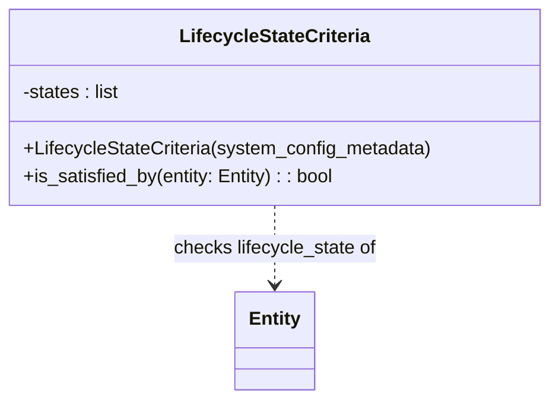

# Diagram: entity_core/entity_service/entity_service/entity/criteria/lifecycle_state.py

> Auto-generated by Obscura crawlers

## Mermaid

### SVG

<svg id="container" width="469.921875" xmlns="http://www.w3.org/2000/svg" class="classDiagram" height="342" viewBox="0 0 469.921875 342" role="graphics-document document" aria-roledescription="class"><g><defs><marker id="container_class-aggregationStart" class="marker aggregation class" refX="18" refY="7" markerWidth="190" markerHeight="240" orient="auto"><path d="M 18,7 L9,13 L1,7 L9,1 Z"></path></marker></defs><defs><marker id="container_class-aggregationEnd" class="marker aggregation class" refX="1" refY="7" markerWidth="20" markerHeight="28" orient="auto"><path d="M 18,7 L9,13 L1,7 L9,1 Z"></path></marker></defs><defs><marker id="container_class-extensionStart" class="marker extension class" refX="18" refY="7" markerWidth="190" markerHeight="240" orient="auto"><path d="M 1,7 L18,13 V 1 Z"></path></marker></defs><defs><marker id="container_class-extensionEnd" class="marker extension class" refX="1" refY="7" markerWidth="20" markerHeight="28" orient="auto"><path d="M 1,1 V 13 L18,7 Z"></path></marker></defs><defs><marker id="container_class-compositionStart" class="marker composition class" refX="18" refY="7" markerWidth="190" markerHeight="240" orient="auto"><path d="M 18,7 L9,13 L1,7 L9,1 Z"></path></marker></defs><defs><marker id="container_class-compositionEnd" class="marker composition class" refX="1" refY="7" markerWidth="20" markerHeight="28" orient="auto"><path d="M 18,7 L9,13 L1,7 L9,1 Z"></path></marker></defs><defs><marker id="container_class-dependencyStart" class="marker dependency class" refX="6" refY="7" markerWidth="190" markerHeight="240" orient="auto"><path d="M 5,7 L9,13 L1,7 L9,1 Z"></path></marker></defs><defs><marker id="container_class-dependencyEnd" class="marker dependency class" refX="13" refY="7" markerWidth="20" markerHeight="28" orient="auto"><path d="M 18,7 L9,13 L14,7 L9,1 Z"></path></marker></defs><defs><marker id="container_class-lollipopStart" class="marker lollipop class" refX="13" refY="7" markerWidth="190" markerHeight="240" orient="auto"><circle stroke="black" fill="transparent" cx="7" cy="7" r="6"></circle></marker></defs><defs><marker id="container_class-lollipopEnd" class="marker lollipop class" refX="1" refY="7" markerWidth="190" markerHeight="240" orient="auto"><circle stroke="black" fill="transparent" cx="7" cy="7" r="6"></circle></marker></defs><g class="root"><g class="clusters"></g><g class="edgePaths"><path d="M234.961,176L234.961,182.167C234.961,188.333,234.961,200.667,234.961,212C234.961,223.333,234.961,233.667,234.961,238.833L234.961,244" id="id_LifecycleStateCriteria_Entity_1" class="edge-thickness-normal edge-pattern-dashed relation" style=";;;" data-edge="true" data-et="edge" data-id="id_LifecycleStateCriteria_Entity_1" data-points="W3sieCI6MjM0Ljk2MDkzNzUsInkiOjE3Nn0seyJ4IjoyMzQuOTYwOTM3NSwieSI6MjEzfSx7IngiOjIzNC45NjA5Mzc1LCJ5IjoyNTB9XQ==" marker-end="url(#container_class-dependencyEnd)"></path></g><g class="edgeLabels"><g class="edgeLabel" transform="translate(234.9609375, 213)"><g class="label" data-id="id_LifecycleStateCriteria_Entity_1" transform="translate(-87.90625, -12)"><foreignObject width="175.8125" height="24">

checks lifecycle_state of

</foreignObject></g></g></g><g class="nodes"><g class="node default" id="classId-LifecycleStateCriteria-0" transform="translate(234.9609375, 92)"><g class="basic label-container"><path d="M-226.9609375 -84 L226.9609375 -84 L226.9609375 84 L-226.9609375 84" stroke="none" stroke-width="0" fill="#ECECFF" style=""></path><path d="M-226.9609375 -84 C-81.53199767955644 -84, 63.89694214088712 -84, 226.9609375 -84 M-226.9609375 -84 C-70.0399227239266 -84, 86.88109205214681 -84, 226.9609375 -84 M226.9609375 -84 C226.9609375 -44.26889654490343, 226.9609375 -4.537793089806854, 226.9609375 84 M226.9609375 -84 C226.9609375 -23.325595383313797, 226.9609375 37.34880923337241, 226.9609375 84 M226.9609375 84 C89.78278901570815 84, -47.395359468583706 84, -226.9609375 84 M226.9609375 84 C80.07054228447521 84, -66.81985293104958 84, -226.9609375 84 M-226.9609375 84 C-226.9609375 23.628452418519153, -226.9609375 -36.743095162961694, -226.9609375 -84 M-226.9609375 84 C-226.9609375 29.984059349305518, -226.9609375 -24.031881301388964, -226.9609375 -84" stroke="#9370DB" stroke-width="1.3" fill="none" stroke-dasharray="0 0" style=""></path></g><g class="annotation-group text" transform="translate(0, -60)"></g><g class="label-group text" transform="translate(-78.53125, -60)"><g class="label" style="font-weight: bolder" transform="translate(0,-12)"><foreignObject width="157.0625" height="24">

LifecycleStateCriteria

</foreignObject></g></g><g class="members-group text" transform="translate(-214.9609375, -12)"><g class="label" style="" transform="translate(0,-12)"><foreignObject width="84.796875" height="24">

-states : list

</foreignObject></g></g><g class="methods-group text" transform="translate(-214.9609375, 36)"><g class="label" style="" transform="translate(0,-12)"><foreignObject width="351.390625" height="24">

+LifecycleStateCriteria(system_config_metadata)

</foreignObject></g><g class="label" style="" transform="translate(0,12)"><foreignObject width="270.25" height="24">

+is_satisfied_by(entity: Entity) : : bool

</foreignObject></g></g><g class="divider" style=""><path d="M-226.9609375 -36 C-116.41175475143184 -36, -5.862572002863686 -36, 226.9609375 -36 M-226.9609375 -36 C-133.62959109342154 -36, -40.298244686843105 -36, 226.9609375 -36" stroke="#9370DB" stroke-width="1.3" fill="none" stroke-dasharray="0 0" style=""></path></g><g class="divider" style=""><path d="M-226.9609375 12 C-96.72190442561092 12, 33.51712864877817 12, 226.9609375 12 M-226.9609375 12 C-102.07466300153219 12, 22.811611496935626 12, 226.9609375 12" stroke="#9370DB" stroke-width="1.3" fill="none" stroke-dasharray="0 0" style=""></path></g></g><g class="node default" id="classId-Entity-1" transform="translate(234.9609375, 292)"><g class="basic label-container"><path d="M-33.28125 -42 L33.28125 -42 L33.28125 42 L-33.28125 42" stroke="none" stroke-width="0" fill="#ECECFF" style=""></path><path d="M-33.28125 -42 C-18.101882580449555 -42, -2.9225151608991062 -42, 33.28125 -42 M-33.28125 -42 C-14.457950956055338 -42, 4.365348087889323 -42, 33.28125 -42 M33.28125 -42 C33.28125 -21.68009798290075, 33.28125 -1.360195965801502, 33.28125 42 M33.28125 -42 C33.28125 -23.61947551357413, 33.28125 -5.238951027148261, 33.28125 42 M33.28125 42 C18.061765136402578 42, 2.8422802728051586 42, -33.28125 42 M33.28125 42 C17.526399056197988 42, 1.7715481123959762 42, -33.28125 42 M-33.28125 42 C-33.28125 20.855456726246953, -33.28125 -0.28908654750609486, -33.28125 -42 M-33.28125 42 C-33.28125 21.472143044223223, -33.28125 0.9442860884464466, -33.28125 -42" stroke="#9370DB" stroke-width="1.3" fill="none" stroke-dasharray="0 0" style=""></path></g><g class="annotation-group text" transform="translate(0, -18)"></g><g class="label-group text" transform="translate(-21.28125, -18)"><g class="label" style="font-weight: bolder" transform="translate(0,-12)"><foreignObject width="42.5625" height="24">

Entity

</foreignObject></g></g><g class="members-group text" transform="translate(-21.28125, 30)"></g><g class="methods-group text" transform="translate(-21.28125, 60)"></g><g class="divider" style=""><path d="M-33.28125 6 C-15.806331860743818 6, 1.6685862785123646 6, 33.28125 6 M-33.28125 6 C-18.920663498336943 6, -4.560076996673889 6, 33.28125 6" stroke="#9370DB" stroke-width="1.3" fill="none" stroke-dasharray="0 0" style=""></path></g><g class="divider" style=""><path d="M-33.28125 24 C-14.766284408491074 24, 3.748681183017851 24, 33.28125 24 M-33.28125 24 C-12.968953171001253 24, 7.343343657997494 24, 33.28125 24" stroke="#9370DB" stroke-width="1.3" fill="none" stroke-dasharray="0 0" style=""></path></g></g></g></g></g></svg>
